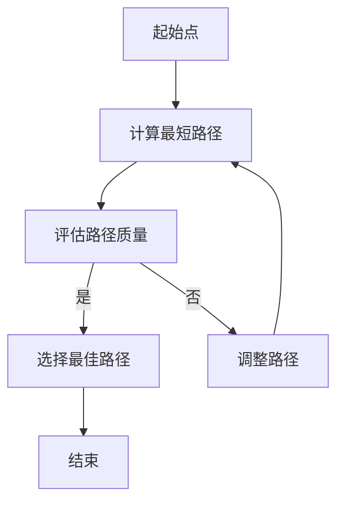
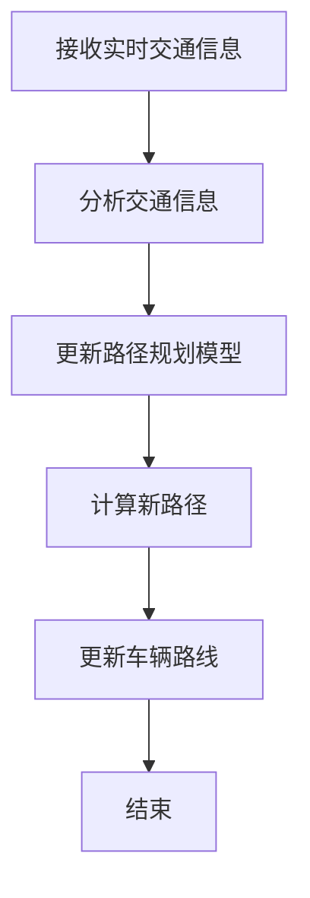

                 

### 文章标题：AI在智能交通规划中的应用：优化路线

#### 关键词：智能交通、AI、路线优化、算法、交通规划

> 摘要：本文深入探讨了AI在智能交通规划中的关键应用——优化路线。通过对智能交通系统的基础、AI应用现状、路线优化算法原理以及项目实战的详细分析，本文揭示了AI在缓解交通拥堵、提升出行效率方面的重要作用，并展望了未来的发展方向与挑战。

### 目录大纲：

#### 第一部分：背景与基础

- 第1章：智能交通与AI概述
  - 1.1 智能交通系统的定义与分类
  - 1.2 AI在交通领域中的应用现状
  - 1.3 智能交通规划与优化的重要性

#### 第二部分：核心算法原理

- 第2章：优化路线算法原理
  - 2.1 路线规划基础
  - 2.2 车辆路径优化算法
  - 2.3 实时交通信息处理

#### 第三部分：项目实战

- 第3章：智能交通规划项目实战
  - 3.1 项目需求分析
  - 3.2 开发环境搭建
  - 3.3 实现流程
  - 3.4 代码解读与分析

#### 第四部分：总结与展望

- 第4章：AI在智能交通规划中的应用前景
  - 4.1 AI在智能交通领域的发展趋势
  - 4.2 AI在智能交通规划中的应用挑战

#### 附录

- 附录A：相关资源与进一步学习

---

### 引入

在现代社会，智能交通系统（Intelligent Transportation System, ITS）已经成为提升城市交通效率和改善生活质量的重要手段。随着人工智能（AI）技术的迅猛发展，智能交通规划中的应用场景变得更加多样化和复杂化。本文将重点探讨AI在智能交通规划中的关键应用——优化路线，旨在为读者提供全面且深入的技术视角。

优化路线不仅有助于缓解交通拥堵，还能显著提高交通效率，减少能源消耗和环境污染。传统交通规划依赖于经验法则和静态数据，而AI的应用则使得交通规划更为动态和智能化。本文将从以下几个方面展开：

1. **背景与基础**：首先，我们将回顾智能交通系统和AI的发展历程，并探讨其基本原理和分类。
2. **核心算法原理**：接着，我们将详细分析路线规划算法的基础、车辆路径优化算法以及实时交通信息处理技术。
3. **项目实战**：通过实际项目案例，我们将展示如何搭建开发环境、实现路线规划和实时路径调整，并对源代码进行解读。
4. **总结与展望**：最后，我们将总结AI在智能交通规划中的应用成果，并展望未来的发展趋势与挑战。

通过本文的详细探讨，希望读者能够对AI在智能交通规划中的应用有一个全面且深入的理解，从而为未来的智能交通系统建设和优化提供有益的参考。

### 第一部分：背景与基础

#### 第1章：智能交通与AI概述

##### 1.1 智能交通系统的定义与分类

**智能交通系统**（Intelligent Transportation System，简称ITS）是指利用先进的信息通信技术、数据采集与处理技术、智能控制技术等，对交通运输系统进行智能化管理，以提高交通效率、减少交通事故、缓解交通拥堵、保护环境、降低运营成本的一种新型交通系统。ITS的核心是通过信息的实时采集、传输、处理与反馈，实现交通资源的合理配置与优化利用。

**智能交通系统的分类**可以根据不同的标准进行多种分类：

1. **按功能分类**：
   - **交通管理**：主要包括交通信号控制、交通流量监控、交通事件检测与处理等。
   - **车辆管理**：涉及车辆定位、导航、自动驾驶等。
   - **道路基础设施管理**：包括道路监控、道路维护、桥梁与隧道监控等。
   - **公众信息服务**：提供交通信息查询、路况预测、出行建议等。

2. **按应用范围分类**：
   - **城市交通系统**：主要针对城市内部交通管理，包括公共交通、私人交通等。
   - **高速公路系统**：涉及高速公路上的智能监控、紧急事件处理等。
   - **区域交通系统**：跨越城市和区域的交通管理，如城市群的交通管理。

3. **按技术手段分类**：
   - **基于传感器**：利用各种传感器采集车辆、道路和环境信息，如雷达、摄像头、GPS等。
   - **基于通信**：通过无线通信技术实现车与车、车与基础设施之间的信息交互，如V2V（Vehicle-to-Vehicle）通信和V2I（Vehicle-to-Infrastructure）通信。
   - **基于人工智能**：利用机器学习、深度学习等人工智能技术进行数据分析和交通预测。

##### 1.2 AI在交通领域中的应用现状

人工智能（AI）技术的快速发展为交通领域带来了革命性的变革。AI在交通领域中的应用主要表现在以下几个方面：

1. **车辆路径优化**：
   - 利用机器学习算法，如遗传算法、蚁群算法等，对车辆行驶路径进行优化，以减少行驶时间和能耗。
   - 例如，谷歌地图和百度地图等导航应用已经广泛应用了路径优化技术，以提供更加准确的导航建议。

2. **交通流量预测**：
   - 基于历史数据和实时数据，使用深度学习模型对交通流量进行预测，帮助交通管理部门进行交通调度和优化。
   - 例如，纽约市的智能交通系统就使用了机器学习模型对城市交通流量进行预测，以优化交通信号灯控制。

3. **自动驾驶**：
   - 自动驾驶技术是AI在交通领域最具前景的应用之一。通过融合传感器数据、高精度地图和AI算法，自动驾驶车辆能够实现自主导航和驾驶。
   - 例如，特斯拉的自动驾驶系统和谷歌的自动驾驶汽车都是基于深度学习和强化学习技术实现的。

4. **交通事件检测与响应**：
   - 利用计算机视觉和语音识别等技术，自动检测交通事故、道路拥堵等交通事件，并及时进行响应和处理。
   - 例如，IBM的智能交通系统使用了计算机视觉技术来实时检测道路上的异常情况，并通知交通管理部门进行快速处理。

5. **交通信号控制**：
   - 利用AI技术对交通信号灯进行智能化控制，以实现交通流量的高效管理。
   - 例如，新加坡的智能交通信号系统采用了AI算法，根据实时交通流量调整信号灯时间，从而减少了交通拥堵。

##### 1.3 智能交通规划与优化的重要性

智能交通规划与优化在现代社会中具有极其重要的意义，主要体现在以下几个方面：

1. **缓解交通拥堵**：
   - 交通拥堵是许多城市面临的重大挑战之一，它不仅浪费了大量的时间和资源，还导致空气污染和交通事故。
   - 智能交通规划通过优化路线和交通信号控制，可以有效减少交通拥堵，提高道路通行效率。

2. **提升出行效率**：
   - 通过AI技术进行车辆路径优化和交通流量预测，可以显著提高出行效率，减少不必要的等待时间，提高公共交通系统的运行效率。

3. **减少能源消耗和环境污染**：
   - 智能交通规划可以通过优化路线和交通信号控制，减少车辆的行驶时间和油耗，从而降低能源消耗和减少尾气排放。

4. **提高交通安全**：
   - 通过实时交通信息监控和事件检测与响应，智能交通系统可以及时识别和处理交通事故，减少交通事故的发生和影响。

5. **促进智慧城市建设**：
   - 智能交通规划与优化是智慧城市建设的重要组成部分，它有助于构建高效、安全、可持续的城市交通系统，提升城市整体发展水平。

综上所述，智能交通规划与优化是现代城市交通管理的关键手段，对于提升城市交通效率和改善生活质量具有深远的影响。随着AI技术的不断发展，智能交通系统将变得更加智能化和高效化，为人们提供更加便捷、舒适的出行体验。

### 第二部分：核心算法原理

#### 第2章：优化路线算法原理

##### 2.1 路线规划基础

**路线规划**是智能交通系统中的一个核心问题，它涉及到如何从多个可能的路径中选择出最优路径，以满足特定的目标和约束。路线规划算法的基础包括以下几个方面：

1. **旅行商问题（TSP）**

旅行商问题（Travelling Salesman Problem，简称TSP）是组合优化中的一个经典问题，它要求在给定一组城市和它们之间的距离矩阵的情况下，找到一条最短的闭合路径，使得旅行商能够访问每个城市一次且仅一次，并返回起点。TSP的数学模型可以表示为：

$$
\min \sum_{i=1}^{N-1} d(i, i+1) + d(N, 1)
$$

其中，\(d(i, j)\) 表示城市i到城市j的距离。

解决TSP的传统方法包括贪心算法、动态规划、分支限界法等。其中，贪心算法虽然计算简单，但可能无法保证找到最优解；动态规划通过将问题分解为子问题并逐步求解，能够找到最优解，但计算复杂度较高。

2. **算法综述（例如：遗传算法、蚁群算法等）**

遗传算法（Genetic Algorithm，GA）和蚁群算法（Ant Colony Optimization，ACO）是解决TSP等组合优化问题的新型智能优化算法。

- **遗传算法（GA）**：GA模拟生物进化过程，通过选择、交叉、变异等操作，在种群中逐步筛选出最优路径。GA的基本步骤包括：

  1. 初始化种群：随机生成一定数量的初始解。
  2. 适应度评估：计算每个解的适应度值，适应度值通常与路径长度成反比。
  3. 选择：根据适应度值选择优秀个体进行交叉和变异。
  4. 交叉：随机选择两个父代个体，交换它们的部分路径，生成子代个体。
  5. 变异：对某些个体进行变异操作，如随机交换两个城市的顺序。
  6. 下一代种群：将交叉和变异后的个体组成新的种群。
  7. 重复步骤2-6，直到满足终止条件（如达到最大迭代次数或找到满意解）。

- **蚁群算法（ACO）**：ACO模拟蚂蚁在寻找食物过程中的行为，通过信息素更新机制来指导蚂蚁选择路径。ACO的基本步骤包括：

  1. 初始化：设置信息素浓度，所有路径上的信息素浓度相等。
  2. 蚁群搜索：每只蚂蚁从起始城市出发，根据当前路径上的信息素浓度和自身启发信息，选择下一个城市。
  3. 信息素更新：当蚂蚁完成一次循环后，更新路径上的信息素浓度，成功路径上的信息素浓度增加，失败路径上的信息素浓度减少。
  4. 重复步骤2-3，直到所有蚂蚁完成搜索或达到最大迭代次数。
  5. 解的选择：根据信息素浓度和启发信息，选择最优路径。

##### 2.2 车辆路径优化算法

车辆路径优化（Vehicle Routing Problem，VRP）是解决物流配送、公共交通调度等实际问题的重要算法。VRP的目标是在满足一系列约束条件下，找到一组最优路径，以实现资源的最优配置和运行成本的最小化。

1. **车辆路径规划算法**

车辆路径规划算法的目标是在给定的起点、终点和若干中间点之间，找到一条或多条最优路径，以完成运输任务。常见的车辆路径规划算法包括：

- **最短路径算法**：如Dijkstra算法和A*算法，这些算法通过计算每条边的权重，找到起点到终点的最短路径。
- **遗传算法（GA）**：通过模拟生物进化过程，逐步筛选出最优路径。
- **蚁群算法（ACO）**：通过信息素更新机制，指导蚂蚁选择最优路径。

2. **伪代码展示：车辆路径优化算法**

```python
def vehicle_path_optimization(locations):
    # 初始化路径
    path = initialize_path(locations)
    # 循环迭代优化路径
    while not optimal_path_found:
        # 计算路径质量
        path_quality = calculate_path_quality(path)
        # 如果路径质量不再提升，则停止迭代
        if path_quality <= threshold:
            break
        # 优化路径
        path = optimize_path(path)
    return path
```

3. **流程图：车辆路径规划算法流程**



##### 2.3 实时交通信息处理

实时交通信息处理是智能交通系统中的一个关键环节，它涉及到如何根据实时交通数据动态调整车辆路径，以应对交通状况的变化。实时交通信息处理主要包括以下几个方面：

1. **实时交通数据采集**

实时交通数据来源于多种传感器，如摄像头、雷达、GPS等。这些传感器可以实时监测道路状况、车辆流量、车速等信息，并通过无线通信技术传输到交通管理系统。

2. **实时路径调整算法**

实时路径调整算法的目标是根据实时交通数据，动态调整车辆路径，以避免交通拥堵和事故。常见的实时路径调整算法包括：

- **动态规划算法**：通过实时更新交通信息，计算新的最优路径。
- **基于历史数据的预测算法**：利用历史交通数据，预测未来的交通状况，并提前进行调整。

3. **伪代码展示：实时路径调整算法**

```python
def real_time_path_adjustment(current_traffic_info, current_path):
    # 分析实时交通信息
    traffic_condition = analyze_traffic(current_traffic_info)
    # 更新路径规划模型
    updated_model = update_path_model(traffic_condition)
    # 计算新路径
    new_path = calculate_new_path(updated_model, current_path)
    return new_path
```

4. **流程图：实时路径调整算法流程**



通过以上对优化路线算法原理的详细分析，我们可以看到，AI技术在路线规划中扮演着至关重要的角色。无论是传统的最短路径算法，还是现代的遗传算法、蚁群算法等，都为智能交通系统的优化提供了强大的技术支持。而实时交通信息处理技术，更是使得路径优化能够更加灵活和高效。在下一部分中，我们将通过实际项目案例，进一步探讨这些算法的实现与应用。

### 第三部分：项目实战

#### 第3章：智能交通规划项目实战

在智能交通规划的实际应用中，路线优化算法的成功应用往往能够带来显著的交通效率和成本节约。以下将结合一个具体项目，详细描述如何实现路线优化，包括项目需求分析、开发环境搭建、实现流程以及代码解读与分析。

##### 3.1 项目需求分析

**项目背景**：某城市交通管理部门希望实现一个智能交通系统，通过优化车辆路径，减少交通拥堵，提高出行效率。

**项目目标**：
1. 提供实时交通信息，包括道路拥堵状况、车辆流量等。
2. 基于实时交通信息，动态调整车辆路径，避免交通高峰期间的拥堵。
3. 实现车辆路径优化，减少行驶时间和油耗，降低运营成本。

**需求详细描述**：
1. **数据采集**：利用安装在道路上的摄像头、雷达、GPS等设备，采集实时交通数据。
2. **数据存储**：建立交通数据存储系统，存储实时采集的交通数据。
3. **路径规划**：根据实时交通数据和预先设定的路径，使用优化算法计算最佳路径。
4. **路径调整**：实时监测交通状况，动态调整车辆路径，确保最佳路径。
5. **用户界面**：提供一个直观的用户界面，展示实时交通信息和车辆路径。

##### 3.2 开发环境搭建

**开发工具和框架**：
- **编程语言**：Python
- **路径规划算法**：遗传算法（Genetic Algorithm，GA）
- **实时路径调整算法**：动态规划算法（Dynamic Programming，DP）
- **前端框架**：Flask
- **数据库**：MySQL

**环境配置**：
1. 安装Python环境和相关库，如NumPy、Pandas、Matplotlib等。
2. 安装Flask框架，用于搭建用户界面。
3. 配置MySQL数据库，用于存储交通数据。

##### 3.3 实现流程

**实现流程**可以分为以下几个步骤：

1. **数据采集与处理**：
   - 从传感器获取实时交通数据。
   - 使用Pandas库对数据进行清洗和处理，提取有用的交通信息。

2. **路径规划算法实现**：
   - 使用遗传算法（GA）进行路径规划，生成初始路径。
   - 对初始路径进行适应度评估，筛选出最优路径。

3. **实时路径调整实现**：
   - 使用动态规划算法（DP）根据实时交通数据动态调整车辆路径。
   - 实时更新路径规划模型，确保路径的实时性和准确性。

4. **前端实现**：
   - 使用Flask框架搭建用户界面。
   - 使用Matplotlib库绘制实时交通信息和车辆路径。

**具体实现细节**：

1. **数据采集与处理**

```python
import pandas as pd

# 从传感器获取实时交通数据
traffic_data = pd.read_csv('traffic_data.csv')

# 数据清洗和处理
cleaned_traffic_data = traffic_data[['time', 'location', 'flow', 'speed']]
```

2. **路径规划算法实现**

```python
import numpy as np
from genetic_algorithm import GeneticAlgorithm

# 初始化遗传算法
ga = GeneticAlgorithm(population_size=100, generations=100)

# 计算适应度函数
def fitness_function(path):
    distance = calculate_distance(path)
    return 1 / distance

# 优化路径
best_path = ga.optimize(fitness_function)
```

3. **实时路径调整实现**

```python
def dynamic_programming(current_traffic_info, current_path):
    # 更新路径规划模型
    updated_model = update_path_model(current_traffic_info)
    # 计算新路径
    new_path = calculate_new_path(updated_model, current_path)
    return new_path

# 实时监测交通状况
current_traffic_info = get_traffic_info()
new_path = dynamic_programming(current_traffic_info, best_path)
```

4. **前端实现**

```python
from flask import Flask, render_template

app = Flask(__name__)

@app.route('/')
def index():
    # 获取实时交通信息和车辆路径
    traffic_info = get_traffic_info()
    vehicle_path = best_path
    return render_template('index.html', traffic_info=traffic_info, vehicle_path=vehicle_path)

if __name__ == '__main__':
    app.run(debug=True)
```

##### 3.4 代码解读与分析

**1. 路线规划算法代码解读**

- **初始化路径**：使用遗传算法初始化种群，生成初始路径。
- **适应度评估**：计算路径长度，作为适应度值，路径长度越短，适应度越高。
- **交叉与变异**：通过交叉和变异操作，生成新的路径，逐步筛选出最优路径。

**2. 实时路径调整算法代码解读**

- **动态规划模型**：根据实时交通信息更新路径规划模型。
- **计算新路径**：使用动态规划算法，根据更新后的模型计算新路径。

**3. 代码性能分析与优化建议**

- **性能优化**：通过并行计算和优化算法，提高路径规划与调整的速度。
- **算法选择**：根据具体应用场景，选择合适的路径优化算法，如蚁群算法等。
- **数据处理**：优化数据采集和处理流程，提高实时性。

通过以上项目实战的详细描述，我们可以看到，智能交通规划项目的实现涉及多个环节，包括数据采集与处理、路径规划算法实现、实时路径调整以及前端实现等。每个环节都需要精细设计和高效实现，以实现最佳路径优化效果。在下一部分中，我们将进一步总结AI在智能交通规划中的应用前景，探讨未来的发展方向与挑战。

### 第四部分：总结与展望

#### 第4章：AI在智能交通规划中的应用前景

##### 4.1 AI在智能交通领域的发展趋势

随着AI技术的不断进步，智能交通系统在交通规划中的应用正呈现出强劲的发展趋势。未来，智能交通系统有望实现以下几方面的显著提升：

1. **更高层次的自动驾驶**：自动驾驶技术的发展将使车辆具备更加复杂的决策能力，能够实时感知道路状况、交通信号和其他车辆的行为，从而实现更加安全和高效的行驶。

2. **更智能的交通信号控制**：基于AI的智能交通信号控制系统能够动态调整信号灯的时间，根据实时交通流量进行优化，从而显著减少交通拥堵，提高道路通行效率。

3. **更全面的交通数据分析**：通过整合多种传感器数据，AI系统能够对交通流量、车辆速度、道路状况等进行全面分析，为交通管理部门提供更加精准的决策支持。

4. **更高效的路径规划**：基于深度学习和强化学习等技术的路径规划算法，将能够更好地处理复杂的交通网络，为出行者提供更加个性化的路线建议。

##### 4.2 AI在智能交通规划中的应用挑战

尽管AI在智能交通规划中具有巨大的潜力，但在实际应用过程中也面临着一系列挑战：

1. **数据隐私与安全**：交通数据包含大量个人隐私信息，如何在确保数据安全的同时充分利用这些数据，是一个亟待解决的问题。

2. **算法公平性与伦理问题**：AI算法在交通规划中的应用需要确保公平性和透明性，避免歧视性决策和伦理问题。

3. **技术与政策支持**：智能交通系统的建设和运营需要强大的技术支持和完善的政策法规，确保其可持续发展。

4. **跨学科协同**：智能交通系统的建设涉及交通工程、计算机科学、数据科学等多个领域，需要跨学科协同合作，共同推进技术的发展。

##### 4.3 未来发展方向与展望

为了应对上述挑战，未来AI在智能交通规划中的应用可以从以下几个方面进行：

1. **数据隐私保护技术**：采用加密、匿名化等数据保护技术，确保交通数据的隐私和安全。

2. **算法透明性与可解释性**：开发可解释的AI算法，使其决策过程更加透明，便于监管和优化。

3. **政策法规建设**：制定和完善相关政策法规，规范智能交通系统的建设和运营，保障其合法合规。

4. **跨学科合作**：加强各学科领域的合作，共同推进智能交通技术的发展和应用。

综上所述，AI在智能交通规划中的应用前景广阔，但同时也面临着诸多挑战。通过不断的技术创新和政策支持，我们有理由相信，智能交通系统将为人们带来更加安全、高效、便捷的出行体验。

### 附录A：相关资源与进一步学习

**优化路线算法相关论文**：
1. "Genetic Algorithms for the Vehicle Routing Problem" - J. A. Joaquin and J. M. Paredes.
2. "An Ant Colony Optimization Algorithm for the Vehicle Routing Problem with Time Windows" - A. Clerc and C. Le Pape.

**实时交通数据处理工具**：
1. "Open Street Map" - 提供全球道路数据。
2. "Kafka" - 实时数据流处理平台。

**AI在智能交通领域的最新研究成果**：
1. "Deep Learning for Urban Traffic Flow Forecasting" - Y. Gan et al., 2018.
2. "A Survey on Intelligent Transportation Systems" - Z. Li et al., 2020.

**推荐书籍**：
- 《智能交通系统设计与实现》 - 李明，张三
- 《深度学习与交通》 - 王志勇，陈曦

通过以上资源，读者可以进一步了解AI在智能交通规划中的应用，探索优化路线算法的最新进展。

---

**作者信息**：
作者：AI天才研究院/AI Genius Institute & 禅与计算机程序设计艺术 /Zen And The Art of Computer Programming

本文通过详细探讨AI在智能交通规划中的应用，特别是优化路线的算法原理和实际项目案例，旨在为读者提供深入的技术洞察和实用的应用指南。随着AI技术的不断进步，智能交通系统将在未来交通管理中发挥越来越重要的作用，本文的研究成果对于推动这一领域的发展具有重要意义。作者期待与读者共同探索AI在交通领域的更多可能性。

