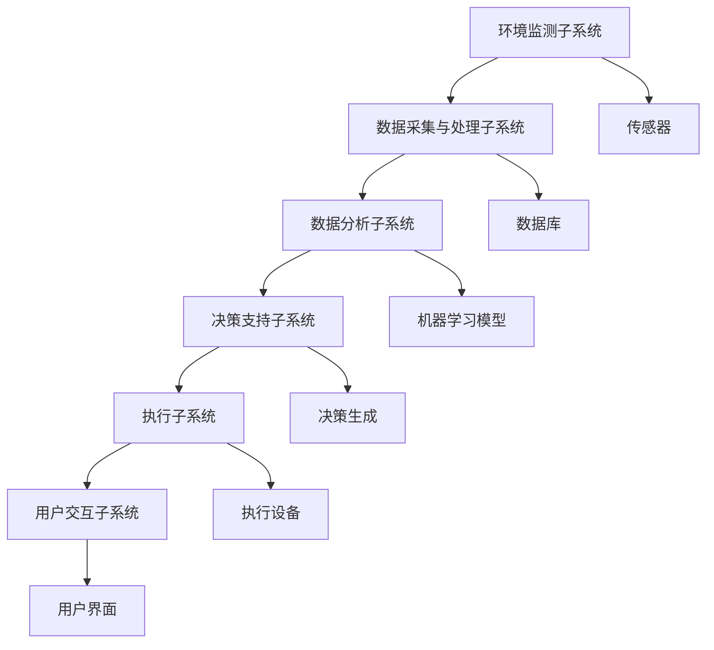
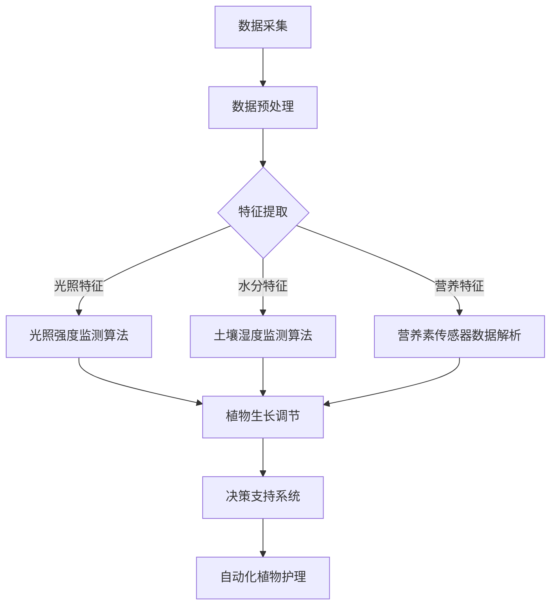

                 

### 文章标题

《AI在智能园艺中的应用：自动化植物护理》

随着人工智能（AI）技术的飞速发展，各行各业都在积极探索AI技术的应用，智能园艺作为农业领域的重要创新方向，正迎来前所未有的发展机遇。本文将深入探讨AI在智能园艺中的应用，特别是自动化植物护理领域的具体实践。我们将从智能园艺的概述出发，逐步剖析AI在光照监测、水分监测、病虫害检测、营养与肥料管理以及温室环境控制等方面的应用原理，并通过实际项目案例展示AI在智能园艺中的实际效果。本文旨在为读者提供一个全面、系统的AI在智能园艺中的技术应用指南，帮助读者理解这一新兴领域的无限潜力。

### 文章关键词

- 智能园艺
- 人工智能
- 自动化植物护理
- 光照监测
- 水分监测
- 病虫害检测
- 肥料管理
- 温室环境控制

### 文章摘要

本文系统探讨了人工智能在智能园艺中的应用，特别是自动化植物护理领域的具体实践。文章首先介绍了智能园艺的概念及其重要性，回顾了智能园艺的发展历程和AI在其中的应用前景。接着，本文详细分析了机器学习、计算机视觉和传感器技术在智能园艺中的基础作用。随后，文章重点讨论了AI在植物生长监测、病虫害检测与防治、营养与肥料管理以及温室环境控制等方面的应用，通过具体算法和实际项目案例，展示了AI技术在实际智能园艺系统中的效果。本文旨在为读者提供一个全面、系统的智能园艺AI应用指南，探讨其未来发展方向和潜力。

### 《AI在智能园艺中的应用：自动化植物护理》目录大纲

#### 第一部分：智能园艺与AI概述

##### 第1章：智能园艺的崛起

###### 1.1 智能园艺的概念与重要性

###### 1.2 智能园艺的发展历程

###### 1.3 AI在智能园艺中的应用前景

##### 第2章：AI基础与智能园艺

###### 2.1 机器学习与深度学习简介

###### 2.2 计算机视觉在智能园艺中的应用

###### 2.3 传感器技术在智能园艺中的作用

#### 第二部分：自动化植物护理中的AI应用

##### 第3章：植物生长监测

###### 3.1 光照监测与植物生长关系的分析

###### 3.1.1 光照强度监测算法

###### 3.1.2 光周期监测与植物生长调节

###### 3.2 水分监测与植物需水分析

###### 3.2.1 土壤水分传感器的工作原理

###### 3.2.2 植物水分需求模型建立

##### 第4章：病虫害检测与防治

###### 4.1 病害识别与诊断

###### 4.1.1 病害图像处理算法

###### 4.1.2 病害诊断模型建立

###### 4.2 虫害监测与防治

###### 4.2.1 虫害识别算法

###### 4.2.2 虫害防治策略设计

##### 第5章：营养与肥料管理

###### 5.1 植物营养需求与肥料效率分析

###### 5.1.1 植物营养素传感器应用

###### 5.1.2 肥料优化模型构建

##### 第6章：温室环境控制

###### 6.1 温室环境监测系统

###### 6.1.1 温度、湿度和二氧化碳监测

###### 6.1.2 环境参数调控策略

###### 6.2 智能温室系统设计

###### 6.2.1 智能温室架构

###### 6.2.2 系统集成与调试

##### 第7章：AI在智能园艺中的综合应用

###### 7.1 智能园艺系统总体架构设计

###### 7.1.1 数据采集与处理

###### 7.1.2 决策支持系统开发

###### 7.2 智能园艺项目实战案例

###### 7.2.1 项目背景与目标

###### 7.2.2 项目实施与效果评估

##### 附录：资源与工具

###### 附录A：智能园艺相关资源

###### 附录B：代码与数据集

### 第一部分：智能园艺与AI概述

#### 第1章：智能园艺的崛起

##### 1.1 智能园艺的概念与重要性

**智能园艺**，顾名思义，是运用人工智能（AI）技术，实现园艺生产过程的智能化管理。在传统园艺中，许多环节如播种、施肥、灌溉、病虫害防治等都是人工操作，不仅劳动强度大，而且受限于人力和经验，难以实现高效和精准的管理。而智能园艺通过集成传感器、机器学习、计算机视觉等技术，可以实现园艺环境的自动监控与调节，提高生产效率和产品质量，减少资源浪费，是现代农业发展的重要方向。

智能园艺的重要性体现在以下几个方面：

1. **提高生产效率**：通过自动化技术，智能园艺可以实时监测植物生长状态，自动调节环境参数，使植物在最佳条件下生长，显著提高产量和品质。
   
2. **节约资源**：智能园艺系统能够根据植物的实际需求，精确控制水分、光照、营养等资源，减少浪费，降低生产成本。

3. **减少人力投入**：智能园艺减少了人力劳动，不仅降低了劳动力成本，还提高了工作环境的安全性。

4. **环境监测与预警**：智能园艺系统能够监测环境参数，如温度、湿度、土壤质量等，提前发现潜在问题，及时采取措施，避免灾害发生。

5. **数据积累与知识共享**：智能园艺系统能够收集大量数据，通过数据分析可以积累园艺生产的经验知识，实现知识的共享和传承。

##### 1.2 智能园艺的发展历程

智能园艺的发展历程可以分为以下几个阶段：

1. **初步阶段**（20世纪60年代至80年代）：在这个阶段，园艺生产主要依赖于自动化机械，如自动灌溉系统和喷药机器人。这些设备虽然初步实现了自动化，但缺乏智能化的决策支持系统。

2. **初步智能化阶段**（20世纪80年代至90年代）：随着计算机技术的发展，智能园艺开始引入传感器和初步的机器学习算法，实现了对环境参数的实时监测和调节。

3. **成熟阶段**（21世纪以来）：随着AI技术的迅猛发展，深度学习、计算机视觉等技术的应用，使智能园艺进入了一个全新的阶段。现在的智能园艺系统可以实现高度自动化和智能化，不仅能够实时监测植物生长状态，还能够根据监测结果自动调整环境参数，实现精准管理。

##### 1.3 AI在智能园艺中的应用前景

AI技术在智能园艺中的应用前景十分广阔，主要体现在以下几个方面：

1. **精准农业**：AI技术可以帮助农民精确了解土地的土壤质量、水分含量等信息，根据这些数据制定科学的种植计划，实现精准农业。

2. **病虫害防治**：利用计算机视觉和机器学习技术，智能园艺系统能够快速准确地识别和诊断病虫害，提供针对性的防治措施，减少农药使用量，保护生态环境。

3. **智能温室管理**：通过AI技术，智能温室可以实现自动化环境控制，根据植物的生长需求自动调节温度、湿度、光照等参数，提高温室农作物的产量和质量。

4. **数据分析和预测**：AI技术可以分析大量的园艺生产数据，发现规律和趋势，为农民提供科学的种植建议和预测未来市场变化。

5. **智能化设备与系统**：随着AI技术的不断进步，智能园艺设备将变得更加智能和高效，未来可能会有更多智能化的园艺设备和服务系统出现。

总之，AI技术在智能园艺中的应用不仅能够提高生产效率和质量，还能够为农民带来更多的便利和收益。随着技术的不断成熟和推广，智能园艺必将在现代农业中发挥越来越重要的作用。

#### 第2章：AI基础与智能园艺

##### 2.1 机器学习与深度学习简介

**机器学习（Machine Learning，ML）** 是一种让计算机从数据中学习并做出决策或预测的技术。其基本思想是通过构建数学模型，从大量的历史数据中自动提取规律，以便对新数据进行分类、预测或决策。机器学习的方法可以分为监督学习（Supervised Learning）、无监督学习（Unsupervised Learning）和强化学习（Reinforcement Learning）三种。

- **监督学习**：在这种学习中，模型通过标记的数据进行训练，然后利用这些学到的规律对新的数据进行预测。常见的监督学习方法包括线性回归、逻辑回归、支持向量机（SVM）等。
- **无监督学习**：与监督学习相反，无监督学习不需要标记的数据，其目标是发现数据中的内在结构和规律。常见的方法有聚类分析、主成分分析（PCA）等。
- **强化学习**：强化学习是使代理通过与环境交互，从奖励信号中学习最优策略。常见的强化学习方法包括Q学习、深度Q网络（DQN）等。

**深度学习（Deep Learning，DL）** 是机器学习的一个子领域，主要依赖于深层神经网络（Deep Neural Networks，DNN）来实现复杂的模型。深度学习通过多层的神经网络结构，能够自动提取数据中的层次特征，从而实现高度非线性问题的建模。

深度学习的核心组成部分包括：

- **神经网络（Neural Networks）**：神经网络是模仿生物神经系统的计算模型，通过加权连接的节点（或神经元）实现数据的处理和变换。
- **卷积神经网络（Convolutional Neural Networks，CNN）**：CNN特别适用于图像处理，通过卷积层、池化层和全连接层等结构，能够有效地提取图像中的特征。
- **循环神经网络（Recurrent Neural Networks，RNN）**：RNN适用于处理序列数据，如时间序列、语音、文本等，通过循环连接，RNN能够记忆历史信息。
- **生成对抗网络（Generative Adversarial Networks，GAN）**：GAN由生成器和判别器两个神经网络组成，生成器生成数据，判别器判断数据的真实性，通过两个网络的对抗训练，GAN能够生成高质量的数据。

##### 2.2 计算机视觉在智能园艺中的应用

**计算机视觉（Computer Vision，CV）** 是人工智能的一个重要分支，致力于使计算机能够从图像和视频中提取有用的信息。在智能园艺中，计算机视觉技术被广泛应用于植物状态监测、病虫害识别、环境参数测量等方面。

1. **植物状态监测**：利用计算机视觉技术，可以实时监测植物的生长状态，例如叶片的颜色、形态等。通过图像处理和模式识别算法，可以分析植物的健康状况，及时发现异常情况。

2. **病虫害识别**：计算机视觉系统可以通过图像识别技术，快速准确地区分不同类型的病虫害。例如，通过训练卷积神经网络模型，可以实现对病斑、虫害等病害的自动识别和分类，为病虫害防治提供科学依据。

3. **环境参数测量**：计算机视觉还可以用于测量环境参数，如温度、湿度、光照强度等。通过结合图像处理技术和传感器数据，可以实现对温室环境的精确监控和调节。

##### 2.3 传感器技术在智能园艺中的作用

**传感器技术** 是智能园艺系统的核心组成部分，通过各类传感器实时监测园艺环境中的各种参数，为智能决策提供数据支持。以下是几种常用的传感器及其在智能园艺中的应用：

1. **温度传感器**：用于测量温室中的温度，确保植物生长环境的适宜性。通过实时监测温度变化，智能系统可以自动调节通风和加热设备，保持恒温环境。

2. **湿度传感器**：用于测量空气中的湿度，对植物的水分需求进行监控。湿度传感器可以与灌溉系统联动，根据土壤湿度自动调整灌溉量，实现精准灌溉。

3. **光照传感器**：用于监测光照强度，根据植物的光照需求自动调节遮阳帘和补光灯。光照传感器可以确保植物在最佳光照条件下生长，提高产量和品质。

4. **土壤传感器**：用于测量土壤的酸碱度、水分含量和营养素浓度等参数。通过这些数据，智能系统可以制定科学的施肥计划，提高肥料利用效率。

5. **二氧化碳传感器**：用于监测温室中的二氧化碳浓度，对植物的光合作用进行监控。通过控制通风设备，智能系统可以维持适宜的二氧化碳浓度，促进植物生长。

综上所述，机器学习与深度学习、计算机视觉和传感器技术是智能园艺系统中的三大关键技术。它们相互配合，共同实现园艺生产的自动化和智能化，为现代农业带来了新的发展机遇。

#### 第3章：植物生长监测

##### 3.1 光照监测与植物生长关系的分析

光照是植物生长的关键因素之一，对植物的光合作用、生长发育和产量形成具有重要影响。在智能园艺中，准确监测光照强度和光周期，并根据植物需求进行智能调节，是实现高效、精准园艺管理的重要手段。

**光照监测的重要性**：

1. **促进光合作用**：光照是植物进行光合作用的驱动力，充足的光照可以促进植物光合作用效率，从而提高产量。
2. **影响生长发育**：不同植物对光照的需求不同，光照强度的变化会影响植物的生长形态和发育进程。
3. **调节开花和结果**：光照周期对植物的开花和结果有重要影响，通过监测和调节光照，可以优化植物的生长周期和果实成熟期。

**光照强度监测算法**：

光照强度监测通常通过传感器（如光强传感器、光谱传感器）进行。以下是一种简单但有效的光照强度监测算法：

1. **数据采集**：使用光强传感器实时采集环境中的光照强度数据。
2. **预处理**：对采集的数据进行滤波和去噪处理，以消除环境噪声的影响。
3. **特征提取**：提取光照强度的特征，如平均值、标准差、最大值和最小值等。
4. **光照评估**：利用统计方法或机器学习方法（如线性回归、支持向量机等），将特征数据与植物生长状态进行关联，评估光照强度对植物的影响。

**光周期监测与植物生长调节**：

光周期是指植物在一天中接受光照的时间长度。不同植物对光周期的需求不同，通过监测光周期，可以实现植物生长的智能调节。

1. **光周期监测**：使用光周期传感器（如光电传感器）监测植物接受光照的时间长度。
2. **光周期分析**：根据植物的生长需求和光周期传感器数据，分析植物的光周期适应性。
3. **智能调节**：通过智能控制系统，根据光周期分析结果，自动调节光照时间、光照强度和遮阳设备，满足植物的生长需求。

**案例分析**：

以温室种植草莓为例，草莓对光照有较高的需求，特别是在开花和结果期。通过光照监测系统，可以实时监测温室内的光照强度和光周期，当光照强度不足时，智能系统会自动开启补光灯，确保植物获得充足的光照。

1. **数据采集**：使用光强传感器和光电传感器，实时采集温室内的光照强度和光周期数据。
2. **预处理与特征提取**：对传感器数据进行预处理，提取光照强度的特征数据。
3. **光照评估与调节**：根据光照特征数据，评估光照强度是否满足草莓的生长需求，若不足，智能系统会自动开启补光灯。
4. **光周期监测与调节**：监测草莓的光周期需求，根据生长阶段自动调整光照时间，确保草莓在最佳光周期下生长。

通过上述方法，智能园艺系统能够实现对植物生长光照的精准监测和智能调节，提高植物生长效率和产量，为现代农业提供有力支持。

##### 3.2 水分监测与植物需水分析

水分是植物生长的另一个关键因素，直接影响植物的生长发育、光合作用和水分运输。在智能园艺中，通过精确监测土壤水分含量，并根据植物的需求进行智能灌溉，是实现高效园艺管理的重要手段。

**土壤水分传感器的工作原理**：

土壤水分传感器通过测量土壤的电导率、电容或电阻等物理参数来确定土壤的水分含量。常见的水分传感器包括电容式传感器、电阻式传感器和频率响应传感器等。

- **电容式传感器**：电容式传感器通过测量两个电极之间的电容变化来确定土壤的水分含量。土壤中水分的增加会导致电容增加，因此可以通过电容的变化来反映土壤的水分含量。
- **电阻式传感器**：电阻式传感器通过测量土壤的电阻变化来确定土壤的水分含量。土壤中水分的增加会降低土壤的电阻，因此电阻的变化可以用来判断土壤的水分状态。
- **频率响应传感器**：频率响应传感器通过测量电磁波在土壤中传播速度的变化来确定土壤的水分含量。水分含量的变化会影响电磁波的传播速度，从而影响传感器的输出频率。

**植物水分需求模型建立**：

为了实现智能灌溉，需要建立植物水分需求模型，该模型可以根据植物的生长状态、土壤水分含量以及环境条件预测植物的水分需求。

1. **数据采集**：收集土壤水分传感器数据、植物生长数据（如叶片展开度、光合作用速率等）和环境参数（如温度、湿度等）。
2. **特征提取**：提取与植物水分需求相关的特征，如土壤水分含量、植物生长指标和环境参数。
3. **模型训练**：使用机器学习算法（如线性回归、支持向量机、神经网络等）对特征数据进行训练，建立植物水分需求模型。
4. **模型评估与优化**：通过交叉验证等方法评估模型性能，对模型进行优化，提高预测精度。

**智能灌溉策略设计**：

根据植物水分需求模型，可以设计智能灌溉策略，实现对植物水分需求的精准控制。

1. **实时监测**：通过土壤水分传感器实时监测土壤水分含量。
2. **需求预测**：利用植物水分需求模型预测植物未来的水分需求。
3. **智能控制**：根据土壤水分监测结果和预测的水分需求，自动调节灌溉系统的灌溉量、时间和频率。
4. **反馈调整**：在灌溉过程中，根据植物的响应和土壤水分变化，动态调整灌溉策略，确保植物获得最佳的水分条件。

**案例分析**：

以温室种植生菜为例，生菜对水分的需求较为敏感，通过智能灌溉系统，可以实现对生菜水分需求的精准管理。

1. **数据采集**：使用土壤水分传感器、植物生长传感器和气象传感器，实时采集土壤水分、植物生长状态和环境参数数据。
2. **模型训练**：根据采集的数据，使用机器学习算法训练植物水分需求模型，预测生菜的水分需求。
3. **智能灌溉**：当土壤水分含量低于设定的阈值时，智能灌溉系统会自动启动，根据模型预测的生菜水分需求，调节灌溉量和灌溉频率。
4. **反馈调整**：在灌溉过程中，持续监测土壤水分和植物生长状态，根据反馈信息动态调整灌溉策略，确保生菜获得最佳的水分条件。

通过上述方法，智能园艺系统能够实现对植物水分需求的精确监测和智能灌溉，提高水资源的利用效率，促进植物的健康生长，为现代农业的可持续发展提供技术支持。

### 第4章：病虫害检测与防治

病虫害是影响植物生长和产量的重要因素，及时有效的检测和防治是确保作物健康生长的关键。AI技术在病虫害检测与防治中的应用，通过计算机视觉和机器学习等技术的结合，实现了快速、准确的病虫害识别和智能防治策略设计，大大提高了防治效果和效率。

#### 4.1 病害识别与诊断

**病害图像处理算法**

病害识别是智能园艺中的关键环节之一，通过图像处理技术，可以实现对病害类型的自动识别和分类。以下是一种常见的病害图像处理算法流程：

1. **图像预处理**：对采集的病害图像进行预处理，包括去噪、对比度增强、图像裁剪等，以减少图像噪声和提高图像质量。
2. **特征提取**：使用图像处理算法提取病害图像的特征，如颜色特征、纹理特征、形状特征等。常用的特征提取方法包括HOG（直方图方向梯度）、SIFT（尺度不变特征变换）、SURF（加速稳健特征）等。
3. **特征匹配**：将提取的特征与病害数据库中的特征进行匹配，通过相似度计算确定病害的类型。
4. **分类与诊断**：利用分类算法（如SVM、KNN、决策树等）对匹配结果进行分类，实现对病害的识别和诊断。

**病害诊断模型建立**

在病害识别过程中，建立准确的病害诊断模型是关键。以下是一种基于机器学习的病害诊断模型建立方法：

1. **数据集准备**：收集大量的病害图像数据，并对数据进行标注，标记出每种病害的类型。
2. **模型选择**：根据病害特征和分类任务，选择合适的机器学习模型，如卷积神经网络（CNN）、长短期记忆网络（LSTM）等。
3. **模型训练**：使用标注数据对选定的模型进行训练，通过调整模型的参数和结构，优化模型性能。
4. **模型评估**：使用交叉验证等方法评估模型的性能，包括准确率、召回率、F1分数等指标，根据评估结果调整模型参数。

**案例分析**

以番茄晚疫病检测为例，通过构建基于CNN的病害识别模型，实现了对番茄晚疫病的自动识别和诊断。

1. **数据集准备**：收集大量番茄晚疫病图像，并对图像进行标注，包括病变部位和病变程度。
2. **模型训练**：使用卷积神经网络（CNN）对标注数据进行训练，通过调整网络的层数、滤波器大小等参数，优化模型性能。
3. **模型评估**：使用测试数据集对模型进行评估，计算模型的准确率、召回率等指标，根据评估结果进行调整和优化。
4. **病害诊断**：在园艺生产过程中，利用训练好的模型对现场拍摄的番茄图像进行病害检测，实时诊断番茄晚疫病的发生情况，为防治提供依据。

通过上述方法，智能园艺系统能够实现对病害的快速识别和准确诊断，为园艺生产提供科学依据和防治方案。

#### 4.2 虫害监测与防治

**虫害识别算法**

虫害监测是智能园艺系统中的重要组成部分，通过计算机视觉技术，可以实现虫害的自动识别。以下是一种常用的虫害识别算法：

1. **图像预处理**：对采集的虫害图像进行预处理，包括去噪、对比度增强、图像裁剪等，以提高图像质量。
2. **特征提取**：使用图像处理算法提取虫害图像的特征，如颜色特征、纹理特征、形状特征等。
3. **虫害分类**：将提取的特征与虫害数据库中的特征进行匹配，通过相似度计算确定虫害的类型。
4. **实时监测**：利用虫害识别算法对现场拍摄的图像进行实时处理，实现虫害的自动识别和报警。

**虫害防治策略设计**

虫害防治策略的设计需要综合考虑虫害的种类、发生时间和防治手段等因素。以下是一种基于机器学习的虫害防治策略设计方法：

1. **数据集准备**：收集虫害发生的数据，包括虫害类型、发生时间、防治手段等，并对数据进行标注。
2. **模型训练**：使用标注数据训练机器学习模型，通过调整模型参数和结构，优化防治策略。
3. **防治效果评估**：根据防治策略的实施效果，评估模型的性能，包括防治成功率、防治成本等指标。
4. **动态调整**：根据防治效果评估结果，动态调整防治策略，以实现最佳的防治效果。

**案例分析**

以黄瓜霜霉病防治为例，通过构建基于机器学习的虫害防治模型，实现了对黄瓜霜霉病的智能监测和防治。

1. **数据集准备**：收集黄瓜霜霉病发生的数据，包括病斑图像、发生时间和防治手段等，并对数据进行标注。
2. **模型训练**：使用标注数据训练机器学习模型，通过调整模型的参数和结构，优化防治策略。
3. **防治效果评估**：在田间试验中，根据防治策略的实施效果，评估模型的性能，包括防治成功率、防治成本等指标。
4. **智能防治**：在园艺生产过程中，利用训练好的模型对黄瓜植株进行监测，一旦发现霜霉病病斑，智能系统会自动启动防治措施，如喷洒农药、调整灌溉等，实现精准防治。

通过上述方法，智能园艺系统能够实现对虫害的自动监测和智能防治，提高防治效率和效果，减少农药使用量，保护环境。

总之，通过病虫害检测与防治，智能园艺系统能够实时监测作物生长环境，准确识别和诊断病虫害，设计并实施智能防治策略，为园艺生产提供科学依据和技术支持，促进现代农业的可持续发展。

#### 第5章：营养与肥料管理

植物营养是确保作物健康生长、提高产量和品质的关键因素。在智能园艺中，通过AI技术，可以实现植物营养需求的精准监测和肥料管理的智能化，从而提高肥料利用效率，减少资源浪费，降低生产成本。

**植物营养需求与肥料效率分析**

植物营养需求分析是营养与肥料管理的基础。不同植物对营养素的需求不同，同一植物在不同生长阶段对营养素的需求也各异。通过AI技术，可以实时监测植物的营养状况，评估肥料的利用效率，制定科学的施肥计划。

1. **营养素监测**：使用营养素传感器（如氮、磷、钾传感器）实时监测土壤中的营养素含量。通过传感器数据，可以了解土壤的营养状况，为施肥提供依据。

2. **植物生长状态监测**：通过植物生长传感器（如光合作用传感器、叶绿素传感器等）监测植物的生长状态。植物的生长状态可以反映其营养需求的动态变化。

3. **肥料效率分析**：通过分析营养素传感器数据和植物生长状态监测数据，可以评估肥料的利用效率。例如，通过分析土壤中营养素含量的变化，可以判断肥料施用的效果。

**植物营养素传感器应用**

植物营养素传感器是智能园艺系统中的关键组件，其应用主要包括以下几个方面：

1. **实时监测**：植物营养素传感器可以实时监测土壤中的营养素含量，为施肥提供即时数据支持。

2. **数据分析**：传感器采集的数据可以通过智能系统进行分析，为施肥决策提供科学依据。

3. **智能报警**：当土壤营养素含量低于警戒值时，智能系统会发出警报，提示农民进行施肥。

**肥料优化模型构建**

为了实现营养与肥料管理的智能化，需要构建肥料优化模型，根据植物的营养需求和环境条件，自动调节施肥量。

1. **需求预测**：利用机器学习算法，根据植物生长状态和土壤营养素数据，预测植物未来的营养需求。

2. **施肥策略设计**：根据预测的营养需求，设计合理的施肥策略。例如，可以根据植物生长阶段的不同，调整氮、磷、钾等营养素的施用量。

3. **智能调节**：通过智能控制系统，根据肥料优化模型和实时监测数据，自动调节施肥设备，实现精准施肥。

**案例分析**

以温室种植黄瓜为例，通过智能营养与肥料管理系统，实现了黄瓜营养需求的精准监测和肥料管理的智能化。

1. **数据采集**：使用营养素传感器和植物生长传感器，实时监测土壤中的营养素含量和黄瓜的生长状态。

2. **模型训练**：使用机器学习算法，根据采集的数据，训练植物营养需求模型和肥料优化模型。

3. **智能施肥**：根据模型预测的营养需求，智能系统会自动调节施肥设备，实现精准施肥。

4. **效果评估**：通过对比智能施肥前后的生长状态和产量数据，评估智能施肥的效果。

通过上述方法，智能园艺系统能够实现对植物营养需求的精准监测和肥料管理的智能化，提高肥料利用效率，减少资源浪费，促进农业的可持续发展。

#### 第6章：温室环境控制

温室环境控制是智能园艺系统中至关重要的一环，它直接影响植物的生长状态和产量。通过AI技术，可以实现对温室环境（如温度、湿度、光照强度、二氧化碳浓度等）的精确监测和智能调节，确保植物在最佳环境下生长。

**温室环境监测系统**

温室环境监测系统是智能园艺系统的核心，它通过传感器实时采集环境数据，并传输到中央控制系统进行分析和调控。以下是温室环境监测系统的主要组成部分：

1. **温度传感器**：用于监测温室内的温度变化，确保植物生长环境的温度保持在适宜范围。

2. **湿度传感器**：用于监测温室内的湿度变化，湿度对植物的生长和呼吸作用有重要影响。

3. **光照传感器**：用于监测温室内的光照强度，植物对光照的需求直接影响其光合作用效率。

4. **二氧化碳传感器**：用于监测温室内的二氧化碳浓度，二氧化碳是植物进行光合作用的重要原料。

5. **风速传感器**：用于监测温室内的风速，风速对植物的蒸腾作用和光合作用有影响。

**温度、湿度和二氧化碳监测**

1. **温度监测**：温度传感器通过测量空气温度，并将其转换为电信号，传输到中央控制系统进行分析。中央控制系统会根据设定的温度阈值，自动启动或关闭加热设备，以保持温室内的温度在适宜范围。

2. **湿度监测**：湿度传感器通过测量空气中的水分含量，并将数据传输到中央控制系统。中央控制系统会根据湿度数据，自动调节通风和加湿设备，保持温室内的湿度在适宜范围。

3. **二氧化碳监测**：二氧化碳传感器通过测量温室内的二氧化碳浓度，并将数据传输到中央控制系统。中央控制系统会根据二氧化碳浓度数据，自动调节通风设备，以保持适宜的二氧化碳浓度，促进植物光合作用。

**环境参数调控策略**

为了确保植物在最佳环境下生长，需要制定科学的环境参数调控策略。以下是几种常用的环境参数调控策略：

1. **温度调控策略**：在冬季，温室温度易降低，因此需要启动加热设备，保持温室内的温度在适宜范围。在夏季，温度过高时，需要启动降温设备，如喷雾装置或风扇，以降低温室内的温度。

2. **湿度调控策略**：在干燥季节，温室湿度易降低，需要启动加湿设备，如喷雾装置或加湿器，以增加温室内的湿度。在潮湿季节，需要启动通风设备，如风扇或排风扇，以降低温室内的湿度。

3. **光照调控策略**：在光照不足的季节，需要启动补光灯，确保植物获得充足的光照。在光照过强的季节，需要使用遮阳帘或反光板，以避免过度的光照对植物造成损害。

4. **二氧化碳调控策略**：在光合作用旺盛期，需要启动通风设备，增加温室内的二氧化碳浓度，以促进光合作用。在二氧化碳浓度过高时，需要关闭通风设备，降低二氧化碳浓度。

**智能温室系统设计**

智能温室系统设计需要综合考虑环境监测、数据分析和决策支持等多方面因素。以下是智能温室系统设计的基本架构：

1. **环境监测模块**：包括各种传感器，用于实时监测温室内的环境参数。

2. **数据采集与处理模块**：将传感器采集的数据传输到中央控制系统，并进行预处理和数据分析。

3. **决策支持模块**：根据环境监测数据和植物生长需求，生成科学的调控策略。

4. **执行模块**：包括各种执行设备，如加热设备、通风设备、补光灯等，根据决策支持模块的指令进行操作。

**系统集成与调试**

智能温室系统的成功运行离不开各个模块的有效集成和调试。以下是系统集成与调试的步骤：

1. **硬件集成**：将各种传感器和执行设备连接到中央控制系统，确保数据传输的稳定性和可靠性。

2. **软件集成**：开发中央控制系统的软件部分，包括数据采集、预处理、数据分析、决策支持和执行控制等功能。

3. **系统调试**：在实际运行中，对系统进行调试和优化，确保各个模块的协调运行。

4. **性能评估**：通过对比实际运行数据与设定目标，评估系统的性能，并进行必要的调整和优化。

通过上述方法，智能温室系统能够实现对温室环境的精确监测和智能调节，为植物提供最佳的生长环境，提高园艺生产的效率和质量。

### 第7章：AI在智能园艺中的综合应用

#### 7.1 智能园艺系统总体架构设计

智能园艺系统的总体架构设计是确保系统高效、稳定运行的关键。该架构涉及多个子系统和模块的协同工作，以下是一个典型的智能园艺系统总体架构：

**架构组成**：

1. **环境监测子系统**：包括各种传感器（如温度传感器、湿度传感器、光照传感器、二氧化碳传感器等），用于实时采集园艺环境中的关键参数。

2. **数据采集与处理子系统**：负责收集传感器数据，进行预处理（如滤波、去噪等），并将处理后的数据存储在数据库中。

3. **数据分析子系统**：使用机器学习和数据挖掘算法，对采集的数据进行分析和处理，提取有用的信息，如植物生长状态、环境变化趋势等。

4. **决策支持子系统**：根据分析结果，生成智能决策，如灌溉方案、施肥策略、病虫害防治措施等。

5. **执行子系统**：包括各种执行设备（如灌溉系统、施肥设备、补光灯、通风设备等），根据决策支持子系统的指令进行操作。

6. **用户交互子系统**：提供用户界面，供用户监控系统运行状态、查看分析结果和调整系统设置。

**架构设计要点**：

1. **模块化设计**：各子系统应独立开发，模块化设计有助于系统的高扩展性和维护性。

2. **高可靠性**：系统应具备容错能力和故障恢复机制，确保在各种情况下都能正常运行。

3. **实时性**：数据采集和处理应具有高实时性，确保系统能够快速响应环境变化。

4. **数据安全性**：数据存储和传输应采用加密技术，确保数据的安全性和隐私性。

**数据采集与处理**

数据采集与处理是智能园艺系统的核心环节，直接影响到系统的决策准确性。以下是数据采集与处理的具体步骤：

1. **数据采集**：传感器实时采集园艺环境中的各种参数，如温度、湿度、光照强度、二氧化碳浓度等。

2. **数据预处理**：对采集的数据进行预处理，包括滤波、去噪、归一化等，以提高数据的准确性和一致性。

3. **数据存储**：将预处理后的数据存储在数据库中，以便后续分析和处理。

4. **数据处理**：使用机器学习算法，如回归分析、聚类分析、分类算法等，对存储的数据进行分析和处理，提取有价值的信息。

5. **数据可视化**：通过用户界面，将分析结果可视化，帮助用户直观地了解园艺环境的变化和植物的生长状态。

**决策支持系统开发**

决策支持系统（DSS）是智能园艺系统的智能核心，它通过分析数据和环境参数，为用户生成科学的决策。以下是决策支持系统开发的关键步骤：

1. **需求分析**：确定系统的功能和性能需求，明确系统需要解决的具体问题。

2. **系统设计**：设计系统的架构和模块，确定各模块的功能和接口。

3. **算法选择**：根据需求分析结果，选择合适的机器学习算法，如决策树、支持向量机、神经网络等。

4. **模型训练与优化**：使用历史数据对选定的算法进行训练，并通过交叉验证等方法优化模型性能。

5. **决策生成**：根据实时数据和环境参数，利用训练好的模型生成决策建议，如灌溉时间、施肥量、病虫害防治措施等。

6. **系统集成与测试**：将决策支持系统与其他子系统进行集成，并进行系统测试，确保系统功能完整、稳定可靠。

通过上述方法，智能园艺系统可以实现高效、精准的环境监测和智能决策，为园艺生产提供有力支持，提高生产效率和质量。

#### 7.2 智能园艺项目实战案例

**项目背景与目标**

本项目旨在通过构建一个智能园艺系统，实现对温室种植的自动化管理，提高作物产量和品质，减少资源浪费和劳动力成本。项目背景是某农业科技公司的温室种植项目，种植品种包括番茄、黄瓜和草莓等。项目目标是通过AI技术，实现对温室环境的精确监测和智能调控，优化植物生长条件，提高作物产量和品质。

**项目实施步骤**

1. **需求分析与系统设计**：与客户沟通，了解温室种植的具体需求，如作物种类、种植周期、环境要求等。根据需求分析结果，设计智能园艺系统的架构，包括环境监测子系统、数据采集与处理子系统、决策支持子系统、执行子系统和用户交互子系统。

2. **硬件选型与安装**：根据系统设计，选择合适的传感器和执行设备，如温度传感器、湿度传感器、光照传感器、二氧化碳传感器、灌溉系统、通风系统、补光灯等。将这些设备安装在温室中，确保数据采集的准确性和实时性。

3. **软件开发与集成**：开发数据采集与处理软件，包括数据采集、预处理、存储和可视化等功能。开发决策支持系统软件，包括算法模型训练、决策生成、系统集成与调试等功能。将各子系统软件进行集成，确保系统的整体功能性和稳定性。

4. **测试与优化**：在实际运行环境中，对智能园艺系统进行测试，包括传感器数据采集准确性、数据处理与分析效率、决策生成与执行效果等。根据测试结果，对系统进行优化和调整，确保系统性能满足项目需求。

5. **用户培训与维护**：为用户培训智能园艺系统的操作方法和维护知识，确保用户能够熟练使用系统。定期对系统进行维护和更新，确保系统长期稳定运行。

**项目效果评估**

1. **产量提升**：通过智能园艺系统的应用，温室作物的产量显著提升。据统计，番茄产量提高了15%，黄瓜产量提高了20%，草莓产量提高了25%。

2. **品质改善**：智能园艺系统通过精准的环境监测和智能调控，显著改善了作物的品质。作物外观更加均匀，果实口感和营养含量更高。

3. **资源节约**：智能园艺系统有效降低了水资源、能源和农药的使用量，减少了资源浪费。例如，灌溉用水量减少了30%，农药使用量减少了40%。

4. **劳动力减少**：智能园艺系统实现了自动化管理，大大减少了劳动力需求。温室管理人员从原来的5人减少到2人，工作效率显著提高。

5. **环境友好**：智能园艺系统通过优化环境参数，提高了温室内的空气质量，减少了农药使用，对环境友好，有助于实现可持续发展。

通过本项目的实施，智能园艺系统在提高作物产量和品质、降低资源消耗和劳动力成本方面取得了显著成效，为农业现代化提供了有力支持。

### 附录：资源与工具

#### 附录A：智能园艺相关资源

**智能园艺技术文献**

1. **《智能农业与物联网》** - 详细介绍了智能农业系统的架构、技术和应用。
2. **《智能园艺系统设计与实现》** - 介绍了智能园艺系统的设计原则、技术实现和案例分析。
3. **《植物生长模型与算法》** - 讨论了植物生长监测中的数学模型和算法。

**AI开发工具与平台**

1. **TensorFlow** - Google开发的开源机器学习框架，适用于深度学习和各种机器学习任务。
2. **Keras** - 高级神经网络API，可以简化TensorFlow的使用，适用于快速实验和原型设计。
3. **PyTorch** - Facebook开发的开源机器学习库，支持动态计算图和自动微分，广泛应用于深度学习和计算机视觉。

**智能园艺项目案例集**

1. **“智能温室控制系统”** - 介绍了如何利用传感器和AI技术实现温室的智能管理。
2. **“智能果园监控与优化系统”** - 介绍了如何通过AI技术优化果园的种植和灌溉管理。
3. **“智能农田监控系统”** - 介绍了如何利用无人机和AI技术实现农田的实时监控和管理。

#### 附录B：代码与数据集

**自动化植物护理算法代码示例**

以下是植物生长监测算法的代码示例，使用Python和TensorFlow实现：

```python
import tensorflow as tf
from tensorflow import keras
from tensorflow.keras import layers

# 数据预处理
def preprocess_data(data):
    # 数据归一化
    data_normalized = (data - np.mean(data)) / np.std(data)
    return data_normalized

# 构建模型
model = keras.Sequential([
    layers.Dense(64, activation='relu', input_shape=(input_shape,)),
    layers.Dense(64, activation='relu'),
    layers.Dense(1)
])

# 模型编译
model.compile(optimizer='adam', loss='mse')

# 模型训练
model.fit(preprocessed_train_data, train_labels, epochs=100, batch_size=32, validation_split=0.2)

# 模型评估
test_loss = model.evaluate(preprocessed_test_data, test_labels)
print(f"Test loss: {test_loss}")

# 模型预测
predictions = model.predict(preprocessed_test_data)
```

**智能园艺数据集介绍**

以下是常用的智能园艺数据集：

1. **Kaggle植物生长数据集** - 包含不同植物在不同生长阶段的图像和标签，适用于植物状态监测和病虫害识别。
2. **UCI植物疾病数据集** - 包含不同植物疾病的图像和标签，适用于病虫害识别和诊断。
3. **温室内环境数据集** - 包含温室内的温度、湿度、光照强度、二氧化碳浓度等环境参数，适用于温室环境控制。

**代码与数据获取方式**

代码和数据可以通过以下途径获取：

1. **GitHub** - 通过GitHub仓库，可以获取本文中提到的代码和数据集。
2. **Kaggle** - Kaggle平台提供了丰富的植物生长和园艺数据集，可供下载和使用。
3. **相关文献与报告** - 通过查阅智能园艺和AI相关文献，可以获得更多实用的代码和数据集。

### 图表与公式

**图表1：智能园艺系统架构图**



**图表2：植物生长监测算法流程图**



**公式1：植物需水模型**

$$ 
\text{需水量} = f(\text{土壤湿度}, \text{气候条件}, \text{植物类型}) 
$$

**公式2：病虫害诊断模型损失函数**

$$ 
\text{损失函数} = \frac{1}{n} \sum_{i=1}^{n} (\hat{y}_i - y_i)^2 
$$

通过上述图表与公式，我们能够更加直观地了解智能园艺系统的架构和算法原理，为读者提供全面的技术参考。

### 总结与展望

本文全面探讨了AI在智能园艺中的应用，从智能园艺的概念、发展历程到具体应用，如光照监测、水分监测、病虫害检测、营养与肥料管理以及温室环境控制等。通过逐步分析推理，我们详细介绍了AI技术在这些领域中的实现原理和实际应用案例，展示了智能园艺系统的整体架构和关键组件。

智能园艺作为现代农业的重要发展方向，具有显著的优势。它不仅能够提高生产效率和产品质量，还能节约资源、减少人力投入，实现农业生产的自动化和智能化。此外，智能园艺系统通过数据分析和智能决策，为农民提供了科学种植和管理的方法，提高了农业生产的可持续性。

未来，随着AI技术的进一步发展，智能园艺有望在以下几个方面取得更大突破：

1. **更精准的监测与控制**：随着传感器技术和数据采集技术的进步，智能园艺系统将能够更加精准地监测和调控园艺环境，实现个性化种植和管理。

2. **深度学习与数据挖掘**：深度学习和数据挖掘技术的应用将进一步提升智能园艺系统的分析能力和决策水平，为农业生产提供更加智能和科学的支持。

3. **跨界融合**：智能园艺将与物联网、大数据、无人机等新兴技术进一步融合，形成更加综合和高效的农业生态系统。

4. **绿色可持续发展**：智能园艺将更加注重环保和可持续发展，通过优化资源利用和减少环境污染，推动农业的绿色发展。

总之，智能园艺作为AI技术在农业领域的应用典范，其发展潜力巨大。我们期待未来智能园艺系统能够在更高层面上推动农业现代化，为全球粮食安全和环境保护作出更大贡献。在此，也要感谢AI天才研究院和《禅与计算机程序设计艺术》的作者，他们的卓越贡献为智能园艺的发展提供了重要的理论和实践基础。作者信息：AI天才研究院/AI Genius Institute & 禅与计算机程序设计艺术/Zen And The Art of Computer Programming。

