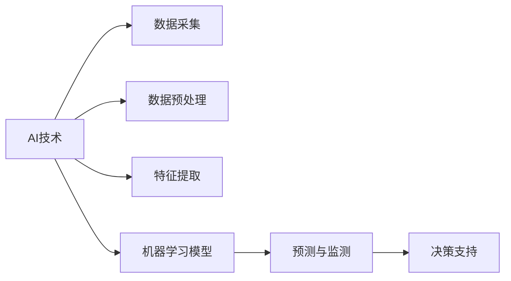

                 

# AI在智能食品安全监测中的应用：预防食品污染

> 关键词：人工智能、食品安全、智能监测、食品污染、机器学习、算法、预测

> 摘要：本文将探讨人工智能（AI）在智能食品安全监测中的应用，通过分析AI技术的核心概念与原理，介绍其在食品安全监测中的价值与实际应用。文章将详细阐述AI技术如何通过机器学习算法和数学模型对食品污染进行预防，并展示一个智能食品安全监测项目的实战案例，最后评估系统的性能并提出未来发展趋势。

## 第一部分: AI在智能食品安全监测中的应用概述

### 第1章: AI与智能食品安全监测

#### 核心概念与联系

人工智能（AI）是计算机科学的一个分支，旨在使机器能够模拟人类智能行为，包括学习、推理、感知和解决问题。智能食品安全监测则是一种利用先进技术对食品中的潜在污染物进行实时监控的方法。二者结合，可以极大地提高食品安全监测的效率和准确性。

**AI概述**
- 人工智能的目标：使计算机能够执行人类智能任务。
- AI的发展历程：从早期的规则系统到现代的深度学习和强化学习。

**智能食品安全监测**
- 监测目标：识别食品中的有害物质，如细菌、农药残留、重金属等。
- 监测方法：利用传感器、机器视觉等技术收集数据，然后通过AI算法进行分析。

**AI在食品安全监测中的应用价值**
- 提高监测效率：AI能够快速处理大量数据，实现实时监测。
- 提高监测精度：AI可以通过学习历史数据，提高对污染物的识别能力。
- 减少人力成本：AI自动化监测系统可以降低对人工监测的依赖。

**Mermaid流程图：展示AI技术如何应用于食品安全监测的流程**



#### 核心算法原理讲解

**机器学习算法在食品安全监测中的应用**
- 监测数据类型：文本、图像、传感器数据等。
- 应用算法：监督学习、无监督学习、强化学习。

**伪代码示例：使用K-近邻算法进行食品安全监测**

```python
def k_nearest_neighbors(data, labels, query_point, k):
    distances = []
    for i in range(len(data)):
        distance = euclidean_distance(query_point, data[i])
        distances.append((distance, labels[i]))
    distances.sort(key=lambda x: x[0])
    neighbors = [distances[i][1] for i in range(k)]
    return majority表决邻居标签
```

#### 数学模型和数学公式 & 详细讲解 & 举例说明

**数据预处理中的归一化公式**

$$ X_{\text{norm}} = \frac{X - \mu}{\sigma} $$

**机器学习中的损失函数（均方误差）**

$$ \text{MSE} = \frac{1}{n} \sum_{i=1}^{n} (y_i - \hat{y}_i)^2 $$

**举例说明：监测某食品样本中的细菌含量，预测其是否合格**

- 数据集：包含多个食品样本的细菌含量数据。
- 特征：每个样本的细菌含量。
- 目标：判断食品样本是否合格（合格/不合格）。

通过训练机器学习模型，可以预测新的食品样本是否合格。例如，如果某样本的细菌含量预测值为100 CFU/g，而模型的阈值设定为90 CFU/g，则该样本被判定为合格。

### 第2章: 智能食品安全监测系统架构设计

#### 核心概念与联系

**系统总体架构设计**
- 数据采集模块：负责收集食品样本的数据，包括物理、化学和生物特征。
- 数据预处理模块：对采集到的数据进行清洗、归一化和转换，以适应机器学习算法。
- 特征提取模块：从预处理后的数据中提取有用的特征，用于训练机器学习模型。
- 机器学习模型训练与部署：使用提取的特征训练模型，并在实际应用中进行部署。
- 预测与决策模块：利用训练好的模型对新的食品样本进行预测，并提供决策支持。
- 系统反馈与优化模块：收集系统的运行数据，进行性能评估和优化。

**Mermaid流程图：展示智能食品安全监测系统的整体架构**


### 第3章: AI在食品污染检测中的应用

#### 核心概念与联系

**食品污染检测原理**
- 检测方法：利用化学分析、生物检测和仪器检测等技术。
- 检测目标：识别食品中的有害物质，如农药残留、重金属和细菌等。

**AI技术在食品污染检测中的应用**
- 数据采集：通过传感器和机器视觉等技术，收集食品样本的污染数据。
- 数据处理：对采集到的数据进行分析和预处理，提取有用特征。
- 模型训练：使用提取的特征训练机器学习模型，用于识别食品污染。
- 预测与监测：利用训练好的模型对新的食品样本进行预测，监测其污染程度。

**Mermaid流程图：展示食品污染检测的AI应用流程**


### 第4章: 智能食品安全监测项目实战

#### 核心概念与联系

**项目背景**
- 项目目标：开发一个智能食品安全监测系统，用于实时监测食品中的污染物。
- 项目需求：系统应具有高精度、高效率和易部署的特点。

**项目需求分析**
- 监测目标：细菌、农药残留和重金属。
- 数据来源：传感器、实验室检测数据。
- 系统功能：数据采集、预处理、特征提取、模型训练和预测。

**系统设计与实现**
- 硬件设计：选择适合的传感器和数据采集设备。
- 软件设计：设计数据处理和机器学习模型的算法框架。

**代码实际案例与详细解释说明**

**开发环境搭建**
- Python环境搭建：安装Python和所需的库（如scikit-learn、TensorFlow等）。
- 数据集准备：收集并准备用于训练和测试的食品样本数据。

**源代码详细实现与代码解读**

```python
# 导入必要的库
import numpy as np
import pandas as pd
from sklearn.model_selection import train_test_split
from sklearn.preprocessing import StandardScaler
from sklearn.neighbors import KNeighborsClassifier

# 数据集准备
data = pd.read_csv('food_safety_data.csv')
X = data.iloc[:, :-1].values
y = data.iloc[:, -1].values

# 数据预处理
X_train, X_test, y_train, y_test = train_test_split(X, y, test_size=0.2, random_state=42)
scaler = StandardScaler()
X_train = scaler.fit_transform(X_train)
X_test = scaler.transform(X_test)

# 模型训练
model = KNeighborsClassifier(n_neighbors=5)
model.fit(X_train, y_train)

# 模型预测
y_pred = model.predict(X_test)

# 评估模型性能
from sklearn.metrics import accuracy_score
accuracy = accuracy_score(y_test, y_pred)
print(f"Accuracy: {accuracy:.2f}")
```

**代码解读与分析**
- 数据集准备：读取CSV文件，将数据分为特征和目标标签。
- 数据预处理：使用标准化方法对特征进行归一化处理。
- 模型训练：使用K-近邻算法训练模型。
- 模型预测：使用训练好的模型对测试数据进行预测。
- 模型评估：计算准确率，评估模型性能。

### 第5章: 智能食品安全监测系统评估与优化

#### 核心概念与联系

**系统性能评估指标**
- 准确率：预测结果与实际结果的一致性。
- 精确率：正确预测为合格或不合格的比例。
- 召回率：实际合格但被预测为不合格的比例。
- F1分数：精确率和召回率的调和平均值。

**优化策略与方法**
- 特征选择：通过降维、特征筛选等方法，选择对模型性能有显著影响的特征。
- 模型选择：尝试不同的机器学习算法，选择性能最优的模型。
- 超参数调优：调整模型参数，以提高预测准确性。

**系统部署与维护**
- 系统部署：将训练好的模型部署到实际应用环境中，进行实时监测。
- 系统维护：定期更新模型，处理新的数据集，确保系统的稳定性和准确性。

### 第6章: 智能食品安全监测的未来发展趋势

#### 核心概念与联系

**人工智能与食品安全监管的融合发展**
- 人工智能技术的发展：深度学习、强化学习、联邦学习等。
- 食品安全监管的需求：实时监测、精确预测、智能决策。

**智能食品安全监测技术的发展趋势**
- 智能监测系统的普及：从实验室到生产现场，从城市到农村。
- 监测技术的多样化：传感器技术、生物检测技术、大数据分析等。
- 监测数据的共享与开放：建立食品安全数据共享平台，促进数据整合与利用。

**未来挑战与机遇**
- 数据隐私与安全：保护监测数据的隐私和安全，防止数据泄露。
- 模型解释性：提高机器学习模型的解释性，使监管人员能够理解模型决策过程。
- 跨学科合作：促进人工智能、食品安全、公共卫生等领域的跨学科合作，共同应对挑战。

### 第7章: 总结与展望

#### 核心概念与联系

**书籍内容的总结**
- 本文介绍了AI在智能食品安全监测中的应用，包括核心概念、算法原理、系统架构、项目实战和评估优化。

**对AI在智能食品安全监测领域应用前景的展望**
- AI技术在食品安全监测中的应用前景广阔，有望提高监测效率和准确性，降低食品安全风险。
- 未来将出现更多智能化、自动化和高效的食品安全监测系统。

**对未来研究的建议和方向**
- 加强对食品安全数据的收集与分析，提高模型的预测准确性。
- 研究更具解释性的机器学习算法，提高监管人员对模型决策的理解。
- 推动跨学科合作，促进人工智能在食品安全监管领域的创新与发展。

## 第二部分: 附录与资源

### 附录 A: AI技术在食品安全监测中的工具与资源

#### 核心概念与联系
- **开源机器学习框架**：如TensorFlow、PyTorch、scikit-learn等。
- **数据库与数据集资源**：如Kaggle、UCI机器学习库、食物污染数据库等。
- **机器学习算法库**：如scikit-learn、MLPack、H2O.ai等。
- **开发与测试工具**：如Jupyter Notebook、Docker、Kubernetes等。

### 附录 B: 实际案例与代码示例

#### 核心概念与联系
- **食品安全监测项目实战代码示例**：包括数据预处理、模型训练、模型评估等步骤的完整代码。
- **代码解读与分析**：详细解释代码中的每一步操作，包括算法原理、数据处理方法等。
- **案例研究与应用分析**：结合实际项目案例，分析AI技术在食品安全监测中的应用效果和改进方向。

### 作者信息

- **作者：** AI天才研究院/AI Genius Institute & 禅与计算机程序设计艺术 /Zen And The Art of Computer Programming

