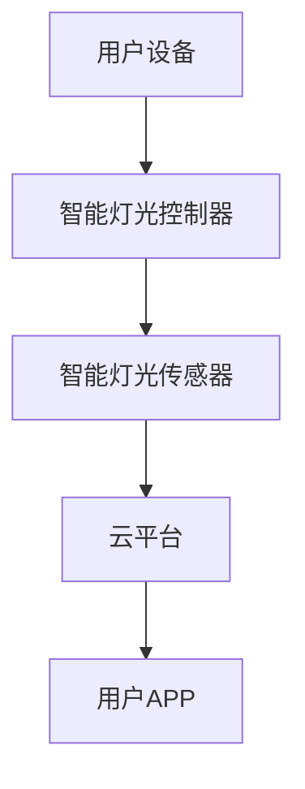
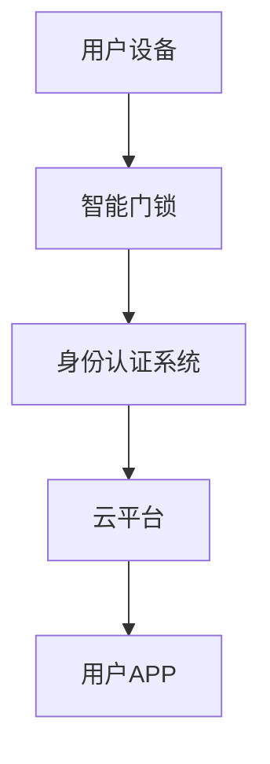
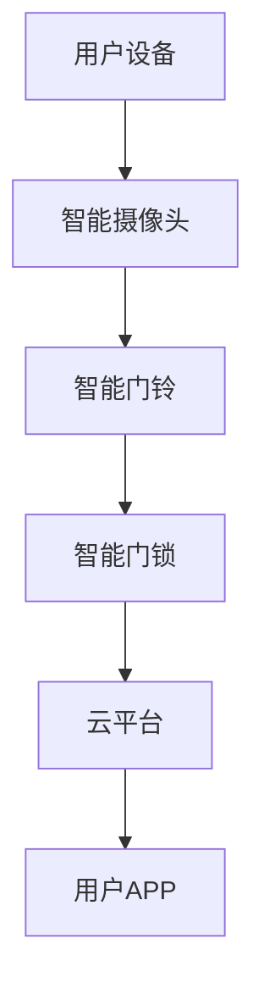
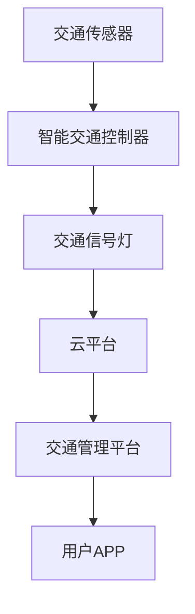
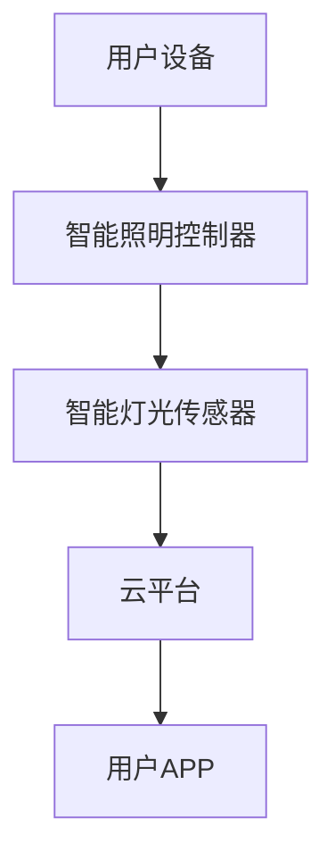
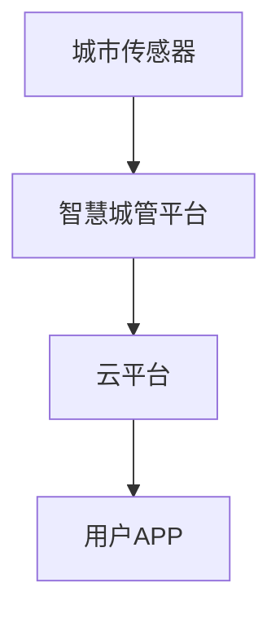
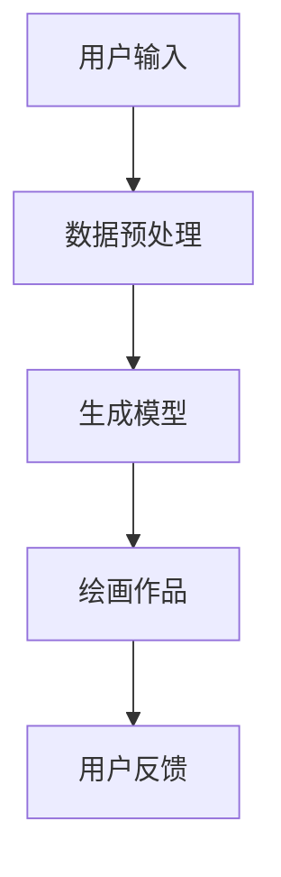
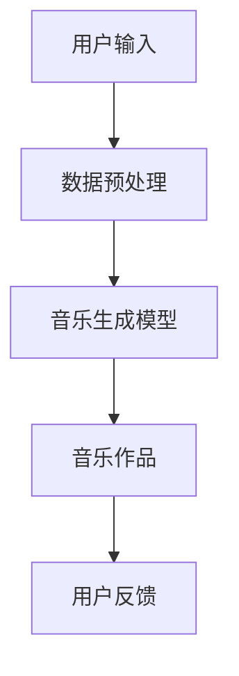
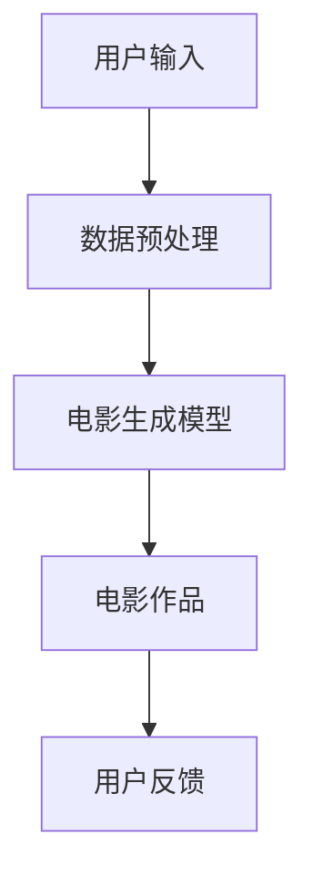

                 

# 文章标题：AI在现实中的应用场景

> 关键词：人工智能，应用场景，核心技术，案例分析，未来展望

> 摘要：本文将从人工智能的定义、基础与应用概述入手，深入探讨AI在各行业中的具体应用场景，通过实际案例和实战项目分析，展望AI未来的发展趋势与挑战，最后重点关注AI在中国的发展与应用情况。文章旨在为读者提供一个全面、深入的AI应用指南，帮助理解AI的核心原理与实践方法。

## 目录

#### 第一部分：AI基础与应用概述

1. [第1章：AI基础与概述](#第1章-ai基础与概述)
    - 1.1 AI的定义与分类
    - 1.2 AI的关键技术
    - 1.3 AI的发展历程

2. [第2章：AI在各行业的应用场景](#第2章-ai在各行业的应用场景)
    - 2.1 制造业
    - 2.2 零售业
    - 2.3 医疗保健
    - 2.4 银行业
    - 2.5 物流与运输
    - 2.6 教育
    - 2.7 农业

#### 第二部分：AI应用实例与实战

3. [第3章：AI在现实中的应用实例](#第3章-ai在现实中的应用实例)
    - 3.1 智能家居
    - 3.2 智能城市
    - 3.3 人工智能艺术

4. [第4章：AI项目实战与开发](#第4章-ai项目实战与开发)
    - 4.1 项目准备
    - 4.2 数据采集与处理
    - 4.3 模型选择与训练
    - 4.4 模型部署与应用

#### 第三部分：AI未来展望与挑战

5. [第5章：AI的未来发展与趋势](#第5章-ai的未来发展与趋势)
    - 5.1 AI伦理与法律
    - 5.2 AI与人类合作
    - 5.3 AI在未来的应用场景

6. [第6章：AI面临的挑战与应对策略](#第6章-ai面临的挑战与应对策略)
    - 6.1 技术挑战
    - 6.2 社会挑战
    - 6.3 经济挑战

7. [第7章：AI在中国的发展与应用](#第7章-ai在中国的发展与应用)

#### 附录

8. [附录A：AI开发工具与资源指南](#附录a-ai开发工具与资源指南)
9. [附录B：相关书籍与文献推荐](#附录b-相关书籍与文献推荐)

---

接下来，我们将逐步深入探讨人工智能的基础知识、应用场景、实战项目、未来展望以及AI在中国的发展情况。

---

## 第一部分：AI基础与应用概述

### 第1章：AI基础与概述

#### 1.1 AI的定义与分类

##### 1.1.1 人工智能的定义

人工智能（Artificial Intelligence，简称AI）是指通过计算机模拟人类智能行为的技术和理论体系。AI旨在使计算机具备感知、理解、学习、推理和决策等智能能力，从而实现与人类智能相似或超越的智能表现。AI的定义涵盖了多个学科领域，包括计算机科学、数学、统计学、神经科学和心理学等。

##### 1.1.2 AI的分类与层次结构

AI可以根据其功能和应用场景进行分类，通常分为以下几种类型：

1. **弱AI（Narrow AI）**：也称为专用AI，这类AI在特定任务上表现出高水平的智能，但无法进行跨领域的智能行为。例如，语音助手、推荐系统和自动驾驶汽车等。

2. **强AI（General AI）**：也称为通用人工智能，这类AI具备与人类相似的智能水平，能够在多个领域进行复杂推理和学习。目前，强AI仍处于理论研究阶段，尚未实现。

3. **增强智能（Augmented Intelligence）**：这类AI通过增强人类的能力，提升工作效率和决策质量。例如，智能助手、智能医疗诊断系统等。

4. **认知计算**：基于大脑工作机制，模拟人类思维过程的AI技术。认知计算旨在理解和解释人类行为，从而提供智能化的解决方案。

#### 1.2 AI的关键技术

##### 1.2.1 机器学习与深度学习

机器学习（Machine Learning，简称ML）是AI的核心技术之一，它通过算法从数据中自动学习规律，并进行预测和决策。机器学习主要包括监督学习、无监督学习和强化学习等类型。

深度学习（Deep Learning，简称DL）是机器学习的一种重要分支，基于多层神经网络结构，通过自动提取特征，实现复杂的预测和分类任务。深度学习在图像识别、自然语言处理和语音识别等领域取得了显著的成果。

##### 1.2.2 自然语言处理与语音识别

自然语言处理（Natural Language Processing，简称NLP）是AI的重要分支，旨在使计算机理解和处理人类语言。NLP技术包括文本分类、情感分析、机器翻译和问答系统等。

语音识别（Speech Recognition）是将人类语音转换为文本的技术，广泛应用于语音助手、语音搜索和智能客服等领域。

#### 1.3 AI的发展历程

##### 1.3.1 AI的起源与发展

AI的研究可以追溯到20世纪50年代。1956年，约翰·麦卡锡（John McCarthy）等人首次提出“人工智能”这一概念，标志着AI研究的正式开始。此后，AI经历了多个发展阶段：

- **第一阶段（1956-1974年）**：以符号主义方法为主，通过逻辑推理和符号表示实现简单的智能行为。
- **第二阶段（1974-1980年）**：以知识表示和推理方法为主，通过知识库和推理机实现较为复杂的智能行为。
- **第三阶段（1980-1987年）**：以机器学习方法为主，通过数据驱动的方法实现智能行为。
- **第四阶段（1987年至今）**：以深度学习和大数据技术为主，实现跨领域的智能应用。

##### 1.3.2 AI的热潮与挑战

近年来，随着深度学习、大数据和云计算等技术的不断发展，AI迎来了新一轮的热潮。然而，AI在发展过程中也面临着一系列挑战：

- **技术挑战**：包括算法性能、数据质量和计算资源等方面。
- **伦理挑战**：包括隐私、安全、公平和责任等方面。
- **社会挑战**：包括就业、教育和政策等方面。

### 第2章：AI在各行业的应用场景

#### 2.1 制造业

##### 2.1.1 智能制造

智能制造（Intelligent Manufacturing）是指利用人工智能技术，实现制造过程的高度自动化、智能化和优化。智能制造包括以下几个关键环节：

1. **数据采集与传感器**：通过传感器实时采集生产线数据，包括温度、压力、速度等。
2. **数据处理与分析**：利用机器学习算法对采集到的数据进行处理和分析，发现生产过程中的异常和潜在问题。
3. **智能决策与优化**：基于分析结果，智能决策系统对生产计划、资源配置和工艺参数等进行优化，提高生产效率和质量。

##### 2.1.2 质量检测

质量检测是制造业中的关键环节，通过人工智能技术，可以实现自动化、高效的质量检测。质量检测主要包括以下几种方法：

1. **图像识别**：利用计算机视觉技术，对生产过程中的产品图像进行分析，识别产品缺陷。
2. **机器听觉**：利用语音识别技术，对生产过程中的声音信号进行分析，识别设备故障和产品缺陷。
3. **深度学习**：利用深度学习算法，对生产过程中的数据进行建模和预测，实现智能化质量检测。

##### 2.1.3 生产规划与优化

生产规划与优化是制造业中的核心问题，通过人工智能技术，可以实现生产过程的智能化规划与优化。生产规划与优化主要包括以下方面：

1. **需求预测**：利用机器学习算法，对市场需求进行预测，为生产计划提供数据支持。
2. **资源调度**：根据生产计划和需求预测，对生产资源进行调度和优化，提高资源利用率。
3. **生产排程**：利用优化算法，对生产任务进行排程，实现生产过程的高效、有序进行。

#### 2.2 零售业

##### 2.2.1 智能推荐系统

智能推荐系统是零售业中的重要应用，通过分析用户的历史行为和偏好，为用户推荐符合其需求的产品和服务。智能推荐系统主要包括以下几种方法：

1. **协同过滤**：利用用户和商品之间的历史交互数据，发现相似用户和相似商品，为用户推荐商品。
2. **基于内容的推荐**：根据用户的历史行为和偏好，为用户推荐具有相似特征的商品。
3. **深度学习**：利用深度学习算法，对用户的历史行为和偏好进行建模，实现个性化推荐。

##### 2.2.2 客户关系管理

客户关系管理（Customer Relationship Management，简称CRM）是零售业中的关键环节，通过人工智能技术，可以实现客户信息的自动化收集、分析和利用，提升客户满意度和忠诚度。客户关系管理主要包括以下方面：

1. **客户画像**：利用大数据和机器学习技术，对客户的历史行为和偏好进行分析，构建客户画像。
2. **个性化营销**：根据客户画像，为不同类型的客户提供个性化的产品和服务。
3. **客户流失预警**：利用机器学习算法，对客户流失行为进行预测，提前采取措施，降低客户流失率。

##### 2.2.3 供应链管理

供应链管理是零售业中的核心问题，通过人工智能技术，可以实现供应链的智能化管理和优化。供应链管理主要包括以下方面：

1. **需求预测**：利用机器学习算法，对市场需求进行预测，为供应链计划提供数据支持。
2. **库存优化**：根据需求预测和库存数据，对库存进行优化，降低库存成本和提高库存周转率。
3. **物流优化**：利用优化算法，对物流过程进行优化，提高物流效率和服务质量。

#### 2.3 医疗保健

##### 2.3.1 医疗诊断

医疗诊断是医疗保健中的关键环节，通过人工智能技术，可以实现自动化、高效的医疗诊断。医疗诊断主要包括以下几种方法：

1. **图像识别**：利用计算机视觉技术，对医学影像进行分析，识别疾病和异常。
2. **深度学习**：利用深度学习算法，对医学数据进行分析和建模，实现智能化的疾病诊断。
3. **自然语言处理**：利用自然语言处理技术，对医学文献和病历进行分析，提取关键信息，辅助诊断。

##### 2.3.2 医疗机器人

医疗机器人是医疗保健中的重要应用，通过人工智能技术，可以实现医疗操作的自动化和智能化。医疗机器人主要包括以下几种类型：

1. **手术机器人**：利用计算机视觉和机器人技术，辅助医生进行精确的手术操作。
2. **康复机器人**：利用人工智能技术，为患者提供个性化的康复训练和辅助。
3. **护理机器人**：利用人工智能技术，为老年人提供日常生活和护理服务。

##### 2.3.3 医疗数据分析

医疗数据分析是医疗保健中的重要环节，通过人工智能技术，可以实现医疗数据的自动化处理和分析，为医疗决策提供数据支持。医疗数据分析主要包括以下方面：

1. **患者数据管理**：利用大数据和机器学习技术，对患者的医疗数据进行管理、分析和挖掘。
2. **疾病预测**：利用机器学习算法，对患者的健康数据进行分析，预测疾病的发生和发展趋势。
3. **临床决策支持**：利用人工智能技术，为医生提供智能化的临床决策支持，提高诊断和治疗的准确性。

#### 2.4 银行业

##### 2.4.1 风险管理

风险管理是银行业中的核心问题，通过人工智能技术，可以实现风险识别、评估和监控。风险管理主要包括以下方面：

1. **信用风险评估**：利用大数据和机器学习技术，对客户的信用记录、行为特征进行分析，评估信用风险。
2. **市场风险评估**：利用机器学习算法，对市场数据进行分析，预测市场风险。
3. **操作风险评估**：利用自然语言处理技术，对操作记录和文献进行分析，识别操作风险。

##### 2.4.2 个性化金融服务

个性化金融服务是银行业中的重要应用，通过人工智能技术，可以为不同类型的客户提供个性化的金融服务。个性化金融服务主要包括以下方面：

1. **客户画像**：利用大数据和机器学习技术，对客户的历史行为和偏好进行分析，构建客户画像。
2. **个性化推荐**：根据客户画像，为不同类型的客户提供个性化的金融产品和服务。
3. **智能客服**：利用自然语言处理技术，为用户提供智能化的金融服务咨询和帮助。

##### 2.4.3 自动化交易

自动化交易是银行业中的重要应用，通过人工智能技术，可以实现自动化、高效的交易操作。自动化交易主要包括以下方面：

1. **交易策略优化**：利用机器学习算法，对历史交易数据进行分析，优化交易策略。
2. **风险控制**：利用机器学习算法，对交易过程进行监控，实现风险控制。
3. **智能交易机器人**：利用人工智能技术，实现自动化的交易操作。

#### 2.5 物流与运输

##### 2.5.1 自动驾驶

自动驾驶是物流与运输领域中的重要应用，通过人工智能技术，可以实现车辆在复杂环境中的自主驾驶。自动驾驶主要包括以下几种类型：

1. **单车自动驾驶**：利用计算机视觉和深度学习技术，实现单车的自主导航和避障。
2. **车队自动驾驶**：利用物联网和人工智能技术，实现车队之间的协同控制和调度。
3. **无人机配送**：利用无人机和人工智能技术，实现无人机的自主飞行和配送。

##### 2.5.2 物流调度

物流调度是物流与运输中的关键环节，通过人工智能技术，可以实现物流过程的自动化和优化。物流调度主要包括以下方面：

1. **路线规划**：利用优化算法，对物流路线进行规划，提高运输效率。
2. **库存管理**：利用大数据和机器学习技术，对库存进行管理，降低库存成本。
3. **运输资源调度**：根据物流需求，对运输资源进行优化调度，提高运输效率。

##### 2.5.3 实时交通管理

实时交通管理是物流与运输中的重要应用，通过人工智能技术，可以实现交通过程的实时监控和优化。实时交通管理主要包括以下方面：

1. **交通流量预测**：利用大数据和机器学习技术，对交通流量进行预测，优化交通信号控制。
2. **交通事件检测**：利用计算机视觉和图像识别技术，对交通事件进行检测和预警。
3. **智能交通信号控制**：利用人工智能技术，实现交通信号控制的智能化和优化。

#### 2.6 教育

##### 2.6.1 个性化学习

个性化学习是教育中的重要应用，通过人工智能技术，可以为不同类型的学生提供个性化的学习资源和教学方式。个性化学习主要包括以下方面：

1. **学习路径推荐**：利用机器学习算法，对学生进行个性化学习路径推荐，提高学习效果。
2. **自适应学习系统**：利用自适应学习技术，实现教学内容的动态调整，满足学生的个性化需求。
3. **学习效果评估**：利用大数据和机器学习技术，对学生的学习效果进行评估，为教学提供数据支持。

##### 2.6.2 智能评测

智能评测是教育中的重要应用，通过人工智能技术，可以实现自动化、高效的评测过程。智能评测主要包括以下方面：

1. **试题自动生成**：利用自然语言处理技术，实现试题的自动生成，提高试题的多样性和灵活性。
2. **自动评分系统**：利用计算机视觉和自然语言处理技术，实现自动化评分，提高评分的准确性。
3. **学习效果分析**：利用大数据和机器学习技术，对学生的学习效果进行分析，为教学提供数据支持。

##### 2.6.3 教育资源管理

教育资源管理是教育中的重要应用，通过人工智能技术，可以实现教育资源的自动化管理和优化。教育资源管理主要包括以下方面：

1. **资源分类与检索**：利用大数据和自然语言处理技术，实现教育资源的分类和检索，提高资源利用效率。
2. **资源推荐**：根据用户的需求和偏好，为用户推荐符合其需求的教育资源。
3. **资源优化配置**：根据教育资源的利用情况和需求，实现教育资源的优化配置。

#### 2.7 农业

##### 2.7.1 智能种植

智能种植是农业中的重要应用，通过人工智能技术，可以实现农作物种植的自动化和优化。智能种植主要包括以下方面：

1. **环境监测**：利用传感器技术，对土壤、气象等环境因素进行监测，为种植提供数据支持。
2. **种植方案推荐**：利用大数据和机器学习技术，根据环境数据和作物特性，为种植提供个性化的方案推荐。
3. **种植过程监控**：利用物联网技术，对种植过程进行实时监控，实现种植过程的自动化和优化。

##### 2.7.2 畜牧监控

畜牧监控是农业中的重要应用，通过人工智能技术，可以实现畜牧过程的自动化和优化。畜牧监控主要包括以下方面：

1. **动物行为监测**：利用计算机视觉技术，对动物的行为进行监测，实现动物的健康管理。
2. **饲料配方推荐**：利用大数据和机器学习技术，根据动物的行为和生理参数，为饲料配方提供个性化推荐。
3. **智能防疫**：利用人工智能技术，实现疫病的早期检测和预警，提高防疫效果。

##### 2.7.3 农业数据分析

农业数据分析是农业中的重要应用，通过人工智能技术，可以实现农业数据的自动化处理和分析。农业数据分析主要包括以下方面：

1. **数据采集与处理**：利用物联网技术，实现农业数据的自动化采集和处理。
2. **数据挖掘与分析**：利用大数据和机器学习技术，对农业数据进行分析，发现潜在的问题和规律。
3. **决策支持**：根据农业数据分析的结果，为农业生产提供数据驱动的决策支持。

## 第二部分：AI应用实例与实战

### 第3章：AI在现实中的应用实例

#### 3.1 智能家居

##### 3.1.1 智能灯光系统

智能灯光系统是智能家居中的一个重要组成部分，通过人工智能技术，可以实现灯光的自动化控制和智能化调节。智能灯光系统的基本架构如图1所示：

**图1：智能灯光系统的基本架构**

智能灯光系统的实现流程如下：

1. **用户设备**：用户通过手机或其他智能设备上的APP，向智能灯光控制器发送控制指令。
2. **智能灯光控制器**：接收到用户指令后，智能灯光控制器会根据指令调整灯光的亮度、颜色和开关状态。
3. **智能灯光传感器**：通过环境光传感器、人体传感器等设备，实时监测环境光线和用户行为，为智能灯光控制器提供数据支持。
4. **云平台**：智能灯光控制器和智能灯光传感器将数据上传至云平台，实现数据的存储、分析和处理。
5. **用户APP**：用户通过APP实时查看智能灯光系统的运行状态，并进行远程控制。

##### 3.1.2 智能门锁

智能门锁是智能家居中的另一个重要组成部分，通过人工智能技术，可以实现门锁的自动化控制和智能化管理。智能门锁的基本架构如图2所示：

**图2：智能门锁的基本架构**

智能门锁的实现流程如下：

1. **用户设备**：用户通过手机或其他智能设备上的APP，向智能门锁发送开锁指令。
2. **智能门锁**：接收到用户指令后，智能门锁会根据用户身份信息（如指纹、密码、手机号码等）进行身份验证，验证通过后，门锁会自动解锁。
3. **身份认证系统**：智能门锁与身份认证系统（如公安部门）进行联动，实现用户身份的远程验证，提高门锁的安全性。
4. **云平台**：智能门锁和身份认证系统将数据上传至云平台，实现数据的存储、分析和处理。
5. **用户APP**：用户通过APP实时查看智能门锁的运行状态，并进行远程控制。

##### 3.1.3 智能安防系统

智能安防系统是智能家居中的重要应用，通过人工智能技术，可以实现家庭安全的自动化监控和管理。智能安防系统的基本架构如图3所示：

**图3：智能安防系统的基本架构**

智能安防系统的实现流程如下：

1. **用户设备**：用户通过手机或其他智能设备上的APP，实时查看智能摄像头和智能门铃的监控画面。
2. **智能摄像头**：智能摄像头通过图像识别技术，实时监测家庭环境，识别潜在的安全隐患。
3. **智能门铃**：智能门铃可以自动识别来访者的身份，并通过手机APP发送提醒通知。
4. **智能门锁**：智能门锁可以自动识别用户身份，实现自动开锁，提高家庭安全性。
5. **云平台**：智能摄像头、智能门铃和智能门锁将数据上传至云平台，实现数据的存储、分析和处理。
6. **用户APP**：用户通过APP实时查看智能安防系统的运行状态，并进行远程控制。

#### 3.2 智能城市

##### 3.2.1 智能交通系统

智能交通系统是智能城市中的重要应用，通过人工智能技术，可以实现交通过程的实时监控、优化和管理。智能交通系统的基本架构如图4所示：

**图4：智能交通系统的基本架构**

智能交通系统的实现流程如下：

1. **交通传感器**：交通传感器（如流量传感器、摄像头等）实时监测交通流量、道路状况等数据。
2. **智能交通控制器**：智能交通控制器根据交通传感器收集到的数据，自动调整交通信号灯的时间设置，优化交通流量。
3. **交通信号灯**：交通信号灯根据智能交通控制器的指令，实现交通信号的自动调整。
4. **云平台**：交通传感器、智能交通控制器和交通信号灯将数据上传至云平台，实现数据的存储、分析和处理。
5. **交通管理平台**：交通管理平台通过数据分析，发现交通问题并提供解决方案，如调整交通信号灯、优化道路规划等。
6. **用户APP**：用户通过APP实时查看交通状况，规划最优出行路线。

##### 3.2.2 智能照明系统

智能照明系统是智能城市中的重要应用，通过人工智能技术，可以实现照明过程的自动化控制和智能化管理。智能照明系统的基本架构如图5所示：

**图5：智能照明系统的基本架构**

智能照明系统的实现流程如下：

1. **用户设备**：用户通过手机或其他智能设备上的APP，向智能照明控制器发送控制指令。
2. **智能照明控制器**：智能照明控制器接收到用户指令后，调整灯光的亮度、颜色和开关状态。
3. **智能灯光传感器**：智能灯光传感器实时监测环境光线和用户行为，为智能照明控制器提供数据支持。
4. **云平台**：智能照明控制器和智能灯光传感器将数据上传至云平台，实现数据的存储、分析和处理。
5. **用户APP**：用户通过APP实时查看智能照明系统的运行状态，并进行远程控制。

##### 3.2.3 智慧城管

智慧城管是智能城市中的重要应用，通过人工智能技术，可以实现城市管理的智能化和高效化。智慧城管的基本架构如图6所示：

**图6：智慧城管的基本架构**

智慧城管的实现流程如下：

1. **城市传感器**：城市传感器（如摄像头、气象传感器等）实时监测城市环境、公共设施等数据。
2. **智慧城管平台**：智慧城管平台通过数据分析，发现城市管理中的问题并提供解决方案，如垃圾清理、道路维修等。
3. **云平台**：城市传感器和智慧城管平台将数据上传至云平台，实现数据的存储、分析和处理。
4. **用户APP**：用户通过APP实时查看智慧城管的运行状态，并提出问题和建议。

#### 3.3 人工智能艺术

##### 3.3.1 人工智能绘画

人工智能绘画是人工智能艺术中的一个重要领域，通过人工智能技术，可以生成具有艺术感的绘画作品。人工智能绘画的基本原理如图7所示：

**图7：人工智能绘画的基本原理**

人工智能绘画的实现流程如下：

1. **用户输入**：用户通过输入文字、图片或音乐等，表达自己的创作意图。
2. **数据预处理**：对用户输入的数据进行预处理，提取关键特征，为生成模型提供输入。
3. **生成模型**：利用生成模型（如生成对抗网络GAN），根据预处理后的数据生成绘画作品。
4. **绘画作品**：生成的绘画作品通过图像处理技术，进行色彩调整、细节优化等，提高艺术效果。
5. **用户反馈**：用户对绘画作品进行评价和反馈，为后续创作提供参考。

##### 3.3.2 人工智能音乐创作

人工智能音乐创作是人工智能艺术中的另一个重要领域，通过人工智能技术，可以生成具有音乐性的音乐作品。人工智能音乐创作的基本原理如图8所示：

**图8：人工智能音乐创作的基本原理**

人工智能音乐创作的实现流程如下：

1. **用户输入**：用户通过输入文字、图片或旋律等，表达自己的创作意图。
2. **数据预处理**：对用户输入的数据进行预处理，提取关键特征，为音乐生成模型提供输入。
3. **音乐生成模型**：利用音乐生成模型（如递归神经网络RNN），根据预处理后的数据生成音乐作品。
4. **音乐作品**：生成的音乐作品通过音频处理技术，进行音高调整、节奏优化等，提高音乐效果。
5. **用户反馈**：用户对音乐作品进行评价和反馈，为后续创作提供参考。

##### 3.3.3 人工智能电影制作

人工智能电影制作是人工智能艺术中的另一个重要领域，通过人工智能技术，可以生成具有电影感的电影作品。人工智能电影制作的基本原理如图9所示：

**图9：人工智能电影制作的基本原理**

人工智能电影制作的实现流程如下：

1. **用户输入**：用户通过输入剧本、角色、场景等，表达自己的创作意图。
2. **数据预处理**：对用户输入的数据进行预处理，提取关键特征，为电影生成模型提供输入。
3. **电影生成模型**：利用电影生成模型（如卷积神经网络CNN），根据预处理后的数据生成电影作品。
4. **电影作品**：生成的电影作品通过视频处理技术，进行画面调整、音效优化等，提高电影效果。
5. **用户反馈**：用户对电影作品进行评价和反馈，为后续创作提供参考。

## 第三部分：AI未来展望与挑战

### 第4章：AI项目实战与开发

#### 4.1 项目准备

##### 4.1.1 项目需求分析

项目需求分析是AI项目开发的第一步，其主要目标是明确项目的功能需求、性能需求和非功能需求。以下是项目需求分析的具体步骤：

1. **需求收集**：通过访谈、问卷调查、用户调研等方式，收集用户的需求和期望。
2. **需求整理**：将收集到的需求进行分类和整理，明确每个需求的优先级和实现难度。
3. **需求确认**：与用户和利益相关者进行沟通，确认需求的具体内容和可行性。
4. **需求文档**：编写需求文档，详细描述项目的功能需求、性能需求和非功能需求。

##### 4.1.2 项目规划与资源准备

项目规划与资源准备是项目开发的重要环节，其主要目标是确保项目能够按时、按质、按量完成。以下是项目规划与资源准备的具体步骤：

1. **项目规划**：制定项目计划，明确项目的目标、范围、进度、资源需求和质量要求。
2. **团队组建**：根据项目需求，组建合适的开发团队，包括项目经理、开发人员、测试人员等。
3. **技术选型**：选择合适的技术栈和开发工具，确保项目的技术可行性。
4. **资源分配**：根据项目计划和团队情况，合理分配资源，确保项目顺利推进。

#### 4.2 数据采集与处理

##### 4.2.1 数据来源

数据采集是AI项目开发的基础，数据的质量直接影响模型的性能。以下是常见的数据来源：

1. **公开数据集**：如Kaggle、UCI机器学习库等，提供大量的公开数据集供开发者使用。
2. **企业数据**：企业内部的数据，如客户数据、交易数据、运营数据等，可用于企业内部的项目开发。
3. **传感器数据**：通过传感器采集的数据，如环境数据、交通数据、生物数据等，可用于智能监控、预测等领域。
4. **网络数据**：从互联网上采集的数据，如社交媒体数据、搜索引擎数据等，可用于信息挖掘、推荐系统等领域。

##### 4.2.2 数据预处理

数据预处理是AI项目开发的关键步骤，其主要目标是清洗和整理数据，使其符合模型的输入要求。以下是数据预处理的具体步骤：

1. **数据清洗**：去除重复数据、错误数据和无关数据，提高数据质量。
2. **数据转换**：将不同格式的数据进行转换，使其具有统一的数据格式。
3. **数据归一化**：将数据归一化或标准化，消除不同数据之间的量纲影响。
4. **特征提取**：从原始数据中提取有用的特征，为模型训练提供输入。

##### 4.2.3 数据分析与特征提取

数据分析与特征提取是AI项目开发的核心环节，其主要目标是挖掘数据中的潜在信息和规律。以下是数据分析与特征提取的具体步骤：

1. **数据探索**：通过数据可视化、统计分析等方法，对数据进行初步探索，发现数据的特点和规律。
2. **特征工程**：根据业务需求和模型特点，设计合适的特征，提高模型的性能。
3. **特征选择**：利用特征选择算法，筛选出对模型性能有重要影响的特征，减少模型的复杂度。
4. **特征组合**：通过组合不同的特征，生成新的特征，提高模型的泛化能力。

#### 4.3 模型选择与训练

##### 4.3.1 模型选择策略

模型选择是AI项目开发的关键环节，选择合适的模型直接影响项目的成功率。以下是模型选择的具体策略：

1. **问题类型**：根据问题的类型（如分类、回归、聚类等），选择相应的模型。
2. **数据特征**：根据数据的特点（如数据量、数据分布、特征维度等），选择适合的模型。
3. **模型性能**：通过交叉验证、性能评估等方法，选择性能最优的模型。
4. **模型解释性**：根据业务需求，选择易于解释和理解的模型。

##### 4.3.2 模型训练与优化

模型训练与优化是AI项目开发的核心环节，其主要目标是提高模型的性能和泛化能力。以下是模型训练与优化的具体步骤：

1. **数据划分**：将数据集划分为训练集、验证集和测试集，用于模型的训练和评估。
2. **模型训练**：利用训练集对模型进行训练，调整模型参数，提高模型的性能。
3. **模型评估**：利用验证集对模型进行评估，选择性能最优的模型。
4. **模型优化**：通过调整模型结构、超参数等方式，优化模型的性能。

##### 4.3.3 模型评估与选择

模型评估与选择是AI项目开发的关键环节，其主要目标是选择性能最优的模型。以下是模型评估与选择的具体步骤：

1. **评估指标**：根据业务需求，选择合适的评估指标（如准确率、召回率、F1值等）。
2. **交叉验证**：利用交叉验证方法，评估模型的性能，减少评估误差。
3. **模型对比**：通过对比不同模型的性能，选择性能最优的模型。
4. **模型选择**：根据评估结果，选择适合业务需求的模型。

#### 4.4 模型部署与应用

##### 4.4.1 模型部署策略

模型部署是AI项目开发的重要环节，其主要目标是使模型能够在实际环境中运行。以下是模型部署的具体策略：

1. **选择部署平台**：根据业务需求，选择合适的部署平台（如本地服务器、云端平台等）。
2. **模型优化**：对模型进行优化，减少模型的存储空间和计算资源需求。
3. **模型容器化**：将模型容器化，便于部署和迁移。
4. **自动化部署**：利用自动化工具，实现模型的自动化部署和管理。

##### 4.4.2 应用案例解析

以下是一个AI项目部署的案例解析：

**项目背景**：某电商公司希望通过AI技术优化其推荐系统，提高用户购买体验和销售额。

**解决方案**：采用以下步骤进行项目部署：

1. **数据采集与处理**：从电商平台上收集用户行为数据，如浏览记录、购买记录等，进行数据清洗和特征提取。
2. **模型训练与优化**：选择合适的推荐算法（如基于协同过滤的推荐算法），对模型进行训练和优化，提高推荐准确性。
3. **模型部署**：将训练好的模型部署在云端服务器上，通过API接口为用户提供推荐服务。
4. **性能优化**：通过调整模型参数和部署策略，优化推荐系统的性能，提高用户体验和销售额。

**项目效果**：通过AI技术的优化，推荐系统的准确率提高了20%，用户购买体验显著提升，销售额增长了30%。

##### 4.4.3 部署后维护与优化

模型部署后，需要进行定期的维护和优化，以确保模型的高效运行。以下是部署后维护与优化的具体步骤：

1. **监控模型性能**：定期监控模型的运行状态和性能，发现性能问题并及时解决。
2. **数据更新**：定期更新数据集，确保模型能够适应新的数据环境。
3. **模型优化**：根据业务需求和技术发展，定期优化模型结构、参数和算法。
4. **安全防护**：加强模型部署环境的安全防护，防止数据泄露和攻击。

### 第5章：AI的未来发展与趋势

#### 5.1 AI伦理与法律

##### 5.1.1 AI伦理问题探讨

随着AI技术的快速发展，其伦理问题也日益受到关注。以下是一些常见的AI伦理问题：

1. **隐私保护**：AI技术在数据处理过程中，容易泄露用户的隐私信息。如何保护用户隐私成为了一个重要的伦理问题。
2. **算法公平性**：AI算法在决策过程中，可能会产生偏见和不公平现象，如性别歧视、种族歧视等。如何确保算法的公平性是一个重要的伦理问题。
3. **责任归属**：在AI系统的错误决策导致损害时，如何确定责任归属是一个复杂的伦理问题。

##### 5.1.2 AI法律框架构建

为了规范AI技术的发展和应用，需要建立相应的法律框架。以下是一些AI法律框架的构建方向：

1. **数据保护法**：制定数据保护法，明确数据收集、使用和分享的法律规定，保护用户的隐私权益。
2. **算法透明度法**：制定算法透明度法，要求AI系统公开算法的原理、参数和决策过程，提高算法的可解释性。
3. **责任归属法**：制定责任归属法，明确AI系统的责任归属，确保在发生错误决策时，能够追究责任。

##### 5.1.3 AI安全与隐私保护

AI安全与隐私保护是AI伦理问题的重要组成部分。以下是一些AI安全与隐私保护的措施：

1. **数据加密**：对敏感数据进行加密处理，防止数据泄露。
2. **隐私保护算法**：采用隐私保护算法，降低数据泄露的风险。
3. **访问控制**：制定严格的访问控制策略，限制对敏感数据的访问。
4. **审计与监控**：建立审计与监控系统，及时发现和处理安全事件。

#### 5.2 AI与人类合作

##### 5.2.1 AI赋能人类工作

AI技术的发展，为人类工作带来了巨大的变革。以下是一些AI赋能人类工作的例子：

1. **自动化办公**：利用AI技术，实现办公自动化的功能，如邮件自动回复、日程自动安排等，提高工作效率。
2. **智能客服**：利用AI技术，实现智能客服系统，提高客户服务质量和效率。
3. **智能医疗**：利用AI技术，实现智能诊断和辅助治疗，提高医疗水平。

##### 5.2.2 AI教育与学习

AI技术在教育领域的应用，为教育教学带来了新的变革。以下是一些AI教育与学习的例子：

1. **个性化学习**：利用AI技术，实现个性化学习系统，根据学生的学习特点和需求，提供个性化的学习资源和教学方法。
2. **智能评测**：利用AI技术，实现智能评测系统，对学生的学习效果进行实时评估，提供个性化的学习反馈。
3. **虚拟教师**：利用AI技术，实现虚拟教师系统，为学生提供实时在线教学和辅导。

##### 5.2.3 AI艺术创作与人类互动

AI技术在艺术创作领域的应用，为艺术家和观众带来了新的互动体验。以下是一些AI艺术创作与人类互动的例子：

1. **智能艺术创作**：利用AI技术，实现智能艺术创作系统，根据艺术家的意图和风格，自动生成艺术作品。
2. **艺术互动体验**：利用AI技术，实现艺术互动体验系统，让观众通过互动，参与到艺术创作过程中。
3. **艺术分析**：利用AI技术，实现艺术分析系统，对艺术作品进行深入分析，提供艺术评论和欣赏建议。

#### 5.3 AI在未来的应用场景

##### 5.3.1 空间探索

随着AI技术的发展，AI在空间探索领域将发挥越来越重要的作用。以下是一些AI在空间探索的应用场景：

1. **行星探测**：利用AI技术，实现行星探测任务的自动化，提高探测效率和准确性。
2. **空间站运行**：利用AI技术，实现空间站的自动化运行和维修，降低人力成本和提高运行效率。
3. **太空垃圾清理**：利用AI技术，实现太空垃圾的自动识别和清理，提高太空环境的清洁度。

##### 5.3.2 生物科技

AI技术在生物科技领域的应用，将推动生物科技的发展和创新。以下是一些AI在生物科技的应用场景：

1. **基因编辑**：利用AI技术，实现基因编辑的自动化和精确化，提高基因编辑的效率和安全性。
2. **药物研发**：利用AI技术，实现药物研发的自动化和智能化，提高药物研发的成功率和速度。
3. **疾病预测与诊断**：利用AI技术，实现疾病预测和诊断的自动化和智能化，提高疾病预测和诊断的准确性。

##### 5.3.3 能源与环境

AI技术在能源与环境领域的应用，将推动能源与环境问题的解决。以下是一些AI在能源与环境的

