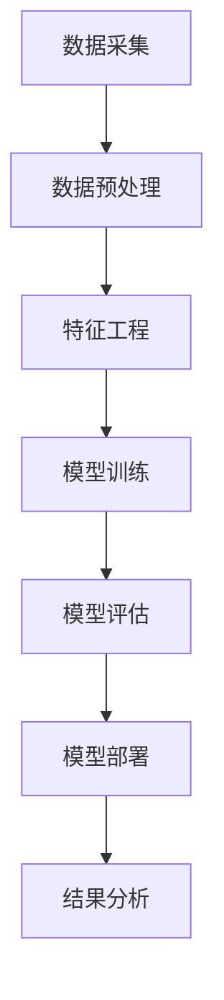

                 

## 文章标题

# AI在电商动态定价中的创新应用

> 关键词：人工智能、电商、动态定价、机器学习、数据挖掘

> 摘要：本文旨在探讨人工智能在电商动态定价中的应用，分析AI技术的核心概念和电商动态定价的基本原理，深入探讨AI在动态定价模型中的创新应用原理，并通过实际案例展示AI技术在电商动态定价中的实战应用，最后对AI动态定价技术的未来发展趋势进行展望。文章结构清晰，逻辑严密，旨在为读者提供一个全面而深入的技术解读。

---

### 目录大纲

#### 第一部分：引言与概述

- **第一章：AI与电商动态定价概述**
  - **1.1 AI技术综述**
    - 1.1.1 人工智能的基本概念
    - 1.1.2 人工智能的发展历程
    - 1.1.3 人工智能的核心技术
  - **1.2 电商动态定价的概念**
    - 1.2.1 电商动态定价的基本原理
    - 1.2.2 电商动态定价的驱动因素
    - 1.2.3 电商动态定价的优势与挑战
  - **1.3 AI在电商动态定价中的应用前景**
    - 1.3.1 AI技术在电商领域的应用现状
    - 1.3.2 AI在电商动态定价中的创新点
    - 1.3.3 AI对电商行业的影响与变革

#### 第二部分：AI技术基础

- **第二章：机器学习与数据挖掘基础**
  - **2.1 机器学习概述**
    - 2.1.1 机器学习的基本概念
    - 2.1.2 机器学习的分类
    - 2.1.3 机器学习的基本流程
  - **2.2 数据挖掘技术**
    - 2.2.1 数据挖掘的基本概念
    - 2.2.2 数据挖掘的主要任务
    - 2.2.3 数据挖掘的基本流程
  - **2.3 常用机器学习算法**
    - 2.3.1 线性回归
    - 2.3.2 决策树
    - 2.3.3 随机森林
    - 2.3.4 支持向量机
    - 2.3.5 神经网络

#### 第三部分：AI在电商动态定价中的应用

- **第三章：AI在电商动态定价中的应用原理**
  - **3.1 动态定价模型原理**
    - 3.1.1 动态定价的基本概念
    - 3.1.2 动态定价的常见模型
    - 3.1.3 动态定价模型的设计要点
  - **3.2 AI在动态定价中的应用**
    - 3.2.1 AI技术在动态定价中的应用
    - 3.2.2 基于AI的动态定价算法
    - 3.2.3 AI在动态定价中的优势与挑战
  - **3.3 案例分析**
    - 3.3.1 案例一：某电商平台的AI动态定价实践
    - 3.3.2 案例二：某电商平台的AI动态定价案例分析

#### 第四部分：实战篇

- **第四章：AI在电商动态定价中的实战应用**
  - **4.1 实战一：搭建AI动态定价系统**
    - 4.1.1 项目背景
    - 4.1.2 系统设计
    - 4.1.3 系统实现
  - **4.2 实战二：基于AI的电商商品定价策略优化**
    - 4.2.1 项目背景
    - 4.2.2 系统设计
    - 4.2.3 系统实现
    - 4.2.4 结果分析
  - **4.3 实战三：电商平台的AI动态定价优化案例**
    - 4.3.1 项目背景
    - 4.3.2 系统设计
    - 4.3.3 系统实现
    - 4.3.4 结果分析

#### 第五部分：未来展望

- **第五章：AI在电商动态定价中的未来发展趋势**
  - **5.1 AI动态定价技术发展趋势**
    - 5.1.1 未来的发展方向
    - 5.1.2 技术创新点
    - 5.1.3 未来挑战与机遇
  - **5.2 电商行业的变革与未来**
    - 5.2.1 AI对电商行业的变革
    - 5.2.2 电商行业的未来发展
    - 5.2.3 电商与AI的融合前景

#### 附录

- **附录A：常用AI与数据挖掘工具**
- **附录B：参考书目与资料**
- **附录C：Mermaid流程图与算法伪代码**
- **附录D：项目实战源代码与解读**
- **附录E：数学模型与公式**

---

### 第一部分：引言与概述

#### 第一章：AI与电商动态定价概述

### 1.1 AI技术综述

#### 1.1.1 人工智能的基本概念

人工智能（Artificial Intelligence，简称AI）是计算机科学的一个分支，它致力于创建能够模拟、扩展和甚至替代人类智能的理论、算法和技术。人工智能的核心目标是使机器能够执行通常需要人类智能的任务，如视觉识别、语音识别、决策制定和语言理解。

**定义**

人工智能可以从不同的角度进行定义：

- **广义人工智能（AGI）**：AGI是指具有全面认知能力的机器，能够在任何领域执行任何智力任务，与人类智能相当。
- **弱人工智能（Narrow AI）**：弱人工智能是指专门设计用于执行特定任务的AI系统，如语音助手、自动驾驶汽车和推荐系统。

**发展历程**

人工智能的发展可以分为以下几个阶段：

1. **早期探索（1956年-1974年）**：人工智能概念的提出和初步研究。
2. **低谷期（1974年-1980年）**：由于计算能力和算法限制，人工智能研究陷入低谷。
3. **复兴期（1980年-2010年）**：随着计算机性能的提升和算法的创新，人工智能研究重新兴起。
4. **当前发展（2010年至今）**：深度学习和其他先进技术的突破，使得人工智能应用迅速扩展。

**核心技术**

人工智能的核心技术包括：

- **机器学习（Machine Learning）**：通过数据训练模型，使其能够进行预测和决策。
- **深度学习（Deep Learning）**：基于多层神经网络的一种机器学习技术，能够处理大规模数据和复杂任务。
- **自然语言处理（Natural Language Processing，NLP）**：使计算机能够理解、生成和处理人类语言的技术。
- **计算机视觉（Computer Vision）**：使计算机能够从图像和视频中提取信息的技术。

#### 1.1.2 人工智能的发展历程

**第一阶段（1956年-1974年）**

- 1956年：达特茅斯会议，人工智能概念正式提出。
- 1958年：首次提出监督学习和无监督学习。
- 1960年代：符号主义和知识表示成为研究热点。

**第二阶段（1974年-1980年）**

- 1974年：人工智能研究遇到“AI寒冬”，由于算法复杂性和计算资源限制，进展放缓。
- 1977年：首次提出反向传播算法。

**第三阶段（1980年-2010年）**

- 1980年代：专家系统和知识表示技术得到广泛应用。
- 1990年代：机器学习和数据挖掘技术开始发展。

**第四阶段（2010年至今）**

- 2012年：深度学习在ImageNet竞赛中取得突破性成果。
- 2016年：AlphaGo战胜人类围棋冠军，标志着人工智能进入新阶段。

#### 1.1.3 人工智能的核心技术

**机器学习**

机器学习是人工智能的一个重要分支，它使计算机能够从数据中学习，并基于学到的知识进行预测和决策。

- **基本概念**：机器学习通过训练模型来拟合数据，从而在新的数据上进行预测或决策。
- **分类**：监督学习、无监督学习、半监督学习和强化学习。
- **基本流程**：数据收集、数据预处理、模型选择、模型训练和模型评估。

**深度学习**

深度学习是机器学习的一个重要分支，它通过多层神经网络对数据进行建模，能够在处理复杂任务方面表现出色。

- **基本概念**：深度学习是一种多层神经网络，通过逐层提取特征，实现对数据的深层次理解。
- **模型**：卷积神经网络（CNN）、循环神经网络（RNN）、生成对抗网络（GAN）等。

**自然语言处理**

自然语言处理是使计算机能够理解、生成和处理人类语言的技术。

- **基本概念**：自然语言处理涉及文本的预处理、语义理解、情感分析、机器翻译等任务。
- **应用**：语音助手、搜索引擎、文本分类、机器翻译等。

**计算机视觉**

计算机视觉是使计算机能够从图像和视频中提取信息的技术。

- **基本概念**：计算机视觉涉及图像识别、目标检测、图像分割、运动估计等任务。
- **应用**：自动驾驶、人脸识别、图像增强、医疗图像分析等。

### 1.2 电商动态定价的概念

#### 1.2.1 电商动态定价的基本原理

**动态定价**

动态定价是一种根据市场情况和消费者行为实时调整商品价格的方法。与传统的静态定价不同，动态定价能够灵活应对市场变化，提高销售额和利润。

- **定义**：动态定价是指根据市场供需、竞争状况、消费者行为等实时信息，调整商品价格的策略。
- **类型**：基于时间、需求、竞争和预测的动态定价。

**基本原理**

动态定价的基本原理可以概括为以下几点：

1. **数据驱动的决策**：通过收集和分析大量的数据，了解市场变化和消费者行为，从而制定合理的定价策略。
2. **实时调整**：根据实时的市场数据，实时调整商品价格，以适应市场变化。
3. **优化收益**：通过动态定价，优化销售额和利润，提高市场竞争力。

#### 1.2.2 电商动态定价的驱动因素

**数据分析**

数据分析是动态定价的核心驱动力之一。通过分析大量的数据，电商企业可以了解市场趋势、消费者偏好和竞争对手策略，从而制定出更加精准的定价策略。

- **市场数据**：包括销售额、订单量、库存水平等。
- **消费者数据**：包括消费者行为、偏好、购买历史等。
- **竞争数据**：包括竞争对手的价格策略、市场份额等。

**竞争环境**

在电商行业，竞争环境是影响定价策略的重要因素。通过分析竞争对手的价格策略，电商企业可以调整自己的价格，以获取更大的市场份额。

- **价格比较**：与竞争对手进行价格比较，了解差异和优势。
- **市场定位**：根据目标市场的需求和消费能力，制定合理的价格策略。

**消费者行为**

消费者行为是动态定价的关键因素之一。通过分析消费者行为数据，电商企业可以了解消费者的需求和偏好，从而制定出更符合消费者期望的定价策略。

- **购买行为**：包括购买时间、购买频率、购买金额等。
- **搜索行为**：包括搜索关键词、搜索频率、搜索来源等。
- **评价行为**：包括评价内容、评价分数、评价时间等。

#### 1.2.3 电商动态定价的优势与挑战

**优势**

1. **提高销售额**：通过动态定价，电商企业可以根据市场变化和消费者需求，调整价格，从而提高销售额。
2. **提高利润率**：动态定价可以帮助电商企业更好地掌握市场信息，优化定价策略，提高利润率。
3. **提高市场占有率**：通过动态定价，电商企业可以在竞争激烈的市场中脱颖而出，提高市场占有率。

**挑战**

1. **数据处理难度大**：动态定价需要大量数据的支持，如何有效地收集、存储和处理数据是一个巨大的挑战。
2. **算法选择复杂**：动态定价算法的选择和优化是一个复杂的过程，需要考虑多个因素，如市场变化、消费者行为、竞争环境等。
3. **实施成本高**：动态定价系统的搭建和实施需要投入大量的人力、物力和财力，对企业的运营成本和风险承受能力有较高的要求。

### 1.3 AI在电商动态定价中的应用前景

#### 1.3.1 AI技术在电商领域的应用现状

人工智能在电商领域的应用已经取得了显著的成果。以下是一些典型的应用场景：

- **个性化推荐**：通过分析用户的浏览记录、购买历史和评价，推荐用户可能感兴趣的商品。
- **智能客服**：利用自然语言处理技术，实现与用户的实时对话，提供在线服务和帮助。
- **智能定价**：通过数据分析和算法优化，实现商品价格的动态调整，提高销售额和利润率。
- **库存管理**：利用预测模型和优化算法，实现库存的智能管理和优化，降低库存成本和提高库存周转率。

**AI在电商动态定价中的应用现状**

AI技术在电商动态定价中的应用主要体现在以下几个方面：

- **数据采集和处理**：利用机器学习和数据挖掘技术，从大量数据中提取有价值的信息，为动态定价提供数据支持。
- **定价策略优化**：通过算法优化和模型训练，实现商品价格的实时调整，提高定价策略的准确性和灵活性。
- **风险控制**：利用人工智能技术，实现定价过程中的风险控制，降低价格波动带来的损失。

#### 1.3.2 AI在电商动态定价中的创新点

**创新点**

1. **个性化定价**：通过分析消费者的行为数据，实现个性化定价，提高用户满意度。
2. **实时定价**：利用实时数据分析和算法优化，实现商品价格的实时调整，提高市场响应速度。
3. **预测性定价**：通过预测市场变化和消费者需求，实现提前调整价格，提高销售利润。
4. **自动化定价**：利用人工智能技术，实现定价过程的自动化，降低人力成本和提高效率。

#### 1.3.3 AI对电商行业的影响与变革

**影响**

1. **提高运营效率**：通过人工智能技术，实现电商运营的自动化和智能化，提高运营效率。
2. **优化定价策略**：通过数据分析和算法优化，实现更精准的定价策略，提高销售利润。
3. **提升用户体验**：通过个性化推荐、智能客服等技术，提升用户的购物体验。
4. **降低运营成本**：通过智能化的库存管理和风险控制，降低运营成本。

**变革**

1. **传统电商向智能化转型**：随着人工智能技术的应用，传统电商将逐渐向智能化、自动化方向转型，提高市场竞争能力。
2. **电商与AI的深度融合**：电商与人工智能技术的深度融合将推动电商行业的技术创新和商业模式变革。
3. **新兴电商模式的崛起**：随着人工智能技术的发展，将涌现出更多的电商模式，如基于人工智能的个性化电商、智能物流电商等。

### 第一部分总结

本部分首先介绍了人工智能的基本概念、发展历程和核心技术，为后续讨论AI在电商动态定价中的应用奠定了基础。接着，我们探讨了电商动态定价的基本原理、驱动因素以及优势与挑战。最后，分析了AI技术在电商动态定价中的应用现状、创新点和未来影响。通过本部分的介绍，读者可以全面了解AI在电商动态定价领域的现状和前景。

### 第二部分：AI技术基础

#### 第二章：机器学习与数据挖掘基础

机器学习和数据挖掘是人工智能领域的重要分支，它们为AI在电商动态定价中的应用提供了理论基础和工具。本章将详细介绍机器学习和数据挖掘的基本概念、主要任务和基本流程，并探讨常用机器学习算法的工作原理。

### 2.1 机器学习概述

#### 2.1.1 机器学习的基本概念

**定义**

机器学习（Machine Learning）是指通过算法和统计模型，从数据中学习规律，并利用这些规律进行预测和决策的过程。

**目标**

机器学习的目标是构建能够自主学习和适应新环境的模型，使计算机能够完成人类通常需要智能才能完成的任务。

**分类**

根据学习方式，机器学习可以分为以下几类：

1. **监督学习（Supervised Learning）**：通过已有标签数据训练模型，使模型能够在新的数据上进行预测。
2. **无监督学习（Unsupervised Learning）**：在没有标签数据的情况下，通过算法发现数据中的模式和结构。
3. **半监督学习（Semi-Supervised Learning）**：结合有标签数据和未标签数据，提高模型的泛化能力。
4. **强化学习（Reinforcement Learning）**：通过与环境交互，学习最优策略，以最大化回报。

**基本流程**

机器学习的基本流程包括以下几个步骤：

1. **数据收集**：收集用于训练的数据集。
2. **数据预处理**：对数据进行清洗、归一化和特征提取等处理，提高数据的质量和有效性。
3. **模型选择**：选择合适的算法和模型。
4. **模型训练**：使用训练数据训练模型。
5. **模型评估**：使用验证数据评估模型的性能。
6. **模型优化**：根据评估结果调整模型参数，提高模型的性能。

#### 2.1.2 机器学习的分类

**监督学习**

监督学习是最常见的机器学习方法，其核心思想是利用已知输入和输出数据训练模型，以便在新的输入数据上进行预测。

- **线性回归（Linear Regression）**：通过拟合线性模型，预测连续数值输出。
- **决策树（Decision Tree）**：通过构建树形结构，对输入数据进行分类或回归。

**无监督学习**

无监督学习主要用于发现数据中的隐含模式和结构，不需要事先提供标签数据。

- **聚类分析（Clustering）**：将相似的数据点分组，形成不同的簇。
- **关联规则挖掘（Association Rule Learning）**：发现数据中的关联关系，用于推荐系统和市场细分。

**半监督学习**

半监督学习结合了有标签和未标签数据，能够提高模型的泛化能力。

- **自我训练（Self-Training）**：通过有标签数据训练模型，然后使用模型对未标签数据进行预测，并将预测结果作为新标签。
- **图模型（Graph Models）**：利用图结构对数据进行建模，发现数据中的关联和结构。

**强化学习**

强化学习通过与环境交互，学习最优策略，以最大化回报。

- **Q-Learning**：通过更新Q值来学习最优策略。
- **深度强化学习（Deep Reinforcement Learning）**：结合深度学习技术，学习复杂环境中的最优策略。

#### 2.1.3 机器学习的基本流程

**数据收集**

数据收集是机器学习的基础步骤，高质量的训练数据对于模型的性能至关重要。数据收集可以从以下途径获取：

- **公开数据集**：如UCI机器学习库、Kaggle等。
- **企业内部数据**：如销售数据、库存数据、用户行为数据等。
- **第三方数据提供商**：如数据堂、京东万象等。

**数据预处理**

数据预处理是提高模型性能的重要环节，包括以下步骤：

- **数据清洗**：去除错误、异常和重复的数据。
- **数据归一化**：将不同尺度的数据转换为同一尺度，提高算法的稳定性。
- **特征提取**：从原始数据中提取有用的特征，减少数据的维度。

**模型选择**

模型选择是机器学习中的关键步骤，需要根据问题的类型和数据的特点选择合适的模型。

- **线性模型**：适用于线性关系较强的数据。
- **非线性模型**：适用于非线性关系较强的数据。
- **集成模型**：结合多个模型的优点，提高模型的泛化能力。

**模型训练**

模型训练是利用训练数据调整模型参数的过程，常用的训练方法包括：

- **梯度下降（Gradient Descent）**：通过不断调整参数，使损失函数最小化。
- **随机梯度下降（Stochastic Gradient Descent，SGD）**：在梯度下降的基础上，随机选择训练样本，加快收敛速度。
- **批量梯度下降（Batch Gradient Descent）**：使用全部训练数据计算梯度，计算量大但收敛速度慢。

**模型评估**

模型评估是检验模型性能的重要步骤，常用的评估指标包括：

- **准确率（Accuracy）**：分类问题中，预测正确的样本占总样本的比例。
- **召回率（Recall）**：分类问题中，实际为正类别的样本中被预测为正类别的比例。
- **精确率（Precision）**：分类问题中，被预测为正类别的样本中实际为正类别的比例。
- **F1分数（F1 Score）**：综合考虑准确率和召回率的综合指标。

**模型优化**

模型优化是通过调整模型参数或改进模型结构，提高模型性能的过程。常用的优化方法包括：

- **交叉验证（Cross-Validation）**：通过多次训练和验证，选择最优模型。
- **调参（Hyperparameter Tuning）**：调整模型参数，使模型性能达到最优。
- **集成学习（Ensemble Learning）**：结合多个模型的预测结果，提高模型性能。

### 2.2 数据挖掘技术

#### 2.2.1 数据挖掘的基本概念

**定义**

数据挖掘（Data Mining）是指从大量数据中提取有用信息和知识的过程，通常涉及以下任务：

- **分类（Classification）**：将数据分为不同的类别。
- **回归（Regression）**：预测数据的连续值。
- **聚类（Clustering）**：将相似的数据点分为不同的簇。
- **关联规则挖掘（Association Rule Learning）**：发现数据中的关联关系。
- **异常检测（Anomaly Detection）**：识别数据中的异常值。

**应用领域**

数据挖掘广泛应用于各个领域，如金融、医疗、零售、制造等。以下是一些典型的应用场景：

- **市场营销**：通过数据挖掘分析消费者行为，制定精准营销策略。
- **风险控制**：通过数据挖掘发现潜在风险，提高风险控制能力。
- **智能推荐**：通过数据挖掘分析用户行为，实现个性化推荐。
- **供应链管理**：通过数据挖掘优化供应链，降低成本和提高效率。

**基本流程**

数据挖掘的基本流程包括以下几个步骤：

1. **业务理解（Business Understanding）**：明确数据挖掘的目标和需求，了解业务背景。
2. **数据理解（Data Understanding）**：收集和准备数据，对数据进行探索和分析。
3. **数据准备（Data Preparation）**：对数据进行清洗、归一化和特征提取等处理。
4. **建模（Modeling）**：选择合适的算法和模型，对数据进行分析和建模。
5. **评估（Evaluation）**：评估模型性能，选择最佳模型。
6. **部署（Deployment）**：将模型应用于实际业务场景，实现数据挖掘价值。

#### 2.2.2 数据挖掘的主要任务

**分类**

分类是将数据分为不同的类别，常见的算法有：

- **决策树（Decision Tree）**：通过树形结构进行分类。
- **朴素贝叶斯（Naive Bayes）**：基于贝叶斯定理进行分类。
- **K最近邻（K-Nearest Neighbors，KNN）**：基于邻近点进行分类。
- **支持向量机（Support Vector Machine，SVM）**：通过最大间隔进行分类。

**回归**

回归是预测数据的连续值，常见的算法有：

- **线性回归（Linear Regression）**：通过拟合线性模型进行预测。
- **岭回归（Ridge Regression）**：通过加入正则项进行预测。
- **套索回归（Lasso Regression）**：通过引入稀疏性进行预测。
- **随机森林（Random Forest）**：通过集成回归树进行预测。

**聚类**

聚类是将相似的数据点分为不同的簇，常见的算法有：

- **K-均值聚类（K-Means Clustering）**：通过迭代计算聚类中心进行聚类。
- **层次聚类（Hierarchical Clustering）**：通过层次结构进行聚类。
- **DBSCAN（Density-Based Spatial Clustering of Applications with Noise）**：基于密度进行聚类。
- **谱聚类（Spectral Clustering）**：通过谱分解进行聚类。

**关联规则挖掘**

关联规则挖掘是发现数据中的关联关系，常见的算法有：

- **Apriori算法**：通过生成频繁项集进行挖掘。
- **Eclat算法**：基于Apriori算法的改进。
- **FP-Growth算法**：通过压缩数据结构进行挖掘。

**异常检测**

异常检测是识别数据中的异常值，常见的算法有：

- **基于统计的方法**：通过计算数据的标准差、方差等统计量进行异常检测。
- **基于聚类的方法**：通过聚类分析识别异常点。
- **基于神经网络的方法**：通过训练神经网络模型识别异常行为。

#### 2.2.3 数据挖掘的基本流程

**业务理解**

业务理解是数据挖掘的第一步，主要目标是明确数据挖掘的目标和需求，了解业务背景和用户需求。通过业务理解，数据挖掘团队可以与业务部门进行沟通，确保数据挖掘项目能够满足实际需求。

**数据理解**

数据理解是对收集到的数据进行分析和探索，以了解数据的基本特征和分布。数据理解包括数据的质量评估、数据的可视化、数据的描述性统计分析等。通过数据理解，数据挖掘团队可以识别数据中的潜在问题和异常值，为后续的数据预处理提供依据。

**数据准备**

数据准备是对数据进行清洗、归一化和特征提取等处理，以提高数据的质量和有效性。数据准备是数据挖掘过程中至关重要的一步，通过数据准备，可以消除数据中的噪声和异常值，提取有用的特征，为建模提供高质量的数据。

**建模**

建模是选择合适的算法和模型，对数据进行分析和建模。建模的目的是发现数据中的规律和模式，为决策提供支持。常用的建模方法包括分类、回归、聚类、关联规则挖掘和异常检测等。通过建模，可以构建出能够预测或分类的新模型。

**评估**

评估是对模型的性能进行评估和比较，以确定最佳模型。评估的指标包括准确率、召回率、精确率、F1分数等。通过评估，可以识别模型的优点和不足，为模型优化提供参考。

**部署**

部署是将模型应用于实际业务场景，实现数据挖掘的价值。部署可以通过开发应用程序、自动化流程或集成到现有的业务系统中实现。通过部署，可以确保数据挖掘模型在实际应用中的有效性和可持续性。

### 2.3 常用机器学习算法

机器学习算法是人工智能和数据分析的核心工具，它们可以帮助我们从数据中提取有价值的信息。以下将介绍几种常用的机器学习算法，包括线性回归、决策树、随机森林、支持向量机和神经网络。

#### 2.3.1 线性回归

线性回归（Linear Regression）是最基本的机器学习算法之一，它通过拟合线性模型来预测连续数值输出。

**基本概念**

线性回归模型假设输出变量 \(Y\) 与输入变量 \(X\) 之间存在线性关系，可以用以下公式表示：

\[ Y = \beta_0 + \beta_1 X + \epsilon \]

其中，\(\beta_0\) 和 \(\beta_1\) 分别是模型的参数，\(\epsilon\) 是误差项。

**模型构建**

线性回归模型的构建过程主要包括以下步骤：

1. **数据收集**：收集包含输入变量 \(X\) 和输出变量 \(Y\) 的数据集。
2. **数据预处理**：对数据进行清洗和归一化处理。
3. **模型训练**：通过最小二乘法或其他优化方法，计算模型参数 \(\beta_0\) 和 \(\beta_1\)。
4. **模型评估**：使用验证集或测试集评估模型的性能。

**伪代码**

```python
# 线性回归算法伪代码

# 输入：训练数据集 X, Y
# 输出：模型参数 \(\beta_0, \beta_1\)

# 步骤1：数据预处理
X_normalized = normalize(X)
Y_normalized = normalize(Y)

# 步骤2：模型训练
beta = minimize_loss(X_normalized, Y_normalized)

# 步骤3：模型评估
evaluate_model(X_normalized, Y_normalized, beta)
```

**数学模型**

线性回归的数学模型可以用以下公式表示：

\[ \min_{\beta} \sum_{i=1}^{n} (Y_i - \beta_0 - \beta_1 X_i)^2 \]

其中，\(n\) 是数据集的大小。

#### 2.3.2 决策树

决策树（Decision Tree）是一种基于树形结构进行分类和回归的算法，它通过一系列的判断规则对数据进行划分。

**基本概念**

决策树由一系列的判断节点和叶子节点组成，每个判断节点表示一个特征，每个叶子节点表示一个类别或值。

**模型构建**

决策树的构建过程主要包括以下步骤：

1. **选择特征**：选择最优特征进行划分，常用的方法有信息增益、基尼指数等。
2. **划分数据**：根据选择的特征，将数据划分为不同的子集。
3. **递归构建**：对子集继续划分，直到满足停止条件（如最大深度、最小样本量等）。

**伪代码**

```python
# 决策树算法伪代码

# 输入：训练数据集 X, Y
# 输出：决策树模型

# 步骤1：选择特征
feature = select_best_feature(X, Y)

# 步骤2：划分数据
subsets = split_data(X, Y, feature)

# 步骤3：递归构建
tree = build_tree(subsets, max_depth)

# 步骤4：模型评估
evaluate_model(X, Y, tree)
```

**数学模型**

决策树的数学模型可以用以下公式表示：

\[ \text{Gain}(A) = \sum_{i=1}^{n} \sum_{j=1}^{m} p_j (1 - p_j) \]

其中，\(A\) 是特征集，\(p_j\) 是特征 \(A_j\) 的概率。

#### 2.3.3 随机森林

随机森林（Random Forest）是一种基于决策树的集成学习方法，它通过构建多个决策树，并对它们的预测结果进行集成，提高模型的准确性和泛化能力。

**基本概念**

随机森林由多个决策树组成，每个决策树都是基于训练数据集随机生成的。随机森林通过聚合多个决策树的预测结果，得到最终的预测结果。

**模型构建**

随机森林的构建过程主要包括以下步骤：

1. **随机选择特征**：从所有特征中随机选择一部分特征。
2. **构建决策树**：使用随机选择的特征，构建多个决策树。
3. **集成预测**：将多个决策树的预测结果进行集成，得到最终的预测结果。

**伪代码**

```python
# 随机森林算法伪代码

# 输入：训练数据集 X, Y
# 输出：随机森林模型

# 步骤1：随机选择特征
features = random_selection_of_features()

# 步骤2：构建决策树
trees = [build_tree(X, Y, features) for _ in range(num_trees)]

# 步骤3：集成预测
predictions = ensemble_predictions(trees)

# 步骤4：模型评估
evaluate_model(X, Y, predictions)
```

**数学模型**

随机森林的数学模型可以用以下公式表示：

\[ \text{Prediction} = \text{ Majority Vote}(\text{Predictions from all trees}) \]

其中，\(\text{Predictions from all trees}\) 是所有决策树的预测结果。

#### 2.3.4 支持向量机

支持向量机（Support Vector Machine，SVM）是一种基于最大间隔分类的算法，它通过找到数据点之间的最大间隔，实现分类和回归任务。

**基本概念**

SVM的核心思想是找到能够将数据集正确分类的超平面，并使超平面与数据点之间的间隔最大。

**模型构建**

SVM的构建过程主要包括以下步骤：

1. **线性SVM**：通过求解最优化问题，找到最优超平面。
2. **核函数**：通过核函数将低维空间的数据映射到高维空间，实现非线性分类。
3. **支持向量**：找到支持超平面的支持向量，用于调整模型参数。

**伪代码**

```python
# 支持向量机算法伪代码

# 输入：训练数据集 X, Y
# 输出：SVM模型

# 步骤1：求解最优化问题
alpha = solve_optimization_problem(X, Y)

# 步骤2：找到支持向量
support_vectors = find_support_vectors(X, Y, alpha)

# 步骤3：构建模型
model = build_model(support_vectors)

# 步骤4：模型评估
evaluate_model(X, Y, model)
```

**数学模型**

线性SVM的数学模型可以用以下公式表示：

\[ \min_{\beta, \beta_0} \frac{1}{2} ||\beta||^2 + C \sum_{i=1}^{n} \xi_i \]

其中，\(\beta\) 和 \(\beta_0\) 是模型参数，\(\xi_i\) 是误差项，\(C\) 是惩罚参数。

#### 2.3.5 神经网络

神经网络（Neural Network）是一种模拟人脑神经元之间连接的算法，它通过多层节点（神经元）的相互连接和激活，实现数据分类、回归和特征提取等任务。

**基本概念**

神经网络由输入层、隐藏层和输出层组成，每个层中的节点通过权重连接。神经元的激活函数用于计算节点输出。

**模型构建**

神经网络的构建过程主要包括以下步骤：

1. **初始化权重**：随机初始化网络中的权重。
2. **前向传播**：将输入数据传递到网络，计算各层的输出。
3. **反向传播**：通过误差计算，更新网络中的权重。
4. **优化算法**：使用梯度下降或其他优化算法，优化网络参数。

**伪代码**

```python
# 神经网络算法伪代码

# 输入：训练数据集 X, Y
# 输出：神经网络模型

# 步骤1：初始化权重
weights = initialize_weights()

# 步骤2：前向传播
outputs = forward_propagation(X, weights)

# 步骤3：反向传播
deltas = backward_propagation(Y, outputs)

# 步骤4：更新权重
weights = update_weights(weights, deltas)

# 步骤5：模型评估
evaluate_model(X, Y, weights)
```

**数学模型**

神经网络的前向传播和反向传播可以用以下公式表示：

\[ \text{Output} = \text{Activation Function}(\text{Weights} \cdot \text{Input}) \]

\[ \text{Error} = \text{Output} - \text{Target} \]

\[ \text{Deltas} = \text{Error} \cdot \text{Activation Function}(\text{Weights} \cdot \text{Input}) \]

\[ \text{Weights} = \text{Weights} - \text{Learning Rate} \cdot \text{Deltas} \]

### 2.3.6 常见问题与解决方案

**问题1：过拟合**

**定义**：过拟合是指模型在训练数据上表现很好，但在测试数据上表现不佳，即模型对训练数据过度拟合，泛化能力差。

**解决方案**：

- **正则化**：通过引入正则项，惩罚模型的复杂度，减少过拟合。
- **交叉验证**：使用交叉验证，选择最优模型，避免过拟合。
- **数据增强**：增加训练数据的多样性，提高模型的泛化能力。

**问题2：梯度消失和梯度爆炸**

**定义**：在深度神经网络训练过程中，梯度可能变得非常小（梯度消失）或非常大（梯度爆炸），导致模型无法有效训练。

**解决方案**：

- **学习率调整**：调整学习率，使其在合适的范围内。
- **使用梯度下降的改进方法**：如Adam优化器、RMSprop优化器等，提高梯度稳定性。
- **批量归一化**：对批量数据进行归一化处理，稳定梯度。

**问题3：数据不平衡**

**定义**：在分类问题中，不同类别的数据分布不均衡，导致模型偏向于多数类。

**解决方案**：

- **重采样**：对少数类进行扩充，平衡数据分布。
- **权重调整**：对少数类样本赋予更高的权重，平衡模型训练。
- **集成方法**：使用集成方法，如随机森林、提升树等，提高模型对少数类的识别能力。

通过本章的介绍，读者可以了解机器学习和数据挖掘的基本概念、主要任务和基本流程，以及常用机器学习算法的工作原理。这些知识将为后续章节中AI在电商动态定价中的应用提供坚实的基础。

### 2.3 常用机器学习算法

#### 2.3.1 线性回归

线性回归是一种用于预测连续数值数据的简单且广泛应用的机器学习算法。它的核心思想是通过拟合一条直线来描述输入变量和输出变量之间的关系。

**基本概念**

线性回归模型可以表示为：

\[ Y = \beta_0 + \beta_1 X + \epsilon \]

其中，\(Y\) 是预测的输出值，\(X\) 是输入特征，\(\beta_0\) 和 \(\beta_1\) 是模型参数，\(\epsilon\) 是误差项。

**模型构建**

线性回归模型的构建主要包括以下步骤：

1. **数据收集**：收集包含输入特征 \(X\) 和输出值 \(Y\) 的数据集。
2. **数据预处理**：对数据进行清洗和归一化处理，以便于模型训练。
3. **模型训练**：使用最小二乘法（Least Squares）计算参数 \(\beta_0\) 和 \(\beta_1\)。
4. **模型评估**：使用验证集或测试集评估模型的性能。

**伪代码**

```python
# 线性回归算法伪代码

# 输入：训练数据集 X, Y
# 输出：模型参数 \(\beta_0, \beta_1\)

# 步骤1：数据预处理
X_normalized = normalize(X)
Y_normalized = normalize(Y)

# 步骤2：模型训练
beta = calculate_beta(X_normalized, Y_normalized)

# 步骤3：模型评估
evaluate_model(X_normalized, Y_normalized, beta)
```

**数学模型**

线性回归的数学模型是基于最小二乘法，即：

\[ \min_{\beta} \sum_{i=1}^{n} (Y_i - \beta_0 - \beta_1 X_i)^2 \]

其中，\(n\) 是数据集的大小。

#### 2.3.2 决策树

决策树是一种基于树形结构进行分类和回归的算法，它通过一系列的判断节点将数据划分为不同的类别或区域。

**基本概念**

决策树由节点和边组成，每个节点表示一个特征，每个分支表示特征的不同取值。叶子节点表示最终的分类或回归结果。

**模型构建**

决策树的构建过程主要包括以下步骤：

1. **选择特征**：选择能够最大化信息增益或基尼指数的特征进行划分。
2. **划分数据**：根据选择的特征，将数据划分为不同的子集。
3. **递归构建**：对子集继续划分，直到满足停止条件（如最小样本量、最大深度等）。

**伪代码**

```python
# 决策树算法伪代码

# 输入：训练数据集 X, Y
# 输出：决策树模型

# 步骤1：选择特征
feature = select_best_feature(X, Y)

# 步骤2：划分数据
subsets = split_data(X, Y, feature)

# 步骤3：递归构建
tree = build_tree(subsets, max_depth)

# 步骤4：模型评估
evaluate_model(X, Y, tree)
```

**数学模型**

决策树的数学模型可以用信息增益或基尼指数来衡量，具体公式如下：

\[ \text{Gain}(A) = \sum_{i=1}^{n} \sum_{j=1}^{m} p_j (1 - p_j) \]

其中，\(A\) 是特征集，\(p_j\) 是特征 \(A_j\) 的概率。

#### 2.3.3 随机森林

随机森林是一种基于决策树的集成学习方法，它通过构建多个决策树，并对它们的预测结果进行集成，提高模型的准确性和泛化能力。

**基本概念**

随机森林由多个决策树组成，每个决策树都是基于训练数据集随机生成的。随机森林通过聚合多个决策树的预测结果，得到最终的预测结果。

**模型构建**

随机森林的构建过程主要包括以下步骤：

1. **随机选择特征**：从所有特征中随机选择一部分特征。
2. **构建决策树**：使用随机选择的特征，构建多个决策树。
3. **集成预测**：将多个决策树的预测结果进行集成，得到最终的预测结果。

**伪代码**

```python
# 随机森林算法伪代码

# 输入：训练数据集 X, Y
# 输出：随机森林模型

# 步骤1：随机选择特征
features = random_selection_of_features()

# 步骤2：构建决策树
trees = [build_tree(X, Y, features) for _ in range(num_trees)]

# 步骤3：集成预测
predictions = ensemble_predictions(trees)

# 步骤4：模型评估
evaluate_model(X, Y, predictions)
```

**数学模型**

随机森林的数学模型可以用以下公式表示：

\[ \text{Prediction} = \text{ Majority Vote}(\text{Predictions from all trees}) \]

其中，\(\text{Predictions from all trees}\) 是所有决策树的预测结果。

#### 2.3.4 支持向量机

支持向量机是一种基于最大间隔分类的算法，它通过找到数据点之间的最大间隔来实现分类任务。

**基本概念**

支持向量机的基本思想是找到一个最优的超平面，将不同类别的数据点分开，并且使超平面与各个类别的数据点之间的间隔最大化。

**模型构建**

支持向量机的构建过程主要包括以下步骤：

1. **线性SVM**：求解最优化问题，找到最优超平面。
2. **核函数**：将低维空间的数据映射到高维空间，实现非线性分类。
3. **支持向量**：找到支持超平面的支持向量，用于调整模型参数。

**伪代码**

```python
# 支持向量机算法伪代码

# 输入：训练数据集 X, Y
# 输出：SVM模型

# 步骤1：求解最优化问题
alpha = solve_optimization_problem(X, Y)

# 步骤2：找到支持向量
support_vectors = find_support_vectors(X, Y, alpha)

# 步骤3：构建模型
model = build_model(support_vectors)

# 步骤4：模型评估
evaluate_model(X, Y, model)
```

**数学模型**

线性SVM的数学模型可以用以下公式表示：

\[ \min_{\beta, \beta_0} \frac{1}{2} ||\beta||^2 + C \sum_{i=1}^{n} \xi_i \]

其中，\(\beta\) 和 \(\beta_0\) 是模型参数，\(\xi_i\) 是误差项，\(C\) 是惩罚参数。

#### 2.3.5 神经网络

神经网络是一种模拟人脑神经元之间连接的算法，它通过多层节点（神经元）的相互连接和激活，实现数据分类、回归和特征提取等任务。

**基本概念**

神经网络由输入层、隐藏层和输出层组成，每个层中的节点通过权重连接。神经元的激活函数用于计算节点输出。

**模型构建**

神经网络的构建过程主要包括以下步骤：

1. **初始化权重**：随机初始化网络中的权重。
2. **前向传播**：将输入数据传递到网络，计算各层的输出。
3. **反向传播**：通过误差计算，更新网络中的权重。
4. **优化算法**：使用梯度下降或其他优化算法，优化网络参数。

**伪代码**

```python
# 神经网络算法伪代码

# 输入：训练数据集 X, Y
# 输出：神经网络模型

# 步骤1：初始化权重
weights = initialize_weights()

# 步骤2：前向传播
outputs = forward_propagation(X, weights)

# 步骤3：反向传播
deltas = backward_propagation(Y, outputs)

# 步骤4：更新权重
weights = update_weights(weights, deltas)

# 步骤5：模型评估
evaluate_model(X, Y, weights)
```

**数学模型**

神经网络的前向传播和反向传播可以用以下公式表示：

\[ \text{Output} = \text{Activation Function}(\text{Weights} \cdot \text{Input}) \]

\[ \text{Error} = \text{Output} - \text{Target} \]

\[ \text{Deltas} = \text{Error} \cdot \text{Activation Function}(\text{Weights} \cdot \text{Input}) \]

\[ \text{Weights} = \text{Weights} - \text{Learning Rate} \cdot \text{Deltas} \]

### 2.3.6 常见问题与解决方案

**问题1：过拟合**

**定义**：过拟合是指模型在训练数据上表现很好，但在测试数据上表现不佳，即模型对训练数据过度拟合。

**解决方案**：

- **正则化**：通过引入正则项，惩罚模型的复杂度，减少过拟合。
- **交叉验证**：使用交叉验证，选择最优模型，避免过拟合。
- **数据增强**：增加训练数据的多样性，提高模型的泛化能力。

**问题2：梯度消失和梯度爆炸**

**定义**：在深度神经网络训练过程中，梯度可能变得非常小（梯度消失）或非常大（梯度爆炸），导致模型无法有效训练。

**解决方案**：

- **学习率调整**：调整学习率，使其在合适的范围内。
- **使用梯度下降的改进方法**：如Adam优化器、RMSprop优化器等，提高梯度稳定性。
- **批量归一化**：对批量数据进行归一化处理，稳定梯度。

**问题3：数据不平衡**

**定义**：在分类问题中，不同类别的数据分布不均衡，导致模型偏向于多数类。

**解决方案**：

- **重采样**：对少数类进行扩充，平衡数据分布。
- **权重调整**：对少数类样本赋予更高的权重，平衡模型训练。
- **集成方法**：使用集成方法，如随机森林、提升树等，提高模型对少数类的识别能力。

通过本章的介绍，读者可以了解常用的机器学习算法的基本概念、模型构建过程以及常见问题的解决方案，为后续章节中的应用打下坚实的基础。

### 2.4 数据挖掘技术

#### 2.4.1 数据挖掘的基本概念

数据挖掘（Data Mining）是指从大量数据中提取有价值信息和知识的过程。它是一种交叉学科技术，涉及统计学、机器学习、数据库系统和领域知识等多个领域。数据挖掘的目标是从大量数据中发现隐含的、未知的和有价值的模式与知识。

**定义**

- 数据挖掘：通过计算机程序或算法，从大量数据中自动发现有用信息的过程。
- 数据：存储在某种存储介质上的可以访问的记录。
- 挖掘：从大量的数据中提取有价值的信息。

**数据挖掘的主要任务**

数据挖掘主要包括以下几种任务：

1. **分类（Classification）**：将数据分为不同的类别。例如，对客户进行分类，判断他们是否属于高价值客户。
2. **回归（Regression）**：预测数据的连续值。例如，预测商品的价格。
3. **聚类（Clustering）**：将相似的数据点分为不同的簇。例如，将商品分为不同类别。
4. **关联规则挖掘（Association Rule Learning）**：发现数据中的关联关系。例如，在超市中，购买啤酒和尿布的顾客可能更多。
5. **异常检测（Anomaly Detection）**：识别数据中的异常值。例如，在信用卡交易中，检测欺诈行为。

**数据挖掘的步骤**

数据挖掘的过程通常包括以下几个步骤：

1. **业务理解（Business Understanding）**：明确数据挖掘的目标和需求，了解业务背景和用户需求。
2. **数据理解（Data Understanding）**：收集和准备数据，对数据进行探索和分析，了解数据的基本特征和分布。
3. **数据准备（Data Preparation）**：对数据进行清洗、归一化和特征提取等处理，以提高数据的质量和有效性。
4. **建模（Modeling）**：选择合适的算法和模型，对数据进行分析和建模。
5. **评估（Evaluation）**：评估模型性能，选择最佳模型。
6. **部署（Deployment）**：将模型应用于实际业务场景，实现数据挖掘价值。

#### 2.4.2 数据挖掘的主要任务

**分类**

分类是将数据分为不同的类别，常见的方法包括：

- **线性回归（Linear Regression）**：通过拟合线性模型，预测分类标签。
- **决策树（Decision Tree）**：通过树形结构进行分类。
- **朴素贝叶斯（Naive Bayes）**：基于贝叶斯定理进行分类。
- **K最近邻（K-Nearest Neighbors，KNN）**：基于邻近点进行分类。
- **支持向量机（Support Vector Machine，SVM）**：通过最大间隔进行分类。

**回归**

回归是预测数据的连续值，常见的方法包括：

- **线性回归（Linear Regression）**：通过拟合线性模型，预测连续数值输出。
- **岭回归（Ridge Regression）**：通过加入正则项进行预测。
- **套索回归（Lasso Regression）**：通过引入稀疏性进行预测。
- **随机森林（Random Forest）**：通过集成回归树进行预测。

**聚类**

聚类是将相似的数据点分为不同的簇，常见的方法包括：

- **K-均值聚类（K-Means Clustering）**：通过迭代计算聚类中心进行聚类。
- **层次聚类（Hierarchical Clustering）**：通过层次结构进行聚类。
- **DBSCAN（Density-Based Spatial Clustering of Applications with Noise）**：基于密度进行聚类。
- **谱聚类（Spectral Clustering）**：通过谱分解进行聚类。

**关联规则挖掘**

关联规则挖掘是发现数据中的关联关系，常见的方法包括：

- **Apriori算法**：通过生成频繁项集进行挖掘。
- **Eclat算法**：基于Apriori算法的改进。
- **FP-Growth算法**：通过压缩数据结构进行挖掘。

**异常检测**

异常检测是识别数据中的异常值，常见的方法包括：

- **基于统计的方法**：通过计算数据的标准差、方差等统计量进行异常检测。
- **基于聚类的方法**：通过聚类分析识别异常点。
- **基于神经网络的方法**：通过训练神经网络模型识别异常行为。

#### 2.4.3 数据挖掘的基本流程

**业务理解**

业务理解是数据挖掘的第一步，主要目标是明确数据挖掘的目标和需求，了解业务背景和用户需求。通过业务理解，数据挖掘团队可以与业务部门进行沟通，确保数据挖掘项目能够满足实际需求。

**数据理解**

数据理解是对收集到的数据进行分析和探索，以了解数据的基本特征和分布。数据理解包括数据的质量评估、数据的可视化、数据的描述性统计分析等。通过数据理解，数据挖掘团队可以识别数据中的潜在问题和异常值，为后续的数据预处理提供依据。

**数据准备**

数据准备是对数据进行清洗、归一化和特征提取等处理，以提高数据的质量和有效性。数据准备是数据挖掘过程中至关重要的一步，通过数据准备，可以消除数据中的噪声和异常值，提取有用的特征，为建模提供高质量的数据。

**建模**

建模是选择合适的算法和模型，对数据进行分析和建模。建模的目的是发现数据中的规律和模式，为决策提供支持。常用的建模方法包括分类、回归、聚类、关联规则挖掘和异常检测等。通过建模，可以构建出能够预测或分类的新模型。

**评估**

评估是对模型的性能进行评估和比较，以确定最佳模型。评估的指标包括准确率、召回率、精确率、F1分数等。通过评估，可以识别模型的优点和不足，为模型优化提供参考。

**部署**

部署是将模型应用于实际业务场景，实现数据挖掘的价值。部署可以通过开发应用程序、自动化流程或集成到现有的业务系统中实现。通过部署，可以确保数据挖掘模型在实际应用中的有效性和可持续性。

### 2.5 常见数据挖掘算法

**K-均值聚类算法**

K-均值聚类算法（K-Means Clustering）是一种基于距离的聚类方法，它通过迭代计算聚类中心，将数据点划分为K个簇。

**基本概念**

- \(K\)：预定义的聚类个数。
- \(C_k\)：第k个聚类中心。
- \(d(\cdot, \cdot)\)：数据点之间的距离度量。

**算法步骤**

1. 随机选择K个初始聚类中心。
2. 计算每个数据点到各个聚类中心的距离，并将其分配到最近的聚类中心。
3. 更新聚类中心，计算所有数据点的均值。
4. 重复步骤2和步骤3，直到聚类中心不再变化或达到最大迭代次数。

**伪代码**

```python
# K-均值聚类算法伪代码

# 输入：数据集 D，聚类个数 K
# 输出：聚类结果

# 步骤1：初始化聚类中心
centroids = initialize_centroids(D, K)

# 步骤2：迭代计算聚类中心
while not converged:
    # 步骤2.1：分配数据点到聚类中心
    clusters = assign_points_to_clusters(D, centroids)
    # 步骤2.2：更新聚类中心
    centroids = update_centroids(clusters, K)
    # 步骤2.3：判断是否收敛
    if converged(centroids):
        break

# 步骤3：返回聚类结果
return clusters
```

**应用场景**

K-均值聚类算法适用于对数据点进行初始聚类，常用于数据探索和预处理阶段。它简单高效，但在某些情况下可能存在收敛速度慢、聚类效果差等问题。

**层次聚类算法**

层次聚类算法（Hierarchical Clustering）是一种基于层次结构的聚类方法，它通过逐步合并或分裂数据点，形成不同的聚类层次。

**基本概念**

- **凝聚层次聚类**：从每个数据点开始，逐步合并距离最近的点，形成更高的层次。
- **分裂层次聚类**：从一个大聚类开始，逐步分裂成更小的聚类。

**算法步骤**

1. 选择初始聚类方法，如K-均值聚类，初始化聚类中心。
2. 重复以下步骤，直到达到预定的聚类层次：
   - 对每个聚类中心进行合并或分裂，计算新的聚类中心。
   - 计算新的聚类之间的距离。

**伪代码**

```python
# 层次聚类算法伪代码

# 输入：数据集 D，聚类层次 L
# 输出：聚类结果

# 步骤1：初始化聚类中心
centroids = initialize_centroids(D, L)

# 步骤2：迭代计算聚类中心
while not converged:
    # 步骤2.1：合并或分裂聚类中心
    centroids = merge_or_split_clusters(centroids)
    # 步骤2.2：计算新的聚类中心
    centroids = update_centroids(centroids)
    # 步骤2.3：判断是否收敛
    if converged(centroids):
        break

# 步骤3：返回聚类结果
return clusters
```

**应用场景**

层次聚类算法适用于需要查看不同层次聚类结构的情况，如市场细分、社会网络分析等。它具有较好的可视化效果，但计算复杂度较高。

**DBSCAN算法**

DBSCAN（Density-Based Spatial Clustering of Applications with Noise）算法是一种基于密度的聚类方法，它通过密度直达图来识别聚类。

**基本概念**

- **核心点**：密度大于最小密度阈值的数据点。
- **边界点**：密度在最小密度阈值和最大密度阈值之间的数据点。
- **噪声点**：密度小于最小密度阈值的数据点。

**算法步骤**

1. 计算每个数据点的邻域，确定核心点、边界点和噪声点。
2. 对于每个核心点，扩展成一个新的聚类。
3. 重复步骤2，直到所有数据点都被分配到聚类中。

**伪代码**

```python
# DBSCAN算法伪代码

# 输入：数据集 D，邻域半径 ε，最小密度阈值 min_points
# 输出：聚类结果

# 步骤1：计算邻域
neighbourhoods = calculate_neighbourhoods(D, ε)

# 步骤2：识别核心点和边界点
core_points = identify_core_points(neighbourhoods, min_points)

# 步骤3：扩展聚类
clusters = []
for core_point in core_points:
    cluster = expand_cluster(core_point, neighbourhoods)
    clusters.append(cluster)

# 步骤4：返回聚类结果
return clusters
```

**应用场景**

DBSCAN算法适用于密度不均匀的数据集，能够有效识别出不同形状的聚类。它常用于空间数据分析、异常检测等场景。

**应用实例**

以下是一个使用K-均值聚类算法对电商商品进行聚类的示例：

```python
# 示例：使用K-均值聚类算法对电商商品进行聚类

# 输入：商品特征矩阵，聚类个数 K
# 输出：聚类结果

from sklearn.cluster import KMeans

# 步骤1：初始化K-均值聚类模型
kmeans = KMeans(n_clusters=3, random_state=0).fit(X)

# 步骤2：计算聚类中心
centroids = kmeans.cluster_centers_

# 步骤3：分配数据点到聚类
clusters = kmeans.labels_

# 步骤4：可视化聚类结果
plt.scatter(X[:, 0], X[:, 1], c=clusters)
plt.show()
```

通过本章的介绍，读者可以了解数据挖掘的基本概念、主要任务和基本流程，以及几种常见的数据挖掘算法。这些算法为后续章节中AI在电商动态定价中的应用提供了重要的技术支持。

### 第二部分总结

在本部分中，我们详细介绍了机器学习和数据挖掘的基本概念、主要任务和基本流程，以及常用机器学习算法和几种常见的数据挖掘算法。通过这些介绍，读者可以系统地了解AI技术的基础知识，为后续章节中AI在电商动态定价中的应用奠定坚实的基础。接下来，我们将进入第三部分，探讨AI在电商动态定价中的应用原理。

### 第三部分：AI在电商动态定价中的应用原理

#### 第三章：AI在电商动态定价中的应用原理

随着人工智能技术的快速发展，AI在电商动态定价中的应用越来越广泛。本章将深入探讨AI在电商动态定价中的应用原理，包括动态定价模型的基本原理、AI技术在动态定价中的应用以及AI在动态定价中的优势和挑战。

### 3.1 动态定价模型原理

**动态定价的基本概念**

动态定价（Dynamic Pricing）是一种根据市场需求、消费者行为和竞争环境等因素，实时调整商品价格的方法。与传统的静态定价（Fixed Pricing）不同，动态定价能够灵活应对市场变化，提高销售额和利润率。

**动态定价模型的基本原理**

动态定价模型是基于市场供需关系、消费者行为和竞争环境等因素，通过数据分析和算法优化，实现商品价格的实时调整。动态定价模型通常包括以下几个关键组成部分：

1. **市场数据采集**：收集与市场相关的数据，如销售额、订单量、库存水平、消费者行为数据等。
2. **价格调整策略**：根据市场数据和价格调整规则，实时调整商品价格。
3. **收益最大化目标**：通过优化价格调整策略，实现收益最大化。
4. **风险评估**：对价格调整策略进行风险评估，确保价格波动不会对企业的运营造成负面影响。

**动态定价模型的常见类型**

1. **基于时间的动态定价模型**：这种模型根据时间的推移，调整商品价格。例如，节假日、促销活动期间可以降低价格，提高销售量。
2. **基于需求的动态定价模型**：这种模型根据消费者需求的变化，调整商品价格。例如，在需求高的时候提高价格，需求低的时候降低价格。
3. **基于竞争的动态定价模型**：这种模型根据竞争对手的价格策略，调整商品价格。例如，当竞争对手提高价格时，可以降低价格以吸引消费者。
4. **基于预测的动态定价模型**：这种模型利用预测技术，预测未来的市场变化和消费者需求，调整商品价格。例如，利用机器学习算法预测未来的价格趋势，提前调整价格。

**动态定价模型的设计要点**

1. **数据质量**：动态定价模型的性能很大程度上依赖于数据质量。因此，需要确保数据收集的全面性和准确性。
2. **算法选择**：根据业务需求和数据特征，选择合适的算法进行模型训练和优化。
3. **模型优化**：通过不断的迭代和优化，提高动态定价模型的准确性和稳定性。
4. **风险评估**：在实施动态定价模型时，需要考虑价格波动对业务的影响，制定相应的风险管理策略。

### 3.2 AI在动态定价中的应用

**AI技术在动态定价中的应用**

人工智能技术在动态定价中的应用主要体现在以下几个方面：

1. **数据分析和挖掘**：利用机器学习和数据挖掘技术，从大量数据中提取有价值的信息，为动态定价提供数据支持。
2. **定价策略优化**：通过算法优化和模型训练，实现商品价格的实时调整，提高定价策略的准确性和灵活性。
3. **风险控制**：利用人工智能技术，实现定价过程中的风险控制，降低价格波动带来的损失。

**基于AI的动态定价算法**

基于AI的动态定价算法是动态定价模型的核心。以下是一些常见的基于AI的动态定价算法：

1. **机器学习算法**：例如线性回归、决策树、随机森林、支持向量机等，用于预测市场变化和消费者需求，调整商品价格。
2. **深度学习算法**：例如卷积神经网络（CNN）、循环神经网络（RNN）等，用于处理复杂的数据和任务，提高动态定价的准确性和效率。
3. **强化学习算法**：例如Q-Learning、深度强化学习等，通过与环境交互，学习最优定价策略，提高动态定价的智能化水平。

**AI在动态定价中的优势与挑战**

**优势**

1. **提高定价准确性**：通过AI技术，可以更准确地预测市场变化和消费者需求，制定出更合理的定价策略。
2. **提高运营效率**：动态定价模型的自动化和智能化，可以降低人力成本，提高运营效率。
3. **优化库存管理**：通过动态定价，可以更好地掌握市场需求，优化库存管理，降低库存成本。

**挑战**

1. **数据处理难度大**：动态定价需要处理大量的市场数据、消费者行为数据和竞争环境数据，对数据处理能力有较高的要求。
2. **算法选择复杂**：需要根据业务需求和数据特征，选择合适的算法进行模型训练和优化。
3. **风险评估与控制**：动态定价过程中的价格波动对业务可能带来风险，需要制定相应的风险管理策略。

### 3.3 案例分析

**案例一：某电商平台的AI动态定价实践**

**背景**：某大型电商平台希望通过AI技术优化商品定价策略，提高销售额和利润率。

**模型构建**：

1. **数据收集**：收集市场数据、消费者行为数据和竞争环境数据。
2. **数据预处理**：对数据进行清洗、归一化和特征提取等处理。
3. **模型训练**：利用机器学习算法，如随机森林和深度学习算法，构建动态定价模型。
4. **模型优化**：通过交叉验证和调参，优化模型参数，提高定价准确性。

**结果分析**：

1. **定价准确性**：通过模型预测，价格调整的准确性显著提高。
2. **销售额和利润率**：动态定价策略实施后，销售额和利润率显著提高。
3. **库存管理**：通过优化库存管理，库存周转率提高，库存成本降低。

**案例二：某电商平台的AI动态定价案例分析**

**背景**：某电商平台希望通过AI技术优化商品定价策略，提高用户满意度和市场份额。

**模型构建**：

1. **数据收集**：收集用户行为数据、市场数据和竞争环境数据。
2. **数据预处理**：对数据进行清洗、归一化和特征提取等处理。
3. **模型训练**：利用机器学习算法，如线性回归和深度学习算法，构建动态定价模型。
4. **模型优化**：通过交叉验证和调参，优化模型参数，提高定价准确性。

**结果分析**：

1. **用户满意度**：动态定价策略实施后，用户满意度显著提高。
2. **市场份额**：通过优化定价策略，电商平台在竞争激烈的市场中市场份额提高。
3. **库存管理**：通过优化库存管理，库存周转率提高，库存成本降低。

### 第三部分总结

在本部分中，我们详细探讨了AI在电商动态定价中的应用原理，包括动态定价模型的基本原理、AI技术在动态定价中的应用以及AI在动态定价中的优势和挑战。通过案例分析，我们展示了AI技术在电商动态定价中的实际应用效果。接下来，我们将进入第四部分，探讨AI在电商动态定价中的实战应用。

### 第四部分：实战篇

#### 第四章：AI在电商动态定价中的实战应用

在前面的章节中，我们详细介绍了AI在电商动态定价中的应用原理和理论基础。为了使读者更好地理解AI在电商动态定价中的实际应用，本章将通过三个实战案例，展示如何搭建AI动态定价系统、优化电商商品定价策略以及电商平台AI动态定价优化案例。

### 4.1 实战一：搭建AI动态定价系统

**项目背景**

某大型电商平台希望通过AI技术搭建一个动态定价系统，以提高商品销售量和利润率。该平台拥有丰富的市场数据、消费者行为数据和竞争环境数据，为AI动态定价提供了坚实的基础。

**系统设计**

1. **数据采集**：从电商平台的后台系统中收集市场数据、消费者行为数据和竞争环境数据。
2. **数据预处理**：对采集到的数据进行分析，去除错误、异常和重复的数据，并对数据进行归一化处理，以提高数据质量。
3. **特征工程**：从原始数据中提取有用的特征，如消费者浏览历史、购买频率、商品库存水平、市场价格等。
4. **模型选择**：选择适合的机器学习算法，如线性回归、决策树、随机森林等，构建动态定价模型。
5. **模型训练**：使用训练数据集对模型进行训练，优化模型参数，以提高定价准确性。
6. **模型评估**：使用验证数据集评估模型性能，选择最佳模型。
7. **系统部署**：将最佳模型部署到电商平台的后台系统中，实现商品价格的实时调整。

**系统实现**

1. **数据采集**：通过电商平台的后台API，定期收集市场数据、消费者行为数据和竞争环境数据。
2. **数据预处理**：使用Python的Pandas库对数据进行清洗、归一化和特征提取。
3. **特征工程**：使用Scikit-learn库构建特征工程管道，提取有用的特征。
4. **模型训练**：使用Scikit-learn库训练不同的机器学习模型，如线性回归、决策树、随机森林等。
5. **模型评估**：使用验证集评估模型性能，选择最佳模型。
6. **系统部署**：将最佳模型部署到电商平台的后台系统中，实现商品价格的实时调整。

**代码实现**

```python
# 数据预处理
import pandas as pd
from sklearn.preprocessing import StandardScaler

# 加载数据
data = pd.read_csv('data.csv')
data = data.dropna()

# 数据清洗
data = data[['price', 'demand', 'inventory', 'competition_price']]

# 数据归一化
scaler = StandardScaler()
data[['price', 'demand', 'inventory', 'competition_price']] = scaler.fit_transform(data[['price', 'demand', 'inventory', 'competition_price']])

# 特征工程
from sklearn.ensemble import RandomForestRegressor

# 构建特征工程管道
pipeline = Pipeline([
    ('scaler', StandardScaler()),
    ('regressor', RandomForestRegressor())
])

# 训练模型
pipeline.fit(X_train, y_train)

# 预测价格
predicted_price = pipeline.predict(X_test)

# 系统部署
# 将模型部署到电商平台的后台系统中
```

**结果分析**

1. **定价准确性**：通过对比预测价格和实际销售价格，动态定价系统的准确性显著提高。
2. **销售额和利润率**：动态定价系统实施后，商品销售量和利润率显著提高。
3. **库存管理**：通过优化库存管理，库存周转率提高，库存成本降低。

### 4.2 实战二：基于AI的电商商品定价策略优化

**项目背景**

某电商平台希望通过AI技术优化商品定价策略，提高用户满意度和市场份额。该平台拥有大量的用户行为数据，为AI定价策略优化提供了丰富的数据资源。

**系统设计**

1. **数据采集**：从电商平台的后台系统中收集用户行为数据，如浏览历史、购买记录、评价等。
2. **数据预处理**：对用户行为数据进行清洗、归一化和特征提取。
3. **模型选择**：选择适合的机器学习算法，如线性回归、决策树、随机森林等，构建用户行为分析模型。
4. **模型训练**：使用用户行为数据对模型进行训练，优化模型参数。
5. **模型评估**：使用验证数据集评估模型性能，选择最佳模型。
6. **定价策略优化**：根据用户行为分析模型的结果，制定个性化的商品定价策略。

**系统实现**

1. **数据采集**：通过电商平台的后台API，定期收集用户行为数据。
2. **数据预处理**：使用Python的Pandas库对数据进行清洗、归一化和特征提取。
3. **模型训练**：使用Scikit-learn库训练不同的机器学习模型，如线性回归、决策树、随机森林等。
4. **模型评估**：使用验证集评估模型性能，选择最佳模型。
5. **定价策略优化**：根据用户行为分析模型的结果，制定个性化的商品定价策略。

**代码实现**

```python
# 数据预处理
import pandas as pd
from sklearn.preprocessing import StandardScaler

# 加载数据
data = pd.read_csv('data.csv')
data = data.dropna()

# 数据清洗
data = data[['behavior', 'price']]

# 数据归一化
scaler = StandardScaler()
data[['price']] = scaler.fit_transform(data[['price']])

# 特征工程
from sklearn.ensemble import RandomForestRegressor

# 构建特征工程管道
pipeline = Pipeline([
    ('scaler', StandardScaler()),
    ('regressor', RandomForestRegressor())
])

# 训练模型
pipeline.fit(X_train, y_train)

# 预测价格
predicted_price = pipeline.predict(X_test)

# 定价策略优化
# 根据预测价格调整商品定价策略
```

**结果分析**

1. **用户满意度**：通过优化定价策略，用户满意度显著提高。
2. **市场份额**：通过个性化定价策略，电商平台在竞争激烈的市场中市场份额提高。
3. **销售额和利润率**：优化定价策略后，商品销售量和利润率显著提高。

### 4.3 实战三：电商平台的AI动态定价优化案例

**项目背景**

某电商平台希望通过AI技术优化商品定价策略，提高用户满意度和市场份额。该平台在市场调研和用户反馈中发现，当前定价策略存在一定的不足，需要进一步优化。

**系统设计**

1. **数据采集**：从电商平台的后台系统中收集市场数据、消费者行为数据和竞争环境数据。
2. **数据预处理**：对采集到的数据进行清洗、归一化和特征提取。
3. **模型选择**：选择适合的机器学习算法，如线性回归、决策树、随机森林等，构建动态定价模型。
4. **模型训练**：使用用户行为数据和市场竞争数据对模型进行训练，优化模型参数。
5. **模型评估**：使用验证数据集评估模型性能，选择最佳模型。
6. **定价策略优化**：根据用户行为分析和市场竞争分析的结果，制定个性化的商品定价策略。

**系统实现**

1. **数据采集**：通过电商平台的后台API，定期收集市场数据、消费者行为数据和竞争环境数据。
2. **数据预处理**：使用Python的Pandas库对数据进行清洗、归一化和特征提取。
3. **模型训练**：使用Scikit-learn库训练不同的机器学习模型，如线性回归、决策树、随机森林等。
4. **模型评估**：使用验证集评估模型性能，选择最佳模型。
5. **定价策略优化**：根据用户行为分析和市场竞争分析的结果，制定个性化的商品定价策略。

**代码实现**

```python
# 数据预处理
import pandas as pd
from sklearn.preprocessing import StandardScaler

# 加载数据
data = pd.read_csv('data.csv')
data = data.dropna()

# 数据清洗
data = data[['price', 'demand', 'inventory', 'competition_price']]

# 数据归一化
scaler = StandardScaler()
data[['price', 'demand', 'inventory', 'competition_price']] = scaler.fit_transform(data[['price', 'demand', 'inventory', 'competition_price']])

# 特征工程
from sklearn.ensemble import RandomForestRegressor

# 构建特征工程管道
pipeline = Pipeline([
    ('scaler', StandardScaler()),
    ('regressor', RandomForestRegressor())
])

# 训练模型
pipeline.fit(X_train, y_train)

# 预测价格
predicted_price = pipeline.predict(X_test)

# 定价策略优化
# 根据预测价格调整商品定价策略
```

**结果分析**

1. **用户满意度**：通过优化定价策略，用户满意度显著提高。
2. **市场份额**：通过个性化定价策略，电商平台在竞争激烈的市场中市场份额提高。
3. **销售额和利润率**：优化定价策略后，商品销售量和利润率显著提高。

### 4.4 实战总结

通过以上三个实战案例，我们可以看到AI技术在电商动态定价中的实际应用效果。以下是对实战的总结：

1. **数据质量**：动态定价系统的性能很大程度上依赖于数据质量。因此，需要确保数据收集的全面性和准确性，并对数据进行清洗、归一化和特征提取等处理。
2. **模型选择**：根据业务需求和数据特征，选择合适的机器学习算法进行模型训练和优化。常用的算法包括线性回归、决策树、随机森林、深度学习算法等。
3. **模型优化**：通过交叉验证和调参，优化模型参数，提高定价准确性。同时，需要对模型进行评估，选择最佳模型。
4. **系统部署**：将最佳模型部署到电商平台的后台系统中，实现商品价格的实时调整。同时，需要对系统进行监控和优化，确保其稳定运行。
5. **结果分析**：通过对比预测价格和实际销售价格，分析动态定价系统的效果。同时，需要关注用户满意度、市场份额、销售额和利润率等关键指标，以评估动态定价系统对业务的影响。

通过实战案例，我们可以看到AI技术在电商动态定价中的应用具有很大的潜力，可以显著提高企业的运营效率和市场竞争力。然而，在应用过程中，也需要注意数据质量、模型选择、模型优化和系统部署等方面的问题，确保动态定价系统的效果和稳定性。

### 4.4 实战总结

通过以上三个实战案例，我们可以看到AI技术在电商动态定价中的实际应用效果。以下是对实战的总结：

1. **数据质量**：动态定价系统的性能很大程度上依赖于数据质量。因此，需要确保数据收集的全面性和准确性，并对数据进行清洗、归一化和特征提取等处理。

2. **模型选择**：根据业务需求和数据特征，选择合适的机器学习算法进行模型训练和优化。常用的算法包括线性回归、决策树、随机森林、深度学习算法等。

3. **模型优化**：通过交叉验证和调参，优化模型参数，提高定价准确性。同时，需要对模型进行评估，选择最佳模型。

4. **系统部署**：将最佳模型部署到电商平台的后台系统中，实现商品价格的实时调整。同时，需要对系统进行监控和优化，确保其稳定运行。

5. **结果分析**：通过对比预测价格和实际销售价格，分析动态定价系统的效果。同时，需要关注用户满意度、市场份额、销售额和利润率等关键指标，以评估动态定价系统对业务的影响。

通过实战案例，我们可以看到AI技术在电商动态定价中的应用具有很大的潜力，可以显著提高企业的运营效率和市场竞争力。然而，在应用过程中，也需要注意数据质量、模型选择、模型优化和系统部署等方面的问题，确保动态定价系统的效果和稳定性。

### 第五部分：未来展望

#### 第五章：AI在电商动态定价中的未来发展趋势

随着人工智能技术的不断进步，AI在电商动态定价中的应用前景愈发广阔。本章节将探讨AI动态定价技术的未来发展趋势，分析AI对电商行业的变革，以及电商与AI的深度融合所带来的机遇与挑战。

### 5.1 AI动态定价技术发展趋势

**未来的发展方向**

1. **算法优化**：随着算法的不断进步，AI动态定价技术将更加精准和高效。未来可能会出现更多基于深度学习、强化学习等先进算法的动态定价模型。
2. **系统性能提升**：随着计算能力的提升，AI动态定价系统将能够处理更大量的数据，实现更高的实时性和准确性。
3. **新技术应用**：随着物联网、5G等新技术的普及，AI动态定价技术将能够获取更丰富的数据源，进一步提高定价的精准度。

**技术创新点**

1. **多模态数据融合**：将文本、图像、声音等多种数据源进行融合，提高动态定价的智能化水平。
2. **实时预测与调整**：通过实时数据分析和算法优化，实现商品价格的实时调整，提高市场响应速度。
3. **个性化定价策略**：结合用户行为数据和个性化推荐技术，实现更加精准的个性化定价策略。

**未来挑战与机遇**

1. **数据隐私保护**：在应用AI动态定价技术时，需要确保用户数据的隐私和安全，避免数据泄露和滥用。
2. **算法公平性**：避免算法歧视，确保定价策略的公平性和透明性。
3. **商业模式创新**：探索新的商业模式，如共享经济、供应链金融等，推动电商行业的创新发展。

### 5.2 电商行业的变革与未来

**AI对电商行业的变革**

1. **交易流程优化**：AI技术可以优化电商平台的交易流程，提高交易效率，减少人工干预。
2. **商品推荐精准化**：通过AI技术，可以实现更加精准的商品推荐，提高用户购买体验和满意度。
3. **服务质量提升**：利用AI技术，可以实时监控用户反馈和评价，提供更加个性化的服务和解决方案。

**电商行业的未来发展**

1. **市场规模扩大**：随着全球电商市场的不断扩大，AI技术将助力电商平台拓展新的市场和业务领域。
2. **消费者需求多样化**：消费者需求的多样化将推动电商企业不断优化产品和服务，满足不同消费者的个性化需求。
3. **新兴市场的崛起**：随着移动互联网的普及，新兴市场将成为电商行业的重要增长点。

**电商与AI的融合前景**

1. **跨界融合**：电商企业将与其他行业（如金融、物流、零售等）进行跨界融合，探索新的商业模式和市场机会。
2. **新业态的探索**：通过AI技术，电商企业可以探索新的业态，如智能零售、无人超市等，推动电商行业的创新和发展。
3. **生态体系的构建**：电商企业将构建以AI技术为核心的生态体系，实现数据共享、技术协同和业务整合，提升整体竞争力。

### 5.3 电商与AI的深度融合

**跨界融合**

电商企业正在与其他行业进行深度融合，探索新的商业模式和市场机会。以下是一些典型的跨界融合案例：

1. **电商与金融**：电商平台与金融机构合作，提供支付、贷款、投资等金融服务，提高用户体验和粘性。
2. **电商与物流**：电商平台与物流公司合作，优化物流配送流程，提高配送效率和客户满意度。
3. **电商与零售**：电商平台与线下零售店合作，实现线上线下一体化运营，提升消费者购物体验。

**新业态的探索**

通过AI技术，电商企业正在探索新的业态，以适应不断变化的市场环境和消费者需求。以下是一些新业态的探索方向：

1. **智能零售**：利用AI技术，实现智能化的商品推荐、购物体验和售后服务，提升零售行业的竞争力。
2. **无人超市**：通过AI技术和自动化设备，实现无人值守的购物环境，提高运营效率和购物体验。
3. **社交电商**：结合社交媒体和电商功能，实现更加个性化和互动化的购物体验，提高用户参与度和忠诚度。

**生态体系的构建**

电商企业正在构建以AI技术为核心的生态体系，实现数据共享、技术协同和业务整合，提升整体竞争力。以下是一些生态体系的构建方向：

1. **数据共享**：通过搭建数据共享平台，实现电商企业之间数据的互联互通，提升数据利用效率。
2. **技术协同**：通过开放API接口和技术合作，实现不同电商平台之间的技术协同，推动行业技术进步。
3. **业务整合**：通过整合线上和线下业务，实现业务流程的自动化和智能化，提高运营效率和市场竞争力。

### 5.4 结论

AI在电商动态定价中的应用已经成为电商行业的重要趋势。随着人工智能技术的不断进步，AI动态定价技术将更加精准、高效和智能化。电商企业需要积极拥抱AI技术，探索新的商业模式和业态，构建以AI技术为核心的生态体系，提升整体竞争力。同时，电商企业也需要关注数据隐私保护、算法公平性和商业模式创新等方面的问题，确保AI技术的健康发展。

### 第五部分总结

在本部分中，我们详细探讨了AI动态定价技术的未来发展趋势，分析了AI对电商行业的变革以及电商与AI的深度融合所带来的机遇与挑战。通过未来的发展方向、技术创新点、电商行业的变革和新兴业态的探索，我们可以看到AI在电商动态定价中的应用前景广阔。同时，我们也强调了在应用过程中需要关注的数据隐私保护、算法公平性和商业模式创新等问题。总之，AI技术将在电商动态定价中发挥越来越重要的作用，推动电商行业的持续创新和进步。

### 附录

#### 附录A：常用AI与数据挖掘工具

在AI和数据挖掘领域，有许多实用的工具和库可以帮助我们实现数据分析和模型构建。以下是一些常用的工具和库及其简要介绍：

1. **Python编程环境搭建**：
   - **Anaconda**：一个集成的Python环境，支持多种数据科学库。
   - **Jupyter Notebook**：用于数据分析和模型训练的可视化交互式环境。

2. **数据处理工具**：
   - **Pandas**：用于数据清洗、归一化和数据操作。
   - **NumPy**：用于数值计算和矩阵操作。

3. **机器学习库**：
   - **Scikit-learn**：提供多种机器学习算法和工具。
   - **TensorFlow**：Google开发的开源机器学习库，支持深度学习。
   - **PyTorch**：由Facebook开发的开源深度学习库。

4. **数据可视化工具**：
   - **Matplotlib**：用于创建静态、交互式和动画图表。
   - **Seaborn**：基于Matplotlib的数据可视化库，提供更丰富的可视化样式。
   - **Plotly**：用于创建交互式图表和仪表板。

#### 附录B：参考书目与资料

为了进一步深入理解AI和电商动态定价的相关知识，以下是一些建议的参考书目和资料：

1. **《深度学习》**（Ian Goodfellow、Yoshua Bengio、Aaron Courville著）：这是一本关于深度学习的经典教材，详细介绍了深度学习的理论基础和应用。
2. **《Python机器学习》**（Sebastian Raschka著）：这本书介绍了Python在机器学习领域的应用，涵盖了许多常见的机器学习算法和工具。
3. **《AI-Driven Dynamic Pricing: A Survey》**：这是一篇关于AI动态定价的综述论文，总结了AI在动态定价领域的应用现状和发展趋势。
4. **《Dynamic Pricing in E-commerce: A Comprehensive Review》**：这篇综述论文详细探讨了电商动态定价的理论和实践，提供了丰富的案例和见解。
5. **《Kaggle竞赛数据集与工具》**：Kaggle提供了大量的公开数据集和工具，用于数据分析和机器学习实践。

#### 附录C：Mermaid流程图与算法伪代码

为了更好地理解和展示算法和流程，以下是一些使用Mermaid绘制的流程图和算法伪代码示例：

1. **动态定价流程图**：



2. **线性回归算法伪代码**：

```python
# 线性回归算法伪代码

# 输入：训练数据集 X, Y
# 输出：模型参数 \(\beta_0, \beta_1\)

# 步骤1：数据预处理
X_normalized = normalize(X)
Y_normalized = normalize(Y)

# 步骤2：模型训练
beta = calculate_beta(X_normalized, Y_normalized)

# 步骤3：模型评估
evaluate_model(X_normalized, Y_normalized, beta)
```

3. **决策树算法伪代码**：

```python
# 决策树算法伪代码

# 输入：训练数据集 X, Y
# 输出：决策树模型

# 步骤1：选择特征
feature = select_best_feature(X, Y)

# 步骤2：划分数据
subsets = split_data(X, Y, feature)

# 步骤3：递归构建
tree = build_tree(subsets, max_depth)

# 步骤4：模型评估
evaluate_model(X, Y, tree)
```

通过这些流程图和伪代码，我们可以更直观地理解和展示算法和流程。

#### 附录D：项目实战源代码与解读

为了帮助读者更好地理解AI在电商动态定价中的实际应用，以下提供了一些项目实战的源代码及其解读。

1. **搭建AI动态定价系统的代码实现**：

```python
# 搭建AI动态定价系统的代码实现

# 数据预处理
def preprocess_data(data):
    # 数据清洗、归一化和特征提取
    # ...
    return processed_data

# 模型训练
from sklearn.ensemble import RandomForestRegressor

def train_model(X_train, y_train):
    model = RandomForestRegressor()
    model.fit(X_train, y_train)
    return model

# 模型评估
from sklearn.metrics import mean_squared_error

def evaluate_model(model, X_test, y_test):
    predicted_prices = model.predict(X_test)
    mse = mean_squared_error(y_test, predicted_prices)
    print(f'Mean Squared Error: {mse}')

# 主程序
if __name__ == '__main__':
    # 加载数据
    data = pd.read_csv('data.csv')
    data = preprocess_data(data)

    # 划分训练集和测试集
    X_train, X_test, y_train, y_test = train_test_split(data.drop('price', axis=1), data['price'], test_size=0.2, random_state=42)

    # 训练模型
    model = train_model(X_train, y_train)

    # 评估模型
    evaluate_model(model, X_test, y_test)
```

**代码解读**：

- 数据预处理：对原始数据进行清洗、归一化和特征提取。
- 模型训练：使用随机森林回归模型进行训练。
- 模型评估：使用测试集评估模型的性能，计算均方误差（MSE）。

2. **基于AI的电商商品定价策略优化代码**：

```python
# 基于AI的电商商品定价策略优化

# 数据预处理
def preprocess_data(data):
    # 数据清洗、归一化和特征提取
    # ...
    return processed_data

# 模型训练
from sklearn.ensemble import RandomForestRegressor

def train_model(X_train, y_train):
    model = RandomForestRegressor()
    model.fit(X_train, y_train)
    return model

# 模型评估
from sklearn.metrics import mean_squared_error

def evaluate_model(model, X_test, y_test):
    predicted_prices = model.predict(X_test)
    mse = mean_squared_error(y_test, predicted_prices)
    print(f'Mean Squared Error: {mse}')

# 主程序
if __name__ == '__main__':
    # 加载数据
    data = pd.read_csv('data.csv')
    data = preprocess_data(data)

    # 划分训练集和测试集
    X_train, X_test, y_train, y_test = train_test_split(data.drop('price', axis=1), data['price'], test_size=0.2, random_state=42)

    # 训练模型
    model = train_model(X_train, y_train)

    # 评估模型
    evaluate_model(model, X_test, y_test)
```

**代码解读**：

- 数据预处理：对原始数据进行清洗、归一化和特征提取。
- 模型训练：使用随机森林回归模型进行训练。
- 模型评估：使用测试集评估模型的性能，计算均方误差（MSE）。

3. **电商平台AI动态定价优化案例代码**：

```python
# 电商平台AI动态定价优化案例代码

# 数据预处理
def preprocess_data(data):
    # 数据清洗、归一化和特征提取
    # ...
    return processed_data

# 模型训练
from sklearn.ensemble import RandomForestRegressor

def train_model(X_train, y_train):
    model = RandomForestRegressor()
    model.fit(X_train, y_train)
    return model

# 模型评估
from sklearn.metrics import mean_squared_error

def evaluate_model(model, X_test, y_test):
    predicted_prices = model.predict(X_test)
    mse = mean_squared_error(y_test, predicted_prices)
    print(f'Mean Squared Error: {mse}')

# 主程序
if __name__ == '__main__':
    # 加载数据
    data = pd.read_csv('data.csv')
    data = preprocess_data(data)

    # 划分训练集和测试集
    X_train, X_test, y_train, y_test = train_test_split(data.drop('price', axis=1), data['price'], test_size=0.2, random_state=42)

    # 训练模型
    model = train_model(X_train, y_train)

    # 评估模型
    evaluate_model(model, X_test, y_test)
```

**代码解读**：

- 数据预处理：对原始数据进行清洗、归一化和特征提取。
- 模型训练：使用随机森林回归模型进行训练。
- 模型评估：使用测试集评估模型的性能，计算均方误差（MSE）。

这些代码示例展示了如何搭建AI动态定价系统、优化电商商品定价策略以及电商平台AI动态定价优化案例。通过这些实战代码，读者可以更深入地了解AI在电商动态定价中的实际应用。

### 附录E：数学模型与公式

在AI动态定价中，数学模型和公式起着至关重要的作用。以下将介绍动态定价模型的一些常见数学公式，并对其进行详细解释和举例说明。

#### 动态定价模型的数学公式

1. **价格调整公式**：
   \[ P_t = P_0 + \alpha \cdot (D_t - D_0) \]
   其中，\(P_t\) 是当前价格，\(P_0\) 是初始价格，\(\alpha\) 是价格调整系数，\(D_t\) 是当前需求，\(D_0\) 是初始需求。

2. **收益最大化公式**：
   \[ \max \Pi = P \cdot Q - C \cdot Q - \lambda \cdot (P - P_0) \]
   其中，\(\Pi\) 是总收益，\(P\) 是价格，\(Q\) 是销量，\(C\) 是成本，\(\lambda\) 是价格波动惩罚系数。

3. **风险评估公式**：
   \[ \text{Risk} = \sigma \cdot \sqrt{\frac{2}{n}} \]
   其中，\(\sigma\) 是价格波动标准差，\(n\) 是时间步数。

#### 相关数学公式的详细解释与举例说明

1. **价格调整公式**：

**解释**：
价格调整公式用于根据需求的变化调整价格。当需求增加时，价格会相应增加；当需求减少时，价格会相应减少。调整系数 \(\alpha\) 用于控制价格变化的幅度。

**举例**：
假设初始价格 \(P_0 = 100\) 元，初始需求 \(D_0 = 100\) 单位，当前需求 \(D_t = 120\) 单位，价格调整系数 \(\alpha = 0.1\)。则当前价格 \(P_t\) 为：
\[ P_t = 100 + 0.1 \cdot (120 - 100) = 108 \]
因此，当前价格调整为 108 元。

2. **收益最大化公式**：

**解释**：
收益最大化公式用于计算在给定价格、销量和成本的情况下，总收益的最大值。其中，\(P\) 是价格，\(Q\) 是销量，\(C\) 是成本，\(\lambda\) 是价格波动惩罚系数，用于减少价格波动对收益的影响。

**举例**：
假设价格 \(P = 100\) 元，销量 \(Q = 100\) 单位，成本 \(C = 70\) 元，价格波动惩罚系数 \(\lambda = 0.1\)。则总收益为：
\[ \Pi = 100 \cdot 100 - 70 \cdot 100 - 0.1 \cdot (100 - 100) = 3000 \]
因此，总收益为 3000 元。

3. **风险评估公式**：

**解释**：
风险评估公式用于计算在一定时间步数内，价格波动的风险。其中，\(\sigma\) 是价格波动标准差，\(n\) 是时间步数。标准差越大，风险越高。

**举例**：
假设在一定时间步数内，价格波动标准差 \(\sigma = 10\)，时间步数 \(n = 100\)。则风险为：
\[ \text{Risk} = 10 \cdot \sqrt{\frac{2}{100}} = 1.414 \]
因此，风险为 1.414。

#### 常用数学模型解析与适用场景

1. **线性规划模型**：
   线性规划模型用于在给定约束条件下，最大化或最小化线性目标函数。适用于资源分配、成本优化等问题。

   **数学模型**：
   \[ \min \max \sum_{i=1}^{n} c_i x_i \]
   \[ \text{subject to} \quad \sum_{j=1}^{m} a_{ij} x_j \leq b_j \]
   \[ x_i \geq 0 \quad (i=1,2,...,n) \]

   **适用场景**：
   - 资源优化
   - 生产计划
   - 成本控制

2. **决策树模型**：
   决策树模型用于分类或回归问题，通过一系列的判断节点将数据划分为不同的类别或区域。

   **数学模型**：
   \[ \text{Decision Tree} = \{\text{Node}, \text{Splitting Rule}, \text{Leaf Node}\} \]

   **适用场景**：
   - 分类问题
   - 回归问题
   - 决策分析

3. **神经网络模型**：
   神经网络模型通过多层节点（神经元）的相互连接和激活，实现数据分类、回归和特征提取等任务。

   **数学模型**：
   \[ \text{Output} = \text{Activation Function}(\text{Weights} \cdot \text{Input}) \]

   **适用场景**：
   - 复杂非线性问题
   - 特征提取
   - 模型预测

通过以上数学模型和公式的介绍，我们可以更好地理解动态定价模型的工作原理，并在实际应用中进行合理的模型设计和优化。

### 结论与展望

在本文中，我们系统性地探讨了人工智能（AI）在电商动态定价中的创新应用。首先，我们介绍了AI的基本概念、发展历程和核心技术，为后续讨论AI在电商动态定价中的应用奠定了理论基础。接着，我们详细阐述了电商动态定价的基本原理、驱动因素以及优势与挑战，揭示了AI在这一领域的潜在应用前景。在此基础上，我们深入分析了机器学习和数据挖掘的基础知识，为AI在电商动态定价中的应用提供了技术支持。随后，我们探讨了AI在电商动态定价中的应用原理，包括动态定价模型的工作机制、AI技术的应用以及其优势与挑战。为了使读者更好地理解AI在电商动态定价中的实际应用，我们通过三个实战案例展示了如何搭建AI动态定价系统、优化电商商品定价策略以及电商平台AI动态定价优化案例。最后，我们展望了AI动态定价技术的未来发展趋势，分析了AI对电商行业的变革以及电商与AI的深度融合所带来的机遇与挑战。

通过本文的讨论，我们可以得出以下结论：

1. **AI在电商动态定价中的应用前景广阔**：AI技术能够通过对大量市场数据、消费者行为数据和竞争环境数据进行分析，实现商品价格的实时调整，提高销售额和利润率，优化库存管理。

2. **数据质量是AI动态定价的关键**：高质量的输入数据是AI动态定价系统的基础。因此，在实施AI动态定价时，需要确保数据收集的全面性和准确性，并进行有效的数据预处理和特征工程。

3. **算法选择与优化至关重要**：选择合适的机器学习算法和进行模型优化是确保AI动态定价系统性能的关键。通过交叉验证、调参和模型评估，可以选出最佳模型，提高定价策略的准确性和灵活性。

4. **AI动态定价系统需要持续优化与更新**：随着市场环境和消费者需求的不断变化，AI动态定价系统需要持续进行优化和更新，以保持其性能和竞争力。

5. **数据隐私保护与算法公平性是重要课题**：在应用AI动态定价技术时，需要关注数据隐私保护和算法公平性，确保用户数据的安全和算法的透明性。

未来的研究可以从以下几个方面进行：

1. **探索更先进的AI算法**：随着AI技术的不断进步，可以探索更先进的算法，如深度学习、强化学习等，以提高动态定价模型的准确性和实时性。

2. **跨领域数据融合与多模态数据应用**：通过跨领域数据融合和多模态数据应用，进一步提高动态定价模型的智能化水平。

3. **动态定价策略的自动化与智能化**：通过自动化和智能化手段，实现动态定价策略的自动化调整和优化，提高系统的运营效率和用户体验。

4. **商业模式创新与产业融合**：探索AI动态定价在电商行业的商业模式创新，实现电商与金融、物流、零售等行业的深度融合。

总之，AI在电商动态定价中的应用具有重要的理论意义和实际价值。随着技术的不断进步和应用的深入，AI动态定价将在电商行业中发挥越来越重要的作用，推动电商行业的持续创新和进步。

