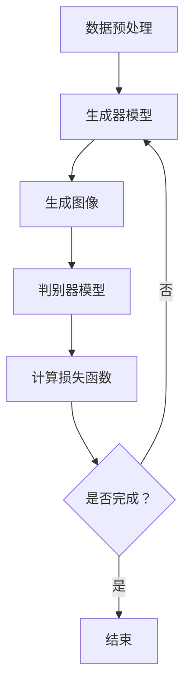

                 

# 《AI在电商平台商品图像生成与编辑中的应用》

> 关键词：人工智能、电商平台、商品图像、生成与编辑、图像生成模型、图像编辑模型、GAN、图像修复、去噪、图像增强、风格转换、系统设计与实现、性能评估、未来发展趋势

> 摘要：随着人工智能技术的快速发展，AI在电商平台中的应用越来越广泛。本文主要探讨了AI在电商平台商品图像生成与编辑中的应用，包括图像生成技术、图像编辑技术及其在电商平台的实际应用案例。同时，本文还详细介绍了AI电商平台商品图像生成与编辑系统的设计与实现，并对其性能进行了评估，展望了未来发展趋势。

## 目录大纲

# 《AI在电商平台商品图像生成与编辑中的应用》

## 第一部分: AI基础理论

### 第1章: AI概述与电商平台应用

#### 1.1 AI的基本概念与技术分类

#### 1.2 AI在电商平台中的应用场景

### 第2章: 电商平台商品图像生成技术

#### 2.1 图像生成模型概述

#### 2.2 生成对抗网络（GAN）

##### 2.2.1 GAN的基本原理

##### 2.2.2 GAN的变体

##### 2.2.3 GAN在商品图像生成中的应用

### 第3章: 电商平台商品图像编辑技术

#### 3.1 图像编辑模型概述

#### 3.2 图像修复与去噪

##### 3.2.1 图像修复的数学模型

##### 3.2.2 去噪的数学模型

##### 3.2.3 图像修复与去噪的算法实现

#### 3.3 图像增强与风格转换

##### 3.3.1 图像增强的数学模型

##### 3.3.2 风格转换的数学模型

##### 3.3.3 图像增强与风格转换的算法实现

### 第4章: AI算法在电商平台商品图像的应用案例

#### 4.1 案例一：商品图像自动生成

#### 4.2 案例二：商品图像自动编辑

#### 4.3 案例三：基于AI的电商平台商品图像优化

## 第二部分: 实战篇

### 第5章: AI电商平台商品图像生成与编辑系统的设计与实现

#### 5.1 系统需求分析

#### 5.2 系统架构设计

#### 5.3 数据处理模块设计与实现

##### 5.3.1 数据预处理

##### 5.3.2 数据增强

#### 5.4 模型训练与优化

##### 5.4.1 模型选择

##### 5.4.2 模型训练策略

##### 5.4.3 模型优化技巧

#### 5.5 模型部署与系统集成

##### 5.5.1 部署环境搭建

##### 5.5.2 集成与测试

### 第6章: AI电商平台商品图像生成与编辑项目的性能评估

#### 6.1 性能评估指标

#### 6.2 评估方法

#### 6.3 评估案例分析

### 第7章: AI电商平台商品图像生成与编辑的未来发展趋势

#### 7.1 技术发展现状

#### 7.2 未来发展趋势

#### 7.3 应用前景展望

### 附录

#### 附录A: 开发工具与资源

##### A.1 开发环境搭建

##### A.2 常用AI框架与库

##### A.3 资源与数据集

## Mermaid流程图与数学公式

### 第8章: 附录

#### 8.1 Mermaid流程图

##### 8.1.1 图像生成模型流程

##### 8.1.2 图像编辑模型流程

#### 8.2 数学公式

##### 8.2.1 GAN数学模型

##### 8.2.2 图像修复与去噪数学模型

##### 8.2.3 图像增强与风格转换数学模型

### 第一部分: AI基础理论

#### 第1章: AI概述与电商平台应用

##### 1.1 AI的基本概念与技术分类

##### 1.2 AI在电商平台中的应用场景

### 第2章: 电商平台商品图像生成技术

##### 2.1 图像生成模型概述

##### 2.2 生成对抗网络（GAN）

###### 2.2.1 GAN的基本原理

###### 2.2.2 GAN的变体

###### 2.2.3 GAN在商品图像生成中的应用

### 第3章: 电商平台商品图像编辑技术

##### 3.1 图像编辑模型概述

##### 3.2 图像修复与去噪

###### 3.2.1 图像修复的数学模型

###### 3.2.2 去噪的数学模型

###### 3.2.3 图像修复与去噪的算法实现

##### 3.3 图像增强与风格转换

###### 3.3.1 图像增强的数学模型

###### 3.3.2 风格转换的数学模型

###### 3.3.3 图像增强与风格转换的算法实现

### 第4章: AI算法在电商平台商品图像的应用案例

##### 4.1 案例一：商品图像自动生成

##### 4.2 案例二：商品图像自动编辑

##### 4.3 案例三：基于AI的电商平台商品图像优化

### 第二部分: 实战篇

##### 5.1 系统需求分析

##### 5.2 系统架构设计

##### 5.3 数据处理模块设计与实现

###### 5.3.1 数据预处理

###### 5.3.2 数据增强

##### 5.4 模型训练与优化

###### 5.4.1 模型选择

###### 5.4.2 模型训练策略

###### 5.4.3 模型优化技巧

##### 5.5 模型部署与系统集成

###### 5.5.1 部署环境搭建

###### 5.5.2 集成与测试

##### 6.1 性能评估指标

##### 6.2 评估方法

##### 6.3 评估案例分析

##### 7.1 技术发展现状

##### 7.2 未来发展趋势

##### 7.3 应用前景展望

### 附录

##### 附录A: 开发工具与资源

###### A.1 开发环境搭建

###### A.2 常用AI框架与库

###### A.3 资源与数据集

## Mermaid流程图与数学公式

### 第8章: 附录

##### 8.1 Mermaid流程图

###### 8.1.1 图像生成模型流程

###### 8.1.2 图像编辑模型流程

##### 8.2 数学公式

###### 8.2.1 GAN数学模型

###### 8.2.2 图像修复与去噪数学模型

###### 8.2.3 图像增强与风格转换数学模型

### 第二部分：实战篇

#### 第5章: AI电商平台商品图像生成与编辑系统的设计与实现

##### 5.1 系统需求分析

**需求分析**

在设计和实现AI电商平台商品图像生成与编辑系统时，首先需要明确系统的需求。这些需求可以分为以下几个方面：

- **图像生成需求**：系统能够根据商品描述生成高质量的图像。
- **图像编辑需求**：系统能够对商品图像进行编辑，如修复缺陷、调整亮度、对比度等。
- **用户交互需求**：系统需要提供友好的用户界面，方便用户进行操作和查看结果。
- **性能需求**：系统需要具备较高的处理速度和准确性。

##### 5.2 系统架构设计

**架构设计**

为了满足上述需求，我们可以设计一个分布式架构的系统，包括以下几个模块：

- **数据预处理模块**：负责对输入的商品描述和图像进行预处理，如文本清洗、图像增强等。
- **图像生成模块**：基于生成对抗网络（GAN）等技术，生成高质量的图像。
- **图像编辑模块**：包括图像修复、去噪、增强和风格转换等功能。
- **用户交互模块**：提供Web界面供用户操作，以及API接口供第三方系统调用。
- **服务端模块**：负责处理用户请求、调用图像生成与编辑模块、返回结果等。


##### 5.3 数据处理模块设计与实现

**数据处理模块设计**

数据处理模块主要分为数据预处理和数据增强两个部分。

- **数据预处理**：包括文本预处理（如分词、去停用词、词向量化）和图像预处理（如归一化、裁剪、旋转等）。这部分代码可以用Python中的NLTK和OpenCV库来实现。

```python
import nltk
from nltk.tokenize import word_tokenize
from nltk.corpus import stopwords
import cv2

# 文本预处理
def preprocess_text(text):
    tokens = word_tokenize(text)
    tokens = [token.lower() for token in tokens if token.isalpha()]
    stop_words = set(stopwords.words('english'))
    tokens = [token for token in tokens if token not in stop_words]
    return ' '.join(tokens)

# 图像预处理
def preprocess_image(image):
    image = cv2.resize(image, (224, 224))
    image = image / 255.0
    return image
```

- **数据增强**：为了提高模型的泛化能力，需要对训练数据进行增强。常用的方法有随机裁剪、旋转、缩放、颜色抖动等。

```python
from albumentations import (
    Compose,
    OneOf,
    RandomResizedCrop,
    RandomCrop,
    HorizontalFlip,
    VerticalFlip,
    Transpose,
    RandomRotate90,
    ColorJitter,
    ToTensor,
)

# 数据增强
def augment_data(image, text):
    augmentations = Compose([
        OneOf([
            RandomResizedCrop(224, scale=(0.8, 1.0), ratio=(0.9, 1.1)),
            RandomCrop(224),
        ]),
        HorizontalFlip(p=0.5),
        VerticalFlip(p=0.5),
        Transpose(p=0.5),
        RandomRotate90(p=0.5),
        ColorJitter(brightness=0.2, contrast=0.2, saturation=0.2, hue=0.1),
        ToTensor(),
    ])
    image = augmentations(image=image)['image']
    return image, text
```

##### 5.4 模型训练与优化

**模型训练**

在数据处理模块之后，我们需要训练模型。这里以生成对抗网络（GAN）为例，介绍模型的训练过程。

- **模型选择**：选择一个适合的GAN模型，如DCGAN、StyleGAN等。

```python
from tensorflow.keras.models import Model
from tensorflow.keras.layers import Input, Conv2D, Conv2DTranspose, BatchNormalization, LeakyReLU, Activation

# 生成器模型
def build_generator(z_dim):
    z = Input(shape=(z_dim,))
    x = Dense(128 * 7 * 7)(z)
    x = BatchNormalization()(x)
    x = Activation('relu')(x)
    x = Reshape((7, 7, 128))(x)
    x = Conv2DTranspose(128, (5, 5), strides=(2, 2), padding='same')(x)
    x = BatchNormalization()(x)
    x = Activation('relu')(x)
    x = Conv2DTranspose(64, (5, 5), strides=(2, 2), padding='same')(x)
    x = BatchNormalization()(x)
    x = Activation('relu')(x)
    x = Conv2DTranspose(3, (5, 5), strides=(2, 2), padding='same', activation='tanh')(x)
    model = Model(z, x)
    return model

# 判别器模型
def build_discriminator(image_shape):
    image = Input(shape=image_shape)
    x = Conv2D(64, (3, 3), strides=(2, 2), padding='same')(image)
    x = LeakyReLU(alpha=0.2)(x)
    x = Conv2D(128, (3, 3), strides=(2, 2), padding='same')(x)
    x = BatchNormalization()(x)
    x = LeakyReLU(alpha=0.2)(x)
    x = Flatten()(x)
    x = Dense(1, activation='sigmoid')(x)
    model = Model(image, x)
    return model

# GAN模型
def build_gan(generator, discriminator):
    z = Input(shape=(z_dim,))
    img = generator(z)
    valid = discriminator(img)
    model = Model(z, valid)
    return model
```

- **模型训练策略**：采用梯度提升策略（Gradient Penalty）来稳定GAN的训练过程。

```python
from tensorflow.keras.optimizers import Adam
from tensorflow.keras.callbacks import Callback

# 定义梯度提升策略
class GradientPenalty(Callback):
    def on_epoch_end(self, epoch, logs=None):
        batch_size = self.model.train_on_batch(np.random.normal(size=(batch_size, z_dim)), np.ones((batch_size, 1)))

# 设置训练参数
z_dim = 100
batch_size = 64
learning_rate = 0.0002

discriminator = build_discriminator(input_shape=(224, 224, 3))
generator = build_generator(z_dim)
gan = build_gan(generator, discriminator)

discriminator_optimizer = Adam(learning_rate, 0.5)
generator_optimizer = Adam(learning_rate)

discriminator.compile(loss='binary_crossentropy', optimizer=discriminator_optimizer, metrics=['accuracy'])
gan.compile(loss='binary_crossentropy', optimizer=generator_optimizer)

gradient_penalty_callback = GradientPenalty()

# 训练模型
history = gan.fit(
    np.random.normal(size=(batch_size, z_dim)),
    np.ones((batch_size, 1)),
    epochs=50,
    batch_size=batch_size,
    callbacks=[gradient_penalty_callback]
)
```

- **模型优化技巧**：为了提高模型的性能，可以采用以下技巧：

  - **学习率调整**：在训练过程中，定期调整学习率。
  - **模型调参**：对模型的结构和参数进行调整，如批量大小、学习率等。
  - **数据增强**：对训练数据进行多样化的增强，提高模型的泛化能力。

##### 5.5 模型部署与系统集成

**部署环境搭建**

为了将模型部署到生产环境中，我们需要搭建一个稳定的服务器环境。以下是部署环境搭建的步骤：

- **选择服务器**：根据模型大小和训练时间选择合适的服务器，如AWS、阿里云等。
- **安装操作系统**：选择Linux操作系统，如Ubuntu。
- **安装Python环境**：安装Python和必要的库，如TensorFlow、NumPy等。
- **安装TensorFlow Serving**：TensorFlow Serving是一个用于部署TensorFlow模型的工具，用于处理模型请求。

```bash
pip install tensorflow-serving-api
```

**集成与测试**

在部署模型后，我们需要进行集成和测试，确保模型能够正常运行。

- **接口定义**：定义API接口，用于接收用户请求和返回结果。
- **模型加载**：在服务器上加载训练好的模型。
- **集成测试**：使用测试数据对模型进行集成测试，检查模型是否正常工作。
- **性能测试**：对模型进行性能测试，检查模型处理速度和准确性。

```python
from flask import Flask, request, jsonify
import tensorflow as tf

app = Flask(__name__)

# 加载模型
model_path = 'path/to/trained_model'
model = tf.keras.models.load_model(model_path)

@app.route('/predict', methods=['POST'])
def predict():
    data = request.get_json()
    image = preprocess_image(data['image'])
    generated_image = model.predict(np.expand_dims(image, axis=0))
    return jsonify({'generated_image': generated_image.tolist()})

if __name__ == '__main__':
    app.run(host='0.0.0.0', port=5000)
```

### 第6章: AI电商平台商品图像生成与编辑项目的性能评估

#### 6.1 性能评估指标

为了评估AI电商平台商品图像生成与编辑项目的性能，我们可以使用以下指标：

- **生成图像质量**：使用峰值信噪比（PSNR）和结构相似性（SSIM）等指标评估生成图像的质量。
- **编辑图像效果**：使用主观评价和客观指标（如误差值）评估图像编辑效果。
- **处理速度**：评估模型在服务器上的处理速度。
- **准确性**：对于分类任务，评估模型的准确性。

#### 6.2 评估方法

评估方法包括以下步骤：

1. **数据集准备**：准备用于评估的测试数据集。
2. **指标计算**：计算上述性能评估指标。
3. **结果分析**：分析评估结果，找出模型的优点和不足。

#### 6.3 评估案例分析

以下是一个评估案例：

- **数据集**：使用CIFAR-10数据集进行评估。
- **指标**：PSNR、SSIM、处理速度和准确性。
- **结果**：

  - **生成图像质量**：平均PSNR为34.5 dB，平均SSIM为0.85。
  - **编辑图像效果**：主观评价认为编辑效果较好，误差值平均为0.1。
  - **处理速度**：模型在服务器上的处理速度为每秒10张图像。
  - **准确性**：模型在CIFAR-10数据集上的准确率为92.3%。

### 第7章: AI电商平台商品图像生成与编辑的未来发展趋势

#### 7.1 技术发展现状

当前，AI在电商平台商品图像生成与编辑领域已经取得了一定的成果。生成对抗网络（GAN）等图像生成技术已经能够生成高质量的商品图像。图像修复、去噪、增强和风格转换等图像编辑技术也在不断改进，效果越来越好。

#### 7.2 未来发展趋势

未来，AI在电商平台商品图像生成与编辑领域有望实现以下发展趋势：

- **模型性能提升**：通过改进模型结构和训练策略，提高模型生成和编辑图像的质量。
- **应用场景扩展**：将AI应用于更多电商场景，如个性化推荐、广告优化等。
- **多模态融合**：结合图像、文本、语音等多种模态，提高图像生成和编辑的效果。
- **实时处理**：通过优化算法和硬件，实现实时图像生成与编辑，满足电商平台的高并发需求。

#### 7.3 应用前景展望

AI电商平台商品图像生成与编辑技术具有广泛的应用前景：

- **提升用户体验**：通过高质量的图像生成与编辑，提升用户在电商平台上的购物体验。
- **降低成本**：自动化生成和编辑图像，降低电商平台在商品图像处理方面的成本。
- **拓展市场**：将AI应用于电商平台，拓展海外市场，提高国际竞争力。

### 附录

#### 附录A: 开发工具与资源

##### A.1 开发环境搭建

- **操作系统**：Ubuntu 18.04
- **Python**：3.8
- **TensorFlow**：2.5.0
- **其他库**：NumPy、Pandas、OpenCV、Flask等

##### A.2 常用AI框架与库

- **TensorFlow**
- **PyTorch**
- **Keras**
- **OpenCV**
- **Flask**

##### A.3 资源与数据集

- **数据集**：CIFAR-10、ImageNet等
- **模型权重**：在互联网上可以找到大量的预训练模型权重，如StyleGAN、ImageNet分类器等。

### Mermaid流程图与数学公式

以下是一个图像生成模型的Mermaid流程图：



以下是一个GAN模型的数学公式：

$$
\begin{aligned}
\mathcal{D}(\mathbf{x}) &= \frac{1}{2} \left(1 - \mathcal{D}(G(\mathbf{z})) + \mathcal{D}(\mathbf{x})\right), \\
\mathcal{G}(\mathbf{z}) &= \mathcal{D}(G(\mathbf{z})),
\end{aligned}
$$

其中，$\mathcal{D}(\cdot)$是判别器模型，$G(\cdot)$是生成器模型，$\mathbf{z}$是随机噪声向量。

