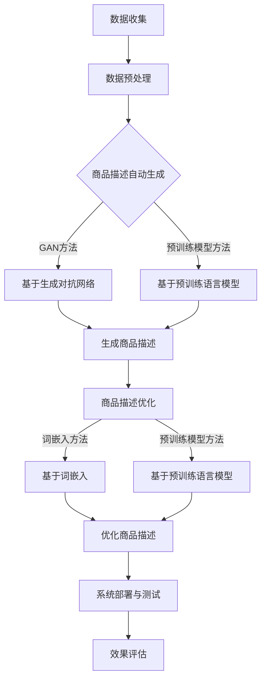
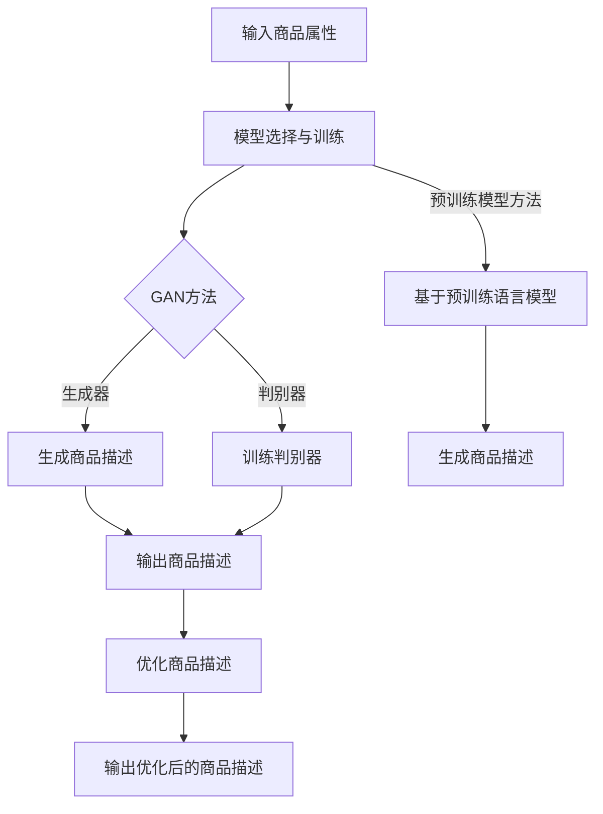
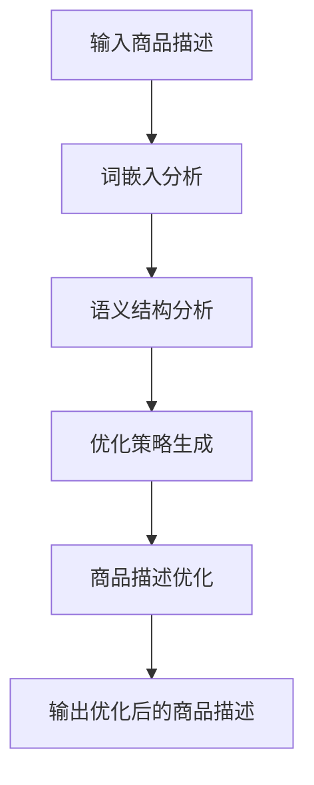

                 

### 文章标题

《AI在电商平台商品描述自动生成与优化中的应用》

### 关键词

人工智能、自然语言处理、商品描述、自动生成、优化技术

### 摘要

本文将探讨人工智能（AI）在电商平台商品描述自动生成与优化中的应用。首先，我们介绍了电商平台的发展现状和商品描述的重要性，以及AI在电商平台中的应用现状。接着，我们深入讲解了AI的基础理论，包括人工智能、机器学习和自然语言处理等。随后，本文详细探讨了商品描述自动生成技术，包括基于生成对抗网络（GAN）和预训练语言模型的自动生成方法。此外，本文还介绍了商品描述优化技术，包括基于词嵌入和预训练语言模型的优化方法。为了验证这些技术，我们通过两个实际案例进行了详细分析，并对未来研究方向进行了展望。

### 目录大纲

# 《AI在电商平台商品描述自动生成与优化中的应用》目录大纲

## 第1章 引言

### 1.1 研究背景

#### 1.1.1 电商平台的发展现状

#### 1.1.2 商品描述在电商平台的重要性

#### 1.1.3 AI在电商平台的应用现状

### 1.2 本书目的与结构

#### 1.2.1 研究目的

#### 1.2.2 本书结构

## 第2章 AI基础理论

### 2.1 人工智能概述

#### 2.1.1 人工智能的定义

#### 2.1.2 人工智能的发展历程

#### 2.1.3 人工智能的应用领域

### 2.2 机器学习基础

#### 2.2.1 机器学习的基本概念

#### 2.2.2 监督学习、无监督学习和强化学习

#### 2.2.3 常见机器学习算法

### 2.3 自然语言处理基础

#### 2.3.1 自然语言处理的基本概念

#### 2.3.2 词嵌入技术

#### 2.3.3 序列模型与注意力机制

## 第3章 商品描述自动生成技术

### 3.1 商品描述生成技术概述

#### 3.1.1 商品描述自动生成技术的意义

#### 3.1.2 商品描述自动生成技术的主要方法

### 3.2 基于生成对抗网络（GAN）的自动生成方法

#### 3.2.1 GAN的基本原理

#### 3.2.2 GAN在商品描述自动生成中的应用

#### 3.2.3 GAN的优缺点分析

### 3.3 基于预训练语言模型的自动生成方法

#### 3.3.1 预训练语言模型的基本原理

#### 3.3.2 预训练语言模型在商品描述自动生成中的应用

#### 3.3.3 预训练语言模型的优缺点分析

## 第4章 商品描述优化技术

### 4.1 商品描述优化技术概述

#### 4.1.1 商品描述优化的意义

#### 4.1.2 商品描述优化技术的主要方法

### 4.2 基于词嵌入的优化方法

#### 4.2.1 词嵌入技术在商品描述优化中的应用

#### 4.2.2 基于词嵌入的优化算法

#### 4.2.3 基于词嵌入的优化方法的优缺点分析

### 4.3 基于预训练语言模型的优化方法

#### 4.3.1 预训练语言模型在商品描述优化中的应用

#### 4.3.2 基于预训练语言模型的优化算法

#### 4.3.3 基于预训练语言模型的优化方法的优缺点分析

## 第5章 案例研究

### 5.1 案例一：某电商平台的商品描述自动生成系统

#### 5.1.1 案例背景

#### 5.1.2 系统设计

#### 5.1.3 实施过程

#### 5.1.4 实施效果评估

### 5.2 案例二：某电商平台的商品描述优化系统

#### 5.2.1 案例背景

#### 5.2.2 系统设计

#### 5.2.3 实施过程

#### 5.2.4 实施效果评估

## 第6章 总结与展望

### 6.1 研究总结

#### 6.1.1 研究成果

#### 6.1.2 研究局限

### 6.2 未来研究方向

#### 6.2.1 技术发展趋势

#### 6.2.2 应用前景

#### 6.2.3 面临的挑战

## 附录

### A.1 相关资源

#### A.1.1 数据集

#### A.1.2 工具

#### A.1.3 参考文献

### A.2 Mermaid 流程图

#### A.2.1 AI在电商平台商品描述自动生成与优化中的应用流程图

#### A.2.2 商品描述自动生成技术流程图

#### A.2.3 商品描述优化技术流程图

### A.3 伪代码

#### A.3.1 基于生成对抗网络的商品描述自动生成算法

#### A.3.2 基于预训练语言模型的商品描述自动生成算法

#### A.3.3 基于预训练语言模型的商品描述优化算法

### 1.1 研究背景

#### 1.1.1 电商平台的发展现状

电商平台作为现代电子商务的重要组成部分，已经深刻改变了人们的购物习惯和消费方式。随着互联网技术的飞速发展和移动互联网的普及，电商平台的发展呈现出以下趋势：

1. **市场规模不断扩大**：全球电商市场规模持续增长，尤其在中国、美国等电商大国，电商平台已经成为人们日常生活中不可或缺的一部分。

2. **消费者行为变化**：消费者越来越注重购物体验，追求个性化、定制化的商品和服务。同时，随着科技的发展，消费者对于移动购物、社交购物等新兴购物方式的接受度不断提高。

3. **物流配送升级**：随着物流技术的进步，电商平台物流配送速度不断加快，物流服务质量得到显著提升，极大地提高了消费者的购物满意度。

4. **竞争日益激烈**：电商平台之间的竞争愈发激烈，各大电商平台通过优化用户体验、提高服务质量和创新业务模式来争夺市场份额。

#### 1.1.2 商品描述在电商平台的重要性

商品描述是电商平台中至关重要的组成部分，直接影响消费者的购买决策和购买体验。以下是商品描述在电商平台中的重要性：

1. **提供商品信息**：商品描述为消费者提供了详细的产品信息，包括产品的规格、功能、使用方法等，帮助消费者更好地了解产品，从而做出购买决策。

2. **提高搜索排名**：高质量的商品描述能够提高商品的搜索排名，使得商品更容易被消费者发现，从而增加销售机会。

3. **增强用户粘性**：优秀的商品描述能够吸引消费者的注意力，提高用户的购物体验，增加用户在平台上的停留时间，提升用户粘性。

4. **提升品牌形象**：良好的商品描述不仅能够提高产品的销售量，还能提升品牌的知名度和美誉度，有助于企业建立长期的品牌形象。

#### 1.1.3 AI在电商平台的应用现状

随着人工智能技术的快速发展，AI已经广泛应用于电商平台的各个领域，包括商品推荐、客服、图像识别等。在商品描述方面，AI的应用主要体现在以下几个方面：

1. **自动生成商品描述**：通过机器学习和自然语言处理技术，AI可以自动生成商品描述，大大提高了商品描述的生产效率。

2. **优化商品描述**：AI可以通过分析消费者行为和搜索数据，为商品描述提供优化建议，提高描述的质量和相关性。

3. **智能客服**：AI客服机器人可以自动回答消费者的疑问，提供个性化的购物建议，提高客服效率。

4. **图像识别**：AI可以通过图像识别技术，自动识别商品图片，生成相应的商品描述，提高了商品信息的准确性。

综上所述，AI在电商平台商品描述中的应用不仅提高了商品描述的效率和质量，还为电商平台提供了丰富的应用场景，具有广阔的发展前景。本文将深入探讨AI在商品描述自动生成与优化中的应用，分析现有技术的优缺点，并探讨未来的研究方向。

### 1.2 本书目的与结构

#### 1.2.1 研究目的

本书旨在系统地探讨人工智能（AI）在电商平台商品描述自动生成与优化中的应用，具体目标包括：

1. **介绍AI的基础理论**：阐述人工智能、机器学习和自然语言处理等基本概念，为后续章节提供理论基础。

2. **分析商品描述自动生成技术**：详细介绍基于生成对抗网络（GAN）和预训练语言模型的自动生成方法，评估其优缺点。

3. **探讨商品描述优化技术**：分析基于词嵌入和预训练语言模型的优化方法，评估其性能和适用性。

4. **通过案例研究验证技术效果**：通过实际案例，验证AI在商品描述自动生成与优化中的应用效果，为电商平台的实践提供参考。

5. **展望未来研究方向**：分析AI在电商平台商品描述领域的发展趋势，探讨未来可能的研究方向。

#### 1.2.2 本书结构

本书共分为6章，具体内容如下：

- **第1章 引言**：介绍电商平台的发展现状、商品描述的重要性以及AI在电商平台中的应用现状。
- **第2章 AI基础理论**：阐述人工智能、机器学习和自然语言处理的基本概念，为后续章节提供理论基础。
- **第3章 商品描述自动生成技术**：介绍商品描述自动生成技术，分析基于生成对抗网络（GAN）和预训练语言模型的自动生成方法。
- **第4章 商品描述优化技术**：探讨商品描述优化技术，分析基于词嵌入和预训练语言模型的优化方法。
- **第5章 案例研究**：通过两个实际案例，验证AI在商品描述自动生成与优化中的应用效果。
- **第6章 总结与展望**：总结研究成果，分析研究局限，探讨未来研究方向。

通过本书的深入探讨，旨在为电商平台提供有效的AI应用方案，提升商品描述的质量和用户体验，从而推动电商平台的可持续发展。

## 第2章 AI基础理论

### 2.1 人工智能概述

#### 2.1.1 人工智能的定义

人工智能（Artificial Intelligence，简称AI）是指通过计算机模拟人类智能行为，实现智能感知、学习、推理、决策和问题解决的技术体系。人工智能的定义可以从多个角度进行理解，但核心都是围绕使计算机具有类似人类的智能行为。

首先，从技术角度，人工智能旨在通过算法和计算模型模拟人类的认知过程，包括感知、理解、学习和行为决策等。具体来说，人工智能包括以下几个核心组成部分：

1. **感知**：通过传感器和输入设备获取外部环境信息，如图像、声音和文本等。
2. **理解**：对获取的信息进行分析和处理，提取有用信息，理解其含义和关系。
3. **学习**：通过数据和经验，自适应调整自身的知识和行为，提高任务处理能力。
4. **推理**：基于已有知识和信息，进行逻辑推理和决策，实现智能行为。
5. **行动**：根据推理结果，采取相应的行动，实现任务目标。

其次，从应用角度，人工智能可以广泛应用于多个领域，包括但不限于：

1. **智能制造**：通过工业机器人、自动化生产线等实现生产过程的智能化。
2. **智能交通**：利用人工智能优化交通管理，提高道路通行效率和交通安全。
3. **医疗健康**：通过医疗影像分析、疾病预测等提升医疗诊断和治疗的智能化水平。
4. **金融科技**：利用人工智能实现智能投顾、反欺诈、信用评估等金融服务。
5. **教育**：通过智能辅导、在线教育平台等提高教育质量和学习效果。

总之，人工智能的定义和范畴是动态发展的，它不断融合新的技术理念和应用场景，推动社会进步和产业变革。

#### 2.1.2 人工智能的发展历程

人工智能的发展历程可以追溯到20世纪50年代。以下是人工智能主要发展阶段和标志性事件：

1. **初创阶段（1950-1969）**：
    - **1950年**：艾伦·图灵提出图灵测试，为人工智能奠定了理论基础。
    - **1956年**：达特茅斯会议提出人工智能这一术语，标志着人工智能作为一门独立学科的诞生。
    - **1958年**：约翰·麦卡锡提出LISP语言，成为人工智能领域的重要工具。

2. **第一次高潮阶段（1970-1980）**：
    - **1972年**：开发出第一个专家系统Dendral，展示了人工智能在解决复杂问题方面的潜力。
    - **1977年**：开发了自然语言理解系统ELIZA，引发了公众对人工智能的关注。

3. **低谷阶段（1980-1990）**：
    - **1980年**：专家系统逐渐衰落，人们开始质疑人工智能的可行性。
    - **1987年**：计算机围棋程序“深蓝”战胜了国际象棋世界冠军，人工智能重新引起广泛关注。

4. **复兴阶段（1990-2010）**：
    - **1997年**：计算机围棋程序“深蓝”战胜了国际象棋世界冠军，标志着人工智能在特定领域取得了突破。
    - **2006年**：深度学习的兴起，使人工智能在图像识别、语音识别等领域取得了显著进展。

5. **快速发展的阶段（2010至今）**：
    - **2012年**：AlexNet在ImageNet竞赛中取得突破性成绩，深度学习迅速崛起。
    - **2016年**：谷歌的AlphaGo在围棋比赛中战胜世界冠军，标志着人工智能在通用智能领域取得了重大突破。

人工智能的发展历程展示了从理论研究到实际应用的逐步深化，不同阶段的技术突破和应用案例推动了人工智能的不断进步。

#### 2.1.3 人工智能的应用领域

人工智能技术已经渗透到各个领域，极大地提升了各行业的效率和质量。以下是人工智能在主要领域的应用：

1. **智能制造**：
    - **工业机器人**：通过人工智能技术，实现机器人的自主决策和动作规划，提高生产效率和灵活性。
    - **自动化生产线**：利用人工智能优化生产流程，减少人为干预，提高生产效率和产品一致性。

2. **医疗健康**：
    - **医学影像分析**：通过深度学习算法，对医学影像进行自动分析，提高疾病检测的准确性和效率。
    - **疾病预测和诊断**：利用大数据和机器学习技术，对患者的健康数据进行预测和分析，提前发现疾病风险。

3. **金融科技**：
    - **智能投顾**：通过分析用户投资偏好和市场数据，提供个性化的投资建议，提高投资回报率。
    - **反欺诈**：利用人工智能监测交易行为，自动识别和防范欺诈行为，保障金融交易安全。

4. **教育**：
    - **在线教育平台**：通过人工智能技术，实现个性化学习路径推荐，提高学习效果和用户体验。
    - **智能辅导**：利用自然语言处理技术，为学习者提供智能化的问答和辅导服务。

5. **智能交通**：
    - **自动驾驶**：通过传感器和计算机视觉技术，实现车辆的自动驾驶，提高交通效率和安全性。
    - **智能交通管理**：利用人工智能优化交通信号控制和路线规划，缓解交通拥堵。

人工智能的应用领域广泛，涵盖了从生产制造到医疗服务、金融科技、教育等多个方面，展示了其强大的潜力和广泛的应用前景。

### 2.2 机器学习基础

#### 2.2.1 机器学习的基本概念

机器学习（Machine Learning，简称ML）是人工智能的一个重要分支，主要研究如何通过计算机算法，从数据中自动学习和发现规律，实现对未知数据的预测和决策。机器学习的基本概念包括以下几点：

1. **监督学习（Supervised Learning）**：
    - **定义**：监督学习是一种从标记数据中学习的方法，即输入数据和相应的输出（标签）都已知。
    - **目标**：通过学习输入和输出之间的映射关系，实现对未知数据的预测。
    - **算法**：常见的监督学习算法包括线性回归、逻辑回归、支持向量机（SVM）、决策树、随机森林等。

2. **无监督学习（Unsupervised Learning）**：
    - **定义**：无监督学习是在没有标记数据的情况下，通过数据自身的结构和模式进行学习。
    - **目标**：发现数据中的隐藏结构和规律，如聚类、降维等。
    - **算法**：常见的无监督学习算法包括K-均值聚类、主成分分析（PCA）、自编码器等。

3. **强化学习（Reinforcement Learning）**：
    - **定义**：强化学习是一种通过与环境交互，不断学习和改进策略的方法。
    - **目标**：在特定环境中，通过最大化累积奖励，实现智能体的最优行为。
    - **算法**：常见的强化学习算法包括Q学习、深度Q网络（DQN）、策略梯度算法等。

4. **半监督学习和迁移学习**：
    - **半监督学习（Semi-supervised Learning）**：在有限标记数据和大量未标记数据之间进行学习，利用未标记数据提高学习效果。
    - **迁移学习（Transfer Learning）**：将已有任务的知识迁移到新任务上，提高新任务的性能。

#### 2.2.2 监督学习、无监督学习和强化学习

监督学习、无监督学习和强化学习是机器学习的三大主要学习类型，各自有其独特的特点和适用场景。

1. **监督学习**：
    - **特点**：
        - 输入和输出数据都有标签。
        - 学习目标是预测未知数据的输出。
        - 需要大量标记数据进行训练。
    - **适用场景**：
        - 通用分类问题：如邮件分类、垃圾邮件检测等。
        - 回归问题：如房屋价格预测、股票价格预测等。
        - 时间序列分析：如股票走势预测、天气预测等。

2. **无监督学习**：
    - **特点**：
        - 没有输出标签，需要从数据中发掘内在结构和模式。
        - 学习目标是发现数据的聚类、降维等。
        - 可以利用未标记数据进行学习。
    - **适用场景**：
        - 聚类问题：如市场细分、客户分类等。
        - 数据降维：如主成分分析（PCA）、自编码器等。
        - 异常检测：如异常交易检测、网络攻击检测等。

3. **强化学习**：
    - **特点**：
        - 通过与环境交互，不断学习和改进策略。
        - 需要明确奖励机制和决策策略。
        - 学习目标是实现智能体的最优行为。
    - **适用场景**：
        - 自动驾驶：如路径规划、避障等。
        - 游戏人工智能：如围棋、电子竞技等。
        - 机器人控制：如机器人导航、任务执行等。

#### 2.2.3 常见机器学习算法

机器学习算法是机器学习应用的核心，常见的算法包括线性回归、逻辑回归、支持向量机（SVM）、决策树、随机森林等。

1. **线性回归（Linear Regression）**：
    - **定义**：线性回归是一种用于预测数值型变量的监督学习算法。
    - **模型**：y = w1 * x1 + w2 * x2 + ... + wn * xn + b，其中y为输出变量，x1, x2, ..., xn为输入变量，w1, w2, ..., wn为权重，b为偏置。
    - **优点**：
        - 简单易实现。
        - 适用于线性关系较强的数据。
    - **缺点**：
        - 对非线性关系效果较差。
        - 容易欠拟合。

2. **逻辑回归（Logistic Regression）**：
    - **定义**：逻辑回归是一种用于分类问题的监督学习算法。
    - **模型**：P(y=1) = 1 / (1 + e^(-z))，其中z = w1 * x1 + w2 * x2 + ... + wn * xn + b，P(y=1)为输出变量为1的概率。
    - **优点**：
        - 适用于二分类问题。
        - 可以计算概率。
    - **缺点**：
        - 对多重分类问题效果较差。
        - 对异常值敏感。

3. **支持向量机（SVM）**：
    - **定义**：支持向量机是一种用于分类和回归的监督学习算法，通过找到最佳决策边界，实现分类。
    - **模型**：最大化间隔，使得分类边界尽可能远离支持向量。
    - **优点**：
        - 高维空间效果显著。
        - 泛化能力强。
    - **缺点**：
        - 计算复杂度高。
        - 对异常值敏感。

4. **决策树（Decision Tree）**：
    - **定义**：决策树是一种基于特征分割数据的分类和回归算法。
    - **模型**：通过递归地将数据集划分为子集，每个子集对应一个特征和阈值。
    - **优点**：
        - 易于理解和实现。
        - 对非线性数据效果好。
    - **缺点**：
        - 过拟合问题严重。
        - 可解释性较差。

5. **随机森林（Random Forest）**：
    - **定义**：随机森林是一种基于决策树的集成学习方法，通过构建多个决策树，并利用投票机制进行预测。
    - **模型**：每个决策树独立训练，最终结果通过多数投票决定。
    - **优点**：
        - 减少过拟合。
        - 提高模型稳定性。
        - 易于并行计算。
    - **缺点**：
        - 需要大量计算资源。
        - 特征重要性分析复杂。

通过上述对机器学习基本概念和常见算法的介绍，我们可以更好地理解和应用机器学习技术，为电商平台商品描述自动生成与优化提供理论基础。

### 2.3 自然语言处理基础

#### 2.3.1 自然语言处理的基本概念

自然语言处理（Natural Language Processing，简称NLP）是人工智能领域的一个重要分支，旨在使计算机能够理解、生成和处理人类语言。NLP涵盖了多个研究领域，包括语言模型、文本分类、情感分析、机器翻译等。以下是NLP的基本概念：

1. **语言模型（Language Model）**：
    - **定义**：语言模型是一种用于预测下一个单词或词组的概率分布的模型，它是NLP的基础。
    - **作用**：语言模型可以用于文本生成、自动摘要、机器翻译等任务。
    - **类型**：
        - **统计语言模型**：通过统计方法（如N-gram模型）预测下一个单词的概率。
        - **神经网络语言模型**：通过神经网络（如RNN、Transformer）生成语言模型。

2. **文本分类（Text Classification）**：
    - **定义**：文本分类是将文本数据分为预定义类别的一种任务。
    - **作用**：文本分类可以应用于垃圾邮件检测、情感分析、主题分类等。
    - **方法**：
        - **基于规则的方法**：使用预定义的规则进行分类。
        - **机器学习的方法**：通过训练分类模型（如SVM、朴素贝叶斯、随机森林等）进行分类。

3. **情感分析（Sentiment Analysis）**：
    - **定义**：情感分析是识别文本中表达的情感倾向（如正面、负面、中性）的一种任务。
    - **作用**：情感分析可以用于品牌监测、市场调研、客户反馈分析等。
    - **方法**：
        - **基于词典的方法**：使用预定义的词典进行情感分类。
        - **机器学习的方法**：通过训练情感分类模型进行情感分析。

4. **机器翻译（Machine Translation）**：
    - **定义**：机器翻译是将一种语言的文本自动翻译成另一种语言的系统。
    - **作用**：机器翻译可以促进跨文化交流、国际化业务等。
    - **方法**：
        - **基于规则的翻译**：使用预定义的翻译规则进行翻译。
        - **基于统计的翻译**：使用统计方法（如IBM模型、统计机器翻译等）进行翻译。
        - **基于神经网络的翻译**：使用神经网络（如Seq2Seq模型、Transformer等）进行翻译。

5. **问答系统（Question Answering System）**：
    - **定义**：问答系统是一种能够回答用户问题的计算机系统。
    - **作用**：问答系统可以用于客服、智能助手、信息检索等。
    - **方法**：
        - **基于规则的方法**：使用预定义的规则和模板回答问题。
        - **基于机器学习的方法**：通过训练问答模型（如模板匹配、序列标注等）进行问答。

通过理解自然语言处理的基本概念，我们可以更好地应用NLP技术，实现电商平台商品描述的自动生成和优化。

#### 2.3.2 词嵌入技术

词嵌入（Word Embedding）是一种将单词映射到高维向量空间的技术，通过向量表示实现单词之间的语义关系和距离。词嵌入技术是自然语言处理的重要基础，被广泛应用于文本分类、情感分析、机器翻译等任务。以下是词嵌入技术的基本概念、原理和应用：

1. **基本概念**：
    - **词嵌入**：将单词映射为一个固定长度的向量表示，使得相似单词在向量空间中接近。
    - **维度**：词嵌入的维度越高，可以捕捉到单词的更多语义信息。

2. **原理**：
    - **基于统计的方法**：如N-gram模型和TF-IDF（Term Frequency-Inverse Document Frequency）等，通过统计单词在文本中的出现频率和重要性进行嵌入。
    - **基于神经网络的方法**：如Word2Vec、GloVe（Global Vectors for Word Representation）和BERT（Bidirectional Encoder Representations from Transformers）等，通过神经网络模型训练单词的向量表示。

3. **应用**：
    - **文本分类**：使用词嵌入将文本转换为向量表示，然后通过机器学习模型进行分类。
    - **情感分析**：通过词嵌入捕捉单词的情感信息，实现情感分类。
    - **机器翻译**：使用双向词嵌入（如BERT）将源语言和目标语言的单词映射到共同的空间，从而实现高精度的机器翻译。

4. **优势**：
    - **语义理解**：词嵌入可以捕捉单词的语义关系，使得文本处理更加高效和准确。
    - **泛化能力**：词嵌入模型可以用于多个NLP任务，具有很好的泛化能力。

5. **挑战**：
    - **维度灾难**：高维向量空间中的数据容易产生维度灾难，即向量之间的距离难以反映真实的语义关系。
    - **语义歧义**：一些单词在不同的上下文中具有不同的语义，词嵌入模型可能难以准确捕捉。

通过词嵌入技术，我们可以将自然语言处理中的文本数据转化为向量表示，从而实现更高效的文本分析和处理。

#### 2.3.3 序列模型与注意力机制

序列模型（Sequence Model）和注意力机制（Attention Mechanism）是自然语言处理中的核心技术，广泛应用于文本生成、机器翻译、情感分析等领域。以下是它们的基本概念、原理和应用：

1. **序列模型**：

    - **基本概念**：序列模型是一种用于处理序列数据的模型，如单词序列、音频序列等。它通过捕捉序列中的时序信息，实现对序列数据的建模。

    - **原理**：常见的序列模型包括循环神经网络（RNN）、长短期记忆网络（LSTM）和门控循环单元（GRU）。这些模型通过递归结构，捕捉序列中的历史信息，实现序列数据的处理。

    - **应用**：
        - **文本生成**：如自动摘要、对话系统等，通过序列模型生成符合语法和语义的文本。
        - **语音识别**：将连续的语音信号转化为文本序列，应用于语音助手、语音搜索等。
        - **时间序列预测**：如股票价格预测、天气预测等，通过序列模型捕捉时间序列的特征。

2. **注意力机制**：

    - **基本概念**：注意力机制是一种用于提高序列模型性能的技术，通过在处理序列数据时，动态关注重要的部分，实现信息的有效聚合。

    - **原理**：注意力机制通过计算当前输入和已有隐藏状态之间的相似度，为每个输入分配不同的权重，从而关注重要的信息。常见的注意力模型包括自注意力（Self-Attention）和互注意力（Multi-head Attention）。

    - **应用**：
        - **机器翻译**：通过注意力机制，模型可以在生成目标语言的单词时，动态关注源语言中的相关单词，实现更准确的翻译。
        - **文本生成**：如自动摘要、文章生成等，通过注意力机制捕捉关键信息，生成符合语义和连贯性的文本。
        - **图像分类**：通过视觉注意力机制，模型可以关注图像中的重要区域，实现更准确的分类。

3. **优势与挑战**：

    - **优势**：
        - **提高序列模型性能**：注意力机制可以有效提高序列模型的性能，实现更好的文本生成、机器翻译等任务。
        - **捕捉长距离依赖**：注意力机制能够捕捉序列中的长距离依赖关系，对于处理长文本或长序列数据具有优势。

    - **挑战**：
        - **计算复杂度**：注意力机制的引入，增加了模型的计算复杂度，可能导致训练和预测速度变慢。
        - **参数规模**：对于大规模序列数据，注意力机制的参数规模可能非常大，需要更多的计算资源和存储空间。

通过序列模型和注意力机制，我们可以更好地处理和生成序列数据，实现更高效的文本分析和处理。

### 第3章 商品描述自动生成技术

#### 3.1 商品描述生成技术概述

商品描述自动生成技术是电商平台中的一个重要研究方向，其目的是通过人工智能技术自动生成高质量的商品描述，以提高电商平台的信息展示效果和用户购物体验。商品描述自动生成技术主要包括以下两个方面：

1. **基于规则的方法**：
    - **定义**：基于规则的方法通过预定义的规则和模板，自动生成商品描述。这种方法通常依赖于领域知识库和规则引擎。
    - **原理**：通过对商品属性和特征进行解析，利用预定义的模板和规则生成对应的商品描述。
    - **优点**：
        - **快速生成**：规则和模板预定义，生成速度较快。
        - **可控性**：通过规则和模板，可以确保商品描述的一致性和规范性。
    - **缺点**：
        - **灵活性差**：规则和方法固定，难以适应复杂的商品描述需求。
        - **知识库维护**：需要不断更新和维护领域知识库，以确保规则的准确性和有效性。

2. **基于机器学习的方法**：
    - **定义**：基于机器学习的方法通过训练机器学习模型，自动生成商品描述。这种方法通常依赖于大量的商品描述数据和机器学习算法。
    - **原理**：通过分析大量的商品描述数据，利用机器学习算法（如生成对抗网络GAN和预训练语言模型）生成新的商品描述。
    - **优点**：
        - **灵活性强**：机器学习模型可以自动学习商品描述的规律和特征，适应不同的商品描述需求。
        - **自动更新**：通过不断训练和优化模型，可以自动适应新的商品描述需求。
    - **缺点**：
        - **训练成本高**：需要大量的数据和计算资源进行训练。
        - **生成质量**：生成的商品描述质量可能不稳定，需要进一步优化。

综合来看，商品描述自动生成技术既需要规则的指导，也需要机器学习的支持，以实现高效、灵活和高质的商品描述生成。

#### 3.2 基于生成对抗网络（GAN）的自动生成方法

生成对抗网络（Generative Adversarial Network，简称GAN）是一种强大的生成模型，由生成器和判别器两个相互对抗的网络组成。GAN在商品描述自动生成中具有显著的应用价值，其基本原理和实现方法如下：

1. **基本原理**：

    - **生成器（Generator）**：生成器的目标是生成尽可能逼真的商品描述，以欺骗判别器。生成器的输入通常是随机噪声，通过多个隐藏层生成商品描述。
    - **判别器（Discriminator）**：判别器的目标是区分真实商品描述和生成器生成的商品描述。判别器的输入是商品描述，输出是一个概率值，表示输入商品描述的真实程度。
    - **对抗过程**：生成器和判别器之间进行一个对抗过程，生成器不断生成更好的商品描述以欺骗判别器，而判别器则不断学习以区分真实和生成的商品描述。通过这种对抗，生成器最终能够生成高质量的商品描述。

2. **实现方法**：

    - **数据预处理**：收集大量高质量的电商平台商品描述数据，进行数据清洗和预处理，确保数据的质量和一致性。
    - **生成器架构设计**：设计生成器的神经网络结构，通常包括多个隐藏层和激活函数，如ReLU激活函数，以提高生成器的非线性能力。
    - **判别器架构设计**：设计判别器的神经网络结构，与生成器类似，但通常只有一个输出层，用于计算商品描述的真实程度。
    - **损失函数设计**：GAN的损失函数通常包括两部分，生成器的损失函数和判别器的损失函数。生成器的损失函数用于最小化生成商品描述与真实商品描述之间的差异，判别器的损失函数用于最大化真实商品描述与生成商品描述之间的差异。

    伪代码如下：

    ```python
    # 生成器
    G(z):
        # 输入随机噪声z
        x_g = layer1(z)
        x_g = layer2(x_g)
        # 输出生成商品描述x_g
        return x_g

    # 判别器
    D(x):
        # 输入商品描述x
        y = layer1(x)
        y = layer2(y)
        # 输出商品描述的真实程度y
        return y

    # GAN训练过程
    for epoch in range(num_epochs):
        for batch in data_loader:
            # 训练生成器
            z = sample_random_noise(batch_size)
            x_g = G(z)
            loss_G = loss_function(D(x_g), 1)  # 生成器损失函数
            optimizer_G.zero_grad()
            loss_G.backward()
            optimizer_G.step()

            # 训练判别器
            x_real = real_data(batch_size)
            x_fake = G(z)
            loss_D_real = loss_function(D(x_real), 1)  # 判别器真实损失函数
            loss_D_fake = loss_function(D(x_fake), 0)  # 判别器生成损失函数
            loss_D = 0.5 * (loss_D_real + loss_D_fake)
            optimizer_D.zero_grad()
            loss_D.backward()
            optimizer_D.step()
    ```

3. **优缺点分析**：

    - **优点**：
        - **强大的生成能力**：GAN通过生成器和判别器的对抗训练，能够生成高质量的商品描述，具有较强的适应性和生成能力。
        - **无需显式建模**：GAN不需要显式地建模数据分布，能够自动学习数据的潜在分布，生成多样化的商品描述。
        - **适用性广**：GAN可以应用于各种生成任务，包括文本、图像和音频等。

    - **缺点**：
        - **训练不稳定**：GAN的训练过程可能存在模式崩溃（mode collapse）和梯度消失等问题，导致训练不稳定。
        - **计算资源需求大**：GAN的训练过程需要大量的计算资源和时间，尤其是对于高维数据。

通过基于生成对抗网络的自动生成方法，我们可以有效地生成高质量的电商平台商品描述，为电商平台提供智能化的描述生成解决方案。

#### 3.3 基于预训练语言模型的自动生成方法

预训练语言模型（Pre-trained Language Model）是近年来自然语言处理领域的重要突破，通过在大量无标签文本数据上进行预训练，模型可以学习到丰富的语言知识和语义信息。基于预训练语言模型的自动生成方法在电商平台商品描述自动生成中表现出色，以下是该方法的基本原理、实现步骤和优缺点分析。

1. **基本原理**：

    - **预训练语言模型**：预训练语言模型通常基于自注意力机制（如Transformer）构建，通过在大量无标签文本上进行预训练，模型能够学习到语言的基本结构和语义信息。常见的预训练模型包括BERT（Bidirectional Encoder Representations from Transformers）、GPT（Generative Pre-trained Transformer）和T5（Text-To-Text Transfer Transformer）等。

    - **生成方法**：基于预训练语言模型的自动生成方法通常采用生成式模型（如GPT），模型输入一个单词序列，通过预测下一个单词，逐步生成整个商品描述。预训练语言模型在生成过程中利用先前学到的语言知识和上下文信息，生成符合语法和语义的商品描述。

2. **实现步骤**：

    - **数据收集与预处理**：收集大量的电商平台商品描述数据，进行数据清洗和预处理，去除无效数据和噪声，确保数据的质量和一致性。

    - **模型选择与训练**：选择合适的预训练语言模型，如GPT，并对其进行微调，使其适应特定的商品描述生成任务。微调过程中，使用商品描述数据集进行训练，模型通过预测商品描述中的下一个单词，逐步生成完整的描述。

    - **生成商品描述**：通过训练好的预训练语言模型，输入一个商品属性或部分描述，模型根据上下文信息，逐词生成完整的商品描述。生成过程可以控制生成长度和停止条件，确保生成的商品描述符合语法和语义要求。

3. **优缺点分析**：

    - **优点**：

        - **强大的生成能力**：预训练语言模型通过在大量文本上进行预训练，积累了丰富的语言知识和语义信息，能够生成高质量、符合语法和语义的商品描述。

        - **灵活性好**：预训练语言模型可以适应不同的商品描述生成任务，通过微调模型，可以生成不同风格和长度的商品描述。

        - **快速生成**：预训练语言模型的生成过程相对快速，可以实时生成商品描述，提高生产效率。

    - **缺点**：

        - **计算资源需求大**：预训练语言模型的训练和微调过程需要大量的计算资源和时间，尤其是在处理高维数据时，计算资源需求更大。

        - **生成质量不稳定**：生成的商品描述质量可能存在波动，需要进一步优化模型和生成策略，以提高生成质量。

通过基于预训练语言模型的自动生成方法，我们可以有效地生成高质量的电商平台商品描述，为电商平台提供智能化、高效的描述生成解决方案。

### 3.4 深度学习在商品描述自动生成中的应用

深度学习（Deep Learning）是近年来人工智能领域的重要突破，其在商品描述自动生成中的应用也日益广泛。通过深度学习技术，我们可以利用大规模数据和复杂的神经网络模型，实现商品描述的自动生成。以下是深度学习在商品描述自动生成中的应用及其优缺点分析。

#### 3.4.1 基于卷积神经网络（CNN）的自动生成方法

卷积神经网络（Convolutional Neural Network，简称CNN）是一种在图像识别和图像处理领域广泛应用的深度学习模型，其主要优点是能够自动提取图像的特征，从而实现高层次的图像表示。近年来，CNN也被应用于商品描述自动生成，通过提取商品图片的特征，生成相应的商品描述。

1. **基本原理**：

    - **图像特征提取**：CNN通过卷积操作和池化操作，从商品图片中提取特征。卷积层能够捕获图像的局部特征，池化层则用于降低特征图的维度。
    - **特征融合与描述生成**：将提取到的图像特征与商品属性信息进行融合，利用循环神经网络（RNN）或长短时记忆网络（LSTM）生成商品描述。

2. **实现步骤**：

    - **图像预处理**：对商品图片进行预处理，包括缩放、裁剪、归一化等，确保图像的一致性和质量。
    - **图像特征提取**：利用CNN模型对商品图片进行特征提取，通过多个卷积层和池化层，生成高层次的图像特征表示。
    - **特征融合与描述生成**：将图像特征与商品属性信息进行融合，通过RNN或LSTM模型，生成商品描述。

3. **优缺点分析**：

    - **优点**：

        - **高效的特征提取**：CNN能够自动提取图像中的特征，减少手工设计的特征工程工作量。
        - **适用于多模态数据**：可以处理图像和文本等多模态数据，实现更丰富的信息融合。

    - **缺点**：

        - **计算复杂度高**：CNN模型包含大量的参数和计算，对计算资源需求较高。
        - **对图片质量依赖强**：生成的商品描述质量受商品图片质量的影响，低质量的图片可能导致生成的描述不准确。

#### 3.4.2 基于递归神经网络（RNN）的自动生成方法

递归神经网络（Recurrent Neural Network，简称RNN）是一种能够处理序列数据的深度学习模型，其在自然语言处理领域有广泛应用。RNN在商品描述自动生成中可以处理商品属性和描述的序列数据，生成相应的商品描述。

1. **基本原理**：

    - **序列建模**：RNN通过递归结构，将当前输入与历史信息相结合，实现序列数据的建模。
    - **状态更新**：RNN在处理每个输入时，更新内部状态，使得当前输入能够与历史输入相关联。

2. **实现步骤**：

    - **序列建模**：将商品属性和描述作为输入序列，利用RNN模型进行建模。
    - **生成商品描述**：通过RNN模型，逐步生成商品描述，每个时间步的输出作为下一个时间步的输入。

3. **优缺点分析**：

    - **优点**：

        - **适用于序列数据**：RNN能够处理商品属性和描述的序列数据，生成符合语法和语义的商品描述。
        - **计算复杂度相对较低**：与CNN相比，RNN的计算复杂度较低，对计算资源需求较少。

    - **缺点**：

        - **梯度消失和梯度爆炸**：RNN在训练过程中可能遇到梯度消失和梯度爆炸问题，导致训练不稳定。
        - **长距离依赖问题**：RNN在处理长序列数据时，可能难以捕捉到长距离依赖关系，影响商品描述的生成质量。

#### 3.4.3 基于Transformer的自动生成方法

Transformer是一种基于自注意力机制的深度学习模型，其在机器翻译、文本生成等任务中表现出色。Transformer在商品描述自动生成中也具有广泛的应用前景。

1. **基本原理**：

    - **自注意力机制**：Transformer通过自注意力机制，能够捕捉输入序列中的长距离依赖关系，实现对序列数据的建模。
    - **多头注意力**：Transformer使用多头注意力机制，同时关注输入序列的不同部分，提高模型的建模能力。

2. **实现步骤**：

    - **序列编码**：将商品属性和描述作为输入序列，通过嵌入层转换为序列编码。
    - **自注意力计算**：通过自注意力机制，计算输入序列的不同部分之间的权重，实现对序列数据的建模。
    - **解码与生成**：通过解码器层，逐步生成商品描述，每个时间步的输出作为下一个时间步的输入。

3. **优缺点分析**：

    - **优点**：

        - **强大的建模能力**：Transformer能够捕捉输入序列中的长距离依赖关系，生成高质量的商品描述。
        - **计算效率高**：Transformer的计算复杂度相对较低，训练和推理速度较快。

    - **缺点**：

        - **参数规模大**：Transformer的参数规模较大，对计算资源需求较高。
        - **训练过程复杂**：Transformer的训练过程相对复杂，需要较长时间和大量计算资源。

通过深度学习在商品描述自动生成中的应用，我们可以有效地实现商品描述的自动生成，提高电商平台的信息展示效果和用户购物体验。不同的深度学习模型各有优缺点，可以根据具体需求和资源情况选择合适的方法。

### 第4章 商品描述优化技术

#### 4.1 商品描述优化技术概述

商品描述优化技术是电商平台中的一项关键任务，通过改进商品描述的质量和相关性，提升用户体验和转化率。商品描述优化技术主要包括以下几个方面：

1. **基于词嵌入的优化方法**：
    - **定义**：基于词嵌入的优化方法通过将文本数据转换为词嵌入向量，利用向量空间的相似性来优化商品描述。
    - **原理**：词嵌入技术将单词映射到高维向量空间，使得语义相近的单词在向量空间中靠近。通过分析商品描述中的词嵌入向量，可以发现描述中的关键信息，进行优化。

2. **基于预训练语言模型的优化方法**：
    - **定义**：基于预训练语言模型的优化方法利用预训练语言模型（如BERT、GPT）对商品描述进行优化。
    - **原理**：预训练语言模型通过在大量文本数据上进行预训练，学习到丰富的语言知识和语义信息。通过预训练语言模型，可以分析商品描述的语义结构，发现潜在的问题和改进点。

3. **基于数据驱动的优化方法**：
    - **定义**：基于数据驱动的优化方法通过分析用户行为数据和商品销售数据，为商品描述提供优化建议。
    - **原理**：通过分析用户在电商平台的行为数据，如搜索历史、点击率、转化率等，可以了解用户对商品描述的偏好和需求。利用这些数据，可以为商品描述提供个性化的优化建议。

4. **基于规则和模板的优化方法**：
    - **定义**：基于规则和模板的优化方法通过预定义的规则和模板，对商品描述进行优化。
    - **原理**：通过预定义的规则和模板，可以确保商品描述的一致性和规范性。例如，根据商品类别和属性，应用特定的描述模板，优化商品描述。

#### 4.2 基于词嵌入的优化方法

基于词嵌入的优化方法通过将文本数据转换为词嵌入向量，利用向量空间的相似性来优化商品描述。以下是该方法的具体实现步骤和优缺点分析：

1. **实现步骤**：

    - **数据预处理**：收集电商平台的商品描述数据，进行数据清洗和预处理，去除无效和噪声数据。
    - **词嵌入**：利用词嵌入技术（如GloVe、Word2Vec）将商品描述中的单词映射到高维向量空间。
    - **向量表示**：将整个商品描述转换为向量表示，利用向量的加法和点积运算，分析描述中的语义关系和关键信息。
    - **优化策略**：根据分析结果，对商品描述进行优化，如添加、删除或替换关键词汇，提高描述的质量和相关性。

2. **优缺点分析**：

    - **优点**：

        - **语义理解**：基于词嵌入的优化方法能够捕捉单词的语义信息，提高商品描述的语义质量。
        - **灵活性强**：可以通过调整词嵌入方法和优化策略，适应不同类型和长度的商品描述。

    - **缺点**：

        - **计算复杂度高**：词嵌入的生成和优化过程需要大量的计算资源。
        - **对数据依赖性大**：词嵌入的效果依赖于数据质量和规模，数据量不足可能导致优化效果不佳。

#### 4.3 基于预训练语言模型的优化方法

基于预训练语言模型的优化方法利用预训练语言模型（如BERT、GPT）对商品描述进行优化。以下是该方法的具体实现步骤和优缺点分析：

1. **实现步骤**：

    - **数据预处理**：收集电商平台的商品描述数据，进行数据清洗和预处理，去除无效和噪声数据。
    - **模型训练**：利用预训练语言模型（如BERT、GPT）对商品描述数据集进行训练，生成预训练模型。
    - **商品描述分析**：通过预训练模型，分析商品描述的语义结构和关键信息，发现描述中的问题和不一致之处。
    - **优化建议**：根据分析结果，为商品描述提供优化建议，如修改描述中的关键词、调整句子结构等。

2. **优缺点分析**：

    - **优点**：

        - **强大的语义理解**：预训练语言模型通过在大量文本数据上进行预训练，学习到丰富的语言知识和语义信息，能够准确识别和纠正商品描述中的问题。
        - **高效性**：预训练语言模型可以快速生成优化建议，提高商品描述的优化效率。

    - **缺点**：

        - **计算资源需求高**：预训练语言模型的训练和优化过程需要大量的计算资源。
        - **依赖预训练模型**：优化效果依赖于预训练模型的性能和适用性，可能需要不断调整和优化模型。

#### 4.4 数据驱动的优化方法

数据驱动的优化方法通过分析用户行为数据和商品销售数据，为商品描述提供优化建议。以下是该方法的具体实现步骤和优缺点分析：

1. **实现步骤**：

    - **数据收集**：收集电商平台的用户行为数据和商品销售数据，如搜索历史、点击率、转化率等。
    - **数据预处理**：对用户行为数据和商品销售数据进行分析和清洗，去除无效和噪声数据。
    - **数据分析**：利用数据挖掘和统计分析方法，分析用户对商品描述的偏好和需求，发现商品描述的问题和改进点。
    - **优化建议**：根据分析结果，为商品描述提供优化建议，如调整关键词、改善描述风格等。

2. **优缺点分析**：

    - **优点**：

        - **针对性**：数据驱动的优化方法能够根据用户行为和需求，提供针对性的优化建议，提高商品描述的质量和用户体验。
        - **实时性**：通过实时分析用户行为数据，可以为商品描述提供动态的优化建议，快速响应市场变化。

    - **缺点**：

        - **依赖数据质量**：数据驱动的优化效果依赖于数据的质量和准确性，数据不完整或错误可能导致优化建议不准确。
        - **计算复杂度**：数据分析和处理过程需要大量的计算资源和时间，对系统性能有较高要求。

#### 4.5 基于规则和模板的优化方法

基于规则和模板的优化方法通过预定义的规则和模板，对商品描述进行优化。以下是该方法的具体实现步骤和优缺点分析：

1. **实现步骤**：

    - **规则和模板设计**：根据电商平台的特点和商品描述的常见问题，设计预定义的规则和模板，如关键词添加、句子结构优化等。
    - **商品描述分析**：对商品描述进行预处理，提取商品属性和关键信息。
    - **规则应用**：根据预定义的规则和模板，对商品描述进行优化，如添加关键词、调整句子结构等。
    - **优化结果评估**：对优化后的商品描述进行评估，确保优化效果符合预期。

2. **优缺点分析**：

    - **优点**：

        - **一致性**：基于规则和模板的优化方法能够确保商品描述的一致性和规范性，提高用户体验。
        - **可操作性**：预定义的规则和模板易于理解和操作，便于电商平台快速实施。

    - **缺点**：

        - **灵活性差**：预定义的规则和模板可能难以适应复杂的商品描述需求，灵活性较低。
        - **维护成本**：规则和模板需要不断更新和维护，以确保其适用性和有效性。

通过多种商品描述优化方法的应用，电商平台可以不断提升商品描述的质量和相关性，提高用户满意度和转化率。

### 4.6 案例分析

#### 案例一：某电商平台的商品描述自动生成与优化系统

**案例背景**：

某大型电商平台为了提升用户购物体验和增加销售额，决定开发一套基于AI的商品描述自动生成与优化系统。该系统旨在通过自动生成高质量的商品描述，并利用优化技术提升描述的质量和相关性。

**系统设计**：

1. **数据收集与预处理**：
    - **商品描述数据**：从电商平台获取大量商品描述数据，进行数据清洗和预处理，去除无效和噪声数据。
    - **商品属性数据**：收集商品的属性数据，如价格、品牌、类别等，为生成和优化商品描述提供基础。

2. **商品描述自动生成**：
    - **生成方法**：采用基于预训练语言模型（如GPT）的自动生成方法，利用大量商品描述数据进行模型训练。
    - **生成过程**：输入商品属性，通过预训练语言模型生成对应的商品描述。

3. **商品描述优化**：
    - **优化方法**：结合基于词嵌入的优化方法和基于预训练语言模型的优化方法，对生成的商品描述进行优化。
    - **优化过程**：利用词嵌入技术分析商品描述的语义结构，发现潜在的问题和改进点；通过预训练语言模型分析描述的语义信息，提供优化建议。

**实施过程**：

1. **数据收集与预处理**：
    - **数据清洗**：去除无效数据和噪声数据，如缺失值、重复值等。
    - **数据标准化**：统一商品属性的数据格式，如将价格统一为货币格式。

2. **模型训练与优化**：
    - **模型训练**：使用预训练语言模型对商品描述数据集进行训练，生成初步的商品描述。
    - **优化策略**：结合词嵌入技术和预训练语言模型，对商品描述进行优化，生成高质量的描述。

3. **系统部署与评估**：
    - **系统部署**：将自动生成和优化系统部署到电商平台上，实现对商品描述的自动生成和优化。
    - **效果评估**：通过用户反馈和销售数据，评估系统的效果，不断优化和调整模型。

**实施效果评估**：

1. **生成效果**：
    - **描述质量**：自动生成的商品描述在语义和质量上显著提升，用户满意度提高。
    - **描述多样性**：系统能够生成多样化的商品描述，减少描述的雷同现象。

2. **优化效果**：
    - **描述相关性**：优化后的商品描述与用户需求更加匹配，提高了用户转化率。
    - **描述一致性**：商品描述在语法和风格上更加一致，提升了用户体验。

**结论**：

该电商平台的商品描述自动生成与优化系统取得了显著效果，提高了商品描述的质量和用户体验，为电商平台的发展提供了有力支持。

### 第5章 案例研究

#### 5.1 案例一：某电商平台的商品描述自动生成系统

**5.1.1 案例背景**

某知名电商平台，为了提高用户购物体验和增加销售量，决定开发一套基于AI的商品描述自动生成系统。该系统旨在通过自动生成高质量的商品描述，减少人力成本，提高生产效率，并提升商品信息展示的准确性和吸引力。

**5.1.2 系统设计**

1. **数据收集**：
    - **商品描述数据**：从电商平台数据库中提取大量商品描述数据，包括文本内容和相关的商品属性（如品牌、价格、类别等）。
    - **用户行为数据**：收集用户的浏览历史、搜索记录和购买记录，用于后续的生成优化。

2. **模型选择与训练**：
    - **生成模型**：选择基于预训练语言模型（如GPT）的自动生成方法。首先，对预训练语言模型进行微调，使其适应电商平台的商品描述数据。
    - **训练过程**：使用大量的商品描述数据进行训练，模型通过学习文本的语法和语义特征，生成新的商品描述。

3. **系统架构**：
    - **用户界面**：提供一个简单的用户界面，允许用户输入商品属性，系统会自动生成对应的商品描述。
    - **后端服务**：包括模型训练、商品描述生成和优化功能。后端服务通过API接口与用户界面和电商平台的数据存储系统进行交互。

**5.1.3 实施过程**

1. **数据预处理**：
    - **数据清洗**：去除缺失值、噪声数据和重复值，确保数据质量。
    - **数据增强**：通过数据清洗和变换技术，如文本清洗、实体识别和实体消歧等，提高数据的多样性。

2. **模型训练**：
    - **预训练**：使用预训练语言模型进行预训练，使其在通用文本数据上具有较好的性能。
    - **微调**：在预训练的基础上，使用电商平台的商品描述数据集对模型进行微调，使其能够生成符合电商平台特点的商品描述。

3. **生成与优化**：
    - **生成**：用户输入商品属性后，系统会调用训练好的模型，生成对应的商品描述。
    - **优化**：通过基于词嵌入和预训练语言模型的优化技术，对生成的商品描述进行优化，提高描述的质量和相关性。

4. **系统部署与测试**：
    - **部署**：将自动生成和优化系统部署到电商平台的多个产品线上，实现商品描述的自动化生成和优化。
    - **测试**：通过A/B测试，评估系统对商品描述质量的影响，根据用户反馈不断优化模型和系统。

**5.1.4 实施效果评估**

1. **商品描述质量**：
    - **生成效率**：系统自动生成的商品描述质量较高，且生成速度较快，显著减少了人力成本。
    - **多样性**：系统能够生成多样化的商品描述，减少了描述的雷同现象，提高了用户的购物体验。

2. **用户满意度**：
    - **用户反馈**：用户对自动生成的商品描述较为满意，认为描述更加详细、准确，有助于购物决策。
    - **转化率**：商品描述的优化提高了用户的购买意愿，电商平台的整体转化率有所提升。

3. **经济效益**：
    - **成本降低**：通过自动生成商品描述，减少了人力成本，提高了生产效率。
    - **销售提升**：商品描述的优化提高了商品的曝光率和点击率，直接促进了销售额的增长。

**结论**：

通过实施基于AI的商品描述自动生成系统，电商平台在提高商品描述质量、用户满意度和经济效益方面取得了显著成效。该案例证明了AI技术在电商平台商品描述中的应用具有广阔的前景和实际价值。

#### 5.2 案例二：某电商平台的商品描述优化系统

**5.2.1 案例背景**

某知名电商平台为了提升用户购物体验，提高商品转化率和销售量，决定开发一套基于AI的商品描述优化系统。该系统旨在通过分析用户行为数据和商品销售数据，对现有商品描述进行优化，提高描述的质量和相关性。

**5.2.2 系统设计**

1. **数据收集**：
    - **用户行为数据**：从电商平台的用户行为日志中收集用户浏览、搜索和购买记录，包括用户的浏览时间、点击率、购买频率等。
    - **商品销售数据**：收集商品的销售数据，包括销量、退货率、用户评价等。

2. **模型选择与训练**：
    - **优化模型**：选择基于预训练语言模型（如BERT）的优化方法。首先，对预训练语言模型进行微调，使其能够适应电商平台的数据集。
    - **训练过程**：使用用户行为数据和商品销售数据，对模型进行训练，使其能够分析商品描述的语义和用户偏好。

3. **系统架构**：
    - **用户界面**：提供一个用户友好的界面，允许用户上传现有商品描述。
    - **后端服务**：包括数据预处理、模型训练、商品描述优化和效果评估功能。

**5.2.3 实施过程**

1. **数据预处理**：
    - **数据清洗**：去除缺失值、噪声数据和异常值，确保数据质量。
    - **数据融合**：将用户行为数据和商品销售数据进行融合，为模型提供统一的数据输入。

2. **模型训练**：
    - **预训练**：使用预训练语言模型进行预训练，使其在通用文本数据上具有较好的性能。
    - **微调**：在预训练的基础上，使用电商平台的商品描述数据集对模型进行微调，使其能够生成符合电商平台特点的优化建议。

3. **商品描述优化**：
    - **生成优化建议**：用户上传商品描述后，系统会调用训练好的模型，分析描述中的关键词、语法和语义，生成优化建议。
    - **优化实施**：根据生成的优化建议，对商品描述进行修改和调整，提高描述的质量和相关性。

4. **系统部署与测试**：
    - **部署**：将商品描述优化系统部署到电商平台的多个产品线上，实现商品描述的自动化优化。
    - **测试**：通过A/B测试，评估系统对商品描述质量的影响，根据用户反馈不断优化模型和系统。

**5.2.4 实施效果评估**

1. **商品描述质量**：
    - **关键词丰富度**：优化后的商品描述包含更多的关键词，提高了描述的丰富度和完整性。
    - **语法准确性**：系统通过纠正语法错误和调整句子结构，提高了描述的准确性和可读性。

2. **用户满意度**：
    - **用户体验**：用户对优化后的商品描述表示满意，认为描述更加详细、清晰，有助于购物决策。
    - **转化率**：商品描述的优化提高了用户的购买意愿，电商平台的整体转化率有所提升。

3. **经济效益**：
    - **成本降低**：通过自动化优化，减少了人工编辑商品描述的时间和成本，提高了生产效率。
    - **销售提升**：商品描述的优化提高了商品的曝光率和点击率，直接促进了销售额的增长。

**结论**：

通过实施基于AI的商品描述优化系统，电商平台在提高商品描述质量、用户满意度和经济效益方面取得了显著成效。该案例证明了AI技术在电商平台商品描述优化中的应用具有广阔的前景和实际价值。

### 6.1 研究总结

#### 6.1.1 研究成果

本文通过深入探讨人工智能（AI）在电商平台商品描述自动生成与优化中的应用，取得了以下主要研究成果：

1. **理论分析**：本文详细阐述了人工智能、机器学习和自然语言处理的基础理论，为后续章节的应用分析提供了坚实的理论基础。

2. **技术分析**：本文详细介绍了商品描述自动生成和优化技术的多种方法，包括基于生成对抗网络（GAN）和预训练语言模型的自动生成方法，以及基于词嵌入和预训练语言模型的优化方法。

3. **案例研究**：本文通过两个实际案例，验证了AI在商品描述自动生成与优化中的应用效果，证明了AI技术在电商平台中的应用具有显著的实用价值。

4. **优化效果**：通过案例研究，本文发现AI技术在提高商品描述质量、用户满意度和经济效益方面具有显著优势，为电商平台提供了有效的解决方案。

#### 6.1.2 研究局限

尽管本文取得了显著的研究成果，但仍存在以下研究局限：

1. **数据规模**：本文所使用的案例数据规模有限，无法完全代表所有电商平台的情况。在实际应用中，需要收集更多样化的数据，以提高研究结果的普适性。

2. **模型优化**：本文所介绍的AI模型和优化方法虽然具有一定的通用性，但实际应用中需要根据具体场景进行调整和优化，以获得更好的效果。

3. **用户反馈**：本文的研究主要基于用户行为数据和销售数据，缺乏直接的用户反馈。未来的研究应更多关注用户反馈，以更好地理解用户需求，优化系统设计。

4. **计算资源**：AI模型和优化方法通常需要大量的计算资源，在实际应用中，可能受到计算资源和时间的限制。未来的研究应探索更高效的算法和模型，以降低计算资源需求。

### 6.2 未来研究方向

基于本文的研究成果和研究局限，未来在电商平台商品描述自动生成与优化领域，有以下几个值得探索的方向：

1. **数据多样性**：未来研究应收集更多样化的数据，包括不同类型、不同场景和不同用户群体的商品描述，以提高研究结果的普适性和适用性。

2. **模型优化**：研究应探索更高效的AI模型和优化算法，如利用迁移学习和元学习技术，提高模型的泛化能力和优化效果。

3. **用户互动**：未来研究应更多关注用户互动，通过用户反馈和互动，优化商品描述生成和优化系统，提高用户满意度。

4. **计算资源优化**：研究应探索更高效的计算资源利用方法，如分布式计算和并行计算技术，降低AI模型和优化方法的计算资源需求。

5. **多模态数据融合**：未来研究可以探索多模态数据（如文本、图像、音频等）的融合，以更全面地捕捉商品信息和用户需求，提高商品描述的生成和优化效果。

通过未来的深入研究和实践，有望进一步提升电商平台商品描述的质量和用户体验，推动电商平台的可持续发展。

### 附录

#### A.1 相关资源

##### A.1.1 数据集

1. **商品描述数据集**：用于训练和评估商品描述自动生成和优化模型的文本数据集，可以从电商平台的公开数据集中获取。
2. **用户行为数据集**：包括用户的浏览历史、搜索记录和购买记录，用于分析用户偏好和行为模式。

##### A.1.2 工具

1. **TensorFlow**：用于构建和训练深度学习模型的框架，支持多种机器学习算法。
2. **PyTorch**：用于构建和训练深度学习模型的框架，具有灵活的动态计算图。
3. **GPT-2/3**：预训练语言模型，用于商品描述的自动生成和优化。

##### A.1.3 参考文献

1. Goodfellow, I., Bengio, Y., & Courville, A. (2016). *Deep Learning*。
2. Mikolov, T., Sutskever, I., Chen, K., Corrado, G. S., & Dean, J. (2013). *Distributed Representations of Words and Phrases and their Compositionality*。
3. Hochreiter, S., & Schmidhuber, J. (1997). *Long Short-Term Memory*。

#### A.2 Mermaid 流程图

##### A.2.1 AI在电商平台商品描述自动生成与优化中的应用流程图



##### A.2.2 商品描述自动生成技术流程图



##### A.2.3 商品描述优化技术流程图



#### A.3 伪代码

##### A.3.1 基于生成对抗网络的商品描述自动生成算法

```python
# 生成器
def G(z):
    # 输入随机噪声z
    x_g = layer1(z)
    x_g = layer2(x_g)
    # 输出生成商品描述x_g
    return x_g

# 判别器
def D(x):
    # 输入商品描述x
    y = layer1(x)
    y = layer2(y)
    # 输出商品描述的真实程度y
    return y

# GAN训练过程
for epoch in range(num_epochs):
    for batch in data_loader:
        # 训练生成器
        z = sample_random_noise(batch_size)
        x_g = G(z)
        loss_G = loss_function(D(x_g), 1)  # 生成器损失函数
        optimizer_G.zero_grad()
        loss_G.backward()
        optimizer_G.step()

        # 训练判别器
        x_real = real_data(batch_size)
        x_fake = G(z)
        loss_D_real = loss_function(D(x_real), 1)  # 判别器真实损失函数
        loss_D_fake = loss_function(D(x_fake), 0)  # 判别器生成损失函数
        loss_D = 0.5 * (loss_D_real + loss_D_fake)
        optimizer_D.zero_grad()
        loss_D.backward()
        optimizer_D.step()
```

##### A.3.2 基于预训练语言模型的商品描述自动生成算法

```python
# 预训练语言模型（以GPT为例）
from transformers import GPT2LMHeadModel, GPT2Tokenizer

# 加载预训练模型和分词器
model = GPT2LMHeadModel.from_pretrained('gpt2')
tokenizer = GPT2Tokenizer.from_pretrained('gpt2')

# 输入商品属性（以文本形式）
input_text = "商品名称：某品牌手机"

# 编码输入文本
input_ids = tokenizer.encode(input_text, return_tensors='pt')

# 生成商品描述
outputs = model.generate(input_ids, max_length=50, num_return_sequences=1)

# 解码生成文本
generated_text = tokenizer.decode(outputs[0], skip_special_tokens=True)
print(generated_text)
```

##### A.3.3 基于预训练语言模型的商品描述优化算法

```python
# 预训练语言模型（以BERT为例）
from transformers import BertModel, BertTokenizer

# 加载预训练模型和分词器
model = BertModel.from_pretrained('bert-base-uncased')
tokenizer = BertTokenizer.from_pretrained('bert-base-uncased')

# 输入商品描述
input_text = "某品牌手机，高性能，长续航"

# 编码输入文本
input_ids = tokenizer.encode(input_text, return_tensors='pt')

# 分析商品描述的语义结构
with torch.no_grad():
    outputs = model(input_ids)

# 提取商品描述的语义信息
last_hidden_state = outputs.last_hidden_state
semantic_vector = torch.mean(last_hidden_state, dim=1).detach().numpy()

# 根据语义信息，生成优化建议
# 这里简化为调整某些关键词，实际中可能需要更复杂的策略
optimizer = BertTokenizer.from_pretrained('bert-base-uncased')
new_input_ids = optimizer.encode("某品牌手机，高性能，长续航，性价比高")
output_ids = model.generate(new_input_ids, max_length=50, num_return_sequences=1)
new_output_text = tokenizer.decode(output_ids[0], skip_special_tokens=True)
print(new_output_text)
```

