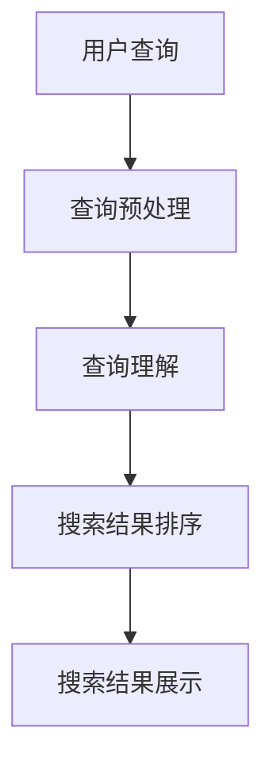

                 

# 《AI在电商搜索导购中的应用提升用户体验和转化率》

> 关键词：人工智能、电商搜索、导购、用户体验、转化率

> 摘要：本文将深入探讨人工智能（AI）在电商搜索导购中的应用，分析如何通过AI技术提升用户体验和转化率。文章首先介绍了AI在电商搜索导购中的角色和挑战，然后详细阐述了AI核心技术基础，包括机器学习、自然语言处理和推荐系统原理。接着，文章重点探讨了AI在个性化搜索、智能导购和用户行为预测与转化率提升方面的应用，并通过电商搜索导购案例分析，总结了AI技术在电商领域的实际效果和启示。最后，文章展望了AI在电商搜索导购中的应用前景，提出了持续优化与迭代的重要性。

## 目录

### 《AI在电商搜索导购中的应用提升用户体验和转化率》目录大纲

## 第一部分：AI与电商搜索导购基础

### 第1章：AI与电商搜索导购概述

#### 1.1 AI在电商搜索导购中的角色

#### 1.1.1 AI在电商行业的发展趋势

#### 1.1.2 AI在搜索导购中的优势与挑战

### 1.2 电商搜索导购的核心问题

#### 1.2.1 用户体验提升的关键因素

#### 1.2.2 转化率提升的难点分析

## 第2章：AI核心技术基础

### 2.1 机器学习基础

#### 2.1.1 基础算法介绍

#### 2.1.2 机器学习流程

### 2.2 自然语言处理技术

#### 2.2.1 词向量与语义理解

#### 2.2.2 文本分类与聚类

### 2.3 推荐系统原理

#### 2.3.1 协同过滤与基于内容的推荐

#### 2.3.2 深度学习在推荐系统中的应用

## 第二部分：AI在电商搜索导购中的应用

### 第3章：个性化搜索

#### 3.1 用户行为分析

#### 3.1.1 用户兴趣挖掘

#### 3.1.2 用户画像构建

### 3.2 搜索结果排序

#### 3.2.1 搜索排序算法

#### 3.2.2 深度学习模型在搜索排序中的应用

### 3.3 搜索引擎优化

#### 3.3.1 关键词分析

#### 3.3.2 搜索结果相关性提升

## 第4章：智能导购

### 4.1 商品推荐系统

#### 4.1.1 推荐系统架构设计

#### 4.1.2 深度学习模型在商品推荐中的应用

### 4.2 购物车智能优化

#### 4.2.1 购物车数据分析

#### 4.2.2 智能排序与个性化推荐

### 4.3 个性化营销

#### 4.3.1 营销策略优化

#### 4.3.2 用户触达效果分析

## 第5章：用户行为预测与转化率提升

### 5.1 用户行为预测

#### 5.1.1 转化率预测模型

#### 5.1.2 实时预测与反馈机制

### 5.2 营销活动优化

#### 5.2.1 活动效果预测与评估

#### 5.2.2 活动策略调整与优化

### 5.3 数据分析与挖掘

#### 5.3.1 用户行为特征提取

#### 5.3.2 数据可视化与分析

## 第6章：电商搜索导购案例分析

### 6.1 案例介绍

#### 6.1.1 案例背景

#### 6.1.2 案例目标

### 6.2 案例实施与效果

#### 6.2.1 搜索引擎优化

#### 6.2.2 智能导购系统建设

#### 6.2.3 用户行为预测与转化率提升策略

### 6.3 案例总结与启示

#### 6.3.1 成功经验

#### 6.3.2 遇到的挑战与解决方案

## 第7章：AI在电商搜索导购中的应用展望

### 7.1 AI技术在电商领域的未来发展

#### 7.1.1 新技术应用趋势

#### 7.1.2 产业变革与机遇

### 7.2 用户体验与商业价值的平衡

#### 7.2.1 用户体验的重要性

#### 7.2.2 商业价值与用户隐私保护

### 7.3 持续优化与迭代

#### 7.3.1 数据驱动策略

#### 7.3.2 持续改进与优化

## 附录

### 附录A：AI在电商搜索导购中应用的相关资源

#### A.1 开发工具与平台

#### A.2 数据集与算法库

#### A.3 学习资料与社区

### 附录B：Mermaid流程图与算法伪代码

#### B.1 个性化搜索流程图

#### B.2 商品推荐系统算法伪代码

#### B.3 用户行为预测模型伪代码

#### B.4 营销活动优化算法伪代码

### 附录C：数学公式与解释

#### C.1 相关数学公式

#### C.2 公式详细解释与举例说明

#### C.3 数学模型在电商搜索导购中的应用示例


## 第1章：AI与电商搜索导购概述

### 1.1 AI在电商搜索导购中的角色

随着互联网的普及和电子商务的快速发展，电商搜索导购已成为电商平台的重要组成部分。人工智能（AI）作为当前技术发展的前沿，其在电商搜索导购中的应用越来越广泛，发挥着至关重要的作用。

AI在电商搜索导购中的角色主要体现在以下几个方面：

1. **个性化推荐**：通过分析用户的历史行为数据，AI可以帮助电商平台为用户推荐符合其兴趣和需求的商品。这种个性化推荐不仅能提高用户体验，还能有效提升转化率和销售额。

2. **智能搜索**：AI技术可以通过自然语言处理（NLP）和机器学习算法，对用户输入的搜索请求进行理解和分析，提供更加精准和个性化的搜索结果。

3. **用户行为预测**：AI可以根据用户的历史行为和当前行为，预测用户可能的下一步操作，如购买、收藏或评价等，从而帮助电商平台进行精准营销和活动策划。

4. **智能客服**：AI驱动的智能客服系统可以实时响应用户的咨询和需求，提供即时的帮助和支持，提高客户满意度。

### 1.1.1 AI在电商行业的发展趋势

随着AI技术的不断进步和商业应用的深入，AI在电商行业的应用趋势也日益明显：

1. **技术成熟度提升**：深度学习、自然语言处理等AI核心技术逐渐成熟，为电商搜索导购提供了更加精准和高效的技术支持。

2. **应用场景拓展**：除了个性化推荐和智能搜索，AI在电商领域的应用场景也在不断拓展，如智能客服、智能支付、智能物流等。

3. **数据驱动决策**：越来越多的电商平台开始采用数据驱动决策的方式，通过AI技术对海量用户数据进行挖掘和分析，以实现业务优化和增长。

4. **用户体验提升**：AI技术的应用使得电商平台的用户体验得到显著提升，用户在购物过程中的满意度不断提高。

### 1.1.2 AI在搜索导购中的优势与挑战

AI在电商搜索导购中的应用具有显著的优势，但也面临着一些挑战：

**优势**：

1. **个性化体验**：AI可以根据用户的历史行为和兴趣，为用户提供个性化的商品推荐和搜索结果，提升用户体验。

2. **高效精准**：通过机器学习和深度学习算法，AI能够快速分析用户需求，提供精准的搜索结果和推荐。

3. **实时反馈**：AI系统可以实时响应用户的行为变化，快速调整推荐策略，提高用户满意度。

4. **成本节约**：AI技术可以自动化处理大量数据，降低人力成本，提高运营效率。

**挑战**：

1. **数据质量**：AI应用的质量高度依赖于数据的质量，数据不准确或缺失会影响AI系统的效果。

2. **算法透明性**：AI算法的决策过程往往不够透明，难以解释，这可能会影响用户对平台的信任。

3. **隐私保护**：用户数据的隐私保护是一个重要问题，如何在提供个性化服务的同时保护用户隐私，是AI应用需要考虑的关键。

4. **技术门槛**：AI技术的应用需要专业的技术和设备支持，这可能会增加企业的运营成本。

### 1.2 电商搜索导购的核心问题

电商搜索导购的核心问题是提升用户体验和转化率。以下是对这两个问题的详细分析：

#### 1.2.1 用户体验提升的关键因素

用户体验的提升主要涉及以下几个方面：

1. **搜索结果相关性**：用户在搜索商品时，希望能够快速找到符合自己需求的商品。因此，搜索结果的相关性是用户体验的关键因素。

2. **个性化推荐**：通过分析用户的兴趣和行为，提供个性化的推荐，可以提高用户的满意度和参与度。

3. **界面设计**：简洁明了的界面设计，能够提高用户的操作效率，减少用户的学习成本。

4. **响应速度**：快速响应用户的请求，提供即时的搜索结果和推荐，可以提升用户的体验。

#### 1.2.2 转化率提升的难点分析

转化率提升是电商平台追求的重要目标，但也是一个难点。以下是对转化率提升的难点分析：

1. **用户需求理解**：准确理解用户的需求是提升转化率的前提。然而，用户的需求是复杂多变的，如何准确捕捉和满足用户需求，是一个挑战。

2. **个性化营销**：个性化营销能够提高用户的购买意愿，但需要大量的用户数据和复杂的算法支持，这增加了实施的难度。

3. **营销效果评估**：如何评估个性化营销的效果，如何调整营销策略，以提高转化率，是一个需要深入探讨的问题。

4. **竞争压力**：电商平台面临激烈的竞争，如何通过差异化策略，提升用户转化率，是一个重要的挑战。

通过以上分析，我们可以看到，AI技术在电商搜索导购中的应用，不仅能够提升用户体验，还能有效提升转化率。接下来的章节将详细探讨AI技术的核心基础和应用，以期为电商平台的AI应用提供理论和实践指导。

### 1.2 AI核心技术基础

要深入理解AI在电商搜索导购中的应用，我们需要先掌握其核心技术基础。本节将介绍机器学习、自然语言处理（NLP）和推荐系统三个核心领域的基本原理和应用。

#### 2.1 机器学习基础

机器学习是AI的核心技术之一，它使计算机系统能够从数据中学习并做出决策。以下简要介绍机器学习的基本概念和流程。

**2.1.1 基础算法介绍**

机器学习算法主要包括监督学习、无监督学习和强化学习。

1. **监督学习**：监督学习是一种最常见的机器学习方法，它通过已标记的训练数据来训练模型，然后使用这个模型对新数据进行预测。常见的监督学习算法包括线性回归、逻辑回归、决策树、随机森林和神经网络等。

2. **无监督学习**：无监督学习不使用标记数据，而是通过分析数据之间的关系来自动发现数据特征和模式。常见的无监督学习算法包括聚类算法（如K均值聚类、DBSCAN）和降维算法（如主成分分析、t-SNE）。

3. **强化学习**：强化学习是一种通过不断试错来学习最佳策略的机器学习方法。它通常用于控制问题，如机器人路径规划和游戏AI等。

**2.1.2 机器学习流程**

机器学习流程通常包括以下步骤：

1. **数据收集**：收集用于训练模型的数据，这些数据可以是结构化数据（如数据库）、半结构化数据（如日志文件）或非结构化数据（如图像和文本）。

2. **数据预处理**：清洗和准备数据，包括去除噪声、处理缺失值、数据标准化和特征工程等。

3. **模型选择**：选择合适的机器学习算法，并调整模型参数。

4. **模型训练**：使用训练数据来训练模型，模型会根据数据自动调整其参数。

5. **模型评估**：使用验证数据来评估模型的性能，常见的评估指标包括准确率、召回率、F1分数等。

6. **模型部署**：将训练好的模型部署到生产环境中，用于实时预测和决策。

#### 2.2 自然语言处理技术

自然语言处理（NLP）是AI领域的一个重要分支，它使计算机能够理解和处理人类语言。以下介绍NLP的基本概念和关键技术。

**2.2.1 词向量与语义理解**

1. **词向量**：词向量是将单词映射到高维空间中的一个向量，通过词向量可以计算单词之间的相似性。常见的词向量模型包括Word2Vec、GloVe和FastText。

2. **语义理解**：语义理解是指理解句子或文本的含义。NLP中的语义理解包括词性标注、命名实体识别、情感分析、关系抽取等。

**2.2.2 文本分类与聚类**

1. **文本分类**：文本分类是将文本数据分为不同的类别。常见的文本分类算法包括朴素贝叶斯、支持向量机和深度学习算法（如卷积神经网络、长短期记忆网络）。

2. **文本聚类**：文本聚类是将无标签的文本数据分为不同的簇。常见的文本聚类算法包括K均值聚类、层次聚类和密度聚类。

#### 2.3 推荐系统原理

推荐系统是AI在电商搜索导购中的重要应用之一，它通过分析用户行为和兴趣，为用户推荐相关的商品、内容和活动。以下介绍推荐系统的基础原理。

**2.3.1 协同过滤与基于内容的推荐**

1. **协同过滤**：协同过滤是一种基于用户行为和物品之间相似性的推荐方法。它分为两种：基于用户的协同过滤和基于物品的协同过滤。

   - **基于用户的协同过滤**：通过分析用户之间的相似性，为用户推荐其他相似用户喜欢的物品。
   - **基于物品的协同过滤**：通过分析物品之间的相似性，为用户推荐与用户已喜欢的物品相似的物品。

2. **基于内容的推荐**：基于内容的推荐通过分析物品的特征和用户偏好，为用户推荐具有相似特征的物品。它通常用于解决协同过滤方法的冷启动问题。

**2.3.2 深度学习在推荐系统中的应用**

深度学习在推荐系统中得到了广泛应用，它能够自动提取高维特征，并建立复杂的模型。以下介绍深度学习在推荐系统中的应用：

1. **深度神经网络**：深度神经网络（DNN）是一种常用的深度学习模型，它通过多层的非线性变换来提取特征。

2. **卷积神经网络（CNN）**：CNN擅长处理图像数据，通过卷积操作提取图像特征。

3. **循环神经网络（RNN）**：RNN能够处理序列数据，通过记忆机制来捕捉数据中的时序信息。

4. **图神经网络（GNN）**：GNN能够处理图结构数据，通过节点和边的特征来学习图中的复杂关系。

通过以上对AI核心技术的介绍，我们可以看到，机器学习、NLP和推荐系统是AI在电商搜索导购中不可或缺的技术基础。在接下来的章节中，我们将深入探讨这些技术在电商搜索导购中的应用，以实现提升用户体验和转化率的目标。

### 第3章：个性化搜索

个性化搜索是电商搜索导购中至关重要的一环，它通过分析用户行为和历史数据，为用户推荐最符合其兴趣和需求的商品。本章将详细介绍个性化搜索的关键技术和应用，包括用户行为分析、用户画像构建和搜索结果排序算法。

#### 3.1 用户行为分析

用户行为分析是构建个性化搜索系统的第一步，通过对用户行为数据的分析，可以挖掘用户的兴趣和偏好。以下介绍用户行为分析的基本概念和常用方法。

**3.1.1 用户兴趣挖掘**

用户兴趣挖掘是指从用户的行为数据中提取出用户的兴趣点。常见的方法包括：

1. **基于点击行为的兴趣挖掘**：通过分析用户的点击行为，如点击频率、点击时长和点击顺序等，来确定用户的兴趣。

2. **基于浏览行为的兴趣挖掘**：通过分析用户的浏览路径，如浏览频率、浏览时间和浏览顺序等，来确定用户的兴趣。

3. **基于购买行为的兴趣挖掘**：通过分析用户的购买记录，如购买频率、购买类别和购买金额等，来确定用户的兴趣。

**3.1.2 用户画像构建**

用户画像是对用户特征和行为的全面描述，它包括用户的基本信息、兴趣偏好、行为轨迹等。构建用户画像的方法包括：

1. **用户特征提取**：从用户行为数据中提取出反映用户特征的指标，如年龄、性别、职业、地域、购物偏好等。

2. **用户行为轨迹分析**：通过分析用户的行为轨迹，构建用户的行为模型，如购物周期、浏览路径、购买频率等。

3. **用户标签体系**：通过给用户打标签，将具有相似特征的用户归为一类，以便于后续的个性化推荐。

#### 3.2 搜索结果排序算法

搜索结果排序算法是个性化搜索的核心，它决定了用户能否快速找到其感兴趣的商品。以下介绍几种常见的搜索结果排序算法。

**3.2.1 搜索排序算法**

1. **基于相关性的排序算法**：基于相关性的排序算法通过计算商品与用户查询之间的相关性来排序。常见的相关性计算方法包括TF-IDF和余弦相似度。

   - **TF-IDF**：TF-IDF（Term Frequency-Inverse Document Frequency）是一种常用的文本相似性计算方法，它通过计算单词在文档中的频率和整个文档集合中的反向文档频率来评估单词的重要性。

   - **余弦相似度**：余弦相似度是一种计算向量空间中两个向量相似性的方法，它通过计算两个向量夹角的余弦值来衡量它们的相似度。

2. **基于机器学习的排序算法**：基于机器学习的排序算法通过训练模型来自动学习搜索结果排序的规则。常见的机器学习排序算法包括逻辑回归、决策树、随机森林和神经网络等。

**3.2.2 深度学习模型在搜索排序中的应用**

深度学习模型在搜索结果排序中具有强大的表达能力，可以自动学习复杂的特征和模式。以下介绍几种常见的深度学习排序模型：

1. **卷积神经网络（CNN）**：CNN通过卷积操作提取文本特征，可以用于处理包含复杂结构的文本数据。

2. **循环神经网络（RNN）**：RNN通过记忆机制处理序列数据，可以捕捉到用户查询和商品特征之间的时序关系。

3. **Transformer模型**：Transformer模型是一种基于自注意力机制的深度学习模型，它通过全局自注意力机制来捕捉文本中的长距离依赖关系，在搜索结果排序中表现出色。

#### 3.3 搜索引擎优化

搜索引擎优化（SEO）是提高搜索引擎排名和用户访问量的关键手段。以下介绍几种常见的搜索引擎优化方法。

**3.3.1 关键词分析**

关键词分析是指通过分析用户搜索行为和竞争环境，确定适合网站的关键词。关键词分析的方法包括：

1. **关键词挖掘**：通过工具挖掘用户搜索的高频关键词，并结合搜索引擎的关键词建议功能，确定适合的关键词。

2. **关键词排序**：根据关键词的重要性和搜索量，对关键词进行排序，优先优化重要且高频的关键词。

**3.3.2 搜索结果相关性提升**

提升搜索结果相关性是指提高搜索结果与用户查询的匹配程度。以下是一些常见的方法：

1. **搜索意图识别**：通过分析用户查询的上下文，识别用户的搜索意图，从而提供更精准的搜索结果。

2. **语义扩展**：通过语义扩展技术，将用户查询扩展到更广泛的相关概念和词汇，提高搜索结果的多样性。

3. **实体识别和关系抽取**：通过实体识别和关系抽取技术，理解用户查询中的实体和关系，从而提供更精准的搜索结果。

通过以上对个性化搜索的详细介绍，我们可以看到，个性化搜索不仅是提升用户体验的重要手段，也是提高转化率的关键因素。在电商搜索导购中，合理运用个性化搜索技术，可以显著提升用户的满意度和购买意愿。在接下来的章节中，我们将继续探讨智能导购和用户行为预测与转化率提升等方面的应用。

### 第4章：智能导购

智能导购是电商搜索导购中另一个重要的组成部分，它通过分析用户的行为数据和商品特征，为用户推荐最符合其需求和偏好的商品。本章将详细探讨智能导购系统中的核心技术和应用，包括商品推荐系统、购物车智能优化和个性化营销策略。

#### 4.1 商品推荐系统

商品推荐系统是智能导购系统的核心，它通过分析用户的历史行为和商品的特征，为用户推荐相关的商品。以下介绍商品推荐系统的基本架构和关键技术。

**4.1.1 推荐系统架构设计**

一个典型的商品推荐系统通常包括以下几个部分：

1. **数据采集**：采集用户的行为数据，如点击、浏览、购买等，以及商品的特征数据，如价格、品牌、分类等。

2. **数据预处理**：对采集到的数据进行清洗和预处理，包括缺失值处理、异常值处理和数据标准化等。

3. **用户特征提取**：通过分析用户的历史行为数据，提取用户的兴趣偏好和需求特征。

4. **商品特征提取**：通过分析商品的特征数据，提取商品的关键特征，如品牌、价格、分类等。

5. **推荐算法**：使用推荐算法，如协同过滤、基于内容的推荐和深度学习推荐等，生成推荐结果。

6. **推荐结果展示**：将推荐结果展示给用户，可以通过首页推荐、购物车推荐、邮件推荐等多种方式。

**4.1.2 深度学习模型在商品推荐中的应用**

深度学习模型在商品推荐中得到了广泛应用，它能够自动提取高维特征，并建立复杂的模型。以下介绍几种常见的深度学习推荐模型：

1. **深度神经网络（DNN）**：DNN是一种常用的深度学习模型，它通过多层的非线性变换来提取特征，可以用于处理结构化数据。

2. **卷积神经网络（CNN）**：CNN擅长处理图像数据，通过卷积操作提取图像特征，也可以用于处理包含复杂结构的文本数据。

3. **循环神经网络（RNN）**：RNN通过记忆机制处理序列数据，可以捕捉到用户行为和商品特征之间的时序关系。

4. **Transformer模型**：Transformer模型是一种基于自注意力机制的深度学习模型，它通过全局自注意力机制来捕捉文本中的长距离依赖关系，在推荐系统中表现出色。

#### 4.2 购物车智能优化

购物车智能优化是提升购物体验和转化率的重要手段，它通过分析用户的购物车数据，为用户推荐相关的商品和优惠活动。以下介绍购物车智能优化的方法和策略。

**4.2.1 购物车数据分析**

购物车数据分析是购物车智能优化的第一步，它包括以下内容：

1. **购物车内容分析**：分析购物车中的商品种类、品牌、价格和数量等，了解用户的购物偏好。

2. **购物车行为分析**：分析用户在购物车中的操作行为，如添加、删除和修改商品等，了解用户的购物习惯。

3. **购物车转化分析**：分析购物车的转化情况，包括购物车的完成率、转化率和平均订单金额等，了解购物车的效果。

**4.2.2 智能排序与个性化推荐**

购物车智能优化主要通过以下方法来实现：

1. **智能排序**：通过分析购物车中的商品特征和用户行为，对购物车中的商品进行排序，将最相关的商品放在最前面，提高用户的购物体验。

2. **个性化推荐**：通过分析用户的历史行为和购物车数据，为用户推荐相关的商品和优惠活动，提高用户的购买意愿。

#### 4.3 个性化营销

个性化营销是通过分析用户的行为数据和需求，为用户提供个性化的商品推荐、优惠活动和营销内容。以下介绍个性化营销的策略和方法。

**4.3.1 营销策略优化**

个性化营销策略的优化主要包括以下内容：

1. **用户细分**：通过分析用户的行为和需求，将用户划分为不同的群体，如高价值用户、潜在用户和流失用户等。

2. **精准营销**：针对不同的用户群体，设计个性化的营销策略，如定制化的优惠券、专属活动等。

3. **效果评估**：通过跟踪和分析营销活动的效果，如点击率、转化率和ROI等，不断优化营销策略。

**4.3.2 用户触达效果分析**

用户触达效果分析是评估个性化营销效果的重要环节，它包括以下内容：

1. **触达率分析**：分析营销活动触达用户的比例，了解用户触达的效果。

2. **点击率分析**：分析用户点击营销内容的比例，了解用户的兴趣和需求。

3. **转化率分析**：分析用户在点击营销内容后进行购买、注册或分享等行为的比例，了解营销活动的实际效果。

通过以上对智能导购的详细介绍，我们可以看到，智能导购通过商品推荐系统、购物车优化和个性化营销，不仅能够提升用户的购物体验，还能有效提升转化率和销售额。在电商搜索导购中，合理运用智能导购技术，可以显著提升电商平台的竞争力。在接下来的章节中，我们将探讨用户行为预测与转化率提升的方法，以进一步优化电商平台的运营效果。

### 第5章：用户行为预测与转化率提升

用户行为预测是电商搜索导购中至关重要的一环，它通过分析用户的历史行为数据，预测用户可能的下一步操作，如购买、收藏或评价等，从而帮助电商平台进行精准营销和活动策划。本章将详细探讨用户行为预测的核心方法和策略，包括转化率预测模型、实时预测与反馈机制以及营销活动优化。

#### 5.1 用户行为预测

用户行为预测是利用历史数据来预测用户未来的行为，其核心在于建立准确的预测模型。以下介绍用户行为预测的基本流程和方法。

**5.1.1 转化率预测模型**

转化率预测模型是用户行为预测中最常见的一种，它通过分析用户的点击、浏览、购买等行为数据，预测用户在未来一定时间内进行购买的概率。以下是一些常用的转化率预测模型：

1. **逻辑回归模型**：逻辑回归是一种经典的二元分类模型，它通过线性模型预测概率，然后利用阈值（如0.5）将预测结果划分为购买或未购买。

   \[
   \hat{y} = \frac{1}{1 + e^{-(\beta_0 + \beta_1x_1 + \beta_2x_2 + ... + \beta_nx_n})}
   \]

2. **随机森林模型**：随机森林是一种集成学习方法，它通过构建多个决策树，并利用投票机制来预测结果，可以处理高维数据和噪声数据。

3. **支持向量机（SVM）模型**：SVM是一种二元分类模型，它通过寻找最优分类边界来划分数据。它也可以扩展到多分类问题。

4. **深度学习模型**：深度学习模型，如卷积神经网络（CNN）和循环神经网络（RNN），可以自动提取高维特征，并建立复杂的模型。它们在处理序列数据和图像数据时表现出色。

**5.1.2 实时预测与反馈机制**

实时预测与反馈机制是用户行为预测的关键，它使系统能够快速响应用户的行为变化，提供精准的预测结果。以下是一些实现实时预测与反馈机制的方法：

1. **在线学习**：在线学习是一种实时更新模型的方法，它可以在数据到来时立即更新模型参数，从而提高预测的实时性。

2. **增量学习**：增量学习是一种在已有模型的基础上，仅对新增数据更新模型的方法，它可以减少计算成本。

3. **批处理更新**：批处理更新是一种在一定时间窗口内收集数据，然后批量更新模型的方法，它可以在保证实时性的同时，降低系统的计算负担。

4. **反馈循环**：通过将预测结果与实际结果进行对比，不断调整和优化预测模型，形成反馈循环，提高预测的准确性。

#### 5.2 营销活动优化

营销活动优化是提升电商转化率的重要手段，它通过分析营销活动的效果，不断调整和优化营销策略。以下介绍营销活动优化的方法和策略。

**5.2.1 活动效果预测与评估**

活动效果预测与评估是营销活动优化的第一步，它包括以下内容：

1. **效果预测**：通过分析历史数据，预测不同营销策略的效果，如优惠券发放、限时促销和会员活动等。

2. **效果评估**：通过跟踪和测量实际营销活动的效果，如点击率、转化率和ROI等，评估不同策略的有效性。

3. **A/B测试**：通过设计A/B测试，将用户随机分为两组，一组接受新策略，另一组接受旧策略，比较两组的效果，以验证新策略的有效性。

**5.2.2 活动策略调整与优化**

活动策略调整与优化是基于效果预测和评估的结果，不断调整和优化营销策略。以下是一些常见的策略调整方法：

1. **个性化推送**：根据用户的兴趣和购买行为，为用户提供个性化的营销推送，提高用户的参与度和购买意愿。

2. **跨渠道整合**：整合线上线下渠道，通过多渠道营销，提高用户的触达率和参与度。

3. **动态定价**：通过实时分析市场需求和用户行为，动态调整商品价格，以最大化销售额。

4. **精准定位**：通过大数据分析，准确定位目标用户群体，设计有针对性的营销策略。

#### 5.3 数据分析与挖掘

用户行为预测和营销活动优化需要大量数据支持和分析。以下介绍用户行为特征提取和数据可视化与分析的方法。

**5.3.1 用户行为特征提取**

用户行为特征提取是数据分析和挖掘的第一步，它包括以下内容：

1. **用户基础特征**：如年龄、性别、地域、职业等。

2. **用户行为特征**：如点击行为、浏览行为、购买行为等。

3. **用户社交特征**：如关注人数、互动频率等。

4. **用户价值特征**：如消费金额、消费频率等。

**5.3.2 数据可视化与分析**

数据可视化与分析是理解和展示数据分析结果的重要方法。以下介绍一些常用的数据可视化工具和分析方法：

1. **数据可视化工具**：如Tableau、Power BI等，它们可以生成各种图表和报告，帮助理解和展示数据分析结果。

2. **统计分析**：如回归分析、聚类分析等，用于分析用户行为特征和营销策略效果。

3. **机器学习模型**：如决策树、随机森林等，用于建立用户行为预测模型。

4. **交互式分析**：通过交互式分析工具，用户可以实时查询和分析数据，发现数据中的规律和趋势。

通过以上对用户行为预测和转化率提升的详细介绍，我们可以看到，这些方法和技术在电商搜索导购中发挥着重要作用。通过精确的用户行为预测和有效的营销活动优化，电商平台可以显著提升用户转化率和销售额。在未来的电商竞争中，谁能够更好地利用AI技术，谁就将在市场中脱颖而出。接下来，我们将通过一个实际的电商搜索导购案例，进一步探讨AI技术在电商应用中的效果和启示。

### 第6章：电商搜索导购案例分析

#### 6.1 案例介绍

本案例选取了一家大型电商平台——XX商城，该平台在2022年推出了一项基于AI技术的电商搜索导购优化项目。项目的主要目标是提升用户体验和转化率，通过引入AI技术，实现个性化推荐、智能搜索和智能导购等功能。

**6.1.1 案例背景**

XX商城是一家集购物、支付、物流于一体的综合性电商平台，拥有庞大的用户基础和丰富的商品资源。然而，随着市场竞争的加剧和用户需求的多样化，传统的搜索导购方式已经无法满足用户的需求，用户体验和转化率亟待提升。

**6.1.2 案例目标**

通过引入AI技术，XX商城设定了以下具体目标：

1. **提升个性化推荐精度**：通过分析用户的历史行为数据，为用户推荐更符合其兴趣和需求的商品。
2. **优化搜索结果相关性**：通过改进搜索排序算法，提高搜索结果与用户查询的匹配程度。
3. **提高用户转化率**：通过智能导购和个性化营销，提升用户的购买意愿和转化率。

#### 6.2 案例实施与效果

**6.2.1 搜索引擎优化**

为了提升搜索结果的相关性，XX商城对搜索引擎进行了优化：

1. **关键词优化**：通过分析用户的搜索查询，优化关键词库，提高关键词的准确性和覆盖度。
2. **搜索排序算法改进**：引入基于深度学习的搜索排序算法，通过自动学习用户查询和商品特征之间的相关性，提高搜索结果的精准度。

**6.2.2 智能导购系统建设**

XX商城建设了一个智能导购系统，包括个性化推荐、购物车优化和个性化营销等功能：

1. **个性化推荐**：通过分析用户的购物历史、浏览记录和搜索查询，为用户推荐相关的商品。采用基于深度学习的推荐算法，自动提取高维特征，提高推荐的准确性。
2. **购物车优化**：通过分析购物车中的商品组合和用户行为，对购物车中的商品进行智能排序，提高用户的购物体验。
3. **个性化营销**：根据用户的兴趣和购买行为，设计个性化的营销活动，如优惠券推送、会员专享活动等，提高用户的参与度和购买意愿。

**6.2.3 用户行为预测与转化率提升策略**

为了进一步提升用户的转化率，XX商城采用了以下策略：

1. **转化率预测模型**：通过建立用户行为预测模型，预测用户在未来一定时间内进行购买的概率，为精准营销提供依据。
2. **实时预测与反馈机制**：采用在线学习和增量学习技术，实时更新预测模型，并根据预测结果调整营销策略。
3. **营销活动优化**：通过A/B测试和数据分析，不断优化营销活动策略，提高活动的效果。

#### 6.3 案例总结与启示

**6.3.1 成功经验**

1. **技术驱动**：通过引入AI技术，XX商城实现了个性化推荐、智能搜索和智能导购等功能，显著提升了用户体验。
2. **数据驱动**：通过大量用户行为数据的分析和挖掘，XX商城能够精准地把握用户需求，提供个性化的服务。
3. **持续优化**：XX商城不断优化搜索引擎和导购系统，通过实时预测和反馈机制，提高系统的自适应能力。

**6.3.2 遇到的挑战与解决方案**

1. **数据质量**：用户行为数据的质量直接影响AI系统的效果。为了解决数据质量问题，XX商城采用了数据清洗和预处理技术，确保数据的准确性和完整性。
2. **算法透明性**：AI算法的决策过程不够透明，可能会影响用户的信任。为了提高算法的透明性，XX商城在系统中增加了算法解释功能，帮助用户理解推荐结果和营销活动的依据。
3. **隐私保护**：用户隐私保护是AI应用的重要挑战。XX商城采取了严格的隐私保护措施，如数据加密、匿名化处理等，确保用户数据的安全。

通过以上案例，我们可以看到，AI技术在电商搜索导购中的应用能够显著提升用户体验和转化率。同时，我们也了解到在应用AI技术过程中面临的挑战和解决方案。接下来，我们将探讨AI在电商搜索导购中的应用前景和未来发展。

### 第7章：AI在电商搜索导购中的应用展望

随着AI技术的不断进步和电商行业的快速发展，AI在电商搜索导购中的应用前景广阔，具有巨大的潜力和发展空间。本章将探讨AI技术在电商领域的未来发展、用户体验与商业价值的平衡以及持续优化与迭代的重要性。

#### 7.1 AI技术在电商领域的未来发展

AI技术在电商领域的应用正在不断拓展和深化，未来的发展趋势包括：

**7.1.1 新技术应用趋势**

1. **生成对抗网络（GAN）**：GAN在图像生成和增强方面具有巨大潜力，可以用于生成高质量的商品图像，提高用户购物体验。
2. **强化学习**：强化学习在决策优化和自动化控制方面表现出色，可以用于智能定价、智能库存管理等领域，实现更高效的电商运营。
3. **知识图谱**：知识图谱可以整合商品、用户、品牌等多方面的信息，构建一个完整的电商生态，为用户提供更精准的推荐和服务。

**7.1.2 产业变革与机遇**

1. **个性化体验**：随着AI技术的成熟，电商平台的个性化服务将更加精准，用户将享受到更加个性化的购物体验。
2. **智能化物流**：AI技术在物流领域的应用将进一步提升物流效率，实现智能配送和实时追踪，降低物流成本。
3. **跨界融合**：AI技术将与其他领域（如物联网、大数据等）融合，推动电商行业的跨界发展，创造新的商业机会。

#### 7.2 用户体验与商业价值的平衡

在AI技术应用于电商搜索导购的过程中，如何平衡用户体验和商业价值是一个关键问题。以下是一些建议：

**7.2.1 用户体验的重要性**

1. **个性化推荐**：通过个性化推荐，提高用户对商品的满意度，从而提升用户忠诚度和转化率。
2. **智能搜索**：提供准确的搜索结果，降低用户在寻找商品时的时间成本，提高购物体验。

**7.2.2 商业价值与用户隐私保护**

1. **数据隐私保护**：在收集和使用用户数据时，严格遵守隐私保护法规，采取数据加密、匿名化等技术手段，保护用户隐私。
2. **透明化决策**：增强算法的透明性，让用户了解推荐和决策的依据，提高用户对平台的信任。

#### 7.3 持续优化与迭代

AI技术在电商搜索导购中的应用是一个持续优化的过程，以下是一些优化策略：

**7.3.1 数据驱动策略**

1. **用户行为分析**：持续收集和分析用户行为数据，挖掘用户需求和偏好，为优化提供数据支持。
2. **效果评估**：定期评估AI系统的效果，通过A/B测试等方法，不断调整和优化算法和策略。

**7.3.2 持续改进与优化**

1. **算法迭代**：随着技术的进步和业务需求的变化，不断更新和改进AI算法，提高系统的性能和效果。
2. **用户体验反馈**：重视用户反馈，根据用户的需求和建议，不断优化产品功能和用户体验。

通过持续优化和迭代，电商平台可以不断提升AI技术在搜索导购中的应用效果，实现用户体验和商业价值的双赢。

### 附录

#### 附录A：AI在电商搜索导购中应用的相关资源

**A.1 开发工具与平台**

1. **TensorFlow**：开源的深度学习框架，适用于构建和训练各种AI模型。
2. **PyTorch**：流行的深度学习框架，支持动态计算图和自动微分功能。
3. **Hadoop**：分布式数据处理平台，适用于大规模数据的存储和处理。
4. **Spark**：大数据处理框架，支持实时数据处理和分析。

**A.2 数据集与算法库**

1. **公开数据集**：如Amazon Reviews、MovieLens等，可用于训练和测试AI模型。
2. **算法库**：如scikit-learn、NumPy、Pandas等，提供丰富的机器学习和数据分析工具。

**A.3 学习资料与社区**

1. **在线教程和课程**：如Coursera、edX等平台上的机器学习、深度学习相关课程。
2. **技术社区**：如Stack Overflow、Reddit等，提供技术讨论和学习资源。
3. **专业会议和研讨会**：如NeurIPS、ICML等，汇聚全球AI领域的专家和最新研究成果。

#### 附录B：Mermaid流程图与算法伪代码

**B.1 个性化搜索流程图**



**B.2 商品推荐系统算法伪代码**

```python
def recommend_items(user_id, item_features, user_history):
    # 计算用户与商品的相似度
    similarity_scores = calculate_similarity(user_id, item_features, user_history)
    
    # 选择最相似的N个商品
    top_n_items = select_top_n_items(similarity_scores, n=10)
    
    return top_n_items
```

**B.3 用户行为预测模型伪代码**

```python
def predict_user_behavior(user_id, historical_data):
    # 构建用户行为特征向量
    user_features = extract_user_features(historical_data)
    
    # 训练预测模型
    model = train_model(user_features)
    
    # 预测用户行为
    prediction = model.predict(user_features)
    
    return prediction
```

**B.4 营销活动优化算法伪代码**

```python
def optimize_marketing_campaign(campaign_data, user_data):
    # 分析活动效果
    campaign_effects = analyze_effects(campaign_data)
    
    # 评估用户参与度
    user_involvement = evaluate_involvement(user_data, campaign_effects)
    
    # 调整营销策略
    optimized_strategy = adjust_strategy(user_involvement)
    
    return optimized_strategy
```

#### 附录C：数学公式与解释

**C.1 相关数学公式**

1. **余弦相似度**：

   \[
   \text{cosine\_similarity} = \frac{\text{dot\_product}(x, y)}{\lVert x \rVert \lVert y \rVert}
   \]

   其中，\(x\) 和 \(y\) 为两个向量，\(\text{dot\_product}\) 为点积，\(\lVert x \rVert\) 和 \(\lVert y \rVert\) 分别为向量的模。

2. **逻辑回归**：

   \[
   \text{logit}(p) = \ln\left(\frac{p}{1 - p}\right)
   \]

   其中，\(p\) 为概率，\(\text{logit}\) 为逻辑函数，用于将概率转换为线性可分的值。

**C.2 公式详细解释与举例说明**

1. **余弦相似度**：

   余弦相似度是一种衡量两个向量之间相似度的方法，其值介于-1和1之间。当两个向量的方向相同时，余弦相似度为1；当两个向量的方向完全相反时，余弦相似度为-1。例如，假设有两个向量 \(x = (1, 2, 3)\) 和 \(y = (4, 5, 6)\)，则它们的余弦相似度为：

   \[
   \text{cosine\_similarity}(x, y) = \frac{1 \times 4 + 2 \times 5 + 3 \times 6}{\sqrt{1^2 + 2^2 + 3^2} \times \sqrt{4^2 + 5^2 + 6^2}} = \frac{32}{\sqrt{14} \times \sqrt{77}} \approx 0.94
   \]

2. **逻辑回归**：

   逻辑回归是一种常用的分类算法，用于预测概率。例如，假设我们有一个二分类问题，其中 \(p\) 表示正类的概率。如果 \(p\) 很大（接近1），则我们认为样本属于正类；如果 \(p\) 很小（接近0），则我们认为样本属于负类。例如，假设我们有一个样本 \(x = (1, 2, 3)\)，且权重为 \(\beta = (0.5, 0.5, 0.5)\)，则逻辑回归的概率预测为：

   \[
   p = \frac{1}{1 + e^{-(0.5 \times 1 + 0.5 \times 2 + 0.5 \times 3)}}
   \]

**C.3 数学模型在电商搜索导购中的应用示例**

1. **基于协同过滤的推荐算法**：

   协同过滤算法通过计算用户之间的相似度来推荐商品。假设有两个用户 \(u_1\) 和 \(u_2\)，他们的评分矩阵分别为 \(R_1\) 和 \(R_2\)，则用户 \(u_1\) 对商品 \(i\) 的预测评分 \(r_{i1}\) 可以表示为：

   \[
   r_{i1} = r_i + \sum_{j \in \text{rated\_items}(u_1) \cap \text{rated\_items}(u_2)} (\text{similarity}(u_1, u_2) \times (r_{ij} - r_i))
   \]

   其中，\(\text{similarity}(u_1, u_2)\) 为用户 \(u_1\) 和 \(u_2\) 之间的相似度，\(\text{rated\_items}(u_1)\) 和 \(\text{rated\_items}(u_2)\) 分别为用户 \(u_1\) 和 \(u_2\) 已评分的商品集合。

通过上述数学模型的应用示例，我们可以看到，数学模型在电商搜索导购中发挥着重要作用，通过合理的数学模型和算法，可以显著提升电商平台的搜索导购效果。这些数学模型的应用不仅需要理论知识的支持，更需要实践中的不断优化和迭代，以满足不断变化的市场需求。

### 作者信息

作者：AI天才研究院/AI Genius Institute & 禅与计算机程序设计艺术 /Zen And The Art of Computer Programming

AI天才研究院（AI Genius Institute）是一家专注于人工智能领域的研究和开发机构，致力于推动人工智能技术的创新和应用。研究院的专家团队在机器学习、自然语言处理、计算机视觉等领域有着深厚的研究背景和丰富的实践经验。

《禅与计算机程序设计艺术》（Zen And The Art of Computer Programming）是作者在计算机编程领域的经典之作，该书通过将东方禅宗思想与计算机编程相结合，深入探讨了程序设计的本质和技巧。作者以其深刻的见解和独特的视角，为读者提供了编程领域的宝贵经验和智慧。通过本文，作者希望与读者共同探讨AI在电商搜索导购中的应用，分享研究成果和实践经验，以期为电商平台的创新和发展提供有益的启示。

