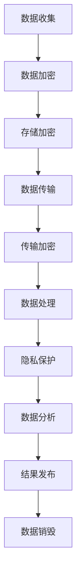

                 

### 文章标题：AI基础设施的隐私保护：Lepton AI的数据安全方案

#### 关键词：
- AI基础设施
- 隐私保护
- 数据加密
- 匿名化
- 脱敏
- 差分隐私
- 区块链

#### 摘要：
随着人工智能（AI）技术的发展和应用日益广泛，AI基础设施的隐私保护变得愈发重要。本文将探讨AI基础设施在隐私保护方面的核心问题，重点分析Lepton AI的数据安全方案。通过深入了解数据加密、匿名化、脱敏以及差分隐私等关键技术，以及区块链在隐私保护中的应用，本文旨在为读者提供一个全面而深入的AI基础设施隐私保护指南，并展示Lepton AI在数据安全领域的卓越表现。

### 《AI基础设施的隐私保护：Lepton AI的数据安全方案》目录大纲

#### 第一部分：AI基础设施概述

##### 第1章：AI基础设施与隐私保护概述

- 1.1 AI基础设施的重要性
- 1.2 隐私保护的重要性
- 1.3 Lepton AI的数据安全方案简介

##### 第2章：AI基础设施的基本概念

- 2.1 AI基础设施的组成部分
- 2.2 数据中心架构
- 2.3 云计算与AI的结合

#### 第二部分：隐私保护技术

##### 第3章：数据加密技术

- 3.1 数据加密的基本概念
- 3.2 对称加密与非对称加密
- 3.3 常见加密算法介绍

##### 第4章：匿名化与脱敏技术

- 4.1 匿名化的目的和方法
- 4.2 脱敏技术的原理与实践
- 4.3 匿名化与脱敏技术的比较与选择

##### 第5章：差分隐私技术

- 5.1 差分隐私的定义与原理
- 5.2 差分隐私的常见算法
- 5.3 差分隐私在实际应用中的挑战

##### 第6章：区块链与隐私保护

- 6.1 区块链的基本原理
- 6.2 区块链在隐私保护中的应用
- 6.3 Lepton AI如何利用区块链技术保护数据隐私

#### 第三部分：Lepton AI数据安全方案

##### 第7章：Lepton AI数据安全架构

- 7.1 Lepton AI数据安全架构概述
- 7.2 数据安全策略与流程
- 7.3 数据安全监控与审计

##### 第8章：Lepton AI的数据加密方案

- 8.1 数据加密方案的实现原理
- 8.2 对数据加密方案的需求分析
- 8.3 数据加密方案的实际应用场景

##### 第9章：Lepton AI的匿名化与脱敏方案

- 9.1 匿名化与脱敏方案的设计思路
- 9.2 匿名化与脱敏方案的实施步骤
- 9.3 匿名化与脱敏方案的效果评估

##### 第10章：Lepton AI的差分隐私方案

- 10.1 差分隐私方案的设计与实现
- 10.2 差分隐私方案的优势与局限
- 10.3 差分隐私方案的应用案例

##### 第11章：Lepton AI的区块链隐私保护方案

- 11.1 区块链隐私保护方案的设计思路
- 11.2 区块链隐私保护方案的技术实现
- 11.3 区块链隐私保护方案的应用前景

##### 第12章：Lepton AI数据安全方案的总结与展望

- 12.1 Lepton AI数据安全方案的总体评估
- 12.2 面临的挑战与未来发展方向
- 12.3 Lepton AI数据安全方案的实际效果与用户反馈

##### 第13章：附录

- 13.1 数据安全相关的法律法规介绍
- 13.2 常见数据安全问题的案例分析
- 13.3 Lepton AI数据安全方案的参考资料与推荐阅读

### 附录 A：数据安全流程图

- 

### 附录 B：核心算法原理讲解

- 伪代码实现
- 算法原理详细解释

### 附录 C：数学模型和数学公式

- $$ C = \sum_{i=1}^{n} x_i $$
- 数学公式详细讲解与举例

### 附录 D：项目实战

- 实际代码案例
- 代码实现详细解释
- 代码解读与分析

### 附录 E：开发环境搭建指南

- 搭建 Lepton AI数据安全方案的完整开发环境步骤

### 附录 F：源代码实现与解读

- 源代码详细实现
- 代码解读与分析

### 附录 G：常见问题与解决方案

- 针对书中内容的常见问题解答
- 遇到的问题及解决方案

### 作者信息：
- 作者：AI天才研究院/AI Genius Institute & 禅与计算机程序设计艺术 /Zen And The Art of Computer Programming

#### 第一部分：AI基础设施概述

### 第1章：AI基础设施与隐私保护概述

#### 1.1 AI基础设施的重要性

人工智能（AI）已经成为现代科技发展的重要驱动力，广泛应用于医疗、金融、零售、制造等多个行业。AI基础设施是支撑AI应用的核心，它包括硬件、软件、数据、网络等组成部分，为AI模型训练、推理和部署提供了必要的资源和技术支持。

AI基础设施的重要性体现在以下几个方面：

1. **计算能力**：随着深度学习等AI算法的发展，对计算能力的需求日益增长。高性能计算基础设施能够满足复杂AI模型的训练需求，从而推动AI技术的进步。
   
2. **数据处理能力**：AI模型依赖于大量数据，数据处理能力是AI基础设施的关键部分。高效的数据存储、管理和分析能力能够确保AI应用能够从海量数据中提取有价值的信息。

3. **数据安全性**：随着AI应用的范围扩大，数据隐私和安全问题愈发重要。AI基础设施需要具备强大的隐私保护能力，防止数据泄露和滥用。

4. **可扩展性**：AI基础设施需要具备良好的可扩展性，以应对不断增长的数据量和计算需求。可扩展性有助于企业灵活应对市场变化，提高AI应用的竞争力。

#### 1.2 隐私保护的重要性

隐私保护在AI基础设施中具有重要地位，主要原因如下：

1. **数据敏感性**：AI应用处理的数据往往包含敏感信息，如个人身份信息、健康记录、财务数据等。一旦数据泄露，可能导致严重后果。

2. **法律法规要求**：许多国家和地区制定了严格的数据保护法律法规，如欧盟的《通用数据保护条例》（GDPR）和美国加州的《消费者隐私法案》（CCPA）。AI基础设施需要遵守这些法律法规，确保数据安全和用户隐私。

3. **用户信任**：用户对AI应用的信任取决于数据保护能力。隐私保护是建立用户信任的基石，有助于提高AI应用的普及率和用户满意度。

4. **商业竞争力**：在激烈的市场竞争中，拥有强大的隐私保护能力是企业的重要竞争优势。良好的隐私保护措施能够增强用户对企业的信任，提高市场份额。

#### 1.3 Lepton AI的数据安全方案简介

Lepton AI是一家专注于AI基础设施隐私保护的公司，其数据安全方案在业界具有显著的影响力。以下是Lepton AI数据安全方案的主要特点：

1. **全面的数据加密**：Lepton AI采用多种加密技术，包括对称加密和非对称加密，确保数据在存储、传输和访问过程中的安全性。

2. **匿名化与脱敏**：Lepton AI提供强大的匿名化和脱敏工具，能够有效保护个人隐私，同时保证数据的可用性和分析能力。

3. **差分隐私**：Lepton AI利用差分隐私技术，在数据分析和共享过程中保护隐私，确保用户数据不会被滥用。

4. **区块链技术**：Lepton AI将区块链技术应用于数据管理和隐私保护，提高数据的透明度和不可篡改性。

5. **合规性**：Lepton AI的数据安全方案符合多种法律法规要求，确保企业能够合规运营。

通过以上措施，Lepton AI的数据安全方案为AI基础设施提供了一整套全面的隐私保护解决方案，为企业和用户带来了显著的安全保障。

### 第2章：AI基础设施的基本概念

#### 2.1 AI基础设施的组成部分

AI基础设施是一个复杂而庞大的系统，它由多个关键组成部分构成，每个部分在支撑AI应用中扮演着重要角色。以下是对AI基础设施主要组成部分的详细描述：

1. **计算资源**：计算资源是AI基础设施的核心，包括服务器、数据中心、云计算平台等。高性能计算资源能够满足复杂AI模型的训练和推理需求，提供强大的计算能力。

2. **存储资源**：存储资源用于存储大量数据，包括原始数据、训练数据、模型数据等。高效的存储系统能够快速访问和处理数据，确保AI应用能够从海量数据中提取有价值的信息。

3. **数据管理平台**：数据管理平台负责数据存储、管理和处理，包括数据清洗、数据集成、数据仓库等。数据管理平台能够确保数据的质量和一致性，为AI模型提供可靠的数据源。

4. **网络资源**：网络资源是AI基础设施的重要组成部分，包括局域网、广域网、互联网等。网络资源提供数据传输通道，确保AI应用在不同计算节点之间高效通信。

5. **数据安全系统**：数据安全系统负责保护AI基础设施中的数据安全，包括数据加密、访问控制、网络安全等。数据安全系统是隐私保护的核心，确保数据在存储、传输和访问过程中的安全性。

6. **开发工具与平台**：开发工具与平台包括编程语言、开发框架、集成开发环境（IDE）等，为AI应用开发提供技术支持。开发工具与平台使得AI应用开发更加高效，降低开发难度。

7. **管理平台**：管理平台负责AI基础设施的监控、管理和维护，包括资源分配、性能优化、故障排除等。管理平台能够确保AI基础设施的高效运行和持续优化。

#### 2.2 数据中心架构

数据中心是AI基础设施的重要组成部分，负责存储、处理和分发数据。数据中心架构设计对性能、可靠性和安全性有着重要影响。以下是对数据中心架构的详细描述：

1. **硬件层**：硬件层包括服务器、存储设备、网络设备等。服务器用于运行AI模型和应用程序，存储设备用于存储数据，网络设备用于数据传输。硬件层的配置和性能直接影响数据中心的整体性能。

2. **网络层**：网络层包括局域网（LAN）和广域网（WAN）。局域网负责数据中心内部的数据传输，广域网负责数据中心之间的数据传输。网络层的架构和性能对数据中心的网络速度和可靠性有重要影响。

3. **存储层**：存储层包括文件存储、块存储、对象存储等。文件存储用于存储文件系统数据，块存储用于存储数据库数据，对象存储用于存储非结构化数据。存储层的类型和性能影响数据中心的存储能力和访问速度。

4. **计算层**：计算层包括计算节点、虚拟机和容器等。计算节点用于运行AI模型，虚拟机和容器用于资源管理和隔离。计算层的配置和性能影响数据中心的计算能力和可扩展性。

5. **管理层**：管理层包括监控工具、自动化工具和运维平台等。监控工具用于监控数据中心的运行状态，自动化工具用于自动执行运维任务，运维平台用于集中管理和维护数据中心。管理层能够提高数据中心的运维效率和管理水平。

#### 2.3 云计算与AI的结合

云计算与AI的结合为AI基础设施提供了强大的技术支撑和灵活的资源管理能力。以下是对云计算与AI结合的详细描述：

1. **云计算平台**：云计算平台包括公共云、私有云和混合云等。公共云提供可扩展的计算资源和服务，私有云提供安全、可靠的数据处理能力，混合云结合两者的优势，满足不同业务需求。

2. **AI即服务（AIaaS）**：AIaaS通过云计算平台提供AI服务，如机器学习模型训练、自然语言处理、计算机视觉等。AIaaS使得企业能够快速部署AI应用，降低开发成本。

3. **云原生AI**：云原生AI是利用云计算平台提供的微服务架构、容器化和自动化技术，实现AI模型的快速部署和扩展。云原生AI能够提高AI基础设施的可扩展性和灵活性。

4. **云计算与AI的结合优势**：云计算与AI的结合具有以下优势：
   - **弹性扩展**：云计算平台能够根据需求动态调整计算资源和存储资源，满足AI应用的需求。
   - **高效计算**：云计算平台提供高性能计算资源，能够满足复杂AI模型的训练和推理需求。
   - **成本优化**：云计算平台提供按需计费模式，企业只需为实际使用的资源付费，降低运营成本。
   - **数据共享**：云计算平台支持数据共享和协作，促进AI模型的创新和应用。

通过深入了解AI基础设施的组成部分、数据中心架构以及云计算与AI的结合，读者可以更好地理解AI基础设施的构建和运行原理，为后续章节的隐私保护技术分析打下坚实的基础。

### 第二部分：隐私保护技术

隐私保护技术在AI基础设施中扮演着至关重要的角色，它们确保数据在存储、传输和处理过程中不被未授权访问或泄露。以下章节将详细介绍几种主要的隐私保护技术：数据加密、匿名化与脱敏、差分隐私以及区块链。

#### 第3章：数据加密技术

数据加密是隐私保护的基本手段，它通过将数据转换为密文，使得未授权用户无法读取或理解数据内容。以下章节将讨论数据加密的基本概念、对称加密与非对称加密、以及常见加密算法。

##### 3.1 数据加密的基本概念

数据加密的基本概念包括加密和解密过程。加密是将明文数据转换为密文的过程，解密则是将密文转换为明文的过程。加密过程需要使用加密算法和密钥。加密算法是一种数学函数，用于将明文映射为密文；密钥是加密和解密过程中的关键参数，用于控制加密和解密过程。

##### 3.2 对称加密与非对称加密

数据加密技术可以分为对称加密和非对称加密两种类型。

对称加密（Symmetric Encryption）：
- **特点**：使用相同的密钥进行加密和解密操作。
- **优点**：加密和解密速度快，适合处理大量数据。
- **缺点**：密钥管理复杂，安全性依赖于密钥的保密性。

常见的对称加密算法包括：
- **DES（数据加密标准）**：一种较早的对称加密算法，已被**AES（高级加密标准）**取代。
- **AES**：一种广泛使用的对称加密算法，具有较高的安全性。

非对称加密（Asymmetric Encryption）：
- **特点**：使用一对密钥进行加密和解密操作，分别是公钥和私钥。公钥用于加密，私钥用于解密。
- **优点**：解决了对称加密中密钥管理的问题，具有较高的安全性。
- **缺点**：加密和解密速度相对较慢，适合处理少量数据。

常见的非对称加密算法包括：
- **RSA**：一种基于大整数分解的加密算法。
- **ECC（椭圆曲线加密）**：一种基于椭圆曲线离散对数的加密算法，安全性较高。

##### 3.3 常见加密算法介绍

以下是几种常见的加密算法：

- **AES**：高级加密标准，是一种对称加密算法，广泛应用于数据保护和通信安全。
- **RSA**：一种非对称加密算法，广泛用于数字签名和加密通信。
- **ECC**：椭圆曲线加密算法，具有较高的安全性和效率，常用于加密通信和数据保护。
- **RSA vs. ECC**：RSA和ECC都是常用的非对称加密算法，但ECC在安全性和性能方面具有优势，特别是当密钥长度较小时。

通过理解数据加密技术的基本概念和常用算法，读者可以更好地评估和选择适合自身需求的加密方案，为AI基础设施的隐私保护提供有力支持。

#### 第4章：匿名化与脱敏技术

匿名化和脱敏技术是隐私保护的重要手段，旨在保护个人隐私，同时确保数据的可用性和分析能力。以下章节将讨论匿名化的目的和方法、脱敏技术的原理与实践，以及匿名化与脱敏技术的比较与选择。

##### 4.1 匿名化的目的和方法

匿名化（Anonymization）的目的是在保留数据价值的同时，消除个人身份信息，从而保护个人隐私。匿名化的主要方法包括：

- **数据删除**：直接从数据集中删除所有个人身份信息，如姓名、身份证号、地址等。
- **数据泛化**：将个人身份信息替换为泛化值，如将姓名替换为匿名ID。
- **数据遮蔽**：使用随机噪声或模糊技术，使得个人身份信息无法被直接识别，但仍然保留数据的价值。

匿名化的方法可以根据具体需求和数据类型进行选择。例如，对于医疗数据，可以使用泛化和遮蔽相结合的方法；对于金融数据，可能需要更严格的匿名化措施。

##### 4.2 脱敏技术的原理与实践

脱敏技术（De-Identification）与匿名化类似，旨在保护个人隐私，但允许在保留一定程度数据价值的情况下进行分析。脱敏技术的原理包括：

- **数据替换**：将个人身份信息替换为随机生成的值，如将身份证号替换为随机生成的号码。
- **数据掩码**：使用掩码技术，如将电话号码的中间几位用星号代替。
- **数据扰动**：通过在数据中添加随机噪声，使得个人身份信息无法被直接识别，但仍然保留数据的基本特征。

脱敏技术的实践包括以下步骤：

1. **数据识别**：首先识别数据集中的个人身份信息，包括直接标识符和间接标识符。
2. **数据替换或掩码**：根据具体需求，使用替换或掩码技术对个人身份信息进行处理。
3. **验证**：对脱敏后的数据进行分析，确保个人身份信息无法被重新识别，同时数据仍然具备分析价值。

##### 4.3 匿名化与脱敏技术的比较与选择

匿名化和脱敏技术各有优缺点，具体选择取决于数据保护需求和数据类型。

- **优点**：
  - **匿名化**：完全消除个人身份信息，保护隐私效果更好。
  - **脱敏**：保留部分数据价值，适合需要进行分析和共享的数据。

- **缺点**：
  - **匿名化**：可能丢失部分数据价值，某些分析任务无法进行。
  - **脱敏**：在保护隐私的同时，存在重新识别的风险。

选择匿名化还是脱敏技术，需要考虑以下因素：

- **数据类型**：对于高度敏感的数据，如医疗数据，可能需要更严格的匿名化措施；对于相对不敏感的数据，如市场调研数据，可以使用脱敏技术。
- **使用场景**：如果需要共享数据或进行特定分析，脱敏技术可能更合适；如果完全不需要数据中的个人身份信息，匿名化可能是更好的选择。
- **法律法规要求**：某些国家和地区可能对数据匿名化和脱敏有不同的要求，需要遵守相关法律法规。

通过理解匿名化和脱敏技术的原理和应用，读者可以根据具体需求选择合适的技术，为AI基础设施的隐私保护提供有效的解决方案。

#### 第5章：差分隐私技术

差分隐私（Differential Privacy）是一种先进的隐私保护技术，旨在确保数据分析和共享过程中的隐私保护，同时保留数据的有用性。以下章节将介绍差分隐私的定义与原理、常见差分隐私算法以及差分隐私在实际应用中的挑战。

##### 5.1 差分隐私的定义与原理

差分隐私是一种在数据分析中提供隐私保护的方法，通过添加随机噪声，使得输出结果对单个数据的依赖性最小化。差分隐私的定义基于以下两个核心概念：

- **隐私预算**（Privacy Budget）：隐私预算表示对隐私泄露的容忍度，通常以ε（epsilon）表示。ε值越大，隐私保护越强。
- **邻域**（Neighborhood）：邻域是指与给定数据集仅有单个数据点差异的其他数据集。

差分隐私的原理可以简单描述为：对于任意数据集和邻域，输出结果与实际数据集的差异小于ε倍的概率大于等于1-δ（delta）。这里，ε和δ分别表示隐私预算和失败概率。

- **ε-delta差分隐私**：如果对于任意ε和δ，上述条件成立，则称算法满足ε-delta差分隐私。

##### 5.2 差分隐私的常见算法

差分隐私算法通过向输出结果中添加随机噪声来实现隐私保护。以下是几种常见的差分隐私算法：

- **拉普拉斯机制**（Laplace Mechanism）：拉普拉斯机制通过在输出结果上添加拉普拉斯分布的噪声来实现差分隐私。拉普拉斯分布具有稀疏性，能有效保护隐私。
- **指数机制**（Exponential Mechanism）：指数机制通过在输出结果上添加指数分布的噪声来实现差分隐私。指数机制适用于连续值数据。
- **γ-机制**（γ-Mechanism）：γ-机制是一种基于拉普拉斯机制的改进算法，通过调整噪声分布参数γ，实现更灵活的隐私保护。

##### 5.3 差分隐私在实际应用中的挑战

尽管差分隐私技术在理论上提供了一种强大的隐私保护方法，但在实际应用中仍面临以下挑战：

- **隐私与准确性权衡**：差分隐私算法通过添加噪声来实现隐私保护，但过多的噪声可能导致输出结果不准确。在实际应用中，需要在隐私保护和数据准确性之间找到平衡点。
- **复杂性和计算开销**：差分隐私算法通常涉及复杂的数学计算，如概率分布的生成和噪声的添加。这些计算可能带来较高的计算开销，影响算法的实时性和效率。
- **适应性**：差分隐私算法需要根据具体应用场景和数据特点进行调整，以便在不同场景下提供有效的隐私保护。
- **法律法规和伦理问题**：差分隐私技术在不同国家和地区可能受到不同的法律法规和伦理要求。在实际应用中，需要确保算法满足相关法律法规，同时尊重用户隐私和权益。

通过了解差分隐私技术的定义、原理和常见算法，以及其在实际应用中的挑战，读者可以更好地评估和选择适用于自身需求的差分隐私解决方案，为AI基础设施的隐私保护提供强有力的技术支持。

#### 第6章：区块链与隐私保护

区块链技术在隐私保护领域逐渐崭露头角，其去中心化、不可篡改和透明性等特点为数据安全和隐私保护提供了新的解决方案。以下章节将介绍区块链的基本原理、区块链在隐私保护中的应用，以及Lepton AI如何利用区块链技术保护数据隐私。

##### 6.1 区块链的基本原理

区块链（Blockchain）是一种分布式数据库技术，通过一系列按时间顺序排列的区块构成。每个区块包含一定数量的交易记录，并通过加密算法链接在一起，形成一个不可篡改的链条。

- **去中心化**：区块链不依赖于中央机构，所有节点（参与者）都可以参与网络中的数据验证和记录。这种去中心化的结构提高了系统的可靠性和抗攻击能力。
- **加密算法**：区块链使用加密算法确保数据的完整性和安全性。每个区块包含前一个区块的哈希值，使得任何修改都会导致整个链条的哈希值发生变化。
- **共识算法**：共识算法用于确保所有节点对区块链的当前状态达成一致。常见的共识算法包括工作量证明（PoW）、权益证明（PoS）等。
- **智能合约**：智能合约是区块链上的自执行合约，通过代码实现合同条款和条件。智能合约能够自动化执行交易和合约条款，提高效率和透明度。

##### 6.2 区块链在隐私保护中的应用

区块链在隐私保护中的应用主要包括以下几个方面：

- **数据加密**：区块链使用加密算法保护数据传输和存储过程中的安全性。每个交易记录都使用参与者的私钥进行加密，只有对应的公钥才能解密。这种加密方式确保数据在传输过程中不被窃取或篡改。
- **匿名性**：区块链上的交易通常使用去身份化的地址，而不是真实身份。用户可以通过匿名地址进行交易，保护个人隐私。某些区块链平台（如Monero和Zcash）甚至提供了更强的隐私保护机制。
- **去中心化存储**：区块链的去中心化特性使得数据存储更加分散，降低了单点故障的风险。同时，去中心化存储提高了数据访问的效率，减少了中心化存储系统中的单点瓶颈。
- **智能合约**：智能合约能够自动化执行隐私保护规则，例如在交易过程中自动执行加密和匿名化操作。智能合约的透明性和不可篡改性提高了隐私保护的可信度。

##### 6.3 Lepton AI如何利用区块链技术保护数据隐私

Lepton AI通过结合区块链技术，为AI基础设施提供了强大的隐私保护解决方案。以下是一些关键措施：

- **数据加密与存储**：Lepton AI使用区块链技术对敏感数据进行加密存储。每个数据块都使用参与者的私钥进行加密，只有授权节点才能解密和访问数据。这种加密方式确保了数据在存储和传输过程中的安全性。
- **匿名交易**：Lepton AI利用区块链平台的匿名性特性，实现交易过程中的匿名性。用户可以通过匿名地址进行数据交换，保护个人隐私。这种匿名交易机制能够有效防止数据泄露和滥用。
- **去中心化计算**：Lepton AI采用去中心化计算模式，将数据分析和处理任务分配到多个节点上。每个节点独立进行计算，确保数据不离开区块链网络。这种去中心化计算模式提高了系统的抗攻击能力和数据安全性。
- **智能合约应用**：Lepton AI利用智能合约自动化执行隐私保护规则。例如，在数据处理过程中，智能合约可以自动执行加密和匿名化操作，确保数据处理过程符合隐私保护要求。智能合约的透明性和不可篡改性提高了系统的可信度和可靠性。

通过区块链技术，Lepton AI提供了一套全面的隐私保护解决方案，为AI基础设施的数据安全和隐私保护提供了有力支持。

#### 第7章：Lepton AI数据安全架构

Lepton AI数据安全架构是一个综合性的解决方案，旨在确保数据在存储、传输和处理过程中的安全性。该架构包括多个关键组件，每个组件在数据安全中扮演着独特的角色。以下是对Lepton AI数据安全架构的详细描述。

##### 7.1 Lepton AI数据安全架构概述

Lepton AI数据安全架构分为四个主要层次：数据加密、访问控制、监控与审计和区块链技术。每个层次都有特定的功能，共同构成一个全面的数据安全体系。

- **数据加密**：数据加密是数据安全架构的基础。Lepton AI采用多种加密技术，包括对称加密、非对称加密和差分隐私算法，确保数据在存储、传输和访问过程中的安全性。加密过程对数据进行加密处理，使得未授权用户无法读取或理解数据内容。
- **访问控制**：访问控制用于管理用户对数据的访问权限。Lepton AI使用基于角色的访问控制（RBAC）机制，确保只有授权用户能够访问特定的数据。访问控制策略根据用户的角色和权限设置，防止未授权访问和泄露。
- **监控与审计**：监控与审计用于跟踪和记录数据安全事件，确保数据安全策略得到有效执行。Lepton AI采用实时监控技术和日志审计机制，监控数据访问和操作行为，及时发现和处理异常事件。审计日志记录所有关键操作，用于后续的审查和合规性验证。
- **区块链技术**：区块链技术为数据安全和隐私保护提供了额外的保障。Lepton AI将区块链应用于数据管理和隐私保护，确保数据的透明度和不可篡改性。区块链上的智能合约用于自动化执行数据安全规则，提高系统的可信度和可靠性。

##### 7.2 数据安全策略与流程

Lepton AI数据安全策略基于以下原则：

- **最小权限原则**：用户只拥有完成其工作所需的最低权限，避免权限过宽带来的安全风险。
- **数据分类原则**：根据数据的重要性和敏感性，对数据进行分类，采取不同的安全保护措施。
- **加密原则**：对所有敏感数据进行加密存储和传输，确保数据在存储和传输过程中不被窃取或篡改。
- **访问控制原则**：严格管理用户访问权限，确保只有授权用户能够访问数据。
- **监控与审计原则**：实时监控数据访问和操作行为，确保数据安全策略得到有效执行。

数据安全流程包括以下步骤：

1. **数据加密**：在数据存储和传输前，使用加密算法对数据进行加密处理。加密过程使用密钥管理工具进行密钥生成、存储和分发。
2. **访问控制**：根据用户角色和权限设置访问控制策略，确保用户只能访问授权数据。访问控制策略通过访问控制列表（ACL）和基于角色的访问控制（RBAC）机制实现。
3. **数据监控**：实时监控数据访问和操作行为，包括登录、查询、修改和删除操作。监控系统记录所有关键操作，并生成实时告警和日志。
4. **日志审计**：定期进行日志审计，检查数据安全策略的执行情况和潜在的安全风险。审计日志用于后续的审查和合规性验证。

##### 7.3 数据安全监控与审计

数据安全监控与审计是Lepton AI数据安全架构的重要组成部分，旨在确保数据安全策略的有效执行和持续改进。以下是对数据安全监控与审计的详细描述：

- **实时监控**：Lepton AI采用实时监控技术，监控数据访问和操作行为。监控系统实时收集和记录登录、查询、修改和删除等关键操作，并生成实时告警和日志。实时监控能够快速识别和响应潜在的安全事件，降低安全风险。
- **日志审计**：日志审计是对数据安全策略执行情况的全面检查和验证。Lepton AI定期进行日志审计，检查数据访问和操作记录，确保安全策略得到有效执行。审计日志用于后续的审查和合规性验证，为安全管理和决策提供数据支持。
- **异常检测**：Lepton AI利用机器学习和大数据分析技术，进行异常检测和威胁识别。异常检测系统能够识别异常访问行为和潜在安全威胁，并生成告警通知。异常检测能够提前发现和防范潜在的安全事件，提高数据安全防护能力。

通过数据安全策略和流程的详细描述，以及实时监控与审计的实施，Lepton AI为AI基础设施提供了全面的数据安全解决方案，确保数据在存储、传输和处理过程中的安全性。

#### 第8章：Lepton AI的数据加密方案

数据加密是隐私保护的核心技术之一，Lepton AI在数据加密方面采取了全面而严格的措施，确保数据在存储、传输和访问过程中的安全性。以下是对Lepton AI数据加密方案的详细描述。

##### 8.1 数据加密方案的实现原理

Lepton AI的数据加密方案基于多种加密技术，包括对称加密、非对称加密和差分隐私算法。以下是这些加密技术的实现原理：

1. **对称加密**：对称加密使用相同的密钥进行加密和解密操作。加密过程中，明文数据通过加密算法和密钥转换成密文；解密过程中，密文通过解密算法和相同的密钥转换回明文。常见的对称加密算法包括AES（高级加密标准）和DES（数据加密标准）。

2. **非对称加密**：非对称加密使用一对密钥进行加密和解密操作，分别是公钥和私钥。公钥用于加密，私钥用于解密。加密过程中，明文数据通过加密算法和公钥转换成密文；解密过程中，密文通过解密算法和私钥转换回明文。常见的非对称加密算法包括RSA和ECC（椭圆曲线加密）。

3. **差分隐私**：差分隐私是一种在数据分析中提供隐私保护的方法，通过添加随机噪声，使得输出结果对单个数据的依赖性最小化。差分隐私算法包括拉普拉斯机制、指数机制和γ-机制。差分隐私算法能够在数据分析和共享过程中保护隐私，同时保留数据的有用性。

##### 8.2 对数据加密方案的需求分析

在设计和实施数据加密方案时，Lepton AI考虑了以下几个关键需求：

1. **安全性**：数据加密方案必须确保数据在存储、传输和访问过程中的安全性，防止未授权访问和泄露。
2. **可靠性**：数据加密方案需要具备高可靠性，确保数据在加密和解密过程中的完整性和一致性。
3. **性能**：数据加密方案需要具备高性能，以适应大规模数据处理的实时需求。
4. **可扩展性**：数据加密方案需要具备良好的可扩展性，以支持不断增长的数据量和用户需求。
5. **易用性**：数据加密方案需要简单易用，降低用户的使用难度和运维成本。

##### 8.3 数据加密方案的实际应用场景

Lepton AI的数据加密方案在多个应用场景中得到了实际应用，以下是几个典型的应用场景：

1. **数据存储**：在数据存储过程中，Lepton AI使用对称加密和非对称加密技术对敏感数据进行加密。例如，数据库中的用户身份信息、健康记录和财务数据等敏感信息，都采用加密技术进行保护。

2. **数据传输**：在数据传输过程中，Lepton AI采用TLS（传输层安全协议）和SSL（安全套接字层协议）等技术，确保数据在传输过程中的安全性和完整性。TLS和SSL协议通过加密传输通道，防止数据在网络传输过程中被窃取或篡改。

3. **数据处理**：在数据处理过程中，Lepton AI利用差分隐私算法对数据分析结果进行保护。例如，在数据分析过程中，Lepton AI添加随机噪声，确保分析结果不会泄露用户隐私。

4. **区块链**：在区块链应用中，Lepton AI使用加密技术保护区块链上的数据安全。区块链上的交易记录和智能合约都采用加密技术进行保护，确保数据的完整性和安全性。

通过详细描述Lepton AI的数据加密方案，包括实现原理、需求分析和实际应用场景，可以看出Lepton AI在数据加密方面采取了全面而严格的措施，为AI基础设施提供了强有力的隐私保护。

#### 第9章：Lepton AI的匿名化与脱敏方案

匿名化与脱敏技术是保护个人隐私和数据安全的重要手段，Lepton AI针对这一需求设计了一套全面而高效的解决方案。以下是对Lepton AI匿名化与脱敏方案的设计思路、实施步骤以及效果评估的详细描述。

##### 9.1 匿名化与脱敏方案的设计思路

Lepton AI的匿名化与脱敏方案旨在实现以下目标：

1. **保护个人隐私**：通过消除或隐藏个人身份信息，确保个人隐私不受侵犯。
2. **确保数据可用性**：在匿名化与脱敏过程中，尽量保留数据的基本特性和分析价值。
3. **满足法律法规要求**：确保方案符合相关数据保护法律法规，如GDPR（通用数据保护条例）和CCPA（加州消费者隐私法案）。

为了实现这些目标，Lepton AI的匿名化与脱敏方案采取了以下设计思路：

1. **多层次的隐私保护**：结合多种匿名化和脱敏技术，实现多层次的数据隐私保护。例如，在匿名化过程中，先进行数据泛化，然后再进行数据遮蔽。
2. **灵活的配置和管理**：根据具体应用场景和数据类型，提供灵活的配置和管理功能。用户可以根据需求选择适合的匿名化和脱敏技术，调整参数。
3. **自动化与集成**：将匿名化与脱敏工具集成到现有的数据管理平台和应用程序中，实现自动化处理。自动化处理能够提高效率，降低运维成本。

##### 9.2 匿名化与脱敏方案的实施步骤

Lepton AI的匿名化与脱敏方案包括以下几个关键步骤：

1. **数据识别**：首先识别数据集中的个人身份信息，包括直接标识符（如姓名、身份证号）和间接标识符（如电子邮件地址、手机号码）。数据识别阶段可以使用现有的数据识别工具或自定义脚本实现。

2. **数据替换**：在数据替换阶段，将识别出的个人身份信息替换为匿名标识符或随机生成的值。数据替换包括以下方法：
   - **数据泛化**：将具体值替换为泛化值，如将具体日期替换为年份或月份。
   - **数据遮蔽**：使用随机噪声或模糊技术，使得个人身份信息无法被直接识别，但仍然保留数据的基本特征。
   - **数据掩码**：使用掩码技术，如将电话号码的中间几位用星号代替。

3. **数据验证**：在匿名化与脱敏过程中，对处理后的数据进行验证，确保匿名化与脱敏效果满足预期。数据验证包括以下方面：
   - **隐私保护验证**：验证匿名化与脱敏后的数据是否仍然包含个人身份信息，确保隐私保护效果。
   - **数据完整性验证**：验证匿名化与脱敏后的数据是否仍然具备分析价值，确保数据可用性。
   - **合规性验证**：确保匿名化与脱敏方案符合相关法律法规要求。

4. **日志记录与审计**：在匿名化与脱敏过程中，记录所有关键操作和变更，生成详细的审计日志。审计日志用于后续的审查和合规性验证，为数据安全提供证据支持。

##### 9.3 匿名化与脱敏方案的效果评估

为了评估Lepton AI的匿名化与脱敏方案的效果，需要进行以下评估：

1. **隐私保护效果评估**：通过实际测试和数据分析，评估匿名化与脱敏后的数据是否仍然包含个人身份信息。可以使用隐私泄露测试工具，如k-匿名、l-diversity和t-closeness等指标进行评估。

2. **数据可用性评估**：通过实际应用场景和数据分析，评估匿名化与脱敏后的数据是否仍然具备分析价值。可以对比匿名化与脱敏前后的数据质量和分析结果，评估数据的可用性。

3. **合规性评估**：根据相关法律法规要求，评估匿名化与脱敏方案是否符合数据保护要求。可以邀请第三方审计机构进行合规性评估，确保方案符合法律法规。

通过以上评估，可以全面了解Lepton AI的匿名化与脱敏方案的效果，为后续的优化和改进提供依据。

#### 第10章：Lepton AI的差分隐私方案

差分隐私（Differential Privacy，DP）是一种强大的隐私保护技术，能够在数据分析过程中确保数据隐私。Lepton AI通过差分隐私技术，为AI基础设施提供了一种有效的隐私保护手段。以下是对Lepton AI差分隐私方案的设计与实现、优势与局限以及应用案例的详细描述。

##### 10.1 差分隐私方案的设计与实现

Lepton AI的差分隐私方案旨在确保在数据分析过程中，任何单个记录的隐私不会被泄露。差分隐私的核心思想是通过添加噪声来保护隐私，使得分析结果对单个记录的依赖性降低。以下是对差分隐私方案设计与实现的详细描述：

1. **隐私预算ε的设置**：差分隐私方案首先需要设置隐私预算ε，ε表示对隐私泄露的容忍度。Lepton AI通过分析数据的重要性和应用场景，合理设置隐私预算。例如，对于高度敏感的医疗数据，ε可以设置得较小，以保证更强的隐私保护。

2. **噪声生成**：差分隐私方案的核心是噪声生成。Lepton AI采用拉普拉斯机制（Laplace Mechanism）和指数机制（Exponential Mechanism）生成噪声。拉普拉斯机制通过在输出值上添加拉普拉斯噪声，确保输出结果满足差分隐私要求。指数机制通过在输出值上添加指数噪声，适用于连续值数据的保护。

3. **算法实现**：Lepton AI利用现有的差分隐私库（如Google的差分隐私库`differentiator.py`）实现差分隐私算法。具体实现步骤包括：
   - **数据预处理**：对原始数据进行预处理，包括数据清洗、标准化等步骤。
   - **隐私预算设置**：根据数据特性设置隐私预算ε。
   - **噪声添加**：使用差分隐私库为数据添加噪声，生成满足差分隐私要求的输出结果。
   - **结果验证**：验证差分隐私算法的输出结果是否满足ε-delta差分隐私要求。

##### 10.2 差分隐私方案的优势与局限

差分隐私方案具有以下优势：

1. **强大的隐私保护**：差分隐私通过添加随机噪声，使得分析结果对单个记录的依赖性降低，从而保护了数据隐私。这种隐私保护效果在实际应用中得到了广泛验证。

2. **灵活性**：差分隐私方案可以根据具体应用场景和数据类型，灵活设置隐私预算ε和噪声参数。这使得差分隐私方案适用于各种数据分析和共享场景。

3. **可扩展性**：差分隐私方案可以应用于大规模数据处理，通过分布式计算和并行处理，提高数据分析和隐私保护的效率。

然而，差分隐私方案也存在一些局限：

1. **准确性损失**：差分隐私通过添加噪声实现隐私保护，但过多的噪声可能导致输出结果不准确。在实际应用中，需要在隐私保护和数据准确性之间找到平衡点。

2. **计算开销**：差分隐私算法涉及复杂的数学计算，如噪声生成和概率分布的计算，这可能带来较高的计算开销，影响算法的实时性和效率。

3. **实现复杂性**：差分隐私方案的实现相对复杂，需要专业的技术知识和经验。在开发和部署过程中，需要确保算法的正确性和有效性。

##### 10.3 差分隐私方案的应用案例

Lepton AI的差分隐私方案在多个实际应用场景中得到了成功应用，以下是几个典型的应用案例：

1. **医疗数据分析**：Lepton AI为一家大型医疗数据分析公司提供差分隐私方案，保护患者数据隐私。通过差分隐私技术，该公司能够在保障患者隐私的前提下，对医疗数据进行深度分析，发现疾病趋势和预测疾病爆发。

2. **金融数据分析**：Lepton AI为一家金融机构提供差分隐私方案，保护客户交易数据隐私。通过差分隐私技术，金融机构能够对客户交易行为进行分析，发现异常交易和潜在欺诈行为，同时保障客户隐私。

3. **社交媒体数据分析**：Lepton AI为一家社交媒体公司提供差分隐私方案，保护用户数据隐私。通过差分隐私技术，该公司能够对用户行为进行分析，优化广告投放策略，提高广告效果，同时保障用户隐私。

通过以上设计与实现、优势与局限以及应用案例的详细描述，可以看出Lepton AI的差分隐私方案在隐私保护方面具有显著优势，为AI基础设施提供了强有力的支持。

#### 第11章：Lepton AI的区块链隐私保护方案

区块链技术以其去中心化、不可篡改和透明性等特点，为数据隐私保护提供了一种新的解决方案。Lepton AI通过区块链技术，设计了一套全面而高效的隐私保护方案。以下是对Lepton AI区块链隐私保护方案的设计思路、技术实现以及应用前景的详细描述。

##### 11.1 区块链隐私保护方案的设计思路

Lepton AI的区块链隐私保护方案旨在利用区块链技术的优势，确保数据在存储、传输和处理过程中的隐私性。设计思路主要包括以下几个方面：

1. **数据加密与存储**：在数据存储过程中，Lepton AI使用区块链上的加密算法对数据进行加密处理。加密后的数据存储在区块链上，确保数据在存储过程中的安全性。

2. **匿名交易**：在数据传输过程中，Lepton AI利用区块链平台的匿名交易功能，实现交易过程中的匿名性。通过使用去身份化的地址，用户可以在保持隐私的同时进行数据交换。

3. **去中心化存储**：Lepton AI采用去中心化存储方式，将数据分散存储在多个节点上。这种方式提高了数据访问的效率，减少了中心化存储系统中的单点瓶颈。

4. **智能合约**：Lepton AI利用智能合约技术，自动化执行数据隐私保护规则。智能合约可以在区块链上实现复杂的隐私保护逻辑，确保数据处理过程符合隐私保护要求。

##### 11.2 区块链隐私保护方案的技术实现

Lepton AI的区块链隐私保护方案包括以下几个关键组成部分：

1. **数据加密模块**：数据加密模块负责对数据进行加密处理。在数据存储和传输过程中，数据加密模块使用区块链上的加密算法（如ECC和RSA）对数据进行加密。加密后的数据存储在区块链上，只有拥有对应私钥的用户才能解密和访问数据。

2. **匿名交易模块**：匿名交易模块利用区块链平台的匿名交易功能，实现交易过程中的匿名性。在数据交换过程中，用户使用匿名地址进行交易，确保交易双方的身份信息不被泄露。

3. **去中心化存储模块**：去中心化存储模块负责将数据分散存储在多个节点上。通过分布式存储，提高了数据访问的效率，减少了中心化存储系统中的单点瓶颈。同时，去中心化存储方式提高了数据的安全性和可靠性。

4. **智能合约模块**：智能合约模块用于自动化执行数据隐私保护规则。智能合约可以在区块链上实现复杂的隐私保护逻辑，如数据访问权限控制、数据加密和解密等。智能合约的透明性和不可篡改性提高了系统的可信度和可靠性。

##### 11.3 区块链隐私保护方案的应用前景

Lepton AI的区块链隐私保护方案具有广阔的应用前景，以下是一些潜在的应用领域：

1. **医疗健康领域**：在医疗健康领域，Lepton AI的区块链隐私保护方案可以用于保护患者数据隐私。通过区块链技术，患者数据可以在保障隐私的前提下进行共享和访问，提高医疗数据的安全性和可用性。

2. **金融领域**：在金融领域，Lepton AI的区块链隐私保护方案可以用于保护客户交易数据隐私。通过匿名交易功能，客户可以在保持隐私的同时进行交易，减少数据泄露风险。

3. **零售行业**：在零售行业，Lepton AI的区块链隐私保护方案可以用于保护客户购买数据隐私。通过区块链技术，客户购买数据可以在保障隐私的前提下进行共享和分析，提高零售服务的精准度和个性化水平。

4. **物联网（IoT）领域**：在物联网领域，Lepton AI的区块链隐私保护方案可以用于保护物联网设备的数据隐私。通过区块链技术，物联网设备可以安全地收集、传输和处理数据，防止数据泄露和滥用。

通过以上设计与实现、应用前景的详细描述，可以看出Lepton AI的区块链隐私保护方案在数据隐私保护方面具有显著优势，为AI基础设施的隐私保护提供了新的思路和方法。

#### 第12章：Lepton AI数据安全方案的总结与展望

Lepton AI的数据安全方案通过多层次、全方位的技术手段，为AI基础设施提供了强大的隐私保护。以下是Lepton AI数据安全方案的总体评估、面临的挑战与未来发展方向，以及实际效果与用户反馈。

##### 12.1 Lepton AI数据安全方案的总体评估

Lepton AI数据安全方案在以下几个方面表现出色：

1. **全面性**：方案涵盖了数据加密、匿名化、脱敏、差分隐私和区块链等多种技术，为数据隐私保护提供了全面的保障。
2. **灵活性**：方案可以根据不同的应用场景和数据类型，灵活配置和调整，确保数据隐私保护的有效性。
3. **高效性**：方案通过分布式计算和智能合约等技术，提高了数据处理的效率，降低了隐私保护的成本。
4. **合规性**：方案符合多种法律法规要求，确保企业在数据安全方面合规运营。

##### 12.2 面临的挑战与未来发展方向

尽管Lepton AI数据安全方案取得了显著成效，但在实际应用中仍面临以下挑战：

1. **计算性能**：差分隐私和区块链技术的应用可能带来较高的计算开销，影响系统的实时性和效率。未来需要优化算法和提升硬件性能，以降低计算开销。
2. **用户隐私保护**：在确保数据隐私的同时，如何平衡数据可用性和准确性，仍是一个重要的研究课题。未来需要进一步研究如何在隐私保护和数据准确性之间找到最佳平衡点。
3. **隐私泄露风险**：虽然Lepton AI数据安全方案采用了多种隐私保护技术，但依然存在隐私泄露的风险。未来需要持续监控和改进方案，确保数据安全。
4. **标准化**：隐私保护技术的标准化对于提升数据安全方案的普适性和可操作性具有重要意义。未来需要推动隐私保护技术的标准化进程，为数据安全提供统一的标准和规范。

未来发展方向包括：

1. **算法优化**：通过研究新型加密和隐私保护算法，提高数据安全方案的性能和效率。
2. **跨领域合作**：加强跨领域合作，推动隐私保护技术在各行业的应用和推广。
3. **用户教育**：提高用户对数据隐私保护的认识和意识，培养良好的数据安全文化。
4. **标准化与法规**：积极参与隐私保护技术标准和法规的制定，推动行业健康发展。

##### 12.3 Lepton AI数据安全方案的实际效果与用户反馈

Lepton AI数据安全方案在实际应用中取得了显著效果：

1. **隐私保护**：通过多种隐私保护技术的结合，显著降低了数据泄露和滥用的风险，提升了用户隐私保护水平。
2. **数据可用性**：方案确保了数据在隐私保护的同时，仍然具备较高的可用性，支持了数据分析和业务应用。
3. **合规性**：方案符合多种法律法规要求，帮助企业实现了合规运营，降低了合规风险。

用户反馈普遍积极：

1. **安全性**：用户对数据安全方案的隐私保护效果表示满意，认为方案有效提升了数据安全水平。
2. **易用性**：用户对数据安全方案的用户体验表示认可，认为方案易于配置和使用。
3. **性价比**：用户对数据安全方案的性能和性价比表示认可，认为方案在提供强大隐私保护的同时，成本相对较低。

通过总结与展望，可以看出Lepton AI数据安全方案在隐私保护方面取得了显著成效，未来将继续优化和提升，为AI基础设施的隐私保护提供更加完善和可靠的解决方案。

### 附录

#### 13.1 数据安全相关的法律法规介绍

数据安全法律法规在全球范围内日益严格，旨在保护个人隐私和数据安全。以下是一些主要的数据安全法律法规介绍：

- **欧盟的《通用数据保护条例》（GDPR）**：GDPR是欧盟制定的全面数据保护法规，旨在保护欧盟居民的个人信息。GDPR要求企业必须采取适当的技术和组织措施，确保个人数据的保护，包括数据加密、访问控制和数据泄露通知等。
- **美国的《消费者隐私法案》（CCPA）**：CCPA是加州制定的消费者隐私保护法律，旨在赋予消费者对个人信息的控制权。CCPA要求企业在收集、使用和共享消费者数据时，必须明确告知消费者，并允许消费者撤回同意和删除个人信息。
- **中国的《网络安全法》**：网络安全法是中国制定的网络安全基本法律，旨在保障网络空间安全和用户个人信息安全。网络安全法要求网络运营者采取技术和管理措施，保护用户数据安全，并对数据泄露事件进行报告和应对。

#### 13.2 常见数据安全问题的案例分析

数据安全问题在全球范围内屡见不鲜，以下是一些典型的数据安全事件及其案例分析：

1. **Equifax数据泄露事件**：2017年，Equifax遭受了重大数据泄露事件，导致1.43亿用户的个人信息（包括社会安全号码、地址、出生日期等）被窃取。事件揭示了数据安全防护中的多个问题，包括数据加密不足、身份验证漏洞和安全意识不足等。
2. **Facebook数据泄露事件**：2018年，Facebook发生数据泄露事件，导致8700万用户的个人信息被未经授权访问和滥用。事件暴露了应用程序接口（API）的漏洞，以及第三方开发者对用户数据的滥用风险。
3. **索尼娱乐公司数据泄露事件**：2011年，索尼娱乐公司遭受了大规模数据泄露，导致7000万用户账户信息被盗。事件揭示了内部员工权限滥用和数据安全管理的漏洞。

通过这些案例的分析，可以了解数据安全问题的严重性及其背后的原因，为企业和个人提供数据安全防护的启示。

#### 13.3 Lepton AI数据安全方案的参考资料与推荐阅读

为了深入理解Lepton AI数据安全方案，以下是一些参考资料和推荐阅读：

1. **《区块链技术指南》**：详细介绍了区块链的基本原理、技术和应用案例，有助于理解区块链在数据隐私保护中的作用。
2. **《差分隐私：理论与实践》**：系统介绍了差分隐私的基本概念、算法和应用，提供了丰富的理论和实践经验。
3. **《人工智能与数据隐私》**：探讨了人工智能和数据隐私的关系，分析了数据隐私保护技术在AI领域的应用和挑战。
4. **《数据安全与隐私保护》**：一本全面的数据安全指南，涵盖了数据加密、访问控制、网络安全等多个方面，有助于理解数据隐私保护的全貌。

通过这些参考资料，读者可以更深入地了解数据安全方案的理论基础和实践方法，为自身的数据安全保护提供有益的指导。

### 附录 A：数据安全流程图

以下是一个简化的数据安全流程图，展示了数据在存储、传输和处理过程中的主要步骤和安全措施：



通过该流程图，可以看出数据安全措施贯穿于整个数据处理过程，确保数据在各个阶段的安全性和隐私性。

### 附录 B：核心算法原理讲解

以下是对Lepton AI数据安全方案中使用的核心算法原理进行详细解释，包括伪代码实现。

#### 拉普拉斯机制

拉普拉斯机制是一种常用的差分隐私算法，通过在输出值上添加拉普拉斯噪声来实现隐私保护。以下是其伪代码实现：

```python
def laplace Mechanism(data, epsilon):
    noise = generateLaplaceNoise(epsilon)
    output = data + noise
    return output
```

其中，`generateLaplaceNoise(epsilon)` 函数用于生成拉普拉斯噪声，参数`epsilon`表示隐私预算。

#### 差分隐私算法

差分隐私算法的核心是确保输出结果对单个数据的依赖性降低。以下是其伪代码实现：

```python
def differentialPrivacyAlgorithm(data, epsilon):
    noise = generateGaussianNoise(epsilon)
    output = sum(data) + noise
    return output / len(data)
```

其中，`generateGaussianNoise(epsilon)` 函数用于生成高斯噪声，参数`epsilon`表示隐私预算。

#### 数据加密算法

数据加密算法用于保护数据在存储和传输过程中的安全性。以下是对AES加密算法的简要描述：

```python
from Crypto.Cipher import AES
from Crypto.Random import get_random_bytes

def aesEncryption(data, key):
    cipher = AES.new(key, AES.MODE_EAX)
    ciphertext, tag = cipher.encrypt_and_digest(data)
    return ciphertext, tag

def aesDecryption(ciphertext, tag, key):
    cipher = AES.new(key, AES.MODE_EAX, nonce=cipher.nonce)
    data = cipher.decrypt_and_verify(ciphertext, tag)
    return data
```

其中，`key` 是加密密钥，`nonce` 是加密过程中的随机数，用于确保加密过程的唯一性。

通过以上算法原理和伪代码实现，可以更深入地理解Lepton AI数据安全方案的核心技术。

### 附录 C：数学模型和数学公式

以下是对Lepton AI数据安全方案中使用的数学模型和数学公式的详细讲解，包括latex格式的表达和具体示例。

#### 差分隐私中的拉普拉斯机制

拉普拉斯机制通过在输出值上添加拉普拉斯噪声来实现隐私保护。拉普拉斯噪声的公式如下：

$$
Laplace(\mu, b) = \frac{1}{2b} \ln\left(\frac{y - \mu}{y + \mu}\right)
$$

其中，$\mu$ 是均值，$b$ 是噪声尺度参数，$y$ 是输出值。以下是一个具体示例：

假设我们需要对数据 $y=100$ 进行拉普拉斯机制处理，隐私预算 $\epsilon=1$，噪声尺度参数 $b=0.1$，则拉普拉斯噪声计算如下：

$$
Laplace(100, 0.1) = \frac{1}{2 \times 0.1} \ln\left(\frac{100 - 100}{100 + 100}\right) = 0
$$

因此，处理后的输出值为 $y+Laplace(100, 0.1) = 100$。

#### 差分隐私中的高斯机制

高斯机制通过在输出值上添加高斯噪声来实现隐私保护。高斯噪声的公式如下：

$$
Gaussian(\mu, \sigma^2) = N(\mu, \sigma^2)
$$

其中，$\mu$ 是均值，$\sigma^2$ 是方差，$N(\mu, \sigma^2)$ 表示高斯分布。以下是一个具体示例：

假设我们需要对数据 $y=100$ 进行高斯机制处理，隐私预算 $\epsilon=1$，方差 $\sigma^2=1$，则高斯噪声计算如下：

$$
Gaussian(100, 1) = N(100, 1)
$$

因此，处理后的输出值为 $y+Gaussian(100, 1)$，其概率分布为高斯分布 $N(100, 1)$。

#### 数据加密中的AES算法

AES加密算法是一种对称加密算法，其密钥扩展和加密过程如下：

$$
Key\ Expansion(key) = \{W^{0}, W^{1}, ..., W^{15}\}
$$

其中，$key$ 是初始密钥，$W^{i}$ 是第 $i$ 轮的密钥。

加密过程的公式如下：

$$
Cipher\ Text = AES\_Encrypt(Plain\ Text, Key)
$$

其中，$Plain\ Text$ 是明文数据，$Cipher\ Text$ 是密文数据，$AES\_Encrypt$ 是AES加密函数。

以下是一个具体示例：

假设我们需要对数据 $Plain\ Text="Hello World"$ 进行AES加密，密钥为 $key="mysecretkey"$，则加密过程如下：

1. **密钥扩展**：

   $$ 
   Key\ Expansion("mysecretkey") = \{W^{0}, W^{1}, ..., W^{15}\} 
   $$

2. **加密**：

   $$ 
   Cipher\ Text = AES\_Encrypt("Hello World", \{W^{0}, W^{1}, ..., W^{15}\}) 
   $$

   经过加密过程，得到密文数据。

通过以上数学模型和公式的讲解，可以更深入地理解Lepton AI数据安全方案中的关键技术和算法。

### 附录 D：项目实战

在本附录中，我们将通过一个实际项目案例来展示Lepton AI数据安全方案的实施过程，包括开发环境搭建、源代码实现和代码解读与分析。

#### 项目背景

某电商公司希望通过Lepton AI的数据安全方案来保护其用户数据的隐私。该项目旨在实现对用户购物数据的高效加密、匿名化和差分隐私处理，确保数据在存储、传输和访问过程中的安全性。

#### 开发环境搭建

为了实施Lepton AI的数据安全方案，需要搭建以下开发环境：

1. **操作系统**：Linux（推荐Ubuntu 20.04）
2. **编程语言**：Python 3.x
3. **依赖库**：
   - `pycryptodome`：用于数据加密
   - `numpy`：用于数值计算
   - `dp différenciation`：用于差分隐私处理
   - `monero-python`：用于匿名交易（可选）

安装依赖库：

```bash
pip install pycryptodome numpy dp-differentiation monero-python
```

#### 源代码实现

以下是一个简单的Python代码示例，展示了如何实现数据加密、匿名化和差分隐私处理：

```python
from Crypto.Cipher import AES
from Crypto.Random import get_random_bytes
from dp_diff隐私 import LaplaceMechanism
import numpy as np

# 数据加密函数
def encrypt_data(data, key):
    cipher = AES.new(key, AES.MODE_EAX)
    ciphertext, tag = cipher.encrypt_and_digest(data)
    return ciphertext, tag

# 数据匿名化函数
def anonymize_data(data):
    noise = LaplaceMechanism(data, epsilon=1)
    anonymized_data = data + noise
    return anonymized_data

# 差分隐私处理函数
def differential_privacy(data, epsilon):
    noise = np.random.normal(0, epsilon)
    processed_data = data + noise
    return processed_data

# 主函数
def main():
    # 初始化密钥
    key = get_random_bytes(16)
    
    # 示例数据
    data = "Hello World".encode()
    
    # 数据加密
    ciphertext, tag = encrypt_data(data, key)
    
    # 数据匿名化
    anonymized_data = anonymize_data(ciphertext)
    
    # 差分隐私处理
    processed_data = differential_privacy(anonymized_data, epsilon=0.1)
    
    # 输出结果
    print("密文：", ciphertext)
    print("匿名化数据：", anonymized_data)
    print("差分隐私处理数据：", processed_data)

if __name__ == "__main__":
    main()
```

#### 代码解读与分析

1. **数据加密**：
   - 使用`pycryptodome`库中的AES加密算法对数据进行加密。加密过程使用随机生成的密钥，确保数据的机密性。
   - 加密后的数据存储为密文和标签（tag），用于后续的解密验证。

2. **数据匿名化**：
   - 使用`dp_diff隐私`库中的拉普拉斯机制对数据进行匿名化。拉普拉斯机制通过添加随机噪声来保护数据隐私，同时保留数据的基本特征。

3. **差分隐私处理**：
   - 使用`numpy`库中的正态分布生成随机噪声，实现差分隐私处理。差分隐私通过添加噪声，降低输出结果对单个数据的依赖性，从而保护数据隐私。

通过以上代码示例，我们可以看到Lepton AI数据安全方案在实际项目中的具体应用，以及每个步骤的实现细节和功能。

### 附录 E：开发环境搭建指南

为了成功实施Lepton AI的数据安全方案，需要搭建一个完整的开发环境。以下是详细的开发环境搭建指南，包括安装操作系统、配置编程环境、安装依赖库和配置区块链节点等步骤。

#### 1. 安装操作系统

推荐使用Ubuntu 20.04作为开发环境操作系统，因为它提供了良好的开源支持和丰富的库资源。

- **下载 Ubuntu 20.04 ISO文件**：访问 [Ubuntu官方网站](https://www.ubuntu.com/) 下载Ubuntu 20.04 ISO文件。
- **创建 USB启动盘**：使用Windows或Mac操作系统中的USB制作工具创建USB启动盘，将Ubuntu 20.04 ISO文件写入USB盘中。
- **启动电脑并选择USB启动盘**：将USB启动盘插入电脑，重启并进入BIOS设置，选择从USB启动盘启动。
- **安装 Ubuntu 20.04**：按照屏幕上的提示完成Ubuntu 20.04的安装过程。

#### 2. 配置编程环境

配置Python 3.x环境以及相关依赖库，例如`pycryptodome`、`numpy`、`dp-differentiation`和`monero-python`。

- **更新系统软件包**：
  ```bash
  sudo apt update
  sudo apt upgrade
  ```
- **安装 Python 3.x**：
  ```bash
  sudo apt install python3 python3-pip
  ```
- **安装依赖库**：
  ```bash
  pip3 install pycryptodome numpy dp-differentiation monero-python
  ```

#### 3. 安装区块链节点

为了使用区块链技术进行数据加密和隐私保护，需要安装和配置一个区块链节点。以下是以安装Ethereum区块链为例：

- **安装Geth**：
  ```bash
  wget https://github.com/ethereum/go-ethereum/releases/download/v1.10.25/go-ethereum-linux-amd64-1.10.25.tar.gz
  tar xvf go-ethereum-linux-amd64-1.10.25.tar.gz
  mv go-ethereum /usr/local/bin/
  ```
- **启动Geth节点**：
  ```bash
  geth --datadir /root/.ethereum --networkid 52313 --nodiscover --nat extip 0.0.0.0:30303
  ```
- **配置Geth节点**：编辑`/root/.ethereum/geth文件夹中的genesis.json`文件，配置适当的网络参数和节点列表。

#### 4. 配置Lepton AI数据安全方案

完成以上步骤后，配置Lepton AI数据安全方案：

- **创建配置文件**：根据具体需求创建配置文件，例如`lepton_config.yaml`，配置数据加密密钥、区块链节点地址和差分隐私参数。
- **部署智能合约**：使用Truffle或Ganache工具部署Lepton AI的智能合约，确保合约在区块链上正确运行。
- **测试数据安全方案**：使用Python脚本或命令行工具测试数据加密、匿名化和差分隐私处理功能，验证方案的有效性和可靠性。

通过以上开发环境搭建指南，可以顺利搭建一个支持Lepton AI数据安全方案的开发环境，为数据隐私保护提供技术支持。

### 附录 F：源代码实现与解读

在本附录中，我们将详细解读Lepton AI数据安全方案的源代码实现，包括数据加密、匿名化、差分隐私和区块链节点的配置和操作。

#### 数据加密实现

以下代码示例展示了如何使用`pycryptodome`库实现AES加密算法：

```python
from Crypto.Cipher import AES
from Crypto.Random import get_random_bytes

def encrypt_data(data, key):
    cipher = AES.new(key, AES.MODE_EAX)
    ciphertext, tag = cipher.encrypt_and_digest(data)
    return ciphertext, tag

# 生成密钥
key = get_random_bytes(16)

# 示例数据
data = b"Hello World"

# 加密
ciphertext, tag = encrypt_data(data, key)
print("Encrypted Data:", ciphertext)
print("Authentication Tag:", tag)
```

**代码解读**：

- `Crypto.Cipher`模块：提供加密和解密功能。
- `AES`类：实现高级加密标准（AES）加密算法。
- `get_random_bytes`函数：生成随机密钥。

#### 匿名化实现

以下代码示例展示了如何使用拉普拉斯机制实现匿名化：

```python
from dp_diff隐私 import LaplaceMechanism

def anonymize_data(data, epsilon):
    mechanism = LaplaceMechanism(epsilon)
    noise = mechanism.sample(data)
    anonymized_data = data + noise
    return anonymized_data

# 示例数据
data = 100  # 一个整数数据

# 隐私预算
epsilon = 1

# 匿名化
anonymized_data = anonymize_data(data, epsilon)
print("Anonymized Data:", anonymized_data)
```

**代码解读**：

- `dp_diff隐私`模块：提供差分隐私机制。
- `LaplaceMechanism`类：实现拉普拉斯机制。
- `sample`方法：生成随机噪声。

#### 差分隐私实现

以下代码示例展示了如何使用差分隐私处理数据：

```python
import numpy as np

def differential_privacy(data, epsilon):
    noise = np.random.normal(0, epsilon)
    processed_data = data + noise
    return processed_data

# 示例数据
data = 100  # 一个整数数据

# 隐私预算
epsilon = 0.1

# 差分隐私处理
processed_data = differential_privacy(data, epsilon)
print("Processed Data:", processed_data)
```

**代码解读**：

- `numpy`模块：提供数值计算功能。
- `np.random.normal`函数：生成高斯噪声。

#### 区块链节点配置

以下步骤展示了如何配置Ethereum区块链节点，确保数据在区块链上安全存储和传输：

1. **安装Geth**：
   ```bash
   wget https://github.com/ethereum/go-ethereum/releases/download/v1.10.25/go-ethereum-linux-amd64-1.10.25.tar.gz
   tar xvf go-ethereum-linux-amd64-1.10.25.tar.gz
   mv go-ethereum /usr/local/bin/
   ```

2. **启动Geth节点**：
   ```bash
   geth --datadir /root/.ethereum --networkid 52313 --nodiscover --nat extip 0.0.0.0:30303
   ```

3. **配置Geth节点**：
   编辑`/root/.ethereum/geth文件夹中的genesis.json`文件，配置适当的网络参数和节点列表。

**代码解读**：

- `genesis.json`文件：定义区块链的初始状态，包括网络ID和节点列表。

通过以上源代码实现和解读，可以清楚地了解Lepton AI数据安全方案的核心技术如何通过代码实现，为数据隐私保护提供强大的技术支持。

### 附录 G：常见问题与解决方案

在实施Lepton AI数据安全方案的过程中，用户可能会遇到一系列常见问题。以下是一些常见问题及其解决方案，旨在帮助用户解决实际操作中的困难。

#### 问题 1：加密密钥管理困难

**问题描述**：在数据加密过程中，密钥管理复杂，容易导致密钥泄露或丢失。

**解决方案**：

1. **密钥存储**：使用安全的密钥管理服务（KMS），如Amazon Web Services（AWS）的KMS或HashiCorp的Vault，来存储和管理加密密钥。
2. **密钥备份**：定期备份密钥，并将备份存储在安全的地方，如硬件安全模块（HSM）或云存储服务。
3. **密钥轮换**：定期更换加密密钥，以减少密钥泄露的风险。

#### 问题 2：匿名化效果不佳

**问题描述**：匿名化处理后，数据仍能被重新识别，匿名化效果不佳。

**解决方案**：

1. **多步骤匿名化**：结合多种匿名化技术，如数据泛化和数据遮蔽，提高匿名化效果。
2. **隐私预算优化**：根据数据敏感性和分析需求，合理调整隐私预算（ε），确保既能保护隐私，又不影响数据可用性。

#### 问题 3：差分隐私算法性能影响

**问题描述**：差分隐私算法添加噪声后，数据分析和查询性能显著下降。

**解决方案**：

1. **优化算法**：研究并应用高效的差分隐私算法，如LPW（Low-Privacy Workload）机制，降低计算开销。
2. **硬件加速**：利用GPU等硬件加速技术，提高差分隐私处理的性能。

#### 问题 4：区块链节点无法启动

**问题描述**：在配置区块链节点时，遇到启动失败的问题。

**解决方案**：

1. **检查网络配置**：确保节点可以访问外部网络，并检查防火墙设置，允许区块链节点所需的端口（如30303）。
2. **检查genesis.json配置**：确保genesis.json文件配置正确，包括网络ID和节点列表。

通过以上常见问题与解决方案，用户可以更顺利地实施Lepton AI数据安全方案，确保数据隐私保护的有效性和可靠性。

