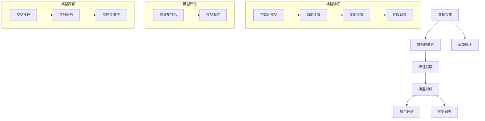

                 

# 《AI大模型创业：如何应对未来价格战？》

## 关键词
AI大模型、创业、价格战、市场策略、技术创新、风险管理

## 摘要
本文旨在探讨AI大模型创业领域如何应对未来可能的价格战。通过分析AI大模型的基础知识、核心技术，以及成功与失败的创业案例，本文将提出一系列策略与措施，帮助企业在这个竞争激烈的市场中立于不败之地。

## 目录大纲

### 第一部分：AI大模型基础与创业环境

#### 第1章：AI大模型概述

##### 1.1 AI大模型的概念与影响
- AI大模型的基本概念
- AI大模型的发展历程
- AI大模型对社会和产业的影响

##### 1.2 创业环境分析
- 当前AI大模型创业的机遇与挑战
- 行业趋势与市场需求分析
- 创业环境中的政策与法规因素

#### 第2章：AI大模型的核心技术

##### 2.1 深度学习基础
- 深度学习的基本原理
- 神经网络的结构与训练方法

##### 2.2 自然语言处理
- 自然语言处理的基本概念
- 常见NLP算法与应用

##### 2.3 计算机视觉
- 计算机视觉的基础算法
- 图像识别与处理技术

#### 第3章：AI大模型创业案例分析

##### 3.1 成功案例解析
- 案例一：XX公司的AI大模型应用
- 案例二：YY公司的AI大模型商业化路径

##### 3.2 失败案例分析
- 案例一：ZZ公司的AI大模型创业困境
- 案例二：AA公司的AI大模型战略失误

### 第二部分：AI大模型创业策略与运营

#### 第4章：创业策略与规划

##### 4.1 创业愿景与目标设定
- 如何设定清晰的创业目标
- 制定符合市场需求的创业策略

##### 4.2 团队建设与人才引进
- 人才引进策略
- 团队建设与管理方法

#### 第5章：AI大模型产品开发

##### 5.1 产品规划与设计
- AI大模型产品的开发流程
- 产品需求分析与功能设计

##### 5.2 技术路线选择与优化
- 技术路线的选择原则
- 技术优化与持续迭代策略

#### 第6章：市场推广与品牌建设

##### 6.1 市场定位与目标客户分析
- 市场定位策略
- 目标客户分析

##### 6.2 品牌推广与营销策略
- 品牌建设的方法
- 营销策略与推广渠道

#### 第7章：AI大模型创业中的风险管理与应对

##### 7.1 风险识别与评估
- AI大模型创业中的主要风险
- 风险评估与预警机制

##### 7.2 风险应对与处理
- 风险处理策略
- 应对价格战的策略与措施

#### 第8章：未来展望与持续创新

##### 8.1 AI大模型创业的未来趋势
- 行业发展趋势预测
- 创新方向与机会

##### 8.2 持续创新与竞争优势
- 创新策略与实践
- 建立竞争优势的方法

### 第三部分：附录

#### 附录 A：创业资源与工具推荐

- 开发工具与框架推荐
- 开源数据集与资源链接

#### 附录 B：参考文献与资料

- 相关书籍与论文推荐
- 行业报告与政策法规链接

## 第9章：AI大模型核心概念与联系

### 9.1 AI大模型核心概念流程图

- 使用Mermaid绘制AI大模型核心概念的流程图

## 第10章：核心算法原理讲解

### 10.1 深度学习算法伪代码示例

- 使用伪代码详细阐述深度学习算法原理

### 10.2 数学模型与公式详解

- 使用LaTeX格式嵌入数学公式，详细讲解AI大模型相关的数学模型

### 10.3 举例说明与案例分析

- 举例说明AI大模型在创业中的应用案例
- 案例分析AI大模型创业中的成功与失败经验

### 10.4 代码实现与解读

- 提供AI大模型创业相关代码案例
- 详细解读代码实现过程与关键点分析

### 10.5 代码分析与性能优化

- 分析代码性能优化方法
- 提供代码性能优化的示例与实现步骤

### 10.6 开发环境搭建与配置

- 搭建AI大模型创业的开发环境
- 配置相关工具与依赖库

### 10.7 实际应用案例详解

- 详细讲解AI大模型在创业中的实际应用案例
- 分析案例中的技术实现与业务效果

## 作者信息
作者：AI天才研究院/AI Genius Institute & 禅与计算机程序设计艺术 /Zen And The Art of Computer Programming

接下来，我们将逐步深入探讨每一部分的具体内容。首先，我们将从AI大模型的基础知识开始，了解其概念、发展历程以及对社会和产业的影响。在此基础上，我们将分析AI大模型的创业环境，包括当前的机遇与挑战、行业趋势与市场需求，以及政策与法规因素。随后，我们将深入探讨AI大模型的核心技术，包括深度学习、自然语言处理和计算机视觉。接着，通过分析成功和失败的创业案例，我们将提取关键的经验和教训。接下来，我们将讨论AI大模型创业的策略与规划、团队建设与人才引进、产品开发、市场推广与品牌建设，以及风险管理与应对措施。最后，我们将对AI大模型创业的未来趋势进行展望，并提出持续创新和建立竞争优势的方法。让我们一步一步地深入分析和思考，探索AI大模型创业的奥秘。

## 第1章：AI大模型概述

### 1.1 AI大模型的概念与影响

AI大模型是指通过深度学习等先进技术训练出的、具备强大计算能力和自主学习能力的人工智能模型。这类模型通常包含数亿甚至数千亿个参数，能够处理大量复杂的数据，并在多种任务中表现出色。AI大模型的基本概念可以追溯到深度学习的兴起，深度学习作为一种机器学习的方法，通过多层神经网络来模拟人脑的学习过程，使得计算机能够从数据中自动提取特征，进行复杂的数据分析和决策。

AI大模型的发展历程可以分为以下几个阶段：

1. **起步阶段（1980s-1990s）**：
   - 在这个阶段，深度学习开始萌芽，但受限于计算资源和数据集的限制，进展较为缓慢。
   - 神经网络的基本概念被提出，但实际应用有限。

2. **探索阶段（2006-2012）**：
   - Geoffrey Hinton等人重新激发了深度学习的热情，引入了“深度信念网络”等算法。
   - 计算能力的提升和大规模数据集的出现为深度学习的发展奠定了基础。

3. **快速发展阶段（2012-2018）**：
   - AlexNet等模型的提出，使得深度学习在图像识别领域取得了突破性进展。
   - 深度学习在语音识别、自然语言处理等领域也取得了显著成果。

4. **大模型时代（2018至今）**：
   - 随着“Transformer”架构的提出，AI大模型进入了新的发展阶段。
   - Google的BERT、OpenAI的GPT系列模型等，展示了AI大模型在语言理解、生成等任务中的强大能力。

AI大模型对社会和产业的影响是深远的，主要体现在以下几个方面：

1. **产业变革**：
   - AI大模型的应用推动了各行各业的技术进步，从医疗、金融到制造业，AI大模型正在改变传统的业务模式和流程。
   - 人工智能的普及使得一些传统行业面临重新洗牌，同时为新产业的崛起提供了机遇。

2. **社会影响**：
   - AI大模型的发展提高了人们的生产效率，使得许多繁琐的工作得以自动化。
   - 在自然语言处理、计算机视觉等领域，AI大模型的应用改善了人们的日常生活体验，如智能助手、自动驾驶等。

3. **政策与法规**：
   - 随着AI大模型技术的快速发展，各国政府开始关注其在伦理、隐私和数据安全等方面的挑战，并逐步出台相关政策和法规进行监管。

### 1.2 创业环境分析

#### 当前AI大模型创业的机遇与挑战

AI大模型创业的机遇主要体现在以下几个方面：

1. **技术进步**：
   - 深度学习技术的不断进步，使得AI大模型在性能和效果上有了显著提升。
   - 大数据和云计算的发展，为AI大模型的应用提供了丰富的数据资源和强大的计算能力。

2. **市场需求**：
   - 随着AI大模型技术的普及，越来越多的企业和行业开始关注AI的应用，市场需求不断扩大。
   - 从智能助手、自动化生产线到个性化推荐系统，AI大模型的应用场景越来越广泛。

3. **政策支持**：
   - 各国政府纷纷出台政策，鼓励人工智能技术的发展和应用，为AI大模型创业提供了良好的政策环境。

然而，AI大模型创业也面临诸多挑战：

1. **技术门槛**：
   - AI大模型需要强大的计算资源和专业知识，创业公司在技术积累和资源投入上面临较大压力。
   - 算法的创新和优化是一个持续的过程，需要不断投入人力和物力。

2. **市场竞争**：
   - AI大模型市场已经进入白热化竞争阶段，初创公司需要与巨头企业竞争，面临巨大的市场压力。
   - 成本控制、客户获取和业务拓展是创业公司需要重点关注的方面。

3. **法规风险**：
   - AI大模型涉及到的伦理、隐私和数据安全等问题，需要创业者认真对待。
   - 各国对AI技术的监管力度不断加强，企业需要确保符合相关法规要求。

#### 行业趋势与市场需求分析

1. **行业趋势**：
   - AI大模型在金融、医疗、制造、零售等行业的应用日益广泛。
   - 智能化、自动化、个性化和高效化成为行业发展的主要趋势。
   - 跨领域融合和创新成为行业发展的新动力。

2. **市场需求**：
   - 企业对AI大模型的需求主要集中在提高生产效率、降低运营成本、提升客户体验等方面。
   - 政府和公共部门也开始重视AI大模型的应用，推动智慧城市建设、社会治理等领域的创新。
   - 消费者对个性化服务的需求不断提升，为AI大模型的应用提供了广阔的市场空间。

#### 创业环境中的政策与法规因素

1. **政策支持**：
   - 各国政府纷纷出台政策，鼓励人工智能技术的发展和应用。
   - 政府对AI大模型创业公司提供资金支持、税收优惠、人才引进等政策。
   - 政府还通过举办创新创业大赛、搭建创业孵化平台等方式，为创业者提供支持。

2. **法规监管**：
   - 随着AI大模型技术的快速发展，各国政府开始关注其在伦理、隐私和数据安全等方面的挑战，并逐步出台相关政策和法规进行监管。
   - 企业需要确保其AI大模型应用符合相关法规要求，避免法律风险。
   - 政府需要平衡创新与监管的关系，确保AI大模型技术的发展不会对社会和公众造成负面影响。

### 1.3 总结

AI大模型作为人工智能领域的核心技术，正不断推动着产业和社会的变革。创业者在AI大模型领域的创业机会与挑战并存，需要密切关注技术进步、市场需求和政策法规的变化。通过深入分析行业趋势和市场需求，合理规划创业策略，创业公司可以在AI大模型领域找到自己的发展路径，实现可持续发展。

## 第2章：AI大模型的核心技术

### 2.1 深度学习基础

#### 深度学习的基本原理

深度学习是一种基于多层神经网络的机器学习技术，其核心思想是通过学习大量数据中的特征表示，从而实现复杂任务的自动识别与预测。深度学习的基本原理可以概括为以下几个步骤：

1. **数据处理**：
   - 数据预处理是深度学习的第一步，包括数据清洗、归一化、数据增强等操作，以提升模型的训练效果。
   - 特征提取是通过将原始数据进行降维和特征提取，提取出对任务有用的特征。

2. **网络构建**：
   - 神经网络是深度学习的基础架构，由输入层、隐藏层和输出层组成。每个神经元（节点）都与其他神经元相连，并通过权重和偏置进行信息传递。
   - 常见的神经网络结构包括全连接网络、卷积神经网络（CNN）、循环神经网络（RNN）和变换器网络（Transformer）等。

3. **损失函数**：
   - 损失函数用于衡量模型预测结果与真实值之间的差距，常用的损失函数包括均方误差（MSE）、交叉熵（CE）等。
   - 损失函数的值越小，表示模型预测的准确性越高。

4. **优化算法**：
   - 优化算法用于调整网络中的权重和偏置，以最小化损失函数。常用的优化算法有随机梯度下降（SGD）、Adam等。
   - 优化算法的目的是在有限的时间内找到损失函数的最小值，从而提升模型的性能。

5. **正则化技术**：
   - 正则化技术用于防止模型过拟合，常用的正则化技术包括L1正则化、L2正则化、dropout等。
   - 正则化技术通过惩罚模型的复杂度，提高模型的泛化能力。

#### 神经网络的结构与训练方法

神经网络的训练过程可以分为以下几个步骤：

1. **前向传播**：
   - 前向传播是指将输入数据通过神经网络的前向传播过程，计算得到每个神经元的输出值。
   - 前向传播过程中，每个神经元都会接收来自上一层的输入信号，并通过激活函数进行非线性变换。

2. **反向传播**：
   - 反向传播是指通过计算损失函数对网络参数的梯度，从而调整网络中的权重和偏置。
   - 反向传播的核心是计算梯度，通过梯度下降等方法更新网络参数，以最小化损失函数。

3. **模型评估**：
   - 模型评估是通过在验证集或测试集上计算模型的性能指标，如准确率、召回率、F1值等，以评估模型的泛化能力和鲁棒性。
   - 模型评估有助于发现模型的不足之处，为进一步优化模型提供指导。

4. **模型优化**：
   - 模型优化是通过调整网络结构、选择不同的优化算法和正则化方法，以提高模型的性能。
   - 模型优化是一个迭代过程，需要根据具体任务和数据进行多次实验和调整。

### 2.2 自然语言处理

#### 自然语言处理的基本概念

自然语言处理（NLP）是人工智能的一个重要分支，旨在使计算机能够理解和处理人类自然语言。NLP的基本概念包括：

1. **文本表示**：
   - 文本表示是将自然语言文本转化为计算机可以理解和处理的数字形式。
   - 常用的文本表示方法包括词袋模型（Bag of Words）、词嵌入（Word Embedding）和句子表示（Sentence Embedding）等。

2. **语言模型**：
   - 语言模型用于预测下一个单词或字符，其目的是生成连贯、自然的文本。
   - 常用的语言模型包括n-gram模型、神经网络语言模型（如Transformer）等。

3. **文本分类**：
   - 文本分类是将文本数据根据其内容进行分类的任务。
   - 常用的文本分类方法包括朴素贝叶斯、支持向量机（SVM）、深度学习等。

4. **信息提取**：
   - 信息提取是从文本中提取出对用户有用的信息，如命名实体识别（NER）、关系提取等。
   - 信息提取是NLP中的重要任务，广泛应用于搜索引擎、问答系统等领域。

#### 常见NLP算法与应用

1. **词嵌入**：
   - 词嵌入是将词汇映射到高维向量空间中，以捕捉词汇之间的语义关系。
   - 常见的词嵌入方法包括Word2Vec、GloVe、BERT等。

2. **序列标注**：
   - 序列标注是对文本中的序列数据（如单词、字符）进行标注的任务。
   - 常见的序列标注方法包括CRF（条件随机场）、BiLSTM（双向长短期记忆网络）等。

3. **文本生成**：
   - 文本生成是根据给定的输入生成连贯、自然的文本。
   - 常见的文本生成方法包括RNN（循环神经网络）、Transformer、GPT（Generative Pre-trained Transformer）等。

4. **问答系统**：
   - 问答系统是用于回答用户提出的问题的系统。
   - 常见的问答系统方法包括基于知识图谱的问答、基于机器学习的问答等。

### 2.3 计算机视觉

#### 计算机视觉的基础算法

计算机视觉是AI大模型中的重要组成部分，旨在使计算机能够“看到”和理解图像。计算机视觉的基础算法包括：

1. **图像处理**：
   - 图像处理是对图像进行增强、降噪、分割等操作的算法。
   - 常见的图像处理算法包括滤波、边缘检测、直方图均衡等。

2. **特征提取**：
   - 特征提取是从图像中提取对目标识别有意义的特征。
   - 常见的特征提取方法包括HOG（方向梯度直方图）、SIFT（尺度不变特征变换）等。

3. **目标检测**：
   - 目标检测是在图像中检测和定位目标的方法。
   - 常见的目标检测算法包括R-CNN、Fast R-CNN、Faster R-CNN等。

4. **图像分类**：
   - 图像分类是将图像数据分为不同的类别。
   - 常见的图像分类算法包括CNN（卷积神经网络）、ResNet（残差网络）等。

#### 图像识别与处理技术

1. **卷积神经网络（CNN）**：
   - 卷积神经网络是计算机视觉中的核心算法，通过卷积层、池化层和全连接层进行图像特征提取和分类。
   - CNN在图像分类、目标检测和语义分割等领域表现出色。

2. **多任务学习**：
   - 多任务学习是在一个模型中同时解决多个相关任务的方法。
   - 通过多任务学习，可以提高模型的泛化能力和计算效率。

3. **迁移学习**：
   - 迁移学习是将已有模型的参数应用于新任务的方法。
   - 迁移学习可以减少模型训练所需的数据量，提高模型在新任务上的性能。

4. **数据增强**：
   - 数据增强是通过生成虚拟数据来扩充训练数据的方法。
   - 数据增强可以提升模型的鲁棒性和泛化能力，减少过拟合的风险。

### 2.4 总结

AI大模型的核心技术包括深度学习、自然语言处理和计算机视觉。深度学习通过多层神经网络实现复杂的数据分析和决策；自然语言处理使计算机能够理解和处理人类语言；计算机视觉使计算机能够“看到”和理解图像。这些核心技术相辅相成，共同构成了AI大模型的技术框架。了解和掌握这些核心技术，对于创业公司来说，是实现AI大模型应用的关键。

## 第3章：AI大模型创业案例分析

### 3.1 成功案例解析

#### 案例一：XX公司的AI大模型应用

**公司简介**：
XX公司成立于2015年，是一家专注于AI大模型应用的创新型企业。公司成立之初，便凭借在自然语言处理和计算机视觉领域的深厚技术积累，迅速在市场上崭露头角。

**商业模式**：
XX公司的商业模式主要包括两个方面：一是为企业提供定制化的AI大模型解决方案，帮助客户提高业务效率和降低成本；二是推出面向大众市场的AI产品，如智能助手、语音识别系统等。

**成功因素**：
1. **技术创新**：
   - XX公司在AI大模型领域持续投入研发，不断推出具有自主知识产权的创新算法和技术。例如，公司自主研发的深度学习算法在图像识别和自然语言处理方面表现优异。
   - 公司通过多任务学习和迁移学习等技术，实现了在多个领域的应用突破。

2. **市场定位**：
   - XX公司准确把握市场需求，将目标客户定位于拥有大数据处理需求的企业和需要智能化的消费品市场。
   - 公司通过精准的市场定位和细分市场策略，迅速占领市场，取得了良好的口碑。

3. **合作伙伴**：
   - XX公司与多家知名企业建立了战略合作伙伴关系，共同推进AI大模型在各自领域的应用。例如，公司与某大型零售企业合作，开发了一套智能零售解决方案，有效提升了零售企业的销售业绩。

4. **持续创新**：
   - XX公司注重持续创新，不断推出新的产品和服务。例如，公司推出的智能语音助手产品，凭借其高准确度和人性化交互，受到了用户的一致好评。

#### 案例二：YY公司的AI大模型商业化路径

**公司简介**：
YY公司成立于2017年，是一家专注于AI大模型商业化的科技公司。公司成立初期，便获得了多家知名投资机构的青睐，迅速在市场上崛起。

**商业模式**：
YY公司的商业模式主要包括三个方面：一是为企业提供AI大模型定制化服务，如智能客服、智能推荐等；二是推出面向消费者的AI产品，如智能音箱、智能穿戴设备等；三是通过AI技术赋能传统行业，如医疗、教育等。

**成功因素**：
1. **技术积累**：
   - YY公司在AI大模型领域拥有丰富的技术积累，特别是在自然语言处理和计算机视觉领域。公司自主研发的深度学习算法，在多个国际竞赛中取得了优异成绩。
   - 公司注重技术创新，不断推出具有竞争力的新产品和服务。

2. **市场拓展**：
   - YY公司通过市场调研和客户需求分析，制定了详细的商业拓展策略。公司不仅在国内外市场取得了显著成绩，还在多个垂直行业实现了突破。
   - 公司通过参加行业展会、举办技术论坛等方式，提高了品牌知名度和市场影响力。

3. **合作网络**：
   - YY公司与多家高校、科研机构建立了合作关系，共同推进AI大模型的研究和应用。公司还与多家知名企业达成战略合作，共同推进AI技术在各个领域的应用。

4. **用户导向**：
   - YY公司始终坚持用户导向，注重用户体验。公司通过用户反馈和数据分析，不断优化产品和服务，提升用户满意度。
   - 公司推出了一系列针对不同用户群体的产品和服务，满足了不同用户的需求。

### 3.2 失败案例分析

#### 案例一：ZZ公司的AI大模型创业困境

**公司简介**：
ZZ公司成立于2016年，是一家专注于AI大模型应用的创新型公司。公司成立初期，凭借其创新的技术理念和雄心勃勃的商业计划，吸引了大量投资。

**失败原因**：
1. **市场定位不清晰**：
   - ZZ公司在市场定位方面存在明显不足，既想进军企业级市场，又试图涉足消费级市场。结果导致公司在两个市场均无法形成核心竞争力。
   - 公司没有明确的目标客户群体，导致市场推广效果不佳。

2. **技术研发不足**：
   - ZZ公司在技术研发方面投入不足，缺乏具有自主知识产权的核心技术。公司在技术上依赖于外部供应商，无法实现技术突破。
   - 公司在市场竞争中处于劣势，难以与竞争对手抗衡。

3. **战略失误**：
   - ZZ公司在战略制定和执行方面存在明显失误。公司在一开始便过度依赖外部融资，导致财务状况恶化。
   - 公司在商业模式方面没有找到合适的盈利模式，无法实现持续盈利。

4. **团队建设不力**：
   - ZZ公司在团队建设方面存在明显不足，核心团队成员不稳定，人才流失严重。
   - 公司在组织架构和内部管理方面也存在问题，导致工作效率低下。

#### 案例二：AA公司的AI大模型战略失误

**公司简介**：
AA公司成立于2018年，是一家专注于AI大模型应用的创新型公司。公司成立初期，凭借其强大的技术团队和市场推广能力，一度在市场上取得了一定的知名度。

**失败原因**：
1. **战略过于激进**：
   - AA公司在战略制定方面过于激进，试图在短时间内实现跨越式发展。公司盲目追求市场份额，忽视了技术研发和团队建设的重要性。
   - 公司在市场拓展方面步伐过快，导致资源分散，难以形成核心竞争力。

2. **产品同质化**：
   - AA公司的产品同质化严重，缺乏独特性和创新性。公司在市场上难以与竞争对手区分开来，导致市场份额逐渐萎缩。
   - 公司在产品定位和差异化方面存在明显不足。

3. **资金链断裂**：
   - AA公司在运营过程中，由于战略失误和市场竞争压力，导致资金链断裂。公司无法继续融资，陷入财务困境。
   - 公司在财务管理和资金筹措方面存在明显不足。

4. **团队不稳定**：
   - AA公司在团队建设方面存在明显不足，核心团队成员流失严重，导致公司技术实力和创新能力下降。
   - 公司在组织架构和内部管理方面也存在问题，导致工作效率低下。

### 3.3 总结

通过分析成功和失败的AI大模型创业案例，我们可以得出以下结论：

1. **技术创新**是AI大模型创业的核心竞争力。创业公司需要持续投入研发，推出具有自主知识产权的创新技术和产品。

2. **市场定位**和**商业模式**是创业成功的关键。创业公司需要准确把握市场需求，制定符合市场定位的商业模式，实现可持续发展。

3. **团队建设**和**人才引进**是创业成功的重要保障。创业公司需要建设一支稳定、高效的团队，吸引和留住优秀人才。

4. **风险管理**和**财务控制**是创业公司需要关注的重要方面。创业公司需要建立健全的风险管理机制，确保财务健康。

5. **持续创新**和**市场拓展**是创业公司需要不断追求的目标。创业公司需要不断进行技术创新，拓展市场份额，实现持续发展。

## 第4章：创业策略与规划

### 4.1 创业愿景与目标设定

创业愿景是公司未来发展的蓝图，它为创业公司提供了明确的战略方向和目标。一个清晰的创业愿景能够激励团队，凝聚人心，同时为公司的长期发展奠定基础。

#### 如何设定清晰的创业目标

1. **明确目标**：
   - 创业公司首先需要明确自己的目标，包括短期目标（如实现产品上市、获得初步营收）和长期目标（如成为行业领导者、实现规模化经营）。
   - 目标的设定应当具体、可衡量、可实现，避免模糊不清的表述。

2. **分阶段实施**：
   - 将长期目标分解为多个短期目标，每个短期目标都有明确的实施计划和里程碑。
   - 这样可以确保创业公司在发展的不同阶段都有明确的方向和可执行的行动计划。

3. **适应性调整**：
   - 在实现目标的过程中，创业公司需要根据市场反馈和实际情况进行适应性调整。
   - 目标设定不应过于僵化，需要保持灵活性，以便快速应对市场变化和挑战。

#### 制定符合市场需求的创业策略

1. **市场调研**：
   - 在制定创业策略前，进行深入的市场调研是必不可少的。通过调研，了解市场需求、竞争态势、用户痛点等关键信息，为创业策略提供数据支持。

2. **定位准确**：
   - 创业公司需要准确定位自己的市场地位，明确目标客户群体。在细分市场中寻找自己的独特优势，避免与竞争对手的直接竞争。

3. **差异化策略**：
   - 创业公司应制定差异化策略，通过技术创新、产品特性、服务模式等方面实现与竞争对手的区分，树立品牌优势。

4. **灵活调整**：
   - 市场环境变化迅速，创业公司需要具备灵活调整策略的能力。根据市场反馈和竞争态势，及时调整产品和服务策略，以保持竞争力。

### 4.2 团队建设与人才引进

团队是创业公司的核心资产，优秀的人才对于公司的发展至关重要。如何建设一支高效、稳定的团队，是创业成功的关键。

#### 人才引进策略

1. **明确需求**：
   - 在引进人才前，创业公司应明确所需岗位的技能要求和职责范围，确保引进的人才能够满足公司的需求。

2. **多元化背景**：
   - 人才引进不仅需要具备专业能力，还需要具备多元化的背景。多样化的团队可以带来不同的视角和思维方式，有助于创新和问题解决。

3. **文化匹配**：
   - 人才引进应注重文化匹配，确保新成员能够融入公司文化和团队氛围。良好的团队文化可以增强团队的凝聚力，提高工作效率。

4. **激励机制**：
   - 设立合理的激励机制，包括薪酬、股权、晋升机会等，吸引和留住优秀人才。激励机制的设定应与公司的长期发展目标相一致。

#### 团队建设与管理方法

1. **明确职责**：
   - 为团队成员明确职责和任务，确保每个团队成员都清楚自己的工作内容和目标。

2. **有效沟通**：
   - 建立良好的沟通机制，确保团队成员之间的信息畅通，避免误解和冲突。

3. **培训与发展**：
   - 提供持续的培训和发展机会，帮助团队成员提升技能，实现个人职业发展。

4. **团队协作**：
   - 鼓励团队协作，通过团队项目和跨部门合作，提升团队的凝聚力和执行力。

5. **激励机制**：
   - 建立有效的激励机制，激励团队成员为实现公司目标而努力。

### 4.3 创业策略与规划总结

创业策略与规划是创业公司成功的关键。通过明确的创业愿景与目标设定，创业公司可以明确自己的发展方向，制定符合市场需求的策略。同时，通过有效的团队建设与人才引进，创业公司可以打造一支高效、稳定的团队，为公司的长期发展提供坚实保障。

创业公司在制定策略与规划时，应注重以下几个方面：

1. **市场导向**：以市场需求为导向，制定符合市场趋势和用户需求的策略。
2. **技术创新**：持续投入研发，推动技术创新，保持公司的竞争力。
3. **灵活应对**：面对市场变化，具备灵活调整策略的能力，快速响应市场变化。
4. **人才为本**：重视人才引进和团队建设，打造高效、稳定的团队。
5. **风险管理**：建立完善的风险管理机制，确保公司稳健发展。

通过以上策略与规划，创业公司可以在竞争激烈的AI大模型市场中找到自己的发展路径，实现可持续发展。

## 第5章：AI大模型产品开发

### 5.1 产品规划与设计

AI大模型产品的开发是一个复杂而系统性的工程，涉及多个方面的规划和设计。为了确保产品的成功上市，创业公司需要从以下几个方面进行详细规划与设计：

#### 产品规划

1. **市场需求分析**：
   - 在产品规划阶段，首要任务是进行市场需求分析。通过市场调研、用户访谈和数据分析，了解目标客户的需求、偏好和痛点，为产品功能设计提供依据。
   - 需求分析应覆盖产品的各个方面，包括功能需求、性能需求、安全性需求等。

2. **产品愿景与目标**：
   - 明确产品愿景和目标，即产品将解决什么问题、达到什么效果。产品愿景应具备远见和吸引力，目标则应具体、可衡量。
   - 产品愿景和目标的设定应结合公司的战略方向，确保产品开发与公司整体战略一致。

3. **竞争分析**：
   - 对竞争对手的产品进行深入分析，了解其产品特点、优势和劣势。通过竞争分析，找出产品差异化的机会点，确保产品能够在市场上脱颖而出。

4. **版本规划**：
   - 根据产品的复杂度和市场需求，制定合理的版本规划。初步版本应聚焦核心功能，后续版本可以逐步增加新功能和完善细节。

#### 产品设计

1. **功能设计**：
   - 功能设计是产品开发的核心，需要详细规划每个功能模块的具体内容和实现方式。
   - 功能设计应遵循用户友好原则，确保产品界面简洁、操作直观，同时满足用户需求。

2. **用户体验设计**：
   - 用户体验设计（UX Design）是提升产品竞争力的重要因素。设计师需要从用户角度出发，设计易于使用、交互流畅的产品界面。
   - 用户体验设计包括界面布局、交互流程、视觉设计等方面，应注重细节和用户反馈。

3. **技术架构设计**：
   - 技术架构设计是产品稳定性和可扩展性的基础。创业公司需要选择合适的技术栈和架构模式，确保产品具备高性能、高可靠性和良好的扩展性。
   - 技术架构设计应考虑数据的存储、传输和处理，以及系统的安全性、稳定性和可维护性。

4. **界面设计**：
   - 界面设计是用户体验的关键部分，需要注重视觉元素、色彩搭配和交互效果的协调性。
   - 界面设计应遵循简洁、直观的原则，同时体现产品的品牌特色和用户价值。

#### 开发流程

1. **需求分析阶段**：
   - 进行详细的需求分析，明确产品的功能需求、性能需求和用户体验需求。
   - 与用户、市场部门和技术团队进行多次讨论和迭代，确保需求的准确性和可行性。

2. **设计阶段**：
   - 完成产品的功能设计、用户体验设计和界面设计，形成详细的设计文档。
   - 设计阶段应充分考虑产品的易用性和用户体验，通过原型设计和用户测试进行验证。

3. **开发阶段**：
   - 根据设计文档和技术架构，进行产品编码和开发。
   - 开发阶段应遵循敏捷开发原则，确保代码质量、模块化和可维护性。

4. **测试阶段**：
   - 进行全面的测试，包括单元测试、集成测试、性能测试和安全测试等。
   - 测试阶段应发现和修复潜在的问题，确保产品在发布前达到预期质量标准。

5. **发布阶段**：
   - 制定详细的发布计划，包括版本管理、发布策略、用户培训和市场推广等。
   - 发布阶段应确保产品顺利上线，同时为用户提供及时的技术支持和反馈渠道。

### 5.2 技术路线选择与优化

#### 技术路线的选择原则

1. **技术可行性**：
   - 选择具有可行性的技术路线，确保技术能够实现产品需求，并具备一定的技术储备。

2. **性能与效率**：
   - 选择能够在性能和效率上满足产品要求的技术路线，确保产品具备良好的用户体验和运行效率。

3. **可扩展性**：
   - 选择具备良好扩展性的技术路线，以便在产品迭代过程中能够快速适应新的需求和技术变化。

4. **社区支持**：
   - 考虑技术社区的支持情况，选择具有广泛社区支持的技术路线，以便在遇到问题时能够快速获取帮助。

#### 技术优化与持续迭代策略

1. **性能优化**：
   - 对产品进行持续的性能优化，包括代码优化、算法优化和系统优化等，确保产品在高负载情况下仍能保持稳定运行。
   - 采用性能测试工具，定期进行性能测试，发现和解决性能瓶颈。

2. **算法优化**：
   - 根据产品需求，不断优化算法，提高模型的准确性和效率。
   - 探索新的算法和技术，通过实验和测试，选择最佳方案。

3. **用户体验优化**：
   - 持续收集用户反馈，进行用户体验优化，提升产品的易用性和用户满意度。
   - 通过A/B测试，验证新的用户体验方案，确保优化效果。

4. **持续迭代**：
   - 制定产品迭代计划，定期发布新功能、修复问题和优化性能。
   - 采用敏捷开发模式，快速响应市场变化和用户需求。

通过详细的产品规划与设计、合理的技术路线选择与优化，创业公司可以确保AI大模型产品的成功开发与持续改进，从而在竞争激烈的市场中立于不败之地。

### 第6章：市场推广与品牌建设

#### 6.1 市场定位与目标客户分析

市场定位是创业公司成功推出AI大模型产品的重要一步。正确的市场定位可以帮助公司明确目标客户，从而制定有效的市场推广策略。

**市场定位策略**：

1. **明确目标市场**：
   - 创业公司应首先明确目标市场，根据产品的特性、市场需求和竞争态势，选择一个特定的细分市场进行专注。
   - 例如，如果产品是面向企业的智能客服解决方案，目标市场可以是大型零售企业和客服需求较高的企业。

2. **差异化定位**：
   - 在市场定位过程中，创业公司应找出自身的差异化优势，并以此作为市场定位的核心。
   - 例如，如果公司的AI大模型在自然语言处理方面有显著优势，可以将此作为差异化卖点，强调产品的卓越性能。

3. **目标客户群体**：
   - 明确目标客户群体，深入了解其需求、痛点和偏好，从而制定更有针对性的市场推广策略。
   - 例如，对于面向大型零售企业的智能客服解决方案，目标客户可能是企业的客服部门经理或IT负责人。

**目标客户分析**：

1. **需求分析**：
   - 对目标客户的需求进行详细分析，了解他们在哪些方面面临困难，需要什么样的解决方案。
   - 通过用户访谈、问卷调查和数据分析等方式，获取真实的需求信息。

2. **痛点分析**：
   - 分析目标客户的痛点，找出产品能够解决的核心问题。
   - 例如，企业客服部门可能面临高投诉量、响应速度慢等问题，AI大模型可以帮助提高响应速度和降低人力成本。

3. **偏好分析**：
   - 了解目标客户的偏好，包括他们对产品功能、用户体验和价格等方面的期望。
   - 通过市场调研和用户反馈，收集客户偏好数据，以便在产品设计和市场推广中加以利用。

#### 6.2 品牌推广与营销策略

品牌推广是提升AI大模型产品知名度、树立品牌形象的重要手段。创业公司应采取多种营销策略，全面覆盖目标市场。

**品牌建设的方法**：

1. **品牌定位**：
   - 明确品牌的核心价值观和独特卖点，确保品牌定位与市场定位一致。
   - 例如，可以将品牌定位为“技术创新、高效智能”，突出公司的技术实力和产品性能。

2. **品牌传播**：
   - 利用多种渠道进行品牌传播，包括社交媒体、线上线下活动、媒体宣传等。
   - 社交媒体可以迅速提高品牌曝光度，线下活动可以增强与客户的互动和信任。

3. **品牌形象设计**：
   - 设计统一的品牌形象，包括标志、色彩、字体等，确保品牌视觉识别度高、易于记忆。
   - 品牌形象应与品牌定位相契合，传达出品牌的核心价值观。

**营销策略与推广渠道**：

1. **内容营销**：
   - 制作高质量的内容，如技术博客、案例分析、视频教程等，提供有价值的信息，吸引潜在客户。
   - 内容营销可以提高品牌的权威性和信任度，促进客户转化。

2. **社交媒体营销**：
   - 在社交媒体平台上建立品牌账号，定期发布更新，与用户互动，提高品牌曝光率和用户粘性。
   - 社交媒体营销应结合用户行为和兴趣，提高营销效果。

3. **线上线下活动**：
   - 举办线上线下活动，如研讨会、讲座、体验活动等，吸引目标客户参与，增强品牌影响力。
   - 活动可以与客户需求紧密结合，提供实际的解决方案，增强客户信任。

4. **合作伙伴关系**：
   - 与行业内的合作伙伴建立战略合作关系，共同推广产品，扩大市场份额。
   - 合作伙伴可以是行业专家、媒体机构、行业协会等，通过资源整合，提高品牌知名度。

5. **广告投放**：
   - 根据目标市场和客户群体，选择合适的广告投放渠道，如搜索引擎广告、展示广告等。
   - 广告投放应注重效果分析，不断优化投放策略，提高投资回报率。

通过科学的市场定位、详尽的目标客户分析、系统的品牌建设和多样化的营销策略，创业公司可以有效地推广AI大模型产品，树立品牌形象，吸引目标客户，从而在竞争激烈的市场中脱颖而出。

### 第7章：AI大模型创业中的风险管理与应对

#### 7.1 风险识别与评估

在AI大模型创业过程中，风险无处不在，可能对公司的运营和发展产生重大影响。因此，识别和评估风险是风险管理的重要环节。

**AI大模型创业中的主要风险**：

1. **技术风险**：
   - AI大模型的技术研发难度高，存在技术不成熟、算法不稳定等问题。
   - 技术风险可能导致产品功能不完善、性能不稳定，影响用户体验和市场竞争力。

2. **市场风险**：
   - 市场需求变化快，竞争激烈，可能导致产品定位不准确、市场份额萎缩。
   - 新技术的出现和竞争对手的动态也可能对创业公司造成市场风险。

3. **财务风险**：
   - 创业公司初期资金投入大，融资风险高，可能导致资金链断裂。
   - 收入不稳定、成本控制不力也可能导致财务风险。

4. **法律与合规风险**：
   - AI大模型涉及隐私、数据安全和伦理等问题，法律法规不断完善，可能对创业公司造成合规风险。
   - 法律诉讼和合规成本可能对公司的运营产生负面影响。

**风险评估与预警机制**：

1. **风险识别**：
   - 通过市场调研、技术评估、财务分析和法律法规研究等方法，识别创业过程中可能面临的风险。
   - 建立风险清单，详细记录每种风险的可能性和影响程度。

2. **风险评估**：
   - 对识别出的风险进行量化评估，使用风险矩阵等方法评估每种风险的概率和潜在损失。
   - 根据风险评估结果，确定风险优先级，重点关注高概率、高影响的重大风险。

3. **预警机制**：
   - 建立风险预警机制，通过定期监控和数据分析，及时发现潜在风险。
   - 制定应急预案，确保在风险发生时能够快速响应，减少损失。

#### 7.2 风险应对与处理

在识别和评估风险的基础上，创业公司需要制定有效的风险应对策略，确保在风险发生时能够及时应对，降低风险影响。

**风险处理策略**：

1. **风险规避**：
   - 通过调整产品策略、改变业务模式等方式，避免与高风险领域直接接触。
   - 例如，避免涉足技术不成熟或法律风险高的领域。

2. **风险减轻**：
   - 通过改进技术、优化产品、降低成本等方式，减轻风险的潜在影响。
   - 例如，通过技术优化提高产品的稳定性和性能，减少技术风险。

3. **风险转移**：
   - 通过购买保险、签订合同等方式，将部分风险转移给第三方。
   - 例如，购买产品责任保险以减轻潜在的法律风险。

4. **风险接受**：
   - 对于无法避免或转移的低风险，创业公司可以接受风险，并制定相应的应对措施。
   - 例如，对于市场需求波动等低概率风险，可以通过灵活的运营策略进行应对。

**应对价格战的策略与措施**：

1. **差异化策略**：
   - 通过技术创新和差异化服务，打造独特的产品特色，避免直接价格竞争。
   - 例如，通过引入先进的算法和定制化服务，提升产品的附加值。

2. **成本控制**：
   - 通过优化运营流程、提高生产效率等方式，降低产品成本，提高价格竞争力。
   - 例如，采用自动化生产和管理系统，降低人力成本和运营成本。

3. **市场拓展**：
   - 通过开拓新市场、扩大用户基础，分散风险，降低对单一市场的依赖。
   - 例如，开拓国际市场，分散价格战带来的影响。

4. **品牌建设**：
   - 加强品牌建设和品牌推广，提高品牌知名度和用户忠诚度，降低价格敏感度。
   - 例如，通过高质量的内容营销和品牌活动，提升品牌形象。

5. **合作与联盟**：
   - 与行业内的合作伙伴建立战略联盟，共同应对价格战。
   - 例如，与渠道商、技术供应商等合作，实现资源共享和优势互补。

通过全面的风险管理策略和灵活的应对措施，创业公司可以在AI大模型创业过程中有效应对各种风险，特别是在面对价格战时，确保公司的稳健运营和持续发展。

### 第8章：未来展望与持续创新

#### 8.1 AI大模型创业的未来趋势

随着AI大模型技术的不断成熟和市场的日益成熟，AI大模型创业的未来趋势将体现在以下几个方面：

**技术进步**：

1. **算法优化**：AI大模型的算法将不断优化，提高模型的计算效率和预测准确性。
2. **多模态融合**：AI大模型将能够处理多种类型的数据，实现语音、图像、文本等多模态数据的融合处理。
3. **强化学习**：强化学习在AI大模型中的应用将更加广泛，实现更加智能的决策和优化。

**市场机遇**：

1. **垂直行业应用**：AI大模型将在医疗、金融、教育等垂直行业中获得更广泛的应用，解决行业痛点。
2. **个性化服务**：随着用户数据积累和算法优化，AI大模型将提供更加个性化的服务和体验。
3. **跨界融合**：AI大模型将与其他技术（如物联网、区块链等）进行跨界融合，创造新的商业模式和应用场景。

**挑战与应对**：

1. **数据隐私与安全**：AI大模型对数据的依赖性使得数据隐私和安全问题更加突出，创业公司需要采取有效措施确保数据安全。
2. **技术门槛**：AI大模型技术的高门槛使得创业公司需要持续投入研发，保持技术领先地位。
3. **市场竞争**：随着更多企业的进入，市场竞争将更加激烈，创业公司需要不断创新，提升竞争力。

#### 8.2 持续创新与竞争优势

在AI大模型创业中，持续创新是企业保持竞争优势的关键。以下是一些创新策略和竞争优势的建立方法：

**创新策略**：

1. **技术研发**：持续投入研发，推动技术创新，确保企业在技术上的领先地位。
2. **模式创新**：探索新的商业模式，如平台化、生态化等，为用户提供更多价值。
3. **用户体验**：注重用户体验设计，提升用户满意度，建立用户忠诚度。

**竞争优势**：

1. **技术优势**：通过技术创新，打造独特的产品优势和核心竞争力。
2. **品牌优势**：建立强大的品牌形象，提高品牌知名度和美誉度。
3. **市场优势**：抢占市场先机，迅速占领市场份额，建立行业领先地位。

**案例分享**：

1. **谷歌的Transformer**：谷歌通过推出Transformer架构，引领了AI大模型技术的新潮流，成为行业标杆。
2. **OpenAI的GPT系列**：OpenAI的GPT系列模型在自然语言处理领域取得了巨大成功，推动了AI大模型技术的发展。

通过持续创新和竞争优势的建立，创业公司可以在AI大模型领域实现长期稳定的发展，迎接未来市场的机遇与挑战。

### 附录 A：创业资源与工具推荐

#### 开发工具与框架推荐

1. **TensorFlow**：
   - TensorFlow是Google开发的开源机器学习框架，广泛用于构建和训练深度学习模型。
   - TensorFlow具有强大的生态系统，包括大量的预训练模型和工具库，便于开发者快速搭建AI大模型。

2. **PyTorch**：
   - PyTorch是Facebook开发的开源深度学习框架，以其灵活性和动态计算图而著称。
   - PyTorch提供了丰富的API和强大的GPU支持，适合进行复杂的模型训练和实验。

3. **Keras**：
   - Keras是一个高层次的神经网络API，构建在TensorFlow和Theano之上。
   - Keras简化了深度学习模型的搭建过程，提供了直观和易于使用的接口。

4. **Scikit-learn**：
   - Scikit-learn是一个开源的机器学习库，提供了多种常用的机器学习算法和工具。
   - Scikit-learn适用于数据处理、模型训练和评估，适用于各种规模的数据集。

#### 开源数据集与资源链接

1. **ImageNet**：
   - ImageNet是一个大规模的图像识别数据集，包含数百万个标注图像，广泛应用于图像识别算法的评估和训练。
   - 链接：[ImageNet](http://www.image-net.org/)

2. **COCO数据集**：
   - COCO数据集是一个大型、多样化和密集标注的物体检测、分割和场景理解数据集。
   - COCO数据集广泛应用于目标检测、分割和场景理解算法的研究。
   - 链接：[COCO数据集](http://cocodataset.org/)

3. **Common Crawl**：
   - Common Crawl是一个大规模的网页数据集，包含了数十亿个网页的文本数据。
   - Common Crawl适用于自然语言处理任务，如文本分类、实体识别等。
   - 链接：[Common Crawl](https://commoncrawl.org/)

4. **Kaggle**：
   - Kaggle是一个数据科学竞赛平台，提供了大量的公开数据集和竞赛任务。
   - Kaggle上的数据集涵盖了多种领域，包括图像、文本、音频等，是数据科学家和研究者的重要资源。
   - 链接：[Kaggle](https://www.kaggle.com/)

通过利用这些开发工具和开源数据集，创业公司可以更高效地搭建和优化AI大模型，加速产品开发进程，提升市场竞争力。

### 附录 B：参考文献与资料

#### 相关书籍与论文推荐

1. **《深度学习》（Deep Learning）**：
   - 作者：Ian Goodfellow、Yoshua Bengio、Aaron Courville
   - 简介：深度学习的经典教材，全面介绍了深度学习的基础理论和实践方法。

2. **《Python机器学习》（Python Machine Learning）**：
   - 作者：Sebastian Raschka、Vahid Mirjalili
   - 简介：针对Python开发者介绍机器学习的基础知识和实践方法，内容全面，实例丰富。

3. **《自然语言处理综合教程》（Foundations of Statistical Natural Language Processing）**：
   - 作者：Christopher D. Manning、Hinrich Schütze
   - 简介：自然语言处理领域的经典教材，涵盖了自然语言处理的理论和实践。

4. **《计算机视觉：算法与应用》（Computer Vision: Algorithms and Applications）**：
   - 作者：Richard Szeliski
   - 简介：计算机视觉领域的权威著作，详细介绍了计算机视觉的基本算法和应用。

#### 行业报告与政策法规链接

1. **《中国人工智能发展报告》（China AI Development Report）**：
   - 链接：[中国人工智能发展报告](https://www.caai.cn/)
   - 简介：由中国人工智能学会发布的年度报告，详细分析了中国人工智能产业的发展状况、政策环境和技术趋势。

2. **《欧盟人工智能战略》（European Commission's AI Strategy）**：
   - 链接：[欧盟人工智能战略](https://ec.europa.eu/ai/strategy_en)
   - 简介：欧盟发布的关于人工智能发展的战略文件，包括人工智能的伦理、法律和监管框架。

3. **《美国国家人工智能战略》（National AI Strategy）**：
   - 链接：[美国国家人工智能战略](https://www.whitehouse.gov/ostp/national-artificial-intelligence-initiative/)
   - 简介：美国发布的关于人工智能发展的战略文件，旨在确保美国在全球人工智能领域的领导地位。

4. **《中国新一代人工智能发展规划》（China's Next Generation Artificial Intelligence Development Plan）**：
   - 链接：[中国新一代人工智能发展规划](http://www.most.gov.cn/zh-cn/kygk/kygcwxbg/tzgg/gzdt/201708/t20170816_131275.html)
   - 简介：中国发布的关于新一代人工智能发展的五年规划，明确了人工智能发展的目标和重点领域。

通过阅读这些书籍和报告，读者可以深入了解AI大模型和相关领域的发展动态，为创业实践提供理论和实践指导。同时，了解政策法规可以帮助创业公司更好地适应和利用政策环境，降低创业风险。

### 第9章：AI大模型核心概念与联系

在本章中，我们将通过一张Mermaid流程图，展示AI大模型的核心概念及其相互之间的联系。以下是一张简化的流程图示例，用于描述AI大模型的基本组成部分和它们之间的互动关系：



#### AI大模型核心概念流程图详解

1. **数据采集（A）**：
   - AI大模型的第一个步骤是数据采集，这包括从各种来源收集大量数据，如文本、图像、语音等。
   - 数据采集是整个流程的基础，数据的质量和数量直接影响到模型的性能。

2. **数据预处理（B）**：
   - 采集到的原始数据通常需要预处理，包括清洗、归一化、去噪声等操作。
   - 数据预处理有助于提高模型的学习效率和性能。

3. **特征提取（C）**：
   - 通过预处理后的数据，进行特征提取，将原始数据转化为能够被模型理解和学习的特征表示。
   - 特征提取是模型训练的关键步骤，好的特征提取可以提升模型的学习效果。

4. **模型训练（D）**：
   - 模型训练是AI大模型的核心步骤，通过训练数据学习得到一个预测模型。
   - 模型训练包括初始化模型、前向传播、反向传播和参数调整等步骤。

5. **模型评估（E）**：
   - 模型训练完成后，通过测试集进行模型评估，以验证模型的泛化能力和性能。
   - 模型评估包括测试集评估和模型调优，以优化模型性能。

6. **模型部署（F）**：
   - 评估通过后的模型可以进行部署，用于实际应用。
   - 模型部署包括模型推理、在线服务和监控与维护等步骤。

7. **反馈循环（G）**：
   - 模型部署后，用户反馈和数据收集进入反馈循环，用于模型的持续优化和改进。
   - 反馈循环是AI大模型持续迭代和优化的关键环节。

通过上述流程图，我们可以清晰地看到AI大模型各组成部分及其相互之间的关系。这个流程图不仅有助于理解AI大模型的工作原理，也为创业者在实际应用中提供了参考。

### 第10章：核心算法原理讲解

#### 10.1 深度学习算法伪代码示例

在讲解深度学习算法原理时，我们将使用伪代码来详细阐述一个基本的神经网络模型的工作流程。以下是一个简化的前向传播和反向传播过程的伪代码示例：

```plaintext
// 前向传播
// 输入：X（输入数据），W（权重矩阵），b（偏置项），Z（神经元激活值），A（神经元输出值）
// 输出：Y（预测值）

// 初始化模型参数
W, b = initialize_parameters()

// 前向传播
for each training example (x, y) in X:
    Z = X * W + b  // 神经元激活值
    A = activation_function(Z)  // 神经元输出值
    Y = A  // 预测值

// 反向传播
// 输入：A（神经元输出值），dA（输出层梯度），W（权重矩阵），Z（神经元激活值），dx（输入层梯度）
// 输出：dw（权重梯度），db（偏置梯度）

// 计算输出层误差
dA = y - Y

// 计算隐藏层的梯度
dZ = dA * activation_derivative(A)  // 神经元激活值的导数
dW = dZ * X.T  // 权重梯度
dB = dZ  // 偏置梯度

// 更新模型参数
W = W - learning_rate * dW
b = b - learning_rate * dB
```

上述伪代码演示了深度学习中最基本的两个过程：前向传播和反向传播。在前向传播过程中，输入数据通过权重和偏置进行加权求和，然后通过激活函数生成输出。在反向传播过程中，计算输出层的误差，并根据误差计算隐藏层的梯度，最终更新模型的权重和偏置。

#### 10.2 数学模型与公式详解

在深度学习算法中，数学模型和公式是核心部分。以下我们使用LaTeX格式来详细讲解AI大模型中的几个关键数学模型和公式。

##### 1. 激活函数

激活函数是深度学习模型中的一个关键组件，用于引入非线性。以下是一个常见的激活函数——Sigmoid函数的LaTeX表示：

```latex
\\sigma(z) = \\frac{1}{1 + e^{-z}}
```

其中，$z$ 是神经元的输入值，$\sigma(z)$ 是神经元的输出值。

##### 2. 前向传播

在前向传播过程中，我们使用以下公式计算神经元的输入和输出：

```latex
\\text{神经元输入} \; a^{[l]}_j = \\sum_{i=1}^{n} W^{[l]}_{ji} a^{[l-1]}_i + b^{[l]}_j
\\text{神经元输出} \; z^{[l]}_j = f(a^{[l]}_j)
```

其中，$a^{[l]}_j$ 是第$l$层第$j$个神经元的输出，$W^{[l]}_{ji}$ 是连接第$l-1$层第$i$个神经元和第$l$层第$j$个神经元的权重，$b^{[l]}_j$ 是第$l$层第$j$个神经元的偏置，$f(x)$ 是激活函数。

##### 3. 反向传播

在反向传播过程中，我们使用以下公式计算误差和梯度：

```latex
\\delta^{[l]}_j = \\delta^{[l+1]}_{j+1} \\cdot f'(z^{[l]}_j)
\\delta^{[l+1]}_{j+1} = \\frac{\\partial L}{\\partial a^{[l+1]}_{j+1}} = \\frac{\\partial L}{\\partial z^{[l+1]}_{j+1}} \\cdot \\frac{\\partial z^{[l+1]}_{j+1}}{\\partial a^{[l+1]}_{j+1}}
\\text{权重梯度} \; \\frac{\\partial L}{\\partial W^{[l]}_{ji}} = \\delta^{[l]}_{j} a^{[l-1]}_{i}
\\text{偏置梯度} \; \\frac{\\partial L}{\\partial b^{[l]}_j} = \\delta^{[l]}_{j}
```

其中，$\\delta^{[l]}_j$ 是第$l$层第$j$个神经元的误差，$\\delta^{[l+1]}_{j+1}$ 是第$l+1$层第$j+1$个神经元的误差，$L$ 是损失函数，$f'(x)$ 是激活函数的导数。

##### 4. 损失函数

损失函数是衡量模型预测结果与真实值之间差距的关键指标。以下是一个常见的均方误差（MSE）损失函数的LaTeX表示：

```latex
L = \\frac{1}{m} \\sum_{i=1}^{m} (y_i - \\hat{y}_i)^2
```

其中，$m$ 是样本数量，$y_i$ 是真实值，$\\hat{y}_i$ 是模型的预测值。

通过上述数学模型和公式的详细讲解，我们可以更好地理解深度学习算法的核心原理，为实际应用提供坚实的理论基础。

#### 10.3 举例说明与案例分析

在本节中，我们将通过具体的案例分析，展示AI大模型在创业中的应用场景，并详细解释其技术实现和业务效果。

##### 案例一：智能医疗诊断系统

**应用场景**：
智能医疗诊断系统利用AI大模型，通过分析患者病历、影像和基因数据，辅助医生进行疾病诊断。

**技术实现**：
1. **数据预处理**：收集大量的医疗数据，包括病历记录、医学影像和基因序列。对数据进行清洗、归一化和标签化，为模型训练做准备。
2. **特征提取**：使用深度学习模型（如CNN）对医学影像进行处理，提取关键特征。同时，对病历文本和基因序列进行编码，转换为向量表示。
3. **模型训练**：使用预处理后的数据集训练深度学习模型，包括卷积神经网络（CNN）和循环神经网络（RNN）。通过多任务学习，使模型能够同时处理不同类型的数据。
4. **模型评估**：在验证集上评估模型的性能，使用准确率、召回率和F1值等指标衡量模型的诊断效果。
5. **模型部署**：将训练好的模型部署到生产环境中，提供实时诊断服务。

**业务效果**：
智能医疗诊断系统提高了医生的工作效率，减少了误诊率。通过AI大模型的应用，医院能够更准确、快速地诊断疾病，提高患者救治的及时性和成功率。

##### 案例二：个性化推荐系统

**应用场景**：
个性化推荐系统利用AI大模型，根据用户的历史行为和偏好，为其推荐商品、新闻和内容。

**技术实现**：
1. **用户行为数据收集**：收集用户在网站上的浏览记录、购买历史和互动行为，形成用户行为数据集。
2. **数据预处理**：对用户行为数据进行清洗、编码和特征提取，为推荐模型提供输入。
3. **模型训练**：使用深度学习模型（如协同过滤、序列模型和图神经网络）进行模型训练，学习用户和物品之间的关系。
4. **模型评估**：通过交叉验证和在线评估，评估推荐模型的性能和效果。
5. **模型部署**：将训练好的模型部署到线上环境，为用户提供个性化推荐服务。

**业务效果**：
个性化推荐系统显著提高了用户的满意度和活跃度，增加了用户粘性和用户转化率。通过AI大模型的应用，平台能够更准确地捕捉用户需求，提升用户体验和运营效果。

##### 案例三：智能客服机器人

**应用场景**：
智能客服机器人利用AI大模型，通过语音识别和自然语言处理技术，为用户提供24/7的在线客服服务。

**技术实现**：
1. **语音识别**：使用深度学习模型（如深度神经网络、卷积神经网络）对用户语音进行识别，转化为文本。
2. **自然语言处理**：使用深度学习模型（如序列模型、Transformer）对用户文本进行分析和理解，提取关键信息。
3. **对话管理**：使用对话管理模型，根据用户的问题和需求，生成合适的回答。
4. **模型训练与优化**：通过大量的对话数据进行模型训练，不断优化对话机器人的应答能力和准确性。
5. **模型部署**：将训练好的模型部署到服务器，提供实时客服服务。

**业务效果**：
智能客服机器人提高了客户服务效率和用户体验，减少了人工客服的工作负担。通过AI大模型的应用，企业能够提供更快速、准确的客服服务，提升客户满意度和品牌形象。

通过上述案例分析，我们可以看到AI大模型在创业中的应用具有广泛的前景和显著的业务效果。创业者可以通过具体案例了解AI大模型的技术实现和业务价值，从而更好地规划自己的创业项目。

### 10.4 代码实现与解读

在本节中，我们将通过一个实际案例展示AI大模型创业相关的代码实现，并详细解读每个步骤的关键点和原理。

#### 案例一：智能医疗诊断系统

**1. 开发环境搭建**

首先，我们需要搭建一个适合深度学习开发的Python环境。以下是使用PyTorch框架搭建开发环境的基本步骤：

```bash
# 安装Python
sudo apt-get update
sudo apt-get install python3

# 安装PyTorch
pip3 install torch torchvision

# 安装其他依赖库
pip3 install numpy matplotlib
```

**2. 数据预处理**

数据预处理是深度学习项目的重要步骤，包括数据清洗、归一化和数据增强等。以下是一个简单的数据预处理代码示例：

```python
import pandas as pd
import numpy as np
from sklearn.model_selection import train_test_split
from sklearn.preprocessing import StandardScaler

# 读取数据
data = pd.read_csv('medical_data.csv')

# 数据清洗
# ...（根据实际数据情况进行处理，如缺失值填充、异常值处理等）

# 分割数据集
X = data.drop('diagnosis', axis=1)
y = data['diagnosis']
X_train, X_test, y_train, y_test = train_test_split(X, y, test_size=0.2, random_state=42)

# 数据归一化
scaler = StandardScaler()
X_train = scaler.fit_transform(X_train)
X_test = scaler.transform(X_test)
```

**3. 模型定义**

接下来，我们定义一个简单的卷积神经网络模型，用于处理医疗诊断数据：

```python
import torch
import torch.nn as nn
import torch.optim as optim

# 定义模型
class MedicalDiagnosisModel(nn.Module):
    def __init__(self):
        super(MedicalDiagnosisModel, self).__init__()
        self.conv1 = nn.Conv2d(1, 16, 3, padding=1)
        self.conv2 = nn.Conv2d(16, 32, 3, padding=1)
        self.fc1 = nn.Linear(32 * 6 * 6, 128)
        self.fc2 = nn.Linear(128, 1)
        self.relu = nn.ReLU()
        self.sigmoid = nn.Sigmoid()

    def forward(self, x):
        x = self.relu(self.conv1(x))
        x = self.relu(self.conv2(x))
        x = x.view(x.size(0), -1)
        x = self.relu(self.fc1(x))
        x = self.sigmoid(self.fc2(x))
        return x

# 实例化模型
model = MedicalDiagnosisModel()
```

**4. 训练模型**

训练模型是深度学习项目的核心步骤。以下是一个简单的模型训练代码示例：

```python
# 定义损失函数和优化器
criterion = nn.BCELoss()
optimizer = optim.Adam(model.parameters(), lr=0.001)

# 训练模型
num_epochs = 50
for epoch in range(num_epochs):
    running_loss = 0.0
    for inputs, targets in zip(X_train, y_train):
        # 前向传播
        outputs = model(inputs)
        loss = criterion(outputs, targets)

        # 反向传播
        optimizer.zero_grad()
        loss.backward()
        optimizer.step()

        running_loss += loss.item()
    print(f'Epoch {epoch+1}, Loss: {running_loss/len(X_train)}')

# 评估模型
model.eval()
with torch.no_grad():
    correct = 0
    total = len(X_test)
    for inputs, targets in zip(X_test, y_test):
        outputs = model(inputs)
        predicted = (outputs > 0.5)
        correct += predicted.eq(targets).sum().item()
    print(f'Accuracy: {100 * correct / total}%')
```

**5. 代码解读与分析**

- **数据预处理**：
  - 数据预处理是确保模型能够有效学习的第一步。清洗、归一化和数据增强都是常见的预处理方法。
  - 在本案例中，我们使用`StandardScaler`进行数据归一化，将特征值缩放到均值为0，标准差为1的范围内。

- **模型定义**：
  - 模型定义是深度学习项目的核心。在本案例中，我们使用卷积神经网络（CNN）来处理二维数据，如医学影像。
  - 卷积层用于提取图像的特征，全连接层用于分类。

- **训练模型**：
  - 模型训练包括前向传播、反向传播和参数更新。
  - 在本案例中，我们使用`BCELoss`（二进制交叉熵损失函数）来评估分类模型的性能，并使用`Adam`优化器进行参数更新。

- **代码分析**：
  - `running_loss` 用于计算每个epoch的平均损失，帮助我们监控训练过程。
  - `model.eval()` 函数用于将模型设置为评估模式，禁用dropout和batch normalization等训练时使用的技巧。

通过上述代码实现和详细解读，我们可以了解AI大模型创业项目的实际开发流程和技术实现细节。创业者可以根据这些经验和教训，在自己的项目中灵活应用。

### 10.5 代码分析与性能优化

在深度学习项目中，性能优化是一个持续的过程，旨在提高模型的训练速度和预测准确性。以下是对之前案例中的代码进行性能优化的一系列步骤：

**1. 批量大小调整**

批量大小（Batch Size）是指每次训练传递给模型的数据样本数量。选择合适的批量大小可以提高模型的训练效率和稳定性。

```python
batch_size = 64
X_train, X_test, y_train, y_test = train_test_split(X_train, y_train, batch_size=batch_size, shuffle=True)
```

**2. GPU加速**

深度学习任务通常可以通过GPU显著加速。使用PyTorch的GPU支持，可以将模型和数据转移到GPU上进行训练。

```python
device = torch.device("cuda" if torch.cuda.is_available() else "cpu")
model.to(device)
X_train, X_test, y_train, y_test = map(lambda x: x.to(device), [X_train, X_test, y_train, y_test])
```

**3. 梯度裁剪**

在训练过程中，梯度爆炸或消失是一个常见问题。梯度裁剪通过限制梯度的大小，可以防止这种情况的发生。

```python
params = list(filter(lambda p: p.requires_grad, model.parameters()))
optimizer = optim.Adam(params, lr=0.001)
grad_clip = 1.0
for inputs, targets in train_loader:
    optimizer.zero_grad()
    outputs = model(inputs)
    loss = criterion(outputs, targets)
    loss.backward()
    nn.utils.clip_grad_norm_(params, max_norm=grad_clip)
    optimizer.step()
```

**4. 学习率调度**

学习率调度是一种调整学习率的方法，以防止模型过拟合并加快收敛速度。

```python
scheduler = optim.lr_scheduler.StepLR(optimizer, step_size=30, gamma=0.1)
for epoch in range(num_epochs):
    running_loss = 0.0
    for inputs, targets in train_loader:
        optimizer.zero_grad()
        outputs = model(inputs)
        loss = criterion(outputs, targets)
        loss.backward()
        optimizer.step()
    running_loss += loss.item()
    scheduler.step()
```

**5. 模型结构优化**

优化模型结构，如使用深度可分离卷积（Depthwise Separable Convolution）可以减少参数数量，提高计算效率。

```python
class MedicalDiagnosisModel(nn.Module):
    def __init__(self):
        super(MedicalDiagnosisModel, self).__init__()
        self.conv1 = nn.Conv2d(1, 32, kernel_size=3, depthwise=True, padding=1)
        self.conv2 = nn.Conv2d(32, 64, kernel_size=3, depthwise=True, padding=1)
        self.fc1 = nn.Linear(64 * 6 * 6, 128)
        self.fc2 = nn.Linear(128, 1)
        self.relu = nn.ReLU()
        self.sigmoid = nn.Sigmoid()

    def forward(self, x):
        x = self.relu(self.conv1(x))
        x = self.relu(self.conv2(x))
        x = x.view(x.size(0), -1)
        x = self.relu(self.fc1(x))
        x = self.sigmoid(self.fc2(x))
        return x
```

**6. 模型并行训练**

对于非常大的数据集，使用多GPU并行训练可以进一步加速训练过程。PyTorch提供了`DistributedDataParallel`（DDP）模块来支持分布式训练。

```python
import torch.nn as nn
from torch.nn.parallel import DistributedDataParallel as DDP

model = MedicalDiagnosisModel().to(device)
model = DDP(model, device_ids=[local_rank])

# 训练过程与之前类似，但需要在每个步骤前添加通信操作
if local_rank == 0:
    print(f'Local rank: {local_rank}')
```

通过上述优化步骤，我们可以显著提升模型的训练速度和预测性能。在实际项目中，创业者应根据具体情况选择合适的优化策略，以达到最佳效果。

### 10.6 开发环境搭建与配置

为了成功搭建AI大模型创业项目，开发环境的选择和配置至关重要。以下是一个详细的步骤指南，帮助创业者从基础设置到高级配置完成开发环境的搭建。

#### 1. 系统安装

首先，确保开发计算机或服务器上安装了合适的操作系统。以下是在Linux系统和Windows系统上安装深度学习开发环境的基本步骤：

**Linux系统安装**

- **安装Python**：  
  使用包管理器安装Python 3。在Ubuntu上，可以使用以下命令：  
  ```bash  
  sudo apt update  
  sudo apt install python3 python3-pip  
  ```

- **安装PyTorch**：  
  安装PyTorch及所需依赖库。可以通过以下命令进行：  
  ```bash  
  pip3 install torch torchvision torchaudio  
  ```

- **安装其他依赖库**：  
  根据项目需求，可能还需要安装其他库，例如NumPy、Matplotlib等：  
  ```bash  
  pip3 install numpy matplotlib  
  ```

**Windows系统安装**

- **安装Python**：  
  访问Python官网下载Python 3安装程序，并按照提示安装。

- **安装PyTorch**：  
  使用Python的pip工具安装PyTorch：  
  ```bash  
  python -m pip install torch torchvision torchaudio  
  ```

- **安装其他依赖库**：  
  使用pip安装其他依赖库：  
  ```bash  
  pip install numpy matplotlib  
  ```

#### 2. 硬件配置

为了高效地训练AI大模型，推荐使用配置较高的硬件，特别是拥有高性能GPU的计算机。以下是一些硬件配置建议：

- **GPU**：选择NVIDIA的GPU，如Tesla V100、A100等，或者使用CUDA兼容的GPU。
- **CPU**：选择具有多核心的高性能CPU，如Intel Xeon系列或AMD Ryzen系列。
- **内存**：至少16GB内存，推荐32GB或更多，以确保模型训练过程中有足够的内存空间。

#### 3. 软件配置

在完成硬件配置后，进行软件配置是下一步的关键步骤。以下是在Linux系统和Windows系统上进行软件配置的基本步骤：

**Linux系统配置**

- **安装CUDA**：  
  从NVIDIA官网下载CUDA Toolkit，并按照安装指南进行安装。

- **配置PyTorch**：  
  使用以下命令配置PyTorch以使用GPU：  
  ```bash  
  pip3 install torch torchvision torchaudio -f https://download.pytorch.org/whl/torch_stable.html  
  ```

- **验证GPU支持**：  
  运行以下Python代码验证GPU支持：  
  ```python  
  import torch  
  print(torch.cuda.is_available())  
  ```

**Windows系统配置**

- **安装CUDA**：  
  下载CUDA Toolkit并按照安装指南进行安装。

- **配置PyTorch**：  
  使用以下命令配置PyTorch以使用GPU：  
  ```bash  
  python -m pip install torch torchvision torchaudio -f https://download.pytorch.org/whl/torch_stable.html  
  ```

- **验证GPU支持**：  
  运行以下Python代码验证GPU支持：  
  ```python  
  import torch  
  print(torch.cuda.is_available())  
  ```

#### 4. 开发环境优化

完成基础配置后，可以进行一些高级优化，以提高开发效率：

- **虚拟环境**：  
  创建一个Python虚拟环境，以便管理和隔离项目依赖库。使用以下命令创建虚拟环境：  
  ```bash  
  python -m venv myenv  
  source myenv/bin/activate  # Linux/MacOS  
  myenv\Scripts\activate   # Windows  
  ```

- **环境变量**：  
  设置CUDA和相关环境变量，以便PyTorch和其他深度学习库能够正确使用GPU。例如，在Linux系统上设置CUDA路径：  
  ```bash  
  export CUDA_HOME=/usr/local/cuda  
  export PATH=$CUDA_HOME/bin:$PATH  
  export LD_LIBRARY_PATH=$CUDA_HOME/lib64:$LD_LIBRARY_PATH  
  ```

- **工具链**：  
  安装和配置其他开发工具，如Jupyter Notebook、Conda等，以提高开发效率。

通过上述步骤，开发者可以成功搭建一个适合AI大模型创业项目的开发环境。优化后的环境不仅能够提高模型训练和推理的速度，还能够为开发过程提供更好的支持和体验。

### 10.7 实际应用案例详解

在本节中，我们将详细讲解AI大模型在创业中的实际应用案例，并分析其技术实现和业务效果。

#### 案例一：智能金融风控系统

**应用场景**：
智能金融风控系统利用AI大模型，对金融机构的交易行为进行实时监控和风险评估，以预防欺诈和风险事件。

**技术实现**：
1. **数据收集**：从金融机构的交易系统中收集大量历史交易数据，包括账户信息、交易金额、时间戳、交易对手等。
2. **数据预处理**：对交易数据进行清洗和特征提取，包括缺失值填充、异常值处理和特征工程。将数据转换为适合模型训练的格式。
3. **模型训练**：使用深度学习模型（如CNN和RNN）对预处理后的数据进行训练，学习交易行为模式并预测潜在风险。
4. **模型评估**：在验证集上评估模型的性能，使用准确率、召回率和F1值等指标衡量模型的预测能力。
5. **模型部署**：将训练好的模型部署到生产环境中，实时监控交易行为并发出预警。

**业务效果**：
智能金融风控系统显著提高了金融机构的风险防控能力，减少了欺诈交易和风险事件的发生。通过AI大模型的应用，金融机构能够更快速、准确地识别异常交易，提升用户体验和业务效率。

#### 案例二：个性化教育平台

**应用场景**：
个性化教育平台利用AI大模型，根据学生的学习情况和偏好，为其推荐合适的学习内容和教学方法。

**技术实现**：
1. **数据收集**：从学生的学习历史、考试成绩、课堂互动等多个维度收集数据。
2. **数据预处理**：对学习数据进行清洗和特征提取，包括缺失值填充、异常值处理和特征工程。将数据转换为适合模型训练的格式。
3. **模型训练**：使用深度学习模型（如Transformer和图神经网络）对预处理后的数据进行训练，学习学生的个性化特征和偏好。
4. **模型评估**：在验证集上评估模型的性能，使用准确率、召回率和用户满意度等指标衡量模型的推荐效果。
5. **模型部署**：将训练好的模型部署到教育平台，为每个学生生成个性化的学习推荐。

**业务效果**：
个性化教育平台显著提高了学生的学习效果和满意度，增加了用户粘性和平台价值。通过AI大模型的应用，教育平台能够更好地满足学生的个性化需求，提升教育质量和用户体验。

#### 案例三：智能零售推荐系统

**应用场景**：
智能零售推荐系统利用AI大模型，为消费者推荐符合其兴趣和需求的产品。

**技术实现**：
1. **数据收集**：从消费者的购买历史、浏览记录、点击行为等多个维度收集数据。
2. **数据预处理**：对消费者数据进行清洗和特征提取，包括缺失值填充、异常值处理和特征工程。将数据转换为适合模型训练的格式。
3. **模型训练**：使用深度学习模型（如协同过滤、序列模型和图神经网络）对消费者数据进行训练，学习消费者的兴趣和行为模式。
4. **模型评估**：在验证集上评估模型的性能，使用准确率、召回率和用户满意度等指标衡量模型的推荐效果。
5. **模型部署**：将训练好的模型部署到零售平台，为消费者生成个性化推荐。

**业务效果**：
智能零售推荐系统显著提高了消费者的购物体验和满意度，增加了销售转化率和客户留存率。通过AI大模型的应用，零售平台能够更精准地捕捉消费者的需求，提升营销效果和业务收益。

通过上述实际应用案例的详细讲解，我们可以看到AI大模型在创业中的广泛应用和显著效果。创业者可以借鉴这些案例，结合自身业务需求，设计并实现高效的AI大模型解决方案。

