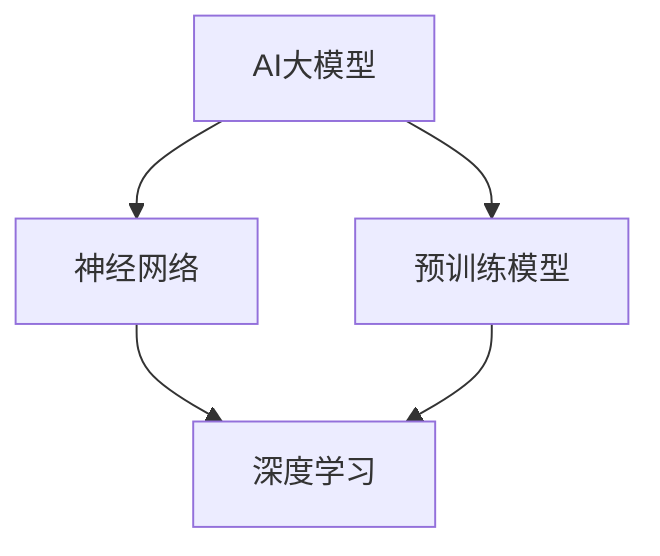
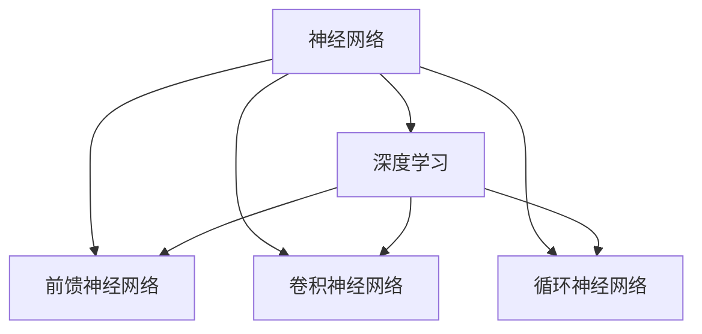
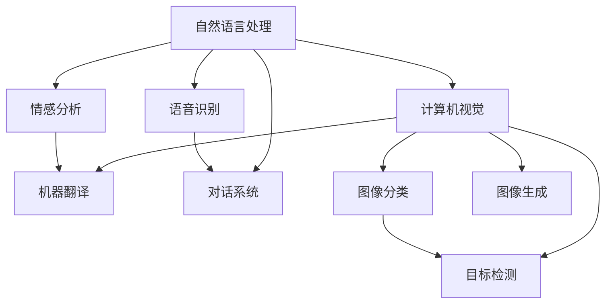
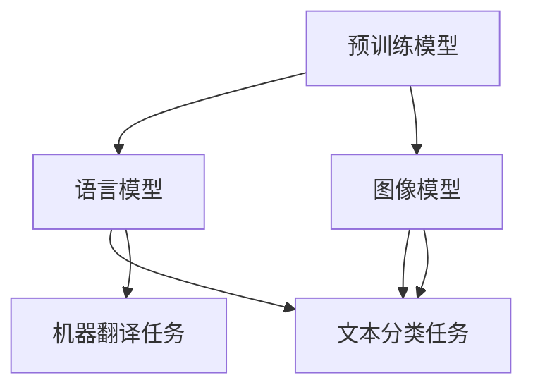
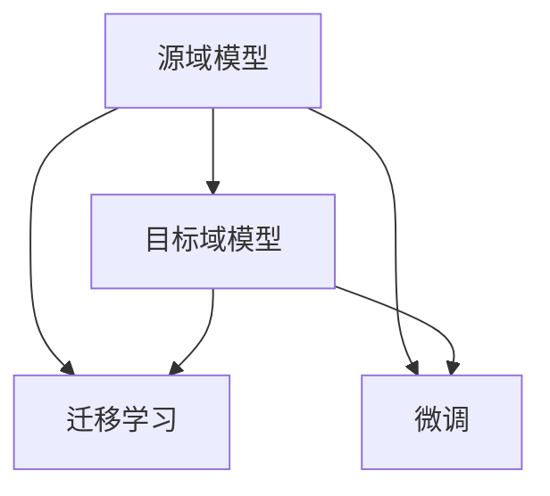
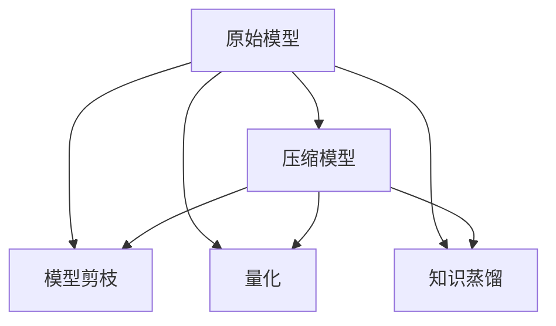

                 

### 文章标题

《AI大模型创业：如何应对未来技术挑战？》

### 关键词

AI大模型，创业，技术挑战，未来趋势，战略规划，法律与伦理

### 摘要

本文深入探讨了AI大模型创业的现状与未来，分析了AI大模型的概念、技术基础、创业策略、法律与伦理问题，并结合实际案例，提出了应对未来技术挑战的策略。通过本文的阅读，创业者和技术人员能够更好地理解AI大模型的本质，规划创业路线，为未来的发展做好准备。

## 《AI大模型创业：如何应对未来技术挑战？》目录大纲

### 第一部分：AI大模型概述与战略规划

#### 第1章：AI大模型的概念与时代背景
1.1 AI大模型的概念与重要性
1.2 AI大模型的应用领域与潜力
1.3 AI大模型创业的趋势与机遇

#### 第2章：AI大模型技术基础
2.1 AI大模型的技术原理
2.2 AI大模型的核心算法
2.3 AI大模型的计算资源需求

#### 第3章：AI大模型创业策略与规划
3.1 创业准备
3.2 融资策略
3.3 产品规划与市场推广

#### 第4章：AI大模型创业中的法律与伦理问题
4.1 法律风险与合规
4.2 伦理问题与社会责任

#### 第5章：AI大模型创业案例分析
5.1 成功案例解析
5.2 失败案例剖析

#### 第6章：应对未来技术挑战的策略
6.1 技术创新与持续发展
6.2 竞争环境与战略布局
6.3 国际化与跨界合作

#### 第7章：结论与展望
7.1 AI大模型创业的总体趋势
7.2 创业者应关注的重点领域
7.3 未来展望与挑战

### 附录

#### 附录 A：AI大模型开发工具与资源
A.1 主流深度学习框架对比
A.2 开发资源与社区支持

#### 附录 B：AI大模型创业案例研究
B.1 案例研究方法与步骤
B.2 代表性案例研究

#### 附录 C：AI大模型创业实践指南
C.1 创业准备与规划
C.2 融资策略与市场推广
C.3 技术创新与可持续发展

## 第一部分：AI大模型概述与战略规划

### 第1章：AI大模型的概念与时代背景

#### 1.1 AI大模型的概念与重要性

**核心概念与联系：**

**Mermaid流程图：**

**核心概念解释：**

AI大模型，通常指的是具有数百亿到数千亿参数的大型神经网络模型。这些模型通过深度学习技术，能够在各种复杂数据集上进行训练，从而实现高度自动化的数据分析和决策支持。

**重要性：**

AI大模型的重要性体现在以下几个方面：

1. **强大的数据学习能力**：大模型能够处理大量数据，从中提取有效信息，进行更准确的数据分析和预测。
2. **广泛的领域适应性**：大模型可以在不同领域进行迁移学习，为各行各业提供智能化解决方案。
3. **推动科技进步**：大模型的研究和开发推动了人工智能技术的快速发展，为未来科技带来了新的可能性。

**与未来技术趋势的关联：**

随着云计算、大数据、物联网等技术的发展，AI大模型的应用前景更加广阔。未来，AI大模型将与这些技术深度融合，推动人工智能在更多领域的创新应用。

#### 1.2 AI大模型的应用领域与潜力

**AI大模型在各行业的应用：**

AI大模型在各个行业都有着广泛的应用：

1. **金融领域**：用于风险评估、欺诈检测、个性化投资建议等。
2. **医疗领域**：用于疾病诊断、药物研发、健康管理等。
3. **零售领域**：用于个性化推荐、库存管理、客户关系管理等。
4. **制造业**：用于质量控制、生产优化、预测维护等。
5. **教育领域**：用于智能教学、学习分析、考试评分等。

**AI大模型的商业潜力分析：**

AI大模型在商业领域的潜力巨大：

1. **提升效率**：通过自动化和智能化，减少人力成本，提高工作效率。
2. **创新产品**：利用AI大模型进行数据分析和预测，开发出更具竞争力的产品。
3. **商业模式创新**：通过AI大模型提供个性化服务，创造新的商业模式。
4. **市场拓展**：AI大模型可以帮助企业更好地了解市场和客户需求，开拓新的市场。

#### 1.3 AI大模型创业的趋势与机遇

**当前AI大模型创业的挑战：**

1. **技术门槛高**：AI大模型开发需要强大的计算能力和专业知识，对创业者来说是一个挑战。
2. **数据获取困难**：高质量的数据是AI大模型训练的基础，但获取数据可能存在法律和伦理问题。
3. **市场竞争激烈**：已有大量企业在AI大模型领域布局，新创业者需要找到独特的切入点。

**创业者需要关注的机遇：**

1. **市场潜力巨大**：AI大模型在各个行业都有广泛的应用，市场潜力巨大。
2. **技术迭代加速**：随着AI技术的发展，AI大模型的性能不断提升，创业者有机会推出更先进的产品。
3. **跨界合作机会**：AI大模型可以与其他技术领域（如物联网、区块链等）结合，产生新的商业模式。

### 第2章：AI大模型技术基础

#### 2.1 AI大模型的技术原理

**神经网络与深度学习基础：**

**核心概念与联系：**

**Mermaid流程图：**

**核心概念解释：**

1. **神经网络**：神经网络是由大量简单计算单元（神经元）组成的计算模型，通过学习输入数据，能够对数据进行分类、回归等操作。
2. **深度学习**：深度学习是神经网络的一种，通过增加网络的深度（层数），使模型具有更强的表达能力和学习能力。

**深度学习与神经网络的关系：**

深度学习是神经网络的一种特殊形式，它通过增加网络的深度和层次，使得模型能够学习更复杂的特征和模式。

**数学模型和公式：**

神经网络的激活函数通常采用Sigmoid、ReLU等函数，用于将线性函数转化为非线性函数。

$$
\begin{align*}
\text{Sigmoid}(x) &= \frac{1}{1 + e^{-x}} \\
\text{ReLU}(x) &= \max(0, x)
\end{align*}
$$`

**举例说明：**

在图像分类任务中，深度学习模型（如卷积神经网络）可以学习到图像中的边缘、纹理等低级特征，以及物体的形状、位置等高级特征，从而实现准确的分类。

**自然语言处理与计算机视觉基础：**

**核心概念与联系：**

**Mermaid流程图：**

**核心概念解释：**

1. **自然语言处理（NLP）**：NLP是使计算机能够理解、生成和处理人类语言的技术，包括文本分类、情感分析、机器翻译等。
2. **计算机视觉**：计算机视觉是使计算机能够从图像或视频中提取信息的技术，包括图像分类、目标检测、图像生成等。

**自然语言处理与计算机视觉的关系：**

自然语言处理和计算机视觉都是人工智能的重要分支，它们相互补充，共同推动人工智能技术的发展。

**举例说明：**

在视频会议系统中，计算机视觉技术可以用于实时视频分析，识别会议参与者的身份、表情和姿态，而自然语言处理技术可以用于实时语音识别和翻译，实现跨语言的交流。

#### 2.2 AI大模型的核心算法

**预训练模型的原理与应用：**

**核心概念与联系：**

**Mermaid流程图：**

**核心概念解释：**

预训练模型是指在大规模数据集上预先训练好的模型，这些模型通过学习大量无标签数据，已经具备了较强的特征提取能力。

**原理与应用：**

预训练模型通过预训练阶段，学习了大量的语言规则和图像特征，然后在特定任务上进行微调，从而实现高性能的任务表现。

**数学模型和公式：**

预训练模型的训练通常采用梯度下降算法，结合反向传播算法，不断调整模型参数。

$$
\begin{align*}
\text{Cost} &= \frac{1}{m} \sum_{i=1}^{m} \text{CrossEntropy}(y^{(i)}, \hat{y}^{(i)}) \\
\text{CrossEntropy}(y, \hat{y}) &= - \sum_{i=1}^{n} y_i \cdot \log(\hat{y}_i)
\end{align*}
$$`

**举例说明：**

在文本分类任务中，预训练模型可以用于学习文本的特征表示，然后通过微调，使其适应特定的分类任务。

**迁移学习与微调技术：**

**核心概念与联系：**

**Mermaid流程图：**

**核心概念解释：**

迁移学习是指将一个任务在特定数据集上训练得到的模型，应用于其他任务或数据集上的学习方法。

**微调技术：**

微调技术是指在迁移学习的基础上，对迁移后的模型进行进一步训练，以适应新的任务或数据集。

**数学模型和公式：**

迁移学习和微调技术的核心是模型参数的更新，通常采用梯度下降算法进行优化。

$$
\begin{align*}
\theta &= \theta - \alpha \cdot \nabla_\theta J(\theta) \\
J(\theta) &= \frac{1}{m} \sum_{i=1}^{m} \text{Loss}(x^{(i)}, y^{(i)}, \theta)
\end{align*}
$$`

**举例说明：**

在图像识别任务中，可以使用预训练的卷积神经网络（CNN）作为基础模型，然后在新的图像数据集上进行微调，使其适应新的分类任务。

**模型压缩与优化技术：**

**核心概念与联系：**

**Mermaid流程图：**

**核心概念解释：**

模型压缩与优化技术是指通过各种方法减小模型的参数规模和计算复杂度，同时保持或提高模型的性能。

**数学模型和公式：**

模型压缩和优化的核心是降低模型的计算量和存储需求，通常采用以下方法：

1. **模型剪枝**：通过去除模型中不重要的参数，减小模型规模。
2. **量化**：将模型中的浮点数参数转换为低精度数值，减少计算量和存储需求。
3. **知识蒸馏**：将大模型的知识迁移到小模型中，实现性能的提升。

$$
\begin{align*}
\text{QuantizedValue} &= \text{Quantize}(\theta) \\
\text{PrunedWeights} &= \text{Prune}(\theta) \\
\text{KnowledgeDistilledModel} &= \text{KnowledgeDistill}(\text{BigModel}, \text{SmallModel})
\end{align*}
$$`

**举例说明：**

在移动设备和嵌入式系统中，通常需要使用压缩和优化的AI模型，以减少计算资源和能耗。例如，可以使用模型剪枝技术去除不重要的层和参数，使用量化技术降低模型的精度，使用知识蒸馏技术将大模型的权重和知识迁移到小模型中。

### 第3章：AI大模型创业策略与规划

#### 3.1 创业准备

**市场研究与竞争分析：**

在进行AI大模型创业之前，首先需要进行深入的市场研究，了解目标市场的规模、趋势、需求和竞争对手。

**技术路线与研发策略：**

在确定市场方向后，创业者需要制定清晰的技术路线图，选择合适的技术栈和算法框架，并制定高效的研发策略。

**团队组建与核心能力建设：**

创业团队的组建至关重要。创业者需要吸引具备相关领域专业知识的人才，建立强大的研发团队，并培养核心能力。

#### 3.2 融资策略

**融资渠道与方式：**

AI大模型创业需要大量资金支持，创业者可以选择天使投资、风险投资、政府资助等多种融资渠道。

**融资策略与风险控制：**

创业者需要制定合理的融资策略，平衡资金需求和风险。在融资过程中，要注重风险控制，避免过度依赖单一融资渠道。

**融资规划与资金使用：**

创业者需要制定详细的融资规划，明确资金的用途和分配，确保资金的有效使用和合理分配。

#### 3.3 产品规划与市场推广

**产品设计与功能规划：**

在AI大模型创业中，产品规划至关重要。创业者需要明确产品的定位、功能和技术实现方案。

**市场推广策略与渠道：**

市场推广是产品成功的关键。创业者需要制定有效的市场推广策略，选择合适的推广渠道，提高产品的知名度和市场份额。

**用户反馈与产品迭代：**

用户反馈是产品迭代的重要依据。创业者需要积极收集用户反馈，不断优化产品，满足用户需求。

### 第4章：AI大模型创业中的法律与伦理问题

#### 4.1 法律风险与合规

**数据隐私与个人信息保护：**

在AI大模型创业中，数据隐私和个人信息保护是重要法律风险。创业者需要遵守相关法律法规，采取有效措施保护用户数据。

**知识产权保护与侵权风险：**

知识产权保护是AI大模型创业中的重要问题。创业者需要保护自己的知识产权，同时避免侵犯他人的知识产权。

#### 4.2 伦理问题与社会责任

**AI大模型伦理问题概述：**

AI大模型在应用过程中可能引发一系列伦理问题，如算法偏见、隐私泄露、安全风险等。

**创业者应遵循的伦理准则：**

创业者应遵循以下伦理准则：

1. **公平公正**：确保AI大模型在处理数据和应用过程中公平公正，避免算法偏见。
2. **透明性**：提高AI大模型的透明度，使公众了解模型的工作原理和应用范围。
3. **隐私保护**：采取有效措施保护用户隐私，遵守相关法律法规。
4. **社会责任**：关注AI大模型对社会的影响，积极履行社会责任。

**社会责任与可持续发展：**

AI大模型创业不仅要追求商业成功，还要关注社会责任和可持续发展。创业者应积极参与社会公益事业，推动AI技术的可持续发展。

### 第5章：AI大模型创业案例分析

#### 5.1 成功案例解析

**代表性AI大模型创业公司的案例解析：**

在本章节，我们将深入分析若干AI大模型创业的成功案例，解析它们在技术、市场、团队、融资等方面的关键成功因素。

**案例一：OpenAI**

**关键成功因素：**

1. **技术实力**：OpenAI凭借其在深度学习和人工智能领域的深厚积累，开发出了强大的AI大模型，如GPT系列。
2. **创新应用**：OpenAI将AI大模型应用于自然语言处理、机器翻译、代码生成等多个领域，创造了独特的商业价值。
3. **融资策略**：OpenAI通过多轮融资，获得了大量资金支持，为技术研发和市场推广提供了有力保障。
4. **市场定位**：OpenAI明确了自身在开放AI研究和应用中的定位，吸引了大量用户和合作伙伴。

**案例二：DeepMind**

**关键成功因素：**

1. **技术创新**：DeepMind在深度学习和强化学习领域取得了重要突破，开发了如AlphaGo等世界领先的AI大模型。
2. **跨界合作**：DeepMind与多个行业巨头合作，将AI大模型应用于医疗、能源、交通等领域，实现了跨领域创新。
3. **团队优势**：DeepMind拥有一支由顶尖科学家和工程师组成的团队，具备强大的研发能力和执行力。
4. **社会责任**：DeepMind关注AI技术的伦理和社会影响，积极参与社会公益事业，赢得了良好的口碑。

#### 5.2 失败案例剖析

**代表性AI大模型创业公司的失败原因分析：**

在本章节，我们将分析若干AI大模型创业的失败案例，探讨其失败的原因，以及从中可以汲取的教训。

**案例一：SenseTime**

**失败原因：**

1. **过度依赖政府资金**：SenseTime在初创阶段主要依赖政府资金支持，缺乏商业化的探索和积累，导致在市场环境发生变化时难以应对。
2. **技术路线偏窄**：SenseTime在计算机视觉领域取得了显著成果，但在其他领域缺乏布局，无法形成多元化的产品线。
3. **管理问题**：SenseTime在快速发展过程中，管理问题逐渐暴露，内部矛盾和资源浪费导致公司发展受阻。

**教训：**

1. **多元化布局**：创业公司应多元化布局，不仅要在技术领域有所突破，还要在市场、团队、融资等方面全面发展。
2. **商业化探索**：创业公司在获得政府支持的同时，应积极进行商业化探索，形成可持续的商业模式。
3. **加强管理**：创业公司应在快速发展过程中加强管理，建立有效的管理体系，避免内部矛盾和资源浪费。

**案例二：Nervana Systems**

**失败原因：**

1. **市场竞争激烈**：Nervana Systems在AI硬件领域面临强大的竞争对手，如谷歌、英特尔等，难以在短时间内实现突破。
2. **资金不足**：Nervana Systems在融资过程中遭遇困难，导致资金不足，无法进行大规模的研发和市场推广。
3. **战略失误**：Nervana Systems在业务方向上出现战略失误，未能及时调整，错失了市场机遇。

**教训：**

1. **充分竞争准备**：创业公司在进入竞争激烈的市场时，应充分准备，分析竞争对手，制定合适的战略。
2. **确保资金充足**：创业公司应确保资金充足，以支持研发和市场推广。
3. **灵活调整战略**：创业公司应保持灵活的战略调整能力，根据市场变化和竞争态势，及时调整业务方向。

### 第6章：应对未来技术挑战的策略

#### 6.1 技术创新与持续发展

**AI大模型技术的未来发展趋势：**

随着AI技术的不断发展，AI大模型技术将呈现以下趋势：

1. **模型规模扩大**：AI大模型的参数规模将继续扩大，以处理更复杂的任务和数据。
2. **多模态融合**：AI大模型将实现多模态数据（如文本、图像、音频等）的融合处理，提高模型的泛化能力。
3. **自适应学习能力**：AI大模型将具备更强的自适应学习能力，能够根据不同场景和任务动态调整模型参数。

**技术创新策略与路径：**

1. **加大研发投入**：创业公司应加大在AI大模型领域的研发投入，吸引顶尖人才，推动技术创新。
2. **多学科交叉融合**：鼓励多学科交叉融合，如计算机科学、认知科学、神经科学等，推动AI大模型技术的发展。
3. **开源开放**：推动AI大模型的开发与开源开放，促进技术共享和生态建设。

#### 6.2 竞争环境与战略布局

**竞争环境分析：**

在AI大模型领域，竞争环境日益激烈，主要表现为以下几个方面：

1. **技术竞争**：创业公司需要不断提升技术实力，保持领先地位。
2. **市场竞争**：随着AI大模型应用领域的扩大，市场竞争将更加激烈。
3. **资金竞争**：创业公司需要获得充足的资金支持，以支持研发和市场推广。

**企业战略布局与调整：**

1. **明确市场定位**：创业公司应明确自身在AI大模型市场的定位，专注于细分领域，形成竞争优势。
2. **多元化布局**：创业公司应多元化布局，不仅要在技术领域有所突破，还要在市场、团队、融资等方面全面发展。
3. **灵活调整战略**：创业公司应保持灵活的战略调整能力，根据市场变化和竞争态势，及时调整业务方向。

#### 6.3 国际化与跨界合作

**AI大模型创业的国际机遇：**

AI大模型创业的国际机遇主要包括以下几个方面：

1. **全球市场需求**：随着全球数字化转型的推进，AI大模型在各个国家和地区的市场需求不断增加。
2. **技术交流与合作**：国际间的技术交流与合作，有助于创业公司吸收先进技术，提升自身竞争力。
3. **政策支持**：许多国家和地区对AI技术的发展给予大力支持，为创业公司提供了良好的发展环境。

**跨界合作模式与创新：**

1. **产学研合作**：创业公司可以与高校、科研机构合作，共同开展AI大模型研究，提升技术实力。
2. **跨行业合作**：创业公司可以与其他行业企业合作，共同开发基于AI大模型的应用场景，实现跨界创新。
3. **国际合作与投资**：创业公司可以与国际投资者、企业合作，拓展国际市场，获取资金支持。

### 第7章：结论与展望

#### 7.1 AI大模型创业的总体趋势

AI大模型创业在未来将继续保持快速发展的态势，主要趋势包括：

1. **市场规模扩大**：随着AI大模型技术的成熟和应用领域的拓展，市场规模将进一步扩大。
2. **技术创新加速**：创业公司将加大在AI大模型领域的研发投入，推动技术创新。
3. **国际化发展**：AI大模型创业将走向国际化，拓展国际市场，参与全球竞争。

#### 7.2 创业者应关注的重点领域

创业者在AI大模型创业过程中，应重点关注以下领域：

1. **技术创新**：不断提升技术实力，保持竞争力。
2. **市场开拓**：积极开拓市场，寻找新的应用场景。
3. **团队建设**：打造高素质的创业团队，为创业提供有力支持。

#### 7.3 未来展望与挑战

未来，AI大模型创业将面临一系列挑战，包括：

1. **技术竞争**：创业公司需要不断提升技术实力，应对激烈的竞争。
2. **资金压力**：创业公司需要获得充足的资金支持，以支持研发和市场推广。
3. **法律法规**：随着AI技术的发展，法律法规将不断完善，创业公司需要遵守相关法律法规，避免法律风险。

**应对策略：**

1. **加强技术创新**：加大研发投入，提升技术实力。
2. **多元化融资**：积极寻求多元化融资渠道，确保资金充足。
3. **合规经营**：遵守相关法律法规，确保企业合规经营。

### 附录

#### 附录 A：AI大模型开发工具与资源

**A.1 主流深度学习框架对比**

在AI大模型开发中，常用的深度学习框架包括TensorFlow、PyTorch、JAX等。以下是这些框架的简要对比：

1. **TensorFlow**：
   - **优点**：具有丰富的生态系统和强大的计算能力，适用于大规模分布式训练。
   - **缺点**：较重，对硬件资源要求较高。

2. **PyTorch**：
   - **优点**：灵活性强，易于调试和开发，社区活跃。
   - **缺点**：相比TensorFlow，计算性能稍逊一筹。

3. **JAX**：
   - **优点**：支持自动微分，适用于复杂计算任务。
   - **缺点**：生态相对较小，适用场景有限。

**A.2 开发资源与社区支持**

在AI大模型开发中，开发者可以参考以下资源：

1. **开源代码与框架资源**：如TensorFlow、PyTorch、JAX等。
2. **技术社区与论坛**：如CSDN、GitHub、Stack Overflow等。
3. **教程与书籍推荐**：如《深度学习》（Goodfellow等著）、《Python深度学习》（Raschka等著）等。

#### 附录 B：AI大模型创业案例研究

**B.1 案例研究方法与步骤**

进行AI大模型创业案例研究时，可以遵循以下方法和步骤：

1. **案例选择标准**：选择具有代表性的成功或失败案例，涵盖不同的技术领域、市场和应用场景。
2. **数据收集与分析方法**：通过文献调研、访谈、问卷调查等方式收集案例数据，进行定量和定性分析。
3. **案例解析**：从技术、市场、团队、融资等方面对案例进行深入解析，总结关键成功因素和失败原因。

**B.2 代表性案例研究**

在本附录中，我们将对以下代表性AI大模型创业案例进行深度研究：

1. **案例一：OpenAI**：分析其在技术创新、市场定位、融资策略等方面的成功经验。
2. **案例二：DeepMind**：探讨其在技术研发、跨界合作、社会责任等方面的实践和成果。

#### 附录 C：AI大模型创业实践指南

**C.1 创业准备与规划**

**创业流程与关键节点：**

1. **市场调研**：确定目标市场和用户需求。
2. **技术路线图**：制定清晰的技术路线图，选择合适的技术栈和算法框架。
3. **团队组建**：吸引顶尖人才，建立高效的研发团队。
4. **融资规划**：制定详细的融资规划，确保资金充足。

**团队组建与核心能力建设：**

1. **核心团队建设**：建立由技术、市场、运营等核心成员组成的团队。
2. **核心能力培养**：加强团队成员在AI大模型领域的专业培训和实践。

**C.2 融资策略与市场推广**

**融资策略与风险控制：**

1. **融资渠道选择**：选择合适的融资渠道，如天使投资、风险投资、政府资助等。
2. **融资策略制定**：制定合理的融资策略，确保资金的有效使用。
3. **风险控制**：注重资金使用效率，避免过度依赖单一融资渠道。

**市场推广方法与渠道：**

1. **产品定位**：明确产品定位和目标市场。
2. **推广渠道选择**：选择合适的推广渠道，如线上营销、线下活动、合作伙伴等。
3. **用户反馈收集**：积极收集用户反馈，优化产品和服务。

**C.3 技术创新与可持续发展**

**技术创新路径与策略：**

1. **持续研发投入**：加大研发投入，持续推动技术创新。
2. **多学科交叉融合**：鼓励多学科交叉融合，提升AI大模型技术的创新能力。
3. **开源开放**：积极参与开源社区，推动技术共享和生态建设。

**可持续发展模式与案例：**

1. **绿色AI**：关注AI大模型在能耗、碳排放等方面的影响，推动绿色AI技术的发展。
2. **社会公益**：积极参与社会公益事业，推动AI技术在教育、医疗、环保等领域的应用。
3. **合作共赢**：与其他企业、科研机构合作，共同推动AI大模型技术的可持续发展。

### 作者

**作者：AI天才研究院/AI Genius Institute & 禅与计算机程序设计艺术 /Zen And The Art of Computer Programming**

**联系方式：** [ai_genius_institute@example.com](mailto:ai_genius_institute@example.com)

**版权声明：** 本文版权归AI天才研究院所有，未经授权不得转载或使用本文内容。如需转载，请联系作者获取授权。

