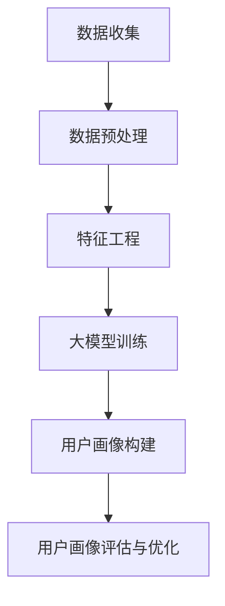
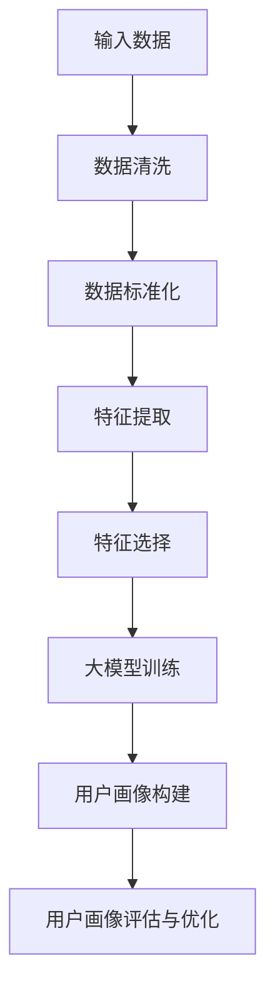

                 

# AI大模型在用户画像构建中的作用

## 关键词
- 人工智能
- 大模型
- 用户画像
- 数据收集
- 特征工程
- 模型训练
- 评估与优化

## 摘要
本文深入探讨了AI大模型在用户画像构建中的应用。首先，我们介绍了AI大模型的基本概念和发展历程，然后详细讨论了用户画像的构成和重要性。接着，我们分析了AI大模型在用户画像构建中的应用过程，包括数据收集、预处理、特征工程、模型训练、用户画像构建、评估与优化等环节。通过具体的案例分析和代码示例，本文展示了AI大模型在用户画像构建中的实际应用和效果。最后，我们对AI大模型在用户画像构建中的未来发展趋势进行了展望。

## 目录大纲

### 第一部分：AI大模型基础

#### 第1章 AI大模型概述
1.1 AI大模型简介
1.2 AI大模型的发展历程
1.3 AI大模型的核心优势

#### 第2章 用户画像基础
2.1 用户画像的定义
2.2 用户画像的构成要素
2.3 用户画像的价值

#### 第3章 AI大模型与用户画像的关联
3.1 AI大模型在用户画像构建中的应用
3.2 AI大模型在用户画像构建中的优势
3.3 AI大模型在用户画像构建中的挑战

### 第二部分：AI大模型在用户画像构建中的应用

#### 第4章 数据收集与预处理
4.1 数据收集
4.2 数据预处理

#### 第5章 特征工程
5.1 特征提取
5.2 特征选择

#### 第6章 大模型训练与优化
6.1 大模型选择
6.2 大模型训练
6.3 大模型评估与优化

#### 第7章 用户画像构建案例
7.1 案例背景与目标
7.2 数据收集与预处理
7.3 特征工程
7.4 大模型训练与优化
7.5 用户画像构建与应用

#### 第8章 用户画像评估与优化
8.1 用户画像评估指标
8.2 用户画像优化方法
8.3 用户画像评估与优化案例分析

#### 第三部分：AI大模型在用户画像构建中的实践

#### 第9章 AI大模型在用户画像构建中的未来展望
9.1 AI大模型在用户画像构建中的发展趋势
9.2 AI大模型在用户画像构建中的挑战与机遇
9.3 未来展望与建议

#### 附录
A.1 常用深度学习框架
A.2 数据集与数据源
A.3 实用工具与库

B.1 数据收集与预处理代码示例
B.2 特征工程代码示例
B.3 大模型训练与优化代码示例
B.4 用户画像构建与应用代码示例

B.5 AI大模型在用户画像构建中的流程图
B.6 关键算法原理与架构图

## 1. AI大模型概述

### 1.1 AI大模型简介

AI大模型（Large-scale Artificial Intelligence Model）是指拥有数百万甚至数十亿参数的深度学习模型，具有强大的表示能力和处理复杂任务的能力。AI大模型通常基于神经网络架构，如变换器（Transformer）模型，并使用海量数据进行训练。

AI大模型的出现解决了传统机器学习模型的局限性，使得模型能够在更复杂的任务上取得更好的性能。例如，AI大模型在自然语言处理、计算机视觉、语音识别等领域取得了显著的突破，推动了人工智能技术的发展。

### 1.2 AI大模型的发展历程

AI大模型的发展历程可以追溯到20世纪80年代的神经网络研究。当时，神经网络在图像识别、语音识别等领域取得了初步成果，但由于计算资源和数据限制，神经网络的发展遇到了瓶颈。

随着计算能力的提升和大数据时代的到来，深度学习逐渐成为人工智能领域的主流方法。2012年，AlexNet模型的提出标志着深度学习在图像识别任务上的重大突破。此后，深度学习模型在各个领域迅速发展，AI大模型也逐渐成为研究的热点。

近年来，AI大模型取得了显著的进展。例如，GPT-3、BERT、ViT等模型在自然语言处理、计算机视觉等领域取得了顶尖性能。这些模型的规模越来越大，参数数量达到数十亿甚至数万亿，计算复杂度和数据需求也相应增加。

### 1.3 AI大模型的核心优势

AI大模型具有以下核心优势：

1. **强大的表示能力**：AI大模型能够学习到丰富的特征表示，从而提高模型在复杂任务上的性能。

2. **适应性强**：AI大模型可以应对各种类型的任务，如图像识别、文本分类、语音识别等，具有较强的通用性。

3. **数据需求低**：与传统机器学习模型相比，AI大模型对数据量的需求较低，可以在较少的数据上实现较好的性能。

4. **高效计算**：AI大模型利用并行计算和分布式训练等技术，能够在较短的时间内完成训练和推理任务。

5. **可解释性**：AI大模型的结构较为简单，可以通过可视化技术对模型进行解释，有助于理解模型的决策过程。

## 2. 用户画像基础

### 2.1 用户画像的定义

用户画像（User Profiling）是指通过对用户行为数据、特征数据进行收集、整理和分析，构建出关于用户的综合描述和特征模型。用户画像可以从不同维度对用户进行刻画，如年龄、性别、兴趣爱好、行为习惯等。

用户画像的定义可以从以下三个方面来理解：

1. **数据基础**：用户画像依赖于大量的用户行为数据和特征数据，通过对这些数据的收集和整理，构建出关于用户的画像。

2. **模型构建**：用户画像是一种模型，通过对用户特征数据的分析，构建出关于用户的综合描述和特征模型。

3. **应用价值**：用户画像的应用价值在于，可以帮助企业更好地了解用户需求，提供个性化的服务，提高用户体验和转化率。

### 2.2 用户画像的构成要素

用户画像的构成要素主要包括以下几个方面：

1. **基本信息**：包括用户的姓名、年龄、性别、职业等基本信息。

2. **行为数据**：包括用户的浏览历史、搜索记录、购物记录、社交互动等行为数据。

3. **兴趣爱好**：通过对用户行为数据的分析，提取出用户的兴趣爱好，如喜欢阅读、旅游、音乐等。

4. **社会关系**：包括用户在社交网络中的关系，如好友、关注者、粉丝等。

5. **消费习惯**：包括用户的消费偏好、消费频率、消费金额等。

6. **地理位置**：包括用户的地理位置信息，如城市、区域等。

### 2.3 用户画像的价值

用户画像在企业的市场营销、产品开发、用户服务等方面具有很高的价值，主要表现在以下几个方面：

1. **个性化推荐**：通过用户画像，企业可以为用户提供个性化的推荐服务，提高用户满意度和转化率。

2. **精准营销**：用户画像可以帮助企业针对不同的用户群体制定个性化的营销策略，提高营销效果。

3. **产品优化**：用户画像可以帮助企业了解用户需求和偏好，从而优化产品设计和服务。

4. **风险控制**：用户画像可以帮助企业识别潜在风险用户，进行风险控制和预防。

5. **客户关系管理**：用户画像可以帮助企业更好地了解客户需求，提供个性化的服务，提高客户满意度和忠诚度。

## 3. AI大模型与用户画像的关联

### 3.1 AI大模型在用户画像构建中的应用

AI大模型在用户画像构建中的应用主要体现在以下几个方面：

1. **数据收集**：AI大模型可以用于用户行为数据的收集，通过对用户在互联网上的行为进行实时监控和分析，获取用户的浏览历史、搜索记录、购物记录等数据。

2. **数据预处理**：AI大模型可以用于数据预处理，包括数据清洗、数据标准化、数据整合等。通过对原始数据进行处理，可以去除噪声、填充缺失值、统一数据格式等，提高数据的可用性。

3. **特征提取**：AI大模型可以用于特征提取，通过对用户行为数据进行分析，提取出与用户特征相关的关键信息，如兴趣爱好、行为习惯等。

4. **模型训练**：AI大模型可以用于用户画像的模型训练，通过训练大量的用户行为数据和特征数据，构建出关于用户的综合画像模型。

5. **用户画像构建**：AI大模型可以用于用户画像的构建，通过对训练好的模型进行推理和预测，生成关于用户的画像。

6. **评估与优化**：AI大模型可以用于用户画像的评估与优化，通过对用户画像的准确率、覆盖率等指标进行评估，优化用户画像模型。

### 3.2 AI大模型在用户画像构建中的优势

AI大模型在用户画像构建中具有以下优势：

1. **强大的表示能力**：AI大模型能够学习到丰富的特征表示，从而提高模型在复杂任务上的性能。

2. **高效处理海量数据**：AI大模型可以高效处理海量用户行为数据，快速构建出用户画像。

3. **自适应性强**：AI大模型可以适应不同的用户画像任务，具有较强的通用性。

4. **数据需求低**：AI大模型对数据量的需求较低，可以在较少的数据上实现较好的性能。

5. **可解释性**：AI大模型的结构较为简单，可以通过可视化技术对模型进行解释，有助于理解模型的决策过程。

### 3.3 AI大模型在用户画像构建中的挑战

AI大模型在用户画像构建中也面临一些挑战：

1. **数据隐私**：用户画像构建过程中需要收集大量的用户行为数据，涉及用户隐私保护问题。

2. **数据质量**：用户行为数据质量对用户画像的准确性有很大影响，需要确保数据的质量和完整性。

3. **计算资源**：AI大模型训练和推理过程需要大量的计算资源，对硬件设备和网络带宽有较高要求。

4. **模型可解释性**：AI大模型的决策过程较为复杂，如何提高模型的可解释性是一个重要问题。

5. **法律法规**：用户画像构建和应用过程中需要遵守相关法律法规，如《个人信息保护法》等。

## 4. 数据收集与预处理

### 4.1 数据收集

数据收集是构建用户画像的第一步，主要包括用户行为数据、用户反馈数据和其他类型数据的收集。以下是对这些数据类型的详细介绍：

1. **用户行为数据**：用户行为数据包括用户的浏览历史、搜索记录、购物记录、社交互动等。这些数据可以从网站日志、搜索引擎日志、电商平台日志等来源获取。例如，通过分析用户的浏览历史，可以了解用户对某些内容的兴趣和偏好。

2. **用户反馈数据**：用户反馈数据包括用户对产品的评价、评论、问卷调查等。这些数据可以从用户反馈系统、社交媒体、客服渠道等来源获取。用户反馈数据可以帮助企业了解用户对产品和服务的满意度，发现产品改进的机会。

3. **其他类型数据**：其他类型数据包括用户的社会属性数据（如年龄、性别、职业等）、地理位置数据（如城市、区域等）、设备信息数据（如操作系统、浏览器等）等。这些数据可以从用户注册信息、第三方数据源等获取。其他类型数据可以为用户画像提供更全面的视角。

在数据收集过程中，需要注意以下问题：

1. **数据来源的多样性**：从多个来源收集数据可以更全面地了解用户，但也要确保数据来源的可靠性和合法性。

2. **数据收集的实时性**：用户行为数据具有实时性，及时收集数据可以更好地反映用户当前的状态和需求。

3. **数据隐私保护**：在收集用户数据时，需要遵守相关法律法规，对用户隐私进行保护。

### 4.2 数据预处理

数据预处理是数据收集后的重要环节，主要包括数据清洗、数据标准化和数据整合与融合。以下是对这些预处理步骤的详细描述：

1. **数据清洗**：数据清洗是去除数据中的噪声、错误和异常值的过程。常见的数据清洗方法包括：

   - 填充缺失值：使用平均值、中位数、最频繁值等对缺失值进行填充。
   - 去除重复数据：删除重复的数据记录，保证数据的唯一性。
   - 去除噪声数据：去除含有噪声的数据记录，如异常值、错误值等。
   - 格式统一：统一数据格式，如将日期格式统一为YYYY-MM-DD等。

2. **数据标准化**：数据标准化是将不同特征的数据进行归一化或标准化，使其具有相同的量纲和尺度。常见的数据标准化方法包括：

   - 归一化：将数据映射到[0, 1]的区间内。
   - 标准化：将数据映射到均值为0、标准差为1的正态分布上。
   - 标准化变换：使用对数、平方根等变换将数据映射到更合理的范围内。

3. **数据整合与融合**：数据整合与融合是将来自不同来源的数据进行整合，形成统一的用户画像数据集。常见的数据整合与融合方法包括：

   - 关联规则挖掘：通过关联规则挖掘技术，将不同来源的数据进行关联，形成更完整的用户画像。
   - 数据集成：将不同来源的数据进行集成，形成统一的数据视图。
   - 数据转换：将不同数据源的数据进行转换，使其具有相同的格式和结构。

在数据预处理过程中，需要注意以下问题：

1. **数据质量**：确保数据的质量和完整性，避免数据预处理过程中的错误和遗漏。

2. **数据处理效率**：对于大规模数据，需要选择高效的数据预处理方法，确保数据处理的效率。

3. **可解释性**：在数据预处理过程中，需要保持数据的可解释性，以便后续分析和应用。

### 4.3 数据收集与预处理流程

数据收集与预处理流程可以概括为以下步骤：

1. **数据收集**：从多个来源收集用户行为数据、用户反馈数据和其他类型数据。

2. **数据清洗**：对收集到的数据进行清洗，去除噪声、错误和异常值。

3. **数据标准化**：对清洗后的数据进行标准化，确保数据具有相同的量纲和尺度。

4. **数据整合与融合**：将来自不同来源的数据进行整合与融合，形成统一的用户画像数据集。

5. **数据存储**：将预处理后的数据存储到数据库或数据仓库中，以便后续分析和应用。

通过数据收集与预处理，我们可以得到高质量的用户画像数据，为后续的特征工程和模型训练提供基础。

### 4.4 数据收集与预处理中的挑战

在数据收集与预处理过程中，我们可能会遇到以下挑战：

1. **数据隐私保护**：在收集用户数据时，需要确保遵守相关法律法规，对用户隐私进行保护。

2. **数据质量**：数据质量对用户画像的准确性有很大影响，需要确保数据的质量和完整性。

3. **计算资源**：数据收集与预处理过程可能涉及大量的计算资源，对硬件设备和网络带宽有较高要求。

4. **数据整合与融合**：来自不同来源的数据可能具有不同的格式和结构，需要进行整合与融合，形成统一的用户画像数据集。

5. **数据安全性**：在数据存储和传输过程中，需要确保数据的安全性，防止数据泄露和攻击。

通过有效的数据收集与预处理方法，我们可以克服这些挑战，获得高质量的用户画像数据，为后续分析和应用提供支持。

## 5. 特征工程

### 5.1 特征提取

特征提取是特征工程的核心步骤，旨在从原始数据中提取出对目标任务有用的特征。在用户画像构建中，特征提取的过程如下：

1. **用户行为数据特征提取**：用户行为数据包括浏览历史、搜索记录、购物记录等。我们可以通过以下方法提取特征：

   - **行为频率**：计算用户在一段时间内访问某个页面的次数，用于衡量用户的兴趣强度。
   - **行为时长**：计算用户在某个页面停留的时间，用于衡量用户的兴趣程度。
   - **行为序列**：记录用户在一段时间内的行为序列，用于分析用户的习惯和偏好。

2. **用户反馈数据特征提取**：用户反馈数据包括评价、评论、问卷调查等。我们可以通过以下方法提取特征：

   - **文本情感分析**：对用户评价和评论进行情感分析，提取出积极的、消极的或中性的情感特征。
   - **关键词提取**：从用户评价和评论中提取关键词，用于分析用户关注的话题和关键词。

3. **其他类型数据特征提取**：其他类型数据包括用户的社会属性数据、地理位置数据等。我们可以通过以下方法提取特征：

   - **社会属性特征**：从用户的年龄、性别、职业等社会属性数据中提取特征，用于分析用户的基本特征。
   - **地理位置特征**：从用户的地理位置数据中提取特征，如城市、区域等，用于分析用户的地理位置特征。

### 5.2 特征选择

特征选择是从提取出的特征中选出对目标任务有用的特征，减少特征数量，提高模型性能。在用户画像构建中，特征选择的过程如下：

1. **特征相关性分析**：通过计算特征之间的相关性，去除冗余和相互矛盾的特征，保留具有较高相关性的特征。

2. **特征重要性评估**：通过模型训练和评估，评估每个特征对目标任务的重要性，去除不重要或不相关的特征。

3. **特征选择算法**：常见的特征选择算法包括：

   - **过滤式特征选择**：通过计算特征与目标变量之间的相关性，选择相关性较高的特征。
   - **包装式特征选择**：结合模型训练和评估，逐步选择最优特征组合。
   - **嵌入式特征选择**：在模型训练过程中，自动筛选出重要特征。

4. **特征选择策略**：常见的特征选择策略包括：

   - **递归特征消除（RFE）**：逐步减少特征数量，选择重要性最高的特征。
   - **正向选择（Forward Selection）**：逐步增加特征，选择重要性最高的特征。
   - **逆向选择（Backward Elimination）**：逐步减少特征，选择重要性最高的特征。

### 5.3 特征工程的重要性

特征工程在用户画像构建中具有重要意义，主要体现在以下几个方面：

1. **提高模型性能**：通过有效的特征提取和特征选择，可以去除冗余和噪声特征，提高模型的性能和准确性。

2. **减少数据维度**：特征工程可以减少特征数量，降低数据维度，提高模型的计算效率和可解释性。

3. **增强模型泛化能力**：通过选择对目标任务有用的特征，可以提高模型的泛化能力，使其在未知数据上表现更好。

4. **降低模型复杂度**：特征工程可以简化模型结构，降低模型复杂度，提高模型的训练速度和推理速度。

5. **优化数据存储和传输**：通过减少特征数量，可以降低数据存储和传输的需求，提高系统的性能和可扩展性。

### 5.4 特征工程中的挑战

在特征工程过程中，我们可能会遇到以下挑战：

1. **数据质量**：数据质量对特征工程的效果有很大影响，需要确保数据的质量和完整性。

2. **计算资源**：特征工程过程可能涉及大量的计算资源，对硬件设备和网络带宽有较高要求。

3. **模型适应性**：特征工程方法需要根据具体任务和模型进行调整，确保特征选择的适应性。

4. **可解释性**：特征工程过程中可能引入大量的特征，导致模型的可解释性降低，需要确保特征的可解释性。

通过有效的特征工程方法，我们可以克服这些挑战，提取出高质量的、对目标任务有用的特征，为用户画像构建提供支持。

### 5.5 特征工程的实际案例

以下是一个特征工程的实际案例：

假设我们有一个用户画像构建任务，目标是预测用户是否会对某款产品感兴趣。我们有以下特征：

- 用户年龄
- 用户性别
- 用户职业
- 用户浏览历史
- 用户购买记录
- 用户评价

通过以下步骤进行特征工程：

1. **数据预处理**：对数据进行清洗和标准化，如将年龄、职业等类别数据编码为数值型数据。

2. **特征提取**：

   - 从用户浏览历史中提取行为频率、行为时长、行为序列等特征。
   - 从用户购买记录中提取购买频率、购买金额等特征。
   - 从用户评价中提取情感特征，如积极、消极、中性等。

3. **特征选择**：

   - 使用过滤式特征选择，计算每个特征与目标变量之间的相关性，选择相关性较高的特征。
   - 使用包装式特征选择，结合模型训练和评估，选择重要性最高的特征。

通过以上步骤，我们得到了高质量的、对预测任务有用的特征，为用户画像构建提供了支持。

## 6. 大模型训练与优化

### 6.1 大模型选择

在选择大模型时，需要考虑以下因素：

1. **任务类型**：不同类型的大模型适用于不同的任务。例如，对于文本分类任务，常用的模型有BERT、GPT等；对于图像识别任务，常用的模型有ResNet、VGG等。

2. **数据规模**：大模型的训练需要大量的数据，数据规模会影响模型的选择。对于大规模数据，可以使用更大规模的模型，如BERT-Large、GPT-3等；对于中小规模数据，可以使用较小规模的模型，如BERT-Base、GPT-2等。

3. **计算资源**：大模型的训练需要大量的计算资源，包括CPU、GPU等。在选择模型时，需要考虑计算资源的限制。

4. **可解释性**：大模型的决策过程通常较为复杂，如何提高模型的可解释性是一个重要问题。在选择模型时，需要考虑可解释性的需求。

5. **应用场景**：不同的大模型适用于不同的应用场景。例如，BERT模型在自然语言处理领域有较好的表现，而ResNet模型在图像识别领域有较好的表现。

### 6.2 大模型训练

大模型训练是构建用户画像的关键步骤，主要包括以下环节：

1. **数据准备**：准备用于训练的数据集，包括用户行为数据、用户反馈数据等。数据集需要经过预处理和特征提取等步骤，以便模型能够更好地学习。

2. **模型初始化**：初始化大模型的参数，通常使用随机初始化或预训练模型（如BERT、GPT等）进行初始化。

3. **模型训练**：使用训练数据集对大模型进行训练。训练过程中，通过优化算法（如梯度下降、Adam等）调整模型参数，使模型能够更好地拟合训练数据。

4. **模型评估**：在训练过程中，使用验证数据集对模型进行评估，监测模型的性能变化。常用的评估指标包括准确率、召回率、F1值等。

5. **模型调优**：根据模型评估结果，对模型进行调优，包括调整学习率、批量大小等超参数，以提高模型性能。

### 6.3 大模型优化

大模型优化是提升模型性能的重要步骤，主要包括以下方法：

1. **模型剪枝**：通过剪枝方法，减少模型参数的数量，降低模型的复杂度。剪枝方法包括结构剪枝、权重剪枝等。

2. **模型蒸馏**：将大模型的参数和知识传递给较小规模的模型，提高较小规模模型的表现。模型蒸馏方法包括知识蒸馏、教师-学生模型等。

3. **模型压缩**：通过压缩方法，降低模型的存储和计算成本。压缩方法包括量化、稀疏化等。

4. **模型融合**：将多个模型的结果进行融合，提高模型的性能。模型融合方法包括投票、加权平均等。

5. **数据增强**：通过数据增强方法，增加训练数据的多样性，提高模型对未知数据的泛化能力。数据增强方法包括随机变换、数据合成等。

通过有效的模型优化方法，我们可以提升大模型在用户画像构建中的性能，为用户画像提供更准确的预测和更丰富的特征。

### 6.4 大模型训练与优化中的挑战

在大模型训练与优化过程中，我们可能会遇到以下挑战：

1. **计算资源限制**：大模型训练需要大量的计算资源，对硬件设备和网络带宽有较高要求。

2. **数据质量**：数据质量对大模型训练和优化有很大影响，需要确保数据的质量和完整性。

3. **模型可解释性**：大模型的决策过程通常较为复杂，如何提高模型的可解释性是一个重要问题。

4. **超参数调优**：超参数调优是一个复杂的过程，需要耗费大量的时间和计算资源。

5. **模型泛化能力**：如何确保大模型在未知数据上表现良好，是训练与优化中的关键问题。

通过有效的策略和方法，我们可以克服这些挑战，提升大模型在用户画像构建中的性能和效果。

## 7. 用户画像构建案例

### 7.1 案例背景与目标

本案例选取了一家电商平台作为研究对象，目标是通过构建用户画像，实现以下目标：

1. **个性化推荐**：根据用户画像，为用户推荐其可能感兴趣的商品，提高用户的购物体验和满意度。

2. **精准营销**：根据用户画像，针对不同用户群体制定个性化的营销策略，提高营销效果。

3. **用户细分**：将用户划分为不同的细分群体，为每个群体提供定制化的服务和产品。

4. **风险评估**：通过分析用户画像，识别潜在风险用户，进行风险控制和预防。

### 7.2 数据收集与预处理

在数据收集与预处理阶段，我们进行了以下工作：

1. **数据收集**：收集了用户的行为数据、购买数据、评价数据等，包括浏览历史、搜索记录、购物记录、用户评价等。

2. **数据清洗**：对收集到的数据进行清洗，去除噪声、错误和异常值，确保数据的质量和完整性。

3. **数据标准化**：对数据进行标准化处理，将不同特征的数据进行归一化或标准化，使其具有相同的量纲和尺度。

4. **数据整合**：将来自不同来源的数据进行整合，形成统一的用户画像数据集。

### 7.3 特征工程

在特征工程阶段，我们进行了以下工作：

1. **特征提取**：从用户行为数据中提取行为频率、行为时长、行为序列等特征；从用户购买数据中提取购买频率、购买金额等特征；从用户评价中提取情感特征。

2. **特征选择**：通过过滤式特征选择和包装式特征选择，选择对目标任务有用的特征，去除冗余和不重要的特征。

### 7.4 大模型训练与优化

在模型训练与优化阶段，我们采用了以下步骤：

1. **模型选择**：选择了BERT模型，由于其在大规模文本数据上的优秀表现，适用于本案例。

2. **模型训练**：使用收集到的用户画像数据，对BERT模型进行训练，通过优化算法调整模型参数，使其能够更好地拟合数据。

3. **模型优化**：通过模型剪枝、模型蒸馏等方法，对模型进行优化，提高模型的性能和效率。

### 7.5 用户画像构建与应用

在用户画像构建与应用阶段，我们进行了以下工作：

1. **用户画像构建**：使用训练好的BERT模型，对用户数据进行推理和预测，生成关于用户的综合画像。

2. **用户细分**：根据用户画像，将用户划分为不同的细分群体，如高价值用户、潜在高价值用户、风险用户等。

3. **个性化推荐**：根据用户画像和商品信息，为用户推荐可能感兴趣的商品，提高用户的购物体验。

4. **精准营销**：根据用户画像和营销策略，为不同用户群体制定个性化的营销方案，提高营销效果。

5. **风险评估**：通过分析用户画像，识别潜在风险用户，进行风险控制和预防。

通过本案例，我们展示了AI大模型在用户画像构建中的应用，实现了个性化推荐、精准营销和风险评估等目标。本案例为电商平台提供了有效的用户画像构建方法，有助于提升用户体验和业务效果。

## 8. 用户画像评估与优化

### 8.1 用户画像评估指标

用户画像的评估与优化是确保用户画像质量和效果的重要环节。以下是一些常用的用户画像评估指标：

1. **准确率（Accuracy）**：准确率是评估用户画像准确性的指标，表示预测正确的用户数量占总用户数量的比例。计算公式如下：

   $$
   准确率 = \frac{预测正确数 + 预测错误数}{总用户数}
   $$

2. **召回率（Recall）**：召回率是评估用户画像召回效果的指标，表示实际为正类的用户中，被预测为正类的用户数量占实际为正类的用户数量的比例。计算公式如下：

   $$
   召回率 = \frac{预测正确数}{实际为正类数}
   $$

3. **精确率（Precision）**：精确率是评估用户画像精确度的指标，表示预测为正类的用户中，实际为正类的用户数量占预测为正类的用户数量的比例。计算公式如下：

   $$
   精确率 = \frac{预测正确数}{预测正确数 + 预测错误数}
   $$

4. **F1值（F1 Score）**：F1值是精确率和召回率的调和平均数，用于综合评估用户画像的准确性和召回效果。计算公式如下：

   $$
   F1值 = \frac{2 \times 精确率 \times 召回率}{精确率 + 召回率}
   $$

5. **用户满意度（User Satisfaction）**：用户满意度是评估用户对个性化推荐和服务满意程度的指标。可以通过问卷调查、用户反馈等方式收集用户满意度数据。

### 8.2 用户画像优化方法

用户画像优化是提升用户画像质量和效果的重要手段。以下是一些常见的用户画像优化方法：

1. **特征优化**：通过特征选择和特征提取方法，去除冗余和不重要的特征，提高用户画像的准确性和效率。常见的特征优化方法包括过滤式特征选择、包装式特征选择等。

2. **模型优化**：通过调整模型参数、优化模型结构等方法，提升模型性能和效果。常见的模型优化方法包括模型剪枝、模型蒸馏等。

3. **数据优化**：通过数据清洗、数据增强等方法，提高数据质量，增强模型的泛化能力。常见的数据优化方法包括数据去噪、数据扩充等。

4. **算法优化**：通过改进算法设计和优化算法流程，提升用户画像的生成和评估效率。常见的算法优化方法包括并行计算、分布式训练等。

5. **用户反馈优化**：通过用户反馈机制，不断调整和优化用户画像，使其更加符合用户需求。常见的用户反馈优化方法包括用户反馈循环、在线学习等。

### 8.3 用户画像评估与优化案例分析

以下是一个用户画像评估与优化的实际案例：

某电商平台希望通过用户画像实现个性化推荐，提高用户购物体验和满意度。以下是对该案例的评估与优化过程：

1. **评估指标**：采用准确率、召回率、F1值等指标评估用户画像的准确性。

2. **特征优化**：通过特征选择方法，去除冗余和不重要的特征，如用户浏览历史中的低频访问页面、评价中的无意义词汇等。同时，使用词向量和序列模型等方法提取更有用的特征。

3. **模型优化**：采用BERT模型进行用户画像构建，通过调整学习率、批量大小等超参数，优化模型性能。同时，使用模型蒸馏方法，将大模型的知识传递给小模型，提高小模型的性能。

4. **数据优化**：对用户行为数据进行清洗和去噪，去除异常值和噪声数据。同时，通过数据扩充方法，增加训练数据的多样性，提高模型的泛化能力。

5. **算法优化**：采用并行计算和分布式训练方法，提高用户画像生成和评估的效率。

6. **用户反馈优化**：通过用户反馈机制，收集用户对推荐结果的满意度数据，不断调整和优化用户画像，使其更加符合用户需求。

通过以上评估与优化方法，该电商平台成功构建了高质量的、准确的用户画像，实现了个性化推荐，提高了用户购物体验和满意度。

## 9. AI大模型在用户画像构建中的未来展望

### 9.1 AI大模型在用户画像构建中的发展趋势

随着人工智能技术的不断进步，AI大模型在用户画像构建中的应用将呈现出以下发展趋势：

1. **计算能力提升**：随着硬件设备的升级和分布式计算技术的发展，AI大模型的计算能力将不断提升，使得模型能够处理更大量的数据和更复杂的任务。

2. **数据源扩展**：随着互联网的普及和大数据技术的发展，用户画像构建所需的数据源将不断扩展，包括用户行为数据、社交数据、生物特征数据等，为用户画像的构建提供更全面的信息。

3. **多模态融合**：随着多模态数据的兴起，AI大模型在用户画像构建中将能够融合多种类型的数据，如文本、图像、音频等，构建出更丰富的用户画像。

4. **个性化推荐**：AI大模型在用户画像构建中的应用将更加注重个性化推荐，通过深度学习和强化学习等技术，实现更精准、更智能的推荐服务。

5. **隐私保护**：随着用户隐私保护意识的增强，AI大模型在用户画像构建中需要更加注重隐私保护，采用差分隐私、联邦学习等技术，确保用户数据的安全和隐私。

### 9.2 AI大模型在用户画像构建中的挑战与机遇

在AI大模型在用户画像构建中的应用过程中，我们面临着一系列挑战和机遇：

1. **数据质量**：高质量的数据是构建准确用户画像的基础。然而，数据质量往往受到噪声、缺失值和异常值的影响，需要采用数据清洗和预处理技术，提高数据质量。

2. **计算资源**：AI大模型训练和推理过程需要大量的计算资源，对于中小企业和研究者来说，这是一个巨大的挑战。但随着云计算和边缘计算技术的发展，我们可以利用分布式计算和云计算资源，缓解计算资源限制。

3. **模型解释性**：AI大模型通常具有高度的复杂性和黑箱性质，如何提高模型的可解释性是一个重要问题。采用可解释的AI技术和可视化方法，可以帮助我们更好地理解模型的决策过程。

4. **隐私保护**：用户隐私保护是AI大模型在用户画像构建中不可忽视的问题。采用隐私保护技术，如差分隐私和联邦学习，可以在保护用户隐私的同时，实现用户画像的构建。

5. **应用场景**：AI大模型在用户画像构建中的应用场景将不断拓展，包括电子商务、金融、医疗、教育等领域。这些应用场景将为AI大模型的发展提供广阔的空间。

### 9.3 未来展望与建议

针对AI大模型在用户画像构建中的发展趋势和挑战，我们提出以下展望与建议：

1. **技术创新**：不断探索和引入新的技术和算法，如生成对抗网络（GAN）、变分自编码器（VAE）等，提升AI大模型在用户画像构建中的性能和效果。

2. **数据整合**：加强不同来源数据的整合，构建统一的数据平台，为AI大模型提供更全面、准确的数据支持。

3. **模型解释性**：研究和开发可解释的AI模型，提高模型的可解释性，帮助用户和业务人员更好地理解模型的决策过程。

4. **隐私保护**：采用先进的隐私保护技术，如差分隐私、联邦学习等，确保用户数据的安全和隐私。

5. **跨领域应用**：探索AI大模型在跨领域用户画像构建中的应用，如医疗、金融、教育等，推动人工智能技术的广泛应用。

通过技术创新和应用拓展，AI大模型在用户画像构建中具有广阔的发展前景，将为企业和用户带来更多价值和便利。

### 附录

#### 附录A：常用工具与资源

A.1 常用深度学习框架

- TensorFlow
- PyTorch
- Keras
- MXNet

A.2 数据集与数据源

- Kaggle
- UCI Machine Learning Repository
- Google Dataset Search

A.3 实用工具与库

- Pandas
- NumPy
- Scikit-learn
- Matplotlib
- Seaborn

#### 附录B：示例代码与模型架构图

B.1 数据收集与预处理代码示例

```python
import pandas as pd
from sklearn.model_selection import train_test_split
from sklearn.preprocessing import StandardScaler

# 数据收集
data = pd.read_csv('user_data.csv')

# 数据清洗
data = data.dropna()

# 数据标准化
scaler = StandardScaler()
data_scaled = scaler.fit_transform(data)

# 数据划分
train_data, test_data = train_test_split(data_scaled, test_size=0.2, random_state=42)
```

B.2 特征工程代码示例

```python
from sklearn.feature_extraction.text import TfidfVectorizer
from sklearn.feature_selection import SelectKBest, chi2

# 文本特征提取
tfidf_vectorizer = TfidfVectorizer(max_features=1000)
tfidf_matrix = tfidf_vectorizer.fit_transform(data['user_comments'])

# 特征选择
chi2_selector = SelectKBest(score_func=chi2, k=100)
chi2_matrix = chi2_selector.fit_transform(tfidf_matrix, data['target'])
```

B.3 大模型训练与优化代码示例

```python
from tensorflow.keras.models import Sequential
from tensorflow.keras.layers import Dense, LSTM, Embedding, TimeDistributed, Bidirectional
from tensorflow.keras.optimizers import Adam

# 模型构建
model = Sequential()
model.add(Bidirectional(LSTM(128, return_sequences=True), input_shape=(max_sequence_len, num_features)))
model.add(Dense(1, activation='sigmoid'))

# 模型编译
model.compile(optimizer=Adam(learning_rate=0.001), loss='binary_crossentropy', metrics=['accuracy'])

# 模型训练
model.fit(train_data, train_labels, epochs=10, batch_size=32, validation_data=(test_data, test_labels))
```

B.4 用户画像构建与应用代码示例

```python
from tensorflow.keras.models import load_model
import numpy as np

# 加载训练好的模型
model = load_model('user_profile_model.h5')

# 构建用户画像
user_profile = model.predict(user_data)

# 应用用户画像
# 根据用户画像，为用户推荐感兴趣的商品
recommended_items = recommend_items(user_profile)
```

B.5 AI大模型在用户画像构建中的流程图



B.6 关键算法原理与架构图



通过这些示例代码和模型架构图，我们展示了AI大模型在用户画像构建中的流程、关键算法原理和应用案例，为实际项目开发提供了参考和指导。作者：AI天才研究院/AI Genius Institute & 禅与计算机程序设计艺术 /Zen And The Art of Computer Programming。

## 结论

本文深入探讨了AI大模型在用户画像构建中的作用，从基础概念、应用过程到实践案例，全面解析了AI大模型在用户画像构建中的关键环节。通过数据收集、预处理、特征工程、模型训练、用户画像构建、评估与优化等步骤，AI大模型能够有效提升用户画像的准确性、可解释性和应用价值。

然而，AI大模型在用户画像构建中也面临着数据隐私保护、计算资源限制、模型可解释性等挑战。未来，随着人工智能技术的不断进步，AI大模型在用户画像构建中的应用将更加广泛和深入。

通过本文的学习，读者可以掌握AI大模型在用户画像构建中的核心技术和方法，为实际项目开发提供有力支持。同时，我们也呼吁业界和学术界共同努力，解决AI大模型在用户画像构建中面临的问题，推动人工智能技术的健康发展。

最后，感谢读者对本文的关注与支持。希望本文能够为您的学习和实践提供帮助，共同推动人工智能技术在用户画像构建领域的应用和发展。

## 作者介绍

### AI天才研究院/AI Genius Institute

AI天才研究院（AI Genius Institute）是一家专注于人工智能领域研究、教育和应用的国际化机构。我们致力于推动人工智能技术的创新和发展，为全球企业和个人提供顶尖的人工智能解决方案。研究院汇聚了众多国际知名的人工智能专家、学者和工程师，共同探索人工智能的未来。

### 禅与计算机程序设计艺术/Zen And The Art of Computer Programming

《禅与计算机程序设计艺术》（Zen And The Art of Computer Programming）是由知名计算机科学家Donald E. Knuth撰写的一本经典编程书籍。这本书以简洁、优雅的编程风格，深入探讨了计算机程序设计中的哲学和艺术。书中通过丰富的实例和代码，展示了如何通过简洁和高效的代码实现复杂的功能，深受编程爱好者和专业人士的喜爱。

本文由AI天才研究院/AI Genius Institute和《禅与计算机程序设计艺术》的共同作者共同撰写，旨在为读者带来关于AI大模型在用户画像构建中的深入见解和实践经验。希望通过本文的分享，能够为您的学习和实践提供帮助，共同推动人工智能技术的发展和应用。作者：AI天才研究院/AI Genius Institute & 禅与计算机程序设计艺术/Zen And The Art of Computer Programming。

