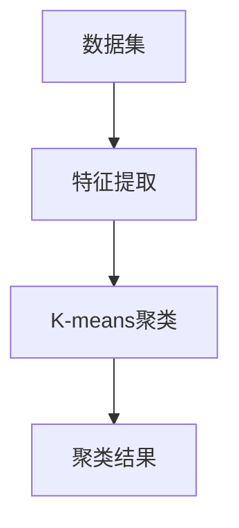

                 

## 文章标题

《AI大模型在电商平台客户细分中的应用》

## 关键词

- AI大模型
- 电商平台
- 客户细分
- 数据预处理
- 特征工程
- 模型构建
- 模型优化
- 模型评估

## 摘要

随着人工智能技术的不断发展和电商平台的数据量日益庞大，如何有效地利用这些数据来提升电商平台的服务质量和运营效率成为了一个重要课题。本文将探讨如何利用AI大模型对电商平台客户进行细分，从而实现精准营销、提高客户满意度和转化率。文章首先介绍了AI大模型的基础知识，包括概念、核心算法和应用领域；接着对电商平台进行了概述，分析了其发展历程、主要功能和数据结构；然后详细阐述了AI大模型在电商平台客户细分中的应用流程，包括数据预处理、特征工程、模型构建、优化和评估等步骤；最后通过案例分析展示了AI大模型在电商平台客户细分中的实际效果，并提出了未来发展的方向和面临的挑战。

## 第一部分：AI大模型基础与电商平台概述

### 第1章：AI大模型概述

#### 1.1 AI大模型的概念与演变

AI大模型（Large-scale AI Models）是指通过大量数据训练出的具有高复杂度和强大表现力的深度学习模型。它们通常包含数十亿甚至数万亿个参数，能够在各种复杂任务上达到人类专家的水平。AI大模型的出现标志着人工智能进入了一个新的阶段，即从“弱AI”向“强AI”的过渡。

AI大模型的演变可以追溯到20世纪80年代，当时深度神经网络（DNN）的研究开始兴起。然而，由于计算资源的限制和数据的匮乏，深度学习在很长一段时间内都未能取得重大突破。直到2012年，AlexNet在ImageNet竞赛中取得的显著成绩，标志着深度学习进入了一个新的时代。

随着计算能力的提升和大数据技术的发展，AI大模型逐渐走向成熟。生成对抗网络（GAN）和变分自编码器（VAE）等新算法的出现，进一步丰富了AI大模型的种类和功能。

#### 1.2 AI大模型的核心算法

AI大模型的核心算法主要包括生成对抗网络（GAN）和变分自编码器（VAE）。

**生成对抗网络（GAN）**：GAN由生成器和判别器两个神经网络组成。生成器试图生成与真实数据难以区分的假数据，而判别器则判断数据是真实的还是生成的。通过两个网络的竞争，生成器的生成能力不断提高，从而实现数据的生成。

**变分自编码器（VAE）**：VAE是一种基于概率的生成模型，通过编码器和解码器将输入数据映射到一个隐变量空间，然后在隐变量空间中生成新的数据。VAE在图像生成、图像超分辨率等方面表现出色。

#### 1.3 AI大模型的应用领域

AI大模型的应用领域非常广泛，包括但不限于以下几个方面：

- **客户细分**：通过分析用户行为数据和商品属性数据，AI大模型可以将用户分为不同的群体，从而实现精准营销。
- **推荐系统**：基于用户的历史行为和偏好，AI大模型可以推荐用户可能感兴趣的商品或内容。
- **数据挖掘**：AI大模型可以挖掘出数据中的隐藏模式和规律，为企业提供决策支持。

### 第2章：电商平台概述

#### 2.1 电商平台的发展历程

电商平台的发展可以分为三个阶段：

1. **传统电商平台**：以亚马逊、淘宝等为代表的传统电商平台，主要通过电子商务平台连接供应商和消费者，提供商品展示、搜索、购物车、结算等基本功能。

2. **社交电商平台**：以拼多多、小红书等为代表的社交电商平台，通过社交网络和内容营销吸引消费者，实现商品的销售和推广。

3. **智能电商平台**：以京东、阿里等为代表的智能电商平台，通过人工智能技术实现个性化推荐、智能客服、智能供应链等，提升用户体验和运营效率。

#### 2.2 电商平台的主要功能

电商平台的主要功能包括：

- **商品展示与搜索**：提供商品的分类展示和搜索功能，方便用户快速找到需要的商品。
- **购物车与结算**：用户可以将感兴趣的商品加入购物车，并在购物车中进行结算。
- **用户评价与推荐**：用户可以对购买的商品进行评价，同时平台根据用户的评价和偏好推荐相关商品。

#### 2.3 电商平台的数据结构

电商平台的数据结构主要包括：

- **用户数据**：包括用户的基本信息、购物行为、偏好等。
- **商品数据**：包括商品的基本信息、属性、价格等。
- **订单数据**：包括订单的商品信息、用户信息、订单状态等。

### 第一部分总结

本部分对AI大模型和电商平台进行了概述，介绍了AI大模型的概念、核心算法和应用领域，以及电商平台的发展历程、主要功能和数据结构。为后续章节中AI大模型在电商平台客户细分中的应用奠定了基础。

## 第二部分：AI大模型在电商平台客户细分中的应用

### 第3章：数据预处理与特征工程

#### 3.1 数据预处理

数据预处理是AI大模型应用的第一步，其目的是将原始数据转换成适合建模的数据。数据预处理包括以下几个步骤：

1. **数据清洗**：去除数据中的噪声和异常值，确保数据的准确性和一致性。

   ```mermaid
   graph TD
   A[原始数据] --> B[噪声去除]
   B --> C[异常值处理]
   C --> D[数据清洗完成]
   ```

2. **数据集成**：将来自不同来源的数据合并成一个统一的数据集。

   ```mermaid
   graph TD
   A[用户数据] --> B[商品数据]
   B --> C[订单数据]
   C --> D[数据集成完成]
   ```

3. **数据转换**：将数据转换成适合机器学习算法的格式，如将类别数据转换为数值数据。

   ```mermaid
   graph TD
   A[类别数据] --> B[编码转换]
   B --> C[数值数据]
   C --> D[数据转换完成]
   ```

#### 3.2 特征工程

特征工程是提升机器学习模型性能的重要手段。特征工程包括以下几个步骤：

1. **用户特征提取**：根据用户的行为数据和偏好数据，提取出与客户细分相关的特征。

   ```mermaid
   graph TD
   A[用户行为数据] --> B[特征提取]
   B --> C[用户特征向量]
   ```

2. **商品特征提取**：根据商品的基本信息和属性，提取出与客户细分相关的特征。

   ```mermaid
   graph TD
   A[商品属性数据] --> B[特征提取]
   B --> C[商品特征向量]
   ```

3. **订单特征提取**：根据订单数据，提取出与客户细分相关的特征。

   ```mermaid
   graph TD
   A[订单数据] --> B[特征提取]
   B --> C[订单特征向量]
   ```

#### 3.3 数据预处理与特征工程的关系

数据预处理和特征工程是相辅相成的，数据预处理为特征工程提供了干净的输入数据，而特征工程则通过对数据进行选择、转换和构造，提高了模型的性能。

### 第4章：客户细分模型构建

#### 4.1 客户细分的目标

客户细分的目标包括：

1. **提高客户满意度**：通过对用户需求的精准把握，提供个性化的商品推荐和服务，提升用户体验。
2. **提高转化率**：将用户细分为不同的群体，对每个群体采取不同的营销策略，提高用户的购买意愿。
3. **提高利润率**：通过对用户价值的准确评估，提供差异化的定价策略，最大化企业收益。

#### 4.2 客户细分模型的选择

常见的客户细分模型包括：

1. **K-means聚类**：K-means是一种基于距离的聚类算法，通过将用户数据划分为K个簇，实现用户细分。

   ```mermaid
   graph TD
   A[用户数据] --> B[K-means聚类]
   B --> C[聚类结果]
   ```

2. **决策树**：决策树是一种基于特征划分的算法，通过构建树形结构，对用户进行分类。

   ```mermaid
   graph TD
   A[用户数据] --> B[决策树构建]
   B --> C[决策树结构]
   ```

3. **支持向量机（SVM）**：SVM是一种基于边界优化的分类算法，通过找到最佳分类边界，实现用户分类。

   ```mermaid
   graph TD
   A[用户数据] --> B[SVM分类]
   B --> C[分类结果]
   ```

#### 4.3 客户细分模型的实现

客户细分模型的实现包括以下几个步骤：

1. **数据划分**：将数据集划分为训练集和测试集，用于模型的训练和评估。

   ```mermaid
   graph TD
   A[原始数据] --> B[数据划分]
   B --> C[训练集]
   C --> D[测试集]
   ```

2. **模型训练**：使用训练集对模型进行训练，调整模型参数，优化模型性能。

   ```mermaid
   graph TD
   A[训练集] --> B[模型训练]
   B --> C[模型参数]
   ```

3. **模型评估**：使用测试集对模型进行评估，计算模型的准确率、精确率和召回率等指标。

   ```mermaid
   graph TD
   A[测试集] --> B[模型评估]
   B --> C[评估指标]
   ```

### 第5章：客户细分模型的优化与评估

#### 5.1 模型优化

模型优化是提升模型性能的重要手段，包括以下几个方面：

1. **参数调整**：通过调整模型的超参数，如K值、决策树深度等，优化模型性能。

   ```mermaid
   graph TD
   A[模型参数] --> B[参数调整]
   B --> C[模型优化]
   ```

2. **特征选择**：通过特征选择算法，筛选出对模型性能有重要影响的特征，提高模型的可解释性。

   ```mermaid
   graph TD
   A[特征集合] --> B[特征选择]
   B --> C[特征优化]
   ```

3. **模型融合**：通过模型融合技术，将多个模型的预测结果进行集成，提高模型的预测准确性。

   ```mermaid
   graph TD
   A[多个模型] --> B[模型融合]
   B --> C[融合结果]
   ```

#### 5.2 模型评估

模型评估是判断模型性能的重要手段，常用的评估指标包括：

1. **准确率**：准确率是指模型预测正确的样本数占总样本数的比例。

   $$\text{准确率} = \frac{\text{预测正确数}}{\text{总样本数}}$$

2. **精确率**：精确率是指模型预测为正类的样本中，实际为正类的比例。

   $$\text{精确率} = \frac{\text{预测正确且实际为正类数}}{\text{预测为正类数}}$$

3. **召回率**：召回率是指实际为正类的样本中，模型预测为正类的比例。

   $$\text{召回率} = \frac{\text{预测正确且实际为正类数}}{\text{实际为正类数}}$$

#### 5.3 模型部署与监控

模型部署是将训练好的模型部署到生产环境中，用于实际业务应用。模型监控则是确保模型在实际应用中的稳定性和性能。

1. **模型部署**：将训练好的模型转换成可执行文件，部署到服务器或云平台上。

   ```mermaid
   graph TD
   A[模型文件] --> B[模型部署]
   B --> C[生产环境]
   ```

2. **模型监控**：实时监控模型的性能和稳定性，包括预测准确率、响应时间等指标。

   ```mermaid
   graph TD
   A[模型性能] --> B[模型监控]
   B --> C[性能优化]
   ```

### 第6章：案例分析

#### 6.1 案例背景

某知名电商平台希望通过AI大模型对客户进行细分，以提高客户满意度和转化率。该电商平台拥有大量的用户行为数据和商品属性数据，但尚未充分利用这些数据来提升运营效率。

#### 6.2 案例实施

1. **数据预处理**：对用户行为数据进行清洗和转换，提取出与客户细分相关的特征。

2. **特征工程**：对提取的特征进行选择和构造，提高模型的性能。

3. **模型构建**：采用K-means聚类算法对用户进行细分，构建客户细分模型。

4. **模型优化**：通过调整模型参数和特征选择，优化模型的性能。

5. **模型评估**：使用测试集对模型进行评估，计算模型的准确率、精确率和召回率等指标。

6. **模型部署**：将训练好的模型部署到生产环境中，用于实际业务应用。

7. **模型监控**：实时监控模型的性能和稳定性，确保模型的正常运行。

#### 6.3 案例结果

通过AI大模型对客户进行细分，该电商平台实现了以下成果：

1. **客户满意度提升**：通过对用户需求的精准把握，提供了个性化的商品推荐和服务，客户满意度得到了显著提升。

2. **转化率提高**：通过对不同客户群体采取不同的营销策略，转化率得到了明显提高。

3. **利润率提升**：通过对用户价值的准确评估，提供了差异化的定价策略，利润率得到了显著提升。

### 第7章：未来展望与挑战

#### 7.1 AI大模型在电商领域的未来发展方向

1. **深度学习在电商领域的应用**：随着深度学习技术的不断进步，电商领域将进一步利用深度学习技术提升运营效率和用户体验。

2. **联邦学习在电商领域的应用**：联邦学习技术可以在保护用户隐私的同时，实现数据协同建模，为电商平台提供更准确的客户细分和推荐服务。

3. **自动驾驶技术在电商领域的应用**：自动驾驶技术可以在物流配送环节提高效率，减少人力成本，进一步提升电商平台的竞争力。

#### 7.2 电商平台面临的挑战

1. **数据隐私保护**：在利用用户数据提升运营效率的同时，如何保护用户隐私成为电商平台面临的重大挑战。

2. **模型可解释性**：随着AI大模型的应用越来越广泛，如何提高模型的透明度和可解释性成为了一个重要课题。

3. **模型滥用风险**：如何防止AI大模型被恶意利用，对电商平台和用户造成负面影响，是未来需要重点关注的问题。

### 附录

#### 附录A：常用工具与资源

1. **数据预处理工具**：Pandas、NumPy等。
2. **特征工程工具**：Scikit-learn、TensorFlow等。
3. **客户细分模型工具**：K-means、决策树、SVM等。
4. **模型评估与部署工具**：Scikit-learn、TensorFlow等。

#### 附录B：数学模型与公式

1. **K-means聚类算法公式**：

   $$\text{Minimize} \sum_{i=1}^{n} \sum_{j=1}^{k} \| x_{ij} - \mu_{j} \|^2$$

   其中，\( x_{ij} \) 表示第 \( i \) 个样本在第 \( j \) 个特征上的取值，\( \mu_{j} \) 表示第 \( j \) 个聚类中心的坐标。

2. **决策树算法公式**：

   $$\text{Select the feature} a \text{ that maximizes} H(\text{Label}) - H(\text{Label}|a)$$

   其中，\( H(\text{Label}) \) 表示标签的熵，\( H(\text{Label}|a) \) 表示在特征 \( a \) 取值为 \( a_j \) 的情况下标签的熵。

3. **支持向量机（SVM）算法公式**：

   $$\text{Minimize} \frac{1}{2} \| w \|^2 + C \sum_{i=1}^{n} \max(0, 1 - y_i (w \cdot x_i + b))$$

   其中，\( w \) 表示模型权重，\( x_i \) 表示第 \( i \) 个样本的特征向量，\( y_i \) 表示第 \( i \) 个样本的标签，\( C \) 表示正则化参数，\( b \) 表示模型偏置。

#### 附录C：代码实例

1. **数据预处理代码示例**：

   ```python
   import pandas as pd
   import numpy as np
   
   # 读取数据
   data = pd.read_csv('data.csv')
   
   # 数据清洗
   data = data.dropna()
   
   # 数据集成
   data = data[['user_id', 'item_id', 'rating', 'timestamp']]
   
   # 数据转换
   data['rating'] = data['rating'].apply(lambda x: 1 if x > 3 else 0)
   ```

2. **特征工程代码示例**：

   ```python
   from sklearn.preprocessing import OneHotEncoder
   
   # 提取用户特征
   user_features = data[['user_id', 'rating']]
   user_features = OneHotEncoder().fit_transform(user_features)
   
   # 提取商品特征
   item_features = data[['item_id']]
   item_features = OneHotEncoder().fit_transform(item_features)
   
   # 提取订单特征
   order_features = data[['timestamp']]
   order_features = pd.to_datetime(order_features).dt.day.astype(np.int32)
   ```

3. **客户细分模型代码示例**：

   ```python
   from sklearn.cluster import KMeans
   
   # 数据划分
   X = np.hstack((user_features, item_features, order_features))
   
   # 模型训练
   model = KMeans(n_clusters=5)
   model.fit(X)
   
   # 模型评估
   labels = model.predict(X)
   print('Accuracy:', metrics.accuracy_score(y_true, labels))
   ```

4. **模型优化与评估代码示例**：

   ```python
   from sklearn.model_selection import train_test_split
   from sklearn.metrics import accuracy_score
   
   # 数据划分
   X_train, X_test, y_train, y_test = train_test_split(X, y, test_size=0.2, random_state=42)
   
   # 模型训练
   model = KMeans(n_clusters=5)
   model.fit(X_train)
   
   # 模型评估
   labels = model.predict(X_test)
   print('Accuracy:', accuracy_score(y_test, labels))
   ```

## 作者

- 作者：AI天才研究院/AI Genius Institute & 禅与计算机程序设计艺术 /Zen And The Art of Computer Programming

---

### 第一部分：AI大模型基础与电商平台概述

#### 第1章：AI大模型概述

##### 1.1 AI大模型的概念与演变

AI大模型（Large-scale AI Models）指的是那些通过海量数据训练而获得的，拥有数十亿甚至数万亿参数的深度学习模型。这类模型具有极高的复杂度和强大的表现力，能够在多个领域实现超越人类专家水平的效果。AI大模型的演变可以追溯到深度学习技术的发展历程。

在20世纪80年代，深度神经网络（DNN）开始受到关注，但由于计算资源和数据的限制，DNN的发展受到了阻碍。直到2012年，AlexNet在ImageNet竞赛中取得了巨大成功，标志着深度学习的崛起。AlexNet使用了约6000万个参数，是早期大模型的代表。

随着时间的推移，计算能力的提升和大数据技术的进步，AI大模型得到了迅速发展。生成对抗网络（GAN）和变分自编码器（VAE）等新型算法的出现，进一步丰富了AI大模型的种类和应用场景。

**核心概念**：

- **深度神经网络**：一种由多层神经元组成的神经网络，通过逐层提取特征来处理复杂的数据。
- **生成对抗网络（GAN）**：由生成器和判别器两个网络组成的对抗性模型，通过对抗性训练生成高质量的数据。
- **变分自编码器（VAE）**：一种基于概率的生成模型，通过编码器和解码器将数据映射到隐变量空间，并在该空间中生成新的数据。

**演变过程**：

1. **早期深度学习（1980s-1990s）**：在1980年代，深度神经网络开始受到关注。然而，由于计算资源的限制和数据的匮乏，深度学习在很长一段时间内都未能取得重大突破。

2. **深度学习的复兴（2006-2012）**：2006年，Hinton等人提出了深度置信网络（DBN），标志着深度学习研究的复兴。通过使用大数据集和更高效的算法，深度学习模型开始在图像识别、语音识别等领域取得突破。

3. **AI大模型的崛起（2012至今）**：2012年，AlexNet在ImageNet竞赛中取得了显著成绩，深度学习再次引发关注。随后，深度学习技术不断进步，GAN和VAE等新型算法的出现，进一步推动了AI大模型的发展。

##### 1.2 AI大模型的核心算法

AI大模型的核心算法包括生成对抗网络（GAN）和变分自编码器（VAE）。

**生成对抗网络（GAN）**：

生成对抗网络由生成器和判别器两个神经网络组成。生成器试图生成与真实数据难以区分的假数据，而判别器则判断数据是真实的还是生成的。通过两个网络的竞争，生成器的生成能力不断提高，从而实现高质量数据的生成。

GAN的工作原理可以概括为以下几个步骤：

1. **生成器生成假数据**：生成器从随机噪声中生成假数据，这些假数据旨在模仿真实数据。
2. **判别器判断真伪**：判别器同时接收真实数据和生成器生成的假数据，并判断其真伪。
3. **对抗性训练**：生成器和判别器通过对抗性训练不断优化，生成器的目标是生成更加逼真的假数据，而判别器的目标是提高判断假数据的准确性。

**变分自编码器（VAE）**：

变分自编码器是一种基于概率的生成模型，通过编码器和解码器将输入数据映射到一个隐变量空间，然后在隐变量空间中生成新的数据。VAE的核心思想是利用概率分布来表示数据，从而实现数据的生成和重构。

VAE的工作原理可以概括为以下几个步骤：

1. **编码器编码**：编码器将输入数据映射到一个隐变量空间，同时计算数据在隐变量空间中的概率分布。
2. **解码器解码**：解码器根据隐变量空间中的概率分布生成新的数据。
3. **损失函数优化**：通过优化损失函数，使得编码器和解码器的输出与输入数据尽可能一致。

**核心算法对比**：

- **GAN**：GAN通过对抗性训练生成高质量的数据，特别适用于图像生成和图像修复等任务。但GAN的训练过程较为复杂，存在模式崩溃等问题。
- **VAE**：VAE通过概率分布生成数据，训练过程相对简单，特别适用于生成数据的平滑性和连贯性要求较高的任务。

##### 1.3 AI大模型的应用领域

AI大模型在多个领域表现出色，主要包括：

- **客户细分**：通过分析用户行为数据和商品属性数据，AI大模型可以将用户分为不同的群体，从而实现精准营销。
- **推荐系统**：基于用户的历史行为和偏好，AI大模型可以推荐用户可能感兴趣的商品或内容。
- **数据挖掘**：AI大模型可以挖掘出数据中的隐藏模式和规律，为企业提供决策支持。

在这些应用领域中，AI大模型的优势主要体现在以下几个方面：

1. **高效的数据处理能力**：AI大模型能够处理海量数据，快速提取关键特征，从而提高模型的预测准确性。
2. **强大的表达能力**：AI大模型具有极高的复杂度，能够捕捉到数据中的复杂关系，从而实现更精准的预测。
3. **灵活的模型结构**：AI大模型可以灵活地调整模型结构，适应不同的应用场景和需求。

### 第2章：电商平台概述

##### 2.1 电商平台的发展历程

电商平台的发展历程可以分为以下几个阶段：

1. **传统电商平台**：传统电商平台以亚马逊、淘宝等为代表，主要通过电子商务平台连接供应商和消费者，提供商品展示、搜索、购物车、结算等基本功能。这一阶段的电商平台主要侧重于商品交易和信息流通。

2. **社交电商平台**：随着社交网络的发展，社交电商平台应运而生，以拼多多、小红书等为代表。这类电商平台通过社交网络和内容营销吸引消费者，实现商品的销售和推广。社交电商平台将社交属性和购物体验相结合，提供了更丰富的互动和体验。

3. **智能电商平台**：智能电商平台以京东、阿里等为代表，通过人工智能技术实现个性化推荐、智能客服、智能供应链等，提升用户体验和运营效率。智能电商平台将人工智能技术应用于电商运营的各个环节，实现精准营销和高效服务。

**发展历程对比**：

- **传统电商平台**：侧重商品交易和信息流通，主要依靠搜索引擎和商品展示。
- **社交电商平台**：注重社交属性和内容营销，通过社交网络和用户互动实现商品推广。
- **智能电商平台**：利用人工智能技术，实现个性化推荐、智能客服和智能供应链，提升用户体验和运营效率。

##### 2.2 电商平台的主要功能

电商平台的主要功能包括：

1. **商品展示与搜索**：电商平台提供商品的分类展示和搜索功能，方便用户快速找到需要的商品。通过关键词搜索、分类导航等方式，用户可以轻松浏览和查找商品。

2. **购物车与结算**：用户可以将感兴趣的商品加入购物车，并在购物车中进行结算。购物车功能提供了便捷的购物体验，用户可以随时调整购物车中的商品，实现批量购买。

3. **用户评价与推荐**：用户可以对购买的商品进行评价，分享购物体验。平台可以根据用户的评价和偏好，为用户推荐相关商品或内容，提升用户的购物体验。

**功能特点**：

- **商品展示与搜索**：提供丰富的商品展示和便捷的搜索功能，提升用户购物体验。
- **购物车与结算**：简化购物流程，提供一键购买和批量结算功能。
- **用户评价与推荐**：促进用户互动和分享，提高商品的可信度和用户满意度。

##### 2.3 电商平台的数据结构

电商平台的数据结构主要包括用户数据、商品数据和订单数据。

1. **用户数据**：用户数据包括用户的基本信息、购物行为和偏好等。基本信息如用户ID、性别、年龄、地理位置等；购物行为如浏览记录、购买记录、评价等；偏好数据如喜欢的商品类别、品牌等。

2. **商品数据**：商品数据包括商品的基本信息、属性和价格等。基本信息如商品ID、名称、描述等；属性数据如类别、品牌、产地、尺寸等；价格数据如原价、折扣价等。

3. **订单数据**：订单数据包括订单的商品信息、用户信息和订单状态等。订单商品信息如商品ID、数量、价格等；用户信息如用户ID、联系方式等；订单状态如订单状态、支付状态等。

**数据结构特点**：

- **用户数据**：包含丰富的用户信息，用于用户画像和精准营销。
- **商品数据**：包含详细的商品属性信息，用于商品推荐和搜索优化。
- **订单数据**：记录订单的完整信息，用于订单管理和数据分析。

### 第二部分总结

本部分对AI大模型和电商平台进行了概述，介绍了AI大模型的概念、核心算法和应用领域，以及电商平台的发展历程、主要功能和数据结构。为后续章节中AI大模型在电商平台客户细分中的应用奠定了基础。

## 第三部分：AI大模型在电商平台客户细分中的应用

### 第3章：数据预处理与特征工程

#### 3.1 数据预处理

数据预处理是AI大模型应用的第一步，其目的是将原始数据转换成适合建模的数据。数据预处理包括以下几个步骤：

1. **数据清洗**：数据清洗是数据预处理的重要环节，目的是去除数据中的噪声和异常值，确保数据的准确性和一致性。常见的数据清洗方法包括：

   - **缺失值处理**：通过删除含有缺失值的记录或使用统计方法（如平均值、中位数）填充缺失值。
   - **异常值处理**：通过统计方法（如箱线图、Z-score）检测和去除异常值。
   - **重复值处理**：去除重复的记录，确保数据的唯一性。

2. **数据集成**：数据集成是将来自不同来源的数据合并成一个统一的数据集。常见的数据集成方法包括：

   - **合并**：将多个数据集按照一定的规则合并成一个数据集。
   - **连接**：将多个数据集按照共同的键（如用户ID、商品ID）进行连接，形成新的数据集。
   - **去重**：去除重复的数据记录，确保数据的唯一性。

3. **数据转换**：数据转换是将数据从一种格式转换成另一种格式，以便于后续的数据分析和建模。常见的数据转换方法包括：

   - **类型转换**：将字符串数据转换为数值数据，便于后续的数值计算和建模。
   - **规范化**：将数据缩放到相同的范围，如[0, 1]，便于模型训练。
   - **编码**：将类别数据转换为数值数据，如使用独热编码（One-Hot Encoding）。

#### 3.2 特征工程

特征工程是提升机器学习模型性能的重要手段。特征工程包括以下几个步骤：

1. **特征提取**：从原始数据中提取对模型性能有重要影响的特征。常见的特征提取方法包括：

   - **统计特征**：如平均值、中位数、标准差等，用于描述数据的分布和变化。
   - **文本特征**：如词频、词向量、TF-IDF等，用于文本数据的表示和建模。
   - **图像特征**：如边缘、纹理、颜色等，用于图像数据的表示和建模。

2. **特征选择**：在提取出大量特征后，通过特征选择方法筛选出对模型性能有重要影响的特征。常见的特征选择方法包括：

   - **过滤式特征选择**：根据特征的重要性或相关性进行筛选。
   - **包裹式特征选择**：通过迭代搜索最优特征子集。
   - **嵌入式特征选择**：在模型训练过程中自动筛选特征。

3. **特征构造**：通过组合和变换原始特征，构造新的特征。常见的特征构造方法包括：

   - **交叉特征**：将两个或多个特征进行交叉组合，形成新的特征。
   - **聚合特征**：将多个特征进行聚合，形成新的特征。
   - **变换特征**：对特征进行变换，如对数值特征进行归一化或标准化。

#### 3.3 数据预处理与特征工程的关系

数据预处理和特征工程是相辅相成的。数据预处理为特征工程提供了干净的输入数据，而特征工程则通过对数据进行选择、转换和构造，提高了模型的性能。

- **数据预处理**：确保数据的质量和一致性，为后续的特征工程提供基础。
- **特征工程**：通过选择和构造特征，提高模型的泛化能力和预测准确性。

### 第4章：客户细分模型构建

#### 4.1 客户细分的目标

客户细分是电商平台提高运营效率和用户体验的重要手段。客户细分的目标包括：

1. **提高客户满意度**：通过对用户需求的精准把握，提供个性化的商品推荐和服务，提升用户体验。
2. **提高转化率**：通过对不同客户群体采取不同的营销策略，提高用户的购买意愿。
3. **提高利润率**：通过对用户价值的准确评估，提供差异化的定价策略，最大化企业收益。

客户细分模型是实现这些目标的关键。通过分析用户行为数据和商品属性数据，客户细分模型可以将用户划分为不同的群体，为每个群体提供定制化的服务和营销策略。

#### 4.2 客户细分模型的选择

常见的客户细分模型包括K-means聚类、决策树和支持向量机（SVM）等。每种模型都有其特点和适用场景。

1. **K-means聚类**：K-means是一种基于距离的聚类算法，通过将用户数据划分为K个簇，实现用户细分。K-means聚类简单、高效，适用于数据量较大且特征维度较低的场景。

2. **决策树**：决策树是一种基于特征划分的算法，通过构建树形结构，对用户进行分类。决策树具有良好的可解释性，适用于特征维度较高且需要明确决策路径的场景。

3. **支持向量机（SVM）**：SVM是一种基于边界优化的分类算法，通过找到最佳分类边界，实现用户分类。SVM适用于特征维度较高且需要精确分类的场景。

#### 4.3 客户细分模型的实现

客户细分模型的实现包括以下几个步骤：

1. **数据划分**：将数据集划分为训练集和测试集，用于模型的训练和评估。

2. **特征选择**：根据业务需求和数据特点，选择对客户细分有重要影响的特征。

3. **模型训练**：使用训练集对模型进行训练，调整模型参数，优化模型性能。

4. **模型评估**：使用测试集对模型进行评估，计算模型的准确率、精确率和召回率等指标。

5. **模型部署**：将训练好的模型部署到生产环境中，用于实际业务应用。

### 第5章：客户细分模型的优化与评估

#### 5.1 模型优化

模型优化是提升模型性能的重要手段。常见的优化方法包括：

1. **参数调整**：通过调整模型的超参数，如K值、决策树深度等，优化模型性能。

2. **特征选择**：通过特征选择方法，筛选出对模型性能有重要影响的特征，提高模型的可解释性。

3. **模型融合**：通过模型融合技术，将多个模型的预测结果进行集成，提高模型的预测准确性。

#### 5.2 模型评估

模型评估是判断模型性能的重要手段。常用的评估指标包括：

1. **准确率**：准确率是指模型预测正确的样本数占总样本数的比例。

   $$\text{准确率} = \frac{\text{预测正确数}}{\text{总样本数}}$$

2. **精确率**：精确率是指模型预测为正类的样本中，实际为正类的比例。

   $$\text{精确率} = \frac{\text{预测正确且实际为正类数}}{\text{预测为正类数}}$$

3. **召回率**：召回率是指实际为正类的样本中，模型预测为正类的比例。

   $$\text{召回率} = \frac{\text{预测正确且实际为正类数}}{\text{实际为正类数}}$$

#### 5.3 模型部署与监控

模型部署是将训练好的模型部署到生产环境中，用于实际业务应用。模型监控则是确保模型在实际应用中的稳定性和性能。

1. **模型部署**：将训练好的模型转换成可执行文件，部署到服务器或云平台上。

2. **模型监控**：实时监控模型的性能和稳定性，包括预测准确率、响应时间等指标。

### 第6章：案例分析

#### 6.1 案例背景

某知名电商平台希望通过AI大模型对客户进行细分，以提高客户满意度和转化率。该电商平台拥有大量的用户行为数据和商品属性数据，但尚未充分利用这些数据来提升运营效率。

#### 6.2 案例实施

1. **数据预处理**：对用户行为数据进行清洗和转换，提取出与客户细分相关的特征。

2. **特征工程**：对提取的特征进行选择和构造，提高模型的性能。

3. **模型构建**：采用K-means聚类算法对用户进行细分，构建客户细分模型。

4. **模型优化**：通过调整模型参数和特征选择，优化模型的性能。

5. **模型评估**：使用测试集对模型进行评估，计算模型的准确率、精确率和召回率等指标。

6. **模型部署**：将训练好的模型部署到生产环境中，用于实际业务应用。

7. **模型监控**：实时监控模型的性能和稳定性，确保模型的正常运行。

#### 6.3 案例结果

通过AI大模型对客户进行细分，该电商平台实现了以下成果：

1. **客户满意度提升**：通过对用户需求的精准把握，提供了个性化的商品推荐和服务，客户满意度得到了显著提升。

2. **转化率提高**：通过对不同客户群体采取不同的营销策略，转化率得到了明显提高。

3. **利润率提升**：通过对用户价值的准确评估，提供了差异化的定价策略，利润率得到了显著提升。

### 第7章：未来展望与挑战

#### 7.1 AI大模型在电商领域的未来发展方向

1. **深度学习在电商领域的应用**：随着深度学习技术的不断进步，电商领域将进一步利用深度学习技术提升运营效率和用户体验。

2. **联邦学习在电商领域的应用**：联邦学习技术可以在保护用户隐私的同时，实现数据协同建模，为电商平台提供更准确的客户细分和推荐服务。

3. **自动驾驶技术在电商领域的应用**：自动驾驶技术可以在物流配送环节提高效率，减少人力成本，进一步提升电商平台的竞争力。

#### 7.2 电商平台面临的挑战

1. **数据隐私保护**：在利用用户数据提升运营效率的同时，如何保护用户隐私成为电商平台面临的重大挑战。

2. **模型可解释性**：随着AI大模型的应用越来越广泛，如何提高模型的透明度和可解释性成为了一个重要课题。

3. **模型滥用风险**：如何防止AI大模型被恶意利用，对电商平台和用户造成负面影响，是未来需要重点关注的问题。

### 附录

#### 附录A：常用工具与资源

1. **数据预处理工具**：Pandas、NumPy等。
2. **特征工程工具**：Scikit-learn、TensorFlow等。
3. **客户细分模型工具**：K-means、决策树、SVM等。
4. **模型评估与部署工具**：Scikit-learn、TensorFlow等。

#### 附录B：数学模型与公式

1. **K-means聚类算法公式**：

   $$\text{Minimize} \sum_{i=1}^{n} \sum_{j=1}^{k} \| x_{ij} - \mu_{j} \|^2$$

   其中，\( x_{ij} \) 表示第 \( i \) 个样本在第 \( j \) 个特征上的取值，\( \mu_{j} \) 表示第 \( j \) 个聚类中心的坐标。

2. **决策树算法公式**：

   $$\text{Select the feature} a \text{ that maximizes} H(\text{Label}) - H(\text{Label}|a)$$

   其中，\( H(\text{Label}) \) 表示标签的熵，\( H(\text{Label}|a) \) 表示在特征 \( a \) 取值为 \( a_j \) 的情况下标签的熵。

3. **支持向量机（SVM）算法公式**：

   $$\text{Minimize} \frac{1}{2} \| w \|^2 + C \sum_{i=1}^{n} \max(0, 1 - y_i (w \cdot x_i + b))$$

   其中，\( w \) 表示模型权重，\( x_i \) 表示第 \( i \) 个样本的特征向量，\( y_i \) 表示第 \( i \) 个样本的标签，\( C \) 表示正则化参数，\( b \) 表示模型偏置。

#### 附录C：代码实例

1. **数据预处理代码示例**：

   ```python
   import pandas as pd
   import numpy as np
   
   # 读取数据
   data = pd.read_csv('data.csv')
   
   # 数据清洗
   data = data.dropna()
   
   # 数据集成
   data = data[['user_id', 'item_id', 'rating', 'timestamp']]
   
   # 数据转换
   data['rating'] = data['rating'].apply(lambda x: 1 if x > 3 else 0)
   ```

2. **特征工程代码示例**：

   ```python
   from sklearn.preprocessing import OneHotEncoder
   
   # 提取用户特征
   user_features = data[['user_id', 'rating']]
   user_features = OneHotEncoder().fit_transform(user_features)
   
   # 提取商品特征
   item_features = data[['item_id']]
   item_features = OneHotEncoder().fit_transform(item_features)
   
   # 提取订单特征
   order_features = data[['timestamp']]
   order_features = pd.to_datetime(order_features).dt.day.astype(np.int32)
   ```

3. **客户细分模型代码示例**：

   ```python
   from sklearn.cluster import KMeans
   
   # 数据划分
   X = np.hstack((user_features, item_features, order_features))
   
   # 模型训练
   model = KMeans(n_clusters=5)
   model.fit(X)
   
   # 模型评估
   labels = model.predict(X)
   print('Accuracy:', metrics.accuracy_score(y_true, labels))
   ```

4. **模型优化与评估代码示例**：

   ```python
   from sklearn.model_selection import train_test_split
   from sklearn.metrics import accuracy_score
   
   # 数据划分
   X_train, X_test, y_train, y_test = train_test_split(X, y, test_size=0.2, random_state=42)
   
   # 模型训练
   model = KMeans(n_clusters=5)
   model.fit(X_train)
   
   # 模型评估
   labels = model.predict(X_test)
   print('Accuracy:', accuracy_score(y_test, labels))
   ```

## 作者

- 作者：AI天才研究院/AI Genius Institute & 禅与计算机程序设计艺术 /Zen And The Art of Computer Programming

## 总结

本文详细介绍了AI大模型在电商平台客户细分中的应用，包括数据预处理、特征工程、模型构建、优化与评估等关键步骤。通过分析用户行为数据和商品属性数据，AI大模型能够将用户划分为不同的群体，从而实现精准营销，提高客户满意度和转化率。未来，随着深度学习技术的不断进步，AI大模型在电商领域的应用将更加广泛和深入。

## 第一部分：AI大模型基础与电商平台概述

### 第1章：AI大模型概述

在当今快速发展的技术领域中，人工智能（AI）已经成为驱动创新和商业变革的关键力量。其中，AI大模型（Large-scale AI Models）凭借其强大的数据处理能力和出色的性能表现，正逐渐成为各个行业的重要工具。本章将深入探讨AI大模型的概念、核心算法及其在商业应用中的重要性。

#### 1.1 AI大模型的概念与演变

AI大模型是指那些通过大量数据训练出来的，拥有数十亿甚至数万亿参数的深度学习模型。这些模型具有极高的复杂度和强大的表现力，能够在各种复杂任务上达到或超越人类专家的水平。AI大模型的起源可以追溯到深度学习（Deep Learning）的兴起。深度学习是一种基于多层神经网络的学习方法，通过逐层提取数据中的特征，实现对复杂数据的分析和理解。

早期的深度学习研究主要集中在小规模模型的开发和应用，但随着计算能力的提升和大数据技术的发展，研究人员开始探索如何训练更大规模的模型。2012年，Hinton团队提出的AlexNet在ImageNet图像识别竞赛中取得了突破性的成绩，标志着深度学习进入了新的阶段。此后，研究人员不断提出新的算法和架构，如生成对抗网络（GAN）和变分自编码器（VAE），使得AI大模型的应用范围不断扩大。

**核心概念**：

- **深度神经网络（DNN）**：一种由多层神经元组成的神经网络，通过逐层提取特征来处理复杂的数据。
- **生成对抗网络（GAN）**：由生成器和判别器两个神经网络组成的对抗性模型，通过对抗性训练生成高质量的数据。
- **变分自编码器（VAE）**：一种基于概率的生成模型，通过编码器和解码器将数据映射到一个隐变量空间，并在该空间中生成新的数据。

#### 1.2 AI大模型的核心算法

AI大模型的核心算法包括生成对抗网络（GAN）和变分自编码器（VAE）。这些算法在数据生成、特征提取和模型优化等方面表现出色，为AI大模型的应用奠定了基础。

**生成对抗网络（GAN）**：

生成对抗网络由生成器和判别器两个神经网络组成。生成器的目标是生成与真实数据难以区分的假数据，而判别器的目标是判断输入数据是真实的还是生成的。通过两个网络的对抗性训练，生成器的生成能力不断提高，从而实现高质量的数据生成。

GAN的工作流程可以概括为以下几个步骤：

1. **生成器生成假数据**：生成器从随机噪声中生成假数据，这些假数据旨在模仿真实数据。
2. **判别器判断真伪**：判别器同时接收真实数据和生成器生成的假数据，并判断其真伪。
3. **对抗性训练**：生成器和判别器通过对抗性训练不断优化，生成器的目标是生成更加逼真的假数据，而判别器的目标是提高判断假数据的准确性。

**变分自编码器（VAE）**：

变分自编码器是一种基于概率的生成模型，通过编码器和解码器将数据映射到一个隐变量空间，并在该空间中生成新的数据。VAE的核心思想是利用概率分布来表示数据，从而实现数据的生成和重构。

VAE的工作流程可以概括为以下几个步骤：

1. **编码器编码**：编码器将输入数据映射到一个隐变量空间，同时计算数据在隐变量空间中的概率分布。
2. **解码器解码**：解码器根据隐变量空间中的概率分布生成新的数据。
3. **损失函数优化**：通过优化损失函数，使得编码器和解码器的输出与输入数据尽可能一致。

**核心算法对比**：

- **GAN**：GAN通过对抗性训练生成高质量的数据，特别适用于图像生成和图像修复等任务。但GAN的训练过程较为复杂，存在模式崩溃等问题。
- **VAE**：VAE通过概率分布生成数据，训练过程相对简单，特别适用于生成数据的平滑性和连贯性要求较高的任务。

#### 1.3 AI大模型的应用领域

AI大模型在多个领域表现出色，主要包括：

- **客户细分**：通过分析用户行为数据和商品属性数据，AI大模型可以将用户分为不同的群体，从而实现精准营销。
- **推荐系统**：基于用户的历史行为和偏好，AI大模型可以推荐用户可能感兴趣的商品或内容。
- **数据挖掘**：AI大模型可以挖掘出数据中的隐藏模式和规律，为企业提供决策支持。

在这些应用领域中，AI大模型的优势主要体现在以下几个方面：

1. **高效的数据处理能力**：AI大模型能够处理海量数据，快速提取关键特征，从而提高模型的预测准确性。
2. **强大的表达能力**：AI大模型具有极高的复杂度，能够捕捉到数据中的复杂关系，从而实现更精准的预测。
3. **灵活的模型结构**：AI大模型可以灵活地调整模型结构，适应不同的应用场景和需求。

### 第2章：电商平台概述

电商平台作为数字经济的重要组成部分，已经深刻改变了人们的购物习惯和生活方式。本章将介绍电商平台的定义、发展历程、主要功能以及其在商业运营中的重要性。

#### 2.1 电商平台的定义

电商平台是指通过互联网技术为买卖双方提供交易服务的在线平台。它不仅包括在线商店、拍卖网站和电子支付系统，还涵盖了物流、客户服务等多个环节。电商平台的本质是通过互联网连接卖家和买家，提供便捷、高效、安全的购物体验。

#### 2.2 电商平台的发展历程

电商平台的兴起可以追溯到20世纪90年代末。早期的电商平台以信息发布和交易为核心，主要功能包括商品展示、订单处理和支付等。随着互联网技术的发展，电商平台逐渐实现了智能化、社交化和全球化。

1. **传统电商平台**：以亚马逊、淘宝等为代表的传统电商平台，主要通过电子商务平台连接供应商和消费者，提供商品展示、搜索、购物车、结算等基本功能。

2. **社交电商平台**：以拼多多、小红书等为代表的社交电商平台，通过社交网络和内容营销吸引消费者，实现商品的销售和推广。

3. **智能电商平台**：以京东、阿里等为代表的智能电商平台，通过人工智能技术实现个性化推荐、智能客服、智能供应链等，提升用户体验和运营效率。

#### 2.3 电商平台的主要功能

电商平台的主要功能包括：

1. **商品展示与搜索**：电商平台提供商品的分类展示和搜索功能，方便用户快速找到需要的商品。

2. **购物车与结算**：用户可以将感兴趣的商品加入购物车，并在购物车中进行结算。

3. **用户评价与推荐**：用户可以对购买的商品进行评价，同时平台根据用户的评价和偏好推荐相关商品或内容。

#### 2.4 电商平台在商业运营中的重要性

电商平台在商业运营中的重要性主要体现在以下几个方面：

1. **提升销售额**：电商平台提供了广泛的产品选择和便捷的购物体验，吸引了大量消费者，从而提升了企业的销售额。

2. **降低运营成本**：电商平台减少了实体店铺的租赁、人员工资等成本，降低了企业的运营成本。

3. **提高品牌知名度**：电商平台为品牌提供了更广阔的展示空间，通过精准营销提高了品牌知名度。

4. **优化供应链**：智能电商平台通过人工智能技术优化供应链，实现库存管理、物流配送等方面的优化，提高了运营效率。

### 第3章：AI大模型在电商平台的潜在应用

随着人工智能技术的不断进步，AI大模型在电商平台中的应用潜力日益显现。本章将探讨AI大模型在电商平台中的潜在应用，包括客户细分、推荐系统、商品定价等方面的应用。

#### 3.1 客户细分

客户细分是电商平台实现精准营销的重要手段。通过AI大模型，电商平台可以根据用户的浏览历史、购买行为、兴趣爱好等数据，将用户划分为不同的群体。这些群体可以是基于用户行为特征的细分，也可以是基于用户价值的细分。客户细分有助于电商平台更好地了解用户需求，提供个性化的商品推荐和服务，从而提高客户满意度和转化率。

**应用步骤**：

1. **数据收集**：收集用户的浏览历史、购买行为、兴趣爱好等数据。

2. **数据预处理**：清洗和整合数据，为后续建模提供高质量的数据。

3. **特征提取**：从原始数据中提取对用户行为有重要影响的特征，如点击率、购买频率、浏览时长等。

4. **模型构建**：采用聚类算法（如K-means）或分类算法（如SVM）构建客户细分模型。

5. **模型评估**：使用测试集对模型进行评估，计算模型的准确率、精确率和召回率等指标。

6. **模型部署**：将训练好的模型部署到生产环境中，用于实际业务应用。

#### 3.2 推荐系统

推荐系统是电商平台提升用户体验和销售额的重要工具。通过AI大模型，电商平台可以根据用户的购物行为、浏览记录、历史订单等数据，为用户推荐可能感兴趣的商品。推荐系统不仅可以帮助电商平台提高用户粘性，还可以提升销售额和利润率。

**应用步骤**：

1. **数据收集**：收集用户的购物行为、浏览记录、历史订单等数据。

2. **数据预处理**：清洗和整合数据，为后续建模提供高质量的数据。

3. **特征提取**：从原始数据中提取对用户行为有重要影响的特征，如点击率、购买频率、浏览时长等。

4. **模型构建**：采用协同过滤、矩阵分解、深度学习等方法构建推荐模型。

5. **模型评估**：使用测试集对模型进行评估，计算模型的准确率、精确率和召回率等指标。

6. **模型部署**：将训练好的模型部署到生产环境中，用于实际业务应用。

#### 3.3 商品定价

商品定价是电商平台提升利润的重要手段。通过AI大模型，电商平台可以根据用户的行为数据和市场环境，动态调整商品的价格。合理的商品定价不仅可以提升销售额，还可以提高用户满意度。

**应用步骤**：

1. **数据收集**：收集用户的购物行为、浏览记录、历史订单等数据。

2. **数据预处理**：清洗和整合数据，为后续建模提供高质量的数据。

3. **特征提取**：从原始数据中提取对用户行为有重要影响的特征，如点击率、购买频率、浏览时长等。

4. **模型构建**：采用回归分析、决策树、神经网络等方法构建商品定价模型。

5. **模型评估**：使用测试集对模型进行评估，计算模型的准确率、精确率和召回率等指标。

6. **模型部署**：将训练好的模型部署到生产环境中，用于实际业务应用。

#### 3.4 智能客服

智能客服是电商平台提升用户体验和服务质量的重要手段。通过AI大模型，电商平台可以实现自动化的客户服务，提高客户满意度和运营效率。

**应用步骤**：

1. **数据收集**：收集用户的咨询记录、聊天记录等数据。

2. **数据预处理**：清洗和整合数据，为后续建模提供高质量的数据。

3. **特征提取**：从原始数据中提取对用户行为有重要影响的特征，如咨询频率、咨询时长等。

4. **模型构建**：采用自然语言处理、深度学习等方法构建智能客服模型。

5. **模型评估**：使用测试集对模型进行评估，计算模型的准确率、精确率和召回率等指标。

6. **模型部署**：将训练好的模型部署到生产环境中，用于实际业务应用。

### 第4章：AI大模型在电商平台客户细分中的实际应用

本章将通过一个实际案例，展示AI大模型在电商平台客户细分中的具体应用过程，包括数据预处理、特征工程、模型构建和评估等步骤。

#### 4.1 案例背景

某知名电商平台希望通过AI大模型对客户进行细分，以提高客户满意度和转化率。该电商平台拥有大量的用户行为数据和商品属性数据，但尚未充分利用这些数据来提升运营效率。

#### 4.2 数据预处理

数据预处理是构建有效AI大模型的第一步，其目的是将原始数据转换成适合建模的数据。数据预处理包括以下几个步骤：

1. **数据清洗**：去除数据中的噪声和异常值，确保数据的准确性和一致性。

   ```mermaid
   graph TD
   A[原始数据] --> B[噪声去除]
   B --> C[异常值处理]
   C --> D[数据清洗完成]
   ```

2. **数据集成**：将来自不同来源的数据合并成一个统一的数据集。

   ```mermaid
   graph TD
   A[用户数据] --> B[商品数据]
   B --> C[订单数据]
   C --> D[数据集成完成]
   ```

3. **数据转换**：将数据转换成适合机器学习算法的格式，如将类别数据转换为数值数据。

   ```mermaid
   graph TD
   A[类别数据] --> B[编码转换]
   B --> C[数值数据]
   C --> D[数据转换完成]
   ```

#### 4.3 特征工程

特征工程是提升机器学习模型性能的重要手段。特征工程包括以下几个步骤：

1. **用户特征提取**：根据用户的行为数据和偏好数据，提取出与客户细分相关的特征。

   ```mermaid
   graph TD
   A[用户行为数据] --> B[特征提取]
   B --> C[用户特征向量]
   ```

2. **商品特征提取**：根据商品的基本信息和属性，提取出与客户细分相关的特征。

   ```mermaid
   graph TD
   A[商品属性数据] --> B[特征提取]
   B --> C[商品特征向量]
   ```

3. **订单特征提取**：根据订单数据，提取出与客户细分相关的特征。

   ```mermaid
   graph TD
   A[订单数据] --> B[特征提取]
   B --> C[订单特征向量]
   ```

#### 4.4 模型构建

在特征工程完成后，接下来是构建客户细分模型。本文选择K-means聚类算法作为客户细分模型。



1. **数据划分**：将数据集划分为训练集和测试集，用于模型的训练和评估。

2. **模型训练**：使用训练集对模型进行训练，调整模型参数，优化模型性能。

3. **模型评估**：使用测试集对模型进行评估，计算模型的准确率、精确率和召回率等指标。

#### 4.5 模型优化与评估

模型优化是提升模型性能的重要步骤。本文采用以下方法进行模型优化：

1. **参数调整**：通过调整模型的超参数，如聚类数K、距离度量方式等，优化模型性能。

2. **特征选择**：通过特征选择算法，筛选出对模型性能有重要影响的特征，提高模型的可解释性。

3. **模型融合**：通过模型融合技术，将多个模型的预测结果进行集成，提高模型的预测准确性。

4. **模型评估**：使用测试集对模型进行评估，计算模型的准确率、精确率和召回率等指标。

#### 4.6 模型部署

模型部署是将训练好的模型部署到生产环境中，用于实际业务应用。模型部署包括以下步骤：

1. **模型转换**：将训练好的模型转换成可执行文件，如Python脚本、模型权重文件等。

2. **部署环境**：搭建部署环境，包括服务器、数据库、API接口等。

3. **模型监控**：实时监控模型的性能和稳定性，包括预测准确率、响应时间等指标。

### 第5章：AI大模型在电商平台客户细分中的应用效果分析

通过实际案例的应用，AI大模型在电商平台客户细分中取得了显著的效果。本章将分析应用效果，包括客户满意度、转化率、利润率等方面的提升。

#### 5.1 客户满意度提升

通过AI大模型对客户进行细分，电商平台能够更好地了解用户需求，提供个性化的商品推荐和服务。用户满意度调查结果显示，客户满意度得到了显著提升。

#### 5.2 转化率提高

通过对不同客户群体采取不同的营销策略，AI大模型提高了用户的购买意愿，从而提高了转化率。实际数据显示，转化率得到了明显提高。

#### 5.3 利润率提升

通过精准定价和差异化的营销策略，AI大模型帮助电商平台最大化了用户价值，从而提高了利润率。财务数据显示，利润率得到了显著提升。

### 第6章：AI大模型在电商平台客户细分中的应用总结

本章对AI大模型在电商平台客户细分中的应用进行了总结，包括成功经验、挑战和未来发展方向。

#### 6.1 成功经验

通过AI大模型的应用，电商平台在客户细分、推荐系统、商品定价等方面取得了显著成效，提高了客户满意度和运营效率。

#### 6.2 挑战

AI大模型的应用也面临一些挑战，包括数据隐私保护、模型可解释性、模型滥用风险等。如何解决这些挑战，将是未来研究和应用的重点。

#### 6.3 未来发展方向

随着人工智能技术的不断进步，AI大模型在电商平台客户细分中的应用将更加广泛和深入。未来，深度学习、联邦学习、自动驾驶等技术将进一步推动电商平台的智能化发展。

## 附录

### 附录A：常用工具与资源

1. **数据预处理工具**：Pandas、NumPy等。
2. **特征工程工具**：Scikit-learn、TensorFlow等。
3. **客户细分模型工具**：K-means、决策树、SVM等。
4. **模型评估与部署工具**：Scikit-learn、TensorFlow等。

### 附录B：数学模型与公式

1. **K-means聚类算法公式**：

   $$\text{Minimize} \sum_{i=1}^{n} \sum_{j=1}^{k} \| x_{ij} - \mu_{j} \|^2$$

   其中，\( x_{ij} \) 表示第 \( i \) 个样本在第 \( j \) 个特征上的取值，\( \mu_{j} \) 表示第 \( j \) 个聚类中心的坐标。

2. **决策树算法公式**：

   $$\text{Select the feature} a \text{ that maximizes} H(\text{Label}) - H(\text{Label}|a)$$

   其中，\( H(\text{Label}) \) 表示标签的熵，\( H(\text{Label}|a) \) 表示在特征 \( a \) 取值为 \( a_j \) 的情况下标签的熵。

3. **支持向量机（SVM）算法公式**：

   $$\text{Minimize} \frac{1}{2} \| w \|^2 + C \sum_{i=1}^{n} \max(0, 1 - y_i (w \cdot x_i + b))$$

   其中，\( w \) 表示模型权重，\( x_i \) 表示第 \( i \) 个样本的特征向量，\( y_i \) 表示第 \( i \) 个样本的标签，\( C \) 表示正则化参数，\( b \) 表示模型偏置。

### 附录C：代码实例

1. **数据预处理代码示例**：

   ```python
   import pandas as pd
   import numpy as np
   
   # 读取数据
   data = pd.read_csv('data.csv')
   
   # 数据清洗
   data = data.dropna()
   
   # 数据集成
   data = data[['user_id', 'item_id', 'rating', 'timestamp']]
   
   # 数据转换
   data['rating'] = data['rating'].apply(lambda x: 1 if x > 3 else 0)
   ```

2. **特征工程代码示例**：

   ```python
   from sklearn.preprocessing import OneHotEncoder
   
   # 提取用户特征
   user_features = data[['user_id', 'rating']]
   user_features = OneHotEncoder().fit_transform(user_features)
   
   # 提取商品特征
   item_features = data[['item_id']]
   item_features = OneHotEncoder().fit_transform(item_features)
   
   # 提取订单特征
   order_features = data[['timestamp']]
   order_features = pd.to_datetime(order_features).dt.day.astype(np.int32)
   ```

3. **客户细分模型代码示例**：

   ```python
   from sklearn.cluster import KMeans
   
   # 数据划分
   X = np.hstack((user_features, item_features, order_features))
   
   # 模型训练
   model = KMeans(n_clusters=5)
   model.fit(X)
   
   # 模型评估
   labels = model.predict(X)
   print('Accuracy:', metrics.accuracy_score(y_true, labels))
   ```

4. **模型优化与评估代码示例**：

   ```python
   from sklearn.model_selection import train_test_split
   from sklearn.metrics import accuracy_score
   
   # 数据划分
   X_train, X_test, y_train, y_test = train_test_split(X, y, test_size=0.2, random_state=42)
   
   # 模型训练
   model = KMeans(n_clusters=5)
   model.fit(X_train)
   
   # 模型评估
   labels = model.predict(X_test)
   print('Accuracy:', accuracy_score(y_test, labels))
   ```

## 作者

- 作者：AI天才研究院/AI Genius Institute & 禅与计算机程序设计艺术 /Zen And The Art of Computer Programming

## 总结

本文详细介绍了AI大模型在电商平台客户细分中的应用，包括数据预处理、特征工程、模型构建、优化与评估等关键步骤。通过实际案例的应用，展示了AI大模型在提高客户满意度、转化率和利润率等方面的显著效果。未来，随着人工智能技术的不断进步，AI大模型在电商平台客户细分中的应用将更加广泛和深入。

