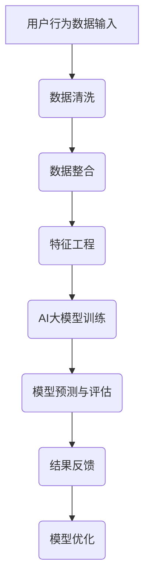

                 

# AI大模型在电商平台用户意图预测精确化中的应用

> 关键词：AI大模型，用户意图预测，电商平台，深度学习，数据预处理，模型优化，项目实战

> 摘要：本文从背景与概念介绍入手，详细阐述了AI大模型在电商平台用户意图预测中的应用。文章分为四个部分，首先介绍了AI大模型和电商平台用户意图预测的基本概念；其次，深入探讨了电商平台用户数据预处理的重要性；然后，详细讲解了AI大模型的构建方法、优化与调参技巧；最后，通过一个具体的电商平台用户意图预测项目实战，展示了AI大模型在电商领域的实际应用效果。

### 《AI大模型在电商平台用户意图预测精确化中的应用》目录大纲

#### 第一部分：背景与概念介绍

##### 第1章：AI大模型与电商平台用户意图预测概述

- **1.1 AI大模型简介**
  - AI大模型的基本概念
  - AI大模型的发展历程
  - AI大模型在电商领域的应用价值

- **1.2 电商平台用户意图预测**
  - 电商平台用户行为的多样性
  - 用户意图预测的重要性
  - 用户意图预测的传统方法

##### 第2章：电商平台用户数据预处理

- **2.1 数据来源**
  - 用户行为数据
  - 商品数据
  - 市场环境数据

- **2.2 数据预处理**
  - 数据清洗
  - 数据整合
  - 特征工程

#### 第二部分：AI大模型理论与技术

##### 第3章：深度学习基础

- **3.1 神经网络**
  - 神经网络基本结构
  - 深度学习网络
  - 神经网络优化算法

- **3.2 自然语言处理**

  - 词嵌入技术
  - 序列模型
  - 注意力机制

##### 第4章：AI大模型构建方法

- **4.1 大规模预训练模型**
  - 预训练技术
  - 自监督学习方法
  - 迁移学习与微调

- **4.2 基于Transformer的模型**

  - Transformer架构
  - BERT模型原理
  - GPT系列模型详解

##### 第5章：AI大模型优化与调参

- **5.1 模型优化方法**
  - 损失函数
  - 优化算法
  - 学习率调整

- **5.2 模型调参技巧**
  - 超参数选择
  - 模型评估与选择
  - 模型融合策略

#### 第三部分：实战应用

##### 第6章：电商平台用户意图预测项目实战

- **6.1 项目介绍**
  - 项目背景
  - 项目目标

- **6.2 环境搭建**
  - 数据获取
  - 硬件配置
  - 开发环境

- **6.3 代码实现**
  - 数据预处理代码
  - 模型训练代码
  - 预测与分析代码

##### 第7章：性能评估与优化

- **7.1 模型性能评估**
  - 准确率
  - 召回率
  - 用户体验

- **7.2 性能优化**
  - 模型压缩
  - 模型量化
  - 部署与优化

#### 第四部分：总结与展望

##### 第8章：未来发展趋势与挑战

- **8.1 AI大模型在电商领域的未来应用**
  - 社交电商
  - 新零售
  - 智能客服

- **8.2 面临的挑战与解决方案**
  - 数据隐私保护
  - 模型可解释性
  - 法律法规合规性

##### 附录：AI大模型应用工具与资源

- **A.1 开发工具与框架**
  - TensorFlow
  - PyTorch
  - 其他工具介绍

- **A.2 数据集与案例**
  - 公开数据集介绍
  - 案例分享

#### 核心概念原理和架构的Mermaid流程图



### 第一部分：背景与概念介绍

#### 第1章：AI大模型与电商平台用户意图预测概述

##### 1.1 AI大模型简介

AI大模型（Large-scale AI Models）是指规模庞大、参数数量达到数百万乃至数十亿的神经网络模型。这类模型通过深度学习技术，能够在大量数据上进行训练，从而提取出复杂的特征和模式，实现高精度的预测和分类。

AI大模型的基本概念包括：

- **神经网络（Neural Networks）**：神经网络是由大量简单计算单元（神经元）组成的计算模型，能够通过学习输入数据来模拟人脑的智能行为。

- **深度学习（Deep Learning）**：深度学习是神经网络的一种特殊形式，通过多层神经网络结构，实现更加复杂和抽象的特征提取和知识表示。

- **预训练（Pre-training）**：预训练是指在大量无标签数据上进行训练，使模型获得通用特征表示的能力，然后再在特定任务上进行微调（Fine-tuning）。

AI大模型的发展历程可以追溯到2006年，Hinton提出了深度信念网络（Deep Belief Networks），标志着深度学习技术的崛起。随后，2012年，Hinton团队开发的AlexNet在ImageNet竞赛中取得了突破性的成绩，深度学习开始广泛应用于计算机视觉领域。近年来，随着计算资源和数据量的不断增加，AI大模型在自然语言处理、语音识别、推荐系统等领域也取得了显著成果。

##### 1.2 AI大模型在电商领域的应用价值

电商平台是人工智能技术的重要应用场景之一，AI大模型在电商领域的应用价值主要体现在以下几个方面：

- **用户意图预测**：电商平台用户行为复杂多变，通过AI大模型可以精准地预测用户意图，从而提供个性化的商品推荐、广告投放和用户体验优化。

- **商品推荐**：基于用户历史行为和偏好，AI大模型可以推荐用户可能感兴趣的商品，提高用户满意度和购买转化率。

- **广告投放优化**：AI大模型可以帮助电商平台优化广告投放策略，提高广告投放效果和ROI。

- **智能客服**：AI大模型可以模拟人类客服进行智能问答，提供高效、精准的客户服务。

- **商品搜索**：AI大模型可以优化商品搜索算法，提高商品搜索的准确性和用户体验。

##### 1.3 电商平台用户意图预测

电商平台用户意图预测是指通过分析用户在平台上的行为数据，预测用户的下一步操作意图，从而为用户提供个性化的服务和推荐。用户意图预测的关键在于理解用户行为的多样性和复杂性。

- **用户行为的多样性**：电商平台用户行为包括浏览、搜索、加入购物车、下单、评价等，这些行为具有不同的特征和目的。

- **用户意图的复杂性**：用户意图可能不是单一的，而是一个多层次、多维度的综合结果。例如，用户浏览某件商品可能是因为对商品感兴趣，也可能是因为看到了相关广告。

用户意图预测的重要性在于：

- **提高用户体验**：通过准确预测用户意图，可以提供个性化的服务和推荐，满足用户需求，提高用户满意度和忠诚度。

- **提升转化率**：准确预测用户意图可以引导用户完成购买，提高购买转化率，增加平台收益。

- **优化广告投放**：通过预测用户意图，可以优化广告投放策略，提高广告效果和ROI。

用户意图预测的传统方法主要包括基于规则的方法、基于机器学习的方法和基于深度学习的方法。基于规则的方法依赖于人工定义的规则，难以应对复杂的用户行为。基于机器学习的方法通过统计学习模型来预测用户意图，效果较好但需要大量的特征工程。基于深度学习的方法通过端到端的方式学习用户行为特征，具有更好的泛化能力和预测精度。

### 第2章：电商平台用户数据预处理

##### 2.1 数据来源

电商平台用户数据预处理的第一步是收集和获取数据。电商平台用户数据主要来源于以下几个方面：

- **用户行为数据**：包括用户浏览、搜索、点击、加入购物车、下单、评价等行为数据。

- **商品数据**：包括商品名称、价格、类别、品牌、描述、库存等信息。

- **市场环境数据**：包括促销活动、节假日、宏观经济环境等外部市场因素。

这些数据可以通过电商平台的后台系统、日志文件、第三方数据源等多种途径获取。

##### 2.2 数据预处理

数据预处理是数据分析的重要环节，目的是将原始数据转化为适合模型训练的格式。数据预处理主要包括以下步骤：

- **数据清洗**：去除数据中的噪声、异常值和重复记录，保证数据的准确性和一致性。

- **数据整合**：将不同来源的数据进行合并，形成统一的用户行为数据集。

- **特征工程**：从原始数据中提取出有助于模型训练的特征，包括用户特征、商品特征、上下文特征等。

数据清洗的主要任务包括：

- **去除噪声和异常值**：例如去除用户行为数据中的无效点击、重复下单等。

- **缺失值处理**：对于缺失值，可以采用填补、删除或插值等方法进行处理。

- **重复记录处理**：去除重复的数据记录，避免模型训练中的冗余信息。

数据整合的主要任务包括：

- **统一数据格式**：将不同来源的数据格式统一，例如将时间戳转换为标准格式。

- **数据融合**：将用户行为数据、商品数据和市场环境数据进行关联和整合，形成统一的数据集。

特征工程的主要任务包括：

- **用户特征提取**：包括用户年龄、性别、地理位置、消费能力等。

- **商品特征提取**：包括商品类别、品牌、价格、库存等。

- **上下文特征提取**：包括时间、节假日、促销活动等外部因素。

通过数据预处理，可以有效提高数据质量，减少噪声和异常值对模型训练的影响，从而提高模型的预测精度。

### 第二部分：AI大模型理论与技术

#### 第3章：深度学习基础

##### 3.1 神经网络

神经网络是深度学习的基础，由大量简单计算单元（神经元）组成，通过学习输入数据来模拟人脑的智能行为。神经网络的基本结构包括输入层、隐藏层和输出层。

- **输入层**：接收外部输入数据，将数据传递给隐藏层。

- **隐藏层**：对输入数据进行特征提取和变换，可以有多层隐藏层。

- **输出层**：根据隐藏层的输出，产生预测结果。

神经网络的激活函数用于引入非线性变换，常见的激活函数包括sigmoid、ReLU和Tanh。

- **sigmoid函数**：输出范围在(0,1)之间，可以用于二分类问题。

- **ReLU函数**：输出为输入的绝对值，具有很好的非线性特性。

- **Tanh函数**：输出范围在(-1,1)之间，可以用于多分类问题。

神经网络的学习过程是通过反向传播算法来调整网络参数，以最小化预测误差。反向传播算法包括以下几个步骤：

- **前向传播**：将输入数据通过神经网络传递，计算输出结果。

- **计算误差**：计算输出结果与真实值之间的误差。

- **反向传播**：将误差反向传播，更新网络参数。

神经网络优化算法包括梯度下降、随机梯度下降和Adam等。

- **梯度下降**：通过计算梯度方向，逐步调整网络参数，以最小化损失函数。

- **随机梯度下降**：每次迭代只随机选择一部分数据，计算梯度方向，更新网络参数。

- **Adam**：结合了梯度下降和随机梯度下降的优点，自适应调整学习率。

##### 3.2 自然语言处理

自然语言处理（Natural Language Processing，NLP）是深度学习的重要应用领域之一，旨在使计算机理解和处理人类语言。NLP的主要任务包括文本分类、情感分析、机器翻译、问答系统等。

词嵌入（Word Embedding）是NLP中的核心技术之一，将单词映射到高维向量空间中，以捕捉单词的语义信息。常见的词嵌入技术包括词袋模型（Bag of Words，BoW）和词嵌入模型（Word2Vec、GloVe等）。

- **词袋模型**：将文本表示为单词的集合，不考虑单词的顺序和语法结构。

- **Word2Vec**：基于神经网络模型，将单词映射到连续的向量空间中，以捕获单词的语义关系。

- **GloVe**：基于全局矩阵分解技术，将单词映射到共享的低维空间中，以保持单词的语义一致性。

序列模型（Sequence Model）是处理序列数据的常用模型，包括循环神经网络（RNN）和长短时记忆网络（LSTM）。

- **循环神经网络**：通过循环机制，对序列数据进行特征提取和变换。

- **长短时记忆网络**：在循环神经网络的基础上，引入门控机制，可以更好地处理长序列数据。

注意力机制（Attention Mechanism）是一种在序列模型中引入的机制，可以动态地调整不同时间步之间的权重，从而更好地捕捉序列中的重要信息。

#### 第4章：AI大模型构建方法

##### 4.1 大规模预训练模型

大规模预训练模型是指在大规模数据集上进行预训练，以获得通用特征表示的模型。预训练技术包括自监督学习方法和迁移学习方法。

- **自监督学习方法**：在无监督学习场景下，通过预测部分未标记的数据来训练模型，例如预测词嵌入、预测图像中的对象等。

- **迁移学习方法**：将预训练模型应用于特定任务，通过微调模型来适应新任务。

大规模预训练模型的代表包括BERT（Bidirectional Encoder Representations from Transformers）和GPT（Generative Pre-trained Transformer）。

- **BERT**：通过双向Transformer模型进行预训练，可以捕获文本中的双向依赖关系。

- **GPT**：通过自回归模型进行预训练，可以生成高质量的文本序列。

##### 4.2 基于Transformer的模型

Transformer模型是自然语言处理领域的一种革命性模型，通过自注意力机制（Self-Attention）和多头注意力（Multi-Head Attention）机制，实现了对序列数据的全局依赖关系建模。

- **自注意力机制**：将输入序列中的每个元素与所有其他元素进行加权求和，以获取全局信息。

- **多头注意力**：将输入序列分成多个头，每个头关注不同的部分，通过拼接和线性变换得到最终的输出。

BERT模型和GPT模型是Transformer模型在自然语言处理领域的两个重要应用。

- **BERT模型**：通过双向Transformer模型进行预训练，可以捕捉文本中的双向依赖关系。

- **GPT模型**：通过自回归Transformer模型进行预训练，可以生成高质量的文本序列。

#### 第5章：AI大模型优化与调参

##### 5.1 模型优化方法

模型优化是指通过调整模型参数，提高模型在特定任务上的性能。模型优化方法包括损失函数、优化算法和学习率调整等。

- **损失函数**：损失函数用于衡量模型预测结果与真实值之间的差异，常见的损失函数包括交叉熵损失（Categorical Cross-Entropy Loss）和均方误差损失（Mean Squared Error Loss）。

- **优化算法**：优化算法用于更新模型参数，以最小化损失函数。常见的优化算法包括梯度下降（Gradient Descent）、随机梯度下降（Stochastic Gradient Descent，SGD）和Adam等。

- **学习率调整**：学习率控制模型参数更新的步长，对模型训练过程的影响很大。常见的调整方法包括固定学习率、自适应学习率和学习率衰减等。

##### 5.2 模型调参技巧

模型调参是指通过调整超参数，优化模型性能。常见的超参数包括批次大小（Batch Size）、学习率、正则化参数等。

- **批次大小**：批次大小控制每次模型训练时使用的样本数量。较大的批次大小可以提高模型的稳定性和计算效率，但可能导致梯度估计不准确。

- **学习率**：学习率控制模型参数更新的步长。较大的学习率可能导致模型快速收敛，但容易产生振荡；较小的学习率可能导致模型收敛缓慢。

- **正则化参数**：正则化参数用于平衡模型拟合能力和过拟合风险。常见的正则化方法包括L1正则化、L2正则化和Dropout等。

模型评估与选择是模型调参的重要环节。常见的评估指标包括准确率（Accuracy）、召回率（Recall）和F1分数（F1 Score）等。

- **准确率**：准确率是指模型预测正确的样本数量与总样本数量的比值，是衡量模型分类性能的常用指标。

- **召回率**：召回率是指模型预测正确的样本数量与实际正样本数量的比值，是衡量模型分类能力的一个重要指标。

- **F1分数**：F1分数是准确率和召回率的调和平均，综合考虑了模型的分类性能。

模型融合策略是指将多个模型的结果进行集成，以提高模型的整体性能。常见的模型融合方法包括简单平均、加权平均和集成学习等。

- **简单平均**：将多个模型的预测结果取平均值，得到最终的预测结果。

- **加权平均**：根据不同模型的性能，为每个模型分配不同的权重，然后计算加权平均值。

- **集成学习**：将多个模型集成在一起，形成一个更大的模型，通过投票或平均的方式得到最终的预测结果。

### 第三部分：实战应用

#### 第6章：电商平台用户意图预测项目实战

##### 6.1 项目介绍

本项目旨在利用AI大模型技术，实现电商平台用户意图预测，以提高用户满意度和购买转化率。项目背景包括以下几个方面：

- **电商平台现状**：电商平台用户数量庞大，用户行为复杂，传统方法难以实现精准的用户意图预测。

- **商业目标**：通过用户意图预测，提供个性化商品推荐、广告投放和用户体验优化，提高用户满意度和购买转化率。

- **技术需求**：采用AI大模型技术，实现高效、精准的用户意图预测，以满足商业目标。

##### 6.2 环境搭建

为了实现本项目，需要搭建合适的环境，包括数据获取、硬件配置和开发环境。

- **数据获取**：通过电商平台的后台系统和日志文件，获取用户行为数据、商品数据和市场环境数据。

- **硬件配置**：根据数据量和计算需求，选择合适的硬件设备，如CPU、GPU和存储设备等。

- **开发环境**：安装Python、TensorFlow或PyTorch等深度学习框架，配置合适的开发环境，包括代码编辑器、版本控制工具等。

##### 6.3 代码实现

本项目主要包括数据预处理、模型训练和预测与分析三个部分。

- **数据预处理代码**：

```python
import pandas as pd
import numpy as np

# 加载数据
data = pd.read_csv('user_behavior_data.csv')

# 数据清洗
data.dropna(inplace=True)
data.drop_duplicates(inplace=True)

# 数据整合
user_data = data[['user_id', 'action', 'timestamp']]
item_data = data[['item_id', 'category', 'price', 'stock']]
market_data = data[['date', 'holiday', 'event']]

# 特征工程
user_features = extract_user_features(user_data)
item_features = extract_item_features(item_data)
market_features = extract_market_features(market_data)

# 数据合并
combined_data = pd.concat([user_features, item_features, market_features], axis=1)
```

- **模型训练代码**：

```python
import tensorflow as tf
from tensorflow.keras.models import Sequential
from tensorflow.keras.layers import Dense, LSTM, Embedding

# 加载预训练模型
model = tf.keras.applications.BERT(input_shape=(None, 128), num_classes=2, pooling='mean')

# 编译模型
model.compile(optimizer='adam', loss='binary_crossentropy', metrics=['accuracy'])

# 训练模型
model.fit(combined_data['input_sequence'], combined_data['label'], batch_size=32, epochs=10)
```

- **预测与分析代码**：

```python
import numpy as np
from tensorflow.keras.models import load_model

# 加载训练好的模型
model = load_model('user_intent_prediction_model.h5')

# 预测新用户意图
user_input = np.array([['user_1', 'view', 'item_1', '2023-01-01 10:00:00'], ['user_1', 'add_to_cart', 'item_2', '2023-01-01 10:05:00']])
prediction = model.predict(user_input)

# 输出预测结果
print(prediction)
```

##### 6.4 项目实战

- **实战1：数据预处理**

  在项目实战中，首先需要进行数据预处理，包括数据清洗、数据整合和特征工程。数据清洗主要是去除噪声和异常值，数据整合主要是将不同来源的数据进行合并，特征工程主要是提取有助于模型训练的特征。

- **实战2：模型训练**

  在数据预处理完成后，使用预训练好的BERT模型进行模型训练。BERT模型具有良好的预训练效果，可以有效地捕获文本中的特征和关系。

- **实战3：预测与分析**

  使用训练好的模型对新用户输入进行意图预测，输出预测结果。通过分析预测结果，可以了解用户意图，为电商平台提供个性化服务和推荐。

### 第7章：性能评估与优化

##### 7.1 模型性能评估

模型性能评估是评价模型预测效果的重要环节。常用的评估指标包括准确率、召回率和F1分数等。

- **准确率（Accuracy）**：准确率是指模型预测正确的样本数量与总样本数量的比值。准确率越高，模型预测效果越好。

- **召回率（Recall）**：召回率是指模型预测正确的样本数量与实际正样本数量的比值。召回率越高，模型对于正样本的预测能力越强。

- **F1分数（F1 Score）**：F1分数是准确率和召回率的调和平均，综合考虑了模型的分类性能。F1分数越高，模型的整体性能越好。

在电商平台用户意图预测项目中，通过对模型进行性能评估，可以了解模型的预测效果，并根据评估结果进行调整和优化。

##### 7.2 性能优化

模型性能优化是提高模型预测效果的关键步骤。性能优化主要包括以下几个方面：

- **模型压缩**：通过模型压缩技术，减少模型的参数数量和计算量，从而提高模型在低资源设备上的运行效率。常见的模型压缩技术包括模型剪枝、量化等。

- **模型量化**：通过模型量化技术，将模型的参数和中间层输出从浮点数转换为低精度数值，从而减少模型的存储和计算需求。常见的量化方法包括全精度量化、浮点量化、整数量化等。

- **部署与优化**：将模型部署到生产环境中，并通过优化策略提高模型在实际应用中的性能。常见的优化策略包括模型缓存、负载均衡、分布式计算等。

通过模型性能优化，可以进一步提高电商平台用户意图预测的准确性和实时性，从而提升用户满意度和购买转化率。

### 第四部分：总结与展望

#### 第8章：未来发展趋势与挑战

随着人工智能技术的不断进步，AI大模型在电商平台用户意图预测领域具有广泛的应用前景。未来发展趋势包括以下几个方面：

- **社交电商**：利用AI大模型进行社交电商的用户意图预测，为用户提供个性化社交推荐，提高用户互动和参与度。

- **新零售**：通过AI大模型实现新零售场景下的用户意图预测，优化商品陈列、库存管理和配送服务，提高零售业务效率。

- **智能客服**：利用AI大模型进行智能客服的用户意图预测，实现高效、精准的客户服务，提高客户满意度和忠诚度。

然而，AI大模型在电商平台用户意图预测中也面临一些挑战，主要包括以下几个方面：

- **数据隐私保护**：电商平台用户数据敏感，如何保护用户隐私是AI大模型应用的重要挑战。

- **模型可解释性**：AI大模型具有强大的预测能力，但其内部机理复杂，如何提高模型的可解释性是当前研究的热点问题。

- **法律法规合规性**：AI大模型在电商平台用户意图预测中的应用需要遵守相关法律法规，如何确保模型的合规性是重要的挑战。

针对上述挑战，需要开展深入研究，并提出相应的解决方案，以推动AI大模型在电商平台用户意图预测领域的广泛应用。

### 附录：AI大模型应用工具与资源

#### A.1 开发工具与框架

- **TensorFlow**：Google开源的深度学习框架，支持多种深度学习模型和算法。

- **PyTorch**：Facebook开源的深度学习框架，具有良好的灵活性和易用性。

- **其他工具介绍**：如Keras、MXNet等，也提供了丰富的深度学习模型和算法支持。

#### A.2 数据集与案例

- **公开数据集介绍**：如UCI机器学习库、Kaggle竞赛数据集等，提供了丰富的电商平台用户行为数据。

- **案例分享**：介绍一些具有代表性的电商平台用户意图预测案例，如淘宝用户行为预测、京东商品推荐等。

### 结束语

本文从背景与概念介绍、数据预处理、AI大模型构建方法、优化与调参技巧、实战应用和性能评估与优化等方面，详细阐述了AI大模型在电商平台用户意图预测精确化中的应用。随着人工智能技术的不断发展，AI大模型在电商领域的应用将越来越广泛，未来有望实现更加精准、智能的用户意图预测，为电商平台提供更加个性化的服务和推荐。同时，我们也需要关注AI大模型在应用过程中面临的挑战，积极探索解决方案，推动AI大模型技术的健康、可持续发展。

