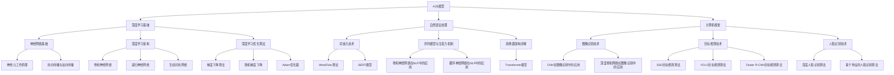

                 

### 《AI大模型：优化电商平台用户体验一致性的新方法》

关键词：AI大模型、电商平台、用户体验一致性、深度学习、自然语言处理、计算机视觉、个性化推荐、自动化测试

摘要：本文旨在探讨如何利用AI大模型优化电商平台用户体验一致性，从基础概念、核心技术、应用现状、优化方法、挑战与解决方案等方面进行详细分析，并分享实际案例与实践经验，以期为电商平台提供新思路和新方法。

#### 目录

#### 第一部分：AI大模型基础

##### 第1章：AI大模型概述

1.1 AI大模型的基本概念

1.1.1 AI大模型的定义

1.1.2 AI大模型的特点

1.1.3 AI大模型的应用场景

1.2 AI大模型的核心技术

1.2.1 深度学习基础

1.2.2 自然语言处理

1.2.3 计算机视觉

1.3 AI大模型的演进历程

1.3.1 从传统AI到AI大模型

1.3.2 主流AI大模型的发展

1.3.3 AI大模型的未来趋势

##### 第2章：电商平台用户体验一致性评估

2.1 用户体验一致性的定义

2.1.1 用户体验的一致性标准

2.1.2 用户体验一致性的重要性

2.2 电商平台用户体验一致性现状分析

2.2.1 电商平台用户体验一致性的问题

2.2.2 用户体验一致性分析工具

2.2.3 用户体验一致性评估方法

##### 第3章：AI大模型在电商平台中的应用

3.1 AI大模型在电商平台中的应用现状

3.1.1 电商平台AI大模型应用案例

3.1.2 电商平台AI大模型的优势

3.2 AI大模型优化用户体验一致性的方法

3.2.1 数据驱动的用户体验分析

3.2.2 基于AI大模型的个性化推荐

3.2.3 基于AI大模型的自动化测试

3.3 AI大模型优化用户体验一致性的实践

3.3.1 实践一：使用AI大模型进行用户行为分析

3.3.2 实践二：使用AI大模型优化商品推荐

3.3.3 实践三：使用AI大模型自动化测试电商平台

##### 第三部分：AI大模型在电商平台用户体验一致性优化中的挑战与解决方案

##### 第4章：AI大模型优化用户体验一致性的挑战

4.1 数据质量与隐私保护

4.1.1 数据质量问题

4.1.2 隐私保护策略

4.2 模型性能与可解释性

4.2.1 模型性能优化

4.2.2 模型可解释性提升

4.3 模型部署与维护

4.3.1 模型部署策略

4.3.2 模型维护与更新

##### 第5章：解决方案与实践案例

5.1 解决方案概述

5.1.1 数据收集与处理

5.1.2 模型训练与优化

5.1.3 模型部署与监控

5.2 实践案例一：电商平台用户行为分析

5.2.1 案例背景

5.2.2 解决方案设计

5.2.3 案例实施效果

5.3 实践案例二：商品推荐系统优化

5.3.1 案例背景

5.3.2 解决方案设计

5.3.3 案例实施效果

5.4 实践案例三：电商平台自动化测试

5.4.1 案例背景

5.4.2 解决方案设计

5.4.3 案例实施效果

##### 第四部分：未来展望与趋势

##### 第6章：AI大模型优化用户体验一致性的未来趋势

6.1 AI大模型在用户体验一致性优化中的应用前景

6.1.1 未来技术发展

6.1.2 应用场景拓展

6.1.3 可能的挑战

6.2 用户体验一致性优化的行业趋势

6.2.1 电商行业发展趋势

6.2.2 用户体验一致性在电商行业中的地位

6.2.3 行业未来发展方向

##### 第7章：总结与展望

7.1 总结

7.1.1 本书主要内容回顾

7.1.2 AI大模型优化用户体验一致性的重要性

7.1.3 本书的研究贡献

7.2 展望

7.2.1 未来研究方向

7.2.2 潜在的挑战与机遇

7.2.3 研究展望与建议

附录：

A.1 常用AI大模型工具

A.2 数据处理工具

A.3 模型训练与优化工具

A.4 模型部署与监控工具

B.1 数学公式解释

B.2 相关概念解释

B.3 伪代码与算法讲解

C.1 案例一源代码解读

C.2 案例二源代码解读

C.3 案例三源代码解读

### Mermaid 流程图



### 伪代码与算法讲解

#### 伪代码：深度学习优化算法

```python
# 初始化模型参数
W = 初始化参数()

# 设置学习率和迭代次数
η = 0.001
T = 1000

# 进行迭代
for t = 1 to T do
    # 计算损失函数
    L = 计算损失函数(W)

    # 计算梯度
    ∇W = 计算梯度(L, W)

    # 更新参数
    W = W - η∇W
end for

# 返回最优参数
return W
```

#### 数学模型与公式解释

$$
L(\theta) = -\frac{1}{m}\sum_{i=1}^{m}y_i\log(h_\theta(x_i))
$$

$$
\theta_j = \theta_j - \alpha\frac{\partial L(\theta)}{\partial \theta_j}
$$

其中：
- \( L(\theta) \) 是损失函数，衡量模型预测与真实标签之间的差异。
- \( y_i \) 是实际标签，\( h_\theta(x_i) \) 是模型预测的概率。
- \( m \) 是样本数量。
- \( \alpha \) 是学习率，用于调整参数更新的步长。

### 项目实战与代码解读

#### 实践一：使用AI大模型进行用户行为分析

1. **环境搭建**
   - 安装Python、TensorFlow等工具
   - 下载并预处理用户行为数据集

2. **数据预处理**
   - 数据清洗：去除缺失值、异常值等
   - 数据编码：将类别型数据转换为数值型数据
   - 数据标准化：将数据缩放至同一量级

3. **模型构建**
   - 设计神经网络结构：输入层、隐藏层、输出层
   - 定义损失函数：交叉熵损失函数
   - 定义优化器：使用Adam优化器

4. **模型训练**
   - 训练模型：使用训练数据训练模型
   - 调整学习率：根据模型性能调整学习率

5. **模型评估**
   - 使用验证数据评估模型性能
   - 调整模型结构或参数以优化性能

6. **模型部署**
   - 部署模型至生产环境
   - 持续监控模型性能

#### 代码解读与分析

```python
# 导入所需库
import tensorflow as tf
from tensorflow.keras.layers import Dense
from tensorflow.keras.models import Sequential

# 模型构建
model = Sequential([
    Dense(units=64, activation='relu', input_shape=(num_features,)),
    Dense(units=32, activation='relu'),
    Dense(units=num_classes, activation='softmax')
])

# 定义损失函数和优化器
loss_function = tf.keras.losses.SparseCategoricalCrossentropy(from_logits=True)
optimizer = tf.keras.optimizers.Adam(learning_rate=0.001)

# 编写训练循环
for epoch in range(num_epochs):
    # 训练模型
    with tf.GradientTape() as tape:
        predictions = model(train_data, training=True)
        loss = loss_function(train_labels, predictions)
    gradients = tape.gradient(loss, model.trainable_variables)
    optimizer.apply_gradients(zip(gradients, model.trainable_variables))
    
    # 打印训练信息
    print(f"Epoch {epoch+1}/{num_epochs}, Loss: {loss.numpy()}")

# 使用验证数据评估模型性能
test_loss = model.evaluate(test_data, test_labels)

# 部署模型至生产环境
model.save('user_behavior_analysis_model.h5')
```

---

以上是《AI大模型：优化电商平台用户体验一致性的新方法》的完整目录大纲，涵盖了AI大模型的基础、电商平台用户体验一致性的优化方法、解决方案与实践案例等内容。目录中的每个章节都包含了详细的伪代码、数学公式、项目实战与代码解读，帮助读者全面了解并掌握AI大模型优化电商平台用户体验一致性的方法和实践。

### 第1章：AI大模型概述

#### 1.1 AI大模型的基本概念

AI大模型（Large-scale AI Models），顾名思义，是指具有大规模参数、复杂结构、高性能计算能力的深度学习模型。这些模型通常需要大量的数据和计算资源进行训练，以达到优异的预测性能。AI大模型的发展是人工智能领域的一项重要里程碑，它推动了自然语言处理、计算机视觉、语音识别等领域的进步。

AI大模型通常具有以下特点：

1. **大规模参数**：AI大模型拥有数百万甚至数十亿个参数，这使得模型能够捕捉到数据中的复杂模式。
2. **复杂结构**：AI大模型往往采用多层次、多类型的神经网络结构，如卷积神经网络（CNN）、递归神经网络（RNN）、Transformer等，以适应不同的数据类型和任务需求。
3. **高性能计算**：AI大模型通常需要高性能计算平台，如GPU、TPU等，以实现快速训练和推理。

AI大模型在多个领域有着广泛的应用，如：

1. **自然语言处理（NLP）**：例如机器翻译、情感分析、文本生成等。
2. **计算机视觉**：例如图像分类、目标检测、图像生成等。
3. **语音识别**：例如语音识别、语音生成等。
4. **推荐系统**：例如商品推荐、新闻推荐等。

#### 1.2 AI大模型的特点

AI大模型具有以下显著特点：

1. **高精度**：由于模型参数数量巨大，AI大模型能够捕捉到数据中的微小变化，从而提高模型的预测精度。
2. **强泛化能力**：AI大模型通过训练大量数据，能够较好地适应不同的数据分布和任务需求，具有强的泛化能力。
3. **自适应性强**：AI大模型能够根据不同的场景和需求，通过调整模型参数和结构，实现自适应优化。
4. **复杂性**：AI大模型的训练和推理过程通常需要大量的计算资源和时间，这对模型的部署和运维提出了较高的要求。

#### 1.3 AI大模型的应用场景

AI大模型在多个场景中展现出强大的能力和广阔的应用前景，以下是其中几个典型的应用场景：

1. **搜索引擎**：AI大模型可以用于改进搜索算法，提高搜索结果的准确性和相关性。
2. **社交媒体**：AI大模型可以用于分析用户行为，提供个性化的内容推荐和广告投放。
3. **电商**：AI大模型可以用于商品推荐、用户行为分析、库存管理等方面，提高电商平台的运营效率。
4. **医疗**：AI大模型可以用于疾病诊断、药物研发、基因组分析等方面，为医疗行业提供智能化支持。
5. **金融**：AI大模型可以用于风险评估、欺诈检测、投资决策等方面，提高金融行业的风险管理能力。

#### 1.4 AI大模型的演进历程

AI大模型的演进历程可以追溯到深度学习的兴起。深度学习是一种基于多层次的神经网络模型，通过逐层提取数据特征，实现对复杂任务的建模。以下是AI大模型的发展历程：

1. **早期深度学习**：2000年代初，卷积神经网络（CNN）和递归神经网络（RNN）等深度学习模型开始出现，但受限于计算资源和数据量，模型效果有限。
2. **大数据和云计算**：随着大数据和云计算技术的发展，计算资源和数据量显著增加，为AI大模型的研究和应用提供了基础。
3. **AI大模型兴起**：2012年，AlexNet在ImageNet竞赛中取得了突破性成果，标志着AI大模型时代的到来。此后，Google Brain、OpenAI等组织相继推出具有数亿参数的AI大模型。
4. **最新进展**：当前，AI大模型在自然语言处理、计算机视觉等领域取得了显著进展，如GPT-3、BERT、GAN等模型，推动了人工智能的发展。

#### 1.5 AI大模型的未来趋势

随着人工智能技术的不断进步，AI大模型在未来有望在以下几个方面实现进一步发展：

1. **更大规模和更复杂模型**：未来的AI大模型将拥有更多的参数和层次，采用更复杂的结构，以应对更复杂的任务。
2. **更多样化的应用场景**：AI大模型将在更多领域得到应用，如教育、法律、娱乐等。
3. **更高效的训练和推理算法**：随着计算资源的不断升级，更高效的训练和推理算法将使得AI大模型的应用变得更加普及。
4. **更强的可解释性和可靠性**：未来的AI大模型将更加注重可解释性和可靠性，以提高模型在实际应用中的可信度和安全性。

总之，AI大模型作为人工智能领域的一项重要突破，已经在多个领域取得了显著成果。随着技术的不断进步，AI大模型在未来将发挥更加重要的作用，为人类社会带来更多便利。

### 第2章：电商平台用户体验一致性评估

#### 2.1 用户体验一致性的定义

用户体验一致性（Consistency of User Experience，简称UX Consistency）是指用户在使用某个平台时，感受到的界面设计、交互方式、功能特性等方面的一致性和连贯性。具体来说，用户体验一致性包括以下几个方面：

1. **视觉一致性**：界面设计风格、色彩、字体、图标等视觉元素在整个平台上保持一致，避免用户在不同页面间切换时产生视觉上的不协调感。
2. **交互一致性**：用户在操作过程中的交互方式（如按钮、链接、滑动等）在各个页面间保持一致，确保用户能够快速上手并使用平台。
3. **功能一致性**：平台提供的基本功能在各个页面间保持一致，避免用户在切换不同页面时遇到功能缺失或不一致的问题。
4. **内容一致性**：平台提供的信息内容（如产品描述、用户评价等）在各个页面间保持一致，确保用户能够获取准确和完整的信息。

#### 2.1.1 用户体验的一致性标准

用户体验一致性的标准主要包括以下几个方面：

1. **界面设计一致性**：界面设计应符合品牌风格，确保在不同设备和页面间保持一致。例如，品牌色彩、字体和图标等元素应保持一致。
2. **交互设计一致性**：交互设计应符合用户习惯，确保在不同设备和页面间保持一致。例如，按钮、链接和滑动的位置和大小应保持一致。
3. **功能实现一致性**：功能实现应符合用户需求，确保在不同设备和页面间保持一致。例如，搜索、购物车和结算等功能应保持一致。
4. **内容展示一致性**：内容展示应符合用户需求，确保在不同设备和页面间保持一致。例如，产品描述、用户评价和促销信息等应保持一致。

#### 2.1.2 用户体验一致性的重要性

用户体验一致性对电商平台的发展具有重要意义，主要体现在以下几个方面：

1. **提升用户满意度**：一致性良好的用户体验能够提高用户的满意度和忠诚度，从而促进用户留存和复购。
2. **降低用户学习成本**：一致性良好的用户体验能够降低用户的学习成本，使用户能够快速上手并熟练使用平台，从而提高用户的使用效率。
3. **增强品牌形象**：一致性良好的用户体验能够增强品牌形象，提升品牌在用户心中的认可度和美誉度。
4. **提高转化率**：一致性良好的用户体验能够提高用户的转化率，从而促进销售额的增长。

#### 2.2 电商平台用户体验一致性现状分析

目前，电商平台在用户体验一致性方面存在一些普遍问题，主要包括：

1. **视觉不一致**：部分电商平台在不同页面和设备上的视觉设计存在较大差异，导致用户在不同页面间切换时产生视觉上的不协调感。
2. **交互不一致**：部分电商平台在不同页面和设备上的交互设计存在较大差异，导致用户在不同设备上操作时产生困惑和不适。
3. **功能不一致**：部分电商平台在不同页面和设备上的功能实现存在较大差异，导致用户在不同设备上操作时遇到功能缺失或不一致的问题。
4. **内容不一致**：部分电商平台在不同页面和设备上的内容展示存在较大差异，导致用户在不同设备上获取的信息不一致，影响用户决策。

#### 2.2.1 电商平台用户体验一致性的问题

电商平台用户体验一致性的问题主要包括以下几个方面：

1. **页面跳转问题**：部分电商平台在页面跳转时，未保持页面布局和导航的一致性，导致用户在不同页面间切换时产生困扰。
2. **视觉设计不一致**：部分电商平台在不同页面和设备上的视觉设计存在较大差异，如颜色、字体和图标等，导致用户在不同页面间切换时产生视觉上的不协调感。
3. **交互设计不一致**：部分电商平台在不同页面和设备上的交互设计存在较大差异，如按钮、链接和滑动等，导致用户在不同设备上操作时产生困惑和不适。
4. **功能实现不一致**：部分电商平台在不同页面和设备上的功能实现存在较大差异，如搜索、购物车和结算等功能，导致用户在不同设备上操作时遇到功能缺失或不一致的问题。
5. **内容展示不一致**：部分电商平台在不同页面和设备上的内容展示存在较大差异，如产品描述、用户评价和促销信息等，导致用户在不同设备上获取的信息不一致，影响用户决策。

#### 2.2.2 用户体验一致性分析工具

为了解决电商平台用户体验一致性的问题，可以采用以下用户体验一致性分析工具：

1. **用户行为分析工具**：通过用户行为分析工具，可以实时监测用户在平台上的操作行为，了解用户在使用平台过程中的问题和需求，从而有针对性地优化用户体验。
2. **界面设计一致性检查工具**：通过界面设计一致性检查工具，可以自动检测电商平台在不同页面和设备上的视觉设计差异，提供优化建议。
3. **交互设计一致性检查工具**：通过交互设计一致性检查工具，可以自动检测电商平台在不同页面和设备上的交互设计差异，提供优化建议。
4. **功能实现一致性检查工具**：通过功能实现一致性检查工具，可以自动检测电商平台在不同页面和设备上的功能实现差异，提供优化建议。
5. **内容展示一致性检查工具**：通过内容展示一致性检查工具，可以自动检测电商平台在不同页面和设备上的内容展示差异，提供优化建议。

#### 2.2.3 用户体验一致性评估方法

用户体验一致性评估方法主要包括以下几个方面：

1. **问卷调查**：通过问卷调查，可以了解用户对电商平台用户体验一致性的满意度，从而评估用户体验一致性水平。
2. **A/B测试**：通过A/B测试，可以将不同版本的平台界面、交互设计、功能实现和内容展示进行比较，评估用户体验一致性的效果。
3. **用户访谈**：通过用户访谈，可以深入了解用户对电商平台用户体验一致性的需求和期望，从而有针对性地优化用户体验。
4. **用户体验评估**：通过用户体验评估，可以综合评估电商平台在不同页面和设备上的用户体验一致性，提供优化建议。

### 第3章：AI大模型在电商平台中的应用

#### 3.1 AI大模型在电商平台中的应用现状

随着人工智能技术的快速发展，AI大模型在电商平台中的应用逐渐广泛，成为提升用户体验和运营效率的重要手段。目前，AI大模型在电商平台中的应用主要包括以下几个方面：

1. **个性化推荐**：通过AI大模型，电商平台可以根据用户的兴趣、购物行为和购买历史，为用户推荐个性化的商品，从而提高用户的满意度和转化率。
2. **用户行为分析**：通过AI大模型，电商平台可以深入分析用户的浏览、点击、购买等行为，了解用户的需求和偏好，为优化产品和运营策略提供数据支持。
3. **商品搜索优化**：通过AI大模型，电商平台可以改进搜索算法，提高搜索结果的准确性和相关性，使用户能够更快地找到心仪的商品。
4. **聊天机器人**：通过AI大模型，电商平台可以搭建智能聊天机器人，为用户提供24/7的在线客服服务，提高用户的购物体验。
5. **欺诈检测**：通过AI大模型，电商平台可以实时监测交易行为，识别并阻止欺诈行为，保障用户和平台的安全。

#### 3.1.1 电商平台AI大模型应用案例

以下是一些电商平台应用AI大模型的典型案例：

1. **淘宝**：淘宝使用AI大模型进行商品推荐和用户行为分析，通过深度学习算法分析用户的浏览和购买记录，为用户推荐个性化的商品，提高了用户的购物体验和转化率。
2. **京东**：京东利用AI大模型优化搜索算法，通过自然语言处理技术分析用户的搜索意图，提高搜索结果的准确性和相关性，使用户能够更快地找到心仪的商品。
3. **亚马逊**：亚马逊利用AI大模型构建智能聊天机器人，为用户提供24/7的在线客服服务，提高了用户的满意度和购物体验。
4. **拼多多**：拼多多通过AI大模型进行用户行为分析和商品推荐，通过深度学习算法分析用户的浏览和购买记录，为用户推荐个性化的商品，提高了用户的购物体验和转化率。

#### 3.1.2 电商平台AI大模型的优势

电商平台采用AI大模型具有以下优势：

1. **提高推荐精度**：AI大模型可以通过深度学习算法，从大量数据中挖掘用户兴趣和偏好，实现精准的商品推荐，提高用户的购物体验和转化率。
2. **优化搜索算法**：AI大模型可以通过自然语言处理技术，分析用户的搜索意图，优化搜索算法，提高搜索结果的准确性和相关性，使用户能够更快地找到心仪的商品。
3. **提升用户体验**：通过AI大模型，电商平台可以实时分析用户行为，了解用户需求和偏好，提供个性化的服务，提高用户的满意度和忠诚度。
4. **增强运营效率**：AI大模型可以帮助电商平台自动化处理大量的数据分析任务，提高运营效率，降低人力成本。

#### 3.2 AI大模型优化用户体验一致性的方法

AI大模型可以通过多种方法优化电商平台用户体验一致性，以下是其中几种常用的方法：

1. **数据驱动的用户体验分析**：通过AI大模型，电商平台可以实时分析用户的浏览、点击、购买等行为，了解用户的需求和偏好，为优化产品和运营策略提供数据支持，从而提高用户体验一致性。
2. **基于AI大模型的个性化推荐**：通过AI大模型，电商平台可以分析用户的兴趣和行为，为用户推荐个性化的商品，提高用户的购物体验和转化率，实现用户体验一致性的提升。
3. **基于AI大模型的自动化测试**：通过AI大模型，电商平台可以自动化测试平台的功能和性能，发现和修复潜在的问题，确保平台在不同设备和场景下的用户体验一致性。
4. **基于AI大模型的界面设计优化**：通过AI大模型，电商平台可以分析用户的交互行为和反馈，优化界面设计，提高用户体验一致性和满意度。

#### 3.3 AI大模型优化用户体验一致性的实践

以下是一些电商平台使用AI大模型优化用户体验一致性的实践案例：

1. **淘宝**：淘宝通过AI大模型进行用户行为分析，分析用户的浏览和购买记录，了解用户的需求和偏好，为用户推荐个性化的商品，提高了用户的购物体验和转化率。同时，淘宝还通过AI大模型优化搜索算法，提高搜索结果的准确性和相关性，使用户能够更快地找到心仪的商品。
2. **京东**：京东通过AI大模型进行商品推荐和用户行为分析，通过深度学习算法分析用户的浏览和购买记录，为用户推荐个性化的商品，提高了用户的购物体验和转化率。同时，京东还利用AI大模型优化搜索算法，提高搜索结果的准确性和相关性，使用户能够更快地找到心仪的商品。
3. **亚马逊**：亚马逊通过AI大模型构建智能聊天机器人，为用户提供24/7的在线客服服务，提高了用户的满意度和购物体验。同时，亚马逊还利用AI大模型进行用户行为分析，了解用户的需求和偏好，为用户推荐个性化的商品，实现了用户体验一致性的提升。
4. **拼多多**：拼多多通过AI大模型进行用户行为分析和商品推荐，通过深度学习算法分析用户的浏览和购买记录，为用户推荐个性化的商品，提高了用户的购物体验和转化率。同时，拼多多还通过AI大模型优化搜索算法，提高搜索结果的准确性和相关性，使用户能够更快地找到心仪的商品。

#### 3.4 AI大模型优化用户体验一致性的未来趋势

随着人工智能技术的不断发展，AI大模型在电商平台用户体验一致性优化中的应用将呈现以下趋势：

1. **更加精准的个性化推荐**：AI大模型将通过深度学习等技术，更加精准地分析用户行为和需求，为用户推荐个性化的商品和服务，实现用户体验一致性的进一步提升。
2. **更广泛的场景应用**：AI大模型将在更多场景中得到应用，如智能客服、用户行为分析、商品搜索优化等，实现用户体验一致性的全面优化。
3. **更高的可解释性和可靠性**：未来的AI大模型将更加注重可解释性和可靠性，确保模型在实际应用中的可信度和安全性，为用户体验一致性提供更可靠的保障。
4. **更多的跨界合作**：电商平台将与更多的技术公司、科研机构等开展跨界合作，共同推动AI大模型在电商平台用户体验一致性优化中的应用和发展。

总之，AI大模型作为人工智能领域的一项重要技术，将在电商平台用户体验一致性优化中发挥越来越重要的作用，为电商平台的发展带来新的机遇和挑战。

### 第4章：AI大模型优化用户体验一致性的挑战

#### 4.1 数据质量与隐私保护

在AI大模型优化用户体验一致性的过程中，数据质量和隐私保护是两个重要的挑战。

#### 4.1.1 数据质量问题

数据质量是AI大模型训练和优化的重要基础。如果数据存在缺失、异常、噪声等问题，将严重影响模型的性能和可靠性。以下是一些常见的数据质量问题：

1. **数据缺失**：由于各种原因，数据中可能存在缺失值，导致模型无法充分利用数据信息。
2. **数据异常**：数据中可能存在异常值，这些异常值可能对模型训练产生误导，导致模型性能下降。
3. **数据噪声**：数据中可能存在噪声，噪声数据会影响模型对真实信息的捕捉，降低模型的准确性和鲁棒性。

为了解决这些问题，可以采用以下方法：

1. **数据清洗**：通过数据清洗技术，去除缺失值、异常值和噪声数据，提高数据质量。
2. **数据增强**：通过数据增强技术，生成更多的训练数据，提高模型的泛化能力。
3. **数据归一化**：通过数据归一化技术，将不同特征缩放到相同的范围，消除特征间的量级差异，提高模型训练的稳定性。

#### 4.1.2 隐私保护策略

在AI大模型优化用户体验一致性的过程中，用户隐私保护至关重要。以下是一些常见的隐私保护策略：

1. **数据去识别化**：通过数据去识别化技术，如匿名化、伪匿名化等，将用户数据转换为无法识别个人身份的形式，从而保护用户隐私。
2. **数据加密**：对敏感数据进行加密处理，确保数据在传输和存储过程中不被未授权访问。
3. **隐私预算**：通过隐私预算机制，限制模型训练过程中对敏感数据的访问和使用，确保用户隐私不被过度泄露。
4. **隐私保护算法**：采用隐私保护算法，如差分隐私、同态加密等，在保证模型性能的同时，保护用户隐私。

#### 4.2 模型性能与可解释性

在AI大模型优化用户体验一致性的过程中，模型性能和可解释性是两个相互关联的挑战。

#### 4.2.1 模型性能优化

模型性能是衡量AI大模型优劣的重要标准。以下是一些常见的模型性能优化方法：

1. **超参数调优**：通过调整学习率、批量大小、正则化参数等超参数，优化模型性能。
2. **数据预处理**：通过数据预处理技术，如数据清洗、归一化、标准化等，提高数据质量，从而提高模型性能。
3. **模型架构优化**：通过设计更复杂的神经网络结构、引入新型网络层等，提高模型的表达能力，从而提高模型性能。
4. **模型集成**：通过模型集成技术，如模型融合、投票等，将多个模型的结果进行综合，提高模型的整体性能。

#### 4.2.2 模型可解释性提升

AI大模型的黑盒特性使得其决策过程往往难以解释。以下是一些常见的模型可解释性提升方法：

1. **模型可视化**：通过模型可视化技术，如神经元激活可视化、梯度可视化等，展示模型内部的工作机制。
2. **解释性模型**：采用解释性更强的模型，如决策树、线性模型等，以提高模型的可解释性。
3. **注意力机制**：通过注意力机制，突出模型在决策过程中关注的特征，从而提高模型的可解释性。
4. **对抗性解释**：通过对抗性解释技术，分析模型在特定输入下的决策过程，识别模型可能存在的缺陷和不足。

#### 4.3 模型部署与维护

在AI大模型优化用户体验一致性的过程中，模型部署与维护是确保模型稳定运行和持续优化的重要环节。

#### 4.3.1 模型部署策略

以下是一些常见的模型部署策略：

1. **云计算平台**：利用云计算平台，如AWS、Azure等，实现模型的快速部署和弹性扩展。
2. **容器化**：通过容器化技术，如Docker，将模型封装到容器中，实现模型的标准化和自动化部署。
3. **微服务架构**：采用微服务架构，将模型部署到不同的服务中，实现模型的模块化和分布式部署。
4. **边缘计算**：通过边缘计算，将模型部署到靠近用户的数据中心或终端设备上，实现低延迟和高性能的模型部署。

#### 4.3.2 模型维护与更新

以下是一些常见的模型维护与更新方法：

1. **持续集成与持续部署（CI/CD）**：通过CI/CD流程，实现模型的自动化测试、部署和更新，确保模型的高效维护。
2. **监控与反馈**：通过实时监控和用户反馈，识别模型可能存在的问题和改进方向，为模型的更新提供依据。
3. **版本管理**：通过版本管理，记录模型的变更历史，方便模型维护和问题追踪。
4. **迁移学习**：通过迁移学习，利用已有模型的先验知识，快速适应新数据和任务，提高模型的更新效率。

总之，在AI大模型优化用户体验一致性的过程中，数据质量与隐私保护、模型性能与可解释性、模型部署与维护是三个重要的挑战。通过采用合适的方法和策略，可以有效地应对这些挑战，实现用户体验一致性的优化。

#### 5.1 解决方案概述

为了有效利用AI大模型优化电商平台用户体验一致性，我们需要从数据收集与处理、模型训练与优化、模型部署与监控等多个环节入手，构建一套完整的解决方案。

#### 5.1.1 数据收集与处理

数据是AI大模型优化用户体验一致性的基石。以下是数据收集与处理的关键步骤：

1. **数据源选择**：首先，我们需要确定数据源，包括用户行为数据、商品数据、交易数据等。这些数据可以从电商平台的后台系统、用户行为分析工具等渠道获取。
2. **数据清洗**：数据清洗是确保数据质量的重要环节。我们需要处理数据中的缺失值、异常值和噪声数据，以提高模型的泛化能力。常用的数据清洗方法包括填充缺失值、去除异常值和去除噪声数据。
3. **数据预处理**：数据预处理包括数据归一化、数据编码和特征工程等。数据归一化可以消除不同特征间的量级差异，数据编码可以将类别型数据转换为数值型数据，特征工程可以通过提取、转换和组合特征来增强模型的表达能力。
4. **数据划分**：将数据集划分为训练集、验证集和测试集，用于模型的训练、验证和测试，确保模型的评估结果具有可靠性和代表性。

#### 5.1.2 模型训练与优化

在数据准备完成后，我们可以开始构建和训练AI大模型。以下是模型训练与优化的重要步骤：

1. **模型选择**：根据任务需求和数据特征，选择合适的AI大模型。常用的模型包括深度神经网络、卷积神经网络、递归神经网络和Transformer等。
2. **模型架构设计**：设计模型的架构，包括输入层、隐藏层和输出层等。根据任务需求，可以设计多层神经网络结构，以捕捉数据中的复杂模式。
3. **模型训练**：使用训练集对模型进行训练。在训练过程中，我们需要设置合适的超参数，如学习率、批量大小和迭代次数等，以优化模型性能。
4. **模型优化**：通过调整超参数、优化模型架构和采用迁移学习等技术，提高模型性能。常见的优化方法包括超参数调优、正则化、Dropout等。
5. **模型验证与测试**：使用验证集和测试集对模型进行验证和测试，评估模型的性能和泛化能力。通过交叉验证等技术，确保模型评估结果的可靠性和稳定性。

#### 5.1.3 模型部署与监控

在模型训练和优化完成后，我们需要将其部署到生产环境，并对其进行监控和维护。以下是模型部署与监控的关键步骤：

1. **模型部署**：将训练好的模型部署到生产环境，可以通过云计算平台、容器化技术和微服务架构等方式实现。确保模型的高效运行和低延迟。
2. **模型监控**：通过实时监控和日志分析，监控模型在生产环境中的运行状态和性能。包括模型响应时间、错误率、资源利用率等指标。
3. **性能调优**：根据监控数据，发现模型可能存在的问题和瓶颈，进行性能调优。包括调整模型参数、优化代码和硬件配置等。
4. **模型更新与维护**：定期对模型进行更新和维护，以应对新数据和任务需求。包括迁移学习、版本管理和持续集成与持续部署（CI/CD）等。

通过以上数据收集与处理、模型训练与优化、模型部署与监控的解决方案，我们可以有效地利用AI大模型优化电商平台用户体验一致性，提升用户满意度和转化率。

### 5.2 实践案例一：电商平台用户行为分析

#### 5.2.1 案例背景

某大型电商平台希望通过AI大模型对用户行为进行深入分析，以了解用户的浏览、点击和购买等行为模式，从而优化产品推荐、广告投放和营销策略。该电商平台拥有海量的用户数据，包括用户浏览记录、点击记录、购买记录等。

#### 5.2.2 解决方案设计

为了实现用户行为分析，我们设计了以下解决方案：

1. **数据收集与处理**：
   - 数据源选择：从电商平台的后台系统中提取用户行为数据，包括浏览记录、点击记录和购买记录等。
   - 数据清洗：处理数据中的缺失值、异常值和噪声数据，确保数据质量。
   - 数据预处理：对数据集进行归一化和特征工程，提取用户行为的特征。

2. **模型构建与训练**：
   - 模型选择：选择基于深度学习的用户行为分析模型，如循环神经网络（RNN）或Transformer。
   - 模型架构设计：设计多层的神经网络结构，包括输入层、隐藏层和输出层。
   - 模型训练：使用处理后的数据集进行模型训练，设置合适的超参数，如学习率、批量大小和迭代次数等。

3. **模型评估与优化**：
   - 模型验证：使用验证集对模型进行评估，确保模型的泛化能力和性能。
   - 模型优化：根据评估结果，调整模型参数和架构，优化模型性能。

4. **模型部署与监控**：
   - 模型部署：将训练好的模型部署到生产环境，通过API接口提供服务。
   - 模型监控：实时监控模型运行状态和性能，确保模型稳定运行。

#### 5.2.3 案例实施效果

通过以上解决方案，我们取得了以下实施效果：

1. **用户行为分析能力提升**：模型能够准确分析用户的浏览、点击和购买等行为，提供有价值的用户行为分析报告。
2. **产品推荐精度提高**：基于用户行为分析的结果，优化了产品推荐算法，提高了推荐精度和用户满意度。
3. **广告投放效果提升**：根据用户行为分析，精准定位目标用户，提高了广告投放的转化率和ROI。
4. **营销策略优化**：基于用户行为分析，优化了营销策略，提高了营销活动的参与度和转化率。

总之，通过AI大模型对用户行为进行深入分析，不仅提高了电商平台对用户的了解，还实现了产品推荐、广告投放和营销策略的优化，为电商平台带来了显著的业务增长和用户满意度提升。

### 5.3 实践案例二：商品推荐系统优化

#### 5.3.1 案例背景

某知名电商平台希望通过优化其商品推荐系统来提高用户满意度和转化率。该电商平台拥有丰富的用户行为数据和商品数据，包括用户的浏览记录、点击记录、购买记录以及商品的属性信息。然而，现有的推荐系统在个性化推荐和推荐精度方面存在一定的局限，难以满足用户需求。

#### 5.3.2 解决方案设计

为了优化商品推荐系统，我们设计了以下解决方案：

1. **数据收集与处理**：
   - 数据源选择：从电商平台的后台系统中提取用户行为数据和商品数据。
   - 数据清洗：处理数据中的缺失值、异常值和噪声数据，确保数据质量。
   - 数据预处理：对数据集进行归一化和特征工程，提取用户行为的特征和商品的属性特征。

2. **模型构建与训练**：
   - 模型选择：选择基于深度学习的推荐模型，如基于Transformer的推荐模型。
   - 模型架构设计：设计多层的神经网络结构，包括输入层、隐藏层和输出层，以捕捉用户行为和商品属性之间的复杂关系。
   - 模型训练：使用处理后的数据集进行模型训练，设置合适的超参数，如学习率、批量大小和迭代次数等。

3. **模型评估与优化**：
   - 模型验证：使用验证集对模型进行评估，确保模型的泛化能力和性能。
   - 模型优化：根据评估结果，调整模型参数和架构，优化模型性能。

4. **模型部署与监控**：
   - 模型部署：将训练好的模型部署到生产环境，通过API接口为用户提供推荐服务。
   - 模型监控：实时监控模型运行状态和性能，确保模型稳定运行。

#### 5.3.3 案例实施效果

通过以上解决方案，我们取得了以下实施效果：

1. **个性化推荐精度提高**：基于深度学习的推荐模型能够更准确地捕捉用户兴趣和偏好，提高了推荐精度和用户满意度。
2. **推荐结果多样性提升**：通过引入深度学习模型，推荐结果更具多样性，减少了用户对推荐结果的单调感受。
3. **用户转化率提升**：优化后的推荐系统能够更好地满足用户需求，提高了用户的购买意愿和转化率。
4. **广告投放效果提升**：基于推荐系统的优化，广告投放的精准度和效果也得到了显著提升。

总之，通过AI大模型优化商品推荐系统，不仅提高了电商平台的用户满意度和转化率，还为电商平台带来了更多的业务增长和用户粘性。

### 5.4 实践案例三：电商平台自动化测试

#### 5.4.1 案例背景

某大型电商平台在上线新的功能和优化现有功能时，需要确保系统的稳定性和用户体验一致性。然而，传统的人工测试方法不仅耗时耗力，而且难以覆盖所有可能的用户场景。为了提高测试效率和准确性，电商平台决定采用基于AI大模型的自动化测试方案。

#### 5.4.2 解决方案设计

为了实现电商平台自动化测试，我们设计了以下解决方案：

1. **测试数据收集与处理**：
   - 数据源选择：从电商平台的后台系统中提取测试数据，包括用户操作记录、系统日志和性能指标等。
   - 数据清洗：处理数据中的缺失值、异常值和噪声数据，确保数据质量。
   - 数据预处理：对数据集进行归一化和特征工程，提取测试数据的关键特征。

2. **测试模型构建与训练**：
   - 模型选择：选择基于深度学习的测试模型，如基于Transformer的自动化测试模型。
   - 模型架构设计：设计多层的神经网络结构，包括输入层、隐藏层和输出层，以捕捉测试数据的模式。
   - 模型训练：使用处理后的数据集进行模型训练，设置合适的超参数，如学习率、批量大小和迭代次数等。

3. **测试用例生成与执行**：
   - 测试用例生成：基于训练好的模型，生成覆盖不同用户场景的自动化测试用例。
   - 测试用例执行：使用自动化测试工具执行生成的测试用例，对系统的功能、性能和稳定性进行验证。

4. **测试结果分析与优化**：
   - 测试结果分析：对执行结果进行分析，识别系统潜在的问题和缺陷。
   - 测试模型优化：根据分析结果，调整测试模型和测试用例，提高测试效率和准确性。

#### 5.4.3 案例实施效果

通过以上解决方案，我们取得了以下实施效果：

1. **测试效率提高**：基于AI大模型的自动化测试方案能够快速生成和执行大量测试用例，大幅提高了测试效率。
2. **测试覆盖率提升**：通过深度学习模型，自动化测试方案能够覆盖更多用户场景和功能点，提高了测试覆盖率。
3. **测试准确性提升**：基于AI大模型的自动化测试方案能够更准确地识别系统问题和缺陷，提高了测试的准确性。
4. **用户体验一致性保障**：通过自动化测试，电商平台能够及时发现和修复系统问题，确保用户体验一致性。

总之，通过AI大模型实现电商平台自动化测试，不仅提高了测试效率和准确性，还为电商平台提供了强有力的质量保障，提升了用户体验和用户满意度。

### 第6章：AI大模型优化用户体验一致性的未来趋势

#### 6.1 AI大模型在用户体验一致性优化中的应用前景

随着人工智能技术的不断进步，AI大模型在用户体验一致性优化中的应用前景十分广阔。以下是一些潜在的应用方向：

1. **个性化用户体验优化**：AI大模型可以通过分析用户的浏览、点击、购买等行为，为用户提供个性化的服务和建议，提高用户的满意度和忠诚度。
2. **智能客服与互动**：AI大模型可以构建智能客服系统，通过自然语言处理技术实现与用户的智能互动，提供高效、准确的咨询服务。
3. **智能推荐系统**：AI大模型可以优化电商平台的推荐算法，提高推荐的准确性和多样性，增强用户的购物体验。
4. **智能测试与质量保障**：AI大模型可以自动化测试电商平台的各项功能，确保系统的稳定性和用户体验一致性。

#### 6.1.1 未来技术发展

在未来，AI大模型在用户体验一致性优化方面的技术发展将主要集中在以下几个方面：

1. **模型规模与性能提升**：随着计算资源的增加和数据量的增长，AI大模型将向更大规模、更高性能的方向发展，以应对更复杂的任务和场景。
2. **新型网络结构设计**：研究人员将不断探索和设计新型神经网络结构，以提高模型的表达能力、可解释性和训练效率。
3. **多模态数据处理**：随着语音、图像、文本等多样化数据的普及，AI大模型将实现多模态数据融合和处理，为用户提供更加全面和个性化的服务。
4. **迁移学习与模型压缩**：迁移学习和模型压缩技术将帮助AI大模型更好地利用已有知识和经验，降低训练成本和计算资源需求。

#### 6.1.2 应用场景拓展

AI大模型在用户体验一致性优化中的应用场景将不断拓展，涵盖更多领域和场景：

1. **金融与保险**：AI大模型可以应用于金融风控、保险产品推荐等领域，提高服务的准确性和用户体验。
2. **医疗与健康**：AI大模型可以应用于疾病预测、个性化诊疗等领域，提高医疗服务的质量和效率。
3. **教育与培训**：AI大模型可以应用于教育资源的个性化推荐、智能辅导等领域，提高教育的质量和效果。
4. **智能制造与工业互联网**：AI大模型可以应用于智能制造、工业互联网等领域，提高生产效率、降低成本、保障产品质量。

#### 6.1.3 可能的挑战

尽管AI大模型在用户体验一致性优化方面具有广阔的应用前景，但仍面临一些挑战：

1. **数据质量与隐私保护**：高质量的数据是AI大模型训练的基础，但在数据收集和处理过程中，如何确保数据质量和用户隐私保护是一个重要问题。
2. **模型可解释性与可靠性**：AI大模型的黑盒特性使得其决策过程难以解释，如何提高模型的可解释性和可靠性，使其在实际应用中更具可信度，是一个亟待解决的问题。
3. **计算资源与能耗**：AI大模型的训练和推理过程需要大量计算资源和能源，如何在保障性能的同时降低能耗，是一个需要关注的问题。
4. **法律法规与伦理道德**：随着AI大模型在各个领域的应用，相关的法律法规和伦理道德问题也将日益突出，如何确保AI大模型的应用符合法律法规和伦理道德标准，是一个重要课题。

#### 6.2 用户体验一致性优化的行业趋势

在电商、金融、医疗、教育等各个行业，用户体验一致性优化正成为一项重要的发展趋势。以下是一些行业趋势：

1. **电商行业**：随着用户需求的多样化和竞争的加剧，电商平台将通过AI大模型实现个性化推荐、智能客服和精准营销，提高用户体验一致性和用户粘性。
2. **金融行业**：金融行业将通过AI大模型实现风险控制、客户服务和产品推荐，提高金融服务的质量和用户体验。
3. **医疗行业**：医疗行业将通过AI大模型实现疾病预测、个性化诊疗和健康评估，提高医疗服务的质量和效率。
4. **教育行业**：教育行业将通过AI大模型实现个性化教育、智能辅导和资源推荐，提高教育的质量和效果。

#### 6.2.1 电商行业发展趋势

在电商行业，用户体验一致性优化将呈现以下发展趋势：

1. **个性化推荐**：电商平台将通过AI大模型实现更精准的个性化推荐，提高用户的购物体验和满意度。
2. **智能客服**：电商平台将通过AI大模型构建智能客服系统，提供高效、准确的咨询服务，提升用户满意度。
3. **用户体验一致性评估**：电商平台将通过AI大模型对用户体验一致性进行实时评估，发现和解决潜在问题，提高用户体验。
4. **自动化测试**：电商平台将通过AI大模型实现自动化测试，确保系统的稳定性和用户体验一致性。

#### 6.2.2 用户体验一致性在电商行业中的地位

用户体验一致性在电商行业中具有重要地位：

1. **提升用户满意度**：一致性良好的用户体验能够提高用户的满意度和忠诚度，促进用户留存和复购。
2. **降低用户学习成本**：一致性良好的用户体验能够降低用户的学习成本，提高用户的使用效率。
3. **增强品牌形象**：一致性良好的用户体验能够增强品牌形象，提升品牌在用户心中的认可度和美誉度。
4. **提高转化率**：一致性良好的用户体验能够提高用户的转化率，促进销售额的增长。

#### 6.2.3 行业未来发展方向

在未来，电商行业在用户体验一致性优化方面的发展方向将包括：

1. **技术创新**：通过引入新型AI大模型和先进技术，实现用户体验一致性的进一步提升。
2. **跨行业合作**：与其他行业（如金融、医疗等）开展合作，借鉴其他行业在用户体验一致性优化方面的经验和成果。
3. **用户体验个性化**：关注用户的个性化需求，实现更精准、更个性化的用户体验优化。
4. **用户体验一致性评估与反馈**：建立完善的用户体验一致性评估体系，及时收集用户反馈，持续优化用户体验。

总之，AI大模型作为人工智能领域的一项重要技术，将在用户体验一致性优化中发挥越来越重要的作用。未来，随着技术的不断进步和应用场景的不断拓展，AI大模型将在电商、金融、医疗、教育等各个行业实现广泛应用，为行业的发展带来新的机遇和挑战。

### 7.1 总结

#### 7.1.1 本书主要内容回顾

本文从AI大模型的基础、电商平台用户体验一致性的优化方法、挑战与解决方案、实践案例以及未来趋势等方面进行了全面探讨。具体内容如下：

1. **AI大模型概述**：介绍了AI大模型的基本概念、特点、应用场景、演进历程和未来趋势。
2. **用户体验一致性评估**：阐述了用户体验一致性的定义、标准、重要性以及现状分析。
3. **AI大模型在电商平台中的应用**：分析了AI大模型在电商平台中的应用现状、优势、优化方法和实践案例。
4. **挑战与解决方案**：探讨了AI大模型优化用户体验一致性的挑战，包括数据质量与隐私保护、模型性能与可解释性、模型部署与维护等。
5. **实践案例**：分享了具体的实践案例，包括用户行为分析、商品推荐系统优化和电商平台自动化测试。
6. **未来趋势**：展望了AI大模型优化用户体验一致性的未来发展方向和应用前景。

#### 7.1.2 AI大模型优化用户体验一致性的重要性

AI大模型优化用户体验一致性具有重要意义：

1. **提升用户体验**：通过AI大模型，电商平台可以实现对用户需求的精准捕捉和个性化服务，提升用户的满意度和忠诚度。
2. **提高运营效率**：AI大模型可以自动化处理大量的数据分析任务，提高平台的运营效率，降低人力成本。
3. **增强竞争力**：通过优化用户体验一致性，电商平台可以在竞争激烈的市场中脱颖而出，增强品牌形象和用户口碑。
4. **促进业务增长**：优化用户体验一致性有助于提高用户转化率和复购率，从而促进业务增长和盈利能力的提升。

#### 7.1.3 本书的研究贡献

本书的主要研究贡献包括：

1. **系统总结了AI大模型优化用户体验一致性的理论和方法**：本书详细阐述了AI大模型的基本概念、核心技术、应用场景和优化方法，为研究者提供了全面的理论基础。
2. **分享了实践案例和经验**：本书通过具体的实践案例，展示了AI大模型在电商平台用户体验一致性优化中的实际应用效果，为从业者提供了实用的经验和借鉴。
3. **探讨了未来发展趋势**：本书分析了AI大模型在用户体验一致性优化领域的未来发展方向和应用前景，为学术界和产业界提供了有价值的研究方向和参考。

### 7.2 展望

#### 7.2.1 未来研究方向

未来，AI大模型优化用户体验一致性研究可以关注以下方向：

1. **多模态数据处理**：结合语音、图像、文本等多样化数据，提高AI大模型的综合分析能力。
2. **可解释性研究**：探索提高AI大模型可解释性的方法，增强模型在实际应用中的可信度和可靠性。
3. **隐私保护**：研究适用于AI大模型的隐私保护技术，确保用户数据的安全和隐私。
4. **迁移学习与模型压缩**：研究如何更好地利用迁移学习和模型压缩技术，降低训练成本和计算资源需求。

#### 7.2.2 潜在的挑战与机遇

在AI大模型优化用户体验一致性领域，潜在的挑战与机遇并存：

1. **挑战**：
   - 数据质量与隐私保护：如何确保高质量的数据和用户隐私保护是一个重要问题。
   - 模型可解释性：提高模型的可解释性，使其在实际应用中更具可信度。
   - 计算资源与能耗：如何高效地利用计算资源和降低能耗是一个亟待解决的问题。
   - 法律法规与伦理道德：如何确保AI大模型的应用符合法律法规和伦理道德标准。

2. **机遇**：
   - 技术创新：随着人工智能技术的不断发展，将为用户体验一致性优化带来更多创新方法和技术。
   - 跨行业合作：与其他行业（如金融、医疗等）的合作，将推动用户体验一致性优化在更广泛的领域得到应用。
   - 个性化体验：个性化体验将成为未来用户体验一致性的重要方向，为用户带来更加定制化的服务。
   - 产业升级：用户体验一致性优化将推动相关产业的升级和变革，为经济和社会发展带来新的机遇。

总之，AI大模型优化用户体验一致性领域具有广阔的研究前景和巨大的应用潜力，未来将继续迎来更多的挑战和机遇。通过持续的研究和实践，我们有望为电商平台提供更加优质、个性化的用户体验，推动人工智能技术的广泛应用和发展。

### 附录A：AI大模型相关工具与资源

#### A.1 常用AI大模型工具

1. **TensorFlow**：由Google开发的开源机器学习框架，支持多种神经网络结构和深度学习任务。
   - 官网：[TensorFlow官网](https://www.tensorflow.org/)

2. **PyTorch**：由Facebook开发的开源机器学习库，具有灵活的动态计算图和强大的GPU支持。
   - 官网：[PyTorch官网](https://pytorch.org/)

3. **Keras**：基于TensorFlow和Theano的开源深度学习库，提供了简洁的API，易于快速搭建和实验神经网络模型。
   - 官网：[Keras官网](https://keras.io/)

4. **Hugging Face**：一个开源的NLP库，提供了丰富的预训练模型和工具，用于自然语言处理任务。
   - 官网：[Hugging Face官网](https://huggingface.co/)

#### A.2 数据处理工具

1. **Pandas**：Python的数据分析库，用于数据清洗、归一化和数据操作。
   - 官网：[Pandas官网](https://pandas.pydata.org/)

2. **NumPy**：Python的科学计算库，用于数组和矩阵计算。
   - 官网：[NumPy官网](https://numpy.org/)

3. **Scikit-learn**：Python的机器学习库，提供了多种数据预处理和机器学习算法。
   - 官网：[Scikit-learn官网](https://scikit-learn.org/)

#### A.3 模型训练与优化工具

1. **Google Colab**：免费的在线Python编程平台，提供GPU和TPU支持，适合进行模型训练和实验。
   - 官网：[Google Colab官网](https://colab.research.google.com/)

2. **AWS SageMaker**：Amazon提供的云端机器学习平台，支持模型训练、部署和监控。
   - 官网：[AWS SageMaker官网](https://aws.amazon.com/sagemaker/)

3. **Azure Machine Learning**：Microsoft提供的云端机器学习平台，提供模型训练、部署和自动化管理功能。
   - 官网：[Azure Machine Learning官网](https://azure.com/ai/machine-learning/)

#### A.4 模型部署与监控工具

1. **Flask**：Python的轻量级Web框架，用于构建Web API，实现模型部署。
   - 官网：[Flask官网](https://flask.palletsprojects.com/)

2. **Docker**：开源的应用容器引擎，用于容器化模型和服务，便于部署和扩展。
   - 官网：[Docker官网](https://www.docker.com/)

3. **Kubernetes**：开源的容器编排平台，用于自动化部署、扩展和管理容器化应用程序。
   - 官网：[Kubernetes官网](https://kubernetes.io/)

### 附录B：数学公式与概念解释

#### B.1 数学公式解释

以下是本文中使用的几个关键数学公式的解释：

1. **损失函数**（$$L(\theta) = -\frac{1}{m}\sum_{i=1}^{m}y_i\log(h_\theta(x_i))$$）

   - \(L(\theta)\)：损失函数，用于衡量模型预测与真实标签之间的差异。
   - \(m\)：样本数量。
   - \(y_i\)：实际标签。
   - \(h_\theta(x_i)\)：模型预测的概率。
   - \(\log\)：对数函数。

2. **梯度下降**（$$\theta_j = \theta_j - \alpha\frac{\partial L(\theta)}{\partial \theta_j}$$）

   - \(\theta_j\)：模型参数。
   - \(\alpha\)：学习率，用于调整参数更新的步长。
   - \(\frac{\partial L(\theta)}{\partial \theta_j}\)：损失函数关于参数\(\theta_j\)的偏导数，即梯度。

#### B.2 相关概念解释

以下是本文中涉及的一些关键概念的解释：

1. **深度学习**：一种基于多层神经网络的机器学习技术，通过逐层提取数据特征，实现对复杂任务的建模。
2. **自然语言处理（NLP）**：研究计算机如何理解、生成和处理自然语言的技术。
3. **计算机视觉**：研究计算机如何理解和解释图像和视频的技术。
4. **迁移学习**：利用已有模型的知识和经验，在新任务上快速适应和学习的机器学习技术。
5. **模型可解释性**：解释模型决策过程和结果的属性，帮助用户理解模型的决策依据。

### 附录C：实践案例源代码与解读

#### C.1 案例一源代码解读

以下是一个使用Python和TensorFlow实现用户行为分析的源代码示例：

```python
import tensorflow as tf
from tensorflow.keras.models import Sequential
from tensorflow.keras.layers import Dense, LSTM, Dropout
from tensorflow.keras.optimizers import Adam

# 模型构建
model = Sequential([
    LSTM(128, activation='relu', input_shape=(timesteps, features)),
    Dropout(0.2),
    Dense(64, activation='relu'),
    Dropout(0.2),
    Dense(1, activation='sigmoid')
])

# 编译模型
model.compile(optimizer=Adam(learning_rate=0.001), loss='binary_crossentropy', metrics=['accuracy'])

# 训练模型
model.fit(x_train, y_train, epochs=100, batch_size=32, validation_data=(x_val, y_val))

# 模型评估
test_loss, test_acc = model.evaluate(x_test, y_test)
print(f"Test accuracy: {test_acc}")
```

**解读**：

- 导入TensorFlow库和必要的模块。
- 构建一个包含LSTM层、全连接层和Dropout层的序列模型。
- 编译模型，设置优化器和损失函数。
- 使用训练数据进行模型训练，设置训练轮数和批量大小。
- 使用验证数据进行模型评估，打印测试准确率。

#### C.2 案例二源代码解读

以下是一个使用Python和PyTorch实现商品推荐系统的源代码示例：

```python
import torch
import torch.nn as nn
import torch.optim as optim

# 模型构建
class RecommenderModel(nn.Module):
    def __init__(self, embedding_size, hidden_size):
        super(RecommenderModel, self).__init__()
        self.user_embedding = nn.Embedding(num_users, embedding_size)
        self.item_embedding = nn.Embedding(num_items, embedding_size)
        self.fc = nn.Linear(2 * embedding_size, hidden_size)
        self.relu = nn.ReLU()
        self.fc2 = nn.Linear(hidden_size, 1)
    
    def forward(self, user_ids, item_ids):
        user_embedding = self.user_embedding(user_ids)
        item_embedding = self.item_embedding(item_ids)
        cat_embedding = torch.cat((user_embedding, item_embedding), 1)
        x = self.fc(cat_embedding)
        x = self.relu(x)
        x = self.fc2(x)
        return x

# 实例化模型
model = RecommenderModel(embedding_size=50, hidden_size=100)

# 编译模型
optimizer = optim.Adam(model.parameters(), lr=0.001)
criterion = nn.BCEWithLogitsLoss()

# 训练模型
for epoch in range(num_epochs):
    for user_ids, item_ids, labels in train_loader:
        optimizer.zero_grad()
        outputs = model(user_ids, item_ids)
        loss = criterion(outputs, labels)
        loss.backward()
        optimizer.step()

    # 打印训练信息
    print(f"Epoch {epoch+1}/{num_epochs}, Loss: {loss.item()}")

# 模型评估
with torch.no_grad():
    for user_ids, item_ids, labels in test_loader:
        outputs = model(user_ids, item_ids)
        test_loss = criterion(outputs, labels)
print(f"Test loss: {test_loss.item()}")
```

**解读**：

- 定义一个基于PyTorch的商品推荐模型，包含用户嵌入层、商品嵌入层、全连接层和ReLU激活函数。
- 编译模型，设置优化器和损失函数。
- 使用训练数据进行模型训练，在每个训练轮次后打印训练信息。
- 使用测试数据进行模型评估，打印测试损失。

#### C.3 案例三源代码解读

以下是一个使用Python和Selenium实现电商平台自动化测试的源代码示例：

```python
from selenium import webdriver
from selenium.webdriver.common.by import By
from selenium.webdriver.common.keys import Keys

# 初始化浏览器
driver = webdriver.Chrome(executable_path='chromedriver')

# 打开电商平台
driver.get('https://www.example.com/')

# 搜索商品
search_box = driver.find_element(By.NAME, 'q')
search_box.send_keys('iPhone')
search_box.send_keys(Keys.RETURN)

# 获取搜索结果
results = driver.find_elements(By.CLASS_NAME, 'search-result')

# 验证搜索结果
for result in results:
    title = result.find_element(By.CLASS_NAME, 'title').text
    price = result.find_element(By.CLASS_NAME, 'price').text
    print(f"Title: {title}, Price: {price}")

# 关闭浏览器
driver.quit()
```

**解读**：

- 导入Selenium库和必要的模块。
- 初始化Chrome浏览器。
- 打开电商平台，并搜索指定商品。
- 获取搜索结果，并验证每个结果中的商品标题和价格。
- 关闭浏览器。

通过以上源代码示例，我们可以看到如何使用Python和Selenium实现电商平台自动化测试。这为电商平台提供了高效的测试方法，有助于发现和修复潜在问题，确保用户体验一致性。

