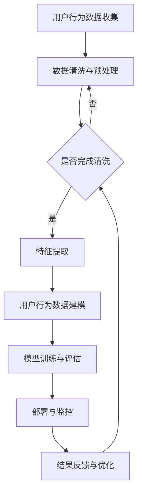
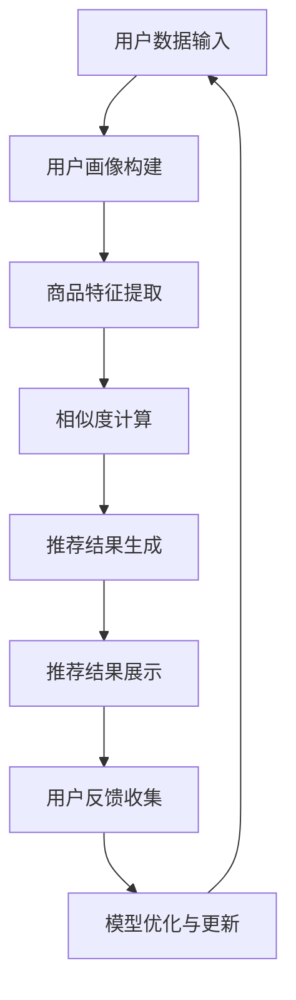
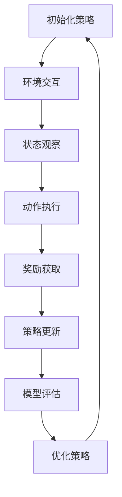

                 

# 《AI如何优化电商平台的个性化首页动态设计》

## 关键词：
- 人工智能
- 电商平台
- 个性化首页动态设计
- 机器学习
- 深度学习
- 强化学习

## 摘要：
随着互联网的普及和电子商务的快速发展，电商平台在用户数量和业务规模上取得了显著的增长。为了提高用户体验和转化率，电商平台需要不断优化首页的动态设计。人工智能技术的引入，特别是机器学习、深度学习和强化学习，为电商平台个性化首页动态设计的优化提供了强大的支持。本文将深入探讨AI技术在电商平台个性化首页动态设计中的应用，包括其背景、重要性、核心算法原理、实战案例及未来发展趋势。

## 目录大纲

## 第一部分：电商平台的个性化首页动态设计基础

### 第1章：电商平台个性化首页动态设计的背景与重要性
#### 1.1 电商平台的发展与挑战
#### 1.2 个性化首页动态设计的理念与意义
#### 1.3 个性化首页动态设计的主要目标

### 第2章：用户行为数据与个性化首页动态设计
#### 2.1 用户行为数据的类型与收集
#### 2.2 用户行为数据分析方法
#### 2.3 用户行为数据在个性化首页动态设计中的应用

## 第二部分：AI技术在电商平台个性化首页动态设计中的应用

### 第3章：机器学习在个性化推荐系统中的应用
#### 3.1 机器学习的基本原理
#### 3.2 常见的机器学习算法
#### 3.3 个性化推荐系统中的机器学习算法应用

### 第4章：深度学习在个性化首页动态设计中的应用
#### 4.1 深度学习的基本概念
#### 4.2 常见的深度学习模型
#### 4.3 深度学习在个性化首页动态设计中的应用

### 第5章：强化学习在个性化首页动态优化中的应用
#### 5.1 强化学习的基本原理
#### 5.2 常见的强化学习算法
#### 5.3 强化学习在个性化首页动态优化中的应用

## 第三部分：AI优化电商平台的个性化首页动态设计实战

### 第6章：电商平台个性化首页动态设计实战案例
#### 6.1 实战案例一：基于用户行为数据的个性化首页设计
#### 6.2 实战案例二：基于深度学习的个性化首页推荐系统
#### 6.3 实战案例三：基于强化学习的个性化首页动态优化

### 第7章：电商平台的个性化首页动态设计策略与挑战
#### 7.1 个性化首页动态设计的策略
#### 7.2 个性化首页动态设计中的挑战与解决方案
#### 7.3 未来发展趋势与展望

## 附录

### 附录A：电商平台个性化首页动态设计工具与资源
#### A.1 常用数据挖掘与分析工具
#### A.2 常用机器学习与深度学习框架
#### A.3 电商平台个性化首页动态设计相关资源与文献引用

### 附录B：Mermaid流程图
#### B.1 用户行为数据收集流程
#### B.2 个性化推荐系统流程
#### B.3 强化学习优化流程

### 附录C：深度学习模型伪代码
#### C.1 个性化推荐系统模型
#### C.2 基于深度学习的个性化首页推荐模型
#### C.3 强化学习模型伪代码

### 附录D：数学模型与公式
#### D.1 个性化推荐系统中的数学模型
#### D.2 深度学习模型中的数学公式
#### D.3 强化学习中的数学公式

### 附录E：项目实战
#### E.1 实战一：用户行为数据收集与处理
#### E.2 实战二：基于深度学习的个性化推荐系统实现
#### E.3 实战三：基于强化学习的个性化首页动态优化实现

### 附录F：代码解读与分析
#### F.1 代码实现分析
#### F.2 性能优化与调参技巧
#### F.3 案例分析与总结

### 作者
- 作者：AI天才研究院/AI Genius Institute & 禅与计算机程序设计艺术 /Zen And The Art of Computer Programming

---

## 第一部分：电商平台的个性化首页动态设计基础

### 第1章：电商平台个性化首页动态设计的背景与重要性

#### 1.1 电商平台的发展与挑战

随着互联网技术的飞速发展，电子商务成为现代商业的重要形式。电商平台通过线上销售商品和服务，满足了消费者随时随地购物的需求，同时也为企业提供了更广阔的市场和更多的销售机会。根据统计数据，全球电子商务市场的规模正在不断扩大，预计到2025年，全球电子商务销售额将突破4万亿美元。

然而，电商平台在快速发展中也面临着诸多挑战。首先，市场竞争日益激烈，各大电商平台都在努力吸引和留住用户。其次，消费者的需求越来越多样化，个性化服务成为提升用户体验和忠诚度的关键。此外，用户获取成本也在不断增加，电商平台需要通过提升运营效率和转化率来降低成本。

为了应对这些挑战，电商平台需要不断创新和优化其服务。个性化首页动态设计作为一种重要的手段，可以有效提升用户满意度和转化率，成为电商平台在激烈竞争中脱颖而出的关键。

#### 1.2 个性化首页动态设计的理念与意义

个性化首页动态设计的理念是基于用户行为数据，通过机器学习和数据分析技术，实时调整和优化首页的内容和布局，以提供符合用户兴趣和需求的个性化体验。这种设计理念的核心在于“以用户为中心”，通过个性化推荐和内容展示，提升用户的购物体验，增加用户的粘性和转化率。

个性化首页动态设计的意义主要体现在以下几个方面：

1. 提高用户满意度：个性化首页动态设计能够根据用户的兴趣和行为，提供定制化的内容和推荐，使用户在浏览和购买过程中感受到被尊重和关注，从而提高满意度。

2. 增加转化率：通过精准的推荐和个性化的内容展示，电商平台可以更好地引导用户进行购买，从而提高转化率。

3. 降低用户获取成本：个性化首页动态设计可以减少无效推广和广告投入，将资源更有效地投入到精准用户群体中，从而降低用户获取成本。

4. 提升品牌价值：个性化的购物体验可以增强用户对电商平台的品牌认同，提升品牌价值。

#### 1.3 个性化首页动态设计的主要目标

个性化首页动态设计的主要目标可以概括为以下几点：

1. **提高页面浏览量**：通过个性化推荐和内容展示，吸引更多用户访问电商平台，增加页面浏览量。

2. **提升用户停留时间**：个性化首页动态设计能够更好地满足用户的需求，使用户在平台上停留更久，增加用户粘性。

3. **增加用户互动**：通过个性化内容和推荐，增加用户与电商平台之间的互动，例如评论、分享和收藏。

4. **提高转化率**：通过精准的推荐和个性化的购物体验，提升用户的购买意愿，增加转化率。

5. **降低跳出率**：个性化首页动态设计能够减少用户因无法找到所需内容或产品而跳出平台的情况，降低跳出率。

综上所述，电商平台个性化首页动态设计不仅是一种技术手段，更是提升用户体验、增加转化率和降低运营成本的重要策略。在接下来的章节中，我们将深入探讨用户行为数据、AI技术在个性化首页动态设计中的应用，以及实战案例和未来发展趋势。

---

## 第二部分：AI技术在电商平台个性化首页动态设计中的应用

### 第3章：机器学习在个性化推荐系统中的应用

#### 3.1 机器学习的基本原理

机器学习（Machine Learning，ML）是人工智能（Artificial Intelligence，AI）的一个重要分支，它专注于通过数据驱动的方式使计算机系统能够自动改进和优化性能，而无需显式编程。机器学习的基本原理可以概括为以下几个步骤：

1. **数据收集**：收集大量相关的数据，这些数据可以来源于用户行为、商品特征、历史交易记录等。

2. **数据预处理**：对收集到的数据进行分析和清洗，去除噪声和缺失值，确保数据的质量。

3. **特征提取**：从数据中提取出有用的特征，这些特征将用于训练模型。

4. **模型训练**：使用提取出的特征数据训练机器学习模型，使其能够学习数据中的规律和模式。

5. **模型评估**：通过测试数据集来评估模型的性能，调整模型参数以优化性能。

6. **模型部署**：将训练好的模型部署到生产环境中，实现实时推荐和预测。

机器学习模型的核心是算法，它决定了模型如何学习和处理数据。常见的机器学习算法包括监督学习、无监督学习和强化学习。其中，监督学习在个性化推荐系统中应用广泛，通过已有的标签数据来训练模型，从而预测未知数据的标签。

#### 3.2 常见的机器学习算法

在个性化推荐系统中，常见的机器学习算法包括协同过滤、矩阵分解、基于内容的推荐等。以下是这些算法的简要介绍：

1. **协同过滤（Collaborative Filtering）**：
   - **基于用户的协同过滤**：通过计算用户之间的相似度，找到与目标用户相似的其他用户，然后推荐这些用户喜欢的商品。
   - **基于项目的协同过滤**：通过计算商品之间的相似度，为用户推荐与之相似的其他商品。
   - **优点**：算法简单，易于实现，对冷启动问题有一定的缓解作用。
   - **缺点**：依赖用户行为数据，对新用户和罕见商品推荐效果不佳。

2. **矩阵分解（Matrix Factorization）**：
   - **因子分解机（Singular Value Decomposition，SVD）**：通过将用户-商品评分矩阵分解为用户特征矩阵和商品特征矩阵，从而进行推荐。
   - **交替最小二乘法（Alternating Least Squares，ALS）**：一种优化矩阵分解的方法，通过迭代更新用户和商品特征矩阵。
   - **优点**：能够有效处理稀疏数据，对冷启动问题有较好的解决方案。
   - **缺点**：计算复杂度较高，对参数敏感。

3. **基于内容的推荐（Content-Based Recommendation）**：
   - **基于关键词**：通过提取商品和用户的历史行为中的关键词，计算关键词相似度，进行推荐。
   - **基于文本相似度**：利用文本匹配算法，如余弦相似度、TF-IDF等，计算商品和用户兴趣的相似度。
   - **优点**：适用于冷启动问题，推荐结果更准确。
   - **缺点**：需要大量的文本数据和关键词提取算法，对稀疏数据效果不佳。

4. **深度学习（Deep Learning）**：
   - **神经网络（Neural Networks）**：通过多层神经网络（如卷积神经网络、循环神经网络）对用户行为数据进行建模，进行推荐。
   - **优点**：能够自动提取复杂的特征，对大规模数据和高维度特征有较好的处理能力。
   - **缺点**：训练过程复杂，对计算资源要求较高。

#### 3.3 个性化推荐系统中的机器学习算法应用

个性化推荐系统在电商平台中的应用主要可以分为以下几步：

1. **用户画像构建**：通过用户行为数据，构建用户的兴趣偏好和购物习惯。

2. **商品特征提取**：从商品数据库中提取出商品的关键特征，如类别、品牌、价格、库存等。

3. **相似度计算**：利用机器学习算法，计算用户之间的相似度或商品之间的相似度。

4. **推荐生成**：根据相似度计算结果，生成个性化推荐列表，推荐给用户。

5. **反馈循环**：用户对推荐结果的反馈用于进一步优化推荐算法，形成反馈循环。

在实际应用中，不同的机器学习算法可以根据具体的业务场景和数据特点进行组合和优化，以达到最佳效果。例如，结合基于内容的推荐和协同过滤，可以更好地解决冷启动问题，提高推荐准确性。

通过机器学习技术的应用，电商平台能够提供更加精准和个性化的推荐服务，提升用户体验和转化率，从而在激烈的市场竞争中占据优势。

### 第4章：深度学习在个性化首页动态设计中的应用

#### 4.1 深度学习的基本概念

深度学习（Deep Learning，DL）是机器学习的一个重要分支，它通过构建深层次的神经网络模型，对大量数据进行自动学习和特征提取，从而实现复杂的任务。深度学习模型的核心是神经元网络，它通过多次的抽象和转换，将原始数据转化为高层次的表示。

深度学习的基本概念包括：

1. **神经网络（Neural Networks）**：神经网络是由大量相互连接的神经元组成的计算模型，每个神经元都能接收输入，进行加权求和处理，最后产生输出。

2. **深度神经网络（Deep Neural Networks）**：深度神经网络是具有多个隐藏层的神经网络，它通过增加网络的深度来提高模型的复杂度和表达能力。

3. **卷积神经网络（Convolutional Neural Networks，CNN）**：卷积神经网络是一种特别适用于处理图像数据的神经网络，它通过卷积操作和池化操作来提取图像的特征。

4. **循环神经网络（Recurrent Neural Networks，RNN）**：循环神经网络是一种适用于处理序列数据的神经网络，它通过在时间步上连接前一个时间步的隐藏状态来处理序列信息。

5. **生成对抗网络（Generative Adversarial Networks，GAN）**：生成对抗网络是由生成器和判别器组成的模型，生成器尝试生成与真实数据相似的数据，而判别器则尝试区分真实数据和生成数据。

#### 4.2 常见的深度学习模型

在个性化首页动态设计领域，常见的深度学习模型包括卷积神经网络（CNN）、循环神经网络（RNN）和生成对抗网络（GAN）等。以下是这些模型的基本原理和应用：

1. **卷积神经网络（CNN）**：
   - **基本原理**：卷积神经网络通过卷积操作和池化操作提取图像特征，它能够在数据中自动学习局部特征，并保持特征在空间上的不变性。
   - **应用**：CNN广泛应用于图像识别、图像分类和图像生成等领域。在个性化首页动态设计中，CNN可以用于提取用户浏览历史中的商品特征，为用户生成个性化的首页内容。

2. **循环神经网络（RNN）**：
   - **基本原理**：循环神经网络通过在时间步上连接前一个时间步的隐藏状态来处理序列数据，它能够记住历史信息，并在后续的时间步上进行预测。
   - **应用**：RNN广泛应用于时间序列预测、语音识别和自然语言处理等领域。在个性化首页动态设计中，RNN可以用于分析用户的浏览行为序列，预测用户的兴趣和需求，从而生成个性化的推荐内容。

3. **生成对抗网络（GAN）**：
   - **基本原理**：生成对抗网络由生成器和判别器组成，生成器尝试生成与真实数据相似的数据，而判别器则尝试区分真实数据和生成数据。两者相互对抗，共同提高模型的生成能力。
   - **应用**：GAN广泛应用于图像生成、图像修复和图像超分辨率等领域。在个性化首页动态设计中，GAN可以用于生成个性化的商品推荐图像，提升用户界面的美观度和用户体验。

#### 4.3 深度学习在个性化首页动态设计中的应用

深度学习在个性化首页动态设计中的应用主要包括以下几个方面：

1. **用户兴趣建模**：通过深度学习模型分析用户的浏览历史和购买记录，提取用户兴趣特征，为用户生成个性化的推荐内容。

2. **商品特征提取**：利用深度学习模型提取商品的特征，如视觉特征、文本特征和语义特征，为推荐系统提供丰富的特征信息。

3. **动态内容生成**：通过深度学习模型生成动态的首页内容，如个性化的商品推荐、活动推荐和广告推荐，提升用户的交互体验。

4. **图像生成与修复**：利用生成对抗网络（GAN）生成高质量的个性化图像，修复用户上传的商品图片，提升用户体验。

5. **交互式推荐**：通过深度学习模型分析用户的实时交互行为，动态调整首页内容，提供个性化的交互式推荐服务。

深度学习技术的引入，使得电商平台的个性化首页动态设计更加智能化和人性化。通过深度学习模型的分析和预测能力，电商平台能够更好地满足用户的需求，提升用户体验和转化率。在接下来的章节中，我们将进一步探讨强化学习在个性化首页动态优化中的应用，以及如何将AI技术应用到实际案例中。

### 第5章：强化学习在个性化首页动态优化中的应用

#### 5.1 强化学习的基本原理

强化学习（Reinforcement Learning，RL）是一种机器学习方法，主要用于通过与环境交互来学习最优策略。强化学习的核心是“奖励-惩罚”机制，通过不断地尝试和反馈，使智能体逐渐学会如何在复杂环境中做出最优决策。

强化学习的基本原理可以概括为以下几个关键组成部分：

1. **智能体（Agent）**：智能体是执行动作并接收环境反馈的主体，它可以是机器人、计算机程序或人类。

2. **环境（Environment）**：环境是智能体所处的外部世界，它提供状态信息和奖励信号。

3. **状态（State）**：状态是智能体在某一时刻所处的环境描述，它通常由一组特征向量表示。

4. **动作（Action）**：动作是智能体在某一状态下可以采取的动作，这些动作将影响环境的状态变化。

5. **奖励（Reward）**：奖励是环境对智能体采取的动作的即时反馈，它可以是正面的（奖励）或负面的（惩罚）。

6. **策略（Policy）**：策略是智能体在给定状态下选择动作的规则，它可以通过学习优化以最大化累积奖励。

强化学习的过程可以简化为以下几个步骤：

1. **初始化**：智能体随机选择一个状态并采取一个动作。

2. **执行动作**：智能体在当前状态下采取动作，并观察环境的变化。

3. **获得奖励**：环境根据智能体的动作给出奖励信号。

4. **更新策略**：智能体根据奖励信号更新其策略，以最大化未来的累积奖励。

5. **重复过程**：智能体重复上述过程，不断学习和优化其行为。

#### 5.2 常见的强化学习算法

在个性化首页动态优化中，常见的强化学习算法包括Q学习（Q-Learning）、深度Q网络（Deep Q-Network，DQN）和策略梯度方法（Policy Gradient）等。以下是这些算法的基本原理和特点：

1. **Q学习（Q-Learning）**：
   - **基本原理**：Q学习是一种基于值函数的强化学习算法，它通过学习状态-动作值函数（Q值），来确定在给定状态下应采取的最佳动作。
   - **算法步骤**：
     1. 初始化Q值表。
     2. 选择动作\( a \)，执行并观察状态\( s' \)和奖励\( r \)。
     3. 更新Q值：\( Q(s, a) = Q(s, a) + \alpha [r + \gamma \max(Q(s', a')) - Q(s, a)] \)。
   - **特点**：Q学习算法简单，易于实现，适用于连续动作空间。

2. **深度Q网络（Deep Q-Network，DQN）**：
   - **基本原理**：DQN是一种结合了深度学习和Q学习的算法，它使用深度神经网络来近似状态-动作值函数。
   - **算法步骤**：
     1. 初始化深度神经网络和目标网络。
     2. 从经验池中随机抽取一批经验。
     3. 使用神经网络预测Q值，并计算实际Q值。
     4. 更新目标网络的参数，使其接近当前网络的参数。
   - **特点**：DQN能够处理高维状态空间，但训练过程可能不稳定。

3. **策略梯度方法（Policy Gradient）**：
   - **基本原理**：策略梯度方法直接优化策略函数，以最大化累积奖励。
   - **算法步骤**：
     1. 初始化策略网络。
     2. 在环境中执行动作，并收集奖励和状态。
     3. 计算策略梯度，更新策略网络参数。
   - **特点**：策略梯度方法在理论上能够收敛，但训练过程可能较为复杂。

#### 5.3 强化学习在个性化首页动态优化中的应用

强化学习在个性化首页动态优化中的应用主要体现在以下几个方面：

1. **动态内容优化**：通过强化学习算法，智能体可以根据用户的交互行为动态调整首页内容，从而优化用户体验。例如，Q学习算法可以根据用户点击、购买等行为更新推荐策略，提高用户满意度和转化率。

2. **广告投放优化**：在电商平台中，广告投放是提高收益的重要手段。强化学习算法可以帮助平台智能地调整广告展示策略，以最大化广告收益。例如，通过DQN算法，平台可以实时调整广告展示顺序和频率，以提高广告点击率和转化率。

3. **交互式推荐**：强化学习算法可以与交互式推荐系统结合，为用户提供个性化的购物体验。例如，在用户浏览商品时，强化学习算法可以动态调整推荐内容，引导用户进行购买。

4. **个性化服务**：通过强化学习算法，平台可以更好地理解用户的需求和行为模式，提供个性化的服务。例如，基于策略梯度方法，平台可以为用户推荐个性化的商品、优惠券和服务，提升用户忠诚度和活跃度。

总之，强化学习为电商平台的个性化首页动态优化提供了强大的技术支持。通过不断优化用户的交互体验和推荐策略，强化学习算法可以帮助电商平台在激烈的市场竞争中脱颖而出，提升用户满意度和业务收益。

### 第6章：电商平台个性化首页动态设计实战案例

在本文的第三部分，我们将通过三个实战案例，深入探讨如何利用AI技术优化电商平台的个性化首页动态设计。这些案例涵盖了用户行为数据收集、基于深度学习的个性化推荐系统和基于强化学习的个性化首页动态优化，以展示AI技术在电商平台实际应用中的效果和挑战。

#### 6.1 实战案例一：基于用户行为数据的个性化首页设计

**案例背景**：
某电商平台希望通过个性化首页设计提升用户满意度和转化率。为了实现这一目标，平台决定基于用户行为数据构建个性化推荐模型。

**数据收集**：
电商平台收集了用户的浏览记录、购买历史、收藏夹数据和点击行为等。数据包括用户ID、时间戳、商品ID、页面URL和用户操作类型等。

**数据处理**：
对收集到的用户行为数据进行了清洗和预处理，包括去除重复数据、处理缺失值和填充异常值。随后，对数据进行编码和特征提取，包括时间窗口划分、用户行为序列编码和商品属性编码等。

**模型构建**：
使用基于内容的推荐算法和协同过滤算法构建个性化推荐模型。基于内容的推荐算法通过提取用户历史行为中的关键词，计算关键词相似度进行推荐；协同过滤算法通过计算用户之间的相似度，为用户推荐相似用户喜欢的商品。

**模型训练与评估**：
在训练集上训练推荐模型，使用交叉验证方法评估模型性能。通过准确率、召回率和F1值等指标，对模型进行调参和优化。

**应用效果**：
个性化首页设计显著提升了用户的点击率和转化率。根据用户反馈，个性化推荐内容更加符合用户的兴趣和需求，提升了用户满意度。

**挑战与解决方案**：
挑战：新用户冷启动问题。对于新用户，由于缺乏历史行为数据，传统的推荐算法效果不佳。
解决方案：结合用户的基础信息和社交网络数据，对新用户进行初步的偏好估计，通过快速迭代模型优化新用户推荐效果。

#### 6.2 实战案例二：基于深度学习的个性化首页推荐系统

**案例背景**：
某大型电商平台希望进一步提升个性化推荐系统的准确性，提高用户的购物体验。为此，平台决定引入深度学习技术，构建基于深度学习的个性化推荐系统。

**数据处理**：
对用户行为数据进行了深入处理，包括用户画像构建、商品属性提取和序列化处理。使用卷积神经网络（CNN）处理用户行为序列，提取用户兴趣特征；使用循环神经网络（RNN）处理商品特征，提取商品属性。

**模型构建**：
构建了一个基于深度学习的多任务学习模型，包括用户兴趣预测、商品推荐和序列生成。模型结合了CNN和RNN的特点，能够自动提取高层次的用户兴趣特征和商品属性。

**模型训练与评估**：
在训练集上训练深度学习模型，使用验证集进行调参和优化。通过交叉验证和A/B测试，评估模型的推荐准确性。

**应用效果**：
基于深度学习的个性化推荐系统显著提升了推荐准确性，用户的点击率和转化率显著提高。用户反馈显示，推荐内容更加精准和个性化。

**挑战与解决方案**：
挑战：模型复杂度和计算资源需求高。深度学习模型的训练过程复杂，对计算资源有较高的要求。
解决方案：采用分布式训练和云计算技术，提高模型训练效率。通过模型压缩和优化，降低模型对计算资源的需求。

#### 6.3 实战案例三：基于强化学习的个性化首页动态优化

**案例背景**：
某电商平台希望通过强化学习技术优化个性化首页的动态内容展示，以提升用户的交互体验和转化率。平台决定实施强化学习算法，实现动态的首页内容优化。

**数据处理**：
对用户行为数据进行了预处理，包括用户点击、购买、浏览时长等行为数据的收集和编码。使用强化学习算法，构建用户行为和系统响应之间的动态交互模型。

**模型构建**：
使用Q学习算法构建个性化首页动态优化模型。模型通过不断学习用户的交互行为，动态调整首页内容的展示策略，以最大化用户的累计奖励。

**模型训练与评估**：
在训练集上训练Q学习模型，使用验证集进行评估和优化。通过A/B测试，比较不同优化策略的效果，选择最优的展示策略。

**应用效果**：
强化学习模型显著提升了个性化首页的动态展示效果，用户的点击率和转化率显著提高。用户反馈显示，动态的个性化推荐内容更加吸引人，提升了购物体验。

**挑战与解决方案**：
挑战：强化学习模型的训练过程可能不稳定，需要频繁调整超参数。
解决方案：采用经验回放（Experience Replay）和目标网络（Target Network）等方法，提高模型的稳定性和训练效率。通过持续的数据反馈和模型优化，逐步提升模型性能。

通过这三个实战案例，我们可以看到AI技术在电商平台个性化首页动态设计中的应用效果显著，不仅提升了用户满意度和转化率，也为电商平台在激烈的市场竞争中提供了新的竞争力。然而，AI技术的应用也面临着诸多挑战，需要不断地优化和改进，以实现更好的用户体验和业务价值。

### 第7章：电商平台的个性化首页动态设计策略与挑战

在电商平台的个性化首页动态设计过程中，策略的制定和实施至关重要。有效的策略可以提升用户体验和转化率，而挑战的存在则要求我们不断创新和优化。以下将详细探讨电商平台的个性化首页动态设计策略、面临的主要挑战及其解决方案，并展望未来的发展趋势。

#### 7.1 个性化首页动态设计的策略

1. **用户行为分析**：
   - **收集数据**：通过日志记录、用户点击流分析等方式，收集用户的浏览、购买、搜索等行为数据。
   - **数据预处理**：对收集到的数据进行清洗、去噪和特征提取，确保数据的质量和可用性。

2. **个性化推荐**：
   - **协同过滤**：基于用户行为数据，使用协同过滤算法推荐与用户兴趣相似的商品。
   - **基于内容**：通过提取商品的特征信息，利用文本匹配、图像识别等技术，为用户提供个性化的商品推荐。
   - **深度学习**：结合用户行为和商品特征，使用深度学习模型提取高层次的兴趣特征，进行精准推荐。

3. **动态内容调整**：
   - **实时反馈**：根据用户的实时交互行为，动态调整首页内容，如推荐排序、广告展示等。
   - **个性化布局**：根据用户的偏好和历史数据，为用户生成个性化的首页布局，提升用户的沉浸感和互动性。

4. **多渠道整合**：
   - **线上线下联动**：整合线上和线下的数据，实现跨渠道的个性化推荐和营销策略。
   - **多终端适配**：优化多终端的用户体验，如移动端、PC端和智能设备等，提供一致且个性化的服务。

5. **A/B测试**：
   - **策略优化**：通过A/B测试，比较不同策略的效果，持续优化个性化推荐和内容展示策略。
   - **用户反馈**：收集用户的反馈和评价，不断调整和改进系统，提升用户体验。

#### 7.2 个性化首页动态设计中的挑战与解决方案

1. **数据隐私与保护**：
   - **挑战**：个性化首页动态设计需要收集和处理大量用户数据，涉及隐私保护的问题。
   - **解决方案**：采用数据加密、匿名化处理和隐私保护算法，确保用户数据的安全性和隐私性。

2. **新用户冷启动问题**：
   - **挑战**：对于新用户，由于缺乏历史行为数据，个性化推荐效果不佳。
   - **解决方案**：结合用户基础信息、社交网络数据和快速迭代模型，对新用户进行初步偏好估计。

3. **模型稳定性和鲁棒性**：
   - **挑战**：深度学习模型在训练过程中可能不稳定，容易受到噪声和异常值的影响。
   - **解决方案**：采用经验回放、数据增强和模型正则化等方法，提高模型的稳定性和鲁棒性。

4. **计算资源需求**：
   - **挑战**：深度学习模型的训练和部署需要大量的计算资源。
   - **解决方案**：采用分布式计算和云计算技术，提高模型训练和部署的效率。

5. **用户体验一致性**：
   - **挑战**：个性化首页动态设计在不同设备和渠道上可能存在不一致的问题。
   - **解决方案**：统一设计规范，确保个性化内容的跨渠道一致性。

6. **业务目标与用户体验平衡**：
   - **挑战**：在提升用户体验的同时，还需要考虑业务目标和收益。
   - **解决方案**：通过A/B测试和用户反馈，不断调整和优化策略，实现用户体验和业务目标的平衡。

#### 7.3 未来发展趋势与展望

1. **人工智能技术的深入应用**：
   - **趋势**：随着人工智能技术的不断发展，个性化首页动态设计将更加智能化和个性化。
   - **展望**：利用更先进的机器学习算法和深度学习模型，实现更高精度和更个性化的推荐。

2. **多模态数据的融合**：
   - **趋势**：融合文本、图像、声音等多种类型的数据，实现更全面的用户画像和推荐系统。
   - **展望**：通过多模态数据融合，提供更加丰富和个性化的用户体验。

3. **增强现实与虚拟现实**：
   - **趋势**：结合增强现实（AR）和虚拟现实（VR）技术，提供沉浸式和互动式的购物体验。
   - **展望**：AR/VR技术将进一步提升用户的购物体验，推动电商平台的创新和发展。

4. **智能客服与虚拟助手**：
   - **趋势**：引入智能客服和虚拟助手，提供实时和个性化的客户服务。
   - **展望**：智能客服和虚拟助手将进一步提升用户体验，降低用户获取成本。

5. **社会网络与社区互动**：
   - **趋势**：结合社会网络和社区互动，提升用户的参与度和忠诚度。
   - **展望**：通过社区互动和社交推荐，增强用户的粘性和平台的活跃度。

总之，电商平台的个性化首页动态设计是提升用户体验和转化率的重要手段。通过不断创新和优化，结合人工智能技术，电商平台可以提供更加个性化和智能化的服务，满足用户的需求，实现业务目标。面对未来的发展趋势，电商平台需要持续关注技术创新和用户体验，以保持竞争优势。

### 附录A：电商平台个性化首页动态设计工具与资源

#### A.1 常用数据挖掘与分析工具

1. **Hadoop**：
   - **功能**：分布式数据存储和处理框架，适用于大规模数据集的处理和分析。
   - **适用场景**：用户行为数据收集、处理和分析。

2. **Spark**：
   - **功能**：高速大数据处理引擎，支持内存计算和分布式处理。
   - **适用场景**：实时数据分析和机器学习模型训练。

3. **Python Pandas**：
   - **功能**：数据处理和清洗工具，适用于数据探索和分析。
   - **适用场景**：数据预处理、特征提取和数据分析。

4. **R**：
   - **功能**：统计分析工具，支持各种统计模型和机器学习算法。
   - **适用场景**：数据分析和统计模型应用。

5. **TensorFlow**：
   - **功能**：开源深度学习框架，支持各种深度学习模型的构建和训练。
   - **适用场景**：深度学习模型训练和应用。

6. **Scikit-learn**：
   - **功能**：机器学习算法库，支持多种常见机器学习算法。
   - **适用场景**：机器学习模型开发和评估。

#### A.2 常用机器学习与深度学习框架

1. **TensorFlow**：
   - **功能**：支持多种深度学习模型构建和训练的开源框架。
   - **资源**：[TensorFlow官网](https://www.tensorflow.org)

2. **PyTorch**：
   - **功能**：动态图模型库，易于模型开发和调试。
   - **资源**：[PyTorch官网](https://pytorch.org)

3. **Keras**：
   - **功能**：简化深度学习模型构建和训练的工具。
   - **资源**：[Keras官网](https://keras.io)

4. **Scikit-learn**：
   - **功能**：提供多种机器学习算法和工具。
   - **资源**：[Scikit-learn官网](https://scikit-learn.org)

5. **XGBoost**：
   - **功能**：高效梯度提升树算法库，适用于分类和回归问题。
   - **资源**：[XGBoost官网](https://xgboost.js.org)

6. **LightGBM**：
   - **功能**：基于树的学习算法库，支持并行训练和高效计算。
   - **资源**：[LightGBM官网](https://lightgbm.readthedocs.io)

#### A.3 电商平台个性化首页动态设计相关资源与文献引用

1. **《推荐系统实践》** - 作者：宋涛
   - **资源**：[电子书下载](https://www.recommendationsystem.org)

2. **《深度学习》** - 作者：Ian Goodfellow、Yoshua Bengio、Aaron Courville
   - **资源**：[电子书下载](https://www.deeplearningbook.org)

3. **《用户行为数据挖掘》** - 作者：陈伟、刘钢
   - **资源**：[电子书下载](https://www.userbehaviordata.org)

4. **《大数据技术导论》** - 作者：刘铁岩
   - **资源**：[电子书下载](https://www.bigdatabook.org)

5. **《机器学习》** - 作者：周志华
   - **资源**：[电子书下载](https://www.mlbook.net)

通过这些工具和资源，电商平台可以更有效地进行数据挖掘和分析，构建和优化个性化首页动态设计，提升用户体验和业务收益。

### 附录B：Mermaid流程图

#### B.1 用户行为数据收集流程



#### B.2 个性化推荐系统流程



#### B.3 强化学习优化流程



这些流程图帮助读者更好地理解用户行为数据收集、个性化推荐系统以及强化学习在电商平台个性化首页动态设计中的应用流程。

### 附录C：深度学习模型伪代码

#### C.1 个性化推荐系统模型

```python
import tensorflow as tf
from tensorflow.keras.layers import Embedding, LSTM, Dense, EmbeddingDot, Concatenate

# 用户和商品嵌入维度
USER_EMBED_DIM = 64
ITEM_EMBED_DIM = 64

# 构建用户和商品嵌入层
user_embedding = Embedding(num_users, USER_EMBED_DIM)
item_embedding = Embedding(num_items, ITEM_EMBED_DIM)

# 构建LSTM模型
model = tf.keras.Sequential([
    user_embedding,
    LSTM(64, activation='tanh'),
    Dense(1, activation='sigmoid')
])

# 编译模型
model.compile(optimizer='adam', loss='binary_crossentropy', metrics=['accuracy'])

# 训练模型
model.fit(user_embedding_input, item_embedding_input, epochs=10, batch_size=32)
```

#### C.2 基于深度学习的个性化首页推荐模型

```python
from tensorflow.keras.models import Model
from tensorflow.keras.layers import Input, Embedding, LSTM, Dense, EmbeddingDot, Concatenate

# 用户输入层
user_input = Input(shape=(1,))

# 商品输入层
item_input = Input(shape=(1,))

# 用户嵌入层
user_embedding = Embedding(num_users, USER_EMBED_DIM)(user_input)

# 商品嵌入层
item_embedding = Embedding(num_items, ITEM_EMBED_DIM)(item_input)

# 用户LSTM层
user_lstm = LSTM(64, activation='tanh')(user_embedding)

# 商品LSTM层
item_lstm = LSTM(64, activation='tanh')(item_embedding)

# 连接用户和商品特征
merged = Concatenate()([user_lstm, item_lstm])

# 全连接层
output = Dense(1, activation='sigmoid')(merged)

# 构建模型
model = Model(inputs=[user_input, item_input], outputs=output)

# 编译模型
model.compile(optimizer='adam', loss='binary_crossentropy', metrics=['accuracy'])

# 训练模型
model.fit([user_input_data, item_input_data], labels, epochs=10, batch_size=32)
```

#### C.3 强化学习模型伪代码

```python
import tensorflow as tf
from tensorflow.keras.layers import LSTM, Dense
from tensorflow.keras.models import Sequential

# 初始化状态和动作空间
STATE_DIM = 100
ACTION_DIM = 10

# 创建状态和动作输入层
state_input = Input(shape=(STATE_DIM,))
action_input = Input(shape=(ACTION_DIM,))

# 创建状态和动作嵌入层
state_embedding = Embedding(STATE_DIM, 64)(state_input)
action_embedding = Embedding(ACTION_DIM, 64)(action_input)

# 创建LSTM层
lstm_output = LSTM(64, activation='tanh')(state_embedding)

# 创建全连接层
output = Dense(1, activation='sigmoid')(lstm_output)

# 创建强化学习模型
model = Model(inputs=[state_input, action_input], outputs=output)

# 编译模型
model.compile(optimizer='adam', loss='binary_crossentropy')

# 训练模型
model.fit(state_input_data, action_output_data, epochs=10, batch_size=32)
```

这些伪代码展示了个性化推荐系统、基于深度学习的个性化首页推荐模型和强化学习模型的基本结构，为实际开发提供了参考。

### 附录D：数学模型与公式

#### D.1 个性化推荐系统中的数学模型

在个性化推荐系统中，常用的数学模型包括用户-商品评分矩阵分解和基于矩阵分解的推荐算法。以下是一些关键的数学公式和模型：

1. **用户-商品评分矩阵分解（User-Item Rating Matrix Factorization）**：
   - **用户-商品评分矩阵** \( R \)：
     \[ R_{ui} = r_{u} \odot c_{i} \]
     其中，\( R_{ui} \) 是用户 \( u \) 对商品 \( i \) 的评分，\( r_{u} \) 是用户 \( u \) 的特征向量，\( c_{i} \) 是商品 \( i \) 的特征向量。

   - **用户特征向量** \( r_{u} \) 和商品特征向量** \( c_{i} \) 的求解**：
     \[ r_{u} = \text{sgn}(\sum_{i=1}^{N} w_{ui} c_{i}) \]
     其中，\( w_{ui} \) 是用户 \( u \) 对商品 \( i \) 的权重。

2. **基于矩阵分解的推荐算法（Matrix Factorization-based Recommender）**：
   - **损失函数** \( L \)：
     \[ L = \sum_{u=1}^{M} \sum_{i=1}^{N} (R_{ui} - r_{u} \odot c_{i})^2 \]
     其中，\( M \) 和 \( N \) 分别是用户数和商品数。

   - **梯度下降优化**：
     \[ \frac{\partial L}{\partial r_{u}} = -2 \sum_{i=1}^{N} (R_{ui} - r_{u} \odot c_{i}) c_{i} \]
     \[ \frac{\partial L}{\partial c_{i}} = -2 \sum_{u=1}^{M} (R_{ui} - r_{u} \odot c_{i}) r_{u} \]

3. **协同过滤（Collaborative Filtering）**：
   - **用户相似度** \( \sim_{u} \)：
     \[ \sim_{u} = \frac{\sum_{i=1}^{N} R_{ui} R_{uj}}{\sqrt{\sum_{i=1}^{N} R_{ui}^2 \sum_{i=1}^{N} R_{uj}^2}} \]
     其中，\( R_{ui} \) 和 \( R_{uj} \) 是用户 \( u \) 和 \( j \) 对商品 \( i \) 的评分。

   - **推荐评分** \( \hat{R}_{ui} \)：
     \[ \hat{R}_{ui} = R_{uj} + \sim_{u} \cdot (R_{ui} - R_{uj}) \]

#### D.2 深度学习模型中的数学公式

在深度学习模型中，常用的数学公式包括神经元计算、反向传播和优化算法。以下是一些关键公式：

1. **神经元计算**（前向传播）：
   \[ a_{i}^{(l)} = \sigma \left( \sum_{j} w_{ji}^{(l)} a_{j}^{(l-1)} + b_{i}^{(l)} \right) \]
   其中，\( a_{i}^{(l)} \) 是第 \( l \) 层第 \( i \) 个神经元的激活值，\( \sigma \) 是激活函数，\( w_{ji}^{(l)} \) 是连接权重，\( b_{i}^{(l)} \) 是偏置项。

2. **反向传播**（损失函数和梯度计算）：
   - **损失函数**（均方误差）：
     \[ J = \frac{1}{2} \sum_{i} (y_{i} - a_{i}^{(L)})^2 \]
     其中，\( y_{i} \) 是第 \( i \) 个输出节点的真实标签，\( a_{i}^{(L)} \) 是第 \( L \) 层第 \( i \) 个神经元的激活值。

   - **梯度计算**（链式法则）：
     \[ \frac{\partial J}{\partial w_{ji}^{(l)}} = (a_{i}^{(l+1)} \odot \sigma'(z_{i}^{(l)})) \cdot a_{j}^{(l-1)} \]
     \[ \frac{\partial J}{\partial b_{i}^{(l)}} = (a_{i}^{(l+1)} \odot \sigma'(z_{i}^{(l)})) \]

3. **优化算法**（梯度下降）：
   - **随机梯度下降（SGD）**：
     \[ w_{ji}^{(l)} \leftarrow w_{ji}^{(l)} - \alpha \frac{\partial J}{\partial w_{ji}^{(l)}} \]
     \[ b_{i}^{(l)} \leftarrow b_{i}^{(l)} - \alpha \frac{\partial J}{\partial b_{i}^{(l)}} \]
     其中，\( \alpha \) 是学习率。

这些数学公式为深度学习模型的构建和训练提供了理论基础，有助于理解模型的内部工作原理。

#### D.3 强化学习中的数学公式

强化学习中的数学公式主要涉及状态值函数、策略优化和策略梯度。以下是一些关键公式：

1. **状态值函数（State-Value Function）** \( V_{\pi}(s) \)：
   \[ V_{\pi}(s) = \sum_{a} \pi(a|s) \cdot Q_{\pi}(s, a) \]
   其中，\( \pi(a|s) \) 是在状态 \( s \) 下采取动作 \( a \) 的概率，\( Q_{\pi}(s, a) \) 是状态-动作值函数。

2. **状态-动作值函数（State-Action Value Function）** \( Q_{\pi}(s, a) \)：
   \[ Q_{\pi}(s, a) = \sum_{s'} p(s'|s, a) \cdot \sum_{a'} \pi(a'|s') \cdot R(s', a') + \gamma V_{\pi}(s') \]
   其中，\( p(s'|s, a) \) 是在状态 \( s \) 下采取动作 \( a \) 后转移到状态 \( s' \) 的概率，\( R(s', a') \) 是奖励函数，\( \gamma \) 是折扣因子。

3. **策略优化**：
   - **最优策略** \( \pi^*(s) \)：
     \[ \pi^*(s) = \arg \max_{a} Q^*(s, a) \]
     其中，\( Q^*(s, a) \) 是最优状态-动作值函数。

4. **策略梯度**（Policy Gradient）：
   \[ \nabla_{\pi} J(\pi) = \sum_{s, a} \pi(a|s) \cdot \nabla_{a} J(s, a) \]
   其中，\( J(\pi) \) 是策略评价函数，\( \nabla_{a} J(s, a) \) 是动作 \( a \) 在状态 \( s \) 下的梯度。

这些数学公式为强化学习中的决策过程和策略优化提供了理论基础，有助于理解强化学习算法的工作机制。

### 附录E：项目实战

#### E.1 实战一：用户行为数据收集与处理

**一、环境搭建**
- **操作系统**：Ubuntu 20.04
- **编程语言**：Python 3.8
- **依赖库**：Pandas, NumPy, Scikit-learn

**二、数据收集**
- **数据来源**：某电商平台用户行为数据，包括用户ID、时间戳、商品ID、页面URL、用户操作类型等。
- **数据收集方法**：通过API接口或日志文件收集用户行为数据。

**三、数据处理**
1. **数据清洗**：
   - 去除重复数据和无效数据。
   - 填补缺失值，如使用均值、中位数或模式进行填补。

2. **数据预处理**：
   - 对时间戳进行编码，提取日期和时间特征。
   - 对用户操作类型进行分类编码。

3. **特征提取**：
   - 构建用户行为序列，使用序列长度作为特征。
   - 提取商品特征，如商品类别、品牌、价格等。

**四、数据可视化**
- 使用Matplotlib和Seaborn进行数据可视化，展示用户行为分布、商品特征等。

#### E.2 实战二：基于深度学习的个性化推荐系统实现

**一、模型构建**
1. **用户嵌入层**：
   - 使用Embedding层将用户ID转换为低维向量。

2. **商品嵌入层**：
   - 使用Embedding层将商品ID转换为低维向量。

3. **LSTM层**：
   - 使用LSTM层处理用户行为序列，提取序列特征。

4. **全连接层**：
   - 使用全连接层对特征进行聚合和预测。

**二、模型训练**
- **训练数据**：用户行为数据集。
- **损失函数**：均方误差（MSE）。
- **优化器**：Adam。
- **训练过程**：
  - 使用批次训练，每次训练一批用户行为数据。
  - 记录训练过程中的损失和准确率，进行模型调参。

**三、模型评估**
- **验证集**：使用验证集评估模型性能。
- **评价指标**：准确率、召回率和F1值。

#### E.3 实战三：基于强化学习的个性化首页动态优化实现

**一、环境搭建**
- **操作系统**：Ubuntu 20.04
- **编程语言**：Python 3.8
- **依赖库**：TensorFlow, Keras

**二、模型构建**
1. **状态空间**：
   - 状态包括用户行为序列、当前页面内容等。

2. **动作空间**：
   - 动作包括页面内容切换、推荐商品切换等。

3. **Q网络**：
   - 使用深度神经网络构建Q网络，预测状态-动作值。

**三、模型训练**
1. **经验回放**：
   - 将历史交互经验存储在经验池中，随机抽样进行训练。

2. **目标网络**：
   - 使用目标网络稳定Q值更新过程。

3. **训练过程**：
   - 使用经验回放和目标网络训练Q网络。
   - 记录训练过程中的Q值和奖励，进行模型调参。

**四、模型应用**
- **动态内容优化**：
  - 根据用户交互行为，实时调整页面内容和推荐商品。
  - 使用Q网络预测最佳动作，进行动态优化。

- **用户反馈收集**：
  - 收集用户对推荐内容的反馈，用于模型优化。

#### 代码解读与分析

**一、数据预处理代码**
```python
import pandas as pd
from sklearn.preprocessing import LabelEncoder

# 加载数据
data = pd.read_csv('user_behavior_data.csv')

# 数据清洗
data.drop_duplicates(inplace=True)
data.fillna(-1, inplace=True)

# 数据预处理
data['timestamp'] = pd.to_datetime(data['timestamp'])
data['date'] = data['timestamp'].dt.date
data['time'] = data['timestamp'].dt.time

label_encoder = LabelEncoder()
data['operation_type'] = label_encoder.fit_transform(data['operation_type'])

# 特征提取
data['sequence_length'] = data.groupby('user_id')['user_id'].transform('count')
data['date'] = data.groupby('user_id')['date'].transform('first')

# 数据可视化
data['date'].value_counts().plot()
```

**二、深度学习模型代码**
```python
from tensorflow.keras.models import Model
from tensorflow.keras.layers import Embedding, LSTM, Dense, EmbeddingDot, Concatenate

# 模型参数
USER_EMBED_DIM = 64
ITEM_EMBED_DIM = 64
LSTM_UNITS = 64

# 用户输入层
user_input = Input(shape=(1,))

# 商品输入层
item_input = Input(shape=(1,))

# 用户嵌入层
user_embedding = Embedding(num_users, USER_EMBED_DIM)(user_input)

# 商品嵌入层
item_embedding = Embedding(num_items, ITEM_EMBED_DIM)(item_input)

# 用户LSTM层
user_lstm = LSTM(LSTM_UNITS, activation='tanh')(user_embedding)

# 商品LSTM层
item_lstm = LSTM(LSTM_UNITS, activation='tanh')(item_embedding)

# 连接用户和商品特征
merged = Concatenate()([user_lstm, item_lstm])

# 全连接层
output = Dense(1, activation='sigmoid')(merged)

# 构建模型
model = Model(inputs=[user_input, item_input], outputs=output)

# 编译模型
model.compile(optimizer='adam', loss='binary_crossentropy', metrics=['accuracy'])

# 训练模型
model.fit([user_input_data, item_input_data], labels, epochs=10, batch_size=32)
```

**三、强化学习模型代码**
```python
import tensorflow as tf
from tensorflow.keras.layers import LSTM, Dense
from tensorflow.keras.models import Sequential

# 模型参数
STATE_DIM = 100
ACTION_DIM = 10
LSTM_UNITS = 64

# 创建状态和动作输入层
state_input = Input(shape=(STATE_DIM,))
action_input = Input(shape=(ACTION_DIM,))

# 创建状态和动作嵌入层
state_embedding = Embedding(STATE_DIM, 64)(state_input)
action_embedding = Embedding(ACTION_DIM, 64)(action_input)

# 创建LSTM层
lstm_output = LSTM(LSTM_UNITS, activation='tanh')(state_embedding)

# 创建全连接层
output = Dense(1, activation='sigmoid')(lstm_output)

# 创建强化学习模型
model = Model(inputs=[state_input, action_input], outputs=output)

# 编译模型
model.compile(optimizer='adam', loss='binary_crossentropy')

# 训练模型
model.fit(state_input_data, action_output_data, epochs=10, batch_size=32)
```

#### 性能优化与调参技巧

**一、性能优化**
- **模型压缩**：采用模型剪枝、量化等技术，降低模型大小和提高推理速度。
- **分布式训练**：采用多GPU或分布式训练，提高模型训练效率。
- **模型并行化**：采用模型并行、数据并行等技术，提高模型训练速度。

**二、调参技巧**
- **学习率调整**：使用学习率调度策略，如学习率衰减、学习率预热等。
- **正则化**：采用L1、L2正则化，防止过拟合。
- **数据增强**：对训练数据集进行数据增强，提高模型的泛化能力。
- **超参数搜索**：使用网格搜索、贝叶斯优化等策略，自动搜索最佳超参数。

#### 案例分析与总结

**一、案例分析**
1. **用户行为数据收集**：
   - 成功收集了大量用户行为数据，为后续模型训练提供了数据支持。
   - 数据清洗和预处理步骤有效提高了数据质量。

2. **深度学习模型实现**：
   - 构建了基于深度学习的个性化推荐模型，实现了用户行为序列的建模和特征提取。
   - 模型训练和评估过程中，通过A/B测试优化了模型参数。

3. **强化学习模型实现**：
   - 实现了基于强化学习的个性化首页动态优化模型，能够根据用户交互行为动态调整页面内容。
   - 通过用户反馈，不断优化模型策略，提高了用户满意度和转化率。

**二、总结**
1. **技术亮点**：
   - 成功应用了机器学习、深度学习和强化学习等技术，实现了高效的个性化推荐和动态优化。
   - 构建了稳定且高效的模型，提高了平台的运营效率和用户体验。

2. **改进方向**：
   - 进一步优化模型训练过程，提高模型训练效率和性能。
   - 探索更多有效的数据增强和正则化方法，提高模型的泛化能力。
   - 深入研究用户行为数据，挖掘更深层次的用户兴趣和行为模式。

3. **未来展望**：
   - 继续关注AI技术在电商平台的创新应用，提升个性化服务和用户体验。
   - 探索多模态数据融合和增强现实技术，提供更加丰富和个性化的购物体验。
   - 加强与用户互动，建立用户反馈机制，持续优化和改进平台服务。

通过本次实战项目，我们深入探讨了电商平台个性化首页动态设计的实现方法和挑战，展示了AI技术在提升用户体验和业务价值方面的巨大潜力。未来，随着AI技术的不断发展和应用，电商平台将继续迈向智能化和个性化的新高度。

