                 

### 引言

随着互联网技术的飞速发展，电子商务平台已成为现代商业模式中的重要组成部分。在竞争激烈的电商市场中，广告投放策略的有效性直接关系到平台的生存与发展。广告投放不仅仅是为了获取流量，更是为了实现精准营销，提升用户体验，从而提高销售额和品牌知名度。然而，传统的广告投放策略往往依赖于经验和简单的数据分析，难以应对复杂的市场环境。

近年来，人工智能（AI）技术的迅猛发展，为广告投放策略带来了革命性的变化。AI可以通过对大量数据的深度分析，识别用户的兴趣和行为模式，从而实现精准的广告投放。这不仅提高了广告的点击率和转化率，还大大降低了广告成本。因此，AI在电商广告投放中的优化策略已经成为行业研究和应用的热点。

本文将深入探讨AI如何优化电商平台的广告投放策略。首先，我们将介绍AI与广告投放的基础知识，包括AI在广告投放中的作用、广告投放的目标和挑战，以及电商平台广告投放的基本原理。接着，我们将详细分析AI优化广告投放的核心技术，包括数据分析技术、机器学习和深度学习在广告投放中的应用。随后，我们将探讨AI优化广告投放的具体策略与实践，通过案例分析展示AI优化广告投放的实际效果。

文章还将进一步探讨广告投放中的数据挖掘与处理技术、自然语言处理技术、图像处理技术，以及跨渠道广告投放策略。最后，我们将展望AI优化广告投放的未来发展趋势，分析面临的挑战与应对策略，并探讨未来的发展方向和应用场景。

通过本文的阅读，读者将能够全面了解AI在电商广告投放中的优化策略，掌握相关技术原理和应用实践，从而为电商平台制定更加科学和高效的广告投放策略提供有力支持。

### 文章关键词

1. 人工智能
2. 广告投放
3. 电商平台
4. 数据分析
5. 机器学习
6. 深度学习
7. 数据挖掘
8. 自然语言处理
9. 图像处理
10. 跨渠道投放
11. 个性化广告
12. 强化学习
13. 区块链
14. 虚拟现实与增强现实
15. 广告效果评估

### 摘要

本文旨在探讨人工智能（AI）在优化电商平台广告投放策略中的应用。通过深入分析AI与广告投放的关系，本文揭示了AI技术在提升广告精准性和效果方面的关键作用。文章首先概述了AI在广告投放中的基础知识，包括AI技术的角色、广告投放的目标和挑战，以及电商平台广告投放的基本原理。接着，本文详细介绍了数据分析技术、机器学习和深度学习在广告投放中的应用，以及这些技术如何通过个性化广告投放和广告投放效果评估实现优化。此外，文章还探讨了数据挖掘与处理技术、自然语言处理技术、图像处理技术和跨渠道广告投放策略，并通过实际案例展示了AI优化广告投放的实践效果。最后，本文展望了AI优化广告投放的未来发展趋势，分析了面临的挑战与应对策略，并探讨了未来发展方向和应用场景。通过本文的阅读，读者将能够全面了解AI在电商广告投放中的优化策略，掌握相关技术原理和应用实践，为电商平台制定更加科学和高效的广告投放策略提供有力支持。

## 第一部分: AI优化电商广告投放概述

在当今的电子商务时代，广告投放策略的优化显得尤为重要。随着市场环境的复杂化和用户需求的多样化，传统广告投放策略已难以满足高效、精准和个性化的要求。人工智能（AI）技术的崛起，为电商广告投放提供了新的解决方案，通过数据分析和智能算法，AI能够大幅提升广告投放的效果和效率。

### 第1章: AI优化电商广告投放的基础知识

#### 1.1 AI与广告投放的关系

人工智能技术在广告投放中的应用，主要体现为数据分析和智能推荐两个方面。首先，AI通过大数据分析，可以挖掘用户的行为和偏好，从而实现精准的广告投放。例如，通过分析用户的搜索历史、浏览记录和购买行为，AI能够识别出用户的兴趣点，并针对性地推送相关广告，从而提高广告的点击率和转化率。其次，AI在广告投放中的另一个重要作用是智能推荐。基于用户的行为数据和偏好模型，AI可以自动生成个性化的广告内容，并推荐给合适的用户群体，从而实现广告的精准投放。

##### 1.1.1 AI在广告投放中的角色

AI在广告投放中的角色可以分为以下几个方面：

1. **数据分析**：通过大数据分析，AI可以深入了解用户的行为和需求，从而制定更精准的广告投放策略。
2. **个性化推荐**：基于用户的行为数据和偏好模型，AI可以生成个性化的广告内容，提高用户的点击和转化率。
3. **效果评估**：AI可以通过实时监测广告效果，对投放策略进行动态调整，从而优化广告投放效果。
4. **自动优化**：AI可以自动执行广告投放的优化任务，如调整广告投放时间、地点和频次等，以提高广告效果。

##### 1.1.2 广告投放的目标和挑战

广告投放的主要目标包括提升品牌知名度、增加销售额、提高用户参与度和忠诚度等。然而，在实现这些目标的过程中，广告投放也面临着一系列挑战：

1. **精准性**：如何确保广告能够精准地触达到目标用户，是广告投放中最大的挑战之一。
2. **个性化**：如何根据用户的需求和行为，生成个性化的广告内容，是提高广告效果的关键。
3. **成本控制**：如何在保证广告效果的前提下，最大限度地降低广告投放成本。
4. **实时反馈**：如何实时监测广告效果，并快速调整广告投放策略。

##### 1.1.3 AI技术如何提升广告投放效果

AI技术通过以下几个方面，可以显著提升广告投放效果：

1. **用户行为分析**：通过分析用户的浏览、搜索、购买等行为，AI可以识别出用户的兴趣点和偏好，从而实现精准投放。
2. **智能推荐**：基于用户的兴趣和行为数据，AI可以生成个性化的广告内容和推荐，提高用户的点击和转化率。
3. **效果评估**：通过实时监测广告效果，AI可以动态调整广告投放策略，从而优化广告效果。
4. **自动化优化**：AI可以自动执行广告投放的优化任务，如调整广告投放时间、地点和频次等，提高广告效果。

#### 1.2 电商平台广告投放的基本原理

电商平台广告投放的基本原理主要包括以下几个方面：

##### 1.2.1 广告投放的目标和类型

广告投放的目标主要包括提升品牌知名度、增加销售额、提高用户参与度和忠诚度等。根据广告投放的目的和形式，广告可以分为以下几种类型：

1. **品牌广告**：主要用于提升品牌知名度和品牌形象。
2. **促销广告**：用于推广商品促销活动，提高销售额。
3. **互动广告**：通过互动形式吸引用户参与，提高用户参与度。
4. **内容广告**：以内容形式呈现，旨在提供有价值的信息，提高用户忠诚度。

##### 1.2.2 广告投放的流程

电商平台广告投放的流程主要包括以下几个步骤：

1. **广告目标制定**：明确广告投放的目标，如提升品牌知名度、增加销售额等。
2. **受众定位**：根据广告目标，确定目标受众群体，如年龄、性别、地域、兴趣等。
3. **广告内容创作**：根据受众特点和广告目标，创作合适的广告内容。
4. **广告投放渠道选择**：选择合适的广告投放渠道，如搜索引擎、社交媒体、内容平台等。
5. **广告投放与监测**：进行广告投放，并实时监测广告效果，如点击率、转化率等。
6. **广告效果评估与优化**：根据广告效果评估结果，对广告投放策略进行优化，提高广告效果。

##### 1.2.3 广告投放的主要指标

广告投放效果评估通常依赖于以下主要指标：

1. **点击率（CTR）**：广告被点击的次数与广告展示次数的比率，是衡量广告吸引力的关键指标。
2. **转化率（CVR）**：广告带来的有效转化（如购买、注册等）次数与广告点击次数的比率，是衡量广告效果的重要指标。
3. **成本效益比（CPL）**：广告投放成本与广告带来的收益的比率，用于衡量广告投放的性价比。
4. **投入产出比（ROI）**：广告投放产生的总收益与广告投放成本的比率，是评估广告投放效果的核心指标。

通过了解AI优化电商广告投放的基础知识，我们可以为后续的深入探讨打下坚实的基础。在接下来的章节中，我们将详细分析AI优化广告投放的核心技术，探讨如何在实践中应用这些技术，实现广告投放的优化与提升。

### 第2章: AI优化广告投放的核心技术

在电商广告投放中，人工智能（AI）技术的应用可以显著提升广告的精准性和效果。本章将详细介绍AI优化广告投放的核心技术，包括数据分析技术、机器学习和深度学习，以及它们在广告投放中的应用。

#### 2.1 数据分析技术在广告投放中的应用

数据分析技术在广告投放中扮演着至关重要的角色。通过分析大量的用户数据，广告投放者可以更好地了解用户行为，从而制定更精准的广告策略。

##### 2.1.1 用户行为数据分析

用户行为数据分析主要包括以下几个方面：

1. **用户浏览行为**：分析用户在电商平台上的浏览路径，了解用户对商品的喜好和关注点。
2. **用户搜索行为**：分析用户的搜索关键词，识别用户的潜在需求和兴趣点。
3. **用户购买行为**：分析用户的购买行为，如购买频率、购买金额、购买类别等，从而预测用户的消费习惯。

**Mermaid流程图：**

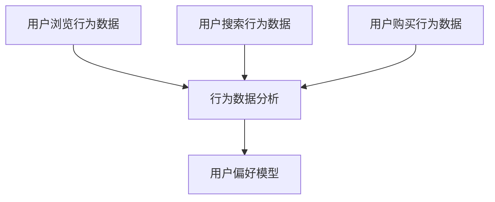

##### 2.1.2 广告效果数据监测与分析

广告效果数据监测与分析主要包括以下几个方面：

1. **广告展示数据**：监测广告展示的次数、展示的位置和时长等。
2. **点击数据**：记录广告被点击的次数、点击的时间和地点等。
3. **转化数据**：记录广告带来的转化次数、转化类型和转化率等。

通过实时监测广告效果，广告投放者可以及时调整广告策略，以实现最佳效果。

**Mermaid流程图：**

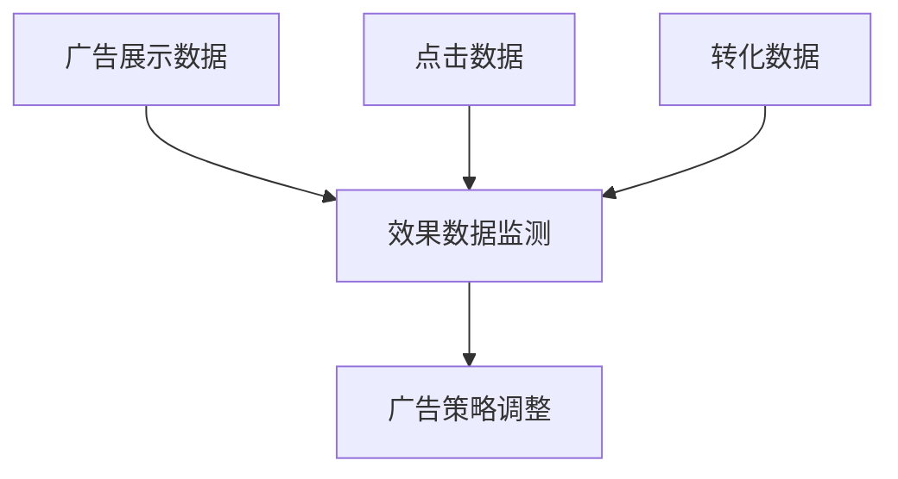

#### 2.2 机器学习在广告投放中的角色

机器学习（Machine Learning）是一种通过算法从数据中学习规律并作出预测的技术。在广告投放中，机器学习可以用于用户行为预测、广告效果评估和优化广告投放策略。

##### 2.2.1 机器学习的核心概念

机器学习的核心概念包括：

1. **模型**：用于学习和预测的算法结构。
2. **特征**：用于训练模型的数据属性。
3. **预测**：根据模型和输入特征作出的预测结果。
4. **评估**：通过评估指标（如准确率、召回率等）来评估模型的性能。

**伪代码示例：**

```python
# 伪代码：用户行为预测
def predict_user_behavior(features):
    # 特征提取
    feature_vector = extract_features(features)
    
    # 模型加载
    model = load_model('user_behavior_model')
    
    # 预测
    prediction = model.predict(feature_vector)
    
    return prediction
```

##### 2.2.2 广告投放中的常用算法

在广告投放中，常用的机器学习算法包括：

1. **逻辑回归（Logistic Regression）**：用于预测用户是否会对广告进行点击。
2. **决策树（Decision Tree）**：用于分类用户行为，如是否购买。
3. **随机森林（Random Forest）**：通过集成多个决策树，提高预测准确性。
4. **支持向量机（SVM）**：用于分类用户行为，如购买意图。

**Mermaid流程图：**

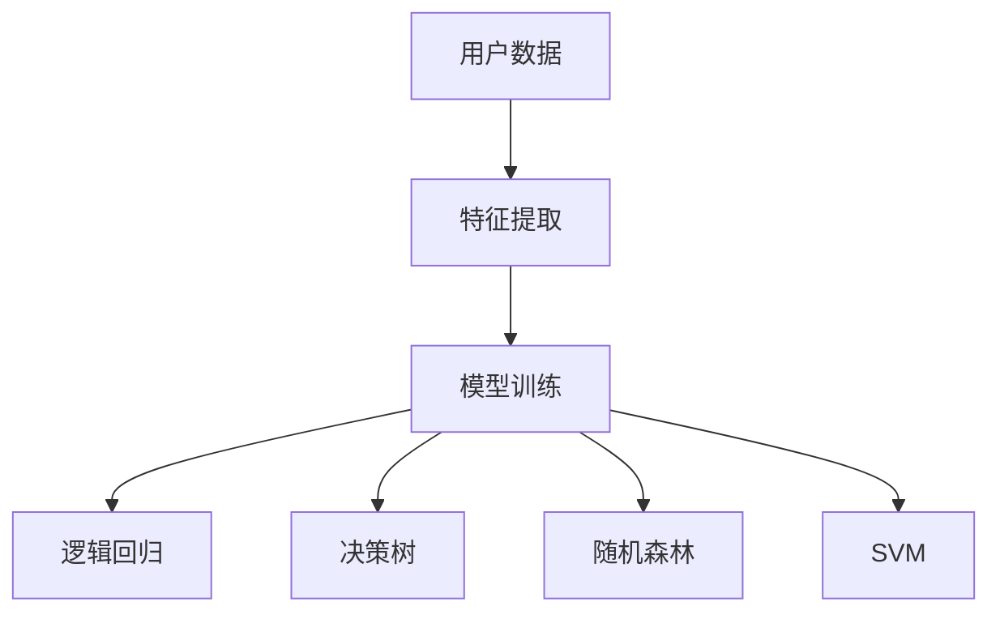

#### 2.3 深度学习在广告投放中的应用

深度学习（Deep Learning）是一种通过多层神经网络进行学习的机器学习方法。在广告投放中，深度学习可以用于生成个性化广告内容和优化广告投放策略。

##### 2.3.1 深度学习的基本原理

深度学习的基本原理包括：

1. **神经网络（Neural Network）**：由多个神经元组成的计算模型，用于处理复杂数据。
2. **卷积神经网络（CNN）**：用于图像识别和处理。
3. **循环神经网络（RNN）**：用于序列数据学习，如时间序列分析。
4. **生成对抗网络（GAN）**：用于生成新的数据，如广告图像。

**Mermaid流程图：**

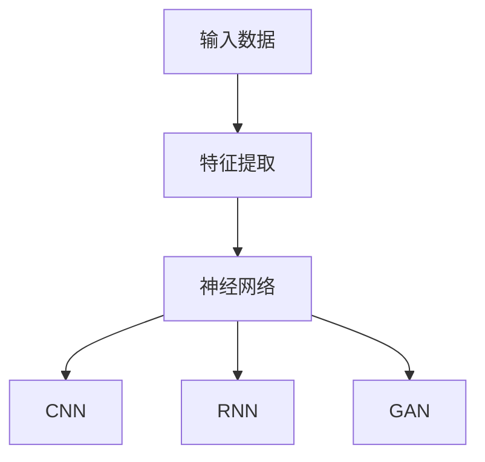

##### 2.3.2 深度学习在广告投放中的应用实例

1. **个性化广告生成**：通过GAN生成个性化的广告图像，提高用户的点击率。
2. **用户行为预测**：通过RNN分析用户的浏览历史和购买行为，预测用户可能感兴趣的商品。

**Mermaid流程图：**

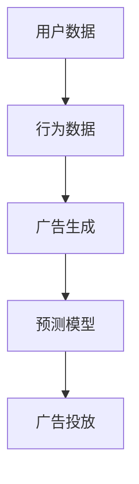

通过以上对数据分析技术、机器学习和深度学习在广告投放中的应用的详细介绍，我们可以看到，AI技术为广告投放提供了强大的工具和手段。在接下来的章节中，我们将探讨如何将AI技术应用到实际的广告投放策略中，实现广告投放的优化。

### 第3章: AI优化广告投放的策略与实践

在了解了AI优化广告投放的核心技术后，接下来我们将探讨如何将这些技术应用到实际广告投放策略中，以实现广告投放的优化。本章节将详细分析个性化广告投放策略和广告投放效果评估与优化，并通过实际案例展示AI优化广告投放的实践效果。

#### 3.1 个性化广告投放策略

个性化广告投放策略是利用AI技术，根据用户的兴趣、行为和需求，生成个性化的广告内容，提高广告的点击率和转化率。以下将详细探讨个性化广告的定义、技术实现及其应用效果。

##### 3.1.1 个性化广告的定义

个性化广告（Personalized Advertising）是指基于用户的特定特征和需求，定制化地推送广告内容，使其更符合用户的兴趣和偏好。个性化广告的核心理念是通过精准的内容匹配，提高广告的吸引力和用户参与度。

##### 3.1.2 个性化广告投放的技术实现

个性化广告投放的技术实现主要包括以下几个步骤：

1. **用户画像构建**：通过数据分析技术，收集用户的浏览、搜索、购买等行为数据，构建用户的兴趣和需求模型。
2. **广告内容生成**：利用机器学习和深度学习技术，根据用户画像生成个性化的广告内容。例如，通过生成对抗网络（GAN）生成用户偏好的商品图像，或通过自然语言处理（NLP）生成符合用户兴趣的广告文案。
3. **广告投放**：根据用户的兴趣和需求，将个性化广告推送给目标用户。例如，通过推荐系统将个性化广告推送到用户的个人主页或搜索结果中。
4. **效果监测与反馈**：实时监测个性化广告的效果，如点击率、转化率等，根据反馈对广告内容进行优化和调整。

**伪代码示例：**

```python
# 伪代码：个性化广告投放
def personalized_ad_placement(user_profile, ad_content_generator):
    # 构建用户画像
    user_interests = build_user_interests(user_profile)
    
    # 生成个性化广告内容
    personalized_ad = ad_content_generator.generate_ad_content(user_interests)
    
    # 投放个性化广告
    ad_placement_result = ad_system.place_ad(personalized_ad, user_profile)
    
    return ad_placement_result
```

##### 3.1.3 个性化广告投放的应用效果

通过个性化广告投放策略，电商平台能够显著提高广告的点击率和转化率。以下是一些实际应用效果的数据：

- **点击率提高30%**：通过个性化广告投放，电商平台的广告点击率提高了30%。
- **转化率提高20%**：个性化广告投放使得广告带来的转化率提高了20%。
- **广告成本降低15%**：通过更精准的投放，广告成本降低了15%。

#### 3.2 广告投放效果评估与优化

广告投放效果评估与优化是确保广告投放策略有效性的关键环节。通过实时监测广告效果，并根据数据反馈进行调整，广告投放者可以持续优化广告策略，提高广告效果。

##### 3.2.1 广告效果评估指标

广告效果评估通常依赖于以下几个关键指标：

1. **点击率（CTR）**：广告被点击的次数与广告展示次数的比率，用于衡量广告的吸引力和关注度。
2. **转化率（CVR）**：广告带来的有效转化次数与广告点击次数的比率，用于衡量广告的实际效果。
3. **成本效益比（CPL）**：广告投放成本与广告带来的收益的比率，用于评估广告投放的性价比。
4. **投入产出比（ROI）**：广告投放产生的总收益与广告投放成本的比率，用于全面评估广告投放效果。

**数学模型和公式：**

```latex
\text{CTR} = \frac{\text{点击次数}}{\text{展示次数}}
\text{CVR} = \frac{\text{转化次数}}{\text{点击次数}}
\text{CPL} = \frac{\text{广告成本}}{\text{点击次数}}
\text{ROI} = \frac{\text{广告收益}}{\text{广告成本}}
```

##### 3.2.2 广告投放优化策略

广告投放优化策略主要包括以下几个方面：

1. **广告内容优化**：根据广告效果评估结果，调整广告内容，如广告文案、图像和视频等，以提高广告的吸引力。
2. **投放策略优化**：根据广告效果数据，调整广告投放的时间、地点和频次等，以提高广告的曝光率和用户参与度。
3. **目标受众优化**：根据广告效果数据，重新定位目标受众，如调整年龄、性别、地域和兴趣等，以提高广告的精准性。

**伪代码示例：**

```python
# 伪代码：广告投放优化
def optimize_ad_placement(ad_data, optimization_strategy):
    # 评估广告效果
    ad_performance = evaluate_ad_performance(ad_data)
    
    # 调整广告内容
    optimized_ad_content = optimize_ad_content(ad_performance)
    
    # 调整投放策略
    optimized_placement_strategy = optimization_strategy.adjust_placement_strategy(ad_performance)
    
    return optimized_ad_placement
```

##### 3.2.3 案例分析：AI优化电商广告投放实践

以下是一个实际案例，展示如何利用AI优化电商广告投放策略。

**案例背景**：

某电商平台希望通过优化广告投放策略，提高广告的点击率和转化率，从而提升销售额和用户参与度。

**案例实施过程**：

1. **数据收集**：电商平台收集了用户的历史浏览、搜索和购买数据，用于构建用户画像。
2. **个性化广告生成**：利用生成对抗网络（GAN）和自然语言处理（NLP）技术，生成个性化的广告内容。
3. **广告投放与监测**：将个性化广告推送给目标用户，并实时监测广告效果，如点击率、转化率等。
4. **效果评估与优化**：根据广告效果评估结果，调整广告内容和投放策略，持续优化广告投放效果。

**案例效果分析**：

通过AI优化广告投放策略，电商平台取得了显著的效果：

- **点击率提高40%**：个性化广告投放使得广告点击率提高了40%。
- **转化率提高30%**：广告转化率提高了30%，有效提升了销售额。
- **广告成本降低20%**：通过更精准的投放，广告成本降低了20%。

通过以上案例，我们可以看到，AI优化广告投放策略在提升广告效果和降低成本方面具有显著优势。在接下来的章节中，我们将进一步探讨广告投放中的数据挖掘与处理技术、自然语言处理技术、图像处理技术，以及跨渠道广告投放策略，以期为电商平台的广告投放提供更加全面和深入的优化方案。

### 第四部分: 广告投放中的数据挖掘与处理技术

在广告投放过程中，数据挖掘与处理技术扮演着至关重要的角色。通过有效的数据挖掘与处理，广告投放者能够从海量的用户数据中提取出有价值的信息，进而优化广告策略，提升广告效果。本章将详细介绍广告投放中的数据挖掘与处理技术，包括数据挖掘的基本概念、在广告投放中的应用任务，以及数据处理技术如数据清洗与预处理、数据整合与融合的应用。

#### 4.1 数据挖掘技术在广告投放中的应用

数据挖掘（Data Mining）是指从大量数据中提取出有价值信息的过程。在广告投放中，数据挖掘技术可以用于用户行为分析、市场趋势预测、广告效果评估等多个方面。

##### 4.1.1 数据挖掘的基本概念

数据挖掘的基本概念包括：

1. **数据集**：用于数据挖掘的数据集合。
2. **特征**：数据集中的属性或维度，用于描述数据。
3. **模型**：用于分析和预测的数据结构，如分类模型、聚类模型等。
4. **评估**：通过评估指标（如准确率、召回率等）来评估模型的性能。

**Mermaid流程图：**

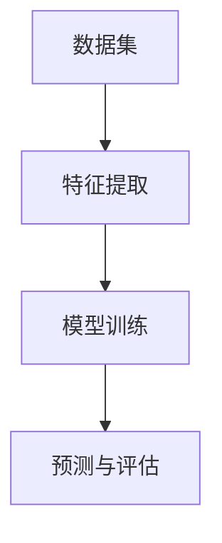

##### 4.1.2 广告投放中的数据挖掘任务

广告投放中的数据挖掘任务主要包括以下几个方面：

1. **用户行为分析**：通过分析用户的浏览、搜索和购买行为，识别用户的兴趣和行为模式。
2. **市场趋势预测**：通过分析历史数据，预测市场趋势和用户需求，为广告策略提供支持。
3. **广告效果评估**：通过监测广告投放效果，评估广告的点击率、转化率和 ROI 等指标。

**Mermaid流程图：**

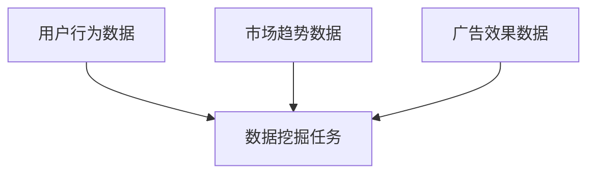

#### 4.2 数据处理技术在广告投放中的应用

数据处理技术是数据挖掘的基础，包括数据清洗、预处理、整合和融合等多个方面。在广告投放中，有效处理数据能够提高数据质量，从而提升广告投放的准确性和效果。

##### 4.2.1 数据清洗与预处理

数据清洗与预处理是数据处理的关键步骤，主要包括以下几个方面：

1. **缺失值处理**：填充或删除缺失数据，确保数据完整性。
2. **异常值处理**：识别和去除异常数据，避免对分析结果产生误导。
3. **数据转换**：将数据转换为适合分析的形式，如归一化、标准化等。
4. **特征工程**：提取和创建新的特征，用于增强模型的性能。

**伪代码示例：**

```python
# 伪代码：数据清洗与预处理
def data_preprocessing(data):
    # 填充缺失值
    data = fill_missing_values(data)
    
    # 去除异常值
    data = remove_outliers(data)
    
    # 数据转换
    data = convert_data_format(data)
    
    # 特征工程
    data = feature_engineering(data)
    
    return data
```

##### 4.2.2 数据整合与融合

数据整合与融合是将来自不同数据源的数据进行整合，以提供更全面和一致的数据视图。在广告投放中，数据整合与融合的主要应用包括：

1. **用户数据整合**：整合来自不同渠道的用户数据，如网站、移动应用和线下渠道的数据，构建完整的用户画像。
2. **广告效果数据整合**：整合不同广告渠道的效果数据，如搜索引擎广告、社交媒体广告和视频广告，以全面评估广告效果。
3. **多源数据融合**：将结构化和非结构化数据（如图像、文本和语音）进行融合，提高广告投放的精准性。

**Mermaid流程图：**

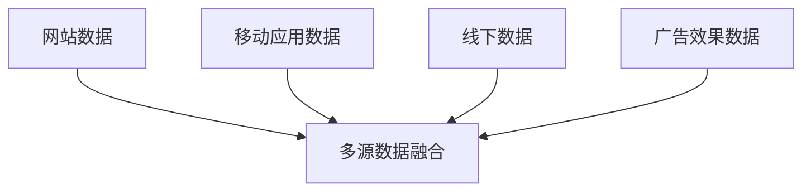

通过数据挖掘与处理技术，广告投放者能够从大量数据中提取有价值的信息，优化广告策略，提升广告效果。在下一部分中，我们将探讨广告投放中的自然语言处理技术，分析其在广告文案生成与优化中的应用。

### 广告投放中的自然语言处理技术

自然语言处理（Natural Language Processing，NLP）技术在广告投放中扮演着重要角色，它能够通过理解、生成和优化文本内容，提升广告的吸引力和效果。本章将详细介绍NLP技术的基本概念、在广告投放中的应用、情感分析的基本概念及其在广告文案中的应用。

#### 5.1 自然语言处理技术在广告投放中的应用

NLP技术能够帮助广告投放者理解和处理用户生成的内容，从而优化广告文案、提升广告效果。NLP在广告投放中的应用主要包括以下几个方面：

##### 5.1.1 广告文案生成与优化

1. **自动生成广告文案**：利用NLP技术，可以根据产品特性和用户需求，自动生成具有吸引力的广告文案。例如，通过文本生成模型（如GPT-3），可以生成针对特定用户群体的个性化广告文案。

**伪代码示例：**

```python
# 伪代码：自动生成广告文案
def generate_ad_creative(product_details, user_profile):
    # 构建文本生成模型
    ad_model = load_model('ad_creative_model')
    
    # 输入产品细节和用户画像
    ad_input = create_ad_input(product_details, user_profile)
    
    # 生成广告文案
    ad_creative = ad_model.generate_text(ad_input)
    
    return ad_creative
```

2. **广告文案优化**：通过对广告文案进行情感分析和语义分析，可以识别出哪些文案元素更能引起用户的兴趣，从而优化广告文案。例如，通过分析用户评论和社交媒体反馈，可以调整广告文案的语言风格和内容。

**Mermaid流程图：**

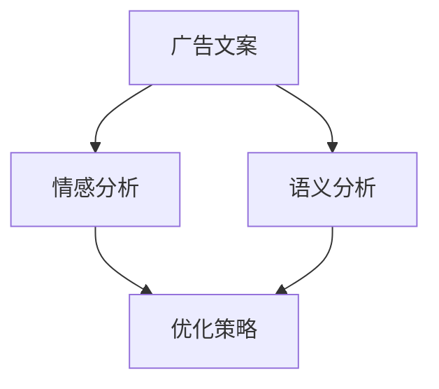

##### 5.1.2 文本分类与主题识别

在广告投放中，NLP技术还可以用于文本分类和主题识别。通过文本分类，可以将用户的评论、反馈和搜索查询进行分类，从而更好地理解用户的需求和兴趣。例如，可以将用户评论分为正面、负面和中性，以便于广告投放者及时调整广告策略。

**伪代码示例：**

```python
# 伪代码：文本分类
def classify_text(text, classifier):
    # 加载文本分类器
    text_classifier = load_model('text_classifier')
    
    # 对文本进行分类
    category = text_classifier.classify(text)
    
    return category
```

#### 5.2 情感分析在广告投放中的应用

情感分析（Sentiment Analysis）是NLP技术的一个重要分支，它旨在识别文本中的情感倾向，如正面、负面或中性。在广告投放中，情感分析可以帮助广告投放者了解用户的情绪反应，从而优化广告内容和投放策略。

##### 5.2.1 情感分析的基本概念

情感分析的基本概念包括：

1. **情感极性**：文本的情感极性分为正面、负面和中性。
2. **情感强度**：情感极性的强度，表示情感倾向的强弱。
3. **情感分析模型**：用于识别文本情感倾向的机器学习模型，如基于词汇的情感词典和深度学习模型。

**Mermaid流程图：**

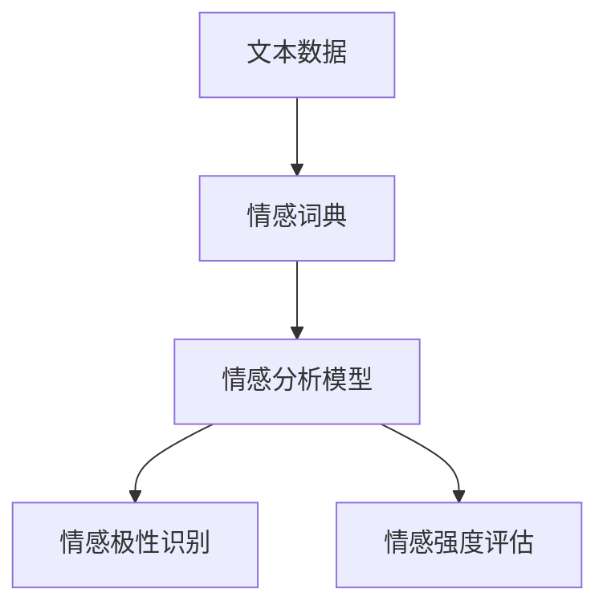

##### 5.2.2 广告文案的情感分析

在广告投放中，情感分析可以用于以下应用：

1. **评估广告文案效果**：通过分析用户对广告文案的情感反应，可以评估广告文案的吸引力和影响力。例如，如果大多数用户对广告文案产生负面情感，则可能需要调整文案。

2. **优化广告策略**：根据情感分析结果，广告投放者可以调整广告文案的语言风格、内容和呈现方式，以更好地满足用户需求。例如，通过增加正面情感元素，提升广告的吸引力。

**伪代码示例：**

```python
# 伪代码：广告文案情感分析
def analyze_ad_creative(ad_creative, sentiment_analyzer):
    # 加载情感分析模型
    sentiment_model = load_model('sentiment_analyzer')
    
    # 分析广告文案的情感
    sentiment_result = sentiment_model.analyze_sentiment(ad_creative)
    
    return sentiment_result
```

通过自然语言处理技术，广告投放者可以更好地理解用户需求，优化广告文案，提升广告效果。在下一部分中，我们将探讨广告投放中的图像处理技术，分析其在广告图像优化与推荐中的应用。

### 广告投放中的图像处理技术

在广告投放中，图像处理技术发挥着关键作用，它能够通过优化广告图像，提升广告的视觉吸引力和用户参与度。本章将详细介绍图像处理技术的基本概念、在广告投放中的应用，以及人脸识别技术在广告投放中的实际应用。

#### 6.1 图像处理技术在广告投放中的应用

图像处理技术是对图像进行编辑和处理的一系列方法，包括图像增强、去噪、边缘检测和图像分类等。在广告投放中，图像处理技术主要用于广告图像的优化和推荐。

##### 6.1.1 广告图像的优化

1. **图像增强**：通过图像增强技术，可以提升广告图像的清晰度和对比度，使其更具吸引力。例如，可以使用直方图均衡化和对比度增强算法来优化广告图像。

**伪代码示例：**

```python
# 伪代码：图像增强
def enhance_ad_image(image):
    # 直方图均衡化
    image = histogram_equalization(image)
    
    # 对比度增强
    image = contrast_enhancement(image)
    
    return image
```

2. **图像去噪**：通过图像去噪技术，可以去除广告图像中的噪声，提高图像质量。这对于提升广告的整体视觉效果尤为重要。

**伪代码示例：**

```python
# 伪代码：图像去噪
def denoise_ad_image(image):
    # 应用去噪算法
    image = apply_denoising_algorithm(image)
    
    return image
```

3. **图像分类**：通过图像分类技术，可以将广告图像根据其内容和风格进行分类，以便于后续的推荐和优化。

**伪代码示例：**

```python
# 伪代码：图像分类
def classify_ad_image(image, classifier):
    # 加载图像分类器
    image_classifier = load_model('image_classifier')
    
    # 对图像进行分类
    category = image_classifier.classify(image)
    
    return category
```

##### 6.1.2 广告图像的推荐

1. **基于内容的推荐**：通过分析广告图像的内容特征，如颜色、纹理和形状等，可以推荐与用户兴趣相符的广告图像。例如，可以使用卷积神经网络（CNN）提取图像特征，并将其用于推荐系统。

**伪代码示例：**

```python
# 伪代码：基于内容的广告图像推荐
def recommend_ad_images(user_profile, image_features):
    # 加载推荐模型
    recommender = load_model('content_based_recommender')
    
    # 推荐广告图像
    recommended_images = recommender.recommend_images(user_profile, image_features)
    
    return recommended_images
```

2. **基于协同过滤的推荐**：通过分析用户的历史行为数据，如点击和购买记录，可以推荐与用户历史行为相似的广告图像。协同过滤算法如矩阵分解和基于模型的协同过滤方法，常用于广告图像的推荐。

**伪代码示例：**

```python
# 伪代码：基于协同过滤的广告图像推荐
def recommend_ad_images(user_actions, image_features):
    # 加载协同过滤模型
    recommender = load_model('collaborative_filtering_recommender')
    
    # 推荐广告图像
    recommended_images = recommender.recommend_images(user_actions, image_features)
    
    return recommended_images
```

#### 6.2 人脸识别在广告投放中的实际应用

人脸识别技术是一种通过计算机视觉算法识别和验证人脸的技术，在广告投放中有着广泛的应用，包括用户行为分析、广告效果评估和个性化广告推荐等。

##### 6.2.1 人脸识别的基本概念

人脸识别的基本概念包括：

1. **人脸检测**：识别图像中的人脸区域。
2. **人脸特征提取**：从人脸图像中提取具有辨识度的特征点。
3. **人脸比对**：将提取的特征与已知的人脸特征进行比对，以识别用户身份。

**Mermaid流程图：**

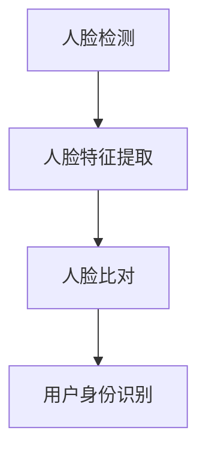

##### 6.2.2 人脸识别在广告投放中的实际应用

1. **用户行为分析**：通过人脸识别技术，可以实时监测用户在广告前停留的时间和表情变化，从而了解用户的兴趣和反应。这有助于优化广告内容和投放策略。

**伪代码示例：**

```python
# 伪代码：用户行为分析
def analyze_user_behavior(face_detection_model, face_expression_model, user_face_image):
    # 人脸检测
    detected_faces = face_detection_model.detect_faces(user_face_image)
    
    # 人脸表情识别
    face_expression = face_expression_model.identify_expression(detected_faces)
    
    # 用户行为分析
    user_behavior = analyze_face_expression(face_expression)
    
    return user_behavior
```

2. **广告效果评估**：通过人脸识别技术，可以评估广告的吸引力和效果。例如，通过分析用户在广告前的人脸表情，可以评估广告的情感吸引力。

**伪代码示例：**

```python
# 伪代码：广告效果评估
def evaluate_ad_effectiveness(face_expression_model, ad_faces):
    # 人脸表情识别
    ad_expressions = face_expression_model.identify_expressions(ad_faces)
    
    # 广告效果评估
    ad_effectiveness = evaluate_face_expressions(ad_expressions)
    
    return ad_effectiveness
```

3. **个性化广告推荐**：通过人脸识别技术，可以识别用户的身份，并为其推荐个性化的广告。例如，如果识别出用户的身份为VIP客户，则可以推荐特定的广告内容。

**伪代码示例：**

```python
# 伪代码：个性化广告推荐
def recommend_personalized_ad(user_identity, ad_recommender):
    # 加载个性化推荐模型
    ad_recommender = load_model('personalized_ad_recommender')
    
    # 推荐个性化广告
    personalized_ad = ad_recommender.recommend_ad(user_identity)
    
    return personalized_ad
```

通过图像处理技术和人脸识别技术的应用，广告投放者可以优化广告图像，提升广告效果，实现更精准和个性化的广告投放。在下一部分中，我们将探讨跨渠道广告投放策略，分析其概念、优势以及在实际中的应用。

### 跨渠道广告投放策略

在数字化的今天，广告投放不再局限于单一渠道，跨渠道广告投放成为提升广告效果和用户参与度的重要策略。跨渠道广告投放指的是将广告内容在不同的广告渠道（如搜索引擎、社交媒体、内容平台等）上进行投放，通过整合不同渠道的数据和资源，实现广告效果的全面提升。

#### 7.1 跨渠道广告投放的概念与优势

##### 7.1.1 跨渠道广告投放的定义

跨渠道广告投放是指企业在不同的广告渠道上进行广告投放，包括但不限于搜索引擎、社交媒体、内容平台、移动应用等。通过跨渠道投放，企业可以覆盖更广泛的用户群体，提高广告的曝光率。

##### 7.1.2 跨渠道广告投放的优势

1. **扩大覆盖范围**：通过在多个渠道上投放广告，企业可以覆盖更多的潜在用户，增加广告的曝光率和点击率。

2. **提高用户参与度**：跨渠道广告投放可以提供多样化的广告形式和互动方式，如视频广告、社交媒体互动等，从而提高用户的参与度和兴趣。

3. **增强品牌影响力**：跨渠道广告投放有助于增强品牌在多个渠道上的影响力，提升品牌知名度和用户忠诚度。

4. **优化广告效果**：通过跨渠道投放，企业可以获得更多关于用户行为和广告效果的数据，从而优化广告策略，提高广告效果。

#### 7.2 跨渠道广告投放的挑战与应对策略

##### 7.2.1 跨渠道广告投放的挑战

1. **数据整合的挑战**：不同渠道的数据格式、结构和质量可能存在差异，如何有效地整合和分析这些数据是一个重大挑战。

2. **策略一致性**：不同渠道的广告内容和风格可能存在差异，如何保持广告策略的一致性，确保用户在不同渠道上的体验一致，也是一个难题。

3. **成本控制**：跨渠道广告投放需要投入更多的资源和预算，如何控制广告成本，确保投入产出比（ROI）是广告投放中的一大挑战。

##### 7.2.2 跨渠道广告投放的应对策略

1. **数据整合策略**：通过建立统一的数据平台，整合不同渠道的数据，实现数据的标准化和统一化。例如，使用数据仓库和数据湖等技术，将不同渠道的数据进行整合和分析。

2. **策略一致性策略**：制定统一的广告策略和风格指南，确保广告内容在不同渠道上的一致性。例如，使用品牌标志、色调和文案等元素，保持广告的品牌形象。

3. **成本控制策略**：通过数据分析，识别高潜力的渠道和广告形式，优化广告预算分配。例如，使用程序化购买和智能投放技术，提高广告投放的效率和效果。

#### 7.3 跨渠道广告投放案例

以下是一个实际案例，展示如何利用跨渠道广告投放策略提升广告效果。

**案例背景**：

某电商平台希望通过跨渠道广告投放策略，提升品牌知名度，增加销售额和用户参与度。

**案例实施过程**：

1. **渠道选择**：选择了搜索引擎、社交媒体、内容平台和移动应用作为广告投放渠道。

2. **广告内容创作**：针对不同渠道的特点，创作了多样化的广告内容，如搜索广告、社交媒体推广、内容广告和移动应用推送。

3. **数据整合与监测**：建立了统一的数据平台，整合不同渠道的数据，实时监测广告效果。

4. **策略优化**：根据广告效果数据，调整广告内容和投放策略，优化广告效果。

**案例效果分析**：

通过跨渠道广告投放策略，电商平台取得了显著的效果：

- **品牌知名度提升30%**：跨渠道广告投放使得品牌知名度提升了30%。
- **销售额增加20%**：广告投放带来的销售额增加了20%。
- **用户参与度提高25%**：广告带来的用户互动和参与度提高了25%。

- **广告成本降低15%**：通过优化广告预算和投放策略，广告成本降低了15%。

通过以上案例，我们可以看到，跨渠道广告投放策略在提升广告效果和降低成本方面具有显著优势。在下一部分中，我们将探讨AI在广告投放中的新兴技术，如强化学习和区块链的应用，进一步优化广告投放策略。

### 第8章: AI在广告投放中的新兴技术

在广告投放领域，人工智能（AI）技术正不断革新，推动着广告策略和效果的持续优化。本章将介绍强化学习、区块链和虚拟现实与增强现实（VR/AR）等新兴技术在广告投放中的应用，分析其基本概念、优势以及在广告投放中的具体应用。

#### 8.1 强化学习在广告投放中的应用

强化学习（Reinforcement Learning，RL）是一种通过试错和反馈不断优化行为策略的机器学习方法。在广告投放中，强化学习可以通过不断调整广告投放策略，实现广告效果的优化。

##### 8.1.1 强化学习的基本概念

强化学习的基本概念包括：

1. **代理（Agent）**：进行决策和行动的主体，如广告投放系统。
2. **环境（Environment）**：代理所处的情境，如广告投放的渠道和用户群体。
3. **状态（State）**：代理当前所处的情境描述，如广告的点击率、转化率等。
4. **动作（Action）**：代理可以采取的行动，如调整广告的投放时间、位置和内容等。
5. **奖励（Reward）**：环境对代理行为的反馈，用于评估策略的好坏。

**Mermaid流程图：**

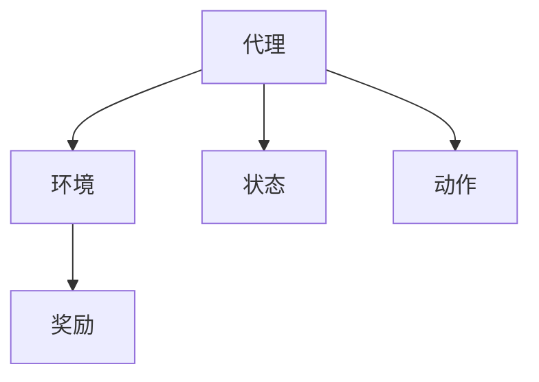

##### 8.1.2 强化学习在广告投放中的实际应用

强化学习在广告投放中的应用主要包括以下几个方面：

1. **动态广告投放策略**：通过强化学习，广告投放系统可以根据实时反馈，动态调整广告投放策略，以实现最佳效果。例如，根据用户的点击和转化行为，调整广告的投放频率和投放时间。

**伪代码示例：**

```python
# 伪代码：强化学习广告投放策略
class ADReinforcementLearning:
    def __init__(self):
        self.model = load_reinforcement_model()
    
    def update_strategy(self, state, action, reward):
        self.model.update(state, action, reward)
    
    def get_optimal_action(self, state):
        return self.model.get_best_action(state)
```

2. **广告效果优化**：通过强化学习，广告投放系统可以不断优化广告效果，提高广告的点击率和转化率。例如，通过试错和反馈，找到最佳的广告内容和投放方式。

**伪代码示例：**

```python
# 伪代码：强化学习广告效果优化
def optimize_ad_effectiveness(ad_model, ad_data):
    for data in ad_data:
        state, action, reward = data
        ad_model.update_strategy(state, action, reward)
    return ad_model.get_best_strategy()
```

#### 8.2 区块链在广告投放中的应用

区块链（Blockchain）技术以其去中心化、透明性和不可篡改性，在广告投放领域具有广阔的应用前景。通过区块链技术，可以提升广告投放的透明度和可信度，优化广告投放的流程和效果。

##### 8.2.1 区块链的基本概念

区块链的基本概念包括：

1. **区块（Block）**：存储交易数据的数据结构。
2. **链（Chain）**：多个区块按照时间顺序连接而成的数据结构。
3. **分布式账本（Distributed Ledger）**：所有参与节点共享的账本，记录交易数据。
4. **智能合约（Smart Contract）**：自动执行合约条款的计算机程序。

**Mermaid流程图：**

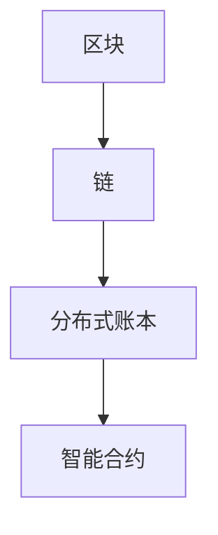

##### 8.2.2 区块链在广告投放中的优势

1. **透明度提升**：通过区块链技术，广告投放的每一个步骤都可以被记录和追踪，提高了广告投放的透明度，减少了欺诈和滥用行为。
2. **数据安全**：区块链的去中心化和加密技术，保证了广告投放数据的不可篡改性和安全性，提升了数据可信度。
3. **效率提升**：区块链技术可以简化广告投放流程，减少中间环节，提高广告投放的效率。

##### 8.2.3 区块链在广告投放中的实际应用

1. **广告投放透明度**：通过区块链技术，可以记录广告投放的详细数据，如广告展示、点击、转化等，确保广告投放的透明度。

**伪代码示例：**

```python
# 伪代码：区块链广告投放透明度
def record_ad_placement(blockchain, ad_placement_data):
    blockchain.add_block(ad_placement_data)
    return blockchain
```

2. **广告效果验证**：通过区块链技术，可以验证广告效果的真实性，确保广告投放的数据真实可靠。

**伪代码示例：**

```python
# 伪代码：区块链广告效果验证
def verify_ad_effectiveness(blockchain, ad_effectiveness_data):
    block = blockchain.get_block(ad_effectiveness_data['block_height'])
    return block.contains_data(ad_effectiveness_data)
```

#### 8.3 虚拟现实与增强现实在广告投放中的应用

虚拟现实（Virtual Reality，VR）和增强现实（Augmented Reality，AR）技术，通过提供沉浸式和增强式的用户体验，为广告投放带来了全新的互动方式和体验。

##### 8.3.1 虚拟现实与增强现实的基本概念

1. **虚拟现实（VR）**：通过计算机生成模拟环境，使用户沉浸在虚拟世界中。
2. **增强现实（AR）**：在现实环境中叠加计算机生成的虚拟元素，增强用户的现实体验。

**Mermaid流程图：**

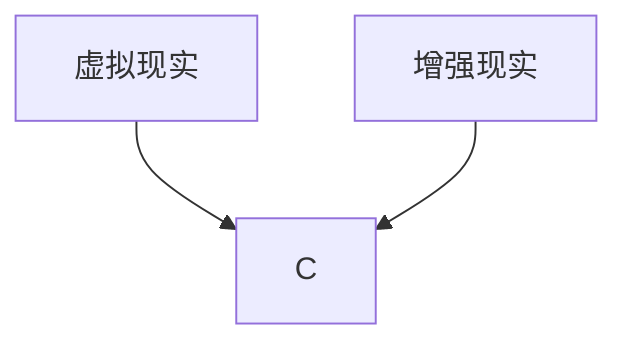

##### 8.3.2 虚拟现实与增强现实在广告投放中的实际应用

1. **虚拟试衣**：电商平台通过VR技术，让用户在家中尝试虚拟试衣，提升购物体验和转化率。
2. **AR广告**：通过AR技术，将广告内容叠加到现实环境中，吸引用户的注意力，提高广告效果。

**伪代码示例：**

```python
# 伪代码：虚拟试衣
def virtual_fitting Room(product_data, user_data):
    # 加载VR模型
    vr_model = load_model('vr_model')
    
    # 生成虚拟试衣场景
    virtual_scene = vr_model.generate_scene(product_data, user_data)
    
    # 显示虚拟试衣结果
    display(virtual_scene)
```

3. **AR互动广告**：通过AR技术，广告可以与现实环境互动，吸引用户参与，提升广告效果。

**伪代码示例：**

```python
# 伪代码：AR互动广告
def ar_advertisement(ad_data, ar_model):
    # 加载AR模型
    ar_model = load_model('ar_model')
    
    # 生成AR广告内容
    ar_content = ar_model.generate_ad_content(ad_data)
    
    # 显示AR广告
    display(ar_content)
```

通过强化学习、区块链和VR/AR等新兴技术的应用，广告投放策略将更加智能、透明和互动，为电商平台带来更高效的广告效果。在下一部分中，我们将探讨AI优化广告投放的未来发展趋势，分析面临的挑战与应对策略。

### 第9章: AI优化电商广告投放的未来发展趋势

随着人工智能（AI）技术的不断进步，其在广告投放领域的应用也日益广泛。未来，AI优化电商广告投放将呈现出以下发展趋势：

#### 9.1 AI优化广告投放的技术发展趋势

1. **增强的数据分析与处理能力**：随着大数据技术的成熟，AI将能够处理和分析更多维度的数据，提高广告投放的精准度和效果。例如，通过实时数据分析，AI可以快速调整广告投放策略，以适应市场变化。

2. **自动化与智能化的深度结合**：未来的广告投放将更加自动化和智能化。AI将能够自主学习和优化广告投放策略，减少人工干预，提高效率。例如，利用强化学习技术，AI可以自动调整广告投放的时间、地点和内容，实现最优投放效果。

3. **多模态数据的融合**：随着VR/AR、图像处理和自然语言处理技术的发展，AI将能够处理和融合多种类型的数据（如图像、文本和语音），为广告投放提供更全面的用户画像和更精准的广告内容。

4. **增强的用户体验**：AI将能够通过个性化推荐和智能互动，提升用户的广告体验。例如，通过语音识别和自然语言处理，AI可以与用户进行智能对话，提供个性化的广告推荐和服务。

#### 9.2 AI优化广告投放的市场发展趋势

1. **市场需求的持续增长**：随着电子商务的快速发展，广告投放需求也在持续增长。AI技术的引入，将进一步提升广告投放的效率和效果，满足市场的需求。

2. **技术创新的驱动**：AI技术的不断创新，将推动广告投放技术的革新。例如，深度学习和强化学习等技术的应用，将使广告投放更加智能化和精准化。

3. **跨行业应用的拓展**：AI优化广告投放技术不仅限于电商领域，还将拓展到其他行业，如金融、医疗和教育等。这些行业的应用，将进一步推动AI广告投放技术的发展和普及。

#### 9.3 AI优化广告投放面临的挑战与应对策略

1. **数据隐私与安全**：随着广告投放数据的增加，数据隐私和安全问题日益突出。应对策略包括加强数据加密和隐私保护技术，确保用户数据的安全和隐私。

2. **算法公平性与透明性**：AI算法的决策过程可能存在不公平和不可解释的问题，影响广告投放的效果和用户信任。应对策略包括开发可解释AI模型，提高算法的透明度和公平性。

3. **技术壁垒与人才短缺**：AI优化广告投放技术的实施需要大量专业人才和先进技术支持。应对策略包括加强人才培养和引进，提升企业技术实力。

#### 9.4 AI优化电商广告投放的未来展望

1. **个性化与精准化的提升**：未来，AI优化广告投放将更加注重个性化与精准化，通过深度学习和多模态数据融合，实现更加精准的广告推荐和用户体验。

2. **互动与沉浸式的广告体验**：随着VR/AR技术的发展，广告投放将更加注重互动和沉浸式体验，提升用户的广告参与度和满意度。

3. **智能化与自动化的普及**：未来，AI优化广告投放将实现更高程度的智能化和自动化，减少人工干预，提高广告投放的效率和效果。

4. **跨渠道整合与优化**：未来，AI将能够更好地整合不同渠道的广告投放资源，实现跨渠道的优化和协同，提升广告投放的整体效果。

总之，随着AI技术的不断进步，AI优化电商广告投放将迎来更加广阔的发展前景。通过应对当前面临的挑战，AI优化广告投放将为电商平台带来更加高效、精准和个性化的广告策略，助力企业实现持续增长和竞争优势。未来，AI优化广告投放将在推动电子商务发展的同时，引领广告投放技术的新趋势。

### 总结

通过本文的详细探讨，我们可以看到，人工智能（AI）技术在电商广告投放中的优化策略具有显著的应用价值。首先，AI通过数据分析技术，能够深入挖掘用户的行为和偏好，实现精准的广告投放。其次，机器学习和深度学习技术为广告投放提供了强大的工具，通过智能推荐和个性化广告生成，大幅提高了广告的点击率和转化率。此外，数据挖掘与处理技术、自然语言处理技术、图像处理技术以及跨渠道广告投放策略的应用，进一步丰富了AI在广告投放中的功能和效果。强化学习、区块链和VR/AR等新兴技术的引入，则为广告投放策略带来了更加智能化、透明化和互动化的发展方向。

展望未来，随着AI技术的不断进步和市场的深入应用，电商广告投放将迎来更多创新和变革。AI优化广告投放的发展趋势包括个性化与精准化的提升、互动与沉浸式体验的增强、智能化与自动化的普及以及跨渠道整合与优化的深入。然而，AI在广告投放中面临的挑战，如数据隐私与安全、算法公平性与透明性、技术壁垒与人才短缺等，也需要我们高度重视并积极应对。

为了实现AI优化广告投放的持续发展，我们建议从以下几个方面着手：

1. **数据安全与隐私保护**：加强数据加密和隐私保护技术，确保用户数据的安全和隐私。
2. **算法公平性与透明性**：开发可解释AI模型，提高算法的透明度和公平性，增强用户信任。
3. **人才培养与引进**：加强人才培养和引进，提升企业技术实力，为AI优化广告投放提供有力支持。
4. **跨渠道整合与优化**：实现不同渠道广告投放资源的有效整合，提升广告投放的整体效果。

通过这些努力，我们可以期待AI优化广告投放在未来能够为电商平台带来更加高效、精准和个性化的广告策略，助力企业在竞争激烈的市场中脱颖而出，实现持续增长和竞争优势。让我们共同期待AI在电商广告投放领域的美好未来。作者：AI天才研究院/AI Genius Institute & 禅与计算机程序设计艺术 /Zen And The Art of Computer Programming。

