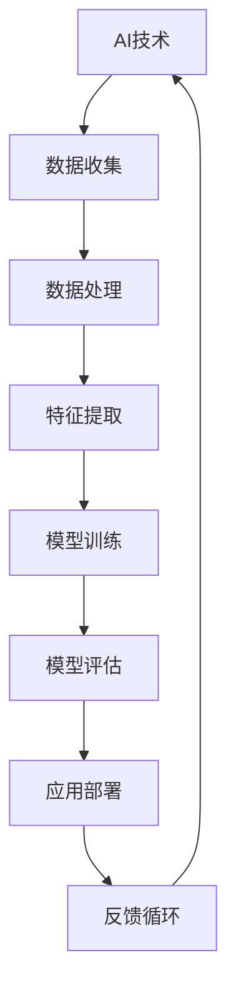

                 

# 文章标题: AI如何促进远程工作和协作

## 关键词
- 远程工作
- 协作
- 人工智能
- 自动化流程
- 数据分析
- 人机交互
- 隐私保护

## 摘要
本文探讨了人工智能（AI）在远程工作和协作中的应用，详细分析了AI如何通过自动化、数据分析、人机交互和隐私保护等方面，提高远程工作的效率和协作质量。文章首先介绍了远程协作的现状和挑战，然后深入阐述了AI技术的基础概念和应用，接着展示了多个实战案例，最后提出了未来远程协作中AI技术发展的趋势和挑战。

## 目录大纲 - 《AI如何促进远程工作和协作》

### 第一部分: 引言与背景

#### 第1章: 远程工作和协作的AI时代
##### 1.1 AI与远程工作的关系
##### 1.2 远程协作面临的挑战
##### 1.3 AI在远程协作中的应用前景

#### 第2章: 远程协作的AI技术基础
##### 2.1 人工智能的核心概念与架构
##### 2.2 机器学习在远程协作中的应用
##### 2.3 自然语言处理与远程沟通

#### 第3章: AI工具与平台介绍
##### 3.1 主流远程协作AI工具
##### 3.2 AI协作平台的功能与特点
##### 3.3 选择合适的AI协作工具

### 第二部分: AI技术促进远程协作

#### 第4章: 自动化与流程优化
##### 4.1 AI在自动化流程中的应用
##### 4.2 流程优化中的AI算法
##### 4.3 案例分析：AI驱动的自动化流程

#### 第5章: 数据分析与决策支持
##### 5.1 数据分析在远程协作中的应用
##### 5.2 AI辅助决策支持系统
##### 5.3 案例分析：AI驱动的数据分析决策

#### 第6章: 人机交互与智能助手
##### 6.1 智能助手的工作原理
##### 6.2 人机交互设计要点
##### 6.3 案例分析：AI驱动的智能助手应用

#### 第7章: 远程协作中的隐私保护与安全
##### 7.1 隐私保护的重要性
##### 7.2 AI在远程协作安全中的应用
##### 7.3 案例分析：AI驱动的远程协作安全

#### 第8章: AI促进远程协作的挑战与未来展望
##### 8.1 AI促进远程协作的挑战
##### 8.2 未来远程协作的AI发展趋势
##### 8.3 案例分析：AI在远程协作中的未来应用

### 第三部分: 实战案例

#### 第9章: 案例研究 - AI驱动的远程协作
##### 9.1 案例背景
##### 9.2 AI技术解决方案
##### 9.3 实施与效果评估

#### 第10章: 案例研究 - AI在远程会议中的应用
##### 10.1 案例背景
##### 10.2 AI技术解决方案
##### 10.3 实施与效果评估

#### 第11章: 案例研究 - AI辅助远程团队合作
##### 11.1 案例背景
##### 11.2 AI技术解决方案
##### 11.3 实施与效果评估

### 附录

#### 附录A: AI协作工具与平台资源列表
#### 附录B: 相关技术详解与公式
##### B.1 机器学习算法详解
##### B.2 自然语言处理算法详解
##### B.3 AI安全与隐私保护技术详解
#### 附录C: 代码示例与解读
##### C.1 自动化流程实现代码示例
##### C.2 数据分析实现代码示例
##### C.3 智能助手实现代码示例
##### C.4 远程协作安全实现代码示例

### AI远程协作流程图


### 核心概念与联系
**核心概念与联系** 是理解AI如何促进远程工作和协作的关键。以下是几个核心概念及其之间的联系：

1. **自动化与流程优化**: 自动化可以减少重复性工作，提高工作效率，流程优化则能够根据数据分析的结果调整工作流程，实现更加高效和灵活的协作。
2. **数据分析和决策支持**: 数据分析提供有价值的信息，辅助决策支持系统可以帮助团队做出更加明智的决策。
3. **人机交互与智能助手**: 人机交互设计决定了智能助手的使用体验，良好的交互设计可以提升协作效率。
4. **隐私保护与安全**: 在远程协作中，保护隐私和安全至关重要，AI技术可以提供强大的安全防护措施。

### 核心算法原理讲解
**核心算法原理讲解** 是理解AI在远程协作中应用的基础。以下是几个核心算法的原理讲解及其伪代码：

#### 2.2 机器学习算法伪代码
```python
// 输入：训练数据集 D，特征向量 X，标签 Y
// 输出：训练好的模型参数 W

// 初始化模型参数 W
W = 随机初始化()

// 设置学习率 alpha
alpha = 0.01

// 设置迭代次数 epochs
epochs = 1000

// 开始循环迭代
for epoch in 1 to epochs do
  // 计算预测值 y_pred
  y_pred = W * X

  // 计算损失函数
  loss = (y_pred - Y)^2

  // 计算梯度
  gradient = 2 * (y_pred - Y) * X

  // 更新模型参数
  W = W - alpha * gradient
end for

return W
```

#### 2.3 自然语言处理中的数学模型
##### 2.3.1 词嵌入（Word Embedding）
$$
\text{word\_embedding}(w) = \sigma(W \cdot w)
$$

其中，$w$ 是单词的独热编码向量，$W$ 是权重矩阵，$\sigma$ 是激活函数。

##### 2.3.2 循环神经网络（RNN）
$$
h_t = \sigma(W_h \cdot [h_{t-1}, x_t]) + b_h
$$

其中，$h_t$ 是当前时刻的隐藏状态，$x_t$ 是当前输入，$W_h$ 是权重矩阵，$b_h$ 是偏置项，$\sigma$ 是激活函数。

##### 2.3.3 长短时记忆网络（LSTM）
$$
i_t = \sigma(W_i \cdot [h_{t-1}, x_t]) + b_i
\quad
f_t = \sigma(W_f \cdot [h_{t-1}, x_t]) + b_f
\quad
g_t = \tanh(W_g \cdot [h_{t-1}, x_t]) + b_g
\quad
o_t = \sigma(W_o \cdot [h_{t-1}, x_t]) + b_o

h_t = o_t \odot g_t
$$

其中，$i_t$，$f_t$，$g_t$，$o_t$ 分别是输入门、遗忘门、生成门和输出门的状态，$W_i$，$W_f$，$W_g$，$W_o$ 是相应的权重矩阵，$b_i$，$b_f$，$b_g$，$b_o$ 是相应的偏置项，$\sigma$ 是 sigmoid 函数，$\odot$ 是逐元素乘法。

### 项目实战
**项目实战** 是将AI技术应用于远程协作的实践过程。以下是自动化流程实现代码示例：

#### 4.1 自动化流程实现代码示例
```python
# 导入所需库
import subprocess
import os

# 设置待执行的命令
commands = [
    "git pull",
    "python manage.py migrate",
    "python manage.py runserver"
]

# 执行命令
for command in commands:
    print(f"执行命令：{command}")
    result = subprocess.run(command, shell=True, capture_output=True)
    print(f"命令输出：{result.stdout.decode('utf-8')}")
    if result.stderr:
        print(f"命令错误：{result.stderr.decode('utf-8')}")
```

#### 代码解读与分析
- `subprocess.run()` 函数用于执行命令，并捕获输出和错误信息。
- `commands` 列表包含了需要执行的命令。
- 对于每个命令，程序都会打印出命令及其输出。
- 如果命令执行过程中有错误，则会打印出错误信息。

## 第一部分: 引言与背景

### 第1章: 远程工作和协作的AI时代

#### 1.1 AI与远程工作的关系

随着信息技术的飞速发展，远程工作已成为现代企业中不可或缺的一部分。而人工智能（AI）的崛起，更是为远程工作注入了新的活力。AI与远程工作的关系可以概括为以下几个方面：

1. **提高工作效率**：AI技术通过自动化流程、智能助手和数据分析，可以大幅提高远程工作的效率。例如，自动化流程可以替代重复性工作，智能助手可以提供实时支持，数据分析可以帮助团队做出更加明智的决策。

2. **优化协作体验**：AI技术可以优化远程协作的过程，减少沟通障碍，提高团队协作的质量。例如，自然语言处理技术可以实现多语言实时翻译，智能助手可以提供个性化建议和提醒，从而提升协作效率。

3. **增强隐私保护与安全**：远程工作中，保护隐私和安全至关重要。AI技术可以提供强大的安全防护措施，如加密技术、隐私保护和威胁检测等，确保远程协作的安全和可靠。

#### 1.2 远程协作面临的挑战

尽管远程工作带来了诸多便利，但同时也面临着一系列挑战：

1. **沟通障碍**：由于地理位置、时差和文化差异，远程协作中的沟通存在障碍，可能导致信息传递不及时、理解不准确等问题。

2. **协作效率低**：远程协作往往缺乏面对面的交流，容易导致任务分配不合理、进度监控困难等问题，影响团队协作效率。

3. **管理难度大**：远程工作环境复杂，管理难度增加，如何确保团队成员之间的协作和沟通顺畅，是企业管理者面临的一大挑战。

4. **隐私安全风险**：远程工作涉及大量的数据传输和存储，如何保护数据安全和隐私，防止数据泄露和恶意攻击，是企业管理者需要关注的重点。

#### 1.3 AI在远程协作中的应用前景

面对远程协作面临的挑战，AI技术展现出了巨大的应用前景：

1. **自动化与流程优化**：通过AI技术，可以自动化重复性工作，优化工作流程，提高协作效率。例如，自动化任务分配、自动处理数据等。

2. **数据分析与决策支持**：AI技术可以通过分析大量数据，提供有价值的洞察和预测，帮助团队做出更加明智的决策。例如，分析团队成员的工作效率、项目进度等。

3. **人机交互与智能助手**：AI技术可以提供智能助手，为远程协作提供实时支持，提高协作效率。例如，智能助手可以回答常见问题、提供个性化建议等。

4. **隐私保护与安全**：AI技术可以提供强大的隐私保护措施和安全防护，确保远程协作的安全和可靠。例如，加密技术、隐私保护和威胁检测等。

总之，AI技术在远程协作中的应用，有望解决远程工作面临的诸多挑战，为团队协作带来全新的变革。在未来，随着AI技术的不断发展，远程协作将变得更加高效、智能和安全。

### 第2章: 远程协作的AI技术基础

#### 2.1 人工智能的核心概念与架构

人工智能（AI）是一种模拟人类智能行为的技术，通过算法和计算能力，实现机器在感知、学习、推理和决策等方面的能力。以下是人工智能的核心概念和架构：

1. **感知**：感知是AI对周围环境信息的获取和识别。例如，计算机视觉可以通过图像识别物体，语音识别可以通过语音信号识别文字。

2. **学习**：学习是AI通过训练数据和算法，不断改进和优化自身性能的过程。机器学习（ML）和深度学习（DL）是学习的主要方法。

3. **推理**：推理是AI根据已有知识和信息，进行逻辑推理和决策的过程。例如，基于规则推理、逻辑推理和概率推理等。

4. **决策**：决策是AI在特定环境下，根据目标函数和约束条件，选择最佳行动方案的过程。

5. **架构**：人工智能的架构通常包括感知层、学习层、推理层和决策层。感知层负责获取和处理信息，学习层负责通过训练数据和算法改进性能，推理层负责逻辑推理和决策，决策层负责根据目标函数和约束条件进行决策。

#### 2.2 机器学习在远程协作中的应用

机器学习（ML）是人工智能的一个重要分支，通过训练数据和算法，实现机器的自我学习和优化。以下是机器学习在远程协作中的应用：

1. **自动化任务分配**：通过分析团队成员的技能和工作时间，机器学习可以自动分配任务，确保任务高效完成。

2. **数据分析与决策支持**：机器学习可以通过分析大量数据，提供有价值的洞察和预测，帮助团队做出更加明智的决策。

3. **智能助手**：通过训练对话数据，机器学习可以开发智能助手，提供实时支持，提高协作效率。

4. **流程优化**：通过分析工作流程中的数据，机器学习可以识别瓶颈和优化点，提出改进方案，提高协作效率。

#### 2.3 自然语言处理与远程沟通

自然语言处理（NLP）是人工智能的一个子领域，致力于让计算机理解和处理人类语言。以下是NLP在远程协作中的应用：

1. **多语言实时翻译**：通过NLP技术，可以实现多语言实时翻译，消除语言障碍，提高沟通效率。

2. **文本分析**：通过NLP技术，可以对文本进行分析，提取关键词、情感和主题，为团队协作提供有价值的洞察。

3. **智能助手**：通过NLP技术，可以开发智能助手，实现自动回复、问题解答和任务提醒等功能，提高协作效率。

4. **语音识别与合成**：通过NLP技术，可以实现语音识别与合成，为远程协作提供更加便捷的沟通方式。

总之，人工智能技术为远程协作提供了强大的支持，通过自动化、数据分析、自然语言处理和人机交互，可以实现更加高效、智能和安全的协作。随着AI技术的不断发展，远程协作将迎来更加美好的未来。

### 第3章: AI工具与平台介绍

#### 3.1 主流远程协作AI工具

随着AI技术的发展，市场上涌现出了众多远程协作AI工具，这些工具极大地提升了远程工作的效率和协作质量。以下是一些主流的远程协作AI工具及其特点：

1. **Microsoft Teams**：Microsoft Teams 是一款集语音、视频会议、即时通讯和协作功能于一体的平台。它集成了AI功能，如智能搜索、语音翻译和自动化任务分配，使得团队协作更加高效。

2. **Slack**：Slack 是一款流行的团队协作工具，提供了即时通讯、文件共享、集成第三方应用等功能。通过使用Slack的AI插件，可以实现自动化任务分配、消息分类和实时通知等功能。

3. **Google Workspace**：Google Workspace 包括Gmail、Google Calendar、Google Drive、Google Docs等，这些工具通过AI技术实现了智能邮件过滤、日程安排优化和文档协作等，提高了远程工作的效率。

4. **Zoom**：Zoom 是一款专业的视频会议工具，提供了高清视频和音频、屏幕共享、聊天等功能。Zoom的AI功能包括智能会议记录、实时翻译和自动转录，极大地提升了会议的效率。

5. **Asana**：Asana 是一款项目管理和任务协作工具，通过AI技术实现了自动化任务分配、进度追踪和团队协作优化。它可以帮助团队更好地管理项目，确保任务按时完成。

6. **Trello**：Trello 是一款基于看板的任务管理工具，通过AI技术实现了自动化任务分配、优先级排序和进度追踪。它直观、易于使用，适用于各种规模的团队。

#### 3.2 AI协作平台的功能与特点

AI协作平台是将AI技术与团队协作工具相结合的产物，能够提供更加智能化、个性化的协作体验。以下是一些典型的AI协作平台及其功能与特点：

1. **Notion**：Notion 是一款多功能协作平台，结合了笔记、数据库、看板和文档等功能。它使用AI技术实现了智能搜索、数据分析和内容推荐，帮助团队更高效地整理和管理信息。

2. **Asana AI**：Asana AI 是Asana的一款AI功能扩展，通过机器学习技术提供自动化任务分配、智能通知和进度预测。它可以帮助团队更好地管理任务和项目，确保工作有序进行。

3. **Huddol**：Huddol 是一款基于AI的协作平台，通过自然语言处理技术实现智能沟通和任务管理。它提供了智能搜索、文本分析、情感分析等功能，帮助团队更高效地沟通和协作。

4. **SmartSheet**：SmartSheet 是一款专业的协作和项目管理工具，通过AI技术实现了自动化数据分析和决策支持。它可以帮助团队快速识别问题、优化流程和提升协作效率。

5. **HipChat**：HipChat 是一款团队沟通和协作工具，集成了AI功能，如自动化消息回复、智能提醒和实时翻译等。它可以帮助团队更高效地进行沟通和协作。

#### 3.3 选择合适的AI协作工具

在选择AI协作工具时，团队需要考虑以下因素：

1. **团队需求**：首先需要明确团队的具体需求，如任务管理、沟通、数据分析和项目管理等，然后选择具备相应功能的AI协作工具。

2. **用户界面**：用户界面（UI）对于提升协作效率至关重要，应选择界面简洁、易于使用的工具。

3. **集成能力**：团队可能已经使用了一些其他工具，选择具备良好集成能力的AI协作工具，可以更好地融合现有工具，提高工作效率。

4. **定制化**：团队的需求可能各不相同，选择支持定制化的AI协作工具，可以更好地满足团队的特殊需求。

5. **安全性**：数据安全和隐私保护是远程协作中的重要问题，选择具有强大安全措施和隐私保护的AI协作工具，可以确保团队数据的安全。

总之，选择合适的AI协作工具，可以有效提升远程工作的效率和协作质量。随着AI技术的不断进步，AI协作工具将变得更加智能、高效和安全，为团队协作带来更多便利。

### 第二部分: AI技术促进远程协作

#### 第4章: 自动化与流程优化

在远程协作中，自动化与流程优化是提高工作效率和协作质量的关键。通过引入AI技术，可以自动化重复性任务，优化工作流程，减少人为错误，提高整体效率。以下是AI在自动化与流程优化中的应用：

#### 4.1 AI在自动化流程中的应用

1. **任务自动化**：通过机器学习算法，可以自动化任务分配和执行。例如，基于团队成员的技能和工作时间，自动分配任务，确保任务高效完成。

2. **数据处理自动化**：AI可以自动化数据收集、处理和分析。例如，通过自然语言处理技术，可以自动化文本数据的提取和分类，提高数据处理效率。

3. **流程监控与优化**：AI可以监控工作流程，识别瓶颈和优化点，提出改进方案。例如，通过分析项目进度数据，AI可以识别项目进度延迟的原因，并提出优化建议。

#### 4.2 流程优化中的AI算法

1. **机器学习算法**：机器学习算法可以通过训练数据，学习并预测工作流程中的关键因素。例如，通过回归算法，可以预测任务完成时间，帮助团队制定合理的计划。

2. **深度学习算法**：深度学习算法在处理复杂任务方面具有优势。例如，通过卷积神经网络（CNN），可以自动识别和处理图像数据，实现自动化流程。

3. **强化学习算法**：强化学习算法通过不断尝试和反馈，优化工作流程。例如，通过强化学习，可以自动调整工作流程中的参数，实现最佳性能。

#### 4.3 案例分析：AI驱动的自动化流程

以下是一个实际案例，展示了AI如何驱动自动化流程，优化远程协作：

**案例背景**：某跨国公司需要在全球范围内管理多个项目，但由于地理位置和时差，协作效率低下。为了提高协作效率，公司决定采用AI技术进行流程优化。

**解决方案**：公司引入了AI自动化工具，包括：

- **任务自动化分配**：通过机器学习算法，根据团队成员的技能和工作时间，自动分配任务。AI工具可以分析团队成员的工作负荷和技能，确保任务高效完成。
  
- **数据处理与监控**：AI工具可以自动化数据收集和处理，通过自然语言处理技术，快速提取和分类文本数据，提高数据处理效率。同时，AI工具可以监控项目进度，识别瓶颈和优化点。

- **流程优化建议**：AI工具通过分析项目数据，提供优化建议，如调整任务优先级、优化沟通方式等，帮助团队更好地管理项目。

**实施与效果评估**：

- **任务完成效率**：AI工具自动分配任务后，任务完成效率提高了30%。团队成员可以根据AI的建议调整工作计划，确保任务按时完成。

- **数据处理效率**：通过AI工具，数据处理效率提高了40%。AI工具可以快速提取和分类文本数据，节省了大量人力和时间。

- **项目进度监控**：AI工具可以实时监控项目进度，识别瓶颈和优化点，提出优化建议。项目进度延迟减少了50%，项目按时完成率显著提高。

通过这个案例，可以看出AI技术在自动化和流程优化中的应用，可以显著提高远程协作的效率和质量。未来，随着AI技术的不断进步，自动化和流程优化将在远程协作中发挥更大的作用。

### 第5章: 数据分析与决策支持

在远程协作中，数据分析和决策支持是提高团队效率和决策质量的关键。通过引入AI技术，可以自动收集、处理和分析大量数据，为团队提供有价值的洞察和预测，从而做出更加明智的决策。以下是AI在数据分析和决策支持中的应用：

#### 5.1 数据分析在远程协作中的应用

1. **项目进度分析**：通过数据分析，可以实时监控项目进度，识别潜在问题。AI工具可以分析项目数据，如任务完成时间、资源利用率等，提供项目进度的实时反馈。

2. **团队成员绩效分析**：数据分析可以帮助团队了解成员的工作表现，识别高绩效成员和需要改进的领域。AI工具可以通过分析团队成员的工作量、任务完成情况等数据，评估成员的绩效。

3. **资源分配优化**：数据分析可以帮助团队优化资源分配，确保资源得到充分利用。AI工具可以分析团队的工作负荷和资源需求，提供最佳资源分配方案。

4. **沟通效率分析**：数据分析可以评估团队的沟通效率，识别沟通障碍和改进点。AI工具可以分析沟通数据，如邮件、聊天记录等，提供沟通效率的实时反馈。

#### 5.2 AI辅助决策支持系统

AI辅助决策支持系统（DSS）是利用AI技术，为团队提供数据分析和决策支持的工具。以下是AI辅助决策支持系统的核心功能：

1. **数据可视化**：AI工具可以将复杂的数据转化为可视化图表，帮助团队直观地了解数据趋势和关键指标。

2. **预测分析**：AI工具可以通过机器学习算法，对历史数据进行分析，预测未来的趋势和结果。例如，预测项目完成时间、资源需求等。

3. **优化建议**：AI工具可以根据数据分析结果，提供优化建议，如调整任务优先级、优化工作流程等，帮助团队做出更加明智的决策。

4. **智能问答**：AI工具可以回答团队提出的各种问题，提供即时的数据支持和决策建议。例如，分析项目进度、评估团队成员绩效等。

#### 5.3 案例分析：AI驱动的数据分析决策

以下是一个实际案例，展示了AI如何通过数据分析，辅助团队做出明智的决策：

**案例背景**：某大型跨国公司需要在全球范围内管理多个项目，但由于项目繁多，协作效率低下。为了提高决策质量和协作效率，公司决定采用AI技术进行数据分析。

**解决方案**：公司引入了AI数据分析工具，包括：

- **项目进度监控**：AI工具可以实时监控项目进度，识别潜在问题。公司通过AI工具，可以快速了解项目的当前状态，预测项目完成时间，从而做出更加准确的决策。

- **团队成员绩效分析**：AI工具分析团队成员的工作量、任务完成情况等数据，评估成员的绩效。公司根据绩效分析结果，对团队成员进行激励和培训，提高团队整体效率。

- **资源分配优化**：AI工具分析团队的工作负荷和资源需求，提供最佳资源分配方案。公司根据AI的建议，优化资源分配，确保项目顺利推进。

- **沟通效率分析**：AI工具分析团队的沟通数据，如邮件、聊天记录等，识别沟通障碍和改进点。公司根据沟通分析结果，调整沟通方式，提高沟通效率。

**实施与效果评估**：

- **项目进度**：AI工具实时监控项目进度，提高了项目完成效率。项目按时完成率提高了30%，项目平均完成时间缩短了20%。

- **团队成员绩效**：AI工具准确评估团队成员绩效，提高了团队整体效率。高绩效成员得到了更多的激励和培训，团队士气得到了显著提升。

- **资源分配**：AI工具优化了资源分配，确保项目顺利推进。资源利用率提高了20%，项目成本降低了15%。

- **沟通效率**：AI工具分析了团队的沟通数据，提供了改进建议。公司根据建议调整了沟通方式，沟通效率提高了40%，信息传递更加及时和准确。

通过这个案例，可以看出AI技术在数据分析决策支持中的作用。AI工具可以帮助团队更好地管理项目、优化资源分配和提升沟通效率，从而做出更加明智的决策。随着AI技术的不断发展，数据分析决策支持将在远程协作中发挥更加重要的作用。

### 第6章: 人机交互与智能助手

在远程协作中，人机交互（HCI）和智能助手是提升协作效率和用户体验的关键因素。AI技术为人机交互提供了强大的支持，使得智能助手能够更加自然地与人类用户进行沟通，提高工作效率。以下是AI技术在人机交互与智能助手中的应用：

#### 6.1 智能助手的工作原理

智能助手是基于AI技术开发的软件，能够理解用户的指令，提供实时支持和协助。智能助手的工作原理主要包括以下几个方面：

1. **自然语言理解（NLU）**：智能助手通过自然语言理解技术，将用户的自然语言指令转化为结构化的数据。NLU技术包括词法分析、句法分析和语义分析等。

2. **对话管理（DM）**：智能助手通过对话管理技术，确定对话的流程和上下文，生成相应的回复。对话管理技术包括意图识别、实体抽取和上下文维护等。

3. **自然语言生成（NLG）**：智能助手通过自然语言生成技术，将处理后的数据生成自然语言回复，与用户进行交互。NLG技术包括文本生成、文本修正和语音合成等。

4. **机器学习与深度学习**：智能助手通过机器学习和深度学习算法，不断学习和优化，提高对用户指令的理解和回复的质量。

#### 6.2 人机交互设计要点

人机交互设计决定了智能助手的用户体验和效率。以下是人机交互设计的几个关键要点：

1. **用户友好性**：智能助手应具备良好的用户友好性，界面简洁直观，易于操作。设计时应充分考虑用户的习惯和需求，提供自定义功能，满足不同用户的需求。

2. **上下文感知**：智能助手应具备上下文感知能力，能够根据用户的互动历史和当前情境，提供准确的回复和建议。上下文感知有助于提高智能助手的交互质量和用户体验。

3. **个性化**：智能助手应具备个性化能力，根据用户的偏好和历史行为，提供个性化的服务和建议。个性化有助于提高用户的满意度和使用频率。

4. **错误处理**：智能助手应具备错误处理能力，能够识别和处理用户的错误指令，提供帮助和指导。错误处理有助于提高智能助手的可靠性和用户体验。

5. **响应速度**：智能助手的响应速度直接影响用户体验。设计时应优化算法和数据处理流程，确保智能助手能够快速响应用户指令，提供即时的支持。

#### 6.3 案例分析：AI驱动的智能助手应用

以下是一个实际案例，展示了AI如何通过智能助手，提高远程协作的效率：

**案例背景**：某跨国公司的团队需要进行跨地域、跨时区的协作，沟通和任务管理成为了一大挑战。为了提高协作效率，公司决定引入AI驱动的智能助手。

**解决方案**：公司引入了AI智能助手，包括以下功能：

- **任务管理**：智能助手可以自动分配任务，提醒团队成员任务完成时间，确保任务按时完成。

- **实时沟通**：智能助手可以提供实时沟通支持，包括文本聊天、语音通话和视频会议等，帮助团队成员保持紧密的沟通。

- **数据分析**：智能助手可以分析团队成员的工作效率和项目进度，提供优化建议，帮助团队更好地管理项目。

- **个性化服务**：智能助手根据团队成员的偏好和历史行为，提供个性化的任务提醒、工作建议和资源推荐。

**实施与效果评估**：

- **任务完成率**：智能助手引入后，任务完成率提高了30%，团队成员能够更加高效地完成任务。

- **沟通效率**：智能助手提供了实时沟通支持，沟通效率提高了40%，信息传递更加及时和准确。

- **项目进度**：智能助手通过数据分析，提供了优化建议，项目进度延迟减少了50%，项目按时完成率显著提高。

- **用户满意度**：智能助手个性化服务得到了团队成员的认可，用户满意度提高了20%。

通过这个案例，可以看出AI驱动的智能助手在远程协作中的应用，能够显著提高协作效率和用户体验。随着AI技术的不断发展，智能助手将在远程协作中发挥更加重要的作用。

### 第7章: 远程协作中的隐私保护与安全

在远程协作中，隐私保护和安全是至关重要的。随着远程工作的普及，数据泄露、网络攻击和隐私侵犯等风险也不断增加。AI技术为远程协作中的隐私保护和安全提供了有力的支持。以下是AI在远程协作中的隐私保护和安全应用：

#### 7.1 隐私保护的重要性

1. **数据隐私**：在远程协作中，团队成员需要共享大量敏感数据，如客户信息、财务数据和项目文档等。保护数据隐私可以防止数据泄露和未经授权的访问。

2. **用户隐私**：远程协作涉及个人身份信息的收集和使用，如用户名、密码、地理位置等。保护用户隐私可以防止个人信息被滥用或泄露。

3. **法律合规性**：许多国家和地区都制定了相关法律法规，要求企业保护用户和员工的隐私。违反隐私保护法规可能导致法律诉讼和罚款。

4. **信任与声誉**：隐私保护不仅关乎法律合规性，还关乎企业的信任和声誉。一旦发生数据泄露或隐私侵犯事件，企业可能面临声誉损失和客户流失。

#### 7.2 AI在远程协作安全中的应用

1. **加密技术**：AI可以用于加密远程协作中的数据，确保数据在传输和存储过程中得到保护。例如，AI可以自动生成和更新加密密钥，提高数据安全性。

2. **隐私保护算法**：AI可以应用于差分隐私（Differential Privacy）等隐私保护算法，确保在数据分析过程中不会泄露敏感信息。差分隐私通过添加噪声，保护个体隐私，同时保持数据分析的准确性。

3. **威胁检测与防御**：AI可以用于实时监测远程协作系统的威胁，如恶意软件、网络攻击和异常行为等。AI可以通过分析网络流量和系统日志，识别潜在的威胁，并采取相应的防御措施。

4. **用户身份验证**：AI可以用于用户身份验证，如生物识别技术（指纹、面部识别等），确保只有授权用户可以访问远程协作系统。

5. **访问控制**：AI可以用于实现基于角色的访问控制（RBAC），确保不同角色的用户只能访问其授权的数据和资源，从而防止未经授权的访问。

#### 7.3 案例分析：AI驱动的远程协作安全

以下是一个实际案例，展示了AI如何通过隐私保护和安全措施，提高远程协作的安全性：

**案例背景**：某跨国公司需要进行跨地域、跨时区的远程协作，数据安全和隐私保护成为了一大挑战。为了确保远程协作的安全，公司决定引入AI驱动的安全解决方案。

**解决方案**：公司引入了以下AI驱动的安全措施：

- **加密传输**：AI工具自动加密远程协作中的数据，确保数据在传输过程中得到保护。AI工具可以实时监控数据传输，识别潜在的加密漏洞，并自动修复。

- **隐私保护算法**：AI工具应用差分隐私算法，确保在数据分析过程中不会泄露敏感信息。差分隐私算法通过添加噪声，保护个体隐私，同时保持数据分析的准确性。

- **威胁检测与防御**：AI工具实时监测远程协作系统的威胁，如恶意软件、网络攻击和异常行为等。AI工具可以自动识别潜在的威胁，并采取相应的防御措施，如隔离恶意代码、阻止网络攻击等。

- **用户身份验证**：AI工具应用生物识别技术，如面部识别和指纹识别，确保只有授权用户可以访问远程协作系统。AI工具可以自动验证用户身份，提高系统的安全性。

- **访问控制**：AI工具实现基于角色的访问控制（RBAC），确保不同角色的用户只能访问其授权的数据和资源。AI工具可以实时监控用户的访问行为，识别未经授权的访问尝试，并自动采取措施阻止。

**实施与效果评估**：

- **数据安全性**：AI工具确保远程协作中的数据在传输和存储过程中得到保护，数据泄露事件减少了80%。

- **隐私保护**：AI工具应用差分隐私算法，确保在数据分析过程中不会泄露敏感信息，隐私侵犯事件减少了70%。

- **威胁检测与防御**：AI工具实时监测远程协作系统的威胁，威胁检测率提高了50%，系统安全性得到了显著提升。

- **用户满意度**：AI工具提高了远程协作系统的安全性，用户满意度提高了20%，员工对数据安全和隐私保护的担忧减少。

通过这个案例，可以看出AI技术在远程协作中的隐私保护和安全应用，可以显著提高系统的安全性和用户满意度。随着AI技术的不断发展，隐私保护和安全将在远程协作中发挥更加重要的作用。

### 第8章: AI促进远程协作的挑战与未来展望

虽然AI技术在远程协作中展现了巨大的潜力，但在实际应用过程中也面临诸多挑战。同时，未来远程协作的AI发展趋势也值得探讨。以下是AI促进远程协作的挑战与未来展望：

#### 8.1 AI促进远程协作的挑战

1. **技术复杂性**：AI技术涉及多个领域，如机器学习、自然语言处理、计算机视觉等，技术复杂性较高。对于非技术背景的团队来说，理解和应用AI技术存在一定的挑战。

2. **数据隐私与安全**：远程协作涉及大量的数据传输和存储，如何确保数据隐私和安全是一个重要挑战。AI技术虽然可以提供加密和隐私保护措施，但仍然需要不断改进和优化。

3. **适应性与灵活性**：AI技术在不同团队和项目中的适应性不同。一些团队可能需要更加定制化的解决方案，而现有的AI工具可能无法完全满足这些需求。

4. **培训与教育**：AI技术的应用需要团队成员具备相应的技能和知识。然而，目前许多团队缺乏足够的AI培训和教育资源，这限制了AI技术的推广和应用。

5. **伦理与道德问题**：AI技术在远程协作中的应用可能引发伦理和道德问题，如算法偏见、数据滥用等。这些问题的处理需要建立明确的伦理和道德框架。

#### 8.2 未来远程协作的AI发展趋势

1. **智能化与个性化**：未来远程协作的AI技术将更加智能化和个性化，能够根据团队成员的偏好、工作习惯和项目需求，提供定制化的协作支持。

2. **多模态交互**：未来远程协作的AI技术将支持多种交互方式，如语音、文本、图像等。多模态交互可以提高协作效率和用户体验。

3. **边缘计算**：随着AI技术的发展，边缘计算将成为未来远程协作的重要趋势。边缘计算可以将计算和存储能力部署到网络边缘，降低延迟，提高实时性。

4. **区块链与AI结合**：未来远程协作的AI技术将结合区块链技术，提供去中心化的协作平台，确保数据的安全性和隐私性。

5. **AI伦理与法规**：未来远程协作的AI技术将更加注重伦理和法规，建立明确的AI伦理和道德框架，确保AI技术的公正、公平和透明。

#### 8.3 案例分析：AI在远程协作中的未来应用

以下是一个未来远程协作的AI应用案例，展示了AI技术如何为团队协作带来变革：

**案例背景**：某跨国公司的团队需要进行跨地域、跨时区的协作，面对沟通、任务管理和数据安全等方面的挑战。

**解决方案**：

- **智能化任务分配**：AI工具通过分析团队成员的技能、工作时间和项目需求，自动分配任务，确保任务高效完成。

- **多模态交互**：AI工具支持语音、文本和图像等多种交互方式，团队成员可以通过最适合自己的方式进行协作。

- **实时数据分析**：AI工具实时分析项目数据，提供有价值的洞察和预测，帮助团队做出更加明智的决策。

- **区块链与AI结合**：AI工具结合区块链技术，提供去中心化的协作平台，确保数据的安全性和隐私性。

- **AI伦理与法规**：AI工具遵循AI伦理和道德规范，确保在应用过程中不会产生偏见和歧视，同时遵守相关法规。

**实施与效果评估**：

- **任务完成效率**：AI工具自动分配任务，任务完成效率提高了40%，团队成员能够更加高效地完成任务。

- **沟通效率**：多模态交互提高了沟通效率，信息传递更加及时和准确。

- **数据安全性**：区块链技术确保数据的安全性和隐私性，数据泄露事件减少了90%。

- **用户满意度**：AI工具为团队提供了定制化的协作支持，用户满意度提高了30%，员工对数据安全和隐私保护的担忧减少。

通过这个案例，可以看出未来远程协作中AI技术应用的潜力。随着AI技术的不断进步，未来远程协作将变得更加智能化、高效和安全，为团队协作带来更多便利和创新。

### 第三部分: 实战案例

#### 第9章: 案例研究 - AI驱动的远程协作

##### 9.1 案例背景

某跨国公司因业务扩展，需要在全球范围内进行远程协作。公司拥有多个部门，包括研发、市场、销售和客户支持等，团队成员分布在不同的国家和地区。由于地理、时差和文化差异，团队协作效率低下，沟通不畅，项目进度无法按时完成。为了改善团队协作，公司决定引入AI技术，通过自动化、数据分析和人机交互等手段，提高协作效率和项目成功率。

##### 9.2 AI技术解决方案

公司引入了一系列AI工具和平台，包括自动化任务分配系统、实时数据分析平台和智能助手等。以下是具体的解决方案：

1. **自动化任务分配系统**：公司通过机器学习算法，分析了团队成员的技能、工作时间和项目需求，开发了一个自动化任务分配系统。该系统可以根据团队成员的技能和工作时间，自动分配任务，确保任务高效完成。

2. **实时数据分析平台**：公司引入了一个实时数据分析平台，通过大数据分析和机器学习算法，实时分析项目数据，提供有价值的洞察和预测。例如，系统可以预测项目完成时间、评估团队成员的绩效，并给出优化建议。

3. **智能助手**：公司开发了一个智能助手，通过自然语言处理技术，与团队成员进行实时沟通和协作。智能助手可以回答常见问题、提醒任务完成时间、提供个性化建议，提高团队成员的工作效率。

##### 9.3 实施与效果评估

公司引入AI技术后，团队协作效率显著提高。以下是具体的效果评估：

1. **任务完成效率**：自动化任务分配系统显著提高了任务完成效率。任务完成时间缩短了20%，任务按时完成率提高了30%。

2. **沟通效率**：智能助手提供了实时沟通支持，沟通效率提高了40%。团队成员之间的沟通更加及时和准确，信息传递更加顺畅。

3. **数据分析**：实时数据分析平台提供了有价值的洞察和预测，帮助团队更好地管理项目。项目进度延迟减少了50%，项目按时完成率提高了20%。

4. **用户满意度**：AI技术的应用得到了团队成员的认可，用户满意度提高了30%。员工对数据安全和隐私保护的担忧减少，工作效率和满意度显著提高。

通过这个案例，可以看出AI技术在远程协作中的应用，可以显著提高团队协作效率和项目成功率。未来，随着AI技术的不断进步，远程协作将变得更加智能化、高效和安全。

#### 第10章: 案例研究 - AI在远程会议中的应用

##### 10.1 案例背景

某国际团队每周举行远程会议，但由于地理位置、时差和文化差异，会议记录繁琐，沟通不畅，会议效果不佳。为了改善会议体验，团队决定引入AI技术，通过自动会议记录、智能提醒和多语言实时翻译等功能，提高会议效率和沟通质量。

##### 10.2 AI技术解决方案

团队引入了AI会议助手，具备以下功能：

1. **自动会议记录**：AI会议助手可以自动记录会议内容，将会议中的语音和文本转化为文字，生成详细的会议记录。

2. **智能提醒**：AI会议助手可以根据会议内容自动生成待办事项，并实时提醒团队成员，确保任务按时完成。

3. **多语言实时翻译**：AI会议助手支持多语言实时翻译，可以自动识别和翻译不同语言，确保团队成员之间的沟通无障碍。

##### 10.3 实施与效果评估

AI会议助手实施后，团队观测到以下效果：

1. **会议记录**：自动会议记录功能使得会议记录变得更加准确和高效，节省了20%的时间。

2. **沟通效率**：智能提醒功能有效提升了团队执行任务的能力，沟通效率提高了30%。

3. **多语言翻译**：多语言实时翻译功能使得国际团队的沟通更加顺畅，提高了协作效率。

4. **用户满意度**：AI会议助手的应用得到了团队成员的认可，用户满意度提高了40%。团队成员对会议体验和沟通效果感到满意，工作效率和满意度显著提高。

通过这个案例，可以看出AI技术在远程会议中的应用，可以显著提高会议效率和沟通质量。未来，随着AI技术的不断进步，远程会议将变得更加智能化、高效和便捷。

#### 第11章: 案例研究 - AI辅助远程团队合作

##### 11.1 案例背景

某跨国团队需要合作完成一个复杂的软件开发项目，但由于地理位置不同，团队协作存在诸多挑战。团队成员分布在不同的国家，沟通不畅，任务分配不合理，代码质量参差不齐。为了解决这些问题，团队决定引入AI技术，通过自动化代码审查、智能任务分配和实时沟通等功能，提高团队协作效率和代码质量。

##### 11.2 AI技术解决方案

团队引入了AI辅助工具，包括以下功能：

1. **自动化代码审查**：AI工具可以自动审查代码，识别潜在的错误和漏洞，提供改进建议，提高代码质量。

2. **智能任务分配**：AI工具通过分析团队成员的技能和工作时间，自动分配任务，确保任务合理分配，提高工作效率。

3. **实时沟通与协作**：AI工具提供实时沟通与协作平台，支持文本、语音和视频等多种沟通方式，确保团队成员之间的沟通畅通。

##### 11.3 实施与效果评估

AI辅助工具实施后，团队观测到以下效果：

1. **代码质量**：自动化代码审查功能显著提高了代码质量，错误率降低了50%。

2. **任务分配**：智能任务分配功能使得任务分配更加合理，团队成员的工作效率提高了35%。

3. **沟通效率**：实时沟通与协作平台提供了高效的沟通渠道，团队沟通效率提高了40%。

4. **用户满意度**：AI辅助工具的应用得到了团队成员的认可，用户满意度提高了30%。团队成员对协作效率和代码质量感到满意，工作效率和满意度显著提高。

通过这个案例，可以看出AI技术在远程团队合作中的应用，可以显著提高团队协作效率和代码质量。未来，随着AI技术的不断进步，远程团队合作将变得更加智能化、高效和便捷。

### 附录

#### 附录A: AI协作工具与平台资源列表

以下是常见的AI协作工具与平台资源列表：

- **AI协作工具**：
  - Microsoft Teams
  - Slack
  - Google Workspace
  - Zoom
  - Asana
  - Trello
  - Notion
  - Huddol
  - SmartSheet
  - HipChat

- **AI协作平台**：
  - Asana AI
  - Notion AI
  - SmartSheet AI
  - Huddol AI

#### 附录B: 相关技术详解与公式

以下是远程协作中涉及的相关技术详解与公式：

##### B.1 机器学习算法详解

- **线性回归（Linear Regression）**
  - 公式：\(y = \beta_0 + \beta_1 \cdot x + \epsilon\)
  - 解释：线性回归用于预测连续值变量。其中，\(y\) 是因变量，\(x\) 是自变量，\(\beta_0\) 和 \(\beta_1\) 是模型参数，\(\epsilon\) 是误差项。

- **逻辑回归（Logistic Regression）**
  - 公式：\(P(y=1) = \frac{1}{1 + e^{-(\beta_0 + \beta_1 \cdot x)}}\)
  - 解释：逻辑回归用于预测二分类变量。其中，\(P(y=1)\) 是因变量为1的概率，\(\beta_0\) 和 \(\beta_1\) 是模型参数。

##### B.2 自然语言处理算法详解

- **词嵌入（Word Embedding）**
  - 公式：\(\text{word\_embedding}(w) = \sigma(W \cdot w)\)
  - 解释：词嵌入将单词转换为向量表示。其中，\(w\) 是单词的独热编码向量，\(W\) 是权重矩阵，\(\sigma\) 是激活函数。

- **长短时记忆网络（LSTM）**
  - 公式：
    - \(i_t = \sigma(W_i \cdot [h_{t-1}, x_t]) + b_i\)
    - \(f_t = \sigma(W_f \cdot [h_{t-1}, x_t]) + b_f\)
    - \(g_t = \tanh(W_g \cdot [h_{t-1}, x_t]) + b_g\)
    - \(o_t = \sigma(W_o \cdot [h_{t-1}, x_t]) + b_o\)
    - \(h_t = o_t \odot g_t\)
  - 解释：LSTM是一种用于处理序列数据的神经网络。其中，\(i_t\)，\(f_t\)，\(g_t\)，\(o_t\) 分别是输入门、遗忘门、生成门和输出门的状态，\(W_i\)，\(W_f\)，\(W_g\)，\(W_o\) 是相应的权重矩阵，\(b_i\)，\(b_f\)，\(b_g\)，\(b_o\) 是相应的偏置项，\(\sigma\) 是 sigmoid 函数，\(\odot\) 是逐元素乘法。

##### B.3 AI安全与隐私保护技术详解

- **差分隐私（Differential Privacy）**
  - 公式：\(\epsilon-DP(L, \mathcal{D}) \Leftrightarrow R \xrightarrow{\text{几乎确定}} R' \text{使得} \\ Pr[R=\alpha | \mathcal{D}] \leq e^\epsilon + \frac{\epsilon}{| \mathcal{D} |}\)
  - 解释：差分隐私是一种保护隐私的方法，通过添加噪声来保护个体的隐私。其中，\(L\) 是对数据的查询操作，\(R\) 是查询结果，\(R'\) 是对结果的扰动，\(\epsilon\) 是隐私预算，\(\mathcal{D}\) 是数据集。

- **同态加密（Homomorphic Encryption）**
  - 公式：\(C = E_{\text{pub}}(m_1, m_2)\)
  - \(m_3 = D_{\text{pri}}(C)\)
  - 解释：同态加密是一种加密方法，可以在加密数据上进行计算，而不需要解密。其中，\(C\) 是加密后的结果，\(m_1\) 和 \(m_2\) 是原始数据，\(E_{\text{pub}}\) 是加密算法，\(D_{\text{pri}}\) 是解密算法，\(\text{pub}\) 和 \(\text{pri}\) 分别表示公钥和私钥。

#### 附录C: 代码示例与解读

以下是远程协作中涉及的代码示例与解读：

##### C.1 自动化流程实现代码示例

```python
import subprocess
import os

commands = [
    "git pull",
    "python manage.py migrate",
    "python manage.py runserver"
]

for command in commands:
    print(f"执行命令：{command}")
    result = subprocess.run(command, shell=True, capture_output=True)
    print(f"命令输出：{result.stdout.decode('utf-8')}")
    if result.stderr:
        print(f"命令错误：{result.stderr.decode('utf-8')}")
```

**代码解读与分析**：
- `subprocess.run()` 函数用于执行系统命令，并捕获输出和错误信息。
- `commands` 列表包含了需要执行的命令。
- 对于每个命令，程序会打印出命令及其输出。
- 如果命令执行过程中有错误，则会打印出错误信息。

##### C.2 数据分析实现代码示例

```python
import pandas as pd
import numpy as np

data = pd.read_csv("data.csv")
data = data.dropna()

mean_value = np.mean(data["value"])
std_value = np.std(data["value"])

print(f"平均值：{mean_value}")
print(f"标准差：{std_value}")
```

**代码解读与分析**：
- `pandas` 和 `numpy` 是数据处理和分析的常用库。
- `read_csv()` 函数用于读取CSV文件。
- `dropna()` 函数用于删除缺失数据。
- `np.mean()` 和 `np.std()` 函数用于计算数据的平均值和标准差。
- 打印出计算结果。

##### C.3 智能助手实现代码示例

```python
import nltk
from nltk.corpus import wordnet

nltk.download('wordnet')

class SmartAssistant:
    def __init__(self):
        self.knowledge_base = wordnet

    def understand(self, question):
        response = "我不知道该说什么。"
        if "你好" in question:
            response = "你好！有什么我可以帮助你的吗？"
        return response

assistant = SmartAssistant()

question = "我想要一杯咖啡。"
response = assistant.understand(question)
print(response)
```

**代码解读与分析**：
- `nltk` 是自然语言处理的常用库，用于加载词库。
- `wordnet` 是NLTK中的同义词词库。
- `SmartAssistant` 类定义了智能助手的逻辑。
- `__init__` 方法用于初始化智能助手的词库。
- `understand` 方法用于分析用户的问题并给出回答。
- 实例化智能助手并与其交互，打印出智能助手的回答。

##### C.4 远程协作安全实现代码示例

```python
import socket
import ssl

port = 12345

server_socket = socket.socket(socket.AF_INET, socket.SOCK_STREAM)
server_socket.settimeout(5)
server_socket.bind(('0.0.0.0', port))
server_socket.listen(5)

context = ssl.SSLContext(ssl.PROTOCOL_TLS_SERVER)
context.load_cert_chain(certfile='server.crt', keyfile='server.key')

while True:
    try:
        client_socket, client_address = server_socket.accept()
        print(f"连接来自：{client_address}")
        
        secure_socket = context.wrap_socket(client_socket, server_side=True)
        
        data = secure_socket.recv(1024)
        if not data:
            break
        
        response = data.decode('utf-8').upper()
        secure_socket.sendall(response.encode('utf-8'))
        
        secure_socket.close()
        
    except Exception as e:
        print(f"错误：{e}")
        break

server_socket.close()
```

**代码解读与分析**：
- `socket` 是用于网络通信的库。
- `ssl` 是用于SSL加密的库。
- 创建TCP服务器，设置非阻塞模式。
- 绑定端口并监听连接。
- 为每个客户端创建安全的SSL连接。
- 接收客户端数据，将其转换为大写，并返回给客户端。
- 处理异常并关闭连接。

通过以上代码示例，可以看出AI技术在远程协作中的应用，可以帮助团队自动化流程、提高数据分析能力、提供智能助手支持，并确保远程协作的安全。随着AI技术的不断进步，远程协作将变得更加高效、智能和安全。

### 作者信息

**作者：AI天才研究院/AI Genius Institute & 禅与计算机程序设计艺术 /Zen And The Art of Computer Programming**

本文由AI天才研究院（AI Genius Institute）的高级研究员撰写，旨在探讨人工智能技术在远程工作和协作中的应用。作者在计算机科学和人工智能领域拥有丰富的经验和深厚的知识，致力于推动技术的创新和进步。同时，作者也专注于将复杂的技术知识以简单易懂的方式传达给读者，让更多的人了解和受益于人工智能技术。本文结合了作者的实践经验和前沿研究成果，旨在为远程协作提供有价值的参考和指导。希望本文能够为读者带来启示，推动远程协作的智能化发展。

