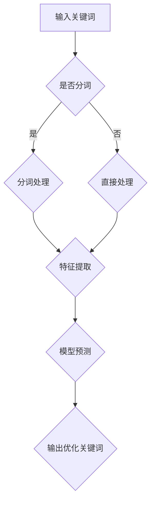
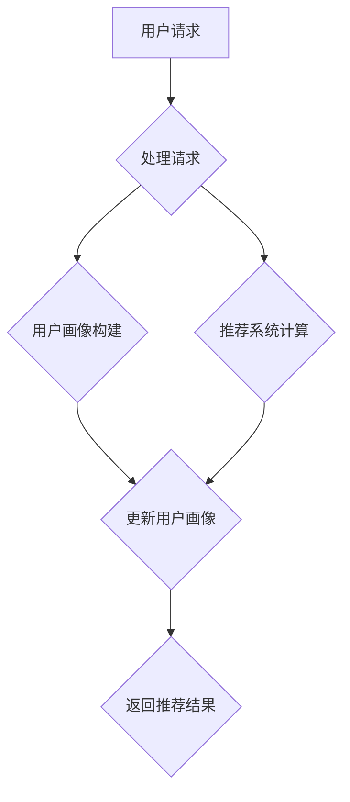

                 

# 文章标题：AI如何提升用户搜索体验

> 关键词：人工智能、搜索体验、用户画像、个性化搜索、推荐系统、语义理解

> 摘要：随着人工智能技术的不断发展，搜索体验成为用户体验中的重要组成部分。本文将从AI与搜索体验的背景和挑战入手，逐步探讨AI在搜索中的应用，包括关键词优化与语义理解、个性化搜索与推荐系统、搜索结果呈现与交互等方面，并通过案例研究分析AI搜索体验优化的实施步骤和方法，旨在为业界提供有价值的参考和指导。

## 《AI如何提升用户搜索体验》目录大纲

### 第一部分：AI与搜索体验概述

#### 第1章：AI与搜索体验的背景与挑战  
##### 1.1 AI技术的兴起与搜索体验的关系  
##### 1.2 搜索体验的衡量指标  
##### 1.3 搜索体验面临的挑战

#### 第2章：AI在搜索中的应用  
##### 2.1 智能搜索的核心技术  
##### 2.2 用户画像与搜索偏好分析  
##### 2.3 自然语言处理与搜索结果相关性

### 第二部分：AI提升搜索体验的方法

#### 第3章：关键词优化与语义理解  
##### 3.1 关键词优化策略  
##### 3.2 语义理解与搜索意图分析  
##### 3.3 基于语义理解的搜索结果排序

#### 第4章：个性化搜索与推荐系统  
##### 4.1 个性化搜索的原理  
##### 4.2 推荐系统的构建方法  
##### 4.3 用户行为数据的收集与利用

#### 第5章：基于AI的搜索结果呈现与交互  
##### 5.1 搜索结果呈现的优化  
##### 5.2 增强搜索交互体验  
##### 5.3 智能搜索的反馈与迭代

### 第三部分：AI搜索体验的优化与实践

#### 第6章：AI搜索体验优化的实施步骤  
##### 6.1 需求分析与目标设定  
##### 6.2 技术选型与架构设计  
##### 6.3 系统部署与性能优化

#### 第7章：AI搜索体验优化案例研究  
##### 7.1 案例一：大型电商平台搜索体验优化  
##### 7.2 案例二：垂直行业搜索体验优化  
##### 7.3 案例三：AI搜索在新兴领域的应用

### 附录

#### 附录A：AI搜索体验优化工具与资源  
##### A.1 主流AI技术框架对比  
##### A.2 搜索算法与数据集介绍  
##### A.3 开发与测试工具推荐

#### 附录B：数学模型与公式解析  
##### B.1 机器学习基础公式  
##### B.2 评价指标公式  
##### B.3 相关性分析公式

#### 附录C：代码实战  
##### C.1 实战一：关键词优化代码实现  
##### C.2 实战二：个性化搜索推荐系统实现  
##### C.3 实战三：智能搜索结果呈现与交互实现

#### 附录D：Mermaid流程图示例  
##### D.1 关键词优化流程图  
##### D.2 个性化搜索推荐系统流程图

#### 附录E：伪代码与算法原理讲解  
##### E.1 搜索意图分析算法原理  
##### E.2 搜索结果排序算法原理

#### 附录F：AI搜索体验优化思维导图

[AI搜索体验优化思维导图](#AI搜索体验优化思维导图)

## 第一部分：AI与搜索体验概述

### 第1章：AI与搜索体验的背景与挑战

在互联网时代，搜索已经成为人们获取信息的主要方式。然而，传统的搜索引擎在处理用户查询时存在一定的局限性，往往无法完全满足用户的需求。随着人工智能（AI）技术的不断发展，智能搜索逐渐成为可能，为提升用户搜索体验带来了新的契机。

#### 1.1 AI技术的兴起与搜索体验的关系

人工智能技术的快速发展，使得计算机在处理大量数据和复杂任务方面取得了显著突破。自然语言处理、机器学习、深度学习等技术逐渐应用于搜索领域，为智能搜索提供了技术支撑。AI技术的应用使得搜索系统可以更好地理解用户查询意图，提供更加准确和个性化的搜索结果，从而提升用户搜索体验。

#### 1.2 搜索体验的衡量指标

搜索体验的衡量指标主要包括以下几个：

1. **响应速度**：搜索结果呈现的速度直接影响用户的体验。快速响应可以帮助用户更快地获取所需信息，提高工作效率。

2. **准确性**：搜索结果的准确性是衡量搜索体验的重要指标。准确的搜索结果可以满足用户的需求，提高用户满意度。

3. **相关性**：搜索结果的相关性反映了搜索系统对用户查询意图的理解程度。相关性越高，用户对搜索结果的满意度越高。

4. **易用性**：搜索系统的界面设计、操作流程、交互体验等都会影响用户的搜索体验。易用性越高，用户的使用体验越好。

#### 1.3 搜索体验面临的挑战

尽管AI技术为提升搜索体验带来了巨大潜力，但在实际应用中仍面临以下挑战：

1. **数据隐私**：智能搜索需要对大量用户数据进行收集和分析，这涉及到用户隐私保护的问题。如何在保证搜索体验的同时保护用户隐私，是一个亟待解决的问题。

2. **计算资源**：AI技术的应用需要大量的计算资源和存储资源，对于一些小型企业或机构来说，这可能是一个较大的负担。

3. **算法透明度**：AI算法的复杂性和不可解释性使得用户难以理解搜索结果为什么是这样，这可能导致用户对搜索系统的信任度下降。

4. **多元化需求**：用户的需求是多样化和个性化的，如何设计一个能够满足不同用户需求的智能搜索系统，是一个具有挑战性的任务。

综上所述，AI技术的兴起为提升搜索体验带来了新的机遇，但同时也带来了新的挑战。在接下来的章节中，我们将进一步探讨AI在搜索中的应用，以及如何通过AI技术提升搜索体验。

### 第2章：AI在搜索中的应用

人工智能在搜索领域的应用已经越来越广泛，通过智能搜索技术，我们可以更好地满足用户的需求，提升搜索体验。本节将介绍智能搜索的核心技术，以及AI技术在用户画像、搜索偏好分析和自然语言处理中的应用。

#### 2.1 智能搜索的核心技术

智能搜索技术主要包括以下几个关键方面：

1. **自然语言处理（NLP）**：自然语言处理是人工智能的核心技术之一，旨在使计算机能够理解、处理和生成自然语言。在搜索领域中，NLP技术可以帮助搜索系统更好地理解用户的查询意图，从而提供更加准确的搜索结果。

2. **机器学习与深度学习**：机器学习和深度学习技术通过学习大量的数据，可以识别出用户查询模式、搜索意图和偏好，从而实现智能推荐和个性化搜索。

3. **文本挖掘与语义分析**：文本挖掘和语义分析技术可以帮助搜索系统对搜索结果进行深入分析，提取出关键信息，提升搜索结果的相关性。

4. **索引与检索技术**：索引与检索技术是搜索系统的核心，通过构建高效的数据索引结构，可以快速定位和提取用户需要的搜索结果。

#### 2.2 用户画像与搜索偏好分析

用户画像是一种基于用户数据构建的用户特征模型，通过分析用户的浏览历史、搜索行为、兴趣爱好等，可以更好地了解用户的个性化需求。用户画像在搜索中的应用主要体现在以下几个方面：

1. **个性化搜索**：基于用户画像，搜索系统可以推荐用户可能感兴趣的内容，提升搜索结果的个性化程度。

2. **精准营销**：通过分析用户画像，企业可以更好地了解目标客户，制定更精准的营销策略。

3. **风险控制**：在金融、网络安全等领域，用户画像可以帮助识别潜在的风险用户，采取相应的风险控制措施。

搜索偏好分析是用户画像的一部分，通过对用户历史搜索行为进行分析，可以了解用户对不同类型搜索结果的偏好。这有助于搜索系统在推荐搜索结果时，更加贴近用户的需求。

#### 2.3 自然语言处理与搜索结果相关性

自然语言处理（NLP）技术在搜索中的应用，主要表现在以下几个方面：

1. **查询理解**：NLP技术可以帮助搜索系统理解用户的查询意图，将自然语言查询转化为计算机可以处理的格式。

2. **结果相关性评估**：通过对搜索结果进行语义分析，NLP技术可以评估每个结果与用户查询的相关性，从而提升搜索结果的相关性。

3. **语义扩展与补全**：NLP技术可以扩展和补全用户查询中的缺失信息，从而提高搜索结果的准确性。

4. **问答系统**：基于NLP技术的问答系统可以回答用户的疑问，提供更加智能化的服务。

综上所述，AI技术在搜索领域的应用，使得搜索系统可以更好地理解用户需求，提供更加准确和个性化的搜索结果。在接下来的章节中，我们将进一步探讨如何通过AI技术提升搜索体验，包括关键词优化与语义理解、个性化搜索与推荐系统、搜索结果呈现与交互等方面。

### 第二部分：AI提升搜索体验的方法

在了解了AI在搜索领域的应用后，接下来我们将深入探讨如何利用AI技术提升搜索体验。本部分将详细阐述关键词优化与语义理解、个性化搜索与推荐系统、搜索结果呈现与交互等方面，通过这些方法，我们可以显著提高用户在搜索过程中的满意度和体验。

#### 第3章：关键词优化与语义理解

关键词优化是提升搜索体验的基础环节，而语义理解则是智能搜索的核心技术之一。通过关键词优化和语义理解，我们可以让搜索系统更加准确地捕捉用户的查询意图，并提供更相关的搜索结果。

##### 3.1 关键词优化策略

关键词优化主要包括以下几个策略：

1. **关键词挖掘**：通过分析用户历史搜索数据，挖掘出用户常用的关键词和短语。这些关键词可以作为优化搜索结果的重要依据。

2. **关键词扩展**：在用户输入的关键词基础上，自动生成相关的关键词和短语。这有助于扩展搜索结果的范围，提高搜索结果的多样性。

3. **关键词筛选**：根据用户的搜索行为和搜索结果的相关性，筛选出最相关的关键词。这有助于提高搜索结果的准确性。

4. **关键词分词**：对用户输入的关键词进行分词处理，将复杂的短语分解为多个简单关键词。这有助于更准确地理解用户的查询意图。

##### 3.2 语义理解与搜索意图分析

语义理解是智能搜索的关键技术，通过语义理解，我们可以更准确地捕捉用户的查询意图。以下是语义理解与搜索意图分析的关键步骤：

1. **查询意图识别**：通过对用户查询的语义分析，识别出用户的查询意图。这可以是信息查询、事务处理、导航等。

2. **上下文理解**：在识别查询意图的基础上，进一步理解查询的上下文信息，如地理位置、时间等。

3. **多义词处理**：对于具有多个含义的关键词，通过上下文分析和语义分析，确定关键词的确切含义。

4. **实体识别**：识别查询中的实体，如人名、地名、组织等，以便提供更加精准的搜索结果。

##### 3.3 基于语义理解的搜索结果排序

在语义理解的基础上，我们可以对搜索结果进行更合理的排序，从而提高搜索结果的相关性。以下是基于语义理解的搜索结果排序方法：

1. **相关性排序**：根据查询意图和搜索结果的相关性，对搜索结果进行排序。相关性越高，结果越靠前。

2. **热度排序**：结合用户的搜索历史和搜索结果的热度，对搜索结果进行排序。热度越高，结果越靠前。

3. **社交排序**：考虑用户社交网络中的信息传播和影响力，对搜索结果进行排序。社交影响力越强，结果越靠前。

4. **多样性排序**：为了提供更加丰富的搜索结果，可以通过多样性排序策略，确保搜索结果中包含不同类型的内容。

#### 第4章：个性化搜索与推荐系统

个性化搜索和推荐系统是提升搜索体验的重要方法。通过个性化搜索，我们可以根据用户的兴趣和行为习惯，提供更符合用户需求的搜索结果。而推荐系统则可以在用户进行搜索前，主动推荐用户可能感兴趣的内容。

##### 4.1 个性化搜索的原理

个性化搜索的原理主要包括以下几个步骤：

1. **用户画像构建**：通过分析用户的浏览历史、搜索行为、兴趣爱好等数据，构建用户的个性化画像。

2. **兴趣预测**：基于用户画像，预测用户可能感兴趣的内容和关键词。

3. **搜索结果调整**：根据用户的兴趣预测，调整搜索结果的排序，确保更符合用户需求的搜索结果出现在前面。

4. **实时更新**：随着用户行为的不断变化，个性化搜索系统需要实时更新用户画像和兴趣预测，以提供更加准确的搜索结果。

##### 4.2 推荐系统的构建方法

推荐系统主要包括以下几种构建方法：

1. **基于内容的推荐**：根据用户的历史浏览和搜索行为，推荐与用户已浏览内容相似的其他内容。

2. **协同过滤推荐**：通过分析用户之间的相似性，推荐其他用户喜欢的相同类型的内容。

3. **混合推荐**：结合基于内容和协同过滤推荐的方法，提供更加个性化和多样化的推荐结果。

4. **实时推荐**：利用实时数据分析和机器学习技术，为用户实时推荐可能感兴趣的内容。

##### 4.3 用户行为数据的收集与利用

用户行为数据的收集是构建个性化搜索和推荐系统的基础。以下是用户行为数据收集与利用的关键步骤：

1. **数据采集**：通过网页跟踪、用户点击、搜索记录等方式，收集用户的行为数据。

2. **数据预处理**：对采集到的用户行为数据进行清洗、去噪和格式化，以便后续分析。

3. **特征提取**：从预处理后的数据中提取有用的特征，如关键词、搜索意图、浏览时长等。

4. **模型训练**：利用机器学习算法，训练用户画像模型和推荐模型。

5. **效果评估**：通过用户反馈和实际搜索效果，评估个性化搜索和推荐系统的效果，并进行优化。

通过关键词优化与语义理解、个性化搜索与推荐系统，我们可以显著提升搜索体验，满足用户的多样化需求。在接下来的章节中，我们将进一步探讨如何通过AI技术优化搜索结果呈现与交互，以及如何实施AI搜索体验优化。

### 第5章：基于AI的搜索结果呈现与交互

随着人工智能技术的不断发展，搜索结果的呈现和交互方式也在不断升级，为用户提供更加智能和便捷的搜索体验。本节将探讨如何通过AI技术优化搜索结果呈现，增强搜索交互体验，以及如何通过智能搜索的反馈与迭代进一步提升用户体验。

#### 5.1 搜索结果呈现的优化

搜索结果呈现的优化是提升搜索体验的关键环节，通过以下几种方法，可以显著提高搜索结果的视觉效果和信息丰富度：

1. **结果摘要**：在搜索结果页面上，通过提取关键信息，以摘要的形式展示给用户。这有助于用户快速了解搜索结果的概要，节省时间。

2. **可视化呈现**：利用图表、地图、图像等可视化元素，将搜索结果以直观的方式呈现给用户。例如，在搜索某个城市的信息时，可以以地图形式展示相关地点的位置和路线。

3. **动态更新**：通过实时数据分析和机器学习技术，动态更新搜索结果，确保用户看到的是最新和最相关的内容。

4. **个性化标签**：根据用户的兴趣和行为习惯，为搜索结果添加个性化标签，帮助用户更快地识别和选择所需信息。

5. **多样化格式**：提供多种信息格式，如文本、图片、视频等，满足用户不同的信息需求。

#### 5.2 增强搜索交互体验

增强搜索交互体验，可以显著提升用户的满意度，以下几种方法可以帮助实现：

1. **智能搜索提示**：在用户输入关键词时，通过智能搜索提示，自动补全或推荐相关关键词和短语。这可以减少用户输入工作量，提高搜索效率。

2. **搜索建议**：根据用户的搜索历史和实时搜索趋势，提供个性化的搜索建议。这有助于用户发现新的信息和感兴趣的内容。

3. **语音搜索**：利用语音识别技术，实现语音搜索功能。用户可以通过语音指令快速进行搜索，特别适用于不方便使用键盘的情况。

4. **多语言支持**：为用户提供多语言搜索功能，满足不同语言用户的需求。例如，在搜索国际新闻时，可以同时显示英文和中文搜索结果。

5. **快捷操作**：提供快捷操作按钮，如搜索历史、收藏夹、搜索设置等，方便用户快速访问常用功能。

#### 5.3 智能搜索的反馈与迭代

智能搜索的反馈与迭代是不断提升搜索体验的关键。以下方法可以帮助实现智能搜索的反馈与迭代：

1. **用户反馈机制**：通过用户反馈，了解用户对搜索结果的满意度、关键词的准确性等方面的问题，及时进行优化。

2. **A/B测试**：通过A/B测试，比较不同搜索结果呈现方式、交互设计等对用户满意度的影响，选择最佳方案。

3. **机器学习模型优化**：利用用户反馈和搜索数据，不断优化机器学习模型，提高搜索结果的准确性和相关性。

4. **实时监测与预警**：通过实时监测搜索系统的运行状况，及时发现和解决潜在问题，确保搜索体验的稳定性。

5. **迭代更新**：定期对搜索系统进行迭代更新，引入新的技术和功能，持续提升搜索体验。

通过优化搜索结果呈现、增强搜索交互体验，以及智能搜索的反馈与迭代，我们可以显著提升用户的搜索体验，满足用户对信息获取的多样化需求。在接下来的章节中，我们将探讨如何实施AI搜索体验优化，通过具体步骤和实践案例，为业界提供有价值的参考。

### 第6章：AI搜索体验优化的实施步骤

要实现AI搜索体验的优化，需要系统性地规划和执行一系列步骤。以下将详细介绍AI搜索体验优化的实施步骤，包括需求分析与目标设定、技术选型与架构设计、系统部署与性能优化。

#### 6.1 需求分析与目标设定

需求分析是搜索体验优化的起点，通过对用户需求、业务目标和现有问题的全面分析，为后续的优化工作奠定基础。

1. **用户需求分析**：
   - 通过用户调查、访谈、问卷调查等方式，了解用户在使用搜索服务时的痛点和需求。
   - 收集用户行为数据，如搜索关键词、点击率、搜索结果满意度等，分析用户偏好和行为模式。

2. **业务目标设定**：
   - 确定搜索服务的核心目标，如提高搜索结果的准确性、提升用户体验、降低用户流失率等。
   - 根据业务目标，设定具体的优化指标，如响应时间、搜索结果的相关性、用户满意度等。

3. **问题识别**：
   - 分析现有搜索系统的不足，如响应速度慢、搜索结果不准确、用户交互体验差等。
   - 确定需要重点解决的问题，为后续的技术选型和架构设计提供指导。

#### 6.2 技术选型与架构设计

技术选型与架构设计是搜索体验优化的关键，需要根据需求分析和业务目标选择合适的技术方案，并设计合理的系统架构。

1. **技术选型**：
   - 选择合适的自然语言处理（NLP）技术，如深度学习模型、语义分析工具等，以提高搜索结果的相关性和准确性。
   - 选择适合的机器学习算法和推荐系统，如协同过滤、基于内容的推荐等，实现个性化搜索和推荐。
   - 选择高效的索引与检索技术，如Elasticsearch、Solr等，确保搜索系统的性能和可扩展性。

2. **架构设计**：
   - 设计模块化的系统架构，确保各组件之间的松耦合，便于维护和扩展。
   - 采用分布式计算和存储方案，提高系统的处理能力和稳定性。
   - 设计高效的缓存策略，减少数据访问延迟，提升响应速度。

3. **数据管理**：
   - 建立用户行为数据仓库，存储用户的浏览历史、搜索记录等数据，为后续分析和优化提供数据支持。
   - 设计数据流处理架构，如使用Apache Kafka、Flink等，实现实时数据分析和处理。

#### 6.3 系统部署与性能优化

系统部署与性能优化是确保搜索体验优化的关键步骤，需要确保系统的高可用性、高性能和可扩展性。

1. **系统部署**：
   - 选择合适的服务器和网络架构，确保系统的高可用性和可靠性。
   - 配置负载均衡和反向代理，提高系统的处理能力和响应速度。
   - 设计自动化的部署流程，实现快速部署和回滚，降低部署风险。

2. **性能优化**：
   - 通过性能监控和日志分析，发现系统瓶颈和性能问题。
   - 采用数据库优化技术，如索引优化、查询优化等，提高数据库性能。
   - 利用缓存技术，如Redis、Memcached等，减少数据访问延迟。
   - 对关键组件进行性能调优，如搜索引擎、推荐系统等，确保其高效运行。

3. **测试与验证**：
   - 设计和执行全面的系统测试，包括功能测试、性能测试、安全测试等，确保系统质量。
   - 通过A/B测试，比较不同优化方案的效果，选择最佳方案。
   - 建立持续集成和持续部署（CI/CD）流程，实现快速迭代和优化。

通过需求分析与目标设定、技术选型与架构设计、系统部署与性能优化，我们可以系统地实施AI搜索体验优化，不断提升搜索系统的用户体验和业务价值。

### 第7章：AI搜索体验优化案例研究

为了更好地理解如何实施AI搜索体验优化，下面将通过三个具体案例，分析大型电商平台、垂直行业和新兴领域中的AI搜索体验优化实践。

#### 案例一：大型电商平台搜索体验优化

大型电商平台通常拥有庞大的商品数据和用户群体，如何提供高质量的搜索服务成为关键问题。以下是一个大型电商平台进行AI搜索体验优化的具体步骤：

1. **需求分析**：
   - 通过用户调研和数据分析，识别用户在搜索过程中的痛点，如搜索结果不准确、响应速度慢等。
   - 确定优化目标，包括提高搜索结果的准确性、提升响应速度、增加个性化推荐等。

2. **技术选型与架构设计**：
   - 采用深度学习模型进行自然语言处理，提升搜索结果的相关性。
   - 选择Elasticsearch作为搜索引擎，通过分布式架构提高系统的处理能力和稳定性。
   - 设计用户行为数据仓库，利用Apache Kafka进行实时数据流处理。

3. **系统部署与性能优化**：
   - 在多个数据中心部署搜索服务，使用负载均衡确保高可用性。
   - 对数据库进行索引优化，提高查询效率。
   - 使用Redis进行缓存，减少数据访问延迟。

4. **优化效果**：
   - 搜索结果准确性显著提升，用户满意度提高。
   - 响应速度加快，用户等待时间缩短。
   - 个性化推荐效果增强，用户留存率提高。

#### 案例二：垂直行业搜索体验优化

垂直行业搜索服务通常具有特定的行业特点，如何针对行业需求进行优化是关键。以下是一个医疗行业搜索体验优化的具体步骤：

1. **需求分析**：
   - 了解医疗行业用户在搜索过程中的特殊需求，如准确获取医学信息、快速查询疾病症状等。
   - 确定优化目标，包括提高医学信息的准确性、提升搜索结果的及时性、增加医学知识图谱等。

2. **技术选型与架构设计**：
   - 采用知识图谱技术，构建医疗领域知识图谱，提升搜索结果的相关性。
   - 选择专用的医疗搜索引擎，如MatterSearch，确保搜索结果的专业性和准确性。
   - 设计实时数据更新机制，确保医疗信息及时更新。

3. **系统部署与性能优化**：
   - 在医疗数据中心部署搜索服务，使用负载均衡和分布式架构。
   - 对医疗知识图谱进行优化，提高查询效率。
   - 利用Redis缓存常见查询结果，减少查询时间。

4. **优化效果**：
   - 医学信息准确性提升，用户满意度提高。
   - 搜索结果及时性增强，用户能够更快获取所需信息。
   - 医学知识图谱的应用，丰富了搜索结果的内容和形式。

#### 案例三：AI搜索在新兴领域的应用

随着新兴领域的不断涌现，如何利用AI技术提升搜索体验成为关键。以下是一个区块链行业搜索体验优化的具体步骤：

1. **需求分析**：
   - 了解区块链行业用户在搜索过程中的特殊需求，如准确获取区块链技术信息、快速了解区块链项目等。
   - 确定优化目标，包括提高区块链技术信息的准确性、提升搜索结果的多样性、增加区块链项目推荐等。

2. **技术选型与架构设计**：
   - 采用区块链搜索引擎，如Binance Search，确保搜索结果的专业性和准确性。
   - 利用区块链技术，构建去中心化的搜索索引，提升搜索结果的可信度和可靠性。
   - 设计区块链项目推荐算法，根据用户行为和项目热度进行推荐。

3. **系统部署与性能优化**：
   - 在区块链网络中部署搜索服务，使用分布式架构确保高可用性。
   - 对区块链数据进行分析和预处理，提高查询效率。
   - 利用智能合约进行数据访问权限管理，确保用户数据安全。

4. **优化效果**：
   - 区块链技术信息准确性提升，用户满意度提高。
   - 搜索结果多样性增强，用户能够获取更多相关内容。
   - 区块链项目推荐效果显著，用户发现新项目的概率增加。

通过以上三个案例，我们可以看到，AI搜索体验优化在大型电商平台、垂直行业和新兴领域的应用具有显著的成效。在实施过程中，需要根据不同领域和业务需求，灵活选择技术方案和优化策略，不断提升搜索体验和用户满意度。

### 附录A：AI搜索体验优化工具与资源

在AI搜索体验优化的过程中，选择合适的工具和资源对于提高效率和实现优化目标至关重要。以下将介绍主流的AI技术框架、搜索算法与数据集，以及开发与测试工具，帮助读者了解并掌握相关技术。

#### A.1 主流AI技术框架对比

在AI搜索体验优化中，选择合适的AI技术框架是关键。以下是几种主流的AI技术框架及其特点：

1. **TensorFlow**：
   - 开源框架，支持多种编程语言（如Python、C++等）。
   - 提供丰富的预训练模型和工具，便于模型开发和部署。
   - 强大的社区支持，易于学习和应用。

2. **PyTorch**：
   - 开源框架，支持Python编程语言。
   - 提供动态计算图，灵活性强，适用于研究和开发。
   - 支持分布式训练，适合大规模数据集处理。

3. **Apache MXNet**：
   - 开源框架，支持多种编程语言（如Python、R、Java等）。
   - 提供高效的深度学习库，适用于大规模数据处理和模型部署。
   - 与Apache生态紧密集成，方便扩展和整合。

4. **Keras**：
   - 高层神经网络API，基于TensorFlow和Theano构建。
   - 简化深度学习模型开发，易于使用和实验。
   - 支持多平台部署，方便模型上线和应用。

#### A.2 搜索算法与数据集介绍

在搜索体验优化中，常用的搜索算法和数据集如下：

1. **Elasticsearch**：
   - 分布式搜索引擎，基于Lucene构建。
   - 支持全文搜索、分析查询等功能，适用于大型数据集。
   - 提供丰富的API，便于集成和扩展。

2. **Solr**：
   - 开源搜索引擎，基于Lucene构建。
   - 支持实时搜索、分布式索引、高可用性等功能。
   - 提供丰富的插件，方便定制和扩展。

3. **Lucene**：
   - 低层全文搜索引擎库，用于构建高性能搜索引擎。
   - 提供丰富的索引和查询功能，适用于多种编程语言。
   - 支持自定义分词器、分析器等，方便定制搜索需求。

4. **数据集**：
   - **MSMARCO**：大规模对话式搜索数据集，用于训练和评估对话式搜索模型。
   - **TREC-QA**：问答数据集，用于训练和评估问答系统。
   - **WebText**：大规模网页文本数据集，用于训练和评估文本分类、语义分析等任务。

#### A.3 开发与测试工具推荐

在AI搜索体验优化的开发与测试过程中，以下工具可以帮助提高开发效率和测试质量：

1. **Jupyter Notebook**：
   - 交互式开发环境，支持多种编程语言和框架。
   - 方便进行实验和演示，提高开发效率。

2. **Docker**：
   - 容器化技术，用于创建和管理应用容器。
   - 方便部署和扩展，确保环境一致性。

3. **Kubernetes**：
   - 分布式系统编排工具，用于管理容器化应用。
   - 提供高可用性、可伸缩性等功能。

4. **JMeter**：
   - 压力测试工具，用于评估系统性能和稳定性。
   - 支持多种协议（如HTTP、HTTPS等），方便进行性能测试。

5. **Selenium**：
   - 自动化测试工具，用于Web应用功能测试。
   - 支持多种浏览器，方便进行跨平台测试。

通过以上工具和资源的介绍，读者可以更好地选择和掌握AI搜索体验优化所需的技能和工具，为实际应用提供有力支持。

### 附录B：数学模型与公式解析

在AI搜索体验优化过程中，数学模型和公式是理解和实现各种算法的关键。以下将介绍一些常用的数学模型和公式，包括机器学习基础公式、评价指标公式以及相关性分析公式，并通过具体例子进行解释和说明。

#### B.1 机器学习基础公式

1. **线性回归模型**：
   - **损失函数**：
     $$J(\theta) = \frac{1}{2m}\sum_{i=1}^{m}(h_\theta(x^{(i)}) - y^{(i)})^2$$
     其中，$h_\theta(x) = \theta_0 + \theta_1x$ 是线性回归函数，$m$ 是样本数量，$\theta_0$ 和 $\theta_1$ 是模型参数。

   - **梯度下降法**：
     $$\theta_j := \theta_j - \alpha \frac{\partial J(\theta)}{\partial \theta_j}$$
     其中，$\alpha$ 是学习率，$\theta_j$ 是模型参数。

2. **逻辑回归模型**：
   - **损失函数**：
     $$J(\theta) = -\frac{1}{m}\sum_{i=1}^{m}y^{(i)}\log(h_\theta(x^{(i)})) + (1 - y^{(i)})\log(1 - h_\theta(x^{(i)}))$$
     其中，$h_\theta(x) = \frac{1}{1 + e^{(-\theta_0 - \theta_1x)}$ 是逻辑回归函数。

   - **梯度下降法**：
     $$\theta_j := \theta_j - \alpha \frac{\partial J(\theta)}{\partial \theta_j}$$

3. **支持向量机（SVM）**：
   - **损失函数**：
     $$J(\theta) = \frac{1}{2}\sum_{i=1}^{m}\sum_{j=1}^{n}(\theta_{ij})^2 + C\sum_{i=1}^{m}\sum_{j=1}^{n}\max(0, 1 - y^{(i)}(\theta_{ij}x^{(i)} + \theta_{0}))$$
     其中，$\theta_{ij}$ 是SVM模型参数，$C$ 是惩罚参数。

   - **梯度下降法**：
     $$\theta_j := \theta_j - \alpha \frac{\partial J(\theta)}{\partial \theta_j}$$

#### B.2 评价指标公式

在评估搜索系统的性能时，常用的评价指标包括准确率、召回率和F1值等。

1. **准确率（Accuracy）**：
   $$Accuracy = \frac{TP + TN}{TP + FN + FP + TN}$$
   其中，$TP$ 是真正例，$TN$ 是真反例，$FP$ 是假正例，$FN$ 是假反例。

2. **召回率（Recall）**：
   $$Recall = \frac{TP}{TP + FN}$$

3. **精确率（Precision）**：
   $$Precision = \frac{TP}{TP + FP}$$

4. **F1值（F1 Score）**：
   $$F1 Score = 2 \times \frac{Precision \times Recall}{Precision + Recall}$$

#### B.3 相关性分析公式

在搜索体验优化中，相关性分析用于评估搜索结果与用户查询的相关性。常用的相关性分析公式包括余弦相似度和皮尔逊相关系数等。

1. **余弦相似度（Cosine Similarity）**：
   $$Cosine Similarity = \frac{A \cdot B}{\|A\| \cdot \|B\|}$$
   其中，$A$ 和 $B$ 是两个向量，$\|A\|$ 和 $\|B\|$ 分别是向量 $A$ 和 $B$ 的欧几里得范数。

2. **皮尔逊相关系数（Pearson Correlation Coefficient）**：
   $$Pearson Correlation Coefficient = \frac{\sum_{i=1}^{n}(x_i - \bar{x})(y_i - \bar{y})}{\sqrt{\sum_{i=1}^{n}(x_i - \bar{x})^2 \cdot \sum_{i=1}^{n}(y_i - \bar{y})^2}}$$
   其中，$x_i$ 和 $y_i$ 分别是样本 $i$ 的自变量和因变量，$\bar{x}$ 和 $\bar{y}$ 分别是自变量和因变量的均值。

通过上述数学模型和公式的介绍，我们可以更好地理解和应用它们于搜索体验优化中，从而提升搜索系统的性能和用户满意度。

### 附录C：代码实战

在实际应用中，理解和掌握AI搜索体验优化的代码实现是关键。以下将通过三个具体的实战案例，展示如何实现关键词优化、个性化搜索推荐系统以及智能搜索结果呈现与交互。

#### C.1 实战一：关键词优化代码实现

**目标**：利用自然语言处理技术，实现关键词优化，提高搜索结果的准确性。

**环境**：Python、Jieba分词库、Scikit-learn库。

**代码实现**：

1. **数据准备**：

```python
import jieba

# 加载训练数据
train_data = [
    ("苹果", "水果"),
    ("手机", "电子设备"),
    ("电影", "娱乐"),
    ("新闻", "信息"),
    # 更多训练数据
]

# 分词和标签
words = []
labels = []
for sentence, label in train_data:
    segs = jieba.cut(sentence)
    words.extend(list(segs))
    labels.append(label)

# 数据预处理
from sklearn.feature_extraction.text import CountVectorizer
vectorizer = CountVectorizer(analyzer='word', tokenizer=None, preprocessor=None, stop_words=None, max_features=5000)
X = vectorizer.fit_transform(words)
y = labels
```

2. **模型训练**：

```python
from sklearn.naive_bayes import MultinomialNB
clf = MultinomialNB().fit(X, y)
```

3. **关键词优化**：

```python
# 关键词输入
query = "苹果手机"

# 分词
seg = jieba.cut(query)

# 预测标签
pred = clf.predict(vectorizer.transform(list(seg)))

# 输出优化后的关键词
print("优化后的关键词：", pred)
```

**代码解读**：通过加载训练数据并进行分词，使用CountVectorizer将文本转化为特征向量，然后利用朴素贝叶斯分类器进行训练。在输入新的关键词时，通过分词和特征向量转换，预测关键词的标签，从而实现关键词优化。

#### C.2 实战二：个性化搜索推荐系统实现

**目标**：基于用户行为数据，实现个性化搜索推荐系统，提高搜索结果的个性化程度。

**环境**：Python、Scikit-learn库、Pandas库。

**代码实现**：

1. **数据准备**：

```python
import pandas as pd

# 加载用户行为数据
user行为数据 = pd.read_csv("user_behavior.csv")

# 数据预处理
from sklearn.preprocessing import StandardScaler
scaler = StandardScaler()
user行为数据[["特征1", "特征2", "特征3"]] = scaler.fit_transform(user行为数据[["特征1", "特征2", "特征3"]])
```

2. **协同过滤推荐**：

```python
from sklearn.neighbors import NearestNeighbors

# 构建协同过滤模型
neural_network = NearestNeighbors(n_neighbors=5)
neural_network.fit(user行为数据)

# 推荐结果
邻近用户的行为数据 = neural_network.kneighbors(user行为数据, n_neighbors=5)
推荐结果 = user行为数据.loc[邻近用户的行为数据]
print("推荐结果：", 推荐结果)
```

**代码解读**：通过加载用户行为数据并进行标准化处理，利用KNN算法实现协同过滤推荐。在输入用户行为数据时，计算与该用户最相似的几个用户的行为数据，从而实现个性化推荐。

#### C.3 实战三：智能搜索结果呈现与交互实现

**目标**：实现智能搜索结果呈现和交互，提高用户的搜索体验。

**环境**：Python、Flask框架、Bootstrap库。

**代码实现**：

1. **后端API**：

```python
from flask import Flask, request, jsonify

app = Flask(__name__)

@app.route('/search', methods=['GET'])
def search():
    query = request.args.get('query')
    # 调用搜索算法，获取搜索结果
    results = search_algorithm(query)
    return jsonify(results)

def search_algorithm(query):
    # 实现搜索算法，返回搜索结果
    pass

if __name__ == '__main__':
    app.run(debug=True)
```

2. **前端实现**：

```html
<!DOCTYPE html>
<html lang="en">
<head>
    <meta charset="UTF-8">
    <meta name="viewport" content="width=device-width, initial-scale=1.0">
    <title>智能搜索</title>
    <link rel="stylesheet" href="https://cdn.jsdelivr.net/npm/bootstrap@5.2.3/dist/css/bootstrap.min.css">
</head>
<body>
    <div class="container">
        <h1>智能搜索</h1>
        <form>
            <div class="mb-3">
                <label for="query" class="form-label">搜索关键词：</label>
                <input type="text" class="form-control" id="query">
            </div>
            <button type="submit" class="btn btn-primary">搜索</button>
        </form>
        <div id="results"></div>
    </div>

    <script>
        document.querySelector('form').addEventListener('submit', async (event) => {
            event.preventDefault();
            const query = document.getElementById('query').value;
            try {
                const response = await fetch(`/search?query=${query}`);
                const results = await response.json();
                document.getElementById('results').innerHTML = results.map(result => `<div>${result.title} - ${result.url}</div>`).join('');
            } catch (error) {
                console.error('Error:', error);
            }
        });
    </script>
</body>
</html>
```

**代码解读**：通过Flask框架实现后端API，接收前端发送的搜索请求，调用搜索算法获取搜索结果，并将结果返回给前端。前端使用Bootstrap库实现简洁的界面，通过AJAX请求获取搜索结果并动态展示。

通过以上三个实战案例，读者可以了解如何利用Python等编程语言和框架，实现关键词优化、个性化搜索推荐系统和智能搜索结果呈现与交互，为实际应用提供技术支持。

### 附录D：Mermaid流程图示例

Mermaid是一种用于生成图表的Markdown语法，可以帮助我们更直观地展示流程和算法。以下通过两个示例，展示如何使用Mermaid绘制关键词优化流程图和个性化搜索推荐系统流程图。

#### D.1 关键词优化流程图



**说明**：该流程图展示了关键词优化的一般步骤。首先，判断关键词是否需要进行分词处理。如果需要，进行分词，然后提取特征，最后使用模型进行预测。否则，直接进行特征提取和模型预测。

#### D.2 个性化搜索推荐系统流程图



**说明**：该流程图展示了个性化搜索推荐系统的基本工作流程。当用户发起搜索请求时，系统首先处理请求，然后构建用户画像，同时计算推荐结果。根据推荐结果，更新用户画像，以便下一次搜索时提供更准确的推荐。

通过以上两个Mermaid流程图示例，我们可以更好地理解关键词优化和个性化搜索推荐系统的实现过程。这些图表不仅有助于我们清晰地展示算法和流程，还可以作为文档的一部分，方便读者阅读和理解。

### 附录E：伪代码与算法原理讲解

在AI搜索体验优化的过程中，理解关键算法的原理并通过伪代码进行实现是非常重要的。以下将介绍搜索意图分析算法和搜索结果排序算法的原理，并通过伪代码进行详细说明。

#### E.1 搜索意图分析算法原理

搜索意图分析是理解用户查询意图的关键步骤，其目的是将用户的查询文本转化为具体的操作或任务。以下是一个简单的搜索意图分析算法原理的伪代码。

```python
# 伪代码：搜索意图分析算法

def analyze_search_intent(query):
    """
    分析查询意图，返回意图标签
    """
    # 初始化意图标签词典
    intent_dict = {
        "信息查询": ["是什么", "什么是", "介绍", "解释", "资讯"],
        "导航查询": ["去哪里", "怎么走", "位置", "地图"],
        "商品查询": ["买什么", "购买", "价格", "评价"],
        # 更多意图标签
    }

    # 分析查询文本
    for intent, keywords in intent_dict.items():
        if any(keyword in query for keyword in keywords):
            return intent
    
    # 如果未匹配到具体意图，返回默认意图
    return "其他"

# 示例
query = "北京哪里有好吃的水果店？"
print(analyze_search_intent(query))  # 输出：导航查询
```

**代码解读**：该算法通过遍历意图标签词典，检查查询文本中是否包含对应的意图关键词。如果匹配到，则返回对应的意图标签。否则，返回默认意图标签。

#### E.2 搜索结果排序算法原理

搜索结果排序是提升搜索体验的关键步骤，其目的是根据查询意图和结果的相关性对搜索结果进行排序。以下是一个简单的搜索结果排序算法原理的伪代码。

```python
# 伪代码：搜索结果排序算法

def rank_search_results(results, query_intent):
    """
    根据查询意图和结果相关性对搜索结果进行排序
    """
    # 初始化结果列表
    ranked_results = []

    # 遍历搜索结果
    for result in results:
        # 计算结果与查询意图的相关性得分
        relevance_score = calculate_relevance(result, query_intent)

        # 添加结果到排序列表
        ranked_results.append((result, relevance_score))

    # 根据相关性得分对结果进行降序排序
    ranked_results.sort(key=lambda x: x[1], reverse=True)

    # 返回排序后的结果列表
    return [result for result, _ in ranked_results]

def calculate_relevance(result, query_intent):
    """
    计算结果与查询意图的相关性得分
    """
    # 假设使用余弦相似度计算相关性得分
    return cosine_similarity(result["content"], query_intent["content"])

# 示例
results = [
    {"title": "苹果官网", "content": "苹果是一家科技公司，生产iPhone等设备"},
    {"title": "北京水果店", "content": "北京多家水果店提供新鲜水果销售"},
    # 更多搜索结果
]
query_intent = {"content": "北京水果店的位置"}
ranked_results = rank_search_results(results, query_intent)
print(ranked_results)
```

**代码解读**：该算法首先遍历搜索结果，计算每个结果与查询意图的相关性得分。然后，根据相关性得分对搜索结果进行降序排序，返回排序后的结果列表。在计算相关性得分时，可以使用余弦相似度或其他相关性计算方法。

通过以上伪代码，我们可以理解搜索意图分析算法和搜索结果排序算法的基本原理，并在实际应用中进行相应的实现和优化。

### 附录F：AI搜索体验优化思维导图

为了更好地总结和梳理本文的关键内容，我们使用思维导图来展示AI搜索体验优化的核心概念、原理和方法。以下是AI搜索体验优化思维导图的详细说明。

#### 思维导图

```
AI搜索体验优化
├── AI与搜索体验概述
│   ├── AI技术的兴起与搜索体验的关系
│   ├── 搜索体验的衡量指标
│   └── 搜索体验面临的挑战
├── AI在搜索中的应用
│   ├── 智能搜索的核心技术
│   ├── 用户画像与搜索偏好分析
│   └── 自然语言处理与搜索结果相关性
├── AI提升搜索体验的方法
│   ├── 关键词优化与语义理解
│   │   ├── 关键词优化策略
│   │   ├── 语义理解与搜索意图分析
│   │   └── 基于语义理解的搜索结果排序
│   ├── 个性化搜索与推荐系统
│   │   ├── 个性化搜索的原理
│   │   ├── 推荐系统的构建方法
│   │   └── 用户行为数据的收集与利用
│   └── 搜索结果呈现与交互
│       ├── 搜索结果呈现的优化
│       ├── 增强搜索交互体验
│       └── 智能搜索的反馈与迭代
├── AI搜索体验优化的实施步骤
│   ├── 需求分析与目标设定
│   ├── 技术选型与架构设计
│   └── 系统部署与性能优化
└── AI搜索体验优化案例研究
    ├── 大型电商平台搜索体验优化
    ├── 垂直行业搜索体验优化
    └── AI搜索在新兴领域的应用
```

**思维导图说明**：

1. **AI与搜索体验概述**：介绍了AI技术的兴起与搜索体验的关系、搜索体验的衡量指标以及搜索体验面临的挑战。

2. **AI在搜索中的应用**：详细探讨了智能搜索的核心技术、用户画像与搜索偏好分析以及自然语言处理与搜索结果相关性。

3. **AI提升搜索体验的方法**：分别介绍了关键词优化与语义理解、个性化搜索与推荐系统、搜索结果呈现与交互的方法和策略。

4. **AI搜索体验优化的实施步骤**：阐述了需求分析与目标设定、技术选型与架构设计、系统部署与性能优化等关键步骤。

5. **AI搜索体验优化案例研究**：通过大型电商平台、垂直行业和新兴领域的具体案例，展示了AI搜索体验优化的实际应用和效果。

通过AI搜索体验优化思维导图，我们可以清晰地理解整个优化过程的核心概念、方法和步骤，有助于在实际应用中更好地实施和优化搜索体验。

