                 

## 文章标题

### 《AI如何改变城市规划和智慧城市发展》

> 关键词：人工智能、城市规划、智慧城市、机器学习、深度学习、自然语言处理

> 摘要：本文将从人工智能技术的核心概念和应用出发，探讨AI如何在城市规划和智慧城市的建设中发挥重要作用。通过详细的分析和实例展示，本文旨在揭示AI技术如何推动城市交通管理、环境监测与治理、能源管理以及公共服务等方面的发展，并对未来的趋势和挑战进行展望。

### 目录

1. **AI与城市规划和智慧城市的概念与背景**
   - 1.1 AI与城市规划和智慧城市的概述
   - 1.2 AI核心技术与城市规划的关系
   - 1.3 智慧城市关键技术概述

2. **AI在智慧城市规划设计中的应用**
   - 2.1 城市交通管理
   - 2.2 城市环境监测与治理
   - 2.3 智慧能源管理
   - 2.4 智慧公共服务

3. **AI在智慧城市运营与管理中的应用**
   - 3.1 数据驱动的城市治理
   - 3.2 城市可持续发展
   - 3.3 智慧城市风险管理

4. **案例研究与实践**
   - 4.1 案例研究：A城市的智慧交通系统
   - 4.2 案例研究：B城市的智慧环境监测系统
   - 4.3 案例研究：C城市的智慧能源管理系统

5. **未来展望与挑战**
   - 5.1 智慧城市发展的未来趋势
   - 5.2 AI在城市规划和智慧城市中的挑战与解决方案
   - 5.3 AI与城市规划和智慧城市的未来方向

6. **附录**
   - 6.1 智慧城市相关资源与工具

---

### 第一部分：AI与城市规划和智慧城市的概念与背景

#### 1.1 AI与城市规划和智慧城市的概述

在当今快速发展的技术时代，人工智能（AI）已经成为驱动多个行业变革的核心力量。城市规划作为一门综合性学科，涉及社会学、经济学、环境科学等多个领域，旨在创建可持续、高效、宜居的城市环境。智慧城市则是指通过物联网、大数据、云计算等先进技术，实现城市管理和服务的智能化、网络化与协同化。

##### 城市规划与智慧城市的定义

城市规划是指根据城市的社会经济发展目标，对城市的空间布局、基础设施建设、公共设施配置等进行系统设计和规划的过程。智慧城市则是在城市规划的基础上，通过利用大数据、云计算、物联网、人工智能等先进技术，构建一个高效、智能、可持续发展的城市生态系统。

##### AI在城市规划和智慧城市中的重要性

AI技术在城市规划和智慧城市建设中扮演着至关重要的角色。首先，AI可以帮助城市管理者从海量数据中提取有价值的信息，从而做出更加精准和高效的决策。其次，AI能够自动化和优化城市基础设施的管理，如交通、能源、环境等，提高城市的运行效率和居民的生活质量。最后，AI能够推动城市服务的个性化与智能化，满足居民多样化的需求。

##### 智慧城市的发展趋势与挑战

智慧城市的发展趋势主要体现在以下几个方面：数据的集成与共享、智能化城市管理的实现、可持续发展目标的达成、以及居民参与和反馈机制的建立。然而，智慧城市建设也面临着诸多挑战，如数据隐私与安全、技术标准的制定与统一、以及社会接受度和参与度等。

#### 1.2 AI核心技术与城市规划的关系

AI的核心技术包括机器学习、深度学习、自然语言处理等，这些技术正在深刻地改变着城市规划和智慧城市的发展方向。

##### 机器学习在城市规划中的应用

机器学习技术通过建立数学模型，从大量数据中自动识别模式和规律，为城市规划提供科学依据。例如，机器学习可以用于城市交通流量预测、土地使用规划、灾害风险评估等。

##### 深度学习与城市数据分析

深度学习作为一种先进的机器学习技术，具有处理复杂数据和模式识别的能力。在智慧城市建设中，深度学习可以用于智能交通信号控制、城市环境监测、能源管理等领域。

##### 自然语言处理与城市规划决策

自然语言处理（NLP）技术可以用于分析城市居民的意见和需求，为城市规划决策提供参考。例如，通过分析社交媒体上的用户评论和讨论，城市规划者可以更好地了解居民的需求和期望。

#### 1.3 智慧城市关键技术概述

智慧城市的建设离不开多种关键技术的支持，包括物联网、大数据、云计算、区块链等。

##### 物联网与智慧城市

物联网技术通过传感器和设备互联，实时采集城市各类数据，为智慧城市建设提供数据基础。例如，智能交通系统、智能环境监测系统等都是物联网技术的典型应用。

##### 大数据和云计算在城市规划中的应用

大数据技术能够处理和分析海量数据，帮助城市管理者做出更明智的决策。云计算则提供了强大的计算和存储能力，支持大数据的处理和分析。

##### 区块链技术在智慧城市中的应用

区块链技术具有去中心化、透明、不可篡改等特点，可以用于智慧城市中的数据管理和安全。例如，在智慧城市建设中，区块链技术可以用于身份认证、智能合约、数据共享等。

### 第二部分：AI在智慧城市规划设计中的应用

#### 2.1 城市交通管理

城市交通管理是智慧城市建设的重要组成部分，AI技术的应用极大地提升了城市交通管理的效率和智能化水平。

##### AI交通管理系统概述

AI交通管理系统利用机器学习、深度学习等算法，对城市交通数据进行实时分析和预测，从而实现智能交通信号控制、交通流量预测、道路拥堵检测等功能。

##### 交通流量预测

交通流量预测是AI交通管理系统中的核心功能之一。通过分析历史交通数据、实时交通状况以及周边环境信息，机器学习模型可以预测未来一段时间内的交通流量，为交通信号控制和道路规划提供依据。

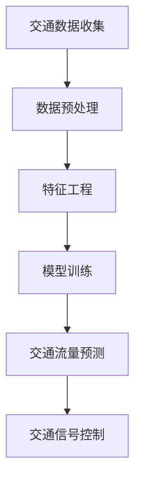

##### 智能交通信号控制

智能交通信号控制系统能够根据实时交通流量和交通状况，动态调整交通信号灯的时长和顺序，从而减少交通拥堵和等待时间。这一系统通常采用深度学习算法，通过分析大量的交通数据来优化信号灯的配置。

##### 道路拥堵检测与缓解

AI技术还可以用于道路拥堵的检测与缓解。通过实时监控道路上的摄像头和传感器，机器学习模型可以识别道路拥堵的情况，并给出相应的缓解措施，如调整交通信号灯、提供绕行建议等。

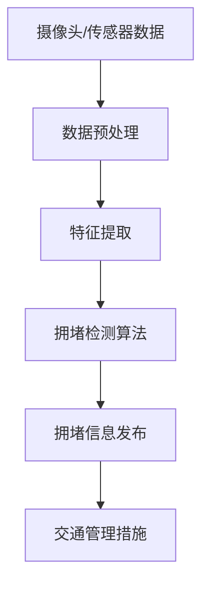

#### 2.2 城市环境监测与治理

智慧城市的发展离不开对城市环境的监测与治理，AI技术在这一领域发挥着至关重要的作用。

##### 城市空气质量监测

城市空气质量监测是城市环境监测的重要组成部分。AI技术可以通过分析实时采集的空气质量数据，建立空气质量模型，预测未来一段时间内的空气质量状况，为污染治理提供科学依据。

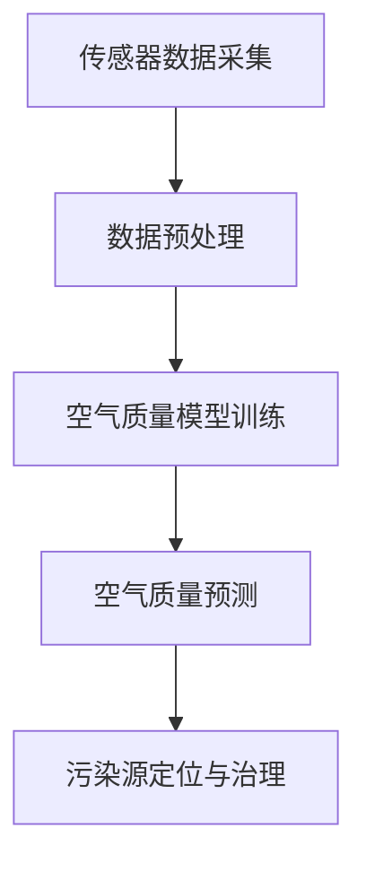

##### 数据采集与处理

空气质量监测系统需要大量的传感器来采集空气中的各种污染物数据。这些数据经过预处理后，被输入到机器学习模型中进行训练和预测。通过分析模型预测结果，可以识别污染源并制定相应的治理措施。

##### 模型构建与预测

基于历史空气质量和污染物数据，机器学习算法可以构建空气质量预测模型。该模型可以预测未来一段时间内的空气质量状况，为政府制定环保政策和居民采取防护措施提供参考。

##### 空气质量改善策略

通过预测模型，政府可以制定针对性的空气质量改善策略。例如，当预测到某一区域空气质量将恶化时，可以采取临时交通管制、增加空气净化设备等措施来缓解污染。

##### 城市水资源管理

城市水资源管理是智慧城市建设中的另一个重要方面。AI技术可以通过对水资源的监测、分析和预测，实现水资源的合理利用和优化管理。

##### 水资源监测与分析

水资源监测系统通过部署在水体中的传感器，实时监测水质、水量等参数。这些数据经过预处理后，被输入到机器学习模型中进行分析，以识别水资源的变化趋势和潜在问题。

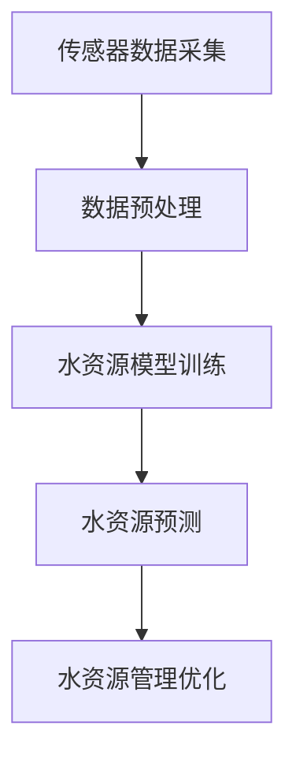

##### 水资源预测模型

基于历史水资源数据和环境因素，机器学习算法可以构建水资源预测模型。该模型可以预测未来一段时间内的水资源供需情况，为水资源调度和管理提供依据。

##### 水资源优化管理策略

通过预测模型，政府可以制定水资源优化管理策略。例如，在水资源紧缺时，可以采取节水措施、调整用水结构等，以确保水资源的合理利用。

#### 2.3 智慧能源管理

智慧能源管理是智慧城市的重要组成部分，AI技术在能源管理中的广泛应用，有助于提高能源利用效率，实现可持续发展。

##### 智慧电网与分布式能源

智慧电网是一种通过集成智能传感器、通信技术和计算机控制系统，实现对电力系统高效管理和控制的电网。分布式能源则是指在用户端分散布置的小型能源系统，如太阳能、风能等。智慧电网与分布式能源的结合，可以实现能源的高效利用和智能化管理。

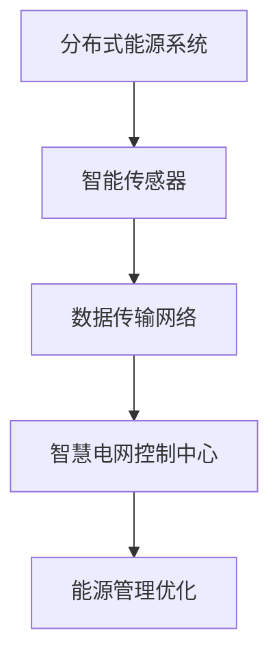

##### 智慧电网概述

智慧电网通过智能传感器实时监测电网的运行状态，如电压、电流、频率等。这些数据通过通信网络传输到智慧电网控制中心，由AI算法进行分析和处理，以实现电网的实时监控、故障预测和优化调度。

##### 分布式能源管理系统

分布式能源管理系统通过集成多种分布式能源系统，实现对能源的实时监控和优化管理。AI算法可以根据实时数据，调整各分布式能源系统的运行状态，以实现能源的最优配置和利用。

##### 能源消耗预测与优化

通过分析历史能源消耗数据和环境因素，AI算法可以构建能源消耗预测模型。该模型可以预测未来一段时间内的能源消耗情况，为能源调度和管理提供依据。

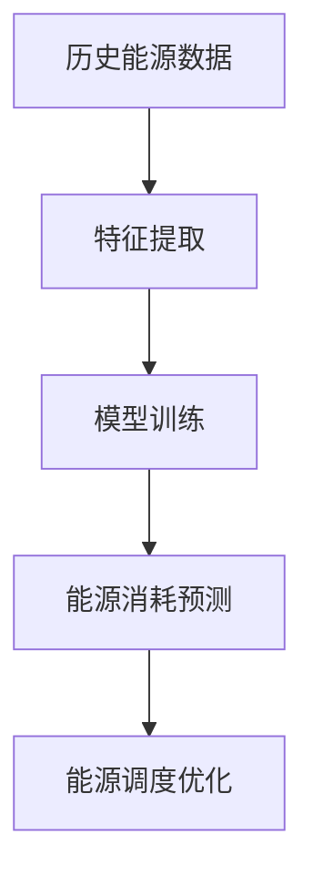

##### 能源调度优化

基于预测模型，能源调度系统可以根据实时能源需求和供应情况，调整分布式能源系统的运行策略，以实现能源消耗的最优化。例如，在高峰用电时段，可以优先使用价格较低的分布式能源，以降低整体能源成本。

#### 2.4 智慧公共服务

智慧公共服务的建设是提升居民生活质量、实现城市智能化管理的重要环节。AI技术在智慧公共服务中的应用，有助于实现公共服务的个性化、智能化和高效化。

##### 智慧城市公共服务平台

智慧城市公共服务平台通过集成各类公共服务数据，如交通、医疗、教育、社保等，为居民提供一站式服务。AI技术可以用于数据分析和处理，优化公共服务资源的配置。

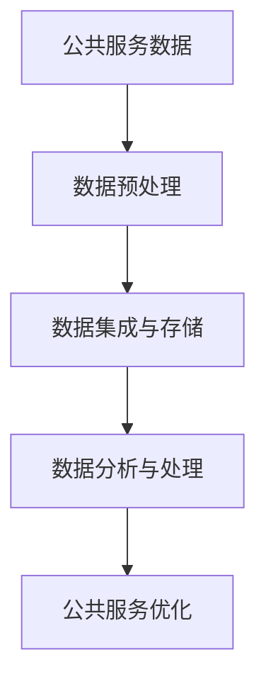

##### 公共服务数据集成

智慧城市公共服务平台需要整合来自不同部门、不同系统的数据，如交通部门的交通数据、医疗部门的患者数据、教育部门的学生数据等。通过数据集成，可以实现数据的高效利用和共享。

##### 智能化公共服务提供

通过AI技术，公共服务平台可以根据居民的需求和行为习惯，提供个性化的服务。例如，智能交通系统可以根据居民的出行习惯，提供个性化的出行建议；智能医疗系统可以根据患者的病史，提供个性化的治疗方案。

##### 用户行为分析与优化

智慧城市公共服务平台通过对用户行为数据进行分析，可以了解用户的需求和偏好，从而优化公共服务的提供。例如，通过分析居民的出行数据，可以优化公交路线和班次，提高公共交通的效率。

#### 2.5 智慧城市安防

智慧城市安防是保障城市安全的重要手段，AI技术在视频监控、人脸识别、行为分析等方面具有广泛的应用。

##### 城市视频监控系统

智慧城市视频监控系统通过部署大量摄像头，实现对城市各个角落的实时监控。AI技术可以用于视频数据分析和处理，提取有价值的信息，如车辆牌照识别、异常行为检测等。

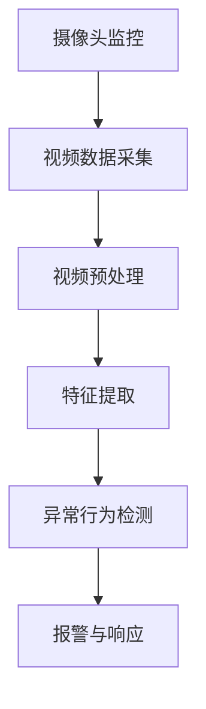

##### 人脸识别与行为分析

人脸识别技术可以用于身份验证和犯罪侦查。通过对比摄像头捕捉的人脸图像和数据库中的人脸信息，可以实现快速的身份识别。行为分析技术则可以用于识别异常行为，如暴力事件、可疑行为等。

##### 应急事件响应与处理

智慧城市安防系统可以通过实时监控和分析，快速识别和响应应急事件。例如，在发生火灾、交通事故等紧急情况下，系统可以自动通知相关部门和人员，并给出应对建议，以最大限度地减少损失和伤害。

### 第三部分：AI在智慧城市运营与管理中的应用

#### 3.1 数据驱动的城市治理

数据驱动的城市治理是智慧城市运营管理的重要方向，通过大数据和人工智能技术，实现城市治理的科学化、精细化和智能化。

##### 城市数据采集与处理

城市数据是智慧城市治理的基础。通过部署各种传感器和监测设备，可以实时采集城市的交通、环境、能源等各方面的数据。这些数据经过预处理后，才能被用于进一步的分析和建模。

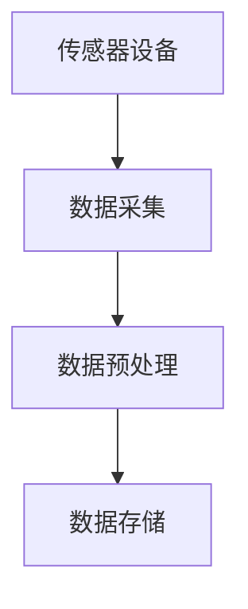

##### 数据预处理方法

数据预处理是数据驱动城市治理的关键步骤。通过清洗、归一化、特征提取等方法，可以提高数据的可用性和质量，为后续的分析和建模奠定基础。

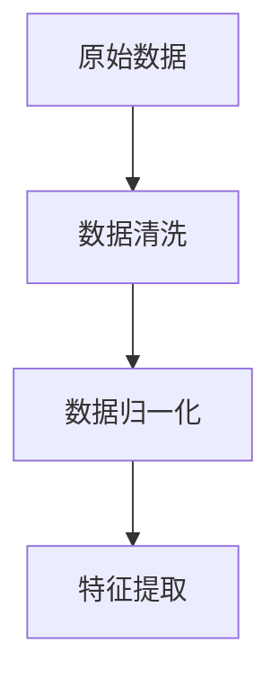

##### 数据质量管理与隐私保护

数据质量管理是确保数据质量和可信度的重要环节。在智慧城市运营管理中，需要严格保护居民的个人隐私和数据安全。通过数据加密、访问控制、匿名化等技术手段，可以有效保障数据的安全和隐私。

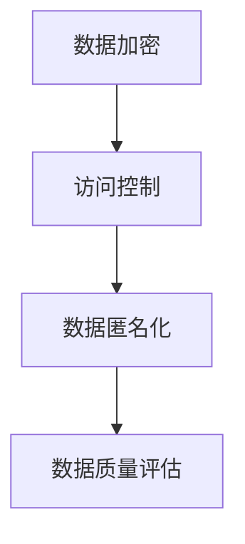

##### 城市治理决策支持系统

城市治理决策支持系统是基于大数据和人工智能技术，为城市管理者提供决策支持和优化的平台。通过集成多种数据源，系统可以实时分析城市运行状况，为管理者提供科学的决策依据。

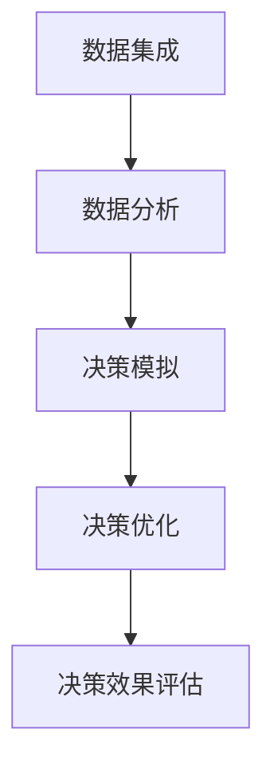

##### 决策模型构建

在城市治理中，构建决策模型是实现科学决策的关键。通过分析历史数据和当前状况，可以构建预测模型、优化模型等，为决策提供技术支持。

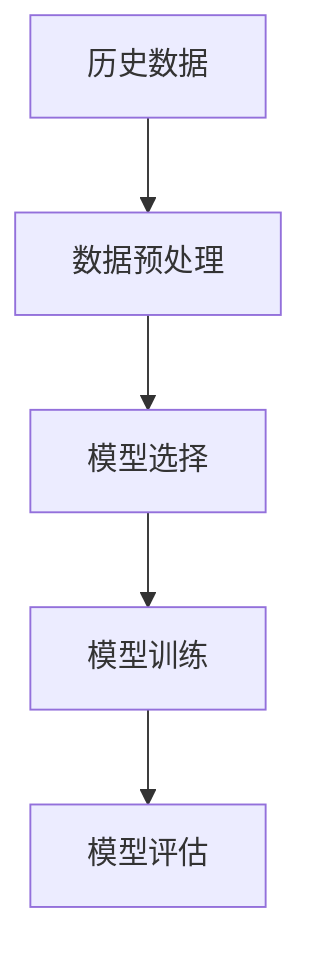

##### 决策优化与模拟

通过决策模型，可以对不同方案进行模拟和优化，以确定最佳决策方案。例如，在交通管理中，可以通过模拟不同信号灯配置，确定最优的交通流量控制方案。

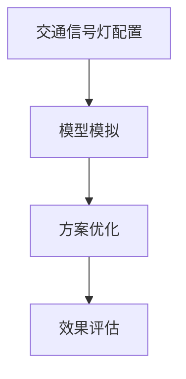

##### 决策效果评估与反馈

决策效果评估是对决策执行效果的监测和评估。通过分析决策执行的结果，可以评估决策的有效性，并据此调整和优化决策模型。

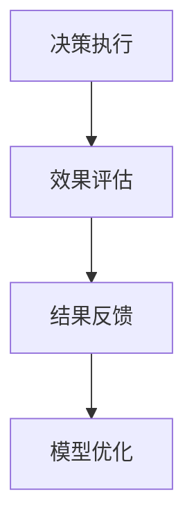

#### 3.2 城市可持续发展

城市可持续发展是智慧城市建设的重要目标之一，通过大数据和人工智能技术，可以实现对城市可持续发展状态的监测、评估和优化。

##### 可持续发展指标体系

可持续发展指标体系是衡量城市可持续发展状况的重要工具。通过设定一系列的指标，可以全面、客观地评估城市的可持续发展水平。

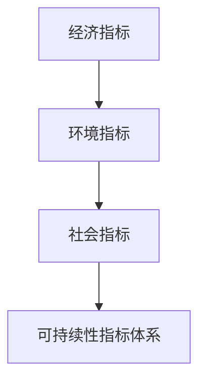

##### 指标计算与评估方法

通过对各类数据的计算和分析，可以得出每个可持续发展指标的值，并根据这些指标值进行评估。常见的评估方法包括定量评估、定性评估和综合评估等。

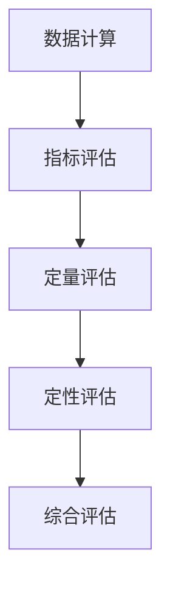

##### 可持续发展策略制定

根据可持续发展指标评估的结果，可以制定相应的可持续发展策略。这些策略可以包括环境保护措施、经济发展规划、社会福祉提升等，旨在实现城市的可持续发展。

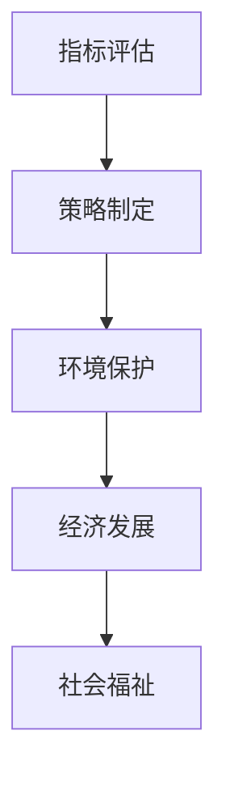

#### 3.3 智慧城市风险管理

智慧城市风险管理是通过大数据和人工智能技术，对城市运行中的各种风险进行识别、评估和管理，以保障城市的稳定运行和可持续发展。

##### 风险识别与评估

风险识别与评估是智慧城市风险管理的基础。通过分析历史数据和实时数据，可以识别出城市运行中的潜在风险，并对其进行评估，确定风险的程度和影响范围。

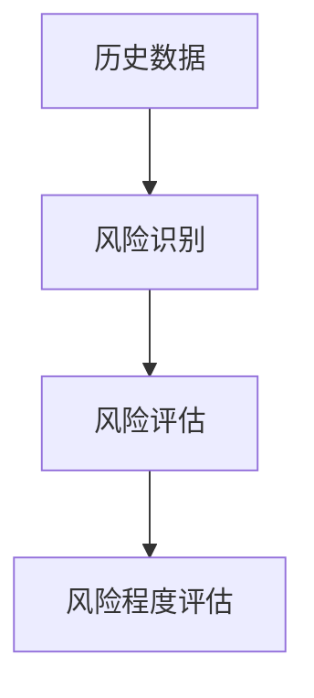

##### 风险评估模型

风险评估模型是用于评估风险程度和影响范围的工具。通过构建数学模型，可以定量分析风险的各种因素，并预测风险的可能发展趋势。

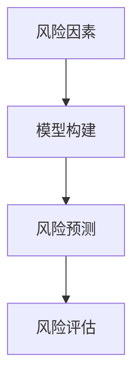

##### 风险预警与应急预案

风险预警与应急预案是应对突发事件和风险的重要手段。通过实时监测和数据分析，可以及时发现风险，并采取相应的预警措施和应急预案，以减少风险对城市运行的影响。

```mermaid
graph TD
    A[风险监测] --> B[预警措施]
    B --> C[应急预案]
    C --> D[风险应对]
```

##### 风险管理策略制定

根据风险识别和评估的结果，可以制定相应的风险管理策略。这些策略可以包括风险预防、风险转移、风险控制等，旨在降低风险对城市运行的影响。

```mermaid
graph TD
    A[风险识别] --> B[风险管理]
    B --> C[风险预防]
    C --> D[风险转移]
    D --> E[风险控制]
```

##### 应急响应流程与机制

应急响应流程与机制是应对突发事件和风险的关键。通过建立完善的应急响应流程和机制，可以确保在突发事件发生时，能够快速、有效地进行应对，最大限度地减少损失和影响。

```mermaid
graph TD
    A[突发事件] --> B[应急响应]
    B --> C[应急处理]
    C --> D[恢复重建]
```

##### 应急资源调度与优化

应急资源调度与优化是应急响应的重要环节。通过实时监测和数据分析，可以合理调配应急资源，优化资源使用效率，确保应急响应的及时性和有效性。

```mermaid
graph TD
    A[应急资源] --> B[资源调度]
    B --> C[资源优化]
    C --> D[应急响应]
```

### 第四部分：案例研究与实践

#### 4.1 案例研究：A城市的智慧交通系统

##### 4.1.1 A城市智慧交通系统的背景

A城市位于我国东部地区，随着城市化进程的加快，交通拥堵问题日益严重，给市民的出行带来了极大不便。为了改善交通状况，提高城市运行效率，A市政府决定建设智慧交通系统。

##### 4.1.2 智慧交通系统的设计与实现

A城市的智慧交通系统主要包括以下几个部分：

1. **智能交通信号控制系统**：通过部署智能交通信号控制器，结合AI算法，实现交通信号的动态调整，优化交通流量。

2. **交通流量监测系统**：在主要交通干道和交叉路口安装高清摄像头和传感器，实时监测交通流量和拥堵情况。

3. **大数据中心**：整合交通数据、环境数据、历史数据等，通过大数据技术进行分析和挖掘，为智慧交通系统的运行提供支持。

4. **智能出行服务系统**：提供实时公交查询、路况信息推送、智能导航等服务，方便市民出行。

##### 4.1.3 智慧交通系统的效果评估

智慧交通系统运行以来，取得了显著的成效：

1. **交通拥堵缓解**：通过智能交通信号控制和交通流量监测，有效缓解了交通拥堵，提高了道路通行效率。

2. **出行体验提升**：智能出行服务系统为市民提供了便捷的出行信息，提升了市民的出行体验。

3. **资源节约**：通过优化交通流量，减少了车辆的空载行驶，降低了能源消耗和环境污染。

#### 4.2 案例研究：B城市的智慧环境监测系统

##### 4.2.1 B城市智慧环境监测系统的建设过程

B城市位于我国北方，空气质量较差。为了改善城市环境，提升居民生活品质，B市政府决定建设智慧环境监测系统。

1. **系统规划与设计**：制定智慧环境监测系统的建设方案，包括监测站点布局、传感器选型、数据传输方式等。

2. **设备安装与调试**：在主要污染物排放源和居民区安装空气质量监测设备，进行设备调试和校准。

3. **系统集成与数据采集**：将各监测设备接入智慧环境监测平台，实现数据的实时采集和传输。

4. **数据分析与处理**：通过大数据技术对环境监测数据进行分析和处理，生成环境质量报告和预测。

##### 4.2.2 系统功能与数据采集

B城市的智慧环境监测系统具有以下功能：

1. **实时监测**：通过传感器设备实时监测空气质量、水质、噪音等环境指标，并将数据传输到智慧环境监测平台。

2. **数据存储与管理**：将采集到的环境数据进行存储和管理，提供数据查询和分析服务。

3. **预警与响应**：根据环境监测数据，实时预警空气质量变化，并采取相应的应急措施。

4. **报告生成与发布**：定期生成环境质量报告，向社会公众发布环境监测信息。

##### 4.2.3 监测数据的应用与效果

通过智慧环境监测系统，B城市取得了以下成果：

1. **空气质量改善**：通过监测数据分析和污染源定位，采取有针对性的治理措施，空气质量得到了显著改善。

2. **环境管理优化**：基于监测数据，环境管理部门可以更加科学地进行环境管理，提高了环境治理的效率。

3. **居民满意度提升**：居民通过智慧环境监测平台可以实时了解环境状况，提升了居民的环保意识和满意度。

#### 4.3 案例研究：C城市的智慧能源管理系统

##### 4.3.1 C城市智慧能源管理系统的发展历程

C城市位于我国西部，能源资源丰富。为了提高能源利用效率，降低能源消耗，C市政府决定建设智慧能源管理系统。

1. **初期建设**：在主要能源消耗场所安装智能传感器和智能设备，实现能源数据的实时采集和传输。

2. **中期发展**：通过大数据技术对能源数据进行分析和挖掘，优化能源配置，提高能源利用效率。

3. **成熟期**：将智慧能源管理系统与其他智慧城市系统（如智慧交通、智慧环境等）进行集成，实现全城能源智能化管理。

##### 4.3.2 智慧能源管理系统的架构与功能

C城市智慧能源管理系统的架构包括以下几个部分：

1. **感知层**：包括各种智能传感器和智能设备，用于实时监测能源使用情况。

2. **传输层**：通过无线通信技术和物联网技术，将感知层的数据传输到智慧能源管理平台。

3. **平台层**：智慧能源管理平台是系统的核心，负责数据存储、分析和处理。

4. **应用层**：包括各类能源管理应用，如能耗监测、能源优化、智能调度等。

##### 4.3.3 系统优化与效果评估

通过智慧能源管理系统，C城市取得了以下成果：

1. **能源消耗降低**：通过实时监测和智能调度，降低了能源消耗，提高了能源利用效率。

2. **经济效益显著**：智慧能源管理系统减少了能源浪费，降低了能源成本，为城市创造了经济效益。

3. **环境效益提升**：通过优化能源结构，降低了污染物排放，改善了环境质量。

### 第五部分：未来展望与挑战

#### 5.1 智慧城市发展的未来趋势

随着人工智能技术的不断进步，智慧城市的发展呈现出以下趋势：

1. **智能化水平提升**：人工智能技术将在智慧城市的各个领域得到更广泛的应用，推动城市治理和服务向智能化、精细化和个性化方向发展。

2. **数据融合与共享**：智慧城市的发展离不开海量数据的支撑，未来的智慧城市将更加注重数据的融合与共享，提高数据的价值和利用率。

3. **绿色低碳发展**：随着环保意识的增强，智慧城市将更加注重绿色低碳发展，通过智能技术实现能源的高效利用和污染的减排。

4. **社会参与与互动**：智慧城市的建设将更加注重居民和社会的参与，通过智能技术搭建起城市与居民之间的互动平台，提高居民的获得感和幸福感。

#### 5.2 AI在城市规划和智慧城市中的挑战与解决方案

尽管AI技术在城市规划和智慧城市建设中具有巨大的潜力，但也面临着一些挑战：

1. **数据隐私与安全**：随着数据量的增加，数据隐私和安全问题日益突出。解决这一问题的关键在于建立完善的数据安全和隐私保护机制，如数据加密、访问控制等。

2. **算法偏见与公平性**：AI算法在处理数据时可能会产生偏见，导致不公正的结果。解决这一问题的方法包括算法透明化、公平性评估和算法监督等。

3. **技术标准化与统一**：智慧城市建设需要多种技术的协同工作，但现有技术标准不统一，导致互操作性问题。推动技术标准化和统一是解决这一问题的关键。

4. **社会接受度和参与度**：智慧城市的发展离不开居民的参与和支持，提高居民对智慧城市的接受度和参与度，需要加强宣传和培训，提高居民的智慧城市意识。

#### 5.3 AI与城市规划和智慧城市的未来方向

未来，AI与城市规划和智慧城市的融合发展将呈现出以下方向：

1. **智能化城市规划**：通过AI技术，实现城市规划的智能化、自动化和高效化，提高规划的科学性和可行性。

2. **智慧城市平台建设**：建立统一的智慧城市平台，实现各类智能应用的集成和协同，提高城市管理和服务的整体效能。

3. **新兴技术的应用**：积极探索和推广新兴技术，如5G、区块链、边缘计算等，为智慧城市建设提供更强大的技术支撑。

4. **全球合作与经验交流**：加强国内外智慧城市建设的合作与交流，借鉴先进经验，推动智慧城市的全球发展。

### 附录

#### 附录 A：智慧城市相关资源与工具

1. **开源平台与工具**

   - 物联网平台：MQTT、CoAP、LoraWan等
   - 大数据与云计算平台：Hadoop、Spark、Docker等
   - 深度学习框架：TensorFlow、PyTorch、Keras等

2. **智慧城市报告与文献**

   - 国际智慧城市报告：联合国教科文组织、世界经济论坛等
   - 国家智慧城市政策与规划：各国政府发布的智慧城市相关政策文件
   - 智慧城市建设案例分析：国内外智慧城市建设成功案例的详细分析和研究

---

通过本文的探讨，我们可以看到，人工智能技术在城市规划和智慧城市建设中具有巨大的潜力。未来，随着AI技术的不断进步和应用场景的拓展，智慧城市将更加智能化、高效化和可持续发展。然而，我们也需要认识到，智慧城市的发展面临着诸多挑战，需要全社会共同努力，才能实现智慧城市的美好愿景。

