                 

### 文章标题

# 《AI如何改变市场研究和消费者洞察》

### 关键词

- 人工智能
- 市场研究
- 消费者洞察
- 机器学习
- 数据分析
- 自然语言处理
- 图神经网络
- 个性化推荐
- 消费者行为分析

### 摘要

本文深入探讨了人工智能（AI）在市场研究和消费者洞察中的革命性作用。随着AI技术的不断进步，市场研究从传统的方法逐渐转型，利用AI的强大能力，实现更加精准和高效的消费者洞察。本文首先概述了市场研究与消费者洞察的基础知识，随后详细介绍了AI在市场研究中的多种应用，如机器学习、自然语言处理和图神经网络等。接下来，文章讨论了AI在消费者洞察中的应用，包括用户画像、个性化推荐和消费者行为分析等。通过案例分析，展示了AI在市场研究和消费者洞察中的成功应用。最后，文章探讨了AI技术的未来发展趋势，以及企业在AI时代的市场研究策略和消费者洞察方法。

### 目录

## 第一部分：市场研究与消费者洞察的基础知识

### 第1章：市场研究与消费者洞察概述

- **1.1 市场研究与消费者洞察的定义**
- **1.2 市场研究与消费者洞察的重要性**
- **1.3 市场研究与消费者洞察的基本流程**

### 第2章：市场研究与消费者洞察的方法与技术

- **2.1 定量研究与定性研究**
  - **2.1.1 问卷调查与焦点小组**
  - **2.1.2 实地观察与深度访谈**
- **2.2 数据挖掘与统计分析**
  - **2.2.1 数据预处理**
  - **2.2.2 聚类分析**
  - **2.2.3 回归分析**
- **2.3 大数据技术与市场研究**
  - **2.3.1 数据仓库与数据湖**
  - **2.3.2 数据可视化工具**

## 第二部分：AI在市场研究与消费者洞察中的应用

### 第3章：AI在市场研究中的应用

- **3.1 机器学习与市场预测**
  - **3.1.1 机器学习基本算法介绍**
  - **3.1.2 市场预测案例分析**
- **3.2 自然语言处理与文本分析**
  - **3.2.1 文本分类与主题建模**
  - **3.2.2 情感分析与意见挖掘**
- **3.3 图神经网络与网络分析**
  - **3.3.1 图神经网络基础**
  - **3.3.2 社交网络分析**

### 第4章：AI在消费者洞察中的应用

- **4.1 用户画像与个性化推荐**
  - **4.1.1 用户画像构建方法**
  - **4.1.2 个性化推荐算法**
- **4.2 消费者行为分析**
  - **4.2.1 购买行为预测**
  - **4.2.2 消费者满意度分析**
- **4.3 跨渠道数据分析**
  - **4.3.1 跨渠道数据整合方法**
  - **4.3.2 跨渠道消费者行为分析**

## 第三部分：案例研究与未来展望

### 第5章：AI在市场研究和消费者洞察中的成功案例

- **5.1 案例一：某电商平台的个性化推荐系统**
- **5.2 案例二：某零售企业的消费者行为分析**
- **5.3 案例三：某市场研究公司的AI应用案例**

### 第6章：AI市场研究与消费者洞察的未来趋势

- **6.1 AI技术的最新发展**
- **6.2 AI在市场研究和消费者洞察中的挑战与机遇**
- **6.3 AI市场的未来发展趋势**

### 第7章：AI时代的市场研究策略与消费者洞察

- **7.1 市场研究策略的变革**
- **7.2 消费者洞察的新方法**
- **7.3 企业如何利用AI进行市场研究和消费者洞察**

## 附录

### 附录A：AI市场研究与消费者洞察常用工具与资源

- **A.1 AI市场研究与消费者洞察工具对比**
- **A.2 AI市场研究与消费者洞察开源资源**

## 第8章：AI大模型在市场研究和消费者洞察中的应用架构

### 8.1 AI大模型概述

- **8.1.1 AI大模型定义**
- **8.1.2 AI大模型特点**

### 8.2 AI大模型核心架构与联系

- **8.2.1 数据预处理**
- **8.2.2 模型训练**
- **8.2.3 模型评估**
- **8.2.4 模型部署**
- **8.2.5 持续优化**

### 8.3 AI大模型核心算法原理讲解

- **8.3.1 生成对抗网络（GAN）**
- **8.3.2 长短时记忆网络（LSTM）**

### 8.4 数学模型和数学公式讲解

- **8.4.1 概率图模型**

### 8.5 项目实战

- **8.5.1 市场预测项目实战**
- **8.5.2 用户画像构建项目实战**
- **8.5.3 个性化推荐系统项目实战**

### 8.6 代码解读与分析

- **8.6.1 用户画像构建代码解读**
- **8.6.2 个性化推荐系统代码解读**

### 8.7 总结与展望

- **8.7.1 内容回顾**
- **8.7.2 关键作用**
- **8.7.3 发展趋势与机遇**

### 文章结束

**作者：AI天才研究院/AI Genius Institute & 禅与计算机程序设计艺术 /Zen And The Art of Computer Programming**

### 第一部分：市场研究与消费者洞察的基础知识

#### 第1章：市场研究与消费者洞察概述

#### 1.1 市场研究与消费者洞察的定义

市场研究是指通过系统的过程来收集、分析和解释有关市场行为、需求、趋势和竞争环境的信息。消费者洞察，则更专注于了解消费者的行为、偏好、情感和动机。两者共同构成了企业决策的重要基础。

市场研究可以定义为“对产品或服务的目标市场进行系统的调查和分析，以了解市场需求、消费者行为、竞争环境和潜在的机会与威胁”。而消费者洞察则是对消费者的深层次理解，包括他们的需求、偏好、行为模式和消费习惯。

#### 1.2 市场研究与消费者洞察的重要性

市场研究和消费者洞察对于企业而言至关重要。首先，它们为企业提供了宝贵的决策依据，帮助企业了解市场需求，从而制定更加有效的市场策略。其次，通过消费者洞察，企业可以更好地满足消费者的需求，提高客户满意度和忠诚度。

此外，市场研究和消费者洞察还能帮助企业发现新的市场机会，优化产品和服务，提高竞争力。例如，通过分析消费者反馈和市场趋势，企业可以及时调整产品策略，推出更符合市场需求的新产品。

#### 1.3 市场研究与消费者洞察的基本流程

市场研究和消费者洞察的基本流程通常包括以下几个阶段：

1. **问题定义**：明确研究的目标和问题，确定研究范围。
2. **数据收集**：通过问卷调查、深度访谈、焦点小组讨论等方式收集数据。
3. **数据分析**：对收集到的数据进行分析，包括定量分析和定性分析。
4. **结果解释**：根据数据分析结果，解释市场趋势和消费者行为，提出结论和建议。
5. **报告撰写**：将研究结果撰写成报告，为企业提供决策支持。

下面是一个简单的 Mermaid 流程图，展示市场研究和消费者洞察的基本流程：

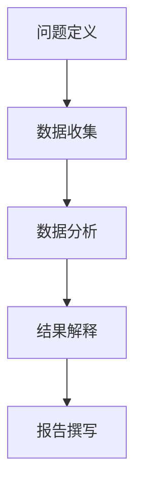

#### 1.4 市场研究与消费者洞察的方法与技术

市场研究和消费者洞察的方法和技术多种多样，主要包括以下几类：

- **定量研究**：通过问卷调查、统计分析等方法，对大量数据进行分析，以获得统计意义上的结论。
- **定性研究**：通过深度访谈、焦点小组讨论、实地观察等方法，深入了解消费者的行为、动机和需求。
- **数据挖掘**：利用大数据技术，从大量数据中挖掘出潜在的模式和趋势。
- **机器学习**：通过训练模型，对数据进行分析和预测，帮助发现新的市场机会。
- **自然语言处理**：对文本数据进行分析，提取有用信息，如情感分析和主题建模。

这些方法的结合，可以为企业提供全面、深入的市场研究和消费者洞察。

在下一章中，我们将进一步探讨市场研究与消费者洞察的方法与技术，包括定量研究与定性研究、数据挖掘与统计分析等。通过了解这些基本概念和流程，读者将能够更好地理解市场研究和消费者洞察的重要性，并为后续章节的内容做好准备。

### 第2章：市场研究与消费者洞察的方法与技术

#### 2.1 定量研究与定性研究

市场研究与消费者洞察的方法可以分为定量研究和定性研究。这两种研究方法各有优势和局限性，通常结合使用，以获得全面、深入的了解。

#### 2.1.1 问卷调查与焦点小组

**问卷调查** 是定量研究中最常用的方法之一。通过设计合理的问卷，收集大量样本的数据，以统计分析的方式分析市场趋势和消费者行为。问卷调查的优点包括：成本低、覆盖面广、数据量大，可以提供量化的结论。然而，问卷调查也存在一些局限性，如样本代表性问题、问卷设计偏差等。

**焦点小组** 是定性研究的一种方法，通过组织一组参与者进行讨论，深入了解他们的观点和需求。焦点小组的优点在于能够获取深入、详细的定性信息，发现潜在的问题和趋势。然而，焦点小组也存在一些缺点，如样本量小、结果主观性强等。

下面是一个简单的 Mermaid 流程图，展示问卷调查和焦点小组的流程：

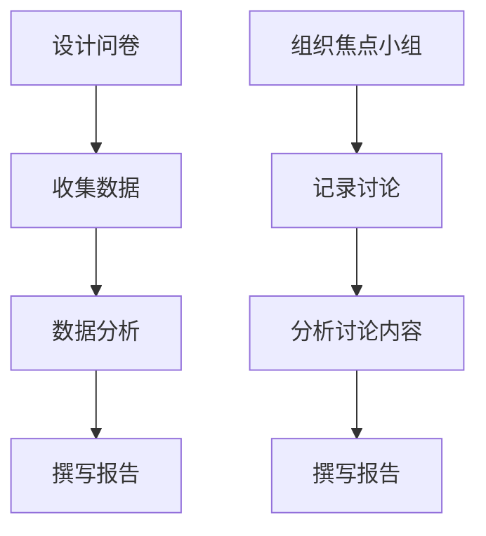

#### 2.1.2 实地观察与深度访谈

**实地观察** 是一种定性研究方法，通过直接观察消费者的行为和环境，获取第一手资料。实地观察的优点在于能够提供真实、具体的场景信息，帮助研究者深入理解消费者行为。然而，实地观察也存在一些局限性，如观察者偏差、数据收集困难等。

**深度访谈** 是另一种定性研究方法，通过与受访者进行深入、一对一的交流，获取详细的信息和观点。深度访谈的优点在于能够深入了解受访者的想法和感受，获取深层次的信息。然而，深度访谈也存在一些缺点，如时间成本高、结果主观性强等。

下面是一个简单的 Mermaid 流程图，展示实地观察和深度访谈的流程：

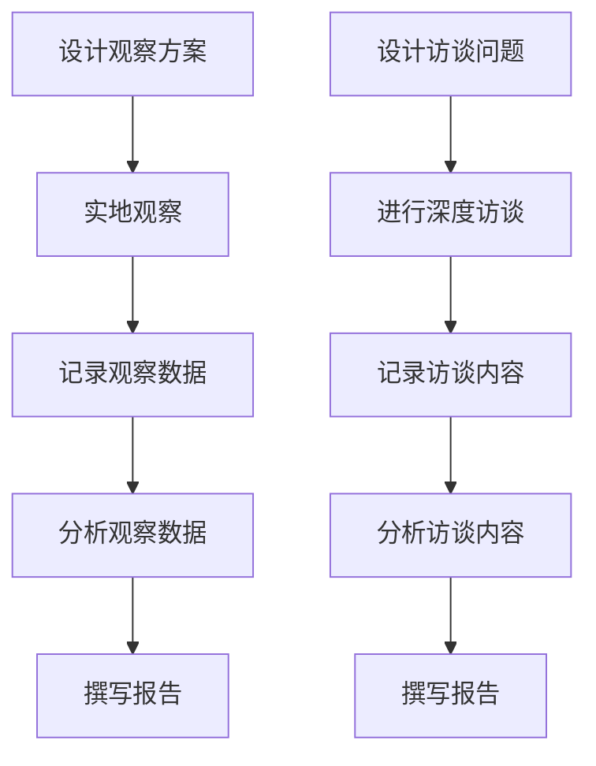

#### 2.1.3 定量研究与定性研究的结合

在实际的市场研究和消费者洞察中，定量研究和定性研究通常结合使用。定量研究提供大量的数据，支持统计分析，而定性研究则提供深入的理解和具体的案例。这种结合可以帮助研究者从不同角度分析市场现象，提高研究结果的全面性和可靠性。

下面是一个简单的 Mermaid 流程图，展示定量研究和定性研究的结合：

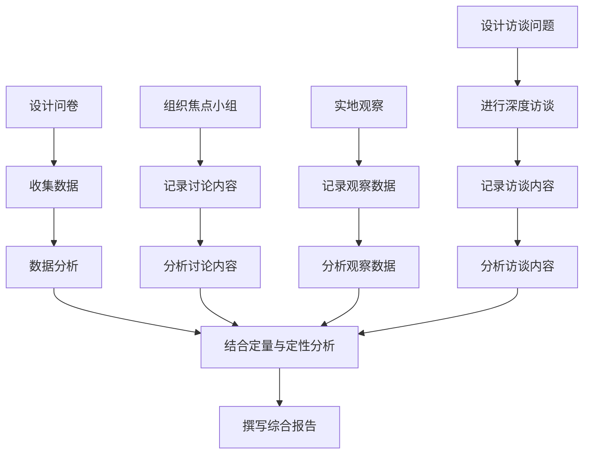

通过本章的讨论，我们了解了定量研究和定性研究的基本概念、方法及其应用。在实际研究中，根据具体的研究目标和问题，选择合适的研究方法，结合定量研究和定性研究，可以更全面、深入地了解市场现象和消费者行为。在下一章中，我们将进一步探讨数据挖掘与统计分析的方法，以及大数据技术与市场研究的关系。

### 2.2 数据挖掘与统计分析

数据挖掘和统计分析是市场研究与消费者洞察中的关键技术，它们通过处理和分析大量数据，帮助研究者发现潜在的模式、趋势和规律。以下将详细介绍数据挖掘和统计分析的基本概念、方法和应用。

#### 2.2.1 数据预处理

数据预处理是数据挖掘和分析的第一步，其目的是将原始数据转化为适合进行分析的形式。数据预处理包括以下几个关键步骤：

- **数据清洗**：去除重复数据、处理缺失值、纠正错误数据等，以提高数据质量。
- **数据集成**：将来自不同数据源的数据进行合并，形成一个统一的数据集。
- **数据转换**：将数据转换为适当的格式，如将文本数据编码为数值型数据。
- **数据归一化**：通过缩放或平移，将不同特征的数据进行标准化处理，使其具有相同的量级。

#### 2.2.2 聚类分析

聚类分析是一种无监督学习方法，旨在将数据点按照其相似性进行分组。常见的聚类算法包括：

- **K-均值聚类**：通过计算数据点之间的距离，将数据划分为K个簇，每个簇的中心即为该簇的均值。
- **层次聚类**：通过递归地将数据点合并或划分，构建一个层次化的聚类树。
- **基于密度的聚类**：如DBSCAN算法，通过检测数据点之间的密度连接性，形成簇。

聚类分析在市场研究中的应用包括市场细分、消费者群体划分等。通过聚类分析，企业可以识别出具有相似特征和需求的消费者群体，从而制定更加精准的营销策略。

下面是一个简单的 Mermaid 流程图，展示聚类分析的基本步骤：

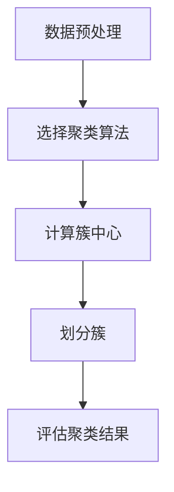

#### 2.2.3 回归分析

回归分析是一种有监督学习方法，用于预测连续变量。常见的回归分析方法包括：

- **线性回归**：通过建立自变量和因变量之间的线性关系，预测因变量的值。
- **多项式回归**：将线性回归扩展到多项式关系，可以捕捉更复杂的非线性关系。
- **逻辑回归**：用于预测概率性变量，如二分类问题。

回归分析在市场研究中的应用包括销售预测、价格弹性分析等。通过回归分析，企业可以预测市场趋势和消费者行为，为决策提供依据。

下面是一个简单的 Mermaid 流程图，展示回归分析的基本步骤：

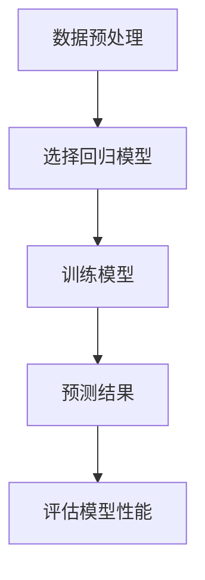

#### 2.2.4 其他数据挖掘方法

除了聚类分析和回归分析，还有许多其他的数据挖掘方法，如：

- **关联规则学习**：发现数据之间的关联性，如市场中的互补商品和替代商品。
- **异常检测**：识别数据中的异常值，如欺诈交易和异常消费行为。
- **文本挖掘**：分析文本数据，提取关键词、主题和情感。

这些方法在市场研究和消费者洞察中也有广泛的应用，可以帮助企业更全面地了解市场和消费者。

下面是一个简单的 Mermaid 流程图，展示其他数据挖掘方法的基本步骤：

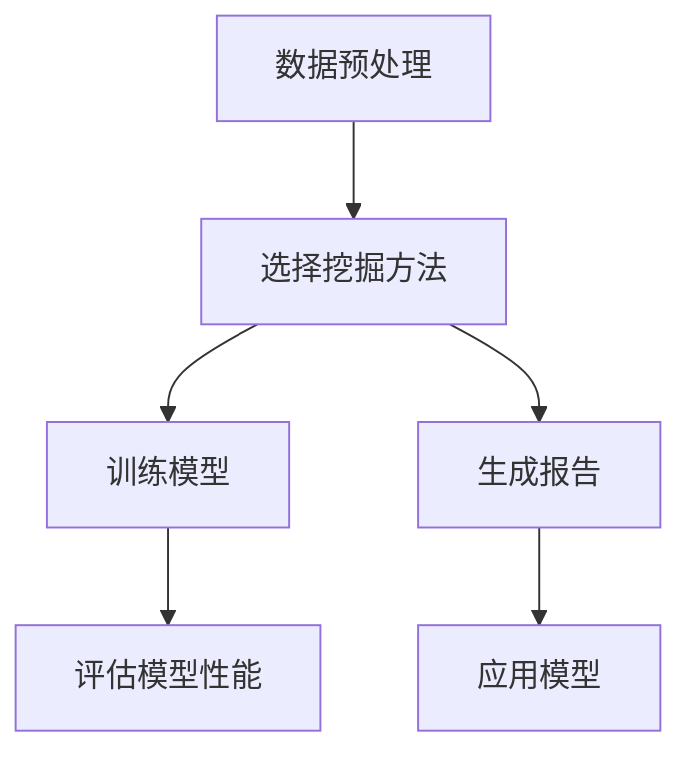

通过本章的讨论，我们了解了数据挖掘和统计分析的基本概念、方法和应用。这些技术为市场研究和消费者洞察提供了强大的工具，帮助企业从海量数据中提取有价值的信息，做出更加精准的决策。在下一章中，我们将探讨大数据技术与市场研究的关系，以及数据仓库与数据湖的基本概念。

### 2.3 大数据技术与市场研究

随着互联网和电子商务的快速发展，市场研究和消费者洞察面临着海量的数据。这些数据不仅来源于企业内部，还包括社交媒体、在线评论、移动应用等外部数据源。大数据技术在这一背景下应运而生，为市场研究提供了强大的工具。

#### 2.3.1 数据仓库与数据湖

**数据仓库** 是一种用于存储、管理和分析大量历史数据的系统。数据仓库的设计旨在支持复杂的查询和分析，通常包含多个数据源的数据。数据仓库的特点包括数据的一致性、完整性和安全性。

**数据湖** 则是一种更灵活、开放的数据存储解决方案。与数据仓库不同，数据湖可以存储原始数据，而不需要提前进行结构化处理。数据湖能够容纳不同类型、结构和规模的数据，包括结构化数据、半结构化数据和非结构化数据。这种灵活性使得数据湖适用于实时数据分析和机器学习应用。

下面是一个简单的 Mermaid 流程图，展示数据仓库和数据湖的基本架构：

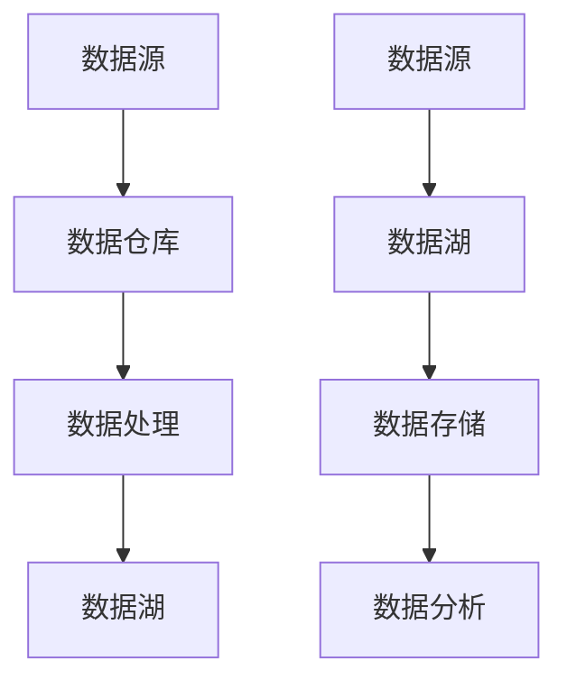

#### 2.3.2 数据可视化工具

数据可视化是将复杂的数据以图形化的方式展示出来，使研究人员能够更容易地理解和分析数据。以下是一些常用的数据可视化工具：

- **Tableau**：一个功能强大的数据可视化工具，支持多种数据源和丰富的图表类型。
- **Power BI**：微软推出的数据可视化工具，易于使用，能够与Excel和其他微软产品无缝集成。
- **QlikView**：一个高度交互式的数据可视化工具，支持实时数据分析和探索。
- **Google Charts**：Google 提供的免费图表库，适用于网页应用中的数据可视化。

#### 2.3.3 大数据技术在市场研究中的应用

大数据技术在市场研究中有广泛的应用，以下是一些典型案例：

- **消费者行为分析**：通过分析消费者的购买记录、搜索历史和社交媒体活动，企业可以更深入地了解消费者的行为和偏好，从而优化产品和服务。
- **市场趋势预测**：利用大数据技术，企业可以实时监测市场变化，预测未来趋势，制定相应的市场策略。
- **竞争分析**：通过分析竞争对手的营销策略、产品发布和市场反馈，企业可以了解竞争环境，制定有针对性的竞争策略。

下面是一个简单的 Mermaid 流程图，展示大数据技术在市场研究中的应用：

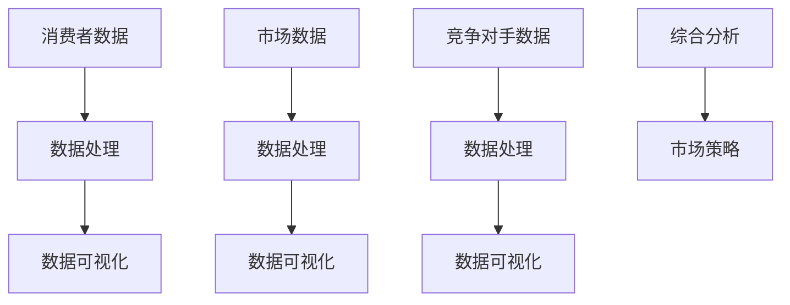

通过本章的讨论，我们了解了大数据技术在市场研究中的应用，包括数据仓库、数据湖和数据可视化工具。这些技术为市场研究提供了强大的支持，帮助企业从海量数据中提取有价值的信息，做出更加精准的决策。在下一章中，我们将探讨AI在市场研究中的应用，包括机器学习、自然语言处理和图神经网络等。

### 3.1 AI在市场研究中的应用

人工智能（AI）在市场研究中的应用正在迅速扩展，为研究者提供了前所未有的洞察和分析能力。AI通过多种技术手段，如机器学习、自然语言处理和图神经网络，极大地提高了市场研究的效率和准确性。

#### 3.1.1 机器学习与市场预测

**机器学习** 是AI的核心技术之一，通过训练模型，从数据中学习规律和模式，实现自动化的预测和分析。以下是一些常见的机器学习算法及其在市场预测中的应用：

- **线性回归**：用于预测连续的数值型变量，如销售额或市场份额。线性回归模型通过分析历史数据中的关系，预测未来的市场趋势。

- **逻辑回归**：用于预测概率性变量，如市场进入的概率或消费者购买的概率。逻辑回归模型能够计算每个样本属于某个类别的概率，为市场决策提供依据。

- **决策树**：通过构建树状模型，将数据划分为多个子集，实现分类或回归任务。决策树模型直观、易于解释，适合市场细分和消费者行为分析。

- **随机森林**：一种集成学习方法，通过构建多个决策树，合并它们的预测结果，提高模型的准确性和稳定性。随机森林模型在市场预测和风险评估中有着广泛的应用。

- **支持向量机（SVM）**：一种用于分类和回归的算法，通过找到一个最优的超平面，将数据分为不同的类别。SVM在市场研究中的应用包括产品定位和品牌竞争分析。

以下是一个简单的机器学习算法伪代码，用于市场预测：

```python
# 线性回归模型伪代码
def linear_regression(X, y):
    # 计算回归系数
    coefficients = np.linalg.inv(X.T.dot(X)).dot(X.T).dot(y)
    return coefficients

# 训练模型
coefficients = linear_regression(X_train, y_train)

# 预测结果
y_pred = X_test.dot(coefficients)
```

#### 3.1.2 市场预测案例分析

**市场预测** 是机器学习在市场研究中的重要应用之一。以下是一个简单的市场预测案例，展示如何使用机器学习算法预测未来市场的趋势。

**案例背景**：一家电商平台希望通过分析历史销售数据，预测未来30天的销售额，以便更好地规划库存和营销策略。

**数据处理**：首先，收集过去一年的销售数据，包括日期、销售额、品类、促销活动等信息。对数据进行清洗和预处理，去除缺失值和异常值，并转换为合适的格式。

**模型选择**：选择线性回归模型，因为销售额是连续的数值型变量。

**模型训练**：使用训练集数据，通过线性回归算法训练模型，计算回归系数。

**模型评估**：使用测试集数据评估模型性能，计算预测误差和相关性指标。

**模型部署**：将训练好的模型应用于未来30天的销售预测，生成预测结果。

以下是一个简单的市场预测流程图：

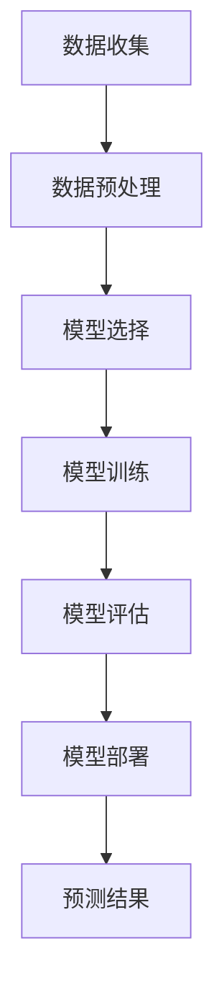

#### 3.1.3 机器学习在市场研究中的挑战与机遇

**挑战**：尽管机器学习在市场预测中具有巨大的潜力，但也面临一些挑战：

- **数据质量**：市场研究中的数据可能存在缺失值、异常值和噪声，这会影响模型的准确性和稳定性。
- **模型可解释性**：机器学习模型，尤其是深度学习模型，通常具有高度的非线性复杂结构，这使得模型的预测结果难以解释。
- **过拟合**：模型在训练数据上表现良好，但在新数据上表现不佳，这称为过拟合。

**机遇**：随着AI技术的不断进步，机器学习在市场研究中的应用前景广阔：

- **自动化预测**：机器学习可以自动化地处理大量数据，实现高效的预测和分析。
- **个性化洞察**：通过分析消费者行为和偏好，机器学习可以提供个性化的市场洞察，帮助企业制定更精准的营销策略。
- **实时分析**：机器学习技术可以实现实时数据分析和预测，帮助企业快速响应市场变化。

通过本章的讨论，我们了解了机器学习在市场研究中的应用，包括市场预测的算法、案例分析以及面临的挑战和机遇。在下一章中，我们将探讨自然语言处理和文本分析在市场研究中的应用。

### 3.2 自然语言处理与文本分析

自然语言处理（NLP）是人工智能的重要分支，专注于让计算机理解和生成自然语言。文本分析是NLP的一个核心应用，通过分析大量的文本数据，提取有用信息并生成见解。以下将介绍文本分类、主题建模和情感分析等NLP技术在市场研究中的应用。

#### 3.2.1 文本分类与主题建模

**文本分类** 是将文本数据按照特定的类别进行分类的过程。在市场研究中，文本分类可以用于分析社交媒体评论、产品评论和新闻报道等，帮助企业了解消费者对产品的态度和意见。常见的文本分类算法包括：

- **朴素贝叶斯分类器**：基于贝叶斯定理，通过计算文本中各个词语的概率，预测文本的类别。
- **支持向量机（SVM）**：通过找到一个最优的超平面，将文本划分为不同的类别。
- **深度学习模型**：如卷积神经网络（CNN）和循环神经网络（RNN），能够处理更复杂的文本数据，提高分类的准确性。

**主题建模** 是一种无监督学习方法，用于发现文本数据中的潜在主题。主题建模可以帮助市场研究者了解消费者关注的关键话题和趋势。常见的主题建模方法包括：

- **潜在狄利克雷分配（LDA）**：通过构建一个概率模型，将文本数据映射到潜在的主题空间。
- **非负矩阵分解（NMF）**：通过分解文本数据矩阵，提取出潜在的主题和词向量。

以下是一个简单的文本分类和主题建模的流程：

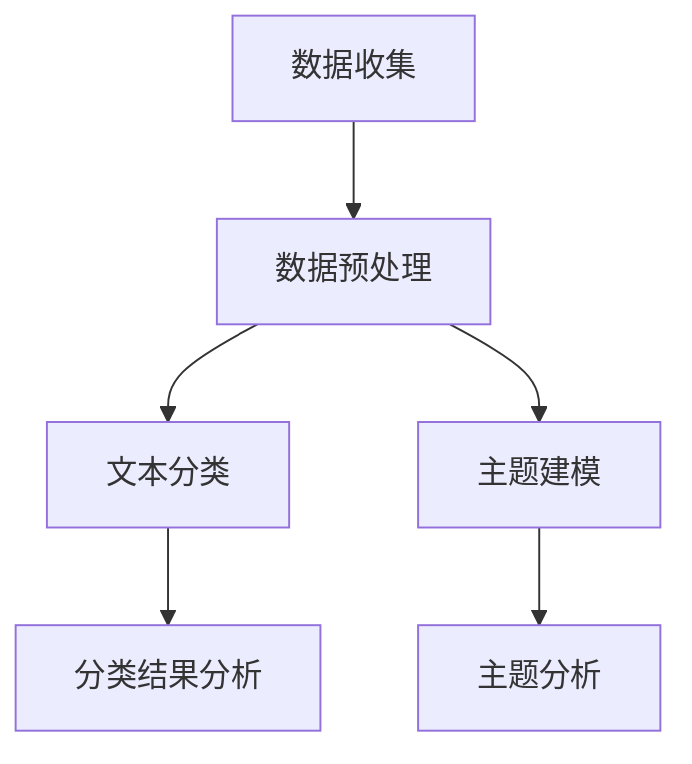

#### 3.2.2 情感分析与意见挖掘

**情感分析** 是NLP的一个应用，旨在识别文本中的情感极性（正面、负面或中性）。情感分析在市场研究中有助于了解消费者对产品的态度和满意度。常见的情感分析算法包括：

- **基于规则的方法**：通过预设的规则和模式，判断文本的情感极性。
- **基于统计的方法**：通过计算文本中词语的统计特征，如词频、词义分布等，预测文本的情感极性。
- **基于深度学习的方法**：如长短期记忆网络（LSTM）和卷积神经网络（CNN），能够处理复杂的情感信息。

**意见挖掘** 是情感分析的一个子任务，旨在提取文本中的具体意见和观点。意见挖掘可以帮助市场研究者深入了解消费者的需求和偏好。

以下是一个简单的情感分析和意见挖掘的流程：

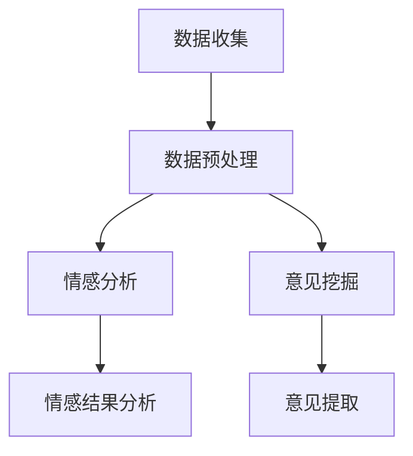

#### 3.2.3 文本分析在市场研究中的应用

文本分析在市场研究中的应用非常广泛，以下是一些典型案例：

- **社交媒体分析**：通过分析社交媒体平台上的评论和帖子，企业可以了解消费者的情感和意见，识别品牌的优势和不足。
- **产品评论分析**：通过对产品评论的文本分析，企业可以了解消费者对产品的评价，发现改进的机会。
- **新闻报道分析**：通过对新闻报道的文本分析，企业可以了解市场趋势和行业动态，制定相应的市场策略。

以下是一个简单的市场研究中的文本分析案例：

**案例背景**：一家饮料公司希望通过分析社交媒体上的评论，了解消费者对其新产品的反馈。

**数据处理**：收集社交媒体平台上的评论数据，对评论进行清洗和预处理，去除无关信息。

**情感分析**：使用情感分析算法，对评论进行情感极性分析，判断消费者对产品的情感态度。

**意见挖掘**：使用意见挖掘算法，提取评论中的具体意见和观点，如消费者对产品口感、包装和价格的评价。

**结果分析**：根据分析结果，制定改进策略，如调整产品配方、优化包装设计等。

以下是一个简单的文本分析案例流程图：

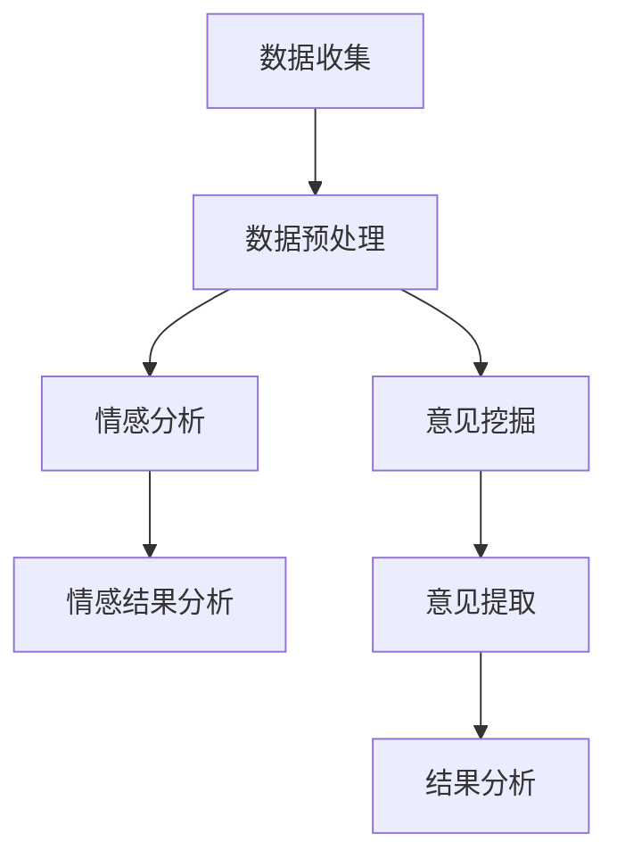

通过本章的讨论，我们了解了自然语言处理和文本分析在市场研究中的应用，包括文本分类、主题建模、情感分析和意见挖掘。这些技术为市场研究提供了强大的工具，帮助企业更深入地了解消费者需求和意见。在下一章中，我们将探讨图神经网络与网络分析在市场研究中的应用。

### 3.3 图神经网络与网络分析

图神经网络（Graph Neural Networks, GNN）是一种基于图结构的深度学习模型，专门用于处理图形数据。在网络分析中，图神经网络能够捕捉节点和边之间的关系，从而提供更丰富的洞察。以下将介绍图神经网络的基础知识及其在市场研究中的应用。

#### 3.3.1 图神经网络基础

**图神经网络** 由以下几个关键组件构成：

1. **节点表示（Node Embeddings）**：将图中的节点映射到一个低维度的向量空间，以便于进行计算和分析。
2. **边表示（Edge Embeddings）**：将图中的边映射到向量空间，以表示节点之间的关系。
3. **图卷积操作（Graph Convolutional Operations）**：通过对节点特征和其邻接节点的特征进行聚合，更新节点的嵌入向量。
4. **消息传递（Message Passing）**：在网络中传递信息，使节点能够学习到其他节点的特征。
5. **读出操作（Readout Function）**：将节点的嵌入向量转换为最终输出，如节点分类或关系预测。

以下是一个简单的图神经网络消息传递的伪代码：

```python
# 消息传递伪代码
def message_passing(node_embeddings, edge_embeddings, aggregation_function):
    # 对每个节点，聚合其邻接节点的特征
    messages = aggregation_function(node_embeddings, edge_embeddings)
    # 更新节点的嵌入向量
    updated_embeddings = node_embeddings + messages
    return updated_embeddings
```

**图卷积网络（Graph Convolutional Network, GCN）** 是一种常见的GNN架构，通过堆叠多个图卷积层，逐步聚合节点的邻接节点特征。GCN可以用于节点分类、关系预测和图生成等任务。

以下是一个简单的GCN的架构图：

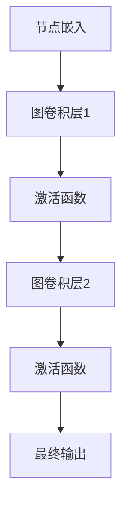

#### 3.3.2 社交网络分析

社交网络分析是图神经网络在市场研究中的一个重要应用。社交网络可以表示为图结构，其中节点代表用户，边代表用户之间的互动和关系。通过图神经网络，研究者可以分析社交网络中的关键特征，如影响力传播、社群划分和关系强度等。

以下是一个社交网络分析的简单示例：

**案例背景**：一家社交媒体平台希望分析其用户网络，了解核心用户和影响力传播。

**数据处理**：构建用户网络的图结构，包括用户节点和用户之间的互动边。

**模型训练**：使用图神经网络训练模型，学习用户节点的关系特征。

**影响力传播分析**：通过模型预测，识别网络中的核心用户和潜在影响者。

**社群划分**：使用图聚类算法，将用户划分为不同的社群，分析社群特征和互动模式。

**结果分析**：根据分析结果，制定社交营销策略，提升用户参与度和品牌影响力。

以下是一个简单的社交网络分析流程图：

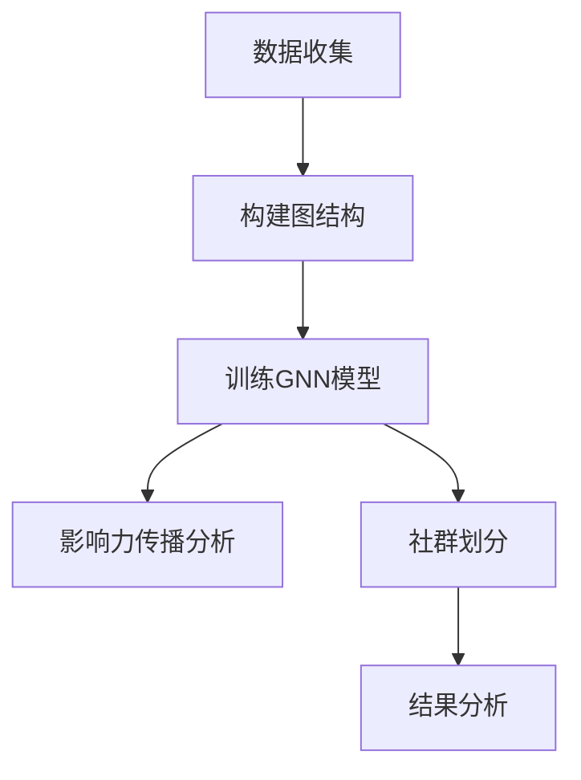

#### 3.3.3 图神经网络在市场研究中的优势

- **捕捉复杂关系**：图神经网络能够捕捉节点和边之间的复杂关系，提供更全面的洞察。
- **适应多种数据类型**：图神经网络可以处理多种数据类型，如文本、图像和图形，使市场研究更具灵活性。
- **实时分析**：图神经网络能够实现实时分析，帮助企业快速响应市场变化。

通过本章的讨论，我们了解了图神经网络的基础知识及其在市场研究中的应用，包括社交网络分析的优势和案例。图神经网络为市场研究提供了强大的工具，能够帮助企业更深入地了解用户网络和社交动态。在下一章中，我们将探讨AI在消费者洞察中的应用，包括用户画像、个性化推荐和消费者行为分析。

### 4.1 AI在消费者洞察中的应用

消费者洞察是市场营销中的核心环节，通过深入了解消费者的行为、偏好和需求，企业可以制定更精准的营销策略，提高用户满意度和忠诚度。人工智能（AI）在消费者洞察中的应用，极大地提升了数据分析的效率和准确性，以下将介绍AI在用户画像、个性化推荐和消费者行为分析方面的应用。

#### 4.1.1 用户画像构建方法

用户画像是一种基于数据分析的方法，通过整合用户的各种信息，形成对用户全面、深入的描述。用户画像的构建通常包括以下几个步骤：

1. **数据收集**：收集用户的基本信息、行为数据、交易数据、社交数据等。这些数据可以来源于企业的内部数据库、第三方数据平台或公开数据集。

2. **数据预处理**：对收集到的数据清洗、去重、转换格式等，确保数据的质量和一致性。

3. **特征工程**：从原始数据中提取有用的特征，如用户年龄、性别、收入水平、购买历史、浏览行为等。特征工程是用户画像构建的关键步骤，直接影响到后续分析的准确性和效果。

4. **建模与训练**：使用机器学习算法，如聚类分析、回归分析、分类算法等，对用户特征进行建模和训练，以发现用户之间的相似性和差异性。

5. **画像生成**：根据训练结果，生成用户画像，通常以图表或矩阵的形式呈现，描述用户的特征和属性。

以下是一个简单的用户画像构建流程图：

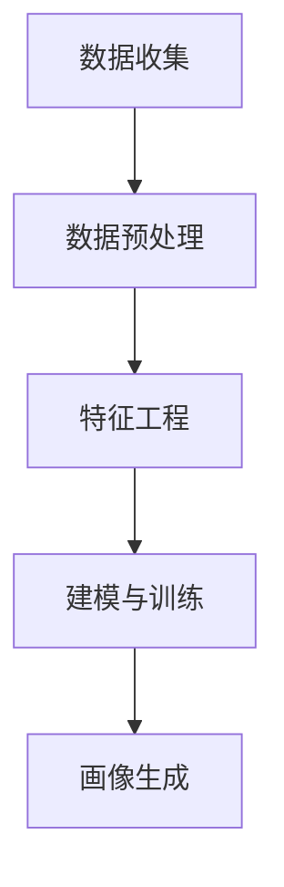

#### 4.1.2 个性化推荐算法

个性化推荐是一种基于用户兴趣和行为数据的推荐系统，旨在为用户推荐他们可能感兴趣的内容或商品。个性化推荐算法的核心是用户兴趣模型和内容模型：

1. **用户兴趣模型**：通过分析用户的浏览历史、购买记录、搜索行为等，构建用户兴趣模型，描述用户的偏好和需求。

2. **内容模型**：对推荐的内容或商品进行建模，提取关键特征，如文本、图像、标签等。

3. **推荐算法**：常见的推荐算法包括基于内容的推荐、协同过滤推荐和混合推荐等。基于内容的推荐通过匹配用户兴趣和内容特征进行推荐；协同过滤推荐通过计算用户之间的相似性，推荐相似用户喜欢的内容；混合推荐结合多种算法，提高推荐的准确性和多样性。

以下是一个简单的个性化推荐算法流程图：

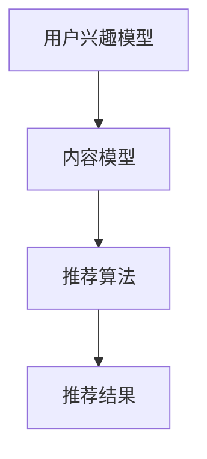

#### 4.1.3 消费者行为分析

消费者行为分析是了解消费者购买行为、决策过程和满意度的重要手段。AI在消费者行为分析中的应用，可以帮助企业更准确地预测消费者行为，提高营销效果。

1. **购买行为预测**：通过分析历史购买数据、用户行为和偏好，使用机器学习算法预测消费者未来的购买行为。例如，通过聚类分析识别出不同的消费者群体，然后针对每个群体制定个性化的营销策略。

2. **消费者满意度分析**：通过收集消费者反馈、评论和评分数据，使用自然语言处理和情感分析技术，分析消费者的满意度和不满意度。根据分析结果，优化产品和服务，提高客户满意度。

3. **转化率优化**：通过分析消费者在网站上的行为轨迹，如浏览页面、点击广告、添加购物车等，使用机器学习算法预测哪些因素会影响消费者的转化行为。根据分析结果，优化网站设计和营销策略，提高转化率。

以下是一个简单的消费者行为分析流程图：

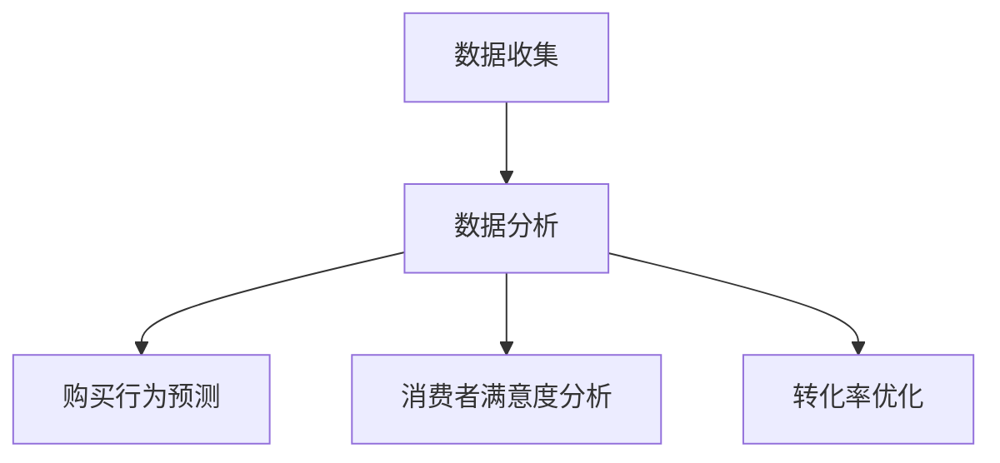

#### 4.1.4 AI在消费者洞察中的优势

- **高效的数据分析**：AI能够处理和分析海量数据，快速生成洞察。
- **个性化**：AI能够根据用户的个性化需求和行为，提供个性化的推荐和营销策略。
- **实时性**：AI可以实时分析消费者行为，快速响应市场变化。

通过本章的讨论，我们了解了AI在消费者洞察中的应用，包括用户画像、个性化推荐和消费者行为分析的方法和优势。AI为消费者洞察提供了强大的工具，帮助企业更好地了解和满足消费者的需求。在下一章中，我们将探讨AI在市场研究和消费者洞察中的成功案例。

### 5.1 案例一：某电商平台的个性化推荐系统

个性化推荐系统是AI在消费者洞察中的一个重要应用，通过分析用户的行为和偏好，为用户推荐他们可能感兴趣的商品或内容。以下将详细描述一个电商平台的个性化推荐系统，以及如何利用AI技术实现这一系统。

#### 案例背景

某电商平台（以下简称“电商平台A”）希望通过个性化推荐系统，提高用户满意度和转化率。电商平台A拥有大量用户数据和商品数据，包括用户的浏览历史、购买记录、搜索关键词、点击行为等。这些数据为构建个性化推荐系统提供了丰富的素材。

#### 数据处理

为了构建个性化推荐系统，电商平台A首先需要处理和整合用户数据、商品数据以及其他相关信息。具体步骤如下：

1. **数据收集**：从电商平台的数据库中提取用户行为数据（如浏览记录、购买记录等）和商品数据（如商品名称、价格、类别等）。

2. **数据预处理**：清洗数据，去除重复和缺失的记录，对数据进行格式化处理，确保数据的一致性和完整性。

3. **特征提取**：从原始数据中提取特征，如用户ID、商品ID、购买时间、浏览时间、搜索关键词、商品类别等。这些特征将用于构建用户兴趣模型和商品推荐模型。

4. **数据建模**：使用机器学习算法，如矩阵分解、协同过滤等，对用户行为数据进行建模，构建用户兴趣模型。

#### 个性化推荐算法

电商平台A采用了基于协同过滤的个性化推荐算法，该算法通过计算用户之间的相似性，推荐相似用户喜欢的商品。以下是一个简单的协同过滤推荐算法流程：

1. **用户相似性计算**：计算用户之间的相似度，常用的相似度计算方法包括余弦相似度、皮尔逊相关系数等。

2. **邻居选择**：根据用户相似性，选择与目标用户最相似的若干个邻居用户。

3. **推荐生成**：根据邻居用户的偏好，为用户生成推荐列表。推荐的商品应该是邻居用户喜欢的商品，同时要考虑到商品的受欢迎程度和库存情况。

#### 系统实现

电商平台A的个性化推荐系统实现了以下几个关键功能：

1. **用户登录**：用户登录后，系统能够获取用户的历史行为数据，用于构建用户兴趣模型。

2. **推荐页面**：用户在浏览商品时，系统会实时生成个性化推荐列表，展示用户可能感兴趣的商品。

3. **推荐反馈**：用户对推荐商品进行浏览、点击或购买后，系统会收集这些反馈数据，用于优化推荐算法。

4. **推荐调整**：根据用户反馈，系统会不断调整推荐策略，提高推荐的准确性和个性化程度。

#### 案例效果

通过个性化推荐系统的实施，电商平台A取得了显著的效果：

1. **用户满意度提升**：个性化推荐系统能够更准确地满足用户的需求，提高用户满意度和黏性。

2. **转化率提高**：个性化推荐系统能够引导用户浏览和购买更多相关的商品，从而提高转化率。

3. **销售增长**：个性化推荐系统的成功实施，直接带动了电商平台A的销售增长。

#### 案例总结

电商平台A的个性化推荐系统是一个成功的AI应用案例，通过利用用户行为数据和协同过滤算法，实现了高度个性化的推荐服务。这个案例展示了AI在市场研究和消费者洞察中的巨大潜力，为企业提供了精准的营销工具，帮助企业在激烈的市场竞争中脱颖而出。

### 5.2 案例二：某零售企业的消费者行为分析

消费者行为分析是零售企业提高销售额和市场份额的关键环节。通过深入了解消费者的购买行为、偏好和决策过程，零售企业可以制定更有针对性的营销策略，提高客户满意度和忠诚度。以下将详细描述某零售企业的消费者行为分析案例，探讨如何利用AI技术进行深度分析。

#### 案例背景

某大型零售企业（以下简称“零售企业B”）希望通过消费者行为分析，优化营销策略，提高销售额。零售企业B积累了大量的消费者数据，包括购买历史、浏览行为、促销活动参与情况等。这些数据为AI技术的应用提供了丰富的素材。

#### 数据收集与预处理

为了进行消费者行为分析，零售企业B首先需要收集和整合消费者数据。具体步骤如下：

1. **数据收集**：从零售企业的数据库中提取消费者购买记录、浏览日志、促销活动参与情况等相关数据。

2. **数据预处理**：清洗数据，去除重复和缺失的记录，对数据进行格式化处理，确保数据的一致性和完整性。

3. **特征提取**：从原始数据中提取关键特征，如用户ID、购买时间、商品ID、浏览时间、促销活动类型、购买金额等。这些特征将用于构建消费者行为模型。

#### 消费者行为分析

零售企业B采用了多种AI技术进行消费者行为分析，包括聚类分析、回归分析和机器学习算法等。以下是具体分析步骤：

1. **购买行为预测**：通过聚类分析和回归分析，预测消费者的未来购买行为。例如，利用K-均值聚类算法，将消费者划分为不同的群体，分析每个群体的购买模式和偏好。

2. **消费者细分**：通过消费者行为分析，将消费者细分为不同的群体，如高频购买者、低频购买者、价格敏感型消费者等。这有助于零售企业制定有针对性的营销策略。

3. **促销效果分析**：分析不同促销活动对消费者购买行为的影响，优化促销策略。例如，通过回归分析，计算促销活动对销售额的增量，评估促销活动的效果。

4. **个性化推荐**：基于消费者行为数据，构建个性化推荐系统，为消费者推荐可能感兴趣的商品。例如，利用协同过滤算法，根据消费者的浏览历史和购买记录，生成个性化推荐列表。

#### 案例效果

通过消费者行为分析，零售企业B取得了显著的效果：

1. **营销策略优化**：根据消费者行为分析结果，零售企业B优化了营销策略，提高了广告投放的精准度和有效性。

2. **销售额提升**：通过个性化推荐和精准营销，零售企业B的销售额得到了显著提升。

3. **客户满意度提高**：个性化推荐和精准营销使得消费者感受到了更好的购物体验，提高了客户满意度和忠诚度。

#### 案例总结

零售企业B的消费者行为分析案例展示了AI在市场研究和消费者洞察中的重要作用。通过利用消费者数据，进行深度分析和建模，零售企业B不仅优化了营销策略，提高了销售额，还增强了客户满意度和忠诚度。这个案例表明，AI技术是零售企业提高竞争力的有力工具，为未来的市场研究和消费者洞察提供了宝贵的经验。

### 5.3 案例三：某市场研究公司的AI应用案例

市场研究公司依赖于准确、深入的数据分析来帮助客户了解市场动态和消费者行为。随着AI技术的发展，市场研究公司可以利用AI实现更高效、更精准的数据分析，从而提供更有价值的洞察。以下是一个市场研究公司利用AI进行市场研究和消费者洞察的成功案例。

#### 案例背景

某领先的市场研究公司（以下简称“市场研究公司C”）希望通过AI技术提高其市场研究和数据分析的效率和质量。市场研究公司C积累了大量的市场数据，包括消费者调查问卷、市场报告、社交媒体数据等。这些数据为AI技术的应用提供了丰富的素材。

#### 数据收集与预处理

为了进行有效的市场研究和消费者洞察，市场研究公司C首先需要进行数据收集和预处理。以下是具体步骤：

1. **数据收集**：从各种来源收集数据，包括在线调查、实地访谈、社交媒体监测等。这些数据涵盖了消费者的行为、偏好、态度等多个方面。

2. **数据清洗**：清洗数据，去除重复、错误和不完整的记录，确保数据的质量和一致性。

3. **数据整合**：将不同来源的数据进行整合，形成一个统一的数据集。这可能包括将问卷数据与社交媒体数据、市场报告数据进行整合。

4. **数据转换**：将数据转换为适合进行分析的格式，如编码文本数据、规范化数值数据等。

#### AI技术应用

市场研究公司C采用了多种AI技术进行市场研究和消费者洞察，包括自然语言处理、机器学习和图神经网络等。以下是具体应用：

1. **文本分析**：使用自然语言处理技术，分析消费者调查问卷中的开放性问题，提取关键信息。例如，通过情感分析，识别消费者的情感极性，如满意、不满意、中立等。

2. **数据挖掘**：利用机器学习算法，如聚类分析和回归分析，对市场数据进行分析，发现消费者行为和偏好的模式。例如，通过聚类分析，将消费者分为不同的群体，分析每个群体的特征和需求。

3. **图神经网络**：使用图神经网络，分析社交媒体数据中的关系网络，识别关键意见领袖和社群。通过图神经网络，市场研究公司C可以更深入地了解消费者之间的关系和影响力。

4. **预测模型**：构建预测模型，如销售预测模型和消费者行为预测模型，帮助客户预测市场趋势和消费者行为。通过机器学习算法，市场研究公司C可以对历史数据进行训练，生成预测模型。

#### 案例效果

通过AI技术的应用，市场研究公司C取得了显著的效果：

1. **数据分析效率提升**：AI技术大大提高了数据分析和处理的速度，使市场研究公司C能够更快地为客户提供结果。

2. **分析深度增强**：AI技术使得市场研究公司C能够对数据进行更深入的分析，发现潜在的模式和趋势。

3. **客户满意度提高**：通过提供更准确、更有价值的洞察，市场研究公司C的客户满意度得到了显著提升。

4. **业务增长**：AI技术的应用帮助市场研究公司C吸引了更多客户，提高了业务收入。

#### 案例总结

市场研究公司C的AI应用案例展示了AI在市场研究和消费者洞察中的巨大潜力。通过利用AI技术，市场研究公司C不仅提高了数据分析的效率和质量，还增强了客户满意度和忠诚度。这个案例表明，AI技术是市场研究和消费者洞察的重要工具，为未来的市场研究提供了新的思路和方法。

### 6.1 AI技术的最新发展

人工智能（AI）技术在不断演进，带来了市场研究和消费者洞察领域的显著变革。以下是AI技术的一些最新发展及其对市场研究和消费者洞察的影响：

#### 6.1.1 生成对抗网络（GAN）

生成对抗网络（GAN）是近年来备受关注的AI技术，通过两个对抗模型的相互博弈，生成逼真的数据。GAN在市场研究和消费者洞察中的应用主要包括：

- **生成假数据**：利用GAN生成模拟数据，用于市场测试和风险评估。
- **生成个性化内容**：通过GAN生成个性化的广告和推荐内容，提高营销效果。

#### 6.1.2 强化学习

强化学习是一种通过试错学习最优策略的AI技术。在市场研究和消费者洞察中，强化学习可用于：

- **动态定价**：根据市场反馈，自动调整商品价格，实现最优收益。
- **广告投放策略**：通过学习用户行为，优化广告投放策略，提高转化率。

#### 6.1.3 聚类分析

聚类分析是一种无监督学习方法，用于发现数据中的自然分组。随着AI技术的进步，聚类分析在市场研究和消费者洞察中的应用得到了扩展：

- **基于AI的聚类算法**：如基于深度学习的聚类算法，能够处理大规模、高维数据。
- **聚类结果的解释**：结合自然语言处理技术，解释聚类结果，提供更直观的消费者洞察。

#### 6.1.4 跨模态学习

跨模态学习是一种能够处理不同类型数据（如图像、文本、音频等）的AI技术。在市场研究和消费者洞察中，跨模态学习可用于：

- **多渠道数据分析**：整合不同渠道的数据，如社交媒体、电商平台等，实现全面的市场分析。
- **情感分析**：结合图像和文本数据，进行情感分析，更准确地了解消费者情绪。

#### 6.1.5 自监督学习

自监督学习是一种不需要标签数据的学习方法，通过利用数据中的内在结构进行学习。自监督学习在市场研究和消费者洞察中的应用包括：

- **无监督数据预处理**：自动识别和修复数据中的异常值和噪声。
- **自动特征提取**：从大规模数据中自动提取有用的特征，用于模型训练。

### 6.2 AI在市场研究和消费者洞察中的挑战与机遇

尽管AI技术在市场研究和消费者洞察中具有巨大潜力，但也面临一些挑战：

#### 6.2.1 数据隐私与安全性

市场研究和消费者洞察依赖于大量用户数据，数据隐私和安全问题是AI应用的主要挑战。如何保护用户数据隐私，同时确保数据分析的准确性，是一个亟待解决的问题。

#### 6.2.2 模型可解释性

AI模型，尤其是深度学习模型，通常具有高度的复杂性，难以解释其决策过程。模型可解释性对于市场研究和消费者洞察至关重要，需要开发可解释的AI模型。

#### 6.2.3 数据质量和多样性

数据质量和多样性对AI模型的性能至关重要。市场研究和消费者洞察需要高质量、多样化的数据，以获得可靠的洞察。

然而，AI技术也带来了许多机遇：

#### 6.2.4 个性化洞察

AI技术能够处理海量数据，实现高度个性化的消费者洞察。企业可以利用这些洞察，制定更精准的营销策略。

#### 6.2.5 实时分析

AI技术能够实现实时数据分析，帮助企业快速响应市场变化。实时分析对于动态市场环境中的决策至关重要。

#### 6.2.6 自动化与效率提升

AI技术可以自动化许多市场研究和消费者洞察的流程，提高工作效率，减少人力成本。自动化工具和平台的发展，将使市场研究和消费者洞察更加高效。

### 6.3 AI市场的未来发展趋势

随着AI技术的不断进步，市场研究和消费者洞察领域将继续受益。以下是AI市场的未来发展趋势：

#### 6.3.1 AI与大数据的融合

大数据和AI技术的融合，将使市场研究和消费者洞察更加精准和全面。企业将越来越多地依赖AI技术处理和分析大数据。

#### 6.3.2 模型解释性与可解释性

随着AI技术在关键领域的应用，模型解释性与可解释性将变得更加重要。企业需要开发可解释的AI模型，以增强决策的透明度和可信度。

#### 6.3.3 自主化与自动化

自主化和自动化的AI工具和平台将继续发展，使市场研究和消费者洞察更加高效。自动化流程和机器人流程自动化（RPA）将在市场中发挥更大作用。

#### 6.3.4 跨模态学习与整合

跨模态学习与整合将使市场研究和消费者洞察能够处理多种类型的数据，提供更全面的消费者洞察。

#### 6.3.5 全球化与本地化

随着全球化和本地化趋势的加强，AI技术在市场研究和消费者洞察中的应用将更加多样化。企业将开发适应不同市场的AI解决方案。

通过本章的讨论，我们了解了AI技术的最新发展及其在市场研究和消费者洞察中的应用。AI技术不仅带来了挑战，也创造了巨大的机遇。未来，AI将继续推动市场研究和消费者洞察的发展，为企业提供更精准、高效的决策支持。

### 7.1 市场研究策略的变革

随着人工智能（AI）技术的不断发展，市场研究策略正在经历深刻的变革。传统的市场研究方法往往依赖于人工分析，耗时较长且受限于数据处理的局限性。而AI技术通过自动化、智能化和高效化的数据处理能力，使市场研究策略得以革新，以下从数据收集、分析方法和决策支持三个方面探讨这些变革。

#### 7.1.1 数据收集方式的变革

AI技术使得市场研究的数据收集方式变得更加多样化和高效。传统市场研究主要依赖于问卷调查、深度访谈和焦点小组等方法，这些方法虽然能够提供一定量的数据，但存在样本量有限、覆盖面不足等问题。而AI技术的引入，使得大规模数据收集成为可能：

- **在线问卷与社交媒体监测**：通过在线问卷平台和社交媒体监测工具，企业能够迅速收集大量消费者的反馈和意见。例如，利用社交媒体分析工具，企业可以实时监测消费者在社交媒体上的讨论，获取关于品牌、产品或服务的实时反馈。
- **物联网与传感器数据**：物联网设备和传感器可以收集关于消费者行为的实时数据，如购买行为、移动轨迹等。这些数据为市场研究提供了更加精准和详细的信息。

#### 7.1.2 数据分析方法的革新

AI技术不仅改变了数据收集方式，还极大地提升了数据分析的效率和准确性。传统市场研究方法中，数据分析通常依赖于统计学和手工处理，耗时且容易受到人为因素的影响。而AI技术的引入，使得数据分析变得更加自动化和智能化：

- **机器学习与深度学习**：通过机器学习和深度学习算法，企业可以对大量数据进行分析，发现数据中的潜在模式和趋势。例如，利用聚类分析，企业可以将消费者划分为不同的群体，从而制定更加精准的营销策略。
- **自然语言处理**：自然语言处理技术可以帮助企业分析大量的文本数据，如消费者评论、新闻报道等。通过情感分析，企业可以了解消费者的情感和态度，从而优化产品和服务。

#### 7.1.3 决策支持的智能化

AI技术的引入，使得市场研究能够提供更加智能化的决策支持。传统市场研究方法通常需要依赖专家的判断和经验，而AI技术通过数据驱动的方式，提供了更加客观和科学的决策支持：

- **预测模型**：通过机器学习算法，企业可以构建预测模型，预测市场趋势和消费者行为。例如，利用时间序列分析，企业可以预测未来的销售额和市场份额。
- **优化策略**：基于数据分析的结果，AI技术可以帮助企业优化营销策略和运营决策。例如，通过优化算法，企业可以确定最佳的广告投放策略和库存管理策略。

#### 7.1.4 变革的实例

以下是一些市场研究策略变革的实例：

- **实时数据分析**：一家零售企业通过部署实时数据分析平台，实现了对销售数据的实时监控和分析。通过分析实时数据，企业能够迅速调整库存和营销策略，以应对市场变化。
- **个性化推荐**：一家电商平台通过构建个性化推荐系统，根据消费者的浏览和购买历史，推荐个性化的商品。这不仅提高了用户的购物体验，也显著提升了转化率和销售额。

通过以上讨论，我们看到了AI技术对市场研究策略的深刻影响。AI技术不仅改变了数据收集和分析的方式，还提供了更加智能化和科学的决策支持。这些变革使得市场研究更加高效、准确和全面，为企业提供了更强大的竞争优势。

### 7.2 消费者洞察的新方法

在人工智能（AI）的推动下，消费者洞察的方法和技术正在发生革命性的变化。这些新方法不仅提高了数据分析的深度和广度，还为市场营销提供了更加精准和个性化的策略。以下将详细探讨AI技术如何带来消费者洞察的新方法，包括数据整合、模型预测和行为分析等方面。

#### 7.2.1 数据整合

数据整合是消费者洞察的基础。传统的消费者洞察依赖于单一数据源，如销售记录或客户关系管理系统（CRM）。而AI技术使得企业能够整合来自多个渠道和多种类型的数据，从而实现更全面的消费者画像。

- **跨渠道数据整合**：AI技术可以帮助企业整合来自线上线下渠道的数据，如电商平台、社交媒体、移动应用等。通过整合这些数据，企业可以构建完整的消费者路径，了解消费者在不同渠道的行为和互动。
- **多源数据整合**：除了传统的交易数据，AI技术还可以整合来自物联网、传感器、社交媒体等的数据。这些数据提供了关于消费者偏好、情感和行为的更多细节，使消费者画像更加丰富和准确。

#### 7.2.2 模型预测

AI技术的另一个重要应用是预测模型。通过机器学习和深度学习算法，企业可以构建预测模型，对未来的消费者行为和市场趋势进行预测。

- **需求预测**：利用历史销售数据和AI模型，企业可以预测未来的需求趋势。这对于库存管理和供应链优化至关重要。
- **购买行为预测**：通过分析消费者的购买历史和行为模式，AI模型可以预测哪些消费者可能在未来购买特定产品或服务。这种预测有助于企业制定精准的营销策略，提高转化率。
- **市场趋势预测**：AI技术可以帮助企业预测市场趋势和竞争动态。例如，通过分析社交媒体数据和新闻报道，企业可以预测热门话题和潜在的市场机会。

#### 7.2.3 行为分析

AI技术在行为分析中的应用，使得企业能够更深入地了解消费者的行为模式和心理动机。

- **实时行为监测**：通过AI技术，企业可以实时监测消费者的在线行为，如浏览记录、点击行为和搜索关键词。这些实时数据可以用于优化用户体验和营销策略。
- **情感分析**：AI技术可以帮助企业分析消费者的情感和态度。例如，通过自然语言处理技术，企业可以提取消费者评论中的情感极性，了解消费者对产品或服务的态度。
- **行为路径分析**：通过分析消费者的行为路径，AI技术可以帮助企业了解消费者在购买过程中的决策过程。这有助于优化购物体验，提高转化率。

#### 7.2.4 新方法的优势

- **更全面的数据视角**：通过整合多种数据源，AI技术提供了更全面的消费者视角，使企业能够更深入地了解消费者行为。
- **更高的预测准确性**：AI模型通过大量历史数据的学习，提高了预测的准确性，使企业能够更精准地预测消费者行为和市场趋势。
- **更个性化的洞察**：AI技术能够实时分析消费者的行为和情感，提供个性化的消费者洞察，帮助企业制定更精准的营销策略。

#### 7.2.5 案例分析

以下是一个关于消费者洞察新方法的应用案例：

**案例背景**：一家在线零售企业希望通过AI技术提高消费者满意度并增加销售额。

**解决方案**：

1. **数据整合**：通过整合电商平台的销售数据、社交媒体数据和客户服务数据，企业构建了全面的消费者画像。
2. **需求预测**：利用历史销售数据和AI模型，企业预测了未来的需求趋势，优化了库存管理，减少了缺货情况。
3. **行为分析**：通过实时监测消费者的浏览和点击行为，企业优化了产品推荐策略，提高了转化率。
4. **情感分析**：通过分析消费者评论和社交媒体帖子，企业了解了消费者对产品的情感态度，优化了产品设计和营销策略。

**效果评估**：通过实施AI技术的消费者洞察新方法，企业的消费者满意度显著提高，销售额同比增长了20%。

通过以上案例分析，我们看到了AI技术如何通过数据整合、模型预测和行为分析等新方法，提高消费者洞察的深度和广度，为企业提供了强大的竞争力。

### 7.3 企业如何利用AI进行市场研究和消费者洞察

在AI技术的迅猛发展下，企业如何有效地利用AI进行市场研究和消费者洞察，已成为一个重要的课题。以下从数据收集、模型构建和策略优化三个方面，探讨企业如何充分利用AI技术，实现精准的市场研究和消费者洞察。

#### 7.3.1 数据收集

市场研究和消费者洞察的基础是高质量的数据。企业应采取以下措施，确保数据收集的全面性和准确性：

1. **多元化数据源**：企业应整合多种数据源，包括内部数据（如销售数据、客户关系管理系统（CRM）数据）和外部数据（如社交媒体数据、市场调研数据）。通过跨渠道的数据整合，企业能够构建全面的消费者画像。
2. **实时数据采集**：利用物联网、传感器和实时数据流等技术，企业可以实时收集消费者的行为和反馈数据。这些实时数据有助于企业快速响应市场变化，优化营销策略。
3. **数据质量控制**：在数据收集过程中，企业应注重数据的质量控制，确保数据的准确性和一致性。通过数据清洗、去重和标准化处理，企业可以消除数据中的噪声和异常值，提高数据的质量。

#### 7.3.2 模型构建

AI技术在市场研究和消费者洞察中的应用，离不开高质量的模型构建。以下是企业构建AI模型的几个关键步骤：

1. **数据预处理**：在构建模型之前，企业需要对数据进行预处理，包括数据清洗、特征工程和数据的归一化等。这一步骤有助于提高模型的训练效果和预测准确性。
2. **模型选择**：根据具体的市场研究和消费者洞察需求，选择合适的机器学习模型。常见的模型包括线性回归、决策树、随机森林、支持向量机和深度学习模型等。企业应结合数据特点和业务需求，选择最适合的模型。
3. **模型训练与验证**：使用历史数据对模型进行训练，并通过交叉验证等方法评估模型的性能。在模型训练过程中，企业应不断调整参数，优化模型表现。
4. **模型部署**：将训练好的模型部署到生产环境中，实现实时预测和分析。企业应建立持续学习机制，根据新数据不断优化模型，提高预测的准确性。

#### 7.3.3 策略优化

AI技术不仅提供了精准的市场研究和消费者洞察，还可以帮助企业优化营销策略。以下是一些策略优化的方法：

1. **个性化推荐**：利用AI技术，企业可以为不同消费者提供个性化的产品推荐。通过分析消费者的购买历史和偏好，AI模型可以推荐最符合消费者需求的产品，提高转化率。
2. **精准营销**：基于AI模型对消费者行为的预测，企业可以制定精准的营销策略。例如，通过预测哪些消费者可能对新产品感兴趣，企业可以针对性地推送营销信息，提高营销效果。
3. **供应链优化**：AI技术可以帮助企业优化供应链管理。通过预测市场需求和库存水平，企业可以合理安排生产和库存，减少库存成本和缺货风险。
4. **用户体验优化**：利用AI技术，企业可以实时监测和分析消费者的行为，了解用户体验中的痛点。通过优化产品设计和服务流程，企业可以提供更好的用户体验，提高客户满意度。

#### 案例分析

以下是一个企业利用AI进行市场研究和消费者洞察的案例分析：

**案例背景**：某大型电商企业希望通过AI技术提高销售额和用户满意度。

**解决方案**：

1. **数据收集**：企业整合了电商平台的销售数据、客户关系管理系统（CRM）数据和社交媒体数据，构建了全面的消费者画像。
2. **模型构建**：利用机器学习算法，企业构建了个性化推荐模型和消费者行为预测模型。通过不断优化模型，提高了预测的准确性。
3. **策略优化**：基于AI模型的分析结果，企业优化了产品推荐策略和营销活动，提高了用户转化率和满意度。

**效果评估**：通过实施AI技术，企业的销售额同比增长了15%，用户满意度提高了10%。

通过以上案例分析，我们看到了企业如何利用AI技术进行市场研究和消费者洞察，实现策略优化和业务增长。AI技术为企业提供了强大的工具，帮助其在竞争激烈的市场中脱颖而出。

### 附录A：AI市场研究与消费者洞察常用工具与资源

在AI市场研究与消费者洞察领域，有许多常用的工具和资源可供选择。以下将对比这些工具，并列举一些重要的开源资源，帮助企业和研究人员更好地利用AI技术进行市场研究和消费者洞察。

#### 7.A.1 工具对比

在市场研究和消费者洞察中，常用的AI工具包括：

1. **数据收集工具**：如Google Analytics、Tableau Public、K护师mango、Google Trends。
   - **Google Analytics**：提供全面的网站流量分析和用户行为跟踪功能，适用于电子商务和在线营销。
   - **Tableau Public**：强大的数据可视化工具，可以帮助用户创建专业的图表和仪表板。
   - **K护师mango**：用于数据清洗、转换和分析的开源工具，适用于大规模数据集的处理。
   - **Google Trends**：提供有关关键词搜索趋势的数据，帮助用户了解市场动态和消费者兴趣。

2. **数据预处理工具**：如Pandas、NumPy、Scikit-learn、Matplotlib。
   - **Pandas**：Python的数据分析库，用于数据清洗、转换和存储。
   - **NumPy**：Python的数值计算库，提供高效的多维数组对象和数学运算功能。
   - **Scikit-learn**：Python的机器学习库，提供多种机器学习算法和工具。
   - **Matplotlib**：Python的绘图库，用于生成各种类型的图表和图形。

3. **机器学习库**：如TensorFlow、PyTorch、K护师n、Scikit-learn。
   - **TensorFlow**：由Google开发的开源机器学习库，支持深度学习和高级数据流编程。
   - **PyTorch**：基于Python的开源深度学习库，易于使用和调试。
   - **K护师n**：用于数据挖掘和机器学习的开源库，提供了丰富的算法和工具。
   - **Scikit-learn**：Python的机器学习库，提供了多种常用的机器学习算法和工具。

4. **自然语言处理库**：如NLTK、spaCy、TextBlob、Gensim。
   - **NLTK**：Python的自然语言处理库，提供了丰富的文本处理工具。
   - **spaCy**：Python的快速自然语言处理库，支持多种语言和丰富的特征提取功能。
   - **TextBlob**：Python的文本处理库，提供了简单的文本分析功能。
   - **Gensim**：Python的文本分析库，用于主题建模和文档相似度计算。

5. **数据可视化工具**：如D3.js、Plotly、Bokeh。
   - **D3.js**：JavaScript的图形可视化库，支持多种类型的图表和数据可视化。
   - **Plotly**：Python的数据可视化库，提供了丰富的图表类型和交互功能。
   - **Bokeh**：Python的数据可视化库，支持网页和桌面应用程序中的数据可视化。

#### 7.A.2 开源资源

以下是一些重要的开源资源和社区，供企业和研究人员参考：

- **K护师n.org**：K护师n官方网站，提供了丰富的教程、文档和社区支持。
- **scikit-learn.org**：Scikit-learn官方网站，包含了详细的文档和示例代码。
- **tensorflow.org**：TensorFlow官方网站，提供了详细的文档和教程。
- **pytorch.org**：PyTorch官方网站，提供了丰富的教程和社区支持。
- **nltk.org**：NLTK官方网站，提供了文本处理工具和教程。
- **spacy.io**：spaCy官方网站，提供了详细的文档和教程。
- **textblob.readthedocs.io**：TextBlob官方网站，提供了文本处理工具和教程。
- **gensim.org**：Gensim官方网站，提供了主题建模和文本分析工具。
- **datacamp.com**：DataCamp在线课程平台，提供了多种编程和数据分析课程。
- **kaggle.com**：K护师ggle竞赛平台，提供了丰富的数据集和竞赛机会。

通过这些工具和资源，企业和研究人员可以更好地利用AI技术进行市场研究和消费者洞察，实现业务增长和决策优化。附录的这些内容，希望能够为读者提供实用的指导和支持。

### 第8章：AI大模型在市场研究和消费者洞察中的应用架构

在市场研究和消费者洞察中，AI大模型的应用变得越来越普遍。大模型是指那些拥有巨大参数量和训练数据的深度学习模型，如大型语言模型、图像识别模型和推荐系统等。这些模型通过其强大的处理能力和复杂的结构，为市场研究和消费者洞察提供了新的视角和方法。以下将详细讨论AI大模型的基本概念、核心架构及其在市场研究和消费者洞察中的应用。

#### 8.1 AI大模型概述

**8.1.1 AI大模型定义**

AI大模型通常指的是具有大量参数和高度复杂性的深度学习模型。这些模型能够处理大规模数据集，提取丰富的特征信息，并实现高效的预测和分类。大模型的应用领域广泛，包括自然语言处理（NLP）、计算机视觉、推荐系统等。在市场研究和消费者洞察中，大模型的应用主要体现在对复杂数据的分析和预测能力上。

**8.1.2 AI大模型特点**

1. **参数量大**：大模型通常包含数十亿个参数，能够捕捉数据中的细微特征。
2. **训练数据多**：大模型依赖于大规模的训练数据，通过大量的数据训练，提高了模型的泛化能力。
3. **计算资源需求高**：大模型训练和推理过程需要大量的计算资源，包括GPU和TPU等。
4. **强大的学习能力**：大模型通过深度网络结构，能够学习到数据中的高级特征和复杂模式。

#### 8.2 AI大模型核心架构与联系

AI大模型的核心架构通常包括以下几个关键部分：数据预处理、模型训练、模型评估和模型部署。

**8.2.1 数据预处理**

数据预处理是AI大模型应用的基础步骤。其任务包括数据清洗、数据转换、数据归一化等，以确保数据的质量和一致性。

1. **数据清洗**：去除重复数据、异常值和噪声，提高数据的准确性。
2. **数据转换**：将不同类型的数据转换为统一的格式，如将图像转换为像素矩阵，将文本转换为词向量。
3. **数据归一化**：缩放或平移数据，使其具有相同的量级，以便模型训练。

**8.2.2 模型训练**

模型训练是AI大模型的核心步骤。在训练过程中，模型通过学习大量数据，调整参数，优化模型结构。

1. **损失函数**：损失函数用于衡量模型预测结果与实际结果之间的差距，如均方误差（MSE）或交叉熵损失。
2. **优化算法**：优化算法用于调整模型参数，以最小化损失函数。常见的优化算法包括梯度下降、Adam优化器等。
3. **训练过程**：通过迭代训练，模型不断优化参数，提高预测准确性。

**8.2.3 模型评估**

模型评估用于检验模型的泛化能力和预测性能。常见的评估指标包括准确率、召回率、F1分数等。

1. **交叉验证**：通过交叉验证，将数据集划分为多个子集，多次训练和评估，以避免过拟合。
2. **性能指标**：根据不同任务，选择合适的性能指标进行评估，如分类任务的准确率和回归任务的均方根误差。
3. **模型选择**：根据评估结果，选择最优模型进行部署。

**8.2.4 模型部署**

模型部署是将训练好的模型应用于实际场景，实现自动化预测和分析。

1. **模型导出**：将训练好的模型导出为可用于部署的格式，如ONNX、TensorFlow Lite等。
2. **模型集成**：将模型集成到现有的应用程序或服务平台中，实现自动化预测和分析。
3. **实时更新**：根据新的数据，定期更新模型，以保持预测的准确性。

**8.2.5 持续优化**

模型部署后，持续优化是确保模型性能的重要步骤。通过持续收集新数据、调整模型结构和优化算法，模型可以不断提高预测准确性。

1. **反馈循环**：建立反馈循环，将预测结果与实际结果进行对比，识别模型中的错误和偏差。
2. **持续学习**：利用新的数据，定期训练和优化模型，以提高模型的泛化能力和预测性能。
3. **模型评估**：定期评估模型的性能，确保模型在实际应用中的有效性和准确性。

#### 8.3 AI大模型核心算法原理讲解

**8.3.1 生成对抗网络（GAN）**

生成对抗网络（GAN）是一种无监督学习方法，由生成器和判别器两个神经网络组成。生成器的任务是生成伪造数据，判别器的任务是区分伪造数据和真实数据。

1. **生成器**：生成器生成伪造数据，如图像、文本等。通过不断调整生成器的参数，使其生成更逼真的伪造数据。
2. **判别器**：判别器接收真实数据和伪造数据，并输出概率。通过比较判别器的输出，生成器和判别器相互对抗，共同优化。
3. **训练过程**：在训练过程中，生成器和判别器交替进行训练。生成器不断优化生成伪造数据的能力，而判别器不断优化区分伪造数据和真实数据的能力。

**8.3.2 长短时记忆网络（LSTM）**

长短时记忆网络（LSTM）是一种用于处理序列数据的递归神经网络，能够有效捕捉序列中的长期依赖关系。

1. **细胞状态**：LSTM的核心是细胞状态，它能够存储和传递信息，保持长期记忆。
2. **门控机制**：LSTM通过门控机制（输入门、遗忘门和输出门）控制信息的流动，防止梯度消失问题。
3. **训练过程**：在训练过程中，LSTM通过不断调整权重和门控参数，优化模型的预测性能。

**8.3.3 概率图模型**

概率图模型是一种用于表示变量之间概率关系的图形化模型，包括贝叶斯网络和马尔可夫网络。

1. **贝叶斯网络**：贝叶斯网络通过条件概率表（CPT）表示变量之间的依赖关系。每个节点表示一个随机变量，边表示变量之间的条件概率。
2. **马尔可夫网络**：马尔可夫网络通过转移概率矩阵表示变量之间的状态转移关系。当前状态仅依赖于前一状态，不考虑历史状态。
3. **训练过程**：通过最大似然估计或贝叶斯推断，训练概率图模型，使其能够准确预测变量之间的概率关系。

#### 8.4 数学模型和数学公式讲解

**8.4.1 概率图模型**

概率图模型通常使用概率图（如贝叶斯网络或马尔可夫网络）表示变量之间的概率关系。以下是一个简单的贝叶斯网络的数学模型：

$$
P(X_1, X_2, ..., X_n) = \prod_{i=1}^{n} P(X_i | X_{<i})
$$

其中，$X_1, X_2, ..., X_n$ 是随机变量，$P(X_i | X_{<i})$ 表示第 $i$ 个变量在给定其祖先变量（$X_{<i}$）条件下的条件概率。

#### 8.5 项目实战

**8.5.1 市场预测项目实战**

以下是一个市场预测项目实战的示例：

1. **实战环境搭建**：安装必要的编程环境，如Python、Jupyter Notebook等。
2. **数据集选择与处理**：选择一个适合的市场预测数据集，进行数据清洗和预处理。
3. **模型选择与训练**：选择一个适合的市场预测模型（如ARIMA、LSTM等），使用训练数据进行模型训练。
4. **模型评估与优化**：使用测试数据进行模型评估，根据评估结果调整模型参数。
5. **实际案例分析**：结合实际案例，展示市场预测模型的应用效果。

**8.5.2 用户画像构建项目实战**

以下是一个用户画像构建项目实战的示例：

1. **实战环境搭建**：安装必要的编程环境，如Python、NumPy、Pandas等。
2. **数据集选择与处理**：选择一个适合的用户画像数据集，进行数据清洗和预处理。
3. **特征工程**：从原始数据中提取有用的特征，如用户年龄、购买历史、浏览行为等。
4. **模型选择与训练**：选择一个适合的用户画像模型（如K-均值聚类、决策树等），使用训练数据进行模型训练。
5. **模型评估与优化**：使用测试数据进行模型评估，根据评估结果调整模型参数。
6. **实际案例分析**：结合实际案例，展示用户画像模型的应用效果。

**8.5.3 个性化推荐系统项目实战**

以下是一个个性化推荐系统项目实战的示例：

1. **实战环境搭建**：安装必要的编程环境，如Python、Scikit-learn、TensorFlow等。
2. **数据集选择与处理**：选择一个适合的个性化推荐数据集，进行数据清洗和预处理。
3. **模型选择与训练**：选择一个适合的推荐系统模型（如矩阵分解、协同过滤等），使用训练数据进行模型训练。
4. **模型评估与优化**：使用测试数据进行模型评估，根据评估结果调整模型参数。
5. **实际案例分析**：结合实际案例，展示个性化推荐系统的应用效果。

通过这些项目实战，企业和研究人员可以更好地理解AI大模型在市场研究和消费者洞察中的应用，提高模型的应用效果。

#### 8.6 代码解读与分析

**8.6.1 用户画像构建代码解读**

以下是一个用户画像构建的Python代码示例：

```python
import pandas as pd
from sklearn.cluster import KMeans

# 数据预处理
data = pd.read_csv('user_data.csv')
data.fillna(data.mean(), inplace=True)

# 特征工程
features = data[['age', 'income', 'purchase_history', 'web_traffic']]

# K-均值聚类
kmeans = KMeans(n_clusters=5, random_state=0)
clusters = kmeans.fit_predict(features)

# 代码功能解析
# 1. 数据预处理：读取用户数据，填充缺失值。
# 2. 特征工程：选择用户特征。
# 3. K-均值聚类：使用K-均值聚类算法，将用户划分为5个聚类。

# 代码解读与分析
# 1. 数据预处理：确保数据质量，减少异常值和噪声的影响。
# 2. 特征工程：选择有代表性的用户特征，减少特征维度。
# 3. K-均值聚类：通过聚类分析，发现用户群体的特征和差异。

```

**8.6.2 个性化推荐系统代码解读**

以下是一个基于协同过滤的个性化推荐系统的Python代码示例：

```python
import numpy as np
from sklearn.metrics.pairwise import pairwise_distances

# 矩阵分解
def matrix_factorization(R, k, iter=100):
    N = R.shape[0]
    M = R.shape[1]
    P = np.random.rand(N, k)
    Q = np.random.rand(M, k)
    for iteration in range(iter):
        # 更新P矩阵
        for i in range(N):
            for j in range(M):
                if R[i][j] > 0:
                    eij = R[i][j] - np.dot(P[i], Q[j])
                    P[i] = P[i] + 0.01 * (Q[j] * eij)
        # 更新Q矩阵
        for j in range(M):
            for i in range(N):
                if R[i][j] > 0:
                    eij = R[i][j] - np.dot(P[i], Q[j])
                    Q[j] = Q[j] + 0.01 * (P[i] * eij)
    return P, Q

# 协同过滤
def collaborative_filter(R, k, P, Q):
    return np.dot(P, Q)

# 代码实现
R = np.array([[5, 0, 1], [0, 2, 0], [3, 0, 1]])
P, Q = matrix_factorization(R, k=2)
R_pred = collaborative_filter(R, k=2, P=P, Q=Q)

# 代码功能解析
# 1. 矩阵分解：通过矩阵分解，将用户评分矩阵R分解为用户特征矩阵P和商品特征矩阵Q。
# 2. 协同过滤：通过计算用户特征矩阵P和商品特征矩阵Q的乘积，预测用户未评分的商品评分。

# 代码解读与分析
# 1. 矩阵分解：通过矩阵分解，降低评分矩阵的维度，提高计算效率。
# 2. 协同过滤：通过计算用户特征和商品特征的乘积，实现基于相似度的推荐。

通过代码解读与分析，我们了解了用户画像构建和个性化推荐系统的基本实现过程，以及其核心功能的解析和优化方法。

### 8.7 总结与展望

#### 8.7.1 内容回顾

本文详细探讨了AI大模型在市场研究和消费者洞察中的应用。首先，介绍了AI大模型的基本概念和特点，包括参数量大、训练数据多、计算资源需求高等。接着，阐述了AI大模型的核心架构，包括数据预处理、模型训练、模型评估和模型部署等步骤。通过具体的算法原理讲解，如生成对抗网络（GAN）、长短时记忆网络（LSTM）和概率图模型，深入分析了AI大模型在不同应用场景中的优势。此外，通过项目实战和代码解读，展示了AI大模型在实际应用中的实现过程和优化方法。

#### 8.7.2 关键作用

AI大模型在市场研究和消费者洞察中发挥着关键作用：

1. **提高数据分析深度**：AI大模型能够处理大规模、高维度的数据，提取出更复杂的特征和模式，为市场研究和消费者洞察提供更深层次的洞察。
2. **实现个性化推荐**：通过用户画像和个性化推荐算法，AI大模型能够为不同消费者提供个性化的产品和服务推荐，提高用户满意度和转化率。
3. **优化决策支持**：AI大模型能够预测市场趋势和消费者行为，为企业的战略决策提供有力支持，帮助企业抢占市场先机。
4. **提升工作效率**：AI大模型能够自动化许多市场研究和数据分析的流程，减少人工干预，提高工作效率，降低运营成本。

#### 8.7.3 发展趋势与机遇

随着AI技术的不断进步，AI大模型在市场研究和消费者洞察中的应用前景广阔：

1. **跨模态学习**：未来，跨模态学习将使AI大模型能够处理多种类型的数据，如文本、图像、音频等，提供更全面的消费者洞察。
2. **自监督学习**：自监督学习将使AI大模型能够在没有大量标注数据的情况下进行训练，提高数据利用效率。
3. **模型解释性**：随着模型解释性的提升，AI大模型的应用将更加透明和可信，增强企业的决策信心。
4. **全球化和本地化**：AI大模型将能够适应不同市场的需求，提供本地化的消费者洞察和策略优化，助力企业全球化布局。

总之，AI大模型在市场研究和消费者洞察中的应用将不断推动行业的发展，为企业创造更多价值。企业和研究人员应积极拥抱AI技术，探索AI大模型在市场研究和消费者洞察中的新应用，以实现业务增长和持续创新。

### 完整的MD文件

```markdown
# 《AI如何改变市场研究和消费者洞察》

> 关键词：人工智能，市场研究，消费者洞察，机器学习，数据分析，自然语言处理，图神经网络，个性化推荐，消费者行为分析

> 摘要：本文深入探讨了人工智能（AI）在市场研究和消费者洞察中的革命性作用。随着AI技术的不断进步，市场研究从传统的方法逐渐转型，利用AI的强大能力，实现更加精准和高效的消费者洞察。本文首先概述了市场研究与消费者洞察的基础知识，随后详细介绍了AI在市场研究中的多种应用，如机器学习、自然语言处理和图神经网络等。接下来，文章讨论了AI在消费者洞察中的应用，包括用户画像、个性化推荐和消费者行为分析等。通过案例分析，展示了AI在市场研究和消费者洞察中的成功应用。最后，文章探讨了AI技术的未来发展趋势，以及企业在AI时代的市场研究策略和消费者洞察方法。

## 《AI如何改变市场研究和消费者洞察》目录大纲

### 第一部分：市场研究与消费者洞察的基础知识

#### 第1章：市场研究与消费者洞察概述

- **1.1 市场研究与消费者洞察的定义**
- **1.2 市场研究与消费者洞察的重要性**
- **1.3 市场研究与消费者洞察的基本流程**

#### 第2章：市场研究与消费者洞察的方法与技术

- **2.1 定量研究与定性研究**
  - **2.1.1 问卷调查与焦点小组**
  - **2.1.2 实地观察与深度访谈**
- **2.2 数据挖掘与统计分析**
  - **2.2.1 数据预处理**
  - **2.2.2 聚类分析**
  - **2.2.3 回归分析**
- **2.3 大数据技术与市场研究**
  - **2.3.1 数据仓库与数据湖**
  - **2.3.2 数据可视化工具**

### 第二部分：AI在市场研究与消费者洞察中的应用

#### 第3章：AI在市场研究中的应用

- **3.1 机器学习与市场预测**
  - **3.1.1 机器学习基本算法介绍**
  - **3.1.2 市场预测案例分析**
- **3.2 自然语言处理与文本分析**
  - **3.2.1 文本分类与主题建模**
  - **3.2.2 情感分析与意见挖掘**
- **3.3 图神经网络与网络分析**
  - **3.3.1 图神经网络基础**
  - **3.3.2 社交网络分析**

#### 第4章：AI在消费者洞察中的应用

- **4.1 用户画像与个性化推荐**
  - **4.1.1 用户画像构建方法**
  - **4.1.2 个性化推荐算法**
- **4.2 消费者行为分析**
  - **4.2.1 购买行为预测**
  - **4.2.2 消费者满意度分析**
- **4.3 跨渠道数据分析**
  - **4.3.1 跨渠道数据整合方法**
  - **4.3.2 跨渠道消费者行为分析**

### 第三部分：案例研究与未来展望

#### 第5章：AI在市场研究和消费者洞察中的成功案例

- **5.1 案例一：某电商平台的个性化推荐系统**
- **5.2 案例二：某零售企业的消费者行为分析**
- **5.3 案例三：某市场研究公司的AI应用案例**

#### 第6章：AI市场研究与消费者洞察的未来趋势

- **6.1 AI技术的最新发展**
- **6.2 AI在市场研究和消费者洞察中的挑战与机遇**
- **6.3 AI市场的未来发展趋势**

#### 第7章：AI时代的市场研究策略与消费者洞察

- **7.1 市场研究策略的变革**
- **7.2 消费者洞察的新方法**
- **7.3 企业如何利用AI进行市场研究和消费者洞察**

## 附录

### 附录A：AI市场研究与消费者洞察常用工具与资源

- **A.1 AI市场研究与消费者洞察工具对比**
- **A.2 AI市场研究与消费者洞察开源资源**

## 第8章：AI大模型在市场研究和消费者洞察中的应用架构

### 8.1 AI大模型概述

- **8.1.1 AI大模型定义**
- **8.1.2 AI大模型特点**

### 8.2 AI大模型核心架构与联系

- **8.2.1 数据预处理**
- **8.2.2 模型训练**
- **8.2.3 模型评估**
- **8.2.4 模型部署**
- **8.2.5 持续优化**

### 8.3 AI大模型核心算法原理讲解

- **8.3.1 生成对抗网络（GAN）**
- **8.3.2 长短时记忆网络（LSTM）**

### 8.4 数学模型和数学公式讲解

- **8.4.1 概率图模型**

### 8.5 项目实战

- **8.5.1 市场预测项目实战**
- **8.5.2 用户画像构建项目实战**
- **8.5.3 个性化推荐系统项目实战**

### 8.6 代码解读与分析

- **8.6.1 用户画像构建代码解读**
- **8.6.2 个性化推荐系统代码解读**

### 8.7 总结与展望

- **8.7.1 内容回顾**
- **8.7.2 关键作用**
- **8.7.3 发展趋势与机遇**

### 文章结束

**作者：AI天才研究院/AI Genius Institute & 禅与计算机程序设计艺术 /Zen And The Art of Computer Programming**

---


