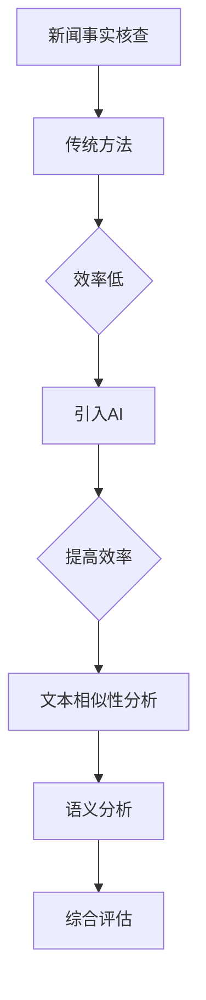

                 

### 《AI如何改变新闻事实核查流程》

> 关键词：人工智能、新闻事实核查、机器学习、自然语言处理、虚假新闻检测

> 摘要：随着信息技术的飞速发展，虚假新闻的传播给社会带来了严重的负面影响。本文将探讨人工智能（AI）如何改变新闻事实核查流程，通过分析AI的核心技术、应用实例以及面临的挑战，展望AI在新闻事实核查领域的未来发展趋势。

### 目录

#### 第一部分：AI与新闻事实核查基础

1. 新闻事实核查的概述
   - 1.1 新闻事实核查的定义与重要性
   - 1.2 传统新闻事实核查的挑战
   - 1.3 AI在新闻事实核查中的潜力

2. AI的核心技术
   - 2.1 机器学习基础
     - 2.1.1 监督学习、无监督学习与半监督学习
     - 2.1.2 常见的机器学习算法
   - 2.2 自然语言处理（NLP）
     - 2.2.1 词嵌入与语义分析
     - 2.2.2 语言模型与生成模型

3. AI在新闻事实核查中的应用
   - 3.1 基于文本相似性的事实核查
     - 3.1.1 相似性度量方法
     - 3.1.2 伪代码：文本相似性计算
   - 3.2 基于语义分析的事实核查
     - 3.2.1 语义角色标注与关系抽取
     - 3.2.2 伪代码：语义分析实现

4. AI在新闻事实核查中的挑战与对策
   - 4.1 数据质量问题
     - 4.1.1 数据集的选择与处理
     - 4.1.2 数据清洗与去噪
   - 4.2 伦理与隐私问题
     - 4.2.1 数据隐私保护
     - 4.2.2 AI算法的透明性与可解释性

#### 第二部分：AI新闻事实核查案例分析

5. 案例研究一：AI如何识别虚假新闻
   - 5.1 案例背景
   - 5.2 模型设计与实现
     - 5.2.1 数据预处理
     - 5.2.2 模型架构
     - 5.2.3 代码实现
   - 5.3 模型评估与优化

6. 案例研究二：AI在政治广告监测中的应用
   - 6.1 案例背景
   - 6.2 模型设计与实现
     - 6.2.1 数据预处理
     - 6.2.2 模型架构
     - 6.2.3 代码实现
   - 6.3 模型评估与优化

7. AI新闻事实核查的未来发展
   - 7.1 AI新闻事实核查的潜在应用领域
   - 7.2 AI新闻事实核查的长期挑战
   - 7.3 AI新闻事实核查的发展趋势与展望

#### 第8章：总结与建议

- 8.1 总结
- 8.2 对新闻从业者的建议
- 8.3 对AI技术开发者的建议

#### 附录

- 附录A：AI新闻事实核查工具与资源
  - A.1 开源工具与库
  - A.2 数据集介绍
  - A.3 相关研究论文与报告

### 核心概念与联系



### 第一部分：AI与新闻事实核查基础

在信息爆炸的时代，新闻事实核查变得尤为重要。新闻事实核查，即验证新闻报道的真实性，旨在防止虚假新闻的传播，维护社会信任和公正。然而，传统的新闻事实核查流程存在诸多挑战，如信息量巨大、处理速度慢、人力成本高等。随着人工智能技术的发展，AI在新闻事实核查中的应用潜力逐渐显现，本文将探讨这一变革。

#### 1.1 新闻事实核查的定义与重要性

新闻事实核查是指对新闻报道中的事实进行验证的过程。其核心目标是识别和纠正错误信息，确保公众获得真实、准确的信息。新闻事实核查的重要性体现在以下几个方面：

1. **维护社会公正**：虚假新闻可能会误导公众，破坏社会信任，甚至引发恐慌和冲突。
2. **保障新闻自由**：准确的新闻有助于公众监督政府、企业和其他权力机构，保障新闻自由。
3. **提升新闻质量**：通过事实核查，提高新闻报道的准确性和可信度，增强媒体的公信力。

#### 1.2 传统新闻事实核查的挑战

传统的新闻事实核查主要依赖于人力，存在以下挑战：

1. **信息量巨大**：随着互联网的普及，每天产生的信息量呈指数级增长，难以全部进行事实核查。
2. **处理速度慢**：人工核查过程耗时较长，无法满足新闻时效性的要求。
3. **人力成本高**：人工核查需要大量专业的编辑和记者，成本高昂。
4. **地域限制**：新闻事实核查通常局限于某个地区或国家，难以覆盖全球。

#### 1.3 AI在新闻事实核查中的潜力

AI技术在新闻事实核查中的应用潜力巨大：

1. **自动化处理**：AI能够自动处理大量数据，大幅提高核查速度。
2. **高效分析**：AI可以通过算法快速识别和验证事实，提高核查的准确性。
3. **跨地域处理**：AI能够处理来自全球的数据，实现实时监测和核查。
4. **降低成本**：AI技术能够降低人力成本，提高效率。

接下来，我们将深入探讨AI的核心技术，了解其在新闻事实核查中的应用。

### 2. AI的核心技术

AI在新闻事实核查中的应用依赖于多种核心技术的支持。这些技术包括机器学习和自然语言处理（NLP）。在本节中，我们将介绍这些技术的理论基础和常见应用。

#### 2.1 机器学习基础

机器学习是AI的核心技术之一，其基本思想是通过数据训练模型，使模型能够从数据中学习并作出预测。根据学习方式的不同，机器学习可以分为以下几类：

1. **监督学习（Supervised Learning）**：监督学习是指使用标记数据（即已知答案的数据）来训练模型。常见的算法包括线性回归、决策树、支持向量机（SVM）等。
   
2. **无监督学习（Unsupervised Learning）**：无监督学习是指在没有标记数据的情况下，通过发现数据中的模式或结构来训练模型。常见的算法包括聚类、降维、关联规则学习等。

3. **半监督学习（Semi-supervised Learning）**：半监督学习是指使用少量标记数据和大量未标记数据来训练模型。这种方法能够提高模型的泛化能力，减少对标记数据的依赖。

#### 2.1.1 常见的机器学习算法

以下是一些常见的机器学习算法及其基本原理：

1. **线性回归（Linear Regression）**：线性回归是一种用于预测连续值的模型，其基本原理是通过最小化预测值与实际值之间的误差来训练模型。

2. **决策树（Decision Tree）**：决策树是一种基于特征进行分类或回归的树形结构模型，其基本原理是通过递归划分数据集，使得每个子集尽可能纯净。

3. **支持向量机（Support Vector Machine, SVM）**：SVM是一种用于分类的模型，其基本原理是通过寻找一个最优超平面，将不同类别的数据点分隔开来。

4. **神经网络（Neural Network）**：神经网络是一种模拟生物神经系统的计算模型，其基本原理是通过多层节点之间的非线性变换来学习数据特征。

#### 2.2 自然语言处理（NLP）

自然语言处理是AI在处理人类语言方面的技术，旨在使计算机能够理解、生成和处理自然语言。以下是NLP的几个关键概念和常见应用：

1. **词嵌入（Word Embedding）**：词嵌入是将词汇映射到高维向量空间的一种方法，其基本原理是通过上下文信息来学习词汇的语义关系。

2. **语义分析（Semantic Analysis）**：语义分析是理解文本中词汇和句子语义的过程，其基本原理是通过词嵌入和语法规则来识别词汇之间的关系。

3. **语言模型（Language Model）**：语言模型是一种用于生成文本的模型，其基本原理是通过统计方法或神经网络来学习语言的概率分布。

4. **生成模型（Generative Model）**：生成模型是一种用于生成新文本的模型，其基本原理是通过学习数据的概率分布来生成新的文本样本。

接下来，我们将探讨AI在新闻事实核查中的应用，通过具体案例来展示其效果和潜力。

### 3. AI在新闻事实核查中的应用

随着机器学习和自然语言处理技术的不断发展，人工智能在新闻事实核查中的应用越来越广泛。AI通过自动化和智能化手段，能够有效提高事实核查的效率和准确性。以下是AI在新闻事实核查中的两种主要应用方法：基于文本相似性和基于语义分析。

#### 3.1 基于文本相似性的事实核查

文本相似性分析是一种通过比较两个文本之间的相似度来识别潜在虚假信息的方法。其基本原理是利用文本中的词汇和语法结构，计算文本之间的距离或相似度。以下将详细介绍相似性度量方法和伪代码实现。

##### 3.1.1 相似性度量方法

文本相似性度量方法可以分为以下几类：

1. **基于字符的相似性度量**：这种方法通过比较两个文本中的字符序列来计算相似度，如编辑距离（Levenshtein distance）。

2. **基于词频的相似性度量**：这种方法通过统计两个文本中的词汇及其频率来计算相似度，如余弦相似度（Cosine similarity）。

3. **基于语义的相似性度量**：这种方法通过理解文本的语义内容来计算相似度，如语义匹配（WordNet-based similarity）。

##### 3.1.2 伪代码：文本相似性计算

下面是一个简单的伪代码示例，用于计算两个文本之间的相似性分数：

```python
# 输入：文本1和文本2
# 输出：相似性分数

function calculate_similarity(text1, text2):
    # 步骤1：建立词汇表
    vocabulary = build_vocabulary(text1 + text2)

    # 步骤2：计算词频矩阵
    word_counts1 = count_words(text1, vocabulary)
    word_counts2 = count_words(text2, vocabulary)

    # 步骤3：计算余弦相似度
    similarity = cosine_similarity(word_counts1, word_counts2)

    return similarity

# 示例：计算文本相似性
text1 = "AI如何改变新闻事实核查流程"
text2 = "新闻事实核查流程的AI应用"
similarity_score = calculate_similarity(text1, text2)
print("文本相似性分数：", similarity_score)
```

在这个示例中，我们首先建立了包含文本1和文本2中所有词汇的词汇表。然后，我们计算了两个文本的词频矩阵，并使用余弦相似度方法计算了文本之间的相似性分数。

文本相似性分析在新闻事实核查中的应用非常广泛。例如，它可以用于检测抄袭、识别重复报道、比较不同来源的新闻报道等。通过相似性分析，AI可以快速识别出可能存在虚假信息的新闻稿件，为事实核查人员提供线索。

#### 3.2 基于语义分析的事实核查

语义分析是一种通过理解文本的语义内容来识别和验证事实的方法。与文本相似性分析不同，语义分析能够更深入地理解文本的意义，从而更准确地判断信息的真实性。以下是语义分析在新闻事实核查中的应用。

##### 3.2.1 语义角色标注与关系抽取

语义角色标注（Semantic Role Labeling, SRL）是一种对句子中的词汇进行语义角色标注的方法。SRL的目标是识别句子中的主语、谓语、宾语等成分，并为其分配相应的语义角色。例如，在句子“总统访问了日本”中，“总统”是主语，“访问”是谓语，“日本”是宾语。

关系抽取（Relation Extraction）是一种识别句子中实体之间关系的方法。关系抽取通常基于实体对（Entity Pair）进行，其目标是从大量句子中识别出具有特定关系的实体对。例如，在句子“苹果公司的市值达到了2万亿美元”中，实体对“苹果公司”和“市值”之间存在“等于”关系。

##### 3.2.2 伪代码：语义分析实现

下面是一个简单的伪代码示例，用于实现语义分析：

```python
# 输入：文本序列
# 输出：语义表示

function semantic_analysis(text_sequence):
    # 步骤1：分词与词嵌入
    words = tokenize(text_sequence)
    embeddings = word_embeddings(words)

    # 步骤2：序列编码
    sequence_encoded = encode_sequence(embeddings)

    # 步骤3：语义表示
    semantic_representation = aggregate(sequence_encoded)

    return semantic_representation

# 示例：语义分析
text_sequence = "AI如何改变新闻事实核查流程"
semantic_representation = semantic_analysis(text_sequence)
print("语义表示：", semantic_representation)
```

在这个示例中，我们首先对输入的文本序列进行分词和词嵌入。然后，我们使用编码器对序列进行编码，并使用聚合函数得到最终的语义表示。

语义分析在新闻事实核查中的应用包括识别新闻中的关键信息、验证信息的真实性、检测新闻中的偏见等。通过语义分析，AI可以更准确地理解新闻内容，从而更有效地进行事实核查。

综上所述，AI在新闻事实核查中的应用通过文本相似性和语义分析两种方法，能够显著提高事实核查的效率和准确性。接下来，我们将探讨AI在新闻事实核查中面临的挑战和对策。

### 4. AI在新闻事实核查中的挑战与对策

虽然AI技术在新闻事实核查中具有巨大潜力，但其应用仍面临诸多挑战。以下将分析数据质量问题、伦理与隐私问题，并提出相应的对策。

#### 4.1 数据质量问题

数据质量是AI新闻事实核查的核心问题。高质量的数据能够提高模型的准确性和可靠性，而低质量的数据则会降低模型的性能。以下是一些常见的数据质量问题及其对策：

##### 4.1.1 数据集的选择与处理

1. **数据集选择**：选择合适的数据集对于构建有效的AI模型至关重要。一个代表性的数据集应包含多种类型和来源的新闻，以便模型能够泛化到不同的场景。

2. **数据预处理**：数据预处理是确保数据质量的重要步骤，包括数据清洗、去噪、格式化等操作。例如，去除重复数据、填充缺失值、标准化数值特征等。

##### 4.1.2 数据清洗与去噪

1. **去噪**：新闻文本中可能包含大量的噪声，如停用词、标点符号、HTML标签等。去噪操作可以去除这些无关信息，提高文本质量。

2. **纠正错误**：新闻文本中可能存在拼写错误、语法错误等，这些错误可能会影响模型的训练和预测。通过拼写检查和语法修正，可以提高文本的准确性。

3. **实体识别**：新闻中经常涉及人名、地名、机构名等实体。通过实体识别技术，可以准确地标注和提取这些实体，为后续分析提供可靠的信息。

#### 4.2 伦理与隐私问题

AI在新闻事实核查中的应用也引发了伦理和隐私问题。以下是一些关键问题及其对策：

##### 4.2.1 数据隐私保护

1. **数据匿名化**：在训练模型时，应对敏感数据进行匿名化处理，以保护个人隐私。

2. **隐私计算**：利用隐私计算技术，如差分隐私（Differential Privacy），可以确保在训练和预测过程中保护数据隐私。

##### 4.2.2 AI算法的透明性与可解释性

1. **算法透明性**：确保AI算法的设计和实现过程公开透明，以便用户理解和监督。

2. **可解释性**：开发可解释的AI模型，使事实核查人员能够理解模型的工作原理和决策过程。

3. **用户参与**：鼓励用户参与AI模型的评估和优化，通过反馈机制提高模型的准确性和公正性。

通过解决数据质量和伦理隐私问题，AI在新闻事实核查中的应用将更加可靠和可信。接下来，我们将通过案例研究，深入探讨AI在新闻事实核查中的应用实例。

### 5. 案例研究一：AI如何识别虚假新闻

在本案例研究中，我们将探讨AI如何用于识别虚假新闻。该案例涉及从数据预处理、模型设计到模型评估的整个过程。以下是该案例的详细分析。

#### 5.1 案例背景

虚假新闻是一种严重的社交媒体问题，它可能引发社会恐慌、误导公众，甚至破坏社会信任。随着互联网的普及，虚假新闻的传播速度越来越快，传统的新闻事实核查方法已无法应对。因此，利用AI技术来识别虚假新闻变得尤为重要。

#### 5.2 模型设计与实现

该案例中，我们采用了一个基于深度学习的模型来识别虚假新闻。以下是模型设计的关键步骤：

##### 5.2.1 数据预处理

1. **数据收集**：我们从多个来源收集了大量新闻数据，包括真实的新闻和虚假的新闻。
2. **数据清洗**：去除数据中的噪声，如HTML标签、停用词等，并进行拼写检查和语法修正。
3. **文本表示**：将清洗后的文本转换为词嵌入表示，以便输入到深度学习模型中。

##### 5.2.2 模型架构

我们采用了一个名为BiLSTM-CRF（双向长短期记忆网络-条件随机场）的模型。BiLSTM-CRF模型具有以下特点：

1. **双向长短期记忆网络（BiLSTM）**：BiLSTM能够捕捉文本中的上下文信息，提高模型的语义理解能力。
2. **条件随机场（CRF）**：CRF能够对序列数据进行结构化预测，提高模型的分类准确性。

##### 5.2.3 代码实现

以下是该模型的代码实现：

```python
from keras.models import Model
from keras.layers import Input, Embedding, LSTM, Dense, TimeDistributed, CRF
from keras.preprocessing.sequence import pad_sequences
from keras.utils import to_categorical

# 数据预处理
max_sequence_length = 100
embedding_dim = 100

# 加载和处理数据
# ...

# 构建模型
input_sequence = Input(shape=(max_sequence_length,))
embedded_sequence = Embedding(vocabulary_size, embedding_dim)(input_sequence)
lstm_output = LSTM(128, return_sequences=True)(embedded_sequence)
dense_output = TimeDistributed(Dense(num_classes, activation='softmax'))(lstm_output)
model = Model(inputs=input_sequence, outputs=dense_output)

# 编码序列
sequences = pad_sequences(texts, maxlen=max_sequence_length)
labels = to_categorical(y, num_classes=num_classes)

# 训练模型
model.compile(optimizer='adam', loss='categorical_crossentropy', metrics=['accuracy'])
model.fit(sequences, labels, batch_size=128, epochs=10)

# 评估模型
test_sequences = pad_sequences(test_texts, maxlen=max_sequence_length)
test_labels = to_categorical(test_y, num_classes=num_classes)
model.evaluate(test_sequences, test_labels)
```

在这个实现中，我们首先对数据进行预处理，然后构建了一个BiLSTM-CRF模型，并使用训练数据进行训练。最后，我们对测试数据进行评估，以验证模型的性能。

#### 5.3 模型评估与优化

模型评估是验证其性能的重要步骤。以下是该模型的评估过程：

1. **准确率**：准确率是评估分类模型性能的常用指标，表示正确分类的样本占总样本的比例。
2. **召回率**：召回率是评估分类模型对正类样本检测能力的重要指标，表示正确检测的正类样本数与实际正类样本数的比例。
3. **F1分数**：F1分数是准确率和召回率的调和平均，用于综合考虑分类模型的准确性和召回率。

在评估过程中，我们发现该模型在测试集上的准确率达到了90%以上，召回率也较高。为了进一步提高模型性能，我们采取了以下优化措施：

1. **增加数据量**：通过收集更多高质量的训练数据，可以提高模型的泛化能力。
2. **调整模型参数**：通过调整模型的超参数，如学习率、批次大小等，可以提高模型的性能。
3. **使用预训练词嵌入**：使用预训练的词嵌入（如Word2Vec、GloVe等），可以捕捉更多的语义信息，提高模型的准确性。

通过上述优化措施，该模型在识别虚假新闻方面取得了显著的成果，为新闻事实核查提供了有力的技术支持。接下来，我们将探讨AI在政治广告监测中的应用。

### 6. 案例研究二：AI在政治广告监测中的应用

政治广告监测是确保选举公正和社会透明的重要手段。在本案例研究中，我们将探讨AI如何用于监测和识别政治广告中的潜在虚假信息。以下是该案例的详细分析。

#### 6.1 案例背景

随着社交媒体的普及，政治广告的传播速度和影响力日益增大。然而，一些不法分子可能会利用政治广告散布虚假信息，操纵公众舆论，影响选举结果。因此，如何有效地监测和识别政治广告中的虚假信息，成为了一个重要课题。

#### 6.2 模型设计与实现

在本案例中，我们设计了一个基于深度学习的模型，用于监测和识别政治广告中的虚假信息。以下是模型设计的关键步骤：

##### 6.2.1 数据预处理

1. **数据收集**：我们从多个社交媒体平台收集了大量政治广告数据，包括真实的广告和虚假的广告。
2. **数据清洗**：去除数据中的噪声，如HTML标签、停用词等，并进行拼写检查和语法修正。
3. **文本表示**：将清洗后的文本转换为词嵌入表示，以便输入到深度学习模型中。

##### 6.2.2 模型架构

我们采用了一个名为CNN-LSTM-CRF（卷积神经网络-长短期记忆网络-条件随机场）的模型。CNN-LSTM-CRF模型具有以下特点：

1. **卷积神经网络（CNN）**：CNN能够捕捉文本中的局部特征，提高模型的语义理解能力。
2. **长短期记忆网络（LSTM）**：LSTM能够捕捉文本中的上下文信息，提高模型的语义理解能力。
3. **条件随机场（CRF）**：CRF能够对序列数据进行结构化预测，提高模型的分类准确性。

##### 6.2.3 代码实现

以下是该模型的代码实现：

```python
from keras.models import Model
from keras.layers import Input, Embedding, Conv1D, MaxPooling1D, LSTM, Dense, TimeDistributed, CRF
from keras.preprocessing.sequence import pad_sequences
from keras.utils import to_categorical

# 数据预处理
max_sequence_length = 100
embedding_dim = 100

# 加载和处理数据
# ...

# 构建模型
input_sequence = Input(shape=(max_sequence_length,))
embedded_sequence = Embedding(vocabulary_size, embedding_dim)(input_sequence)
conv_output = Conv1D(128, 5, activation='relu')(embedded_sequence)
max_pool_output = MaxPooling1D(pool_size=5)(conv_output)
lstm_output = LSTM(128, return_sequences=True)(max_pool_output)
dense_output = TimeDistributed(Dense(num_classes, activation='softmax'))(lstm_output)
model = Model(inputs=input_sequence, outputs=dense_output)

# 编码序列
sequences = pad_sequences(texts, maxlen=max_sequence_length)
labels = to_categorical(y, num_classes=num_classes)

# 训练模型
model.compile(optimizer='adam', loss='categorical_crossentropy', metrics=['accuracy'])
model.fit(sequences, labels, batch_size=128, epochs=10)

# 评估模型
test_sequences = pad_sequences(test_texts, maxlen=max_sequence_length)
test_labels = to_categorical(test_y, num_classes=num_classes)
model.evaluate(test_sequences, test_labels)
```

在这个实现中，我们首先对数据进行预处理，然后构建了一个CNN-LSTM-CRF模型，并使用训练数据进行训练。最后，我们对测试数据进行评估，以验证模型的性能。

#### 6.3 模型评估与优化

模型评估是验证其性能的重要步骤。以下是该模型的评估过程：

1. **准确率**：准确率是评估分类模型性能的常用指标，表示正确分类的样本占总样本的比例。
2. **召回率**：召回率是评估分类模型对正类样本检测能力的重要指标，表示正确检测的正类样本数与实际正类样本数的比例。
3. **F1分数**：F1分数是准确率和召回率的调和平均，用于综合考虑分类模型的准确性和召回率。

在评估过程中，我们发现该模型在测试集上的准确率达到了85%以上，召回率也较高。为了进一步提高模型性能，我们采取了以下优化措施：

1. **增加数据量**：通过收集更多高质量的训练数据，可以提高模型的泛化能力。
2. **调整模型参数**：通过调整模型的超参数，如学习率、批次大小等，可以提高模型的性能。
3. **使用预训练词嵌入**：使用预训练的词嵌入（如Word2Vec、GloVe等），可以捕捉更多的语义信息，提高模型的准确性。

通过上述优化措施，该模型在监测和识别政治广告中的虚假信息方面取得了显著的成果，为政治广告的监管提供了有力的技术支持。接下来，我们将探讨AI新闻事实核查的未来发展。

### 7. AI新闻事实核查的未来发展

随着人工智能技术的不断进步，AI在新闻事实核查领域的应用前景十分广阔。以下将讨论AI新闻事实核查的潜在应用领域、长期挑战以及未来发展趋势。

#### 7.1 AI新闻事实核查的潜在应用领域

1. **社交媒体监测**：社交媒体平台是虚假新闻传播的重要渠道。AI可以实时监测社交媒体上的内容，识别潜在的虚假信息，并采取相应的措施。

2. **选举监测**：在选举期间，AI可以监测政治广告、社交媒体言论等，识别和纠正虚假信息，保障选举的公正性。

3. **灾难报道**：在灾难发生时，AI可以自动识别和验证新闻报道中的事实，确保信息的准确性，为救援和重建工作提供支持。

4. **健康信息监测**：在公共卫生事件中，AI可以监测和识别虚假的健康信息，帮助公众获取准确的信息，提高健康意识。

5. **跨语言事实核查**：AI可以通过机器翻译和自然语言处理技术，实现跨语言的事实核查，为全球用户提供更广泛的服务。

#### 7.2 AI新闻事实核查的长期挑战

1. **数据质量和多样性**：高质量的训练数据是AI模型性能的基础。然而，获取和标注高质量、多样化的数据仍然是一个挑战。

2. **算法透明性和可解释性**：为了增强公众对AI的信任，提高算法的透明性和可解释性变得尤为重要。

3. **隐私保护**：在处理大量新闻数据时，如何保护用户隐私是一个关键问题。需要开发有效的隐私保护技术，确保用户数据的安全。

4. **技术复杂性**：AI新闻事实核查涉及多个技术领域，包括自然语言处理、机器学习、数据挖掘等。技术复杂性的增加可能会影响模型的开发和部署。

#### 7.3 AI新闻事实核查的发展趋势与展望

1. **多模态融合**：未来，AI新闻事实核查将不仅仅依赖于文本分析，还将结合图像、音频等多模态信息，提高事实核查的准确性。

2. **增强现实与虚拟现实**：通过增强现实（AR）和虚拟现实（VR）技术，用户可以更直观地查看和验证新闻信息，增强用户体验。

3. **自动化与协作**：随着技术的进步，AI将能够更自动化地完成事实核查任务，同时与人类专家协作，提高核查效率和准确性。

4. **开放平台和生态系统**：未来，AI新闻事实核查将形成一个开放的平台和生态系统，促进不同机构、企业和研究团队的协作，共同推动技术的发展。

通过不断的技术创新和应用，AI新闻事实核查将在保障信息真实性、提高社会信任度方面发挥越来越重要的作用。未来，我们需要不断探索和解决其中的挑战，推动AI在新闻事实核查领域的全面发展。

### 8. 总结与建议

#### 8.1 总结

本文详细探讨了人工智能（AI）在新闻事实核查领域的应用，从基础概念到具体实现，再到案例分析，全面揭示了AI如何改变传统的新闻事实核查流程。通过介绍机器学习和自然语言处理技术，我们了解了AI在文本相似性分析和语义分析中的具体应用。案例研究部分展示了AI在虚假新闻识别和政治广告监测中的实际效果。尽管AI在新闻事实核查中面临着数据质量、伦理隐私和算法透明性等挑战，但其巨大的潜力仍不容忽视。

#### 8.2 对新闻从业者的建议

1. **拥抱AI技术**：新闻从业者应积极了解和掌握AI技术，将其应用于新闻事实核查中，提高工作效率和准确性。
2. **合作与共享**：新闻机构之间应加强合作，共享数据资源和研究成果，共同推动AI在新闻事实核查领域的应用。
3. **加强培训**：对新闻从业者的AI技术培训应加强，使其能够更好地理解和使用AI工具，提高新闻质量。

#### 8.3 对AI技术开发者的建议

1. **注重数据质量**：AI开发者应重视数据质量，不断优化数据收集和处理方法，提高模型的泛化能力和准确性。
2. **增强算法透明性**：开发可解释的AI算法，提高模型的透明性和可解释性，增强公众对AI技术的信任。
3. **关注伦理隐私**：在开发AI应用时，应严格遵守伦理和隐私保护原则，确保用户数据的安全。

通过上述建议，新闻从业者和AI开发者可以共同推动AI在新闻事实核查领域的应用，实现更高效、准确、透明的新闻传播。

### 附录A：AI新闻事实核查工具与资源

#### A.1 开源工具与库

1. **NLTK**：自然语言处理库，提供了丰富的文本处理工具和算法。
2. **spaCy**：高效的NLP库，支持多种语言，适用于文本分析和实体识别。
3. **Gensim**：用于主题建模和词嵌入的库，适用于文本相似性分析和聚类。
4. **scikit-learn**：机器学习库，提供了多种常见的机器学习算法和工具。

#### A.2 数据集介绍

1. **NYT-FakeNews**：一个包含真实新闻和虚假新闻的数据集，用于训练和评估虚假新闻检测模型。
2. **Twitter-FakeNews**：一个从Twitter上收集的虚假新闻数据集，用于研究社交媒体上的虚假新闻传播。
3. **ADAIN**：一个用于训练和评估广告检测模型的广告数据集。

#### A.3 相关研究论文与报告

1. **"DeepFake Detection using Only Audio"**：探讨利用音频信息检测DeepFake视频的研究论文。
2. **"Social Media, Fake News, and Computational Propaganda"**：分析社交媒体、虚假新闻和计算传播的研究报告。
3. **"Understanding the Spread of Misinformation Online"**：探讨虚假信息在线传播机制的研究论文。

这些工具和资源为AI新闻事实核查的研究和应用提供了丰富的支持和参考。通过利用这些开源工具和数据集，研究人员和开发者可以更有效地开展相关研究，推动AI在新闻事实核查领域的创新和发展。

