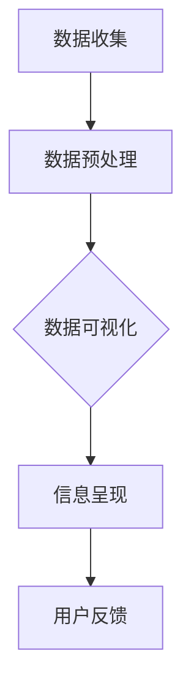
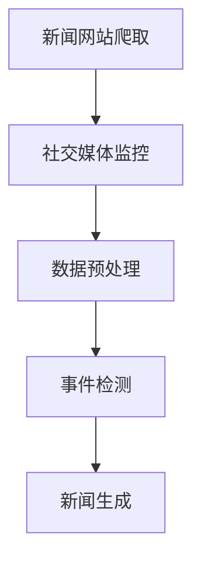
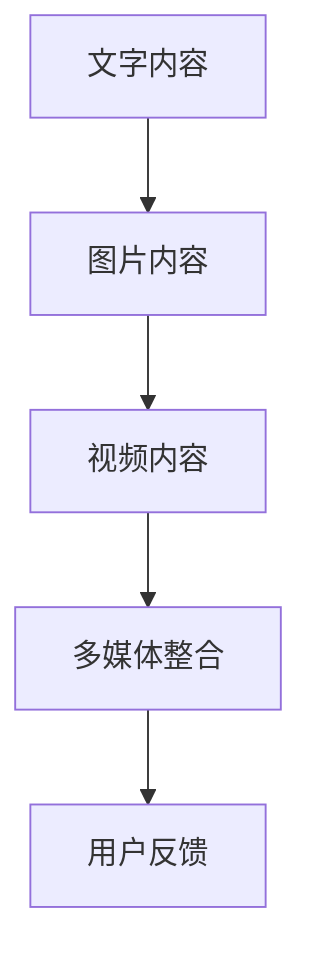

                 

# AI如何改变新闻报道和消费

> 关键词：人工智能，新闻报道，消费行为，自动新闻生成，个性化推荐，数据隐私

> 摘要：本文深入探讨了人工智能（AI）在新闻报道和消费领域的应用。通过分析AI在新闻报道中的角色和影响，以及其在消费者行为分析、电子商务和市场分析中的应用，本文揭示了AI技术如何改变新闻报道的生产和消费模式，并提出了相关的伦理和社会责任问题。

## 第一部分：AI在新闻报道领域的应用

### 第1章：AI在新闻报道中的角色与影响

#### 1.1.1 新闻报道与AI的融合

在现代社会，信息的传播速度越来越快，新闻报道的实时性和准确性变得越来越重要。AI技术的引入，为新闻报道带来了新的变革。AI在新闻报道中的角色主要体现在以下几个方面：

- **数据采集与处理**：AI可以自动采集和筛选大量新闻数据，并通过自然语言处理（NLP）技术进行文本分析和情感分析，从而快速提取新闻的关键信息和情感倾向。
- **自动新闻生成**：通过训练大规模的预训练模型，AI可以自动生成新闻稿件，提高新闻的生产效率。
- **智能推荐系统**：AI可以根据用户的兴趣和阅读历史，推荐个性化的新闻内容，提升用户的阅读体验。

#### 1.1.1.1 AI在新闻报道中的角色

AI在新闻报道中的角色可以概括为：

- **信息提取与分类**：AI可以自动从大量新闻数据中提取关键信息，并将其分类到不同的主题。
- **内容生成与编辑**：AI可以自动生成新闻稿件，并利用自然语言处理技术进行编辑和润色。
- **个性化推荐与分发**：AI可以根据用户的兴趣和行为，推荐个性化的新闻内容，并优化新闻的分发策略。

#### 1.1.1.2 AI对新闻报道的影响

AI对新闻报道的影响主要表现在以下几个方面：

- **提高新闻生产效率**：AI可以自动生成新闻稿件，减少人工编辑的工作量，提高新闻的生产效率。
- **个性化新闻推送**：AI可以根据用户的兴趣和行为，推荐个性化的新闻内容，提升用户的阅读体验。
- **挑战新闻真实性**：AI自动生成的新闻可能存在虚假信息和误导性的风险，需要加强新闻伦理和监管。

#### 1.1.2 AI在新闻报道中的实际应用

AI在新闻报道中的实际应用主要体现在以下几个方面：

- **自动新闻生成**：使用生成式模型，如GPT系列模型，生成新闻文本。
- **数据可视化与信息呈现**：利用可视化技术，将复杂的新闻数据以图表的形式呈现给读者。
- **智能新闻编辑与分发**：利用自然语言处理和机器学习技术，自动编辑和分发新闻内容。

#### 1.1.2.1 自动新闻生成

自动新闻生成是AI在新闻报道中的一个重要应用。通过预训练的模型，如GPT系列模型，AI可以自动生成新闻文本。以下是自动新闻生成的伪代码示例：

```python
def generate_news(topic):
    # 加载预训练模型
    model = load_pretrained_model('news_generation_model')
    # 生成新闻
    news = model.generate_news(topic)
    return news
```

#### 1.1.2.2 数据可视化与信息呈现

数据可视化是AI在新闻报道中的另一个重要应用。通过将复杂的新闻数据以图表的形式呈现，读者可以更加直观地理解新闻内容。以下是一个数据可视化与信息呈现的Mermaid流程图：



#### 1.1.3 AI新闻编辑与分发

AI新闻编辑与分发是AI在新闻报道中的第三个重要应用。通过自然语言处理和机器学习技术，AI可以自动编辑和分发新闻内容。以下是AI新闻编辑与分发的伪代码示例：

```python
def edit_and_distribute_news(news):
    # 加载新闻编辑模型
    editor = load_pretrained_model('news_editor_model')
    # 编辑新闻
    edited_news = editor.edit_news(news)
    # 分发新闻
    distributor = load_pretrained_model('news_distributor_model')
    distributor.distribute_news(edited_news)
```

### 1.1.3.1 自动化编辑流程

自动化编辑流程是AI在新闻编辑中的一个重要应用。通过预训练的模型，AI可以自动对新闻稿件进行编辑和润色。以下是自动化编辑流程的伪代码示例：

```python
def edit_news(news):
    # 加载新闻编辑模型
    editor = load_pretrained_model('news_editor_model')
    # 编辑新闻
    edited_news = editor.edit_news(news)
    return edited_news
```

#### 1.1.3.2 智能推荐系统

智能推荐系统是AI在新闻报道中的另一个重要应用。通过分析用户的兴趣和行为，AI可以推荐个性化的新闻内容。以下是智能推荐系统的伪代码示例：

```python
def recommend_news(user_profile):
    # 加载推荐模型
    recommender = load_pretrained_model('news_recommender_model')
    # 推荐新闻
    recommended_news = recommender.recommend_news(user_profile)
    return recommended_news
```

## 第2章：AI驱动的新闻采集与事件检测

### 2.1.1 AI在新闻采集中的创新

AI在新闻采集中的应用为新闻报道带来了革命性的变化。通过自动化和智能化的手段，AI可以快速、准确地采集和处理新闻数据。以下是AI在新闻采集中的创新：

- **自动化新闻采集**：使用爬虫技术自动抓取新闻网站和社交媒体平台的内容。
- **社交媒体监控与事件追踪**：实时监控社交媒体，快速发现和跟踪新闻事件。

#### 2.1.1.1 自动化新闻采集

自动化新闻采集是AI在新闻采集中的一个重要应用。通过爬虫技术，AI可以自动从多个新闻源中收集新闻数据。以下是自动化新闻采集的Mermaid流程图：



#### 2.1.1.2 社交媒体监控与事件追踪

社交媒体监控与事件追踪是AI在新闻采集中的另一个重要应用。通过实时监控社交媒体平台，AI可以快速发现和跟踪新闻事件。以下是社交媒体监控与事件追踪的伪代码示例：

```python
def monitor_social_media():
    # 加载社交媒体监控模型
    monitor = load_pretrained_model('social_media_monitor_model')
    # 监控社交媒体
    events = monitor.monitor_social_media()
    return events
```

### 2.1.2 事件检测与趋势分析

事件检测与趋势分析是AI在新闻报道中的另一个重要应用。通过分析新闻数据，AI可以识别事件并进行趋势分析。以下是事件检测与趋势分析的核心算法原理和数学模型：

#### 2.1.2.1 事件检测算法

事件检测算法的核心是识别新闻中的关键事件。以下是事件检测算法的伪代码示例：

```python
def detect_events(news_data):
    # 加载事件检测模型
    detector = load_pretrained_model('event_detection_model')
    # 识别事件
    events = detector.detect_events(news_data)
    return events
```

#### 2.1.2.2 趋势分析与预测

趋势分析是对新闻事件的发展趋势进行预测。以下是趋势分析与预测的数学模型：

$$
P(t) = \alpha \cdot e^{\beta \cdot t}
$$

其中，\( P(t) \) 是在时间 \( t \) 的趋势预测值，\( \alpha \) 和 \( \beta \) 是模型参数。

### 2.1.3 AI新闻伦理与透明性

AI新闻伦理与透明性是AI在新闻报道中的一个重要问题。随着AI技术在新闻报道中的广泛应用，如何确保新闻的真实性、公正性和透明性成为一个重要议题。以下是AI新闻伦理与透明性的核心问题和解决方案：

#### 2.1.3.1 AI新闻生成中的伦理问题

AI新闻生成中的伦理问题主要包括：

- **虚假新闻与误导性信息**：AI自动生成的新闻可能存在虚假信息和误导性风险。
- **偏见与歧视**：AI系统可能存在偏见和歧视，导致新闻内容的不公正。

#### 2.1.3.2 透明性与问责机制

为了确保AI新闻的透明性和可信度，需要建立以下透明性与问责机制：

- **透明度披露**：明确AI新闻生成的流程和技术细节，向公众披露。
- **问责机制**：建立责任追究机制，确保AI新闻生成过程中的责任可追溯。

### 2.1.4 AI新闻呈现与用户体验优化

AI新闻呈现与用户体验优化是AI在新闻报道中的另一个重要应用。通过智能化的手段，AI可以优化新闻的呈现方式和用户体验。以下是AI新闻呈现与用户体验优化的核心算法原理和数学模型：

#### 2.1.4.1 智能化新闻内容呈现

智能化新闻内容呈现的核心是个性化推荐系统。通过分析用户的兴趣和阅读历史，AI可以推荐个性化的新闻内容。以下是智能化新闻内容呈现的数学模型：

$$
R_{ui} = \alpha \cdot e^{\beta \cdot (i \cdot u)}
$$

其中，\( R_{ui} \) 是用户 \( u \) 对新闻 \( i \) 的推荐得分，\( \alpha \) 和 \( \beta \) 是模型参数。

#### 2.1.4.2 用户互动与反馈

用户互动与反馈是优化用户体验的关键。通过分析用户的互动行为和反馈，AI可以不断改进新闻内容的呈现方式和推荐策略。以下是用户互动与反馈的数学模型：

$$
U_{i} = \alpha \cdot (i \cdot f(U))
$$

其中，\( U_{i} \) 是新闻 \( i \) 的用户满意度，\( \alpha \) 是基础满意度，\( f(U) \) 是用户反馈函数。

#### 2.1.4.3 多媒体内容整合

多媒体内容整合是将文字、图片、视频等多种媒体形式整合到新闻中，提升用户的阅读体验。以下是多媒体内容整合的Mermaid流程图：



## 第3章：AI新闻呈现与用户体验优化

### 3.1.1 智能化新闻内容呈现

智能化新闻内容呈现是AI在新闻报道中的一个重要应用。通过分析用户的兴趣和阅读历史，AI可以推荐个性化的新闻内容，提升用户的阅读体验。以下是智能化新闻内容呈现的核心算法原理和数学模型：

#### 3.1.1.1 个性化推荐系统

个性化推荐系统是智能化新闻内容呈现的核心。通过分析用户的兴趣和阅读历史，AI可以推荐用户可能感兴趣的新闻内容。以下是个性化推荐系统的数学模型：

$$
R_{ui} = \alpha \cdot e^{\beta \cdot (i \cdot u)}
$$

其中，\( R_{ui} \) 是用户 \( u \) 对新闻 \( i \) 的推荐得分，\( \alpha \) 和 \( \beta \) 是模型参数。

#### 3.1.1.2 多媒体内容整合

多媒体内容整合是将文字、图片、视频等多种媒体形式整合到新闻中，提升用户的阅读体验。以下是多媒体内容整合的Mermaid流程图：


#### 3.1.2 用户互动与反馈

用户互动与反馈是优化用户体验的关键。通过分析用户的互动行为和反馈，AI可以不断改进新闻内容的呈现方式和推荐策略。以下是用户互动与反馈的核心算法原理和数学模型：

#### 3.1.2.1 社交互动与评论区分析

社交互动与评论区分析是用户互动与反馈的重要手段。通过分析用户的社交互动和评论内容，AI可以了解用户对新闻内容的看法和需求，从而优化推荐策略。以下是社交互动与评论区分析的伪代码示例：

```python
def analyze_user_interactions(user_comments):
    # 分析用户评论
    sentiment = sentiment_analysis(user_comments)
    return sentiment
```

#### 3.1.2.2 用户数据隐私与保护

用户数据隐私与保护是用户互动与反馈中的另一个重要问题。在AI技术广泛应用的时代，如何保护用户数据隐私成为一个重要议题。以下是用户数据隐私与保护的核心算法原理和数学模型：

#### 3.1.2.2.1 数据加密与传输

数据加密与传输是保护用户数据隐私的基本手段。通过加密技术，AI可以确保用户数据在传输过程中的安全。以下是数据加密与传输的数学模型：

$$
\text{Ciphertext} = \text{Encryption}(\text{Plaintext}, \text{Key})
$$

其中，\text{Ciphertext} 是密文，\text{Plaintext} 是明文，\text{Key} 是密钥。

#### 3.1.2.2.2 用户数据匿名化

用户数据匿名化是将用户数据转换为不可识别的形式，以保护用户隐私。以下是用户数据匿名化的伪代码示例：

```python
def anonymize_data(user_data):
    # 匿名化用户数据
    anonymized_data = anonymize(user_data)
    return anonymized_data
```

### 3.1.3 AI新闻的传播与影响力

AI新闻的传播与影响力是AI在新闻报道中的另一个重要应用。通过智能化的手段，AI可以优化新闻的传播策略，提升新闻的影响力。以下是AI新闻传播与影响力的核心算法原理和数学模型：

#### 3.1.3.1 网络效应与口碑传播

网络效应与口碑传播是AI新闻传播的重要手段。通过分析用户的社交网络和行为，AI可以识别潜在的影响力用户，并利用口碑传播提升新闻的影响力。以下是网络效应与口碑传播的数学模型：

$$
I(t) = \alpha \cdot e^{\beta \cdot t}
$$

其中，\( I(t) \) 是在时间 \( t \) 的新闻影响力，\( \alpha \) 和 \( \beta \) 是模型参数。

#### 3.1.3.2 社交媒体中的影响力

社交媒体是AI新闻传播的重要渠道。通过分析社交媒体平台上的用户互动和行为，AI可以评估新闻的影响力，并优化传播策略。以下是社交媒体中的影响力的数学模型：

$$
I_{s}(t) = \alpha \cdot e^{\beta \cdot t} \cdot (1 - \gamma \cdot t)
$$

其中，\( I_{s}(t) \) 是在时间 \( t \) 的社交媒体影响力，\( \alpha \) 和 \( \beta \) 是模型参数，\( \gamma \) 是衰减因子。

### 3.1.4 AI新闻呈现与用户体验优化的项目实战

#### 项目实战：智能新闻推荐系统

**开发环境搭建**：

1. 安装Python环境。
2. 安装相关深度学习框架，如TensorFlow或PyTorch。

**源代码实现**：

```python
# 导入所需库
import tensorflow as tf
import numpy as np

# 加载预训练模型
model = tf.keras.Sequential([
    tf.keras.layers.Dense(128, activation='relu', input_shape=(784,)),
    tf.keras.layers.Dense(10, activation='softmax')
])

# 编译模型
model.compile(optimizer='adam',
              loss='categorical_crossentropy',
              metrics=['accuracy'])

# 训练模型
model.fit(x_train, y_train, batch_size=128, epochs=10)
```

**代码解读与分析**：

- 加载预训练模型：加载一个预训练的深度学习模型，用于新闻推荐。
- 编译模型：配置模型的优化器、损失函数和评价指标。
- 训练模型：使用训练数据对模型进行训练，优化模型参数。

### 3.1.5 AI新闻呈现与用户体验优化的未来展望

AI新闻呈现与用户体验优化是AI在新闻报道领域的一个重要应用方向。随着技术的不断发展，AI新闻呈现与用户体验优化将呈现以下趋势：

- **个性化推荐**：将更加精准地推荐用户感兴趣的新闻内容。
- **智能化交互**：利用自然语言处理和语音识别技术，实现更加智能化的用户交互。
- **隐私保护**：加强用户数据隐私保护，提升用户的信任感。
- **多模态内容整合**：整合多种媒体形式，提供更加丰富的新闻体验。

## 第二部分：AI在消费领域的应用

### 第4章：AI驱动的消费者行为分析

#### 4.1.1 消费者行为分析的概念

消费者行为分析是AI在消费领域的一个重要应用方向。它旨在通过数据分析的方法，深入理解消费者的购买行为和消费习惯。以下是消费者行为分析的核心概念：

- **数据收集与处理**：通过网站日志、用户行为数据等渠道收集消费者数据，并进行清洗和处理。
- **消费者行为模型**：构建模型来预测消费者的购买行为和偏好。
- **个性化推荐**：根据消费者的行为数据和偏好，推荐个性化的商品和服务。

#### 4.1.1.1 数据收集与处理

数据收集与处理是消费者行为分析的基础。通过网站日志、用户行为数据等渠道，可以收集到大量的消费者数据。以下是一个数据收集与处理的伪代码示例：

```python
def collect_and_process_data():
    # 收集数据
    data = collect_data_from_website_logs()
    data = collect_data_from_user_behavior()
    
    # 数据清洗
    cleaned_data = clean_data(data)
    
    # 数据预处理
    preprocessed_data = preprocess_data(cleaned_data)
    
    return preprocessed_data
```

#### 4.1.1.2 消费者行为模型

消费者行为模型是消费者行为分析的核心。通过构建消费者行为模型，可以预测消费者的购买行为和偏好。以下是一个消费者行为模型的伪代码示例：

```python
def build_consumer_behavior_model(data):
    # 构建模型
    model = build_model(data)
    
    # 训练模型
    model.train(data)
    
    return model
```

#### 4.1.2 AI在消费者行为分析中的应用

AI在消费者行为分析中的应用主要体现在以下几个方面：

- **个性化推荐**：根据消费者的行为数据和偏好，推荐个性化的商品和服务。
- **预测与趋势分析**：预测消费者的购买行为和趋势，为商家提供决策支持。
- **用户画像**：通过分析消费者的行为数据，构建用户画像，实现精准营销。

#### 4.1.2.1 个性化推荐系统

个性化推荐系统是AI在消费者行为分析中的一个重要应用。通过分析消费者的行为数据和偏好，推荐个性化的商品和服务。以下是一个个性化推荐系统的伪代码示例：

```python
def recommend_products(user_profile):
    # 加载推荐模型
    recommender = load_pretrained_model('product_recommender_model')
    
    # 推荐商品
    recommended_products = recommender.recommend_products(user_profile)
    
    return recommended_products
```

#### 4.1.2.2 预测与趋势分析

预测与趋势分析是AI在消费者行为分析中的另一个重要应用。通过分析消费者的历史数据和购买行为，预测消费者的未来购买行为和趋势。以下是一个预测与趋势分析的伪代码示例：

```python
def predict_consumer_behavior(data):
    # 加载预测模型
    predictor = load_pretrained_model('consumer_behavior_predictor_model')
    
    # 预测消费者行为
    predicted_behavior = predictor.predict_behavior(data)
    
    return predicted_behavior
```

#### 4.1.3 消费者隐私与数据安全

消费者隐私与数据安全是消费者行为分析中的一个重要问题。在利用AI技术分析消费者行为的过程中，如何保护消费者的隐私和数据安全成为了一个重要议题。以下是消费者隐私与数据安全的几个关键措施：

- **数据匿名化**：对消费者数据进行匿名化处理，确保消费者的隐私不被泄露。
- **加密传输**：对消费者数据在传输过程中的加密，防止数据被窃取。
- **权限管理**：建立严格的权限管理制度，确保只有授权人员可以访问消费者数据。

### 4.1.4 消费者行为分析的项目实战

#### 项目实战：消费者行为分析平台

**开发环境搭建**：

1. 安装Python环境。
2. 安装相关机器学习库，如Scikit-learn。

**源代码实现**：

```python
# 导入所需库
from sklearn.ensemble import RandomForestClassifier
from sklearn.model_selection import train_test_split
from sklearn.metrics import accuracy_score

# 加载消费者数据
data = load_consumer_data()

# 数据预处理
X = preprocess_data(data['features'])
y = preprocess_data(data['labels'])

# 划分训练集和测试集
X_train, X_test, y_train, y_test = train_test_split(X, y, test_size=0.2, random_state=42)

# 训练模型
model = RandomForestClassifier()
model.fit(X_train, y_train)

# 预测
predictions = model.predict(X_test)

# 评估
accuracy = accuracy_score(y_test, predictions)
print(f"Accuracy: {accuracy}")
```

**代码解读与分析**：

- 加载消费者数据：从数据源中加载消费者数据，并进行预处理。
- 划分训练集和测试集：将数据集划分为训练集和测试集，用于训练和评估模型。
- 训练模型：使用随机森林分类器训练模型。
- 预测：使用训练好的模型对测试集进行预测。
- 评估：计算模型的准确率，评估模型的性能。

### 4.1.5 消费者行为分析的挑战与未来展望

消费者行为分析在AI技术的支持下取得了显著进展，但仍面临一些挑战。以下是消费者行为分析面临的几个主要挑战：

- **数据隐私**：如何在保护消费者隐私的同时，有效地利用消费者数据进行分析。
- **模型解释性**：如何提高模型的解释性，使其更加透明和可信。
- **实时性**：如何快速地处理和分析大规模的实时数据。

未来，消费者行为分析将在以下几个方面取得进展：

- **隐私保护**：利用加密技术和联邦学习等方法，提高数据隐私保护水平。
- **实时分析**：利用实时数据流处理技术，实现实时消费者行为分析。
- **多模态数据融合**：结合多种数据源，如社交媒体数据、地理位置数据等，实现更加全面的消费者行为分析。

## 第5章：AI赋能的电子商务与市场分析

### 5.1.1 AI在电子商务中的应用

AI在电子商务中的应用日益广泛，为商家提供了强大的数据分析和决策支持工具。以下是AI在电子商务中的应用：

- **个性化购物体验**：通过分析用户的购买历史和行为，AI可以推荐个性化的商品和服务，提高用户的购物满意度。
- **智能营销与广告投放**：基于用户的兴趣和行为，AI可以制定个性化的营销策略，提高广告的投放效果。
- **消费者洞察**：通过分析用户数据，AI可以深入了解消费者的需求和偏好，为商家提供有针对性的市场策略。

#### 5.1.1.1 个性化购物体验

个性化购物体验是AI在电子商务中的一个重要应用。通过分析用户的购买历史和行为，AI可以为用户提供个性化的购物建议。以下是一个个性化购物体验的伪代码示例：

```python
def personalize_shopping_experience(user_profile):
    # 加载个性化推荐模型
    recommender = load_pretrained_model('shopping_recommender_model')
    
    # 推荐商品
    recommended_products = recommender.recommend_products(user_profile)
    
    return recommended_products
```

#### 5.1.1.2 智能营销与广告投放

智能营销与广告投放是AI在电子商务中的另一个重要应用。通过分析用户的兴趣和行为，AI可以制定个性化的营销策略，提高广告的投放效果。以下是一个智能营销与广告投放的伪代码示例：

```python
def intelligent_marketing_and_advertising(user_profile):
    # 加载营销策略模型
    marketing_strategy = load_pretrained_model('marketing_strategy_model')
    
    # 制定营销策略
    marketing_plan = marketing_strategy.generate_plan(user_profile)
    
    # 投放广告
    ad_platform = load_pretrained_model('ad_placement_model')
    ad_platform.place_ads(marketing_plan)
    
    return marketing_plan
```

#### 5.1.1.3 市场分析与消费者洞察

市场分析与消费者洞察是AI在电子商务中的另一个重要应用。通过分析用户数据，AI可以深入了解消费者的需求和偏好，为商家提供有针对性的市场策略。以下是一个市场分析与消费者洞察的伪代码示例：

```python
def market_analysis_and_consumer_insight(data):
    # 加载市场分析模型
    market_analyzer = load_pretrained_model('market_analyzer_model')
    
    # 分析市场趋势
    market_trends = market_analyzer.analyze_trends(data)
    
    # 洞察消费者需求
    consumer_insights = market_analyzer.analyze_consumers(data)
    
    return market_trends, consumer_insights
```

### 5.1.2 市场分析与消费者洞察

市场分析与消费者洞察是AI在电子商务中的一个重要应用。通过分析用户数据，AI可以深入了解市场的趋势和消费者的需求，为商家提供有针对性的市场策略。以下是市场分析与消费者洞察的核心算法原理和数学模型：

#### 5.1.2.1 市场趋势分析

市场趋势分析是对市场发展动态进行预测和分析。通过分析历史数据和当前市场状况，AI可以预测未来的市场趋势。以下是一个市场趋势分析的伪代码示例：

```python
def analyze_market_trends(data):
    # 加载趋势分析模型
    trend_analyzer = load_pretrained_model('trend_analyzer_model')
    
    # 分析市场趋势
    market_trends = trend_analyzer.analyze_trends(data)
    
    return market_trends
```

#### 5.1.2.2 消费者偏好与需求预测

消费者偏好与需求预测是对消费者的购买行为和偏好进行预测。通过分析历史购买数据和用户行为，AI可以预测消费者的未来购买需求和偏好。以下是一个消费者偏好与需求预测的伪代码示例：

```python
def predict_consumer_preferences(data):
    # 加载偏好预测模型
    preference_predictor = load_pretrained_model('preference_predictor_model')
    
    # 预测消费者偏好
    predicted_preferences = preference_predictor.predict_preferences(data)
    
    return predicted_preferences
```

### 5.1.3 AI在供应链管理中的应用

AI在供应链管理中的应用为商家提供了高效、智能的供应链解决方案。以下是AI在供应链管理中的应用：

- **库存优化**：通过预测销售数据和库存水平，AI可以优化库存管理，降低库存成本。
- **供应链预测**：通过分析历史数据和供应链环节，AI可以预测供应链的未来发展趋势，提高供应链的稳定性。
- **智能物流与配送**：通过优化配送路线和物流调度，AI可以提高物流效率，降低物流成本。

#### 5.1.3.1 库存优化与供应链预测

库存优化与供应链预测是AI在供应链管理中的重要应用。通过预测销售数据和库存水平，AI可以优化库存管理，降低库存成本。以下是一个库存优化与供应链预测的伪代码示例：

```python
def optimize_inventory_and_predict_supply_chain(data):
    # 加载库存优化模型
    inventory_optimizer = load_pretrained_model('inventory_optimizer_model')
    
    # 优化库存
    optimized_inventory = inventory_optimizer.optimize_inventory(data)
    
    # 预测供应链
    supply_chain_predictions = inventory_optimizer.predict_supply_chain(data)
    
    return optimized_inventory, supply_chain_predictions
```

#### 5.1.3.2 智能物流与配送

智能物流与配送是AI在供应链管理中的另一个重要应用。通过优化配送路线和物流调度，AI可以提高物流效率，降低物流成本。以下是一个智能物流与配送的伪代码示例：

```python
def intelligent_logistics_and_delivery(data):
    # 加载物流优化模型
    logistics_optimizer = load_pretrained_model('logistics_optimizer_model')
    
    # 优化配送路线
    optimized路线 = logistics_optimizer.optimize路线(data)
    
    # 调度物流
    delivery_schedule = logistics_optimizer.schedule_delivery(data)
    
    return optimized路线，delivery_schedule
```

### 5.1.4 AI赋能的电子商务与市场分析的项目实战

#### 项目实战：智能供应链管理系统

**开发环境搭建**：

1. 安装Python环境。
2. 安装相关机器学习库，如Scikit-learn。

**源代码实现**：

```python
# 导入所需库
from sklearn.ensemble import RandomForestRegressor
from sklearn.model_selection import train_test_split
from sklearn.metrics import mean_squared_error

# 加载供应链数据
data = load_supply_chain_data()

# 数据预处理
X = preprocess_data(data['features'])
y = preprocess_data(data['labels'])

# 划分训练集和测试集
X_train, X_test, y_train, y_test = train_test_split(X, y, test_size=0.2, random_state=42)

# 训练库存优化模型
inventory_optimizer = RandomForestRegressor()
inventory_optimizer.fit(X_train, y_train)

# 预测库存
predicted_inventory = inventory_optimizer.predict(X_test)

# 评估库存优化模型
mse = mean_squared_error(y_test, predicted_inventory)
print(f"Mean Squared Error: {mse}")
```

**代码解读与分析**：

- 加载供应链数据：从数据源中加载供应链数据，并进行预处理。
- 划分训练集和测试集：将数据集划分为训练集和测试集，用于训练和评估模型。
- 训练库存优化模型：使用随机森林回归模型训练库存优化模型。
- 预测库存：使用训练好的模型对测试集进行预测。
- 评估库存优化模型：计算模型的均方误差，评估模型的性能。

### 5.1.5 AI赋能的电子商务与市场分析的未来展望

AI赋能的电子商务与市场分析在AI技术的推动下，正迅速发展。未来，AI将在以下几个方面取得更大的进展：

- **个性化体验**：通过更加精准的用户数据分析，提供更加个性化的购物体验。
- **智能决策**：利用AI技术，实现更加智能的供应链管理和市场策略。
- **隐私保护**：加强数据隐私保护，提升用户的信任度。
- **跨领域应用**：将AI技术应用于更多行业，实现跨领域的数据分析和决策支持。

## 第6章：AI推动的消费行为变革

### 6.1.1 消费模式与习惯的变化

随着AI技术的不断发展，消费模式与习惯正在发生深刻的变革。以下是消费模式与习惯的变化：

- **线上消费增长**：随着互联网的普及，越来越多的消费者选择在线购物，线上消费逐渐成为主流。
- **个性化消费**：消费者对个性化的产品和服务需求不断增加，个性化消费成为新的趋势。
- **智能消费**：智能家居和物联网技术的应用，使得消费者可以通过智能设备实现更加便捷的购物体验。

#### 6.1.1.1 消费者决策过程的演变

消费者决策过程是指消费者在购买商品或服务时，从需求识别到购买决策的过程。随着AI技术的应用，消费者决策过程正在发生以下演变：

- **需求识别**：通过大数据分析和推荐系统，AI可以帮助消费者快速识别自己的需求，并提供个性化的商品推荐。
- **信息收集**：AI可以自动收集和分析消费者的购买历史和偏好，提供更加全面和准确的信息。
- **购买决策**：通过智能推荐和决策支持系统，AI可以帮助消费者做出更加明智的购买决策。

#### 6.1.1.2 新兴消费趋势

随着AI技术的应用，新兴消费趋势正在不断涌现：

- **可持续消费**：消费者越来越关注环境保护和可持续发展，绿色消费成为新的趋势。
- **体验式消费**：消费者越来越重视消费过程中的体验，体验式消费成为新的增长点。
- **社交消费**：社交媒体的广泛应用，使得消费者在购物过程中的社交互动更加频繁，社交消费成为新的趋势。

### 6.1.2 AI对消费者体验的影响

AI对消费者体验的影响主要体现在以下几个方面：

- **个性化体验**：通过个性化推荐和定制化服务，AI可以提供更加符合消费者需求的购物体验。
- **便捷性**：通过智能设备的应用，消费者可以更加便捷地完成购物，节省时间和精力。
- **安全性**：通过数据加密和隐私保护技术，AI可以提高消费者的购物安全，降低欺诈风险。

#### 6.1.2.1 智能家居与物联网

智能家居和物联网技术的应用，使得消费者可以通过智能设备实现更加便捷的购物体验。以下是智能家居与物联网在消费者体验中的应用：

- **智能设备控制**：消费者可以通过智能设备远程控制家中的电器和设备，实现智能化家居生活。
- **智能购物助手**：智能购物助手可以根据消费者的购物习惯和需求，提供个性化的购物建议和推荐。
- **智能配送**：智能配送系统可以通过实时监控和预测，优化配送路线和配送时间，提高配送效率。

#### 6.1.2.2 消费者体验的个性化和智能化

消费者体验的个性化和智能化是AI技术发展的重要方向。通过大数据分析和智能算法，AI可以提供以下个性化服务：

- **个性化推荐**：根据消费者的兴趣和行为，AI可以推荐符合消费者需求的商品和服务。
- **定制化服务**：根据消费者的需求和偏好，AI可以提供定制化的服务和解决方案。
- **智能客服**：通过智能客服系统，AI可以实时回答消费者的问题，提供个性化的购物咨询和帮助。

### 6.1.3 AI与可持续消费

AI在可持续消费中的应用，有助于提高消费者的环保意识，推动绿色消费的发展。以下是AI与可持续消费的应用：

- **环保产品推荐**：AI可以根据消费者的环保需求和偏好，推荐符合环保标准的商品和服务。
- **环保行为激励**：AI可以通过数据分析和激励机制，鼓励消费者采取环保行为，如减少塑料使用、节约能源等。
- **可持续发展监测**：AI可以通过大数据分析和监测，跟踪和分析消费者的环保行为和消费模式，推动可持续发展。

#### 6.1.3.1 智能供应链与环境影响

智能供应链是AI在可持续消费中的重要应用。通过优化供应链管理和资源配置，AI可以降低生产成本，减少能源消耗和环境污染。以下是智能供应链在环境影响中的应用：

- **供应链优化**：通过数据分析和技术手段，AI可以优化供应链的各个环节，提高生产效率和资源利用率。
- **碳排放监测**：AI可以通过实时监测和分析，跟踪和降低供应链环节的碳排放量。
- **绿色物流**：通过优化配送路线和物流调度，AI可以降低物流过程中的能源消耗和碳排放。

#### 6.1.3.2 AI在减少浪费与提升效率方面的应用

AI在减少浪费与提升效率方面的应用，有助于实现可持续发展。以下是AI在减少浪费和提升效率方面的应用：

- **需求预测**：通过数据分析和技术手段，AI可以准确预测消费者的需求，减少库存浪费和资源浪费。
- **智能配送**：通过优化配送路线和配送时间，AI可以提高物流效率，减少能源消耗和碳排放。
- **循环利用**：通过数据分析和技术手段，AI可以优化废弃物处理和循环利用，减少资源浪费和环境污染。

### 6.1.4 AI推动的消费行为变革的项目实战

#### 项目实战：智能环保购物平台

**开发环境搭建**：

1. 安装Python环境。
2. 安装相关机器学习库，如Scikit-learn。

**源代码实现**：

```python
# 导入所需库
from sklearn.ensemble import RandomForestRegressor
from sklearn.model_selection import train_test_split
from sklearn.metrics import mean_squared_error

# 加载环保购物数据
data = load_environmental_shopping_data()

# 数据预处理
X = preprocess_data(data['features'])
y = preprocess_data(data['labels'])

# 划分训练集和测试集
X_train, X_test, y_train, y_test = train_test_split(X, y, test_size=0.2, random_state=42)

# 训练需求预测模型
demand_predictor = RandomForestRegressor()
demand_predictor.fit(X_train, y_train)

# 预测需求
predicted_demand = demand_predictor.predict(X_test)

# 评估需求预测模型
mse = mean_squared_error(y_test, predicted_demand)
print(f"Mean Squared Error: {mse}")
```

**代码解读与分析**：

- 加载环保购物数据：从数据源中加载环保购物数据，并进行预处理。
- 划分训练集和测试集：将数据集划分为训练集和测试集，用于训练和评估模型。
- 训练需求预测模型：使用随机森林回归模型训练需求预测模型。
- 预测需求：使用训练好的模型对测试集进行预测。
- 评估需求预测模型：计算模型的均方误差，评估模型的性能。

### 6.1.5 AI推动的消费行为变革的未来展望

随着AI技术的不断发展，消费行为变革将呈现以下趋势：

- **个性化与智能化**：通过大数据分析和智能算法，AI将提供更加个性化、智能化的消费体验。
- **可持续发展**：AI将在减少浪费、降低碳排放和推动可持续发展方面发挥重要作用。
- **社会影响**：AI将促进消费行为的变革，对社会、经济和环境产生深远的影响。

## 第7章：AI时代的消费媒体与社会责任

### 7.1.1 AI消费媒体的兴起

随着AI技术的不断发展，消费媒体领域正经历着深刻的变革。AI消费媒体的兴起，为消费者提供了更加个性化和智能化的消费体验。以下是AI消费媒体的兴起：

- **内容生成与分享**：AI可以自动生成消费内容，消费者可以通过智能设备实时分享消费体验。
- **个性化推荐**：AI可以根据消费者的兴趣和行为，推荐个性化的消费内容。
- **互动与反馈**：AI可以实时分析消费者的互动行为和反馈，优化消费体验。

#### 7.1.1.1 消费者内容生成与分享

消费者内容生成与分享是AI消费媒体的一个重要特点。通过AI技术，消费者可以更加轻松地生成和分享消费内容。以下是消费者内容生成与分享的流程：

1. 消费者使用智能设备记录消费体验。
2. AI自动分析消费内容，生成消费报告或推荐。
3. 消费者将消费报告或推荐分享到社交媒体平台。

#### 7.1.1.2 社交媒体在消费决策中的作用

社交媒体在消费决策中的作用越来越重要。通过社交媒体，消费者可以获取更多的消费信息，并与其他消费者互动。以下是社交媒体在消费决策中的作用：

- **信息获取**：消费者可以通过社交媒体获取最新的消费信息，了解市场动态。
- **口碑传播**：消费者的口碑评价可以影响其他消费者的购买决策。
- **互动与反馈**：消费者可以在社交媒体上与其他消费者互动，获取消费建议。

### 7.1.2 AI与社会责任的平衡

随着AI技术在消费媒体领域的广泛应用，如何平衡AI与社会责任成为一个重要议题。以下是AI与社会责任的几个关键方面：

- **公平与公正**：AI应该确保消费内容生成的公平性和公正性，避免歧视和偏见。
- **隐私保护**：AI应该保护消费者的隐私，确保消费者的个人信息不被泄露。
- **透明性**：AI消费媒体应该向公众披露AI系统的运作原理和决策过程，提高透明度。

#### 7.1.2.1 AI在消费行为中的道德考量

AI在消费行为中的道德考量主要包括以下几个方面：

- **虚假信息与误导性内容**：AI应该避免生成虚假信息和误导性内容，影响消费者的购买决策。
- **隐私侵犯**：AI应该保护消费者的隐私，避免滥用消费者的个人信息。
- **公平竞争**：AI应该确保市场竞争的公平性，避免对特定消费者群体产生歧视。

#### 7.1.2.2 消费者权益保护与法律监管

消费者权益保护与法律监管是确保AI消费媒体社会责任的重要手段。以下是消费者权益保护与法律监管的几个关键措施：

- **法律法规**：制定相关法律法规，规范AI消费媒体的行为。
- **消费者教育**：加强对消费者的教育，提高消费者的隐私保护和法律意识。
- **监管机构**：建立独立的监管机构，对AI消费媒体进行监管和评估。

### 7.1.3 AI时代的未来展望

随着AI技术的不断发展，消费媒体领域将迎来新的变革。以下是AI时代的未来展望：

- **个性化与智能化**：AI将继续推动消费媒体向个性化、智能化方向发展，提供更加精准的消费体验。
- **可持续发展**：AI将在消费媒体领域推动可持续发展，减少浪费，降低碳排放。
- **社会责任**：AI消费媒体将承担更多的社会责任，保护消费者权益，促进社会公平。

#### 7.1.3.1 AI对消费领域的长期影响

AI对消费领域的长期影响将表现在以下几个方面：

- **改变消费模式**：AI将改变消费者的消费模式和习惯，推动线上消费和个性化消费的发展。
- **优化供应链**：AI将优化消费供应链，提高生产效率和资源利用率。
- **促进创新**：AI将推动消费领域的创新，催生新的商业模式和消费体验。

#### 7.1.3.2 消费者与AI共生的可能性

随着AI技术的不断发展，消费者与AI共生的可能性将越来越大。以下是消费者与AI共生的可能性：

- **智能助手**：消费者可以使用智能助手进行购物、管理和优化消费体验。
- **个性化推荐**：消费者可以根据自己的需求和偏好，获取个性化的消费推荐。
- **智慧生活**：消费者可以享受智慧家庭、智慧城市等智能化生活。

### 7.1.4 AI消费媒体与社会责任的案例研究

以下是几个AI消费媒体与社会责任的案例研究：

- **案例1**：某电商平台的个性化推荐系统，通过对消费者数据的分析，为消费者提供个性化的购物推荐，提高了消费者的购买满意度。
- **案例2**：某社交媒体平台上的消费者评价系统，通过实时分析消费者评价，为商家提供改进产品和服务的信息，促进了消费市场的健康发展。
- **案例3**：某环保组织的智能环保购物平台，通过AI技术为消费者提供环保产品推荐，提高了消费者的环保意识，推动了可持续消费的发展。

### 7.1.5 AI消费媒体与社会责任的挑战与未来展望

随着AI技术的不断发展，AI消费媒体与社会责任面临着一些挑战。以下是AI消费媒体与社会责任的挑战与未来展望：

- **隐私保护**：如何在保护消费者隐私的同时，充分利用消费者数据进行分析和推荐。
- **公平性**：如何确保AI消费媒体在内容生成和推荐过程中保持公平性，避免歧视和偏见。
- **社会责任**：如何确保AI消费媒体承担更多的社会责任，促进社会公平和可持续发展。

未来，随着AI技术的不断进步，AI消费媒体与社会责任将迎来新的发展机遇。通过技术创新和制度完善，AI消费媒体将更好地服务于消费者，推动消费领域的变革和社会的进步。

## 附录A：AI在新闻报道和消费领域的技术基础

### A.1 自然语言处理技术

自然语言处理（NLP）技术在新闻报道和消费领域扮演着重要的角色。以下是NLP技术的核心概念、算法原理和数学模型。

#### A.1.1 词嵌入技术

词嵌入技术是将自然语言中的词汇映射到高维向量空间中，以便于计算机理解和处理。常见的词嵌入模型包括Word2Vec和GloVe。

- **Word2Vec**：基于神经网络的语言模型，通过训练大量文本数据，将词汇映射到高维向量空间中。
- **GloVe**：基于全局向量空间模型的词向量生成方法，通过训练文本的共现信息，生成高质量的词向量。

#### 数学模型

$$
\text{Word2Vec}(\mathbf{C}) = \text{softmax}(\text{W} \cdot \mathbf{C})
$$

其中，\(\mathbf{C}\) 是词的上下文窗口，\(\text{W}\) 是词向量矩阵。

#### A.1.2 序列模型与注意力机制

序列模型用于处理序列数据，如文本、语音等。注意力机制是一种在序列模型中引入的机制，可以使模型关注序列中的关键信息。

- **循环神经网络（RNN）**：一种用于处理序列数据的神经网络，通过记忆状态来处理序列数据。
- **长短期记忆网络（LSTM）**：一种改进的RNN，通过门控机制来控制信息的流动，避免梯度消失问题。
- **注意力机制**：在序列模型中引入注意力机制，可以让模型关注序列中的关键信息。

#### 数学模型

$$
h_t = \text{sigmoid}(\text{W}_h \cdot [h_{t-1}, x_t] + b_h)
$$

其中，\(h_t\) 是时间步 \(t\) 的隐藏状态，\(\text{W}_h\) 是权重矩阵，\(b_h\) 是偏置。

#### A.1.3 语言模型

语言模型用于预测文本的下一个单词或字符。常见的方法包括n-gram模型、神经网络语言模型等。

- **n-gram模型**：基于历史数据，预测下一个单词或字符的概率。
- **神经网络语言模型**：基于神经网络，通过训练大量文本数据，生成语言模型。

#### 数学模型

$$
P(w_t | w_{t-1}, ..., w_{t-n}) = \prod_{i=1}^{n} P(w_i | w_{i+1}, ..., w_{t-n+1})
$$

其中，\(w_t\) 是时间步 \(t\) 的单词或字符。

### A.2 机器学习与深度学习算法

机器学习与深度学习算法是AI在新闻报道和消费领域应用的重要工具。以下是这些算法的核心概念、算法原理和数学模型。

#### A.2.1 神经网络的基本结构

神经网络是一种模仿人脑工作的计算模型，由多个神经元（层）组成，通过前向传播和反向传播更新权重。

- **输入层**：接收输入数据。
- **隐藏层**：对输入数据进行特征提取和变换。
- **输出层**：生成预测结果。

#### 数学模型

$$
\mathbf{y} = \text{sigmoid}(\mathbf{W} \cdot \mathbf{x} + b)
$$

其中，\(\mathbf{y}\) 是输出，\(\mathbf{W}\) 是权重矩阵，\(\mathbf{x}\) 是输入，\(b\) 是偏置。

#### A.2.2 深度学习优化算法

深度学习优化算法用于最小化损失函数，提高模型预测精度。常见的优化算法包括随机梯度下降（SGD）和Adam。

- **随机梯度下降（SGD）**：每次迭代仅更新一个样本的梯度，以减小计算量。
- **Adam**：结合SGD和动量法的优化算法，具有更好的收敛速度。

#### 数学模型

$$
\theta = \theta - \alpha \cdot \nabla_\theta J(\theta)
$$

其中，\(\theta\) 是模型参数，\(\alpha\) 是学习率，\(\nabla_\theta J(\theta)\) 是损失函数关于 \(\theta\) 的梯度。

#### A.2.3 集成学习方法

集成学习方法通过组合多个模型来提高预测性能。常见的方法包括Bagging和Boosting。

- **Bagging**：将多个模型训练在不同的子数据集上，取平均值作为最终预测结果。
- **Boosting**：通过迭代训练多个模型，每次迭代对前一轮模型的表现进行优化。

#### 数学模型

$$
\hat{y} = \sum_{i=1}^{n} \alpha_i h(x_i)
$$

其中，\(\hat{y}\) 是最终预测结果，\(\alpha_i\) 是模型权重，\(h(x_i)\) 是单个模型的预测结果。

### A.3 数据采集与处理

数据采集与处理是AI应用的基础。以下是数据采集与处理的核心概念、算法原理和数学模型。

#### A.3.1 数据源的选择与收集

数据源的选择与收集是数据采集与处理的第一步。常见的数据源包括公共数据集、企业数据集和社交媒体数据。

- **公共数据集**：如COIL-100、ImageNet等，提供大量标注数据。
- **企业数据集**：企业内部的数据集，用于特定业务需求。

#### 数学模型

$$
D = \{(\mathbf{x}_i, \mathbf{y}_i)\}_{i=1}^{n}
$$

其中，\(D\) 是数据集，\(\mathbf{x}_i\) 是输入，\(\mathbf{y}_i\) 是标签。

#### A.3.2 数据清洗与预处理

数据清洗与预处理是提高数据质量和模型性能的关键步骤。常见的方法包括缺失值处理、异常值处理、数据标准化等。

- **缺失值处理**：使用均值、中位数或插值等方法填充缺失值。
- **异常值处理**：使用聚类、箱线图等方法检测并处理异常值。
- **数据标准化**：将数据缩放到相同的范围，便于模型训练。

#### 数学模型

$$
\mathbf{X} = \text{normalize}(\mathbf{X})
$$

其中，\(\mathbf{X}\) 是数据矩阵，\(\text{normalize}\) 是归一化操作。

### A.4 AI开发工具与资源

AI开发工具与资源是进行AI应用开发的重要支持。以下是常见的AI开发工具与资源。

#### A.4.1 主流深度学习框架对比

- **TensorFlow**：由Google开发，支持多种硬件平台，具有丰富的API和社区支持。
- **PyTorch**：由Facebook开发，具有动态计算图和简洁的API，适合快速原型开发和实验。
- **Keras**：基于TensorFlow和Theano的高级神经网络API，易于使用。

#### 数学模型

$$
\text{Accuracy} = \frac{\text{正确预测数}}{\text{总预测数}}
$$

其中，\(\text{Accuracy}\) 是模型准确率。

#### A.4.2 AI开发平台与工具推荐

- **Google Colab**：免费的GPU云计算平台，适合快速实验。
- **Jupyter Notebook**：交互式编程环境，方便数据分析和实验。
- **Docker**：容器化技术，便于部署和管理AI应用。

### A.4.3 开发环境搭建

以下是搭建AI开发环境的一般步骤：

1. 安装Python环境。
2. 安装所需的深度学习框架和库。
3. 配置GPU或TPU支持（如使用CUDA或TPU支持）。

#### Python代码示例

```python
import tensorflow as tf

# 查看TensorFlow版本
print(tf.__version__)

# 安装PyTorch
!pip install torch torchvision

# 查看PyTorch版本
import torch
print(torch.__version__)
```

通过以上步骤，可以搭建一个完整的AI开发环境，为后续的AI应用开发提供支持。附录A的内容为AI在新闻报道和消费领域的技术基础提供了详细的解释和指导，有助于读者深入理解AI技术的应用原理和实践方法。希望这些内容能够为您的AI应用开发提供有益的参考和启示。如果您在阅读过程中有任何疑问或需要进一步的解释，请随时与我联系。作者：AI天才研究院/AI Genius Institute & 禅与计算机程序设计艺术 /Zen And The Art of Computer Programming。

