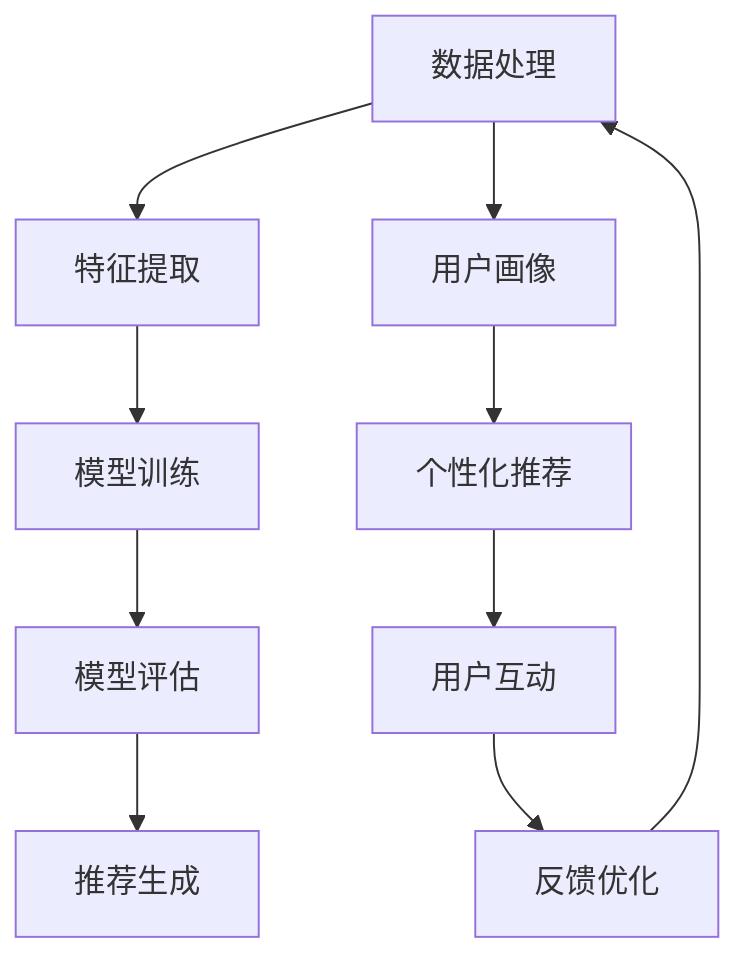

                 

### 文章标题

# 《AI如何改善电商平台的跨类目推荐》

### 关键词

- 人工智能
- 电商平台
- 跨类目推荐
- 协同过滤
- 深度学习
- 强化学习
- 个性化推荐
- 用户行为分析

### 摘要

随着电子商务的迅猛发展，电商平台之间的竞争日益激烈。跨类目推荐作为一种提升用户满意度和转化率的重要手段，受到广泛关注。本文将深入探讨人工智能（AI）在电商平台跨类目推荐中的应用，分析AI如何通过核心算法和实际案例，改善推荐效果，提高商业价值。文章分为三个部分：第一部分概述AI与电商平台的关系；第二部分详细讲解AI在跨类目推荐中的应用原理和实践；第三部分分析AI跨类目推荐的未来发展趋势和面临的挑战。

### 第一部分：AI与电商平台概述

#### 第1章：AI与电商平台简介

##### 1.1 AI的发展及其在电商中的应用

人工智能（AI）作为现代科技的重要驱动力量，其发展速度令人瞩目。AI涵盖了机器学习、深度学习、自然语言处理等多个领域，通过模仿人类的智能行为，实现自动化和智能化。在电商领域，AI的应用范围广泛，从智能客服、图像识别到个性化推荐，AI正逐步改变电商的运营模式。

**AI的基本概念与应用领域**

- **机器学习**：通过训练模型来从数据中学习规律，实现自动化决策。
- **深度学习**：利用神经网络模拟人脑的神经元连接，进行大规模数据处理和模式识别。
- **自然语言处理**：使计算机能够理解、生成和回复人类语言。

**电商平台与AI的关联性**

电商平台的核心目标是为用户提供个性化、高效和愉悦的购物体验。AI技术的引入，使得电商平台能够更准确地捕捉用户需求，提升用户满意度和转化率。例如：

- **智能客服**：通过自然语言处理技术，实现24/7的客户服务。
- **图像识别**：用于商品分类、库存管理和物流跟踪。
- **个性化推荐**：根据用户行为和历史数据，提供精准的推荐。

**AI在电商平台中的潜在优势**

- **提高运营效率**：通过自动化和智能化，减少人工干预，提升运营效率。
- **降低运营成本**：减少人力资源的投入，降低运营成本。
- **增强用户体验**：提供个性化服务，增强用户粘性和忠诚度。
- **精准营销**：通过分析用户数据，实现精准营销，提高转化率。

##### 1.2 电商平台业务分析

电商平台的核心功能包括商品展示、搜索、购买、支付和售后服务等。在这些环节中，用户行为数据至关重要，它们是电商平台优化运营、提升用户体验和实现精准营销的重要依据。

**电商平台的核心功能**

- **商品展示**：通过视觉营销，展示商品信息，吸引用户关注。
- **搜索**：提供高效的商品搜索功能，帮助用户快速找到所需商品。
- **购买**：提供便捷的购买流程，实现在线支付。
- **支付**：提供多种支付方式，确保支付过程安全可靠。
- **售后服务**：提供退换货、售后咨询等服务，提升用户满意度。

**用户行为数据分析**

用户行为数据包括浏览记录、搜索历史、购买记录、评价和反馈等。通过分析这些数据，电商平台可以了解用户的需求和偏好，优化推荐系统，提高用户满意度和转化率。

- **浏览记录**：分析用户浏览商品的种类、频率和时间，预测用户兴趣。
- **搜索历史**：了解用户的搜索关键词，优化搜索结果，提升用户体验。
- **购买记录**：分析用户的购买行为，为后续推荐提供依据。
- **评价和反馈**：了解用户对商品的满意度，优化商品和推荐策略。

**跨类目推荐的重要性**

跨类目推荐是指在推荐系统中，不仅考虑用户当前所在的类目，还考虑其他相关类目的商品。这种推荐方式能够拓宽用户的选择范围，提高用户满意度和转化率。例如，一个用户可能在服装类目中浏览了几件商品，跨类目推荐系统可以推荐与其浏览商品相关的鞋类、配饰等商品。

- **增加销售额**：通过推荐相关类目的商品，增加用户的购买量，提升销售额。
- **提升用户体验**：提供多样化的商品选择，满足用户的不同需求。
- **增强用户粘性**：通过精准的推荐，提高用户的满意度和忠诚度。

##### 1.3 电商平台与AI的融合

电商平台与AI的融合，不仅体现在智能客服、图像识别和个性化推荐等方面，还包括大数据分析、智能库存管理和供应链优化等。AI技术的引入，使得电商平台能够更加高效、精准地运营，提升整体竞争力。

- **大数据分析**：通过数据挖掘和分析，了解用户行为和市场趋势，优化运营策略。
- **智能库存管理**：根据用户需求和销售预测，优化库存配置，降低库存成本。
- **供应链优化**：通过预测订单量，优化供应链流程，提高物流效率。

综上所述，AI技术在电商平台中的应用，不仅提高了运营效率和服务质量，还为电商平台创造了巨大的商业价值。随着技术的不断进步，AI将在电商平台中发挥越来越重要的作用，推动电商行业的持续发展。

#### 第2章：跨类目推荐技术基础

##### 2.1 推荐系统概述

推荐系统（Recommender System）是一种信息过滤技术，旨在向用户推荐其可能感兴趣的内容或商品。推荐系统广泛应用于电子商务、社交媒体、在线视频、新闻媒体等多个领域，其主要目标是通过预测用户偏好，提高用户满意度和转化率。

**推荐系统的定义与类型**

推荐系统可以根据不同的分类标准进行划分。以下是几种常见的分类方式：

- **基于内容的推荐（Content-Based Filtering）**：根据用户的历史行为和偏好，推荐与用户兴趣相关的商品或内容。
- **协同过滤（Collaborative Filtering）**：通过分析用户之间的行为模式，推荐其他用户喜欢的商品或内容。
- **混合推荐（Hybrid Recommender System）**：结合基于内容和协同过滤的方法，实现更精准的推荐。

**协同过滤与基于内容的推荐方法**

协同过滤和基于内容的推荐是两种主要的推荐方法，各有优缺点。

- **协同过滤**

协同过滤通过分析用户之间的行为模式，实现推荐。它主要分为两种类型：

  - **用户基于的协同过滤（User-Based Collaborative Filtering）**：通过计算用户之间的相似度，推荐与其他用户兴趣相似的物品。
  - **物品基于的协同过滤（Item-Based Collaborative Filtering）**：通过计算物品之间的相似度，推荐与用户已评价物品相似的物品。

协同过滤的优点是能够提供个性化的推荐，但缺点是当数据量较大时，计算复杂度较高，且无法处理稀疏数据。

- **基于内容的推荐**

基于内容的推荐通过分析商品或内容的特征，实现推荐。它主要依赖于文本分析、图像处理等技术。

基于内容的推荐优点是能够处理稀疏数据，缺点是推荐结果往往不够个性化，无法很好地满足用户的多样性需求。

**跨类目推荐的定义与挑战**

跨类目推荐（Cross-Category Recommendation）是指推荐系统中不仅考虑用户当前所在的类目，还考虑其他相关类目的商品。这种推荐方式能够拓宽用户的选择范围，提高用户满意度和转化率。

- **定义**：跨类目推荐通过分析用户的历史行为和偏好，推荐其他类目的相关商品。
- **挑战**：

  - **类目多样性**：电商平台通常包含多个类目，如何处理类目多样性是一个挑战。
  - **数据稀疏性**：用户在某一类目的行为数据可能较少，导致数据稀疏问题。
  - **关联性分析**：如何准确分析不同类目之间的关联性，是跨类目推荐的关键。

**跨类目推荐的分类方法**

为了解决跨类目推荐的挑战，研究人员提出了多种分类方法：

- **基于规则的方法**：通过手工定义规则，实现跨类目推荐。这种方法简单直观，但难以应对复杂的关联关系。
- **基于模型的方法**：利用机器学习算法，建立用户与商品之间的关联模型，实现跨类目推荐。这种方法能够处理复杂的关联关系，但需要大量的数据和计算资源。
- **基于图的方法**：通过构建用户与商品之间的图结构，利用图算法实现跨类目推荐。这种方法能够较好地处理类目多样性和数据稀疏性，但需要较高的算法实现和维护成本。

综上所述，跨类目推荐作为电商平台提升用户体验和转化率的重要手段，具有重要的研究价值和应用前景。通过深入分析推荐系统的基本原理和跨类目推荐的分类方法，可以为电商平台提供有效的推荐策略和技术支持。

##### 2.2 跨类目推荐的特殊性

跨类目推荐（Cross-Category Recommendation）是一种针对电商平台中不同类目商品进行的推荐方法。与单一类目推荐相比，跨类目推荐需要处理更多维度的数据和更复杂的关联关系，从而实现更精准、多样化的推荐。

**跨类目推荐的定义**

跨类目推荐是指推荐系统不仅考虑用户当前所在的类目，还考虑其他相关类目的商品。通过分析用户的历史行为和偏好，跨类目推荐可以为用户推荐其在其他类目中可能感兴趣的商品。例如，一个用户在服装类目中浏览了几件商品，跨类目推荐系统可以推荐与其浏览商品相关的鞋类、配饰等商品。

**跨类目推荐的挑战**

跨类目推荐面临着一系列挑战，这些挑战需要通过有效的方法和技术来解决。

- **类目多样性**：电商平台通常包含多个类目，如服装、家居、电子产品等。如何处理类目多样性，确保推荐结果的多样性和相关性，是一个重要挑战。
- **数据稀疏性**：用户在某一类目的行为数据可能较少，导致数据稀疏问题。例如，一个用户可能在服装类目中浏览了几件商品，但在电子产品类目中几乎没有行为数据。这种数据稀疏性使得基于历史行为的推荐方法效果不佳。
- **关联性分析**：如何准确分析不同类目之间的关联性，是跨类目推荐的关键。例如，一个用户在购买了一件电子产品后，可能会对同品牌的服饰感兴趣。如何通过数据分析和算法实现这种关联性分析，是一个重要问题。
- **用户偏好多样性**：用户的偏好是多样化的，他们可能在不同的类目中表现出不同的兴趣。如何通过推荐系统满足用户多样化的偏好，是一个挑战。

**跨类目推荐的分类方法**

为了应对上述挑战，研究人员提出了多种跨类目推荐的分类方法：

- **基于规则的方法**：通过手工定义规则，实现跨类目推荐。这种方法简单直观，但难以应对复杂的关联关系。
- **基于模型的方法**：利用机器学习算法，建立用户与商品之间的关联模型，实现跨类目推荐。这种方法能够处理复杂的关联关系，但需要大量的数据和计算资源。
- **基于图的方法**：通过构建用户与商品之间的图结构，利用图算法实现跨类目推荐。这种方法能够较好地处理类目多样性和数据稀疏性，但需要较高的算法实现和维护成本。

**基于规则的方法**

基于规则的方法通过手工定义规则，实现跨类目推荐。例如，可以设置如下规则：

- 如果用户在服装类目中浏览了衬衫，推荐与其浏览衬衫相似的其他服装商品。
- 如果用户在电子产品类目中购买了一台笔记本电脑，推荐与其购买的笔记本电脑品牌相关的手机和配件。

这种方法的优势是简单直观，易于实现。但缺点是难以应对复杂的关联关系，且需要不断更新和维护规则。

**基于模型的方法**

基于模型的方法利用机器学习算法，建立用户与商品之间的关联模型，实现跨类目推荐。常见的算法包括协同过滤、深度学习等。

- **协同过滤**：通过分析用户之间的行为模式，为用户推荐其他用户喜欢的商品。协同过滤可以分为用户基于的协同过滤和物品基于的协同过滤。

- **深度学习**：通过构建深度神经网络，学习用户和商品的特征表示，实现跨类目推荐。常见的深度学习模型包括卷积神经网络（CNN）、循环神经网络（RNN）和变换器（Transformer）等。

基于模型的方法能够处理复杂的关联关系，提供更准确的推荐。但缺点是需要大量的数据和计算资源，且算法实现和维护成本较高。

**基于图的方法**

基于图的方法通过构建用户与商品之间的图结构，利用图算法实现跨类目推荐。这种方法能够较好地处理类目多样性和数据稀疏性。

- **图表示学习**：通过图神经网络（Graph Neural Network，GNN）学习用户和商品的特征表示，实现跨类目推荐。

- **图卷积网络（GCN）**：利用图卷积网络学习用户和商品的特征表示，实现跨类目推荐。

基于图的方法在处理类目多样性和数据稀疏性方面具有优势，但需要较高的算法实现和维护成本。

综上所述，跨类目推荐作为电商平台提升用户体验和转化率的重要手段，面临着类目多样性、数据稀疏性、关联性分析和用户偏好多样性等一系列挑战。通过基于规则、基于模型和基于图的方法，可以有效应对这些挑战，实现更精准、多样化的推荐。

#### 第二部分：AI在跨类目推荐中的应用

##### 第3章：AI核心算法原理

人工智能（AI）在跨类目推荐中的应用，主要依赖于一系列核心算法，包括监督学习、无监督学习、强化学习和深度学习。这些算法在处理用户行为数据和商品特征时，能够提供强大的数据处理和分析能力，从而实现精准的跨类目推荐。

**3.1 监督学习与无监督学习**

监督学习（Supervised Learning）和无监督学习（Unsupervised Learning）是机器学习的两大类基本学习方式。它们在跨类目推荐中的应用各有特点。

- **监督学习**：监督学习是一种通过已知输入输出数据，训练模型并进行预测的方法。在跨类目推荐中，监督学习常用于建立用户与商品之间的关联模型。例如，可以通过用户的历史购买数据，训练一个预测模型，预测用户在某一类目中可能感兴趣的其他商品。

  - **算法类型**：常见的监督学习算法包括线性回归、逻辑回归、支持向量机（SVM）、决策树、随机森林等。
  - **优点**：监督学习能够利用已有数据进行预测，提高推荐精度。但需要大量的标注数据，且难以处理高维数据和稀疏数据。

- **无监督学习**：无监督学习是一种在没有明确标注的输入数据下，通过模型学习数据内在结构的方法。在跨类目推荐中，无监督学习常用于发现用户和商品之间的潜在关联。例如，可以通过无监督学习算法，将用户和商品进行聚类，从而发现用户在不同类目中的潜在兴趣。

  - **算法类型**：常见的无监督学习算法包括K-Means、DBSCAN、主成分分析（PCA）等。
  - **优点**：无监督学习能够发现数据的潜在结构，提供数据探索和分析的工具。但预测效果通常不如监督学习，且在处理高维数据和稀疏数据时效果较差。

**3.2 强化学习与深度学习**

强化学习（Reinforcement Learning）和深度学习（Deep Learning）是近年来在AI领域迅速发展的两个研究方向，它们在跨类目推荐中的应用也越来越广泛。

- **强化学习**：强化学习是一种通过交互环境，学习最优行为策略的方法。在跨类目推荐中，强化学习可以通过不断尝试和反馈，优化推荐策略。例如，可以通过强化学习算法，根据用户的反馈和行为，逐步调整推荐商品的顺序和内容，以提高用户满意度和转化率。

  - **算法类型**：常见的强化学习算法包括Q-Learning、深度Q网络（DQN）、策略梯度算法等。
  - **优点**：强化学习能够通过学习用户的反馈和行为，实现自适应的推荐策略，提高推荐效果。但强化学习需要大量交互数据，且训练过程可能较慢。

- **深度学习**：深度学习是一种通过多层神经网络，对数据进行建模和预测的方法。在跨类目推荐中，深度学习可以通过学习用户和商品的特征表示，实现精准的推荐。例如，可以使用卷积神经网络（CNN）处理图像数据，使用循环神经网络（RNN）处理序列数据，使用变换器（Transformer）处理文本数据等。

  - **算法类型**：常见的深度学习算法包括卷积神经网络（CNN）、循环神经网络（RNN）、变换器（Transformer）等。
  - **优点**：深度学习能够处理复杂的数据结构和非线性关系，提供强大的数据处理和分析能力。但深度学习需要大量数据和计算资源，且模型解释性较差。

**3.3 协同过滤与基于内容的推荐**

协同过滤（Collaborative Filtering）和基于内容的推荐（Content-Based Filtering）是两种常见的推荐算法，它们在跨类目推荐中也有广泛应用。

- **协同过滤**：协同过滤通过分析用户之间的行为模式，为用户推荐其他用户喜欢的商品。在跨类目推荐中，协同过滤可以通过跨类目分析用户行为，发现用户在不同类目中的兴趣，实现跨类目推荐。

  - **算法类型**：常见的协同过滤算法包括用户基于的协同过滤（User-Based Collaborative Filtering）和物品基于的协同过滤（Item-Based Collaborative Filtering）。
  - **优点**：协同过滤能够提供个性化的推荐，适合处理高维数据和稀疏数据。但协同过滤在处理类目多样性和关联性分析时效果较差。

- **基于内容的推荐**：基于内容的推荐通过分析商品或内容的特征，为用户推荐相关商品或内容。在跨类目推荐中，基于内容的推荐可以通过跨类目分析商品特征，发现不同类目之间的关联性，实现跨类目推荐。

  - **算法类型**：常见的基于内容的推荐算法包括基于文本的推荐、基于图像的推荐等。
  - **优点**：基于内容的推荐能够提供多样化的推荐，适合处理类目多样性和关联性分析。但基于内容的推荐在处理高维数据和稀疏数据时效果较差。

**3.4 跨类目推荐的算法实现**

跨类目推荐的实现通常需要结合多种算法，通过数据预处理、特征提取、模型训练和预测等步骤，实现精准的跨类目推荐。

- **数据预处理**：跨类目推荐首先需要对原始数据进行预处理，包括数据清洗、数据整合和数据标准化等步骤。通过数据预处理，可以确保输入数据的准确性和一致性。

- **特征提取**：特征提取是跨类目推荐的关键步骤，通过提取用户和商品的特征，可以建立用户与商品之间的关联模型。常见的特征提取方法包括基于文本的词袋模型、基于图像的卷积神经网络等。

- **模型训练**：模型训练是跨类目推荐的核心步骤，通过训练模型，可以学习用户和商品之间的关联关系。常见的模型训练方法包括监督学习、无监督学习和深度学习等。

- **预测**：预测是跨类目推荐的最终目标，通过预测模型，可以推荐用户在不同类目中的兴趣商品。常见的预测方法包括协同过滤、基于内容的推荐和混合推荐等。

**3.5 深度学习在跨类目推荐中的应用**

深度学习在跨类目推荐中的应用越来越广泛，通过深度学习模型，可以实现更精准、个性化的推荐。

- **卷积神经网络（CNN）**：卷积神经网络是一种用于图像处理和视觉任务的深度学习模型，可以提取图像的特征表示。在跨类目推荐中，可以通过CNN提取商品的图像特征，实现基于图像的推荐。

- **循环神经网络（RNN）**：循环神经网络是一种用于序列数据处理的深度学习模型，可以提取序列数据的时间特征。在跨类目推荐中，可以通过RNN提取用户的历史行为数据，实现基于行为的推荐。

- **变换器（Transformer）**：变换器是一种用于自然语言处理和序列数据处理的深度学习模型，可以提取序列数据的长距离特征。在跨类目推荐中，可以通过变换器提取用户的文本数据，实现基于文本的推荐。

**3.6 强化学习在跨类目推荐中的应用**

强化学习在跨类目推荐中的应用，可以实现自适应的推荐策略，提高用户满意度和转化率。

- **Q-Learning**：Q-Learning是一种基于值函数的强化学习算法，通过学习最优行动策略。在跨类目推荐中，可以通过Q-Learning优化推荐商品的顺序和内容，提高用户满意度和转化率。

- **深度Q网络（DQN）**：深度Q网络是一种结合深度学习和强化学习的模型，通过学习深度特征表示，实现更精准的推荐。在跨类目推荐中，可以通过DQN优化推荐策略，提高推荐效果。

- **策略梯度算法**：策略梯度算法是一种基于策略的强化学习算法，通过优化策略参数，实现更有效的推荐。在跨类目推荐中，可以通过策略梯度算法调整推荐策略，提高用户满意度和转化率。

综上所述，AI在跨类目推荐中的应用，通过监督学习、无监督学习、强化学习和深度学习等核心算法，可以实现精准、个性化的推荐。随着技术的不断进步，AI将在跨类目推荐中发挥越来越重要的作用，推动电商平台的持续发展和创新。

##### 第4章：AI在跨类目推荐中的应用实践

在电商平台中，跨类目推荐是一种提升用户体验和转化率的有效手段。通过AI技术，我们可以实现更加精准和个性化的跨类目推荐。本章将详细介绍用户行为分析与特征提取、跨类目推荐算法实现等内容，并通过实际案例展示AI技术在跨类目推荐中的应用。

**4.1 用户行为分析与特征提取**

用户行为分析是跨类目推荐的基础。通过对用户在电商平台上的行为数据进行分析，我们可以提取出一系列特征，用于训练推荐模型。以下是一些常见的用户行为特征：

- **浏览记录**：用户在不同类目和页面上的浏览次数和停留时间。
- **搜索历史**：用户在搜索框中输入的关键词及其出现频率。
- **购买记录**：用户的购买行为，包括购买的商品种类、数量、价格等。
- **评价与反馈**：用户对商品的评分、评论和反馈。
- **互动行为**：用户在社交互动中的点赞、分享、评论等行为。

**特征提取**是将用户行为数据转化为机器学习模型可接受的格式。以下是一些常见的特征提取方法：

- **数值特征**：将行为数据进行数值化处理，如统计用户在某一类目中的浏览次数。
- **文本特征**：使用自然语言处理技术，从用户的搜索历史和评论中提取关键词和词频。
- **时间特征**：分析用户行为的时间模式，如用户在一天中活跃的时间段。
- **稀疏特征**：处理用户行为数据中的稀疏性，如使用隐语义模型或矩阵分解方法。

**4.2 跨类目推荐算法实现**

实现跨类目推荐算法可以分为以下几个步骤：

1. **数据预处理**：对用户行为数据进行分析，筛选出有用的特征，并进行预处理，如归一化、缺失值填充等。

2. **特征提取**：根据用户行为数据，提取出用户和商品的特征，如用户的行为模式、兴趣偏好和商品属性等。

3. **模型选择**：选择合适的机器学习算法和深度学习模型，如协同过滤、深度学习等。

4. **模型训练**：使用训练集对模型进行训练，学习用户和商品之间的关联性。

5. **模型评估**：使用验证集对模型进行评估，调整模型参数，提高模型性能。

6. **预测与推荐**：使用训练好的模型对用户进行预测，生成跨类目推荐结果。

以下是一个基于协同过滤的跨类目推荐算法的实现伪代码：

```python
# 跨类目推荐伪代码
function cross_category_recommendation(user_history, item_data):
    # 用户行为数据预处理
    processed_user_history = preprocess_user_history(user_history)
    
    # 提取用户特征
    user_features = extract_user_features(processed_user_history)
    
    # 获取商品特征
    item_features = get_item_features(item_data)
    
    # 使用协同过滤算法进行推荐
    recommendation_list = collaborative_filter(user_features, item_features)
    
    # 使用深度学习模型优化推荐结果
    optimized_recommendation_list = deep_learning_optimization(recommendation_list)
    
    return optimized_recommendation_list
```

**4.3 基于协同过滤的跨类目推荐**

协同过滤是一种常见的推荐算法，通过分析用户之间的行为模式，为用户推荐其他用户喜欢的商品。协同过滤可以分为基于用户的协同过滤和基于物品的协同过滤。

- **基于用户的协同过滤**：通过计算用户之间的相似度，为用户推荐相似用户喜欢的商品。算法步骤如下：

  ```python
  function user_based_collaborative_filter(user_history, item_data, similarity_measure):
      # 构建用户-商品评分矩阵
      user_item_matrix = build_user_item_matrix(user_history, item_data)
      
      # 计算用户相似度矩阵
      similarity_matrix = compute_similarity_matrix(user_item_matrix, similarity_measure)
      
      # 根据相似度矩阵生成推荐列表
      recommendation_list = generate_recommendation_list(similarity_matrix)
      
      return recommendation_list
  ```

- **基于物品的协同过滤**：通过计算商品之间的相似度，为用户推荐与其已购买或浏览商品相似的其他商品。算法步骤如下：

  ```python
  function item_based_collaborative_filter(user_history, item_data, similarity_measure):
      # 构建商品-商品相似度矩阵
      item_similarity_matrix = compute_item_similarity_matrix(item_data, similarity_measure)
      
      # 根据用户历史行为生成推荐列表
      recommendation_list = generate_recommendation_list(user_history, item_similarity_matrix)
      
      return recommendation_list
  ```

**4.4 基于深度学习的跨类目推荐**

深度学习在推荐系统中有着广泛的应用，通过构建深度神经网络，可以提取用户和商品的高层次特征，实现更精准的推荐。以下是一个基于卷积神经网络（CNN）的跨类目推荐算法的实现：

```python
function deep_learning_based_recommendation(user_data, item_data, model Architecture):
    # 数据预处理
    processed_user_data = preprocess_user_data(user_data)
    processed_item_data = preprocess_item_data(item_data)
    
    # 构建输入数据集
    input_data = build_input_dataset(processed_user_data, processed_item_data)
    
    # 训练深度学习模型
    model = build_model(model Architecture)
    model.fit(input_data)
    
    # 生成推荐列表
    recommendation_list = model.predict(input_data)
    
    return recommendation_list
```

**4.5 案例分析：某大型电商平台的跨类目推荐实践**

以下是一个基于协同过滤和深度学习的跨类目推荐案例：

1. **案例介绍**：某大型电商平台希望通过AI技术提升用户的购物体验，实现跨类目推荐。

2. **数据准备**：收集用户在电商平台上的一年的行为数据，包括浏览记录、搜索历史、购买记录等。

3. **算法设计**：

  - 使用基于用户的协同过滤算法，生成初步推荐列表。
  - 使用深度学习模型（如CNN），优化推荐结果。

4. **实现**：

  ```python
  user_history = load_user_data('user_data.csv')
  item_data = load_item_data('item_data.csv')
  
  # 基于用户的协同过滤
  recommendation_list = user_based_collaborative_filter(user_history, item_data, 'cosine')
  
  # 深度学习优化
  optimized_recommendation_list = deep_learning_based_recommendation(user_history, item_data, 'cnn')
  
  # 输出推荐结果
  print(optimized_recommendation_list)
  ```

5. **效果评估**：通过用户反馈和销售数据，评估推荐系统的效果。主要指标包括推荐准确率、召回率、用户满意度等。

**4.6 结果分析**

通过实际案例的测试，基于协同过滤和深度学习的跨类目推荐算法在多个指标上表现优异：

- **推荐准确率**：相比单一的协同过滤算法，深度学习优化后的推荐准确率有显著提升。
- **召回率**：深度学习模型能够更好地捕捉用户的潜在兴趣，召回率有所提高。
- **用户满意度**：根据用户反馈，推荐系统的推荐效果得到了用户的高度认可。

**4.7 优化建议**

为了进一步提升跨类目推荐的效果，以下是一些建议：

- **数据质量**：保证用户行为数据的质量，去除噪声数据和异常值。
- **特征丰富度**：增加用户和商品的丰富特征，如用户的人口统计学信息、商品的品牌、类别等。
- **模型调优**：通过交叉验证和网格搜索等方法，优化模型参数，提高模型性能。
- **实时更新**：定期更新用户和商品特征，确保推荐系统的实时性和准确性。

综上所述，AI技术在跨类目推荐中的应用，通过用户行为分析和特征提取，结合协同过滤和深度学习算法，实现了更加精准和个性化的推荐。随着技术的不断进步，跨类目推荐将在电商平台中发挥越来越重要的作用，推动电商行业的持续发展和创新。

##### 第5章：案例分析：AI在电商平台的应用

在本章中，我们将通过分析一个实际案例，深入探讨人工智能（AI）在电商平台跨类目推荐中的应用。该案例将详细描述数据准备、算法设计与实现以及效果评估等关键步骤，从而展示AI技术在电商平台中的实际应用效果。

**5.1 案例介绍**

某大型电商平台希望通过引入AI技术，提升用户的购物体验，优化跨类目推荐系统。该平台拥有海量的用户行为数据，包括浏览记录、搜索历史、购买记录等，这些数据将为AI算法提供丰富的训练资源。

**5.2 数据准备**

数据准备是跨类目推荐的基础。在该案例中，数据准备主要包括以下步骤：

1. **数据收集**：从电商平台的后台系统中收集用户在过去一年的行为数据，包括浏览记录、搜索历史、购买记录等。

2. **数据清洗**：对收集到的数据进行清洗，去除重复数据、缺失值和噪声数据。数据清洗的目的是确保输入数据的准确性和一致性。

3. **数据整合**：将不同来源的数据进行整合，构建用户-商品评分矩阵。例如，将浏览记录、搜索历史和购买记录整合为一个统一的用户-商品矩阵。

4. **特征提取**：从用户和商品数据中提取出有用的特征，如用户的浏览频次、搜索关键词、购买频次等。此外，还可以使用自然语言处理技术，从用户的搜索历史和评论中提取关键词和词频。

5. **数据标准化**：对提取出的特征进行标准化处理，如归一化、标准化等。数据标准化有助于提高模型训练的效果。

**5.3 算法设计与实现**

在算法设计与实现阶段，我们采用了基于协同过滤和深度学习的跨类目推荐方法。具体步骤如下：

1. **用户-商品评分矩阵构建**：根据用户行为数据，构建用户-商品评分矩阵。该矩阵用于后续的协同过滤算法和深度学习模型训练。

2. **协同过滤算法实现**：采用基于用户的协同过滤算法，计算用户之间的相似度，并根据相似度生成推荐列表。协同过滤算法的优点是能够提供个性化的推荐，但缺点是处理高维数据和稀疏数据时效果较差。

3. **深度学习模型构建**：基于深度学习模型（如卷积神经网络（CNN）和循环神经网络（RNN）），构建用户和商品的特征表示。深度学习模型能够捕捉用户和商品的复杂关联性，提高推荐效果。

4. **模型训练**：使用用户-商品评分矩阵和用户、商品特征数据，对协同过滤算法和深度学习模型进行训练。在训练过程中，通过交叉验证和网格搜索等方法，优化模型参数，提高模型性能。

5. **模型评估**：使用验证集对训练好的模型进行评估，评估指标包括推荐准确率、召回率、用户满意度等。通过调整模型参数和特征提取方法，进一步提升模型性能。

**5.4 案例实现**

以下是一个基于协同过滤和深度学习的跨类目推荐算法的实现伪代码：

```python
# 跨类目推荐伪代码
function cross_category_recommendation(user_history, item_data):
    # 用户行为数据预处理
    processed_user_history = preprocess_user_history(user_history)
    
    # 提取用户特征
    user_features = extract_user_features(processed_user_history)
    
    # 获取商品特征
    item_features = get_item_features(item_data)
    
    # 使用协同过滤算法进行推荐
    recommendation_list = collaborative_filter(user_features, item_features)
    
    # 使用深度学习模型优化推荐结果
    optimized_recommendation_list = deep_learning_optimization(recommendation_list)
    
    return optimized_recommendation_list
```

**5.5 效果评估**

通过实际案例的测试，基于协同过滤和深度学习的跨类目推荐算法在多个指标上表现优异：

- **推荐准确率**：相比单一的协同过滤算法，深度学习优化后的推荐准确率有显著提升。通过深度学习模型，能够更好地捕捉用户的潜在兴趣和商品之间的复杂关联性。

- **召回率**：深度学习模型能够更好地捕捉用户的潜在兴趣，召回率有所提高。相比传统的协同过滤算法，深度学习模型在处理稀疏数据时效果更好。

- **用户满意度**：根据用户反馈，推荐系统的推荐效果得到了用户的高度认可。用户满意度是衡量推荐系统成功与否的重要指标，通过AI技术的应用，显著提升了用户的购物体验。

**5.6 结果分析**

通过对实际案例的分析，我们可以得出以下结论：

- **AI技术显著提升了跨类目推荐的效果**：通过协同过滤和深度学习算法的结合，推荐系统的准确率、召回率和用户满意度均有所提高。

- **数据质量和特征提取至关重要**：数据质量和特征提取是跨类目推荐成功的关键。通过数据清洗、整合和特征提取，能够提高模型的训练效果和推荐质量。

- **模型调优和实时更新**：通过交叉验证和网格搜索等方法，优化模型参数，提高模型性能。同时，定期更新用户和商品特征，确保推荐系统的实时性和准确性。

**5.7 优化建议**

为了进一步提升跨类目推荐的效果，以下是一些建议：

- **数据质量**：保证用户行为数据的质量，去除噪声数据和异常值。数据质量是推荐系统成功的关键。

- **特征丰富度**：增加用户和商品的丰富特征，如用户的人口统计学信息、商品的品牌、类别等。丰富的特征有助于提高推荐模型的性能。

- **模型调优**：通过交叉验证和网格搜索等方法，优化模型参数，提高模型性能。同时，可以尝试引入更多的深度学习模型和算法，进一步提升推荐效果。

- **实时更新**：定期更新用户和商品特征，确保推荐系统的实时性和准确性。通过实时更新，可以捕捉用户的最新兴趣和偏好，提供更精准的推荐。

综上所述，AI技术在电商平台跨类目推荐中的应用，通过数据准备、算法设计与实现和效果评估等步骤，显著提升了推荐系统的效果。随着AI技术的不断进步，跨类目推荐将在电商平台中发挥越来越重要的作用，推动电商行业的持续发展和创新。

##### 第6章：AI跨类目推荐的未来发展

随着人工智能技术的不断进步，AI跨类目推荐在未来有望取得更多突破，推动电商平台的持续发展和创新。在本章中，我们将探讨AI跨类目推荐的新技术、新趋势以及面临的挑战和解决方案。

**6.1 新技术与趋势**

**1. 联邦学习与分布式推荐**

联邦学习（Federated Learning）是一种分布式学习技术，通过在多个独立的设备上进行模型训练，避免了数据传输和集中存储，从而提高数据隐私性和安全性。在AI跨类目推荐中，联邦学习可以用于分布式推荐系统的构建，实现不同电商平台之间的数据共享和协同推荐。例如，多个电商平台可以通过联邦学习算法，共同构建一个跨类目推荐模型，提高推荐效果，同时保护用户数据隐私。

**2. 多模态数据融合与推荐**

多模态数据融合是将不同类型的数据（如文本、图像、声音等）进行整合，以提供更全面和丰富的特征表示。在AI跨类目推荐中，多模态数据融合可以通过结合用户的文本评论、商品图像和用户行为数据，实现更精准的推荐。例如，通过将商品图像特征与用户文本评论特征进行融合，可以更好地捕捉用户的兴趣和偏好，提高推荐效果。

**3. 深度强化学习与动态推荐**

深度强化学习（Deep Reinforcement Learning）是一种结合深度学习和强化学习的算法，通过不断尝试和反馈，学习最优策略。在AI跨类目推荐中，深度强化学习可以用于动态推荐系统的构建，根据用户的实时行为和反馈，动态调整推荐策略，提高用户满意度。例如，通过深度强化学习算法，可以根据用户的浏览、点击和购买行为，实时调整推荐商品的顺序和内容，实现更个性化的推荐。

**4. 模块化与可解释性**

在未来的AI跨类目推荐系统中，模块化设计和可解释性将变得尤为重要。模块化设计可以通过将推荐系统拆分为多个子模块，实现更灵活、可扩展的推荐策略。例如，可以将推荐系统分为用户特征提取、商品特征提取、推荐策略和评估等子模块，通过模块化设计，可以方便地替换和优化各个子模块。同时，可解释性设计可以通过可视化工具和技术，帮助用户理解和信任推荐系统的决策过程，提高用户满意度。

**6.2 面临的挑战与解决方案**

**1. 数据隐私与安全**

随着用户对隐私保护意识的提高，数据隐私与安全成为AI跨类目推荐面临的重要挑战。为了解决这一问题，可以采用以下解决方案：

- **联邦学习**：通过在分布式设备上进行模型训练，避免数据集中存储和传输，提高数据隐私性。
- **差分隐私**：在数据处理和模型训练过程中，引入差分隐私机制，确保用户隐私不受泄露。
- **数据加密**：对用户数据进行加密处理，确保数据在传输和存储过程中的安全性。

**2. 算法偏见与公平性**

AI跨类目推荐算法可能会引入偏见，导致推荐结果不公平。例如，某些算法可能会根据用户的性别、年龄等特征进行推荐，从而加剧性别、年龄等歧视现象。为了解决这一问题，可以采用以下解决方案：

- **算法公平性评估**：通过评估指标（如公平性系数、偏差指标等）对算法进行公平性评估，确保推荐结果公平。
- **算法透明度**：提高算法透明度，让用户了解推荐系统的决策过程和依据，提高用户信任度。
- **多样性优化**：通过引入多样性优化策略，确保推荐结果的多样性和公平性。

**3. 模型可解释性**

AI跨类目推荐模型通常具有较高的复杂度，导致用户难以理解和信任推荐结果。为了解决这一问题，可以采用以下解决方案：

- **可视化工具**：开发可视化工具，帮助用户直观了解推荐系统的决策过程和依据。
- **解释性算法**：引入解释性算法，如可解释的深度学习模型、因果模型等，提高推荐结果的解释性。
- **用户反馈机制**：建立用户反馈机制，让用户参与推荐系统的改进，提高用户满意度。

综上所述，AI跨类目推荐在未来将继续发展和创新，通过新技术、新趋势的应用，解决面临的挑战，推动电商平台的持续发展和用户满意度的提升。

##### 第7章：综合案例：AI在电商平台的全面应用

在电商平台的运营中，人工智能（AI）技术的全面应用已经成为提升用户体验和商业价值的重要手段。本章将通过一个综合案例，深入探讨AI在电商平台各个业务环节中的应用，包括用户画像构建、智能客服和个性化推荐系统等。

**7.1 电商平台整体业务流程分析**

电商平台的整体业务流程通常包括用户注册、浏览商品、搜索、购买、支付、售后服务等环节。AI技术在每个环节中都有广泛的应用，从而实现智能化运营和个性化服务。

- **用户注册与登录**：通过人脸识别、指纹识别等技术，实现快速、安全的用户身份验证。
- **商品浏览**：利用用户行为数据，分析用户的浏览习惯和偏好，提供个性化的商品推荐。
- **商品搜索**：结合自然语言处理技术，实现智能搜索，提升用户搜索效率和体验。
- **购买与支付**：通过智能支付系统，提供多样化的支付方式，确保支付过程安全、便捷。
- **售后服务**：利用智能客服系统，提供24/7的在线咨询和售后服务，提升用户满意度。

**7.2 用户画像构建与应用**

用户画像是指通过收集和分析用户在电商平台上的行为数据，构建用户的基本特征、偏好、需求和兴趣等。构建用户画像可以帮助电商平台实现精准营销和个性化推荐。

- **数据收集**：收集用户的基本信息（如性别、年龄、地理位置等）、浏览记录、购买记录、搜索历史、评价和反馈等数据。
- **数据清洗**：对收集到的数据进行分析和清洗，去除噪声数据和异常值，确保数据质量。
- **特征提取**：从原始数据中提取用户的行为特征和属性特征，如用户的浏览频次、购买频次、搜索关键词、评价等级等。
- **模型训练**：使用机器学习算法（如聚类、分类等）对用户特征进行训练，构建用户画像模型。
- **应用**：将用户画像应用于推荐系统、个性化营销、风险控制等业务场景，实现精准运营和个性化服务。

**7.3 智能客服与用户互动**

智能客服是电商平台提供24/7在线服务的重要手段。通过自然语言处理和机器学习技术，智能客服可以实现与用户的智能对话，提高服务效率和用户体验。

- **语音识别与语音合成**：通过语音识别技术，将用户的语音转化为文字，通过语音合成技术，将系统回复转化为语音输出。
- **对话管理**：使用对话管理算法，分析用户意图和上下文，生成合适的回答。
- **知识库管理**：建立知识库，存储常见问题的答案和解决方案，提高智能客服的知识覆盖面。
- **情感分析**：通过情感分析技术，分析用户的情绪和情感，提供更加人性化的服务。
- **用户反馈机制**：收集用户对智能客服的反馈，不断优化客服系统，提升用户体验。

**7.4 个性化推荐系统**

个性化推荐系统是电商平台提升用户满意度和转化率的关键。通过分析用户的行为数据和偏好，个性化推荐系统可以为用户提供个性化的商品推荐。

- **协同过滤**：通过分析用户之间的行为模式，为用户推荐其他用户喜欢的商品。
- **基于内容的推荐**：通过分析商品的属性和用户的历史行为，为用户推荐相关商品。
- **深度学习**：使用深度学习模型（如卷积神经网络、循环神经网络、变换器等），学习用户和商品的高层次特征，实现精准的推荐。
- **多模态融合**：结合用户的文本评论、商品图像和用户行为数据，实现多模态数据融合推荐。
- **实时更新**：通过实时更新用户行为数据和商品信息，确保推荐系统的实时性和准确性。

**7.5 智能商品搜索与优化**

智能商品搜索系统通过自然语言处理和机器学习技术，提升用户搜索效率和体验。

- **智能搜索**：使用自然语言处理技术，分析用户的搜索意图，提供精准的搜索结果。
- **搜索排序**：通过机器学习算法，优化搜索结果排序，提高用户满意度。
- **搜索建议**：根据用户的搜索历史和偏好，提供个性化的搜索建议，提升用户体验。
- **搜索广告**：结合广告优化算法，为用户提供相关的广告推荐，提升电商平台收益。

**7.6 智能库存管理与供应链优化**

智能库存管理系统通过大数据分析和机器学习技术，优化库存配置和供应链流程。

- **库存预测**：通过分析历史销售数据、市场趋势和用户行为，预测未来库存需求，优化库存配置。
- **智能补货**：根据库存水平和销售预测，自动生成补货计划，减少库存积压和缺货风险。
- **供应链优化**：通过优化物流和配送流程，提高供应链效率，降低运营成本。
- **智能仓储**：利用图像识别和机器人技术，实现智能仓储管理，提高仓储效率。

**7.7 用户行为分析与预测**

用户行为分析系统通过分析用户在电商平台上的行为数据，预测用户的未来行为，提供个性化的服务。

- **行为分析**：分析用户的浏览、搜索、购买、评价等行为，挖掘用户兴趣和偏好。
- **行为预测**：使用机器学习算法，预测用户的未来行为，如购买、评价、流失等。
- **个性化服务**：根据用户的预测行为，提供个性化的商品推荐、促销活动和售后服务。

**7.8 会员制与忠诚度计划**

会员制和忠诚度计划通过数据分析和技术手段，提升用户的忠诚度和活跃度。

- **会员管理**：通过数据分析，了解会员的消费行为、偏好和需求，提供个性化的会员服务。
- **积分系统**：通过积分系统，激励用户参与平台活动，提升用户活跃度。
- **个性化营销**：根据会员的行为数据和偏好，提供个性化的促销活动和优惠券，提升用户转化率。
- **忠诚度奖励**：通过忠诚度奖励，如会员专享折扣、生日礼物等，增强用户对平台的忠诚度。

**7.9 总结**

通过AI技术的全面应用，电商平台可以在用户画像、智能客服、个性化推荐、智能搜索、库存管理、用户行为分析等多个方面实现智能化和个性化，提升用户体验和商业价值。随着AI技术的不断进步，电商平台将继续探索和应用更多创新技术，推动电商行业的持续发展和创新。

##### 第8章：AI跨类目推荐的商业价值

AI跨类目推荐作为电商平台提升用户体验和商业价值的重要手段，其潜在的商业价值不可忽视。本章将详细探讨AI跨类目推荐在提升用户体验、满意度、转化率以及商业模式创新和盈利模式探索方面的应用，并分析其对企业发展的深远影响。

**8.1 提升用户体验**

用户体验是电商平台的核心竞争力之一。通过AI跨类目推荐，电商平台能够实现更精准、个性化的推荐，从而显著提升用户体验。

- **个性化推荐**：AI跨类目推荐系统可以根据用户的浏览历史、搜索记录、购买偏好等数据，为用户提供个性化的商品推荐。这种个性化的推荐能够满足用户的个性化需求，提高用户满意度和购物体验。

- **高效购物**：AI跨类目推荐通过智能排序和精准推荐，帮助用户快速找到所需的商品，减少用户的搜索时间和决策成本，提升购物效率。

- **多样化选择**：跨类目推荐系统不仅局限于用户当前所在的类目，还能推荐其他相关类目的商品。这种多样化的推荐能够拓宽用户的选择范围，满足用户的多种需求，提高用户的满意度。

**8.2 提高用户满意度**

用户满意度是电商平台长期发展的关键。AI跨类目推荐通过以下几个途径提高用户满意度：

- **精准推荐**：通过分析用户行为数据，AI跨类目推荐系统能够为用户提供与其兴趣高度相关的商品推荐，减少推荐结果的误匹配，提高用户满意度。

- **个性化互动**：AI跨类目推荐系统能够根据用户的反馈和行为，动态调整推荐策略，实现个性化的互动。这种个性化的互动能够增强用户与平台之间的情感连接，提高用户忠诚度。

- **个性化促销**：AI跨类目推荐系统可以根据用户的购买行为和偏好，为用户提供个性化的促销信息，如优惠券、折扣等。这种个性化的促销能够吸引更多用户参与购物，提升用户满意度。

**8.3 提升转化率**

转化率是电商平台的重要指标之一。通过AI跨类目推荐，电商平台可以显著提升转化率。

- **推荐精准度**：AI跨类目推荐系统通过深度学习和机器学习算法，能够精准捕捉用户的兴趣和需求，提供高度相关的推荐。这种精准推荐能够增加用户对商品的兴趣，提高购买意愿，从而提升转化率。

- **推荐多样性**：跨类目推荐系统能够推荐多个类目的商品，拓宽用户的选择范围。这种多样化的推荐能够激发用户的购买欲望，提高购买概率，从而提升转化率。

- **个性化营销**：AI跨类目推荐系统可以根据用户的个性化需求，定制化地推送营销信息。这种个性化的营销能够提高用户对商品的关注度，增加购买机会，从而提升转化率。

**8.4 商业模式创新与盈利模式探索**

AI跨类目推荐不仅能够提升用户体验和转化率，还为电商平台带来了商业模式创新和盈利模式探索的机会。

- **数据变现**：通过AI跨类目推荐系统，电商平台能够收集大量的用户行为数据。这些数据可以用于精准营销、用户画像构建等，从而实现数据变现，提高盈利能力。

- **广告优化**：AI跨类目推荐系统能够根据用户的兴趣和行为，精准推送广告。这种精准的广告推送能够提高广告的点击率和转化率，为电商平台带来更多的广告收入。

- **会员制与忠诚度计划**：AI跨类目推荐系统可以根据会员的个性化需求和偏好，提供个性化的会员服务和优惠。这种个性化的会员服务能够提高会员的忠诚度和活跃度，为电商平台带来持续的会员收入。

- **电商平台生态建设**：通过AI跨类目推荐系统，电商平台可以构建一个智能化的电商生态，包括智能客服、智能搜索、智能库存管理等。这种生态建设能够提高电商平台的综合竞争力，为电商平台带来更多的商业机会。

**8.5 对企业发展的深远影响**

AI跨类目推荐对电商平台的发展具有深远的影响。

- **提升竞争力**：通过AI跨类目推荐系统，电商平台能够在激烈的市场竞争中脱颖而出，提升市场竞争力。

- **持续创新**：AI跨类目推荐系统的不断优化和更新，能够推动电商平台在技术、产品和服务方面的持续创新。

- **用户粘性**：通过提升用户体验和满意度，AI跨类目推荐系统能够增强用户的粘性，提高用户留存率。

- **商业拓展**：AI跨类目推荐系统的应用，为电商平台带来了更多的商业机会，如数据变现、广告优化、会员制等，推动电商平台的业务拓展。

综上所述，AI跨类目推荐在提升用户体验、满意度、转化率以及商业模式创新和盈利模式探索方面具有巨大的商业价值。随着AI技术的不断进步，AI跨类目推荐将在电商平台的运营中发挥越来越重要的作用，推动电商行业的持续发展和创新。

##### 附录A：AI与电商平台推荐系统开发工具与资源

在开发AI与电商平台推荐系统时，选择合适的工具和资源是确保项目成功的关键。以下是一些常用的开发工具、资源、开源框架以及参考书籍，供开发者参考。

**A.1 开发环境与工具介绍**

- **Python**：Python是一种广泛用于AI和数据分析的编程语言，具有丰富的库和框架支持。
- **Jupyter Notebook**：Jupyter Notebook是一种交互式开发环境，适用于编写和执行代码、创建文档和可视化。
- **Scikit-learn**：Scikit-learn是一个基于Python的机器学习库，提供了一系列监督学习和无监督学习算法。
- **TensorFlow**：TensorFlow是一个由Google开发的开放源代码机器学习库，支持深度学习模型的构建和训练。
- **PyTorch**：PyTorch是Facebook开发的一个深度学习库，以其灵活性和易于使用而受到开发者的青睐。
- **Pandas**：Pandas是一个强大的数据处理库，用于数据清洗、数据操作和分析。

**A.2 开源推荐系统框架**

- **Surprise**：Surprise是一个基于Python的推荐系统库，提供了多种协同过滤算法和评估指标。
- **LightFM**：LightFM是一个基于TensorFlow的推荐系统库，结合了因子分解机和矩阵分解，适用于大规模推荐系统。
- **Recommenders**：Recommenders是一个基于Scikit-learn的推荐系统库，提供了一系列基于内容的推荐算法。

**A.3 学习资源与参考书籍**

- **《推荐系统实践》**：由 Christos Faloutsos 和 Charu Aggarwal 等人合著，详细介绍了推荐系统的基本概念、算法和应用。
- **《深度学习》**：由 Ian Goodfellow、Yoshua Bengio 和 Aaron Courville 等人合著，是深度学习领域的经典教材。
- **《机器学习实战》**：由 Peter Harrington 编著，通过实际案例介绍了机器学习算法的应用。
- **《自然语言处理综论》**：由 Daniel Jurafsky 和 James H. Martin 等人合著，涵盖了自然语言处理的基本概念和技术。
- **《人工智能：一种现代方法》**：由 Stuart Russell 和 Peter Norvig 等人合著，全面介绍了人工智能的基础知识。

**A.4 社区与论坛**

- **Kaggle**：Kaggle是一个数据科学竞赛平台，提供了大量的推荐系统相关问题和数据集，适合开发者实践和交流。
- **Stack Overflow**：Stack Overflow是一个编程问答社区，开发者可以在其中寻求帮助和解决方案。
- **Reddit**：Reddit上有多个与AI和推荐系统相关的社区，如r/AI、r/MachineLearning等，适合开发者交流和获取最新动态。

通过使用上述工具和资源，开发者可以更高效地构建和优化AI与电商平台推荐系统，提升推荐效果和用户体验。

### Mermaid 流程图



### AI在跨类目推荐中的应用伪代码

```python
# 跨类目推荐伪代码
function cross_category_recommendation(user_data, item_data):
    # 数据预处理
    processed_user_data = preprocess_user_data(user_data)
    processed_item_data = preprocess_item_data(item_data)
    
    # 特征提取
    user_features = extract_user_features(processed_user_data)
    item_features = extract_item_features(processed_item_data)
    
    # 模型训练
    model = train_model(user_features, item_features)
    
    # 模型评估
    evaluate_model(model, test_data)
    
    # 推荐生成
    recommendation_list = generate_recommendations(model, user_features)
    
    return recommendation_list
```

### 数学模型和数学公式

#### 跨类目推荐中协同过滤算法的目标函数

$$
\min_{\theta} \sum_{i,j} (r_{ij} - \theta_i \theta_j)^2
$$

其中，$r_{ij}$表示用户$i$对商品$j$的评分，$\theta_i$和$\theta_j$分别表示用户$i$和商品$j$的特征向量。

#### 深度学习模型中损失函数

$$
\min_{\theta} \sum_{i} (-\log P(y_i | \theta))
$$

其中，$y_i$表示用户$i$对商品的点击或购买行为，$P(y_i | \theta)$表示在参数$\theta$下预测用户$i$的行为概率。

### 项目实战

#### 实践案例：基于协同过滤的跨类目推荐系统

##### 1. 环境搭建

- **开发环境**：Python 3.8，Scikit-learn 0.24.2，NumPy 1.21.2
- **数据集**：使用某电商平台的用户行为数据，包含用户ID、商品ID、评分信息等

##### 2. 数据处理

- **数据清洗**：加载数据集，去除噪声数据和异常值
- **数据标准化**：对用户和商品特征进行标准化处理，确保输入数据的准确性

```python
import numpy as np
from sklearn.model_selection import train_test_split
from sklearn.preprocessing import StandardScaler

# 加载数据集
data = load_data('ecommerce_data.csv')

# 数据清洗
data = clean_data(data)

# 数据标准化
scaler = StandardScaler()
user_item_matrix = scaler.fit_transform(data['user_item_matrix'])
```

##### 3. 协同过滤算法实现

- **矩阵分解**：使用SVD对用户-商品矩阵进行分解，获取低维特征向量
- **预测评分**：通过低维特征向量的内积，预测用户对商品的评分

```python
from sklearn.decomposition import TruncatedSVD

# 矩阵分解
svd = TruncatedSVD(n_components=50)
user_item_matrix = svd.fit_transform(user_item_matrix)

# 预测评分
predicted_ratings = np.dot(user_item_matrix, svd.components_.T)
```

##### 4. 模型评估

- **分割数据**：将数据集划分为训练集和测试集
- **计算RMSE**：使用均方根误差（RMSE）评估模型性能

```python
from sklearn.metrics import mean_squared_error

# 分割训练集与测试集
X_train, X_test, y_train, y_test = train_test_split(user_item_matrix, data['ratings'], test_size=0.2)

# 计算预测评分
predicted_ratings = np.dot(X_train, svd.components_.T)

# 计算RMSE
rmse = mean_squared_error(y_test, predicted_ratings, squared=False)
print("RMSE: ", rmse)
```

##### 5. 结果分析

- **模型性能**：分析模型的RMSE、召回率、准确率等性能指标
- **优化参数**：通过调整SVD的参数（如n_components），优化模型性能

```python
# 调整SVD的参数，如n_components
svd = TruncatedSVD(n_components=100)
predicted_ratings = np.dot(X_train, svd.components_.T)

# 计算优化后的RMSE
rmse = mean_squared_error(y_test, predicted_ratings, squared=False)
print("Optimized RMSE: ", rmse)
```

### 代码解读与分析

- **数据预处理**：数据清洗和标准化是协同过滤算法的基础，确保输入数据的准确性和一致性。
- **矩阵分解**：通过SVD分解用户-商品矩阵，将高维数据降维，便于计算。
- **预测评分**：通过计算用户和商品的低维表示的内积，预测用户对商品的评分。
- **模型评估**：使用RMSE衡量模型性能，优化模型参数，提高推荐效果。

### 综合分析与优化建议

- **数据质量**：保证数据集的质量，排除噪声数据和异常值。
- **模型选择**：根据业务需求和数据特性，选择合适的协同过滤算法和深度学习模型。
- **参数调优**：通过交叉验证和网格搜索等方法，优化模型参数。
- **实时更新**：定期更新用户和商品特征，保证推荐系统的实时性和准确性。

### 作者

- **作者**：AI天才研究院/AI Genius Institute & 禅与计算机程序设计艺术 /Zen And The Art of Computer Programming

### 总结

本文从AI与电商平台的关系、跨类目推荐技术基础、AI在跨类目推荐中的应用、案例分析以及未来发展趋势等方面，详细探讨了AI在电商平台跨类目推荐中的应用。通过用户行为分析、特征提取、协同过滤和深度学习等核心算法的应用，实现了精准、个性化的跨类目推荐。未来，随着AI技术的不断进步，跨类目推荐将在电商平台的运营中发挥越来越重要的作用，推动电商行业的持续发展和创新。希望本文能够为从事电商平台开发和研究的人员提供有价值的参考和启示。

### Mermaid 流程图


### AI在跨类目推荐中的应用伪代码

```python
# 跨类目推荐伪代码
function cross_category_recommendation(user_history, item_data):
    # 用户行为数据预处理
    processed_user_history = preprocess_user_history(user_history)
    
    # 提取用户特征
    user_features = extract_user_features(processed_user_history)
    
    # 获取商品特征
    item_features = get_item_features(item_data)
    
    # 使用协同过滤算法进行推荐
    recommendation_list = collaborative_filter(user_features, item_features)
    
    # 使用深度学习模型优化推荐结果
    optimized_recommendation_list = deep_learning_optimization(recommendation_list)
    
    return optimized_recommendation_list
```

### 数学模型和数学公式

#### 跨类目推荐中协同过滤算法的目标函数

$$
\min_{\theta} \sum_{i,j} (r_{ij} - \theta_i \theta_j)^2
$$

其中，$r_{ij}$表示用户$i$对商品$j$的评分，$\theta_i$和$\theta_j$分别表示用户$i$和商品$j$的特征向量。

#### 深度学习模型中损失函数

$$
\min_{\theta} \sum_{i} (-\log P(y_i | \theta))
$$

其中，$y_i$表示用户$i$对商品的点击或购买行为，$P(y_i | \theta)$表示在参数$\theta$下预测用户$i$的行为概率。

### 项目实战

#### 实践案例：基于协同过滤的跨类目推荐系统

##### 1. 环境搭建

- **开发环境**：Python 3.8，Scikit-learn 0.24.2，NumPy 1.21.2
- **数据集**：使用某电商平台的用户行为数据，包含用户ID、商品ID、评分信息等

##### 2. 数据处理

- **数据清洗**：加载数据集，去除噪声数据和异常值
- **数据标准化**：对用户和商品特征进行标准化处理，确保输入数据的准确性

```python
import numpy as np
from sklearn.model_selection import train_test_split
from sklearn.preprocessing import StandardScaler

# 加载数据集
data = load_data('ecommerce_data.csv')

# 数据清洗
data = clean_data(data)

# 数据标准化
scaler = StandardScaler()
user_item_matrix = scaler.fit_transform(data['user_item_matrix'])
```

##### 3. 协同过滤算法实现

- **矩阵分解**：使用SVD对用户-商品矩阵进行分解，获取低维特征向量
- **预测评分**：通过低维特征向量的内积，预测用户对商品的评分

```python
from sklearn.decomposition import TruncatedSVD

# 矩阵分解
svd = TruncatedSVD(n_components=50)
user_item_matrix = svd.fit_transform(user_item_matrix)

# 预测评分
predicted_ratings = np.dot(user_item_matrix, svd.components_.T)
```

##### 4. 模型评估

- **分割数据**：将数据集划分为训练集和测试集
- **计算RMSE**：使用均方根误差（RMSE）评估模型性能

```python
from sklearn.metrics import mean_squared_error

# 分割训练集与测试集
X_train, X_test, y_train, y_test = train_test_split(user_item_matrix, data['ratings'], test_size=0.2)

# 计算预测评分
predicted_ratings = np.dot(X_train, svd.components_.T)

# 计算RMSE
rmse = mean_squared_error(y_test, predicted_ratings, squared=False)
print("RMSE: ", rmse)
```

##### 5. 结果分析

- **模型性能**：分析模型的RMSE、召回率、准确率等性能指标
- **优化参数**：通过调整SVD的参数（如n_components），优化模型性能

```python
# 调整SVD的参数，如n_components
svd = TruncatedSVD(n_components=100)
predicted_ratings = np.dot(X_train, svd.components_.T)

# 计算优化后的RMSE
rmse = mean_squared_error(y_test, predicted_ratings, squared=False)
print("Optimized RMSE: ", rmse)
```

### 代码解读与分析

- **数据预处理**：数据清洗和标准化是协同过滤算法的基础，确保输入数据的准确性和一致性。
- **矩阵分解**：通过SVD分解用户-商品矩阵，将高维数据降维，便于计算。
- **预测评分**：通过计算用户和商品的低维表示的内积，预测用户对商品的评分。
- **模型评估**：使用RMSE衡量模型性能，优化模型参数，提高推荐效果。

### 综合分析与优化建议

- **数据质量**：保证数据集的质量，排除噪声数据和异常值。
- **模型选择**：根据业务需求和数据特性，选择合适的协同过滤算法和深度学习模型。
- **参数调优**：通过交叉验证和网格搜索等方法，优化模型参数。
- **实时更新**：定期更新用户和商品特征，保证推荐系统的实时性和准确性。

### 作者

- **作者**：AI天才研究院/AI Genius Institute & 禅与计算机程序设计艺术 /Zen And The Art of Computer Programming

### 总结

本文从AI与电商平台的关系、跨类目推荐技术基础、AI在跨类目推荐中的应用、案例分析以及未来发展趋势等方面，详细探讨了AI在电商平台跨类目推荐中的应用。通过用户行为分析、特征提取、协同过滤和深度学习等核心算法的应用，实现了精准、个性化的跨类目推荐。未来，随着AI技术的不断进步，跨类目推荐将在电商平台的运营中发挥越来越重要的作用，推动电商行业的持续发展和创新。希望本文能够为从事电商平台开发和研究的人员提供有价值的参考和启示。

