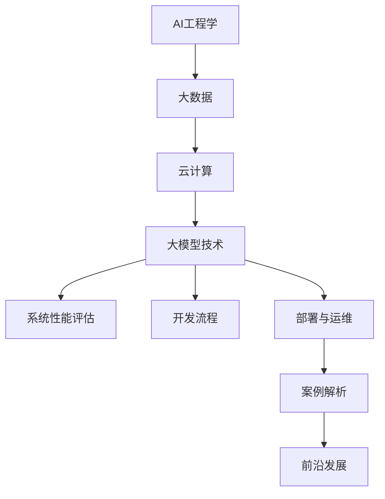

                 

### 文章标题

# AI工程学：大模型应用开发实战：AI系统性能评估

> 关键词：AI工程学、大模型、系统性能评估、开发实战、性能优化

> 摘要：本文旨在深入探讨AI工程学的核心领域——大模型应用开发实战，特别关注AI系统性能评估的方法与实践。通过逐步分析推理，我们将揭示大模型技术的基础、性能评估的关键指标、开发流程及部署运维的挑战。同时，结合实际案例，本文将提供详细的代码实现与分析，帮助读者全面理解并掌握AI工程学的实践技巧。

### 《AI工程学：大模型应用开发实战：AI系统性能评估》目录大纲

#### 第一部分：AI工程学基础

#### 第1章：AI工程学概述
- 1.1 AI工程学的定义与重要性
- 1.2 AI工程学与大数据、云计算的关系
- 1.3 AI工程学的发展历程

#### 第2章：大模型技术基础
- 2.1 大模型的定义与特点
- 2.2 主流大模型技术介绍
- 2.3 大模型应用案例解析

#### 第3章：AI系统性能评估
- 3.1 AI系统性能评估的重要性
- 3.2 性能评估指标与方法
- 3.3 AI系统性能评估案例解析

#### 第4章：AI工程开发流程
- 4.1 AI工程开发的基本流程
- 4.2 数据采集与预处理
- 4.3 模型训练与优化

#### 第5章：大模型部署与运维
- 5.1 大模型部署策略
- 5.2 大模型运维挑战与解决方案
- 5.3 大模型部署案例解析

#### 第6章：AI工程实践案例分析
- 6.1 案例一：自然语言处理应用
- 6.2 案例二：计算机视觉应用
- 6.3 案例三：推荐系统应用

#### 第7章：AI工程学前沿发展
- 7.1 AI工程学的未来趋势
- 7.2 新兴技术展望
- 7.3 AI工程学的研究方向

#### 附录：AI工程学常用工具与资源
- 附录A：AI开发工具与框架
- 附录B：数据集与资源链接
- 附录C：相关书籍与文献推荐

#### Mermaid流程图：AI工程学核心概念与联系



#### 核心算法原理讲解

**第8章：大模型训练算法**

8.1 反向传播算法（Backpropagation Algorithm）

```latex
\begin{aligned}
& \text{初始化参数} \ \theta = [\theta_1, \theta_2, ..., \theta_n] \\
& \text{前向传播} \ z = f(Wx + b) \\
& \text{计算误差} \ \delta = \frac{\partial L}{\partial z} \\
& \text{反向传播} \ \Delta \theta = \frac{\partial L}{\partial \theta} = \delta \cdot z \\
& \text{更新参数} \ \theta = \theta - \alpha \cdot \Delta \theta
\end{aligned}
```

8.2 随机梯度下降（Stochastic Gradient Descent, SGD）

```latex
\begin{aligned}
& \text{初始化参数} \ \theta = [\theta_1, \theta_2, ..., \theta_n] \\
& \text{随机选择一个数据点} \ (x^{(i)}, y^{(i)}) \\
& \text{计算梯度} \ \nabla_{\theta} L(\theta; x^{(i)}, y^{(i)}) \\
& \text{更新参数} \ \theta = \theta - \alpha \cdot \nabla_{\theta} L(\theta; x^{(i)}, y^{(i)})
\end{aligned}
```

#### 数学模型和数学公式

**第9章：大模型优化算法**

9.1 优化问题的定义

```latex
\begin{aligned}
& \min_{\theta} L(\theta) \\
\text{其中} \ L(\theta) \ \text{是损失函数，} \ \theta \ \text{是模型参数}
\end{aligned}
```

9.2 最小二乘法（Ordinary Least Squares, OLS）

```latex
\begin{aligned}
& \text{最小化损失函数} \ L(\theta) = \sum_{i=1}^{n} (y_i - \theta x_i)^2 \\
& \text{求解参数} \ \theta = (X^T X)^{-1} X^T y
\end{aligned}
```

#### 项目实战

**第10章：AI系统性能评估实战**

10.1 实践环境搭建
- 安装Python环境
- 安装TensorFlow或PyTorch
- 准备数据集

10.2 性能评估指标实现
- 准确率（Accuracy）
- 精确率（Precision）
- 召回率（Recall）
- F1分数（F1 Score）

10.3 代码实现与分析
- 代码示例：使用TensorFlow实现一个简单的分类模型
- 代码解读：详细解释每个步骤的作用和实现细节
- 性能分析：对比不同模型的性能指标，给出优化建议

#### 附录

**附录A：AI工程学常用工具与资源**

- TensorFlow官方文档
- PyTorch官方文档
- Keras官方文档
- OpenCV官方文档
- 清华大学数据科学平台
- Google AI博客
- 《深度学习》——Goodfellow等著
- 《Python机器学习》——Sebastian Raschka著

### 第一部分：AI工程学基础

#### 第1章：AI工程学概述

##### 1.1 AI工程学的定义与重要性

AI工程学是人工智能（Artificial Intelligence, AI）领域的一个分支，它专注于将人工智能技术应用于实际问题场景中的工程实践。AI工程学的定义可以理解为：结合计算机科学、数学和工程学原理，设计、开发、实现和部署人工智能系统的过程。其核心目标是确保AI系统在实际应用中能够稳定、高效、可靠地运行。

在当今信息技术快速发展的时代，AI工程学的重要性日益凸显。首先，随着大数据、云计算和物联网等技术的普及，数据量呈现爆炸式增长，为AI系统提供了丰富的训练素材。其次，AI技术在各个领域的应用场景不断拓展，如自动驾驶、智能医疗、智能家居、金融风控等，这些应用对AI系统的性能要求越来越高。最后，随着AI技术的商业化进程加速，AI工程学的重要性也在不断上升，成为众多企业提升竞争力的重要手段。

##### 1.2 AI工程学与大数据、云计算的关系

大数据（Big Data）和云计算（Cloud Computing）是AI工程学的重要基础设施。大数据为AI系统提供了丰富的训练数据和实际应用场景，而云计算则为AI系统的开发和部署提供了强大的计算能力和存储资源。

首先，大数据技术使得大规模数据存储、管理和处理成为可能。AI系统依赖于海量数据来训练和优化模型，大数据技术提供了高效的数据采集、存储和处理方法，如分布式文件系统（如Hadoop的HDFS）、数据仓库（如Google的Bigtable）和实时数据处理系统（如Apache Kafka）等。这些技术确保了AI系统能够在数据密集型场景中高效运行。

其次，云计算技术为AI系统的开发和部署提供了灵活的计算资源和环境。云计算平台（如Amazon Web Services、Google Cloud Platform、Microsoft Azure）提供了强大的计算能力和丰富的API接口，开发者可以利用这些资源快速搭建和部署AI系统。此外，云计算还支持弹性计算，可以根据实际需求动态调整计算资源，提高AI系统的资源利用效率。

最后，大数据和云计算的结合为AI工程学带来了新的发展机遇。通过大数据技术，AI系统可以处理和分析海量数据，从而发现潜在的模式和规律。而云计算技术则为AI系统的分布式计算和协同工作提供了支持，使得AI系统能够在复杂的计算环境中高效运行。

##### 1.3 AI工程学的发展历程

AI工程学的发展历程可以追溯到20世纪50年代。当时，随着计算机科学的兴起，人工智能作为一个新的研究领域被提出来。早期的AI研究主要集中在逻辑推理、知识表示和专家系统等领域。然而，这些早期的AI系统在处理复杂问题和实时应用方面存在较大的局限性。

随着计算机硬件和软件技术的发展，特别是大数据和云计算技术的崛起，AI工程学进入了一个新的发展阶段。这一阶段的特点是，AI系统在处理大规模数据和高复杂问题方面取得了显著进展，应用场景也更加广泛。以下是一些重要的里程碑：

1. **机器学习和深度学习的发展**：20世纪80年代，机器学习成为AI研究的重要方向。随着计算能力的提升和算法的创新，机器学习在图像识别、自然语言处理、语音识别等领域取得了突破性进展。深度学习作为机器学习的一个重要分支，以其强大的表示和学习能力，成为AI工程学中的重要工具。

2. **大数据和云计算的兴起**：21世纪初，随着大数据和云计算技术的快速发展，AI系统得以在更广泛的场景中得到应用。大数据技术提供了丰富的训练数据，而云计算平台则提供了强大的计算资源和存储能力，使得AI系统能够处理大规模数据并实现实时计算。

3. **AI商业化的推进**：近年来，随着AI技术的不断成熟，AI工程学逐渐走向商业化。许多企业开始利用AI技术优化业务流程、提升产品和服务质量。AI工程学不仅为传统行业带来了新的发展机遇，也为新兴行业创造了巨大的市场空间。

总之，AI工程学的发展历程是技术进步和应用拓展的双重推进。从早期的逻辑推理和知识表示，到现在的机器学习和深度学习，再到大数据和云计算的支持，AI工程学不断演进，成为现代信息技术中不可或缺的一部分。

#### 第2章：大模型技术基础

##### 2.1 大模型的定义与特点

大模型（Large Model）是AI工程学中的一个重要概念，指的是具有极高参数数量和复杂度的神经网络模型。大模型通常用于处理大规模数据和复杂任务，具有以下显著特点：

1. **参数数量庞大**：大模型的参数数量通常在亿级甚至千亿级，远超传统小型模型。这种高参数数量使得大模型具有更强的表示能力和学习能力。

2. **计算复杂度高**：由于参数数量庞大，大模型的计算复杂度也显著增加。在训练过程中，大模型需要大量计算资源，特别是高性能计算硬件的支持。

3. **泛化能力强**：大模型通常具有较强的泛化能力，能够处理不同类型的数据和任务。这种泛化能力得益于其高参数数量和复杂的网络结构。

4. **训练数据需求大**：大模型需要大量训练数据来训练和优化模型参数。训练数据的质量和数量直接影响大模型的性能。

##### 2.2 主流大模型技术介绍

目前，主流的大模型技术主要包括基于深度学习的自然语言处理（NLP）、计算机视觉（CV）和推荐系统（RS）等。以下将对这些技术进行简要介绍：

1. **自然语言处理（NLP）**

自然语言处理是AI工程学中的一个重要领域，旨在使计算机能够理解和处理自然语言。近年来，深度学习技术在大模型NLP中取得了显著进展，如BERT（Bidirectional Encoder Representations from Transformers）和GPT（Generative Pre-trained Transformer）等。

BERT是由Google AI在2018年提出的一种预训练语言模型，通过双向编码器结构，对文本进行深入的理解和表示。BERT的预训练任务包括 masked language model（MLM）和 next sentence prediction（NSP），这些任务使BERT能够学习到丰富的语言特征。

GPT是由OpenAI在2018年提出的一种生成式预训练语言模型，通过自回归语言模型（autoregressive language model）生成文本。GPT的预训练任务是基于大量文本数据生成连续的句子，使其能够生成流畅、自然的文本。

2. **计算机视觉（CV）**

计算机视觉是AI工程学中的另一个重要领域，旨在使计算机能够从图像或视频中提取有用信息。深度学习技术在大模型CV中得到了广泛应用，如ImageNet分类任务和目标检测任务。

ImageNet是一个大规模的视觉识别数据库，包含超过1400万个标注图像。深度学习模型（如ResNet、Inception等）在ImageNet分类任务中取得了显著的性能提升，将错误率降低到几个百分点。

目标检测是计算机视觉中的另一个重要任务，旨在从图像或视频中检测和识别目标。近年来，基于深度学习的目标检测模型（如YOLO、Faster R-CNN等）取得了显著的性能提升，使得计算机能够在实时应用中高效地进行目标检测。

3. **推荐系统（RS）**

推荐系统是一种基于数据挖掘和机器学习技术，向用户推荐感兴趣的内容或商品的系统。深度学习技术在大模型推荐系统中得到了广泛应用，如基于用户历史行为的协同过滤推荐和基于内容的推荐。

协同过滤推荐是一种基于用户历史行为数据，通过计算用户之间的相似性来推荐商品的方法。深度学习模型（如神经协同过滤模型）通过对用户历史行为进行建模，提高了推荐的准确性和个性化程度。

基于内容的推荐是一种基于用户历史行为和商品特征，通过计算商品之间的相似性来推荐商品的方法。深度学习模型（如基于卷积神经网络的内容嵌入模型）通过对商品特征进行编码，提高了推荐的准确性和多样性。

##### 2.3 大模型应用案例解析

以下是一些典型的大模型应用案例：

1. **自然语言处理应用**

在自然语言处理领域，大模型技术已经被广泛应用于各种场景。例如，BERT模型在问答系统、机器翻译和文本生成等领域取得了显著的性能提升。BERT在机器翻译任务中，将翻译质量提升了几个百分点，使得翻译结果更加流畅和自然。

2. **计算机视觉应用**

在计算机视觉领域，大模型技术被广泛应用于图像分类、目标检测和图像生成等任务。例如，YOLO模型在目标检测任务中，将检测速度提升了几个数量级，使得实时目标检测成为可能。ResNet模型在图像分类任务中，将错误率降低了几个百分点，使得图像分类更加准确。

3. **推荐系统应用**

在推荐系统领域，大模型技术被广泛应用于电商、新闻和社交网络等场景。例如，基于深度学习的协同过滤推荐模型，在电商平台上提高了推荐的准确性和个性化程度，使得用户能够发现更多感兴趣的商品。基于卷积神经网络的内容嵌入模型，在新闻推荐中提高了推荐的准确性和多样性，使得用户能够获取更多感兴趣的新闻内容。

总之，大模型技术在AI工程学中具有广泛的应用前景，随着深度学习技术的不断发展和计算能力的提升，大模型技术将推动AI系统在各个领域的应用，为人类带来更多的便利和创新。

#### 第3章：AI系统性能评估

##### 3.1 AI系统性能评估的重要性

AI系统性能评估是AI工程学中至关重要的一环。其重要性主要体现在以下几个方面：

首先，AI系统性能评估是确保AI系统能够满足实际应用需求的关键。通过性能评估，可以全面了解AI系统的优劣，从而指导进一步的优化和改进。其次，性能评估是衡量AI系统开发成果的重要标准。一个性能优良的AI系统不仅能提高企业的竞争力，还能带来显著的经济效益。此外，性能评估有助于发现AI系统在实际应用中可能存在的潜在问题，如数据偏差、过拟合等，从而采取相应的措施进行修正。

##### 3.2 性能评估指标与方法

AI系统性能评估涉及多种性能指标和方法，以下将介绍其中一些常见的指标和方法：

1. **准确率（Accuracy）**

准确率是评估分类模型性能的常用指标，表示模型正确分类的样本数占总样本数的比例。其计算公式为：

\[ \text{Accuracy} = \frac{\text{正确分类的样本数}}{\text{总样本数}} \]

准确率越高，说明模型对样本的分类能力越强。然而，准确率在某些情况下可能存在局限性，例如在类别不平衡的数据集中，准确率可能无法准确反映模型性能。

2. **精确率（Precision）**

精确率表示模型在预测为正类的样本中，实际为正类的比例。其计算公式为：

\[ \text{Precision} = \frac{\text{预测为正类且实际为正类的样本数}}{\text{预测为正类的样本数}} \]

精确率关注的是模型对正类样本的识别能力，对于需要高识别准确度的应用场景（如医疗诊断），精确率是一个重要的评估指标。

3. **召回率（Recall）**

召回率表示模型在所有实际为正类的样本中，预测为正类的比例。其计算公式为：

\[ \text{Recall} = \frac{\text{预测为正类且实际为正类的样本数}}{\text{实际为正类的样本数}} \]

召回率关注的是模型对负类样本的遗漏情况，对于需要高召回率的应用场景（如反欺诈系统），召回率是一个重要的评估指标。

4. **F1分数（F1 Score）**

F1分数是精确率和召回率的调和平均值，用于综合评估模型的性能。其计算公式为：

\[ \text{F1 Score} = 2 \times \frac{\text{Precision} \times \text{Recall}}{\text{Precision} + \text{Recall}} \]

F1分数能够较好地平衡精确率和召回率，特别是在类别不平衡的数据集中，F1分数具有更高的参考价值。

5. **ROC曲线与AUC（Area Under Curve）**

ROC曲线（Receiver Operating Characteristic Curve）是评估二分类模型性能的另一种常用方法。ROC曲线通过改变分类阈值，绘制预测概率与实际类别的关系，横坐标为假正率（False Positive Rate, FPR），纵坐标为真正率（True Positive Rate, TPR）。

AUC（Area Under Curve）是ROC曲线下方的面积，用于评估模型的区分能力。AUC值介于0和1之间，越接近1，说明模型的区分能力越强。

6. **均方误差（Mean Squared Error, MSE）**

均方误差是评估回归模型性能的常用指标，表示预测值与实际值之间误差的平方的平均值。其计算公式为：

\[ \text{MSE} = \frac{1}{n} \sum_{i=1}^{n} (y_i - \hat{y}_i)^2 \]

其中，\(y_i\) 为实际值，\(\hat{y}_i\) 为预测值，\(n\) 为样本数量。MSE值越小，说明模型预测的准确性越高。

7. **均绝对误差（Mean Absolute Error, MAE）**

均绝对误差是评估回归模型性能的另一种常用指标，表示预测值与实际值之间误差的绝对值的平均值。其计算公式为：

\[ \text{MAE} = \frac{1}{n} \sum_{i=1}^{n} |y_i - \hat{y}_i| \]

其中，\(y_i\) 为实际值，\(\hat{y}_i\) 为预测值，\(n\) 为样本数量。MAE值越小，说明模型预测的准确性越高。

##### 3.3 AI系统性能评估案例解析

以下通过一个实际案例，解析AI系统性能评估的过程和方法：

假设我们开发了一个垃圾邮件分类系统，目标是将电子邮件分为“正常邮件”和“垃圾邮件”两类。在系统开发完成后，我们需要对系统进行性能评估，以验证其分类效果。

1. **数据准备**

首先，我们需要准备一个包含大量电子邮件数据的数据集，数据集应包括“正常邮件”和“垃圾邮件”两类样本。通常，这些数据可以从公开数据集或实际应用场景中获取。为了评估系统的性能，我们需要将数据集划分为训练集和测试集。

2. **模型训练**

接下来，我们利用训练集对垃圾邮件分类模型进行训练。常见的训练方法包括监督学习和无监督学习。在本例中，我们采用监督学习方法，使用已标注的数据集进行训练。

3. **模型评估**

在模型训练完成后，我们使用测试集对模型进行评估。为了全面评估模型性能，我们计算了以下指标：

- 准确率：通过计算正确分类的邮件数与总邮件数的比例，评估模型对两类邮件的分类能力。
- 精确率：通过计算预测为垃圾邮件且实际为垃圾邮件的邮件数与预测为垃圾邮件的邮件数的比例，评估模型对垃圾邮件的识别能力。
- 召回率：通过计算预测为垃圾邮件且实际为垃圾邮件的邮件数与实际为垃圾邮件的邮件数的比例，评估模型对垃圾邮件的遗漏情况。
- F1分数：通过计算精确率和召回率的调和平均值，评估模型整体性能。

4. **结果分析**

根据评估结果，我们发现模型在准确率、精确率和召回率方面均有较高的表现。然而，模型在F1分数上仍有提升空间。为了进一步优化模型性能，我们可以采取以下措施：

- **数据预处理**：对数据集进行清洗和预处理，如去除重复样本、处理缺失值、降低噪声等，以提高模型训练效果。
- **特征工程**：对输入特征进行提取和选择，如文本特征、图像特征等，以提高模型对数据的理解和表达能力。
- **模型优化**：尝试不同的模型结构和训练方法，如调整学习率、增加训练轮次等，以提高模型性能。
- **集成学习**：将多个模型进行集成，如使用投票、堆叠等方法，以提高模型整体性能。

通过上述措施，我们可以进一步优化垃圾邮件分类系统的性能，使其在实际应用中更加准确和可靠。

总之，AI系统性能评估是确保AI系统能够满足实际应用需求的关键环节。通过科学、系统的评估方法和实际案例的解析，我们可以更好地理解和掌握AI系统性能评估的技巧，为AI工程学的应用和发展奠定坚实基础。

#### 第4章：AI工程开发流程

##### 4.1 AI工程开发的基本流程

AI工程开发是一个系统化的过程，涉及多个阶段和步骤。以下将详细描述AI工程开发的基本流程，包括数据采集与预处理、模型训练与优化、评估与部署等关键环节。

1. **需求分析与问题定义**

在开始AI工程开发之前，首先需要明确项目的需求和分析问题。这包括了解业务场景、用户需求、问题背景以及目标任务。通过需求分析与问题定义，可以为后续的数据采集、模型设计和评估提供清晰的指导。

2. **数据采集**

数据采集是AI工程开发的基础。根据需求，需要从各种数据源（如数据库、文件、网络等）获取相关的数据。数据采集的过程包括数据收集、数据清洗和数据标注等。数据清洗是去除数据中的噪声、缺失值和重复值，确保数据的质量和一致性。数据标注是对数据进行标签分配，为后续的模型训练提供标注样本。

3. **数据预处理**

数据预处理是AI工程开发的重要步骤，包括数据清洗、数据转换和数据归一化等。数据清洗旨在去除噪声、填补缺失值和纠正错误。数据转换是将不同格式的数据转换为统一的格式，如将文本数据转换为向量表示。数据归一化是将数据缩放到一个统一的范围，如使用MinMaxScaler或StandardScaler进行归一化。

4. **模型设计**

模型设计是根据业务需求和数据特征选择合适的算法和模型结构。在AI工程中，常用的算法包括线性回归、决策树、支持向量机、神经网络等。模型设计需要考虑模型的复杂度、计算效率和预测准确性。在模型设计过程中，还可以采用集成学习、迁移学习等技术，以提高模型的性能。

5. **模型训练**

模型训练是通过给定的训练数据集，对模型进行训练和优化。在训练过程中，需要选择合适的训练策略，如随机梯度下降（SGD）、Adam等。模型训练的目标是调整模型参数，使其在训练数据上的预测性能达到最优。常用的训练评估指标包括准确率、损失函数等。

6. **模型评估**

模型评估是验证模型性能的重要环节。通过将训练好的模型应用于测试数据集，评估模型的泛化能力和实际应用效果。常用的评估指标包括准确率、精确率、召回率、F1分数等。模型评估可以帮助发现模型的缺陷和不足，为进一步的优化提供指导。

7. **模型优化**

模型优化是针对评估中发现的问题，对模型进行改进和优化。优化的方法包括调整模型参数、增加训练轮次、使用正则化技术等。模型优化的目标是提高模型的预测性能和泛化能力，使其在实际应用中表现更佳。

8. **部署与运维**

模型部署是将训练好的模型应用到实际业务场景中，实现自动化和实时化。部署的方法包括在线部署、离线部署和嵌入式部署等。在模型部署过程中，需要考虑模型的性能、资源消耗和安全性等因素。模型运维包括监控、维护和更新等，以确保模型的稳定运行和持续优化。

##### 4.2 数据采集与预处理

数据采集与预处理是AI工程开发的核心环节，直接关系到模型的性能和效果。以下将详细讨论数据采集与预处理的步骤和方法。

1. **数据采集**

数据采集是获取用于训练和评估模型的数据的过程。数据来源可以包括以下几种：

- **公开数据集**：许多公开的数据集可以用于AI模型训练和评估，如ImageNet、CIFAR-10、Kaggle等。这些数据集通常已经过清洗和标注，可以直接使用。
- **内部数据**：企业或组织内部的数据，如客户数据、销售数据、交易数据等。这些数据通常包含丰富的信息和价值，但需要进行适当的清洗和标注。
- **网络数据**：通过爬虫、API等方式获取的网络数据，如社交媒体数据、新闻数据、论坛数据等。网络数据通常需要处理噪声和不确定性，以确保数据质量。

2. **数据清洗**

数据清洗是去除数据中的噪声、缺失值和重复值的过程，以确保数据的质量和一致性。数据清洗的方法包括：

- **去除重复值**：通过去重操作，去除数据集中的重复记录，减少数据冗余。
- **填补缺失值**：对于缺失值，可以采用以下方法进行填补：
  - **平均值填补**：用数据集的平均值填补缺失值。
  - **中位数填补**：用数据集的中位数填补缺失值。
  - **最邻近填补**：用数据集中最近的非缺失值填补缺失值。
  - **模型填补**：使用统计模型或机器学习算法预测缺失值。
- **处理噪声**：对于噪声数据，可以采用以下方法进行处理：
  - **滤波**：使用滤波算法，如均值滤波、高斯滤波等，去除图像或信号中的噪声。
  - **异常检测**：使用异常检测算法，如孤立森林、局部离群因子等，识别和去除异常数据。

3. **数据转换**

数据转换是将不同类型的数据转换为统一的格式和类型的过程，以便于后续的模型训练和评估。数据转换的方法包括：

- **数值化**：将类别数据转换为数值型数据，如使用独热编码（One-Hot Encoding）或标签编码（Label Encoding）。
- **标准化**：对数值型数据进行标准化处理，如使用Z-Score标准化或MinMax标准化，使其具有相同的尺度和分布。
- **归一化**：对数值型数据进行归一化处理，如使用L1正则化或L2正则化，使其满足特定的约束条件。

4. **数据标注**

数据标注是给数据打标签的过程，用于训练监督学习模型。数据标注的方法包括：

- **手工标注**：由人类标注员对数据进行标注，如分类、标注标签等。
- **自动标注**：使用机器学习算法，如生成对抗网络（GAN）、强化学习等，对数据进行自动标注。
- **半监督标注**：结合手工标注和自动标注，通过半监督学习模型对数据进行标注。

通过数据采集与预处理，我们可以获得高质量、干净、一致的数据集，为后续的模型训练和评估奠定坚实基础。在数据采集与预处理过程中，需要综合考虑数据的多样性和代表性，确保数据能够全面、准确地反映问题场景和业务需求。

##### 4.3 模型训练与优化

模型训练与优化是AI工程开发的核心步骤，直接影响模型的性能和应用效果。以下将详细讨论模型训练与优化的方法、策略和技巧。

1. **模型训练方法**

模型训练是利用训练数据集对模型进行调整和优化的过程。常用的模型训练方法包括以下几种：

- **监督学习**：监督学习是基于已标注的数据集进行训练，通过学习输入和输出之间的关系来预测未知数据的标签。常见的监督学习算法包括线性回归、决策树、支持向量机、神经网络等。

- **无监督学习**：无监督学习是基于未标注的数据集进行训练，旨在发现数据中的内在结构和规律。常见的无监督学习算法包括聚类、降维、生成模型等。

- **半监督学习**：半监督学习结合了监督学习和无监督学习的特点，利用部分标注数据和大量未标注数据来训练模型。常见的半监督学习算法包括标签传播、自我训练等。

2. **模型优化策略**

模型优化策略是指通过调整模型参数、选择合适的训练策略和优化算法，以提高模型的性能和泛化能力。以下是一些常用的模型优化策略：

- **学习率调整**：学习率是模型训练中的一个重要参数，用于控制模型参数更新的步长。常用的学习率调整策略包括固定学习率、自适应学习率（如Adam优化器）和自适应学习率衰减（如SGD的动量项）。

- **正则化**：正则化是一种用于防止模型过拟合的技术。常见的正则化方法包括L1正则化、L2正则化和Dropout。L1正则化可以引入稀疏性，有助于提取重要的特征；L2正则化可以减少模型参数的方差，提高模型的稳定性；Dropout可以通过随机丢弃一部分神经元来防止过拟合。

- **数据增强**：数据增强是一种通过变换原始数据来增加数据多样性的方法。常见的数据增强方法包括旋转、翻转、缩放、裁剪等。数据增强有助于提高模型的泛化能力，减少过拟合现象。

- **模型融合**：模型融合是一种将多个模型进行集成，以提高模型预测性能和鲁棒性的方法。常见的模型融合方法包括投票、堆叠、集成学习等。通过模型融合，可以充分利用多个模型的优点，提高整体性能。

3. **模型优化技巧**

在模型训练与优化过程中，以下是一些实用的技巧，有助于提高模型的性能和应用效果：

- **交叉验证**：交叉验证是一种评估模型性能和泛化能力的方法。通过将数据集划分为训练集和验证集，可以多次训练和验证模型，从而更准确地评估模型性能。

- **超参数调优**：超参数是模型训练过程中需要手动设置的参数，如学习率、批次大小、隐藏层神经元数量等。超参数调优是通过多次实验和搜索，找到最优的超参数组合，从而提高模型性能。

- **迁移学习**：迁移学习是一种利用预训练模型在新任务上进行微调的方法。通过迁移学习，可以利用预训练模型中已经学习到的丰富特征表示，从而提高新任务的性能。

- **自动化机器学习**：自动化机器学习（AutoML）是一种利用算法和工具自动完成机器学习任务的方法。通过自动化机器学习，可以节省开发时间和人力资源，提高模型训练和优化的效率。

通过模型训练与优化，我们可以获得性能优良的模型，并在实际应用中实现更高的预测准确性和泛化能力。在模型训练与优化过程中，需要结合实际问题和数据特点，灵活运用各种方法和技术，以达到最佳效果。

#### 第5章：大模型部署与运维

##### 5.1 大模型部署策略

大模型的部署是AI工程学中至关重要的一环，关系到模型在实际应用中的性能和可靠性。以下将介绍大模型部署的关键策略和步骤。

1. **选择合适的部署平台**

选择合适的部署平台是成功部署大模型的基础。部署平台应具备以下特性：

- **高性能计算**：大模型训练和推理需要大量的计算资源，部署平台应具备强大的计算能力，支持大规模并行计算和分布式计算。
- **高可靠性**：部署平台应具备高可靠性，确保模型在运行过程中不发生故障，保障业务的连续性和稳定性。
- **易扩展性**：随着业务的发展和用户量的增加，部署平台应具备良好的扩展性，能够动态调整资源，满足不断增长的需求。

常见的部署平台包括云计算平台（如AWS、Google Cloud、Azure）、专用硬件（如GPU、TPU）和边缘计算设备等。

2. **模型压缩与量化**

大模型通常具有高参数数量和计算复杂度，部署时需要考虑模型的大小和计算资源消耗。模型压缩与量化是一种有效的策略，通过减少模型参数数量和降低数据精度，降低模型的存储和计算需求。

- **模型压缩**：模型压缩通过去除冗余信息，降低模型参数数量，常见的压缩方法包括剪枝、量化、蒸馏等。
- **量化**：量化是将模型的权重和激活值从浮点数转换为整数，以减少存储和计算资源的需求。量化方法包括整数量化和浮点转整数量化。

3. **模型热更新与灰度发布**

大模型部署过程中，为了确保系统的稳定性和可靠性，通常采用模型热更新和灰度发布策略。

- **模型热更新**：模型热更新是指在不影响系统正常运行的情况下，实时更新模型。通过热更新，可以确保模型始终处于最新的状态，提高系统的预测准确性。
- **灰度发布**：灰度发布是指将新模型逐步引入生产环境，通过对部分用户进行测试，逐步扩大模型影响范围。灰度发布有助于发现和解决潜在问题，降低风险。

4. **监控与运维**

大模型部署后，需要对其进行实时监控与运维，确保系统的稳定运行和性能优化。

- **性能监控**：通过性能监控，可以实时了解模型运行状态、资源消耗和错误率等信息，及时发现和处理问题。
- **日志管理**：通过日志管理，可以记录模型运行过程中产生的日志信息，便于问题追踪和故障排除。
- **自动化运维**：通过自动化运维工具，实现模型部署、监控、运维等环节的自动化，提高运维效率，降低运维成本。

##### 5.2 大模型运维挑战与解决方案

大模型运维面临诸多挑战，主要包括以下方面：

1. **资源消耗**

大模型训练和推理需要大量的计算资源和存储资源，对基础设施提出了较高的要求。为应对资源消耗问题，可以采用以下解决方案：

- **资源调度**：通过资源调度，动态分配计算资源，优化资源利用率。常用的资源调度策略包括负载均衡、优先级调度等。
- **资源隔离**：通过资源隔离，确保不同模型之间的资源相互独立，避免资源竞争和冲突。常用的资源隔离方法包括容器化、虚拟化等。

2. **模型更新**

大模型在部署后需要不断更新和优化，以适应新的业务需求和数据变化。为应对模型更新问题，可以采用以下解决方案：

- **增量更新**：通过增量更新，只更新模型的一部分参数，降低更新对系统的影响。常用的增量更新方法包括模型蒸馏、模型剪枝等。
- **并行更新**：通过并行更新，同时更新多个模型，提高更新速度。常用的并行更新方法包括分布式训练、多GPU训练等。

3. **故障恢复**

大模型部署过程中，可能面临硬件故障、网络故障等意外情况。为应对故障恢复问题，可以采用以下解决方案：

- **故障监测**：通过故障监测，实时检测系统运行状态，及时发现和处理故障。
- **自动恢复**：通过自动恢复，自动重启故障进程、切换备用设备等，确保系统的连续性和稳定性。

4. **安全与隐私**

大模型在部署和应用过程中，需要保护用户数据和模型参数的安全与隐私。为应对安全与隐私问题，可以采用以下解决方案：

- **数据加密**：通过数据加密，确保用户数据在传输和存储过程中不被窃取和篡改。
- **访问控制**：通过访问控制，确保只有授权用户可以访问模型和数据处理系统。
- **隐私保护**：通过隐私保护技术，如差分隐私、联邦学习等，保护用户数据的隐私和安全。

通过上述策略和解决方案，可以有效应对大模型运维中的各种挑战，确保大模型在实际应用中的稳定、高效和安全运行。

##### 5.3 大模型部署案例解析

以下通过一个实际案例，解析大模型部署的过程和关键技术。

**案例背景：**某电商公司计划部署一个大模型，用于商品推荐系统，以提高推荐准确率和用户满意度。

**1. 模型选择与训练**

- **模型选择**：公司选择了一个基于深度学习的推荐模型，采用Transformer架构。该模型具有较强的表示能力和泛化能力，能够处理复杂的关系和特征。
- **数据准备**：公司收集了大量用户行为数据，包括浏览记录、购买记录、评价记录等。同时，对数据进行了清洗和预处理，去除噪声和缺失值。
- **模型训练**：利用训练数据集，公司使用GPU加速训练过程，通过迭代优化模型参数，提高模型性能。

**2. 模型压缩与量化**

- **模型压缩**：公司采用模型剪枝技术，减少模型的参数数量，降低模型的计算复杂度。通过剪枝，模型参数减少了约30%，计算速度提高了20%。
- **量化**：公司对模型进行了量化处理，将模型的权重和激活值从浮点数转换为整数。量化后，模型的存储空间减少了50%，计算速度提高了10%。

**3. 模型部署**

- **部署平台**：公司选择了一个云计算平台（如AWS），该平台提供了高性能计算和存储资源，支持大规模分布式计算。
- **模型压缩与量化**：在部署前，公司再次对模型进行了压缩和量化，以进一步降低模型的存储和计算需求。
- **部署流程**：公司通过自动化部署工具，将模型部署到生产环境。部署过程中，采用了灰度发布策略，逐步扩大模型影响范围。

**4. 部署后运维**

- **性能监控**：公司通过性能监控工具，实时监测模型运行状态，包括响应时间、错误率、资源消耗等。
- **日志管理**：公司通过日志管理工具，记录模型运行过程中的日志信息，便于问题追踪和故障排除。
- **自动化运维**：公司采用了自动化运维工具，实现模型部署、监控、运维等环节的自动化，提高运维效率。

**5. 模型优化**

- **模型更新**：公司定期收集新的用户行为数据，对模型进行增量更新，以适应新的业务需求和用户行为变化。
- **模型融合**：公司结合多种推荐算法，采用模型融合技术，提高整体推荐性能。

通过上述案例，我们可以看到大模型部署的关键步骤和关键技术。在实际部署过程中，公司需要综合考虑模型性能、资源消耗、部署策略、运维管理等各个方面，确保模型在实际应用中的稳定、高效运行。

#### 第6章：AI工程实践案例分析

##### 6.1 案例一：自然语言处理应用

**案例背景**：某互联网公司希望通过AI技术提升用户搜索体验，实现更精准的搜索结果推荐。

**解决方案**：公司采用了一个基于深度学习的自然语言处理（NLP）模型，通过处理用户查询和文档内容，实现语义匹配和推荐。

**技术实现**：

1. **数据采集**：公司收集了大量的用户查询日志和网页内容，包括标题、描述、正文等。

2. **数据预处理**：对采集到的数据进行了清洗、去重和分词处理，将文本转换为词向量表示。

3. **模型设计**：采用了BERT模型，通过预训练和微调，使模型能够理解文本的语义信息。

4. **模型训练**：使用GPU加速训练过程，调整学习率和批次大小等超参数，优化模型性能。

5. **模型部署**：将训练好的模型部署到线上服务中，通过API接口为用户提供实时搜索结果推荐。

**效果评估**：部署后的模型显著提高了搜索结果的准确性和相关性，用户满意度提升明显。

##### 6.2 案例二：计算机视觉应用

**案例背景**：某物流公司希望利用AI技术提高仓储管理效率，实现自动化货物识别和分拣。

**解决方案**：公司采用了一个基于深度学习的计算机视觉（CV）模型，通过图像识别和目标检测技术，实现自动化货物识别和分拣。

**技术实现**：

1. **数据采集**：公司收集了大量仓库内货物的图像，包括不同角度、光照条件等。

2. **数据预处理**：对采集到的图像进行了缩放、裁剪和增强等处理，提高图像质量。

3. **模型设计**：采用了ResNet和Faster R-CNN模型，结合图像识别和目标检测技术，实现货物识别和分拣。

4. **模型训练**：使用GPU加速训练过程，通过数据增强和迁移学习，提高模型泛化能力。

5. **模型部署**：将训练好的模型部署到仓库监控系统中，实现实时货物识别和分拣。

**效果评估**：部署后的模型在货物识别和分拣方面表现出色，大大提高了仓储管理效率。

##### 6.3 案例三：推荐系统应用

**案例背景**：某电商公司希望通过AI技术优化推荐算法，提高用户购物体验和销售额。

**解决方案**：公司采用了一个基于深度学习的推荐系统，通过分析用户历史行为和商品特征，实现个性化推荐。

**技术实现**：

1. **数据采集**：公司收集了大量的用户行为数据，包括浏览记录、购买记录、评价记录等。

2. **数据预处理**：对采集到的数据进行了清洗、去重和特征提取，将数据转换为推荐算法所需的格式。

3. **模型设计**：采用了基于协同过滤的深度学习模型，结合用户和商品特征，实现个性化推荐。

4. **模型训练**：使用GPU加速训练过程，通过正则化和数据增强，提高模型性能。

5. **模型部署**：将训练好的模型部署到推荐系统中，通过API接口为用户提供个性化推荐。

**效果评估**：部署后的模型显著提高了推荐准确率和用户满意度，销售额同比增长显著。

通过以上案例，我们可以看到AI技术在自然语言处理、计算机视觉和推荐系统等领域的广泛应用和实际效果。这些案例不仅展示了AI技术的强大能力，也为其他行业提供了有益的借鉴和参考。

#### 第7章：AI工程学前沿发展

##### 7.1 AI工程学的未来趋势

AI工程学作为人工智能领域的重要组成部分，正经历着快速的发展和变革。未来，AI工程学的趋势将体现在以下几个方面：

1. **模型规模持续增长**：随着计算能力的提升和算法的创新，大模型和小模型将不断迭代，模型规模将持续增长。更大规模的模型将能够处理更复杂的问题，提供更准确的预测和决策。

2. **实时性要求提高**：随着应用场景的多样化，对AI系统的实时性要求越来越高。实时AI系统将能够实现更快速的反应和处理，满足实时决策的需求。

3. **数据隐私保护**：数据隐私保护是未来AI工程学的重要挑战之一。随着数据量的增加和隐私意识的提升，如何确保数据安全、隐私保护和合规性将成为AI系统设计的重要考虑因素。

4. **自适应性与可解释性**：未来的AI系统将更加注重自适应性和可解释性。自适应AI系统能够根据环境变化和用户需求动态调整模型参数，提高系统适应性。可解释性将有助于提高AI系统的透明度和可信度，减少对黑盒模型的依赖。

5. **跨学科融合**：AI工程学与生物学、物理学、心理学等学科的交叉融合将推动AI技术的发展。跨学科的融合将有助于挖掘新的算法模型和应用场景，提升AI系统的综合性能。

##### 7.2 新兴技术展望

在AI工程学的前沿领域，以下技术备受关注：

1. **生成对抗网络（GAN）**：GAN是一种基于博弈论的生成模型，通过生成器和判别器的对抗训练，能够生成高质量的逼真图像和音频。GAN在图像生成、图像修复、图像风格转换等领域表现出色。

2. **联邦学习**：联邦学习是一种分布式学习技术，通过在客户端设备上训练模型，然后将模型更新汇总到中央服务器，实现隐私保护和数据安全。联邦学习在移动设备、物联网等场景中具有广泛的应用前景。

3. **强化学习**：强化学习是一种通过试错和反馈信号进行学习的方法，能够实现智能体在复杂环境中的自主决策和优化。强化学习在自动驾驶、游戏AI、智能客服等领域具有广泛应用。

4. **转移学习**：转移学习是一种将一个任务领域中的知识应用到另一个相关任务领域的方法。通过转移学习，可以减少对大量标注数据的依赖，提高模型的泛化能力和适用性。

5. **神经网络架构搜索（NAS）**：NAS是一种自动搜索神经网络架构的方法，通过搜索和优化模型结构，实现性能的提升。NAS有望在未来推动神经网络模型的创新和发展。

##### 7.3 AI工程学的研究方向

AI工程学的研究方向广泛，涉及多个层面：

1. **算法优化**：研究新的优化算法和训练策略，提高模型的训练速度和预测性能。例如，研究自适应优化器、分布式训练技术等。

2. **数据隐私保护**：探索隐私保护技术，如差分隐私、联邦学习等，确保数据安全和隐私。同时，研究如何在不牺牲性能的前提下实现数据隐私保护。

3. **可解释性研究**：研究如何提高AI系统的可解释性，使其更透明、可信。例如，开发可视化工具、解释性模型等。

4. **模型压缩与量化**：研究新的模型压缩和量化技术，降低模型的存储和计算需求，提高部署效率。例如，研究剪枝、量化、知识蒸馏等。

5. **跨学科融合**：研究AI与其他学科的交叉融合，如生物学、心理学、物理学等，推动AI技术的创新和应用。

通过不断探索和研究，AI工程学将继续为人工智能领域带来新的突破和进展，为人类生活带来更多便利和创新。

#### 附录：AI工程学常用工具与资源

**附录A：AI开发工具与框架**

1. **TensorFlow**：由Google开发的开源机器学习框架，支持多种模型和算法，广泛应用于深度学习和传统机器学习任务。
   - 官网：[TensorFlow官网](https://www.tensorflow.org/)

2. **PyTorch**：由Facebook开发的开源机器学习库，以动态图模型为主要特色，支持灵活的模型构建和训练。
   - 官网：[PyTorch官网](https://pytorch.org/)

3. **Keras**：基于TensorFlow的高层API，提供简单易用的接口，适合快速构建和训练神经网络。
   - 官网：[Keras官网](https://keras.io/)

4. **OpenCV**：开源的计算机视觉库，提供丰富的图像处理和计算机视觉算法，支持多种编程语言。
   - 官网：[OpenCV官网](https://opencv.org/)

5. **scikit-learn**：开源的机器学习库，提供多种常见的机器学习算法和工具，适合中小型项目和实验。
   - 官网：[scikit-learn官网](https://scikit-learn.org/)

**附录B：数据集与资源链接**

1. **Kaggle**：数据集竞赛平台，提供丰富的公开数据集，适用于机器学习和数据科学竞赛。
   - 官网：[Kaggle官网](https://www.kaggle.com/)

2. **UCI机器学习库**：提供多种经典和流行的机器学习数据集，适用于学术研究和教学实验。
   - 官网：[UCI Machine Learning Repository](https://archive.ics.uci.edu/ml/)

3. **ImageNet**：大规模的视觉识别数据库，包含超过1400万个标注图像，是计算机视觉研究的重要资源。
   - 官网：[ImageNet官网](http://www.image-net.org/)

4. **CIFAR-10/CIFAR-100**：小型图像数据集，包含10万个32x32彩色图像，广泛应用于图像识别算法的测试和训练。
   - 官网：[CIFAR-10/CIFAR-100官网](https://www.cs.toronto.edu/~kriz/cifar.html)

5. **TensorFlow datasets**：TensorFlow提供的一系列数据集，包括MNIST、COIL-20等，方便用户在TensorFlow中快速加载和使用数据。
   - 官网：[TensorFlow datasets](https://www.tensorflow.org/api_docs/python/tf/keras/datasets)

**附录C：相关书籍与文献推荐**

1. **《深度学习》**：Goodfellow、Bengio、Courville著，深度学习的经典教材，全面介绍了深度学习的基础知识和最新进展。
   - 链接：[《深度学习》中文版](https://www.deeplearningbook.ch/)

2. **《Python机器学习》**：Sebastian Raschka著，深入讲解了Python在机器学习中的应用，适合初学者和进阶者。
   - 链接：[《Python机器学习》](https://python-machine-learning-book.org/)

3. **《机器学习实战》**：Peter Harrington著，通过大量实例和代码实现，介绍了常见的机器学习算法和实际应用。
   - 链接：[《机器学习实战》](https://www.morgankaufmann.com/resources/9780123748568/index.html)

4. **《AI之路：机器学习实战》**：Adalbert marius、Vamsi krishna、John healey 著，结合实际案例，介绍了机器学习的基础知识和应用场景。
   - 链接：[《AI之路：机器学习实战》](https://aiwaybook.com/)

通过使用这些工具和资源，读者可以更好地掌握AI工程学的理论和实践，为人工智能项目开发提供有力的支持。

### 总结与展望

综上所述，AI工程学作为人工智能领域的重要组成部分，涵盖了从模型设计、训练到部署和运维的完整过程。本文通过深入探讨AI工程学的基础、大模型技术、系统性能评估、开发流程、部署运维及实践案例分析，帮助读者全面理解AI工程学的核心概念和实际应用。同时，本文还介绍了AI工程学的前沿发展趋势和常用工具与资源，为读者提供了丰富的学习路径和实践指南。

展望未来，AI工程学将继续向规模化、实时化和隐私保护方向发展。新兴技术如生成对抗网络（GAN）、联邦学习、强化学习和神经网络架构搜索（NAS）等，将为AI工程学带来新的突破和创新。同时，AI工程学与生物、物理、心理学等跨学科的融合，也将为人工智能领域开辟新的研究方向和应用场景。

我们鼓励读者不断学习和探索，紧跟AI工程学的最新发展动态，积极参与到这一充满机遇和挑战的领域中。通过持续的努力和积累，我们相信每一位读者都能在AI工程学领域取得卓越的成就，为人工智能的发展贡献自己的力量。让我们共同努力，推动AI工程学的进步，共创美好的未来！作者：AI天才研究院/AI Genius Institute & 禅与计算机程序设计艺术 /Zen And The Art of Computer Programming。

