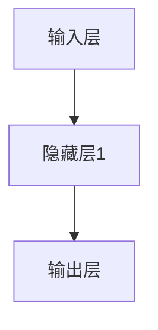
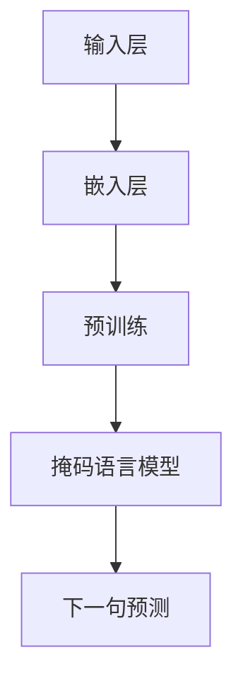

                 

### 文章标题: AI工程学：大模型应用开发实战：新的AI技术栈，如何不同于传统的机器学习工程

> 关键词：AI工程学、大模型、AI技术栈、机器学习、AI应用开发

> 摘要：本文将深入探讨AI工程学的核心概念、大模型技术基础、大模型应用开发实战，以及大模型应用中的挑战与优化策略。通过对AI工程学的全面解析，展示新的AI技术栈与传统机器学习工程的差异，为读者提供一次理论与实践相结合的技术盛宴。

### 第一部分: AI工程学基础

## 第1章: AI工程学概述

### 1.1 AI工程学的概念与重要性

**AI工程学的定义**：
AI工程学是关于将人工智能技术应用于实际问题解决方案的一门工程学科。它涉及从理论到实践的全过程，包括模型设计、数据管理、模型训练与优化、模型部署与运维等。

**AI工程学的重要性**：
AI工程学在推动AI技术落地应用、实现商业价值和社会效益方面起到关键作用。通过AI工程学，可以将AI技术应用于各种行业和场景，解决实际问题，创造价值。

### 1.2 AI工程学的核心内容

**AI系统设计**：
AI系统设计包括AI模型的选择、系统架构设计、数据流程管理等。设计一个高效、可扩展的AI系统，是AI工程学的重要任务。

**数据管理**：
数据管理是AI工程学的核心内容之一。数据收集、清洗、预处理和存储，确保数据质量和可用性，是训练高性能AI模型的基础。

**模型训练与优化**：
模型训练与优化是AI工程学的关键环节。使用历史数据训练AI模型，并进行调优，提高模型性能，是实现AI技术落地应用的关键。

**模型部署与运维**：
将训练好的模型部署到实际应用环境中，并对其进行监控和维护，确保模型稳定运行，是AI工程学的最后一环。

### 1.3 AI工程学的挑战与趋势

**挑战**：
- 数据隐私：在数据处理过程中，如何保护用户隐私成为一大挑战。
- 模型可解释性：用户难以理解模型的决策过程，导致信任度下降。
- 计算资源需求：大模型训练和推理需要大量计算资源，对硬件设备有较高要求。

**趋势**：
- 端到端集成（End-to-End Integration）：将传统机器学习中的多个步骤整合为一个端到端的流程，提高开发效率。
- 模型压缩与优化：通过量化、剪枝等技术，减小模型规模，提高推理速度。
- 自动化机器学习（AutoML）：自动化选择模型架构、调整超参数，降低开发门槛。

## 第2章: 人工智能核心原理

### 2.1 人工智能基础

**人工智能的定义**：
人工智能是模拟、延伸和扩展人类智能的理论、方法、技术及应用。它旨在使计算机具备人类智能，实现自动化决策和任务执行。

**人工智能的发展历程**：
人工智能的发展可以分为三个阶段：模拟智能、计算智能和现代人工智能。从最初的符号推理，到基于规则的专家系统，再到基于数据驱动的机器学习，人工智能经历了漫长的发展过程。

### 2.2 机器学习与深度学习

**机器学习的定义与分类**：
机器学习是一种从数据中自动学习和改进的方法。根据学习方式，机器学习可以分为监督学习、无监督学习和强化学习。

**深度学习的原理**：
深度学习是一种基于多层神经网络的学习方法。它通过多层的非线性变换，提取数据的特征表示，实现复杂的模式识别和预测任务。深度学习在计算机视觉、自然语言处理等领域取得了显著的成果。

### 2.3 计算机视觉与自然语言处理

**计算机视觉**：
计算机视觉是人工智能的一个重要分支，旨在使计算机能够理解和解释图像和视频。计算机视觉技术包括图像识别、目标检测、图像生成等。

**自然语言处理**：
自然语言处理是人工智能的另一个重要分支，旨在使计算机理解和生成自然语言。自然语言处理技术包括文本分类、机器翻译、情感分析等。

## 第3章: 大模型技术基础

### 3.1 大模型的概念与特点

**大模型的定义**：
大模型是指具有大规模参数、处理能力强的AI模型。大模型通常是指那些拥有数十亿甚至千亿参数的模型，如BERT、GPT等。

**大模型的特点**：
- 参数量庞大：大模型具有数十亿甚至千亿级别的参数，使得模型具有更强的表示能力和泛化能力。
- 计算复杂度高：大模型需要大量的计算资源进行训练和推理。
- 训练数据需求大：大模型需要大规模的训练数据来训练，以保证模型的性能和泛化能力。

### 3.2 大模型的训练方法

**预训练**：
预训练是指在大规模无监督数据集上进行训练，使模型获得通用的语言理解和生成能力。预训练是近年来大模型发展的一个重要趋势。

**微调**：
微调是指在大模型预训练的基础上，针对具体任务进行有监督的微调。微调可以通过调整模型的权重来适应特定任务，提高模型的性能。

### 3.3 大模型的应用场景

**自然语言处理**：
大模型在自然语言处理领域有着广泛的应用，如文本生成、问答系统、机器翻译等。GPT、BERT等模型在自然语言处理任务中取得了显著的成果。

**计算机视觉**：
大模型在计算机视觉领域也有着重要的应用，如图像生成、风格迁移、目标检测等。GAN、DNN等模型在计算机视觉任务中取得了很大的成功。

**推荐系统**：
大模型在推荐系统中也有着广泛的应用，如基于深度学习的推荐算法。大模型可以通过对用户行为和偏好进行分析，提供个性化的推荐。

## 第4章: 大模型应用开发实战

### 4.1 大模型应用开发流程

**需求分析**：
在开始大模型应用开发之前，需要对应用需求进行详细分析，明确应用目标、数据集和评价指标。

**模型选择**：
根据应用场景选择合适的大模型。不同的应用场景可能需要不同类型的大模型，如自然语言处理领域常用的BERT、GPT，计算机视觉领域常用的GAN、DNN等。

**模型训练**：
在选定模型后，需要进行模型训练。模型训练包括数据预处理、模型训练和评估。数据预处理包括数据清洗、归一化等操作，以确保数据质量和模型性能。

**模型部署**：
将训练好的模型部署到实际应用环境中。模型部署可以通过API接口、Web服务等方式进行，以便用户可以方便地使用模型进行预测和任务执行。

### 4.2 大模型应用案例解析

**案例1: 自然语言处理应用**：
使用GPT进行文本生成和问答系统开发。首先，需要进行需求分析，明确文本生成的目标和要求。然后，选择合适的GPT模型，并进行模型训练。最后，将训练好的模型部署到Web服务中，用户可以通过API接口使用文本生成和问答功能。

**案例2: 计算机视觉应用**：
使用GAN进行图像生成和风格迁移。首先，需要进行需求分析，明确图像生成和风格迁移的目标和要求。然后，选择合适的GAN模型，并进行模型训练。最后，将训练好的模型部署到应用环境中，用户可以通过界面进行图像生成和风格迁移操作。

**案例3: 推荐系统应用**：
使用深度学习进行用户行为分析和商品推荐。首先，需要进行需求分析，明确推荐系统的目标和要求。然后，选择合适的深度学习模型，如基于用户行为的推荐算法，并进行模型训练。最后，将训练好的模型部署到推荐系统中，为用户提供个性化的商品推荐。

## 第5章: 大模型应用中的挑战与优化

### 5.1 大模型应用中的挑战

**计算资源需求**：
大模型训练和推理需要大量计算资源，包括GPU、TPU等硬件设备。对于大规模模型，计算资源的配置和优化是一个重要挑战。

**数据隐私与安全**：
在数据处理过程中，如何保护用户隐私成为一个重要问题。特别是在自然语言处理和推荐系统等应用中，用户数据的隐私保护至关重要。

**模型可解释性**：
用户难以理解大模型的决策过程，导致信任度下降。提高模型的可解释性，使得用户能够理解模型的决策依据，是一个重要挑战。

### 5.2 大模型优化策略

**模型压缩与加速**：
通过量化、剪枝等技术，减小模型规模，提高推理速度。模型压缩与加速可以在保证模型性能的前提下，降低计算资源需求。

**分布式训练**：
利用多台计算机进行模型训练，提高训练效率。分布式训练可以通过并行计算的方式，加速模型训练过程。

**自动化机器学习**：
自动化选择模型架构、调整超参数，提高开发效率。自动化机器学习可以降低开发门槛，使得更多开发者能够使用大模型进行应用开发。

## 第6章: 大模型应用在行业中的实践

### 6.1 金融行业的应用

**风险管理**：
使用深度学习进行信用评分、欺诈检测等。通过分析用户行为数据、财务数据等，深度学习模型可以预测用户的风险等级，为金融机构提供风险管理决策支持。

**智能投顾**：
基于用户行为和偏好，提供个性化的投资建议。通过分析用户的历史投资行为、风险偏好等，智能投顾系统可以为用户提供合适的投资策略。

### 6.2 医疗健康领域的应用

**疾病诊断**：
利用深度学习进行医学图像分析和诊断。通过分析医学影像数据，深度学习模型可以辅助医生进行疾病诊断，提高诊断准确率。

**个性化治疗**：
基于患者数据和基因信息，提供个性化的治疗方案。通过分析患者的历史病历、基因信息等，深度学习模型可以为患者制定个性化的治疗方案。

### 6.3 制造业的智能化应用

**质量检测**：
使用计算机视觉进行生产线质量检测。通过分析生产线上的图像数据，计算机视觉模型可以检测产品缺陷，提高生产质量。

**设备预测性维护**：
利用数据预测设备故障，进行预防性维护。通过分析设备运行数据，深度学习模型可以预测设备故障，提前进行维护，降低设备故障率。

## 第7章: 大模型应用的未来展望

### 7.1 未来发展趋势

**模型定制化**：
针对不同应用场景，开发定制化模型。随着应用场景的多样化，定制化模型将成为大模型应用的重要趋势。

**跨模态学习**：
同时处理多种类型的数据，如文本、图像、音频等。跨模态学习可以实现更智能的应用，提高模型的泛化能力。

**强化学习**：
结合环境反馈进行智能决策。强化学习可以通过与环境交互，不断调整策略，实现最优决策。

### 7.2 潜在影响

**行业变革**：
大模型应用将引起传统行业商业模式、运营模式的变革。通过AI技术，企业可以实现自动化、智能化运营，提高生产效率和服务质量。

**社会影响**：
大模型应用将对社会道德、法律、伦理等方面产生影响。如何确保AI技术的公平性、透明性和可解释性，将成为社会关注的焦点。

## 第8章: 大模型应用中的伦理与社会问题

### 8.1 人工智能伦理

**算法公平性**：
避免算法歧视，确保公正性。在应用大模型时，需要考虑算法的公平性，避免因算法偏见而导致的不公平现象。

**隐私保护**：
加强数据隐私保护，防止信息泄露。在大模型应用中，用户数据的隐私保护至关重要，需要采取有效的措施确保用户数据的安全。

### 8.2 社会责任

**算法透明性**：
提高算法可解释性，接受社会监督。通过提高算法的可解释性，用户可以理解模型的决策过程，增强对AI技术的信任。

**就业影响**：
考虑AI对就业市场的影响，推动社会转型。随着AI技术的发展，部分传统就业岗位可能被取代，需要关注AI技术对就业市场的影响，并采取相应的措施应对。

### 8.3 法律法规

**人工智能法律框架**：
制定相关法律法规，规范AI应用。通过法律法规的制定，规范AI技术的应用，保障用户权益，促进AI技术的健康发展。

**知识产权保护**：
加强知识产权保护，激励创新。在大模型应用中，涉及到的算法、模型等技术需要得到有效的知识产权保护，以鼓励技术创新和发展。

## 附录

### 附录 A: 大模型应用工具与资源

**深度学习框架**：
- TensorFlow
- PyTorch

**开源数据集**：
- ImageNet
- COCO

**在线教程与文档**：
- Coursera
- Udacity

### 第9章: AI模型核心算法原理与Mermaid流程图

#### 9.1 神经网络基础

**神经网络结构**：
使用Mermaid流程图展示神经网络的基本结构。


**激活函数**：
使用伪代码展示常见的激活函数。
```python
# ReLU激活函数
def ReLU(x):
    return max(0, x)

# Sigmoid激活函数
def sigmoid(x):
    return 1 / (1 + exp(-x))
```

#### 9.2 深度学习算法

**前向传播**：
使用伪代码展示前向传播的过程。
```python
# 前向传播
for layer in layers:
    layer.forward(x)
```

**反向传播**：
使用伪代码展示反向传播的过程。
```python
# 反向传播
for layer in reversed(layers):
    layer.backward()
```

#### 9.3 自然语言处理算法

**词嵌入**：
使用伪代码展示词嵌入的过程。
```python
# 词嵌入
embedding_matrix = [[0 for _ in range(dim)] for _ in range(vocab_size)]
for word, index in word_to_index.items():
    embedding_matrix[index] = embedding_vector(word)
```

**BERT模型**：
使用Mermaid流程图展示BERT模型的基本结构。


### 第10章: AI模型数学模型与公式解析

#### 10.1 神经网络数学模型

**损失函数**：
使用LaTeX格式展示常见的损失函数。
$$ L = -\sum_{i=1}^{n} y_i \log(p_i) $$

**梯度下降**：
使用LaTeX格式展示梯度下降的公式。
$$ \theta_{\text{new}} = \theta_{\text{old}} - \alpha \cdot \nabla_{\theta} J(\theta) $$

#### 10.2 深度学习优化算法

**Adam优化器**：
使用LaTeX格式展示Adam优化器的公式。
$$ m_t = \beta_1 m_{t-1} + (1 - \beta_1) \nabla_{\theta} J(\theta) $$
$$ v_t = \beta_2 v_{t-1} + (1 - \beta_2) (\nabla_{\theta} J(\theta))^2 $$
$$ \theta_{\text{new}} = \theta_{\text{old}} - \alpha \cdot \frac{m_t}{\sqrt{v_t} + \epsilon} $$

### 第11章: AI项目实战案例解析

#### 11.1 自然语言处理项目

**项目背景**：
使用GPT模型进行文本生成和问答系统开发。

**实现细节**：
- 数据预处理：包括文本清洗、分词、去停用词等。
- 模型训练：使用预训练的GPT模型，进行文本生成和问答系统训练。
- 模型评估：使用BLEU评分等指标评估文本生成质量。

**代码解析**：
```python
# 数据预处理
preprocess_text = lambda x: ... # 文本清洗、分词、去停用词等操作

# 模型训练
model = GPTModel()
model.train(preprocessed_data)

# 模型评估
evaluate_model(model, test_data)
```

#### 11.2 计算机视觉项目

**项目背景**：
使用GAN模型进行图像生成和风格迁移。

**实现细节**：
- 数据集准备：准备用于训练和评估的图像数据集。
- 模型训练：使用GAN模型进行图像生成和风格迁移训练。
- 图像生成和评估：生成图像并进行评估。

**代码解析**：
```python
# 数据集准备
load_data = lambda x: ... # 加载图像数据集

# 模型训练
generator = GANGenerator()
discriminator = GANDiscriminator()
train_model(generator, discriminator, train_data)

# 图像生成和评估
generate_images(generator, test_data)
evaluate_generated_images(generator)
```

#### 11.3 推荐系统项目

**项目背景**：
使用深度学习进行用户行为分析和商品推荐。

**实现细节**：
- 数据预处理：包括用户行为数据清洗、特征提取等。
- 模型训练：使用深度学习模型进行用户行为分析和商品推荐训练。
- 推荐算法实现和评估：生成推荐列表并进行评估。

**代码解析**：
```python
# 数据预处理
preprocess_user_behavior = lambda x: ... # 用户行为数据清洗、特征提取等

# 模型训练
recommender = DeepLearningRecommender()
recommender.train(preprocessed_user_behavior)

# 推荐算法实现和评估
generate_recommendations(recommender, user_data)
evaluate_recommendations(recommender, test_data)
```

### 第12章: AI开发环境搭建与源代码解读

#### 12.1 开发环境搭建

**环境配置**：
- 安装深度学习框架（如TensorFlow、PyTorch）。
- 配置Python环境，安装相关依赖库。

**硬件选择**：
- 推荐使用配备GPU的计算机，以支持大模型训练和推理。

#### 12.2 源代码解读

**代码结构**：
- 分析代码目录结构和文件功能。

**核心模块**：
- 解读核心模块的实现和作用。

**运行流程**：
- 阐述代码的运行流程和关键步骤。

### 第13章: AI工程学的发展趋势与未来展望

#### 13.1 发展趋势

**技术进步**：
- 深度学习、强化学习、生成对抗网络等技术的持续发展。

**行业应用**：
- 金融、医疗、制造、交通等行业的广泛应用。

#### 13.2 未来展望

**模型定制化**：
- 针对不同应用场景开发定制化模型。

**跨模态学习**：
- 同时处理多种类型的数据，实现更智能的应用。

**伦理与社会问题**：
- 加强AI伦理和社会责任研究，推动可持续发展。

### 第14章: AI工程学的伦理与社会问题

#### 14.1 人工智能伦理

**算法公平性**：
- 避免算法歧视，确保公正性。

**隐私保护**：
- 加强数据隐私保护，防止信息泄露。

#### 14.2 社会责任

**算法透明性**：
- 提高算法可解释性，接受社会监督。

**就业影响**：
- 考虑AI对就业市场的影响，推动社会转型。

#### 14.3 法律法规

**人工智能法律框架**：
- 制定相关法律法规，规范AI应用。

**知识产权保护**：
- 加强知识产权保护，激励创新。

## 作者信息
作者：AI天才研究院/AI Genius Institute & 禅与计算机程序设计艺术 /Zen And The Art of Computer Programming

