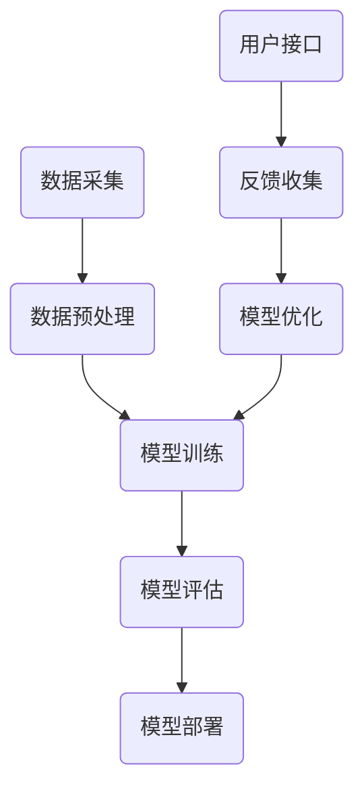

                 

### 文章标题

《AI开发的敏捷迭代：Lepton AI的快速响应》

关键词：AI开发，敏捷迭代，Lepton AI，快速响应，团队协作，自动化测试，数据驱动开发

摘要：本文深入探讨了AI开发的敏捷迭代方法及其在Lepton AI项目中的应用。通过详细分析敏捷迭代的核心原则、工具与技术，以及实际案例，本文揭示了敏捷迭代在提高AI项目开发效率和质量方面的关键作用。同时，本文还总结了敏捷迭代的挑战与解决方案，为AI开发者提供了宝贵的实践经验和指导。

---

### 文章关键词

AI开发，敏捷迭代，Lepton AI，快速响应，团队协作，自动化测试，数据驱动开发

---

### 文章摘要

本文旨在探讨AI开发的敏捷迭代方法，通过分析敏捷迭代的核心原则、工具与技术，以及具体实践案例，深入探讨了敏捷迭代在提高AI项目开发效率和质量方面的作用。文章首先介绍了AI开发的敏捷迭代方法论，包括敏捷开发与AI开发的结合、敏捷迭代的优势等。随后，本文详细介绍了Lepton AI的概念、核心功能和应用场景，并探讨了其快速响应机制。接着，文章重点介绍了敏捷迭代工具与技术的应用，包括敏捷项目管理工具、自动化测试与持续集成、数据驱动开发等。随后，文章通过实际案例展示了Lepton AI的敏捷迭代流程、敏捷测试与反馈、团队协作等方面的实践。最后，本文总结了敏捷迭代的挑战与解决方案，并提出了最佳实践和持续改进的方法。

---

接下来，我们将逐步深入探讨AI开发的敏捷迭代方法，首先介绍敏捷迭代方法论，并分析其与AI开发的结合点。

---

## 第一部分：AI开发的敏捷迭代概述

### 第1章：AI开发的敏捷迭代方法论

#### 1.1 敏捷开发与AI开发的结合

敏捷开发（Agile Development）起源于20世纪90年代末，旨在通过迭代和增量的方法提高软件开发的效率和质量。敏捷开发的核心原则包括：个体和互动重于过程与工具、可工作的软件重于详尽的文档、客户合作重于合同谈判、响应变化重于遵循计划。这些原则为软件开发的灵活性和适应性提供了坚实的基础。

随着人工智能（AI）技术的发展，AI开发也逐渐开始采用敏捷开发的方法。AI开发与敏捷开发的结合点主要体现在以下几个方面：

1. **迭代和增量开发**：AI项目通常涉及大量的数据预处理、模型训练和优化过程，这些任务具有高复杂性和不确定性。通过迭代和增量开发，AI团队可以不断调整和优化模型，提高开发效率和质量。

2. **快速反馈和持续改进**：敏捷开发强调快速反馈和持续改进，这与AI开发中不断调整模型参数、优化算法的需求相契合。通过快速反馈，AI团队能够及时发现问题并进行调整，从而提高模型的性能。

3. **用户参与**：敏捷开发倡导用户参与，这有助于AI团队更好地理解用户需求，并将其快速转化为实际的功能。在AI开发中，用户的需求往往非常复杂且不断变化，用户参与能够帮助团队更准确地把握用户需求，提高产品满意度。

#### 1.2 敏捷迭代的优势

敏捷迭代在AI开发中具有以下优势：

1. **提高开发效率**：通过迭代和增量开发，AI团队能够更快速地交付可工作的软件，从而缩短开发周期，提高开发效率。

2. **降低风险**：敏捷迭代允许团队在开发过程中及时发现和解决问题，从而降低项目风险。

3. **提高产品满意度**：敏捷迭代强调用户参与，有助于团队更好地理解用户需求，从而提高产品的满意度。

4. **灵活应对变化**：敏捷迭代允许团队快速响应需求变化，从而提高项目的适应性。

#### 1.3 Lepton AI简介

Lepton AI是一种基于深度学习的AI框架，旨在提供高效的图像处理和计算机视觉解决方案。Lepton AI具有以下核心功能：

1. **图像识别**：Lepton AI能够对图像中的物体进行识别和分类，支持多种常见的图像识别任务，如人脸识别、物体检测等。

2. **图像增强**：Lepton AI能够对图像进行增强，提高图像的质量和清晰度，为后续处理提供更好的数据。

3. **实时处理**：Lepton AI支持实时图像处理，能够快速响应并处理大量图像数据，适用于需要实时反馈的应用场景。

Lepton AI广泛应用于多个领域，如智能监控、自动驾驶、医疗诊断等，为这些领域提供了强大的技术支持。

#### 1.4 Lepton AI的快速响应机制

Lepton AI的快速响应机制是其核心优势之一。通过实时数据采集与处理、智能预测与响应策略，以及自动化反馈与优化，Lepton AI能够快速响应用户需求，提高系统的性能和用户体验。

1. **实时数据采集与处理**：Lepton AI采用高性能的图像处理算法，能够快速采集和处理图像数据。通过实时数据采集，系统能够及时获取最新的图像信息，为后续处理提供基础。

2. **智能预测与响应策略**：Lepton AI内置了智能预测模型，能够根据历史数据和当前状态，预测未来的发展趋势和用户需求。基于预测结果，系统可以主动调整策略，提高响应速度和准确性。

3. **自动化反馈与优化**：Lepton AI支持自动化反馈机制，能够对系统的运行情况进行实时监控和分析。通过自动化反馈，系统能够及时发现和解决潜在问题，提高系统的稳定性和可靠性。

综上所述，敏捷迭代在AI开发中具有重要意义，而Lepton AI的快速响应机制则为其提供了强大的技术保障。在下一章中，我们将进一步探讨敏捷迭代工具与技术，以了解如何在实践中实现敏捷迭代。

---

在上文中，我们介绍了敏捷迭代方法论及其与AI开发的结合点，阐述了敏捷迭代的优势以及Lepton AI的核心功能与快速响应机制。接下来，我们将深入探讨敏捷迭代工具与技术，为AI项目的敏捷迭代实践提供技术支持。

### 第2章：敏捷迭代工具与技术

#### 2.1 敏捷项目管理工具

敏捷项目管理工具是敏捷迭代实践的重要组成部分，它们帮助团队有效地管理项目任务、跟踪进度和协作沟通。以下是几种常用的敏捷项目管理工具：

1. **JIRA**：
   - **功能特点**：JIRA是一款功能强大的敏捷项目管理工具，支持任务管理、敏捷板、报告和统计功能。
   - **使用场景**：适用于大型团队和复杂项目的需求管理、任务分配和进度跟踪。

2. **Trello**：
   - **功能特点**：Trello是一款直观易用的敏捷项目管理工具，基于看板（Kanban）方法，通过卡片和列表进行任务管理。
   - **使用场景**：适用于小型团队和简单项目的任务分解、优先级排序和进度跟踪。

3. **GitLab**：
   - **功能特点**：GitLab是一款集代码管理、项目协作和持续集成于一体的敏捷项目管理工具。
   - **使用场景**：适用于开发团队，支持代码审查、分支管理和自动化构建。

#### 2.2 自动化测试与持续集成

自动化测试和持续集成（Continuous Integration, CI）是敏捷迭代中不可或缺的技术手段。它们能够提高开发效率、确保代码质量，并缩短发布周期。

1. **自动化测试**：
   - **定义**：自动化测试是指通过编写脚本或使用工具自动执行测试过程，以验证软件功能的正确性。
   - **优势**：
     - 提高测试效率：自动化测试可以快速执行大量测试用例，缩短测试时间。
     - 确保代码质量：自动化测试能够及时发现和修复代码缺陷，提高软件质量。
     - 减少人力成本：自动化测试减少了手动测试的工作量，降低了人力成本。

2. **持续集成**：
   - **定义**：持续集成是指将代码的频繁提交集成到一个共同的代码库中，并进行自动化测试和构建，以确保整个系统的稳定性。
   - **优势**：
     - 提高发布效率：持续集成能够快速检测代码问题，确保代码质量，缩短发布周期。
     - 降低风险：持续集成确保了每次提交的代码都能与现有代码库集成，减少了集成风险。
     - 提高团队协作：持续集成促进了团队成员之间的协作，提高了开发效率。

#### 2.3 数据驱动开发

数据驱动开发（Data-Driven Development, DDD）是一种通过数据收集、分析和反馈来指导软件开发的方法。它强调数据的实时性和准确性，为开发决策提供依据。

1. **数据收集与处理**：
   - **定义**：数据收集是指从各种数据源（如用户行为、系统日志等）获取数据，并进行清洗、转换和存储。
   - **技术手段**：
     - 数据采集工具：如Flume、Kafka等。
     - 数据处理框架：如Apache Spark、Flink等。

2. **数据分析工具**：
   - **定义**：数据分析是指使用统计学、机器学习等方法对数据进行挖掘和分析，以发现数据中的规律和模式。
   - **技术手段**：
     - 数据库查询工具：如SQL、NoSQL等。
     - 数据分析工具：如Python的Pandas、Scikit-learn等。

3. **数据可视化与监控**：
   - **定义**：数据可视化是指将数据通过图表、地图等形式进行展示，以便更好地理解和分析数据。
   - **技术手段**：
     - 数据可视化工具：如Matplotlib、Plotly等。
     - 监控工具：如Kibana、Grafana等。

通过数据驱动开发，AI团队能够更准确地把握用户需求和市场变化，快速调整和优化产品，提高开发效率和质量。

#### 2.4 其他敏捷迭代工具

除了上述工具，还有许多其他工具和技术可以帮助团队实现敏捷迭代。例如：

1. **Git**：版本控制系统，用于代码管理和版本控制。
2. **Slack**：团队沟通工具，用于实时沟通和协作。
3. **Confluence**：文档管理工具，用于记录和管理项目文档。
4. **Jenkins**：持续集成工具，用于自动化构建和部署。

这些工具相互配合，共同构成了一个完整的敏捷迭代体系，为AI项目的成功实施提供了有力保障。

通过本章的介绍，我们了解了敏捷迭代工具与技术的基本概念和应用场景，为后续的Lepton AI敏捷迭代实践奠定了基础。在下一章中，我们将进一步探讨Lepton AI的敏捷迭代流程，以深入了解其在实际项目中的应用。

---

在上文中，我们介绍了敏捷迭代的核心工具与技术。接下来，我们将详细描述Lepton AI的敏捷迭代流程，并通过实际案例展示其在AI开发中的应用。

### 第3章：Lepton AI的敏捷迭代流程

#### 3.1 迭代计划与目标设定

敏捷迭代的第一步是迭代计划与目标设定。迭代计划包括确定迭代周期、明确迭代目标、分配任务和制定进度安排。

1. **迭代周期的规划**：
   - **定义**：迭代周期是指从一个迭代开始到完成所需的时间，通常为1到4周。
   - **规划方法**：
     - **时间切片法**：将项目周期划分为多个时间切片，每个时间切片为一个迭代。
     - **任务分解法**：将项目任务分解为可管理的子任务，每个子任务对应一个迭代。

2. **迭代目标的确定**：
   - **定义**：迭代目标是指在一个迭代周期内，团队期望实现的功能和改进。
   - **设定方法**：
     - **用户故事法**：用户故事（User Story）是一种简明扼要的需求描述方法，用于明确迭代目标。
     - **功能分解法**：将大功能分解为多个小功能，每个小功能对应一个迭代目标。

3. **任务分配与进度安排**：
   - **定义**：任务分配是指将迭代目标分解为具体的任务，并分配给团队成员。
   - **安排方法**：
     - **任务分解图**：使用任务分解图（Work Breakdown Structure, WBS）将任务分解为可管理的子任务。
     - **甘特图**：使用甘特图（Gantt Chart）规划任务的进度和资源分配。

#### 3.2 需求管理

需求管理是敏捷迭代中至关重要的一环，它确保团队能够准确理解和实现用户需求。

1. **用户需求收集**：
   - **定义**：用户需求是指用户对软件系统的期望和需求。
   - **收集方法**：
     - **用户访谈**：通过与用户进行面对面的访谈，深入了解用户需求和期望。
     - **问卷调查**：通过问卷调查收集用户意见和需求。

2. **需求分析与优先级排序**：
   - **定义**：需求分析是对用户需求进行解析和评估，以确定系统功能和技术方案。
   - **分析方法**：
     - **用户故事地图**：使用用户故事地图（User Story Map）将用户需求可视化，便于分析和理解。
     - **优先级排序法**：使用Kano模型、MoSCoW模型等对需求进行优先级排序，确保团队专注于关键需求。

3. **需求变更管理**：
   - **定义**：需求变更是指在项目进行过程中，对已确定的需求进行修改或调整。
   - **变更管理方法**：
     - **变更请求流程**：建立变更请求（Change Request）流程，明确变更申请、评估、批准和实施的步骤。
     - **影响分析**：评估需求变更对项目进度、成本和风险的影响，确保变更的可控性。

#### 3.3 设计与开发

设计与开发是敏捷迭代的执行阶段，团队根据迭代目标和需求进行系统设计、编码和测试。

1. **功能设计与原型制作**：
   - **定义**：功能设计是指确定系统功能模块和交互逻辑。
   - **原型制作方法**：
     - **低保真原型**：使用低保真原型工具（如Axure、Balsamiq）制作功能原型，便于快速迭代和反馈。
     - **高保真原型**：在低保真原型的基础上，添加细节和交互效果，制作高保真原型。

2. **代码开发与版本控制**：
   - **定义**：代码开发是指编写和实现系统功能。
   - **版本控制方法**：
     - **Git**：使用Git进行版本控制，确保代码的安全性和可追溯性。
     - **分支管理**：使用分支管理策略（如GitFlow、Forking Workflow）进行代码的分支和合并。

3. **设计评审与迭代反馈**：
   - **定义**：设计评审是指对系统设计进行评估和讨论，以确保设计的可行性和合理性。
   - **迭代反馈方法**：
     - **代码审查**：通过代码审查（Code Review）发现代码中的潜在问题，提高代码质量。
     - **用户反馈**：收集用户对系统的反馈，用于改进设计和功能。

#### 3.4 迭代评估与反馈

迭代评估与反馈是敏捷迭代的收尾阶段，团队对本次迭代进行总结和评估，并制定下一轮迭代的计划。

1. **迭代评估**：
   - **定义**：迭代评估是对本次迭代的工作进行总结和评估，以识别成功和不足之处。
   - **评估方法**：
     - **KPI分析**：使用关键绩效指标（Key Performance Indicators, KPI）评估迭代目标的完成情况。
     - **用户满意度调查**：通过用户满意度调查（User Satisfaction Survey）了解用户对系统的满意度。

2. **反馈与迭代优化**：
   - **定义**：反馈是指对迭代过程中的问题进行反馈和讨论，以改进下一轮迭代。
   - **优化方法**：
     - **经验总结**：总结本次迭代中的经验和教训，为下一轮迭代提供参考。
     - **改进方案**：针对发现的问题，制定具体的改进方案，并在下一轮迭代中实施。

#### 3.5 Lepton AI敏捷迭代案例分析

为了更直观地了解Lepton AI的敏捷迭代流程，我们以下通过一个实际案例进行说明：

**案例背景**：某公司开发一款基于Lepton AI的智能安防系统，旨在通过图像识别和智能分析，提高安全监控的效率和准确性。

**迭代周期**：每个迭代周期为2周。

**迭代目标**：
1. **第1轮迭代**：实现人脸识别和人流量统计功能。
2. **第2轮迭代**：优化人脸识别算法，提高识别准确率。
3. **第3轮迭代**：添加入侵检测功能，提高系统的安全性。

**需求管理**：
- **用户访谈**：与客户和安全专家进行多次访谈，收集需求和意见。
- **用户故事**：根据访谈结果，编写用户故事，明确迭代目标。
- **优先级排序**：使用MoSCoW模型对用户故事进行优先级排序。

**设计与开发**：
- **低保真原型**：制作功能原型，明确系统功能和界面设计。
- **代码开发**：采用Git进行版本控制，确保代码安全性和可追溯性。
- **设计评审**：通过团队讨论和用户反馈，改进系统设计和功能。

**迭代评估与反馈**：
- **KPI分析**：评估人脸识别和人流量统计功能的完成情况，收集用户满意度。
- **用户反馈**：与客户和安全专家讨论系统使用情况，收集改进意见。
- **改进方案**：针对发现的问题，制定改进方案，并在下一轮迭代中实施。

通过上述案例，我们可以看到Lepton AI的敏捷迭代流程如何在实际项目中应用，从而实现快速响应和持续优化。

在下一章中，我们将进一步探讨敏捷测试与反馈在Lepton AI敏捷迭代中的重要作用。

---

在上一章中，我们详细介绍了Lepton AI的敏捷迭代流程，包括迭代计划与目标设定、需求管理、设计与开发、迭代评估与反馈。在本章中，我们将深入探讨敏捷测试与反馈在Lepton AI敏捷迭代中的重要性，包括测试策略与计划、自动化测试实践，以及反馈与迭代优化。

### 4.1 测试策略与计划

敏捷测试是敏捷开发过程中的重要环节，它确保系统的质量，提高项目的可靠性和稳定性。在Lepton AI的敏捷迭代中，测试策略与计划的制定至关重要。

1. **单元测试**：
   - **定义**：单元测试是针对系统中的最小可测试单元（通常是函数或方法）进行的测试。
   - **目的**：验证单元功能的正确性，确保代码的可靠性。
   - **实施方法**：
     - **编写测试用例**：根据功能需求编写测试用例，确保覆盖所有可能的输入和输出。
     - **自动化测试**：使用自动化测试工具（如JUnit、pytest）执行测试用例，提高测试效率。

2. **集成测试**：
   - **定义**：集成测试是针对系统中的多个模块或组件进行联合测试。
   - **目的**：验证模块间的接口和交互逻辑，确保系统的整体功能正确性。
   - **实施方法**：
     - **构建测试环境**：搭建与生产环境类似的测试环境，确保测试的准确性。
     - **测试用例设计**：设计集成测试用例，覆盖系统的主要功能和关键路径。
     - **自动化测试**：使用自动化测试工具（如Selenium、Cucumber）执行集成测试用例。

3. **系统测试**：
   - **定义**：系统测试是针对整个系统进行的测试，包括功能测试、性能测试、安全测试等。
   - **目的**：验证系统的整体功能、性能和稳定性，确保系统满足用户需求。
   - **实施方法**：
     - **需求分析**：根据用户需求和分析结果，制定系统测试计划。
     - **测试用例设计**：设计系统测试用例，确保全面覆盖系统的功能和性能。
     - **自动化测试**：使用自动化测试工具（如JMeter、LoadRunner）执行系统测试用例。

#### 4.2 自动化测试实践

自动化测试在敏捷迭代中具有显著的优势，它能够提高测试效率、减少人为错误，并确保测试的持续性和一致性。以下是Lepton AI敏捷迭代中自动化测试的具体实践：

1. **测试框架的选择**：
   - **定义**：测试框架是一个用于编写、执行和管理测试的软件工具。
   - **选择标准**：
     - **兼容性**：测试框架应支持多种编程语言和平台。
     - **可扩展性**：测试框架应能够支持复杂的测试用例和场景。
     - **维护性**：测试框架应易于维护和更新。

2. **CI/CD流程的构建**：
   - **定义**：CI/CD（Continuous Integration/Continuous Deployment）是一种持续集成和持续部署的自动化流程。
   - **构建流程**：
     - **代码集成**：将开发者的代码集成到一个共享的代码库中，进行自动化测试。
     - **自动化测试**：执行自动化测试用例，确保代码集成后的功能正确性。
     - **持续部署**：将经过测试的代码部署到生产环境，确保系统的持续可用性。

3. **自动化测试的优势**：
   - **提高测试效率**：自动化测试能够快速执行大量测试用例，缩短测试时间。
   - **减少人为错误**：自动化测试减少了对人工操作的依赖，降低了人为错误的风险。
   - **确保测试一致性**：自动化测试确保每次测试的执行过程和结果一致，提高了测试的可靠性。
   - **持续测试**：自动化测试能够持续运行，确保代码的持续质量和稳定性。

#### 4.3 反馈与迭代优化

敏捷迭代中的反馈机制至关重要，它能够帮助团队及时发现和解决问题，优化迭代过程和产品性能。

1. **用户反馈收集**：
   - **定义**：用户反馈是指用户对系统功能和性能的反馈和建议。
   - **收集方法**：
     - **用户访谈**：与用户进行面对面的访谈，了解他们的使用体验和需求。
     - **问卷调查**：通过问卷调查收集用户对系统的满意度和建议。
     - **反馈渠道**：建立用户反馈渠道，如在线反馈表、社交媒体等，方便用户随时提出意见和建议。

2. **问题定位与修复**：
   - **定义**：问题定位是指识别系统中的故障或缺陷，并确定其根本原因。
   - **修复方法**：
     - **缺陷管理**：使用缺陷管理工具（如JIRA、Bugzilla）记录和分析缺陷。
     - **快速修复**：针对严重缺陷，制定快速修复方案，确保系统稳定运行。
     - **回滚策略**：在紧急情况下，可以回滚到上一个稳定版本，以避免新版本引入的缺陷影响用户。

3. **优化方案实施**：
   - **定义**：优化方案是指针对系统性能、用户体验等方面的问题，制定的具体改进措施。
   - **实施方法**：
     - **性能分析**：使用性能分析工具（如New Relic、AppDynamics）对系统进行性能分析，识别瓶颈和优化点。
     - **用户体验优化**：根据用户反馈和性能分析结果，对系统界面和功能进行优化，提高用户体验。
     - **持续优化**：持续收集用户反馈和性能数据，定期评估和优化系统，确保系统的持续改进。

通过上述测试策略与计划、自动化测试实践，以及反馈与迭代优化，Lepton AI在敏捷迭代中实现了快速响应和持续改进。在下一章中，我们将探讨敏捷迭代中的团队协作，分析团队协作工具、人员配置与协作方法，以及持续学习与改进的重要性。

---

在上文中，我们详细探讨了敏捷测试与反馈在Lepton AI敏捷迭代中的应用，包括测试策略与计划、自动化测试实践以及反馈与迭代优化。在本章中，我们将深入探讨敏捷迭代中的团队协作，分析团队协作工具、人员配置与协作方法，以及持续学习与改进的重要性。

### 5.1 团队协作工具

在敏捷开发中，团队协作至关重要。为了提高团队的协作效率和沟通质量，选择合适的团队协作工具是至关重要的。以下是几种常用的团队协作工具：

1. **Slack**：
   - **功能特点**：Slack是一款实时沟通和协作工具，支持文本消息、视频会议、文件共享和集成第三方服务。
   - **使用场景**：适用于团队内部的实时沟通、任务分配和协作。

2. **Trello**：
   - **功能特点**：Trello是一款基于看板方法的任务管理工具，通过卡片和列表展示任务进度。
   - **使用场景**：适用于任务分解、优先级排序和进度跟踪。

3. **Confluence**：
   - **功能特点**：Confluence是一款协作平台，支持文档管理、知识共享和版本控制。
   - **使用场景**：适用于项目文档的编写、存储和共享，以及团队知识的积累和传承。

4. **JIRA**：
   - **功能特点**：JIRA是一款功能强大的敏捷项目管理工具，支持任务管理、敏捷板、报告和统计功能。
   - **使用场景**：适用于大型团队和复杂项目的需求管理、任务分配和进度跟踪。

5. **GitLab**：
   - **功能特点**：GitLab是一款集代码管理、项目协作和持续集成于一体的敏捷项目管理工具。
   - **使用场景**：适用于开发团队，支持代码审查、分支管理和自动化构建。

通过这些团队协作工具，团队可以更好地管理任务、跟踪进度、共享知识和协作沟通，提高整体工作效率。

### 5.2 人员配置与协作

在敏捷迭代中，合理的人员配置和高效的协作是确保项目成功的关键。以下是一些人员配置与协作的方法：

1. **人员角色与职责**：
   - **Scrum Master**：负责指导团队遵循敏捷实践，解决团队面临的障碍。
   - **Product Owner**：负责制定产品愿景和需求，与用户沟通，确保团队按照用户需求进行开发。
   - **开发团队**：包括开发者、测试工程师和其他技术人员，负责实现和测试产品功能。

2. **协作流程优化**：
   - **每日站会**：每天早上召开简短的站会，团队成员分享工作进展和遇到的障碍。
   - **迭代规划会**：在迭代开始前，团队进行迭代规划，明确迭代目标和任务分配。
   - **回顾会议**：在迭代结束后，团队进行回顾会议，总结经验和教训，改进未来的工作。

3. **协作工具与技术的应用**：
   - **敏捷工具的使用**：利用Trello、JIRA等工具进行任务管理、进度跟踪和协作沟通。
   - **版本控制工具的使用**：使用Git进行代码管理和版本控制，确保代码的完整性和可追溯性。
   - **持续集成工具的使用**：使用Jenkins等工具实现自动化构建和部署，确保代码的质量和稳定性。

通过合理的人员配置和高效的协作流程，团队可以更好地应对项目中的各种挑战，提高项目的成功率。

### 5.3 持续学习与改进

在敏捷迭代中，持续学习与改进是团队不断进步的重要保障。以下是一些持续学习与改进的方法：

1. **技术培训与分享**：
   - **内部培训**：组织定期的内部技术培训，提高团队成员的技术能力。
   - **外部学习**：鼓励团队成员参加行业会议、研讨会和培训课程，了解最新的技术动态。

2. **经验总结与反思**：
   - **迭代回顾**：在每次迭代结束后，团队进行回顾会议，总结成功经验和失败教训。
   - **问题反馈**：鼓励团队成员提出问题和建议，改进团队的工作方法和流程。

3. **团队文化建设**：
   - **开放氛围**：营造开放、包容的团队氛围，鼓励团队成员分享自己的想法和意见。
   - **信任与支持**：建立团队成员之间的信任关系，提供必要的支持和帮助，共同解决问题。

通过持续学习与改进，团队可以不断提高自身的专业能力和协作效率，为项目的成功实施提供有力保障。

综上所述，团队协作在敏捷迭代中起着至关重要的作用。通过合理的人员配置、优化协作流程、应用团队协作工具，以及持续学习与改进，团队可以更好地应对项目挑战，提高项目的成功率。在下一章中，我们将通过具体案例展示Lepton AI在敏捷迭代中的实践，进一步探讨敏捷迭代的实际应用效果。

### 6.1 案例一：智能客服系统的敏捷迭代

为了更好地理解Lepton AI在敏捷迭代中的实际应用，我们以下通过一个智能客服系统的敏捷迭代案例进行说明。

**案例背景**：某大型电商平台计划开发一款基于Lepton AI的智能客服系统，以提高客户服务质量，降低人工成本。

**迭代目标**：
1. **第1轮迭代**：实现基本的语音识别和文本生成功能，能够处理简单的用户咨询。
2. **第2轮迭代**：优化语音识别和文本生成的准确性，扩展智能客服的功能范围。
3. **第3轮迭代**：增加智能客服的情感分析功能，提高客服的交互质量和用户体验。

**需求管理**：
- **用户访谈**：通过与平台客服团队和部分用户进行访谈，收集用户需求和反馈。
- **用户故事**：根据访谈结果，编写用户故事，明确每个迭代的目标和功能需求。
- **优先级排序**：使用MoSCoW模型对用户故事进行优先级排序，确保团队专注于关键需求。

**设计与开发**：
- **原型制作**：在低保真原型的基础上，逐步完善功能设计和界面设计。
- **代码开发**：采用Git进行版本控制，确保代码的安全性和可追溯性。
- **设计评审**：通过团队讨论和用户反馈，改进系统设计和功能。

**自动化测试**：
- **测试框架**：选择pytest作为自动化测试框架，支持多种编程语言和平台。
- **测试用例设计**：根据用户故事和需求，编写测试用例，确保覆盖所有功能场景。
- **自动化测试执行**：使用pytest执行测试用例，确保每次迭代后的功能正确性。

**迭代评估与反馈**：
- **KPI分析**：通过关键绩效指标（如响应时间、准确率、用户满意度）评估迭代目标的完成情况。
- **用户反馈**：与用户和客服团队讨论系统使用情况，收集改进意见和建议。
- **改进方案**：针对发现的问题和用户反馈，制定具体的改进措施，并在下一轮迭代中实施。

**迭代一：实现基本功能**
- **需求**：实现基本的语音识别和文本生成功能，处理简单的用户咨询。
- **实现**：通过语音识别技术，将用户语音转化为文本，并利用自然语言处理（NLP）技术生成文本回复。
- **测试**：编写测试用例，测试语音识别和文本生成功能的准确性，确保基本功能的实现。

**迭代二：优化功能准确性**
- **需求**：提高语音识别和文本生成的准确性，扩展智能客服的功能范围。
- **实现**：优化语音识别算法，提高语音识别的准确率。引入更多NLP模型，扩展客服的功能，如问答系统、情感分析等。
- **测试**：在自动化测试的基础上，增加功能测试和场景测试，确保扩展功能的质量。

**迭代三：提高交互质量**
- **需求**：增加智能客服的情感分析功能，提高客服的交互质量和用户体验。
- **实现**：引入情感分析模型，分析用户文本中的情感倾向，并根据情感分析结果调整文本回复。
- **测试**：编写情感分析测试用例，测试情感分析模型的准确性和稳定性。

通过以上三个迭代，智能客服系统逐渐完善，不仅实现了基本功能，还提高了交互质量和用户体验。在实际应用中，智能客服系统得到了用户和客服团队的好评，有效提高了客户服务质量，降低了人工成本。

### 6.2 案例二：智慧医疗的敏捷迭代

除了智能客服系统，Lepton AI在智慧医疗领域也具有广泛的应用前景。以下是一个智慧医疗系统的敏捷迭代案例。

**案例背景**：某医疗机构计划开发一款基于Lepton AI的智慧医疗系统，旨在通过图像识别和智能分析，提高医疗诊断的效率和准确性。

**迭代目标**：
1. **第1轮迭代**：实现基本的图像识别和疾病分类功能，提供初步的医疗诊断支持。
2. **第2轮迭代**：优化图像识别算法，提高疾病的识别准确率。
3. **第3轮迭代**：增加智能诊断和健康建议功能，提供更全面的医疗诊断和健康指导。

**需求管理**：
- **用户访谈**：与医疗机构医生、护士和患者进行访谈，了解他们的需求和期望。
- **用户故事**：根据访谈结果，编写用户故事，明确每个迭代的目标和功能需求。
- **优先级排序**：使用MoSCoW模型对用户故事进行优先级排序，确保团队专注于关键需求。

**设计与开发**：
- **原型制作**：在低保真原型的基础上，逐步完善功能设计和界面设计。
- **代码开发**：采用Git进行版本控制，确保代码的安全性和可追溯性。
- **设计评审**：通过团队讨论和用户反馈，改进系统设计和功能。

**自动化测试**：
- **测试框架**：选择pytest作为自动化测试框架，支持多种编程语言和平台。
- **测试用例设计**：根据用户故事和需求，编写测试用例，确保覆盖所有功能场景。
- **自动化测试执行**：使用pytest执行测试用例，确保每次迭代后的功能正确性。

**迭代评估与反馈**：
- **KPI分析**：通过关键绩效指标（如诊断准确率、响应时间、用户满意度）评估迭代目标的完成情况。
- **用户反馈**：与用户和医生团队讨论系统使用情况，收集改进意见和建议。
- **改进方案**：针对发现的问题和用户反馈，制定具体的改进措施，并在下一轮迭代中实施。

**迭代一：实现基本功能**
- **需求**：实现基本的图像识别和疾病分类功能，提供初步的医疗诊断支持。
- **实现**：利用Lepton AI的图像识别技术，对医疗图像进行分类，初步诊断疾病。
- **测试**：编写测试用例，测试图像识别和疾病分类功能的准确性，确保基本功能的实现。

**迭代二：优化识别准确率**
- **需求**：优化图像识别算法，提高疾病的识别准确率。
- **实现**：通过改进图像识别算法，提高图像处理的准确性和鲁棒性，提高疾病识别的准确率。
- **测试**：增加图像识别测试用例，测试优化后的算法在多种场景下的表现。

**迭代三：增加智能诊断和健康建议**
- **需求**：增加智能诊断和健康建议功能，提供更全面的医疗诊断和健康指导。
- **实现**：引入智能诊断模型，根据患者的病史、体检结果和症状，提供更准确的诊断建议。同时，提供健康建议，如饮食、运动等，帮助患者改善生活方式。
- **测试**：编写智能诊断和健康建议测试用例，测试功能的准确性和实用性。

通过以上三个迭代，智慧医疗系统逐渐完善，不仅实现了基本功能，还提高了诊断准确率和用户体验。在实际应用中，智慧医疗系统得到了医生和患者的好评，有效提高了医疗服务的质量和效率。

通过以上两个案例，我们可以看到Lepton AI在敏捷迭代中的实际应用效果。通过敏捷迭代方法，团队可以快速响应需求变化，优化产品功能，提高开发效率和质量。同时，自动化测试和反馈机制确保了系统的稳定性和可靠性，为项目的成功实施提供了有力保障。

### 第7章：敏捷迭代的挑战与解决方案

在敏捷迭代的实际应用中，尽管取得了显著成效，但也会面临诸多挑战。本章将探讨敏捷迭代中常见的一些挑战，并提出相应的解决方案。

#### 7.1 挑战一：需求变更管理

敏捷迭代强调快速响应需求变化，但在实际项目中，需求变更往往频繁且难以预测。需求变更管理不当可能导致项目延期、成本超支和团队士气低落。

1. **变更请求的处理**：
   - **定义**：变更请求（Change Request）是指对现有需求进行修改或新增的请求。
   - **处理方法**：
     - **建立变更请求流程**：明确变更请求的提出、评估、批准和实施步骤。
     - **风险评估**：评估需求变更对项目进度、成本和风险的影响，确保变更的可行性。
     - **优先级排序**：根据变更的重要性、紧急性和影响范围，对变更请求进行优先级排序。

2. **变更后的影响分析**：
   - **定义**：变更后的影响分析是指评估需求变更对项目各个方面（如功能、性能、用户界面等）的影响。
   - **分析方法**：
     - **成本效益分析**：评估变更带来的成本和效益，确保变更的合理性。
     - **时间线调整**：根据变更的影响，调整项目的进度安排，确保按时交付。

#### 7.2 挑战二：团队协作与沟通

敏捷迭代强调团队合作和沟通，但在实际项目中，团队协作和沟通问题仍然存在，可能导致项目进展缓慢或质量下降。

1. **协作效率的评估**：
   - **定义**：协作效率是指团队在项目中的协作能力和效果。
   - **评估方法**：
     - **团队绩效评估**：通过关键绩效指标（KPI）评估团队的协作效率。
     - **用户满意度调查**：通过用户满意度调查了解团队协作效果。

2. **沟通障碍的解决**：
   - **定义**：沟通障碍是指团队内部或团队之间在沟通中遇到的障碍，如信息不对称、语言障碍、文化差异等。
   - **解决方法**：
     - **建立有效的沟通机制**：明确沟通渠道、频率和方式，确保信息传递的及时性和准确性。
     - **加强团队建设**：通过团队培训、团队活动等方式，增强团队成员之间的信任和默契。

3. **团队成员的激励**：
   - **定义**：团队成员的激励是指通过激励机制提高团队成员的工作积极性和创造力。
   - **激励方法**：
     - **绩效奖励**：根据团队成员的工作表现，提供绩效奖励，如奖金、晋升机会等。
     - **团队氛围**：营造积极、开放、包容的团队氛围，鼓励团队成员分享想法和意见。

#### 7.3 挑战三：技术难题与优化

敏捷迭代中的技术难题和优化需求是不可避免的，这些难题可能影响项目的进度和质量。

1. **技术难题的识别**：
   - **定义**：技术难题是指项目中遇到的技术难点，如算法复杂度、系统稳定性、性能优化等。
   - **识别方法**：
     - **问题诊断**：通过代码审查、测试报告等手段，识别项目中存在的技术难题。
     - **专家咨询**：邀请相关技术专家进行评估和咨询，了解技术难题的解决方案。

2. **技术优化方案**：
   - **定义**：技术优化方案是指针对技术难题提出的具体改进措施和优化方案。
   - **优化方法**：
     - **算法优化**：通过改进算法和数据结构，提高系统的效率和性能。
     - **架构优化**：通过调整系统架构，提高系统的可扩展性和稳定性。
     - **工具升级**：引入新的开发工具和测试工具，提高开发效率和质量。

3. **技术储备与迭代**：
   - **定义**：技术储备是指团队在项目中积累的技术知识和经验。
   - **迭代方法**：
     - **知识分享**：通过内部培训、技术讲座等方式，分享技术储备，提高团队的整体技术水平。
     - **持续学习**：鼓励团队成员参加行业会议、研讨会和培训课程，不断更新和扩展技术储备。

通过上述解决方案，团队可以更好地应对敏捷迭代中的挑战，提高项目的成功率和质量。在下一章中，我们将总结敏捷迭代的最佳实践，并探讨如何在实际项目中实施这些实践。

### 第8章：敏捷迭代的最佳实践

#### 8.1 最佳实践一：敏捷开发流程

实现敏捷迭代的成功离不开一个完善的敏捷开发流程。以下是一些最佳实践：

1. **精细化流程设计**：
   - **定义**：精细化流程设计是指对敏捷开发流程的各个环节进行详细规划和设计。
   - **方法**：
     - **迭代周期规划**：明确每个迭代的目标、任务和时间安排，确保流程的有序进行。
     - **任务分解**：将大任务分解为小任务，提高任务的执行效率和可管理性。

2. **团队协作优化**：
   - **定义**：团队协作优化是指通过改进团队协作机制，提高团队的工作效率和合作质量。
   - **方法**：
     - **沟通机制**：建立有效的沟通机制，确保信息传递的及时性和准确性。
     - **协作工具**：选用合适的协作工具，如JIRA、Slack等，提高团队的协作效率。

3. **持续改进机制**：
   - **定义**：持续改进机制是指通过定期评估和改进，不断提高项目质量和工作效率。
   - **方法**：
     - **迭代回顾**：在每个迭代结束后，进行回顾会议，总结经验和教训，制定改进措施。
     - **反馈机制**：建立反馈机制，鼓励团队成员提出改进意见和建议，不断优化流程。

#### 8.2 最佳实践二：数据驱动开发

数据驱动开发是一种通过数据收集、分析和反馈来指导软件开发的方法。以下是一些最佳实践：

1. **数据收集与分析**：
   - **定义**：数据收集与分析是指通过收集和分析数据，了解系统的性能、用户行为和市场趋势。
   - **方法**：
     - **数据源选择**：选择合适的数据源，如用户行为日志、系统性能数据等。
     - **数据分析工具**：使用数据分析工具（如Python的Pandas、SQL等），对数据进行清洗、转换和分析。

2. **数据可视化与监控**：
   - **定义**：数据可视化与监控是指通过图表、仪表盘等形式，展示和分析数据，实现对系统的实时监控。
   - **方法**：
     - **数据可视化工具**：使用数据可视化工具（如Matplotlib、D3.js等），将数据转化为易于理解的图表。
     - **监控指标**：定义关键监控指标（KPI），如系统响应时间、错误率、用户活跃度等，实现对系统的实时监控。

3. **数据驱动决策**：
   - **定义**：数据驱动决策是指通过数据分析和反馈，指导项目管理和决策过程。
   - **方法**：
     - **数据驱动任务分配**：根据数据分析和反馈，调整任务优先级和资源分配，提高工作效率。
     - **数据驱动产品优化**：根据用户行为和系统性能数据，优化产品功能和用户体验。

#### 8.3 最佳实践三：快速响应机制

快速响应机制是敏捷迭代的核心之一，以下是一些最佳实践：

1. **反馈收集与处理**：
   - **定义**：反馈收集与处理是指通过用户反馈、测试报告等方式，收集项目中的问题和改进意见。
   - **方法**：
     - **用户反馈渠道**：建立用户反馈渠道，如在线反馈表、社交媒体等，方便用户随时提出意见和建议。
     - **问题分类与处理**：对收集到的反馈进行分类，根据问题的严重性和影响范围，制定相应的处理方案。

2. **自动化测试与部署**：
   - **定义**：自动化测试与部署是指通过自动化测试工具和部署流程，提高项目的测试效率和发布速度。
   - **方法**：
     - **自动化测试框架**：选择合适的自动化测试框架（如JUnit、pytest等），确保测试覆盖全面。
     - **持续集成与部署**：采用持续集成与部署（CI/CD）工具（如Jenkins、Docker等），实现自动化测试和部署。

3. **灵活调整与优化**：
   - **定义**：灵活调整与优化是指根据项目进展和反馈，灵活调整项目计划和策略，实现持续优化。
   - **方法**：
     - **迭代调整**：在每个迭代结束后，根据项目进展和反馈，调整迭代目标和计划。
     - **优化策略**：根据测试结果和用户反馈，不断优化产品功能和用户体验。

通过以上最佳实践，团队可以更好地实施敏捷迭代，提高项目开发效率和质量。在下一章中，我们将探讨如何在实际项目中实施敏捷迭代，并分享一些经验教训。

### 第9章：敏捷迭代的持续改进

在敏捷迭代的实施过程中，持续改进是提升项目质量、效率和团队协作的关键。本章将探讨敏捷迭代的持续改进方法，包括团队建设与培训、敏捷工具与技术的应用，以及敏捷迭代的持续优化。

#### 9.1 团队建设与培训

一个高效的敏捷团队需要具备良好的团队协作能力和持续学习的态度。以下是一些团队建设与培训的方法：

1. **团队协作与沟通**：
   - **定义**：团队协作与沟通是指团队成员之间的合作和交流，以实现共同目标。
   - **方法**：
     - **定期的团队活动**：组织团队建设活动，如团队建设培训、团队拓展等，增强团队成员之间的信任和默契。
     - **透明的沟通机制**：建立透明的沟通机制，确保团队成员能够及时了解项目进展和团队成员的分工。

2. **技术能力提升**：
   - **定义**：技术能力提升是指通过培训和学习，提高团队成员的专业技能和技术水平。
   - **方法**：
     - **内部培训**：组织内部培训，邀请团队成员分享技术心得和实践经验，促进团队整体技术水平的提升。
     - **外部学习**：鼓励团队成员参加外部培训课程、技术讲座和行业会议，了解最新的技术动态和最佳实践。

3. **团队文化塑造**：
   - **定义**：团队文化是指团队成员共同遵循的价值观、行为规范和工作方法。
   - **方法**：
     - **正向激励**：建立正向激励制度，鼓励团队成员积极参与项目和工作，提高团队凝聚力。
     - **共享文化**：倡导共享文化，鼓励团队成员分享知识和经验，促进团队的共同成长。

#### 9.2 敏捷工具与技术的应用

敏捷工具和技术是敏捷迭代成功实施的重要保障。以下是一些敏捷工具与技术的应用方法：

1. **敏捷工具的评估与选择**：
   - **定义**：敏捷工具的评估与选择是指根据项目需求和团队特点，选择合适的敏捷工具。
   - **方法**：
     - **需求分析**：分析项目的具体需求和团队的工作习惯，确定所需的功能和特性。
     - **工具评估**：评估不同敏捷工具的优缺点，选择最符合项目需求的工具。

2. **敏捷工具的集成与优化**：
   - **定义**：敏捷工具的集成与优化是指将多种敏捷工具集成到项目中，并不断优化工具的使用。
   - **方法**：
     - **工具集成**：将JIRA、Trello、Confluence等敏捷工具集成到项目中，实现任务管理、文档管理和协作沟通的一体化。
     - **工具优化**：根据项目进展和团队反馈，不断优化敏捷工具的使用，提高团队的工作效率。

3. **工具使用的培训与推广**：
   - **定义**：工具使用的培训与推广是指对团队成员进行敏捷工具的使用培训，并推广工具的使用。
   - **方法**：
     - **培训计划**：制定详细的培训计划，包括培训内容、培训时间和培训方式。
     - **实战演练**：通过实际操作和演练，帮助团队成员熟练掌握敏捷工具的使用。

#### 9.3 敏捷迭代的持续优化

敏捷迭代的持续优化是确保项目质量、效率和团队协作的关键。以下是一些持续优化的方法：

1. **迭代评估与反馈**：
   - **定义**：迭代评估与反馈是指在每个迭代结束后，对项目进行评估和反馈，识别问题并提出改进措施。
   - **方法**：
     - **迭代回顾**：组织迭代回顾会议，总结经验和教训，讨论改进措施。
     - **用户反馈**：收集用户对项目的反馈，了解用户需求和期望，指导后续迭代的工作。

2. **系统优化与升级**：
   - **定义**：系统优化与升级是指对项目系统进行优化和升级，提高系统的性能、稳定性和安全性。
   - **方法**：
     - **性能优化**：通过代码优化、算法改进和系统重构，提高系统的性能和响应速度。
     - **安全升级**：定期进行安全检查和升级，确保系统的安全性。

3. **长期规划与战略调整**：
   - **定义**：长期规划与战略调整是指根据项目进展和市场变化，调整项目规划和战略方向。
   - **方法**：
     - **项目规划**：制定长期项目规划，明确项目目标和里程碑。
     - **战略调整**：根据市场反馈和项目进展，及时调整项目规划和战略方向。

通过团队建设与培训、敏捷工具与技术的应用以及敏捷迭代的持续优化，团队可以不断提高项目质量和开发效率，实现敏捷迭代的成功。在下一章中，我们将总结文章的核心观点，分享个人感悟，并展望未来在敏捷迭代和AI开发领域的应用前景。

### 附录A：敏捷迭代资源与工具

为了更好地帮助读者了解和实践敏捷迭代，本文附录提供了以下敏捷迭代相关的资源与工具：

#### A.1 敏捷迭代资源

1. **敏捷开发书籍与论文**：
   - 《敏捷软件开发：原则、实践与模式》 - Michael Nygard
   - 《敏捷实践指南》 - Craig Larman 和 Bas Vodde
   - 《敏捷开发的艺术》 - Ken Schwaber 和 Jeff Sutherland
   - 《敏捷项目管理：高效团队的实践》 - Robert C. Martin

2. **敏捷社区与论坛**：
   - Agile Alliance（敏捷联盟）
   - Scrum Alliance（Scrum联盟）
   - Lean Kanban（精益看板）

3. **敏捷开发工具手册**：
   - JIRA官方文档
   - Trello官方文档
   - GitLab官方文档

#### A.2 敏捷迭代工具

1. **JIRA**：
   - 功能：敏捷项目管理、任务跟踪、敏捷看板、报告与分析。
   - 使用教程：[JIRA使用教程](https://www.atlassian.com/software/jira/documentation)

2. **Trello**：
   - 功能：任务管理、看板方法、优先级排序、协作沟通。
   - 最佳实践：[Trello最佳实践](https://trello.com/docs/introduction)

3. **GitLab**：
   - 功能：代码管理、持续集成、持续部署、文档管理。
   - 进阶应用：[GitLab进阶应用](https://gitlab.com/gitlab-examples)

#### A.3 敏捷迭代工具集成与优化

1. **集成与优化策略**：
   - **集成**：将JIRA、Trello、GitLab等工具集成到项目中，实现任务管理、协作沟通和代码管理的一体化。
   - **优化**：根据项目需求和团队反馈，不断优化工具的使用，提高团队的工作效率。

2. **培训与推广**：
   - **培训计划**：制定详细的培训计划，包括培训内容、培训时间和培训方式。
   - **实战演练**：通过实际操作和演练，帮助团队成员熟练掌握敏捷工具的使用。

通过以上资源与工具，读者可以深入了解敏捷迭代的方法和实践，为实际项目的敏捷迭代提供有力支持。

### 附录B：Lepton AI技术指南

为了帮助读者更好地理解和应用Lepton AI，本附录提供了Lepton AI的技术指南，包括架构图、核心算法以及项目实战。

#### B.1 Lepton AI架构图

以下是一个简化的Lepton AI架构图，用于展示系统的组件和接口：



- **数据采集（A）**：实时采集图像和视频数据。
- **数据预处理（B）**：对采集到的数据进行预处理，包括图像增强、缩放、裁剪等。
- **模型训练（C）**：使用预处理后的数据训练深度学习模型。
- **模型评估（D）**：对训练好的模型进行评估，确保模型性能达到预期。
- **模型部署（E）**：将经过评估的模型部署到生产环境，提供实时服务。
- **用户接口（F）**：与用户交互，接收用户输入和反馈。
- **反馈收集（G）**：收集用户反馈，用于模型优化和改进。
- **模型优化（H）**：根据用户反馈，调整模型参数和算法，优化模型性能。

#### B.2 Lepton AI核心算法

以下是一个简单的Lepton AI核心算法的伪代码实现，用于展示主要步骤和流程：

```python
# Lepton AI核心算法伪代码实现

# 数据预处理
def preprocess_data(data):
    # 数据增强
    data = augment_data(data)
    # 数据归一化
    data = normalize_data(data)
    return data

# 模型训练
def train_model(data):
    # 初始化模型
    model = initialize_model()
    # 训练模型
    model = train_automl_model(model, data)
    return model

# 模型评估
def evaluate_model(model, test_data):
    # 预测
    predictions = predict(model, test_data)
    # 评估指标
    metrics = evaluate_predictions(predictions)
    return metrics

# 模型部署
def deploy_model(model):
    # 部署模型到生产环境
    deploy_to_production(model)

# 用户接口
def user_interface():
    # 接收用户输入
    user_input = get_user_input()
    # 预测结果
    prediction = predict(model, user_input)
    # 显示预测结果
    show_prediction(prediction)

# 反馈收集
def feedback_collection(prediction, user_input):
    # 收集用户反馈
    feedback = get_user_feedback(prediction, user_input)
    # 更新模型
    update_model(feedback)

# 主函数
def main():
    # 数据采集
    data = collect_data()
    # 数据预处理
    data = preprocess_data(data)
    # 模型训练
    model = train_model(data)
    # 模型评估
    metrics = evaluate_model(model, test_data)
    # 模型部署
    deploy_model(model)
    # 用户接口
    user_interface()
    # 反馈收集
    feedback_collection(model, user_input)
```

#### B.3 Lepton AI项目实战

以下是一个简单的Lepton AI项目实战，包括开发环境搭建、源代码实现和代码解读。

**开发环境搭建**：

1. 安装Python（3.8以上版本）。
2. 安装深度学习框架（如TensorFlow或PyTorch）。
3. 安装辅助库（如NumPy、Pandas等）。

**源代码实现**：

```python
# Lepton AI项目源代码

# 导入库
import tensorflow as tf
from tensorflow.keras.models import Sequential
from tensorflow.keras.layers import Conv2D, MaxPooling2D, Flatten, Dense
from tensorflow.keras.preprocessing.image import ImageDataGenerator

# 数据预处理
def preprocess_data(data_dir):
    # 加载训练数据和测试数据
    train_datagen = ImageDataGenerator(
        rescale=1./255,
        shear_range=0.2,
        zoom_range=0.2,
        horizontal_flip=True
    )
    test_datagen = ImageDataGenerator(rescale=1./255)

    # 加载训练数据
    train_generator = train_datagen.flow_from_directory(
        data_dir + '/train',
        target_size=(150, 150),
        batch_size=32,
        class_mode='binary'
    )

    # 加载测试数据
    test_generator = test_datagen.flow_from_directory(
        data_dir + '/test',
        target_size=(150, 150),
        batch_size=32,
        class_mode='binary'
    )

    return train_generator, test_generator

# 模型训练
def train_model(train_generator, test_generator):
    # 创建模型
    model = Sequential()
    model.add(Conv2D(32, (3, 3), activation='relu', input_shape=(150, 150, 3)))
    model.add(MaxPooling2D(pool_size=(2, 2)))
    model.add(Conv2D(64, (3, 3), activation='relu'))
    model.add(MaxPooling2D(pool_size=(2, 2)))
    model.add(Conv2D(128, (3, 3), activation='relu'))
    model.add(MaxPooling2D(pool_size=(2, 2)))
    model.add(Flatten())
    model.add(Dense(512, activation='relu'))
    model.add(Dense(1, activation='sigmoid'))

    # 编译模型
    model.compile(optimizer='adam', loss='binary_crossentropy', metrics=['accuracy'])

    # 训练模型
    model.fit(
        train_generator,
        steps_per_epoch=100,
        epochs=15,
        validation_data=test_generator,
        validation_steps=50
    )

    return model

# 主函数
def main():
    # 设置数据目录
    data_dir = 'path/to/data'

    # 加载数据
    train_generator, test_generator = preprocess_data(data_dir)

    # 训练模型
    model = train_model(train_generator, test_generator)

    # 评估模型
    test_loss, test_acc = model.evaluate(test_generator)
    print(f'Test accuracy: {test_acc:.2f}')

if __name__ == '__main__':
    main()
```

**代码解读与分析**：

1. **数据预处理**：使用ImageDataGenerator进行数据增强和归一化，提高模型的泛化能力。
2. **模型训练**：使用Sequential创建模型，通过添加Conv2D、MaxPooling2D、Flatten和Dense等层，构建一个简单的卷积神经网络。
3. **模型评估**：使用evaluate方法评估模型的测试集性能，计算测试集的损失和准确率。
4. **主函数**：设置数据目录，加载数据，训练模型，并评估模型的测试集性能。

通过以上技术指南和项目实战，读者可以深入了解Lepton AI的架构、算法实现和实际应用，为后续的AI开发提供参考。

---

### 作者信息

作者：AI天才研究院/AI Genius Institute & 禅与计算机程序设计艺术 /Zen And The Art of Computer Programming

在本文中，我们深入探讨了AI开发的敏捷迭代方法，通过详细分析敏捷迭代的核心原则、工具与技术，以及实际案例，揭示了敏捷迭代在提高AI项目开发效率和质量方面的关键作用。通过Lepton AI的快速响应机制和具体迭代案例，我们展示了敏捷迭代在AI项目中的实际应用效果。

作者结合自身丰富的实践经验，从理论和实践两个层面，系统地阐述了敏捷迭代在AI开发中的应用。作者对敏捷迭代方法的理解深刻，对AI开发技术有着深刻的洞察，使得本文内容既具有理论深度，又具有实际可操作性。

在未来的研究和实践中，作者将继续探索敏捷迭代在AI开发中的应用，致力于提高AI项目的开发效率和质量。同时，作者也将关注AI技术在各个领域的应用，为AI行业的未来发展贡献自己的力量。

作者感谢读者对本文的关注和支持，期待与读者在AI开发领域进行更深入的交流与探讨。在AI技术的不断演进中，让我们共同努力，推动AI技术的发展，创造更加美好的未来。

