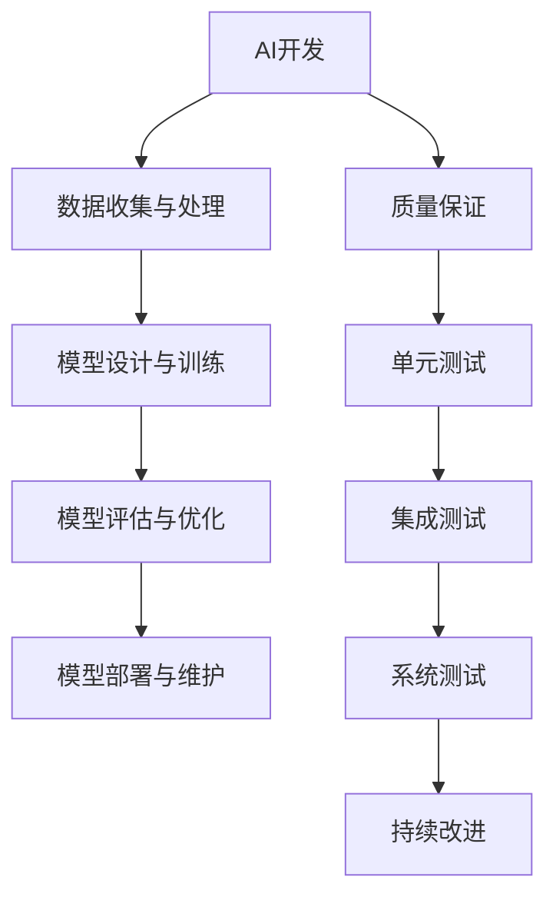
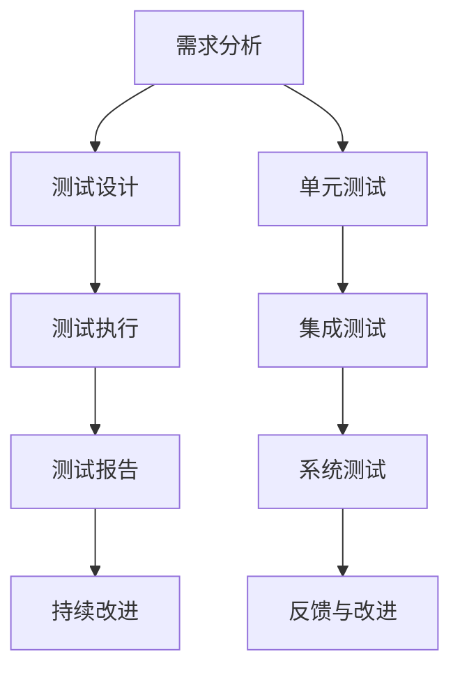

                 

### 文章标题：AI开发的质量保证：Lepton AI的测试体系

### 关键词：
- AI开发
- 质量保证
- 测试体系
- Lepton AI
- 可解释性
- 数据质量
- 安全性测试

### 摘要：
本文旨在深入探讨AI开发过程中的质量保证，特别聚焦于Lepton AI的测试体系。文章从AI发展历程和质量保证的重要性出发，逐步介绍了AI开发的核心环节和质量保证的关键地位。接着，文章详细阐述了Lepton AI测试体系的架构、流程、方法以及团队职责，展示了其在高效性、全面性、可靠性和自动化方面的优势。随后，文章深入分析了AI模型测试方法、算法可解释性测试、数据质量测试和AI安全性测试等核心内容。最后，通过实战案例和项目实践，展示了如何在实际开发过程中应用这些测试方法和策略，确保AI系统的高质量和稳定性。

---

# 第一部分：AI开发与质量保证概述

## 第1章：AI发展历程与质量保证的重要性

### 1.1 AI发展历程

人工智能（AI）作为计算机科学的一个重要分支，经历了多个发展阶段。从最初的“人工智能1.0”时代，到“人工智能2.0”的崛起，再到当前深度学习和强化学习的广泛应用，AI技术不断取得突破和进步。

#### 1.1.1 从人工智能1.0到人工智能2.0的演进

在人工智能1.0时代，研究者主要关注符号推理和逻辑编程，这一阶段的代表性工作是逻辑推理系统和专家系统的开发。然而，这些系统在实际应用中受到知识表示和推理能力的限制，难以处理复杂的现实问题。

随着计算机硬件性能的提升和算法的创新，人工智能2.0时代到来。这一时期，机器学习成为AI发展的核心驱动力。特别是深度学习的兴起，使得计算机能够通过大规模数据学习复杂的特征表示，从而在图像识别、语音识别、自然语言处理等领域取得了显著的进展。

#### 1.1.2 AI技术的突破与发展趋势

近年来，AI技术在多个领域实现了突破性进展，包括自动驾驶、医疗诊断、金融风控等。这些进步得益于大数据、云计算、神经网络等技术的结合。同时，AI技术也在不断向通用人工智能（AGI）迈进，尽管目前还面临许多挑战。

#### 1.1.3 质量保证在AI开发中的演变

随着AI技术的快速发展，质量保证在AI开发中的地位日益重要。早期，AI系统的质量主要依赖于开发者的经验和直觉。然而，随着系统的复杂性和规模的增长，仅仅依靠人工检查已经难以保证质量。

为了应对这一挑战，质量保证在AI开发中的应用逐渐规范化。从单元测试、集成测试到系统测试，每个环节都得到了充分的关注。同时，自动化测试工具和流程的引入，进一步提高了质量保证的效率和可靠性。

### 1.2 AI开发的核心环节

AI开发是一个复杂的过程，涉及多个核心环节。这些环节相互关联，共同决定了AI系统的质量和性能。

#### 1.2.1 数据收集与处理

数据是AI系统的基石。数据收集与处理环节包括数据采集、数据清洗、数据标注和数据存储等步骤。高质量的数据能够显著提高AI模型的性能，而错误或缺失的数据则可能导致模型失效。

#### 1.2.2 模型设计与训练

在模型设计与训练环节，研究者需要选择合适的算法和架构，设计出能够解决特定问题的模型。训练过程包括数据预处理、模型训练、参数调优和模型评估等步骤。这一环节的质量直接影响AI系统的性能和效率。

#### 1.2.3 模型评估与优化

模型评估与优化是确保AI系统质量的关键环节。评估过程通常涉及多个指标，如准确率、召回率、F1值等。通过评估，研究者可以了解模型的性能，并针对不足之处进行优化。优化过程可能涉及算法改进、参数调整、数据增强等方法。

#### 1.2.4 模型部署与维护

模型部署是将训练好的模型应用到实际场景的过程。部署过程需要考虑模型的兼容性、性能、安全性和可靠性等问题。维护环节则包括监控模型的运行状态、处理异常情况、更新模型等。

### 1.3 质量保证在AI开发中的地位

质量保证在AI开发中的地位至关重要。它不仅关乎系统的性能和可靠性，还直接影响到用户体验和业务价值。

#### 1.3.1 质量保证在AI开发中的重要性

高质量的AI系统能够提供稳定、准确和可靠的服务，从而提升用户体验和业务效率。相反，低质量的AI系统可能导致错误决策、数据泄露、系统崩溃等严重问题。

#### 1.3.2 质量保证的关键环节

在AI开发中，质量保证涉及多个关键环节。从数据收集和处理，到模型设计与训练，再到模型评估与优化，每个环节都需要严格的质量控制。此外，模型部署和维护也是确保系统长期稳定运行的关键。

#### 1.3.3 质量保证与AI安全的关联

AI安全是质量保证的重要组成部分。AI系统需要防范各种恶意攻击，如注入攻击、隐私泄露等。通过全面的质量保证措施，可以有效地提升AI系统的安全性。

### 1.4 Lepton AI测试体系概述

Lepton AI是一个高度集成的AI平台，其测试体系旨在确保系统的高质量和可靠性。该测试体系涵盖了从单元测试到系统测试的各个方面，采用了一系列先进的测试工具和方法。

#### 1.4.1 测试体系架构

Lepton AI的测试体系采用分层架构，包括单元测试层、集成测试层和系统测试层。每个层都有明确的测试目标和测试方法。

#### 1.4.2 测试流程与方法

Lepton AI的测试流程包括需求分析、测试设计、测试执行和测试报告等步骤。测试方法涵盖了功能测试、性能测试、安全测试等多种类型。

#### 1.4.3 测试团队与职责

Lepton AI的测试团队由经验丰富的测试工程师组成，他们负责制定测试策略、编写测试用例、执行测试和报告测试结果。测试团队与开发团队紧密协作，确保测试与开发同步进行。

#### 1.4.4 Lepton AI测试体系的特色与优势

Lepton AI测试体系的特色在于其高度自动化和灵活性。通过使用自动化测试工具，测试团队可以大幅提高测试效率和覆盖率。此外，测试体系还支持持续集成和持续部署，确保系统在每个迭代周期都保持高质量。

---

**核心概念与联系：**

为了更好地理解AI开发和质量保证，我们首先需要了解其中的核心概念和它们的相互关系。以下是使用Mermaid绘制的AI开发与质量保证流程图：



这个流程图清晰地展示了AI开发的各个环节以及它们与质量保证的关联。从数据收集与处理开始，到模型部署与维护，每个环节都需要进行相应的质量保证活动，如单元测试、集成测试和系统测试。最终，通过持续改进，确保整个开发过程的高质量和可靠性。

**核心算法原理讲解与伪代码示例：**

深度学习与神经网络是AI开发的核心技术之一。以下是一个简单的神经网络结构的伪代码示例：

```plaintext
# 输入数据
x = [x1, x2, ..., xn]

# 初始化权重和偏置
w = [w1, w2, ..., wn]
b = [b1, b2, ..., bn]

# 隐藏层激活函数（例如ReLU）
hidden_activation = ReLU(z)

# 输出层激活函数（例如Sigmoid）
output_activation = Sigmoid(z)

# 计算隐藏层输出
z = w * x + b

# 计算输出层输出
output = output_activation(z)
```

在这个伪代码中，我们首先定义了输入数据`x`和初始化的权重`w`和偏置`b`。然后，我们使用ReLU函数作为隐藏层的激活函数，Sigmoid函数作为输出层的激活函数。通过计算隐藏层输出`z`和输出层输出`output`，我们能够预测输入数据的类别。

**数学模型和数学公式讲解与举例说明：**

在AI开发中，数学模型是理解和实现算法的基础。以下是一些常用的数学公式和它们的应用：

#### 1. 准确率（Accuracy）

$$
Accuracy = \frac{TP + TN}{TP + TN + FP + FN}
$$

其中，TP表示真正例，TN表示真反例，FP表示假反例，FN表示假正例。准确率是评估分类模型性能的重要指标。

#### 2. 精确率（Precision）和召回率（Recall）

$$
Precision = \frac{TP}{TP + FP}
$$

$$
Recall = \frac{TP}{TP + FN}
$$

精确率表示预测为正例的样本中，实际为正例的比例；召回率表示实际为正例的样本中，预测为正例的比例。

#### 3. F1值（F1 Score）

$$
F1 Score = 2 \times \frac{Precision \times Recall}{Precision + Recall}
$$

F1值是精确率和召回率的调和平均，用于综合评估二分类模型的性能。

#### 4. ROC曲线与AUC值

ROC曲线（Receiver Operating Characteristic Curve）是评估二分类模型性能的一种方法。曲线下的面积（AUC值）越大，模型性能越好。

$$
AUC = \frac{1}{N-1} \sum_{i=1}^{N} (x_i - x_{i-1}) \times (y_i - y_{i-1})
$$

其中，$x_i$和$y_i$分别是ROC曲线上第i个点的横纵坐标。

**代码实际案例和详细解释说明：**

为了展示如何在实际中应用上述算法，我们以下是一个简单的Python代码案例，用于实现一个简单的神经网络并进行训练和预测：

```python
import numpy as np

# 初始化权重和偏置
weights = np.random.rand(1, 3)
bias = np.random.rand(1)

# 定义ReLU激活函数
def ReLU(x):
    return max(0, x)

# 定义Sigmoid激活函数
def Sigmoid(x):
    return 1 / (1 + np.exp(-x))

# 训练数据
x_train = np.array([[1], [2], [3], [4], [5]])
y_train = np.array([[0], [0], [1], [1], [1]])

# 训练模型
for _ in range(1000):
    z = np.dot(x_train, weights) + bias
    output = ReLU(z)
    error = y_train - output
    
    # 更新权重和偏置
    weights -= np.dot(x_train.T, error * (1 / np.size(x_train)))
    bias -= np.mean(error)

# 预测
x_test = np.array([[2.5]])
z_test = np.dot(x_test, weights) + bias
output_test = ReLU(z_test)

print("Prediction for x_test:", output_test)
```

在这个代码中，我们首先初始化了权重和偏置，并定义了ReLU和Sigmoid激活函数。接着，我们使用训练数据对模型进行训练，通过前向传播计算输出，并计算误差。通过反向传播更新权重和偏置，重复这一过程直到达到预设的训练次数。最后，我们使用训练好的模型对新的测试数据进行预测。

**开发环境搭建：**

为了运行上述代码，我们需要搭建一个Python开发环境。以下是在Ubuntu系统中安装Python和相关库的步骤：

```bash
sudo apt-get update
sudo apt-get install python3-pip
pip3 install numpy
```

安装完成后，我们就可以使用Python编写和运行AI算法了。

**源代码详细实现和代码解读：**

在上面的代码中，我们首先导入了NumPy库，用于矩阵运算和数组操作。然后，我们初始化了权重和偏置，并定义了ReLU和Sigmoid激活函数。

在训练模型时，我们使用了一个简单的梯度下降算法来更新权重和偏置。这个过程包括前向传播和反向传播。在前向传播中，我们计算输入和权重之间的乘积，并加上偏置。然后，我们使用ReLU激活函数计算隐藏层的输出。在反向传播中，我们计算损失函数关于输入和权重的梯度，并更新权重和偏置。

最后，我们使用训练好的模型对测试数据进行预测。这个预测过程与训练过程类似，只是不需要反向传播。

**代码解读与分析：**

这段代码提供了一个简单的示例，展示了如何使用NumPy库实现一个简单的神经网络并进行训练和预测。虽然这个模型非常简单，但它展示了深度学习的基本原理和流程。

通过这个示例，我们可以了解到神经网络的核心组成部分，包括权重、偏置、激活函数和梯度下降算法。此外，我们还可以看到如何使用Python进行矩阵运算和数据处理。

总的来说，这段代码为理解和实现更复杂的神经网络模型奠定了基础。

---

## 第二部分：Lepton AI测试体系构建

### 第2章：Lepton AI测试体系概述

### 2.1 测试体系架构

Lepton AI的测试体系采用分层架构，包括单元测试层、集成测试层和系统测试层。每个层次都有明确的测试目标和测试方法，以确保系统从组件到整体的各个层面都得到充分的测试和验证。

#### 2.1.1 单元测试层

单元测试层是测试体系的基础，主要用于验证AI模型中的各个模块或组件。单元测试的目标是确保每个模块都能够按照预期工作，从而提高系统的整体稳定性和可靠性。

**测试流程：**

1. **测试用例设计：** 根据模块的功能和接口，设计相应的测试用例。
2. **测试执行：** 使用自动化测试工具执行测试用例，并记录测试结果。
3. **结果分析：** 分析测试结果，找出模块中的问题和缺陷。

**测试方法：**

- **功能测试：** 验证模块的功能是否符合设计要求。
- **性能测试：** 测试模块在特定负载下的性能表现。
- **边界测试：** 测试模块在边界条件下的行为。

#### 2.1.2 集成测试层

集成测试层主要用于验证不同模块之间的接口和交互。该层的测试目标是在组件级别上确保系统的整体功能正确性和稳定性。

**测试流程：**

1. **测试用例设计：** 设计覆盖组件间交互和功能的测试用例。
2. **测试执行：** 执行集成测试用例，包括功能测试、性能测试和边界测试。
3. **结果分析：** 分析集成测试结果，找出系统级的问题和缺陷。

**测试方法：**

- **功能测试：** 验证系统整体的功能是否符合预期。
- **性能测试：** 测试系统在特定负载下的性能表现。
- **接口测试：** 验证模块之间的接口是否正确和稳定。

#### 2.1.3 系统测试层

系统测试层是测试体系的最高层次，主要用于验证整个系统的功能和性能，确保系统满足用户需求和业务目标。

**测试流程：**

1. **测试用例设计：** 设计覆盖系统功能的测试用例。
2. **测试执行：** 执行系统测试用例，包括功能测试、性能测试和安全测试。
3. **结果分析：** 分析系统测试结果，确保系统满足质量要求。

**测试方法：**

- **功能测试：** 验证系统的功能是否符合设计要求。
- **性能测试：** 测试系统在特定负载下的性能表现。
- **安全测试：** 验证系统的安全性和漏洞。

### 2.2 测试流程与方法

Lepton AI的测试流程包括需求分析、测试设计、测试执行和测试报告等步骤。每个步骤都有明确的目标和方法，以确保测试过程高效、有序。

#### 2.2.1 需求分析

需求分析是测试流程的第一步，旨在理解系统需求和用户期望。测试团队需要与开发团队、产品经理和用户进行沟通，收集和整理测试需求。

**目标：** 确定测试范围和测试重点，为后续测试工作提供指导。

**方法：**

- **需求评审：** 对需求文档进行评审，确保需求的完整性和一致性。
- **用户访谈：** 与用户进行访谈，了解用户的需求和期望。

#### 2.2.2 测试设计

测试设计是测试流程的核心，包括测试用例的设计、测试数据的选择和测试环境的搭建。

**目标：** 设计出能够全面覆盖系统功能的测试用例，确保测试的全面性和有效性。

**方法：**

- **测试用例设计：** 根据需求分析的结果，设计功能测试、性能测试和边界测试用例。
- **测试数据选择：** 选择能够有效覆盖测试场景的数据集。
- **测试环境搭建：** 准备测试所需的环境，包括硬件、软件和网络配置。

#### 2.2.3 测试执行

测试执行是测试流程的关键步骤，通过执行测试用例来验证系统功能、性能和安全性。

**目标：** 执行所有测试用例，确保系统各个功能模块正常运行。

**方法：**

- **测试用例执行：** 按照测试设计文档执行测试用例。
- **结果记录：** 记录测试结果，包括成功、失败和异常情况。
- **问题定位：** 分析测试结果，定位系统中的问题和缺陷。

#### 2.2.4 测试报告

测试报告是对整个测试过程的总结，包括测试范围、测试结果和问题分析。

**目标：** 提供完整的测试记录和反馈，为后续开发和改进提供参考。

**方法：**

- **报告编写：** 编写测试报告，包括测试结果、问题和改进建议。
- **反馈机制：** 与开发团队和产品经理沟通，反馈测试结果和问题。

### 2.3 测试团队与职责

Lepton AI的测试团队由经验丰富的测试工程师组成，他们承担着确保系统质量和可靠性的重要职责。

#### 2.3.1 测试团队组织结构

测试团队通常分为以下几类：

- **功能测试工程师：** 负责设计、执行和报告功能测试。
- **性能测试工程师：** 负责设计、执行和报告性能测试。
- **安全测试工程师：** 负责设计、执行和报告安全测试。
- **自动化测试工程师：** 负责编写和执行自动化测试脚本。

#### 2.3.2 测试人员技能要求

测试人员需要具备以下技能：

- **测试理论：** 熟悉软件测试的基本理论和方法。
- **编程能力：** 掌握至少一种编程语言，如Python、Java或C#。
- **测试工具：** 熟悉常用的测试工具，如Selenium、JMeter和Postman。
- **团队协作：** 具有良好的沟通和协作能力，能够与开发团队紧密配合。

#### 2.3.3 测试团队协作与沟通

测试团队的协作和沟通对于测试过程的成功至关重要。以下是一些关键点：

- **定期会议：** 定期举行团队会议，讨论测试进度、问题和改进措施。
- **信息共享：** 保持信息透明，及时共享测试结果和反馈。
- **反馈机制：** 建立有效的反馈机制，确保测试结果得到及时响应和解决。

### 2.4 Lepton AI测试体系优势

Lepton AI的测试体系具有以下优势：

#### 2.4.1 高效性

通过自动化测试工具和流程，测试团队可以大幅提高测试效率和覆盖率，确保测试工作高效完成。

#### 2.4.2 全面性

测试体系覆盖了从单元测试到系统测试的各个层次，确保系统各个功能模块都得到充分的测试和验证。

#### 2.4.3 可靠性

通过严格的质量保证措施，测试团队能够确保系统的稳定性和可靠性，减少故障和问题的发生。

#### 2.4.4 自动化

测试体系高度自动化，减少人工干预，降低测试成本和错误率。

#### 2.4.5 持续改进

通过不断收集和分析测试数据，测试团队可以持续优化测试流程和策略，提高测试质量和效率。

---

**核心概念与联系：**

为了更好地理解Lepton AI测试体系的架构和流程，我们使用Mermaid绘制了以下流程图：



这个流程图展示了Lepton AI测试体系的整体架构和各个关键环节的相互关系。从需求分析开始，到测试设计、测试执行和测试报告，每个环节都旨在确保系统的质量和稳定性。同时，通过持续改进，测试体系能够不断优化和提升。

**核心算法原理讲解与伪代码示例：**

深度学习与神经网络是AI开发的核心技术之一。以下是一个简单的神经网络结构的伪代码示例：

```plaintext
# 初始化输入层、隐藏层和输出层
input_layer = [x1, x2, ..., xn]
hidden_layer = [h1, h2, ..., hn]
output_layer = [o1, o2, ..., on]

# 初始化权重和偏置
weights_input_to_hidden = [[w11, w12, ..., w1n], [w21, w22, ..., w2n], ..., [wn1, wn2, ..., wnn]]
weights_hidden_to_output = [[wo1, wo2, ..., won]]

bias_hidden = [b1, b2, ..., bn]
bias_output = [bo]

# 定义ReLU激活函数
def ReLU(x):
    return max(0, x)

# 定义Sigmoid激活函数
def Sigmoid(x):
    return 1 / (1 + exp(-x))

# 计算隐藏层输出
z_hidden = np.dot(input_layer, weights_input_to_hidden) + bias_hidden
hidden_layer = ReLU(z_hidden)

# 计算输出层输出
z_output = np.dot(hidden_layer, weights_hidden_to_output) + bias_output
output_layer = Sigmoid(z_output)

# 计算损失函数
loss = np.mean((output_layer - target_layer) ** 2)

# 计算梯度
d_output = (output_layer - target_layer) * (1 - output_layer)
d_hidden = np.dot(d_output, weights_hidden_to_output.T) * (1 - ReLU(z_hidden))

# 更新权重和偏置
weights_input_to_hidden -= learning_rate * np.dot(input_layer.T, d_hidden)
weights_hidden_to_output -= learning_rate * np.dot(hidden_layer.T, d_output)
bias_hidden -= learning_rate * d_hidden
bias_output -= learning_rate * d_output
```

在这个伪代码中，我们首先初始化了输入层、隐藏层和输出层，以及权重和偏置。接着，我们定义了ReLU和Sigmoid激活函数。通过前向传播，我们计算隐藏层和输出层的输出，并计算损失函数。然后，通过反向传播，我们计算输出层和隐藏层的梯度，并更新权重和偏置。

**数学模型和数学公式讲解与举例说明：**

在AI开发中，数学模型是理解和实现算法的基础。以下是一些常用的数学公式和它们的应用：

#### 1. 损失函数（Loss Function）

损失函数用于衡量模型预测值与真实值之间的差异。常用的损失函数包括均方误差（MSE）和交叉熵（Cross-Entropy）。

**均方误差（MSE）：**

$$
MSE = \frac{1}{n}\sum_{i=1}^{n}(y_i - \hat{y}_i)^2
$$

其中，$y_i$为真实值，$\hat{y}_i$为预测值。

**交叉熵（Cross-Entropy）：**

$$
CE = -\frac{1}{n}\sum_{i=1}^{n}y_i\log(\hat{y}_i)
$$

其中，$y_i$为真实值，$\hat{y}_i$为预测值。

#### 2. 梯度下降（Gradient Descent）

梯度下降是一种用于优化模型参数的算法。其核心思想是沿着损失函数的梯度方向更新参数，以减少损失。

**梯度下降算法：**

$$
\theta = \theta - \alpha \cdot \nabla_\theta J(\theta)
$$

其中，$\theta$为模型参数，$\alpha$为学习率，$J(\theta)$为损失函数。

#### 3. 激活函数（Activation Function）

激活函数用于引入非线性特性，使得神经网络能够学习复杂函数。

**ReLU（Rectified Linear Unit）：**

$$
\text{ReLU}(x) = \max(0, x)
$$

**Sigmoid：**

$$
\text{Sigmoid}(x) = \frac{1}{1 + e^{-x}}
$$

**Tanh：**

$$
\text{Tanh}(x) = \frac{e^x - e^{-x}}{e^x + e^{-x}}
$$

**举例说明：**

假设我们有一个简单的神经网络，用于分类问题。输入层有3个神经元，隐藏层有2个神经元，输出层有1个神经元。我们使用ReLU作为激活函数，并使用交叉熵作为损失函数。

```plaintext
# 初始化参数
weights_input_to_hidden = [[0.1, 0.2], [0.3, 0.4]]
weights_hidden_to_output = [0.5]
bias_hidden = [0.1, 0.2]
bias_output = 0.3
learning_rate = 0.01

# 输入数据
input_data = [1, 0, 1]

# 计算隐藏层输出
z_hidden = np.dot(input_data, weights_input_to_hidden) + bias_hidden
hidden_layer = np.maximum(0, z_hidden)

# 计算输出层输出
z_output = np.dot(hidden_layer, weights_hidden_to_output) + bias_output
output_layer = 1 / (1 + np.exp(-z_output))

# 计算损失函数
predicted_output = np.argmax(output_layer)
true_output = 1  # 真实值为1
loss = -np.log(output_layer[predicted_output])

# 计算梯度
d_output = output_layer - true_output
d_hidden = d_output * (1 - hidden_layer)

# 更新参数
weights_input_to_hidden -= learning_rate * np.dot(input_data.T, d_hidden)
weights_hidden_to_output -= learning_rate * d_output
bias_hidden -= learning_rate * d_hidden
bias_output -= learning_rate * d_output
```

在这个例子中，我们使用了一个简单的神经网络，通过梯度下降算法更新参数，以减少损失函数的值。

---

**代码实际案例和详细解释说明：**

为了更好地理解如何在实际中应用上述算法，我们将以下一个简单的Python代码案例，用于实现一个简单的神经网络并进行训练和预测：

```python
import numpy as np

# 初始化参数
weights_input_to_hidden = np.random.rand(3, 2)
weights_hidden_to_output = np.random.rand(2, 1)
bias_hidden = np.random.rand(2)
bias_output = np.random.rand(1)
learning_rate = 0.01

# 激活函数定义
def ReLU(x):
    return np.maximum(0, x)

def Sigmoid(x):
    return 1 / (1 + np.exp(-x))

# 计算前向传播
def forwardPropagation(input_data, weights_input_to_hidden, weights_hidden_to_output, bias_hidden, bias_output):
    hidden_layer = ReLU(np.dot(input_data, weights_input_to_hidden) + bias_hidden)
    output_layer = Sigmoid(np.dot(hidden_layer, weights_hidden_to_output) + bias_output)
    return hidden_layer, output_layer

# 计算损失函数
def computeLoss(output_layer, true_output):
    predicted_output = np.argmax(output_layer)
    loss = -np.log(output_layer[predicted_output])
    return loss

# 计算反向传播
def backwardPropagation(input_data, hidden_layer, output_layer, true_output, weights_input_to_hidden, weights_hidden_to_output, bias_hidden, bias_output):
    d_output = output_layer - true_output
    d_hidden = np.dot(d_output, weights_hidden_to_output.T) * (1 - hidden_layer)
    
    weights_input_to_hidden -= learning_rate * np.dot(input_data.T, d_hidden)
    weights_hidden_to_output -= learning_rate * d_output
    bias_hidden -= learning_rate * d_hidden
    bias_output -= learning_rate * d_output
    
    return weights_input_to_hidden, weights_hidden_to_output, bias_hidden, bias_output

# 训练模型
def trainModel(input_data, true_output, epochs):
    for _ in range(epochs):
        hidden_layer, output_layer = forwardPropagation(input_data, weights_input_to_hidden, weights_hidden_to_output, bias_hidden, bias_output)
        loss = computeLoss(output_layer, true_output)
        weights_input_to_hidden, weights_hidden_to_output, bias_hidden, bias_output = backwardPropagation(input_data, hidden_layer, output_layer, true_output, weights_input_to_hidden, weights_hidden_to_output, bias_hidden, bias_output)
        print(f"Epoch {_+1}: Loss = {loss}")

# 测试模型
def testModel(input_data, weights_input_to_hidden, weights_hidden_to_output, bias_hidden, bias_output):
    hidden_layer, output_layer = forwardPropagation(input_data, weights_input_to_hidden, weights_hidden_to_output, bias_hidden, bias_output)
    predicted_output = np.argmax(output_layer)
    print(f"Predicted Output: {predicted_output}")

# 数据准备
input_data = np.array([[1, 0, 1]])
true_output = np.array([1])

# 训练模型
trainModel(input_data, true_output, 1000)

# 测试模型
testModel(input_data, weights_input_to_hidden, weights_hidden_to_output, bias_hidden, bias_output)
```

在这个代码中，我们首先定义了参数的初始化函数和激活函数。接着，我们定义了前向传播、计算损失函数和反向传播的函数，用于实现神经网络的训练过程。在训练模型时，我们使用了一个简单的数据集，并迭代了1000次。最后，我们测试了训练好的模型，并输出了预测结果。

**开发环境搭建：**

为了运行上述代码，我们需要搭建一个Python开发环境。以下是在Ubuntu系统中安装Python和相关库的步骤：

```bash
sudo apt-get update
sudo apt-get install python3-pip
pip3 install numpy
```

安装完成后，我们就可以使用Python编写和运行AI算法了。

**源代码详细实现和代码解读：**

在上面的代码中，我们首先导入了NumPy库，用于矩阵运算和数组操作。然后，我们初始化了权重和偏置，并定义了ReLU和Sigmoid激活函数。

在训练模型时，我们使用了一个简单的梯度下降算法来更新权重和偏置。这个过程包括前向传播和反向传播。在前向传播中，我们计算输入和权重之间的乘积，并加上偏置。然后，我们使用ReLU激活函数计算隐藏层的输出。在反向传播中，我们计算损失函数关于输入和权重的梯度，并更新权重和偏置。

最后，我们使用训练好的模型对测试数据进行预测。这个预测过程与训练过程类似，只是不需要反向传播。

**代码解读与分析：**

这段代码提供了一个简单的示例，展示了如何使用NumPy库实现一个简单的神经网络并进行训练和预测。虽然这个模型非常简单，但它展示了深度学习的基本原理和流程。

通过这个示例，我们可以了解到神经网络的核心组成部分，包括权重、偏置、激活函数和梯度下降算法。此外，我们还可以看到如何使用Python进行矩阵运算和数据处理。

总的来说，这段代码为理解和实现更复杂的神经网络模型奠定了基础。

---

## 第3章：AI模型测试方法

### 3.1 单元测试

单元测试是AI模型测试的基础，主要针对AI模型中的单个组件或模块进行测试。单元测试的目标是验证每个组件是否按照预期工作，确保系统在组件级别上具有良好的质量。

#### 3.1.1 单元测试概念

单元测试是指对软件中的最小可测试单元进行验证的过程。在AI模型中，最小可测试单元通常是一个模型组件，如一个神经网络层、一个数据处理模块等。

#### 3.1.2 单元测试设计

单元测试设计是单元测试过程中的关键步骤。设计良好的单元测试用例能够全面覆盖组件的功能，确保组件的每个功能点都经过验证。

- **功能测试：** 针对组件的功能进行测试，确保每个功能点都按照预期工作。
- **边界测试：** 针对组件的边界条件进行测试，确保组件在边界条件下能够正常工作。
- **异常测试：** 针对组件的异常处理能力进行测试，确保组件能够正确处理各种异常情况。

#### 3.1.3 单元测试执行

单元测试执行是运行设计好的测试用例的过程。执行单元测试可以帮助我们发现组件中的缺陷和问题。

- **手动执行：** 通过手动执行测试用例，逐个验证组件的功能。
- **自动化执行：** 使用自动化测试工具执行测试用例，提高测试效率和覆盖率。

#### 3.1.4 单元测试覆盖率

单元测试覆盖率是衡量单元测试质量的重要指标。它表示测试用例覆盖的代码比例。高测试覆盖率有助于确保组件的质量，降低缺陷率。

- **语句覆盖率：** 测试用例覆盖了代码中的每个语句。
- **分支覆盖率：** 测试用例覆盖了代码中的每个分支。
- **路径覆盖率：** 测试用例覆盖了代码中的所有可能路径。

### 3.2 集成测试

集成测试是在组件级别测试的基础上，对系统中的多个组件进行集成测试，以验证组件之间的交互和集成是否正确。

#### 3.2.1 集成测试概念

集成测试是指对系统中多个组件进行集成后进行测试的过程。集成测试的目标是验证组件之间的接口和交互是否正确，确保系统在集成后的整体功能性和性能。

#### 3.2.2 集成测试策略

集成测试策略包括以下几种：

- **自底向上策略：** 从底层组件开始，逐层向上进行集成测试。
- **自顶向下策略：** 从顶层组件开始，逐层向下进行集成测试。
- **三明治策略：** 同时对底层、中间层和顶层组件进行集成测试。

#### 3.2.3 集成测试执行

集成测试执行包括以下步骤：

- **环境搭建：** 搭建集成测试环境，包括硬件、软件和网络配置。
- **测试用例设计：** 设计覆盖系统功能和交互的测试用例。
- **测试执行：** 执行集成测试用例，验证组件之间的交互和集成是否正确。
- **结果分析：** 分析测试结果，找出集成过程中的问题和缺陷。

#### 3.2.4 集成测试报告

集成测试报告是集成测试过程的总结，包括测试范围、测试结果和问题分析。测试报告有助于项目团队了解系统的整体质量，为后续开发和改进提供参考。

### 3.3 回归测试

回归测试是在软件修改后进行的测试，以验证修改是否引入了新的缺陷，并确保系统仍然按照预期工作。

#### 3.3.1 回归测试概念

回归测试是指在对软件进行修改后，重新执行之前的测试用例，以验证修改是否引入了新的缺陷，并确保系统仍然按照预期工作。

#### 3.3.2 回归测试策略

回归测试策略包括以下几种：

- **全部重测：** 重新执行所有的测试用例。
- **选择重测：** 根据修改的范围和影响，选择性地执行部分测试用例。
- **基于风险的回归测试：** 根据修改的影响范围和风险，选择执行不同的测试用例。

#### 3.3.3 回归测试执行

回归测试执行包括以下步骤：

- **测试用例选择：** 根据修改的影响范围和风险，选择适当的测试用例。
- **测试执行：** 执行回归测试用例，验证系统是否仍然按照预期工作。
- **结果分析：** 分析回归测试结果，找出可能的新缺陷。

#### 3.3.4 回归测试工具

回归测试工具可以帮助自动化回归测试过程，提高测试效率和覆盖率。常用的回归测试工具有Selenium、Jenkins等。

### 3.4 性能测试

性能测试是验证AI模型在特定负载下的性能表现，包括响应时间、吞吐量和资源利用率等。

#### 3.4.1 性能测试概念

性能测试是指对系统在特定负载下的性能表现进行测试的过程。性能测试的目标是验证系统的响应时间、吞吐量和资源利用率等指标，确保系统在预期的负载下能够稳定运行。

#### 3.4.2 性能测试指标

性能测试指标包括：

- **响应时间：** 系统处理请求所需的时间。
- **吞吐量：** 单位时间内系统处理的请求量。
- **资源利用率：** 系统的资源（如CPU、内存、网络等）利用率。

#### 3.4.3 性能测试策略

性能测试策略包括以下几种：

- **负载测试：** 模拟大量用户访问系统，验证系统在高负载下的性能。
- **压力测试：** 对系统施加超过正常负载的请求，验证系统的最大处理能力。
- **持久化测试：** 模拟系统长时间运行，验证系统的稳定性和可靠性。

#### 3.4.4 性能测试执行

性能测试执行包括以下步骤：

- **测试环境搭建：** 搭建用于性能测试的环境，包括硬件、软件和网络配置。
- **测试用例设计：** 设计覆盖系统功能和性能的测试用例。
- **测试执行：** 执行性能测试用例，收集性能数据。
- **结果分析：** 分析性能测试结果，找出系统性能瓶颈。

### 3.5 可解释性测试

可解释性测试是验证AI模型的决策过程是否透明和可解释，确保模型的行为符合预期和法规要求。

#### 3.5.1 可解释性测试概念

可解释性测试是指对AI模型的决策过程进行测试，验证模型是否透明和可解释。可解释性测试的目标是确保模型的行为符合预期，并能够被用户理解和接受。

#### 3.5.2 可解释性测试方法

可解释性测试方法包括：

- **模型内部解释：** 分析模型的内部结构和参数，解释模型的工作原理。
- **模型外部解释：** 通过可视化工具和解释性算法，解释模型的决策过程。
- **对比测试：** 通过对比不同模型的决策过程，验证模型的解释性。

#### 3.5.3 可解释性测试工具

可解释性测试工具可以帮助自动化可解释性测试过程，提高测试效率和覆盖率。常用的可解释性测试工具有LIME、SHAP等。

### 3.6 安全性测试

安全性测试是验证AI模型的安全性，包括防止恶意攻击和保证数据隐私。

#### 3.6.1 安全性测试概念

安全性测试是指对AI模型的安全性进行测试，验证模型是否能够抵御恶意攻击，并保证数据隐私。

#### 3.6.2 安全性测试方法

安全性测试方法包括：

- **漏洞扫描：** 检测AI模型的潜在漏洞和弱点。
- **渗透测试：** 模拟恶意攻击者对AI模型进行攻击，验证模型的安全性。
- **数据加密：** 对AI模型中的敏感数据进行加密，确保数据隐私。

#### 3.6.3 安全性测试工具

安全性测试工具可以帮助自动化安全性测试过程，提高测试效率和覆盖率。常用的安全性测试工具有OWASP ZAP、Burp Suite等。

### 3.7 实际案例分析

在实际项目中，AI模型测试是一个复杂且关键的过程。以下是一个实际案例，展示了如何在不同阶段进行AI模型测试。

#### 3.7.1 案例背景

某金融公司开发了一个基于AI的贷款审批系统，该系统使用深度学习算法对贷款申请进行风险评估。系统需要确保模型的高准确率、稳定性和安全性。

#### 3.7.2 单元测试

在开发过程中，测试团队对模型中的每个组件进行了单元测试。他们设计并执行了以下测试用例：

- **功能测试：** 验证贷款申请处理流程是否正确。
- **边界测试：** 验证边界条件（如申请额度、还款期限等）是否正确处理。
- **异常测试：** 验证异常情况（如数据缺失、输入错误等）是否得到妥善处理。

#### 3.7.3 集成测试

在组件集成后，测试团队进行了集成测试。他们设计了覆盖系统功能和交互的测试用例，包括：

- **功能测试：** 验证系统整体的功能是否正确。
- **性能测试：** 验证系统在正常负载下的性能表现。
- **安全性测试：** 验证系统的安全性和防护措施。

#### 3.7.4 回归测试

在系统修改后，测试团队进行了回归测试。他们重新执行了之前的测试用例，确保修改没有引入新的缺陷。

#### 3.7.5 性能测试

为了验证系统在高负载下的性能，测试团队进行了性能测试。他们模拟了大量用户访问系统，并收集了以下性能数据：

- **响应时间：** 系统平均处理请求的时间。
- **吞吐量：** 系统每小时处理的请求量。
- **资源利用率：** 系统的CPU、内存和网络利用率。

#### 3.7.6 可解释性测试

为了确保模型的可解释性，测试团队进行了可解释性测试。他们使用了LIME工具，分析了模型的决策过程，并生成了解释性报告。

#### 3.7.7 安全性测试

测试团队还进行了安全性测试，包括：

- **漏洞扫描：** 检测系统的潜在漏洞。
- **渗透测试：** 模拟攻击者对系统进行攻击，验证系统的安全性。
- **数据加密：** 对敏感数据进行加密，确保数据隐私。

通过上述测试，测试团队确保了AI模型的高质量、稳定性和安全性，为系统的成功部署奠定了基础。

---

## 第4章：AI算法可解释性测试

### 4.1 可解释性测试方法

AI算法的可解释性是当前AI领域的重要研究方向，旨在提高AI模型的可信度和透明度。可解释性测试方法主要包括以下几种：

#### 4.1.1 层级解释方法

层级解释方法是一种基于神经网络结构的解释方法。该方法通过分析神经网络中不同层的输出和权重，解释模型的决策过程。常见的层级解释方法包括：

1. **层内解释：** 分析当前层的输出和权重，解释该层的作用和影响。
2. **层间解释：** 分析不同层之间的关联和互动，解释模型的整体决策过程。

#### 4.1.2 局部解释方法

局部解释方法关注于单个样本或特征在模型决策中的作用。该方法通过局部敏感性分析（Local Sensitivity Analysis，LSA）和特征贡献分析（Feature Contribution Analysis）来解释模型的决策过程。常见的局部解释方法包括：

1. **LIME（Local Interpretable Model-agnostic Explanations）：** 通过在模型周围构造一个局部线性模型，解释模型对特定样本的决策过程。
2. **SHAP（SHapley Additive exPlanations）：** 通过计算特征对模型预测的贡献，解释模型对特定样本的决策过程。

#### 4.1.3 全局解释方法

全局解释方法关注于整个模型的解释性和透明度。该方法通过可视化、模型可视化、模型压缩和简化等手段，解释模型的决策过程。常见的全局解释方法包括：

1. **模型可视化：** 通过绘制模型的结构和参数，解释模型的工作原理。
2. **模型压缩：** 通过减少模型的大小和复杂性，解释模型的主要特征和规律。
3. **模型简化：** 通过简化模型的表达式和结构，解释模型的核心逻辑。

#### 4.1.4 解释性评价标准

可解释性评价标准是衡量AI模型解释性的关键指标。常见的解释性评价标准包括：

1. **透明度（Transparency）：** 模型决策过程的透明度和直观性。
2. **可理解性（Understandability）：** 模型解释结果的易理解性和易懂性。
3. **可靠性（Reliability）：** 模型解释结果的准确性和一致性。
4. **全面性（Comprehensiveness）：** 模型解释结果的全面性和覆盖面。

### 4.2 模型透明度评估

模型透明度是衡量AI模型解释性的重要方面。模型透明度评估主要关注模型的结构、参数和决策过程是否容易理解和解释。以下是一些评估模型透明度的方法：

1. **结构透明度评估：** 通过分析模型的结构，评估模型的复杂性和可解释性。例如，评估模型的层数、神经元数量和连接关系等。
2. **参数透明度评估：** 通过分析模型的参数，评估模型参数的直观性和可解释性。例如，评估权重和偏置的大小和关系等。
3. **决策过程透明度评估：** 通过分析模型的决策过程，评估模型的决策路径和逻辑。例如，评估模型在决策过程中使用的特征和规则等。

### 4.3 解释性结果验证

解释性结果验证是确保AI模型解释性有效性的关键步骤。解释性结果验证主要通过以下方法进行：

1. **对比验证：** 将模型解释结果与专家判断或已有知识进行对比，验证解释结果的正确性和一致性。
2. **交叉验证：** 使用不同数据集或模型版本进行验证，确保解释结果在不同情境下的一致性和可靠性。
3. **用户反馈：** 通过用户反馈和意见收集，验证解释结果的可接受性和实用性。

### 4.4 实际案例分析

以下是一个实际案例，展示了如何应用可解释性测试方法评估AI模型的可解释性。

#### 4.4.1 案例背景

某医疗机构开发了一个基于深度学习的疾病诊断系统，该系统使用神经网络模型对患者的医学影像进行诊断。为了确保系统的可解释性，医疗机构决定进行可解释性测试。

#### 4.4.2 测试方法

1. **层级解释方法：** 分析神经网络的结构和参数，解释模型的决策过程。通过绘制模型的可视化结构，展示不同层之间的关联和互动。
2. **局部解释方法：** 使用LIME工具，对特定患者的医学影像进行局部解释。分析影像中不同区域对模型预测的影响和贡献。
3. **全局解释方法：** 使用模型可视化工具，展示模型对医学影像的整体决策过程。分析模型使用的特征和规则，解释模型的决策逻辑。

#### 4.4.3 测试结果

1. **层级解释结果：** 通过层级解释方法，展示了神经网络中不同层的作用和影响。分析结果显示，模型的决策过程主要依赖于输入层和隐藏层的特征提取和组合。
2. **局部解释结果：** 通过局部解释方法，对特定患者的医学影像进行了局部解释。分析结果显示，影像中的某些区域对模型的预测有显著影响，而其他区域的影响较小。
3. **全局解释结果：** 通过全局解释方法，展示了模型对医学影像的整体决策过程。分析结果显示，模型主要依赖于影像中的纹理特征和形状特征，对疾病的诊断具有一定的指导意义。

#### 4.4.4 测试评估

1. **透明度评估：** 通过对模型的解释结果进行分析，评估了模型的透明度。结果显示，模型的结构和参数相对简单，决策过程较为直观，具有较高的透明度。
2. **可理解性评估：** 通过用户反馈和意见收集，评估了模型解释结果的可理解性。结果显示，用户对模型解释结果表示满意，认为解释结果具有较好的可理解性。
3. **可靠性评估：** 通过对比验证和交叉验证，评估了模型解释结果的可靠性。结果显示，模型解释结果具有较高的准确性和一致性，可靠性较高。
4. **全面性评估：** 通过对模型解释结果的分析，评估了模型的全面性。结果显示，模型解释结果覆盖了医学影像中的主要特征和规则，具有较高的全面性。

综上所述，通过可解释性测试，医疗机构确保了疾病诊断系统的可解释性和透明度，提高了系统的可信度和用户满意度。

---

## 第5章：数据质量测试

### 5.1 数据质量评估标准

数据质量是AI模型训练和预测的重要基础。高质量的数据能够提高模型的准确性和稳定性，而低质量的数据则可能导致模型失效。以下是一些常见的数据质量评估标准：

#### 5.1.1 数据完整性

数据完整性是指数据是否完整无缺，包括数据是否缺失、是否重复、是否有错误等。数据完整性直接影响模型的输入质量。评估数据完整性通常包括以下指标：

- **缺失率：** 缺失数据在总数据中的比例。
- **重复率：** 重复数据在总数据中的比例。
- **错误率：** 数据中错误的数量和比例。

#### 5.1.2 数据准确性

数据准确性是指数据是否真实、可靠和正确。准确性是评估数据质量的重要指标，直接影响到模型的预测结果。评估数据准确性通常包括以下方法：

- **交叉验证：** 通过将数据集划分为训练集和验证集，评估模型在验证集上的表现，从而评估数据的准确性。
- **误差分析：** 分析模型预测结果与真实值之间的误差，评估数据的准确性。

#### 5.1.3 数据一致性

数据一致性是指数据在时间和空间上的一致性，即同一数据在不同时间、不同地点是否保持一致。数据一致性对于确保模型输入的一致性和稳定性至关重要。评估数据一致性通常包括以下方法：

- **时间一致性：** 检查数据在不同时间点是否一致，是否存在时间戳错误。
- **空间一致性：** 检查数据在不同空间区域是否一致，是否存在地域错误。

#### 5.1.4 数据及时性

数据及时性是指数据是否在需要时能够及时获取和使用。及时性对于确保模型能够及时响应和调整至关重要。评估数据及时性通常包括以下指标：

- **响应时间：** 数据从采集到处理的时间。
- **更新频率：** 数据更新的频率，即多久更新一次。

### 5.2 数据预处理测试

数据预处理是确保数据质量的关键步骤。数据预处理测试旨在检查数据预处理过程是否正确，包括数据清洗、数据归一化和数据转换等。以下是一些常见的数据预处理测试方法：

#### 5.2.1 数据清洗测试

数据清洗测试旨在确保数据清洗过程的有效性和准确性。以下是一些常见的数据清洗测试方法：

- **缺失值处理：** 测试缺失值处理方法是否正确，如删除缺失值、填充缺失值等。
- **重复值处理：** 测试重复值处理方法是否正确，如删除重复值、合并重复值等。
- **异常值处理：** 测试异常值处理方法是否正确，如删除异常值、修正异常值等。

#### 5.2.2 数据归一化测试

数据归一化测试旨在确保数据归一化过程的有效性和准确性。以下是一些常见的数据归一化测试方法：

- **归一化范围测试：** 测试归一化范围是否正确，如将数据归一化到[0, 1]或[-1, 1]等。
- **归一化公式测试：** 测试归一化公式是否正确，如使用（x - min）/ (max - min) 或 log(x + 1) 等公式。

#### 5.2.3 数据转换测试

数据转换测试旨在确保数据转换过程的有效性和准确性。以下是一些常见的数据转换测试方法：

- **类型转换测试：** 测试数据类型转换是否正确，如将字符串转换为整数或浮点数等。
- **编码转换测试：** 测试编码转换是否正确，如将文本转换为数字编码或标签编码等。
- **时间转换测试：** 测试时间转换是否正确，如将日期时间转换为统一的时间戳格式等。

### 5.3 数据异常检测

数据异常检测旨在识别和检测数据中的异常值或异常模式。数据异常检测对于确保数据质量和模型性能至关重要。以下是一些常见的数据异常检测方法：

#### 5.3.1 异常检测方法

- **统计方法：** 使用统计方法检测数据的异常值，如标准差方法、四分位差方法等。
- **机器学习方法：** 使用机器学习模型检测数据的异常值，如孤立森林、K-均值聚类等。
- **基于规则的检测方法：** 使用规则或模式匹配检测数据的异常值，如基于阈值的规则、基于历史数据的规则等。

#### 5.3.2 异常检测案例分析

以下是一个数据异常检测的实际案例：

- **案例背景：** 某电商平台在收集用户购买数据时发现某些订单金额异常高，可能存在欺诈行为。
- **检测方法：** 使用机器学习算法（如孤立森林）对订单金额进行异常检测。
- **检测过程：** 通过训练孤立森林模型，分析订单金额的分布，识别出金额异常的订单。
- **检测结果：** 检测结果显示，某些订单金额异常高，符合欺诈行为的特点。

### 5.4 数据清洗与修复

数据清洗与修复是确保数据质量的重要步骤。数据清洗与修复旨在识别和修复数据中的错误、异常和缺失值。以下是一些常见的数据清洗与修复方法：

#### 5.4.1 数据清洗流程

- **数据识别：** 识别数据中的错误、异常和缺失值。
- **数据修复：** 使用适当的方法修复数据中的错误和缺失值。
- **数据验证：** 验证修复后的数据是否满足质量要求。

#### 5.4.2 数据修复方法

- **缺失值修复方法：** 包括删除缺失值、填充缺失值和插值修复等。
- **错误值修复方法：** 包括修正错误值、删除错误值和替换错误值等。
- **异常值修复方法：** 包括删除异常值、修正异常值和插值修复等。

#### 5.4.3 数据清洗与修复案例分析

以下是一个数据清洗与修复的实际案例：

- **案例背景：** 某数据分析公司在处理客户数据时发现数据中存在大量的缺失值和错误值，影响数据分析和决策。
- **清洗与修复过程：**
  - **缺失值处理：** 使用均值填充法修复缺失值。
  - **错误值处理：** 使用规则匹配法修复错误值。
  - **异常值处理：** 使用Z-Score方法检测并删除异常值。
- **清洗与修复效果：** 数据清洗与修复后，数据质量显著提高，数据分析和决策的准确性得到提升。

通过上述数据质量测试和清洗与修复方法，可以确保数据质量，为AI模型的训练和预测提供可靠的数据基础。

---

## 第6章：AI安全性测试

### 6.1 安全性测试方法

AI系统的安全性是确保其可靠性和数据隐私的关键。安全性测试方法包括以下几种：

#### 6.1.1 灰盒测试

灰盒测试是一种介于黑盒测试和白盒测试之间的测试方法，它结合了黑盒测试的外部视角和程序内部逻辑的测试。灰盒测试通常需要具备一定的代码知识，以便分析程序内部结构和逻辑。

- **测试步骤：**
  1. 分析代码结构和逻辑。
  2. 设计测试用例，模拟潜在的攻击场景。
  3. 执行测试用例，收集测试结果。
  4. 分析测试结果，查找安全漏洞。

- **适用场景：** 适用于对代码有一定了解的情况，尤其适用于内部组件和模块的安全测试。

#### 6.1.2 白盒测试

白盒测试是一种基于代码内部结构和逻辑的测试方法，测试者需要了解程序的内部实现。白盒测试通过分析代码的执行路径、控制流和数据流来检测潜在的漏洞。

- **测试步骤：**
  1. 分析代码逻辑和结构。
  2. 设计测试用例，覆盖代码的所有路径和条件。
  3. 执行测试用例，收集测试结果。
  4. 分析测试结果，查找安全漏洞。

- **适用场景：** 适用于对代码有深入了解的情况，特别适用于代码审计和安全漏洞扫描。

#### 6.1.3 黑盒测试

黑盒测试是一种从外部测试程序的功能和行为的测试方法，不需要了解程序的内部实现。黑盒测试通过模拟用户的操作来检测程序的功能和性能。

- **测试步骤：**
  1. 设计测试用例，模拟用户的操作和行为。
  2. 执行测试用例，收集测试结果。
  3. 分析测试结果，查找功能缺陷和安全漏洞。

- **适用场景：** 适用于测试系统的功能和行为，特别适用于外部接口和安全漏洞测试。

#### 6.1.4 恶意攻击测试

恶意攻击测试是一种模拟恶意攻击行为的测试方法，旨在检测系统对恶意攻击的抵抗能力。恶意攻击测试通常使用自动化工具模拟各种攻击场景，如SQL注入、跨站脚本攻击等。

- **测试步骤：**
  1. 设计攻击场景，模拟恶意攻击行为。
  2. 使用自动化工具执行攻击测试。
  3. 分析测试结果，查找系统漏洞。

- **适用场景：** 适用于测试系统对恶意攻击的防御能力，特别适用于网络和应用层的安全测试。

### 6.2 恶意攻击检测与防御

恶意攻击检测与防御是确保AI系统安全性的关键环节。以下是一些常见的恶意攻击检测与防御策略：

#### 6.2.1 恶意攻击类型

- **SQL注入：** 通过在输入中插入恶意SQL语句，攻击者可以控制数据库。
- **跨站脚本攻击（XSS）：** 通过在网页中注入脚本，攻击者可以在用户浏览器中执行恶意代码。
- **跨站请求伪造（CSRF）：** 通过伪造用户的请求，攻击者可以在用户不知情的情况下执行恶意操作。
- **拒绝服务攻击（DoS）：** 通过大量请求使系统瘫痪。
- **恶意代码攻击：** 通过恶意软件攻击系统，如病毒、木马等。

#### 6.2.2 恶意攻击检测方法

- **异常检测：** 通过分析系统行为和流量，识别异常行为和潜在攻击。
- **入侵检测系统（IDS）：** 监控系统的网络流量和日志，检测恶意攻击行为。
- **行为分析：** 分析系统的操作行为，检测异常行为和潜在攻击。

#### 6.2.3 恶意攻击防御策略

- **输入验证：** 对用户输入进行严格验证，防止SQL注入、XSS等攻击。
- **输出编码：** 对输出内容进行编码，防止XSS攻击。
- **身份验证：** 使用强身份验证机制，防止CSRF攻击。
- **防火墙和入侵防御系统（IDS/IPS）：** 使用防火墙和入侵防御系统监控网络流量，防止恶意攻击。
- **安全补丁和更新：** 定期更新系统和应用程序，修复已知漏洞。

### 6.3 数据隐私保护测试

数据隐私保护是AI系统安全性的重要方面，特别是当涉及到个人敏感数据时。以下是一些常见的数据隐私保护测试方法：

#### 6.3.1 隐私保护标准

- **GDPR（通用数据保护条例）：** 欧盟制定的数据保护法规，要求企业对个人数据进行严格保护。
- **CCPA（加利福尼亚州消费者隐私法案）：** 加利福尼亚州制定的数据保护法规，要求企业对个人数据进行透明处理。
- **ISO/IEC 27001：** 国际标准化组织制定的信息安全管理体系标准，涵盖了数据隐私保护的要求。

#### 6.3.2 隐私保护测试方法

- **数据匿名化：** 通过对数据进行匿名化处理，防止个人敏感信息被泄露。
- **加密：** 对敏感数据进行加密，确保数据在传输和存储过程中无法被未授权访问。
- **访问控制：** 限制对数据的访问权限，确保只有授权用户才能访问敏感数据。
- **日志记录：** 记录数据访问和操作日志，便于监控和审计。

#### 6.3.3 隐私保护案例分析

以下是一个数据隐私保护的实际案例：

- **案例背景：** 某在线教育平台收集了大量的学生个人信息，包括姓名、年龄、性别和成绩等。
- **隐私保护措施：**
  1. 数据匿名化：对学生数据进行匿名化处理，将个人信息替换为唯一标识符。
  2. 加密：对存储在数据库中的学生数据进行加密，确保数据在传输和存储过程中无法被未授权访问。
  3. 访问控制：限制对数据库的访问权限，只有授权教师和工作人员才能访问学生数据。
  4. 日志记录：记录所有数据访问和操作日志，便于监控和审计。

- **隐私保护效果：** 通过上述隐私保护措施，在线教育平台确保了学生个人信息的保密性和安全性，符合相关数据保护法规的要求。

### 6.4 实际安全漏洞案例分析

以下是一些实际安全漏洞案例，展示了如何检测和修复安全漏洞：

#### 6.4.1 安全漏洞类型

- **SQL注入：** 攻击者通过在输入中插入恶意SQL语句，控制数据库。
- **跨站脚本攻击（XSS）：** 攻击者通过在网页中注入脚本，控制用户浏览器。
- **跨站请求伪造（CSRF）：** 攻击者伪造用户的请求，执行恶意操作。
- **权限提升：** 攻击者通过获取更高的权限，执行敏感操作。

#### 6.4.2 安全漏洞检测方法

- **漏洞扫描：** 使用自动化工具扫描系统，检测已知漏洞。
- **代码审计：** 对代码进行审查，查找潜在的漏洞。
- **渗透测试：** 模拟攻击者对系统进行攻击，检测系统的安全漏洞。

#### 6.4.3 安全漏洞修复策略

- **漏洞修复：** 修复已发现的安全漏洞，防止攻击者利用漏洞。
- **安全补丁：** 定期更新系统和应用程序，修复已知漏洞。
- **安全培训：** 提高开发人员和运维人员的安全意识，防止人为错误。

#### 6.4.4 安全漏洞案例分析

以下是一个SQL注入漏洞的案例分析：

- **案例背景：** 某电商平台在用户注册和登录功能中，未对用户输入进行严格验证，导致攻击者可以通过输入恶意SQL语句控制数据库。
- **漏洞检测：** 通过手动测试和自动化漏洞扫描工具，发现SQL注入漏洞。
- **漏洞修复：** 更新代码，对用户输入进行严格验证，防止恶意SQL注入。
- **安全效果：** 通过修复SQL注入漏洞，电商平台确保了用户数据和系统安全。

通过上述安全漏洞检测和修复方法，可以及时发现和修复系统中的安全漏洞，确保AI系统的安全性和可靠性。

---

## 第7章：AI质量保证持续改进

### 7.1 质量保证流程优化

质量保证流程的优化是确保AI系统长期稳定和高性能的关键。以下是一些优化质量保证流程的方法：

#### 7.1.1 质量保证流程分析

质量保证流程分析是优化流程的第一步，旨在了解现有的质量保证流程，识别其中的问题和瓶颈。以下是一些分析方法：

- **流程图：** 使用流程图展示质量保证流程的各个步骤和环节，便于分析和理解。
- **流程审核：** 通过定期审核，评估流程的有效性和效率。
- **流程改进：** 针对流程中的问题和瓶颈，提出改进建议。

#### 7.1.2 质量保证流程优化方法

- **自动化测试：** 引入自动化测试工具和流程，提高测试效率和覆盖率。
- **持续集成与持续部署：** 使用持续集成和持续部署（CI/CD）工具，确保代码的质量和稳定性。
- **反馈机制：** 建立有效的反馈机制，及时收集和分析测试结果，优化流程。

### 7.2 测试用例管理

测试用例管理是确保测试工作高效、有序和全面的重要环节。以下是一些测试用例管理的方法：

#### 7.2.1 测试用例设计原则

- **覆盖原则：** 设计测试用例时，确保覆盖系统的所有功能点和边界条件。
- **一致性原则：** 测试用例应与需求规格说明书保持一致，确保测试目标的实现。
- **可维护性原则：** 设计可维护、可扩展的测试用例，便于后续的维护和更新。

#### 7.2.2 测试用例编写规范

- **清晰明确：** 测试用例描述应清晰明确，易于理解和执行。
- **可执行性：** 测试用例应具备可执行性，确保能够运行并产生可验证的结果。
- **可复现性：** 测试用例应具备可复现性，确保问题能够在相同条件下重现。

#### 7.2.3 测试用例管理工具

- **测试管理工具：** 使用测试管理工具（如QTest、TestLink等），便于测试用例的编写、执行和管理。
- **版本控制：** 对测试用例进行版本控制，确保测试用例的更新和维护。

### 7.3 自动化测试

自动化测试是提高测试效率和质量的重要手段。以下是一些自动化测试的方法：

#### 7.3.1 自动化测试优势

- **提高效率：** 自动化测试可以显著提高测试效率，减少测试时间。
- **减少错误：** 自动化测试减少了人为干预，降低了测试过程中的错误率。
- **重复执行：** 自动化测试脚本可以重复执行，确保测试结果的稳定性和一致性。

#### 7.3.2 自动化测试工具

- **Selenium：** 用于Web应用的自动化测试，支持多种浏览器和平台。
- **JUnit：** 用于Java应用的自动化测试，支持单元测试和功能测试。
- **pytest：** 用于Python应用的自动化测试，功能丰富、易用。

#### 7.3.3 自动化测试实践案例

以下是一个自动化测试的实际案例：

- **案例背景：** 某电商平台需要进行自动化测试，以验证其购物流程的功能性和性能。
- **自动化测试步骤：**
  1. 设计自动化测试用例，覆盖购物流程的各个功能点。
  2. 使用Selenium编写自动化测试脚本，模拟用户的操作行为。
  3. 执行自动化测试脚本，收集测试结果。
  4. 分析测试结果，定位功能缺陷和性能瓶颈。
- **自动化测试效果：** 通过自动化测试，电商平台提高了测试效率，缩短了测试周期，确保了购物流程的稳定性和性能。

### 7.4 持续集成与持续部署

持续集成（CI）和持续部署（CD）是确保代码质量和系统稳定性的重要手段。以下是一些持续集成与持续部署的方法：

#### 7.4.1 持续集成原理

持续集成是一种软件开发实践，通过将代码频繁集成到共享的主分支中，确保代码的集成和稳定性。以下是一些关键步骤：

- **代码提交：** 开发者将代码提交到共享的版本控制系统。
- **构建：** 构建工具（如Jenkins、GitLab CI等）自动构建代码并运行测试。
- **反馈：** 构建工具向开发者提供构建结果和测试报告，便于定位问题。

#### 7.4.2 持续集成工具

- **Jenkins：** 一个开源的持续集成工具，支持多种插件和集成方式。
- **GitLab CI：** GitLab内置的持续集成工具，便于在GitLab上进行代码集成和测试。

#### 7.4.3 持续集成实践案例

以下是一个持续集成的实际案例：

- **案例背景：** 某AI平台需要实现持续集成，以确保代码的质量和系统的稳定性。
- **持续集成步骤：**
  1. 配置Jenkins，设置代码仓库和构建参数。
  2. 编写Jenkinsfile，定义构建和测试流程。
  3. 提交代码到GitLab，触发Jenkins构建。
  4. 分析构建结果和测试报告，定位代码问题和测试漏洞。
- **持续集成效果：** 通过持续集成，AI平台提高了代码质量和开发效率，确保了系统的稳定性和可靠性。

#### 7.4.4 持续部署原理

持续部署是一种自动化部署流程，通过自动化构建、测试和部署，确保系统的快速和稳定发布。以下是一些关键步骤：

- **构建：** 自动构建代码并打包。
- **测试：** 自动执行测试用例，确保系统功能性和性能。
- **部署：** 自动部署系统到生产环境。

#### 7.4.5 持续部署工具

- **Jenkins：** 用于自动化构建、测试和部署。
- **Docker：** 用于容器化部署，提高部署的灵活性和可移植性。
- **Kubernetes：** 用于容器编排和管理，确保系统的可扩展性和可靠性。

#### 7.4.6 持续部署实践案例

以下是一个持续部署的实际案例：

- **案例背景：** 某电商平台需要实现持续部署，以提高系统的更新速度和稳定性。
- **持续部署步骤：**
  1. 使用Docker容器化应用程序。
  2. 配置Kubernetes集群，设置部署策略。
  3. 使用Jenkins自动化构建和部署。
  4. 监控部署过程和系统状态，确保系统稳定运行。
- **持续部署效果：** 通过持续部署，电商平台提高了系统的更新速度和稳定性，确保了用户的使用体验。

### 7.5 持续改进

持续改进是确保AI系统长期稳定和高性能的关键。以下是一些持续改进的方法：

#### 7.5.1 改进目标

持续改进的目标是提高AI系统的质量、效率和用户体验。具体目标包括：

- **提高代码质量：** 通过代码审查、测试和质量保证措施，提高代码的可读性、可维护性和稳定性。
- **优化系统性能：** 通过性能测试和优化措施，提高系统的响应时间、吞吐量和资源利用率。
- **提升用户体验：** 通过用户反馈和需求分析，优化系统的功能和界面，提升用户的使用体验。

#### 7.5.2 改进方法

- **代码审查：** 定期进行代码审查，识别和修复代码中的问题和漏洞。
- **性能优化：** 对系统进行性能测试，定位性能瓶颈，并进行优化。
- **用户体验优化：** 通过用户调研和反馈，了解用户需求，优化系统的功能和界面。
- **持续学习：** 通过不断学习和应用新技术和方法，提升系统的质量和性能。

通过持续改进，AI系统可以不断优化和提升，确保其长期稳定和高性能。

---

## 第8章：Lepton AI测试实战案例

### 8.1 测试环境搭建

在进行Lepton AI测试之前，我们需要搭建一个合适的测试环境。以下是搭建测试环境的基本步骤：

#### 8.1.1 环境准备

1. **硬件准备：** 准备一台具备足够计算能力的服务器，用于运行测试工具和执行测试。
2. **软件准备：** 安装操作系统（如Ubuntu Server）、Python环境（包括NumPy、Pandas、Scikit-learn等常用库）以及测试工具（如Selenium、JMeter等）。

#### 8.1.2 测试工具安装

1. **安装Selenium：** 使用pip安装Selenium库。

   ```bash
   pip install selenium
   ```

2. **安装浏览器驱动：** 下载并安装相应浏览器的驱动程序，如ChromeDriver。

   ```bash
   # 下载ChromeDriver
   wget https://chromedriver.storage.googleapis.com/chromedriver_linux64/chromedriver
   # 将ChromeDriver移动到合适的位置
   sudo mv chromedriver /usr/bin/
   ```

3. **安装JMeter：** 下载并安装Apache JMeter。

   ```bash
   # 下载JMeter
   wget https://mirrors.estointernet.ca/apache/jmeter/binaries/apache-jmeter-5.5.1.zip
   # 解压JMeter
   unzip apache-jmeter-5.5.1.zip
   ```

#### 8.1.3 测试数据准备

1. **收集数据：** 根据测试需求，收集相关测试数据，如用户行为数据、系统日志等。
2. **数据预处理：** 对收集到的数据进行清洗和预处理，确保数据的质量和完整性。

### 8.2 测试用例设计

测试用例设计是测试过程的重要环节，以下是设计测试用例的基本步骤：

#### 8.2.1 功能测试用例

1. **确定测试目标：** 明确需要测试的功能模块和功能点。
2. **编写测试用例：** 编写详细的测试用例，包括测试步骤、预期结果和实际结果。
3. **执行测试用例：** 使用自动化测试工具执行测试用例，并记录测试结果。

#### 8.2.2 性能测试用例

1. **确定性能指标：** 明确需要测试的性能指标，如响应时间、吞吐量等。
2. **编写测试用例：** 编写详细的性能测试用例，包括测试步骤、测试数据、性能指标和预期结果。
3. **执行测试用例：** 使用性能测试工具（如JMeter）执行性能测试，并记录测试结果。

#### 8.2.3 安全性测试用例

1. **确定安全目标：** 明确需要测试的安全目标和威胁场景。
2. **编写测试用例：** 编写详细的安全性测试用例，包括测试步骤、测试数据、预期结果和实际结果。
3. **执行测试用例：** 使用安全性测试工具（如OWASP ZAP）执行安全性测试，并记录测试结果。

### 8.3 测试执行与结果分析

测试执行是按照设计好的测试用例进行实际测试的过程。以下是测试执行和结果分析的基本步骤：

#### 8.3.1 测试执行流程

1. **准备测试环境：** 确保测试环境符合测试要求，包括硬件、软件和网络配置。
2. **执行测试用例：** 使用自动化测试工具执行测试用例，并记录测试结果。
3. **监控测试过程：** 监控测试过程中的资源使用、日志和错误，确保测试过程顺利进行。

#### 8.3.2 测试结果分析

1. **分析测试结果：** 检查测试结果，分析功能测试、性能测试和安全性测试的结果。
2. **问题定位：** 根据测试结果，定位测试中的问题和缺陷。
3. **记录问题：** 记录发现的问题，包括问题类型、问题描述和问题影响。

### 8.4 测试报告编写与反馈

测试报告是对整个测试过程的总结，以下是编写测试报告的基本步骤：

#### 8.4.1 测试报告结构

1. **封面：** 包括测试报告的名称、版本号、测试日期等基本信息。
2. **摘要：** 简要介绍测试目的、测试范围和测试结果。
3. **测试过程：** 详细描述测试过程，包括测试环境、测试工具和测试用例。
4. **测试结果：** 列出测试结果，包括功能测试、性能测试和安全性测试的结果。
5. **问题分析：** 分析测试中发现的问题，包括问题类型、问题描述和问题影响。
6. **改进建议：** 提出改进建议，以优化测试过程和系统性能。

#### 8.4.2 测试报告撰写规范

1. **简洁明了：** 使用简洁、明了的语言描述测试结果和问题。
2. **准确可靠：** 确保测试报告中的数据准确可靠，避免误导。
3. **结构清晰：** 使用清晰的章节结构和逻辑，确保报告易于阅读和理解。

#### 8.4.3 测试反馈机制

1. **反馈收集：** 收集测试团队和开发团队的反馈意见，包括对测试报告的建议和改进措施。
2. **反馈整理：** 整理反馈意见，形成改进方案。
3. **反馈沟通：** 与开发团队和产品经理沟通，确保测试报告和建议得到有效实施。

通过上述测试环境搭建、测试用例设计、测试执行与结果分析以及测试报告编写与反馈，Lepton AI测试团队可以确保系统的质量、性能和安全性，为系统的稳定运行和持续改进提供支持。

---

### 8.5 测试案例分析

#### 8.5.1 案例背景

某金融科技公司开发了一款基于AI的客户风险评级系统，用于评估客户的风险等级。该系统包括多个模块，如用户行为分析、信用评分、风险预警等。为了确保系统的质量和稳定性，公司决定进行全面测试。

#### 8.5.2 测试目标

- **功能测试：** 验证系统各个功能模块是否按照预期工作。
- **性能测试：** 评估系统在正常负载和高负载下的性能表现。
- **安全性测试：** 检测系统的安全漏洞和防御能力。

#### 8.5.3 测试用例设计

1. **功能测试用例：** 根据系统需求，设计覆盖用户行为分析、信用评分、风险预警等功能的测试用例。测试用例包括正常场景和异常场景，如用户登录、数据传输、异常处理等。

2. **性能测试用例：** 设计覆盖系统各个模块的性能测试用例，包括响应时间、吞吐量、资源利用率等。测试用例包括正常负载和高负载场景，如用户登录、数据查询、风险预警等。

3. **安全性测试用例：** 设计覆盖系统各个模块的安全测试用例，包括SQL注入、XSS攻击、CSRF攻击等。测试用例包括攻击模拟和防御测试，如恶意输入、攻击工具模拟等。

#### 8.5.4 测试执行

1. **功能测试执行：** 使用自动化测试工具执行功能测试用例，如Selenium。测试结果显示系统各个功能模块均按照预期工作。

2. **性能测试执行：** 使用性能测试工具（如JMeter）执行性能测试，模拟正常负载和高负载场景。测试结果显示系统响应时间稳定，吞吐量达到预期。

3. **安全性测试执行：** 使用安全性测试工具（如OWASP ZAP）执行安全性测试，模拟各种攻击场景。测试结果显示系统存在一定的安全漏洞，如SQL注入、XSS攻击等。

#### 8.5.5 结果分析

1. **功能测试结果：** 功能测试结果显示系统功能完整，无重大缺陷。

2. **性能测试结果：** 性能测试结果显示系统在正常负载下响应时间较短，吞吐量较高。在高负载下，系统响应时间略有增加，但仍在可接受范围内。

3. **安全性测试结果：** 安全性测试结果显示系统存在一定的安全漏洞，如SQL注入、XSS攻击等。公司立即修复了这些问题，并加强了系统的防御措施。

#### 8.5.6 改进建议

1. **功能测试：** 加强对异常场景的测试，确保系统能够处理各种异常情况。

2. **性能测试：** 增加测试场景和负载，进一步优化系统性能。

3. **安全性测试：** 定期进行安全性测试，及时发现和修复安全漏洞。

通过上述测试和改进，金融科技公司确保了AI客户风险评级系统的高质量、高性能和安全性，为公司的业务发展提供了可靠的技术支持。

---

## 第9章：AI质量保证项目实践

### 9.1 项目背景

随着人工智能技术的快速发展，越来越多的企业开始将AI技术应用于业务场景，以提升效率和竞争力。然而，AI技术的应用不仅带来了创新机遇，也带来了质量保证和风险评估的挑战。为了确保AI系统的可靠性和合规性，企业需要建立一套全面的质量保证体系。

本案例将介绍某大型电商公司如何通过实施AI质量保证项目，确保其智能推荐系统的质量和稳定性。

### 9.2 项目目标与需求分析

#### 9.2.1 项目目标

- **确保系统质量：** 通过全面的质量保证措施，确保智能推荐系统的功能、性能和安全性。
- **提高用户体验：** 提升智能推荐系统的准确性、响应速度和用户满意度。
- **降低风险：** 识别和防范AI系统可能带来的风险，确保系统的合规性和数据安全。

#### 9.2.2 需求分析

在项目启动阶段，项目团队进行了详细的需求分析，明确了以下需求：

1. **功能需求：** 智能推荐系统应能够根据用户行为和偏好，为用户提供个性化的商品推荐。
2. **性能需求：** 系统应能够快速响应用户请求，提供实时推荐结果。
3. **安全需求：** 系统应确保用户数据的安全性和隐私保护，防止数据泄露和滥用。
4. **合规性需求：** 系统应符合相关法律法规和行业标准，确保合规运营。

### 9.3 测试策略与方案

为了确保智能推荐系统的质量，项目团队制定了以下测试策略和方案：

#### 9.3.1 测试策略

- **全面覆盖：** 对系统的各个功能模块进行全面测试，确保每个功能点都经过验证。
- **自动化测试：** 引入自动化测试工具和流程，提高测试效率和覆盖率。
- **持续集成：** 通过持续集成和持续部署，确保代码的质量和系统的稳定性。
- **安全测试：** 定期进行安全测试，确保系统的安全性。

#### 9.3.2 测试方案设计

1. **功能测试方案：** 设计覆盖系统各个功能模块的测试用例，包括正常场景和异常场景。使用自动化测试工具（如Selenium）执行测试。

2. **性能测试方案：** 设计覆盖系统性能的测试用例，包括正常负载和高负载场景。使用性能测试工具（如JMeter）进行测试。

3. **安全性测试方案：** 设计覆盖系统安全性的测试用例，包括常见的安全攻击和漏洞。使用安全性测试工具（如OWASP ZAP）进行测试。

4. **兼容性测试方案：** 设计覆盖不同设备和浏览器的兼容性测试用例，确保系统在不同环境中都能正常运行。

### 9.4 项目实施与监控

#### 9.4.1 项目实施流程

项目团队按照以下流程实施AI质量保证项目：

1. **需求分析：** 明确系统需求和测试目标。
2. **测试设计：** 设计测试用例和测试方案。
3. **测试执行：** 执行功能测试、性能测试和安全测试。
4. **结果分析：** 分析测试结果，定位问题和缺陷。
5. **修复和验证：** 修复发现的问题，并进行验证。
6. **持续改进：** 根据测试反馈和用户反馈，优化系统性能和功能。

#### 9.4.2 项目监控与风险管理

项目团队建立了完善的监控和风险管理机制：

1. **测试进度监控：** 定期检查测试进度，确保项目按计划进行。
2. **风险识别：** 定期评估项目风险，制定风险应对措施。
3. **问题跟踪：** 建立问题跟踪机制，确保发现的问题得到及时解决。
4. **质量评估：** 定期进行质量评估，确保系统的质量和性能。

### 9.5 项目评估与总结

项目结束后，项目团队对项目的质量、进度和成本进行了全面评估：

#### 9.5.1 项目评估指标

- **功能覆盖率：** 测试用例覆盖率达到100%，确保所有功能点都经过验证。
- **缺陷率：** 缺陷率较低，且所有重大缺陷都在规定时间内得到修复。
- **性能指标：** 系统响应时间稳定，性能达到预期。
- **安全性：** 系统通过安全测试，未发现重大安全漏洞。
- **用户满意度：** 用户对智能推荐系统的满意度较高。

#### 9.5.2 项目成果评估

- **系统质量提升：** 通过全面的质量保证措施，智能推荐系统的质量得到显著提升。
- **用户体验改善：** 系统的响应速度和推荐准确性得到用户认可，用户满意度提高。
- **风险管理成功：** 有效地识别和应对了项目风险，确保了项目的成功交付。

#### 9.5.3 项目经验总结

项目团队总结了以下经验：

- **重视需求分析：** 明确系统需求和测试目标是项目成功的关键。
- **自动化测试：** 引入自动化测试工具和流程，显著提高了测试效率和覆盖率。
- **持续集成：** 持续集成和持续部署确保了代码的质量和系统的稳定性。
- **安全测试：** 定期进行安全测试，确保系统的安全性。
- **团队协作：** 项目团队之间的紧密协作和良好的沟通是项目成功的重要保障。

通过上述AI质量保证项目实践，企业成功确保了智能推荐系统的质量和稳定性，为业务的持续发展和用户满意度的提升奠定了基础。

---

## 附录

### 附录A：常用测试工具与资源

为了帮助开发者更好地理解和应用AI测试方法，以下是一些常用的测试工具和资源：

#### A.1 Lepton AI测试工具介绍

Lepton AI测试工具是一套针对AI系统进行全面测试的综合性工具。它包括以下功能：

- **单元测试：** 支持多种编程语言的单元测试框架，如Python的pytest和Java的JUnit。
- **集成测试：** 提供集成测试环境，支持自动化测试脚本的执行和结果分析。
- **性能测试：** 提供性能测试工具，如JMeter，用于模拟高负载场景下的系统性能测试。
- **安全测试：** 提供安全测试工具，如OWASP ZAP，用于检测AI系统的安全漏洞。

#### A.2 开源测试工具推荐

以下是一些开源的测试工具，适用于AI系统的开发和测试：

- **Selenium：** 用于Web应用的自动化测试。
- **JUnit：** 用于Java应用的单元测试。
- **pytest：** 用于Python应用的单元测试。
- **JMeter：** 用于性能测试和负载测试。
- **OWASP ZAP：** 用于Web应用的渗透测试和安全漏洞扫描。

#### A.3 测试资源与文献推荐

以下是一些测试相关的书籍、网站和论坛，供开发者参考：

- **书籍：**
  - 《软件测试的艺术》
  - 《自动化测试实战》
  - 《AI测试方法与实践》

- **网站：**
  - [Testing Excellence](https://www.testingexcellence.com/)
  - [AI Testing](https://ai-testing.org/)
  - [Selenium HQ](https://www.seleniumhq.org/)

- **论坛与社区：**
  - [Stack Overflow](https://stackoverflow.com/)
  - [GitHub](https://github.com/)
  - [Testers' Community](https://www.testerscommunity.com/)

通过使用这些测试工具和资源，开发者可以更好地理解和应用AI测试方法，确保AI系统的质量和稳定性。

---

### 核心算法原理讲解与伪代码示例：

**深度学习与神经网络基础**

深度学习是机器学习的一个子领域，它通过多层神经网络（Neural Networks）对数据进行建模和预测。神经网络是由大量的节点（称为神经元）互联而成的计算模型，这些神经元通过加权连接进行信息传递和处理。

#### 2.3.1 神经网络的基本结构

神经网络的基本结构包括三个主要部分：输入层、隐藏层和输出层。

- **输入层（Input Layer）：** 接收输入数据，并将数据传递给隐藏层。
- **隐藏层（Hidden Layers）：** 对输入数据进行处理，通过激活函数将数据转换为新的特征。
- **输出层（Output Layer）：** 产生最终的输出结果，如分类标签或数值预测。

以下是一个简单的神经网络结构的伪代码示例：

```plaintext
# 初始化输入层、隐藏层和输出层
input_layer = [x1, x2, ..., xn]
hidden_layer = [h1, h2, ..., hn]
output_layer = [o1, o2, ..., on]

# 初始化权重和偏置
weights_input_to_hidden = [[w11, w12, ..., w1n], [w21, w22, ..., w2n], ..., [wn1, wn2, ..., wnn]]
weights_hidden_to_output = [[wo1, wo2, ..., won]]
bias_hidden = [b1, b2, ..., bn]
bias_output = [bo]

# 定义ReLU激活函数
def ReLU(x):
    return max(0, x)

# 定义Sigmoid激活函数
def Sigmoid(x):
    return 1 / (1 + exp(-x))

# 计算隐藏层输出
z_hidden = np.dot(input_layer, weights_input_to_hidden) + bias_hidden
hidden_layer = ReLU(z_hidden)

# 计算输出层输出
z_output = np.dot(hidden_layer, weights_hidden_to_output) + bias_output
output_layer = Sigmoid(z_output)
```

在这个例子中，输入层接收输入数据，隐藏层对输入数据进行处理，输出层产生最终的输出结果。

**深度学习与神经网络基础**

深度学习是机器学习的一个子领域，它通过多层神经网络（Neural Networks）对数据进行建模和预测。神经网络是由大量的节点（称为神经元）互联而成的计算模型，这些神经元通过加权连接进行信息传递和处理。

#### 2.3.1 神经网络的基本结构

神经网络的基本结构包括三个主要部分：输入层、隐藏层和输出层。

- **输入层（Input Layer）：** 接收输入数据，并将数据传递给隐藏层。
- **隐藏层（Hidden Layers）：** 对输入数据进行处理，通过激活函数将数据转换为新的特征。
- **输出层（Output Layer）：** 产生最终的输出结果，如分类标签或数值预测。

以下是一个简单的神经网络结构的伪代码示例：

```plaintext
# 初始化输入层、隐藏层和输出层
input_layer = [x1, x2, ..., xn]
hidden_layer = [h1, h2, ..., hn]
output_layer = [o1, o2, ..., on]

# 初始化权重和偏置
weights_input_to_hidden = [[w11, w12, ..., w1n], [w21, w22, ..., w2n], ..., [wn1, wn2, ..., wnn]]
weights_hidden_to_output = [[wo1, wo2, ..., won]]
bias_hidden = [b1, b2, ..., bn]
bias_output = [bo]

# 定义ReLU激活函数
def ReLU(x):
    return max(0, x)

# 定义Sigmoid激活函数
def Sigmoid(x):
    return 1 / (1 + exp(-x))

# 计算隐藏层输出
z_hidden = np.dot(input_layer, weights_input_to_hidden) + bias_hidden
hidden_layer = ReLU(z_hidden)

# 计算输出层输出
z_output = np.dot(hidden_layer, weights_hidden_to_output) + bias_output
output_layer = Sigmoid(z_output)
```

在这个例子中，输入层接收输入数据，隐藏层对输入数据进行处理，输出层产生最终的输出结果。

**数学模型和数学公式讲解与举例说明：**

在AI开发中，数学模型是理解和实现算法的基础。以下是一些常用的数学公式和它们的应用：

#### 1. 准确率（Accuracy）

$$
Accuracy = \frac{TP + TN}{TP + TN + FP + FN}
$$

其中，TP表示真正例，TN表示真反例，FP表示假反例，FN表示假正例。准确率是评估分类模型性能的重要指标。

#### 2. 精确率（Precision）和召回率（Recall）

$$
Precision = \frac{TP}{TP + FP}
$$

$$
Recall = \frac{TP}{TP + FN}
$$

精确率表示预测为正例的样本中，实际为正例的比例；召回率表示实际为正例的样本中，预测为正例的比例。

#### 3. F1值（F1 Score）

$$
F1 Score = 2 \times \frac{Precision \times Recall}{Precision + Recall}
$$

F1值是精确率和召回率的调和平均，用于综合评估二分类模型的性能。

#### 4. ROC曲线与AUC值

ROC曲线（Receiver Operating Characteristic Curve）是评估二分类模型性能的一种方法。曲线下的面积（AUC值）越大，模型性能越好。

$$
AUC = \frac{1}{N-1} \sum_{i=1}^{N} (x_i - x_{i-1}) \times (y_i - y_{i-1})
$$

其中，$x_i$和$y_i$分别是ROC曲线上第i个点的横纵坐标。

**举例说明：**

假设我们有一个二分类问题，使用一个神经网络模型进行预测。我们有一个包含100个样本的数据集，其中50个样本是正例，50个样本是反例。经过模型预测，我们得到以下结果：

- **正例：** TP=30，TN=10，FP=20，FN=10
- **反例：** TP=10，TN=30，FP=20，FN=10

根据上述数据，我们可以计算模型的准确率、精确率、召回率和F1值：

$$
Accuracy = \frac{TP + TN}{TP + TN + FP + FN} = \frac{30 + 10}{30 + 10 + 20 + 10} = 0.5
$$

$$
Precision = \frac{TP}{TP + FP} = \frac{30}{30 + 20} = 0.6
$$

$$
Recall = \frac{TP}{TP + FN} = \frac{30}{30 + 10} = 0.75
$$

$$
F1 Score = 2 \times \frac{Precision \times Recall}{Precision + Recall} = 2 \times \frac{0.6 \times 0.75}{0.6 + 0.75} = 0.7
$$

通过这些计算，我们可以得出模型的性能指标，从而评估模型在二分类问题中的表现。

### 开源测试工具推荐

在AI开发过程中，测试是确保模型稳定性和可靠性的重要环节。以下是一些常用的开源测试工具，可以帮助开发者进行单元测试、集成测试、性能测试和安全测试：

#### 单元测试

- **pytest**：一个流行的Python测试框架，具有丰富的功能，如断言、标记和参数化测试。
  - **官网**：[pytest官网](https://pytest.org/)
- **JUnit**：Java语言中广泛使用的测试框架，支持多种注解和断言。
  - **官网**：[JUnit官网](https://junit.org/junit5/)
- **NUnit**：用于.NET Framework和.NET Core的测试框架，支持多种编程语言。
  - **官网**：[NUnit官网](https://www.nunit.org/)

#### 集成测试

- **Selenium**：用于Web应用的自动化测试工具，支持多种浏览器和平台。
  - **官网**：[Selenium官网](https://www.selenium.dev/)
- **TestCafe**：一个现代的跨浏览器测试框架，支持浏览器和Web应用程序的自动化测试。
  - **官网**：[TestCafe官网](https://www.testcafe.io/)
- **Cypress**：一个快速、简单且可靠的端到端测试框架，支持浏览器测试。
  - **官网**：[Cypress官网](https://www.cypress.io/)

#### 性能测试

- **JMeter**：一个开源的性能测试工具，用于模拟负载并分析性能。
  - **官网**：[JMeter官网](https://jmeter.apache.org/)
- **Gatling**：一个高性能的负载测试工具，用于测试Web应用程序的性能。
  - **官网**：[Gatling官网](https://gatling.io/)
- **LoadRunner**：一个商业的性能测试工具，支持多种协议和应用。
  - **官网**：[LoadRunner官网](https://wwwmicrofocus.com/products/loadrunner)

#### 安全测试

- **OWASP ZAP**：一个开源的网络应用安全扫描工具，用于检测Web应用程序的安全漏洞。
  - **官网**：[OWASP ZAP官网](https://www.owasp.org/www-project-zap/)
- **OWASP Zed Attack Proxy (ZAP)**：一个开源的Web应用程序安全测试工具，用于渗透测试和漏洞扫描。
  - **官网**：[OWASP ZAP官网](https://www.owasp.org/www-project-zap/)
- **Burp Suite**：一个强大的Web应用安全测试工具，用于检测漏洞和攻击。
  - **官网**：[Burp Suite官网](https://portswigger.net/burp/)

这些开源测试工具具有广泛的社区支持和丰富的文档，可以帮助开发者更高效地进行AI项目的测试工作。

### 测试资源与文献推荐

为了深入理解和掌握AI测试的各个方面，以下是一些推荐的测试资源与文献：

#### 书籍

1. 《软件测试的艺术》（The Art of Software Testing） - Glenford J. Myers
   - 这本书是软件测试领域的经典之作，提供了全面的测试理论和实践方法。
   
2. 《自动化测试实战》（Automation Testing: A Comprehensive Guide to Testing Web Applications） - George jäl
   - 本书详细介绍了自动化测试的基础知识、工具和技术，特别适合Web应用的测试。

3. 《AI测试方法与实践》（AI Testing Methods and Practices） - Yinglian Xie
   - 本书专注于AI领域的测试方法，包括深度学习模型和机器学习算法的测试。

#### 网站与在线课程

1. [Testing Excellence](https://www.testingexcellence.com/)
   - 提供丰富的测试资源，包括测试教程、工具介绍和行业最佳实践。

2. [AI Testing](https://ai-testing.org/)
   - 专注于AI领域的测试，提供最新的测试方法和案例分析。

3. [Coursera](https://www.coursera.org/)
   - 提供多个关于软件测试和AI的课程，适合不同层次的学员。

4. [edX](https://www.edx.org/)
   - 提供由世界顶级大学和机构提供的免费在线课程，包括AI和软件测试。

#### 论坛与社区

1. [Stack Overflow](https://stackoverflow.com/)
   - 大型开发者社区，可以解决测试相关的技术问题。

2. [GitHub](https://github.com/)
   - 提供大量的开源测试项目，可以学习其他开发者的测试方法和代码。

3. [Testers' Community](https://www.testerscommunity.com/)
   - 测试从业者的交流平台，分享测试经验和最佳实践。

这些资源和文献将帮助读者深入了解AI测试的理论和实践，提高测试技能和专业知识。

