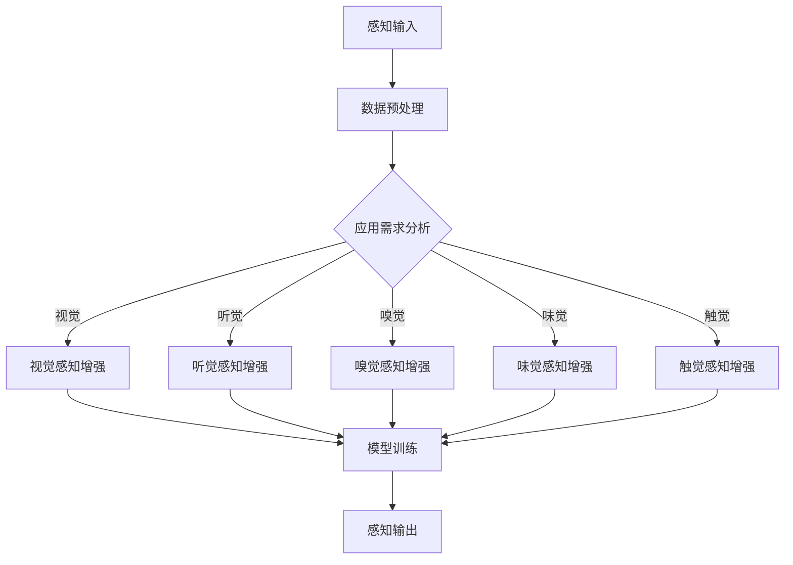
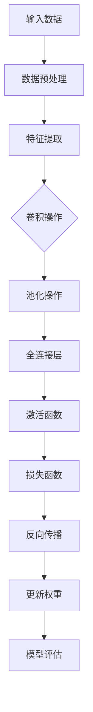

                 

### 文章标题

# AI感知增强：超越人类五感的体验

### 关键词：
- 感知增强
- 人工智能
- 深度学习
- 传感器技术
- 多模态感知

### 摘要：
本文探讨了人工智能（AI）在感知增强领域的突破性进展。通过分析AI感知增强的基本概念、技术原理和实际应用，本文揭示了AI如何超越人类五感，提供更丰富、更真实的感知体验。文章涵盖了视觉、听觉、嗅觉、味觉和触觉感知增强的技术细节，以及这些技术在医疗、教育和智能家居等领域的广泛应用。同时，本文也探讨了感知增强技术面临的挑战和未来发展趋势，为读者提供了一幅AI感知增强的全面蓝图。

### 第一部分：感知增强概述

#### 感知增强概述

随着人工智能技术的快速发展，感知增强成为了一个备受关注的研究方向。感知增强，顾名思义，是指通过人工智能技术，增强人类感官系统的感知能力。这种增强不仅限于传统意义上的五感（视觉、听觉、嗅觉、味觉和触觉），还包括多维度的感知扩展，如空间感知、情感感知等。

##### 1.1 感知增强的概念与定义

感知增强（Perception Augmentation）是指利用人工智能技术，如深度学习、机器学习和传感器技术，增强或扩展人类感官系统的感知能力。感知增强的核心目标是提高人类对环境的理解、反应速度和决策能力。

##### 1.2 人类五感解析

- **视觉感知**：通过眼睛感知光信号，形成图像，使我们能够看到周围的世界。
- **听觉感知**：通过耳朵接收声波信号，识别声音，使我们能够听到声音。
- **嗅觉感知**：通过鼻子感知化学气体，识别气味，帮助我们区分不同的物质。
- **味觉感知**：通过舌头感知化学物质，识别味道，帮助我们判断食物的安全性。
- **触觉感知**：通过皮肤感知触觉信号，识别物体表面特征，使我们能够感受到物体的形状、质地和温度。

##### 1.3 AI感知增强技术简介

AI感知增强技术的核心在于将人工智能与传感器技术相结合，实现人类感知能力的增强。以下是几种常见的AI感知增强技术：

- **深度学习在感知增强中的应用**：深度学习模型，特别是卷积神经网络（CNN），被广泛应用于图像和视频处理，实现视觉感知增强。
- **机器学习模型在感知增强中的作用**：通过机器学习模型，如决策树、支持向量机等，可以实现对声音、气味和触觉的识别和分类。
- **传感器技术对感知增强的推动**：各种高精度传感器，如摄像头、麦克风、气味传感器和触觉传感器，为AI感知增强提供了丰富的数据输入。

##### 1.4 AI感知增强的挑战与未来发展趋势

虽然AI感知增强技术已经取得了显著的进展，但仍然面临一些挑战：

- **数据隐私**：感知增强技术需要大量的个人数据，如何保护用户隐私成为了一个重要问题。
- **算法透明度**：AI算法的复杂性和黑箱性质使得其决策过程难以解释，增加了信任和透明度的挑战。
- **可解释性**：提高算法的可解释性，使其决策过程更加透明和可信，是感知增强技术的关键方向。

未来，AI感知增强技术的发展趋势将包括：

- **多模态感知**：结合多种感官数据，实现更全面和准确的感知。
- **自适应感知**：通过学习和适应，感知系统可以更好地满足用户的需求。
- **跨领域感知增强**：感知增强技术将在更多领域得到应用，如医疗、教育和智能交通等。

### 第二部分：感知增强技术详解

#### 视觉感知增强

##### 2.1 图像处理基础

图像处理是视觉感知增强的基础。以下是一些基本的图像处理概念：

- **图像像素操作**：图像由像素组成，通过改变像素的值可以实现图像的亮度和对比度调整。
- **空间变换**：包括旋转、缩放和翻转等操作，用于改变图像的空间结构。
- **频域处理**：通过傅里叶变换将图像从空间域转换到频域，进行滤波和增强处理。

##### 2.2 卷积神经网络（CNN）原理与应用

卷积神经网络（CNN）是视觉感知增强的核心技术。以下是CNN的基本原理：

- **CNN的基本结构**：CNN由多个卷积层、池化层和全连接层组成，通过卷积操作提取图像特征。
- **卷积操作**：卷积层通过卷积操作提取图像的局部特征。
- **池化操作**：池化层用于降低图像的维度，提高模型的泛化能力。
- **Fully Connected Layer**：全连接层将卷积层提取的特征映射到具体的分类或回归结果。

##### 2.3 深度学习在视觉感知中的应用案例

深度学习在视觉感知中有着广泛的应用，以下是几个典型的应用案例：

- **人脸识别**：通过CNN模型，可以实现对图像中人脸的准确识别。
- **图像分类**：深度学习模型可以实现对图像内容的分类，如植物识别、动物识别等。
- **视频分割**：深度学习技术可以实现对视频中的物体进行分割和跟踪。

##### 2.4 增强现实（AR）与虚拟现实（VR）中的视觉感知增强

增强现实（AR）和虚拟现实（VR）是视觉感知增强的重要应用领域。以下是视觉感知增强在AR和VR中的应用：

- **AR技术简介**：AR技术通过将虚拟物体叠加到真实世界中，提供丰富的交互体验。
- **VR技术简介**：VR技术通过虚拟环境的创建，提供沉浸式的体验。
- **视觉感知增强在AR/VR中的应用**：通过深度学习和图像处理技术，可以实现高质量的AR/VR内容生成和交互。

##### 2.5 感知增强技术的挑战与未来发展方向

尽管视觉感知增强技术已经取得了显著的成果，但仍然面临一些挑战：

- **计算资源消耗**：深度学习模型通常需要大量的计算资源和存储空间。
- **实时性**：对于实时应用场景，如自动驾驶和智能监控等，如何保证感知系统的实时性是一个重要问题。
- **交互性**：如何提高感知系统与用户的交互性，使其更加自然和直观，是一个关键方向。

未来，视觉感知增强技术的发展方向包括：

- **模型压缩**：通过模型压缩技术，减少模型的计算量和存储需求。
- **硬件加速**：利用专用硬件加速深度学习模型的计算，提高实时性。
- **跨模态感知**：结合多种感官数据，实现更全面和准确的感知。

### 第三部分：听觉感知增强

#### 声音处理基础

声音处理是听觉感知增强的基础。以下是一些基本的声音处理概念：

- **声音信号的基本概念**：声音是由声波产生的，声波可以通过频率、振幅和相位等特征来描述。
- **声音信号的数字化**：将模拟声音信号转换为数字信号，以便计算机处理。
- **音频编解码**：音频编解码技术用于压缩和还原音频信号，提高数据传输和存储效率。
- **声音增强**：通过算法提高声音的清晰度和质量。

#### 3.2 声音信号处理方法

声音信号处理方法包括：

- **滤波**：通过滤波器去除噪声和不需要的频率成分，提高声音的清晰度。
- **均衡**：通过调整不同频率的增益，改善声音的音质。
- **去啸叫**：去除由于共振引起的噪声。
- **动态范围压缩**：控制声音的动态范围，使其更加平稳。

#### 3.3 机器学习在声音信号处理中的应用

机器学习在声音信号处理中的应用包括：

- **语音识别**：通过深度学习模型，将语音信号转换为文本。
- **音乐分类**：通过机器学习模型，对音乐进行分类，如流派、风格等。
- **声音分割**：通过机器学习模型，将声音信号分割为不同的声源。

#### 3.4 听觉感知增强的案例研究

听觉感知增强的案例研究包括：

- **语音助手**：如Siri、Alexa和Google Assistant等，通过语音识别和语音合成技术，提供交互式服务。
- **无线耳机音质增强**：通过算法优化，提高无线耳机的音质和稳定性。
- **线控麦克风**：通过算法处理，提高麦克风的拾音效果和抗噪能力。

#### 3.5 听觉感知增强技术的挑战与未来发展方向

听觉感知增强技术面临的挑战包括：

- **音质保真度**：如何提高声音的保真度，使其更加接近原始声音。
- **语音识别准确性**：如何提高语音识别的准确性，减少错误率。
- **跨语言语音识别**：如何实现不同语言之间的语音识别，提高跨文化沟通的效率。

未来，听觉感知增强技术的发展方向包括：

- **深度神经网络**：通过更复杂的深度神经网络，提高声音处理的效果。
- **端到端学习**：通过端到端学习，简化模型结构，提高实时性。
- **跨模态感知**：结合视觉、触觉等感知数据，实现更全面和准确的感知。

### 第四部分：其他感知增强技术

#### 嗅觉与味觉感知增强

##### 4.1 嗅觉与味觉感知基础

嗅觉和味觉是人们感知世界的重要方式。以下是嗅觉与味觉感知的基础知识：

- **嗅觉系统**：嗅觉系统由鼻腔、嗅黏膜和嗅神经组成，通过感知化学气体识别气味。
- **味觉系统**：味觉系统由舌头、味蕾和味觉神经组成，通过感知化学物质识别味道。

##### 4.2 机器学习在嗅觉与味觉感知中的应用

机器学习在嗅觉与味觉感知中的应用包括：

- **嗅觉识别**：通过机器学习模型，识别不同气味的特征。
- **味觉分类**：通过机器学习模型，对食物进行分类，如辣味、甜味等。

##### 4.3 嗅觉与味觉感知增强的案例研究

嗅觉与味觉感知增强的案例研究包括：

- **智能冰箱**：通过感知食物的气味，智能冰箱可以提醒用户食物的新鲜程度。
- **智能调味系统**：通过感知菜肴的味道，智能调味系统可以自动调整调味品的用量。

##### 4.4 嗅觉与味觉感知增强技术的挑战与未来发展方向

嗅觉与味觉感知增强技术面临的挑战包括：

- **感知准确性**：如何提高感知准确性，减少误识别率。
- **跨文化适应性**：如何适应不同文化的味觉和嗅觉偏好。

未来，嗅觉与味觉感知增强技术的发展方向包括：

- **多模态感知**：结合视觉、触觉等感知数据，实现更全面和准确的感知。
- **个性化感知**：通过个性化感知，提高用户的感知体验。

#### 触觉感知增强

##### 5.1 触觉感知基础

触觉感知是通过皮肤感知触觉信号的能力。以下是触觉感知的基础知识：

- **触觉传感器**：触觉传感器用于检测物体的形状、质地和温度。
- **触觉交互**：触觉交互是通过触觉传感器实现的，用户可以通过触觉感知与设备进行交互。

##### 5.2 机器学习在触觉感知中的应用

机器学习在触觉感知中的应用包括：

- **触觉识别**：通过机器学习模型，识别不同的触觉信号。
- **触觉分类**：通过机器学习模型，对触觉信号进行分类。

##### 5.3 触觉感知增强的案例研究

触觉感知增强的案例研究包括：

- **智能手套**：通过触觉传感器和机器学习模型，智能手套可以识别不同的触觉信号，提高用户的感知体验。
- **智能按摩椅**：通过触觉传感器和机器学习模型，智能按摩椅可以根据用户的身体特征提供个性化的按摩服务。

##### 5.4 触觉感知增强技术的挑战与未来发展方向

触觉感知增强技术面临的挑战包括：

- **触觉反馈的真实感**：如何提高触觉反馈的真实感，使其更加接近真实触觉。
- **触觉传感器的灵敏度**：如何提高触觉传感器的灵敏度，使其能够更准确地检测触觉信号。

未来，触觉感知增强技术的发展方向包括：

- **柔性触觉传感器**：通过开发柔性触觉传感器，提高触觉感知的灵活性和适应性。
- **多模态感知**：结合视觉、听觉等感知数据，实现更全面和准确的感知。

### 第五部分：应用与展望

#### AI感知增强在医疗领域的应用

##### 6.1 感知增强技术在医疗诊断中的应用

感知增强技术在医疗诊断中的应用包括：

- **影像诊断**：通过深度学习模型，对医学影像进行分析，提高诊断的准确性和效率。
- **听力检测**：通过声音信号处理技术，对听力进行精确检测，帮助听力障碍患者进行康复治疗。

##### 6.2 感知增强技术在手术辅助中的应用

感知增强技术在手术辅助中的应用包括：

- **手术机器人**：通过机器视觉和触觉感知，手术机器人可以提高手术的精确性和安全性。
- **精准手术导航**：通过多模态感知技术，提供精准的手术导航，帮助医生进行复杂手术。

##### 6.3 感知增强技术在康复治疗中的应用

感知增强技术在康复治疗中的应用包括：

- **个性化康复方案**：通过感知增强技术，为康复患者提供个性化的康复方案，提高康复效果。
- **肌肉活动监测**：通过触觉感知技术，监测康复患者的肌肉活动，帮助医生制定更有效的康复计划。

##### 6.4 感知增强技术在公共卫生监测中的应用

感知增强技术在公共卫生监测中的应用包括：

- **疫情监测**：通过感知增强技术，实时监测疫情的发展态势，为疫情防控提供数据支持。
- **传染病预警**：通过感知增强技术，提前预警传染病的爆发，减少疾病传播的风险。

#### AI感知增强在教育领域的应用

##### 7.1 感知增强技术在教学中的应用

感知增强技术在教学中的应用包括：

- **个性化学习**：通过感知增强技术，为学生提供个性化的学习方案，提高学习效果。
- **虚拟实验室**：通过虚拟现实技术，为学生提供虚拟实验环境，提高实验教学的趣味性和互动性。

##### 7.2 感知增强技术在学生评估中的应用

感知增强技术在学生评估中的应用包括：

- **情绪识别**：通过面部表情和语音分析，识别学生的情绪状态，为教育者提供反馈。
- **健康监测**：通过感知增强技术，实时监测学生的健康状况，为教育者提供健康管理的建议。

##### 7.3 感知增强技术在教育科技中的应用

感知增强技术在教育科技中的应用包括：

- **在线教育平台**：通过感知增强技术，提高在线教育平台的互动性和用户体验。
- **智能教育工具**：通过感知增强技术，开发智能教育工具，提高教学效率和效果。

##### 7.4 感知增强技术在教育领域的挑战与未来发展方向

感知增强技术在教育领域面临的挑战包括：

- **技术成熟度**：如何提高感知增强技术的成熟度，使其更好地服务于教育领域。
- **教育公平**：如何确保感知增强技术在教育中的应用公平，避免技术差距。

未来，感知增强技术在教育领域的发展方向包括：

- **智能化教学**：通过感知增强技术，实现智能化教学，提高教学效率和效果。
- **个性化教育**：通过感知增强技术，为学生提供个性化的教育服务，满足不同学生的需求。

#### AI感知增强在智能家居中的应用

##### 8.1 感知增强技术在智能家居设备中的应用

感知增强技术在智能家居设备中的应用包括：

- **智能照明**：通过感知增强技术，实现智能调节室内光照，提高居住环境的舒适度。
- **智能安防**：通过感知增强技术，提高家居安全，实时监测家中情况。

##### 8.2 感知增强技术在智能家电中的应用

感知增强技术在智能家电中的应用包括：

- **智能空调**：通过感知增强技术，实现智能调节空调温度和湿度，提高家居环境的舒适度。
- **智能冰箱**：通过感知增强技术，智能监测食物的新鲜程度，提醒用户及时处理。

##### 8.3 感知增强技术在智慧家庭生态中的应用

感知增强技术在智慧家庭生态中的应用包括：

- **家庭自动化**：通过感知增强技术，实现家居设备的自动化运行，提高生活质量。
- **跨设备交互**：通过感知增强技术，实现设备之间的智能交互，提高用户的使用体验。

##### 8.4 感知增强技术在智能家居领域的挑战与未来发展方向

感知增强技术在智能家居领域面临的挑战包括：

- **数据安全**：如何确保用户数据的安全，防止隐私泄露。
- **用户隐私保护**：如何在提供感知增强服务的同时，保护用户的隐私。

未来，感知增强技术在智能家居领域的发展方向包括：

- **智能化升级**：通过感知增强技术，实现智能家居设备的智能化升级，提高家居设备的功能和性能。
- **个性化服务**：通过感知增强技术，为用户提供个性化的智能家居服务，满足不同用户的需求。

### 附录

#### 附录 A：AI感知增强技术参考资料

##### A.1 常用AI框架与工具

- TensorFlow
- PyTorch
- Keras

##### A.2 相关学术论文与书籍

- "Deep Learning" by Goodfellow, Bengio, and Courville
- "Computer Vision: Algorithms and Applications" by Richard Szeliski

##### A.3 在线资源与社区

- GitHub
- Stack Overflow
- arXiv

#### 附录 B：实践项目指南

##### B.1 实践项目概述

- **项目目标**：通过实践项目，了解AI感知增强技术的应用和实现。
- **项目需求**：实现一个基于深度学习的图像分类系统。
- **项目流程**：数据收集、数据预处理、模型训练、模型评估。

##### B.2 实践项目案例

- **案例一：基于深度学习的图像分类**：使用卷积神经网络（CNN）对图像进行分类。
- **案例二：基于机器学习的语音识别**：使用循环神经网络（RNN）实现语音识别。
- **案例三：基于AR的虚拟现实应用**：使用增强现实（AR）技术开发一个虚拟现实应用。

##### B.3 实践项目代码解析

- **代码结构**：包含数据预处理、模型训练和模型评估三个部分。
- **关键代码解读**：对模型训练和评估的关键代码进行详细解释。
- **代码优化建议**：针对代码性能和效率提出优化建议。

##### B.4 实践项目评估与改进

- **评估指标**：准确率、召回率、F1分数等。
- **改进策略**：通过调整模型参数、增加训练数据等方法进行改进。
- **项目总结**：总结项目经验，提出未来改进方向。

#### 附录 C：术语表

- **深度学习**：一种机器学习技术，通过多层神经网络进行数据特征学习和模型训练。
- **卷积神经网络**：一种特殊的神经网络，通过卷积操作提取图像特征。
- **自适应滤波器**：一种能够根据输入信号自动调整参数的滤波器。
- **多模态感知**：通过结合多种感知数据进行处理和分析。
- **增强现实**：通过虚拟物体叠加到真实世界中，提供沉浸式体验。
- **虚拟现实**：通过虚拟环境的创建，提供完全沉浸式的体验。

#### 附录 D：Mermaid流程图示例

##### D.1 感知增强技术架构

##### D.2 深度学习算法流程

#### 附录 E：数学模型与公式

##### E.1 卷积操作公式

$$
\text{output}_{ij} = \sum_{k=1}^{m} w_{ik} \cdot \text{input}_{kj}
$$

其中，\( \text{output}_{ij} \) 是输出特征图上的像素值，\( w_{ik} \) 是卷积核的权重，\( \text{input}_{kj} \) 是输入特征图上的像素值。

##### E.2 池化操作公式

$$
\text{output}_{i} = \max_{j} \left( \text{input}_{ij} \right)
$$

其中，\( \text{output}_{i} \) 是输出特征图上的像素值，\( \text{input}_{ij} \) 是输入特征图上的像素值。

##### E.3 神经网络反向传播算法

$$
\delta_{j} = \text{sigmoid}'(\text{z}_{j}) \cdot (\text{y} - \text{output}_{j})
$$

$$
\delta_{i} = \sum_{j} w_{ij} \cdot \delta_{j}
$$

$$
w_{ij} := w_{ij} - \alpha \cdot \delta_{i} \cdot \text{input}_{i}
$$

其中，\( \text{sigmoid}'(x) = \frac{1}{1 + e^{-x}} \)，\( \text{z}_{j} \) 是神经元的输入，\( \text{output}_{j} \) 是神经元的输出，\( \text{y} \) 是期望输出，\( w_{ij} \) 是权重，\( \alpha \) 是学习率，\( \delta_{j} \) 是误差梯度，\( \delta_{i} \) 是输入误差。

#### 附录 F：习题与答案

##### F.1 习题1：解释深度学习中的反向传播算法。

答案：深度学习中的反向传播算法是一种用于训练神经网络的方法。它通过前向传播计算输出，然后通过反向传播计算损失函数关于每个权重的梯度。具体步骤如下：

1. 前向传播：将输入数据通过神经网络传递，计算每个神经元的输出。
2. 计算损失函数：计算预测输出和真实输出之间的误差。
3. 反向传播：从输出层开始，将误差反向传播到输入层，计算每个权重的梯度。
4. 更新权重：使用梯度下降或其他优化算法更新权重。

##### F.2 习题2：描述卷积神经网络的工作原理。

答案：卷积神经网络（CNN）是一种用于图像识别和处理的特殊神经网络。它的工作原理包括以下几个步骤：

1. 输入层：接收图像数据。
2. 卷积层：通过卷积操作提取图像特征。每个卷积核提取图像的局部特征。
3. 池化层：用于降低图像的维度，提高模型的泛化能力。
4. 全连接层：将卷积层提取的特征映射到具体的分类或回归结果。
5. 输出层：输出预测结果。

##### F.3 习题3：简述AR与VR的区别。

答案：AR（增强现实）和VR（虚拟现实）是两种不同的技术，其主要区别在于：

- AR：通过在现实世界中叠加虚拟物体，提供沉浸式体验。AR技术主要应用于增强现实场景，如游戏、教育、医疗等。
- VR：通过虚拟环境的创建，提供完全沉浸式的体验。VR技术主要应用于虚拟场景，如游戏、娱乐、培训等。

##### F.4 习题4：论述感知增强技术在医疗领域的应用前景。

答案：感知增强技术在医疗领域的应用前景非常广阔，主要包括以下几个方面：

1. 医学影像分析：通过感知增强技术，对医学影像进行分析，提高诊断的准确性和效率。
2. 手术辅助：通过感知增强技术，提供精准的手术导航和手术机器人，提高手术的成功率和安全性。
3. 康复治疗：通过感知增强技术，为康复患者提供个性化的康复方案，提高康复效果。
4. 公共卫生监测：通过感知增强技术，实时监测疫情的发展态势，为疫情防控提供数据支持。

总之，感知增强技术在医疗领域的应用将为医疗诊断、手术辅助、康复治疗和公共卫生监测等领域带来革命性的变化。

