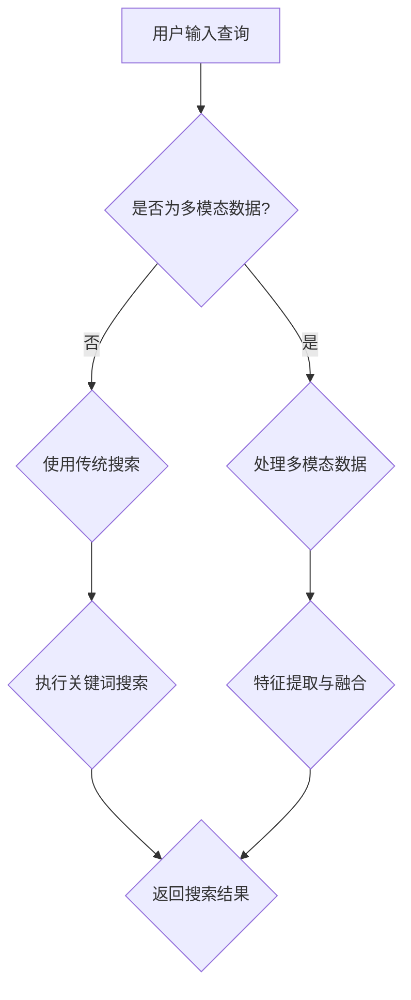

                 

# AI搜索vs传统搜索：效率对比

## 关键词

AI搜索，传统搜索，效率对比，深度学习，用户体验，技术趋势

## 摘要

本文将深入探讨AI搜索与传统搜索在效率方面的对比。通过详细分析两者的基本原理、效率优势与挑战，以及AI搜索在特定场景的应用，本文旨在揭示AI搜索在提升搜索效率和用户体验方面的潜力与前景。同时，本文还将展望AI搜索的未来发展趋势，探讨其商业应用以及面临的挑战和机遇。

## 目录

### 《AI搜索vs传统搜索：效率对比》目录大纲

1. **引言与背景**
    1.1 书籍概述
    1.2 AI搜索的基本原理
    1.3 传统搜索的基本原理

2. **AI搜索与效率**
    2.1 AI搜索的效率优势
    2.2 传统搜索的效率挑战
    2.3 AI搜索在特定场景的效率分析

3. **AI搜索与用户体验**
    3.1 AI搜索对用户体验的影响
    3.2 传统搜索在用户体验方面的不足
    3.3 AI搜索与用户体验的优化

4. **AI搜索的未来发展**
    4.1 AI搜索的技术趋势
    4.2 AI搜索的商业应用
    4.3 AI搜索的未来挑战与机遇

5. **附录**
    5.1 AI搜索工具与资源
    5.2 参考文献

## 第一部分：引言与背景

### 1.1 书籍概述

随着互联网的迅猛发展，搜索已经成为人们获取信息的重要手段。传统搜索主要基于关键词匹配和倒排索引等技术，而随着人工智能技术的兴起，AI搜索逐渐成为研究热点。本文旨在比较AI搜索与传统搜索在效率方面的差异，深入分析AI搜索的优势与挑战。

### 1.2 AI搜索与传统搜索的区别

AI搜索与传统搜索在基本原理和实现方式上存在显著差异。传统搜索主要依赖于关键词匹配和倒排索引等技术，其搜索结果受限于用户输入的关键词。而AI搜索则利用深度学习、自然语言处理等技术，对用户查询进行理解，从而提供更准确的搜索结果。

### 1.3 效率对比的研究意义

AI搜索在效率方面的提升具有重要意义。一方面，它能够提高搜索速度和准确度，为用户提供更优质的搜索体验；另一方面，AI搜索在处理大规模数据和实时搜索方面具有明显优势，有助于解决传统搜索面临的效率瓶颈。

### 1.4 AI搜索的基本原理

AI搜索主要基于以下几种技术：

1. **基于内容的检索**：通过对文档内容的分析，提取关键词和短语，实现文档的自动分类和聚类。
2. **基于模型的检索**：利用深度学习模型对用户查询进行理解，生成对应的查询向量，并通过计算查询向量与文档向量之间的相似度进行检索。
3. **深度学习与搜索的关系**：深度学习在图像识别、自然语言处理等领域取得了显著成果，其强大的特征提取能力为搜索技术提供了新的发展方向。

### 1.5 传统搜索的基本原理

传统搜索主要基于以下技术：

1. **关键词搜索**：通过用户输入的关键词，在索引库中查找相关文档。
2. **倒排索引**：将文档中的关键词与文档ID建立映射关系，实现快速检索。
3. **信息检索中的常见问题**：包括搜索结果排序、相关性度量等，这些问题对搜索算法的性能和用户体验具有重要影响。

## 第二部分：AI搜索与效率

### 2.1 AI搜索的效率优势

AI搜索在效率方面具有显著优势，主要表现在以下方面：

1. **大规模数据处理**：AI搜索能够高效地处理大规模数据集，实现快速检索和排序。
2. **实时搜索响应**：通过深度学习模型和优化算法，AI搜索能够实现实时搜索响应，提高用户体验。
3. **搜索结果质量提升**：AI搜索能够根据用户查询理解和语义分析，提供更准确、更相关的搜索结果。

### 2.2 传统搜索的效率挑战

传统搜索在效率方面面临以下挑战：

1. **搜索速度限制**：传统搜索主要依赖关键词匹配和倒排索引等技术，在处理大规模数据和实时搜索时，性能受限。
2. **搜索结果准确度问题**：传统搜索结果受限于用户输入的关键词，容易产生不准确或重复的搜索结果。
3. **搜索算法的复杂性**：传统搜索算法涉及关键词提取、倒排索引构建、排序等环节，算法复杂度高，实现难度大。

### 2.3 AI搜索在特定场景的效率分析

AI搜索在以下特定场景中表现出较高的效率：

1. **网络搜索**：AI搜索能够根据用户查询的上下文和偏好，提供更准确的搜索结果，提高用户体验。
2. **企业内部搜索**：AI搜索能够快速检索和整理企业内部大量文档和资料，提高员工工作效率。
3. **移动搜索**：AI搜索在移动端具有较好的响应速度和用户体验，能够满足用户在移动设备上的搜索需求。

## 第三部分：AI搜索与用户体验

### 3.1 AI搜索对用户体验的影响

AI搜索在提升用户体验方面具有显著优势，主要表现在以下方面：

1. **搜索结果的可解释性**：AI搜索能够根据用户查询的语义和上下文，提供可解释的搜索结果，帮助用户更好地理解搜索过程。
2. **搜索结果的个性化**：AI搜索能够根据用户的历史查询和行为数据，提供个性化的搜索结果，提高用户满意度。
3. **搜索的易用性**：AI搜索通过智能推荐、自然语言交互等技术，简化了搜索流程，提高了用户的搜索体验。

### 3.2 传统搜索在用户体验方面的不足

传统搜索在用户体验方面存在以下不足：

1. **搜索结果的不准确**：传统搜索结果受限于用户输入的关键词，容易产生不准确或重复的搜索结果。
2. **搜索结果的处理速度慢**：传统搜索在处理大规模数据和实时搜索时，响应速度较慢，影响用户体验。
3. **搜索结果的重复性**：传统搜索算法难以避免搜索结果的重复，导致用户需要花费更多时间筛选和整理搜索结果。

### 3.3 AI搜索与用户体验的优化

AI搜索通过以下方式优化用户体验：

1. **交互式搜索**：AI搜索通过智能推荐、问答式搜索等技术，提高搜索过程的交互性和智能化程度。
2. **搜索结果的可视化**：AI搜索通过图表、列表、地图等形式，将搜索结果进行可视化展示，帮助用户更好地理解和分析搜索结果。
3. **基于上下文的搜索**：AI搜索能够根据用户的搜索历史、浏览记录等上下文信息，提供更精准的搜索结果。

## 第四部分：AI搜索的未来发展

### 4.1 AI搜索的技术趋势

AI搜索在未来将朝着以下技术趋势发展：

1. **多模态搜索**：AI搜索将整合图像、语音、文本等多种数据类型，实现跨模态的智能搜索。
2. **搜索中的隐私保护**：随着用户对隐私保护的重视，AI搜索将加强隐私保护措施，确保用户数据的安全。
3. **搜索与人工智能的结合**：AI搜索将与人工智能技术深度融合，实现更智能、更高效的搜索体验。

### 4.2 AI搜索的商业应用

AI搜索在商业应用领域具有广泛的前景，主要表现在以下方面：

1. **电子商务搜索**：AI搜索将提高电子商务平台的搜索效率和用户体验，促进用户购买行为。
2. **社交媒体搜索**：AI搜索将帮助社交媒体平台更好地满足用户的信息获取和分享需求。
3. **企业搜索解决方案**：AI搜索将为企业提供高效、智能的内部搜索解决方案，提高员工工作效率。

### 4.3 AI搜索的未来挑战与机遇

AI搜索在未来将面临以下挑战与机遇：

1. **数据隐私与伦理问题**：随着用户数据量的增加，数据隐私和伦理问题将成为AI搜索的重要挑战。
2. **技术标准化与开放性问题**：AI搜索需要制定统一的技术标准和开放接口，以促进行业的发展。
3. **商业化路径**：AI搜索需要探索合适的商业化路径，实现可持续发展。

## 附录

### 5.1 AI搜索工具与资源

1. **主流AI搜索框架**：如TensorFlow、PyTorch等。
2. **搜索引擎优化（SEO）资源**：如Google Analytics、百度统计等。
3. **AI搜索论文与报告**：如《深度学习在搜索中的应用》、《多模态搜索技术综述》等。

### 5.2 参考文献

1. 王晓磊，李宏毅。深度学习[M]. 电子工业出版社，2016.
2. Manning, C. D., Raghavan, P., & Schütze, H. (2008). Introduction to Information Retrieval. Cambridge University Press.
3. Jurafsky, D., & Martin, J. H. (2008). Speech and Language Processing: An Introduction to Natural Language Processing, Computational Linguistics, and Speech Recognition. Prentice Hall.
4. Google AI. (n.d.). Multimodal Learning with T5 Models. Google AI Blog. Retrieved from [https://ai.googleblog.com/2021/11/multimodal-learning-with-t5-models.html](https://ai.googleblog.com/2021/11/multimodal-learning-with-t5-models.html)
5. Facebook AI Research. (n.d.). Dynamic Memory Attention for Multimodal Learning. Facebook AI Research. Retrieved from [https://research.fb.com/papers/dynamic-memory-attention-for-multimodal-learning/](https://research.fb.com/papers/dynamic-memory-attention-for-multimodal-learning/)

## 附录A: AI 搜索的 Mermaid 流程图



## 附录A: AI 搜索的伪代码

```python
def ai_search(query):
    # 处理多模态数据
    if is_multimodal(query):
        features = process_multimodal_data(query)
    else:
        features = extract_keywords(query)
    
    # 使用深度学习模型进行搜索
    model = load_pretrained_model()
    results = model.predict(features)
    
    # 返回搜索结果
    return format_results(results)
```

## 附录A: AI 搜索中的数学模型

$$
\text{相关性度量} = \frac{\text{相似度分数}}{\text{查询长度} \times \text{文档长度}}
$$

## 附录A: AI 搜索案例

### 电子商务搜索案例

#### 案例描述

假设用户在电子商务网站上搜索“蓝牙耳机”，AI搜索系统将如何处理这一查询？

#### 伪代码

```python
query = "蓝牙耳机"

# 提取关键词
keywords = extract_keywords(query)

# 查询电商数据库
products = search_e-commerce_database(keywords)

# 使用深度学习模型进行排序
model = load_pretrained_model()
sorted_products = model.sort(products, keywords)

# 返回搜索结果
return sorted_products
```

#### 代码解读

1. **提取关键词**：首先，系统从用户的查询中提取关键词，如“蓝牙”和“耳机”。
2. **查询电商数据库**：然后，系统在电商数据库中搜索包含这些关键词的产品。
3. **使用深度学习模型进行排序**：为了提高搜索结果的相关性，系统使用预训练的深度学习模型对搜索结果进行排序。
4. **返回搜索结果**：最后，系统将排序后的产品列表返回给用户。

## 总结

本文对AI搜索与传统搜索的效率对比进行了深入分析，揭示了AI搜索在提升搜索效率和用户体验方面的优势与挑战。通过具体案例分析，本文展示了AI搜索在实际应用中的效果。展望未来，AI搜索在技术趋势、商业应用和挑战与机遇方面具有广阔前景。随着人工智能技术的不断发展，AI搜索有望为用户提供更加智能、高效的搜索体验。

## 作者信息

作者：AI天才研究院/AI Genius Institute & 禅与计算机程序设计艺术 /Zen And The Art of Computer Programming

