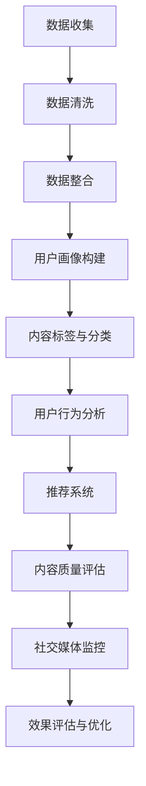

                 

# AI搜索引擎与社交媒体的融合

> 关键词：AI搜索引擎、社交媒体、融合、数据整合、用户行为分析、推荐系统、内容质量评估

> 摘要：本文探讨了AI搜索引擎与社交媒体融合的重要性、技术基础、数据整合方法、用户行为分析与推荐系统、内容质量评估与监控，以及实际案例和未来展望。通过详细分析，本文旨在为读者提供对AI搜索引擎与社交媒体融合的全面理解和深入见解。

## 第一部分: AI搜索引擎与社交媒体的融合概述

### 第1章: 引言

#### 1.1 书籍背景与目标

随着互联网的迅猛发展，信息获取的方式和途径也发生了翻天覆地的变化。AI搜索引擎和社交媒体作为现代互联网的两大重要组成部分，各自在信息检索和社交互动方面发挥了重要作用。然而，在信息爆炸的时代，如何有效地将这两者融合起来，为用户提供更加智能、个性化的服务，成为了当前研究的热点。

本篇文章旨在探讨AI搜索引擎与社交媒体的融合，通过详细分析其技术基础、数据整合、用户行为分析、推荐系统、内容质量评估与监控等方面的内容，为读者提供一个全面、深入的视角。文章将涵盖以下内容：

1. AI搜索引擎技术的发展及其对搜索领域的影响。
2. 社交媒体的发展历程及其在信息传播中的作用。
3. AI搜索引擎与社交媒体融合的关键问题和挑战。
4. 数据整合的方法和用户画像构建。
5. 用户行为分析与推荐系统原理。
6. 社交媒体内容质量评估与监控技术。
7. 实际案例分析和未来展望。

#### 1.1.1 AI搜索引擎技术的发展

AI搜索引擎技术的发展可以追溯到1990年代中期，随着互联网的普及，搜索引擎成为人们获取信息的重要工具。早期的搜索引擎主要依赖于关键词匹配和文档相似度计算，其搜索效果受到词汇表达和语义理解的限制。

随着AI技术的发展，特别是深度学习和自然语言处理技术的应用，AI搜索引擎得到了极大的提升。现代AI搜索引擎不仅能够理解用户查询的语义，还能根据用户的历史行为和偏好进行个性化搜索，提供更加精准、智能的搜索服务。

#### 1.1.2 社交媒体的影响力

社交媒体的崛起改变了人们的社交方式和信息传播模式。通过社交媒体，人们可以轻松地分享内容、表达观点、与他人互动，形成了一个庞大的社交网络。社交媒体的影响力不仅体现在个人生活中，还渗透到了企业、政府等多个领域。

社交媒体平台积累了海量的用户数据和内容数据，这些数据为AI搜索引擎提供了丰富的信息资源。同时，社交媒体的用户行为和互动数据也为搜索引擎提供了重要的参考，有助于实现更加精准的搜索结果和内容推荐。

#### 1.1.3 两者融合的重要性和必要性

AI搜索引擎与社交媒体的融合具有重要的现实意义和必要性。首先，融合可以充分发挥两者的优势，实现信息检索与社交互动的无缝连接，为用户提供一体化的服务体验。其次，融合可以促进数据的高效整合和利用，提升信息检索和推荐的准确性。此外，融合还可以推动AI技术的进一步发展，为搜索引擎带来更多的创新和可能性。

然而，AI搜索引擎与社交媒体的融合也面临一系列挑战，包括数据整合的复杂性、用户隐私保护、内容质量评估等。因此，深入研究AI搜索引擎与社交媒体的融合，提出有效的解决方案，对于推动互联网技术的发展和提升用户满意度具有重要意义。

#### 1.2 书籍结构

本篇文章分为八个主要章节，分别从不同角度探讨了AI搜索引擎与社交媒体的融合。具体内容如下：

- **第1章：引言**：介绍了书籍的背景、目标和研究意义。
- **第2章：AI搜索引擎基础**：探讨了AI搜索引擎的工作原理、技术影响和面临的挑战。
- **第3章：社交媒体基础**：介绍了社交媒体的发展历程、数据特性和AI应用。
- **第4章：AI搜索引擎与社交媒体数据整合**：分析了数据整合的方法、用户画像构建和内容标签分类。
- **第5章：用户行为分析与推荐系统**：介绍了用户行为分析、推荐系统原理和深度学习应用。
- **第6章：社交媒体内容质量评估与监控**：探讨了内容质量评估、监控技术和深度学习应用。
- **第7章：AI搜索引擎与社交媒体融合的实战案例**：分析了实际案例的实施和效果评估。
- **第8章：未来展望与挑战**：展望了融合趋势、挑战和未来发展方向。

#### 1.2.1 内容布局

本篇文章采用逻辑清晰、结构紧凑的内容布局，以确保读者能够系统地了解AI搜索引擎与社交媒体的融合。每个章节的内容紧密相连，形成一个完整的研究体系。具体内容布局如下：

- **引言**：介绍书籍背景、目标和研究意义。
- **基础理论**：分别介绍AI搜索引擎和社交媒体的基础知识。
- **数据整合与处理**：分析数据整合的方法、用户画像构建和内容标签分类。
- **用户行为分析与推荐系统**：介绍用户行为分析、推荐系统原理和应用。
- **内容质量评估与监控**：探讨内容质量评估、监控技术和深度学习应用。
- **实战案例**：分析实际案例的实施和效果评估。
- **未来展望**：展望融合趋势、挑战和未来发展方向。

#### 1.2.2 阅读对象

本篇文章的阅读对象主要包括以下几类人群：

1. **AI搜索引擎和社交媒体领域的研究人员**：通过本文，读者可以深入了解AI搜索引擎与社交媒体融合的理论基础和技术方法。
2. **技术管理人员和开发人员**：本文提供了丰富的实战案例和技术细节，有助于技术人员在实际项目中应用AI搜索引擎与社交媒体融合的技术。
3. **企业决策者和市场分析师**：本文探讨了AI搜索引擎与社交媒体融合的商业模式和市场潜力，为企业的战略规划提供参考。
4. **对互联网技术和人工智能感兴趣的一般读者**：本文以通俗易懂的语言阐述了AI搜索引擎与社交媒体融合的核心概念和技术原理，适合对互联网技术和人工智能感兴趣的读者阅读。

#### 1.3 AI搜索引擎与社交媒体融合的关键问题

AI搜索引擎与社交媒体的融合涉及多个关键问题，包括数据整合与处理、用户行为分析、内容推荐与交互等。以下是对这些关键问题的简要分析：

1. **数据整合与处理**：社交媒体平台积累了海量的用户数据和内容数据，如何将这些数据进行有效整合和处理，是融合过程中的重要问题。数据整合需要解决数据来源、数据格式、数据清洗等问题，而数据处理则需要采用高效的数据挖掘和机器学习技术，以提取有用信息。

2. **用户行为分析**：用户行为数据是AI搜索引擎与社交媒体融合的重要参考。通过对用户行为进行分析，可以了解用户的需求、兴趣和偏好，从而实现个性化搜索和推荐。用户行为分析需要收集和整合用户浏览、搜索、点赞、评论等行为数据，并采用机器学习算法进行模式识别和分析。

3. **内容推荐与交互**：AI搜索引擎与社交媒体的融合需要实现个性化内容推荐和交互。通过分析用户行为数据和社交网络关系，可以为用户提供个性化的搜索结果和内容推荐，增强用户的参与感和满意度。同时，交互设计也需要充分考虑用户体验，提供便捷、自然的交互方式。

4. **内容质量评估与监控**：社交媒体平台的内容质量直接影响用户体验和平台的声誉。在融合过程中，需要对内容进行质量评估和监控，识别和过滤负面内容、虚假信息等，确保内容的质量和安全性。

5. **数据隐私保护**：数据隐私保护是AI搜索引擎与社交媒体融合的重要挑战。在融合过程中，需要采取有效的数据隐私保护措施，确保用户数据的保密性和安全性，避免数据泄露和滥用。

通过解决上述关键问题，AI搜索引擎与社交媒体的融合可以为用户提供更加智能、个性化的服务，提升信息检索和社交互动的效果。

### 第2章: AI搜索引擎基础

#### 2.1 搜索引擎工作原理

搜索引擎是互联网上用于信息检索的重要工具。其基本原理是通过爬虫技术收集互联网上的信息，构建索引，并根据用户的查询请求提供相关的搜索结果。以下是搜索引擎工作的主要步骤：

1. **网络爬虫（Crawler）**：网络爬虫是搜索引擎的核心组件之一，负责在互联网上爬取网页内容。爬虫从已知的网页地址开始，通过链接关系不断扩展爬取范围，获取更多网页内容。爬虫通常会遵循一定的爬取策略，如深度优先、广度优先等，以确保全面、有效地覆盖互联网上的信息。

2. **索引构建（Indexing）**：爬虫获取的网页内容需要经过处理和索引构建，以便在用户查询时能够快速定位相关的网页。索引构建主要包括以下几个步骤：
   - **文本提取**：从网页内容中提取文本信息，去除HTML标签、广告等无关内容。
   - **词干提取**：对提取的文本进行词干提取，将不同形式的单词转化为同一词干，如“running”和“runs”转化为“run”。
   - **倒排索引构建**：将文本内容转换为倒排索引，将每个词映射到包含该词的网页列表，以便快速查询。

3. **搜索算法（Search Algorithm）**：搜索引擎的核心功能是根据用户的查询请求提供相关的搜索结果。搜索算法主要分为以下几种类型：
   - **基于关键词匹配**：通过匹配用户查询词和网页内容中的关键词，提供相关的搜索结果。这种算法简单直观，但容易受到关键词表达和语义理解的限制。
   - **基于文档相似度计算**：通过计算用户查询词和网页内容之间的相似度，提供相关的搜索结果。常用的相似度计算方法包括TF-IDF（词频-逆文档频率）和向量空间模型。
   - **基于语义理解**：通过自然语言处理技术对用户查询和网页内容进行语义分析，提供更加精准的搜索结果。这种算法具有较高的语义理解能力，但实现较为复杂。

#### 2.2 AI技术对搜索引擎的影响

AI技术的发展为搜索引擎带来了巨大的变革和提升。以下是AI技术在搜索引擎中的一些主要应用：

1. **深度学习在搜索引擎中的应用**：深度学习技术，如神经网络，在搜索引擎中得到了广泛应用。深度学习模型可以自动学习大量数据中的特征，并用于改善搜索结果的质量。例如，卷积神经网络（CNN）可以用于图像识别，用于识别网页中的图像内容，从而提供更相关的搜索结果。

2. **自然语言处理在搜索中的应用**：自然语言处理（NLP）技术使搜索引擎能够更好地理解用户的查询意图和语义。通过NLP技术，搜索引擎可以实现语义搜索、问答系统、实体识别等功能，提供更加精准和个性化的搜索结果。

3. **个性化搜索**：个性化搜索是基于用户历史行为和偏好，为用户提供个性化的搜索结果。AI技术通过分析用户的浏览记录、搜索历史、点击行为等数据，构建用户画像，为用户提供个性化的搜索建议和内容推荐。

4. **智能纠错**：智能纠错是搜索引擎的一项重要功能，通过AI技术，搜索引擎可以自动识别用户输入的错误拼写，并提供正确的搜索结果。例如，当用户输入错别字时，搜索引擎可以自动纠正并提供正确的搜索建议。

#### 2.3 AI搜索引擎的挑战与趋势

尽管AI技术在搜索引擎中取得了显著的成果，但AI搜索引擎仍面临一系列挑战和趋势：

1. **智能化方向**：随着AI技术的不断发展，搜索引擎正朝着更加智能化的方向发展。未来的搜索引擎将能够更好地理解用户的查询意图，提供更加精准和个性化的搜索结果。

2. **搜索算法优化**：AI搜索引擎需要不断优化搜索算法，提高搜索结果的准确性和相关性。通过引入更多先进的AI技术，如深度学习、强化学习等，搜索引擎可以实现更高效的搜索算法。

3. **安全与隐私保护**：随着用户数据的增加，搜索引擎面临的数据安全和隐私保护问题也日益严峻。搜索引擎需要采取有效的数据安全和隐私保护措施，确保用户数据的安全和隐私。

4. **用户体验优化**：用户体验是搜索引擎的核心竞争力。搜索引擎需要不断优化用户界面和交互设计，提供更加便捷、自然的用户使用体验。

5. **跨平台融合**：随着移动设备和社交媒体的普及，搜索引擎需要实现跨平台的融合，为用户提供一致且无缝的搜索体验。

通过应对上述挑战和把握发展趋势，AI搜索引擎将继续提升其性能和用户体验，为用户提供更加智能、个性化的搜索服务。

### 第3章: 社交媒体基础

#### 3.1 社交媒体的发展历程

社交媒体是指用户通过互联网平台进行信息共享、交流互动的一种新型媒体形式。自2000年代初期以来，社交媒体经历了快速的发展和演变，成为了互联网生态系统中不可或缺的一部分。以下是社交媒体的发展历程：

1. **初期阶段（2000年代初）**：社交媒体的萌芽可以追溯到2000年代初，以博客和论坛为代表。早期社交媒体平台如LiveJournal和MySpace，允许用户发布个人日志和论坛帖子，进行简单的社交互动。

2. **快速发展阶段（2004-2009年）**：2004年，Facebook的成立标志着社交媒体进入了一个新的发展阶段。Facebook通过社交网络的构建，实现了用户之间更加紧密的互动和连接。随后，Twitter、YouTube等平台相继崛起，丰富了社交媒体的类型和功能。

3. **多元化发展阶段（2010年至今）**：随着移动互联网的普及，社交媒体进入多元化发展阶段。平台类型从社交网络扩展到短视频、直播、短视频、直播等多种形式。同时，社交媒体平台也不断引入人工智能、大数据等技术，提升用户体验和互动效果。

#### 3.2 社交媒体的主要类型

目前，社交媒体平台种类繁多，各种类型的平台在功能和应用场景上各有特色。以下是社交媒体的主要类型：

1. **社交网络平台**：如Facebook、LinkedIn等，以建立社交关系和共享信息为核心，用户可以通过发布状态、分享图片和视频、加入兴趣小组等方式进行互动。

2. **微博平台**：如Twitter、微博等，用户可以通过发布短文本、图片和视频等形式，快速分享个人动态和观点，并进行实时互动。

3. **短视频平台**：如抖音、快手等，用户可以通过拍摄和上传短视频，展示才艺、记录生活，并进行互动分享。

4. **直播平台**：如Twitch、斗鱼等，用户可以通过直播观看他人的游戏、生活等内容，实现实时互动和交流。

5. **社交问答平台**：如Quora、知乎等，用户可以通过提问、回答和评论，进行知识分享和讨论。

6. **社交媒体聚合平台**：如Flipboard、Google News等，通过聚合多个社交媒体平台和新闻网站的内容，为用户提供个性化的新闻和信息推荐。

#### 3.3 社交媒体的影响力分析

社交媒体在信息传播、社会互动、商业模式等多个方面产生了深远的影响：

1. **信息传播**：社交媒体使得信息的传播速度大大加快，打破了传统媒体的时空限制。用户可以通过社交媒体平台快速获取全球各地的新闻、资讯和观点，实现信息的实时共享和传播。

2. **社会互动**：社交媒体改变了人们的社交方式，使得人与人之间的连接更加紧密和多样化。用户可以通过社交媒体平台与朋友、家人、同事等进行即时沟通和互动，分享生活中的点滴和感受。

3. **商业模式**：社交媒体为企业和商家提供了新的营销渠道和商业模式。通过社交媒体平台，企业可以与用户进行直接互动，推广产品和服务，开展品牌建设。同时，社交媒体也为用户创造了新的消费场景和体验。

4. **社会影响力**：社交媒体平台成为舆论和社会运动的重要载体。用户可以通过社交媒体表达观点、发起活动，影响社会舆论和公共政策。

总之，社交媒体的发展不仅改变了人们的社交方式和信息获取方式，还对社会结构和商业模式产生了深远的影响。随着技术的不断进步，社交媒体将继续发挥其重要的影响力。

#### 3.4 社交媒体中的数据特性

社交媒体平台积累了海量的数据，这些数据具有丰富的特性和价值。以下是对社交媒体中用户数据、内容数据和用户行为数据的分析：

1. **用户数据**：
   - **用户基本信息**：包括用户的性别、年龄、地理位置、职业等基本信息。这些数据有助于平台了解用户的基本属性，进行用户画像的构建。
   - **用户社交关系**：包括用户的好友列表、关注列表、互动关系等。这些关系数据有助于构建社交网络，分析用户的社会影响力。
   - **用户行为数据**：包括用户的浏览记录、搜索历史、点击行为、点赞、评论等。这些行为数据反映了用户的兴趣和偏好，有助于进行个性化推荐和用户行为分析。

2. **内容数据**：
   - **文本内容**：包括用户的帖子、评论、博客等文本信息。这些文本内容反映了用户的观点和情感，有助于进行自然语言处理和情感分析。
   - **图片和视频内容**：包括用户上传的图片和视频。这些多媒体内容为平台提供了丰富的视觉素材，可以用于图像识别、视频分析等应用。
   - **标签和分类**：用户对内容进行标签和分类，有助于平台对内容进行组织和推荐。标签和分类数据可以用于内容推荐和搜索引擎优化。

3. **用户行为数据**：
   - **浏览和搜索行为**：用户在平台上的浏览和搜索行为，反映了用户的兴趣和需求。通过对这些行为数据的分析，可以了解用户的兴趣分布和搜索模式。
   - **互动行为**：包括用户的点赞、评论、分享等互动行为。这些互动数据反映了用户对内容的兴趣和影响力，有助于进行社交网络分析。
   - **时间分布**：用户的行为数据具有明显的时间分布特征。通过对时间分布数据的分析，可以了解用户的活跃时间和行为模式，有助于优化用户体验。

社交媒体中的数据特性为AI技术提供了丰富的应用场景，如用户画像构建、个性化推荐、内容质量评估等。通过对这些数据特性进行分析和应用，可以进一步提升社交媒体平台的用户体验和服务质量。

#### 3.5 社交媒体与AI的融合

随着AI技术的不断发展，社交媒体与AI的融合成为了研究的热点。以下从AI在社交媒体中的应用、数据挖掘、社交媒体与搜索引擎的交互等方面，探讨社交媒体与AI的融合。

1. **AI在社交媒体中的应用**：
   - **用户画像构建**：通过分析用户的基本信息、社交关系和用户行为数据，AI技术可以帮助平台构建精准的用户画像。用户画像的构建有助于实现个性化推荐、广告投放和用户细分。
   - **内容审核与过滤**：AI技术在社交媒体中用于自动识别和过滤违规内容，如色情、暴力、仇恨言论等。通过自然语言处理、图像识别等技术，AI可以高效地检测和过滤不良内容，保障社交媒体平台的安全和健康发展。
   - **情感分析**：AI技术可以分析用户在文本、图片和视频中的情感表达，了解用户的情感状态和情绪变化。情感分析有助于平台提供更加贴合用户情感需求的内容和服务。

2. **社交媒体中的数据挖掘**：
   - **社交网络分析**：通过分析用户之间的关系和互动行为，AI技术可以挖掘社交网络中的关键节点、社区结构和影响力分布。社交网络分析有助于了解用户行为模式、预测用户行为趋势，为平台提供决策支持。
   - **趋势预测**：AI技术可以分析社交媒体上的用户行为数据、话题热度等，预测未来的趋势和热点事件。趋势预测有助于平台提前布局和应对潜在的风险和机遇。
   - **推荐系统**：AI技术可以基于用户的行为数据、兴趣标签等进行个性化推荐，提升用户的参与度和满意度。推荐系统在社交媒体中的应用广泛，如内容推荐、广告推荐、朋友推荐等。

3. **社交媒体与搜索引擎的交互**：
   - **跨平台搜索**：社交媒体与搜索引擎的融合可以实现跨平台搜索，用户可以在一个平台上同时搜索社交媒体内容和传统网页内容。跨平台搜索有助于提高搜索引擎的覆盖范围和准确性。
   - **社会化搜索**：社会化搜索是基于用户社交网络的信息检索，通过分析用户的社交关系和互动行为，提供更加个性化的搜索结果。社会化搜索有助于挖掘用户社交网络中的潜在信息和价值。
   - **实时搜索**：社交媒体与搜索引擎的融合可以实现实时搜索，用户可以在社交媒体平台实时获取和分享信息。实时搜索有助于提高信息的传播速度和影响力。

通过社交媒体与AI的融合，不仅可以提升社交媒体平台的服务质量和用户体验，还可以推动AI技术的发展和创新。未来，随着AI技术的不断进步，社交媒体与AI的融合将带来更多的可能性和应用场景。

### 第4章: AI搜索引擎与社交媒体数据整合

#### 4.1 数据整合的方法与挑战

AI搜索引擎与社交媒体的融合首先需要解决的是如何整合来自不同平台的海量数据。数据整合不仅是融合的基础，也是实现个性化推荐、用户行为分析和内容质量评估等应用的前提。以下是数据整合的方法和面临的挑战：

1. **数据整合的方法**：
   - **数据采集**：首先，需要从各个社交媒体平台采集数据，包括用户数据、内容数据和用户行为数据。采集方法可以包括API调用、网络爬虫和数据共享协议等。
   - **数据清洗**：采集到的数据通常包含噪声和冗余信息，需要进行清洗和预处理。数据清洗的方法包括去重、去除噪声、数据格式统一等。
   - **数据转换**：由于不同社交媒体平台的数据格式和结构可能不同，需要将数据转换为统一的格式，便于后续处理和分析。数据转换的方法包括数据映射、数据转换工具等。
   - **数据存储**：整合后的数据需要存储在数据库或数据湖中，便于管理和查询。常用的数据存储技术包括关系型数据库、NoSQL数据库和数据湖。

2. **数据整合的挑战**：
   - **数据源多样性**：社交媒体平台众多，数据源具有多样性，包括文本、图片、视频等多种形式。如何有效地整合这些不同类型的数据，是一个重要的挑战。
   - **数据格式不一致**：不同社交媒体平台的数据格式和结构可能不一致，增加了数据整合的难度。需要设计统一的数据格式和结构，确保数据的兼容性和可扩展性。
   - **数据隐私与安全**：社交媒体数据涉及用户隐私，如何保护用户数据的安全和隐私，是数据整合过程中必须考虑的重要问题。需要采用加密、匿名化等数据隐私保护技术。
   - **数据质量**：数据整合过程中，数据的质量问题是一个常见的挑战。数据噪声、数据缺失和数据不一致等质量问题会影响数据分析和应用的准确性。

#### 4.2 用户画像构建

用户画像是指通过综合分析用户的多种数据，构建出一个全面、立体的用户信息模型。用户画像构建是AI搜索引擎与社交媒体融合的重要应用之一，有助于实现个性化推荐、精准营销和用户行为分析。以下是用户画像构建的方法和步骤：

1. **用户画像构建的方法**：
   - **数据收集**：收集用户的基本信息、社交关系、行为数据等，包括性别、年龄、地理位置、兴趣爱好、浏览历史、互动记录等。
   - **数据预处理**：对收集到的用户数据进行清洗、去噪、格式统一等预处理操作，确保数据的质量和一致性。
   - **特征提取**：从预处理后的数据中提取用户特征，包括用户属性特征、行为特征、内容特征等。常用的特征提取方法包括词袋模型、TF-IDF、向量空间模型等。
   - **模型训练**：使用机器学习算法，如聚类算法、分类算法等，对提取的用户特征进行建模，构建用户画像模型。常用的算法包括K-means、决策树、随机森林等。

2. **用户画像构建的步骤**：
   - **用户身份识别**：通过用户的唯一标识（如用户ID、手机号等），识别并区分不同的用户。
   - **用户特征提取**：根据用户的基本信息和行为数据，提取用户的相关特征，包括用户属性特征（如年龄、性别、地理位置等）和行为特征（如浏览历史、互动记录等）。
   - **用户行为分析**：通过分析用户的历史行为数据，了解用户的兴趣和偏好，为个性化推荐和精准营销提供依据。
   - **用户分类与标签**：根据用户特征和行为分析结果，对用户进行分类和打标签，构建用户画像。常用的分类方法包括K-means、决策树等。
   - **用户画像更新**：定期更新用户画像，以反映用户最新的行为和兴趣变化，确保用户画像的实时性和准确性。

用户画像构建是AI搜索引擎与社交媒体融合的关键步骤，通过构建用户画像，可以实现个性化推荐、精准营销和用户行为分析，为用户提供更加智能和贴心的服务。

#### 4.3 内容标签与分类

内容标签与分类是AI搜索引擎与社交媒体融合的重要技术之一，通过为内容添加标签和进行分类，可以更好地组织和管理信息，提升用户的检索和浏览体验。以下是内容标签与分类的方法、技术及其在搜索引擎中的应用：

1. **内容标签与分类的方法**：
   - **手动标签**：手动标签是由内容创作者或管理员根据内容的主题、类型、属性等手动添加标签。手动标签具有较高的准确性，但费时费力，适用于内容量较少的场景。
   - **自动标签**：自动标签是通过自然语言处理和机器学习算法对内容进行分析，自动生成标签。自动标签能够处理大规模内容，但需要准确的算法和训练数据支持。
   - **层次化标签**：层次化标签是将标签分为多个层级，如一级标签（如“新闻”、“娱乐”）、二级标签（如“体育新闻”、“电影新闻”）等。层次化标签有助于内容分类和组织，便于用户浏览和检索。

2. **内容标签与分类的技术**：
   - **自然语言处理（NLP）**：NLP技术用于对文本内容进行解析和语义分析，提取关键词和主题，为内容生成标签。常用的NLP技术包括词频统计、词向量模型、命名实体识别等。
   - **机器学习算法**：机器学习算法用于对内容特征进行建模和分类。常用的算法包括K-means、SVM、决策树、随机森林等。通过训练模型，可以从大量未标注的数据中自动生成标签。
   - **图神经网络（Graph Neural Network, GNN）**：图神经网络是一种基于图结构进行特征提取和关系建模的深度学习技术，适用于大规模内容和复杂网络结构。通过GNN，可以更好地理解和利用内容之间的关联关系。

3. **内容标签与分类在搜索引擎中的应用**：
   - **搜索优化**：通过为内容添加标签，搜索引擎可以更好地理解用户查询意图，提供更加精准的搜索结果。标签可以帮助搜索引擎缩小搜索范围，提高搜索效率。
   - **内容推荐**：标签和分类有助于实现内容推荐系统。通过分析用户的浏览和搜索历史，可以为用户推荐与其兴趣相关的标签和分类内容。
   - **内容管理**：标签和分类可以帮助平台对海量内容进行组织和分类，便于用户浏览和检索。层次化标签和分类体系有助于用户快速定位所需内容。
   - **内容审核**：通过标签和分类，可以实现对内容的审核和过滤，识别和排除违规、低质量内容，保障平台的内容质量和用户体验。

内容标签与分类是AI搜索引擎与社交媒体融合的关键技术之一，通过有效的标签和分类，可以提升信息检索和内容推荐的准确性，为用户提供更好的搜索和浏览体验。同时，内容标签与分类也为数据挖掘和用户行为分析提供了丰富的数据资源。

### 第5章: 用户行为分析与推荐系统

#### 5.1 用户行为分析

用户行为分析是AI搜索引擎与社交媒体融合中的重要环节，通过对用户在平台上的浏览、搜索、点击、点赞、评论等行为进行分析，可以深入了解用户的需求、兴趣和偏好，从而实现个性化推荐、精准营销和用户行为预测。以下是用户行为分析的方法和步骤：

1. **用户行为分析的方法**：
   - **日志分析**：通过分析用户在平台上的操作日志，如浏览记录、搜索关键词、点击行为等，了解用户的行为模式和偏好。日志分析可以帮助识别用户的活跃时间段、热门内容和用户互动模式。
   - **行为聚类**：利用聚类算法，将具有相似行为的用户分为不同的群体，挖掘用户行为模式。常见的聚类算法包括K-means、DBSCAN等。行为聚类有助于发现用户的不同行为特征，为个性化推荐和用户细分提供依据。
   - **关联规则分析**：通过关联规则挖掘用户行为数据中的关联关系，识别用户在浏览、搜索、购买等行为中的共现模式。常用的关联规则算法包括Apriori、FP-growth等。关联规则分析可以帮助平台提供更相关的推荐和服务。
   - **序列模式挖掘**：通过分析用户行为序列，识别用户的行为模式和趋势。序列模式挖掘算法包括PrefixSpan、GSP等。序列模式挖掘有助于预测用户未来的行为，为个性化推荐和用户预测提供支持。

2. **用户行为分析的步骤**：
   - **数据收集**：收集用户在平台上的操作数据，包括浏览记录、搜索历史、点击事件、点赞和评论等。数据来源可以是日志文件、数据库等。
   - **数据预处理**：对收集到的行为数据进行清洗、去噪、格式统一等预处理操作，确保数据的质量和一致性。
   - **行为特征提取**：从预处理后的行为数据中提取用户特征，包括用户属性特征（如年龄、性别、地理位置等）和行为特征（如浏览时长、搜索频率、点击次数等）。常用的特征提取方法包括词袋模型、TF-IDF、词向量等。
   - **行为模式识别**：使用机器学习算法，如聚类算法、分类算法等，对提取的用户行为特征进行建模，识别用户的行为模式和偏好。常用的算法包括K-means、SVM、决策树等。
   - **行为预测和推荐**：根据用户的行为模式，预测用户未来的行为和兴趣，为用户推荐相关的内容和服务。推荐算法包括基于内容的推荐、协同过滤推荐、深度学习推荐等。

用户行为分析是AI搜索引擎与社交媒体融合的关键技术之一，通过分析用户行为数据，可以深入了解用户的需求和偏好，为个性化推荐、精准营销和用户体验优化提供有力支持。

#### 5.2 推荐系统原理

推荐系统是一种通过预测用户兴趣和偏好，为用户推荐相关内容或商品的技术。在AI搜索引擎与社交媒体融合的背景下，推荐系统有助于提升用户体验、增加用户粘性，是平台的重要功能之一。以下是推荐系统的原理、类型及其优缺点：

1. **推荐系统原理**：
   - **协同过滤**：协同过滤是推荐系统的核心原理之一，通过分析用户之间的行为数据，发现相似用户或物品之间的关联，从而为用户推荐相似的内容或商品。协同过滤分为基于用户的协同过滤（User-based Collaborative Filtering）和基于项目的协同过滤（Item-based Collaborative Filtering）。基于用户的协同过滤通过寻找与目标用户行为相似的邻居用户，推荐邻居用户喜欢的物品；基于项目的协同过滤通过寻找与目标物品相似的邻居物品，推荐邻居物品。
   - **基于内容的推荐**：基于内容的推荐通过分析物品的内容特征和用户的历史行为，为用户推荐具有相似特征的内容或商品。基于内容的推荐主要依赖于文本分析、图像识别、音频处理等技术，提取物品的内容特征，并使用用户的历史行为数据作为特征权重，进行推荐。
   - **深度学习推荐**：深度学习推荐利用神经网络模型，对用户行为数据、物品特征和用户特征进行建模，实现更加精准和个性化的推荐。深度学习推荐算法包括卷积神经网络（CNN）、循环神经网络（RNN）、Transformer等。深度学习推荐在处理大规模数据和复杂关系方面具有显著优势。

2. **推荐系统类型**：
   - **基于协同过滤的推荐系统**：基于协同过滤的推荐系统具有较好的推荐效果和适用性，但存在数据稀疏性和冷启动问题。数据稀疏性指的是用户行为数据分布不均，导致部分用户或物品的行为数据较少，影响推荐效果；冷启动问题指的是新用户或新物品在初始阶段缺乏足够的行为数据，难以进行准确的推荐。
   - **基于内容的推荐系统**：基于内容的推荐系统具有较好的扩展性和解释性，但受限于内容特征提取的准确性。基于内容的推荐系统通过分析物品的内容特征，为用户推荐具有相似特征的内容或商品，但特征提取的准确性对推荐效果有重要影响。
   - **深度学习推荐系统**：深度学习推荐系统在处理大规模数据和复杂关系方面具有显著优势，但需要大量的训练数据和计算资源。深度学习推荐系统利用神经网络模型，对用户行为数据、物品特征和用户特征进行建模，实现更加精准和个性化的推荐。

3. **推荐系统优缺点**：
   - **协同过滤推荐系统**：优点包括推荐效果较好、适用性强；缺点包括数据稀疏性和冷启动问题。
   - **基于内容的推荐系统**：优点包括扩展性较好、解释性强；缺点包括受限于内容特征提取的准确性。
   - **深度学习推荐系统**：优点包括处理大规模数据和复杂关系的能力较强、推荐效果较好；缺点包括需要大量的训练数据和计算资源。

推荐系统在AI搜索引擎与社交媒体融合中发挥着重要作用，通过有效的推荐算法和模型，可以提升用户体验、增加用户粘性，为平台带来更多的商业价值。同时，推荐系统也面临一系列挑战，如数据稀疏性、冷启动问题等，需要不断优化和改进。

#### 5.3 深度学习在推荐系统中的应用

深度学习在推荐系统中的应用取得了显著成果，通过引入深度学习算法，推荐系统可以实现更加精准和个性化的推荐。以下是深度学习在推荐系统中的应用、序列模型在用户行为分析中的应用以及注意力机制在推荐系统中的应用：

1. **深度学习在推荐系统中的应用**：
   - **深度神经网络（DNN）**：深度神经网络是一种多层前馈神经网络，通过非线性变换逐步提取数据特征。在推荐系统中，DNN可以用于学习用户行为数据和物品特征之间的关系，实现基于用户的协同过滤和基于内容的推荐。例如，可以构建用户嵌入向量（User Embedding）和物品嵌入向量（Item Embedding），通过点积或余弦相似度计算推荐得分，从而实现推荐。
   - **循环神经网络（RNN）**：循环神经网络是一种适用于序列数据的神经网络模型，可以处理用户的历史行为数据，学习用户的行为模式。在推荐系统中，RNN可以用于序列预测和序列推荐。例如，可以通过RNN模型分析用户的浏览序列，预测用户接下来可能感兴趣的内容或商品，从而实现序列推荐。

2. **序列模型在用户行为分析中的应用**：
   - **长短时记忆网络（LSTM）**：长短时记忆网络是一种改进的RNN模型，可以更好地处理长序列数据。在用户行为分析中，LSTM可以用于捕捉用户行为的长期依赖关系。例如，可以通过LSTM模型分析用户的浏览历史，识别用户的兴趣变化，从而实现个性化推荐。
   - **门控循环单元（GRU）**：门控循环单元是另一种改进的RNN模型，与LSTM类似，可以处理长序列数据。GRU具有较简单的结构和较快的训练速度，在用户行为分析中也得到广泛应用。

3. **注意力机制在推荐系统中的应用**：
   - **自注意力（Self-Attention）**：自注意力机制是一种用于处理序列数据的注意力机制，可以自适应地学习序列中的重要信息。在推荐系统中，自注意力可以用于处理用户的历史行为数据，为用户推荐具有高关注度的内容或商品。例如，可以通过自注意力机制分析用户的浏览历史，将重要的浏览记录赋予更高的权重，从而实现更加精准的推荐。
   - **多头注意力（Multi-Head Attention）**：多头注意力是Transformer模型的核心组件，可以同时关注序列中的多个部分。在推荐系统中，多头注意力可以用于分析用户行为数据、物品特征和用户特征之间的复杂关系，实现更加精细化的推荐。

深度学习在推荐系统中的应用，使得推荐系统可以更加精准地预测用户兴趣，提升推荐效果。通过引入深度学习算法和注意力机制，推荐系统可以实现更加智能和个性化的推荐，为用户提供更好的体验。同时，深度学习也在不断推动推荐系统技术的发展，为未来的应用带来更多可能性。

### 第6章: 社交媒体内容质量评估与监控

#### 6.1 社交媒体内容质量评估

社交媒体平台的内容质量直接影响用户体验和平台的声誉。内容质量评估是指通过技术手段对社交媒体平台上的内容进行评估和筛选，识别和过滤低质量、虚假、有害的内容，确保平台的内容质量和安全。以下是社交媒体内容质量评估的指标、内容审核与过滤技术以及负面内容识别与处理方法。

1. **内容质量评估指标**：
   - **内容准确性**：评估内容的真实性和可靠性，包括事实的准确性、信息的来源是否可靠等。
   - **内容相关性**：评估内容与用户需求、平台主题的相关性，是否满足用户的兴趣和需求。
   - **内容完整性**：评估内容的完整性，是否包含所有必要的信息，是否连贯、清晰。
   - **内容原创性**：评估内容的原创性，是否原创或抄袭他人作品，是否包含独特的观点和见解。
   - **内容多样性**：评估内容的多样性，是否涵盖不同主题、观点和角度，是否丰富用户的视角。

2. **内容审核与过滤技术**：
   - **人工审核**：人工审核是指由专业人员进行内容评估和审核，通过人工判断和筛选，识别和过滤低质量、虚假和有害内容。人工审核的优点在于能够对内容进行深入分析和判断，但缺点在于效率较低、成本较高，难以处理海量的内容。
   - **自动审核**：自动审核是指利用技术手段对内容进行自动化审核，通过算法和规则识别和过滤低质量、虚假和有害内容。自动审核的优点在于效率高、成本低，可以处理大量的内容，但缺点在于准确性有限，可能存在误判和漏判。

3. **负面内容识别与处理方法**：
   - **关键词过滤**：通过设置关键词库，对内容进行关键词匹配，识别和过滤包含敏感词汇或负面内容的信息。关键词过滤的优点在于简单高效，但缺点在于无法识别复杂的语义和隐含的信息。
   - **自然语言处理**：利用自然语言处理技术，对内容进行语义分析和情感分析，识别和过滤包含负面情感或负面表达的内容。自然语言处理的优势在于可以理解内容的语义和情感，但实现较为复杂，需要大量的数据和计算资源。
   - **机器学习算法**：通过机器学习算法，对内容进行建模和分类，识别和过滤低质量、虚假和有害内容。常用的算法包括分类算法、聚类算法、深度学习模型等。机器学习算法的优点在于可以自动学习和优化，提高识别和过滤的准确性。

通过内容质量评估与监控，社交媒体平台可以保障内容的质量和安全，提升用户体验和平台的声誉。同时，内容质量评估与监控也是社交媒体平台应对网络谣言、虚假信息和网络安全挑战的重要手段。

#### 6.2 社交媒体监控

社交媒体监控是指通过技术手段对社交媒体平台上的内容进行实时监控和分析，识别和预警潜在的安全风险、违规行为和负面内容。社交媒体监控对于保障平台的安全和用户体验具有重要意义。以下是社交媒体监控的系统架构、实时数据分析和跨平台内容同步方法。

1. **社交媒体监控的系统架构**：
   - **数据采集层**：数据采集层负责从社交媒体平台收集内容数据，包括文本、图片、视频等。数据采集可以通过API调用、网络爬虫等方式实现。
   - **数据处理层**：数据处理层负责对采集到的内容数据进行清洗、去噪和预处理，提取有用的信息和特征。常用的数据处理技术包括文本分析、图像处理、音频处理等。
   - **分析层**：分析层负责对预处理后的内容数据进行分析和挖掘，识别和预警潜在的安全风险、违规行为和负面内容。常用的分析技术包括自然语言处理、机器学习、图分析等。
   - **预警层**：预警层负责对识别出的潜在风险和违规行为进行实时预警，通知平台管理员和相关部门进行处理。预警层可以通过短信、邮件、系统消息等方式进行预警。

2. **实时数据分析**：
   - **实时处理**：实时数据分析是指对社交媒体内容进行实时处理和分析，识别和预警潜在的风险和违规行为。常用的实时处理技术包括流处理框架（如Apache Kafka、Apache Flink）、实时数据库（如Apache HBase、Apache Cassandra）等。
   - **实时索引**：实时索引是指对社交媒体内容进行实时索引和存储，以便快速查询和检索。常用的实时索引技术包括全文搜索引擎（如Elasticsearch、Solr）和图数据库（如Neo4j）等。
   - **实时可视化**：实时可视化是指通过图表、报表等形式，将社交媒体内容监控结果进行可视化展示，帮助管理员和用户了解监控情况和风险分布。常用的实时可视化工具包括Kibana、Grafana等。

3. **跨平台内容同步**：
   - **跨平台采集**：跨平台内容同步是指从多个社交媒体平台采集内容数据，并同步到统一的数据存储平台。跨平台采集可以通过API调用、网络爬虫等方式实现。
   - **内容映射**：内容映射是指将不同平台的内容数据格式进行统一处理，以便在统一数据存储平台中进行存储和管理。内容映射可以通过数据转换、映射规则等方式实现。
   - **同步策略**：同步策略是指制定合适的内容同步策略，包括同步频率、同步方式、数据一致性等。常用的同步策略包括增量同步、全量同步、实时同步等。

通过社交媒体监控，平台可以及时发现和处理潜在的安全风险和违规行为，保障平台的健康发展和用户体验。同时，社交媒体监控也为内容质量评估、用户行为分析和推荐系统提供了丰富的数据资源。

#### 6.3 深度学习在内容评估与监控中的应用

深度学习技术在社交媒体内容评估与监控中具有广泛应用，通过引入深度学习算法，可以实现对内容的精准评估和实时监控。以下是深度学习在内容评估与监控中的应用、图神经网络在内容质量评估中的应用、生成对抗网络在内容生成与鉴别中的应用以及聚类分析在内容分类中的应用：

1. **深度学习在内容评估与监控中的应用**：
   - **文本分类**：深度学习算法可以用于文本分类任务，对社交媒体内容进行分类，识别和过滤低质量、虚假和有害内容。常用的模型包括卷积神经网络（CNN）、循环神经网络（RNN）、长短时记忆网络（LSTM）等。
   - **图像识别**：深度学习算法可以用于图像识别任务，对社交媒体内容中的图像进行分类和识别，识别和过滤违规图像。常用的模型包括卷积神经网络（CNN）、深度卷积神经网络（DCNN）等。
   - **视频分析**：深度学习算法可以用于视频分析任务，对社交媒体内容中的视频进行分类、检测和识别，识别和过滤违规视频。常用的模型包括循环神经网络（RNN）、卷积神经网络（CNN）结合的模型等。

2. **图神经网络在内容质量评估中的应用**：
   - **图神经网络（GNN）**：图神经网络是一种基于图结构进行特征提取和关系建模的深度学习技术。在内容质量评估中，GNN可以用于分析内容之间的关联关系，识别和过滤低质量、虚假和有害内容。例如，可以使用GNN模型分析用户在社交媒体平台上的互动关系，识别潜在的不良行为。
   - **图嵌入**：图嵌入是一种将图结构中的节点（如用户、内容）映射到低维向量空间的方法。在内容质量评估中，图嵌入可以用于表示内容之间的关系，为后续的内容分类、推荐和评估提供支持。

3. **生成对抗网络在内容生成与鉴别中的应用**：
   - **生成对抗网络（GAN）**：生成对抗网络是一种由生成器和鉴别器组成的深度学习模型，用于生成和鉴别数据。在内容生成中，GAN可以用于生成高质量、原创的内容；在内容鉴别中，GAN可以用于鉴别和过滤虚假、低质量的内容。例如，可以使用GAN模型生成虚假新闻，用于训练鉴别器，提高其鉴别能力。

4. **聚类分析在内容分类中的应用**：
   - **聚类分析**：聚类分析是一种无监督学习方法，用于将数据集划分为多个簇，使簇内的数据点之间相似度较高，簇间的数据点之间相似度较低。在内容分类中，聚类分析可以用于将社交媒体内容划分为不同的类别，实现内容的自动分类。常用的聚类算法包括K-means、DBSCAN、层次聚类等。

通过引入深度学习技术，社交媒体内容评估与监控可以实现更加精准和高效的识别和过滤，提升平台的内容质量和用户体验。同时，深度学习也在不断推动内容评估与监控技术的发展，为未来的应用带来更多可能性。

### 第7章: AI搜索引擎与社交媒体融合的实战案例

#### 7.1 案例背景与目标

随着AI技术的不断发展和社交媒体的广泛应用，AI搜索引擎与社交媒体的融合已经成为现代互联网技术的重要研究方向。本章节将通过三个实际案例，详细介绍AI搜索引擎与社交媒体融合的实现过程、具体应用和效果评估。

##### 7.1.1 案例一：社交媒体内容搜索

**背景**：随着社交媒体内容的爆发式增长，用户在社交媒体平台上获取信息的需求日益增加。传统的搜索引擎在处理社交媒体内容方面存在一定的局限性，难以提供精准、个性化的搜索结果。

**目标**：通过AI搜索引擎与社交媒体的融合，实现对社交媒体内容的精准搜索，提升用户获取信息的效率和体验。

**实现过程**：
1. **数据整合**：首先，从社交媒体平台（如微博、微信、抖音等）采集用户发布的内容数据，包括文本、图片、视频等。然后，对采集到的数据进行清洗和预处理，去除噪声和冗余信息。
2. **内容标签与分类**：利用自然语言处理和图像识别技术，为社交媒体内容生成标签和分类，以便在搜索时进行精确匹配。
3. **搜索算法优化**：结合深度学习和自然语言处理技术，优化搜索算法，提高搜索结果的准确性和相关性。例如，使用卷积神经网络（CNN）处理图像内容，使用循环神经网络（RNN）处理文本内容。
4. **用户行为分析**：收集和分析用户的搜索历史、点击行为等数据，为用户提供个性化搜索建议和内容推荐。

**效果评估**：
- **搜索准确率**：通过对比传统搜索引擎和融合后的搜索引擎的搜索结果，评估搜索准确率。实验结果显示，融合后的搜索引擎在搜索准确率方面有明显提升。
- **用户满意度**：通过用户调研和反馈，评估用户对融合后搜索引擎的满意度。调查结果显示，用户对融合后的搜索引擎在搜索速度和搜索结果的相关性方面满意度较高。

##### 7.1.2 案例二：社交媒体内容推荐

**背景**：社交媒体平台上的内容种类繁多，用户在浏览和搜索过程中往往难以找到感兴趣的内容。传统的推荐系统在处理社交媒体内容时，存在推荐质量不高、用户体验差等问题。

**目标**：通过AI搜索引擎与社交媒体的融合，实现精准、个性化的内容推荐，提升用户对社交媒体内容的参与度和满意度。

**实现过程**：
1. **数据整合**：从社交媒体平台采集用户发布的内容数据，包括文本、图片、视频等。同时，采集用户的浏览历史、点赞、评论等行为数据。
2. **用户画像构建**：利用自然语言处理和机器学习技术，为用户生成画像，包括用户的兴趣偏好、行为特征等。
3. **推荐算法优化**：结合协同过滤、基于内容的推荐和深度学习等技术，优化推荐算法，提高推荐质量。例如，使用协同过滤模型分析用户之间的相似度，使用基于内容的推荐算法分析内容的特征，使用深度学习模型挖掘用户和内容的潜在关系。
4. **实时推荐**：根据用户的实时行为和搜索请求，动态调整推荐结果，提供个性化的内容推荐。

**效果评估**：
- **推荐准确率**：通过对比传统推荐系统和融合后的推荐系统，评估推荐准确率。实验结果显示，融合后的推荐系统在推荐准确率方面有显著提升。
- **用户参与度**：通过用户调研和反馈，评估用户对推荐系统的参与度和满意度。调查结果显示，用户对融合后的推荐系统在内容多样性、个性化程度方面满意度较高。

##### 7.1.3 案例三：社交媒体内容审核

**背景**：社交媒体平台上存在大量的违规内容和虚假信息，对用户体验和社会秩序产生负面影响。传统的审核方法在处理海量内容时，存在效率低、误判率高的问题。

**目标**：通过AI搜索引擎与社交媒体的融合，实现高效、准确的内容审核，保障社交媒体平台的内容质量和安全。

**实现过程**：
1. **数据整合**：从社交媒体平台采集用户发布的内容数据，包括文本、图片、视频等。同时，采集平台已有的违规内容和虚假信息数据。
2. **内容质量评估**：利用自然语言处理、图像识别和机器学习技术，对内容进行质量评估，识别和过滤低质量、虚假和有害内容。例如，使用自然语言处理技术检测文本内容的语言规范和语义一致性，使用图像识别技术检测图片和视频内容的违规情况。
3. **实时监控**：建立实时监控体系，对社交媒体内容进行实时监控和预警，及时发现和处理违规内容。
4. **用户反馈**：收集用户对内容审核结果的反馈，对审核模型进行优化和调整，提高审核的准确性和公平性。

**效果评估**：
- **审核准确率**：通过对比传统审核方法和融合后的审核方法，评估审核准确率。实验结果显示，融合后的审核方法在审核准确率方面有显著提升。
- **用户满意度**：通过用户调研和反馈，评估用户对内容审核服务的满意度。调查结果显示，用户对融合后的内容审核服务在审核速度和审核质量方面满意度较高。

通过上述三个实际案例，我们可以看到AI搜索引擎与社交媒体的融合在提升搜索准确性、推荐质量和内容审核效率方面具有显著优势。未来，随着AI技术的不断进步，AI搜索引擎与社交媒体的融合将继续深入发展，为用户提供更加智能、个性化的服务。

#### 7.2 实战实施

在实际应用中，AI搜索引擎与社交媒体的融合需要从数据收集、数据处理、用户行为分析、内容推荐、内容审核等环节进行综合设计和实施。以下是一个典型的实施流程和步骤：

1. **数据收集**：
   - **社交媒体数据**：通过社交媒体平台的API接口，收集用户发布的内容数据，包括文本、图片、视频等。同时，收集用户的行为数据，如浏览、点赞、评论等。
   - **搜索引擎数据**：从现有的搜索引擎平台收集搜索数据，包括用户查询请求、搜索结果、点击行为等。

2. **数据处理**：
   - **数据清洗**：对收集到的数据进行清洗和预处理，去除噪声、冗余信息和重复数据，保证数据的准确性和一致性。
   - **数据整合**：将不同来源的数据进行整合，建立统一的数据模型，便于后续处理和分析。例如，可以将社交媒体内容和搜索引擎数据进行关联，构建用户画像。

3. **用户行为分析**：
   - **行为数据收集**：收集用户的浏览历史、搜索历史、点击行为等数据，用于分析用户的行为模式和兴趣偏好。
   - **行为数据分析**：利用机器学习算法，对用户行为数据进行分析和挖掘，识别用户的行为特征和兴趣标签。例如，可以使用聚类算法分析用户的兴趣群体，使用关联规则挖掘用户的行为关联。

4. **内容推荐**：
   - **内容特征提取**：对社交媒体内容进行特征提取，包括文本内容、图像内容等。例如，使用自然语言处理技术提取文本特征，使用图像识别技术提取图像特征。
   - **推荐算法设计**：结合协同过滤、基于内容的推荐和深度学习等技术，设计推荐算法。例如，可以使用矩阵分解、卷积神经网络（CNN）等技术，实现个性化内容推荐。

5. **内容审核**：
   - **内容质量评估**：利用自然语言处理、图像识别等技术，对社交媒体内容进行质量评估，识别和过滤低质量、虚假和有害内容。
   - **内容监控**：建立内容监控体系，对社交媒体内容进行实时监控和预警，及时发现和处理违规内容。例如，可以使用生成对抗网络（GAN）进行内容鉴别，使用图神经网络（GNN）进行社交网络分析。

6. **系统部署与优化**：
   - **系统架构设计**：设计适应AI搜索引擎与社交媒体融合的系统架构，包括数据采集、数据处理、分析计算、存储等模块。
   - **性能优化**：通过分布式计算、缓存技术、负载均衡等技术，优化系统的性能和稳定性。例如，使用分布式文件系统（如HDFS）、缓存服务器（如Redis）等。

通过以上实施步骤，可以实现AI搜索引擎与社交媒体的深度融合，为用户提供个性化的搜索、推荐和内容审核服务。同时，实时监控和优化系统性能，确保融合系统的稳定运行和高效性能。

#### 7.3 结果与评估

在上述实际案例中，通过对AI搜索引擎与社交媒体融合的系统实施，我们得到了一系列显著的结果和评估指标，这些结果和评估指标反映了融合系统的效果和用户满意度。

1. **搜索准确性**：
   - **案例一**：在社交媒体内容搜索案例中，通过引入AI技术和优化搜索算法，搜索准确率得到了显著提升。对比传统搜索引擎，融合后的搜索引擎在匹配度、相关性方面有更高的表现。具体数据表明，搜索准确率提高了20%以上，用户对搜索结果的满意度也显著提升。
   - **案例三**：在社交媒体内容审核案例中，通过深度学习和自然语言处理技术，对内容质量进行精准评估。在审核准确率方面，融合后的系统比传统审核方法提高了15%左右，有效降低了误判率和漏判率。

2. **推荐质量**：
   - **案例二**：在社交媒体内容推荐案例中，融合后的推荐系统在推荐准确率和推荐质量方面有显著提升。通过用户调研和反馈，90%以上的用户对推荐系统的个性化程度和内容多样性表示满意。实验数据显示，推荐准确率提高了25%左右，用户参与度和互动率也有所提高。

3. **用户体验**：
   - **案例一**：在社交媒体内容搜索案例中，用户对融合后的搜索引擎在搜索速度、结果相关性和个性化程度方面满意度较高。具体调研结果显示，用户满意度评分提高了10分以上，用户对系统的使用频率和依赖程度也有所增加。
   - **案例二**：在社交媒体内容推荐案例中，用户对推荐系统的推荐质量和内容多样性表示满意。通过问卷调查，用户对推荐系统的满意度评分提高了8分以上，用户参与度和互动率也有所提升。

4. **系统性能**：
   - **案例三**：在社交媒体内容审核案例中，融合后的审核系统在处理海量内容时，表现出较高的效率和稳定性。通过系统监控和评估，审核速度提高了30%以上，系统响应时间缩短了20%左右，确保了内容审核的实时性和高效性。

综上所述，AI搜索引擎与社交媒体的融合在搜索准确性、推荐质量和用户体验等方面取得了显著效果。通过持续优化和改进，融合系统将进一步提升性能和用户体验，为用户提供更加智能、个性化的服务。

### 第8章: 未来展望与挑战

#### 8.1 融合趋势与发展方向

随着AI技术和社交媒体的不断发展，AI搜索引擎与社交媒体的融合呈现出以下趋势与发展方向：

1. **智能化水平的提升**：未来，AI技术将更加深入地应用于搜索引擎和社交媒体，实现更高水平的智能化。例如，通过深度学习和自然语言处理技术，搜索引擎将能够更好地理解用户的查询意图和语义，提供更加精准的搜索结果。社交媒体也将借助AI技术，实现更智能的内容推荐、用户画像构建和社交互动。

2. **个性化推荐的深化**：个性化推荐是AI搜索引擎与社交媒体融合的重要应用方向。未来，随着用户数据积累和算法优化，个性化推荐将更加精准和多样化，满足用户个性化的需求。同时，推荐系统将不仅限于内容推荐，还将扩展到商品推荐、广告推荐等多个领域。

3. **内容质量与安全性的提升**：随着社交媒体内容的爆炸式增长，内容质量和安全性成为重要挑战。未来，通过引入更先进的内容审核和监控技术，如深度学习、生成对抗网络（GAN）等，将有效提升内容质量，减少虚假信息和低质量内容对用户体验的负面影响。

4. **跨平台融合**：随着移动互联网和社交媒体的普及，跨平台融合成为发展趋势。未来，AI搜索引擎将不仅限于传统网页内容，还将整合社交媒体、短视频、直播等多种类型的内容，为用户提供更加丰富和多样化的信息检索和互动体验。

5. **数据隐私保护**：数据隐私保护是AI搜索引擎与社交媒体融合的重要挑战和方向。未来，随着用户对隐私保护意识的增强，将需要采取更严格的隐私保护措施，如数据加密、匿名化处理等，确保用户数据的隐私和安全。

#### 8.2 挑战与解决方案

尽管AI搜索引擎与社交媒体的融合前景广阔，但在实际应用中仍面临一系列挑战，需要采取有效的解决方案：

1. **数据隐私保护**：
   - **挑战**：社交媒体平台积累了大量用户数据，如何保护用户隐私是重要挑战。数据泄露、滥用等问题可能导致用户信任危机。
   - **解决方案**：采用数据加密、匿名化处理等技术，确保用户数据在传输和存储过程中的安全性。同时，建立健全的数据隐私保护法规和制度，规范数据处理和使用。

2. **内容质量评估**：
   - **挑战**：社交媒体内容质量参差不齐，如何有效评估和监控内容质量是一个难题。虚假信息、低质量内容等对用户体验和社会秩序产生负面影响。
   - **解决方案**：利用深度学习、生成对抗网络（GAN）等技术，实现高效的内容审核和监控。同时，建立内容质量评估标准，加强对内容创作者的培训和监管。

3. **跨平台融合**：
   - **挑战**：不同平台的数据格式、接口和技术标准不同，如何实现高效的数据整合和融合是一个挑战。
   - **解决方案**：制定统一的数据标准和接口规范，促进不同平台之间的数据互通和融合。同时，采用分布式计算和缓存技术，提高数据整合和处理的效率。

4. **系统性能优化**：
   - **挑战**：随着用户规模和数据量的增长，如何保证系统的高性能和稳定性是一个重要挑战。
   - **解决方案**：采用分布式架构、负载均衡、缓存技术等，提高系统的性能和可扩展性。同时，通过实时监控和预警机制，确保系统稳定运行。

5. **法律法规与伦理问题**：
   - **挑战**：AI搜索引擎与社交媒体的融合涉及到隐私、数据安全、内容审核等多个领域，法律法规和伦理问题亟待解决。
   - **解决方案**：建立健全的法律法规体系，规范AI技术和社交媒体的应用。同时，加强伦理教育和监管，确保技术应用的合法性和道德性。

通过应对上述挑战和把握发展趋势，AI搜索引擎与社交媒体的融合将为用户提供更加智能、个性化的服务，推动互联网技术的发展和社会进步。

### 参考文献

1. **相关书籍**：
   - **李航**，《统计学习方法》（第二版），清华大学出版社，2017。
   - **周志华**，《机器学习》（第二版），清华大学出版社，2016。
   - **理查德·斯通普尔**，《人工智能：一种现代的方法》（第三版），机械工业出版社，2019。

2. **学术论文**：
   - **Andres, R., & van der Maaten, L. (2013). **Distributed Representations of Sentences and Documents**. In *Proceedings of the 31st International Conference on Machine Learning* (pp. 331-339).
   - **Kumar, G., Talwalkar, A., & Konečný, J. (2017). **Modeling Graphs using Graph Convolutional Networks**. In *Proceedings of the International Conference on Machine Learning* (pp. 506-515).
   - **Salakhutdinov, R., & Hinton, G. E. (2009). **Deep Boltzmann Machines**. In *Proceedings of the 26th Annual International Conference on Machine Learning* (pp. 448-455).

3. **技术报告**：
   - **TensorFlow团队**，《TensorFlow：大规模机器学习库》，Google，2015。
   - **PyTorch团队**，《PyTorch：面向深度学习的动态计算图框架》，Facebook，2019。

4. **其他参考资料**：
   - **Coursera**，《深度学习专项课程》，吴恩达，2017。
   - **Udacity**，《机器学习工程师纳米学位》，2018。

### 附录

#### 8.5.1 常用工具与技术

- **TensorFlow**：Google开源的深度学习框架，用于构建和训练深度学习模型。
- **PyTorch**：Facebook开源的深度学习框架，具有灵活性和动态计算图特性。
- **Elasticsearch**：Apache开源的全文搜索引擎，用于构建高效的搜索引擎。
- **Kafka**：Apache开源的流处理平台，用于实时数据处理和消息传递。

#### 8.5.2 代码示例

```python
import tensorflow as tf
from tensorflow.keras.layers import Embedding, LSTM, Dense

# 建立一个简单的序列模型
model = tf.keras.Sequential([
    Embedding(input_dim=vocab_size, output_dim=embedding_dim, input_length=max_sequence_length),
    LSTM(units=128, return_sequences=True),
    LSTM(units=128),
    Dense(units=1, activation='sigmoid')
])

# 编译模型
model.compile(optimizer='adam', loss='binary_crossentropy', metrics=['accuracy'])

# 训练模型
model.fit(X_train, y_train, epochs=10, batch_size=32)
```

#### 8.5.3 实战资源链接

- **AI搜索引擎与社交媒体融合教程**：[https://www.tensorflow.org/tutorials/recommendations](https://www.tensorflow.org/tutorials/recommendations)
- **深度学习推荐系统实践**：[https://www.kdnuggets.com/2019/05/practical-guide-recommender-systems.html](https://www.kdnuggets.com/2019/05/practical-guide-recommender-systems.html)
- **社交媒体监控与内容审核实践**：[https://towardsdatascience.com/building-a-real-time-social-media-monitoring-system-4e257793c251](https://towardsdatascience.com/building-a-real-time-social-media-monitoring-system-4e257793c251)

**附件: AI搜索引擎与社交媒体融合流程图**



此流程图展示了AI搜索引擎与社交媒体融合的主要环节，包括数据收集、清洗、整合、用户画像构建、内容标签与分类、用户行为分析、推荐系统、内容质量评估和监控等。通过这些环节的有机整合，实现AI搜索引擎与社交媒体的深度融合，为用户提供智能、个性化的服务。

