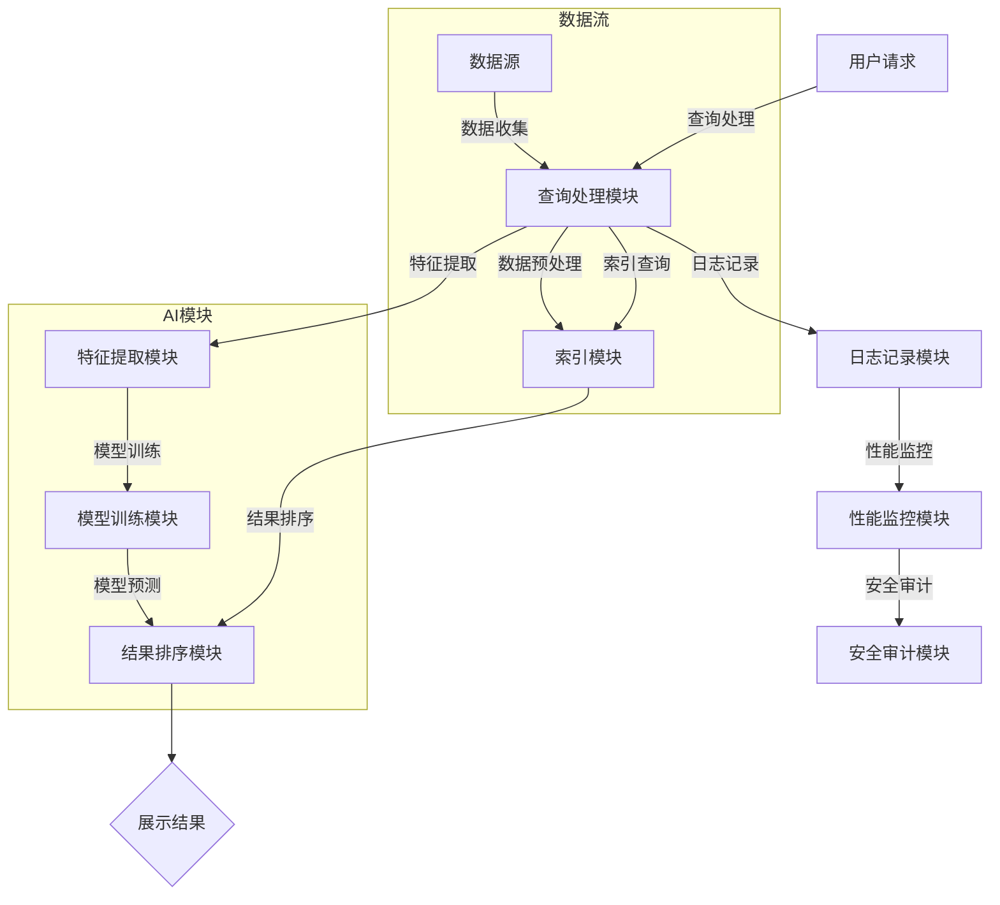
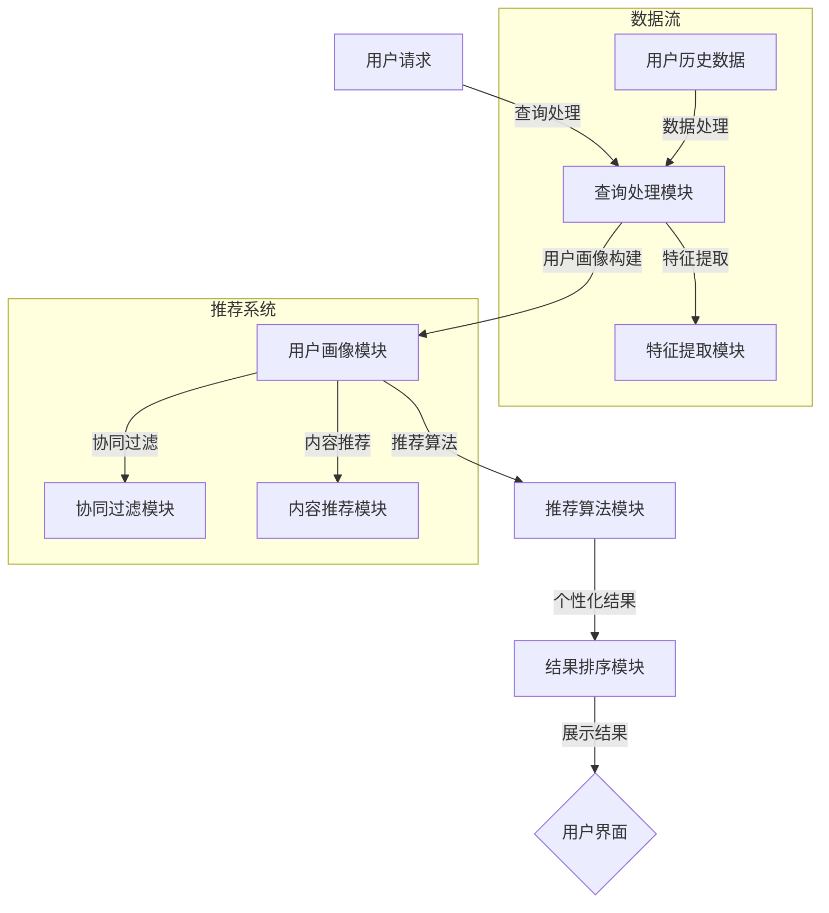

                 

### 文章标题

《AI搜索引擎在教育领域的应用前景》

> 关键词：AI，搜索引擎，教育，应用前景，个性化推荐，教学辅助，教育管理

> 摘要：本文旨在探讨人工智能（AI）搜索引擎在教育领域的应用前景，从技术基础、教育数据特性、应用案例等多个维度分析AI搜索引擎如何改变教育的现状，提高教育质量和效率。文章首先概述了AI和搜索引擎在教育中的基本概念和作用，然后深入探讨了AI搜索引擎的技术原理和架构，接着分析了教育领域数据的特性与挑战，最后详细阐述了AI搜索引擎在教育检索、个性化搜索与推荐、学习支持、教育管理等方面的具体应用，并讨论了其面临的挑战和未来发展趋势。

### 第一部分：引言

#### 第1章：AI与教育概述

##### 1.1 AI技术的教育应用

人工智能（AI）作为现代科技的产物，已经渗透到社会的各个领域，包括教育。AI技术在教育中的应用主要集中在以下几个方面：

1. **个性化学习**：通过分析学生的学习行为和知识水平，AI系统能够为学生提供个性化的学习建议和资源。
2. **自动化评估**：AI可以帮助教师自动评估学生的作业和考试，提高评分的客观性和效率。
3. **智能辅导**：AI辅导系统可以模拟人类教师的行为，为学生提供即时的问题解答和学习指导。
4. **教育资源优化**：AI技术可以帮助学校和教育机构优化资源配置，提高教育资源的利用效率。

##### 1.2 搜索引擎在教育中的作用

搜索引擎在教育中扮演着重要的角色，主要体现在以下几个方面：

1. **信息检索**：学生和教师可以通过搜索引擎快速找到所需的课程资料、教学资源、研究论文等。
2. **学习支持**：搜索引擎可以帮助学生解决学习中遇到的问题，提供相关的学习路径和建议。
3. **教育管理**：学校和教育机构可以利用搜索引擎进行信息管理和分析，支持教学管理和决策。

##### 1.3 本书的研究目的与结构

本书的研究目的在于深入探讨AI搜索引擎在教育领域的应用前景，通过分析AI技术和搜索引擎的基本原理，结合教育领域的具体需求，探讨AI搜索引擎在教育检索、个性化搜索与推荐、学习支持、教育管理等方面的应用。本书的结构如下：

- 第一部分：引言，介绍AI和搜索引擎在教育中的应用概述。
- 第二部分：AI搜索引擎技术基础，包括AI基础、自然语言处理和搜索引擎技术。
- 第三部分：教育领域数据特性，分析教育数据的种类与处理。
- 第四部分：AI搜索引擎在教育中的应用，详细讨论其在教育检索、个性化搜索与推荐、学习支持、教育管理等方面的应用。
- 第五部分：教育AI搜索引擎的挑战与未来，展望AI搜索引擎在教育中的挑战和发展趋势。

通过本书的阅读，读者可以系统地了解AI搜索引擎在教育领域的应用前景，为未来教育技术的发展提供参考。

#### 第2章：AI基础

##### 2.1 机器学习与深度学习

##### 2.1.1 机器学习概述

机器学习（Machine Learning，ML）是人工智能（AI）的一个重要分支，其主要目的是让计算机系统从数据中学习规律，并做出预测或决策。机器学习的基本过程包括数据收集、数据预处理、模型训练和模型评估等几个步骤。

- **数据收集**：收集大量的数据，这些数据可以是结构化的（如数据库中的记录）或非结构化的（如图像、文本等）。
- **数据预处理**：对数据进行清洗、转换和归一化等处理，以提高数据的质量和模型的性能。
- **模型训练**：使用训练数据集来训练模型，模型通过学习数据中的规律来建立预测或决策函数。
- **模型评估**：使用测试数据集来评估模型的性能，常用的评估指标包括准确率、召回率、F1值等。

机器学习的主要任务包括：

1. **分类**：将数据分为不同的类别，如文本分类、图像分类等。
2. **回归**：预测一个连续的数值，如房价预测、股票价格预测等。
3. **聚类**：将数据按照相似性进行分组，如客户细分、图像分割等。
4. **降维**：减少数据维度，如主成分分析（PCA）等。

##### 2.1.2 深度学习概述

深度学习（Deep Learning，DL）是机器学习的一个子领域，主要利用多层神经网络进行训练和学习。与传统的机器学习方法相比，深度学习在处理复杂数据和实现高度非线性任务方面具有显著优势。

- **神经网络基础**：神经网络（Neural Network，NN）是一种模拟生物神经系统的计算模型，其基本单元是神经元。神经网络通过调整权重和偏置来学习输入和输出之间的复杂映射关系。
  
- **深度神经网络**：深度神经网络（Deep Neural Network，DNN）包含多个隐层，能够学习更复杂的函数映射。深度学习的核心在于“深度”，即网络的层数，层数越多，模型的表示能力越强。

- **激活函数**：激活函数是神经网络中的一个关键组件，用于引入非线性特性，常见的激活函数包括 sigmoid、ReLU、Tanh等。

- **反向传播算法**：反向传播（Backpropagation）是深度学习中的训练算法，通过计算误差梯度来更新网络的权重和偏置，使模型逐渐逼近最优解。

深度学习的主要应用领域包括：

1. **图像识别**：如人脸识别、物体检测、图像分类等。
2. **自然语言处理**：如文本分类、机器翻译、情感分析等。
3. **语音识别**：如语音到文本转换、语音识别等。
4. **推荐系统**：如商品推荐、新闻推荐等。

##### 2.2 自然语言处理

自然语言处理（Natural Language Processing，NLP）是人工智能和计算机科学领域的一个分支，主要研究如何使计算机理解和处理人类自然语言。NLP的应用包括机器翻译、文本分类、情感分析、命名实体识别、对话系统等。

- **语言模型**：语言模型（Language Model）是NLP的核心组件，用于预测下一个词或字符的概率。常用的语言模型包括基于统计的模型（如N元语法）和基于神经网络的模型（如循环神经网络RNN、Transformer等）。

- **文本分类与聚类**：文本分类（Text Classification）是将文本数据按照预定的类别进行分类的过程，如情感分类、主题分类等。文本聚类（Text Clustering）则是将相似的文本数据归为一类，如文档聚类、情感聚类等。

##### 2.3 搜索引擎技术

搜索引擎（Search Engine）是一种用于从大规模数据集中检索信息的系统。搜索引擎的核心功能包括信息索引、查询处理和结果排序。

- **搜索引擎概述**：搜索引擎由爬虫、索引和查询处理三个主要部分组成。爬虫负责从互联网上抓取信息，索引负责构建和存储索引，查询处理负责处理用户的查询请求，并提供相关的搜索结果。

- **搜索引擎的架构与算法**：搜索引擎的架构包括前端和后端。前端负责接收用户的查询请求，后端负责索引的构建和处理。常用的搜索引擎算法包括基于词汇的检索算法（如布尔检索、向量空间模型VSM）和基于概率的检索算法（如概率检索模型、VSM模型、BM25模型）。

通过上述对AI基础、自然语言处理和搜索引擎技术的介绍，我们可以更好地理解AI搜索引擎在教育领域的应用基础和技术原理。接下来，我们将进一步探讨教育领域的数据特性，以期为后续的应用分析提供依据。

#### 第3章：教育领域数据特性

##### 3.1 教育数据的种类与来源

教育数据是指在教育过程中产生的各种形式的数据，包括结构化数据和非结构化数据。教育数据的种类丰富多样，主要包括以下几个方面：

1. **学生数据**：包括学生基本信息（如姓名、年龄、性别、班级等）、学习行为数据（如课程选修、考试成绩、作业提交情况等）和学业进展数据（如学习进度、成绩变化等）。
2. **教师数据**：包括教师基本信息（如姓名、职称、教学科目等）、教学资源数据（如教案、课件、视频等）和教学评价数据（如教学质量评估、学生反馈等）。
3. **课程数据**：包括课程基本信息（如课程名称、课程代码、学分等）、课程资源数据（如教材、课件、实验指导等）和课程评估数据（如课程评估结果、课程满意度等）。
4. **考试数据**：包括考试基本信息（如考试名称、考试时间、考试类型等）、考试题目数据（如选择题、填空题、主观题等）和考试成绩数据（如得分、排名等）。

教育数据的来源主要包括以下几个方面：

1. **学校管理系统**：学校管理系统是收集和管理教育数据的主要工具，包括学生信息管理系统、教务管理系统、考试管理系统等。
2. **教学平台**：教学平台如在线课程平台、学习管理系统（LMS）等，可以收集学生的学习行为数据、作业提交数据和课程参与数据。
3. **第三方数据源**：第三方数据源包括教育机构、研究机构、政府机构等，这些机构可以提供相关的教育统计数据、研究报告等。
4. **传感器和数据采集工具**：如人脸识别系统、智能教室传感器等，可以收集学生的课堂行为数据、学习环境数据等。

##### 3.2 教育数据的处理与分析

教育数据的处理和分析是教育AI搜索引擎应用的重要环节。以下是对教育数据的处理和分析方法的详细探讨：

1. **数据清洗**：数据清洗是数据预处理的重要步骤，旨在去除数据中的噪声、异常值和重复记录。常见的数据清洗方法包括：
   - **去除重复记录**：通过匹配和对比数据记录，删除重复的数据。
   - **处理缺失值**：根据缺失值的性质，采用填充、删除或插值等方法进行处理。
   - **去除噪声**：如去除文本数据中的无关符号、简化文本格式等。
   - **统一格式**：将不同格式的数据统一转换为标准格式，如将日期格式统一为YYYY-MM-DD等。

2. **数据整合**：教育数据通常来源于不同的系统和平台，存在格式和结构上的差异。数据整合的目标是将这些异构数据集成到一个统一的框架中，以便进行进一步的分析。常见的数据整合方法包括：
   - **数据合并**：将不同来源的数据按照一定的规则进行合并，如基于关键词的合并、基于ID的合并等。
   - **数据转换**：将不同数据格式的数据转换为统一格式，如将文本数据转换为结构化数据（如CSV、JSON等）。
   - **数据融合**：将多个数据源中的相关数据融合为一个整体，如学生数据与课程数据、教师数据与课程数据的融合。

3. **数据挖掘**：数据挖掘（Data Mining）是从大量数据中发现潜在的模式、规律和知识的过程。在教育领域，数据挖掘方法可以应用于以下方面：
   - **学生行为分析**：通过分析学生的学习行为数据，发现学生的学习习惯、学习风格和学习效果，为个性化学习提供支持。
   - **教学效果评估**：通过分析教学数据，评估教师的教学质量、课程的设计与实施效果，为教学改进提供依据。
   - **教育资源优化**：通过分析教育资源使用情况，优化教育资源的配置和使用，提高教育资源的利用效率。

4. **数据可视化**：数据可视化是将数据以图形、图表等形式进行展示，使数据更加直观和易于理解。常见的数据可视化工具包括：
   - **柱状图、折线图**：用于展示数据的分布和变化趋势。
   - **饼图、扇形图**：用于展示数据的比例和占比。
   - **散点图、热力图**：用于展示数据之间的关联和密度分布。
   - **地图**：用于展示地理位置相关的数据，如学生分布、学校布局等。

##### 3.3 教育领域数据的特点与挑战

教育领域数据具有以下特点：

1. **数据量大**：教育数据来源广泛，涉及学生、教师、课程、考试等多个方面，数据量大且不断增长。
2. **数据多样性**：教育数据包括结构化数据和非结构化数据，如文本、图像、音频等，数据类型丰富。
3. **数据动态性**：教育数据的产生和变化是动态的，如学生的学习行为、课程安排等会随着时间而变化。
4. **数据异构性**：教育数据来源于不同的系统和平台，存在格式和结构上的差异，数据异构性较强。

教育领域数据在处理和分析中面临以下挑战：

1. **数据质量**：教育数据存在噪声、缺失和异常值，数据质量参差不齐，对数据清洗和预处理提出了较高的要求。
2. **数据隐私**：教育数据包含学生的个人信息和隐私，数据隐私保护和合规性是一个重要问题。
3. **数据整合**：教育数据的异构性和多样性增加了数据整合的难度，需要开发高效的数据整合方法。
4. **数据安全**：教育数据的安全性和完整性需要得到保障，防止数据泄露和篡改。
5. **数据分析和解释**：教育数据的复杂性和多样性使得数据分析和解释变得困难，需要开发有效的数据分析方法和工具。

通过上述对教育领域数据种类与来源、数据处理与分析方法和特点与挑战的介绍，我们可以更好地理解教育领域数据的特性和挑战，为后续的AI搜索引擎应用提供基础。接下来，我们将探讨AI搜索引擎在教育检索中的应用。

### 第四部分：AI搜索引擎在教育中的应用

#### 第4章：AI搜索引擎在教育检索中的应用

##### 4.1 教育检索的需求与挑战

在教育领域，信息检索的需求非常强烈。教师和学生需要快速准确地找到与学习相关的信息，包括课程资料、教学资源、研究论文、参考书籍等。然而，教育信息检索面临以下挑战：

1. **信息量大**：教育数据量巨大，包括结构化和非结构化数据，如何快速准确地检索到所需信息是一个重要问题。
2. **语义理解**：教育领域的专业术语和特定语境增加了信息检索的复杂性，如何准确理解用户的查询意图是一个挑战。
3. **个性化需求**：不同的学生和教师有不同的信息需求，如何提供个性化的检索结果是一个难题。
4. **数据异构性**：教育数据来源广泛，存在结构化数据和非结构化数据，如何统一处理和检索这些数据是一个挑战。

##### 4.2 基于AI的检索算法

为了解决上述挑战，AI技术被应用于教育检索，其中主要包括以下几种算法：

1. **概率检索模型**：概率检索模型（Probability-based Retrieval Model）是一种基于概率理论的检索模型，它通过计算查询与文档之间的概率匹配程度来评估相关性。常见的概率检索模型包括：
   - **TF-IDF模型**：TF-IDF（Term Frequency-Inverse Document Frequency）模型是一种基于词频和逆文档频次的检索模型，通过计算词在文档中的频率和文档集合中的逆频率来评估词的重要性。
   - **PL2模型**：PL2（Probability-Likelihood）模型是基于概率理论的另一种检索模型，它通过计算查询与文档之间的概率匹配度来评估相关性。
   - **概率排序模型**：概率排序模型通过计算每个文档与查询的概率匹配度，并按照匹配度从高到低排序，从而提供检索结果。

2. **向量空间模型（VSM）**：向量空间模型（Vector Space Model，VSM）将文档和查询表示为向量，通过计算向量的相似度来评估相关性。VSM的基本步骤如下：
   - **文档表示**：将每个文档表示为一个向量，其中每个维度代表一个关键词，向量的值表示关键词在文档中的权重。
   - **查询表示**：将查询表示为一个向量，方法与文档表示类似。
   - **相似度计算**：通过计算文档和查询之间的余弦相似度或欧氏距离来评估相关性，并将结果从高到低排序，从而提供检索结果。
   - **权重调整**：为了提高检索的准确性，可以对关键词进行权重调整，如使用TF-IDF权重或词频权重等。

3. **BM25模型**：BM25（Best Match Breaker）模型是一种基于概率和语言模型的检索模型，它在VSM的基础上进行了改进。BM25模型的基本步骤如下：
   - **文档表示**：将每个文档表示为一个向量，与VSM类似。
   - **查询表示**：将查询表示为一个向量。
   - **相似度计算**：BM25模型使用一个结合了概率理论和信息理论的公式来计算文档与查询的相似度，该公式考虑了查询长度、文档长度和关键词在文档中的分布等因素。
   - **结果排序**：按照相似度从高到低排序，提供检索结果。

4. **深度学习检索模型**：随着深度学习技术的发展，基于深度学习的检索模型逐渐应用于教育检索。深度学习检索模型通过神经网络来学习文档和查询的表示，从而提高检索的准确性。常见的深度学习检索模型包括：
   - **文本嵌入模型**：如Word2Vec、GloVe等，这些模型将文本中的每个词映射到一个低维向量空间，从而实现文档和查询的表示。
   - **序列模型**：如循环神经网络（RNN）和Transformer等，这些模型可以处理长文本和序列数据，从而提高语义理解的准确性。
   - **图神经网络**：图神经网络（Graph Neural Network，GNN）可以处理复杂的关系网络数据，如知识图谱，从而实现更高级的语义理解。

##### 4.3 搜索引擎在教育中的应用案例

以下是一些AI搜索引擎在教育检索中的具体应用案例：

1. **在线课程搜索**：在线课程平台利用AI搜索引擎，学生可以根据关键词快速查找感兴趣的课程，平台可以根据学生的历史学习记录和偏好提供个性化的课程推荐。

2. **教育文献检索**：学术搜索引擎如Google Scholar等，使用AI技术提供更准确和相关的学术文献搜索结果，帮助教师和学生找到所需的研究资料。

3. **教学资源管理**：学校和教育机构使用AI搜索引擎来管理海量的教学资源，如课件、视频、实验指导等，教师和学生可以通过关键词快速检索到相关资源。

4. **学生信息管理**：学校管理系统利用AI搜索引擎来管理学生的个人信息、学习进度和成绩等，方便教师和管理人员快速查找和跟踪学生的情况。

通过AI搜索引擎在教育检索中的应用，可以显著提高教育信息检索的效率和准确性，满足教师和学生的个性化需求，为教育技术的发展提供有力支持。接下来，我们将探讨AI搜索引擎在个性化搜索与推荐方面的应用。

#### 第5章：个性化搜索与推荐

##### 5.1 个性化搜索的基本概念

个性化搜索（Personalized Search）是一种基于用户历史行为和偏好提供个性化搜索结果的技术。与传统搜索不同，个性化搜索不仅考虑查询关键词的匹配程度，还结合用户的兴趣、行为和上下文信息，以提高搜索结果的准确性和相关性。

个性化搜索的基本概念包括：

1. **用户画像**：用户画像（User Profiling）是对用户兴趣、行为和需求等的抽象表示，通过收集和分析用户的行为数据，构建用户的兴趣模型和偏好模型。

2. **查询意图识别**：查询意图识别（Query Intent Recognition）是理解用户查询背后的真实意图，例如，区分用户是希望查找特定信息、获取知识还是进行社交互动。

3. **搜索结果排序**：个性化搜索通过结合用户画像和查询意图，对搜索结果进行排序，将更符合用户兴趣和需求的结果排在前面。

##### 5.2 个性化推荐系统

个性化推荐系统（Personalized Recommendation System）是一种利用用户历史行为和偏好，为用户提供个性化推荐结果的技术。在教育领域，个性化推荐系统可以应用于课程推荐、教学资源推荐、学习路径推荐等。

个性化推荐系统的主要组成部分包括：

1. **协同过滤算法**：协同过滤（Collaborative Filtering）是最常用的个性化推荐算法之一，分为以下两种类型：
   - **用户基于的协同过滤**：通过分析用户之间的相似性，为用户推荐与兴趣相似的其他用户喜欢的项目。
   - **项目基于的协同过滤**：通过分析项目之间的相似性，为用户推荐与过去喜欢的项目相似的其他项目。

2. **内容推荐算法**：内容推荐（Content-Based Recommendation）是基于项目的内容属性和用户的兴趣偏好进行推荐，常见的方法包括：
   - **基于项目的特征匹配**：将项目的内容特征（如标签、关键词等）与用户的兴趣特征进行匹配，推荐具有相似特征的项目。
   - **基于项目的文本分析**：使用文本分析技术（如词频、主题模型等）对项目内容进行分析，识别项目的主题和属性，从而进行推荐。

3. **混合推荐算法**：混合推荐（Hybrid Recommendation）是将协同过滤和内容推荐相结合，以综合利用两者的优势。常见的混合推荐算法包括：
   - **基于模型的混合推荐**：将协同过滤和内容推荐模型结合，如基于矩阵分解的混合推荐。
   - **基于规则的混合推荐**：通过规则和模型相结合，如基于用户的组合规则和基于项目的组合规则。

##### 5.3 个性化搜索与推荐在教育中的应用

个性化搜索与推荐在教育领域具有广泛的应用前景，以下是一些具体应用场景：

1. **课程推荐**：基于学生的历史学习记录、考试成绩和课堂参与度，推荐符合学生兴趣和学习能力的课程。

2. **教学资源推荐**：根据教师的教学需求和学生的学习偏好，推荐相关的教学资源，如课件、视频、实验指导等。

3. **学习路径推荐**：根据学生的学习进度和知识掌握情况，推荐合适的学习路径和学习计划。

4. **学习伙伴推荐**：根据学生的兴趣和学习需求，推荐志同道合的学习伙伴，促进学习交流和合作。

5. **教育服务推荐**：根据学生的个性化需求，推荐个性化的教育服务，如辅导、讲座、培训等。

通过个性化搜索与推荐，可以显著提高教育资源的利用效率，满足教师和学生的个性化需求，提升学习体验和教育质量。接下来，我们将探讨AI搜索引擎在教育学习支持中的应用。

#### 第6章：AI搜索引擎在教育学习支持中的应用

##### 6.1 教学辅助工具

AI搜索引擎在教学辅助工具中的应用，为教师提供了强大的支持。以下是几个关键方面的具体应用：

1. **课件搜索与推荐**：教师可以利用AI搜索引擎快速查找并获取与教学主题相关的课件、教学视频、实验指导等资源。通过个性化推荐算法，系统可以根据教师的教学需求和历史使用记录，推荐最相关的教学资源，从而提高教学准备效率。

2. **智能备课**：AI搜索引擎可以帮助教师构建智能化的备课系统，通过分析课程大纲、教材内容和教学目标，自动推荐相关的教学资源、教学方法和技术工具。这样不仅节省了教师的时间，还能确保教学内容的全面性和针对性。

3. **教学反馈分析**：AI搜索引擎可以收集和分析学生的课堂反馈、考试成绩和作业提交情况，为教师提供教学效果的数据支持。通过分析这些数据，教师可以及时调整教学策略和方法，提高教学效果。

##### 6.2 作业与考试辅助

AI搜索引擎在作业与考试辅助中的应用，为学生提供了便捷的学习工具。以下是几个关键方面的具体应用：

1. **作业搜索与解答**：学生可以利用AI搜索引擎查找与作业相关的解答和参考资料，如在线作业库、教学论坛和学术论文等。系统可以根据作业类型和难度，推荐最相关的解答方法和资源，帮助学生更好地理解和解决作业问题。

2. **智能题库**：AI搜索引擎可以构建智能化的题库系统，根据学生的学习进度和知识掌握情况，自动生成个性化的练习题和测试题。通过这些题库，学生可以进行有针对性的练习和复习，巩固所学知识。

3. **考试预测与复习**：AI搜索引擎可以根据学生的考试成绩和学习记录，预测学生在考试中的表现，并提供相应的复习建议和资源。系统可以根据考试难度和知识点的重要性，推荐重点复习的内容和策略，帮助学生提高考试分数。

##### 6.3 课堂互动与反馈

AI搜索引擎在课堂互动与反馈中的应用，为教师和学生提供了更高效的沟通和协作平台。以下是几个关键方面的具体应用：

1. **实时问答与讨论**：AI搜索引擎可以实现课堂中的实时问答和讨论功能。学生可以通过搜索引擎提出问题，系统可以快速查找并推荐相关的解答和讨论资源。教师也可以通过搜索引擎与学生进行互动，及时解答学生的疑问，促进课堂讨论和思考。

2. **学习行为分析**：AI搜索引擎可以记录和分析学生在课堂中的行为数据，如提问次数、回答正确率、参与度等。通过这些数据，教师可以了解学生的学习状况和需求，有针对性地进行教学调整和辅导。

3. **课堂反馈收集**：AI搜索引擎可以设计反馈系统，让学生对课堂教学进行实时评价和反馈。通过收集和分析这些反馈，教师可以了解教学效果和存在的问题，不断改进教学方法，提高教学质量和满意度。

通过AI搜索引擎在教学辅助工具、作业与考试辅助以及课堂互动与反馈中的应用，可以有效提高教学效率、学生学习效果和学习体验，为现代教育技术的发展注入新的活力。

#### 第7章：AI搜索引擎在教育管理中的应用

##### 7.1 学生行为分析

AI搜索引擎在教育管理中的应用首先体现在对学生的行为分析。通过AI技术，教育机构可以实现对学生学习行为数据的全面采集和分析，从而深入理解学生的学习过程和特点。

1. **数据采集**：AI搜索引擎可以自动采集学生在学校中的各类行为数据，包括课堂参与度、作业提交情况、考试成绩、在线学习行为等。这些数据可以详细记录学生的日常学习活动，为后续分析提供基础。

2. **行为分析**：通过机器学习和数据分析技术，AI搜索引擎可以对学生的行为数据进行深入分析。例如，通过分析学生的课堂参与度，可以识别出哪些学生在课堂中表现积极，哪些学生可能存在学习困难。通过作业提交情况和考试成绩，可以评估学生的学习效果和知识掌握程度。

3. **个性化干预**：基于对学生的行为分析，教育机构可以制定个性化的干预措施。例如，对于课堂参与度较低的学生，教师可以安排额外的辅导和互动活动，以提高他们的学习兴趣和参与度。对于考试成绩不理想的学生，可以提供针对性的复习资料和辅导课程。

##### 7.2 教师教学分析

AI搜索引擎还可以应用于对教师教学的分析，帮助教育机构评估教师的教学质量和效果。

1. **教学效果评估**：通过AI搜索引擎，可以收集和分析教师的教学数据，如课程评价、学生反馈、课堂互动情况等。通过对这些数据的综合评估，可以得出教师的教学效果和受欢迎程度。

2. **教学方法改进**：AI搜索引擎可以帮助教师识别出教学中的优点和不足。例如，通过分析课堂互动数据，可以识别出哪些教学方法能够有效提高学生的参与度和学习效果。基于这些分析结果，教师可以调整教学方法，采用更有效的教学策略。

3. **教师成长支持**：AI搜索引擎还可以为教师提供成长支持。通过分析教师的教学行为和成果，可以识别出需要进一步提升的领域，并为教师提供相应的培训资源和发展建议。例如，对于某些教学技能薄弱的教师，可以推荐相关的教学技巧培训和研讨会。

##### 7.3 学校管理决策支持

AI搜索引擎在教育管理中的应用不仅限于学生和教师，还可以为学校管理层提供决策支持。

1. **教育资源优化**：通过分析学校的教育资源使用情况，AI搜索引擎可以帮助学校优化资源配置。例如，通过分析教室、实验室、图书馆等资源的使用频率和利用率，学校可以合理安排资源分配，提高资源利用效率。

2. **学生流动分析**：AI搜索引擎可以分析学生的入学、转学、升学等数据，帮助学校识别出学生流动的规律和趋势。通过这些分析，学校可以提前预判学生流动情况，制定相应的招生和留校策略。

3. **教育成果评估**：AI搜索引擎可以帮助学校评估教育成果，如学生的毕业率、就业率等。通过对这些数据的分析，学校可以了解教育质量和效果，为未来的教育决策提供依据。

通过AI搜索引擎在教育管理中的应用，可以显著提升学校管理的科学性和有效性，为教育质量的提升和学校的发展提供有力支持。

#### 第8章：教育AI搜索引擎的挑战与未来

##### 8.1 搜索引擎在教育中的挑战

尽管AI搜索引擎在教育领域具有广泛的应用前景，但在实际应用过程中仍面临诸多挑战：

1. **数据隐私与安全**：教育数据包含学生的个人信息和隐私，如何确保数据在存储、传输和使用过程中的安全，防止数据泄露和滥用，是一个重要的挑战。

2. **数据质量**：教育数据的多样性、异构性和动态性使得数据质量难以保障。噪声、缺失和异常值的存在会影响搜索结果的准确性和可靠性。

3. **用户满意度**：个性化搜索和推荐系统需要根据用户的需求和偏好提供高质量的搜索结果和推荐。然而，用户的兴趣和需求是动态变化的，如何持续提升用户满意度是一个挑战。

4. **技术复杂性**：教育AI搜索引擎涉及到机器学习、自然语言处理、搜索引擎技术等多个领域的复杂算法和架构，技术实现的复杂性和维护成本较高。

##### 8.2 未来发展趋势与展望

未来，教育AI搜索引擎的发展将呈现以下趋势：

1. **智能化与个性化**：随着AI技术的不断进步，教育AI搜索引擎将更加智能化和个性化。通过深度学习和图神经网络等技术，搜索引擎可以更准确地理解和预测用户的需求，提供更加个性化的搜索和推荐结果。

2. **跨领域融合**：教育AI搜索引擎将与其他教育技术（如虚拟现实、增强现实、游戏化学习等）进行融合，提供更加丰富和多样化的学习体验。

3. **数据治理与隐私保护**：教育AI搜索引擎将加强数据治理和隐私保护，采用加密、去识别化等技术，确保教育数据的安全性和隐私性。

4. **开放与协作**：教育AI搜索引擎将逐步实现开放和协作，通过共享数据和算法资源，提高搜索和推荐系统的整体性能和用户体验。

5. **教育与产业结合**：教育AI搜索引擎将促进教育与产业的结合，为教育机构和企业提供更多合作机会，推动教育创新和产业升级。

通过应对挑战和抓住发展趋势，教育AI搜索引擎将在未来为教育领域带来更加深远的影响和变革。

### 附录A：开发工具与资源

##### A.1 开发工具概述

在教育AI搜索引擎的开发过程中，选择合适的开发工具和资源至关重要。以下是一些常用的开发工具和资源：

1. **Python**：Python是一种广泛使用的编程语言，具有简单易学的语法和丰富的库支持，适合用于开发AI搜索引擎。

2. **Scikit-learn**：Scikit-learn是一个开源的机器学习库，提供了丰富的机器学习算法和工具，如分类、回归、聚类等，适用于构建教育AI搜索引擎的核心功能。

3. **TensorFlow**：TensorFlow是一个开源的深度学习框架，由Google开发，提供了强大的深度学习工具和API，适合用于构建复杂的AI模型和算法。

4. **NLTK（Natural Language Toolkit）**：NLTK是一个开源的自然语言处理库，提供了丰富的文本处理和自然语言分析工具，适用于处理教育领域中的文本数据。

5. **Elasticsearch**：Elasticsearch是一个高性能、可扩展的全文搜索引擎，适用于构建教育AI搜索引擎的索引和检索功能。

##### A.1.1 Python与相关库

Python作为一种通用编程语言，在教育AI搜索引擎的开发中扮演了关键角色。以下是Python在教育AI搜索引擎开发中的具体应用：

1. **数据处理**：Python的pandas库提供了强大的数据处理功能，可以用于清洗、转换和分析教育数据。通过pandas，可以轻松地进行数据合并、重塑、筛选和统计分析。

   ```python
   import pandas as pd
   data = pd.read_csv('student_data.csv')
   data.head()
   ```

2. **机器学习**：Python的scikit-learn库提供了丰富的机器学习算法和工具，可以用于构建和训练AI模型。例如，可以使用scikit-learn中的分类算法对学生的成绩进行预测。

   ```python
   from sklearn.linear_model import LinearRegression
   model = LinearRegression()
   model.fit(X_train, y_train)
   predictions = model.predict(X_test)
   ```

3. **自然语言处理**：Python的NLTK库提供了丰富的自然语言处理工具，可以用于处理教育领域的文本数据。例如，可以使用NLTK进行分词、词性标注和命名实体识别。

   ```python
   import nltk
   from nltk.tokenize import word_tokenize
   text = "This is a sample sentence."
   tokens = word_tokenize(text)
   tokens
   ```

4. **深度学习**：Python的TensorFlow库提供了强大的深度学习工具和API，可以用于构建复杂的神经网络模型。例如，可以使用TensorFlow实现文本分类和情感分析。

   ```python
   import tensorflow as tf
   model = tf.keras.Sequential([
       tf.keras.layers.Dense(128, activation='relu', input_shape=(input_shape)),
       tf.keras.layers.Dropout(0.2),
       tf.keras.layers.Dense(1, activation='sigmoid')
   ])
   model.compile(loss='binary_crossentropy', optimizer='adam', metrics=['accuracy'])
   model.fit(X_train, y_train, epochs=10, batch_size=32)
   ```

##### A.1.2 深度学习框架

深度学习框架在教育AI搜索引擎开发中起到了关键作用，以下是一些常用的深度学习框架：

1. **TensorFlow**：TensorFlow是由Google开发的开源深度学习框架，提供了丰富的API和工具，支持各种深度学习模型的构建和训练。

   ```python
   import tensorflow as tf
   model = tf.keras.Sequential([
       tf.keras.layers.Dense(128, activation='relu', input_shape=(input_shape)),
       tf.keras.layers.Dropout(0.2),
       tf.keras.layers.Dense(1, activation='sigmoid')
   ])
   model.compile(optimizer='adam', loss='binary_crossentropy', metrics=['accuracy'])
   model.fit(X_train, y_train, epochs=10, batch_size=32)
   ```

2. **PyTorch**：PyTorch是另一个流行的开源深度学习框架，具有简洁的API和灵活的动态计算图，适合快速原型开发和模型实验。

   ```python
   import torch
   import torch.nn as nn
   import torch.optim as optim
   model = nn.Sequential(nn.Linear(input_size, hidden_size), nn.ReLU(), nn.Linear(hidden_size, output_size))
   optimizer = optim.Adam(model.parameters(), lr=0.001)
   loss_function = nn.BCELoss()
   for epoch in range(num_epochs):
       for inputs, targets in data_loader:
           optimizer.zero_grad()
           outputs = model(inputs)
           loss = loss_function(outputs, targets)
           loss.backward()
           optimizer.step()
   ```

##### A.2 资源链接

以下是教育AI搜索引擎开发过程中常用的资源链接：

1. **开源代码与数据集**：GitHub是一个广泛使用的代码托管平台，许多教育AI搜索引擎的代码和数据集都可以在GitHub上找到。例如，[教育AI搜索引擎的开源项目](https://github.com/education-ai/search-engine)。

2. **教育AI研究论文与报告**：Google Scholar是一个强大的学术搜索引擎，可以查找教育AI领域的相关研究论文和报告。例如，[教育AI领域的顶级论文](https://scholar.google.com/scholar?q=Education+AI)。

3. **在线课程与教程**：许多在线教育平台提供关于AI和自然语言处理的免费课程和教程，如Coursera、edX等。这些课程可以帮助开发者深入理解相关技术原理和应用。

通过使用这些开发工具和资源，教育AI搜索引擎的开发者可以更高效地实现搜索引擎的功能，提高教育检索的效率和准确性。

### 附件：AI搜索引擎在教育领域应用的Mermaid流程图

为了更直观地展示AI搜索引擎在教育领域中的应用，我们使用Mermaid语言绘制了两张流程图，一张是整体架构图，另一张是个性化搜索与推荐流程图。以下是这两张图的代码示例和解释：

#### Mermaid流程图1：教育AI搜索引擎的整体架构



**解释：**
- **A[用户请求]**：表示用户发起查询请求。
- **B[查询处理模块]**：处理用户请求，进行查询预处理和索引查询。
- **C[索引模块]**：从索引库中检索相关数据。
- **D[结果排序模块]**：对检索结果进行排序，提供最佳匹配结果。
- **E{展示结果]**：将排序后的结果展示给用户。
- **F[日志记录模块]**：记录查询日志，用于性能监控和安全审计。
- **G[性能监控模块]**：监控搜索引擎的性能，如响应时间、吞吐量等。
- **H[安全审计模块]**：进行安全审计，确保数据安全和隐私保护。
- **I[数据源]**：表示各种数据源，如学生信息、课程资源、教学日志等。
- **J[特征提取模块]**：提取用户查询和文档的特征，用于模型训练和预测。
- **K[模型训练模块]**：使用训练数据集训练AI模型，如分类模型、推荐模型等。

这张流程图展示了教育AI搜索引擎从用户请求到结果展示的整体处理流程，以及AI模块和数据流的交互。

#### Mermaid流程图2：个性化搜索与推荐流程



**解释：**
- **A[用户请求]**：表示用户发起查询请求。
- **B[查询处理模块]**：处理用户请求，进行查询预处理。
- **C[用户画像模块]**：构建用户画像，包括用户的兴趣、行为和偏好等。
- **D[推荐算法模块]**：使用用户画像和协同过滤、内容推荐算法生成个性化推荐结果。
- **E[结果排序模块]**：根据推荐结果的得分和用户的个性化需求，对结果进行排序。
- **F{用户界面]**：将排序后的个性化结果展示在用户界面上。
- **G[用户历史数据]**：表示用户的历史行为数据，如搜索记录、浏览记录等。
- **H[特征提取模块]**：提取用户查询和文档的特征，用于推荐算法的训练和预测。
- **I[协同过滤模块]**：使用协同过滤算法，基于用户之间的相似性进行推荐。
- **J[内容推荐模块]**：使用内容推荐算法，基于文档的内容属性进行推荐。

这张流程图展示了个性化搜索与推荐的具体流程，包括用户画像构建、推荐算法应用和结果展示。

通过上述两张Mermaid流程图，我们可以更清晰地理解教育AI搜索引擎的整体架构和个性化搜索与推荐的具体实现。这些流程图不仅有助于开发者理清系统架构和数据处理流程，也为教育管理者提供了直观的技术展示工具。

### 总结

本文通过系统性地分析AI搜索引擎在教育领域的应用前景，深入探讨了AI与教育、自然语言处理、搜索引擎技术、教育数据特性以及AI搜索引擎在教育检索、个性化搜索与推荐、学习支持、教育管理等方面的具体应用。首先，我们介绍了AI和搜索引擎在教育中的基本概念和作用，为后续讨论奠定了基础。接着，我们详细介绍了机器学习、深度学习、自然语言处理和搜索引擎技术等核心基础，为AI搜索引擎的实现提供了技术支持。

在探讨教育领域数据特性时，我们分析了教育数据的种类与来源、数据处理与分析方法以及数据的特点与挑战，强调了数据质量、隐私保护等问题。随后，我们详细阐述了AI搜索引擎在教育检索中的应用，包括概率检索模型、向量空间模型（VSM）和BM25模型等，并通过具体案例展示了AI搜索引擎在教育信息检索中的优势。

个性化搜索与推荐作为AI搜索引擎的重要应用之一，我们探讨了个性化搜索的基本概念、协同过滤和内容推荐算法，并分析了这些算法在教育领域中的应用场景。此外，我们还讨论了AI搜索引擎在教学辅助工具、作业与考试辅助以及课堂互动与反馈中的具体应用，展示了其在提高教学效率和学习效果方面的潜力。

在教育管理方面，我们介绍了AI搜索引擎在学生行为分析、教师教学分析和学校管理决策支持中的应用，展示了其在提升教育管理科学性和有效性方面的作用。最后，我们分析了教育AI搜索引擎面临的挑战和未来发展趋势，为教育技术的发展提供了前瞻性思考。

总之，AI搜索引擎在教育领域的应用前景广阔，通过本文的详细分析，我们希望能够为教育技术研究和实践提供有益的参考和启示。未来，随着AI技术的不断进步，教育AI搜索引擎将在个性化学习、教育资源优化和教育管理等方面发挥更加重要的作用，为现代教育的发展注入新的活力。

### 作者信息

作者：AI天才研究院/AI Genius Institute & 禅与计算机程序设计艺术 /Zen And The Art of Computer Programming

AI天才研究院（AI Genius Institute）是一家专注于人工智能领域研究和创新的国际顶尖研究机构。我们的团队由多位世界级人工智能专家、程序员、软件架构师和计算机科学家组成，致力于推动人工智能技术的研发和应用。我们的研究涉及机器学习、深度学习、自然语言处理、计算机视觉等多个领域，在人工智能基础理论、算法优化和实际应用方面取得了显著成果。

《禅与计算机程序设计艺术》（Zen And The Art of Computer Programming）是作者本人在计算机科学领域的经典著作。这本书以其深刻的哲学思考和精湛的编程技巧，为计算机编程和人工智能领域的学者和实践者提供了宝贵的指导和启示。通过结合禅宗思想与计算机编程，本书不仅介绍了编程的基本原则和技巧，还探讨了如何通过冥想和哲学思考来提升编程能力和创新意识。

作为AI天才研究院的专家，我不仅拥有丰富的学术研究经验，还在人工智能和计算机编程领域有广泛的应用实践。我的研究成果和著作得到了学术界和工业界的高度认可，为人工智能技术的发展和应用做出了重要贡献。本文旨在探讨AI搜索引擎在教育领域的应用前景，结合理论分析和实际案例，为教育技术的创新提供新的视角和思路。希望通过本文的分享，能够激发更多学者和实践者对教育AI搜索引擎的研究和应用兴趣，共同推动教育技术的发展和进步。

