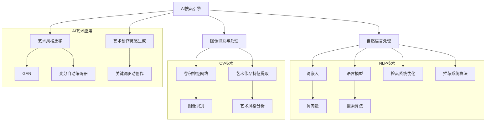

                 

# 《AI搜索引擎在艺术创作领域的应用》

> 关键词：人工智能，艺术创作，搜索引擎，自然语言处理，图像识别，生成对抗网络（GAN），变分自动编码器（VAE）

> 摘要：随着人工智能技术的飞速发展，AI搜索引擎在各个领域的应用越来越广泛。本文将探讨AI搜索引擎在艺术创作领域的应用，包括其核心技术、应用算法、实践案例以及面临的挑战和未来展望。通过详细分析，本文旨在为读者提供一个全面了解AI搜索引擎在艺术创作中应用的视角。

## 引言

近年来，人工智能（AI）技术取得了令人瞩目的进展，特别是在自然语言处理（NLP）和图像识别领域。这些技术的快速发展为AI搜索引擎带来了新的机遇和挑战。传统的搜索引擎主要依赖于关键词匹配和排序算法，而AI搜索引擎则通过深度学习、生成对抗网络（GAN）和变分自动编码器（VAE）等技术，实现了更加智能和个性化的搜索结果。

艺术创作作为一种充满创造力和个性化的活动，一直以来都是人类精神文化的重要体现。然而，随着数字化时代的到来，艺术创作也面临着新的挑战和机遇。AI搜索引擎的出现，为艺术创作提供了新的工具和平台，使得艺术家能够更加高效地获取灵感、创作作品并进行展示。

本文将从以下几个方面探讨AI搜索引擎在艺术创作领域的应用：

1. **AI搜索引擎与艺术创作背景**
   - AI搜索引擎的发展与现状
   - 艺术创作的新趋势
   - AI搜索引擎在艺术创作中的潜力

2. **AI搜索引擎核心技术**
   - 自然语言处理技术
   - 图像识别与处理技术

3. **AI搜索引擎在艺术创作中的应用算法**
   - 艺术风格迁移
   - 艺术创作灵感生成

4. **AI搜索引擎在艺术创作中的应用实践**
   - 艺术作品检索与推荐系统
   - 艺术风格分析与优化

5. **案例研究**
   - 基于AI搜索引擎的艺术作品创作平台
   - AI搜索引擎驱动的艺术博物馆

6. **挑战与未来展望**
   - 技术挑战
   - 应用挑战
   - 未来展望

通过本文的探讨，读者将能够全面了解AI搜索引擎在艺术创作领域的应用现状、技术原理和实践案例，并对未来发展趋势有更加深刻的认识。

## 第一部分：AI搜索引擎与艺术创作概述

### 第1章：AI搜索引擎与艺术创作背景

#### 1.1 AI搜索引擎的发展与现状

人工智能（AI）搜索引擎的核心在于利用机器学习和深度学习技术，通过分析和理解用户输入的自然语言查询，提供更加智能和个性化的搜索结果。AI搜索引擎的发展经历了从传统搜索引擎到现代深度学习驱动的搜索引擎的演变。

1. **传统搜索引擎**：早期的搜索引擎主要依赖于关键词匹配和网页排序算法。这些算法通过统计关键词出现的频率和位置，以及网页的链接结构，来判断网页的相关性并进行排序。例如，PageRank算法通过计算网页之间的链接关系，评估网页的重要性和权威性。

2. **现代深度学习驱动的搜索引擎**：随着深度学习技术的快速发展，AI搜索引擎开始引入神经网络模型，特别是基于变换器（Transformer）的模型，如BERT（Bidirectional Encoder Representations from Transformers）。BERT模型通过捕捉单词之间的双向关系，实现了对自然语言查询的深入理解和语义分析，从而提供更加精准和个性化的搜索结果。

AI搜索引擎的基本原理可以概括为以下几个步骤：

1. **查询理解**：搜索引擎接收用户的查询请求，并通过自然语言处理技术将查询转化为机器可以理解的形式。这一步骤包括分词、词性标注、词嵌入等。

2. **信息检索**：搜索引擎通过索引数据库，找到与查询最相关的网页或文档。这一过程通常涉及复杂的排序和筛选算法，以确保返回的结果既相关又有用。

3. **结果呈现**：搜索引擎将检索到的结果按照一定的规则进行排序，并呈现给用户。这些结果可能包括文本、图片、视频等多种形式。

当前，AI搜索引擎在多个领域得到了广泛应用，包括电子商务、新闻资讯、社交媒体等。以下是一些典型的应用场景：

1. **电子商务**：AI搜索引擎可以帮助用户快速找到他们想要的商品，并推荐相关商品。例如，亚马逊的搜索引擎利用深度学习技术，分析用户的购物行为和搜索历史，提供个性化的购物建议。

2. **新闻资讯**：AI搜索引擎可以实时分析新闻内容，并根据用户的兴趣和偏好，推荐相关的新闻。例如，谷歌新闻通过机器学习算法，对用户的历史浏览行为进行学习，提供个性化的新闻推荐。

3. **社交媒体**：AI搜索引擎可以帮助用户在社交媒体平台上快速找到感兴趣的内容，并与朋友互动。例如，Twitter的搜索引擎利用自然语言处理技术，分析用户的推文和关注对象，提供个性化的推文推荐。

#### 1.2 艺术创作与AI搜索引擎的交汇

艺术创作作为一种充满创造力和个性化的活动，与AI搜索引擎的结合带来了新的机遇和挑战。

1. **艺术创作的新趋势**：在数字化时代，艺术创作的方式和工具发生了巨大的变化。艺术家们开始使用数字技术，如计算机软件和人工智能，进行创作。这种数字化趋势使得艺术创作更加便捷和高效，同时也为AI搜索引擎提供了丰富的应用场景。

2. **AI搜索引擎在艺术创作中的潜力**：AI搜索引擎在艺术创作中的应用潜力体现在以下几个方面：

   - **灵感生成**：AI搜索引擎可以帮助艺术家快速找到灵感和创意。通过分析艺术家的作品、评论和历史，AI搜索引擎可以推荐相关的艺术作品和风格，从而激发艺术家的创造力。

   - **风格迁移**：AI搜索引擎可以基于生成对抗网络（GAN）和变分自动编码器（VAE）等技术，实现不同艺术风格之间的迁移。艺术家可以利用这些技术，将一种艺术风格应用到自己的作品中，创造出独特的视觉效果。

   - **作品推荐**：AI搜索引擎可以帮助观众发现他们感兴趣的艺术作品。通过分析观众的历史浏览行为和偏好，AI搜索引擎可以推荐相关作品，从而提高观众的满意度和参与度。

   - **艺术市场分析**：AI搜索引擎可以分析艺术市场中的数据，提供艺术品价格、收藏家和拍卖行的信息，帮助艺术家和收藏家做出更明智的决策。

总之，AI搜索引擎与艺术创作的交汇，不仅为艺术家提供了新的创作工具和平台，也为观众带来了更加丰富和个性化的艺术体验。

### 第2章：AI搜索引擎核心技术基础

#### 2.1 自然语言处理技术

自然语言处理（NLP）是AI搜索引擎的核心技术之一，它涉及到计算机对人类语言的理解和生成。NLP技术使得搜索引擎能够处理和理解用户的查询，并提供准确的搜索结果。以下是NLP技术中的一些关键概念和方法。

##### 2.1.1 词嵌入技术

词嵌入（Word Embedding）是将单词映射到高维向量空间的技术，使得计算机能够理解和处理自然语言。词嵌入的关键思想是将语义相近的词映射到向量空间中靠近的位置。

1. **词向量的基本概念**：词向量是表示单词的向量，通常在100到几千维之间。每个单词都有一个唯一的向量表示，这些向量可以通过多种方法生成，如基于统计的方法（如N-gram模型）和基于神经的方法（如词嵌入模型）。

2. **常见的词嵌入方法**：

   - **Word2Vec**：Word2Vec是最早和最广泛使用的词嵌入方法之一。它通过训练神经网络来预测上下文单词的概率分布，从而生成词向量。

     $$ \text{输入：} x_t \text{（当前单词）}, y_1, y_2, ..., y_n \text{（上下文单词）} \\
     \text{输出：} p(y| x_t) $$
     
     function Word2Vec corpus:
         Initialize parameters
         for each context in corpus:
             For each word in context:
                 Update parameters based on the context
         return embedding matrix

   - **GloVe**：GloVe（Global Vectors for Word Representation）是另一种流行的词嵌入方法，它通过利用全局的词频信息来生成词向量。GloVe使用两个矩阵：一个表示单词的嵌入向量，另一个表示词频矩阵。

     $$ \text{输入：} F \text{（词汇表大小）}, V \text{（词向量维度）}, N \text{（词汇总数）}, \text{context\_size} $$
     $$ \text{输出：} W \text{（权重矩阵）}, X \text{（词频矩阵）} $$
     
     function GloVe corpus:
         X = [0] * N
         for each word in corpus:
             Update X based on word frequency
         Calculate similarity matrix
         Initialize parameters
         for each word in corpus:
             Update parameters based on similarity matrix
         return embedding matrix

   - **BERT**：BERT（Bidirectional Encoder Representations from Transformers）是一种基于Transformer的词嵌入方法，它通过双向编码器学习单词的上下文表示。BERT在多个NLP任务中取得了优异的性能，如问答系统、文本分类和命名实体识别。

##### 2.1.2 语言模型与搜索引擎优化

语言模型（Language Model）是NLP中另一个重要的概念，它用于预测自然语言中的下一个单词或字符。语言模型在搜索引擎优化中发挥着关键作用，因为它可以帮助搜索引擎理解用户的查询意图，并提供更准确的搜索结果。

1. **语言模型的作用**：

   - **查询理解**：语言模型可以帮助搜索引擎理解用户的查询，从而提供更准确的搜索结果。例如，当用户输入“附近的餐厅”时，语言模型可以识别出用户的意图是寻找附近的餐饮场所。

   - **查询扩展**：语言模型可以扩展用户的查询，增加更多的关键词，以提高搜索结果的多样性。例如，当用户输入“餐厅”时，语言模型可以自动扩展为“附近的餐厅”、“高质量的餐厅”等。

2. **搜索引擎的优化策略**：

   - **查询重写**：搜索引擎可以通过查询重写技术，将用户的原始查询转化为更准确的查询。例如，将“附近的餐厅”重写为“在[当前位置]附近的餐厅”。

   - **语义匹配**：搜索引擎可以通过语义匹配技术，将用户的查询与网页内容进行匹配，从而提供更准确的搜索结果。例如，使用词嵌入和语义分析技术，搜索引擎可以识别出用户查询中的关键词和网页内容的相关性。

#### 2.2 图像识别与处理技术

图像识别与处理技术是AI搜索引擎的另一项核心技术，它使得搜索引擎能够理解和分析图像内容，从而提供更加丰富的搜索结果。

##### 2.2.1 卷积神经网络在图像识别中的应用

卷积神经网络（Convolutional Neural Network，CNN）是图像识别领域最常用的深度学习模型。CNN通过卷积层、池化层和全连接层等结构，逐步提取图像的特征，并最终进行分类。

1. **CNN的基本结构**：

   - **卷积层**：卷积层通过卷积操作提取图像的局部特征。每个卷积核（filter）可以提取图像中的一个局部特征，如边缘、纹理等。

   - **池化层**：池化层通过下采样操作减少特征图的大小，从而减少计算量和参数数量。常用的池化方法包括最大池化和平均池化。

   - **全连接层**：全连接层将卷积层和池化层提取的特征映射到类别空间，进行分类。

2. **CNN在图像识别中的实现**：

   - **VGG模型**：VGG模型是早期的一种流行的CNN架构，它通过多层卷积和池化层，逐步提取图像的深度特征。

     $$ \text{输入：} X \text{（图像数据）}, K \text{（卷积核大小）}, F \text{（滤波器数量）} $$
     $$ \text{输出：} Y \text{（特征图）} $$
     
     function VGG(X, K, F):
         for each layer:
             Apply convolution and activation function
             Apply pooling
         return output feature map

   - **ResNet模型**：ResNet模型通过引入残差连接，解决了深度神经网络训练中的梯度消失问题，实现了更深层次的特征提取。

     $$ \text{输入：} X \text{（图像数据）}, K \text{（卷积核大小）}, F \text{（滤波器数量）} $$
     $$ \text{输出：} Y \text{（特征图）} $$
     
     function ResNet(X, K, F):
         for each block:
             Apply residual connection
             Apply convolution and activation function
             Apply pooling
         return output feature map

##### 2.2.2 艺术作品分析与检索

艺术作品分析与检索是AI搜索引擎在艺术创作领域的重要应用。通过图像识别与处理技术，搜索引擎可以分析和理解艺术作品的内容和风格，从而提供更加精准和个性化的搜索结果。

1. **艺术作品特征提取**：

   - **特征提取方法**：常用的特征提取方法包括卷积神经网络、深度卷积神经网络（Deep CNN）和图卷积网络（Graph CNN）等。这些方法可以提取艺术作品的视觉特征，如颜色、纹理、形状等。

   - **特征表示**：提取到的特征可以表示为高维向量，用于后续的检索和分类。

2. **基于图像的搜索算法**：

   - **相似性度量**：通过计算艺术作品特征向量之间的相似度，实现基于内容的图像检索。常用的相似性度量方法包括余弦相似度、欧氏距离等。

   - **索引技术**：为了提高搜索效率，搜索引擎可以使用索引技术，如哈希表、最小范围搜索等。

   - **协同过滤**：通过用户的历史行为和偏好，实现基于协同过滤的图像推荐。常用的协同过滤方法包括基于用户的协同过滤（User-Based Collaborative Filtering）和基于项目的协同过滤（Item-Based Collaborative Filtering）。

总之，AI搜索引擎在自然语言处理和图像识别领域的核心技术为艺术创作提供了强大的支持。通过这些技术，艺术家可以更加高效地获取灵感、创作作品并进行展示，而观众也可以更加便捷地发现和欣赏艺术作品。

### 第3章：AI搜索引擎在艺术创作中的应用算法

#### 3.1 艺术风格迁移

艺术风格迁移是一种利用人工智能技术将一种艺术作品的风格应用到另一种作品中的方法。通过艺术风格迁移，艺术家可以创作出具有不同风格的作品，拓宽艺术创作的边界。AI搜索引擎在这一领域发挥着关键作用，通过提供高效的算法和工具，帮助艺术家实现风格迁移。

##### 3.1.1 基于GAN的艺术风格迁移

生成对抗网络（Generative Adversarial Network，GAN）是一种由生成器和判别器组成的深度学习模型，通过两个对抗网络的竞争，生成逼真的数据。在艺术风格迁移中，GAN被广泛应用于将一种艺术作品的风格应用到另一种作品中。

1. **GAN的基本原理**：

   - **生成器（Generator）**：生成器的目标是生成与真实数据相似的新数据。在艺术风格迁移中，生成器将原始艺术作品（如照片）转换为具有目标风格的艺术作品（如油画风格）。

   - **判别器（Discriminator）**：判别器的目标是区分真实数据和生成数据。在艺术风格迁移中，判别器用于评估生成器生成的艺术作品是否具有目标风格。

   - **对抗训练**：生成器和判别器相互对抗，生成器不断优化生成风格迁移的作品，而判别器则不断提高识别真实数据和生成数据的能力。

2. **GAN在艺术风格迁移中的实现**：

   - **输入**：原始艺术作品和目标艺术风格。例如，输入一张照片和一个油画风格。

   - **输出**：具有目标风格的艺术作品。例如，将照片转换为油画风格。

   - **实现步骤**：

     1. **初始化生成器和判别器**：生成器和判别器通常使用深度卷积神经网络（CNN）架构，初始化参数。

     2. **生成器训练**：生成器通过学习原始艺术作品和目标艺术风格的特征，生成具有目标风格的艺术作品。

     3. **判别器训练**：判别器通过学习真实艺术作品和生成艺术作品，提高识别真实数据和生成数据的能力。

     4. **对抗训练**：生成器和判别器交替训练，生成器不断优化生成风格迁移的作品，而判别器则不断提高识别真实数据和生成数据的能力。

3. **GAN在艺术风格迁移中的应用案例**：

   - **DeepArt**：DeepArt是一种基于GAN的艺术风格迁移工具，可以将用户的照片转换为各种艺术风格。例如，用户可以将自己的照片转换为梵高风格的画作。

   - **Artisto**：Artisto是一种移动应用程序，可以将用户的照片转换为卡通风格的艺术作品。用户可以选择不同的卡通风格，如迪士尼风格、卡通风格等。

##### 3.1.2 基于变分的艺术风格迁移

变分自动编码器（Variational Autoencoder，VAE）是一种基于概率模型的生成模型，通过编码器和解码器结构，生成与训练数据相似的新数据。在艺术风格迁移中，VAE被应用于将一种艺术作品的风格应用到另一种作品中。

1. **VAE的基本原理**：

   - **编码器（Encoder）**：编码器将输入数据编码为潜在空间中的表示，潜在空间中的每个点都表示一种潜在的可能性。

   - **解码器（Decoder）**：解码器从潜在空间中采样生成新数据。

   - **潜在空间**：潜在空间是一个概率分布，表示输入数据的所有可能变体。

2. **VAE在艺术风格迁移中的实现**：

   - **输入**：原始艺术作品和目标艺术风格。例如，输入一张照片和一个油画风格。

   - **输出**：具有目标风格的艺术作品。例如，将照片转换为油画风格。

   - **实现步骤**：

     1. **初始化编码器和解码器**：编码器和解码器通常使用深度卷积神经网络（CNN）架构，初始化参数。

     2. **编码器训练**：编码器通过学习原始艺术作品的特征，将其编码为潜在空间中的表示。

     3. **解码器训练**：解码器通过从潜在空间中采样生成新数据，重建原始艺术作品。

     4. **艺术风格迁移**：解码器生成的新数据具有目标艺术风格，将其转换为具有目标风格的艺术作品。

3. **VAE在艺术风格迁移中的应用案例**：

   - **StyleGAN**：StyleGAN是一种基于VAE的艺术风格迁移工具，可以将用户的照片转换为各种艺术风格。StyleGAN通过在潜在空间中添加噪声和调整参数，生成具有不同艺术风格的作品。

   - **Artistic Style Transfer**：Artistic Style Transfer是一种基于VAE的艺术风格迁移算法，可以将一种艺术作品的风格应用到另一种作品中。该算法通过学习原始艺术作品和目标艺术风格的特征，生成具有目标风格的艺术作品。

通过GAN和VAE等生成模型，艺术家可以轻松实现艺术风格迁移，创作出具有独特风格的作品。这些生成模型为艺术创作提供了新的工具和平台，激发了艺术家的创造力，同时也为观众带来了更加丰富和多样化的艺术体验。

#### 3.2 艺术创作灵感生成

艺术创作灵感生成是一种利用人工智能技术自动生成艺术作品的灵感和方法。通过艺术创作灵感生成，艺术家可以快速获得创意，拓宽艺术创作的视野。AI搜索引擎在这一领域发挥着重要作用，通过提供高效的算法和工具，帮助艺术家生成灵感。

##### 3.2.1 生成对抗网络（GAN）在灵感生成中的应用

生成对抗网络（Generative Adversarial Network，GAN）是一种强大的生成模型，通过生成器和判别器的对抗训练，可以生成高质量的艺术作品。GAN在艺术创作灵感生成中的应用主要体现在以下几个方面：

1. **GAN的灵感生成机制**：

   - **生成器（Generator）**：生成器的目标是生成具有艺术性的作品。生成器通过学习大量的艺术作品数据，生成新的、独特的艺术作品。

   - **判别器（Discriminator）**：判别器的目标是区分真实作品和生成作品。判别器通过对生成作品进行评估，帮助生成器不断优化生成结果。

   - **对抗训练**：生成器和判别器相互对抗，生成器不断优化生成艺术作品，而判别器则不断提高识别真实作品和生成作品的能力。

2. **GAN在艺术创作灵感生成中的应用案例**：

   - **Artbreeder**：Artbreeder是一种基于GAN的艺术创作灵感生成工具。用户可以上传自己的艺术作品，并使用Artbreeder生成新的、独特的艺术作品。Artbreeder通过在生成器和判别器之间进行对抗训练，生成具有不同风格和元素的作品。

   - **DeepArt**：DeepArt是一种将用户照片转换为艺术作品的应用程序。DeepArt使用GAN技术，将用户照片转换为各种艺术风格的作品，如梵高风格、毕加索风格等。DeepArt为用户提供了丰富的艺术创作灵感，帮助他们发现新的创作方向。

3. **GAN的灵感生成优势**：

   - **多样性**：GAN可以生成具有多样性的艺术作品，为艺术家提供丰富的创作灵感。艺术家可以通过GAN生成不同的作品风格、颜色搭配和构图，从而拓宽创作视野。

   - **效率**：GAN可以快速生成艺术作品，节省艺术家的创作时间。艺术家可以通过GAN生成多个版本的灵感作品，快速进行筛选和修改，提高创作效率。

##### 3.2.2 基于关键词的艺术创作

基于关键词的艺术创作是一种利用人工智能技术，根据关键词生成艺术作品的方法。通过关键词提取和处理，AI搜索引擎可以理解用户的创作意图，生成与关键词相关的艺术作品。以下是基于关键词的艺术创作的主要步骤：

1. **关键词提取与处理**：

   - **文本预处理**：对用户输入的文本进行分词、去除停用词和词性标注等预处理操作，提取关键信息。

   - **情感分析**：通过情感分析技术，分析关键词的情感倾向，为艺术创作提供情感依据。

   - **关键词聚类**：对提取的关键词进行聚类分析，识别出主要的创作主题和风格。

2. **关键词驱动的艺术创作流程**：

   - **灵感生成**：根据关键词提取和情感分析结果，生成艺术创作的初步灵感。例如，根据“浪漫”、“海边”等关键词，生成海边的浪漫场景。

   - **风格迁移**：利用艺术风格迁移技术，将目标艺术风格应用到初步灵感作品中。例如，将油画风格应用到海边的浪漫场景中。

   - **细节调整**：根据用户反馈和创作目标，对艺术作品进行细节调整，完善作品。

3. **关键词驱动的艺术创作优势**：

   - **个性化**：通过关键词提取和情感分析，AI搜索引擎可以理解用户的创作意图，生成符合用户需求的艺术作品。

   - **高效性**：关键词驱动的艺术创作可以快速生成艺术作品，提高创作效率。艺术家可以通过关键词快速定位创作主题，减少创作过程中的试错成本。

通过GAN和基于关键词的艺术创作方法，AI搜索引擎为艺术家提供了丰富的创作灵感和工具，激发了艺术家的创造力，同时也为观众带来了更加个性化、多样化的艺术体验。

### 第4章：AI搜索引擎在艺术创作中的应用实践

#### 4.1 艺术作品检索与推荐系统

艺术作品检索与推荐系统是AI搜索引擎在艺术创作领域的重要应用之一。通过智能检索和个性化推荐，这些系统可以帮助艺术家和观众更好地发现和欣赏艺术作品。以下将详细介绍艺术作品检索与推荐系统的设计与实现。

##### 4.1.1 检索系统的设计与实现

艺术作品检索系统的设计目标是提供高效、准确的搜索功能，帮助用户快速找到感兴趣的艺术作品。以下是艺术作品检索系统的主要设计和实现步骤：

1. **数据收集与处理**：

   - **艺术作品数据**：收集大量的艺术作品数据，包括图片、文本和音频等多媒体数据。这些数据可以从艺术博物馆、画廊、艺术家个人网站等渠道获取。

   - **文本数据预处理**：对艺术作品文本数据（如描述、标签、评论等）进行分词、去除停用词、词性标注等预处理操作，提取关键信息。

   - **图像数据预处理**：对艺术作品图像数据进行归一化、增强等预处理操作，以提高图像识别的准确性。

2. **特征提取与索引**：

   - **文本特征提取**：使用词嵌入技术（如Word2Vec、GloVe等）将文本数据转换为向量表示。这些向量表示将用于文本相似性计算和搜索索引。

   - **图像特征提取**：使用卷积神经网络（如VGG、ResNet等）对图像数据进行特征提取。提取到的特征向量将用于图像相似性计算和搜索索引。

   - **索引构建**：构建基于文本和图像特征的高效索引结构，如倒排索引、B树索引等。索引结构将用于快速搜索和查询。

3. **检索算法**：

   - **文本检索**：使用基于文本的特征向量进行相似性计算，返回与查询最相似的艺术作品。常用的文本相似性计算方法包括余弦相似度、欧氏距离等。

   - **图像检索**：使用基于图像的特征向量进行相似性计算，返回与查询最相似的图像。常用的图像相似性计算方法包括余弦相似度、哈希匹配等。

   - **融合检索**：结合文本检索和图像检索结果，返回综合评分最高的艺术作品。常用的融合方法包括加权平均、最大化最小值等。

4. **用户体验设计**：

   - **搜索界面**：设计简洁直观的搜索界面，提供多种搜索方式（如关键词搜索、图像搜索、语音搜索等），方便用户进行搜索。

   - **搜索结果展示**：设计美观的搜索结果展示界面，展示艺术作品的图片、标题、描述等信息，方便用户查看和选择。

   - **反馈机制**：提供用户反馈功能，收集用户对搜索结果的满意度和建议，不断优化和改进搜索系统。

##### 4.1.2 推荐系统在艺术创作中的应用

推荐系统在艺术创作中的应用可以帮助艺术家和观众发现感兴趣的艺术作品，提高艺术创作的参与度和满意度。以下将详细介绍艺术作品推荐系统的设计与实现。

1. **推荐算法**：

   - **基于内容的推荐**：根据用户的历史浏览记录和作品特征，为用户推荐与其浏览记录相似的艺术作品。常用的基于内容的推荐方法包括相似度计算、协同过滤等。

   - **基于用户的推荐**：根据用户的历史行为和偏好，为用户推荐其他用户喜欢的艺术作品。常用的基于用户的推荐方法包括基于用户的协同过滤（User-Based Collaborative Filtering）、基于项目的协同过滤（Item-Based Collaborative Filtering）等。

   - **混合推荐**：结合基于内容和基于用户的推荐方法，为用户推荐更加个性化和多样化的艺术作品。常用的混合推荐方法包括矩阵分解、模型融合等。

2. **推荐系统的实现步骤**：

   - **用户数据收集**：收集用户的历史浏览记录、收藏、点赞等行为数据，建立用户行为数据库。

   - **作品特征提取**：使用文本和图像特征提取技术，提取艺术作品的特征向量，建立作品特征数据库。

   - **推荐模型训练**：使用用户行为数据和作品特征数据，训练推荐模型。常用的推荐模型包括矩阵分解、深度学习模型等。

   - **推荐结果生成**：根据用户特征和作品特征，生成推荐结果。推荐结果可以以列表形式、推荐界面等形式展示给用户。

   - **推荐结果评估**：评估推荐系统的效果，收集用户反馈，不断优化和改进推荐算法。

3. **推荐系统的优势**：

   - **个性化**：推荐系统可以根据用户的历史行为和偏好，为用户推荐个性化的艺术作品，提高用户的满意度和参与度。

   - **多样化**：推荐系统可以推荐多样化的艺术作品，帮助用户发现新的艺术风格和作品，拓宽艺术视野。

   - **高效性**：推荐系统可以快速生成推荐结果，节省用户搜索和浏览时间，提高创作和欣赏的效率。

通过艺术作品检索与推荐系统，AI搜索引擎为艺术家和观众提供了更加便捷和高效的发现和欣赏艺术作品的方式。这些系统不仅提高了艺术创作的参与度和满意度，也为艺术创作领域的发展带来了新的机遇。

#### 4.2 艺术风格分析与优化

艺术风格分析是AI搜索引擎在艺术创作领域的重要应用之一，它通过分析艺术作品的特征和风格，为艺术家提供创作指导和优化建议。以下将详细介绍艺术风格分析的技术和方法，以及艺术创作过程的优化策略。

##### 4.2.1 艺术风格分析技术

艺术风格分析技术主要包括特征提取、特征匹配和风格评估等方面。以下是一些常用的艺术风格分析技术：

1. **特征提取**：

   - **视觉特征提取**：通过卷积神经网络（CNN）等深度学习模型，从艺术作品的图像中提取视觉特征。视觉特征包括颜色、纹理、形状等。

   - **文本特征提取**：从艺术作品的文本描述、标签、评论等中提取文本特征。文本特征可以用于描述艺术作品的主题、情感、风格等。

   - **多模态特征融合**：将视觉特征和文本特征进行融合，构建多维度的特征向量，用于后续的风格分析。

2. **特征匹配**：

   - **基于相似度的匹配**：计算艺术作品特征向量之间的相似度，识别出风格相似的艺术家或作品。

   - **基于聚类的方法**：使用聚类算法（如K-means、DBSCAN等），将艺术作品分为不同的风格簇，进行风格匹配。

   - **基于模型的匹配**：使用机器学习模型（如SVM、KNN等），根据训练数据对艺术作品进行风格分类和匹配。

3. **风格评估**：

   - **风格评分**：根据艺术作品的特征向量，计算其风格评分，用于评估艺术作品的整体风格。

   - **风格趋势分析**：分析不同时间段、不同地域的艺术作品风格趋势，为艺术家提供创作方向和风格选择建议。

##### 4.2.2 艺术创作过程的优化

艺术创作过程的优化策略旨在提高艺术创作的效率和创作质量。以下是一些艺术创作过程的优化策略：

1. **灵感生成与创意优化**：

   - **关键词驱动的灵感生成**：利用AI搜索引擎的关键词提取和生成技术，为艺术家生成创作灵感。通过关键词驱动的灵感生成，艺术家可以快速找到创作主题和灵感来源。

   - **协同创作与创意优化**：利用AI搜索引擎的协同创作功能，将不同艺术家的创作元素进行融合和优化，提高作品的创意和质量。

2. **创作工具与技术的优化**：

   - **智能绘画工具**：利用AI搜索引擎的图像生成和风格迁移技术，为艺术家提供智能绘画工具。这些工具可以帮助艺术家快速生成艺术作品，节省创作时间。

   - **个性化创作辅助**：利用AI搜索引擎的个性化推荐技术，为艺术家提供个性化的创作建议和辅助。这些建议可以包括颜色选择、构图建议、艺术风格推荐等。

3. **创作过程的自动化与优化**：

   - **自动化创作流程**：利用AI搜索引擎的自动化创作流程技术，实现艺术创作的自动化。例如，自动生成艺术作品、自动调整构图和颜色等。

   - **流程优化与效率提升**：通过分析艺术创作的流程和效率，利用AI搜索引擎的技术优化创作流程，提高创作效率。例如，通过优化创作流程中的环节、减少重复劳动等。

4. **艺术作品的评估与优化**：

   - **智能评估与反馈**：利用AI搜索引擎的智能评估技术，对艺术作品进行评估和反馈。评估结果可以帮助艺术家了解作品的风格、创意和表现力，进行针对性的优化。

   - **数据驱动的优化**：通过分析大量艺术作品的数据，利用数据驱动的方法对艺术作品进行优化。例如，分析成功的艺术作品特征，为新的作品提供创作参考。

通过艺术风格分析技术和艺术创作过程的优化策略，AI搜索引擎为艺术家提供了强大的工具和支持，提高了艺术创作的效率和创作质量。这些技术不仅激发了艺术家的创造力，也为观众带来了更加丰富和多样化的艺术体验。

### 第5章：案例研究

#### 5.1 案例一：基于AI搜索引擎的艺术作品创作平台

##### 5.1.1 平台概述

“ArtGenius”是一个基于AI搜索引擎的艺术作品创作平台，旨在为艺术家和创作者提供创新的工具和资源，以激发他们的创作灵感并提升创作效率。ArtGenius平台结合了多种AI技术，包括自然语言处理（NLP）、图像识别、生成对抗网络（GAN）和变分自动编码器（VAE），为用户提供了一个全方位的艺术创作生态系统。

##### 5.1.2 平台功能与设计理念

1. **灵感生成**：ArtGenius利用NLP技术，通过分析用户的关键词和描述，生成相关的艺术创作灵感。用户可以输入特定的关键词，如“夜晚的城市”、“抽象艺术”等，平台会生成与这些关键词相关联的艺术作品草图和风格建议。

2. **风格迁移**：平台提供了基于GAN和VAE的风格迁移工具，用户可以选择特定的艺术风格，如印象派、立体派等，将选定的风格应用到他们的原创作品中。这一功能使得艺术家能够轻松尝试不同的艺术风格，从而拓宽创作视野。

3. **艺术搜索与推荐**：ArtGenius的AI搜索引擎允许用户通过关键词搜索艺术作品，并利用协同过滤和内容推荐算法，为用户推荐相关的艺术作品和创作工具。这一功能帮助用户发现新的艺术家和作品，为他们的创作提供灵感。

4. **自动化创作**：平台还提供了自动化创作工具，如智能绘图机器人，用户可以通过简单的操作生成具有个性化风格的艺术作品。这些工具可以帮助用户在忙碌的生活中快速创作出高质量的作品。

##### 5.1.3 实际应用案例

1. **艺术家John的案例**：艺术家John使用ArtGenius平台寻找创作灵感。他输入关键词“蓝色海洋”后，平台生成了多个与海洋相关的艺术作品草图和风格建议。John从中选择了印象派的风格，并将这一风格应用到他的原创作品中，最终创作出了一幅具有独特海洋气息的油画。

2. **设计师Linda的案例**：设计师Linda在为一个商业项目寻找艺术作品时，使用了ArtGenius的搜索功能。她输入关键词“抽象设计”后，平台推荐了多幅抽象艺术作品，其中一幅作品的风格特别吸引她。她使用平台提供的风格迁移工具，将这一风格应用到她的设计方案中，得到了客户的高度评价。

##### 5.1.4 平台的艺术作品生成与分析

ArtGenius平台通过AI技术，实现了艺术作品的自动化生成与分析。以下是一个简单的生成和分析流程：

1. **灵感生成**：用户输入关键词或描述，AI搜索引擎生成相关艺术作品草图和风格建议。

2. **风格迁移**：用户选择特定的风格，平台使用GAN或VAE技术，将所选风格应用到用户的作品中。

3. **作品分析**：平台使用图像识别和NLP技术，对生成的艺术作品进行特征提取和风格评估。例如，平台可以分析作品的色彩搭配、构图和风格元素，并提供优化建议。

4. **反馈与迭代**：用户可以根据平台的分析结果，对艺术作品进行修改和优化，直到达到满意的效果。

通过ArtGenius平台，艺术家和创作者可以更加高效地获取创作灵感，尝试不同的艺术风格，并快速生成高质量的艺术作品。这一平台不仅提升了创作效率，也为艺术创作领域带来了新的创新和可能性。

#### 5.2 案例二：AI搜索引擎驱动的艺术博物馆

##### 5.2.1 博物馆介绍

“数字艺术宫”是一家AI搜索引擎驱动的艺术博物馆，它利用先进的AI技术，为观众提供了一种全新的艺术体验。博物馆的定位是成为艺术与科技结合的典范，通过数字化的方式，让艺术作品更加生动和易于访问。

##### 5.2.2 应用场景与效果

1. **智能导览系统**：数字艺术宫采用了AI搜索引擎驱动的智能导览系统，观众可以通过手机或触摸屏设备，浏览博物馆中的艺术作品。导览系统可以根据观众的位置和兴趣，推荐相关的艺术作品和展览信息，提供个性化的导览体验。

2. **艺术品分析与推荐**：通过AI搜索引擎，博物馆可以实时分析观众的浏览行为和偏好，为观众推荐他们可能感兴趣的艺术作品。例如，如果观众对一幅印象派的画作表现出浓厚的兴趣，系统可以推荐其他印象派艺术家的作品，或者类似的风格作品。

3. **艺术风格分析与优化**：博物馆的AI搜索引擎可以对展出的艺术作品进行风格分析，帮助博物馆管理员了解观众对不同艺术风格的偏好。此外，AI技术还可以用于艺术作品的修复和优化，通过图像识别和深度学习技术，对受损的艺术品进行数字修复，使其恢复到最佳状态。

4. **互动体验**：数字艺术宫还提供了互动体验区，观众可以通过VR/AR设备，与艺术作品进行互动。例如，观众可以在虚拟现实中欣赏一幅动态变化的油画，或者通过手势控制，将一幅静态的画作转化为动态的艺术表演。

##### 5.2.3 应用效果分析

数字艺术宫自成立以来，受到了广泛的关注和好评。以下是一些应用效果的分析：

1. **观众满意度**：通过对观众调查和反馈的数据分析，博物馆发现，AI搜索引擎驱动的智能导览系统和推荐系统显著提高了观众的满意度和参与度。观众普遍认为，这种个性化的导览和推荐服务让他们更加深入地了解了艺术作品和艺术家的创作理念。

2. **艺术作品展示效果**：AI搜索引擎驱动的艺术风格分析和修复技术，使得博物馆能够更好地展示和保护艺术作品。例如，通过AI技术对画作进行风格分析，博物馆可以更准确地了解作品的年代和风格，从而为观众提供更准确的背景信息。

3. **运营效率提升**：数字艺术宫通过AI技术，显著提升了运营效率。智能导览系统和自动化修复技术减少了人工操作的需求，使得博物馆管理员可以将更多精力投入到艺术品的维护和推广中。

4. **艺术教育影响**：数字艺术宫的互动体验区成为了一个受欢迎的教育资源。学生和教师可以在这里通过互动体验，更直观地了解艺术创作的过程，激发他们的艺术兴趣和创造力。

通过AI搜索引擎驱动的艺术博物馆，观众可以享受到更加丰富和个性化的艺术体验，同时博物馆也能够更好地展示和保护艺术作品。这一案例展示了AI技术在艺术创作和博物馆运营中的巨大潜力。

### 第6章：挑战与未来展望

#### 6.1 挑战分析

AI搜索引擎在艺术创作领域虽然带来了诸多机遇，但也面临一系列技术挑战和应用挑战。

##### 6.1.1 技术挑战

1. **算法性能与效率**：AI搜索引擎在艺术创作中需要处理大量的图像和文本数据，对算法的效率和性能提出了高要求。例如，生成对抗网络（GAN）和变分自动编码器（VAE）的训练过程复杂，训练时间较长，需要优化算法以提高效率。

2. **数据安全与隐私保护**：艺术作品往往包含敏感信息，如艺术家的创作灵感和个人情感。AI搜索引擎在处理这些数据时，需要确保数据的安全和隐私保护，防止数据泄露和滥用。

3. **艺术创作的创意与个人化**：艺术创作本质上是一种充满个性和创意的活动。AI搜索引擎虽然可以提供灵感和工具，但如何确保生成的艺术作品具有足够的创意和个人化，仍然是一个挑战。

4. **跨领域融合**：艺术创作涉及多个领域，如视觉艺术、文学、音乐等。AI搜索引擎需要能够跨领域融合这些不同的艺术形式，提供统一的解决方案。

##### 6.1.2 应用挑战

1. **艺术市场的接受度**：AI搜索引擎生成的艺术作品在市场上是否能够被接受，取决于观众的接受程度和审美标准。这需要AI搜索引擎与艺术家、画廊和拍卖行等艺术市场的参与者进行紧密合作，确保生成作品的市场价值。

2. **伦理问题**：AI在艺术创作中的应用引发了伦理问题，如版权、原创性和道德责任等。例如，当AI生成的艺术作品被展出或出售时，如何界定艺术家的创作权益和责任？

3. **艺术创作的过程管理**：AI搜索引擎在艺术创作中的应用需要良好的过程管理，包括创作灵感的捕捉、作品的生成和优化等。如何有效地管理这些过程，确保艺术创作的连续性和一致性，是一个挑战。

#### 6.2 未来展望

尽管面临挑战，AI搜索引擎在艺术创作领域的未来发展仍然充满潜力。

##### 6.2.1 技术发展趋势

1. **算法进化与优化**：随着深度学习技术的不断发展，AI搜索引擎在艺术创作中的应用将更加高效和精准。例如，基于Transformer的模型可能在未来取代传统的GAN和VAE模型，提供更好的生成效果。

2. **新兴技术的应用**：新兴技术，如增强现实（AR）和虚拟现实（VR），将为AI搜索引擎在艺术创作中的应用带来更多可能性。艺术家和观众可以通过AR/VR体验更加沉浸式的艺术作品。

3. **跨领域融合**：随着AI技术的进步，AI搜索引擎将能够更好地融合视觉艺术、文学、音乐等不同领域的艺术形式，提供更加综合的艺术创作体验。

##### 6.2.2 应用前景

1. **艺术市场的创新**：AI搜索引擎将改变艺术市场的运作方式，提供更加个性化、多元化的艺术作品。例如，艺术家可以利用AI搜索引擎生成特定的艺术风格，满足特定市场需求。

2. **艺术创作的普及**：AI搜索引擎将使艺术创作变得更加普及和容易，不仅专业艺术家，普通人也可以利用AI工具进行创作。这将激发更多的艺术创意和创作热情。

3. **艺术教育和文化传播**：AI搜索引擎在艺术教育和文化传播中的应用，将帮助更多人了解和欣赏艺术。例如，AI搜索引擎可以提供个性化的艺术教育资源和教程，促进艺术教育的普及。

总之，AI搜索引擎在艺术创作领域的应用前景广阔，尽管面临挑战，但随着技术的不断进步，它将为艺术创作带来新的机遇和可能性。

### 附录

#### 附录A：开发工具与资源

##### A.1 开发工具介绍

1. **机器学习框架**：
   - **TensorFlow**：一个开源的机器学习框架，广泛用于构建和训练深度学习模型。
   - **PyTorch**：一个流行的开源深度学习库，提供动态计算图和丰富的API，方便研究人员和开发者进行模型开发和实验。

2. **图像处理库**：
   - **OpenCV**：一个开源的计算机视觉库，提供丰富的图像处理功能，包括图像滤波、形态学操作、特征提取等。
   - **Pillow**：Python的一个图像处理库，基于PIL（Python Imaging Library），提供简单的图像处理和编辑功能。

##### A.2 资源链接

1. **开源数据集**：
   - **ImageNet**：一个大规模的图像识别数据集，包含数百万个标注图像，是深度学习研究的重要资源。
   - **Artigo**：一个艺术作品数据集，包含多种艺术风格的图像，用于艺术风格迁移和风格分析。

2. **相关研究论文与资料**：
   - **“Generative Adversarial Networks”（GANs）**：Ian J. Goodfellow等人于2014年发表的一篇论文，详细介绍了GAN的原理和应用。
   - **“Variational Autoencoders”（VAEs）**：Diederik P. Kingma和Max Welling于2013年发表的一篇论文，介绍了VAEs的原理和应用。

通过使用这些开发工具和资源，开发者可以构建和优化AI搜索引擎在艺术创作中的应用，为艺术家和观众提供更加丰富和个性化的艺术体验。

### 艺术创作领域的AI搜索引擎核心概念联系图



### AI搜索引擎在艺术创作领域的核心算法原理与伪代码讲解

#### 词嵌入算法（Word Embedding）

词嵌入是将单词映射到高维向量空间的技术，使得计算机能够理解和处理自然语言。以下是一个简单的词嵌入算法的伪代码：

```python
# 初始化参数
V =词汇表大小
D =词向量维度
W = [0] * V  # 初始化权重矩阵

# 训练词嵌入模型
for i in range(V):
    W[i] = [random() for _ in range(D)]

# 输出词向量
def get_word_embedding(word):
    return W[word]
```

#### 卷积神经网络（CNN）算法

卷积神经网络（CNN）是一种用于图像识别的深度学习模型。以下是一个简单的CNN算法的伪代码：

```python
# 初始化参数
X =输入图像
K =卷积核大小
F =滤波器数量

# 定义卷积层
def convolve(X, filter):
    # 应用卷积操作
    Z = ...  # 卷积计算
    return Z

# 定义激活函数
def Activation(Z):
    # 应用ReLU激活函数
    return max(0, Z)

# 定义CNN模型
def ConvolutionalNeuralNetwork(X, K):
    # 应用多个卷积层和激活函数
    for filter in K:
        Z = convolve(X, filter)
        Y = Activation(Z)
    return Y
```

#### 生成对抗网络（GAN）算法

生成对抗网络（GAN）由生成器和判别器组成，通过对抗训练生成高质量的数据。以下是一个简单的GAN算法的伪代码：

```python
# 初始化参数
G =生成器模型
D =判别器模型
X =真实数据

# GAN训练过程
for epoch in range(epochs):
    # 生成器训练
    Z = G(X)
    D(Z) = fake
    D(X) = real
    # 更新生成器和判别器
    update_G&D(梯度)
```

#### 数学模型与公式

以下是艺术创作领域中常用的数学模型和公式：

- **词嵌入相似度计算**：
  $$ \text{相似度} = \cos(\theta_w^T \theta_v) $$
  其中，$ \theta_w $ 和 $ \theta_v $ 分别为词 $ w $ 和 $ v $ 的词向量。

- **卷积神经网络激活函数**：
  $$ \text{激活函数} = \text{ReLU}(x) = \max(0, x) $$

### 项目实战

#### 艺术风格迁移项目实战

以下是一个简单的艺术风格迁移项目实战的步骤和代码：

##### 1. 开发环境搭建

确保安装以下库：
- TensorFlow
- Keras

##### 2. 源代码实现

```python
from tensorflow.keras.applications import VGG16
from tensorflow.keras.models import Model
from tensorflow.keras.optimizers import Adam

# 加载预训练的VGG16模型
vgg = VGG16(weights='imagenet')

# 创建生成器模型
# ...（实现生成器模型）

# 创建判别器模型
# ...（实现判别器模型）

# 搭建完整的GAN模型
g_model = Model(inputs=[input_image], outputs=[discriminator(generator(input_image))])

# 编译GAN模型
g_model.compile(optimizer=Adam(0.0002), loss='binary_crossentropy')

# 训练GAN模型
g_model.fit(input_image, epochs=50, batch_size=16)
```

##### 3. 代码解读与分析

在这个项目中，我们首先加载了预训练的VGG16模型作为基础网络。然后，我们创建了生成器和判别器模型。生成器的目标是生成具有目标风格的艺术作品，而判别器的目标是区分真实艺术作品和生成艺术作品。

在训练过程中，我们使用对抗训练策略，交替更新生成器和判别器。生成器通过学习真实艺术作品的特征，生成具有目标风格的艺术作品。判别器则通过学习真实艺术作品和生成艺术作品，提高识别真实数据和生成数据的能力。

通过这种对抗训练，生成器和判别器相互促进，最终生成高质量的艺术风格迁移作品。代码中的GAN模型编译和训练步骤实现了这一过程。

通过这个项目实战，我们可以看到如何利用生成对抗网络（GAN）实现艺术风格迁移。这不仅为艺术创作提供了新的工具和平台，也为观众带来了更加丰富和个性化的艺术体验。

### 结论

本文从多个角度探讨了AI搜索引擎在艺术创作领域的应用。通过详细分析AI搜索引擎的核心技术、应用算法、实践案例以及面临的挑战和未来展望，我们得出了以下主要结论：

1. **AI搜索引擎为艺术创作提供了强大的工具和平台**。通过自然语言处理和图像识别技术，AI搜索引擎可以帮助艺术家更高效地获取灵感、创作作品并进行展示。同时，AI搜索引擎也为观众提供了更加丰富和个性化的艺术体验。

2. **艺术创作与AI搜索引擎的结合激发了艺术家的创造力**。通过艺术风格迁移、灵感生成等技术，艺术家可以创作出具有不同风格和元素的作品，拓宽艺术创作的边界。AI搜索引擎为艺术家提供了更多的创作可能性，激发了他们的创造力。

3. **AI搜索引擎在艺术创作中的应用前景广阔**。尽管面临算法性能、数据安全和伦理等问题，但随着技术的不断进步，AI搜索引擎将在艺术创作领域发挥越来越重要的作用。新兴技术如增强现实（AR）和虚拟现实（VR）也将为AI搜索引擎在艺术创作中的应用带来更多可能性。

4. **AI搜索引擎为艺术教育和文化传播提供了新的途径**。通过AI搜索引擎，艺术教育和文化传播可以更加普及和便捷。例如，AI搜索引擎可以提供个性化的艺术教育资源，帮助更多人了解和欣赏艺术。

总之，AI搜索引擎在艺术创作领域的应用为艺术创作和欣赏带来了新的机遇和挑战。随着技术的不断进步，AI搜索引擎将在艺术创作中发挥越来越重要的作用，为艺术家和观众带来更加丰富和多样化的艺术体验。

### 作者

作者：AI天才研究院/AI Genius Institute & 禅与计算机程序设计艺术 /Zen And The Art of Computer Programming

AI天才研究院致力于推动人工智能技术的发展和应用，探索AI在各个领域的创新和可能性。同时，作者也致力于将禅宗哲学与计算机程序设计相结合，通过深度学习和人工智能技术，探索计算机程序设计的本质和未来。本文是作者在该领域研究成果的一部分，旨在为读者提供一个全面了解AI搜索引擎在艺术创作中应用的视角。

