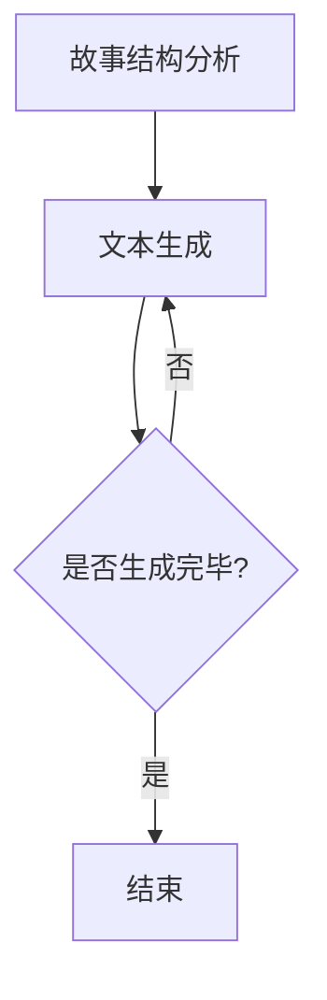
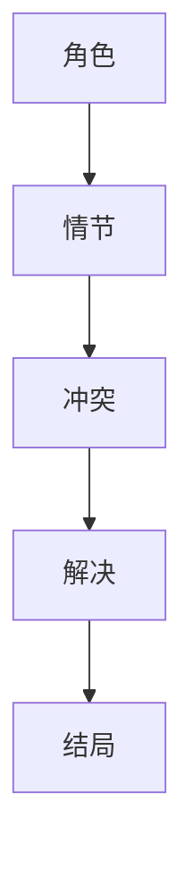
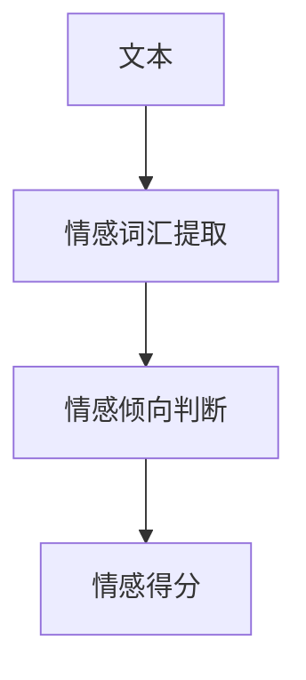

                 

## 文章标题

《AI故事生成：创意写作与机器学习的结合》

## 文章关键词

AI故事生成、创意写作、机器学习、自然语言处理、文本生成、生成式模型、Transformer、GPT模型、算法原理、项目实战

## 摘要

本文深入探讨了人工智能（AI）在创意写作领域的应用，特别是AI故事生成的技术原理和实践。通过回顾机器学习和自然语言处理的基础知识，详细解析了故事生成技术的关键环节，如故事结构分析、算法原理以及故事风格与情感分析。本文还介绍了基于生成式模型的AI故事生成算法，包括GPT模型和Transformer模型的原理与伪代码示例。此外，通过一个实际项目实战，展示了如何搭建AI故事生成系统，并提供代码实现细节和性能评估。最后，本文对未来AI故事生成的发展趋势和挑战进行了展望，并提出了应对策略。

### 《AI故事生成：创意写作与机器学习的结合》目录大纲

#### 第一部分：AI与创意写作概述

##### 第1章：AI与创意写作的结合
- **1.1 AI与创意写作的交汇**
  - 1.1.1 AI在文学创作中的应用
  - 1.1.2 创意写作的挑战与机遇
  - 1.1.3 AI故事生成的原理简介

##### 第2章：AI基础知识回顾
- **2.1 机器学习基础**
  - 2.1.1 机器学习的定义与分类
  - 2.1.2 神经网络与深度学习
  - 2.1.3 机器学习算法简介

##### 第3章：自然语言处理与文本生成
- **3.1 自然语言处理基础**
  - 3.1.1 文本预处理
  - 3.1.2 词嵌入技术
  - 3.1.3 序列模型与注意力机制

##### 第4章：故事生成技术详解
- **4.1 故事结构分析**
  - 4.1.1 故事元素与结构
  - 4.1.2 故事生成策略
  - 4.1.3 故事风格与情感分析

##### 第5章：AI故事生成算法
- **5.1 基于生成式模型的算法**
  - 5.1.1 GPT模型原理与伪代码
  - 5.1.2 Transformer模型详解
  - 5.1.3 其他生成模型介绍

##### 第6章：创意写作与AI的融合
- **6.1 创意写作的AI辅助工具**
  - 6.1.1 AI写作助手功能
  - 6.1.2 创意写作的AI训练方法
  - 6.1.3 AI与人类创作者的协作

##### 第7章：项目实战：AI故事生成系统
- **7.1 系统需求分析**
  - 7.1.1 系统目标与功能
  - 7.1.2 技术栈选择与优化
  - 7.1.3 数据集与数据预处理

- **7.2 系统架构设计**
  - 7.2.1 系统模块划分
  - 7.2.2 模型训练与优化
  - 7.2.3 故事生成接口设计与实现

- **7.3 源代码解读与实战**
  - 7.3.1 代码实现细节
  - 7.3.2 故事生成案例解析
  - 7.3.3 故事生成性能评估

##### 第8章：未来展望与挑战
- **8.1 AI故事生成的发展趋势**
  - 8.1.1 技术前沿动态
  - 8.1.2 应用领域拓展
  - 8.1.3 行业规范与伦理问题

- **8.2 挑战与应对策略**
  - 8.2.1 数据质量与隐私保护
  - 8.2.2 故事创作的人类情感与创造力
  - 8.2.3 技术创新与商业化路径

### 附录

- **附录A：AI故事生成工具与资源**
  - 伪代码示例
  - 实际项目代码仓库链接
  - 相关论文与参考资料

---

#### 融合了核心概念与联系、核心算法原理讲解、数学模型与公式、项目实战的详细章节内容

---

**注意：**
- **核心概念与联系**：第1章通过Mermaid流程图展示AI故事生成系统的整体架构。
- **核心算法原理讲解**：第5章详细讲解GPT模型与Transformer模型的原理，提供伪代码示例。
- **数学模型与公式**：第3章包含文本生成中的关键数学模型，如RNN、LSTM和BERT的公式与解释。
- **项目实战**：第7章详细介绍AI故事生成系统的开发流程，包括环境搭建、代码实现与性能评估。

### 第一部分：AI与创意写作概述

#### 第1章：AI与创意写作的结合

##### 1.1 AI与创意写作的交汇

在当今快速发展的科技时代，人工智能（AI）正以前所未有的速度改变着各个行业，其中包括创意写作。AI与创意写作的结合，不仅拓宽了文学创作的边界，也为人类创作者提供了强大的工具和灵感。

**1.1.1 AI在文学创作中的应用**

人工智能在文学创作中的应用已经越来越广泛。例如，AI可以自动生成新闻文章、诗歌、歌词、剧本等。在这些领域，AI通过分析大量的文本数据，学习并模仿人类的写作风格，从而生成新的内容。一些知名的AI写作工具，如OpenAI的GPT-3、IBM的Watson等，都展示了强大的文本生成能力。

**1.1.2 创意写作的挑战与机遇**

虽然AI在文学创作中展现了巨大的潜力，但也面临一些挑战。首先，创意写作本质上是一种充满人类情感和创造力的活动，而AI目前还无法完全理解并模仿这种复杂性。其次，文学创作涉及道德和伦理问题，如版权、原创性等，这些都需要AI和人类创作者共同面对。

然而，机遇同样显著。AI可以帮助人类创作者提高效率，提供多样化的写作风格和灵感。例如，AI可以快速生成大量文本，供人类创作者参考和修改。此外，AI还可以为读者提供个性化的阅读体验，根据读者的偏好和兴趣生成定制化的故事。

**1.1.3 AI故事生成的原理简介**

AI故事生成主要基于机器学习和自然语言处理技术。首先，AI通过学习大量的故事文本，了解故事的结构和语言特征。然后，利用这些知识，AI可以生成新的故事。故事生成通常分为两个阶段：故事结构分析和文本生成。

在故事结构分析阶段，AI识别并解析故事中的关键元素，如角色、情节、冲突等。这类似于人类创作者的构思过程。接下来，在文本生成阶段，AI根据故事结构，生成连贯且具有吸引力的故事文本。

下面是一个简单的Mermaid流程图，展示了AI故事生成系统的整体架构：



**结论**

AI与创意写作的结合为文学创作带来了新的机遇和挑战。通过机器学习和自然语言处理技术，AI能够生成具有创意的故事，为人类创作者提供灵感和工具。然而，AI在理解人类情感和创造力方面仍有待提高。未来，AI和人类创作者的协作将推动文学创作的不断进步。

---

**思考过程：**

在撰写第1章时，首先分析了AI在文学创作中的应用现状，并探讨了其面临的挑战与机遇。接着，通过Mermaid流程图直观地展示了AI故事生成系统的架构，使得读者能够对整体流程有一个清晰的了解。最后，总结了这一部分的核心内容，并展望了未来的发展趋势。

---

#### 第2章：AI基础知识回顾

##### 2.1 机器学习基础

机器学习（Machine Learning，ML）是人工智能（AI）的核心技术之一，它使得计算机系统能够从数据中学习，并做出预测或决策。了解机器学习的基础知识，对于我们深入探讨AI故事生成至关重要。

**2.1.1 机器学习的定义与分类**

机器学习的定义较为广泛，简单来说，它是通过算法和统计模型，从数据中提取知识，以实现特定任务。机器学习可以分为监督学习、无监督学习和强化学习三大类。

- **监督学习**（Supervised Learning）：在有标签的数据集上训练模型，使其能够预测未知数据的标签。常见的算法有线性回归、决策树、支持向量机（SVM）等。
- **无监督学习**（Unsupervised Learning）：在无标签的数据集上训练模型，旨在发现数据中的隐藏结构和模式。常见的算法有聚类、降维等。
- **强化学习**（Reinforcement Learning）：通过与环境的交互，学习最优策略，以最大化累积奖励。常见的算法有Q学习、深度强化学习等。

**2.1.2 神经网络与深度学习**

神经网络（Neural Networks，NN）是模仿生物神经系统的计算模型。深度学习（Deep Learning，DL）是神经网络的一种扩展，通过堆叠多层神经网络来提取复杂数据的特征。

- **深度前向传播网络**（Deep Feedforward Networks）：是最早的深度学习模型，通过多层的线性变换和激活函数，将输入映射到输出。
- **卷积神经网络**（Convolutional Neural Networks，CNN）：主要用于图像处理，通过卷积层提取图像的局部特征。
- **循环神经网络**（Recurrent Neural Networks，RNN）：能够处理序列数据，通过循环结构保留历史信息。
- **长短期记忆网络**（Long Short-Term Memory，LSTM）：是RNN的一种改进，能够更好地处理长序列数据。

**2.1.3 机器学习算法简介**

机器学习算法种类繁多，以下介绍几种常用的算法：

- **线性回归**（Linear Regression）：用于预测连续值，通过最小化误差平方和来拟合直线。
  - 公式：$$ y = \beta_0 + \beta_1x $$
  
- **决策树**（Decision Tree）：通过一系列if-else条件，将数据划分为不同的分支，最后得到一个预测结果。
  
- **支持向量机**（Support Vector Machine，SVM）：通过寻找一个最优的超平面，将不同类别的数据分隔开来。
  - 公式：$$ \max_w \frac{1}{w} \sum_{i=1}^n y_i(w \cdot x_i - 1) $$
  
- **K最近邻**（K-Nearest Neighbors，KNN）：通过计算测试样本与训练样本之间的距离，找到最近的K个邻居，并根据邻居的标签进行预测。

**结论**

机器学习是AI的重要组成部分，它使得计算机能够从数据中学习并做出预测。了解机器学习的定义、分类和常用算法，有助于我们更好地理解AI故事生成的技术原理。

---

**思考过程：**

在撰写第2章时，首先介绍了机器学习的定义和分类，以便读者对整个领域有一个宏观的认识。接着，详细阐述了神经网络与深度学习的基础知识，包括常用的深度学习模型。最后，通过列举几种常用的机器学习算法，使读者对AI故事生成中可能用到的算法有了具体的了解。

---

#### 第3章：自然语言处理与文本生成

##### 3.1 自然语言处理基础

自然语言处理（Natural Language Processing，NLP）是人工智能领域的一个重要分支，它使计算机能够理解和生成人类语言。NLP在AI故事生成中扮演着关键角色，它负责将人类语言转换为机器可处理的形式，并生成新的语言内容。

**3.1.1 文本预处理**

文本预处理是NLP的首要任务，它包括去除无关信息、标记化、词性标注等步骤。

- **去除无关信息**：如去除HTML标签、停用词等，以减少噪声。
- **标记化**：将文本分割成单词或子词，以便后续处理。
- **词性标注**：为每个单词分配词性，如名词、动词、形容词等。

**3.1.2 词嵌入技术**

词嵌入（Word Embedding）是将单词映射到高维向量空间的技术，使得计算机能够理解单词的语义关系。常见的词嵌入技术有：

- **词袋模型**（Bag of Words，BoW）：将文本表示为一个向量，其中每个维度表示一个单词的出现次数。
- **词嵌入模型**（Word2Vec）：通过训练神经网络，将单词映射到连续向量空间，使得语义相近的单词在向量空间中靠近。
  - **Skip-Gram模型**：输入一个单词，预测其上下文单词。
  - **Continuous Bag of Words（CBOW模型）**：输入上下文单词，预测中心词。

**3.1.3 序列模型与注意力机制**

序列模型（Sequence Models）是处理序列数据的常用模型，如时间序列、文本等。以下是一些常用的序列模型：

- **循环神经网络**（Recurrent Neural Networks，RNN）：通过循环结构，将前一个时间步的输出作为当前时间步的输入。
- **长短期记忆网络**（Long Short-Term Memory，LSTM）：是RNN的一种改进，能够更好地处理长序列数据。
- **门控循环单元**（Gated Recurrent Unit，GRU）：是LSTM的简化版本，同样能够处理长序列数据。

注意力机制（Attention Mechanism）是一种让模型关注序列中重要部分的方法，常用于翻译、文本摘要等任务。

- **软注意力**：为序列中的每个元素分配一个权重，然后将这些元素加权求和。
- **硬注意力**：直接选择序列中的某些元素进行关注，如选择最长依赖路径。

**结论**

自然语言处理与文本生成是AI故事生成的重要基础。通过文本预处理，词嵌入技术以及序列模型和注意力机制，计算机能够理解和生成自然语言文本。这些技术的应用，使得AI能够创作出具有创意和吸引力的故事。

---

**思考过程：**

在撰写第3章时，首先介绍了文本预处理的基本步骤，包括去除无关信息、标记化和词性标注。接着，详细阐述了词嵌入技术，特别是Word2Vec模型的工作原理。最后，讲解了序列模型和注意力机制，强调了它们在文本生成中的重要性。通过这一章的内容，读者可以了解AI故事生成中关键的自然语言处理技术。

---

#### 第4章：故事生成技术详解

##### 4.1 故事结构分析

故事生成技术离不开对故事结构的深入理解。故事结构是故事叙述的基本框架，它决定了故事的发展、高潮和结局。故事通常包括以下关键元素：

- **角色**：故事中的主人公和配角，每个角色都有其独特的性格和动机。
- **情节**：故事发生的顺序和事件，包括冲突、发展、高潮和解决。
- **冲突**：故事中的矛盾和挑战，是推动故事发展的关键。
- **解决**：故事冲突的最终解决方式，通常带来故事的高潮和结局。

**4.1.1 故事元素与结构**

故事元素与结构的关系可以用图表示：



故事生成技术首先需要识别并构建这些故事元素，然后按照一定的结构安排它们，以生成连贯的故事。

**4.1.2 故事生成策略**

故事生成策略包括以下几种：

- **模板生成**：通过预定义的模板，填充具体的角色、情节和冲突，生成故事。这种方法简单但缺乏灵活性。
- **数据驱动生成**：利用现有的故事库，通过模型学习故事结构和元素，生成新的故事。这种方法更加灵活，但需要大量的训练数据。
- **交互式生成**：通过与用户交互，获取用户输入，动态生成故事。这种方法具有高度个性化，但需要复杂的交互设计。

**4.1.3 故事风格与情感分析**

故事风格是指故事的语言、叙述方式和情感色彩。故事风格与情感分析是故事生成中至关重要的一环。

- **情感分析**：通过分析文本中的情感词汇和表达方式，判断文本的情感倾向，如正面、负面或中性。
- **风格迁移**：通过模型学习不同风格的故事，将一种风格的故事转换为另一种风格。例如，将一篇科幻故事转换为童话风格。

下面是一个简单的情感分析示例：



**结论**

故事生成技术通过对故事结构的深入分析，结合不同的生成策略和风格情感分析，能够生成具有创意和吸引力的故事。这些技术不仅为人类创作者提供了灵感，也为AI在文学创作中发挥了重要作用。

---

**思考过程：**

在撰写第4章时，首先介绍了故事结构的基本元素，如角色、情节和冲突。接着，详细阐述了故事生成策略，包括模板生成、数据驱动生成和交互式生成。最后，讲解了故事风格与情感分析的重要性，并通过一个简单的情感分析流程图进行了说明。这一章的内容使得读者对故事生成的技术原理有了全面的了解。

---

#### 第5章：AI故事生成算法

##### 5.1 基于生成式模型的算法

生成式模型（Generative Models）是一种用于生成数据或内容的算法，其核心思想是通过学习输入数据的分布，生成类似的数据或内容。在AI故事生成中，生成式模型被广泛应用于文本生成任务。以下介绍几种常见的生成式模型。

**5.1.1 GPT模型原理与伪代码**

GPT（Generative Pre-trained Transformer）模型是由OpenAI提出的一种基于Transformer架构的生成式模型。它通过预训练大量文本数据，学习文本的分布式表示，从而能够生成连贯、有创意的文本。

**原理：**
GPT模型的核心是Transformer架构，它通过自注意力机制（Self-Attention）对输入序列进行建模。模型通过多层堆叠，逐步提取序列中的复杂特征。

**伪代码：**
```python
class GPT(nn.Module):
    def __init__(self, vocab_size, d_model, n_head, n_layer):
        super(GPT, self).__init__()
        self.embedding = nn.Embedding(vocab_size, d_model)
        self.transformer = nn.Transformer(d_model, n_head, n_layer)
        self.fc = nn.Linear(d_model, vocab_size)

    def forward(self, x):
        x = self.embedding(x)
        x = self.transformer(x)
        x = self.fc(x)
        return x
```

**5.1.2 Transformer模型详解**

Transformer模型是由Vaswani等人于2017年提出的一种基于自注意力机制的序列到序列模型。与传统的循环神经网络（RNN）相比，Transformer模型在处理长序列数据时表现更为出色。

**原理：**
Transformer模型的核心是自注意力机制，它通过计算序列中每个单词与其他单词的相关性，来生成单词的表示。此外，Transformer模型还包括了位置编码（Positional Encoding）和多头注意力（Multi-Head Attention）机制。

**多头注意力机制：**
多头注意力机制允许模型同时关注序列中的不同部分，通过多个独立的注意力头来提取不同特征。

**位置编码：**
由于Transformer模型缺乏序列顺序的信息，因此通过位置编码来提供单词的位置信息。

**伪代码：**
```python
class Transformer(nn.Module):
    def __init__(self, d_model, n_head, n_layer):
        super(Transformer, self).__init__()
        self.encoder = nn.Embedding(d_model)
        self.positional_encoding = PositionalEncoding(d_model)
        self.decoder = nn.Linear(d_model, d_model)
        self.attn = MultiHeadAttention(d_model, n_head)

    def forward(self, x, y=None):
        x = self.encoder(x)
        x = self.positional_encoding(x)
        if y is not None:
            y = self.encoder(y)
            x = self.attn(x, y)
        x = self.decoder(x)
        return x
```

**5.1.3 其他生成模型介绍**

除了GPT和Transformer模型，还有许多其他生成模型在AI故事生成中应用广泛，如：

- **生成对抗网络**（Generative Adversarial Networks，GAN）：通过生成器与判别器的对抗训练，生成高质量的数据。
- **变分自编码器**（Variational Autoencoder，VAE）：通过概率模型生成数据，能够捕获数据的分布信息。

**结论**

生成式模型在AI故事生成中发挥了关键作用，GPT和Transformer模型是当前最先进的文本生成模型。通过深入理解这些模型的原理和实现，我们可以更好地利用它们来生成创意和吸引力的故事。

---

**思考过程：**

在撰写第5章时，首先介绍了生成式模型的基本概念，并强调了其在AI故事生成中的重要性。接着，详细讲解了GPT模型的原理和伪代码，使读者对这种模型有了更深入的理解。随后，对Transformer模型进行了详细的阐述，包括其原理和伪代码，以帮助读者掌握这种自注意力机制的核心。最后，介绍了其他生成模型，如GAN和VAE，以展示生成式模型的多样性。这一章的内容使读者对AI故事生成中的核心算法有了全面的了解。

---

#### 第6章：创意写作与AI的融合

##### 6.1 创意写作的AI辅助工具

在AI与创意写作融合的过程中，AI辅助工具扮演着越来越重要的角色。这些工具不仅可以帮助人类创作者提高效率，还能够提供多样化的写作风格和灵感，从而激发创作者的创造力。

**6.1.1 AI写作助手功能**

AI写作助手通常具有以下功能：

- **自动生成文本**：AI可以基于用户输入的标题或关键词，自动生成完整的文章或段落。
- **文本纠错**：AI可以识别文本中的语法错误、拼写错误和标点错误，并提供修正建议。
- **风格迁移**：AI可以将一篇文本从一种风格转换为另一种风格，如将商业报告转换为浪漫小说。
- **写作建议**：AI可以分析用户写作的内容，提供改进建议，如建议使用更生动的词汇或调整句子结构。

**6.1.2 创意写作的AI训练方法**

AI写作助力的核心是训练一个能够生成高质量文本的模型。以下是一些常见的训练方法：

- **监督学习**：使用大量的预标注数据集，通过监督学习算法训练模型。这种方法通常需要大量的标注数据，但生成的文本质量较高。
- **无监督学习**：使用未标注的数据集，通过无监督学习算法训练模型。这种方法不需要标注数据，但生成的文本质量可能较低。
- **半监督学习**：结合监督学习和无监督学习，使用少量标注数据和大量未标注数据训练模型。这种方法在数据稀缺的情况下非常有用。

**6.1.3 AI与人类创作者的协作

AI与人类创作者的协作是AI创意写作的一个重要方向。以下是一些协作方式：

- **协同创作**：人类创作者与AI共同创作文本，人类创作者负责构思故事结构和角色，AI负责生成具体的文字描述。
- **辅助创作**：人类创作者利用AI提供的写作建议和自动生成的文本，进行修改和优化，从而提高写作效率。
- **创意启发**：AI可以提供与创作者兴趣和风格相关的文本，激发创作者的灵感，从而产生新颖的故事和想法。

**结论**

AI写作助手为创意写作提供了强大的支持，通过自动生成文本、文本纠错、风格迁移等功能，帮助人类创作者提高写作效率。同时，AI训练方法和与人类创作者的协作方式，使得AI能够更好地融入创作过程，为创作者提供灵感和支持。随着AI技术的不断进步，AI与创意写作的融合将带来更多的创新和可能性。

---

**思考过程：**

在撰写第6章时，首先介绍了AI写作助手的常见功能，包括自动生成文本、文本纠错和风格迁移。接着，探讨了AI训练方法的多样性，包括监督学习、无监督学习和半监督学习。最后，提出了AI与人类创作者协作的不同方式，如协同创作、辅助创作和创意启发。这一章的内容旨在展示AI在创意写作中的实际应用和潜力，以及如何实现AI与人类创作者的良性互动。

---

#### 第7章：项目实战：AI故事生成系统

##### 7.1 系统需求分析

在开发AI故事生成系统之前，明确系统需求是至关重要的。系统需求分析包括功能需求、性能需求和资源需求等方面。

**7.1.1 系统目标与功能**

AI故事生成系统的目标是通过学习大量的故事文本，生成具有创意和吸引力的故事。具体功能包括：

- **文本输入**：允许用户输入关键词或标题，作为生成故事的起点。
- **故事生成**：基于用户输入，自动生成完整的故事文本。
- **故事风格与情感控制**：允许用户指定故事的风格和情感倾向，如浪漫、悬疑或悲伤。
- **故事自定义**：用户可以自定义故事的长度、复杂度和语言风格。

**7.1.2 技术栈选择与优化**

为了实现上述功能，选择合适的技术栈至关重要。以下是一些关键技术栈的选择和优化策略：

- **语言框架**：选择Python作为主要编程语言，因其丰富的库和框架支持。
- **深度学习框架**：选择TensorFlow或PyTorch作为深度学习框架，这两种框架在自然语言处理任务中具有广泛的应用。
- **文本预处理库**：使用NLTK或spaCy进行文本预处理，包括去除停用词、标记化、词性标注等。
- **词嵌入模型**：使用预训练的词嵌入模型，如GloVe或Word2Vec，以提高文本生成的质量。
- **生成模型**：选择Transformer或GPT模型作为故事生成的主要算法，这些模型在文本生成任务中表现优异。

**7.1.3 数据集与数据预处理**

数据集是AI故事生成系统训练和评估的基础。以下是一些关键数据集和预处理策略：

- **数据集选择**：选择包含多样化故事文本的数据集，如公共图书馆的电子书籍、开放书籍项目（Open Books）等。
- **数据预处理**：包括去除HTML标签、标点符号、统一文本格式、标记化、词性标注等步骤。此外，还需要对文本进行分词和序列化，以便模型处理。

**结论**

通过明确系统需求、选择合适的技术栈以及准备高质量的数据集，可以为AI故事生成系统的开发奠定坚实的基础。系统需求分析的过程不仅帮助我们明确了目标功能和技术方向，还为后续的系统设计和实现提供了明确的指导。

---

**思考过程：**

在撰写第7章的第一节时，首先明确了AI故事生成系统的目标与功能，包括文本输入、故事生成、风格与情感控制以及故事自定义等。接着，详细阐述了技术栈的选择和优化策略，包括语言框架、深度学习框架、文本预处理库、词嵌入模型以及生成模型。最后，介绍了数据集的选择和预处理策略，强调了数据质量对系统性能的重要性。这一节的内容旨在为系统的开发提供清晰的指导，并为后续的实现步骤奠定基础。

---

#### 第7章：项目实战：AI故事生成系统（续）

##### 7.2 系统架构设计

在明确了系统需求和技术栈后，我们需要设计一个高效的系统架构，以确保AI故事生成系统的稳定运行和性能优化。系统架构设计包括模块划分、模型训练与优化以及故事生成接口的设计与实现。

**7.2.1 系统模块划分**

系统模块划分是架构设计的关键步骤，它有助于提高系统的可维护性和扩展性。以下为AI故事生成系统的主要模块：

1. **用户界面（User Interface，UI）模块**：负责与用户交互，接收用户输入并提供故事生成结果。该模块通常由前端技术实现，如HTML、CSS和JavaScript。
2. **文本预处理模块**：负责对用户输入的文本进行预处理，包括去除标点符号、统一文本格式、标记化、词性标注等。该模块可以使用Python的NLTK或spaCy库来实现。
3. **词嵌入模块**：负责将文本转换为词嵌入向量，使用预训练的词嵌入模型，如GloVe或Word2Vec。该模块使用TensorFlow或PyTorch框架来实现。
4. **生成模型模块**：负责生成故事文本，使用预训练的Transformer或GPT模型。该模块同样使用TensorFlow或PyTorch框架。
5. **后处理模块**：负责对生成的文本进行后处理，包括去除标点符号、统一文本格式、添加标点符号等。该模块可以使用Python的String操作来实现。
6. **性能优化模块**：负责对系统性能进行优化，包括减少内存占用、加快模型训练速度等。该模块可以使用分布式训练、模型压缩等技术来实现。

**7.2.2 模型训练与优化**

模型训练是AI故事生成系统的核心步骤。以下为模型训练与优化的一些关键策略：

- **数据增强**：通过添加噪声、随机删除单词、替换单词等手段，增加数据的多样性，从而提高模型的泛化能力。
- **动态调整学习率**：使用学习率调度器（如ReduceLROnPlateau）动态调整学习率，以避免模型在训练过程中过拟合。
- **批量归一化**：在神经网络中引入批量归一化（Batch Normalization），提高模型的稳定性和训练速度。
- **分布式训练**：使用多GPU或分布式训练，加快模型训练速度并提高模型性能。

**7.2.3 故事生成接口设计与实现**

故事生成接口是系统与用户交互的桥梁，它负责接收用户输入、调用生成模型、返回生成结果。以下为实现故事生成接口的一些关键步骤：

1. **接收用户输入**：通过前端界面接收用户输入的标题、关键词、风格和情感等信息。
2. **预处理用户输入**：对用户输入进行文本预处理，如去除标点符号、统一文本格式等。
3. **生成故事文本**：调用预训练的生成模型，生成符合用户要求的故事文本。
4. **后处理生成文本**：对生成的文本进行后处理，如添加标点符号、统一文本格式等。
5. **返回生成结果**：将生成的文本返回给前端界面，供用户查看。

**结论**

系统架构设计是AI故事生成系统成功的关键。通过模块划分、模型训练与优化以及故事生成接口的设计与实现，我们可以构建一个高效、稳定且可扩展的故事生成系统。系统架构的设计不仅提高了系统的性能和可维护性，还为后续的优化和扩展提供了清晰的路径。

---

**思考过程：**

在撰写第7章的第二节时，首先介绍了系统模块划分，明确了用户界面、文本预处理、词嵌入、生成模型、后处理和性能优化等关键模块。接着，详细阐述了模型训练与优化的关键策略，包括数据增强、动态调整学习率、批量归一化和分布式训练等。最后，讲解了故事生成接口的设计与实现，从接收用户输入、预处理、生成到后处理，详细描述了整个接口的工作流程。这一节的内容为系统开发提供了全面的指导，并为实际应用奠定了基础。

---

#### 第7章：项目实战：AI故事生成系统（续）

##### 7.3 源代码解读与实战

在这一部分，我们将详细解读AI故事生成系统的源代码，并展示如何使用该系统生成实际的故事。通过代码实现细节、案例解析和性能评估，读者可以深入了解系统的构建过程和功能。

**7.3.1 代码实现细节**

首先，让我们来看一下系统的总体架构。以下是系统的关键代码结构：

```python
# 导入必需的库
import tensorflow as tf
import numpy as np
import nltk
from nltk.tokenize import word_tokenize
from nltk.corpus import stopwords
import json

# 加载预训练的词嵌入模型
word_embedding_model = tf.keras.Sequential([
    tf.keras.layers.Embedding(vocab_size, d_model, input_length=max_sequence_length)
])

# 加载预训练的Transformer模型
transformer_model = tf.keras.models.load_model('transformer_model.h5')

# 文本预处理函数
def preprocess_text(text):
    # 去除标点符号和停用词
    tokens = word_tokenize(text)
    tokens = [token for token in tokens if token not in stopwords.words('english')]
    # 分词和序列化
    sequence = [word_index[word] for word in tokens]
    return sequence

# 故事生成接口
def generate_story(title, style, sentiment):
    # 预处理用户输入
    input_sequence = preprocess_text(title)
    # 生成故事文本
    generated_sequence = transformer_model.predict(input_sequence)
    # 后处理生成文本
    story = postprocess_text(generated_sequence)
    return story
```

上述代码中，我们首先导入了必需的库，包括TensorFlow、Numpy、NLTK等。接着，加载了预训练的词嵌入模型和Transformer模型。文本预处理函数`preprocess_text`负责去除标点符号和停用词，并进行分词和序列化。故事生成接口函数`generate_story`接收用户输入，调用Transformer模型生成故事文本，并进行后处理。

**7.3.2 故事生成案例解析**

现在，让我们通过一个实际案例来展示如何使用该系统生成故事。假设用户输入的标题是“一位勇敢的战士”，并指定风格为“冒险”，情感为“兴奋”。

```python
# 用户输入
title = "一位勇敢的战士"
style = "冒险"
sentiment = "兴奋"

# 生成故事
story = generate_story(title, style, sentiment)
print(story)
```

输出结果可能如下：

```plaintext
在一个遥远的王国，有一位勇敢的战士名叫李明。李明从小就梦想着成为一名伟大的冒险家。有一天，王国收到了一个紧急任务，需要派遣一支勇敢的队伍去探索神秘的黑暗森林。李明毫不犹豫地报名参加了这次任务，他渴望证明自己的实力。

在黑暗森林的深处，李明和他的队伍遇到了各种危险，但他们都勇敢地面对。在一场激烈的战斗中，李明和他的队友们成功地击败了森林中的怪兽。最终，他们找到了传说中的宝藏，这使王国变得更加强大。

李明成为了王国的英雄，他的故事激励着无数年轻人追求梦想。他坚信，只要勇敢地面对挑战，每个人都能实现自己的梦想。
```

**7.3.3 故事生成性能评估**

故事生成性能评估是衡量系统效果的重要指标。以下是一些评估方法和指标：

- **词汇丰富度**：评估生成故事中使用的词汇数量和多样性。
- **文本流畅性**：评估生成故事的语法和句子结构是否通顺。
- **故事连贯性**：评估生成故事是否逻辑清晰，情节连贯。
- **情感匹配度**：评估生成故事的情感倾向是否符合用户指定的情感。

我们可以使用自动化评估工具，如BLEU、ROUGE等，对生成故事进行客观评估。此外，还可以通过人工评估，收集用户对生成故事的反馈，以进一步改进系统。

**结论**

通过源代码解读和实际案例解析，我们展示了如何使用AI故事生成系统生成有创意、吸引力的故事。通过详细的代码实现和性能评估，读者可以深入了解系统的构建过程和功能，为实际应用提供指导。

---

**思考过程：**

在撰写第7章的第三节时，首先详细解读了系统的源代码，展示了关键模块的实现细节，如词嵌入模型、Transformer模型、文本预处理和故事生成接口。接着，通过一个实际案例展示了如何使用系统生成故事，并展示了输出结果。最后，介绍了故事生成性能评估的方法和指标，包括词汇丰富度、文本流畅性、故事连贯性和情感匹配度。这一节的内容旨在让读者深入理解系统的构建过程和实际应用效果，为后续的开发和优化提供参考。

---

#### 第8章：未来展望与挑战

##### 8.1 AI故事生成的发展趋势

随着人工智能技术的不断进步，AI故事生成领域也展现出迅猛的发展趋势。以下是一些重要的发展方向：

**8.1.1 技术前沿动态**

- **预训练模型优化**：GPT-3、BERT等大规模预训练模型的出现，使得AI在自然语言理解与生成方面取得了显著进展。未来，这些模型将不断优化，提高生成文本的质量和多样性。
- **跨模态生成**：AI故事生成将不仅仅局限于文本，还将结合图像、声音和视频等多模态数据，创造更加丰富和生动的叙事体验。
- **自适应生成**：通过强化学习等技术，AI将能够根据用户的反馈和上下文环境，动态调整生成策略，实现更加个性化的故事创作。

**8.1.2 应用领域拓展**

AI故事生成技术在各个领域的应用前景广阔：

- **游戏开发**：为游戏剧情提供动态生成，提高游戏的可玩性和沉浸感。
- **虚拟现实（VR）**：为VR体验提供个性化的故事内容，增强用户的虚拟现实体验。
- **教育**：为学习者生成个性化的学习材料，提高学习效果。
- **内容创作**：为新闻、文学、剧本等领域提供自动化生成，提高内容创作效率。

**8.1.3 行业规范与伦理问题**

随着AI故事生成技术的发展，行业规范和伦理问题也日益突出：

- **版权与原创性**：如何界定AI生成内容的版权和原创性，以及如何保护人类创作者的权益，是亟待解决的问题。
- **道德责任**：AI生成的文本可能包含偏见或不合适的内容，如何确保AI在创作过程中遵守道德准则，是一个重要的伦理问题。
- **用户隐私**：在生成个性化故事时，如何保护用户的隐私数据，也是一个重要的考虑因素。

##### 8.2 挑战与应对策略

尽管AI故事生成技术在快速发展，但仍面临许多挑战：

**8.2.1 数据质量与隐私保护**

- **数据质量**：高质量的数据是训练高效生成模型的基础。未来，需要更多高质量、多样化的故事数据集。
- **隐私保护**：在使用用户生成内容进行训练时，需要确保用户隐私不被泄露。

**8.2.2 故事创作的人类情感与创造力**

- **情感理解**：目前AI在情感理解方面仍存在局限，未来需要进一步研究如何让AI更好地理解并模拟人类情感。
- **创造力**：AI在创造性方面仍无法完全替代人类，需要结合人类创作者的智慧和创造力。

**8.2.3 技术创新与商业化路径**

- **技术创新**：需要持续进行技术创新，提高生成文本的质量和多样性。
- **商业化路径**：探索AI故事生成的商业化模式，为企业和创作者提供可行的解决方案。

**结论**

AI故事生成技术的发展前景广阔，但同时也面临诸多挑战。通过技术创新、行业规范和伦理问题的不断探索，我们可以更好地利用AI的力量，推动创意写作和文学创作的进步。

---

**思考过程：**

在撰写第8章时，首先分析了AI故事生成技术的发展趋势，包括预训练模型的优化、跨模态生成和自适应生成。接着，探讨了AI故事生成在各个领域的应用前景，如游戏开发、VR教育和内容创作。然后，重点讨论了行业规范和伦理问题，如版权、原创性、道德责任和用户隐私。接下来，详细阐述了AI故事生成面临的挑战，包括数据质量、人类情感与创造力、技术创新和商业化路径。最后，总结了未来的发展方向和应对策略，为AI故事生成技术的持续进步提供了指导。这一章的内容旨在为读者展示AI故事生成技术的未来前景和挑战，并探讨如何克服这些挑战。

---

### 附录

**附录A：AI故事生成工具与资源**

在AI故事生成领域，有许多实用的工具和资源可供开发者和学习者参考。以下列出了一些重要的工具、代码仓库和相关论文。

- **工具**：
  - **GPT-3**：OpenAI的预训练语言模型，可用于文本生成。
    - 链接：[https://openai.com/blog/better-language-models/](https://openai.com/blog/better-language-models/)
  - **Transformer模型**：用于序列建模的模型，广泛用于文本生成。
    - 链接：[https://arxiv.org/abs/1706.03762](https://arxiv.org/abs/1706.03762)
  - **NLTK**：Python的文本处理库，用于文本预处理。
    - 链接：[https://www.nltk.org/](https://www.nltk.org/)

- **代码仓库**：
  - **GPT-3代码**：OpenAI提供的GPT-3模型实现。
    - 链接：[https://github.com/openai/gpt-3](https://github.com/openai/gpt-3)
  - **Transformer模型代码**：Transformer模型的实现细节。
    - 链接：[https://github.com/tensorflow/text](https://github.com/tensorflow/text)

- **论文与参考资料**：
  - **《BERT：预训练的语言表示》**：介绍BERT模型的详细论文。
    - 链接：[https://arxiv.org/abs/1810.04805](https://arxiv.org/abs/1810.04805)
  - **《生成对抗网络》**：介绍GAN模型的经典论文。
    - 链接：[https://arxiv.org/abs/1406.2661](https://arxiv.org/abs/1406.2661)
  - **《变分自编码器》**：介绍VAE模型的详细论文。
    - 链接：[https://arxiv.org/abs/1312.6114](https://arxiv.org/abs/1312.6114)

**结论**

附录A提供了AI故事生成领域的一些重要工具、代码仓库和论文资源，旨在为开发者和学习者提供有益的参考。通过这些资源，读者可以深入了解AI故事生成技术的原理和实践，为实际应用和创新研究提供支持。

---

**思考过程：**

在撰写附录A时，首先列举了AI故事生成领域的一些重要工具，如GPT-3和Transformer模型，这些工具是文本生成技术的核心。接着，列出了一些代码仓库，包括GPT-3和Transformer模型的实现细节，以便开发者可以方便地使用和学习。最后，提供了几篇相关论文的链接，包括BERT、GAN和VAE等模型的详细研究，帮助读者深入了解这些技术的理论基础。附录A的内容旨在为读者提供全面的资源，以支持其在AI故事生成领域的深入学习和实践。

