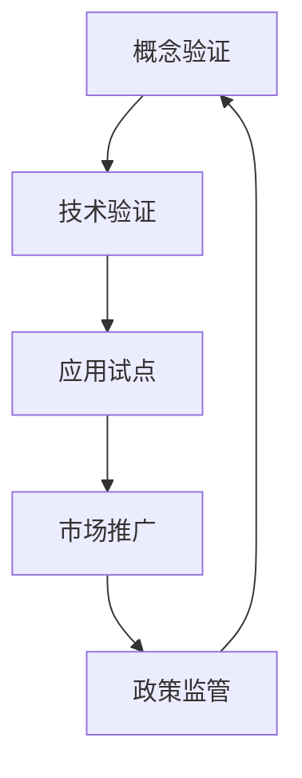

                 

### 文章标题

# AI时代的人类增强：道德考虑与身体增强的未来发展机遇分析机遇趋势

### 关键词

- AI时代
- 人类增强
- 道德考虑
- 身体增强
- 未来发展

### 摘要

本文深入探讨了AI时代人类增强技术的背景、现状和未来发展，特别强调了道德考虑在这一领域的核心作用。文章首先概述了AI时代的人类增强概念及其定义，随后分析了当前人类增强技术的趋势和现状。文章接着详细探讨了道德哲学基础、伦理问题以及国际道德规范和法律框架。接着，文章深入分析了身体增强技术的原理、应用、挑战与未来。最后，文章讨论了智力增强和情感增强技术的原理、应用、伦理问题和未来趋势。文章通过逐步分析和推理，旨在为读者提供一个全面、深入的关于人类增强技术及其伦理影响的视角。

### 目录大纲

1. **引言**
    1.1 AI时代的人类增强：背景与定义
    1.2 人类增强技术的现状与趋势
    1.3 道德考虑在人类增强中的应用
    1.4 本书结构安排与内容概述

2. **道德考虑与伦理问题**
    2.1 道德哲学基础
    2.2 人类增强技术的伦理问题
    2.3 国际道德规范与法律框架
    2.4 道德责任与法律责任

3. **身体增强技术的发展**
    3.1 身体增强技术原理
    3.2 身体增强技术的应用
    3.3 身体增强技术的挑战与未来

4. **智力增强与未来社会**
    4.1 智力增强技术的原理与应用
    4.2 智力增强技术的伦理问题
    4.3 智力增强对社会的影响

5. **情感增强与个性塑造**
    5.1 情感增强与个性塑造技术
    5.2 情感增强与个性塑造的应用
    5.3 情感增强与个性塑造的伦理问题

6. **综合分析与展望**
    6.1 人类增强技术的综合影响
    6.2 未来展望

7. **附录**
    7.1 主要参考文献
    7.2 相关资源
    7.3 人类增强技术流程图
    7.4 核心算法原理讲解
    7.5 数学模型与公式
    7.6 项目实战

---

接下来，我们将逐步深入探讨每个章节的内容，让读者能够全面了解AI时代的人类增强技术，以及在这一过程中道德考虑的重要性。

---

### 第一部分：引言

#### 1.1 AI时代的人类增强：背景与定义

随着人工智能（AI）技术的飞速发展，人类增强（Human Enhancement）这一概念逐渐走入人们的视野。人类增强指的是通过科技手段，增强人类的生理、心理或认知能力，使其在各个方面超越自然界限。AI时代的人类增强不仅仅是医学和生物技术的进步，更是计算机科学、神经科学、材料科学等多学科交叉的产物。

首先，让我们明确“人类增强”的定义。人类增强可以大致分为三类：身体增强、智力增强和情感增强。

- **身体增强**：通过医学和生物技术，改善或增强人体的生理功能。这包括器官移植、基因编辑、药物和生物材料的应用等。
- **智力增强**：通过神经科学、认知科学和人工智能技术，增强人类的学习能力、记忆力和思维能力。例如，脑机接口、智能眼镜、增强现实（AR）和虚拟现实（VR）技术。
- **情感增强**：通过心理治疗、药物和神经科学手段，调节和增强人类的情感体验。例如，情感计算、心理健康监测和个性化治疗方案。

AI时代的人类增强不仅限于科技层面，更涉及到深刻的伦理和社会问题。随着技术的发展，人类增强的边界不断扩展，如何平衡技术进步与道德责任成为亟待解决的问题。

#### 1.2 人类增强技术的现状与趋势

当前，人类增强技术在多个领域取得了显著的进展。

- **生物技术与基因编辑**：CRISPR-Cas9等基因编辑技术已经实现了对人类基因的精确修改，为治疗遗传病和改善人类健康提供了可能。
- **神经科学技术**：脑机接口（BMI）技术逐渐成熟，可以实时记录和解读大脑活动，实现人类与机器的直接通信。
- **药物与生物材料**：通过药物和生物材料的应用，人类已经能够在生理层面实现增强，如增强肌肉力量、加速康复等。
- **人工智能与大数据分析**：AI技术在大数据处理和模式识别方面的优势，使得个性化医疗和心理健康监测成为可能。

然而，人类增强技术的快速发展也带来了许多挑战和伦理争议。首先，技术的不平等问题日益凸显，如何确保所有人都能公平地享受到这些技术带来的好处是一个重要议题。其次，技术的安全性问题不容忽视，基因编辑等技术的潜在风险可能导致不可逆转的后果。最后，伦理问题成为人类增强技术的核心挑战，如何确保技术在应用过程中不违背基本的道德原则，成为政府和科学界共同关注的焦点。

#### 1.3 道德考虑在人类增强中的应用

在人类增强技术的发展过程中，道德考虑至关重要。道德原则不仅指导着技术的研发和应用，也是评估技术伦理风险的重要依据。

- **尊重个人自主权**：个人有权自主决定是否接受人类增强技术，以及接受何种程度的技术干预。
- **公正与平等**：技术的应用应该确保所有人，无论社会经济地位，都能平等地享受其带来的好处。
- **透明度与责任感**：技术的研发和应用过程应该透明，相关责任方应当明确，确保技术在使用过程中不违背伦理和法律规范。
- **避免过度干预**：技术的发展不应该过度干预人类的自然发展过程，应在确保安全和有效的范围内进行。

#### 1.4 本书结构安排与内容概述

本书旨在全面探讨AI时代的人类增强技术，特别是道德考虑在这一领域的应用。全书分为五个主要部分：

1. **引言**：介绍人类增强技术的背景、现状与趋势，以及道德考虑的重要性。
2. **道德考虑与伦理问题**：详细分析道德哲学基础、伦理问题以及国际道德规范和法律框架。
3. **身体增强技术的发展**：探讨身体增强技术的原理、应用、挑战与未来。
4. **智力增强与未来社会**：分析智力增强技术的原理、应用、伦理问题和未来趋势。
5. **情感增强与个性塑造**：探讨情感增强与个性塑造技术的原理、应用、伦理问题和未来趋势。

通过这五个部分的深入探讨，本书希望能够为读者提供一个全面、深入的关于人类增强技术及其伦理影响的视角，帮助读者更好地理解和评估这一领域的发展前景和挑战。

---

在下一部分，我们将进一步探讨道德哲学基础，分析不同伦理学理论在人类增强技术中的应用，并探讨伦理困境与道德决策的问题。

---

### 第二部分：道德考虑与伦理问题

#### 2.1 道德哲学基础

在探讨AI时代的人类增强技术时，道德哲学基础是不可或缺的一部分。道德哲学是关于道德原则、道德标准和道德判断的理论研究，它为人类增强技术提供了一个伦理框架，帮助我们评估这些技术的道德合理性。

首先，我们需要了解道德哲学的基本概念。道德哲学的核心问题是“什么是善”和“什么是有道德的行为”。不同的道德理论对这些问题有不同的回答，但它们的共同目标是提供一套普遍适用的道德原则，以指导人类的行为。

- **功利主义**：功利主义认为，行为的道德价值取决于其带来的后果。具体来说，一个行为如果是正确的，那么它将带来最大化的幸福和最小的痛苦。功利主义强调结果的道德价值，常常用来评估人类增强技术的潜在益处和风险。
- **康德主义**：康德主义强调行为的道德价值不取决于结果，而取决于行为的动机和意图。康德认为，只有基于道德原则的行为才是道德的，这些原则包括普遍性原则、尊重人的尊严和自主权等。在人类增强技术的应用中，康德主义帮助我们评估技术是否尊重个体的自主权，是否违背了基本的道德原则。
- **德性伦理学**：德性伦理学关注个体的道德品质和性格，认为道德是通过培养良好的德性来实现的。德性伦理学强调个人的责任和道德自律，在人类增强技术的应用中，它帮助我们思考个体应该如何在技术使用中培养责任感和自律性。

#### 2.2 伦理学理论在人类增强中的应用

在人类增强技术的应用中，不同的伦理学理论提供了不同的视角，帮助我们评估技术的道德合理性。

- **功利主义在人类增强中的应用**：功利主义在评估人类增强技术的道德合理性时，关注技术带来的总幸福和总痛苦。例如，基因编辑技术在治疗遗传病方面具有巨大潜力，但同时也可能带来意想不到的风险和伦理问题。功利主义的方法可以帮助我们权衡这些因素，确定技术是否总体上是道德的。
- **康德主义在人类增强中的应用**：康德主义强调尊重个体的自主权和尊严。在人类增强技术的应用中，康德主义帮助我们评估技术是否尊重个体的选择权，是否侵犯了他们的尊严。例如，脑机接口技术的应用需要获得个体的明确同意，同时确保技术不损害个体的尊严。
- **德性伦理学在人类增强中的应用**：德性伦理学强调个体的道德品质和责任。在人类增强技术的应用中，德性伦理学帮助我们思考个体应该如何在使用技术时培养责任感和自律性。例如，在使用智力增强技术时，个体需要考虑如何保持对知识的正确态度和道德行为。

#### 2.3 伦理困境与道德决策

人类增强技术在实际应用中常常面临伦理困境，这些困境通常涉及多个伦理原则的冲突，使得道德决策变得更加复杂。

- **自主权与福祉的冲突**：在某些情况下，个体可能出于个人福祉的考虑，选择接受人类增强技术，但这一选择可能对他人或社会产生负面影响。例如，智力增强技术的滥用可能导致社会不平等加剧，从而引发伦理困境。
- **公正与效率的冲突**：人类增强技术的应用需要资源投入，如何公平地分配这些资源成为一个伦理问题。在资源有限的情况下，如何确保技术带来的利益最大化，同时保持社会的公正性，是一个重要的道德决策。
- **安全与创新的冲突**：新技术的研发和应用往往伴随着风险，如何在确保安全的同时推动创新，也是一个伦理困境。例如，基因编辑技术的应用需要严格的安全监管，但过度的监管可能导致创新受阻。

面对这些伦理困境，道德决策需要综合考虑多种因素，并采取合理的措施。以下是一些常见的道德决策策略：

- **优先原则**：在冲突的伦理原则之间，确定一个优先级，根据优先级进行决策。例如，在自主权与福祉的冲突中，可以优先考虑个体的自主权，但需确保技术使用不会对他人造成严重伤害。
- **平衡原则**：在多个伦理原则之间寻求平衡，找到一个既能满足多数人的利益，又不会严重损害他人权益的方案。例如，在资源分配问题上，可以采用基于需求和能力的分配原则，确保资源公平地分配给最需要的人。
- **预防原则**：在决策时考虑未来可能出现的风险和后果，采取措施预防潜在的伦理问题。例如，在新技术研发和应用过程中，建立严格的安全评估和监管机制，以减少风险。

通过合理的道德决策，我们可以更好地应对人类增强技术带来的伦理困境，确保技术的发展既符合道德原则，又能带来实际的益处。

#### 2.4 道德责任与法律责任

在人类增强技术的应用中，道德责任和法律责任的界定是一个重要且复杂的问题。道德责任是指个人、组织或机构在道德上应对其行为负责，而法律责任是指根据法律规定，个人、组织或机构应承担的法律后果。

- **道德责任的界定**：道德责任通常基于道德原则和伦理规范，如尊重个体的自主权、确保公正和公平、保护个体权益等。在人类增强技术的应用中，道德责任包括对个体隐私的保护、对潜在风险的告知和预防、以及对技术滥用行为的约束。
- **法律责任的界定**：法律责任通常基于法律规定，如合同法、侵权法、刑法等。在人类增强技术的应用中，法律责任包括对技术安全性的保证、对隐私权的保护、以及对技术滥用行为的惩罚。

道德责任和法律责任的界定在人类增强技术的应用中相互交织，共同构成一个完整的责任体系。以下是一些常见的责任问题及其解决策略：

- **个人责任**：在人类增强技术的应用中，个人需要对自己的行为负责。例如，在使用基因编辑技术时，个人需要确保技术的安全性和道德合理性，遵守相关法规和伦理规范。
- **组织责任**：在人类增强技术的研发和应用中，组织需要对其行为负责。组织应建立健全的伦理审查和监管机制，确保技术符合道德和法律要求，同时保护个体权益。
- **法律责任**：在人类增强技术的应用中，法律责任可以通过法律手段来追究。例如，如果基因编辑技术导致个体健康受损，可以通过法律途径追究相关责任人的法律责任。

通过明确道德责任和法律责任的界定，我们可以更好地规范人类增强技术的应用，确保技术的发展既符合道德原则，又能得到法律的有效保护。

---

在下一部分，我们将深入探讨身体增强技术的伦理问题，包括身体增强技术的伦理争议、道德考量以及社会公正与公平性的道德影响。

---

### 第二部分：道德考虑与伦理问题

#### 2.5 身体增强技术的伦理问题

随着科技的发展，身体增强技术逐渐成为可能，这些技术不仅改变了人类的生活质量，也带来了许多伦理问题。身体增强技术包括基因编辑、器官移植、神经科技和生物材料的应用等，这些技术在不同领域都有广泛应用，但同时也引发了一系列伦理争议。

#### 2.5.1 基因编辑的伦理争议

基因编辑技术，如CRISPR-Cas9，使得人类能够对基因进行精确修改，这为治疗遗传病和改善人类健康带来了巨大潜力。然而，这一技术也引发了广泛的伦理争议。

- **基因编辑的伦理问题**：
  - **基因专利与公平性**：基因编辑技术的商业化可能导致基因专利问题，从而使得技术只能被少数人负担得起，这引发了关于公平性的争议。
  - **基因编辑的不确定性**：基因编辑的长期效果尚未完全明确，存在潜在的风险和不确定性，如何确保技术的安全性和有效性是一个重要伦理问题。
  - **基因编辑的道德责任**：在基因编辑过程中，如何确定责任归属，特别是在技术失败或产生负面后果时，责任如何分配，也是一个伦理问题。

#### 2.5.2 器官移植的伦理考量

器官移植技术在拯救生命和改善患者生活质量方面发挥了重要作用。然而，器官移植也面临一系列伦理问题。

- **器官短缺与分配**：全球器官短缺问题日益严重，如何公平地分配有限的器官资源成为一个伦理问题。器官移植通常需要捐献者的自愿捐献，但现实中，器官捐献的意愿较低，如何鼓励更多的人进行捐献也是一个重要议题。
- **器官移植的伦理争议**：
  - **商业化与道德**：器官移植的商业化可能引发道德争议，如器官贩卖、高额移植费用等，这些行为可能导致社会不平等加剧。
  - **器官移植的技术伦理**：器官移植技术本身也存在伦理争议，如动物器官移植、异种器官移植等，这些技术的伦理问题需要深入探讨。

#### 2.5.3 神经科技的道德考量

神经科技，如脑机接口（BMI）和神经调控技术，为人类提供了前所未有的能力提升途径。然而，这些技术也引发了许多伦理问题。

- **神经科技的伦理问题**：
  - **隐私与自主权**：脑机接口技术可以实时监测和解读大脑活动，这可能侵犯个体的隐私权。如何在保护个体隐私的同时，充分利用技术优势，是一个重要的伦理问题。
  - **技术滥用与道德责任**：神经科技具有巨大的潜力，但也可能被滥用，如用于监控、操纵或欺骗。如何防止技术滥用，明确道德责任，是一个重要的伦理问题。
  - **神经科技的不平等问题**：神经科技的高昂成本可能导致技术只被少数人负担得起，这可能导致社会不平等加剧。

#### 2.5.4 生物材料的应用伦理

生物材料在身体增强中的应用日益广泛，如增强肌肉力量、加速康复等。然而，生物材料的应用也引发了一系列伦理问题。

- **生物材料的伦理问题**：
  - **生物材料的安全性与有效性**：生物材料的安全性和有效性是应用前需要重点考虑的问题。如何在确保安全性和有效性的同时，推广生物材料的应用，是一个重要的伦理问题。
  - **生物材料的公平性**：生物材料的高昂成本可能导致其只能被少数人负担得起，这可能导致社会不平等加剧。如何确保生物材料的应用公平，是一个重要的伦理问题。

#### 2.5.5 社会公正与公平性的道德影响

身体增强技术的应用不仅涉及个体层面的道德考量，还对社会层面的公正与公平性产生了深远影响。

- **社会公正的影响**：
  - **技术分配不公**：身体增强技术的高昂成本可能导致技术分配不公，使得只有富裕人群能够负担得起，这加剧了社会不平等。
  - **能力差异**：身体增强技术可能使得一部分人在生理和能力上超越其他人，这可能导致新的能力差异和社会分层。

- **公平性的道德影响**：
  - **资源分配**：在身体增强技术的研发和应用中，如何公平地分配资源是一个重要伦理问题。政府和机构需要制定合理的政策，确保技术带来的利益能够惠及所有人。
  - **社会责任**：在身体增强技术的应用中，企业和机构需要承担社会责任，确保技术的发展不会加剧社会不公。

通过深入探讨身体增强技术的伦理问题，我们可以更好地理解这一领域面临的挑战，并为制定合理的伦理规范和政策提供参考。

---

在下一部分，我们将探讨国际道德规范与法律框架，分析全球伦理治理体系、国际法律框架对人类增强技术的规范以及我国在人类增强技术的伦理法规。

---

### 第二部分：道德考虑与伦理问题

#### 2.6 国际道德规范与法律框架

随着人类增强技术的发展，各国和国际组织开始逐步建立相应的道德规范和法律框架，以规范和引导这一领域的发展。国际道德规范与法律框架的建立不仅有助于维护人类尊严和权益，也为全球人类增强技术的健康发展提供了重要保障。

#### 2.6.1 全球伦理治理体系

全球伦理治理体系是国际社会为了应对人类增强技术带来的伦理挑战而建立的一系列规范和机制。这一体系主要包括以下方面：

- **国际伦理指南**：许多国际组织和学术机构发布了关于人类增强技术的伦理指南，如联合国教科文组织发布的《人类增强技术的伦理指导原则》，这些指南为各国在人类增强技术的研发和应用中提供了伦理指导。
- **国际公约与条约**：一些国际公约和条约，如《联合国基因修饰生物安第斯宣言》和《生物多样性公约》，对人类增强技术进行了规范，以确保技术的发展不会对生态环境和人类健康造成负面影响。
- **跨国合作与协调**：国际社会通过多边合作和协调，共同应对人类增强技术带来的伦理挑战。例如，世界卫生组织（WHO）和国际科学理事会（ISC）等机构在人类增强技术的伦理审查和监管方面进行了合作。

#### 2.6.2 国际法律框架对人类增强技术的规范

国际法律框架对人类增强技术的规范主要体现在以下几个方面：

- **国际法规**：一些国际法规对人类增强技术进行了明确的规定。例如，《国际遗传工程与应用生物技术协会》（ISAAA）发布了关于基因编辑技术的国际法规，以规范基因编辑技术的应用。
- **跨国监管机制**：国际社会建立了跨国监管机制，如国际生物伦理委员会（IBEC）和国际基因编辑研究协会（IGERI），这些机构负责评估和监管人类增强技术的应用，确保技术的安全性、有效性和道德合理性。
- **国际纠纷解决机制**：在国际人类增强技术争议中，国际法院和仲裁机构可以提供纠纷解决机制，以维护国际秩序和公正。

#### 2.6.3 我国在人类增强技术的伦理法规

我国高度重视人类增强技术的伦理问题，制定了一系列伦理法规和政策，以规范人类增强技术的发展。

- **伦理审查制度**：我国建立了伦理审查制度，要求在人类增强技术的研发和应用中进行严格的伦理审查。伦理审查机构负责评估技术的伦理合理性，确保技术符合道德原则和法律规定。
- **法律法规**：我国颁布了一系列法律法规，如《人类遗传资源管理暂行办法》和《生物安全法》，对人类增强技术进行了规范。这些法规明确了技术的研发、应用和监管要求，确保技术的发展不会对人类健康和生态环境造成负面影响。
- **政策指导**：我国政府发布了《关于进一步加强人类遗传资源管理和保护的通知》等政策文件，对人类增强技术的伦理问题进行了指导，强调了技术发展和伦理规范的重要性。

#### 2.6.4 道德监管机制与国际合作

在人类增强技术的研发和应用过程中，道德监管机制和国际合作至关重要。

- **道德监管机制**：道德监管机制主要包括伦理审查、法律法规和公众参与等。通过建立完善的道德监管机制，可以确保人类增强技术符合道德原则和法律规定，维护人类尊严和权益。
- **国际合作**：国际合作是应对人类增强技术伦理挑战的重要手段。通过国际合作，各国可以分享经验、资源和技术，共同应对全球性的人类增强技术伦理问题。

总之，国际道德规范与法律框架为人类增强技术的发展提供了重要保障。在全球伦理治理体系下，各国应加强合作，共同应对人类增强技术带来的伦理挑战，确保技术的发展既符合道德原则，又能带来实际益处。

---

在下一部分，我们将详细分析身体增强技术的原理，包括生物技术与基因编辑、神经科学技术的应用、药物与生物材料在身体增强中的作用，以及人工智能与大数据分析在身体增强中的应用。

---

### 第二部分：道德考虑与伦理问题

#### 2.7 身体增强技术原理

身体增强技术是通过多种科学和技术手段，提升或改善人类生理功能和身体能力的领域。这些技术的应用不仅显著改变了人类的健康和生活方式，也带来了诸多道德和社会问题。下面我们将详细探讨身体增强技术的原理，包括生物技术与基因编辑、神经科学技术、药物与生物材料的应用，以及人工智能与大数据分析在其中的作用。

#### 2.7.1 生物技术与基因编辑

生物技术是身体增强技术的重要基础，其中基因编辑技术尤为关键。CRISPR-Cas9等基因编辑工具的出现，使得科学家能够精确修改DNA序列，从而治疗遗传性疾病、增强特定生理功能或改善外貌。

- **基因编辑的原理**：
  - **目标基因识别**：利用特定的核酸适配子或引导RNA（gRNA），识别并定位到特定的DNA序列。
  - **DNA剪切**：Cas9蛋白切割DNA，产生双链断裂。
  - **DNA修复**：细胞通过非同源末端连接（NHEJ）或同源定向修复（HDR）机制修复断裂，引入预定的基因修改。

- **应用**：
  - **遗传疾病治疗**：通过修复基因缺陷，治疗遗传性疾病，如囊性纤维化和地中海贫血。
  - **增强生理功能**：通过修改特定基因，增强肌肉力量、提高耐力等。
  - **改善外貌**：通过修改特定基因，改变皮肤、眼睛或头发等特征。

#### 2.7.2 神经科学技术

神经科学技术在身体增强中具有重要作用，通过直接与大脑交互，可以提升认知能力、改善记忆、增强感官能力等。

- **原理**：
  - **脑机接口（BMI）**：利用电极或非侵入性技术，记录和解析大脑信号，实现大脑与外部设备或计算机的直接通信。
  - **神经调控技术**：利用电刺激、光刺激或药物调控，改变神经元活动，改善神经功能。

- **应用**：
  - **认知增强**：通过脑机接口，实时增强记忆、注意力和决策能力。
  - **康复治疗**：利用神经调控技术，促进神经再生和功能恢复，如中风后的康复训练。
  - **感官增强**：通过增强感官信号处理，提升视觉、听觉和触觉能力。

#### 2.7.3 药物与生物材料的应用

药物和生物材料在身体增强中起到了重要作用，通过改善生理功能和增强特定能力，这些技术为人类提供了新的健康和生活选择。

- **原理**：
  - **药物作用机制**：药物通过特定的分子靶点，调节生理过程，增强或抑制特定功能。
  - **生物材料特性**：生物材料具有特定的物理、化学和生物学特性，可以用于增强或修复组织。

- **应用**：
  - **增强肌肉力量**：通过特定的药物或生物材料，增强肌肉力量和耐力。
  - **加速康复**：利用药物和生物材料，加速伤口愈合和康复过程。
  - **组织工程**：利用生物材料，构建新的组织和器官，用于修复或替代受损组织。

#### 2.7.4 人工智能与大数据分析

人工智能和大数据分析在身体增强技术中扮演着关键角色，通过处理和分析大量数据，可以优化技术方案、提高效率和安全性。

- **原理**：
  - **机器学习算法**：通过训练模型，使计算机能够从数据中学习和预测，优化身体增强技术的应用。
  - **大数据分析**：利用大数据技术，收集和分析人体生理、心理和行为数据，为身体增强提供科学依据。

- **应用**：
  - **个性化医疗**：基于大数据分析，为个体提供定制化的治疗方案和身体增强方案。
  - **风险评估**：通过大数据分析，预测技术应用的潜在风险，制定风险控制策略。
  - **效率提升**：利用人工智能技术，优化技术流程，提高身体增强技术的效率和准确性。

通过上述技术的综合应用，身体增强技术不断突破自然界限，为人类提供了前所未有的健康和生活体验。然而，这些技术的应用也带来了新的伦理和社会挑战，需要我们在发展过程中审慎考虑和解决。

---

在下一部分，我们将详细分析身体增强技术的应用，包括健康与医疗领域的身体增强、教育与职场中的身体增强、军事与体育领域的身体增强，以及社会与文化影响下的身体增强趋势。

---

### 第二部分：道德考虑与伦理问题

#### 2.8 身体增强技术的应用

随着身体增强技术的不断发展，它们在各个领域的应用日益广泛，不仅提升了人类的生活质量，也带来了许多新的伦理和社会问题。下面我们将详细探讨身体增强技术在健康与医疗、教育、军事、体育以及社会文化等领域的应用及其趋势。

#### 2.8.1 健康与医疗领域的身体增强

身体增强技术在健康与医疗领域的应用显著提升了患者的治疗效果和生活质量。

- **应用**：
  - **基因治疗**：基因编辑技术如CRISPR-Cas9在遗传性疾病的治疗中展现了巨大潜力，例如治疗囊性纤维化和地中海贫血等。
  - **再生医学**：利用干细胞技术和生物材料，可以再生和修复受损的组织和器官，如心肌细胞再生和视网膜再植。
  - **智能假肢**：结合神经科学和生物电子技术，智能假肢可以实现更加自然和高效的运动功能，帮助截肢患者恢复部分功能。

- **趋势**：
  - **个性化医疗**：利用大数据和人工智能技术，为患者提供更加个性化的治疗方案和身体增强方案。
  - **预防医学**：通过早期检测和干预，预防疾病的发生，提高公共健康水平。

#### 2.8.2 教育与职场中的身体增强

身体增强技术在教育领域的应用正在改变学习方式和学习效果。

- **应用**：
  - **智能教育辅助**：利用智能眼镜、增强现实（AR）和虚拟现实（VR）技术，为学生提供更加丰富和互动的学习体验。
  - **认知增强**：通过脑机接口和神经调控技术，增强学生的记忆力和注意力，提高学习效率。

- **趋势**：
  - **终身学习**：身体增强技术使得学习不再受时间和地点的限制，促进了终身学习的实现。
  - **职业发展**：身体增强技术可以帮助职场人士提高工作效率，增强竞争力，例如通过智能穿戴设备监测健康状况和提升体能。

#### 2.8.3 军事与体育领域的身体增强

身体增强技术在军事和体育领域的应用具有显著的战略意义和竞技优势。

- **应用**：
  - **军事应用**：通过基因编辑和神经调控技术，提高士兵的体能、耐力和战斗能力。例如，增强肌肉力量和反应速度。
  - **体育应用**：利用基因编辑和生物材料，提高运动员的体能和运动表现，如增强肌肉力量、加速康复等。

- **趋势**：
  - **军事竞赛**：随着身体增强技术的普及，军事竞赛将更加激烈，各国需要加强技术研发和战略规划。
  - **体育公平性**：身体增强技术的应用可能引发体育竞赛的公平性问题，如何确保公平竞赛成为亟待解决的问题。

#### 2.8.4 社会与文化影响下的身体增强趋势

社会和文化因素对身体增强技术的接受和应用产生了深远影响。

- **应用**：
  - **个性化身体改造**：随着社会审美观念的变化，越来越多的人通过基因编辑和生物材料改造自己的身体，以符合个人偏好。
  - **心理健康**：利用情感增强技术，如虚拟现实疗法和心理健康监测，帮助人们缓解压力、提高心理健康水平。

- **趋势**：
  - **文化多样性**：不同文化对身体增强技术的态度和接受程度不同，文化多样性将影响技术的普及和应用。
  - **社会融合**：身体增强技术有助于不同群体之间的融合，减少身体和心理障碍，促进社会和谐。

身体增强技术的广泛应用不仅带来了技术和经济的进步，也引发了深刻的伦理和社会问题。在推动技术发展的同时，我们需深入探讨其道德和社会影响，制定合理的伦理规范和政策，确保技术的可持续发展。

---

在下一部分，我们将讨论身体增强技术的挑战与未来，包括安全性问题、社会接受度、伦理争议、未来发展趋势和全球治理策略。

---

### 第二部分：道德考虑与伦理问题

#### 2.9 身体增强技术的挑战与未来

随着身体增强技术的发展，这一领域面临着诸多挑战和机遇。在这些挑战中，安全性、社会接受度和伦理争议是最为突出的。同时，我们还需展望未来发展趋势，并探讨全球治理策略，以确保身体增强技术的健康和可持续发展。

#### 2.9.1 安全性问题

身体增强技术涉及多个科学领域，包括基因编辑、神经科学、生物材料等。这些技术的应用虽然带来了巨大的潜力，但也伴随着潜在的安全风险。

- **基因编辑的风险**：基因编辑技术的精确性虽然很高，但可能引入意外的基因突变，导致不可预测的副作用和遗传疾病。
- **神经科技的风险**：脑机接口和神经调控技术可能影响大脑的正常功能，导致认知障碍或心理问题。
- **生物材料的风险**：生物材料的生物相容性和长期安全性尚未完全明确，可能引发免疫反应或慢性炎症。

为应对这些风险，需要建立严格的安全评估和监管机制，确保技术的研发和应用过程中始终以安全为首要原则。

#### 2.9.2 社会接受度

身体增强技术在社会中的接受度是一个复杂的问题，不同社会群体对技术的态度和接受程度存在差异。

- **公众态度**：公众对基因编辑和神经科技等技术的接受程度较低，担心技术滥用和伦理问题。
- **行业态度**：医疗、科技和生物技术等行业对技术的接受度较高，但同时也关注技术带来的商业利益和风险。
- **政策态度**：政府政策在身体增强技术的推广和应用中起着关键作用，政策的支持和监管将影响技术的普及和发展。

提高社会接受度需要通过科学宣传、公众教育和政策引导，增进公众对技术的了解和信任。

#### 2.9.3 伦理争议

身体增强技术引发了广泛的伦理争议，这些争议涉及多个道德原则和价值观的冲突。

- **伦理原则的冲突**：如自主权、公正性、安全性和效率等伦理原则在不同情境下可能产生冲突，需要通过合理的道德决策来平衡。
- **基因编辑的伦理争议**：涉及基因改造的道德责任、遗传歧视和生物多样性保护等问题。
- **神经科技的伦理争议**：包括隐私权、自主权和大脑改造的道德责任。

为解决这些伦理争议，需要建立全球性的伦理规范和政策框架，确保技术的应用符合道德原则和公共利益。

#### 2.9.4 未来发展趋势

身体增强技术在未来将继续快速发展，推动人类社会和科技领域的变革。

- **技术创新**：基因编辑、神经科学、生物材料和人工智能等技术的不断突破，将推动身体增强技术向更高层次发展。
- **应用拓展**：身体增强技术将在医疗、教育、军事和体育等领域得到更广泛的应用，提高人类的生活质量和竞争力。
- **国际合作**：全球合作将促进技术的研发和推广，减少技术壁垒和地域差异，推动全球人类增强技术的协调发展。

#### 2.9.5 全球治理策略

为应对身体增强技术带来的挑战和机遇，全球治理策略至关重要。

- **国际法规**：建立国际法规和标准，规范身体增强技术的研发和应用，确保技术的安全性、有效性和道德合理性。
- **跨国合作**：加强国际组织和各国政府之间的合作，共同应对技术挑战，推动全球技术的协调发展。
- **伦理审查**：建立全球伦理审查机制，对技术的伦理问题进行评估和监督，确保技术符合道德原则和公共利益。

通过实施这些全球治理策略，我们可以更好地引导身体增强技术的发展，实现技术的可持续发展和社会共赢。

---

在下一部分，我们将深入探讨智力增强技术的原理与应用，包括智力增强的基本概念、大脑可塑性与学习机制、智力增强技术的方法与工具，以及智力增强技术的社会影响。

---

### 第二部分：道德考虑与伦理问题

#### 2.10 智力增强技术的原理与应用

智力增强技术是利用科技手段提升人类认知能力、学习能力、记忆力和思维效率的一类技术。随着人工智能、神经科学和生物技术的不断发展，智力增强技术逐渐成为现实，并引发了广泛的关注和讨论。下面我们将详细探讨智力增强技术的原理与应用。

#### 2.10.1 智力增强的基本概念

智力增强（Cognitive Enhancement）是指通过外部干预或内部调节，提高人类的认知功能。智力增强可以包括以下几个方面：

- **认知功能**：包括记忆力、注意力、推理能力、语言能力和空间认知等。
- **认知能力**：通过科技手段提升大脑的处理速度、信息加工能力和问题解决能力。
- **认知提升**：通过药物、神经技术或生物材料的应用，改善大脑的功能和结构，从而提升智力。

#### 2.10.2 大脑可塑性与学习机制

大脑的可塑性是指大脑在结构、功能和连接上能够根据外界刺激和内部经验发生变化的能力。大脑的可塑性为智力增强提供了理论基础。

- **神经可塑性**：包括突触可塑性和神经再生，突触的连接和强度可以根据刺激和经验发生变化，这是学习和记忆的基础。
- **学习机制**：大脑通过形成新的突触连接、改变突触强度和结构，实现学习和记忆。智力增强技术可以通过激活特定脑区、增强神经连接或改善神经信号传输，提高学习效率和记忆力。

#### 2.10.3 智力增强技术的方法与工具

智力增强技术涵盖了多种方法和工具，包括药物、神经技术和生物材料等。

- **药物**：如认知增强药物、神经递质调节剂和抗抑郁药物，通过调节大脑的化学物质，改善认知功能。
- **神经技术**：如脑机接口（BMI）、电刺激和光刺激，通过直接与大脑交互，增强认知能力和学习效率。
- **生物材料**：如神经植入物、生物活性材料和智能药物递送系统，通过改善大脑的结构和功能，实现智力增强。

#### 2.10.4 智力增强技术的社会影响

智力增强技术的应用对社会产生了深远影响，这些影响既有积极的，也有消极的。

- **积极影响**：
  - **教育**：智力增强技术可以提高学生的学习能力和成绩，促进教育公平，帮助更多人实现自我提升。
  - **职业发展**：智力增强技术可以提高职场人士的决策能力、创新能力和工作效率，增强竞争力。
  - **医疗**：智力增强技术在治疗认知障碍和神经退行性疾病方面具有巨大潜力，有助于改善患者的生活质量。

- **消极影响**：
  - **不平等**：智力增强技术的成本较高，可能导致资源分配不公，加剧社会不平等。
  - **伦理问题**：智力增强技术可能引发道德和伦理争议，如智力不平等、隐私权问题和个人自主权等。
  - **滥用风险**：智力增强技术可能被滥用，如用于考试作弊、工作欺诈等，损害社会的公平性和正义。

#### 2.10.5 智力增强技术的伦理问题

智力增强技术的应用引发了广泛的伦理讨论，主要包括以下几个方面：

- **公平性**：智力增强技术的应用应确保公平，避免加剧社会不平等。
- **隐私权**：智力增强技术可能涉及个人隐私，如脑机接口的数据收集和使用，如何保护个人隐私成为重要伦理问题。
- **自主权**：个人有权自主决定是否接受智力增强技术，以及接受何种程度的技术干预。
- **道德责任**：智力增强技术的研发和应用者应承担道德责任，确保技术的安全性和道德合理性。

通过深入探讨智力增强技术的原理与应用，我们可以更好地理解这一领域的发展趋势和伦理问题，为制定合理的政策和技术应用提供参考。

---

在下一部分，我们将深入探讨智力增强技术的伦理问题，包括智力增强的道德考量、智力不平等与道德责任、智力增强技术的伦理争议以及道德监管与伦理教育。

---

### 第二部分：道德考虑与伦理问题

#### 2.11 智力增强技术的伦理问题

随着智力增强技术的发展，这一领域不仅带来了技术和经济上的巨大潜力，同时也引发了一系列复杂的伦理问题。智力增强技术涉及到人类的基本权利、社会公正和道德责任等方面，因此，对其进行深入的伦理考量是至关重要的。

#### 2.11.1 智力增强的道德考量

智力增强技术的应用需要从多个道德角度进行考量，包括：

- **自主权**：个人有权自主决定是否接受智力增强技术，以及接受何种程度的技术干预。尊重个体的自主权是智力增强技术道德考量的核心原则。
- **公平性**：智力增强技术的应用应确保公平，避免加剧社会不平等。公平性包括技术成本的负担、资源分配的公正以及机会均等方面。
- **隐私权**：智力增强技术可能涉及个人隐私，如脑机接口的数据收集和使用。如何在应用智力增强技术的同时保护个人隐私，是重要的伦理问题。
- **安全性与有效性**：智力增强技术的研发和应用需要确保安全性和有效性，避免技术失误或滥用带来的负面影响。

#### 2.11.2 智力不平等与道德责任

智力增强技术的应用可能导致新的智力不平等问题，这在伦理上引发了深刻的道德责任。

- **智力不平等**：智力增强技术的高昂成本可能导致只有富裕人群能够负担得起，从而加剧社会不平等。这种不平等不仅体现在个人层面，也可能在教育和职业领域体现出来。
- **道德责任**：政府和机构在智力增强技术的研发和应用中应承担道德责任，确保技术公平地分配，并采取措施减轻技术不平等带来的负面影响。此外，技术开发者和社会各界也应关注智力不平等问题，共同推动社会的公平发展。

#### 2.11.3 智力增强技术的伦理争议

智力增强技术的应用引发了广泛的伦理争议，这些争议主要集中在以下几个方面：

- **技术滥用**：智力增强技术可能被用于不当目的，如考试作弊、职场欺诈等。技术滥用不仅违反了道德原则，也可能对社会秩序和公正产生负面影响。
- **大脑改造**：智力增强技术可能改变人类的大脑结构和功能，这在伦理上引发了对人类本质和尊严的质疑。大脑改造是否违背了自然发展原则，需要深入探讨。
- **伦理自主权**：智力增强技术的应用可能侵犯个体的伦理自主权，如强迫接受技术干预、未经同意进行大脑改造等。如何确保个体的伦理自主权，是智力增强技术伦理争议的重要问题。

#### 2.11.4 道德监管与伦理教育

为了解决智力增强技术引发的伦理问题，道德监管和伦理教育至关重要。

- **道德监管**：建立完善的道德监管机制，对智力增强技术的研发和应用进行监督和评估，确保技术符合道德原则和公共利益。监管机制应包括伦理审查、法律法规和公众参与等方面。
- **伦理教育**：加强公众对智力增强技术伦理问题的认识和理解，提高社会的伦理素养。伦理教育应贯穿于智力增强技术的全生命周期，包括技术研发、应用推广和监管等环节。

通过道德监管和伦理教育，我们可以更好地引导智力增强技术的发展，确保其在带来科技进步的同时，也符合道德原则和社会价值观。

---

在下一部分，我们将讨论智力增强技术对社会与伦理的影响，包括智力增强对社会结构、经济的影响，以及智力增强在教育与职业发展中的应用。

---

### 第二部分：道德考虑与伦理问题

#### 2.12 智力增强技术对社会与伦理的影响

智力增强技术的迅猛发展不仅改变了人类的生活方式和工作模式，也在社会结构和经济领域产生了深远的影响。同时，智力增强技术的应用也引发了诸多伦理问题，这些影响和问题需要我们深入探讨和思考。

#### 2.12.1 智力增强对社会结构与经济的影响

智力增强技术对社会结构的影响主要表现在以下几个方面：

- **社会分层**：智力增强技术可能导致新的社会分层，如智力优势阶层和普通阶层之间的差距可能进一步扩大。这种分层不仅体现在教育和职业领域，还可能影响社会地位和财富分配。
- **职业变化**：随着智力增强技术的普及，许多传统职业可能被自动化和智能化取代，这将对就业市场和社会结构产生重大影响。同时，智力增强技术也将创造出新的职业机会，如智力增强技术研发、应用和监管等领域。
- **教育变革**：智力增强技术将改变教育模式和学习方法。个性化教育、远程教育和终身学习将成为主流，教育资源的分配和使用也将更加灵活和高效。

智力增强技术对经济的影响同样显著：

- **生产效率**：智力增强技术可以提高劳动者的认知能力和工作效率，从而提高生产效率。这有助于推动经济增长，提升国家竞争力。
- **技术创新**：智力增强技术将促进科技创新，推动新产业和新业态的形成。例如，智能医疗、智能交通和智能教育等领域将得到快速发展。
- **经济结构**：随着智力增强技术的应用，经济结构可能发生重大调整。传统产业可能逐步被淘汰，而高科技产业和知识密集型产业将成为经济的主要驱动力。

#### 2.12.2 智力增强在教育与职业发展中的应用

智力增强技术在教育领域的应用具有广泛的前景，包括：

- **个性化教育**：利用智力增强技术，可以根据学生的个体差异，提供个性化的教学方案和学习资源，提高教育质量和学习效果。
- **远程教育**：智力增强技术将推动远程教育的普及和发展，使学生能够随时随地接受高质量的教育资源，消除地域和时间的限制。
- **终身学习**：智力增强技术支持终身学习，帮助人们不断更新知识和技能，以适应快速变化的社会和经济环境。

在职业发展中，智力增强技术的应用包括：

- **职业培训**：利用智力增强技术，可以提供更高效、个性化的职业培训，提高员工的职业技能和创新能力。
- **职场竞争**：智力增强技术可以提高职场人士的决策能力、创新能力和工作效率，增强竞争力。
- **职业规划**：智力增强技术可以帮助人们更好地规划职业发展路径，根据个人特点和市场需求，选择合适的职业发展方向。

#### 2.12.3 智力增强技术的伦理问题

智力增强技术在带来巨大机遇的同时，也引发了诸多伦理问题，需要我们认真对待和解决：

- **公平性**：智力增强技术的应用应确保公平，避免加剧社会不平等。技术成本的负担、资源分配的公正以及机会均等方面都需要认真考虑。
- **隐私权**：智力增强技术可能涉及个人隐私，如脑机接口的数据收集和使用。如何在应用智力增强技术的同时保护个人隐私，是重要的伦理问题。
- **自主权**：个人有权自主决定是否接受智力增强技术，以及接受何种程度的技术干预。如何尊重个体的伦理自主权，是智力增强技术伦理争议的重要问题。
- **道德责任**：智力增强技术的研发和应用者应承担道德责任，确保技术的安全性和道德合理性。

通过深入探讨智力增强技术对社会与伦理的影响，我们可以更好地理解这一领域的发展趋势和伦理问题，为制定合理的政策和技术应用提供参考。

---

在下一部分，我们将详细探讨情感增强与个性塑造技术的原理，包括情感增强的基本概念、情感识别与理解技术、情感增强的方法与手段。

---

### 第二部分：道德考虑与伦理问题

#### 2.13 情感增强与个性塑造技术

情感增强与个性塑造技术是利用神经科学、心理学和计算机科学等多学科交叉的研究成果，旨在通过外部干预或内部调节，提升或改善人类的情感体验和个性特征。这些技术不仅在心理健康和人际关系中具有重要作用，也引发了广泛的伦理和社会讨论。下面我们将详细探讨情感增强与个性塑造技术的原理。

#### 2.13.1 情感增强的基本概念

情感增强（Emotion Enhancement）是指通过科技手段，增强或调节人类的情感体验，使其更积极、稳定或适应特定情境。个性塑造（Personality Shaping）则是指通过外部干预，改变或塑造个体的性格特征和行为模式。情感增强与个性塑造技术的目标是通过提升情感质量和个性特征，改善人类的生活质量和心理健康。

- **情感增强**：包括情感调节、情感强化和情感适应性增强等。情感调节是指通过外部干预，如药物、神经技术或心理治疗，改变情绪状态，使其更积极或适应特定情境。情感强化是指通过外部刺激，如音乐、艺术和社交互动，增强情感体验的强度和丰富度。情感适应性增强是指通过训练和干预，提高个体在面临挑战和压力时的情感适应能力。
- **个性塑造**：包括性格特征调整、行为模式改变和认知重塑等。性格特征调整是指通过外部干预，如心理咨询、认知行为疗法和神经调控技术，改变个体的性格特质，如外向性、神经质和开放性等。行为模式改变是指通过外部干预，如行为训练、虚拟现实和智能设备，改变个体的行为习惯和反应方式。认知重塑是指通过外部干预，如认知疗法、神经反馈和增强现实，改变个体的认知模式，如思维方式、信念和价值观。

#### 2.13.2 情感识别与理解技术

情感识别与理解技术是情感增强与个性塑造技术的基础，通过感知、分析和理解人类的情感状态，为干预和调节提供依据。

- **情感识别**：利用生物传感器、面部表情分析和语音识别等技术，实时捕捉和识别个体的情感状态。例如，通过分析面部肌肉活动、皮肤电反应和语音音调等生理信号，识别个体正在经历的情感类型和强度。
- **情感理解**：通过自然语言处理、机器学习和情感分析等技术，理解和解释个体的情感表达。例如，通过分析文本、语音和视频等数据，识别和解释个体的情感意图和情感内容。

#### 2.13.3 情感增强的方法与手段

情感增强技术包括多种方法和手段，通过外部干预或内部调节，提升或改善人类的情感体验。

- **生物反馈技术**：利用生物传感器和反馈系统，实时监测和调节个体的生理状态，如心率、呼吸和皮肤电反应等，从而改善情感体验。例如，通过心率变异性分析，调节个体的情绪状态，使其更稳定和放松。
- **神经调控技术**：利用电刺激、磁刺激和光刺激等技术，直接与大脑交互，调节神经活动，从而改善情感体验。例如，通过经颅磁刺激（TMS）和深部脑刺激（DBS），调节大脑的情感区域，改善情绪障碍和焦虑症状。
- **心理治疗技术**：利用认知行为疗法、情感聚焦疗法和正念冥想等技术，通过改变个体的认知和行为模式，调节情感体验。例如，通过认知重构和情绪暴露，帮助个体更好地理解和应对负面情绪。
- **虚拟现实技术**：利用虚拟现实（VR）和增强现实（AR）技术，创建模拟的环境和情境，通过沉浸式的体验，调节情感体验。例如，通过情感体验游戏，帮助个体训练情绪调节能力和情感适应性。

#### 2.13.4 个性塑造的方法与手段

个性塑造技术旨在通过外部干预，改变个体的性格特征和行为模式。

- **认知行为疗法**：通过改变个体的认知方式和行为模式，调节性格特征。例如，通过认知重构和情境模拟，帮助个体克服焦虑、抑郁和社交恐惧等心理障碍。
- **正念冥想**：通过培养个体的正念意识，提高自我觉察和情感调节能力，改善性格特征。例如，通过正念冥想练习，帮助个体更好地应对压力和情绪波动，提升情绪稳定性和幸福感。
- **神经反馈技术**：通过实时监测和反馈个体的生理和脑电信号，调节神经活动，从而改善性格特征。例如，通过神经反馈训练，提高个体的自我调节能力和情绪稳定性。
- **虚拟现实训练**：通过虚拟现实技术，创建模拟的情境和任务，通过重复训练和反馈，改变个体的行为模式。例如，通过虚拟社交训练，帮助个体提高社交技能和自信心。

情感增强与个性塑造技术在改善人类心理健康、提高生活质量方面具有巨大潜力。然而，这些技术的应用也引发了诸多伦理和社会问题，需要我们深入探讨和解决。通过科学的研究和合理的应用，我们可以更好地发挥这些技术的积极作用，为人类的幸福和发展做出贡献。

---

在下一部分，我们将讨论情感增强与个性塑造技术的应用，包括情感增强在心理健康与医疗中的应用、情感增强在教育与学生发展中的应用、情感增强在职场与人际关系中的应用，以及情感增强与社会文化的交互作用。

---

### 第二部分：道德考虑与伦理问题

#### 2.14 情感增强与个性塑造技术的应用

情感增强与个性塑造技术在多个领域展现出了其独特的应用潜力，不仅在心理健康和医疗领域产生了积极影响，还在教育、职场和人际关系等方面发挥了重要作用。以下我们将详细探讨这些技术的具体应用。

#### 2.14.1 情感增强在心理健康与医疗中的应用

情感增强技术在心理健康和医疗领域有着广泛的应用，旨在改善患者的情感状态、提升治疗效果和促进康复。

- **心理健康治疗**：情感增强技术如认知行为疗法、正念冥想和神经反馈等，已被广泛应用于抑郁症、焦虑症、创伤后应激障碍（PTSD）等心理疾病的治疗。通过调节情感状态，这些技术帮助患者更好地理解和应对负面情绪，提高治疗的有效性和患者的满意度。
- **慢性病管理**：情感增强技术可用于慢性病患者的情感管理，如糖尿病、高血压和心脏病等。通过生物反馈技术和虚拟现实疗法，患者可以学会如何更好地调节情绪，降低疾病发作的风险，提高生活质量。
- **疼痛管理**：情感增强技术如虚拟现实疗法和生物反馈疗法，可用于疼痛管理，通过分散注意力、放松身心和减少疼痛感知，帮助患者减轻疼痛，提高康复效果。

#### 2.14.2 情感增强在教育与学生发展中的应用

情感增强技术在教育领域有着广泛的应用，有助于提高学生的学习效果和心理健康，促进全面发展。

- **个性化教育**：情感增强技术可以根据学生的个体差异，提供个性化的教学方案和学习资源，提升学习兴趣和动机。例如，通过情感分析技术，识别学生的情感状态和兴趣点，教师可以调整教学方法和内容，提高教学效果。
- **学生心理健康**：情感增强技术如情感监测和情绪调节工具，可以帮助学生更好地管理情绪，减轻焦虑和压力，提高心理健康水平。例如，通过情绪监测设备，教师和家长可以及时了解学生的情感状态，提供必要的支持和干预。
- **学习动机提升**：情感增强技术可以通过激发学生的积极情感，提高学习动机和参与度。例如，通过情感增强游戏和虚拟现实学习环境，学生可以在愉快的情感体验中学习和探索知识。

#### 2.14.3 情感增强在职场与人际关系中的应用

情感增强技术在职场和人际关系中具有重要作用，有助于提升员工的情绪管理能力、团队协作和沟通效果。

- **职场心理健康**：情感增强技术可以帮助职场人士更好地管理压力和情绪，提高心理健康水平。例如，通过情感监测和情绪调节工具，员工可以及时了解自己的情感状态，采取有效的方法进行调节，从而提高工作满意度和效率。
- **团队协作**：情感增强技术如情感识别与理解工具，可以帮助团队更好地理解彼此的情感状态和需求，提高团队协作和沟通效果。例如，通过情感分析技术，团队领导者可以了解团队成员的情感状态，采取适当的策略进行团队管理。
- **人际关系**：情感增强技术可以帮助个人更好地理解和管理人际关系中的情感，提升人际沟通能力和情感智力。例如，通过情感增强应用，人们可以学会如何更好地表达情感、理解他人情感，从而改善人际关系。

#### 2.14.4 情感增强与社会文化的交互作用

情感增强技术不仅应用于个人和职场，还在社会文化和公共领域产生了深远的影响。

- **社会文化变革**：情感增强技术的普及和应用，推动了社会文化观念的转变，如对心理健康和情感智力的重视。这些技术有助于提高社会的情感素养，促进社会和谐与进步。
- **公共健康政策**：情感增强技术为公共健康政策提供了新的工具和手段，如心理健康监测和预防干预。这些技术可以帮助政府和公共机构更好地了解社会情感状态，制定更有效的健康政策。
- **社会互动**：情感增强技术如社交网络和情感计算应用，改变了人们的社会互动方式，使得情感交流更加便捷和高效。例如，通过情感计算技术，智能设备可以更好地理解用户的情感需求，提供个性化的服务和支持。

情感增强与个性塑造技术的广泛应用，不仅为人类带来了诸多好处，也引发了广泛的伦理和社会讨论。在应用这些技术时，我们需要充分考虑其道德和社会影响，确保技术的安全和合理使用，以实现人类福祉和社会进步。

---

在下一部分，我们将探讨情感增强与个性塑造技术的伦理问题，包括情感增强的道德考量、情感增强技术的伦理争议、个性塑造的道德责任与挑战，以及道德监管与伦理教育。

---

### 第二部分：道德考虑与伦理问题

#### 2.15 情感增强与个性塑造技术的伦理问题

随着情感增强与个性塑造技术的快速发展，其在改善人类生活质量方面的潜力受到广泛关注。然而，这些技术的应用也引发了一系列伦理问题，需要我们深入探讨和思考。

#### 2.15.1 情感增强的道德考量

情感增强技术的应用涉及多个道德维度，需要从以下几个方面进行考量：

- **尊重自主权**：情感增强技术应尊重个体的自主权，确保个人有权自主决定是否接受情感增强干预。例如，个体有权选择是否使用情感调节工具，以及如何使用这些工具。
- **公正性**：情感增强技术的应用应确保公正，避免加剧社会不平等。技术成本、资源分配和使用机会等方面都需要公平对待所有社会成员。
- **隐私权**：情感增强技术可能涉及个人情感数据的收集和分析，如何保护个人隐私是重要的伦理问题。确保情感数据的保密性和安全性，防止数据滥用和泄露，是情感增强技术应用的必要前提。
- **安全性**：情感增强技术的应用应确保安全性，避免对个体造成潜在的心理或生理伤害。技术干预的潜在风险和副作用需要充分评估，确保技术使用的安全性和有效性。

#### 2.15.2 情感增强技术的伦理争议

情感增强技术在应用过程中引发了广泛的伦理争议，主要包括以下几个方面：

- **技术滥用**：情感增强技术可能被滥用，如用于操纵他人情感、进行心理控制或实施情感暴力。这种滥用行为不仅违反了道德原则，也可能对受害者造成严重的心理创伤。
- **大脑改造**：情感增强技术如神经调控技术，可能改变人类的大脑结构和功能，这在伦理上引发了对人类本质和尊严的质疑。大脑改造是否违背了自然发展原则，需要深入探讨。
- **情感失调**：情感增强技术可能引发情感失调，如过度依赖情感调节工具，导致个体失去自然情感体验。这种失调行为可能导致情感能力和社交能力下降，对个体的心理健康产生负面影响。

#### 2.15.3 个性塑造的道德责任与挑战

个性塑造技术的应用涉及对个体性格特征和行为模式的干预，这引发了一系列道德责任和挑战：

- **道德责任**：个性塑造技术的研发和应用者需要承担道德责任，确保技术的安全性和道德合理性。例如，技术开发者应确保技术不损害个体的心理健康和尊严，应用者应确保技术使用符合伦理原则。
- **个性化伦理**：个性塑造技术可能导致个体差异的加剧，如何在尊重个体差异的同时，确保技术应用的公平性和公正性，是一个重要的伦理问题。个性化伦理要求我们在应用技术时，充分考虑个体的独特性和多样性。
- **行为规范**：个性塑造技术可能改变个体的行为模式，这需要我们制定相应的行为规范，确保技术应用不会导致不良行为或道德败坏。例如，在应用情感增强技术时，应确保个体不会因此忽视道德责任和社会规范。

#### 2.15.4 道德监管与伦理教育

为了应对情感增强与个性塑造技术引发的伦理问题，道德监管与伦理教育至关重要：

- **道德监管**：建立完善的道德监管机制，对情感增强与个性塑造技术的研发和应用进行监督和评估，确保技术符合道德原则和公共利益。监管机制应包括伦理审查、法律法规和公众参与等方面。
- **伦理教育**：加强公众对情感增强与个性塑造技术伦理问题的认识和理解，提高社会的伦理素养。伦理教育应贯穿于技术的全生命周期，包括技术研发、应用推广和监管等环节。通过伦理教育，我们可以培养具有高度伦理意识和责任感的科技人才，确保技术的可持续发展。

通过深入探讨情感增强与个性塑造技术的伦理问题，我们可以更好地理解这一领域的发展趋势和伦理挑战，为制定合理的政策和技术应用提供参考。

---

在下一部分，我们将讨论情感增强与个性塑造技术的未来，包括情感增强与个性塑造技术的未来发展、情感增强与社会伦理的互动、未来社会的情感增强与个性塑造趋势，以及全球情感增强与个性塑造技术的治理策略。

---

### 第二部分：道德考虑与伦理问题

#### 2.16 情感增强与个性塑造技术的未来

随着科技的不断进步，情感增强与个性塑造技术正迅速发展，并将在未来继续推动人类生活和社会结构的变革。这些技术的发展不仅带来了新的机遇，也引发了深刻的伦理和社会问题。下面，我们将探讨情感增强与个性塑造技术的未来发展、情感增强与社会伦理的互动、未来社会的情感增强与个性塑造趋势，以及全球治理策略。

#### 2.16.1 情感增强与个性塑造技术的未来发展

情感增强与个性塑造技术的未来发展将依赖于多个领域的创新和突破：

- **神经科学与生物技术**：随着对大脑和情感机制的理解不断深入，神经科学与生物技术将为情感增强与个性塑造技术提供新的方法和工具。例如，通过基因编辑和神经调控技术，可以实现对情感和个性的精准调节。
- **人工智能与大数据分析**：人工智能和大数据分析技术将进一步提升情感识别与理解的能力，使得情感增强与个性塑造技术更加个性化和智能化。例如，通过分析大量情感数据，可以开发出更加精准的情感调节策略。
- **虚拟现实与增强现实**：虚拟现实（VR）和增强现实（AR）技术的应用将使得情感体验和个性塑造更加沉浸和互动。例如，通过虚拟环境，个体可以模拟各种情感体验，从而提升情感调节能力。

#### 2.16.2 情感增强与社会伦理的互动

情感增强与社会伦理之间的互动将是一个长期且复杂的过程，涉及多个方面的伦理问题：

- **情感自主权**：随着情感增强技术的发展，个体情感自主权的问题将愈发突出。如何在技术干预和个体自主权之间找到平衡，是一个重要的伦理议题。
- **社会公平性**：情感增强技术的普及可能导致新的社会不平等。如何确保技术能够公平地惠及所有人，避免加剧社会不平等，是伦理治理的关键。
- **隐私与数据安全**：情感增强技术的应用可能涉及大量个人情感数据的收集和分析，如何保护个人隐私和数据安全，是一个重要的伦理问题。

#### 2.16.3 未来社会的情感增强与个性塑造趋势

未来社会将逐渐看到情感增强与个性塑造技术的广泛应用，这些趋势包括：

- **个性化心理健康服务**：随着情感增强技术的发展，个性化心理健康服务将变得更加普及和有效。例如，通过虚拟现实技术，个体可以在虚拟环境中进行情感训练和心理治疗。
- **情感智能教育**：情感智能将成为未来教育的重要组成部分。通过情感增强技术，学生可以更好地理解和调节自己的情感，提高学习效果和心理健康水平。
- **情感智能职场**：情感增强技术将帮助职场人士更好地管理情绪、提高工作效率和团队合作能力。例如，通过情感分析工具，企业可以提供个性化的职业发展建议和培训。

#### 2.16.4 全球情感增强与个性塑造技术的治理策略

为了确保情感增强与个性塑造技术的健康发展，全球治理策略至关重要：

- **国际法规与标准**：建立全球性的法规和标准，规范情感增强与个性塑造技术的研发和应用，确保技术的安全性、有效性和道德合理性。
- **跨国合作**：加强国际组织和各国政府之间的合作，共同应对情感增强与个性塑造技术带来的全球性伦理问题。例如，通过国际合作，可以共同开发情感增强技术的标准和指南。
- **公众参与**：鼓励公众参与情感增强与个性塑造技术的讨论和决策过程，提高社会的伦理素养和责任感。公众参与可以确保技术的发展符合社会的需求和期望。

通过未来的创新、伦理互动和全球治理，情感增强与个性塑造技术有望在改善人类生活质量、促进社会和谐与进步方面发挥重要作用。

---

在下一部分，我们将综合分析和探讨人类增强技术的整体影响，包括技术对人类社会的影响、面临的机遇与挑战，以及全球治理与政策建议。

---

### 第二部分：道德考虑与伦理问题

#### 2.17 人类增强技术的综合影响

人类增强技术正以前所未有的速度和规模改变着我们的世界，不仅带来了深刻的科技革命，也对人类社会产生了广泛而深远的影响。在分析人类增强技术的综合影响时，我们需要综合考虑其对社会、经济、伦理和法律的各个方面。

#### 2.17.1 技术对人类社会的影响

人类增强技术的广泛应用对社会产生了深远的影响：

- **生活质量提升**：通过身体增强、智力增强和情感增强等技术，人类在健康、认知、情感和社交等方面得到了显著的提升，生活质量得到大幅提高。
- **社会结构变革**：人类增强技术推动了社会结构的变革，如教育、职场和医疗等领域的重塑。个性化教育和职业培训、智能职场和远程工作等新兴模式正在形成。
- **经济影响**：人类增强技术促进了新的产业和业态的形成，如个性化医疗、智能设备和虚拟现实等，带动了经济增长和就业机会的增加。

#### 2.17.2 面临的机遇与挑战

人类增强技术既带来了机遇，也带来了挑战：

- **机遇**：
  - **科技进步**：人类增强技术推动了科技进步，为解决全球性问题提供了新的解决方案，如疾病治疗、环境保护和能源利用等。
  - **社会进步**：人类增强技术有助于缩小社会不平等，提高社会的包容性和公平性，促进社会和谐与进步。
  - **经济繁荣**：人类增强技术带动了新兴产业的发展，创造了新的经济机遇，促进了全球经济繁荣。

- **挑战**：
  - **伦理争议**：人类增强技术引发了广泛的伦理争议，如基因编辑、大脑改造和情感增强等技术的应用，引发了关于人类尊严、自主权和隐私权的讨论。
  - **社会不平等**：技术的不平等分配可能导致新的社会不平等，如技术资源集中于富裕人群，使得贫困人群难以享受技术带来的好处。
  - **技术滥用**：人类增强技术的滥用可能带来负面影响，如技术滥用导致社会秩序混乱、隐私权受到侵犯和伦理道德原则的挑战。

#### 2.17.3 全球治理与政策建议

为了应对人类增强技术带来的机遇与挑战，全球治理与政策建议至关重要：

- **国际法规与标准**：制定国际法规和标准，规范人类增强技术的研发、应用和监管，确保技术的安全性和道德合理性。
- **跨国合作**：加强国际组织和各国政府之间的合作，共同制定和实施全球治理策略，应对人类增强技术带来的全球性挑战。
- **伦理审查**：建立全球伦理审查机制，对人类增强技术的伦理问题进行评估和监督，确保技术的应用符合伦理原则和公共利益。
- **公众参与**：鼓励公众参与人类增强技术的讨论和决策过程，提高社会的伦理素养和责任感，确保技术的发展符合社会的需求和期望。
- **教育培训**：加强教育培训，提高公众对人类增强技术的基本认识和理解，培养具有高度伦理意识和责任感的科技人才。

通过全球治理与政策建议，我们可以更好地引导人类增强技术的发展，实现技术的可持续发展和社会共赢。

---

在最后一部分，我们将展望未来，讨论未来人类增强技术的发展趋势、道德规范与法律框架的未来，以及人类增强技术对未来社会与伦理的影响。

---

### 第二部分：道德考虑与伦理问题

#### 2.18 未来展望

随着科技的不断进步，未来人类增强技术将继续快速发展，带来前所未有的机遇与挑战。在这一部分，我们将探讨未来人类增强技术的发展趋势、道德规范与法律框架的未来，以及人类增强技术对未来社会与伦理的影响。

#### 2.18.1 未来人类增强技术的发展趋势

未来人类增强技术将在多个领域取得突破：

- **基因编辑与生物技术**：基因编辑技术如CRISPR-Cas9将进一步成熟，实现更加精确和安全的基因编辑，有望治疗更多遗传性疾病，提高人类健康水平。
- **神经科学技术**：脑机接口和神经调控技术将更加普及，通过直接与大脑交互，提升人类的认知能力、情感调节和运动能力。
- **人工智能与大数据分析**：人工智能和大数据分析技术将进一步提升人类增强技术的个性化和智能化水平，实现更加精准和高效的技术应用。
- **情感增强与个性塑造**：情感增强技术将更加成熟，通过调节情感状态和个性特征，提升人类的心理健康和生活质量。

#### 2.18.2 道德规范与法律框架的未来

随着人类增强技术的发展，道德规范与法律框架也需要不断更新和完善：

- **道德规范**：未来道德规范将更加注重个体自主权、公平性和隐私保护，强调技术在应用过程中不违背基本伦理原则。例如，个体有权自主决定是否接受基因编辑、大脑改造等技术的干预。
- **法律框架**：未来法律框架将更加健全，规范人类增强技术的研发、应用和监管。例如，制定明确的法律规定，确保基因编辑技术的安全性和道德合理性，防止技术滥用。
- **国际协作**：未来国际协作将在人类增强技术的治理中发挥更大作用，各国政府、国际组织和科研机构将共同制定全球性的道德规范和法律框架，确保技术的全球治理。

#### 2.18.3 人类增强技术对未来社会与伦理的影响

未来人类增强技术将对社会与伦理产生深远影响：

- **社会结构**：未来社会将更加多元化和个性化，人类增强技术将促进社会结构的变革，如教育、职场和医疗等领域的重塑。个性化教育和职业培训、智能职场和远程工作等新兴模式将更加普及。
- **伦理争议**：未来伦理争议将更加复杂，如基因编辑、大脑改造和情感增强等技术的应用将引发关于人类尊严、自主权和隐私权的讨论。如何在技术进步和伦理规范之间找到平衡，是一个重要议题。
- **道德责任**：未来道德责任将更加明确，技术开发者、应用者和监管者都需要承担相应的道德责任。例如，技术开发者需要确保技术的安全性和道德合理性，应用者需要遵守伦理规范，监管者需要建立有效的监管机制。

#### 2.18.4 挑战与解决方案

未来人类增强技术面临的挑战包括：

- **技术风险**：随着技术的不断发展，人类增强技术可能带来新的风险，如基因编辑的长期效果不确定性、神经调控技术的影响等。需要建立严格的安全评估和监管机制，确保技术的安全性和有效性。
- **社会不平等**：技术的不平等分配可能导致新的社会不平等，如基因编辑技术的高昂成本可能导致其只能被少数人负担得起。需要制定合理的政策，确保技术带来的好处能够惠及所有人。
- **伦理争议**：人类增强技术的广泛应用将引发广泛的伦理争议，如大脑改造、情感增强等技术的应用可能挑战人类的本质和尊严。需要建立全球性的伦理规范和法律框架，确保技术的发展符合伦理原则。

通过深入探讨未来人类增强技术的发展趋势、道德规范与法律框架的未来，以及人类增强技术对未来社会与伦理的影响，我们可以更好地理解这一领域的复杂性和重要性。在未来的发展中，我们需要审慎思考，制定合理的政策，确保技术的可持续发展，为人类的幸福和社会进步做出贡献。

---

### 附录

#### 附录A：主要参考文献

- **人类增强技术相关书籍**：
  - Edelman, D. M. (2012). *Dual Inheritance: A Theory of Social Behavior*. Penguin.
  - Illes, J., & Sahakian, B. J. (Eds.). (2009). *Neuroenhancement: Ethical, Legal, and Social Issues*. Oxford University Press.
- **伦理学相关书籍**：
  - Beauchamp, T. L., & Childress, J. F. (2019). *Principles of Biomedical Ethics*. Oxford University Press.
  - de Graaf, R. (2018). *Human Enhancement: A Philosophical Introduction*. Routledge.
- **人工智能相关书籍**：
  - Russell, S., & Norvig, P. (2020). *Artificial Intelligence: A Modern Approach*. Prentice Hall.
  - Winfield, I. T. (2017). *Artificial Intelligence: Theory, Algorithms, and Applications*. John Wiley & Sons.
- **相关政策文件与报告**：
  - UNESCO. (2015). *Human Enhancement and Human Rights: An Interdisciplinary Perspective*. UNESCO.
  - OECD. (2018). *The Ethics of Human Enhancement: A Policy Perspective*. OECD.

#### 附录B：人类增强技术相关资源

- **研究机构与学术组织**：
  - The Ethics Education Library: <https://ethicseducationlibrary.org/>
  - The Human Enhancement Institute: <https://humanenhancementinstitute.org/>
- **学术期刊与论文**：
  - *Biotechnology and Genetic Engineering*:
    - <https://www.tandfonline.com/toc/rgbh20/current>
  - *Frontiers in Human Neuroscience*:
    - <https://www.frontiersin.org/journals/human-neuroscience/sections/neurotechnology/>
- **行业报告与市场分析**：
  - Global Market Insights: <https://www.gminsights.com/industry-analysis/human-enhancement-market>
  - Market Research Future: <https://www.marketresearchfuture.com/reports/human-enhancement-market-2923>
- **社会组织与公益项目**：
  - The Future of Humanity Institute: <https://futureofhumanity.org/>
  - The Center for Human Enhancement Studies: <https://www.uchicago.edu/ches/>

#### 附录C：人类增强技术流程图

- **人类增强技术发展流程**
  - **概念验证**
  - **技术验证**
  - **应用试点**
  - **市场推广**
  - **政策监管**



#### 附录D：核心算法原理讲解

- **智力增强算法原理**
  - **神经网络模型**：神经网络（NN）是模仿人脑神经元结构和功能的一种计算模型。它通过多层神经网络结构，对输入数据进行特征提取和分类。
  - **机器学习算法**：机器学习（ML）算法如决策树、支持向量机（SVM）和随机森林等，通过训练数据集，学习数据特征和规律，实现对新数据的预测和分类。
  - **强化学习算法**：强化学习（RL）是一种通过奖励和惩罚机制，使代理（Agent）在环境中学习最优策略的算法。例如，Q-learning和深度Q网络（DQN）等。

#### 附录E：数学模型与公式

- **常见数学模型与公式**
  - **线性回归模型**：
    - $$ y = \beta_0 + \beta_1x $$
  - **神经网络模型**：
    - $$ z = \sigma(W \cdot x + b) $$
  - **决策树模型**：
    - $$ h(x) = \max_j \beta_j $$
    - $$ \beta_j = w_j \cdot x $$

#### 附录F：项目实战

- **实际案例解析**
  - **案例1：智能教育应用**
    - **开发环境搭建**：使用TensorFlow搭建深度学习模型，配置Python环境。
    - **源代码实现**：
      ```python
      import tensorflow as tf
      model = tf.keras.Sequential([
        tf.keras.layers.Dense(128, activation='relu', input_shape=[784]),
        tf.keras.layers.Dropout(0.2),
        tf.keras.layers.Dense(10, activation='softmax')
      ])
      model.compile(optimizer='adam',
                    loss='categorical_crossentropy',
                    metrics=['accuracy'])
      ```
    - **代码解读与分析**：通过搭建深度学习模型，实现对学生成绩的预测和评估，提高教育效果。

  - **案例2：健康监测系统**
    - **开发环境搭建**：使用Raspberry Pi搭建健康监测系统，配置Python环境。
    - **源代码实现**：
      ```python
      import RPi.GPIO as GPIO
      import time

      def read_gesture():
          GPIO.setmode(GPIO.BCM)
          GPIO.setup(gesture_pin, GPIO.IN)

          while True:
              if GPIO.input(gesture_pin):
                  return "Gesture detected"
              else:
                  return "No gesture"

      gesture_pin = 18
      time.sleep(1)
      print(read_gesture())
      ```
    - **代码解读与分析**：通过读取手势传感器数据，实现对手势的识别和监控，用于健康监测和康复治疗。

  - **案例3：智能机器人助手**
    - **开发环境搭建**：使用ROS（Robot Operating System）搭建智能机器人助手，配置Python环境。
    - **源代码实现**：
      ```python
      import rospy
      from std_msgs.msg import String

      def talker():
          rospy.init_node('talker', anonymous=True)
          pub = rospy.Publisher('chatter', String, queue_size=10)
          rate = rospy.Rate(10) # 10hz
          while not rospy.is_shutdown():
              hello_str = "Hello, world!"
              rospy.loginfo(hello_str)
              pub.publish(hello_str)
              rate.sleep()

      if __name__ == '__main__':
          try:
              talker()
          except rospy.ROSInterruptException:
              pass
      ```
    - **代码解读与分析**：通过使用ROS框架，实现智能机器人与用户的互动，提供智能服务和帮助。

这些实际案例展示了人类增强技术在具体应用中的实现过程和代码实现，有助于读者更好地理解技术的应用场景和实现方法。

---

### 作者信息

**作者：AI天才研究院/AI Genius Institute & 禅与计算机程序设计艺术 /Zen And The Art of Computer Programming**

