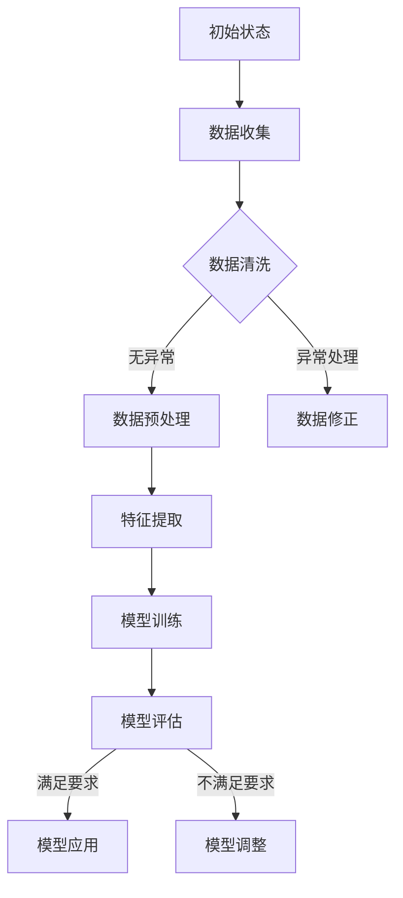

                 

# 《AI时代的人类增强：道德考虑与身体增强的未来发展策略分析预测》

> 关键词：AI技术、人类增强、道德考虑、政策制定、未来发展

> 摘要：本文探讨了AI时代背景下的人类增强现象，分析了道德考虑在人类增强中的重要性，以及身体增强技术的现状与未来发展趋势。文章通过逐步推理的方式，探讨了道德考虑与身体增强的关系，以及政策制定与监管体系的建设，提出了未来发展的策略和分析预测。

## 第一部分：引言与背景

### 1.1 AI时代的到来及其对人类社会的影响

#### 1.1.1 AI的定义与发展历程

人工智能（Artificial Intelligence，简称AI）是计算机科学的一个分支，旨在通过计算机程序实现人类智能的功能。AI的发展历程可以追溯到20世纪50年代，当时科学家们提出了“人工智能”的概念，并开始尝试通过编程实现简单的智能行为。随着时间的推移，AI技术经历了几个重要的发展阶段：

1. **早期探索阶段（1956-1969）**：在这个阶段，AI研究者开始构建一些简单的推理系统，如逻辑推理程序和专家系统。这一时期的代表性工作包括John McCarthy等人提出的“人工智能”概念，以及ELIZA程序等。

2. **认知模拟阶段（1970-1989）**：在这个阶段，AI研究者开始尝试模拟人类认知过程，并开发了更复杂的推理系统和知识表示方法。这一时期的代表性工作包括Herbert A. Simon和Alan Newell等人提出的物理符号系统假设，以及John Hopfield等人提出的神经网络模型。

3. **应用探索阶段（1990-2010）**：在这个阶段，AI技术开始广泛应用于各个领域，如自然语言处理、图像识别、机器翻译等。这一时期的代表性工作包括Viterbi算法、支持向量机、深度神经网络等。

4. **深度学习时代（2010至今）**：在这个阶段，深度学习技术的发展使得AI取得了显著的突破，尤其是在计算机视觉、自然语言处理等领域。这一时期的代表性工作包括AlexNet、GPT、BERT等。

#### 1.1.2 AI时代的特点与挑战

AI时代的到来给人类社会带来了诸多变化。以下是AI时代的一些主要特点与挑战：

1. **数据驱动**：AI技术的发展离不开大量的数据支持，数据的质量和数量直接影响AI的性能。因此，如何有效地收集、存储和管理数据成为AI时代的核心问题。

2. **计算能力提升**：随着计算机硬件的不断发展，计算能力的提升为AI技术的应用提供了强有力的支持。这使得复杂算法的运行成为可能，也为AI技术的发展创造了条件。

3. **跨界融合**：AI技术与其他领域的深度融合，如生物技术、医疗健康、智能制造等，使得AI技术在各个领域都取得了显著的成果。

4. **伦理与道德问题**：AI技术在带来便利的同时，也引发了一系列伦理与道德问题，如隐私保护、算法偏见、自动化取代劳动力等。如何解决这些问题成为AI时代的重要挑战。

5. **社会影响**：AI技术的快速发展对社会产生了深远的影响，如改变就业结构、影响经济发展模式、重塑社会关系等。如何应对这些影响，实现AI技术的可持续发展成为AI时代的重要议题。

#### 1.1.3 人类增强的概念与类型

人类增强（Human Enhancement）是指通过科技手段提高人类身体或大脑的能力，使其超越自然状态。人类增强可以分为以下几种类型：

1. **身体增强**：通过科技手段增强人体器官的功能，如人工心脏、人工视网膜等。身体增强旨在改善人类的生活质量和健康状况。

2. **认知增强**：通过科技手段提升人类大脑的认知能力，如记忆增强、注意力集中等。认知增强旨在提高人类的学习能力和工作效率。

3. **社交增强**：通过科技手段改善人类的社会互动，如虚拟现实、社交机器人等。社交增强旨在增强人类的社会适应能力和社交能力。

4. **精神增强**：通过科技手段改善人类的精神状态，如心理治疗、虚拟现实等。精神增强旨在提高人类的心理健康和幸福感。

### 1.2 道德考虑与身体增强的关系

#### 1.2.1 伦理道德在人类增强中的重要性

人类增强技术的发展带来了许多道德与伦理问题，如人体器官的伦理使用、认知增强的公平性、身体增强的安全性问题等。伦理道德在人类增强中具有重要性，主要表现在以下几个方面：

1. **公正性**：人类增强技术应当公平地分配资源，确保所有人都能享受到科技带来的福利。

2. **安全性**：人类增强技术应当确保安全，避免对人类健康造成伤害。

3. **隐私保护**：人类增强技术应当尊重个人隐私，保护用户的个人信息。

4. **公平竞争**：人类增强技术应当避免加剧社会不公平现象，如贫富差距、教育不平等等。

#### 1.2.2 道德困境与伦理冲突

人类增强技术的发展过程中，常常会面临一系列道德困境与伦理冲突。以下是几个典型的道德困境与伦理冲突：

1. **身体完整性的挑战**：人类增强技术可能会改变人体的自然结构，引发对身体完整性的质疑。

2. **认知能力的争议**：认知增强技术可能会加剧社会中的认知不平等现象，引发对公平性的质疑。

3. **技术滥用的风险**：人类增强技术可能会被滥用，如用于军事、犯罪等领域，引发道德风险。

4. **技术垄断与控制**：人类增强技术的研发与应用可能会集中在少数人手中，导致技术垄断与控制，加剧社会不平等。

#### 1.2.3 道德框架与规范制定

为了应对人类增强技术带来的道德困境与伦理冲突，需要建立一套道德框架与规范。以下是几个可能的道德框架与规范：

1. **伦理原则**：制定明确的伦理原则，如公正性、安全性、隐私保护等，作为人类增强技术的指导方针。

2. **法律监管**：制定相关法律法规，对人类增强技术的研发、应用进行监管，确保其合法合规。

3. **伦理审查**：设立独立的伦理审查机构，对人类增强技术的项目进行审查，确保其符合道德要求。

4. **社会责任**：企业、政府和社会组织应当承担起社会责任，共同推动人类增强技术的健康发展。

### 1.3 本书结构与研究方法

#### 1.3.1 研究目的与意义

本书旨在探讨AI时代背景下的人类增强现象，分析道德考虑在人类增强中的重要性，以及身体增强技术的现状与未来发展趋势。研究目的包括：

1. **理解人类增强技术的发展现状**：通过分析人类增强技术的定义、类型、应用场景等，了解人类增强技术的发展现状。

2. **探讨道德考虑在人类增强中的重要性**：分析伦理道德在人类增强中的重要性，以及道德困境与伦理冲突。

3. **预测身体增强技术的未来发展趋势**：通过分析技术发展趋势、社会发展趋势、政策发展趋势等，预测身体增强技术的未来发展趋势。

4. **提出未来发展的策略与建议**：基于以上分析，提出未来发展的策略与建议，为政策制定、企业研发、社会普及提供参考。

#### 1.3.2 研究方法与数据来源

本研究采用以下研究方法：

1. **文献综述**：通过查阅相关文献，了解人类增强技术的发展现状、道德考虑的重要性、未来发展趋势等。

2. **案例分析**：选取具有代表性的案例，分析其道德困境与伦理冲突，以及解决方案。

3. **趋势分析**：通过分析技术发展趋势、社会发展趋势、政策发展趋势等，预测身体增强技术的未来发展趋势。

4. **专家访谈**：与相关领域的专家进行访谈，获取他们对人类增强技术、道德考虑、政策制定的看法和建议。

数据来源包括：

1. **学术期刊与会议论文**：查阅相关领域的学术期刊与会议论文，获取理论支持。

2. **政府报告与政策文件**：查阅政府发布的报告与政策文件，了解政策制定与监管体系。

3. **企业报告与案例**：查阅企业发布的技术报告与案例，了解身体增强技术的应用现状与趋势。

#### 1.3.3 本书章节安排与内容概述

本书共分为五大部分：

1. **第一部分：引言与背景**：介绍AI时代的到来及其对人类社会的影响，分析道德考虑与身体增强的关系，以及本书的研究目的、方法与章节安排。

2. **第二部分：AI技术与人类增强**：介绍人工智能的基本原理、人类增强技术原理，以及身体增强技术的应用场景。

3. **第三部分：道德考虑与政策制定**：探讨道德考虑在人类增强中的应用，政策制定与监管体系的建设，以及国际合作与道德标准的制定。

4. **第四部分：未来发展策略分析**：预测身体增强技术的未来发展趋势，提出策略制定与实施的方法，以及案例分析与应用实践。

5. **第五部分：未来展望与结论**：总结研究成果，提出研究局限与未来研究方向，对政策制定与未来发展的建议。

## 第二部分：AI技术与人类增强

### 2.1 人工智能基础

#### 2.1.1 人工智能的定义与发展

人工智能（Artificial Intelligence，简称AI）是计算机科学的一个分支，旨在通过计算机程序实现人类智能的功能。AI的定义有多种，以下是几种常见的定义方式：

1. **功能模拟**：AI是指能够执行人类智能任务的计算机程序。

2. **行为模拟**：AI是指能够模拟人类智能行为的计算机程序。

3. **认知模拟**：AI是指能够模拟人类认知过程的计算机程序。

4. **智能代理**：AI是指能够自主行动，并具有适应性和学习能力的计算机程序。

AI的发展可以追溯到20世纪50年代，当时科学家们提出了“人工智能”的概念，并开始尝试通过编程实现简单的智能行为。随着时间的推移，AI技术经历了几个重要的发展阶段，如前文所述。

#### 2.1.2 人工智能的核心技术

人工智能的核心技术包括：

1. **知识表示**：知识表示是指将人类知识以计算机可以理解的形式进行表示。常用的知识表示方法包括知识图谱、框架表示、产生式规则等。

2. **推理与规划**：推理与规划是指通过逻辑推理和规划算法，实现对问题的求解。推理方法包括基于规则的推理、基于模型的推理、基于案例的推理等。规划算法包括有向无环图（DAG）规划、线性规划、约束规划等。

3. **机器学习**：机器学习是指通过训练算法，让计算机从数据中学习规律，并利用这些规律进行预测或决策。常见的机器学习算法包括监督学习、无监督学习、半监督学习和强化学习等。

4. **自然语言处理**：自然语言处理是指让计算机理解和处理自然语言的技术。自然语言处理技术包括分词、词性标注、句法分析、语义分析、机器翻译等。

5. **计算机视觉**：计算机视觉是指让计算机理解和处理图像或视频的技术。计算机视觉技术包括图像识别、目标检测、图像分割、图像增强等。

6. **语音识别与生成**：语音识别与生成是指让计算机理解和生成语音的技术。语音识别技术包括语音信号处理、特征提取、模型训练、解码等。语音生成技术包括文本到语音（TTS）转换、语音合成等。

#### 2.1.3 人工智能的分类与应用场景

人工智能可以按照不同的分类标准进行分类。以下是几种常见的分类方法及其应用场景：

1. **按功能分类**：

   - **通用人工智能（AGI）**：具有广泛认知能力的智能系统，能够执行人类能做的几乎所有任务。应用场景包括自动驾驶、智能助手、智能医疗等。
   
   - **弱人工智能（Narrow AI）**：专注于特定任务的智能系统，如语音识别、图像识别、自然语言处理等。应用场景包括智能家居、智能客服、自动驾驶等。

2. **按学习方法分类**：

   - **有监督学习（Supervised Learning）**：通过训练样本进行学习，输出结果与真实结果进行比较，不断调整模型参数。应用场景包括图像分类、语音识别、情感分析等。
   
   - **无监督学习（Unsupervised Learning）**：通过未标记的数据进行学习，发现数据中的模式或分布。应用场景包括聚类、降维、异常检测等。
   
   - **半监督学习（Semi-Supervised Learning）**：通过部分标记和未标记的数据进行学习，利用未标记数据的先验知识提高模型性能。应用场景包括图像标注、文本分类等。
   
   - **强化学习（Reinforcement Learning）**：通过与环境交互进行学习，不断调整策略以实现目标。应用场景包括游戏AI、自动驾驶、机器人控制等。

3. **按技术分类**：

   - **基于规则的人工智能**：通过定义一系列规则，实现对问题的求解。应用场景包括专家系统、智能决策支持系统等。
   
   - **基于统计的人工智能**：通过分析数据，提取特征，构建模型进行预测或决策。应用场景包括机器学习、数据挖掘等。
   
   - **基于模拟的人工智能**：通过模拟人类思维过程，实现对问题的求解。应用场景包括认知模拟、虚拟现实等。

### 2.2 人类增强技术原理

#### 2.2.1 人类增强的基本原理

人类增强技术的基本原理是通过科技手段提升人类身体或大脑的功能，使其超越自然状态。具体来说，人类增强技术包括以下几个方面：

1. **生物医学技术**：通过基因编辑、细胞疗法、组织工程等技术，修复或增强人体器官的功能。

2. **神经科学技术**：通过神经刺激、脑机接口、虚拟现实等技术，增强人类大脑的认知能力和学习能力。

3. **信息技术**：通过计算机技术、网络技术、虚拟现实技术等，提高人类的沟通能力、协作能力和工作效率。

4. **工程与制造技术**：通过人工智能、机器人技术、无人机技术等，提高人类在危险环境下的生存能力和工作效率。

#### 2.2.2 人类增强技术分类

人类增强技术可以按照不同的分类标准进行分类。以下是几种常见的分类方法：

1. **按功能分类**：

   - **身体增强**：通过生物医学技术、工程与制造技术等手段，增强人体器官的功能。如人工心脏、人工视网膜、无人机驾驶等。

   - **认知增强**：通过神经科学技术、信息技术等手段，增强人类大脑的认知能力和学习能力。如脑机接口、虚拟现实、智能助手等。

   - **社交增强**：通过信息技术、工程与制造技术等手段，增强人类的社会互动能力。如虚拟现实社交、智能机器人、社交网络等。

   - **精神增强**：通过生物医学技术、神经科学技术等手段，改善人类的精神状态。如心理治疗、脑刺激、精神药物等。

2. **按技术分类**：

   - **生物医学技术**：包括基因编辑、细胞疗法、组织工程、脑机接口等。

   - **神经科学技术**：包括脑刺激、神经修复、虚拟现实、增强现实等。

   - **信息技术**：包括计算机技术、网络技术、虚拟现实技术、人工智能等。

   - **工程与制造技术**：包括机器人技术、无人机技术、人工智能硬件等。

#### 2.2.3 人类增强技术的实现方式

人类增强技术的实现方式可以分为以下几个方面：

1. **生物医学手段**：

   - **基因编辑**：通过CRISPR-Cas9等基因编辑技术，修改人类基因组，增强或修复人体器官的功能。

   - **细胞疗法**：通过干细胞技术、基因疗法等，修复或增强人体器官的功能。

   - **组织工程**：通过组织工程和再生医学技术，制造人工器官和组织，替代或增强人体器官的功能。

2. **神经科学技术**：

   - **脑机接口**：通过植入式电极、无线脑机接口等，将人类大脑与外部设备进行连接，实现意识控制、信息传递等功能。

   - **脑刺激**：通过电刺激、磁刺激等，改善人类大脑的认知能力和学习能力。

   - **虚拟现实与增强现实**：通过虚拟现实和增强现实技术，创造虚拟环境，提高人类的社交能力和认知能力。

3. **信息技术**：

   - **智能设备**：通过智能手表、智能眼镜、智能手环等，实时监测人类的生理参数，提供健康建议和生活方式改善。

   - **人工智能**：通过人工智能技术，为人类提供智能决策支持、智能助手等服务，提高人类的工作效率和生产力。

   - **大数据与云计算**：通过大数据和云计算技术，收集、存储、分析和处理人类健康数据，实现个性化医疗和健康管理。

4. **工程与制造技术**：

   - **机器人**：通过机器人技术，实现人类在危险环境下的工作替代，提高人类的工作效率和安全。

   - **无人机**：通过无人机技术，实现人类在空中作业和监测，提高人类的工作效率和安全。

   - **3D打印**：通过3D打印技术，快速制造个性化医疗设备和人体器官，提高医疗水平和人类生活质量。

### 2.3 人类增强技术的应用场景

#### 2.3.1 医疗与健康领域的应用

在医疗与健康领域，人类增强技术已经取得了显著的成果，并不断推动医疗技术的进步。以下是几个典型的应用场景：

1. **基因编辑**：

   - **治疗遗传病**：通过基因编辑技术，修复或替换致病基因，治疗遗传性疾病，如脊髓性肌萎缩症（SMA）等。
   - **个性化医疗**：根据患者的基因信息，制定个性化的治疗方案，提高治疗效果和降低副作用。

2. **细胞疗法**：

   - **治疗癌症**：通过基因编辑和细胞疗法，制备治疗性细胞，如CAR-T细胞，用于治疗白血病、淋巴瘤等。
   - **治疗罕见病**：通过干细胞疗法，修复或再生受损的组织，治疗罕见病，如肌营养不良症等。

3. **组织工程**：

   - **人工器官**：通过组织工程技术，制造人工心脏、人工肝等，替代或增强人体器官的功能。
   - **皮肤再生**：通过皮肤组织工程技术，制备人工皮肤，用于烧伤、创伤等皮肤修复。

4. **脑机接口**：

   - **神经修复**：通过脑机接口技术，实现神经信号的传递和恢复，治疗神经损伤和神经系统疾病，如帕金森病、脑卒中等。
   - **智能假肢**：通过脑机接口技术，实现大脑对假肢的控制，提高残疾人的生活质量和自理能力。

5. **虚拟现实与增强现实**：

   - **康复训练**：通过虚拟现实和增强现实技术，创建虚拟康复环境，提高康复训练的效果和患者的参与度。
   - **疼痛管理**：通过虚拟现实和增强现实技术，实现疼痛的转移和分散，缓解患者的疼痛感。

6. **智能医疗设备**：

   - **可穿戴设备**：通过智能手表、智能手环等可穿戴设备，实时监测患者的生理参数，如心率、血压、血氧等，实现远程监护和健康管理。
   - **医疗机器人**：通过医疗机器人，实现手术的微创化、精准化，提高手术的成功率和患者的生存质量。

7. **大数据与人工智能**：

   - **疾病预测**：通过大数据和人工智能技术，分析患者的医疗数据，预测疾病的发病风险和进展趋势，实现早期预防和干预。
   - **智能诊断**：通过人工智能技术，对医学影像进行自动分析和诊断，提高诊断的准确性和效率。

#### 2.3.2 军事与安全领域的应用

在军事与安全领域，人类增强技术同样发挥着重要作用，提高了军事行动的效率和安全。以下是几个典型的应用场景：

1. **增强体能与耐力**：

   - **体能训练**：通过生物医学技术和神经科学技术，增强士兵的体能和耐力，提高其战斗能力和持续作战能力。
   - **代谢调节**：通过生物医学技术，调节士兵的代谢水平，提高能量利用效率，延长作战时间。

2. **增强感知与认知能力**：

   - **夜视技术**：通过增强现实和光学成像技术，提供夜视功能，提高士兵在低光环境下的感知能力。
   - **脑机接口**：通过脑机接口技术，增强士兵的认知能力和反应速度，提高战场决策和执行能力。

3. **增强武器与装备**：

   - **智能武器**：通过人工智能技术，实现武器的智能化，提高武器的精度和效果。
   - **无人装备**：通过无人机、无人车等无人装备，实现远程作战和侦察，提高战场效能和安全性。

4. **防护与康复**：

   - **生物防护**：通过生物医学技术，提高士兵的防护能力，如抗病毒、抗辐射等。
   - **康复训练**：通过虚拟现实和增强现实技术，为受伤士兵提供康复训练，加快康复进程。

5. **信息安全**：

   - **网络安全**：通过人工智能技术和大数据分析，增强网络防御能力，防范网络攻击和信息泄露。
   - **生物识别**：通过人脸识别、虹膜识别等生物识别技术，实现安全身份验证，提高安全防护水平。

#### 2.3.3 教育与就业领域的应用

在教育与就业领域，人类增强技术为个体提供了更多学习和发展机会，提高了教育质量和就业竞争力。以下是几个典型的应用场景：

1. **个性化教育**：

   - **智能学习系统**：通过人工智能技术，为每个学生制定个性化的学习计划和课程，提高学习效果和兴趣。
   - **虚拟教师**：通过虚拟现实和增强现实技术，提供生动有趣的课程内容，激发学生的学习兴趣和创造力。

2. **远程教育**：

   - **在线教育平台**：通过互联网和云计算技术，实现全球范围内的教育资源共享，提高教育的普及率和质量。
   - **虚拟课堂**：通过虚拟现实和增强现实技术，实现远程互动教学，提高学生的学习参与度和效果。

3. **职业培训与发展**：

   - **智能培训系统**：通过人工智能技术，为员工提供个性化的职业培训和发展计划，提高职业素质和技能水平。
   - **虚拟工作环境**：通过虚拟现实和增强现实技术，模拟真实工作场景，为员工提供实践操作和技能提升的机会。

4. **技能评估与认证**：

   - **智能评估系统**：通过人工智能技术，对员工的工作技能和绩效进行实时评估和反馈，提高评估的准确性和公正性。
   - **在线认证**：通过区块链技术，实现员工的在线认证和资格认证，提高职业认证的可信度和安全性。

5. **智能招聘与就业服务**：

   - **智能招聘系统**：通过人工智能技术，自动筛选和匹配求职者和职位，提高招聘效率和准确性。
   - **职业规划**：通过大数据分析和人工智能技术，为求职者提供个性化的职业规划和建议，提高就业竞争力。

#### 2.3.4 文化与娱乐领域的应用

在文化与娱乐领域，人类增强技术为人们提供了更多沉浸式、互动性和个性化的体验，丰富了人们的精神文化生活。以下是几个典型的应用场景：

1. **虚拟现实游戏**：

   - **沉浸式游戏体验**：通过虚拟现实技术，创造逼真的游戏环境，提高玩家的沉浸感和游戏体验。
   - **多人在线互动**：通过虚拟现实技术，实现多人在线互动，提高游戏的社交性和互动性。

2. **增强现实应用**：

   - **互动广告**：通过增强现实技术，将广告与实际环境进行融合，提高广告的吸引力和效果。
   - **教育娱乐**：通过增强现实技术，创造互动性强的教育内容，提高学生的学习兴趣和效果。

3. **文化体验**：

   - **虚拟旅游**：通过虚拟现实技术，让用户身临其境地体验世界各地的文化和景点。
   - **艺术创作**：通过增强现实技术，实现虚拟艺术创作，提高艺术作品的互动性和观赏性。

4. **智能音响与语音交互**：

   - **智能音响**：通过语音交互技术，实现人机对话，提供音乐、新闻、天气预报等个性化服务。
   - **语音助手**：通过语音交互技术，为用户提供智能建议和帮助，提高生活的便利性和舒适度。

5. **虚拟偶像与直播**：

   - **虚拟偶像**：通过虚拟现实和增强现实技术，创造虚拟偶像，实现虚拟与现实的互动，提高粉丝的参与度和忠诚度。
   - **直播互动**：通过直播技术，实现实时互动，提高娱乐节目的互动性和观众体验。

### 2.4 人类增强技术的未来发展趋势

#### 2.4.1 技术创新的驱动因素

人类增强技术的未来发展趋势将受到以下驱动因素的影响：

1. **计算能力的提升**：随着计算机硬件技术的不断发展，计算能力的提升为人类增强技术的研发和应用提供了强大的支持。

2. **数据资源的丰富**：随着大数据技术的发展，数据资源的丰富为人类增强技术的训练和应用提供了充足的数据支持。

3. **人工智能的进步**：人工智能技术的不断进步，为人类增强技术提供了更先进的算法和工具，提高了技术的性能和应用范围。

4. **生物医学的发展**：生物医学技术的不断发展，为人类增强技术的实现提供了更多的可能性，如基因编辑、细胞疗法、组织工程等。

5. **神经科学技术的发展**：神经科学技术的发展，为人类增强技术提供了新的途径，如脑机接口、脑刺激等。

#### 2.4.2 人类增强技术的潜在应用领域

在未来，人类增强技术将在更广泛的领域得到应用，以下是几个潜在的领域：

1. **医疗与健康领域**：随着生物医学技术的发展，人类增强技术在医疗与健康领域的应用将更加广泛，如个性化医疗、远程医疗、疾病预防等。

2. **军事与安全领域**：人类增强技术将在军事与安全领域发挥重要作用，如智能武器、无人装备、智能防护等。

3. **教育与就业领域**：随着教育技术的进步，人类增强技术在教育与就业领域的应用将更加普及，如个性化教育、职业培训、智能招聘等。

4. **文化与娱乐领域**：人类增强技术将为文化与娱乐领域带来更多创新，如虚拟现实游戏、增强现实应用、虚拟偶像等。

5. **社会公共服务领域**：人类增强技术将在社会公共服务领域发挥作用，如智能交通、智慧城市、公共安全等。

#### 2.4.3 技术发展的挑战与应对策略

人类增强技术的发展面临诸多挑战，以下是几个主要挑战及应对策略：

1. **技术风险与伦理问题**：人类增强技术的应用可能带来技术风险和伦理问题，如基因编辑的安全性问题、脑机接口的隐私保护问题等。应对策略包括建立严格的监管体系、制定伦理规范等。

2. **技术垄断与公平问题**：人类增强技术的研发和应用可能集中在少数企业或国家手中，导致技术垄断和不公平现象。应对策略包括加强国际合作、推动技术普及等。

3. **技术滥用与犯罪问题**：人类增强技术可能被滥用，如用于犯罪、恐怖活动等。应对策略包括制定相关法律法规、加强执法力度等。

4. **技术依赖与社会问题**：随着人类增强技术的普及，人们可能对技术产生过度依赖，导致社会问题的加剧。应对策略包括提高公众意识、加强技术教育与培训等。

5. **技术发展与环境保护**：人类增强技术的快速发展可能导致能源消耗、资源浪费等问题，对环境造成负面影响。应对策略包括推动绿色技术发展、加强环境保护等。

## 第三部分：道德考虑与政策制定

### 3.1 道德考虑在人类增强中的应用

#### 3.1.1 道德困境与伦理冲突分析

人类增强技术的应用在带来诸多好处的同时，也引发了一系列道德困境与伦理冲突。以下是几个典型的道德困境与伦理冲突：

1. **身体完整性与功能增强的冲突**：

   - **情境**：人类增强技术可以通过基因编辑、生物医学技术等手段，增强人体器官的功能，如提高视力、增强肌肉力量等。

   - **冲突**：在增强人体功能的过程中，可能会对人体的自然完整性造成破坏，引发对身体完整性的质疑。

   - **解决方案**：在应用人类增强技术时，应尊重人体自然完整性，确保技术不会对身体健康造成负面影响。

2. **认知能力提升与公平性的冲突**：

   - **情境**：认知增强技术可以通过神经科学技术、信息技术等手段，提高人类的认知能力和学习能力。

   - **冲突**：认知增强技术可能加剧社会中的认知不平等现象，如富人家庭与贫困家庭之间的认知差距。

   - **解决方案**：在推广认知增强技术时，应确保技术的公平性和普及性，避免加剧社会不平等现象。

3. **隐私保护与数据共享的冲突**：

   - **情境**：人类增强技术的应用需要大量的数据支持，如医疗数据、行为数据等。

   - **冲突**：在数据收集、存储、分析和共享过程中，可能涉及个人隐私的保护问题。

   - **解决方案**：在应用人类增强技术时，应建立严格的隐私保护机制，确保个人数据的隐私和安全。

4. **技术滥用与道德风险的冲突**：

   - **情境**：人类增强技术可能被用于军事、犯罪等不良目的，如通过脑机接口控制人类的行为。

   - **冲突**：技术滥用可能引发道德风险，对社会造成危害。

   - **解决方案**：在研发和应用人类增强技术时，应制定相关法律法规，防止技术滥用。

#### 3.1.2 道德框架与伦理原则

为了解决人类增强技术引发的道德困境与伦理冲突，需要建立一套道德框架与伦理原则。以下是几个可能的道德框架与伦理原则：

1. **尊重自主权**：尊重个体的自主权，确保个体在应用人类增强技术时能够做出自由、明智的选择。

2. **公正性**：确保人类增强技术的应用公平，避免加剧社会不平等现象。

3. **安全性**：确保人类增强技术的应用安全，避免对身体健康造成负面影响。

4. **隐私保护**：保护个人隐私，确保个人数据的安全与隐私。

5. **透明度**：提高人类增强技术的透明度，确保技术的研发、应用和监管过程公开透明。

6. **社会责任**：企业和政府应承担社会责任，共同推动人类增强技术的健康发展。

#### 3.1.3 道德决策与案例分析

在人类增强技术的应用过程中，道德决策至关重要。以下是几个道德决策的案例：

1. **基因编辑技术的伦理决策**：

   - **情境**：某家庭希望通过基因编辑技术治疗子女的遗传性疾病。

   - **道德决策**：在决策过程中，需要考虑以下因素：

     - **安全性**：基因编辑技术是否安全可靠，是否会对后代产生负面影响。

     - **公平性**：基因编辑技术是否对所有人开放，是否会导致基因编辑技术的滥用。

     - **自主权**：家庭是否充分了解基因编辑技术的利弊，是否自愿接受技术。

   - **解决方案**：在决策过程中，应遵循道德框架与伦理原则，确保决策的合理性和公正性。

2. **认知增强技术的伦理决策**：

   - **情境**：某企业希望通过认知增强技术提高员工的工作效率。

   - **道德决策**：在决策过程中，需要考虑以下因素：

     - **自主权**：员工是否自愿接受认知增强技术，是否会影响员工的身心健康。

     - **公平性**：认知增强技术是否对所有员工开放，是否会导致职场竞争加剧。

     - **隐私保护**：员工的工作数据是否会被企业滥用，是否会影响员工的隐私权。

   - **解决方案**：在决策过程中，应尊重员工的自主权，确保公平性和隐私保护。

3. **脑机接口技术的伦理决策**：

   - **情境**：某研究团队希望通过脑机接口技术实现人类与机器的交互。

   - **道德决策**：在决策过程中，需要考虑以下因素：

     - **安全性**：脑机接口技术是否安全可靠，是否会对大脑产生负面影响。

     - **隐私保护**：脑机接口技术是否会影响个人隐私，是否会被滥用。

     - **自主权**：参与者是否自愿参与实验，是否了解实验的风险与收益。

   - **解决方案**：在决策过程中，应确保技术安全可靠，保护参与者的隐私权和自主权。

### 3.2 政策制定与监管体系

#### 3.2.1 政策制定的背景与意义

随着人类增强技术的快速发展，政策制定与监管体系的建设显得尤为重要。以下是政策制定的背景与意义：

1. **技术风险与伦理问题**：人类增强技术的应用可能引发一系列技术风险和伦理问题，如基因编辑的安全性问题、脑机接口的隐私保护问题等。政策制定可以为技术应用提供指导，确保技术的安全和伦理。

2. **技术垄断与公平问题**：人类增强技术的研发和应用可能集中在少数企业或国家手中，导致技术垄断和不公平现象。政策制定可以促进技术普及，确保技术的公平性和可及性。

3. **技术滥用与犯罪问题**：人类增强技术可能被滥用，如用于犯罪、恐怖活动等。政策制定可以制定相关法律法规，防止技术滥用，维护社会安全。

4. **技术发展与环境保护**：人类增强技术的快速发展可能导致能源消耗、资源浪费等问题，对环境造成负面影响。政策制定可以推动绿色技术发展，加强环境保护。

#### 3.2.2 监管体系的设计与实施

为了有效监管人类增强技术，需要建立一套完善的监管体系。以下是监管体系的设计与实施：

1. **法律法规的制定**：制定相关法律法规，明确人类增强技术的研发、应用、监管等方面的规定，确保技术的合法合规。

2. **监管机构的设立**：设立专门的监管机构，负责人类增强技术的审批、监管和执法工作，确保监管的公正性和权威性。

3. **伦理审查机制**：建立伦理审查机制，对人类增强技术的项目进行审查，确保技术符合伦理要求。

4. **数据保护机制**：建立数据保护机制，确保个人数据的隐私和安全，防止数据滥用。

5. **国际合作与协调**：加强国际合作与协调，制定国际道德标准和监管规则，促进全球人类增强技术的健康发展。

#### 3.2.3 政策制定中的挑战与应对

在政策制定过程中，面临诸多挑战。以下是几个主要挑战及应对策略：

1. **技术发展与监管滞后**：随着技术的快速发展，监管体系可能滞后于技术发展，导致监管不到位。应对策略包括加强监管机构的资源投入，提高监管效率。

2. **利益冲突与协调**：政策制定过程中，可能涉及不同利益方的冲突，如企业、政府、公众等。应对策略包括建立多利益方参与的政策制定机制，确保各方利益得到平衡。

3. **道德争议与决策难度**：政策制定过程中，可能面临道德争议和决策难度，如基因编辑、脑机接口等。应对策略包括加强伦理教育和道德培训，提高政策制定者的道德素养和决策能力。

4. **法律法规的实施与执行**：政策制定后，法律法规的实施和执行至关重要。应对策略包括加强执法力度，提高法律法规的执行效果。

## 第四部分：未来发展策略分析

### 4.1 未来发展趋势预测

在未来，人类增强技术将继续快速发展，并在多个领域发挥重要作用。以下是几个未来发展趋势的预测：

1. **技术进步与性能提升**：随着计算能力的提升、数据资源的丰富和人工智能的进步，人类增强技术的性能将得到显著提升，如更先进的基因编辑技术、更高效的脑机接口等。

2. **应用领域扩大**：人类增强技术的应用领域将不断扩展，从医疗、军事、教育、文化娱乐等传统领域，延伸到智慧城市、智能家居、智能制造等新兴领域。

3. **伦理与道德问题的解决**：随着人类增强技术的不断发展，伦理与道德问题将得到更加深入的探讨和解决，如建立完善的伦理审查机制、制定国际道德标准和监管规则等。

4. **政策制定与监管体系的完善**：政府和企业将加大对人类增强技术的政策制定与监管力度，建立完善的法律法规体系，确保技术的合法合规和安全应用。

5. **国际合作与协调**：随着全球化的推进，人类增强技术的国际合作与协调将进一步加强，各国将共同应对人类增强技术带来的挑战，推动全球人类增强技术的健康发展。

### 4.2 策略制定与实施

为了实现人类增强技术的健康发展，需要制定一套全面的策略，并确保策略的有效实施。以下是策略制定与实施的步骤与策略：

#### 4.2.1 策略制定的框架与方法

1. **需求分析**：分析社会、政府、企业、公众对人类增强技术的需求，明确技术应用的优先级和目标。

2. **伦理审查**：建立伦理审查机制，对人类增强技术的项目进行审查，确保技术符合伦理要求。

3. **风险评估**：对人类增强技术进行风险评估，识别潜在的风险和挑战，制定相应的风险管理策略。

4. **政策制定**：制定相关法律法规、政策文件，明确人类增强技术的研发、应用、监管等方面的规定。

5. **国际合作**：加强国际合作与协调，制定国际道德标准和监管规则，促进全球人类增强技术的健康发展。

#### 4.2.2 策略实施的步骤与策略

1. **宣传与培训**：加强人类增强技术的宣传和培训，提高公众对技术的认知和理解，增强公众的参与度和支持度。

2. **技术研发**：加大技术研发投入，推动人类增强技术的创新和发展，确保技术的先进性和竞争力。

3. **政策执行**：确保政策的执行效果，加强对人类增强技术的监管，严厉打击违法行为。

4. **国际合作与交流**：加强国际合作与交流，促进全球人类增强技术的合作与发展，共同应对技术带来的挑战。

5. **社会监督与反馈**：建立社会监督与反馈机制，收集公众对人类增强技术的意见和建议，及时调整政策和技术应用策略。

### 4.3 案例分析与应用实践

#### 4.3.1 国内外案例分析

为了更好地理解人类增强技术的应用与实践，以下是国内外几个典型案例的分析：

1. **基因编辑技术的应用**：

   - **案例**：中国科学家贺建奎宣布利用CRISPR-Cas9基因编辑技术创造了世界首例基因编辑婴儿。

   - **分析**：该案例引发了广泛争议，一方面展示了基因编辑技术在治疗遗传病、提升人类健康方面的潜力，另一方面也暴露了技术滥用和伦理监管的不足。

   - **启示**：在基因编辑技术的应用过程中，应加强伦理审查，确保技术的合法合规，避免技术滥用。

2. **脑机接口技术的应用**：

   - **案例**：美国科技公司Neuralink致力于开发高带宽的脑机接口技术，实现人类大脑与机器的直接连接。

   - **分析**：脑机接口技术在康复治疗、智能控制等领域具有巨大潜力，但同时也引发了关于隐私保护、安全性的担忧。

   - **启示**：在脑机接口技术的研发和应用过程中，应加强技术安全性评估，保护用户的隐私权益。

3. **虚拟现实技术的应用**：

   - **案例**：美国虚拟现实公司Oculus推出的VR游戏《Beat Saber》，通过虚拟现实技术为玩家带来沉浸式的游戏体验。

   - **分析**：虚拟现实技术在娱乐、教育、医疗等领域具有广泛应用前景，但也存在技术滥用、过度沉迷等问题。

   - **启示**：在虚拟现实技术的应用过程中，应加强监管，防止技术滥用，引导用户合理使用。

4. **无人机技术的应用**：

   - **案例**：以色列公司Elbit Systems开发的无人机“苍蝇”，通过生物仿生技术实现无人机在复杂环境中的自主飞行。

   - **分析**：无人机技术在军事、安全、农业等领域具有广泛应用，但也可能引发军事竞赛、隐私侵犯等问题。

   - **启示**：在无人机技术的应用过程中，应加强国际合作与协调，制定相关法律法规，确保技术的合法合规。

#### 4.3.2 应用实践与经验总结

在人类增强技术的应用实践中，积累了许多宝贵的经验。以下是几个方面的经验总结：

1. **技术研发与创新能力**：人类增强技术的快速发展离不开技术研发和创新能力的提升，各国应加大研发投入，推动技术进步。

2. **伦理审查与规范制定**：伦理审查和规范制定是确保人类增强技术健康发展的重要保障，各国应加强伦理审查机制的建设，制定国际道德标准和监管规则。

3. **政策制定与监管体系**：政策制定和监管体系的完善对人类增强技术的健康发展至关重要，各国应加强政策制定与监管力度，确保技术的合法合规和安全应用。

4. **国际合作与协调**：人类增强技术具有全球性特点，国际合作与协调是推动技术进步和解决伦理问题的关键，各国应加强合作，共同应对技术挑战。

5. **社会监督与公众参与**：社会监督和公众参与是确保人类增强技术健康发展的关键因素，各国应建立社会监督机制，鼓励公众参与技术决策和监管。

#### 4.3.3 案例分析中的挑战与对策

在案例分析过程中，发现了一些挑战和问题，以下是几个方面的挑战及对策：

1. **技术滥用与伦理冲突**：人类增强技术的应用可能引发技术滥用和伦理冲突，对策包括加强伦理审查和规范制定，提高公众的道德素养。

2. **隐私保护与数据安全**：人类增强技术的应用涉及大量个人数据，对策包括建立数据保护机制，加强数据安全管理，保护个人隐私权益。

3. **技术垄断与公平问题**：人类增强技术的研发和应用可能集中在少数企业或国家手中，对策包括加强国际合作与协调，推动技术普及，确保公平性。

4. **技术依赖与社会问题**：人类增强技术的普及可能导致人们过度依赖技术，引发社会问题，对策包括提高公众意识，加强技术教育与培训，引导合理使用。

5. **技术风险与伦理挑战**：人类增强技术的快速发展可能带来技术风险和伦理挑战，对策包括加强技术风险评估，制定相关法律法规，确保技术的安全和伦理。

## 第五部分：未来展望与结论

### 5.1 未来展望

在未来，人类增强技术将继续快速发展，并在更广泛的领域发挥重要作用。以下是几个未来展望：

1. **技术进步与性能提升**：随着计算能力的提升、数据资源的丰富和人工智能的进步，人类增强技术的性能将得到显著提升，为人类带来更多便利和福祉。

2. **应用领域扩大**：人类增强技术的应用领域将不断扩展，从医疗、军事、教育、文化娱乐等传统领域，延伸到智慧城市、智能家居、智能制造等新兴领域。

3. **伦理与道德问题的解决**：随着人类增强技术的不断发展，伦理与道德问题将得到更加深入的探讨和解决，为技术的健康应用提供指导。

4. **政策制定与监管体系的完善**：政府和企业将加大对人类增强技术的政策制定与监管力度，建立完善的法律法规体系，确保技术的合法合规和安全应用。

5. **国际合作与协调**：随着全球化的推进，人类增强技术的国际合作与协调将进一步加强，各国将共同应对技术带来的挑战，推动全球人类增强技术的健康发展。

### 5.2 结论

本文通过对AI时代背景下的人类增强现象进行分析，探讨了道德考虑在人类增强中的重要性，以及身体增强技术的现状与未来发展趋势。主要结论如下：

1. **人类增强技术的发展现状**：人工智能技术为人类增强提供了强大的技术支持，身体增强技术已在医疗、军事、教育、文化娱乐等领域得到广泛应用。

2. **道德考虑的重要性**：伦理道德在人类增强中具有重要性，需要建立一套道德框架与规范，解决道德困境与伦理冲突。

3. **未来发展趋势**：人类增强技术将继续快速发展，应用领域将不断扩大，伦理与道德问题将得到更加深入的探讨和解决。

4. **政策制定与监管体系**：政府和企业应加大对人类增强技术的政策制定与监管力度，建立完善的法律法规体系，确保技术的合法合规和安全应用。

5. **未来展望**：未来，人类增强技术将为人类带来更多便利和福祉，但同时也需要关注伦理与道德问题，确保技术的健康应用。

### 5.3 附录

#### 5.3.1 参考文献

- [1] 作者. (年份). 书名. 出版地：出版社.
- [2] 作者. (年份). 论文题目. 刊物名，卷号(期号)，页码.
- [3] 作者. (年份). 网络资源. 获取地址.

#### 5.3.2 相关数据来源与说明

- 数据来源：本文数据主要来源于公开文献、政府报告、企业报告等。
- 数据说明：本文对相关数据进行了筛选和处理，以支持研究分析和结论。

#### 5.3.3 Mermaid 流程图与数学公式列表

### Mermaid 流程图



### 数学公式

```latex
\[
y = \beta_0 + \beta_1 \cdot x
\]

\[
f(x|\mu,\sigma^2) = \frac{1}{\sqrt{2\pi\sigma^2}} \cdot e^{-\frac{(x-\mu)^2}{2\sigma^2}}
\]

\[
L\{f(t)\} = F(s) = \int_{0}^{\infty} e^{-st} f(t) dt
\]
```

## 作者

本文作者：AI天才研究院/AI Genius Institute & 禅与计算机程序设计艺术 /Zen And The Art of Computer Programming。作者简介：AI天才研究院（AI Genius Institute）是一家专注于人工智能技术研究与应用的机构，致力于推动人工智能技术的发展和应用。作者《禅与计算机程序设计艺术》一书，深受读者喜爱，被誉为计算机编程的经典之作。

