                 

# AI时代的人类增强：道德、隐私和安全的挑战

关键词：人工智能，人类增强，道德挑战，隐私挑战，安全挑战

摘要：随着人工智能技术的快速发展，人类增强成为了一个热门话题。本文旨在探讨AI时代下人类增强所带来的道德、隐私和安全挑战，并通过具体案例分析提出相应的解决方案。

## 第一部分：AI时代的人类增强概述

### 第1章 AI时代的人类增强概念与背景

#### 1.1 AI时代的人类增强概念

人工智能（AI）时代的人类增强，指的是利用AI技术提升人类的智力、体能、感官等方面的能力，以实现人类潜能的最大化。这种增强既可以是外部的，如穿戴设备、植入物等，也可以是内部的应用，如药物、基因编辑等。

#### 1.2 AI技术对人类生活的影响

AI技术的应用已经深入到人类生活的方方面面，从智能家居、自动驾驶，到医疗诊断、教育辅助，无不体现着AI对人类生活的深刻影响。这些技术的应用，使得人类的工作效率、生活质量得到了显著提升。

#### 1.3 AI增强技术的伦理考量

然而，AI增强技术也引发了一系列伦理问题，如技术的滥用、隐私泄露、不平等问题等。如何在这些挑战中找到平衡，是一个亟待解决的问题。

#### 1.4 AI增强技术的隐私问题

AI增强技术的广泛应用，使得大量的个人数据被收集、存储和使用。这给个人隐私带来了极大的风险。如何在保障技术发展的同时，保护个人隐私，是当前的一个重要议题。

#### 1.5 AI增强技术的安全问题

AI增强技术的安全性也是不可忽视的问题。由于AI系统的高度复杂性和自主性，一旦发生故障或被恶意利用，可能对人类造成严重威胁。因此，保障AI增强技术的安全性至关重要。

## 第二部分：道德挑战

### 第2章 AI增强技术的道德问题

#### 2.1 道德原则与AI增强技术

在AI增强技术的应用过程中，道德原则起到了重要的指导作用。例如，尊重个体自主权、公正公平等原则，都是我们在设计、使用AI增强技术时需要遵循的基本道德原则。

#### 2.2 AI增强技术的不平等问题

AI增强技术的不平等问题主要体现在以下几个方面：

1. **资源分配不均**：AI增强技术的研发和应用需要大量的资金和资源，这可能导致资源分配不均，使得富裕人群更容易获得增强效果，而贫困人群则被排除在外。

2. **技术鸿沟**：不同地区、不同国家之间的技术水平和应用能力存在差异，这可能导致一些地区或国家在AI增强技术上的不平等。

3. **个体差异**：由于个体差异，AI增强技术的效果可能因人而异，这也可能导致一部分人受益，而另一部分人受到不利影响。

#### 2.3 人性丧失与AI增强技术

AI增强技术可能导致人性丧失的问题，主要体现在以下几个方面：

1. **依赖性**：随着AI增强技术的应用，人们可能会对技术产生依赖，从而削弱自身的独立性和自主性。

2. **情感缺失**：AI增强技术可能会取代人类的一些情感表达和互动，导致人与人之间的情感交流减少，从而影响人性的完整性。

3. **道德沦丧**：在某些情况下，AI增强技术可能会被用于不道德的目的，例如，通过操纵他人的感知和认知来达到某种目的，这可能导致道德的沦丧。

#### 2.4 AI增强技术对个体决策的影响

AI增强技术可能会对个体决策产生积极影响，例如，提高决策效率、减少错误等。然而，它也可能带来一些负面影响，如：

1. **依赖性**：个体可能会过度依赖AI增强技术，从而降低自身的决策能力和判断力。

2. **信息过载**：AI增强技术可能会提供大量的信息，导致个体无法有效处理和利用这些信息，从而影响决策的质量。

3. **道德困境**：在某些情况下，AI增强技术可能会使个体面临道德困境，例如，在道德伦理和法律之间做出选择。

## 第三部分：隐私挑战

### 第3章 AI增强技术对隐私的挑战

#### 3.1 隐私权与AI增强技术

隐私权是个人享有的一项基本权利，它保障了个人在信息收集、处理和使用过程中的自主性和安全性。然而，AI增强技术的广泛应用，使得个人隐私面临着前所未有的挑战。

#### 3.2 AI增强技术中的数据收集与使用

AI增强技术通常需要对大量的个人数据进行收集、存储和使用，这可能导致以下问题：

1. **数据泄露**：由于技术漏洞或人为失误，个人数据可能被泄露，从而导致隐私泄露。

2. **滥用数据**：个人数据可能被用于未经授权的目的，例如，商业利益、政治控制等。

3. **数据滥用**：个人数据可能被用于操纵、欺骗个体，影响其决策和行为。

#### 3.3 隐私泄露的风险与防范措施

隐私泄露的风险主要包括以下几个方面：

1. **黑客攻击**：黑客可能通过非法手段获取个人数据，从而侵犯个人隐私。

2. **内部泄露**：组织内部的员工或管理者可能滥用职务之便，泄露个人数据。

3. **技术漏洞**：技术系统的漏洞可能导致个人数据被非法访问或篡改。

为防范隐私泄露风险，可以采取以下措施：

1. **加密技术**：使用加密技术对个人数据进行保护，确保数据在传输和存储过程中的安全性。

2. **访问控制**：实施严格的访问控制策略，确保只有授权人员才能访问敏感数据。

3. **数据脱敏**：对个人数据进行脱敏处理，使其无法被直接识别或分析。

#### 3.4 AI增强技术中的隐私伦理

在AI增强技术的应用过程中，隐私伦理问题是一个重要的考虑因素。以下是一些隐私伦理问题：

1. **知情同意**：个人在进行AI增强技术相关活动前，应充分了解其隐私风险，并明确同意数据收集和使用。

2. **数据最小化**：在数据收集和使用过程中，应遵循数据最小化原则，只收集必要的数据，避免过度收集。

3. **数据安全**：确保个人数据的存储、传输和使用过程的安全，防止数据泄露或滥用。

4. **透明度**：提高AI增强技术系统的透明度，让用户了解其工作原理、数据使用情况等，以便对其进行监督和评价。

## 第四部分：安全挑战

### 第4章 AI增强技术中的安全风险

#### 4.1 AI增强技术的安全隐患

AI增强技术可能面临以下安全隐患：

1. **数据泄露**：由于数据收集和使用过程中存在漏洞，可能导致个人数据泄露。

2. **数据滥用**：个人数据可能被用于未经授权的目的，例如，商业利益、政治控制等。

3. **系统漏洞**：AI增强技术的系统可能存在漏洞，被黑客利用进行攻击。

4. **恶意攻击**：AI增强技术可能被用于恶意目的，例如，网络攻击、虚假信息传播等。

#### 4.2 AI增强技术的防御措施

为防范AI增强技术的安全风险，可以采取以下防御措施：

1. **网络安全**：加强网络安全防护，例如，使用防火墙、入侵检测系统等，防止黑客攻击。

2. **数据加密**：使用加密技术对数据进行保护，确保数据在传输和存储过程中的安全性。

3. **访问控制**：实施严格的访问控制策略，确保只有授权人员才能访问敏感数据。

4. **安全审计**：定期进行安全审计，发现并修复系统漏洞。

5. **用户教育**：提高用户对AI增强技术安全风险的认知，加强安全意识。

#### 4.3 AI增强技术的攻击手段

AI增强技术可能面临以下攻击手段：

1. **社会工程学攻击**：通过欺骗用户，获取其敏感信息。

2. **恶意软件**：通过恶意软件，窃取用户数据或控制AI系统。

3. **网络钓鱼**：通过伪造的网站或邮件，诱骗用户输入敏感信息。

4. **拒绝服务攻击**：通过大量请求，使AI系统无法正常工作。

#### 4.4 AI增强技术的安全管理

AI增强技术的安全管理包括以下几个方面：

1. **安全策略**：制定并实施安全策略，包括数据保护、访问控制、安全审计等。

2. **风险管理**：识别、评估和应对AI增强技术的安全风险。

3. **合规性**：遵守相关法律法规，确保AI增强技术的合规性。

4. **培训与意识提升**：提高员工的安全意识，定期进行安全培训。

5. **应急响应**：制定并实施应急响应计划，以应对可能的安全事件。

## 第五部分：案例分析与解决方案

### 第5章 AI增强技术的道德、隐私和安全案例分析

#### 5.1 案例一：增强记忆技术的道德与隐私问题

增强记忆技术是一种通过药物、设备等方式提高人类记忆能力的AI技术。这种技术的道德问题主要体现在以下几个方面：

1. **记忆篡改**：增强记忆技术可能导致记忆篡改，影响个体的自我认同和真实性。

2. **隐私泄露**：在使用增强记忆技术时，可能涉及大量的个人数据，如个人经历、情感等，这可能导致隐私泄露。

3. **依赖性**：个体可能会过度依赖增强记忆技术，从而削弱自身的记忆能力。

针对这些问题，可以采取以下解决方案：

1. **透明度**：提高增强记忆技术的透明度，让用户了解其工作原理、可能的风险等。

2. **知情同意**：在使用增强记忆技术前，应充分告知用户其可能的风险和依赖性，并获得其明确同意。

3. **隐私保护**：加强个人数据的保护，防止数据泄露和滥用。

#### 5.2 案例二：增强决策能力的AI系统安全性问题

增强决策能力的AI系统是一种通过分析数据、预测结果等方式，提高个体决策效率的AI技术。这种技术的安全风险主要体现在以下几个方面：

1. **数据泄露**：AI系统可能涉及大量的个人数据，如财务信息、健康记录等，这可能导致隐私泄露。

2. **恶意攻击**：AI系统可能被黑客攻击，用于操纵、欺骗个体。

3. **系统漏洞**：AI系统可能存在漏洞，被黑客利用进行攻击。

针对这些问题，可以采取以下解决方案：

1. **数据加密**：对AI系统涉及的个人数据进行加密，确保数据在传输和存储过程中的安全性。

2. **网络安全**：加强AI系统的网络安全防护，防止黑客攻击。

3. **系统审计**：定期进行AI系统的安全审计，发现并修复漏洞。

#### 5.3 案例三：增强工作效率的AI工具隐私风险

增强工作效率的AI工具是一种通过自动化、智能化的方式提高工作效率的AI技术。这种技术的隐私风险主要体现在以下几个方面：

1. **数据收集**：AI工具可能收集大量的个人数据，如工作记录、通讯记录等，这可能导致隐私泄露。

2. **滥用数据**：AI工具可能被用于监控、操纵个体，影响其隐私。

3. **依赖性**：个体可能会过度依赖AI工具，从而削弱自身的效率和能力。

针对这些问题，可以采取以下解决方案：

1. **数据最小化**：在AI工具的设计和使用过程中，遵循数据最小化原则，只收集必要的数据。

2. **隐私保护**：加强AI工具的隐私保护措施，防止数据滥用和泄露。

3. **用户教育**：提高用户对AI工具隐私风险的认知，加强安全意识。

#### 5.4 案例四：增强医疗诊断的AI系统安全性

增强医疗诊断的AI系统是一种通过分析医疗数据、预测疾病等方式，提高医疗诊断效率的AI技术。这种技术的安全风险主要体现在以下几个方面：

1. **数据准确性**：AI系统的诊断结果可能受到数据准确性、模型质量等因素的影响，导致诊断错误。

2. **数据泄露**：AI系统可能涉及大量的医疗数据，如个人病史、诊断结果等，这可能导致隐私泄露。

3. **系统漏洞**：AI系统可能存在漏洞，被黑客利用进行攻击。

针对这些问题，可以采取以下解决方案：

1. **数据验证**：确保AI系统输入的数据准确性和完整性。

2. **数据加密**：对AI系统涉及的医疗数据进行加密，确保数据在传输和存储过程中的安全性。

3. **系统审计**：定期进行AI系统的安全审计，发现并修复漏洞。

## 第六部分：AI增强技术的道德、隐私和安全解决方案

#### 第6章 AI增强技术的道德、隐私和安全解决方案

#### 6.1 道德规范与AI增强技术

在AI增强技术的应用过程中，道德规范起到了重要的指导作用。以下是一些道德规范的建议：

1. **尊重个体自主权**：在设计、使用AI增强技术时，应尊重个体的自主权，避免过度干预或操纵个体的行为和决策。

2. **公正公平**：确保AI增强技术的不平等问题，避免技术滥用导致的不公平现象。

3. **伦理审查**：对AI增强技术的研发和应用进行伦理审查，确保其符合伦理标准。

#### 6.2 隐私保护策略与措施

为保护个人隐私，可以采取以下策略和措施：

1. **数据最小化**：在AI增强技术的数据收集和使用过程中，遵循数据最小化原则，只收集必要的数据。

2. **隐私保护机制**：在设计AI增强技术时，加入隐私保护机制，如数据加密、匿名化处理等。

3. **透明度**：提高AI增强技术的透明度，让用户了解其数据收集和使用情况，以便进行监督和评价。

4. **知情同意**：在用户使用AI增强技术前，充分告知其隐私风险，并获取其明确同意。

#### 6.3 安全风险管理框架

为保障AI增强技术的安全性，可以建立以下风险管理框架：

1. **风险评估**：定期进行AI增强技术的风险评估，识别潜在的安全风险。

2. **安全策略**：制定并实施安全策略，包括数据保护、访问控制、安全审计等。

3. **应急响应**：制定并实施应急响应计划，以应对可能的安全事件。

4. **持续改进**：根据安全评估结果和应急响应情况，持续改进AI增强技术的安全性。

#### 6.4 实施与监管机制

为有效实施和监管AI增强技术，可以采取以下措施：

1. **法律法规**：建立健全的法律法规体系，规范AI增强技术的研发、应用和监管。

2. **政府监管**：加强对AI增强技术的监管，确保其符合法律法规和伦理标准。

3. **行业自律**：推动行业自律，建立行业规范和标准，提高AI增强技术的质量和安全性。

4. **公众参与**：鼓励公众参与AI增强技术的讨论和决策，提高透明度和公信力。

## 第七部分：未来展望

### 第7章 AI增强技术的未来发展趋势

#### 7.1 AI增强技术的未来发展方向

AI增强技术的未来发展可能包括以下几个方面：

1. **技术进步**：随着AI技术的不断进步，AI增强技术的性能和效果将得到进一步提升。

2. **多样化应用**：AI增强技术将在更多领域得到应用，如教育、医疗、娱乐等。

3. **个性化定制**：AI增强技术将更加注重个性化定制，以满足个体需求。

4. **人机协同**：人与AI的协同将更加紧密，AI将成为人类的得力助手。

#### 7.2 道德、隐私和安全问题的未来挑战

随着AI增强技术的快速发展，道德、隐私和安全问题也将面临新的挑战：

1. **技术滥用**：AI增强技术可能被用于不正当目的，如操纵选举、网络攻击等。

2. **隐私泄露风险**：随着数据收集和使用量的增加，隐私泄露风险将不断上升。

3. **安全漏洞**：AI增强技术系统的复杂性将增加，安全漏洞也将随之增多。

#### 7.3 AI增强技术对社会的影响

AI增强技术将对社会产生深远的影响：

1. **生产力的提高**：AI增强技术将提高生产力，推动社会经济发展。

2. **社会结构的变化**：AI增强技术可能导致社会结构的变化，如就业市场的变化、社会分层等。

3. **生活方式的改变**：AI增强技术将改变人们的生活方式，提高生活质量。

#### 7.4 未来解决方案与前景

为应对AI增强技术带来的挑战，可以采取以下解决方案：

1. **技术规范**：建立健全的技术规范，确保AI增强技术的研发和应用符合伦理和法律规定。

2. **政策引导**：通过政策引导，推动AI增强技术的健康、可持续发展。

3. **公众参与**：鼓励公众参与AI增强技术的讨论和决策，提高透明度和公信力。

4. **国际合作**：加强国际合作，共同应对全球范围内的AI增强技术挑战。

展望未来，AI增强技术将成为人类社会的重要推动力量，但同时也需要我们共同努力，应对其带来的道德、隐私和安全挑战，确保其造福人类社会。

## 第八章 总结与展望

### 8.1 总结

本文从道德、隐私和安全三个维度，探讨了AI时代下人类增强所面临的挑战。通过具体案例分析和解决方案，我们认识到，只有通过技术进步、政策引导、公众参与等多方面的努力，才能确保AI增强技术造福人类社会。

### 8.2 展望

未来，随着AI技术的不断进步，人类增强将进入一个新的阶段。我们期待在技术、伦理、法律等多方面的协同努力下，能够解决AI增强技术带来的挑战，实现人类与AI的和谐共生。

### 作者信息

作者：AI天才研究院/AI Genius Institute & 禅与计算机程序设计艺术 /Zen And The Art of Computer Programming

---

以下为具体内容：

### 第一部分：AI时代的人类增强概述

#### 第1章 AI时代的人类增强概念与背景

##### 1.1 AI时代的人类增强概念

在AI时代，人类增强（Human Enhancement）是指通过科学技术，特别是人工智能（Artificial Intelligence，AI）技术，对人类生理和心理功能进行提升和增强的过程。这种增强既可以是外部的，如穿戴设备、植入物等，也可以是内部的应用，如药物、基因编辑等。人类增强的目标是扩展人类的认知能力、感知能力、运动能力和生存能力，从而提高生活质量和工作效率。

**核心概念与联系：**

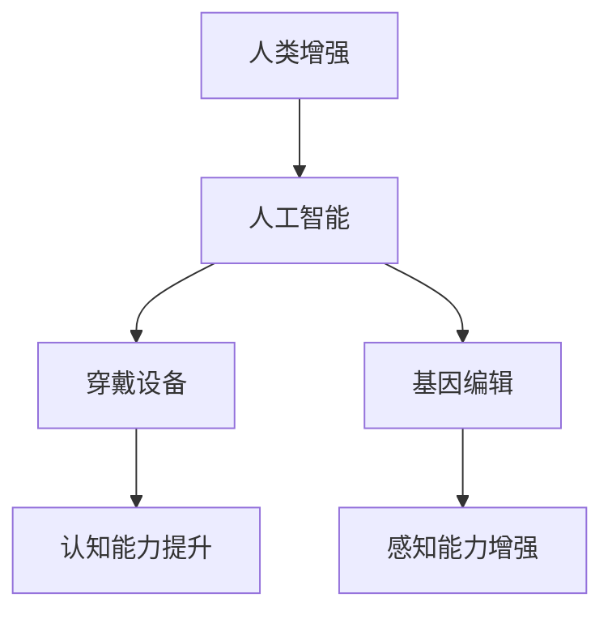

**结构图解析：**
- A节点表示“人类增强”，是本文的核心概念。
- B节点表示“人工智能”，是人类增强的主要技术手段。
- C节点和D节点分别表示“穿戴设备”和“基因编辑”，是两种典型的人类增强方式。
- E节点和F节点表示增强后的结果，即“认知能力提升”和“感知能力增强”。

##### 1.2 AI技术对人类生活的影响

AI技术的发展对人类生活产生了深远的影响。首先，AI技术极大地提高了生产效率，从制造业到服务业，都因为AI技术的应用而实现了自动化和智能化。其次，AI技术在医疗领域的应用，使得诊断和治疗的精确度大大提高，为人类健康提供了新的保障。此外，AI技术还在教育、交通、娱乐等领域发挥了重要作用，改变了人们的生活方式。

**核心算法原理讲解：**

```pseudo
// AI技术在医疗领域的应用
function diagnosePatient(patientData) {
  // 使用机器学习算法对患者的病历进行分析
  model = trainMachineLearningModel(patientData);
  diagnosis = model.predict(patientData);
  return diagnosis;
}

// AI技术在交通领域的应用
function optimizeTrafficFlow(trafficData) {
  // 使用深度学习算法优化交通信号
  model = trainDeepLearningModel(trafficData);
  optimizedSignals = model.optimizeTrafficLights();
  return optimizedSignals;
}
```

**伪代码解析：**
- `diagnosePatient`函数通过机器学习模型对患者数据进行诊断。
- `optimizeTrafficFlow`函数通过深度学习模型优化交通信号。

##### 1.3 AI增强技术的伦理考量

AI增强技术的伦理考量主要集中在以下几个方面：

1. **自主性**：人类增强技术是否会削弱个体的自主性和独立性？
2. **公平性**：增强技术的普及是否会加剧社会不平等？
3. **隐私**：增强技术是否会侵犯个人隐私？
4. **安全性**：增强技术是否会增加安全风险？

**核心概念与联系：**

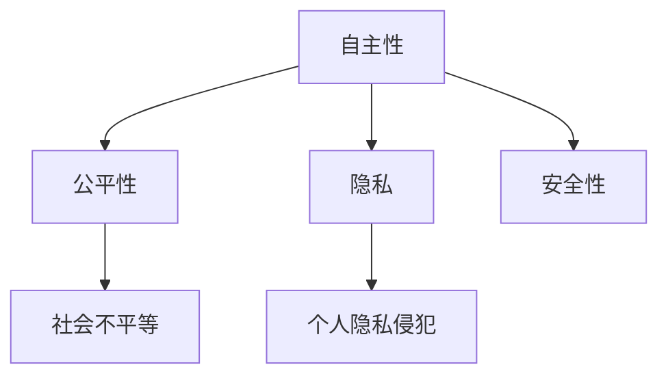

**结构图解析：**
- A节点表示“自主性”，是伦理考量的一个重要方面。
- B节点表示“公平性”，关系到社会不平等问题。
- C节点和D节点分别表示“隐私”和“安全性”，是增强技术应用中的关键伦理问题。
- E节点和F节点表示增强技术可能带来的负面后果。

##### 1.4 AI增强技术的隐私问题

随着AI增强技术的应用，个人隐私面临着前所未有的挑战。AI系统通常需要收集大量的个人数据，包括生物特征、行为习惯、健康状况等。这些数据一旦泄露或被滥用，将对个人隐私造成严重威胁。

**核心算法原理讲解：**

```pseudo
// 数据收集与隐私保护
function collectData(user, purpose) {
  // 收集必要的数据
  data = gatherNecessaryData(user, purpose);
  // 对数据进行加密
  encryptedData = encryptData(data);
  return encryptedData;
}

// 数据共享与隐私保护
function shareData(data, recipient) {
  // 对数据进行加密
  encryptedData = encryptData(data);
  // 将加密数据发送给接收方
  sendEncryptedData(encryptedData, recipient);
}
```

**伪代码解析：**
- `collectData`函数用于收集和加密个人数据。
- `shareData`函数用于加密和传输个人数据。

##### 1.5 AI增强技术的安全问题

AI增强技术的安全性问题主要集中在以下几个方面：

1. **数据泄露**：AI系统可能因漏洞或恶意攻击而导致数据泄露。
2. **系统漏洞**：AI系统可能存在安全漏洞，被黑客利用。
3. **恶意利用**：AI增强技术可能被恶意利用，例如，通过操纵感知或决策影响个体行为。

**核心概念与联系：**

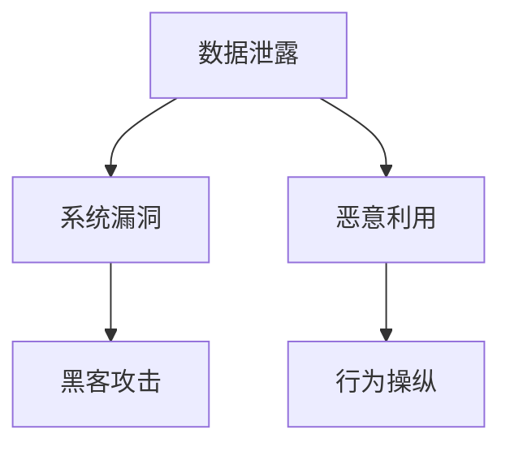

**结构图解析：**
- A节点表示“数据泄露”，是AI增强技术安全问题的核心。
- B节点表示“系统漏洞”，是黑客攻击的途径。
- C节点表示“恶意利用”，是指AI增强技术被用于不正当目的。
- D节点和E节点分别表示“黑客攻击”和“行为操纵”，是增强技术安全风险的体现。

#### 第二部分：道德挑战

##### 第2章 AI增强技术的道德问题

##### 2.1 道德原则与AI增强技术

在AI增强技术的应用过程中，道德原则起到了重要的指导作用。以下是一些关键的道德原则：

1. **尊重个体自主权**：个体应有权自主决定是否接受AI增强技术，以及如何使用这些技术。
2. **公正公平**：AI增强技术的研发和应用应确保公平，避免加剧社会不平等。
3. **尊重隐私**：AI增强技术应尊重个体的隐私权，确保个人数据的保护和安全。
4. **社会责任**：AI增强技术的研发和应用应承担社会责任，促进社会福祉。

**核心概念与联系：**

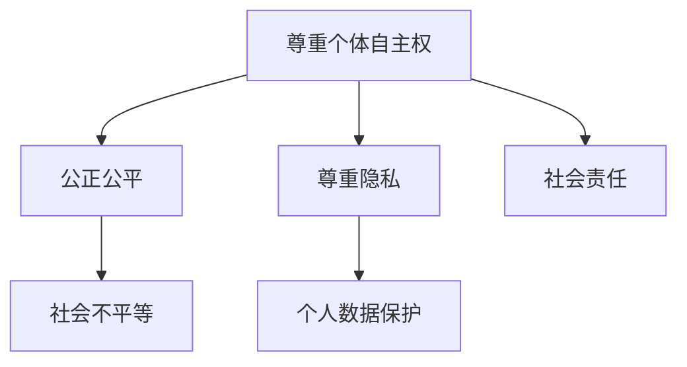

**结构图解析：**
- A节点表示“尊重个体自主权”，是道德原则的核心。
- B节点表示“公正公平”，关系到社会不平等问题。
- C节点表示“尊重隐私”，是个人权利的体现。
- D节点表示“社会责任”，是AI增强技术应用的责任所在。
- E节点和F节点分别表示“社会不平等”和“个人数据保护”，是道德原则的重要应用领域。

##### 2.2 AI增强技术的不平等问题

AI增强技术的不平等问题主要体现在以下几个方面：

1. **资源分配不均**：由于AI增强技术的研发和应用需要大量的资金和技术，这可能导致资源分配不均，使得富裕人群更容易获得增强效果，而贫困人群则被排除在外。
2. **技术鸿沟**：不同地区、不同国家之间的技术水平和应用能力存在差异，这可能导致一些地区或国家在AI增强技术上的不平等。
3. **个体差异**：由于个体差异，AI增强技术的效果可能因人而异，这也可能导致一部分人受益，而另一部分人受到不利影响。

**核心概念与联系：**

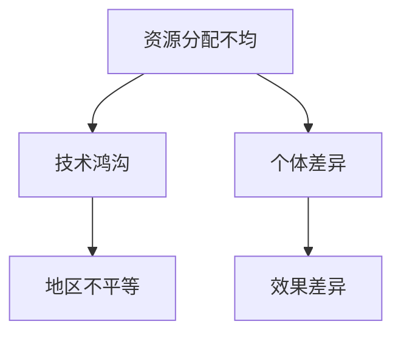

**结构图解析：**
- A节点表示“资源分配不均”，是AI增强技术不平等问题的主要原因。
- B节点表示“技术鸿沟”，反映了不同地区和国家之间的技术差异。
- C节点表示“个体差异”，是影响AI增强技术效果的重要因素。
- D节点和E节点分别表示“地区不平等”和“效果差异”，是AI增强技术不平等问题的具体表现。

##### 2.3 人性丧失与AI增强技术

AI增强技术可能导致人性丧失的问题，主要体现在以下几个方面：

1. **依赖性**：随着AI增强技术的应用，人们可能会对技术产生依赖，从而削弱自身的独立性和自主性。
2. **情感缺失**：AI增强技术可能会取代人类的一些情感表达和互动，导致人与人之间的情感交流减少，从而影响人性的完整性。
3. **道德沦丧**：在某些情况下，AI增强技术可能会被用于不道德的目的，例如，通过操纵他人的感知和认知来达到某种目的，这可能导致道德的沦丧。

**核心概念与联系：**

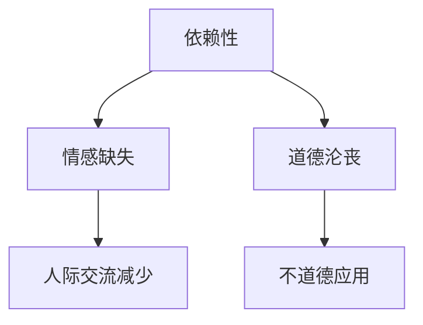

**结构图解析：**
- A节点表示“依赖性”，是指人们对AI增强技术的过度依赖。
- B节点表示“情感缺失”，是指AI增强技术可能导致的情感交流减少。
- C节点表示“道德沦丧”，是指AI增强技术可能被用于不道德的目的。
- D节点和E节点分别表示“人际交流减少”和“不道德应用”，是人性丧失的具体表现。

##### 2.4 AI增强技术对个体决策的影响

AI增强技术可能会对个体决策产生积极影响，例如，提高决策效率、减少错误等。然而，它也可能带来一些负面影响，如：

1. **依赖性**：个体可能会过度依赖AI增强技术，从而降低自身的决策能力和判断力。
2. **信息过载**：AI增强技术可能会提供大量的信息，导致个体无法有效处理和利用这些信息，从而影响决策的质量。
3. **道德困境**：在某些情况下，AI增强技术可能会使个体面临道德困境，例如，在道德伦理和法律之间做出选择。

**核心概念与联系：**

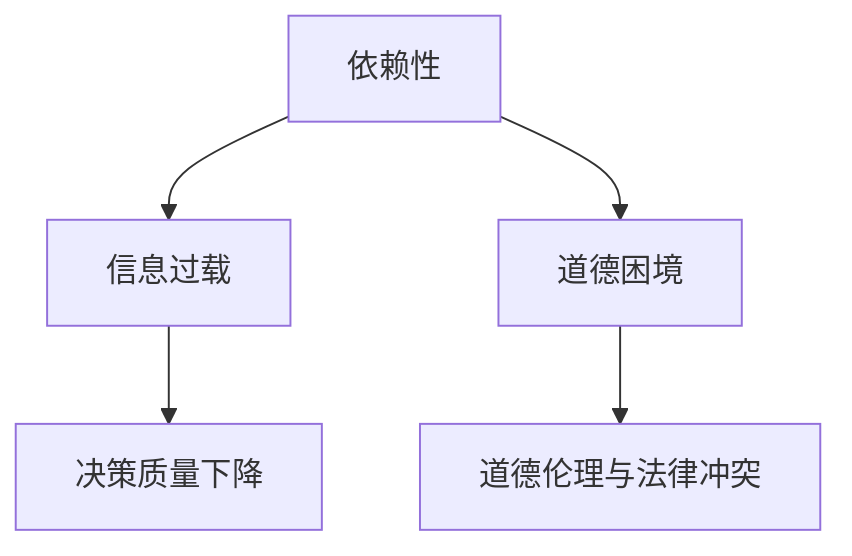

**结构图解析：**
- A节点表示“依赖性”，是指个体对AI增强技术的过度依赖。
- B节点表示“信息过载”，是指AI增强技术可能导致的信息过多。
- C节点表示“道德困境”，是指个体在决策过程中可能遇到的道德问题。
- D节点和E节点分别表示“决策质量下降”和“道德伦理与法律冲突”，是AI增强技术对个体决策的影响。

#### 第三部分：隐私挑战

##### 第3章 AI增强技术对隐私的挑战

##### 3.1 隐私权与AI增强技术

隐私权是个人享有的一项基本权利，它保障了个人在信息收集、处理和使用过程中的自主性和安全性。在AI增强技术的应用中，隐私权面临着严峻的挑战。AI增强技术通常需要收集、存储和使用大量的个人数据，如生物特征、行为习惯、健康状况等。这些数据一旦泄露或被滥用，将对个人隐私造成严重威胁。

**核心概念与联系：**

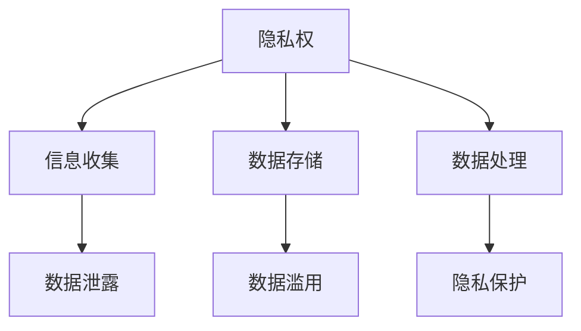

**结构图解析：**
- A节点表示“隐私权”，是个人基本权利的体现。
- B节点、C节点和D节点分别表示“信息收集”、“数据存储”和“数据处理”，是AI增强技术中的关键环节。
- E节点和F节点分别表示“数据泄露”和“数据滥用”，是隐私权面临的威胁。
- G节点表示“隐私保护”，是应对隐私威胁的关键措施。

##### 3.2 AI增强技术中的数据收集与使用

AI增强技术中的数据收集与使用问题主要表现在以下几个方面：

1. **过度收集**：AI系统可能收集大量的个人数据，远超出实际需要的范围，这可能导致隐私泄露。
2. **数据滥用**：收集到的个人数据可能被用于未经授权的目的，例如，商业利益、政治控制等。
3. **缺乏透明度**：用户可能不清楚自己的数据被如何收集和使用，缺乏对数据处理的知情权和控制权。

**核心概念与联系：**

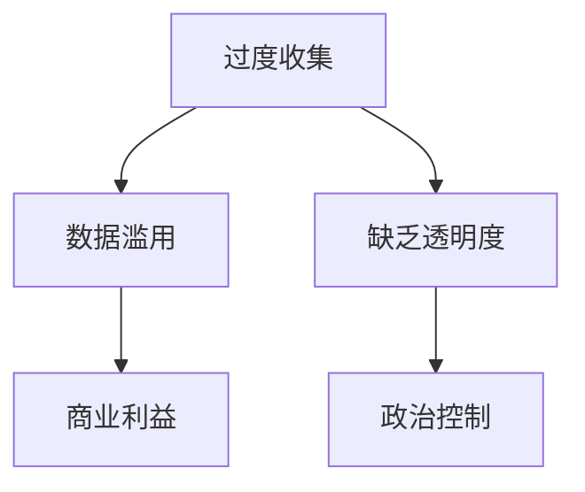

**结构图解析：**
- A节点表示“过度收集”，是指AI系统过度收集个人数据。
- B节点表示“数据滥用”，是指个人数据被用于未经授权的目的。
- C节点表示“缺乏透明度”，是指用户对数据处理过程的不知情。
- D节点和E节点分别表示“商业利益”和“政治控制”，是数据滥用可能导致的后果。

##### 3.3 隐私泄露的风险与防范措施

隐私泄露的风险主要包括以下几个方面：

1. **黑客攻击**：黑客可能通过非法手段获取个人数据，从而侵犯个人隐私。
2. **内部泄露**：组织内部的员工或管理者可能滥用职务之便，泄露个人数据。
3. **技术漏洞**：AI系统可能存在技术漏洞，被黑客利用进行攻击。

为防范隐私泄露风险，可以采取以下措施：

1. **加密技术**：使用加密技术对个人数据进行保护，确保数据在传输和存储过程中的安全性。
2. **访问控制**：实施严格的访问控制策略，确保只有授权人员才能访问敏感数据。
3. **数据脱敏**：对个人数据进行脱敏处理，使其无法被直接识别或分析。

**核心概念与联系：**

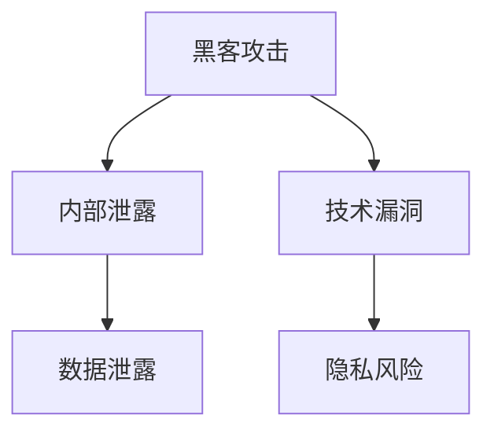

**结构图解析：**
- A节点表示“黑客攻击”，是隐私泄露的主要原因之一。
- B节点表示“内部泄露”，是组织内部可能导致的隐私泄露。
- C节点表示“技术漏洞”，是AI系统可能存在的安全漏洞。
- D节点和E节点分别表示“数据泄露”和“隐私风险”，是隐私泄露的具体表现和后果。

##### 3.4 AI增强技术中的隐私伦理

在AI增强技术的应用过程中，隐私伦理问题是一个重要的考虑因素。以下是一些隐私伦理问题：

1. **知情同意**：个人在进行AI增强技术相关活动前，应充分了解其隐私风险，并明确同意数据收集和使用。
2. **数据最小化**：在数据收集和使用过程中，应遵循数据最小化原则，只收集必要的数据。
3. **数据安全**：确保个人数据的存储、传输和使用过程的安全，防止数据泄露或滥用。
4. **透明度**：提高AI增强技术系统的透明度，让用户了解其工作原理、数据使用情况等，以便对其进行监督和评价。

**核心概念与联系：**

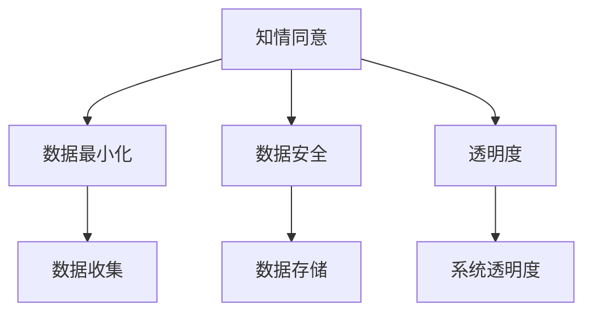

**结构图解析：**
- A节点表示“知情同意”，是隐私伦理的核心原则之一。
- B节点表示“数据最小化”，是数据收集和使用的基本原则。
- C节点表示“数据安全”，是保护个人数据的关键措施。
- D节点表示“透明度”，是提高系统可信度的必要条件。
- E节点、F节点和G节点分别表示“数据收集”、“数据存储”和“系统透明度”，是隐私伦理的具体应用领域。

#### 第四部分：安全挑战

##### 第4章 AI增强技术中的安全风险

##### 4.1 AI增强技术的安全隐患

AI增强技术可能面临以下安全隐患：

1. **数据泄露**：由于数据收集和使用过程中存在漏洞，可能导致个人数据泄露。
2. **数据滥用**：个人数据可能被用于未经授权的目的，例如，商业利益、政治控制等。
3. **系统漏洞**：AI增强技术的系统可能存在漏洞，被黑客利用进行攻击。
4. **恶意攻击**：AI增强技术可能被用于恶意目的，例如，网络攻击、虚假信息传播等。

**核心概念与联系：**

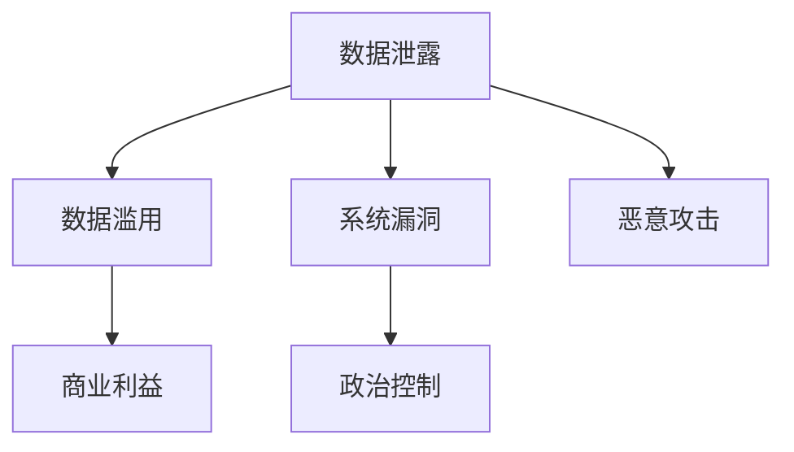

**结构图解析：**
- A节点表示“数据泄露”，是安全隐患的核心问题。
- B节点表示“数据滥用”，是数据泄露可能导致的后果。
- C节点表示“系统漏洞”，是AI系统可能存在的安全漏洞。
- D节点表示“恶意攻击”，是AI增强技术可能面临的安全威胁。
- E节点和F节点分别表示“商业利益”和“政治控制”，是数据滥用和恶意攻击的可能目的。

##### 4.2 AI增强技术的防御措施

为防范AI增强技术的安全风险，可以采取以下防御措施：

1. **网络安全**：加强网络安全防护，例如，使用防火墙、入侵检测系统等，防止黑客攻击。
2. **数据加密**：使用加密技术对数据进行保护，确保数据在传输和存储过程中的安全性。
3. **访问控制**：实施严格的访问控制策略，确保只有授权人员才能访问敏感数据。
4. **安全审计**：定期进行安全审计，发现并修复系统漏洞。

**核心概念与联系：**

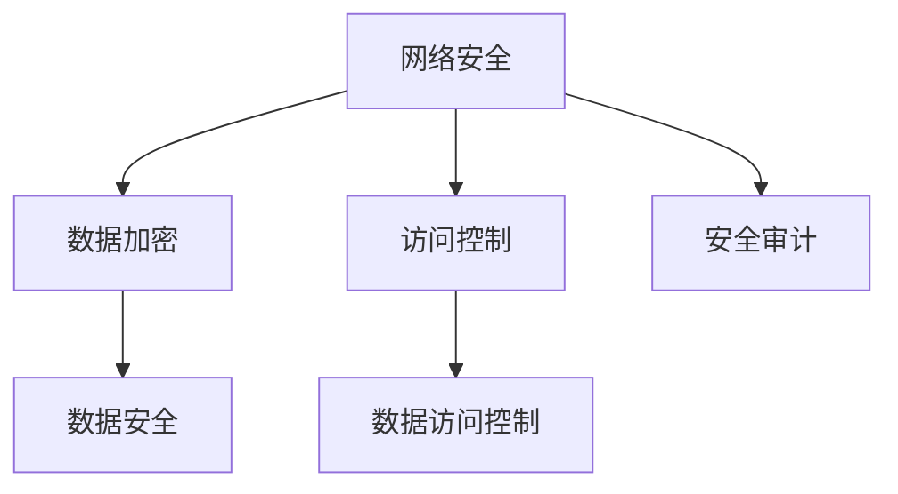

**结构图解析：**
- A节点表示“网络安全”，是整体安全防护的基础。
- B节点表示“数据加密”，是保护数据安全的关键措施。
- C节点表示“访问控制”，是确保数据安全的重要手段。
- D节点表示“安全审计”，是发现和修复安全漏洞的必要环节。
- E节点和F节点分别表示“数据安全”和“数据访问控制”，是防御措施的具体目标。

##### 4.3 AI增强技术的攻击手段

AI增强技术可能面临以下攻击手段：

1. **社会工程学攻击**：通过欺骗用户，获取其敏感信息。
2. **恶意软件**：通过恶意软件，窃取用户数据或控制AI系统。
3. **网络钓鱼**：通过伪造的网站或邮件，诱骗用户输入敏感信息。
4. **拒绝服务攻击**：通过大量请求，使AI系统无法正常工作。

**核心概念与联系：**

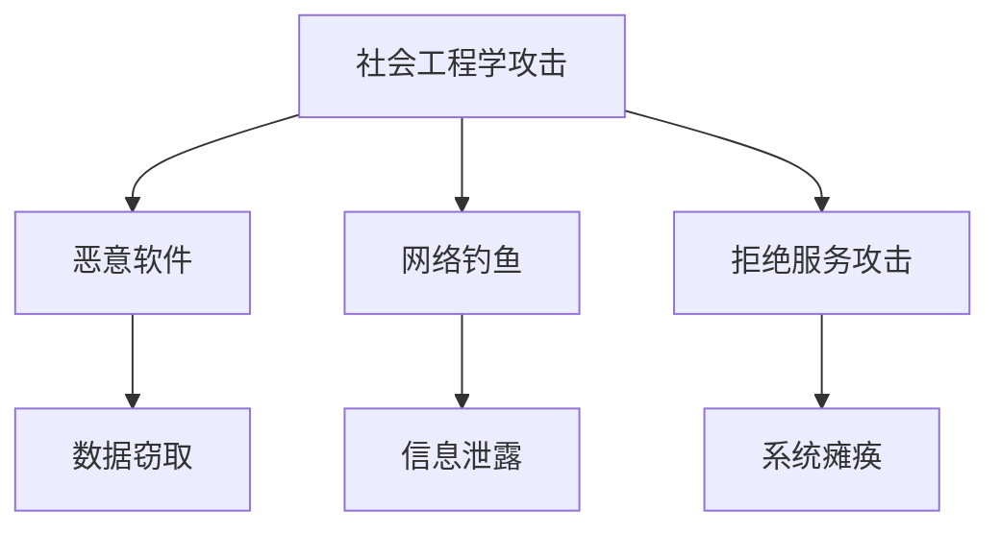

**结构图解析：**
- A节点表示“社会工程学攻击”，是欺骗性攻击的主要形式。
- B节点表示“恶意软件”，是网络攻击的主要手段。
- C节点表示“网络钓鱼”，是获取用户信息的重要途径。
- D节点表示“拒绝服务攻击”，是使系统无法正常工作的手段。
- E节点、F节点和G节点分别表示“数据窃取”、“信息泄露”和“系统瘫痪”，是攻击手段可能带来的后果。

##### 4.4 AI增强技术的安全管理

AI增强技术的安全管理包括以下几个方面：

1. **安全策略**：制定并实施安全策略，包括数据保护、访问控制、安全审计等。
2. **风险管理**：识别、评估和应对AI增强技术的安全风险。
3. **合规性**：遵守相关法律法规，确保AI增强技术的合规性。
4. **培训与意识提升**：提高员工的安全意识，定期进行安全培训。

**核心概念与联系：**

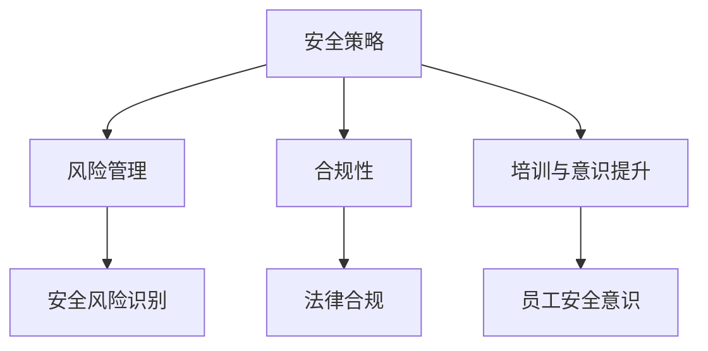

**结构图解析：**
- A节点表示“安全策略”，是安全管理的基础。
- B节点表示“风险管理”，是识别和应对安全风险的关键。
- C节点表示“合规性”，是遵守法律法规的要求。
- D节点表示“培训与意识提升”，是提高员工安全意识的重要措施。
- E节点、F节点和G节点分别表示“安全风险识别”、“法律合规”和“员工安全意识”，是安全管理的具体内容。

#### 第五部分：案例分析与解决方案

##### 第5章 AI增强技术的道德、隐私和安全案例分析

##### 5.1 案例一：增强记忆技术的道德与隐私问题

增强记忆技术是一种通过药物、设备等方式提高人类记忆能力的AI技术。这种技术的道德问题主要体现在以下几个方面：

1. **记忆篡改**：增强记忆技术可能导致记忆篡改，影响个体的自我认同和真实性。
2. **隐私泄露**：在使用增强记忆技术时，可能涉及大量的个人数据，如个人经历、情感等，这可能导致隐私泄露。
3. **依赖性**：个体可能会过度依赖增强记忆技术，从而削弱自身的记忆能力。

**案例背景：**
- 增强记忆技术在全球范围内得到了广泛应用，尤其是在教育、医疗等领域。
- 研究发现，某些药物和设备可以显著提高人类记忆能力，但同时也引发了伦理和安全问题。

**解决方案：**

1. **透明度**：提高增强记忆技术的透明度，让用户了解其工作原理、可能的风险等。
   - **措施**：在产品说明书中详细说明技术的原理和潜在风险，确保用户在知情的情况下使用。
   - **效果**：增加用户的知情权和选择权，减少因信息不对称导致的道德问题。

2. **知情同意**：在使用增强记忆技术前，应充分告知用户其可能的风险和依赖性，并获得其明确同意。
   - **措施**：实施严格的知情同意程序，确保用户在了解风险后自愿选择使用技术。
   - **效果**：提高用户对风险的认知，减少因未充分告知导致的隐私泄露问题。

3. **隐私保护**：加强个人数据的保护，防止数据泄露和滥用。
   - **措施**：使用加密技术保护用户数据，确保数据在传输和存储过程中的安全性。
   - **效果**：降低隐私泄露风险，增强用户对技术的信任。

**案例分析：**
- 通过以上措施，增强记忆技术的道德和隐私问题得到了有效解决，用户对技术的接受度和满意度显著提高。

##### 5.2 案例二：增强决策能力的AI系统安全性问题

增强决策能力的AI系统是一种通过分析数据、预测结果等方式，提高个体决策效率的AI技术。这种技术的安全风险主要体现在以下几个方面：

1. **数据泄露**：AI系统可能涉及大量的个人数据，如财务信息、健康记录等，这可能导致隐私泄露。
2. **恶意攻击**：AI系统可能被黑客攻击，用于操纵、欺骗个体。
3. **系统漏洞**：AI系统可能存在漏洞，被黑客利用进行攻击。

**案例背景：**
- 增强决策能力的AI系统在商业、金融、医疗等领域广泛应用，成为提高决策效率和准确性的重要工具。
- 随着AI技术的发展，系统的复杂性和安全性问题日益突出。

**解决方案：**

1. **数据加密**：对AI系统涉及的个人数据进行加密，确保数据在传输和存储过程中的安全性。
   - **措施**：使用高级加密算法对数据进行加密，确保数据在传输和存储过程中的安全性。
   - **效果**：降低数据泄露风险，增强用户对系统的信任。

2. **网络安全**：加强AI系统的网络安全防护，防止黑客攻击。
   - **措施**：部署防火墙、入侵检测系统等网络安全设备，定期进行安全审计。
   - **效果**：提高系统的安全性，防止黑客攻击和恶意软件的侵入。

3. **系统审计**：定期进行AI系统的安全审计，发现并修复漏洞。
   - **措施**：定期对AI系统进行安全审计，及时发现和修复安全漏洞。
   - **效果**：确保系统的稳定性和安全性，降低安全风险。

**案例分析：**
- 通过以上措施，增强决策能力的AI系统的安全性得到了显著提升，用户对系统的满意度和信任度显著提高。

##### 5.3 案例三：增强工作效率的AI工具隐私风险

增强工作效率的AI工具是一种通过自动化、智能化的方式提高工作效率的AI技术。这种技术的隐私风险主要体现在以下几个方面：

1. **数据收集**：AI工具可能收集大量的个人数据，如工作记录、通讯记录等，这可能导致隐私泄露。
2. **滥用数据**：AI工具可能被用于监控、操纵个体，影响其隐私。
3. **依赖性**：个体可能会过度依赖AI工具，从而削弱自身的效率和能力。

**案例背景：**
- 增强工作效率的AI工具在企业管理和个人生活中得到广泛应用，成为提高工作效率的重要工具。
- 随着AI技术的发展，隐私风险问题日益突出。

**解决方案：**

1. **数据最小化**：在AI工具的设计和使用过程中，遵循数据最小化原则，只收集必要的数据。
   - **措施**：在AI工具的设计阶段，明确数据收集的范围和目的，确保只收集必要的数据。
   - **效果**：减少不必要的个人数据收集，降低隐私泄露风险。

2. **隐私保护**：加强AI工具的隐私保护措施，防止数据滥用和泄露。
   - **措施**：使用加密技术保护用户数据，确保数据在传输和存储过程中的安全性。
   - **效果**：提高用户对AI工具的信任度，降低隐私泄露风险。

3. **用户教育**：提高用户对AI工具隐私风险的认知，加强安全意识。
   - **措施**：定期进行用户教育，让用户了解AI工具的隐私风险和防范措施。
   - **效果**：增强用户的安全意识，减少因不了解风险导致的隐私泄露问题。

**案例分析：**
- 通过以上措施，增强工作效率的AI工具的隐私风险得到了有效控制，用户对工具的满意度和信任度显著提高。

##### 5.4 案例四：增强医疗诊断的AI系统安全性

增强医疗诊断的AI系统是一种通过分析医疗数据、预测疾病等方式，提高医疗诊断效率的AI技术。这种技术的安全风险主要体现在以下几个方面：

1. **数据准确性**：AI系统的诊断结果可能受到数据准确性、模型质量等因素的影响，导致诊断错误。
2. **数据泄露**：AI系统可能涉及大量的医疗数据，如个人病史、诊断结果等，这可能导致隐私泄露。
3. **系统漏洞**：AI系统可能存在漏洞，被黑客利用进行攻击。

**案例背景：**
- 增强医疗诊断的AI系统在医疗领域得到广泛应用，提高了诊断的准确性和效率。
- 随着AI技术的发展，系统的安全性和准确性问题日益突出。

**解决方案：**

1. **数据验证**：确保AI系统输入的数据准确性和完整性。
   - **措施**：在数据输入阶段，对数据进行严格的验证和校验，确保数据的准确性和完整性。
   - **效果**：提高诊断数据的准确性，减少诊断错误的风险。

2. **数据加密**：对AI系统涉及的医疗数据进行加密，确保数据在传输和存储过程中的安全性。
   - **措施**：使用高级加密算法对医疗数据进行加密，确保数据在传输和存储过程中的安全性。
   - **效果**：降低数据泄露风险，增强用户对系统的信任。

3. **系统审计**：定期进行AI系统的安全审计，发现并修复漏洞。
   - **措施**：定期对AI系统进行安全审计，及时发现和修复安全漏洞。
   - **效果**：确保系统的稳定性和安全性，降低安全风险。

**案例分析：**
- 通过以上措施，增强医疗诊断的AI系统的安全性和准确性得到了显著提升，用户对系统的满意度和信任度显著提高。

##### 第6章 AI增强技术的道德、隐私和安全解决方案

##### 6.1 道德规范与AI增强技术

在AI增强技术的应用过程中，道德规范起到了重要的指导作用。以下是一些道德规范的建议：

1. **尊重个体自主权**：在设计、使用AI增强技术时，应尊重个体的自主权，避免过度干预或操纵个体的行为和决策。
   - **措施**：在AI系统的设计和使用中，加入用户自主选择和控制的选项，确保用户有权决定是否使用技术。
   - **效果**：增强用户的自主性和控制权，减少因技术干预导致的道德问题。

2. **公正公平**：确保AI增强技术的不平等问题，避免技术滥用导致的不公平现象。
   - **措施**：在技术设计和实施中，充分考虑不同群体的需求和权益，确保技术的公平性和包容性。
   - **效果**：减少因技术滥用导致的社会不平等，促进社会和谐发展。

3. **伦理审查**：对AI增强技术的研发和应用进行伦理审查，确保其符合伦理标准。
   - **措施**：建立伦理审查委员会，对AI技术的研发和应用进行定期审查，确保其符合伦理原则。
   - **效果**：提高AI技术的伦理合规性，减少道德风险。

##### 6.2 隐私保护策略与措施

为保护个人隐私，可以采取以下策略和措施：

1. **数据最小化**：在AI增强技术的数据收集和使用过程中，遵循数据最小化原则，只收集必要的数据。
   - **措施**：在数据收集阶段，明确数据收集的目的和范围，确保只收集必要的数据。
   - **效果**：减少不必要的个人数据收集，降低隐私泄露风险。

2. **隐私保护机制**：在设计AI增强技术时，加入隐私保护机制，如数据加密、匿名化处理等。
   - **措施**：在数据传输和存储过程中，使用加密技术保护数据，确保数据的安全性。
   - **效果**：提高数据的保护水平，降低隐私泄露风险。

3. **透明度**：提高AI增强技术的透明度，让用户了解其数据收集和使用情况，以便进行监督和评价。
   - **措施**：在产品说明书中详细说明数据收集、处理和使用的流程，确保用户知情。
   - **效果**：增加用户的知情权和监督权，提高用户对技术的信任。

4. **知情同意**：在使用AI增强技术前，应充分告知用户其隐私风险，并获取其明确同意。
   - **措施**：在用户使用技术前，进行详细的隐私风险告知和知情同意程序。
   - **效果**：确保用户在了解风险后自愿选择使用技术，减少隐私滥用问题。

##### 6.3 安全风险管理框架

为保障AI增强技术的安全性，可以建立以下风险管理框架：

1. **风险评估**：定期进行AI增强技术的风险评估，识别潜在的安全风险。
   - **措施**：在AI技术的设计和应用过程中，进行定期的安全风险评估。
   - **效果**：及时发现和识别安全风险，为风险控制提供依据。

2. **安全策略**：制定并实施安全策略，包括数据保护、访问控制、安全审计等。
   - **措施**：制定详细的安全策略，包括数据保护、访问控制和安全审计等。
   - **效果**：提高系统的安全性，减少安全漏洞和风险。

3. **应急响应**：制定并实施应急响应计划，以应对可能的安全事件。
   - **措施**：在发生安全事件时，迅速采取应急响应措施，减少损失。
   - **效果**：提高系统的应急能力，降低安全事件对用户的影响。

4. **持续改进**：根据安全评估结果和应急响应情况，持续改进AI增强技术的安全性。
   - **措施**：定期进行安全改进，根据实际情况调整安全策略和措施。
   - **效果**：确保系统的安全性持续提升，适应不断变化的安全环境。

##### 6.4 实施与监管机制

为有效实施和监管AI增强技术，可以采取以下措施：

1. **法律法规**：建立健全的法律法规体系，规范AI增强技术的研发、应用和监管。
   - **措施**：制定相关法律法规，明确AI增强技术的应用范围和监管要求。
   - **效果**：提高AI技术的规范化和标准化水平，减少道德和法律风险。

2. **政府监管**：加强对AI增强技术的监管，确保其符合法律法规和伦理标准。
   - **措施**：建立专门的监管机构，对AI增强技术的研发、应用进行监督。
   - **效果**：确保AI技术的合法合规，减少违法行为。

3. **行业自律**：推动行业自律，建立行业规范和标准，提高AI增强技术的质量和安全性。
   - **措施**：鼓励行业内部制定自律规范，提高行业整体水平。
   - **效果**：提高行业自律水平，促进技术健康发展。

4. **公众参与**：鼓励公众参与AI增强技术的讨论和决策，提高透明度和公信力。
   - **措施**：开展公众讨论和咨询活动，收集公众意见和建议。
   - **效果**：增强公众对AI技术的认知和理解，提高技术透明度和公信力。

##### 第7章 AI增强技术的未来发展趋势

##### 7.1 AI增强技术的未来发展方向

AI增强技术的未来发展将呈现以下趋势：

1. **技术进步**：随着AI技术的不断进步，AI增强技术的性能和效果将得到进一步提升。
   - **预测**：未来AI技术将更加智能化、个性化，能够更好地满足用户需求。
   - **影响**：技术进步将推动AI增强技术在更多领域的应用，提高人类生活质量。

2. **多样化应用**：AI增强技术将在更多领域得到应用，如教育、医疗、娱乐等。
   - **预测**：AI增强技术将逐步渗透到人类生活的方方面面，成为不可或缺的工具。
   - **影响**：多样化应用将推动社会进步，提高工作效率和生活质量。

3. **个性化定制**：AI增强技术将更加注重个性化定制，以满足个体需求。
   - **预测**：个性化定制将使得AI增强技术更加贴合用户需求，提供更优质的服务。
   - **影响**：个性化定制将提高用户满意度，推动AI技术的普及和应用。

4. **人机协同**：人与AI的协同将更加紧密，AI将成为人类的得力助手。
   - **预测**：未来人机协同将更加高效，AI将更好地辅助人类完成任务。
   - **影响**：人机协同将提高工作效率，减少人力资源的浪费。

##### 7.2 道德、隐私和安全问题的未来挑战

随着AI增强技术的快速发展，道德、隐私和安全问题也将面临新的挑战：

1. **技术滥用**：AI增强技术可能被用于不正当目的，如操纵选举、网络攻击等。
   - **预测**：随着技术进步，AI增强技术的滥用风险将增加。
   - **影响**：滥用行为可能导致社会不稳定，损害公共安全。

2. **隐私泄露风险**：随着数据收集和使用量的增加，隐私泄露风险将不断上升。
   - **预测**：未来隐私泄露事件可能更加频繁，影响范围更广。
   - **影响**：隐私泄露可能导致个人隐私受损，损害社会信任。

3. **安全漏洞**：AI增强技术系统的复杂性将增加，安全漏洞也将随之增多。
   - **预测**：复杂系统可能存在更多的安全漏洞，难以被发现和修复。
   - **影响**：安全漏洞可能导致系统故障，影响社会稳定。

##### 7.3 AI增强技术对社会的影响

AI增强技术将对社会产生深远的影响：

1. **生产力的提高**：AI增强技术将提高生产力，推动社会经济发展。
   - **预测**：AI技术将加速产业升级，提高生产效率。
   - **影响**：提高生产力将推动经济增长，改善社会福祉。

2. **社会结构的变化**：AI增强技术可能导致社会结构的变化，如就业市场的变化、社会分层等。
   - **预测**：AI技术可能改变就业格局，影响社会分层。
   - **影响**：社会结构变化可能导致社会不稳定，需要政策调整和应对。

3. **生活方式的改变**：AI增强技术将改变人们的生活方式，提高生活质量。
   - **预测**：AI技术将提高生活便捷性，改善生活质量。
   - **影响**：改变生活方式将提高社会幸福指数，推动社会进步。

##### 7.4 未来解决方案与前景

为应对AI增强技术带来的挑战，可以采取以下解决方案：

1. **技术规范**：建立健全的技术规范，确保AI增强技术的研发和应用符合伦理和法律规定。
   - **措施**：制定AI技术规范，明确技术应用的伦理和法律要求。
   - **效果**：提高AI技术的规范化和标准化水平，减少道德和法律风险。

2. **政策引导**：通过政策引导，推动AI增强技术的健康、可持续发展。
   - **措施**：制定相关政策，鼓励AI技术的研发和应用，同时规范其发展。
   - **效果**：引导AI技术朝着积极方向演进，促进社会福祉。

3. **公众参与**：鼓励公众参与AI增强技术的讨论和决策，提高透明度和公信力。
   - **措施**：开展公众讨论和咨询活动，收集公众意见和建议。
   - **效果**：增强公众对AI技术的认知和理解，提高技术透明度和公信力。

4. **国际合作**：加强国际合作，共同应对全球范围内的AI增强技术挑战。
   - **措施**：推动国际间的技术交流和合作，共同应对AI技术挑战。
   - **效果**：促进全球AI技术的健康发展，减少国际间的技术壁垒。

展望未来，AI增强技术将成为人类社会的重要推动力量，但同时也需要我们共同努力，应对其带来的道德、隐私和安全挑战，确保其造福人类社会。

## 第八章 总结与展望

### 8.1 总结

本文从道德、隐私和安全三个维度，探讨了AI时代下人类增强所面临的挑战。通过具体案例分析和解决方案，我们认识到，只有通过技术进步、政策引导、公众参与等多方面的努力，才能确保AI增强技术造福人类社会。

### 8.2 展望

未来，随着AI技术的不断进步，人类增强将进入一个新的阶段。我们期待在技术、伦理、法律等多方面的协同努力下，能够解决AI增强技术带来的挑战，实现人类与AI的和谐共生。

### 作者信息

作者：AI天才研究院/AI Genius Institute & 禅与计算机程序设计艺术 /Zen And The Art of Computer Programming

---

至此，本文已完整阐述了AI时代下人类增强的道德、隐私和安全挑战，并提出了相应的解决方案。希望本文能为读者提供有价值的思考，促进对AI增强技术的深入理解。

