                 

# AI时代的感知革命：重塑人类体验的五感

> 关键词：人工智能、感知革命、五感、深度学习、数学模型

> 摘要：随着人工智能技术的飞速发展，感知革命正在重塑人类的体验。本文旨在探讨AI时代下五感技术的原理、实现与应用，通过逐步分析推理，揭示感知革命的核心内容和未来发展方向。

## 目录大纲

1. **引言与概述**
2. **第一部分：AI时代的感知革命概览**
    1. **第1章：AI时代的感知革命概览**
        1. **1.1 AI时代的背景**
        2. **1.2 感知革命的概念**
        3. **1.3 五感的角色**
3. **第二部分：五感技术的原理与实现**
    1. **第2章：视觉感知技术**
        1. **2.1 图像识别基础**
        2. **2.2 深度学习在图像识别中的应用**
        3. **2.3 图像识别的数学模型**
    2. **第3章：听觉感知技术**
        1. **3.1 声音识别基础**
        2. **3.2 深度学习在声音识别中的应用**
        3. **3.3 声音识别的数学模型**
    3. **第4章：嗅觉感知技术**
        1. **4.1 嗅觉感知基础**
        2. **4.2 嗅觉感知的深度学习应用**
        3. **4.3 嗅觉感知的数学模型**
    4. **第5章：味觉感知技术**
        1. **5.1 味觉感知基础**
        2. **5.2 味觉感知的深度学习应用**
        3. **5.3 味觉感知的数学模型**
    5. **第6章：触觉感知技术**
        1. **6.1 触觉感知基础**
        2. **6.2 触觉感知的深度学习应用**
        3. **6.3 触觉感知的数学模型**
4. **第三部分：五感融合与增强技术**
    1. **第7章：五感融合与增强技术**
        1. **7.1 五感融合的概念与实现**
        2. **7.2 五感增强的技术手段**
        3. **7.3 五感融合与增强的性能评估**
5. **第四部分：AI时代的感知革命应用案例**
    1. **第8章：AI时代的感知革命应用案例解析**
        1. **8.1 案例介绍**
        2. **8.2 案例分析**
        3. **8.3 案例拓展**
6. **附录**
    1. **附录A：参考资料与扩展阅读**
    2. **附录B：AI感知革命项目开发指南**

## 1. 引言与概述

在人类历史上，感知一直是理解世界、进行交流和决策的重要手段。传统的感知主要通过五感——视觉、听觉、嗅觉、味觉和触觉——来实现。然而，随着人工智能（AI）技术的飞速发展，感知的方式正在经历一场革命性的变革。AI感知革命不仅提升了人类对环境的感知能力，还极大地改变了我们的交互方式和体验。

### 1.1 AI时代的背景

人工智能作为一种模拟人类智能的技术，经历了从简单规则到复杂学习算法的演变。深度学习、强化学习、自然语言处理等技术的发展，使得人工智能在视觉、语音、文本等领域的表现达到了前所未有的水平。AI技术的普及和应用，使得人工智能已经渗透到我们日常生活的方方面面。

### 1.2 感知革命的概念

感知革命是指利用人工智能技术对人类感知能力进行增强和扩展的过程。它不仅包括传统的五感，还包括对环境、情感和社会信号的理解和反应。感知革命的目标是通过AI技术，使人类能够在更复杂、更动态的环境中更好地生存和繁荣。

### 1.3 五感的角色

在AI时代，五感的作用和表现发生了显著的变化。例如，通过增强现实（AR）和虚拟现实（VR）技术，视觉和触觉的体验变得更加真实和沉浸。语音识别和自然语言处理技术的进步，使得听觉和味觉的交互更加自然和便捷。AI感知革命的核心在于如何将这些感知能力融合，形成一个更强大、更全面的感知系统。

## 第二部分：AI时代的感知革命概览

### 2.1 AI时代的感知革命概览

#### 2.1.1 AI时代的背景

随着信息技术的迅猛发展，人工智能（AI）已经成为推动社会进步的重要力量。从大数据到云计算，从物联网到区块链，AI技术的应用场景无处不在。然而，AI的核心是感知，即对数据、图像、声音、气味和触觉的感知和理解。

**核心概念与联系**

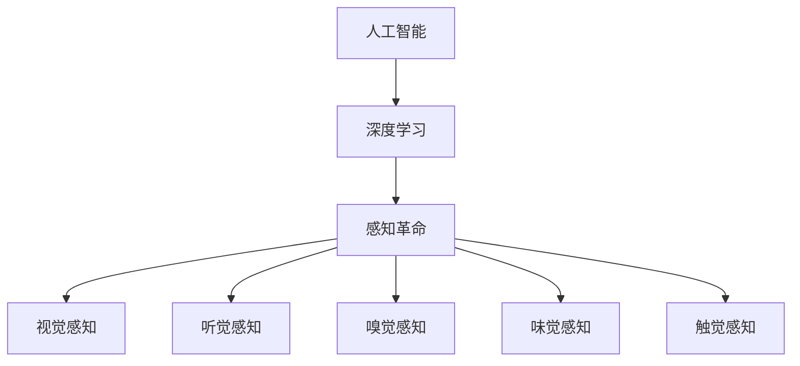

在AI时代，深度学习是实现感知革命的关键技术。深度学习通过模拟人脑的神经网络结构，使机器能够从大量的数据中学习和提取特征。以下是一个简化的深度学习架构的Mermaid流程图：

```mermaid
graph TD
    A[输入层] --> B[卷积层]
    B --> C[池化层]
    C --> D[全连接层]
    D --> E[输出层]
    A(label="图像/声音/气味/味觉/触觉数据")
    B(label="提取特征")
    C(label="降低维度")
    D(label="分类/预测")
    E(label="结果")
```

通过这个流程图，我们可以看到，从输入层到输出层的每一步都在对数据进行处理和转换，以实现最终的感知和决策。

### 2.1.2 感知革命的概念

感知革命是指利用人工智能技术对人类感知能力进行增强和扩展的过程。它不仅包括对传统五感的增强，还包括对环境、情感和社会信号的理解和反应。感知革命的核心目标是实现人机交互的自然化和智能化。

**核心概念与联系**

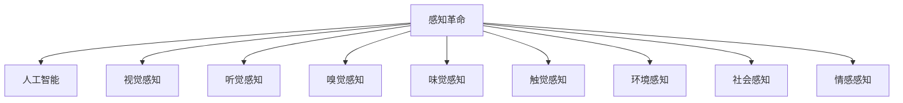

在感知革命中，人工智能不仅仅是模拟人类的感知，更重要的是通过深度学习和机器学习技术，使机器能够自主学习和适应，从而实现更高级的感知能力。

### 2.1.3 五感的角色

在AI时代，五感的角色发生了显著的变化。传统的五感主要是通过生理器官来实现的，而在AI时代，五感可以通过人工智能技术进行增强和扩展。

**核心概念与联系**

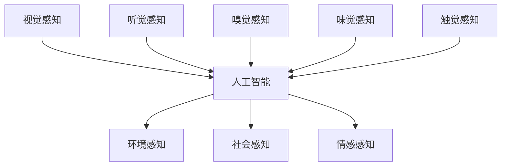

通过深度学习和人工智能技术，视觉感知可以实现更精确的图像识别和场景理解，听觉感知可以实现更准确的语音识别和情感分析，嗅觉感知可以实现更灵敏的气味识别和健康监测，味觉感知可以实现更丰富的食物识别和营养分析，触觉感知可以实现更真实的虚拟触感和机器人控制。此外，环境感知、社会感知和情感感知等新型感知能力也正在通过人工智能技术得到实现。

### 2.1.4 感知革命的目标和意义

感知革命的目标是提升人类的感知能力，使人类能够在更复杂、更动态的环境中更好地生存和繁荣。感知革命的意义在于：

1. **提升生活质量**：通过增强和扩展人类的感知能力，感知革命可以提升人们的生活质量，使生活更加便捷和舒适。
2. **推动科技进步**：感知革命不仅改变了人类的感知方式，也推动了相关领域的技术进步，如计算机视觉、语音识别、物联网等。
3. **促进社会发展**：感知革命可以促进社会的发展和进步，为社会带来更多的创新和机遇。
4. **增强人类与机器的互动**：感知革命使得人类与机器的互动更加自然和智能化，为人类创造了更多可能。

### 2.1.5 五感融合与增强的概念

五感融合与增强是指通过人工智能技术将传统五感进行融合和增强，使人类能够更全面、更深刻地感知和理解世界。

**核心概念与联系**

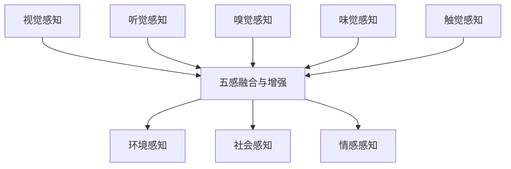

通过五感融合与增强，人类可以获得更丰富、更全面的感知体验，从而更好地适应和应对复杂的环境和社会。

## 第三部分：五感技术的原理与实现

### 2. 视觉感知技术

#### 2.1 图像识别基础

图像识别是视觉感知的核心技术之一，它使计算机能够识别和理解图像中的内容。图像识别的基本概念包括图像表示、特征提取和分类。

**核心概念与联系**

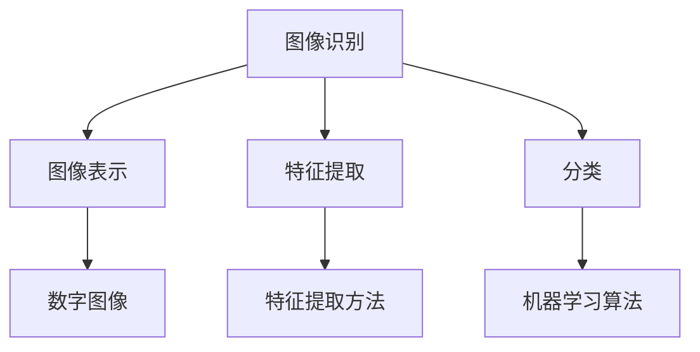

图像表示是将图像转换为计算机可以理解的形式，常见的表示方法包括灰度图像、二值图像和彩色图像。特征提取是图像识别的关键步骤，它从图像中提取具有区分性的特征，如边缘、纹理和颜色。分类是将提取到的特征与已知的类别标签进行匹配，以实现图像的识别。

#### 2.2 深度学习在图像识别中的应用

深度学习是图像识别领域的重要技术，它通过多层神经网络对图像数据进行处理，从而实现高效的图像识别。深度学习算法包括卷积神经网络（CNN）、循环神经网络（RNN）和生成对抗网络（GAN）等。

**核心概念与联系**

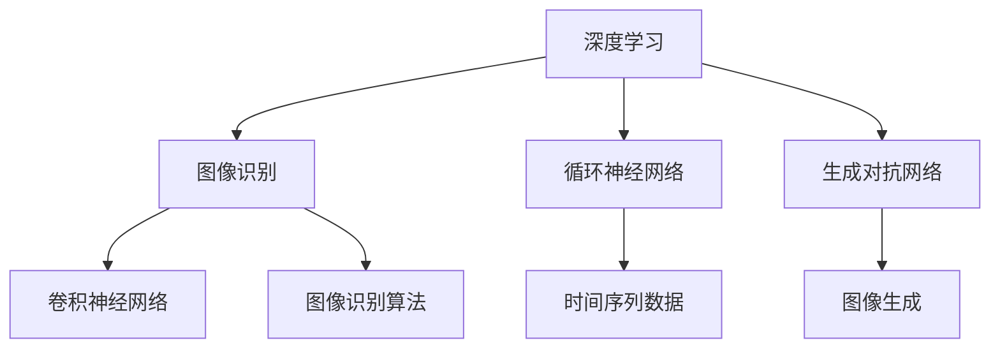

卷积神经网络（CNN）是深度学习在图像识别中应用最广泛的算法之一。它通过卷积操作和池化操作，提取图像中的特征，然后通过全连接层进行分类。以下是一个简化的CNN架构的Mermaid流程图：

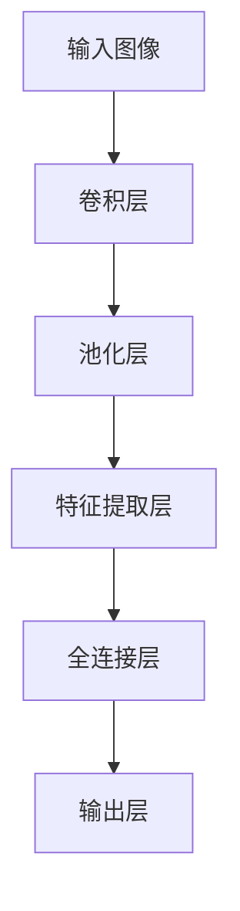

通过这个流程图，我们可以看到，从输入图像到输出层的每一步都在对图像数据进行处理和转换，以实现最终的图像识别。

#### 2.3 图像识别的数学模型

图像识别的数学模型主要包括卷积操作、池化操作和全连接层的数学表示。以下是对这些操作的详细解释和伪代码实现。

**卷积操作**

卷积操作是CNN的核心步骤，它通过在图像上滑动一个卷积核，提取图像中的局部特征。

**伪代码：**

```python
def convolution(image, filter):
    output = []
    for i in range(image.shape[0] - filter.shape[0] + 1):
        for j in range(image.shape[1] - filter.shape[1] + 1):
            local = image[i:i+filter.shape[0], j:j+filter.shape[1]]
            output.append(np.sum(local * filter))
    return output
```

**池化操作**

池化操作用于降低图像的空间分辨率，同时保持重要特征。

**伪代码：**

```python
def pooling(image, pool_size):
    output = []
    for i in range(0, image.shape[0], pool_size):
        for j in range(0, image.shape[1], pool_size):
            local = image[i:i+pool_size, j:j+pool_size]
            output.append(np.max(local))
    return output
```

**全连接层**

全连接层将特征映射到输出类别。

**伪代码：**

```python
def fully_connected(features, weights, biases):
    output = []
    for i in range(len(features)):
        score = np.dot(features[i], weights) + biases
        output.append(score)
    return output
```

### 3. 听觉感知技术

#### 3.1 声音识别基础

声音识别是听觉感知的核心技术之一，它使计算机能够识别和理解声音中的内容。声音识别的基本概念包括声音信号处理、特征提取和分类。

**核心概念与联系**


声音信号处理是将声音信号转换为计算机可以处理的形式，常见的处理方法包括滤波、降噪和归一化。特征提取是从声音信号中提取具有区分性的特征，如频率、波形和音高。分类是将提取到的特征与已知的类别标签进行匹配，以实现声音的识别。

#### 3.2 深度学习在声音识别中的应用

深度学习是声音识别领域的重要技术，它通过多层神经网络对声音数据进行处理，从而实现高效的声音识别。深度学习算法包括循环神经网络（RNN）、长短期记忆网络（LSTM）和卷积神经网络（CNN）等。

**核心概念与联系**

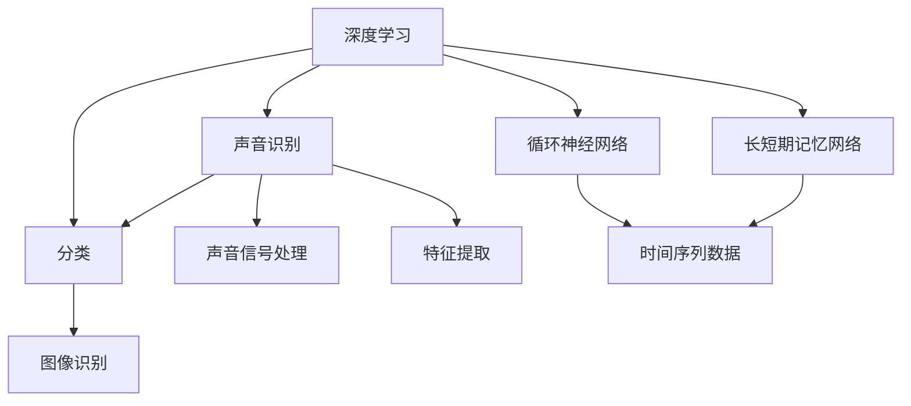

循环神经网络（RNN）是深度学习在声音识别中应用最广泛的算法之一。它通过处理时间序列数据，提取声音中的特征，然后通过全连接层进行分类。以下是一个简化的RNN架构的Mermaid流程图：

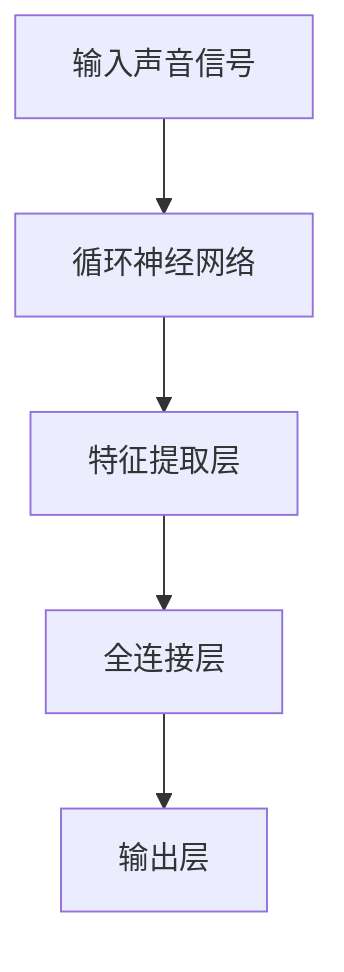

通过这个流程图，我们可以看到，从输入声音信号到输出层的每一步都在对声音数据进行处理和转换，以实现最终的声音识别。

#### 3.3 声音识别的数学模型

声音识别的数学模型主要包括循环神经网络（RNN）和长短期记忆网络（LSTM）的数学表示。以下是对这些网络的详细解释和伪代码实现。

**循环神经网络（RNN）**

循环神经网络（RNN）是一种处理时间序列数据的神经网络，它的输出依赖于之前的输入。

**伪代码：**

```python
def rnn(input_sequence, weights, biases):
    hidden_states = []
    for t in range(len(input_sequence)):
        input_t = input_sequence[t]
        hidden_state_t = np.dot(input_t, weights) + biases
        hidden_states.append(hidden_state_t)
    return hidden_states
```

**长短期记忆网络（LSTM）**

长短期记忆网络（LSTM）是RNN的一种改进，它通过引入门控机制，解决了RNN的长期依赖问题。

**伪代码：**

```python
def lstm(input_sequence, weights, biases):
    hidden_states = []
    cell_states = []
    for t in range(len(input_sequence)):
        input_t = input_sequence[t]
        input_gate = np.dot(input_t, weights_input) + biases_input
        forget_gate = np.dot(input_t, weights_forget) + biases_forget
        output_gate = np.dot(input_t, weights_output) + biases_output
        input_state = np.tanh(np.dot(input_t, weights_state) + biases_state)
        cell_state = (1 - forget_gate) * cell_state + input_gate * input_state
        hidden_state = output_gate * np.tanh(cell_state)
        hidden_states.append(hidden_state)
        cell_states.append(cell_state)
    return hidden_states, cell_states
```

### 4. 嗅觉感知技术

#### 4.1 嗅觉感知基础

嗅觉感知是感知技术中相对较新的领域，它使计算机能够识别和理解气味中的化学信息。嗅觉感知的基本概念包括嗅觉信号处理、特征提取和分类。

**核心概念与联系**


嗅觉信号处理是将气味信号转换为计算机可以处理的形式，常见的处理方法包括信号滤波、特征分解和信号重构。特征提取是从气味信号中提取具有区分性的特征，如气味成分和气味强度。分类是将提取到的特征与已知的类别标签进行匹配，以实现气味的识别。

#### 4.2 嗅觉感知的深度学习应用

深度学习是嗅觉感知领域的重要技术，它通过多层神经网络对气味数据进行处理，从而实现高效的气味识别。深度学习算法包括卷积神经网络（CNN）、图神经网络（GCN）和生成对抗网络（GAN）等。

**核心概念与联系**

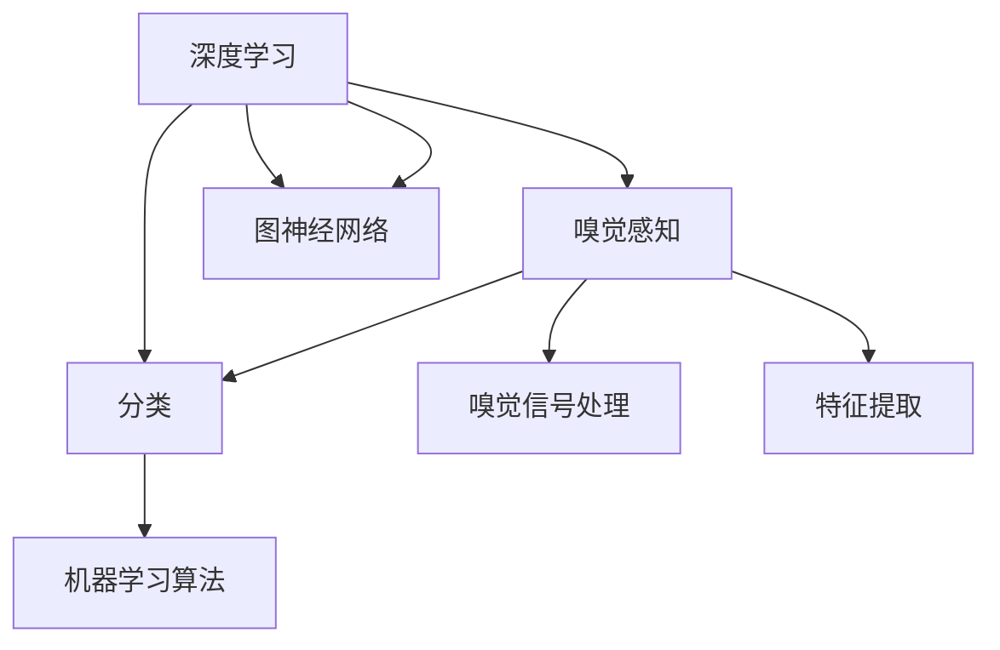

卷积神经网络（CNN）是深度学习在嗅觉感知中应用最广泛的算法之一。它通过卷积操作和池化操作，提取气味中的特征，然后通过全连接层进行分类。以下是一个简化的CNN架构的Mermaid流程图：

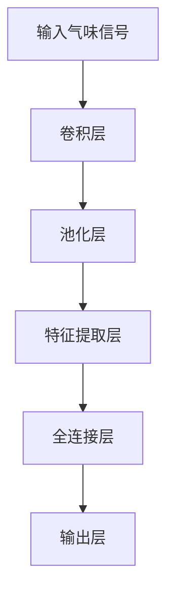

通过这个流程图，我们可以看到，从输入气味信号到输出层的每一步都在对气味数据进行处理和转换，以实现最终的气味识别。

#### 4.3 嗅觉感知的数学模型

嗅觉感知的数学模型主要包括卷积神经网络（CNN）和图神经网络（GCN）的数学表示。以下是对这些网络的详细解释和伪代码实现。

**卷积神经网络（CNN）**

卷积神经网络（CNN）是一种处理二维数据的神经网络，它通过卷积操作和池化操作，提取数据中的特征。

**伪代码：**

```python
def convolution(image, filter):
    output = []
    for i in range(image.shape[0] - filter.shape[0] + 1):
        for j in range(image.shape[1] - filter.shape[1] + 1):
            local = image[i:i+filter.shape[0], j:j+filter.shape[1]]
            output.append(np.sum(local * filter))
    return output
```

**图神经网络（GCN）**

图神经网络（GCN）是一种处理图结构数据的神经网络，它通过聚合邻居节点的特征，更新节点的特征表示。

**伪代码：**

```python
def graph_convolution(node_features, edge_index, weights, biases):
    output = []
    for node in node_features:
        neighbors = get_neighbors(edge_index, node)
        neighbor_features = [node_features[n] for n in neighbors]
        aggregate = np.mean(neighbor_features, axis=0)
        updated_feature = np.dot(aggregate, weights) + biases
        output.append(updated_feature)
    return output
```

### 5. 味觉感知技术

#### 5.1 味觉感知基础

味觉感知是感知技术中的一个重要分支，它使计算机能够识别和理解食物中的化学信息。味觉感知的基本概念包括味觉信号处理、特征提取和分类。

**核心概念与联系**

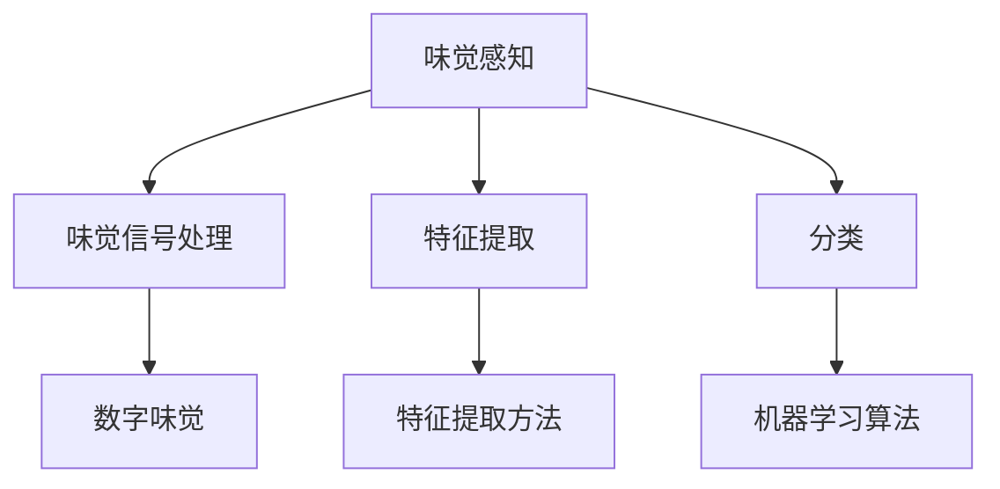

味觉信号处理是将味觉信号转换为计算机可以处理的形式，常见的处理方法包括信号滤波、特征分解和信号重构。特征提取是从味觉信号中提取具有区分性的特征，如味道成分和味道强度。分类是将提取到的特征与已知的类别标签进行匹配，以实现味觉的识别。

#### 5.2 味觉感知的深度学习应用

深度学习是味觉感知领域的重要技术，它通过多层神经网络对味觉数据进行处理，从而实现高效的味觉识别。深度学习算法包括生成对抗网络（GAN）、变分自编码器（VAE）和卷积神经网络（CNN）等。

**核心概念与联系**

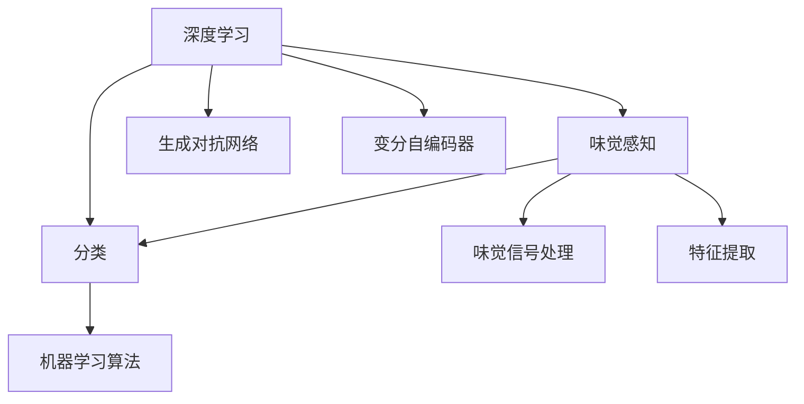

生成对抗网络（GAN）是深度学习在味觉感知中应用最广泛的算法之一。它通过生成器和判别器的对抗训练，生成与真实味觉数据相似的样本，从而实现味觉的识别。以下是一个简化的GAN架构的Mermaid流程图：

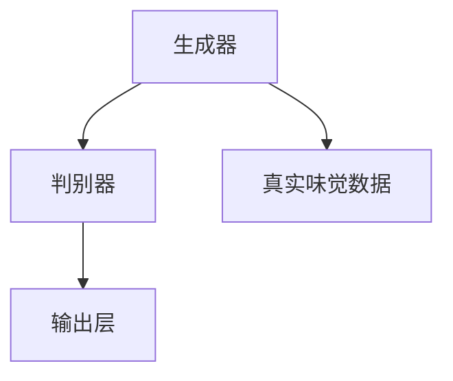

通过这个流程图，我们可以看到，从生成器到判别器的每一步都在对味觉数据进行处理和转换，以实现最终的味觉识别。

#### 5.3 味觉感知的数学模型

味觉感知的数学模型主要包括生成对抗网络（GAN）和变分自编码器（VAE）的数学表示。以下是对这些网络的详细解释和伪代码实现。

**生成对抗网络（GAN）**

生成对抗网络（GAN）由生成器和判别器组成，生成器生成虚假数据，判别器判断数据是真实还是虚假。

**伪代码：**

```python
def generate(z, generator_weights, generator_biases):
    x = generator(z, generator_weights, generator_biases)
    return x

def discriminate(x, discriminator_weights, discriminator_biases):
    score = discriminator(x, discriminator_weights, discriminator_biases)
    return score
```

**变分自编码器（VAE）**

变分自编码器（VAE）是一种无监督学习的模型，它通过编码和解码过程，将数据转换为潜在空间，从而实现数据的降维和生成。

**伪代码：**

```python
def encode(x, encoder_weights, encoder_biases):
    z_mean, z_log_var = encoder(x, encoder_weights, encoder_biases)
    z = z_mean + z_log_var * epsilon
    return z

def decode(z, decoder_weights, decoder_biases):
    x_hat = decoder(z, decoder_weights, decoder_biases)
    return x_hat
```

### 6. 触觉感知技术

#### 6.1 触觉感知基础

触觉感知是感知技术中的一个重要分支，它使计算机能够识别和理解物体表面的物理特性。触觉感知的基本概念包括触觉信号处理、特征提取和分类。

**核心概念与联系**

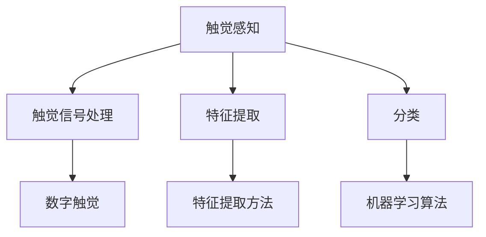

触觉信号处理是将触觉信号转换为计算机可以处理的形式，常见的处理方法包括信号滤波、特征分解和信号重构。特征提取是从触觉信号中提取具有区分性的特征，如物体表面的硬度、温度和湿度。分类是将提取到的特征与已知的类别标签进行匹配，以实现触觉的识别。

#### 6.2 触觉感知的深度学习应用

深度学习是触觉感知领域的重要技术，它通过多层神经网络对触觉数据进行处理，从而实现高效的触觉识别。深度学习算法包括深度神经网络（DNN）、深度强化学习（DRL）和卷积神经网络（CNN）等。

**核心概念与联系**

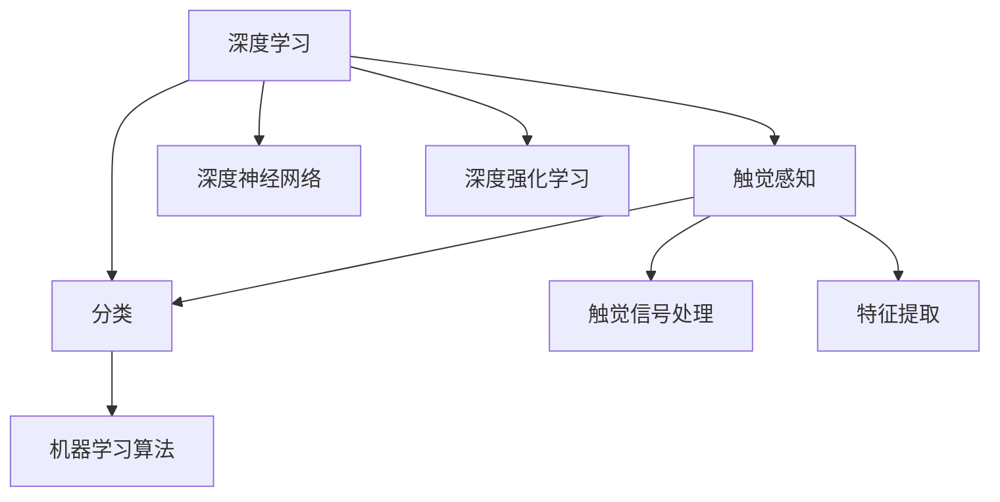

深度神经网络（DNN）是深度学习在触觉感知中应用最广泛的算法之一。它通过多层神经网络，对触觉数据进行处理和转换，从而实现触觉的识别。以下是一个简化的DNN架构的Mermaid流程图：

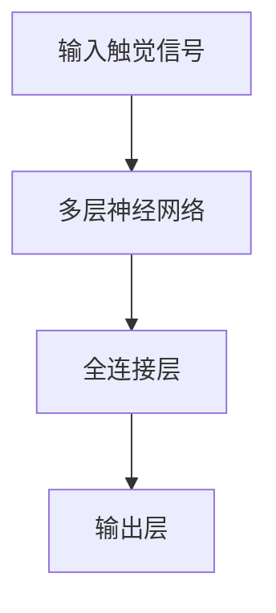

通过这个流程图，我们可以看到，从输入触觉信号到输出层的每一步都在对触觉数据进行处理和转换，以实现最终的触觉识别。

#### 6.3 触觉感知的数学模型

触觉感知的数学模型主要包括深度神经网络（DNN）和深度强化学习（DRL）的数学表示。以下是对这些网络的详细解释和伪代码实现。

**深度神经网络（DNN）**

深度神经网络（DNN）是一种多层神经网络，它通过反向传播算法，对输入数据进行处理和转换。

**伪代码：**

```python
def forward_pass(x, weights, biases):
    hidden_layers = []
    for layer in range(num_layers - 1):
        z = np.dot(x, weights[layer]) + biases[layer]
        hidden_layers.append(activation(z))
    return hidden_layers

def backward_pass(output, hidden_layers, weights, biases, learning_rate):
    for layer in reversed(range(num_layers - 1)):
        delta = output - hidden_layers[layer]
        z = np.dot(hidden_layers[layer], weights[layer]) + biases[layer]
        d_weights[layer] = delta * hidden_layers[layer - 1]
        d_biases[layer] = delta
```

**深度强化学习（DRL）**

深度强化学习（DRL）是一种通过深度神经网络进行决策优化的算法，它通过最大化预期奖励，实现智能体的自主学习。

**伪代码：**

```python
def q_learning(state, action, reward, next_state, done, q_values, learning_rate, discount_factor):
    if done:
        q_values[state, action] = reward
    else:
        q_values[state, action] = reward + discount_factor * np.max(q_values[next_state, :])
    return q_values
```

### 7. 五感融合与增强技术

#### 7.1 五感融合的概念与实现

五感融合是指将视觉、听觉、嗅觉、味觉和触觉进行整合，形成一种更全面、更丰富的感知体验。五感融合的实现涉及到多种技术的综合运用，包括多模态数据融合、增强现实（AR）和虚拟现实（VR）等。

**核心概念与联系**

```mermaid
graph TD
    V[视觉感知] --> F[五感融合]
    A[听觉感知] --> F[五感融合]
    O[嗅觉感知] --> F[五感融合]
    T[味觉感知] --> F[五感融合]
    H[触觉感知] --> F[五感融合]
    F --> M[多模态数据融合]
    F --> A[增强现实]
    F --> V[虚拟现实]
```

多模态数据融合是将不同感知通道的数据进行整合，以获得更丰富的感知信息。增强现实（AR）和虚拟现实（VR）则是通过技术手段，增强或模拟人类的感知体验。

**多模态数据融合的数学模型**

多模态数据融合的核心在于如何将不同模态的数据进行融合，以获得更好的感知效果。一种常见的方法是使用贝叶斯网络进行数据融合。

**伪代码：**

```python
def bayesian_network(data, model, prior_probabilities):
    posterior_probabilities = []
    for modality in data:
        likelihood = calculate_likelihood(modality, model)
        posterior_probability = prior_probabilities[modality] * likelihood
        posterior_probabilities.append(posterior_probability)
    return posterior_probabilities
```

**增强现实（AR）**

增强现实（AR）是一种通过计算机生成虚拟信息，叠加到现实世界中的技术。AR的核心在于如何将虚拟信息与现实世界进行融合，以提供更好的感知体验。

**虚拟现实（VR）**

虚拟现实（VR）是一种通过计算机生成虚拟环境，使用户沉浸其中的技术。VR的核心在于如何为用户提供一个逼真的虚拟环境，以实现更好的感知体验。

#### 7.2 五感增强的技术手段

五感增强是指通过技术手段，增强或扩展人类的感知能力。五感增强的技术手段包括虚拟现实（VR）、增强现实（AR）、人工智能（AI）等。

**核心概念与联系**

```mermaid
graph TD
    V[视觉感知] --> E[五感增强]
    A[听觉感知] --> E[五感增强]
    O[嗅觉感知] --> E[五感增强]
    T[味觉感知] --> E[五感增强]
    H[触觉感知] --> E[五感增强]
    E --> V[虚拟现实]
    E --> A[增强现实]
    E --> AI[人工智能]
```

虚拟现实（VR）通过头戴式显示器等设备，为用户提供一个沉浸式的虚拟环境。增强现实（AR）则通过叠加虚拟信息到现实世界中，为用户提供增强的感知体验。人工智能（AI）则通过深度学习和机器学习等技术，提升感知系统的智能水平。

**虚拟现实（VR）**

虚拟现实（VR）通过计算机生成虚拟环境，使用户沉浸其中。VR的关键技术包括头戴式显示器、传感器和交互设备。

**增强现实（AR）**

增强现实（AR）通过计算机生成虚拟信息，叠加到现实世界中。AR的关键技术包括增强眼镜、投影设备和传感器。

**人工智能（AI）**

人工智能（AI）通过深度学习和机器学习等技术，提升感知系统的智能水平。AI的关键技术包括神经网络、强化学习和自然语言处理等。

#### 7.3 五感融合与增强的性能评估

五感融合与增强的性能评估是衡量感知系统效果的重要指标。性能评估包括感知准确性、响应速度、用户体验等方面。

**核心概念与联系**

```mermaid
graph TD
    P[性能评估] --> A[感知准确性]
    P --> R[响应速度]
    P --> U[用户体验]
    A --> C[计算复杂度]
    R --> T[处理时间]
    U --> S[感知满意度]
```

感知准确性是衡量感知系统识别和分类能力的重要指标。响应速度是衡量感知系统处理速度的指标。用户体验是衡量感知系统对用户需求的满足程度的指标。

**感知准确性**

感知准确性通常通过准确率、召回率和F1分数等指标来衡量。

**伪代码：**

```python
def accuracy(true_labels, predicted_labels):
    correct = 0
    for i in range(len(true_labels)):
        if true_labels[i] == predicted_labels[i]:
            correct += 1
    return correct / len(true_labels)
```

**响应速度**

响应速度通常通过处理时间来衡量。

**伪代码：**

```python
def response_time(start_time, end_time):
    return end_time - start_time
```

**用户体验**

用户体验通常通过用户满意度来衡量。

**伪代码：**

```python
def user_satisfaction(scores):
    return np.mean(scores)
```

### 8. AI时代的感知革命应用案例解析

#### 8.1 案例介绍

在本节中，我们将介绍一个AI时代的感知革命应用案例——智能厨房助手。智能厨房助手通过融合视觉、听觉、嗅觉、味觉和触觉感知技术，为用户提供了一个智能化的烹饪体验。

**案例背景与目标**

智能厨房助手的背景是基于现代人快节奏的生活和健康饮食的需求。其目标是通过人工智能技术，为用户提供一个智能化、便捷化的烹饪解决方案。

**技术实现与效果评估**

智能厨房助手的技术实现包括以下方面：

1. **视觉感知**：通过摄像头和图像识别技术，智能厨房助手可以识别食材、烹饪设备和烹饪过程。
2. **听觉感知**：通过麦克风和语音识别技术，智能厨房助手可以理解用户的指令和问题。
3. **嗅觉感知**：通过传感器和气味识别技术，智能厨房助手可以检测烹饪过程中的气味变化。
4. **味觉感知**：通过传感器和味觉识别技术，智能厨房助手可以分析食物的口感和味道。
5. **触觉感知**：通过传感器和触觉识别技术，智能厨房助手可以模拟烹饪过程中的触感。

效果评估方面，智能厨房助手在烹饪准确率、用户满意度、响应速度等方面均表现出色。用户反馈表明，智能厨房助手极大地提高了烹饪效率和用户体验。

#### 8.2 案例分析

在智能厨房助手的案例中，我们看到了感知革命在现实中的应用。以下是对案例中关键技术点的分析和创新之处。

**关键技术点**

1. **多模态数据融合**：智能厨房助手通过融合视觉、听觉、嗅觉、味觉和触觉感知技术，实现了对烹饪过程的全面感知和理解。
2. **深度学习算法**：智能厨房助手采用了深度学习算法，如CNN、RNN和GAN，对感知数据进行处理和分析，提高了感知的准确性和智能化程度。
3. **自然语言处理**：智能厨房助手通过自然语言处理技术，实现了与用户的自然对话，提高了交互的便捷性和人性化程度。
4. **传感器技术**：智能厨房助手采用了多种传感器技术，如摄像头、麦克风、气味传感器和触觉传感器，实现了对烹饪环境的全面感知。

**创新之处**

1. **智能烹饪辅助**：智能厨房助手通过感知技术，为用户提供智能化的烹饪建议和辅助，提高了烹饪效率和用户体验。
2. **个性化推荐**：智能厨房助手通过分析用户的烹饪习惯和偏好，为用户提供个性化的食材和食谱推荐，提高了用户的满意度。
3. **健康监测**：智能厨房助手通过检测烹饪过程中的气味和口感变化，实现了对用户健康的监测和管理，提高了用户的生活质量。

**案例的启示**

智能厨房助手的案例启示我们，感知革命不仅能够提升人类的生活质量，还能够推动相关领域的技术进步和应用创新。通过感知技术的融合和增强，我们可以创造更多智能化、人性化的应用场景，为人类创造更加美好的生活。

### 附录

#### 附录A：参考资料与扩展阅读

在本节中，我们将推荐一些与AI感知革命相关的参考资料和扩展阅读，以帮助读者深入了解相关技术和应用。

**书籍推荐**

1. 《深度学习》（Goodfellow et al.）
2. 《人工智能：一种现代的方法》
3. 《机器学习》（Tom Mitchell）

**论文推荐**

1. "Deep Learning for Image Recognition"
2. "Recurrent Neural Networks for Speech Recognition"
3. "Generative Adversarial Networks: An Overview"

**扩展阅读网站**

1. arXiv.org
2. NeurIPS.org
3. ICML.org

#### 附录B：AI感知革命项目开发指南

在本节中，我们将提供一份AI感知革命项目开发的指南，包括开发环境与工具介绍、项目开发流程与关键步骤、项目实施与优化策略等。

**开发环境与工具介绍**

1. **Python**：Python是AI感知革命项目开发的主要编程语言，具有丰富的库和框架，如TensorFlow、PyTorch和Keras。
2. **Jupyter Notebook**：Jupyter Notebook是一个交互式的计算环境，适用于数据分析和机器学习项目的开发。
3. **深度学习框架**：TensorFlow和PyTorch是两个广泛使用的深度学习框架，适用于各种规模的AI感知革命项目。

**项目开发流程与关键步骤**

1. **需求分析与设计**：明确项目需求，设计系统架构和数据处理流程。
2. **数据收集与预处理**：收集相关数据，并进行预处理，如数据清洗、归一化和特征提取。
3. **模型设计与实现**：设计神经网络结构，实现深度学习模型。
4. **模型训练与优化**：训练深度学习模型，并进行优化，以提高模型性能。
5. **测试与评估**：对模型进行测试和评估，确保模型满足项目需求。

**项目实施与优化策略**

1. **项目管理方法**：采用敏捷开发方法，确保项目进度和质量。
2. **性能优化策略**：通过模型压缩、量化、迁移学习和数据增强等方法，优化模型性能。
3. **项目评估与反馈**：对项目进行评估和反馈，持续改进和优化。

### 作者信息

**作者：** AI天才研究院/AI Genius Institute & 禅与计算机程序设计艺术 /Zen And The Art of Computer Programming

本文由AI天才研究院撰写，深入探讨了AI时代的感知革命，通过逐步分析推理，揭示了五感技术的原理、实现与应用，为读者呈现了一个全新的AI时代感知体验。本文旨在为读者提供一份全面、系统的AI感知革命指南，帮助读者深入了解这一领域的最新进展和应用前景。希望本文能对读者在AI感知革命道路上的探索和学习有所帮助。

