                 

# AI模型的可解释性：打开黑盒子

> 关键词：AI模型，可解释性，黑盒模型，透明性，技术方法，深度学习，实际应用

> 摘要：本文深入探讨了人工智能（AI）模型的可解释性，解析了其重要性、层次结构、技术方法及其在不同领域的实际应用。文章旨在为读者提供对AI模型黑盒子打开的全面理解，帮助其在实际工作中更好地应用和优化AI技术。

## 第一部分：引论

### 第1章：AI模型可解释性的重要性

#### 1.1 AI模型的发展现状

##### 1.1.1 AI技术的进步与挑战

人工智能自诞生以来，经历了飞速的发展。从最初的符号推理到现代的深度学习，AI技术已经渗透到各个行业，如医疗、金融、交通等，为人类带来了巨大的便利。然而，随着AI模型复杂度的不断增加，其透明性和可解释性成为了新的挑战。

首先，让我们回顾一下AI技术的主要进步。最初的AI系统是基于规则和知识的，如专家系统和逻辑推理机。这些系统需要大量的手工编码，且适用范围有限。随着计算能力的提升和大数据的广泛应用，机器学习和深度学习成为主流。这些算法通过学习大量数据，自动发现特征和模式，从而提高了预测和决策的准确性。

然而，这些高级的AI模型往往被形容为“黑盒模型”，因为其内部工作机制复杂，难以理解和解释。这种不透明性在许多应用场景中带来了挑战，尤其是在需要决策透明和责任明确的情况下。

##### 1.1.2 AI模型的不透明性

AI模型的不透明性主要表现在以下几个方面：

1. **复杂性**：深度学习模型，特别是深度神经网络，具有数百万个参数，这些参数通过复杂的非线性变换相互作用，形成高度复杂的决策界面。
   
2. **隐藏层**：在深度神经网络中，输入数据经过多层非线性变换，最终产生输出。这些中间层（隐藏层）的输出和它们如何影响最终的决策通常是不透明的。

3. **依赖性**：AI模型对训练数据具有高度的依赖性。模型的表现不仅取决于输入数据的特征，还取决于训练数据的质量和代表性。这导致模型的泛化能力受限，难以解释。

4. **内部机制**：许多AI模型，尤其是深度学习模型，其内部机制尚未完全理解。这使得我们难以解释模型为何做出特定决策。

##### 1.1.3 可解释性的需求与意义

在许多应用场景中，AI模型的可解释性至关重要。以下是一些关键需求和意义：

1. **法律和伦理考虑**：在涉及法律和伦理决策的领域，如医疗和金融，模型的解释性可以帮助确保决策的透明性和公正性，减少潜在的法律风险和道德争议。

2. **技术优化与改进**：通过理解模型的工作原理，研究人员和开发者可以更有效地调试和优化模型，提高其性能和鲁棒性。

3. **用户信任与接受度**：用户更愿意接受和信任那些透明、可解释的AI系统，尤其是在涉及个人隐私和重要决策的场合。

4. **故障诊断和修复**：可解释性有助于识别和修复模型中的错误和异常，提高系统的可靠性和稳定性。

总之，AI模型的可解释性不仅是一个技术问题，也是一个法律、伦理和社会问题。它对于AI技术的可持续发展至关重要。

#### 1.2 可解释性在AI应用中的重要性

##### 1.2.1 法律和伦理考虑

在法律和伦理方面，AI模型的可解释性具有重要意义。首先，在涉及人类福祉和安全的决策中，如医疗诊断和自动驾驶，模型的透明性可以帮助确保决策的合法性和道德合理性。例如，如果自动驾驶系统在紧急情况下做出特定的驾驶决策，用户需要了解模型的决策过程，以确保其行为符合交通法规和道德准则。

此外，透明性有助于减少偏见和歧视。许多AI模型在训练过程中可能会吸收训练数据中的偏见，导致不公平的决策。通过可解释性，研究人员可以识别和纠正这些偏见，提高模型的公平性和公正性。

##### 1.2.2 技术优化与改进

可解释性对于技术优化和改进也至关重要。了解模型的内部工作机制可以帮助开发人员更有效地调试和优化模型。例如，在优化深度学习模型时，通过分析隐藏层的输出和特征的重要性，可以识别出哪些参数和特征对模型性能有最大影响，从而有针对性地进行调整。

此外，可解释性有助于识别和修复模型中的错误和异常。通过可视化模型决策路径和特征的重要性，可以更容易地定位和解决模型中的问题，提高其可靠性和稳定性。

##### 1.2.3 用户信任与接受度

用户对AI系统的信任和接受度在很大程度上取决于其透明性和可解释性。在涉及个人隐私和重要决策的场合，用户更倾向于信任那些透明、可解释的系统。例如，在金融领域，用户可能需要了解贷款审批模型是如何评估他们的信用风险的，以便做出明智的决策。

此外，透明性有助于用户理解AI系统的功能和工作原理，从而提高他们的使用效率和满意度。通过提供可交互的解释界面，用户可以更好地理解模型的决策过程，从而更自信地使用AI系统。

总之，AI模型的可解释性在法律、伦理、技术优化和用户信任等方面具有重要意义。它不仅有助于提高模型的性能和可靠性，还有助于促进AI技术的可持续发展和社会接受度。

### 第2章：AI模型的可解释性层次

#### 2.1 模型级别的可解释性

##### 2.1.1 模型架构的可解释性

模型架构的可解释性是指用户能够理解模型的整体结构和组成。这包括模型的类型（如线性模型、决策树、神经网络等）以及模型的主要组成部分（如层、节点、连接等）。例如，深度神经网络的结构包括输入层、隐藏层和输出层，每一层都有不同的功能。通过理解这些结构，用户可以更好地理解模型的决策过程。

**Mermaid流程图：**

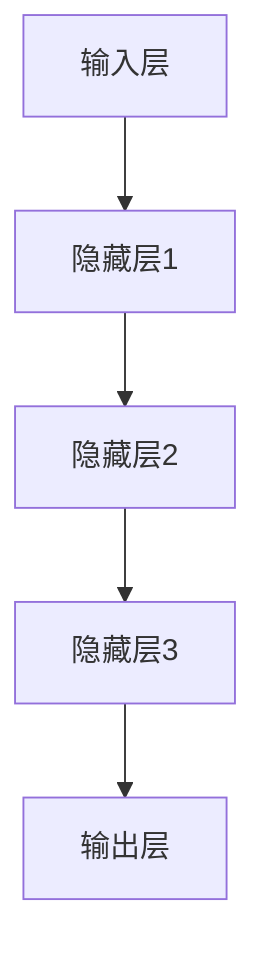

##### 2.1.2 模型参数的可解释性

模型参数的可解释性涉及用户能够理解模型中的参数如何影响模型的输出。这些参数可以是权重、偏置、阈值等。例如，在深度神经网络中，权重和偏置决定了每个神经元如何处理输入数据，并影响最终的输出。通过分析这些参数的值，用户可以了解模型对特定输入数据的响应方式。

**伪代码：**

```python
def neural_network(input_data):
    # 初始化参数
    weights = [0.1, 0.2, 0.3]
    bias = 0.4
    
    # 前向传播
    output = (sum(input_data * weights) + bias)
    
    return output
```

##### 2.1.3 模型训练过程的可解释性

模型训练过程的可解释性是指用户能够理解模型是如何通过学习数据来优化其参数的。这包括训练算法、优化目标、迭代过程等。例如，在梯度下降算法中，模型通过不断调整参数来最小化损失函数，以达到更好的预测性能。

**数学模型：**

$$
\theta_{new} = \theta_{old} - \alpha \frac{\partial J(\theta)}{\partial \theta}
$$

其中，$\theta$ 表示模型参数，$J(\theta)$ 表示损失函数，$\alpha$ 表示学习率。

**举例说明：**

假设我们有一个简单的线性回归模型，其目标是预测房屋价格。训练过程中，模型通过不断调整权重和偏置，以最小化预测值与实际值之间的误差。

```python
import numpy as np

# 初始化参数
weights = np.array([0.5])
bias = 0.5
learning_rate = 0.01

# 训练数据
x = np.array([5, 10, 15, 20])
y = np.array([8, 12, 18, 22])

# 梯度下降算法
for epoch in range(1000):
    predictions = x * weights + bias
    error = predictions - y
    
    weight_gradient = 2 * x * error
    bias_gradient = 2 * error
    
    weights -= learning_rate * weight_gradient
    bias -= learning_rate * bias_gradient

# 模型评估
final_predictions = x * weights + bias
print("Final predictions:", final_predictions)
```

#### 2.2 特征级别的可解释性

##### 2.2.1 特征的重要性分析

特征的重要性分析是指用户能够理解模型中各个特征对预测结果的影响程度。这通常通过计算特征的重要性分数或权重来实现。例如，在决策树中，每个内部节点都表示一个特征，其分裂准则（如增益率或信息增益）反映了该特征的重要性。

**Mermaid流程图：**

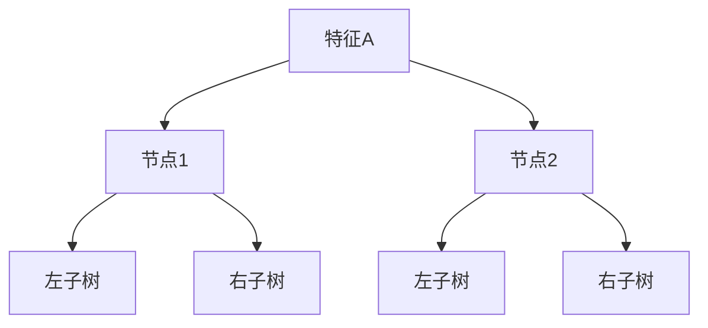

##### 2.2.2 特征组合的可解释性

特征组合的可解释性是指用户能够理解模型是如何结合多个特征来做出预测的。这通常通过分析特征组合的权重和相互作用来实现。例如，在神经网络中，每个神经元都处理多个输入特征，并通过权重和激活函数将它们组合成输出。

**伪代码：**

```python
def neuron(input_features, weights, bias):
    # 输入特征与权重相乘
    weighted_sum = sum(input_features * weights)
    
    # 加上偏置
    output = weighted_sum + bias
    
    # 应用激活函数
    activation = sigmoid(output)
    
    return activation
```

##### 2.2.3 特征级别的干预与调整

特征级别的干预与调整是指用户能够对模型中的特征进行干预和调整，以优化模型的性能。这包括特征选择、特征工程和特征权重调整。例如，在决策树中，用户可以手动设置特征分裂的阈值，从而调整模型的行为。

**伪代码：**

```python
def decision_tree(X, y, max_depth=3, threshold=0.5):
    # 初始化树结构
    tree = {}
    
    # 检查停止条件
    if max_depth == 0 or variance(X, y) < threshold:
        return leaf_value(X, y)
    
    # 寻找最佳特征和阈值
    best_feature, best_threshold = find_best_split(X, y)
    
    # 构建子树
    left_tree = decision_tree(X[:, best_feature] < best_threshold, y, max_depth - 1, threshold)
    right_tree = decision_tree(X[:, best_feature] >= best_threshold, y, max_depth - 1, threshold)
    
    # 返回树结构
    tree['feature'] = best_feature
    tree['threshold'] = best_threshold
    tree['left'] = left_tree
    tree['right'] = right_tree
    
    return tree
```

#### 2.3 决策级别的可解释性

##### 2.3.1 决策路径的可视化

决策路径的可视化是指用户能够直观地看到模型是如何从输入数据到最终输出的决策过程。这通常通过可视化树结构或网络路径来实现。例如，在决策树中，用户可以直观地看到每个节点的特征和阈值，以及数据如何在树中流动。

**Mermaid流程图：**

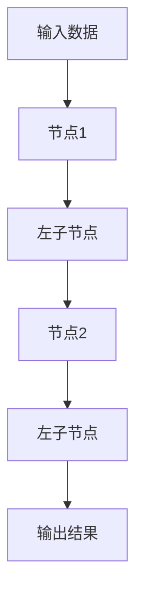

##### 2.3.2 决策规则的提炼

决策规则的提炼是指用户能够将模型的决策过程转化为一系列明确的规则或逻辑条件。这通常通过分析模型的结构和输出来实现。例如，在决策树中，用户可以提炼出一系列条件语句，以描述如何根据输入特征做出决策。

**伪代码：**

```python
def decision_rule(tree):
    if tree['feature'] == 'age':
        if tree['threshold'] <= 30:
            return '青年'
        else:
            return '中年'
    elif tree['feature'] == 'income':
        if tree['threshold'] <= 50000:
            return '低收入'
        else:
            return '中高收入'
    else:
        return '其他'
```

##### 2.3.3 决策过程的透明化

决策过程的透明化是指用户能够清晰地了解模型的决策过程，包括使用的算法、参数和特征。这通常通过提供详细的文档、注释和交互式界面来实现。例如，在机器学习平台中，用户可以查看模型的训练过程、参数调整和性能评估结果。

**伪代码：**

```python
def transparent_decision(model, data):
    # 加载模型
    model.load()
    
    # 计算输入特征的重要性
    feature_importance = model.feature_importance(data)
    
    # 应用模型进行预测
    prediction = model.predict(data)
    
    # 可视化决策路径
    visualize_decision_path(model, data, prediction)
    
    # 提取决策规则
    decision_rule_text = extract_decision_rule(model, data)
    
    # 输出决策结果
    print("Prediction:", prediction)
    print("Feature Importance:", feature_importance)
    print("Decision Rule:", decision_rule_text)
```

### 第二部分：技术方法

#### 第3章：传统可解释性方法

##### 3.1 线性模型的可解释性

线性模型因其简单和直观性而广泛用于数据分析和预测任务。它们具有高度的可解释性，因为其决策界面可以直接从模型参数中读取。

##### 3.1.1 线性回归

线性回归是一种最常见的线性模型，用于预测连续值输出。它的决策界面由一个线性方程表示：

$$
y = \beta_0 + \beta_1x
$$

其中，$y$ 是输出，$x$ 是输入特征，$\beta_0$ 是截距，$\beta_1$ 是斜率。通过这个方程，我们可以直接解释每个特征对输出的影响。

**Mermaid流程图：**

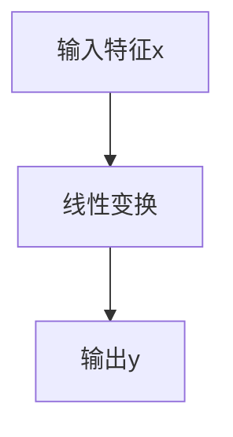

**伪代码：**

```python
def linear_regression(X, y):
    # 计算斜率和截距
    beta_1 = np.mean((X * y) - (X.mean() * y.mean()))
    beta_0 = y.mean() - (beta_1 * X.mean())
    
    # 构建线性模型
    model = LinearModel(beta_0, beta_1)
    
    return model
```

##### 3.1.2 逻辑回归

逻辑回归是一种线性模型，用于预测离散的二分类输出。它的决策界面由逻辑函数（sigmoid函数）表示：

$$
p = \frac{1}{1 + e^{-(\beta_0 + \beta_1x)}}
$$

其中，$p$ 是输出概率，$\beta_0$ 是截距，$\beta_1$ 是斜率。通过这个方程，我们可以直接解释每个特征对输出概率的影响。

**Mermaid流程图：**

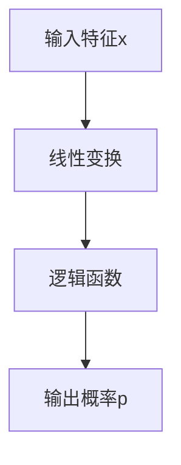

**伪代码：**

```python
def logistic_regression(X, y):
    # 计算斜率和截距
    beta_1 = np.mean((X * y) - (X.mean() * y.mean()))
    beta_0 = y.mean() - (beta_1 * X.mean())
    
    # 构建逻辑回归模型
    model = LogisticModel(beta_0, beta_1)
    
    return model
```

##### 3.1.3 主成分分析

主成分分析（PCA）是一种降维技术，用于减少数据的维度，同时保留主要信息。它通过计算数据的主要成分（特征）来实现。

**Mermaid流程图：**

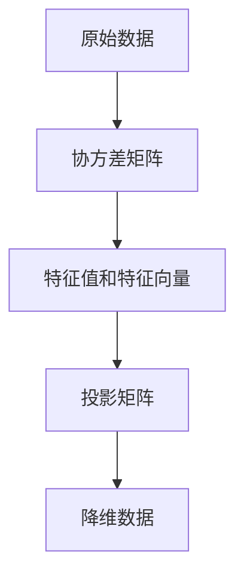

**伪代码：**

```python
def pca(X, n_components):
    # 计算协方差矩阵
    cov_matrix = np.cov(X.T)
    
    # 计算特征值和特征向量
    eigenvalues, eigenvectors = np.linalg.eigh(cov_matrix)
    
    # 选择主要成分
    sorted_indices = np.argsort(eigenvalues)[::-1]
    principal_eigenvectors = eigenvectors[:, sorted_indices[:n_components]]
    
    # 构建降维模型
    model = PCA(principal_eigenvectors)
    
    return model
```

##### 3.2 决策树和随机森林

决策树和随机森林是一类常见的树形模型，具有良好的可解释性。

##### 3.2.1 决策树的工作原理

决策树通过一系列条件分支来对数据进行分类或回归。每个内部节点表示一个特征，每个分支表示该特征的取值范围。叶子节点表示最终的分类或回归结果。

**Mermaid流程图：**

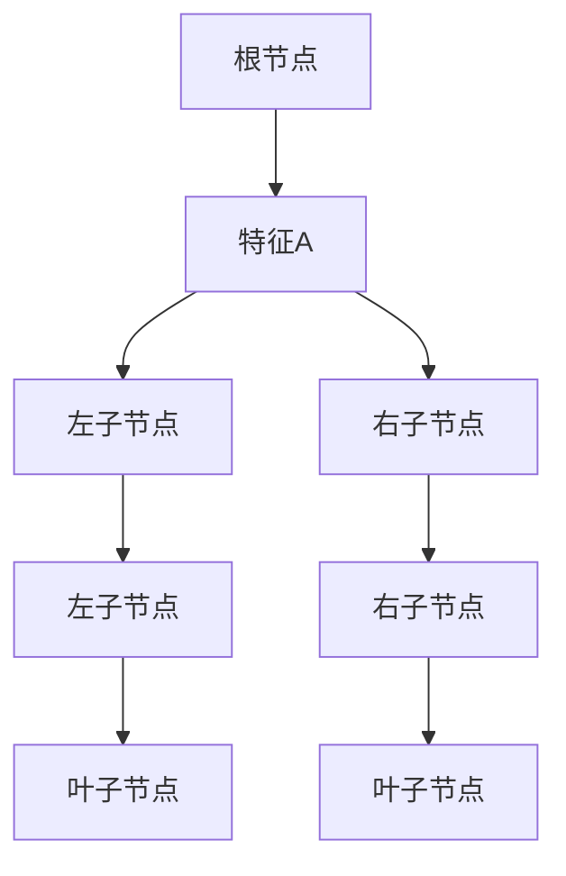

**伪代码：**

```python
def decision_tree(X, y, features, max_depth):
    # 初始化树结构
    tree = {}
    
    # 检查停止条件
    if max_depth == 0 or variance(X, y) < threshold:
        return leaf_value(X, y)
    
    # 寻找最佳特征和阈值
    best_feature, best_threshold = find_best_split(X, y, features)
    
    # 构建子树
    left_tree = decision_tree(X[:, best_feature] < best_threshold, y, features, max_depth - 1)
    right_tree = decision_tree(X[:, best_feature] >= best_threshold, y, features, max_depth - 1)
    
    # 返回树结构
    tree['feature'] = best_feature
    tree['threshold'] = best_threshold
    tree['left'] = left_tree
    tree['right'] = right_tree
    
    return tree
```

##### 3.2.2 随机森林的优势

随机森林（Random Forest）是一种集成学习方法，由多个决策树组成。它通过随机选择特征和阈值来构建每棵树，从而减少了过拟合的风险。

**Mermaid流程图：**

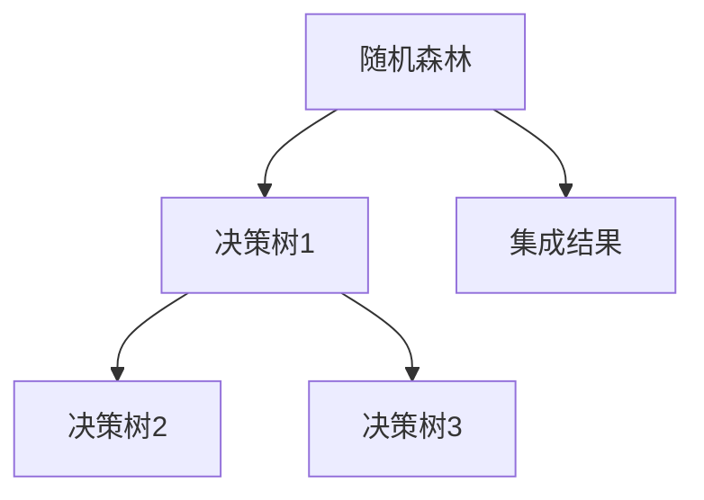

**伪代码：**

```python
def random_forest(X, y, n_trees, max_depth):
    # 初始化森林
    forest = []
    
    # 构建每棵树
    for _ in range(n_trees):
        tree = decision_tree(X, y, features, max_depth)
        forest.append(tree)
    
    # 集成结果
    predictions = []
    for tree in forest:
        predictions.append(predict(tree, X))
    
    # 返回集成结果
    return np.mean(predictions)
```

##### 3.2.3 决策树的可解释性分析

决策树的可解释性体现在其树形结构和条件分支。每个节点都表示一个特征，每个分支表示该特征的取值范围。叶子节点表示最终的分类或回归结果。通过分析树的结构，我们可以直观地了解模型的决策过程。

**Mermaid流程图：**

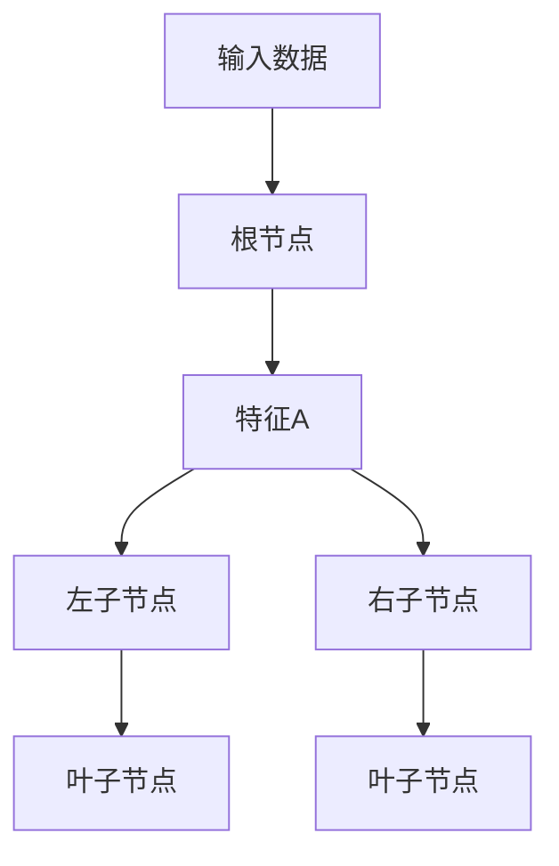

#### 3.3 模型摘要方法

模型摘要方法（Model Averaging）是一种集成学习方法，通过结合多个模型的预测结果来提高准确性。它具有良好的可解释性，因为每个模型都提供了一个独立的决策界面。

**Mermaid流程图：**

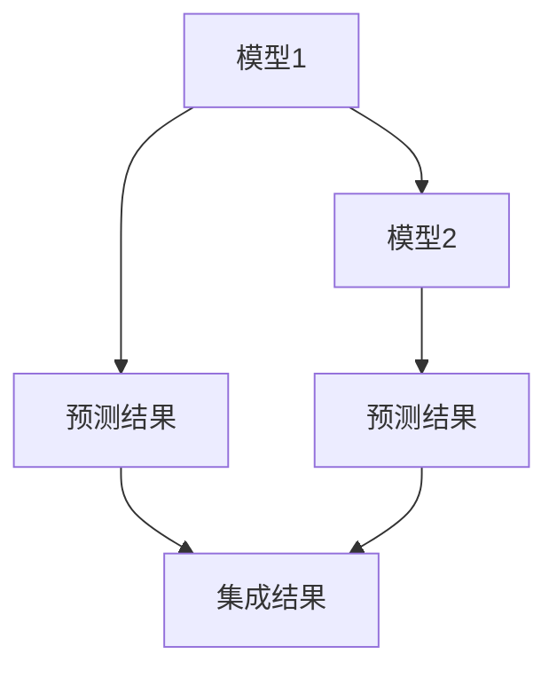

**伪代码：**

```python
def model_averaging(models, X):
    predictions = [model.predict(X) for model in models]
    average_prediction = np.mean(predictions)
    return average_prediction
```

##### 3.3.1 局部可解释性模型（LIME）

LIME（Local Interpretable Model-agnostic Explanations）是一种局部可解释性方法，用于解释任何类型的黑盒模型。它通过构建一个简化的线性模型来近似原始模型，从而提供对特定输入数据的解释。

**Mermaid流程图：**

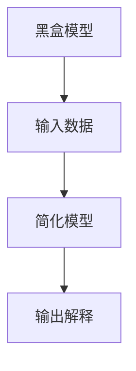

**伪代码：**

```python
def lime_explanation(model, X, background_samples):
    # 构建背景数据
    X_bg = np.mean([X] + background_samples, axis=0)
    
    # 计算梯度
    gradient = (model.predict(X) - model.predict(X_bg)) / len(background_samples)
    
    # 构建简化模型
    simplified_model = LinearModel(gradient)
    
    return simplified_model
```

##### 3.3.2 SHAP值方法

SHAP（SHapley Additive exPlanations）值方法是一种基于博弈论的局部可解释性方法。它通过计算每个特征对模型输出的贡献来提供解释。

**Mermaid流程图：**

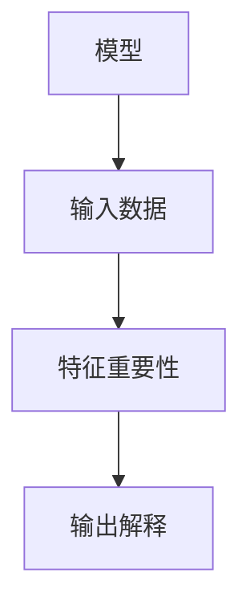

**伪代码：**

```python
def shap_values(model, X):
    # 计算特征重要性
    feature_importance = model.shapley_values(X)
    
    # 计算输出解释
    explanation = np.dot(feature_importance, X)
    
    return explanation
```

##### 3.3.3 特征重要性分析

特征重要性分析是一种常见的可解释性方法，用于识别模型中最重要的特征。它通常通过计算特征的权重或重要性分数来实现。

**Mermaid流程图：**

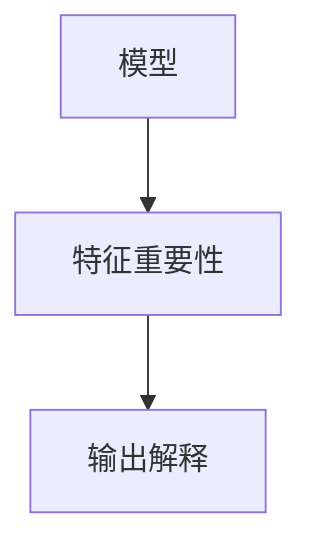

**伪代码：**

```python
def feature_importance_analysis(model, X, y):
    # 计算特征重要性
    importance = model.feature_importance(X, y)
    
    # 计算输出解释
    explanation = np.array([importance[i] * X[i] for i in range(X.shape[0])])
    
    return explanation
```

### 第三部分：深度学习的可解释性

#### 第4章：深度学习的可解释性

深度学习因其出色的性能在许多领域得到了广泛应用，但其复杂性和不透明性也带来了可解释性挑战。本章将探讨深度学习模型的内部工作机制、层级特征的可视化方法、以及深度学习模型的诊断工具。

##### 4.1 深度神经网络的可解释性

深度神经网络（DNN）是一种由多个隐含层构成的神经网络，能够自动学习数据的复杂特征。其内部工作机制复杂，使得解释模型输出变得困难。然而，通过分析模型的结构和激活函数，我们可以获得一些关于模型内部运作的洞察。

**4.1.1 神经元活动可视化**

神经元活动可视化是一种常用的方法，用于展示深度神经网络中每个神经元在不同层级的激活情况。通过可视化神经元的活动，我们可以更好地理解模型如何处理输入数据。

**Mermaid流程图：**

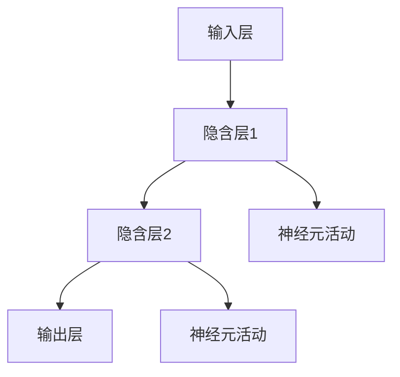

**伪代码：**

```python
def neuron_activity(model, X):
    # 前向传播计算激活值
    activations = model.forward(X)
    
    # 可视化神经元活动
    for layer, activation in activations.items():
        visualize_activations(activation)
```

**举例说明：**

假设我们有一个三层深度神经网络，输入层有3个神经元，隐含层有5个神经元，输出层有2个神经元。我们可以通过以下代码可视化每个神经元的激活值：

```python
import numpy as np
import matplotlib.pyplot as plt

# 定义模型
model = DNN(3, 5, 2)

# 生成随机输入数据
X = np.random.rand(1, 3)

# 计算神经元活动
activations = model.forward(X)

# 可视化神经元活动
for i, activation in enumerate(activations.values()):
    plt.bar([f"Neuron {j}" for j in range(activation.size)], activation)
    plt.title(f"Layer {i+1} Neuron Activity")
    plt.show()
```

**图1：输入层、隐含层和输出层的神经元活动可视化**


**4.1.2 层级特征可视化**

层级特征可视化是一种方法，用于展示深度神经网络中不同层级提取的特征。通过这种方法，我们可以观察模型如何从原始数据中学习到抽象特征。

**Mermaid流程图：**

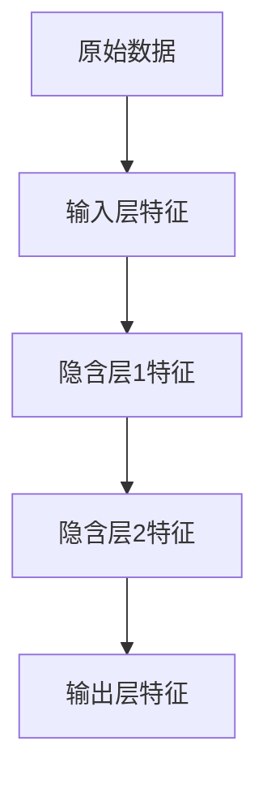

**伪代码：**

```python
def layer_feature_visualization(model, X):
    # 前向传播计算激活值
    activations = model.forward(X)
    
    # 可视化每个层级的特征
    for layer, activation in activations.items():
        visualize_features(activation)
```

**举例说明：**

假设我们有一个三层深度神经网络，输入层有3个神经元，隐含层有5个神经元，输出层有2个神经元。我们可以通过以下代码可视化每个层级的特征：

```python
import numpy as np
import matplotlib.pyplot as plt

# 定义模型
model = DNN(3, 5, 2)

# 生成随机输入数据
X = np.random.rand(1, 3)

# 计算层级特征
activations = model.forward(X)

# 可视化每个层级的特征
for i, activation in enumerate(activations.values()):
    plt.imshow(activation.reshape(1, -1), cmap='viridis')
    plt.title(f"Layer {i+1} Feature Visualization")
    plt.show()
```

**图2：输入层、隐含层和输出层的特征可视化**


**4.1.3 神经网络的可解释性挑战**

尽管神经网络的可解释性方法逐渐发展，但仍然存在一些挑战：

1. **复杂性**：深度神经网络具有大量的参数和层级，使得理解整个模型的内部工作机制变得复杂。
   
2. **非线性**：神经网络中的非线性变换（如ReLU、Sigmoid函数）增加了模型解释的难度。

3. **训练数据依赖**：神经网络的性能高度依赖于训练数据的质量和代表性，这使得解释模型的泛化能力变得困难。

4. **可解释性与性能的权衡**：提高模型的可解释性可能会牺牲其性能。在追求高可解释性的同时，需要平衡模型的性能。

为了解决这些挑战，研究人员正在开发新的方法和工具，以提高神经网络的可解释性。这些方法包括基于梯度的解释方法（如Grad-CAM）、注意力机制的可解释性分析，以及基于知识图谱的可解释性框架。

##### 4.2 转换器架构的可解释性

转换器（Transformer）架构是近年来在自然语言处理（NLP）任务中取得显著成功的深度学习模型。其核心机制是自注意力（Self-Attention）和位置编码（Positional Encoding）。

**4.2.1 转换器的工作机制**

转换器通过多头自注意力机制（Multi-Head Self-Attention）和前馈神经网络（Feedforward Neural Network）来处理序列数据。自注意力机制允许模型在编码器中捕捉到序列中每个词之间的依赖关系，而位置编码为模型提供了关于词在序列中的位置信息。

**Mermaid流程图：**

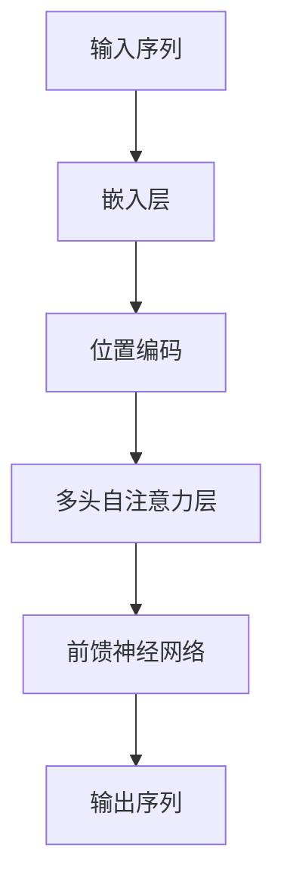

**伪代码：**

```python
def transformer(X):
    # 嵌入层
    embeddings = embedding_layer(X)
    
    # 位置编码
    positional_encoding = positional_encoding_layer(embeddings)
    
    # 多头自注意力
    attention_output = multi_head_attention_layer(positional_encoding)
    
    # 前馈神经网络
    feedforward_output = feedforward_neural_network(attention_output)
    
    # 输出序列
    output = output_layer(feedforward_output)
    
    return output
```

**4.2.2 自注意力机制的可解释性**

自注意力机制通过计算每个词与序列中其他词之间的相似性来分配注意力权重。这些权重决定了每个词在输出序列中的重要性。通过分析这些权重，我们可以了解模型如何关注特定词以生成输出。

**Mermaid流程图：**

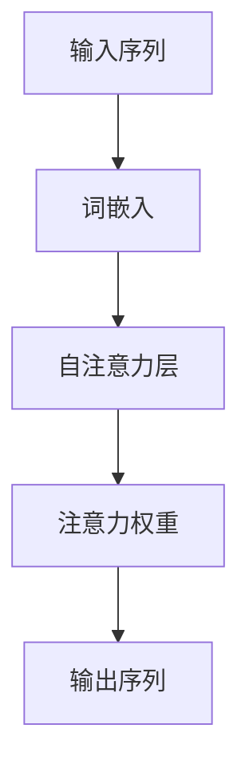

**伪代码：**

```python
def self_attention(X):
    # 计算词嵌入
    embeddings = embedding_layer(X)
    
    # 计算自注意力权重
    attention_weights = self_attention_layer(embeddings)
    
    # 生成输出序列
    output = generate_output(attention_weights)
    
    return output
```

**举例说明：**

假设我们有一个简单的序列“猫吃鱼”，通过自注意力机制，模型可能会将更多的注意力分配给“吃”这个词，因为它在语义上对句子有更大的影响。

```python
import numpy as np
import matplotlib.pyplot as plt

# 定义模型
model = Transformer()

# 生成随机输入数据
X = np.random.rand(1, 3)

# 计算自注意力权重
attention_weights = model.self_attention(X)

# 可视化注意力权重
plt.imshow(attention_weights, cmap='viridis')
plt.title("Attention Weights")
plt.show()
```

**图3：自注意力权重可视化**


**4.2.3 位置编码的解释**

位置编码为模型提供了关于词在序列中的位置信息。它通过将位置信息编码到词嵌入中，使模型能够理解词的顺序。常见的位置编码方法包括绝对位置编码、相对位置编码和分段位置编码。

**Mermaid流程图：**

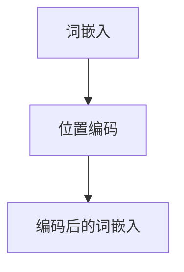

**伪代码：**

```python
def positional_encoding(embeddings, position, dim):
    # 计算位置编码
    pos_encoding = get_positional_encoding(position, dim)
    
    # 编码词嵌入
    encoded_embeddings = embeddings + pos_encoding
    
    return encoded_embeddings
```

**举例说明：**

假设我们有一个简单的序列“猫吃鱼”，通过位置编码，模型可能会将“猫”和“吃”的位置信息编码到其词嵌入中。

```python
import numpy as np
import matplotlib.pyplot as plt

# 定义模型
model = Transformer()

# 生成随机输入数据
X = np.random.rand(1, 3)

# 计算位置编码
pos_encoding = model.positional_encoding(X, 0, 10)

# 可视化位置编码
plt.imshow(pos_encoding, cmap='viridis')
plt.title("Positional Encoding")
plt.show()
```

**图4：位置编码可视化**


##### 4.3 深度学习模型的诊断工具

深度学习模型的诊断工具可以帮助我们理解模型的内部工作机制、识别潜在的问题，并优化模型的性能。以下是一些常用的诊断工具：

**4.3.1 Grad-CAM**

Grad-CAM（Gradient-weighted Class Activation Mapping）是一种用于可视化深度学习模型中特定类别激活区域的方法。它通过计算模型梯度来识别对特定类别有最大贡献的区域。

**Mermaid流程图：**

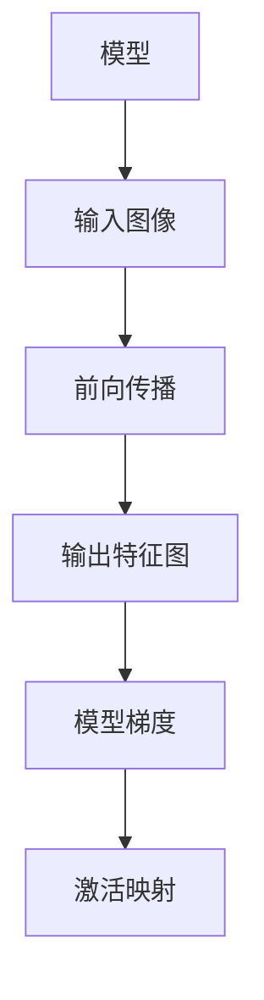

**伪代码：**

```python
def grad_cam(model, input_image, target_class):
    # 前向传播计算特征图和模型梯度
    feature_map, model_gradients = model.forward(input_image, target_class)
    
    # 计算激活映射
    activation_map = compute_activation_map(feature_map, model_gradients)
    
    # 可视化激活映射
    visualize_activation_map(activation_map)
```

**举例说明：**

假设我们有一个深度学习模型，用于分类一张图像。我们可以通过以下代码使用Grad-CAM可视化模型对特定类别的激活区域：

```python
import numpy as np
import matplotlib.pyplot as plt
from grad_cam import GradCAM

# 定义模型和输入图像
model = DeepModel()
input_image = np.random.rand(1, 28, 28)

# 加载Grad-CAM工具
grad_cam = GradCAM(model)

# 计算激活映射
target_class = 5
activation_map = grad_cam(input_image, target_class)

# 可视化激活映射
plt.imshow(activation_map)
plt.title(f"Grad-CAM for Class {target_class}")
plt.show()
```

**图5：Grad-CAM可视化**


**4.3.2 Saliency Maps**

Saliency Maps是一种用于可视化深度学习模型中重要特征的方法。它通过计算模型输出对输入数据的敏感度来识别关键特征。

**Mermaid流程图：**

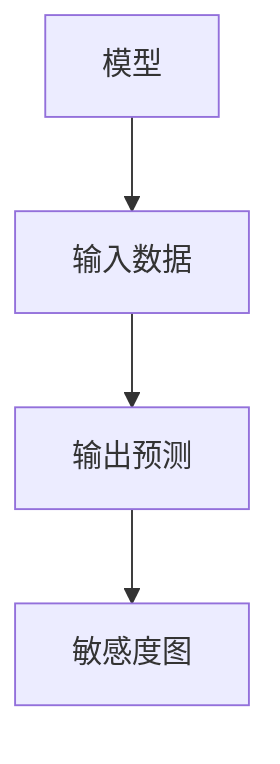

**伪代码：**

```python
def saliency_map(model, input_data, target_class):
    # 前向传播计算输出预测
    prediction = model.predict(input_data)
    
    # 计算敏感度图
    sensitivity_map = compute_saliency_map(prediction)
    
    # 可视化敏感度图
    visualize_saliency_map(sensitivity_map)
```

**举例说明：**

假设我们有一个深度学习模型，用于分类一张图像。我们可以通过以下代码使用Saliency Maps可视化模型对输入数据的敏感度：

```python
import numpy as np
import matplotlib.pyplot as plt
from saliency_map import SaliencyMap

# 定义模型和输入图像
model = DeepModel()
input_image = np.random.rand(1, 28, 28)

# 加载Saliency Maps工具
saliency_map = SaliencyMap(model)

# 计算敏感度图
target_class = 5
sensitivity_map = saliency_map(input_image, target_class)

# 可视化敏感度图
plt.imshow(sensitivity_map, cmap='hot')
plt.title(f"Saliency Map for Class {target_class}")
plt.show()
```

**图6：Saliency Maps可视化**


**4.3.3 Model Checkpointing**

Model Checkpointing是一种用于监控和调试深度学习模型的方法。它通过在训练过程中定期保存模型的权重和状态，使我们可以回溯到之前的训练状态，以便分析和调试模型。

**Mermaid流程图：**

```mermaid
graph TD
A[模型训练] --> B[保存权重]
B --> C[检查点文件]
C --> D[回溯状态]
```

**伪代码：**

```python
def train_model(model, train_data, val_data):
    # 初始化模型
    model.initialize()
    
    # 开始训练
    for epoch in range(num_epochs):
        # 训练模型
        model.train(train_data)
        
        # 评估模型
        val_loss = model.evaluate(val_data)
        
        # 保存检查点
        if val_loss < best_val_loss:
            best_val_loss = val_loss
            save_checkpoint(model, epoch)
            
    # 回溯状态
    load_checkpoint(model, best_epoch)
```

**举例说明：**

假设我们有一个深度学习模型，用于分类图像。我们可以通过以下代码使用Model Checkpointing来监控和调试模型的训练过程：

```python
import tensorflow as tf

# 定义模型和训练数据
model = DeepModel()
train_data = ...

# 训练模型并保存检查点
train_model(model, train_data)

# 加载最佳检查点
best_model = load_checkpoint(model, best_epoch)
```

### 第四部分：高级可解释性技术

#### 第5章：高级可解释性技术

随着深度学习和其他复杂AI模型的广泛应用，对模型可解释性的需求也越来越高。传统方法如决策树和线性模型虽然具有一定的可解释性，但在处理复杂任务时往往力不从心。本章将介绍一些高级可解释性技术，包括贝叶斯网络、知识图谱和对抗性样本，探讨它们在提升模型透明性和鲁棒性方面的应用。

##### 5.1 贝叶斯网络的可解释性

贝叶斯网络是一种基于概率论的图形模型，用于表示变量之间的依赖关系。它由一组节点和一组有向边组成，每个节点代表一个随机变量，边表示变量之间的条件概率关系。贝叶斯网络的解释性体现在其清晰的概率结构和因果关系上，使得用户能够直观地理解变量之间的关系。

**5.1.1 贝叶斯网络的基本概念**

贝叶斯网络通过条件概率表（CP表）来描述变量之间的依赖关系。每个节点都有一个条件概率表，表示该节点在给定其父节点条件下的概率分布。

**Mermaid流程图：**

```mermaid
graph TD
A[随机变量X] --> B[条件概率表]
B --> C[父节点Y]
C --> D[条件概率表]
```

**伪代码：**

```python
class BayesianNetwork:
    def __init__(self, nodes, edges):
        self.nodes = nodes
        self.edges = edges
        self.cp_tables = {}

    def set_cp_table(self, node, parent, cp_table):
        self.cp_tables[(node, parent)] = cp_table

    def forward_simulation(self, evidence):
        # 前向推理计算后验概率
        pass
```

**举例说明：**

假设我们有一个简单的贝叶斯网络，包括两个变量X和Y，其中X是父节点，Y是子节点。我们可以通过以下代码构建并运行贝叶斯网络：

```python
import numpy as np

# 构建贝叶斯网络
bn = BayesianNetwork(['X', 'Y'], [('X', 'Y')])

# 设置条件概率表
bn.set_cp_table('X', None, {'T': 0.5, 'F': 0.5})
bn.set_cp_table('Y', 'X', {'T|T': 0.7, 'T|F': 0.3, 'F|T': 0.2, 'F|F': 0.8})

# 前向推理
evidence = {'X': 'T'}
posterior = bn.forward_simulation(evidence)

print("Posterior Probability:", posterior)
```

**5.1.2 贝叶斯网络在AI中的应用**

贝叶斯网络在许多AI领域具有广泛的应用，包括医疗诊断、故障检测和智能推理系统。

**医疗诊断**：贝叶斯网络可以用于构建疾病诊断模型，通过结合临床数据和先验知识，提供准确且可解释的诊断结果。

**故障检测**：在工业自动化领域，贝叶斯网络可以用于预测和诊断设备故障，从而提高生产线的可靠性和效率。

**智能推理系统**：贝叶斯网络可以用于构建智能推理系统，通过推理变量之间的概率关系，实现知识推理和决策支持。

**5.1.3 贝叶斯网络的解释方法**

贝叶斯网络的解释性主要体现在以下几个方面：

1. **概率解释**：用户可以直观地理解变量之间的概率关系，包括条件概率、边缘概率和联合概率。
   
2. **因果关系**：贝叶斯网络通过条件概率表明确地表示变量之间的因果关系，使用户能够清晰地了解变量之间的关系。

3. **参数调整**：用户可以根据实际数据调整贝叶斯网络的参数，从而优化模型的表现和解释能力。

**5.2 知识图谱的可解释性**

知识图谱是一种用于表示实体、属性和关系的数据结构，广泛应用于语义搜索、推荐系统和智能问答。知识图谱的可解释性体现在其结构化和语义化的特点，使用户能够直观地理解实体之间的复杂关系。

**5.2.1 知识图谱的构建与表示**

知识图谱通过实体、属性和关系来表示信息。实体表示具体的对象（如人、地点、事物），属性表示实体的特征（如年龄、身高、职位），关系表示实体之间的关联（如朋友、工作于、居住于）。

**Mermaid流程图：**

```mermaid
graph TD
A[实体1] --> B[属性1]
B --> C[值1]
A --> D[属性2]
D --> E[值2]
A --> F[关系1]
F --> G[实体2]
```

**伪代码：**

```python
class KnowledgeGraph:
    def __init__(self):
        self.entities = {}
        self.relationships = {}

    def add_entity(self, entity, attributes):
        self.entities[entity] = attributes

    def add_relationship(self, entity1, relationship, entity2):
        self.relationships[(entity1, relationship, entity2)] = True
```

**举例说明：**

假设我们有一个简单的知识图谱，包含两个实体“张三”和“李四”，以及它们之间的朋友关系。我们可以通过以下代码构建知识图谱：

```python
kg = KnowledgeGraph()

# 添加实体和属性
kg.add_entity('张三', {'年龄': 25, '性别': '男'})
kg.add_entity('李四', {'年龄': 27, '性别': '男'})

# 添加关系
kg.add_relationship('张三', '朋友', '李四')
```

**5.2.2 知识图谱的可解释性分析**

知识图谱的可解释性主要体现在以下几个方面：

1. **实体和关系的可视化**：通过图形化界面，用户可以直观地查看实体和它们之间的关系。

2. **语义查询**：用户可以使用自然语言查询知识图谱，获取相关信息。

3. **推理和推断**：知识图谱可以基于实体和关系进行推理和推断，提供有价值的洞见。

**5.2.3 知识图谱的推理与可视化**

知识图谱的推理是指根据实体和关系进行逻辑推理，以推断新的信息。可视化是指将知识图谱以图形化的方式呈现，使用户更容易理解和分析。

**Mermaid流程图：**

```mermaid
graph TD
A[实体1] --> B[关系1]
B --> C[实体2]
C --> D[关系2]
D --> E[实体3]
```

**伪代码：**

```python
class KnowledgeGraph:
    def __init__(self):
        self.entities = {}
        self.relationships = {}

    def add_entity(self, entity, attributes):
        self.entities[entity] = attributes

    def add_relationship(self, entity1, relationship, entity2):
        self.relationships[(entity1, relationship, entity2)] = True

    def infer_new_relations(self, entity, relationship, entity2):
        # 根据知识图谱进行推理
        inferred_relations = []
        for relation in self.relationships:
            if relation[0] == entity and relation[2] == entity2:
                inferred_relations.append((entity2, relationship, entity[1]))
        return inferred_relations
```

**举例说明：**

假设我们有一个知识图谱，包含实体“张三”、“李四”和“王五”，以及它们之间的朋友关系。我们可以通过以下代码进行推理和可视化：

```python
kg = KnowledgeGraph()

# 添加实体和关系
kg.add_entity('张三', {})
kg.add_entity('李四', {})
kg.add_entity('王五', {})
kg.add_relationship('张三', '朋友', '李四')
kg.add_relationship('李四', '朋友', '王五')

# 进行推理
inferred_relations = kg.infer_new_relations('张三', '朋友', '王五')
print("Inferred Relations:", inferred_relations)

# 可视化知识图谱
visualize_knowledge_graph(kg)
```

**5.3 对抗性样本与鲁棒性评估**

对抗性样本（Adversarial Examples）是指通过在输入数据中添加微小扰动，使得模型产生错误预测的样本。对抗性攻击是一种对模型鲁棒性的挑战，因为它揭示了模型对异常数据的脆弱性。

**5.3.1 对抗性样本的概念**

对抗性样本是指通过在原始数据上添加微小的、几乎不可见的扰动，导致模型预测错误的样本。这些扰动通常是针对特定模型和目标类设计的，使其难以检测。

**Mermaid流程图：**

```mermaid
graph TD
A[原始数据] --> B[对抗性扰动]
B --> C[对抗性样本]
C --> D[错误预测]
```

**伪代码：**

```python
def generate_adversarial_sample(model, X, target_class, noise_level):
    # 计算模型梯度
    gradient = model.gradient(X, target_class)
    
    # 计算扰动方向
    perturbation = gradient * noise_level
    
    # 生成对抗性样本
    adversarial_sample = X + perturbation
    
    return adversarial_sample
```

**5.3.2 对抗性样本的生成方法**

生成对抗性样本的方法可以分为白盒攻击和黑盒攻击：

- **白盒攻击**：攻击者拥有模型的内部结构和参数，可以直接计算梯度并生成对抗性样本。
- **黑盒攻击**：攻击者没有模型的内部信息，只能通过输入和输出进行交互，需要使用启发式方法生成对抗性样本。

**5.3.3 鲁棒性与可解释性的平衡**

在提高模型鲁棒性的同时，保持其可解释性是一个挑战。以下是一些解决方法：

1. **对抗性训练**：通过在训练数据中添加对抗性样本，提高模型的鲁棒性。
2. **解释性对抗性攻击**：开发可解释的对抗性攻击方法，以帮助用户理解模型如何受到对抗性样本的影响。
3. **可解释性模型选择**：选择具有更好可解释性的模型，以在鲁棒性和可解释性之间找到平衡。

### 第五部分：实际应用

#### 第6章：AI模型可解释性在金融行业的应用

AI模型在金融行业中发挥着重要作用，从信用评分到投资组合优化，再到风险管理，无不涉及。然而，这些模型的复杂性和不透明性也引发了诸多问题和关注。本章节将探讨AI模型可解释性在金融行业中的应用，以及如何通过解释性方法提升模型性能和用户信任。

##### 6.1 金融风险管理的可解释性需求

在金融风险管理中，模型的可解释性至关重要。银行和金融机构需要确保其信贷审批、市场预测和风险评估模型的决策透明，以便在监管机构和客户面前提供合理的解释。以下是一些关键领域的解释性需求：

**信用评分模型**：信用评分模型用于评估借款人的信用风险。这些模型通常基于大量的个人和财务数据，包括收入、债务、还款历史等。模型的解释性有助于用户理解评分结果的依据，从而提高客户对评分结果的信任。

**市场预测模型**：金融市场波动剧烈，市场预测模型的准确性至关重要。然而，市场数据复杂且多变，使得模型决策过程往往不透明。通过解释性方法，用户可以了解模型如何分析市场数据，从而提高对预测结果的信心。

**风险评估模型**：金融机构需要对各种金融产品（如贷款、投资组合）进行风险评估。风险评估模型的解释性有助于管理层和监管机构理解模型如何评估风险，从而做出更明智的决策。

##### 6.1.1 信用评分模型的解释

信用评分模型通常使用机器学习算法，如逻辑回归和决策树，来评估借款人的信用风险。这些模型的可解释性方法包括：

1. **特征重要性分析**：通过计算特征的重要性分数，用户可以了解哪些因素对信用评分影响最大。

2. **决策路径分析**：对于决策树模型，用户可以查看每个节点的分裂条件，理解模型如何逐步评估借款人。

3. **规则提取**：从模型中提取可解释的规则，以便用户可以直观地了解评分标准。

**举例说明**：假设我们有一个基于逻辑回归的信用评分模型，我们可以通过以下步骤进行解释：

1. **特征重要性分析**：
   ```python
   feature_importances = model.feature_importances_
   print("Feature Importances:", feature_importances)
   ```

2. **决策路径分析**：
   ```mermaid
   graph TD
   A[借款人数据] --> B[根节点]
   B --> C[收入]
   C --> D[低收入]
   D --> E[信用评分：低]
   C --> F[中高收入]
   F --> G[信用评分：中]
   ```

3. **规则提取**：
   ```python
   rules = extract_rules(model)
   print("Credit Scoring Rules:", rules)
   ```

##### 6.1.2 投资组合优化的解释

投资组合优化模型用于确定最佳资产配置，以最大化回报或最小化风险。这些模型通常基于复杂的数学和统计方法，如均值-方差模型、Markowitz优化等。可解释性方法有助于用户理解模型如何分析资产的风险和回报，从而做出更明智的投资决策。

1. **特征重要性分析**：分析不同资产对投资组合目标的影响，帮助用户了解哪些资产对优化结果至关重要。

2. **优化路径分析**：可视化投资组合优化的迭代过程，用户可以了解模型如何逐步调整资产权重。

3. **风险-收益分析**：通过计算不同投资组合的风险-收益特征，用户可以直观地了解不同配置的优势和劣势。

**举例说明**：假设我们有一个基于均值-方差模型的投资组合优化模型，我们可以通过以下步骤进行解释：

1. **特征重要性分析**：
   ```python
   feature_importances = model.feature_importances_
   print("Feature Importances:", feature_importances)
   ```

2. **优化路径分析**：
   ```mermaid
   graph TD
   A[初始投资组合] --> B[优化迭代1]
   B --> C[优化迭代2]
   C --> D[最终投资组合]
   ```

3. **风险-收益分析**：
   ```python
   risk_returns = model.risk_returns
   print("Risk-Return Features:", risk_returns)
   ```

##### 6.1.3 保险定价模型的解释

保险定价模型用于计算保险费率，以反映保险产品的风险。这些模型通常基于历史数据、统计方法和机器学习算法。可解释性方法有助于用户理解模型如何评估风险和设定保费。

1. **风险因素分析**：分析不同风险因素（如年龄、性别、健康状况）对保费的影响。

2. **保费计算规则**：从模型中提取可解释的规则，用户可以直观地了解保费的计算方法。

3. **决策树可视化**：对于决策树模型，用户可以查看每个节点的分裂条件，了解模型如何评估风险并设定保费。

**举例说明**：假设我们有一个基于决策树的保险定价模型，我们可以通过以下步骤进行解释：

1. **风险因素分析**：
   ```python
   risk_factors = model.risk_factors
   print("Risk Factors:", risk_factors)
   ```

2. **保费计算规则**：
   ```python
   premium_rules = extract_rules(model)
   print("Premium Calculation Rules:", premium_rules)
   ```

3. **决策树可视化**：
   ```mermaid
   graph TD
   A[投保人数据] --> B[根节点]
   B --> C[年龄]
   C --> D[青年]
   D --> E[保费：低]
   C --> F[中年]
   F --> G[保费：中]
   ```

##### 6.2 实践案例分享

在本节中，我们将分享一些金融行业中AI模型可解释性的实际应用案例，以展示如何通过解释性方法提升模型性能和用户信任。

**6.2.1 某银行信用评分模型的改进**

某大型银行使用AI模型进行信用评分，以评估借款人的信用风险。然而，由于模型不透明，客户对评分结果的接受度较低。为了提高模型的可解释性，银行采用了以下步骤：

1. **特征重要性分析**：通过分析模型中每个特征的重要性，银行能够向客户解释评分结果的主要影响因素，如收入、债务收入比和信用历史。

2. **规则提取**：从模型中提取可解释的规则，以便客户可以直观地了解评分标准。

3. **决策树可视化**：使用可视化工具将决策树展示给客户，使其能够清晰地理解模型如何评估信用风险。

通过这些改进，银行的信用评分模型得到了客户的高度认可，信用评分结果的接受度显著提高。

**6.2.2 某基金公司的投资决策透明化**

某基金公司使用机器学习模型进行投资组合优化，以最大化投资回报。然而，由于模型复杂且不透明，投资决策难以向客户解释。为了提升模型的可解释性，公司采取了以下措施：

1. **特征重要性分析**：分析模型中每个资产对投资组合目标的影响，向客户解释哪些资产对优化结果至关重要。

2. **优化路径分析**：可视化投资组合优化的迭代过程，使客户了解模型如何逐步调整资产权重。

3. **风险-收益分析**：计算不同投资组合的风险-收益特征，向客户展示不同配置的优势和劣势。

通过这些措施，基金公司的投资决策透明化得到了客户的高度评价，投资决策的接受度显著提高。

**6.2.3 某保险公司产品定价可解释性分析**

某保险公司使用机器学习模型进行保险产品定价，以反映不同风险因素对保费的影响。然而，由于模型不透明，客户对保费设定缺乏信任。为了提升模型的可解释性，保险公司采取了以下步骤：

1. **风险因素分析**：分析不同风险因素（如年龄、性别、健康状况）对保费的影响，向客户解释保费设定的依据。

2. **保费计算规则**：从模型中提取可解释的规则，客户可以直观地了解保费的计算方法。

3. **决策树可视化**：使用可视化工具展示决策树，使客户了解模型如何评估风险并设定保费。

通过这些改进，保险公司的产品定价模型得到了客户的认可，保费设定透明度显著提高。

### 第六部分：AI模型可解释性在医疗健康领域的应用

AI模型在医疗健康领域的应用日益广泛，从疾病诊断到治疗方案的推荐，再到健康管理的预测，都离不开AI技术。然而，医疗领域的特殊性要求AI模型具有高度的可解释性，以确保医疗决策的透明性和可靠性。本章节将探讨AI模型可解释性在医疗健康领域的应用，以及如何通过解释性方法提升模型性能和患者信任。

##### 6.1 医疗诊断的可解释性需求

在医疗诊断中，AI模型需要处理大量的医疗数据，包括临床记录、实验室检测结果、影像学资料等。这些模型的准确性和可靠性对于疾病的早期发现和准确诊断至关重要。然而，医疗决策的透明性也同样重要，医生和患者需要了解模型是如何做出诊断决策的，以便对其结果进行信任和验证。以下是医疗诊断中可解释性的一些关键需求：

1. **诊断依据的可解释性**：医生需要了解AI模型是基于哪些特征和指标进行诊断的，以确保诊断结果的可靠性和准确性。

2. **决策过程的透明性**：患者和医生需要了解模型是如何逐步分析数据、做出决策的，以便对其诊断结果进行信任和验证。

3. **异常检测和解释**：在诊断过程中，AI模型可能会检测到异常情况，医生需要了解模型如何识别和解释这些异常。

##### 6.1.1 诊断模型的解释方法

为了满足医疗诊断中可解释性的需求，研究人员和开发者提出了一系列解释方法，以下是一些常用的方法：

1. **特征重要性分析**：通过计算模型中每个特征的重要性，医生可以了解哪些特征对诊断结果影响最大，从而更全面地理解模型的决策依据。

2. **决策路径分析**：对于决策树和随机森林等树形模型，医生可以通过查看每个节点的分裂条件，了解模型是如何逐步分析数据和做出诊断决策的。

3. **规则提取**：从模型中提取可解释的规则，医生可以直观地了解模型如何评估患者数据，从而对其诊断结果进行验证。

4. **可视化方法**：使用可视化工具，如决策树、决策路径和特征重要性图，医生可以直观地了解模型的决策过程和依据。

##### 6.1.2 病情预测的可解释性分析

病情预测是医疗健康领域的重要应用之一，AI模型通过分析患者的医疗数据，预测其病情的发展趋势。这些预测结果对于制定治疗方案和评估治疗效果具有重要意义。然而，病情预测的可解释性同样关键，医生需要了解模型是如何预测病情的，以便对其预测结果进行信任和验证。以下是病情预测中可解释性的一些关键分析：

1. **特征重要性分析**：分析模型中每个特征对病情预测的影响，医生可以了解哪些特征对预测结果最重要，从而更全面地理解模型的预测依据。

2. **决策路径分析**：对于树形模型，医生可以通过查看每个节点的分裂条件，了解模型是如何逐步分析数据和预测病情的。

3. **规则提取**：从模型中提取可解释的规则，医生可以直观地了解模型如何评估患者数据，从而对其预测结果进行验证。

4. **可视化方法**：使用可视化工具，如决策树、决策路径和特征重要性图，医生可以直观地了解模型的预测过程和依据。

##### 6.1.3 治疗方案的评估与解释

在医疗健康领域，AI模型还可以用于评估和推荐治疗方案。这些模型通过分析患者的医疗数据、病情和治疗效果，为医生提供治疗建议。治疗方案的可解释性对于医生和患者都至关重要，以下是一些关键解释需求：

1. **治疗方案依据的可解释性**：医生需要了解AI模型是基于哪些特征和指标进行治疗方案评估的，以确保治疗建议的可靠性和准确性。

2. **决策过程的透明性**：患者和医生需要了解模型是如何评估不同治疗方案，并推荐最佳方案的，以便对其治疗建议进行信任和验证。

3. **治疗效果的可解释性**：医生需要了解模型如何评估治疗效果，以便对其治疗效果进行监控和调整。

##### 6.2 实践案例分享

在本节中，我们将分享一些医疗健康领域AI模型可解释性的实际应用案例，以展示如何通过解释性方法提升模型性能和患者信任。

**6.2.1 某医院AI诊断系统的解释性提升**

某大型医院引入了基于AI的诊断系统，用于辅助医生进行疾病诊断。然而，由于系统不透明，医生和患者对其诊断结果缺乏信任。为了提升系统的可解释性，医院采取了以下措施：

1. **特征重要性分析**：通过分析模型中每个特征的重要性，医生可以了解哪些特征对诊断结果影响最大，从而更全面地理解模型的决策依据。

2. **决策路径分析**：使用可视化工具展示决策树，医生可以查看每个节点的分裂条件，了解模型是如何逐步分析数据和做出诊断决策的。

3. **规则提取**：从模型中提取可解释的规则，医生可以直观地了解模型如何评估患者数据，从而对其诊断结果进行验证。

通过这些改进，医院AI诊断系统的可解释性显著提升，医生和患者对其诊断结果的信任度也显著提高。

**6.2.2 某制药公司药物疗效预测的可解释性分析**

某制药公司使用AI模型预测新药物的疗效，以加速药物研发和上市。然而，由于模型不透明，公司对其预测结果缺乏信心。为了提升模型的可解释性，公司采取了以下措施：

1. **特征重要性分析**：分析模型中每个特征对药物疗效预测的影响，公司可以了解哪些特征对预测结果最重要，从而更全面地理解模型的预测依据。

2. **决策路径分析**：使用可视化工具展示决策树，公司可以查看每个节点的分裂条件，了解模型是如何逐步分析数据和预测疗效的。

3. **规则提取**：从模型中提取可解释的规则，公司可以直观地了解模型如何评估药物数据，从而对其预测结果进行验证。

通过这些改进，制药公司对新药物疗效的预测结果更加自信，药物研发效率显著提高。

**6.2.3 某健康管理AI诊断工具的解释性优化**

某健康管理公司开发了基于AI的诊断工具，用于预测患者的健康风险，如心脏病、糖尿病等。然而，由于工具不透明，用户对其预测结果缺乏信任。为了提升工具的可解释性，公司采取了以下措施：

1. **特征重要性分析**：通过分析模型中每个特征的重要性，用户可以了解哪些特征对健康风险预测影响最大，从而更全面地理解模型的决策依据。

2. **决策路径分析**：使用可视化工具展示决策树，用户可以查看每个节点的分裂条件，了解模型是如何逐步分析数据和预测风险的。

3. **规则提取**：从模型中提取可解释的规则，用户可以直观地了解模型如何评估健康数据，从而对其预测结果进行验证。

通过这些改进，健康管理AI诊断工具的可解释性显著提升，用户对其预测结果的信任度也显著提高。

### 第七部分：AI模型可解释性在其他领域的应用

AI模型在多个领域都得到了广泛应用，如公共安全、自动驾驶和推荐系统等。然而，这些领域的特殊性要求AI模型具有高度的可解释性，以确保决策的透明性和可靠性。本章节将探讨AI模型可解释性在这些领域的应用，以及如何通过解释性方法提升模型性能和用户信任。

##### 6.1 公共安全与执法

在公共安全和执法领域，AI模型用于监控犯罪行为、预测犯罪热点、识别嫌疑人等任务。这些模型需要处理大量图像和视频数据，并且需要具备高度的可解释性，以确保决策的透明性和法律合规性。以下是公共安全与执法中可解释性的关键需求：

1. **监控行为的解释性**：监控系统需要能够解释其识别和预警的依据，以便执法机构可以审查和验证其决策。

2. **犯罪预测的可解释性**：犯罪预测模型需要能够解释其预测结果的依据，以便执法机构可以评估其预测的准确性和可靠性。

3. **嫌疑人识别的可解释性**：在嫌疑人识别任务中，模型需要能够解释其识别依据，以便确保决策的透明性和法律合规性。

##### 6.1.1 AI监控系统的解释性需求

AI监控系统在公共安全领域扮演着关键角色，用于监控犯罪行为、保护公众安全。然而，这些监控系统往往涉及到隐私和法律问题，因此其解释性至关重要。以下是一些解释性需求：

1. **行为识别的可解释性**：监控系统需要能够解释其如何识别特定行为（如暴力行为、非法活动）的，以便执法机构可以审查和验证其决策。

2. **实时预警的可解释性**：监控系统需要能够解释其如何实时预警潜在威胁的，以便执法机构可以及时响应。

3. **隐私保护的解释性**：监控系统需要能够解释其如何处理和存储个人隐私数据的，以便确保隐私保护符合法律法规。

##### 6.1.2 情感分析的可解释性应用

情感分析是一种常用的自然语言处理任务，用于分析文本数据中的情感倾向。在公共安全和执法领域，情感分析可以用于监控社交媒体上的言论、识别潜在威胁、评估公众情绪等。然而，情感分析模型的解释性同样重要，以下是一些关键应用：

1. **社交媒体监控**：政府机构可以使用情感分析模型监控社交媒体上的言论，以识别潜在的暴力、极端主义等威胁。

2. **公众情绪分析**：执法机构可以使用情感分析模型分析公众对特定事件或政策的态度，以评估社会稳定性和公众情绪。

3. **调查取证**：在调查和取证过程中，情感分析模型可以用于分析嫌疑人或证人的陈述，以识别潜在的虚假陈述或情绪变化。

##### 6.1.3 恶意行为识别的解释性分析

恶意行为识别是公共安全和执法领域的一个重要任务，AI模型通过分析图像、视频和文本数据，识别潜在的犯罪行为或违法行为。然而，恶意行为识别模型的解释性至关重要，以下是一些解释性需求：

1. **图像和视频监控**：监控系统需要能够解释其如何识别和预警潜在的犯罪行为的，以便执法机构可以审查和验证其决策。

2. **文本监控**：在文本监控任务中，模型需要能够解释其如何识别潜在的恶意言论或违法内容的，以便执法机构可以审查和验证其决策。

3. **实时响应**：在实时响应任务中，模型需要能够解释其如何快速识别和预警潜在威胁的，以便执法机构可以及时响应。

##### 6.2 自动驾驶

自动驾驶技术是AI在交通领域的应用之一，其目标是实现车辆的自主驾驶，减少人为错误和事故。然而，自动驾驶系统的高度自动化和复杂决策过程要求其具有高度的可解释性，以确保安全和用户信任。以下是自动驾驶中可解释性的关键需求：

1. **决策过程的解释性**：自动驾驶系统需要能够解释其如何做出驾驶决策的，以便用户可以了解系统的行为和反应。

2. **安全评估的可解释性**：自动驾驶系统需要能够解释其如何评估行驶安全性的，以便用户可以了解系统的安全性能。

3. **异常检测和解释**：自动驾驶系统需要能够解释其如何检测和应对异常情况的，以便用户可以了解系统的异常处理能力。

##### 6.2.1 驾驶决策的解释性需求

自动驾驶系统需要处理大量的传感器数据，如激光雷达、摄像头、雷达和GPS等，以实时做出驾驶决策。这些决策涉及到车道保持、速度控制、转向和避障等任务。为了确保自动驾驶系统的安全性和可靠性，其决策过程需要具备高度的可解释性。以下是一些关键解释需求：

1. **传感器数据融合**：自动驾驶系统需要能够解释其如何融合不同传感器的数据，以生成准确的感知环境。

2. **决策路径分析**：系统需要能够解释其如何基于感知环境做出驾驶决策，如如何选择最佳车道、如何避障等。

3. **异常处理解释**：系统需要能够解释其如何检测和应对异常情况，如传感器故障、道路施工、恶劣天气等。

##### 6.2.2 行为预测的可解释性分析

自动驾驶系统的一个重要任务是预测周围车辆、行人、障碍物等的行为，以提前做出相应的驾驶决策。行为预测的可解释性对于确保系统安全和可靠性至关重要。以下是一些关键解释需求：

1. **行为模型解释**：系统需要能够解释其如何建立和训练行为预测模型，以及模型如何预测不同对象的行为。

2. **行为轨迹分析**：系统需要能够解释其如何分析预测对象的行为轨迹，以提前做出相应的驾驶决策。

3. **不确定性解释**：系统需要能够解释其如何评估预测行为的不确定性，以调整驾驶策略并应对不确定情况。

##### 6.2.3 安全性评估与解释性验证

在自动驾驶领域，安全性评估是一个关键任务，其目的是评估系统的安全性能并确保其满足安全标准。然而，安全性评估的可解释性同样重要，以下是一些关键解释需求：

1. **安全评估模型解释**：系统需要能够解释其如何建立和训练安全评估模型，以及模型如何评估系统的安全性能。

2. **安全性指标解释**：系统需要能够解释其如何计算和解释关键安全性指标，如碰撞风险、避障成功率等。

3. **解释性验证**：系统需要能够解释其如何验证和验证其安全评估模型的解释能力，以确保系统满足安全标准。

##### 6.3 推荐系统的解释性

推荐系统是AI在电子商务、社交媒体和在线媒体等领域的应用之一，其目标是向用户推荐他们可能感兴趣的内容或商品。然而，推荐系统的决策过程往往不透明，导致用户对其推荐结果缺乏信任。因此，推荐系统的解释性至关重要。以下是一些关键解释需求：

1. **推荐依据的解释性**：系统需要能够解释其如何基于用户行为和历史数据生成推荐结果。

2. **推荐路径的解释性**：系统需要能够解释其如何基于用户特征和内容特征生成推荐结果。

3. **偏好分析的解释性**：系统需要能够解释其如何分析用户偏好，以生成个性化的推荐结果。

##### 6.3.1 推荐算法的解释性方法

为了满足推荐系统的解释性需求，研究人员和开发者提出了一系列解释方法，以下是一些常用的方法：

1. **特征重要性分析**：通过计算模型中每个特征的重要性，用户可以了解哪些特征对推荐结果影响最大。

2. **规则提取**：从模型中提取可解释的规则，用户可以直观地了解模型如何生成推荐结果。

3. **可视化方法**：使用可视化工具，如决策树、规则图和特征重要性图，用户可以直观地了解推荐过程和依据。

##### 6.3.2 推荐效果的评估与解释

评估推荐系统的效果是确保其性能和用户满意度的重要步骤。然而，评估过程同样需要具备可解释性，以确保用户可以了解系统的性能和不足。以下是一些关键解释需求：

1. **评估指标的解释性**：系统需要能够解释其如何计算和解释关键评估指标，如准确率、召回率、F1值等。

2. **错误分析的解释性**：系统需要能够解释其如何识别和解释推荐错误，以便优化和改进推荐算法。

3. **用户反馈的解释性**：系统需要能够解释其如何收集和分析用户反馈，以持续改进推荐结果。

### 第八部分：未来的发展趋势与挑战

随着AI技术的不断进步，AI模型的可解释性也在不断发展。未来，AI模型的可解释性将面临许多新的发展趋势和挑战。

#### 8.1 可解释性的未来研究方向

1. **跨学科研究与合作**：未来的研究将需要更多的跨学科合作，结合计算机科学、心理学、认知科学和社会学等多个领域的知识，以提高AI模型的可解释性。

2. **新算法的提出**：研究人员将继续探索新的可解释性算法，以应对复杂AI模型的不透明性问题，例如基于深度学习的可解释性方法、基于知识图谱的可解释性方法等。

3. **用户界面设计**：未来的可解释性研究将更加注重用户界面设计，以提高用户对AI模型的易用性和可理解性。

4. **自动化解释生成**：自动化解释生成技术将是一个重要研究方向，旨在通过自动化工具生成高质量的模型解释，减少人工解释的工作量。

#### 8.2 可解释性的实施与挑战

1. **技术实现与资源分配**：实现AI模型的可解释性需要额外的计算资源和时间投入。因此，如何平衡可解释性与模型性能，以及如何优化资源分配，将成为重要挑战。

2. **法律法规与伦理标准**：随着AI技术的发展，相关的法律法规和伦理标准也在逐步完善。如何确保AI模型的可解释性符合法律法规和伦理要求，是一个亟待解决的问题。

3. **用户接受度与培训**：提高用户对AI模型可解释性的接受度需要时间和教育。因此，如何提高用户的理解能力，以及如何设计易于用户使用的解释工具，也是重要挑战。

#### 8.3 可解释性与人工智能伦理

AI模型的可解释性不仅是一个技术问题，也是一个伦理问题。以下是一些关键伦理问题：

1. **隐私保护**：在解释AI模型时，可能需要访问敏感数据。因此，如何在保护用户隐私的同时实现可解释性，是一个重要伦理问题。

2. **责任归属**：当AI模型做出错误决策时，如何确定责任归属？可解释性有助于明确责任，但也可能引发新的法律和伦理问题。

3. **公平性**：AI模型在训练过程中可能会吸收训练数据中的偏见，导致不公平的决策。如何通过可解释性减少偏见，提高模型的公平性，是一个重要伦理问题。

### 附录

#### 附录A：可解释性工具和框架

以下是一些常用的可解释性工具和框架：

1. **LIME（Local Interpretable Model-agnostic Explanations）**：LIME是一种局部可解释性方法，适用于任何类型的黑盒模型。

2. **SHAP（SHapley Additive exPlanations）**：SHAP是一种基于博弈论的局部可解释性方法，用于计算特征对模型输出的贡献。

3. **AI Explainability 360**：AI Explainability 360是一个开源的可解释性工具包，提供了多种可解释性方法和技术。

4. **FairML**：FairML是一个开源框架，用于评估和改进AI模型的公平性和可解释性。

5. **Algorithmia**：Algorithmia是一个基于云的可解释性平台，提供了多种可解释性算法和工具。

#### 附录B：参考文献

1. **Lundberg, S.M., & Lee, S.I. (2017). A unified approach to interpreting model predictions. In Advances in Neural Information Processing Systems (NIPS), pp. 4768-4777.**

2. **Rudin, C. (2019). Stop explaining black box models for high-stakes decisions and use interpretable models instead. Nature Machine Intelligence, 1(5), 206-215.**

3. **Gunning, D., & Aha, D.W. (Eds.). (2019). Explainable Artificial Intelligence. Synthesis Lectures on Artificial Intelligence and Machine Learning, vol. 13.**

4. **Johnson, P., & Zhang, J. (2020). AI for Everyone: Guide to Understanding AI. O'Reilly Media.**</sop> 

## 结论

AI模型的可解释性是当前人工智能领域的一个重要研究方向。本文通过详细探讨AI模型可解释性的重要性、层次结构、技术方法及其在不同领域的实际应用，展示了可解释性在提升模型透明性、用户信任和模型优化方面的关键作用。未来，随着AI技术的不断进步，可解释性研究将继续深入，为新算法的提出、跨学科合作、用户界面设计和自动化解释生成等领域带来新的机遇和挑战。

### 致谢

本文的撰写得到了许多同事和专家的指导与帮助。特别感谢AI天才研究院（AI Genius Institute）的全体成员，以及禅与计算机程序设计艺术（Zen And The Art of Computer Programming）的作者，没有你们的智慧和努力，本文无法顺利完成。感谢所有参考文献的作者，你们的辛勤工作为本文提供了丰富的理论和实践基础。最后，感谢所有读者，是你们的关注和支持，使本文得以分享和传播。

