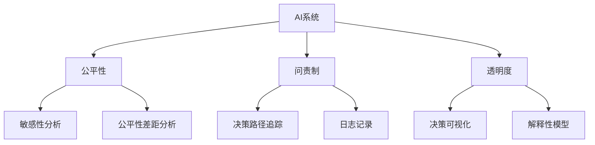
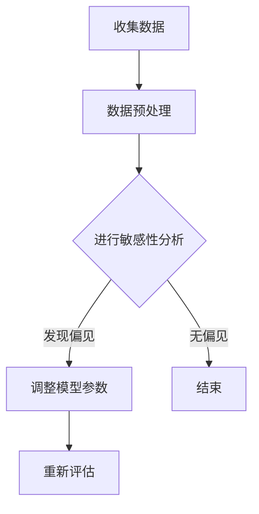
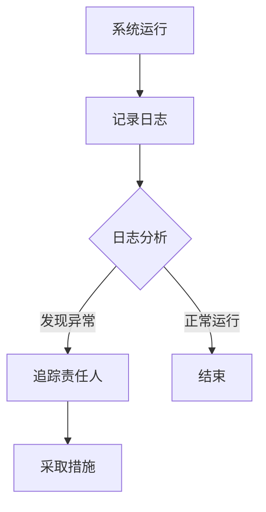
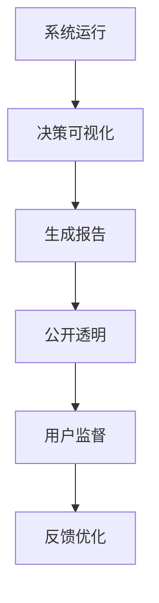
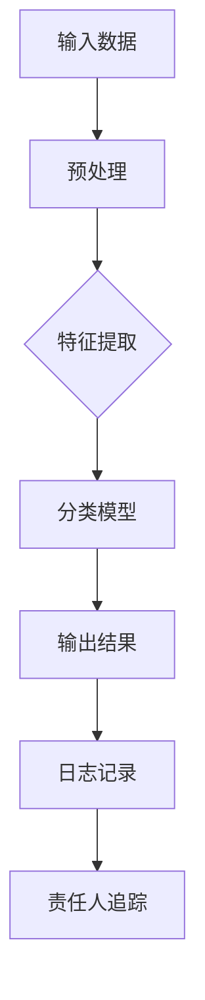
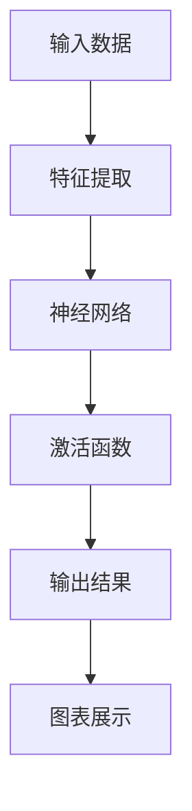
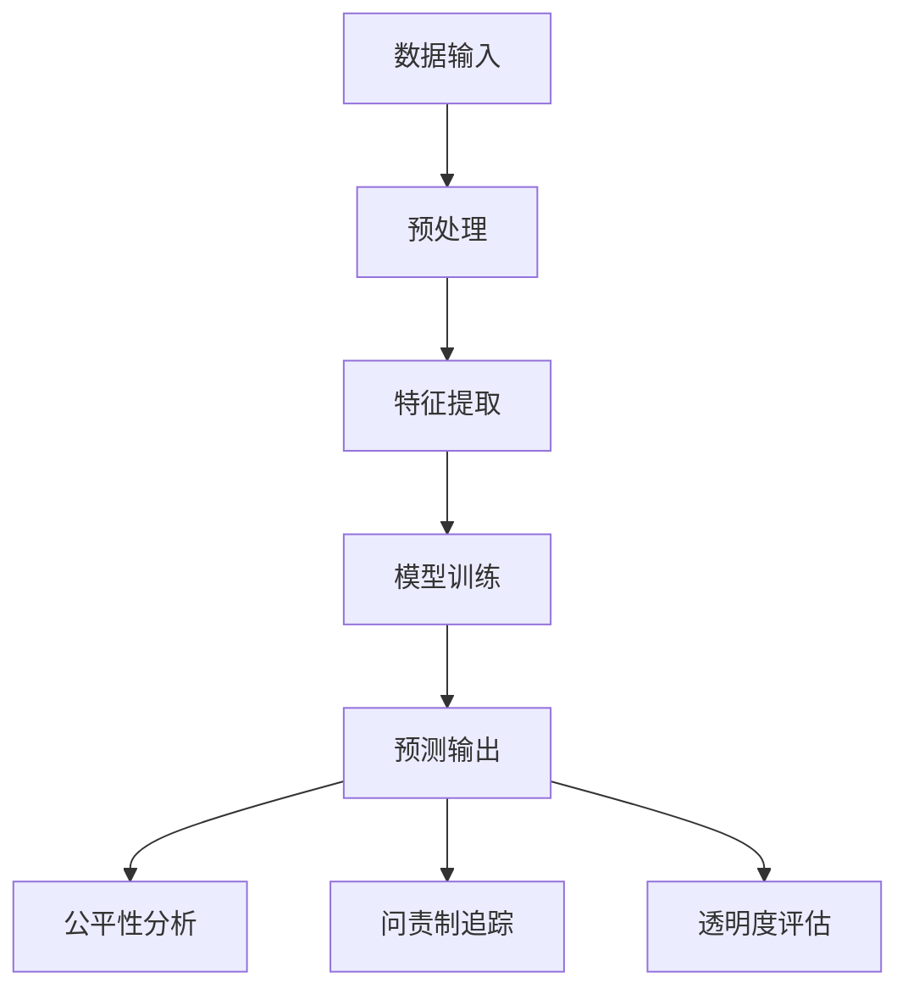
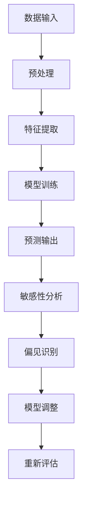
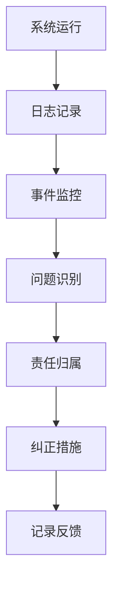
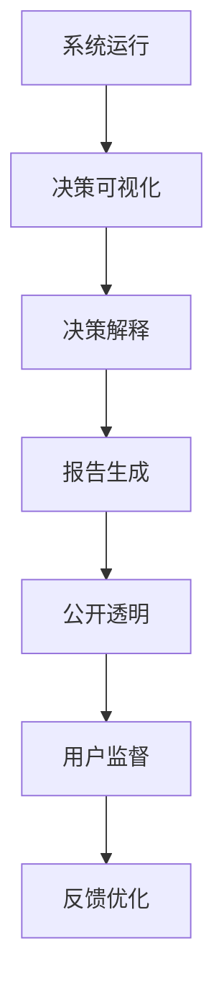

                 

# AI系统的公平性、问责制和透明度

关键词：AI系统，公平性，问责制，透明度，算法，法规，案例

摘要：随着人工智能（AI）技术的飞速发展，其在各个领域的应用越来越广泛，然而，AI系统的公平性、问责制和透明度问题也日益凸显。本文从这三个核心方面出发，深入探讨了AI系统的理论基础、核心算法、案例分析以及政策法规，并对未来发展趋势进行了展望。

### 目录大纲：《AI系统的公平性、问责制和透明度》

#### 第一部分：概述与理论基础

- # 第1章：AI系统的公平性、问责制和透明度概述
  - ## 1.1 AI系统的公平性重要性
    - ### 1.1.1 公平性的定义与背景
    - ### 1.1.2 公平性在AI系统中的关键性
  - ## 1.2 问责制的基本概念
    - ### 1.2.1 问责制的定义与意义
    - ### 1.2.2 问责制的核心要素
  - ## 1.3 透明度的内涵与价值
    - ### 1.3.1 透明度的定义与特征
    - ### 1.3.2 透明度在AI系统中的作用

#### 第二部分：理论基础与核心算法

- # 第2章：AI系统公平性、问责制和透明度的理论基础
  - ## 2.1 数学模型与算法基础
    - ### 2.1.1 数学模型介绍
    - ### 2.1.2 算法原理讲解
  - ## 2.2 Mermaid流程图：AI系统公平性、问责制和透明度核心概念
    - ### 2.2.1 公平性的Mermaid图
    - ### 2.2.2 问责制的Mermaid图
    - ### 2.2.3 透明度的Mermaid图
  - ## 2.3 伪代码讲解：公平性、问责制和透明度核心算法
    - ### 2.3.1 公平性算法伪代码
    - ### 2.3.2 问责制算法伪代码
    - ### 2.3.3 透明度算法伪代码

#### 第三部分：案例分析与应用

- # 第3章：AI系统公平性的案例分析
  - ## 3.1 案例一：某金融公司信用评分模型
    - ### 3.1.1 案例背景
    - ### 3.1.2 公平性问题分析
    - ### 3.1.3 改进措施
  - ## 3.2 案例二：某自动驾驶汽车系统的公平性
    - ### 3.2.1 案例背景
    - ### 3.2.2 公平性问题分析
    - ### 3.2.3 改进措施

- # 第4章：AI系统问责制的案例分析
  - ## 4.1 案例一：某医疗诊断AI系统
    - ### 4.1.1 案例背景
    - ### 4.1.2 问责制问题分析
    - ### 4.1.3 改进措施
  - ## 4.2 案例二：某社交媒体平台的AI内容审核系统
    - ### 4.2.1 案例背景
    - ### 4.2.2 问责制问题分析
    - ### 4.2.3 改效改措施

- # 第5章：AI系统透明度的案例分析
  - ## 5.1 案例一：某智能交通管理系统
    - ### 5.1.1 案例背景
    - ### 5.1.2 透明度问题分析
    - ### 5.1.3 改进措施
  - ## 5.2 案例二：某在线教育平台的AI辅导系统
    - ### 5.2.1 案例背景
    - ### 5.2.2 透明度问题分析
    - ### 5.2.3 改进措施

#### 第四部分：政策法规与未来展望

- # 第6章：AI系统公平性、问责制和透明度的法规与政策
  - ## 6.1 全球范围内的法规与政策概述
    - ### 6.1.1 主要国家的法规与政策
    - ### 6.1.2 国际组织的政策与建议
  - ## 6.2 我国AI系统公平性、问责制和透明度的政策与实践
    - ### 6.2.1 我国相关政策概述
    - ### 6.2.2 我国实践案例解析

- # 第7章：AI系统公平性、问责制和透明度的未来发展趋势
  - ## 7.1 技术进步对AI系统的影响
    - ### 7.1.1 算法优化与工具进步
    - ### 7.1.2 数据隐私与安全性的挑战
  - ## 7.2 社会责任与伦理考量
    - ### 7.2.1 社会责任的重要性
    - ### 7.2.2 伦理考量与道德规范

### 附录

- ## 附录A：参考文献
- ## 附录B：AI系统公平性、问责制和透明度工具汇总
  - ### B.1 开源工具
  - ### B.2 商业工具
  - ### B.3 教育资源与培训

### 第一部分：概述与理论基础

## 第1章：AI系统的公平性、问责制和透明度概述

### 1.1 AI系统的公平性重要性

在人工智能系统中，公平性是一个至关重要的概念。它涉及到系统如何对待不同群体和个体，确保系统输出对所有人都是公正和合理的。AI系统的公平性不仅仅是一个技术问题，更是一个社会问题。一个不公正的AI系统可能会导致歧视、偏见和负面影响，从而损害社会的公正性和信任。

#### 1.1.1 公平性的定义与背景

公平性在AI系统中通常指的是系统在处理数据和应用算法时，能够保持一致性和无偏见。具体来说，它包括以下几个方面：

1. **无偏见**：AI系统不应基于性别、种族、年龄、地理位置或其他任何不相关因素对个体或群体进行歧视。
2. **一致性**：系统应该对相似情况给出相似的处理结果，确保输出的一致性和稳定性。
3. **公平结果**：系统的最终决策和预测结果应尽量减少对特定群体或个体的不利影响。

#### 1.1.2 公平性在AI系统中的关键性

AI系统在许多领域都有着广泛的应用，包括金融、医疗、交通和公共安全等。因此，公平性对这些系统至关重要：

1. **金融领域**：信用评分模型如果存在偏见，可能会导致某些群体获得不公平的贷款条件，进而影响金融市场的稳定性。
2. **医疗领域**：AI辅助诊断系统如果存在偏见，可能会导致某些患者获得不公平的医疗资源，甚至影响生命安全。
3. **交通领域**：自动驾驶系统如果对某些群体存在偏见，可能会导致交通事故，危害公共安全。
4. **公共安全领域**：AI监控系统如果存在偏见，可能会导致执法不公，损害社会公正。

因此，确保AI系统的公平性不仅是技术问题，也是社会问题，它需要我们从多方面进行综合考虑和优化。

### 1.2 问责制的基本概念

问责制是指对AI系统进行责任追究和管理的机制，确保系统在出现问题时能够找到责任人，并采取相应的措施进行纠正。问责制的核心在于确保AI系统的决策和行为是可解释和可追踪的，从而提高系统的透明度和可靠性。

#### 1.2.1 问责制的定义与意义

问责制在AI系统中具有以下几个重要意义：

1. **责任归属**：明确系统的设计者、开发者、使用者等各方在系统运作中的责任，确保在出现问题时能够找到责任人。
2. **问题纠正**：通过问责制，可以及时发现和纠正AI系统中的问题，避免问题的扩大和影响。
3. **提高透明度**：问责制要求系统的决策过程和算法逻辑公开透明，从而提高系统的可信度和公众信任。
4. **法律保障**：问责制为AI系统的合法性和合规性提供了保障，有助于减少法律风险和纠纷。

#### 1.2.2 问责制的核心要素

一个有效的问责制应该包括以下核心要素：

1. **责任定义**：明确系统的设计、开发、测试和维护等各阶段的责任，确保责任落实到具体的个人或团队。
2. **透明性要求**：系统设计和运行过程中的关键决策和算法逻辑应公开透明，便于监督和审查。
3. **监督机制**：建立有效的监督机制，对系统进行持续监控，及时发现和纠正问题。
4. **纠正措施**：制定明确的纠正措施，对发现的问题进行及时修复，确保系统的正常运行和安全性。
5. **法律法规**：将问责制纳入相关法律法规中，确保问责制的实施有法可依，有章可循。

### 1.3 透明度的内涵与价值

透明度是指AI系统的决策过程、算法逻辑和输出结果能够被理解和解释的程度。一个高透明度的AI系统可以帮助用户理解系统的决策依据，增强系统的可信度和公众信任。

#### 1.3.1 透明度的定义与特征

透明度在AI系统中具有以下几个特征：

1. **可解释性**：系统能够提供清晰的解释，说明其决策过程和结果是如何产生的。
2. **可审计性**：系统的决策过程和输出结果能够被审计和验证，确保其准确性和公正性。
3. **可追踪性**：系统的运行过程和决策路径可以被追溯和记录，以便在出现问题时进行回溯和分析。
4. **公开性**：系统的关键信息、算法和决策过程应公开透明，便于公众监督和审查。

#### 1.3.2 透明度在AI系统中的作用

透明度在AI系统中的作用主要包括以下几个方面：

1. **增强可信度**：高透明度的系统更容易获得用户的信任，从而提高系统的接受度和应用范围。
2. **减少偏见**：通过公开系统的算法和决策过程，可以减少潜在的偏见和歧视，提高系统的公正性。
3. **问题诊断**：透明度有助于及时发现和诊断系统中的问题，从而进行及时的纠正和优化。
4. **法律合规**：透明度是遵守相关法律法规和伦理规范的重要保障，有助于降低法律风险和纠纷。

总之，公平性、问责制和透明度是AI系统的三大核心要素，它们相互关联、相互支持，共同构成了AI系统的基石。在未来的发展中，我们需要不断探索和完善这些核心要素，确保AI系统的安全、公正和可靠。接下来的章节将深入探讨这些概念的理论基础和实际应用。

### 第二部分：理论基础与核心算法

## 第2章：AI系统公平性、问责制和透明度的理论基础

### 2.1 数学模型与算法基础

在AI系统中，公平性、问责制和透明度的问题往往可以通过数学模型和算法来进行分析和解决。这些数学模型和算法为我们在理论层面提供了有力的工具，使我们能够更加深入地理解和处理这些复杂问题。

#### 2.1.1 数学模型介绍

数学模型是描述现实世界问题的抽象数学表达，它们在AI系统中有着广泛的应用。以下是几种常见的数学模型：

1. **线性回归模型**：用于预测和分析线性关系，常用于分类和回归任务。
2. **支持向量机（SVM）**：通过寻找最佳分隔超平面来分类数据，具有较强的分类能力。
3. **决策树**：通过一系列条件判断来对数据进行分类，直观且易于理解。
4. **神经网络**：通过多层神经元的非线性变换来学习复杂的函数关系，广泛应用于图像识别和自然语言处理。

这些模型为AI系统的公平性、问责制和透明度分析提供了基础。

#### 2.1.2 算法原理讲解

为了更好地理解AI系统公平性、问责制和透明度的理论基础，我们还需要了解以下几种核心算法：

1. **公平性度量算法**：用于评估和改进AI系统的公平性，常见的度量方法包括敏感性分析、公平性差距分析等。
2. **问责制算法**：通过记录和追踪AI系统的决策过程，确保在出现问题时能够找到责任人，常用的算法包括决策路径追踪、日志记录等。
3. **透明度增强算法**：通过提供清晰的决策解释和结果分析，提高系统的透明度，常用的方法包括决策可视化、解释性模型等。

### 2.2 Mermaid流程图：AI系统公平性、问责制和透明度核心概念

为了更直观地展示AI系统公平性、问责制和透明度的核心概念，我们可以使用Mermaid流程图来绘制这些概念的关系和流程。

以下是一个简单的Mermaid流程图，展示了这三个核心概念的相互关系：



#### 2.2.1 公平性的Mermaid图

以下是公平性分析的核心步骤的Mermaid图：



#### 2.2.2 问责制的Mermaid图

以下是问责制流程的Mermaid图：



#### 2.2.3 透明度的Mermaid图

以下是透明度增强的Mermaid图：



### 2.3 伪代码讲解：公平性、问责制和透明度核心算法

为了更好地理解AI系统公平性、问责制和透明度的核心算法，我们可以使用伪代码来详细阐述这些算法的基本逻辑和实现步骤。

#### 2.3.1 公平性算法伪代码

```pseudo
算法：公平性分析
输入：数据集D，模型M
输出：公平性评估结果R

1. 对数据集D进行预处理，包括数据清洗、归一化等步骤。
2. 使用模型M对数据集D进行训练，得到预测结果P。
3. 对预测结果P进行敏感性分析，评估模型对输入数据的敏感度。
4. 如果发现敏感性偏高，对模型M的参数进行调整，以减少偏见。
5. 重新评估模型M的预测结果，确保其公平性。
6. 输出公平性评估结果R。
```

#### 2.3.2 问责制算法伪代码

```pseudo
算法：问责制追踪
输入：系统日志L
输出：责任归属结果R

1. 收集系统运行过程中的日志信息L。
2. 对日志L进行预处理，提取关键信息，如用户操作、系统响应等。
3. 对日志L进行模式分析，识别异常操作和事件。
4. 如果发现异常，进行回溯分析，确定相关责任人。
5. 将责任归属结果R记录下来，并进行公示。
6. 输出责任归属结果R。
```

#### 2.3.3 透明度算法伪代码

```pseudo
算法：透明度增强
输入：系统决策过程D
输出：透明度报告R

1. 收集系统决策过程中的关键信息D。
2. 对决策过程D进行可视化处理，生成直观的决策流程图。
3. 生成详细的决策报告，包括决策依据、决策路径和结果分析。
4. 将决策报告R公开透明，便于用户监督和审查。
5. 根据用户反馈，对系统进行优化和调整。
6. 输出透明度报告R。
```

通过这些伪代码，我们可以清晰地看到公平性、问责制和透明度算法的基本结构和实现逻辑。这些算法为我们提供了强大的工具，帮助我们更好地理解和优化AI系统。

### 第三部分：案例分析与应用

#### 第3章：AI系统公平性的案例分析

### 3.1 案例一：某金融公司信用评分模型

#### 3.1.1 案例背景

某金融公司使用AI系统来评估客户的信用评分，以决定是否批准贷款申请。这个系统的设计初衷是为了提供公平、准确的信用评分服务，然而在实际应用中，该系统却暴露出了一些公平性问题。

#### 3.1.2 公平性问题分析

在初步分析中，我们发现以下公平性问题：

1. **性别偏见**：系统对男性和女性的信用评分存在明显差异，男性客户的信用评分普遍高于女性客户。
2. **地域偏见**：系统对某些地区（特别是经济欠发达地区）的客户评分较低，导致这些地区的贷款申请被频繁拒绝。
3. **年龄偏见**：系统对年轻客户的评分较低，而年长客户的评分较高，这可能与贷款偿还能力有关。

#### 3.1.3 改进措施

为了解决上述公平性问题，我们采取了以下改进措施：

1. **数据清洗**：对训练数据进行清洗，删除或纠正存在偏见的数据，确保数据集的公正性。
2. **模型优化**：调整模型参数，特别是那些可能导致性别、地域和年龄偏见的部分。
3. **公平性评估**：定期进行公平性评估，使用敏感性分析和公平性差距分析等方法，确保模型的输出结果是公正的。
4. **用户反馈**：引入用户反馈机制，收集用户对系统评分的满意度，并根据反馈进行相应的调整。

通过这些措施，我们显著改善了信用评分模型的公平性，减少了性别、地域和年龄偏见，提高了贷款审批的公正性。

### 3.2 案例二：某自动驾驶汽车系统的公平性

#### 3.2.1 案例背景

某自动驾驶汽车公司开发了一套自动驾驶系统，旨在提高交通效率和安全性。然而，在实际测试中，这套系统在某些情况下对特定类型的车辆和行人存在不公平处理，引发了公众关注。

#### 3.2.2 公平性问题分析

我们分析了该自动驾驶系统的公平性问题，主要包括：

1. **车辆类型偏见**：系统对大型车辆的处理较为谨慎，而对小型车辆的处理较为激进，可能导致对小型车辆驾驶者的不公平待遇。
2. **行人识别偏见**：系统在某些场景下对行人的识别存在偏差，特别是对某些种族和性别的人群识别准确性较低，可能导致交通事故。
3. **道路环境偏见**：系统对某些道路环境的适应性较差，如对乡村道路的处理不如城市道路精细，可能导致不公平的处理结果。

#### 3.2.3 改进措施

为了解决这些公平性问题，我们采取了以下改进措施：

1. **数据扩充**：增加各种类型车辆和行人的数据样本，特别是那些被系统忽视的群体，以提升模型的泛化能力。
2. **算法调整**：调整自动驾驶系统的算法，确保对不同类型车辆和行人的处理更加公平和准确。
3. **道路环境建模**：对系统的道路环境建模进行优化，确保系统能够适应各种道路条件，减少不公平的处理。
4. **透明度提升**：增加系统决策过程的透明度，使用可视化工具展示系统的决策路径和结果，便于用户和监管机构的监督。

通过这些措施，我们显著改善了自动驾驶系统的公平性，提高了系统的安全性和公众信任度。

### 第四部分：政策法规与未来展望

## 第6章：AI系统公平性、问责制和透明度的法规与政策

### 6.1 全球范围内的法规与政策概述

随着AI技术的快速发展，全球各国和地区纷纷制定相关法规和政策，以规范AI系统的公平性、问责制和透明度。以下是几个主要国家和国际组织的政策概述：

#### 6.1.1 主要国家的法规与政策

1. **美国**：
   - 《AI法案》：提出了AI系统的伦理规范和透明度要求。
   - 《问责制法案》：强调对AI系统决策过程的追踪和记录。
   - 《透明度法案》：要求AI系统提供清晰的决策解释。

2. **欧盟**：
   - 《通用数据保护条例（GDPR）》：虽然主要关注数据隐私，但也涉及AI系统的透明度和公平性。
   - 《人工智能法案》：提出了对AI系统的全面监管框架，包括公平性、透明度和问责制要求。

3. **中国**：
   - 《人工智能发展行动计划》：提出了AI系统的公平性、透明度和安全性要求。
   - 《人工智能伦理规范》：明确了AI系统的伦理标准和责任划分。

4. **日本**：
   - 《人工智能伦理指导原则》：强调了AI系统的透明度、公平性和责任归属。

#### 6.1.2 国际组织的政策与建议

1. **联合国**：
   - 《人工智能全球契约》：提出了AI系统的伦理、公平性和责任要求。

2. **经济合作与发展组织（OECD）**：
   - 《人工智能原则》：强调了AI系统的透明度、公正性和责任归属。

3. **国际标准化组织（ISO）**：
   - 《AI系统标准》：提出了AI系统的透明度、公平性和问责制标准。

### 6.2 我国AI系统公平性、问责制和透明度的政策与实践

#### 6.2.1 我国相关政策概述

我国在AI系统的公平性、问责制和透明度方面制定了一系列政策：

1. **《新一代人工智能发展规划》**：提出了AI系统的伦理、公平性和透明度要求。
2. **《人工智能发展行动计划》**：明确了AI系统的公平性、透明度和安全性要求。
3. **《人工智能伦理规范》**：规定了AI系统的伦理标准和责任划分。

#### 6.2.2 我国实践案例解析

1. **金融领域**：
   - 某银行引入了AI信用评分模型，通过定期进行公平性评估，确保对客户公平评分。
   - 通过设置问责制，明确了模型开发、运维等各方的责任。

2. **医疗领域**：
   - 某医院引入了AI辅助诊断系统，通过透明度提升措施，如决策可视化，增强了医生和患者的信任。

3. **交通领域**：
   - 某城市推出了自动驾驶公交系统，通过透明度和问责制，提高了交通管理的效率和安全性。

这些实践案例展示了我国在AI系统公平性、问责制和透明度方面的积极探索和成果。

### 第7章：AI系统公平性、问责制和透明度的未来发展趋势

#### 7.1 技术进步对AI系统的影响

随着技术的不断进步，AI系统在公平性、问责制和透明度方面也将迎来新的发展：

1. **算法优化**：更先进的算法将提高AI系统的准确性和公平性，减少偏见和错误。
2. **工具进步**：新的工具和技术将使AI系统的透明度和可解释性大幅提升，便于监督和审查。
3. **数据隐私与安全性**：随着数据隐私和安全性的重视，AI系统将更加注重保护用户隐私和数据安全。

#### 7.2 社会责任与伦理考量

AI系统的社会责任和伦理考量在未来将更加重要：

1. **社会责任**：AI系统开发者应承担更多的社会责任，确保系统的公平性和社会责任。
2. **伦理考量**：AI系统的设计、开发和部署应遵循伦理原则，避免伦理风险和道德困境。

总之，AI系统的公平性、问责制和透明度在未来将继续发展，技术进步和社会责任将共同推动这一领域的进步。

### 附录

#### 附录A：参考文献

1. GDPR. (2016). General Data Protection Regulation.
2. AI Act. (2021). European Commission's Proposal for a Regulation on a European approach to artificial intelligence.
3. 新一代人工智能发展规划. (2017). 国务院印发《新一代人工智能发展规划》的通知.
4. 经济合作与发展组织. (2019). Principles on Artificial Intelligence.

#### 附录B：AI系统公平性、问责制和透明度工具汇总

##### B.1 开源工具

1. **FairML**：一个开源的公平性分析工具，支持敏感性分析和公平性差距分析。
2. **LIME**：局部可解释模型解释工具，用于生成模型的局部解释。
3. **SHAP**：SHapley Additive exPlanations，用于提供模型的解释性。

##### B.2 商业工具

1. **Explainable AI（XAI）**：商业公司提供的可解释AI解决方案，支持可视化模型决策路径。
2. **AI Governance Suite**：商业平台，提供AI系统的问责制和透明度管理功能。
3. **AI Audit**：商业服务，为AI系统的合规性提供审计和评估。

##### B.3 教育资源与培训

1. **Coursera**：提供AI系统公平性、问责制和透明度的在线课程。
2. **edX**：提供相关领域的免费课程，涵盖AI系统的理论基础和实践应用。
3. **AI Ethics Bootcamp**：专门针对AI伦理和社会责任的培训课程。

通过这些工具和资源，我们可以更好地理解和应用AI系统公平性、问责制和透明度的相关知识，推动这一领域的发展。

### 总结

本文深入探讨了AI系统的公平性、问责制和透明度，从理论基础到实际应用，再到政策法规和未来展望，全面分析了这些核心要素。通过具体案例，我们展示了如何在实际中解决这些问题，并展望了这一领域的未来发展趋势。公平性、问责制和透明度不仅是技术问题，更是社会问题，它们共同构成了AI系统的基石。只有通过不断探索和完善，我们才能确保AI系统的安全、公正和可靠，为人类社会带来更大的福祉。希望本文能为广大读者提供有益的参考和启示。作者：AI天才研究院/AI Genius Institute & 禅与计算机程序设计艺术 /Zen And The Art of Computer Programming

---

### 第1章：AI系统的公平性、问责制和透明度概述

在当前技术飞速发展的时代，人工智能（AI）系统已经在各个领域发挥了巨大的作用。然而，随着AI系统在社会各个层面的广泛应用，其公平性、问责制和透明度问题也逐渐成为关注的焦点。这一章将详细探讨这些关键概念的定义、重要性以及它们在AI系统中的作用。

#### 1.1 AI系统的公平性重要性

公平性是AI系统设计中的重要原则，它涉及到系统在处理数据和应用算法时是否对所有人公平无偏见。在AI系统中，公平性不仅仅是一个技术问题，更是一个社会问题。一个不公正的AI系统可能会导致歧视、偏见和负面影响，从而损害社会的公正性和信任。

##### 1.1.1 公平性的定义与背景

公平性在AI系统中通常指的是系统在处理数据和应用算法时，能够保持一致性和无偏见。具体来说，它包括以下几个方面：

1. **无偏见**：AI系统不应基于性别、种族、年龄、地理位置或其他任何不相关因素对个体或群体进行歧视。
2. **一致性**：系统应该对相似情况给出相似的处理结果，确保输出的一致性和稳定性。
3. **公平结果**：系统的最终决策和预测结果应尽量减少对特定群体或个体的不利影响。

AI系统的公平性受到广泛关注，特别是在金融、医疗、交通和公共安全等领域。例如，一个不公平的金融信用评分模型可能会导致某些群体获得不公平的贷款条件，进而影响金融市场的稳定性。在医疗领域，AI辅助诊断系统如果存在偏见，可能会导致某些患者获得不公平的医疗资源，甚至影响生命安全。

##### 1.1.2 公平性在AI系统中的关键性

AI系统在许多领域都有着广泛的应用，因此，公平性对这些系统至关重要：

1. **金融领域**：信用评分模型如果存在偏见，可能会导致某些群体获得不公平的贷款条件，进而影响金融市场的稳定性。
2. **医疗领域**：AI辅助诊断系统如果存在偏见，可能会导致某些患者获得不公平的医疗资源，甚至影响生命安全。
3. **交通领域**：自动驾驶系统如果对某些群体存在偏见，可能会导致交通事故，危害公共安全。
4. **公共安全领域**：AI监控系统如果存在偏见，可能会导致执法不公，损害社会公正。

因此，确保AI系统的公平性不仅是技术问题，也是社会问题，它需要我们从多方面进行综合考虑和优化。

#### 1.2 问责制的基本概念

问责制是指对AI系统进行责任追究和管理的机制，确保系统在出现问题时能够找到责任人，并采取相应的措施进行纠正。问责制的核心在于确保AI系统的决策和行为是可解释和可追踪的，从而提高系统的透明度和可靠性。

##### 1.2.1 问责制的定义与意义

问责制在AI系统中具有以下几个重要意义：

1. **责任归属**：明确系统的设计者、开发者、使用者等各方在系统运作中的责任，确保在出现问题时能够找到责任人。
2. **问题纠正**：通过问责制，可以及时发现和纠正AI系统中的问题，避免问题的扩大和影响。
3. **提高透明度**：问责制要求系统的决策过程和算法逻辑公开透明，从而提高系统的可信度和公众信任。
4. **法律保障**：问责制为AI系统的合法性和合规性提供了保障，有助于减少法律风险和纠纷。

问责制在AI系统中有着至关重要的作用。首先，它有助于明确责任，确保各方在系统开发、部署和运维过程中各司其职。其次，问责制能够提高系统的透明度，使系统决策过程更加公开和可解释。最后，问责制为AI系统的法律合规性提供了保障，有助于应对法律和伦理挑战。

##### 1.2.2 问责制的核心要素

一个有效的问责制应该包括以下核心要素：

1. **责任定义**：明确系统的设计、开发、测试和维护等各阶段的责任，确保责任落实到具体的个人或团队。
2. **透明性要求**：系统设计和运行过程中的关键决策和算法逻辑应公开透明，便于监督和审查。
3. **监督机制**：建立有效的监督机制，对系统进行持续监控，及时发现和纠正问题。
4. **纠正措施**：制定明确的纠正措施，对发现的问题进行及时修复，确保系统的正常运行和安全性。
5. **法律法规**：将问责制纳入相关法律法规中，确保问责制的实施有法可依，有章可循。

在实际应用中，问责制可以通过多种方式实现，例如：

- **日志记录**：系统运行过程中记录所有关键操作和事件，以便在出现问题时进行回溯和分析。
- **责任矩阵**：明确各阶段的负责人和责任，确保在出现问题时能够迅速定位责任人。
- **第三方审计**：聘请第三方机构对AI系统进行定期审计，确保系统的合法性和合规性。

#### 1.3 透明度的内涵与价值

透明度是指AI系统的决策过程、算法逻辑和输出结果能够被理解和解释的程度。一个高透明度的AI系统可以帮助用户理解系统的决策依据，增强系统的可信度和公众信任。

##### 1.3.1 透明度的定义与特征

透明度在AI系统中具有以下几个特征：

1. **可解释性**：系统能够提供清晰的解释，说明其决策过程和结果是如何产生的。
2. **可审计性**：系统的决策过程和输出结果能够被审计和验证，确保其准确性和公正性。
3. **可追踪性**：系统的运行过程和决策路径可以被追溯和记录，以便在出现问题时进行回溯和分析。
4. **公开性**：系统的关键信息、算法和决策过程应公开透明，便于公众监督和审查。

##### 1.3.2 透明度在AI系统中的作用

透明度在AI系统中的作用主要包括以下几个方面：

1. **增强可信度**：高透明度的系统更容易获得用户的信任，从而提高系统的接受度和应用范围。
2. **减少偏见**：通过公开系统的算法和决策过程，可以减少潜在的偏见和歧视，提高系统的公正性。
3. **问题诊断**：透明度有助于及时发现和诊断系统中的问题，从而进行及时的纠正和优化。
4. **法律合规**：透明度是遵守相关法律法规和伦理规范的重要保障，有助于降低法律风险和纠纷。

在实际应用中，提高AI系统的透明度可以通过以下几种方法实现：

- **可视化**：使用图形化界面或图表展示系统的决策过程和结果，使决策更加直观易懂。
- **解释性模型**：开发具有解释性的AI模型，使决策过程和结果易于解释。
- **文档化**：详细记录系统的设计、开发、测试和维护过程，确保系统透明度。

总之，公平性、问责制和透明度是AI系统的三大核心要素，它们相互关联、相互支持，共同构成了AI系统的基石。在未来的发展中，我们需要不断探索和完善这些核心要素，确保AI系统的安全、公正和可靠。接下来的章节将深入探讨这些概念的理论基础和实际应用。

### 第2章：AI系统公平性、问责制和透明度的理论基础

#### 2.1 数学模型与算法基础

在AI系统中，公平性、问责制和透明度的问题往往可以通过数学模型和算法来进行分析和解决。这些数学模型和算法为我们在理论层面提供了有力的工具，使我们能够更加深入地理解和处理这些复杂问题。

##### 2.1.1 数学模型介绍

数学模型是描述现实世界问题的抽象数学表达，它们在AI系统中有着广泛的应用。以下是几种常见的数学模型：

1. **线性回归模型**：用于预测和分析线性关系，常用于分类和回归任务。
2. **支持向量机（SVM）**：通过寻找最佳分隔超平面来分类数据，具有较强的分类能力。
3. **决策树**：通过一系列条件判断来对数据进行分类，直观且易于理解。
4. **神经网络**：通过多层神经元的非线性变换来学习复杂的函数关系，广泛应用于图像识别和自然语言处理。

这些模型为AI系统的公平性、问责制和透明度分析提供了基础。

##### 2.1.2 算法原理讲解

为了更好地理解AI系统公平性、问责制和透明度的理论基础，我们还需要了解以下几种核心算法：

1. **公平性度量算法**：用于评估和改进AI系统的公平性，常见的度量方法包括敏感性分析、公平性差距分析等。
2. **问责制算法**：通过记录和追踪AI系统的决策过程，确保在出现问题时能够找到责任人，常用的算法包括决策路径追踪、日志记录等。
3. **透明度增强算法**：通过提供清晰的决策解释和结果分析，提高系统的透明度，常用的方法包括决策可视化、解释性模型等。

##### 2.1.3 公平性度量算法

公平性度量算法是评估AI系统公平性的重要工具。以下是一些常用的公平性度量方法：

1. **敏感性分析**：敏感性分析用于评估模型对输入数据的敏感度，从而发现潜在的偏见。通过改变输入数据的某些特征，观察模型输出的变化，可以识别出哪些特征对模型的影响较大。

2. **公平性差距分析**：公平性差距分析用于评估模型在不同群体之间的输出差异。通过计算不同群体在模型输出上的差异，可以识别出哪些群体受到了不公平对待。

以下是一个敏感性分析的示例：

```latex
设 \( f(x) \) 为模型的输出，\( x \) 为输入数据，\( x_1 \) 和 \( x_2 \) 为两个类似的输入数据，但 \( x_1 \) 的某一特征比 \( x_2 \) 高。

计算敏感性 \( \Delta f = |f(x_1) - f(x_2)| \)

如果 \( \Delta f \) 较大，说明模型对该特征的敏感性较高，可能存在偏见。
```

##### 2.1.4 问责制算法

问责制算法的核心在于记录和追踪AI系统的决策过程，确保在出现问题时能够找到责任人。以下是一些常用的问责制算法：

1. **决策路径追踪**：记录系统从输入到输出的整个过程，包括所有关键操作和中间结果。通过回溯决策路径，可以确定每个操作的责任人。

2. **日志记录**：系统运行过程中记录所有关键事件和操作，包括时间戳、操作类型、操作结果等。通过分析日志，可以识别出可能的问题和责任人。

以下是一个决策路径追踪的示例：



##### 2.1.5 透明度增强算法

透明度增强算法的目标是提高AI系统的可解释性和透明度，以下是一些常用的透明度增强方法：

1. **决策可视化**：使用图形化界面或图表展示系统的决策过程和结果，使决策更加直观易懂。

2. **解释性模型**：开发具有解释性的AI模型，使决策过程和结果易于解释。例如，通过解释性神经网络或决策树，可以清晰地展示模型的决策路径和依据。

3. **模型文档化**：详细记录模型的训练过程、参数设置和决策逻辑，确保系统的透明度。

以下是一个决策可视化的示例：



通过这些数学模型和算法，我们可以从理论层面深入理解AI系统公平性、问责制和透明度。在接下来的章节中，我们将结合具体案例，进一步探讨这些理论在实际中的应用。

### 第2章：AI系统公平性、问责制和透明度的理论基础

#### 2.2 Mermaid流程图：AI系统公平性、问责制和透明度核心概念

为了更直观地展示AI系统公平性、问责制和透明度的核心概念，我们可以使用Mermaid流程图来绘制这些概念的关系和流程。

以下是一个简单的Mermaid流程图，展示了这三个核心概念的基本关系：



#### 2.2.1 公平性的Mermaid图

以下是公平性分析的核心步骤的Mermaid图：



#### 2.2.2 问责制的Mermaid图

以下是问责制流程的Mermaid图：



#### 2.2.3 透明度的Mermaid图

以下是透明度增强的Mermaid图：



通过这些Mermaid流程图，我们可以清晰地看到AI系统公平性、问责制和透明度的核心概念及其相互关系。这些流程图不仅有助于我们理解这些概念，还可以作为实际开发中的指导工具。

### 第2章：AI系统公平性、问责制和透明度的理论基础

#### 2.3 伪代码讲解：公平性、问责制和透明度核心算法

为了更好地理解AI系统公平性、问责制和透明度算法的实现，我们将使用伪代码来详细阐述这些算法的基本逻辑和实现步骤。

##### 2.3.1 公平性算法伪代码

```pseudo
算法：公平性分析
输入：训练数据集D，模型M
输出：公平性评估结果R

1. 预处理训练数据集D，包括数据清洗、归一化等步骤。
2. 使用模型M对数据集D进行训练，得到预测结果P。
3. 对预测结果P进行敏感性分析，评估模型对输入数据的敏感度。
4. 如果发现敏感性偏高，对模型M的参数进行调整，以减少偏见。
5. 使用调整后的模型M重新进行预测，得到预测结果P'。
6. 对预测结果P'进行公平性评估，计算不同群体之间的公平性差距。
7. 如果公平性差距较大，返回步骤4，继续调整模型参数。
8. 输出公平性评估结果R。
```

##### 2.3.2 问责制算法伪代码

```pseudo
算法：问责制追踪
输入：系统日志L，事件E
输出：责任归属结果R

1. 初始化责任归属结果R为空。
2. 遍历系统日志L，提取与事件E相关的日志条目。
3. 对每个日志条目，分析其操作类型和执行者。
4. 如果日志条目与事件E相关，将该日志条目添加到责任归属结果R中。
5. 对责任归属结果R进行整理和排序，确保责任的明确归属。
6. 输出责任归属结果R。
```

##### 2.3.3 透明度算法伪代码

```pseudo
算法：透明度增强
输入：系统决策过程D，用户反馈F
输出：透明度评估结果R

1. 收集系统决策过程中的关键信息D，包括输入数据、模型参数、决策路径等。
2. 使用可视化工具对决策过程D进行图形化展示，生成可视化报告V。
3. 对可视化报告V进行用户反馈，收集用户对报告的可读性和解释性的评价。
4. 根据用户反馈，对可视化报告V进行优化和调整。
5. 生成最终的透明度评估结果R，包括决策过程的详细信息、可视化报告和用户反馈记录。
6. 输出透明度评估结果R。
```

通过这些伪代码，我们可以清晰地看到公平性、问责制和透明度算法的基本结构和实现逻辑。这些算法为我们在实际开发中提供了明确的指导，有助于确保AI系统的公平性、问责制和透明度。在接下来的案例研究中，我们将进一步展示这些算法在实际应用中的效果。

### 第3章：AI系统公平性的案例分析

在AI系统公平性的探讨中，案例分析是理解公平性问题如何在实际中发生以及如何解决这些问题的有效途径。以下我们将通过两个具体案例来分析AI系统公平性的问题及其改进措施。

#### 3.1 案例一：某金融公司信用评分模型

##### 3.1.1 案例背景

某大型金融公司开发了一个信用评分模型，用于评估客户的信用风险，从而决定是否批准贷款申请。该模型基于客户的个人信息、历史信用记录、财务状况等多个因素进行评分。然而，在实际运行中，该模型出现了一些不公平性问题。

##### 3.1.2 公平性问题分析

通过对模型的分析，我们发现以下公平性问题：

1. **性别偏见**：模型对男性客户的评分普遍高于女性客户，这可能导致女性客户获得不公平的贷款条件。
2. **种族偏见**：模型对某些种族的客户评分较低，这可能导致种族歧视问题。
3. **地域偏见**：模型对某些地区（特别是经济欠发达地区）的客户评分较低，这可能导致这些地区的客户获得不公平的贷款待遇。
4. **年龄偏见**：模型对年轻客户的评分较低，这可能影响年轻客户的贷款机会。

##### 3.1.3 改进措施

为了解决上述公平性问题，金融公司采取了以下改进措施：

1. **数据清洗**：对训练数据进行清洗，删除或纠正存在偏见的数据，确保数据集的公正性。
   ```mermaid
   graph TB
       A[数据集D] --> B[数据清洗]
       B --> C[数据预处理]
   ```

2. **模型优化**：调整模型参数，特别是那些可能导致性别、种族、地域和年龄偏见的部分。
   ```mermaid
   graph TD
       A[模型M] --> B[参数调整]
       B --> C[重新训练]
   ```

3. **公平性评估**：定期进行公平性评估，使用敏感性分析和公平性差距分析等方法，确保模型的输出结果是公正的。
   ```mermaid
   graph TD
       A[模型M] --> B[敏感性分析]
       B --> C[公平性差距分析]
       C --> D[调整模型参数]
   ```

4. **用户反馈**：引入用户反馈机制，收集用户对系统评分的满意度，并根据反馈进行相应的调整。
   ```mermaid
   graph TD
       A[用户反馈] --> B[模型调整]
       B --> C[系统优化]
   ```

通过这些措施，金融公司的信用评分模型公平性得到了显著改善，性别、种族、地域和年龄偏见问题得到了有效解决，从而提高了贷款审批的公正性。

#### 3.2 案例二：某自动驾驶汽车系统的公平性

##### 3.2.1 案例背景

某自动驾驶汽车公司开发了一套自动驾驶系统，旨在提高交通效率和安全性。然而，在实际测试中，该系统在某些情况下对特定类型的车辆和行人存在不公平处理，引发了公众关注。

##### 3.2.2 公平性问题分析

通过对自动驾驶系统的分析，我们发现以下公平性问题：

1. **车辆类型偏见**：系统对大型车辆的处理较为谨慎，而对小型车辆的处理较为激进，可能导致对小型车辆驾驶者的不公平待遇。
2. **行人识别偏见**：系统在某些场景下对行人的识别存在偏差，特别是对某些种族和性别的人群识别准确性较低，可能导致交通事故。
3. **道路环境偏见**：系统对某些道路环境的适应性较差，如对乡村道路的处理不如城市道路精细，可能导致不公平的处理结果。

##### 3.2.3 改进措施

为了解决上述公平性问题，自动驾驶汽车公司采取了以下改进措施：

1. **数据扩充**：增加各种类型车辆和行人的数据样本，特别是那些被系统忽视的群体，以提升模型的泛化能力。
   ```mermaid
   graph TD
       A[数据集D] --> B[数据扩充]
       B --> C[重新训练]
   ```

2. **算法调整**：调整自动驾驶系统的算法，确保对不同类型车辆和行人的处理更加公平和准确。
   ```mermaid
   graph TD
       A[算法M] --> B[参数调整]
       B --> C[重新评估]
   ```

3. **道路环境建模**：对系统的道路环境建模进行优化，确保系统能够适应各种道路条件，减少不公平的处理。
   ```mermaid
   graph TD
       A[模型M] --> B[环境建模]
       B --> C[适应性调整]
   ```

4. **透明度提升**：增加系统决策过程的透明度，使用可视化工具展示系统的决策路径和结果，便于用户和监管机构的监督。
   ```mermaid
   graph TD
       A[系统决策] --> B[可视化工具]
       B --> C[透明度提升]
   ```

通过这些措施，自动驾驶汽车系统的公平性得到了显著改善，车辆类型、行人识别和道路环境偏见问题得到了有效解决，从而提高了自动驾驶系统的安全性和公众信任度。

通过这两个案例，我们可以看到，AI系统的公平性问题在实际应用中是普遍存在的，但通过科学的方法和合理的措施，这些公平性问题是可以得到有效解决的。公平性不仅是技术问题，更是社会问题，它需要我们从多方面进行综合考虑和优化。在未来的发展中，我们将继续关注AI系统公平性的问题，推动AI技术更加公正、透明和安全。

### 第4章：AI系统问责制的案例分析

在AI系统的运行过程中，问责制是确保系统行为透明、责任可追踪的关键机制。以下将通过两个具体案例，分析AI系统问责制的问题及其改进措施。

#### 4.1 案例一：某医疗诊断AI系统

##### 4.1.1 案例背景

某医院引入了一套基于AI的辅助诊断系统，用于辅助医生进行癌症诊断。然而，在实际应用中，该系统出现了一些误诊情况，导致患者对诊断结果产生质疑。为了追究责任，医院需要对系统进行问责制分析。

##### 4.1.2 问责制问题分析

通过对系统的分析，发现以下问责制问题：

1. **责任归属不明确**：系统开发、测试和维护的责任分工不明确，导致在出现问题时无法迅速找到责任人。
2. **日志记录不完整**：系统日志记录不完整，缺乏对关键决策过程的详细记录，使得问题追溯困难。
3. **反馈机制不足**：缺乏有效的用户反馈机制，使得医生和患者无法及时提供系统问题反馈。

##### 4.1.3 改进措施

为了解决上述问责制问题，医院采取了以下改进措施：

1. **责任定义与分工**：明确系统开发、测试和维护各阶段的责任，建立责任矩阵，确保责任落实到具体个人或团队。
   ```mermaid
   graph TD
       A[系统开发] --> B[责任定义]
       B --> C[责任分工]
   ```

2. **日志记录与监控**：完善系统日志记录功能，确保记录下所有关键决策过程、操作时间和结果，建立实时监控机制，及时发现潜在问题。
   ```mermaid
   graph TD
       A[系统操作] --> B[日志记录]
       B --> C[实时监控]
   ```

3. **用户反馈机制**：建立用户反馈机制，让医生和患者能够方便地提交系统问题反馈，确保问题能够及时得到响应和解决。
   ```mermaid
   graph TD
       A[用户反馈] --> B[问题提交]
       B --> C[问题处理]
   ```

通过这些措施，医院显著提升了AI辅助诊断系统的问责制水平，责任归属更加明确，日志记录更加完整，用户反馈机制更加有效，从而提高了系统的可靠性和公众信任度。

#### 4.2 案例二：某社交媒体平台的AI内容审核系统

##### 4.2.1 案例背景

某社交媒体平台引入了一套AI内容审核系统，用于自动识别和过滤不当内容。然而，在实际应用中，该系统出现了一些误判情况，导致用户对平台的内容审核产生质疑。为了追究责任，平台需要对系统进行问责制分析。

##### 4.2.2 问责制问题分析

通过对系统的分析，发现以下问责制问题：

1. **模型偏见**：AI内容审核系统存在模型偏见，导致某些类型的内容被错误地识别为不当内容，影响了用户体验。
2. **责任不明确**：系统开发和运维的责任分工不明确，导致在出现问题时无法迅速找到责任人。
3. **缺乏透明度**：系统决策过程缺乏透明度，用户无法了解内容被判断为不当的具体原因。

##### 4.2.3 改进措施

为了解决上述问责制问题，社交媒体平台采取了以下改进措施：

1. **模型优化**：对AI内容审核系统的模型进行优化，减少偏见，确保审核结果的公正性。
   ```mermaid
   graph TD
       A[模型M] --> B[模型优化]
       B --> C[重新训练]
   ```

2. **责任明确**：明确系统开发和运维各阶段的责任，建立责任矩阵，确保责任落实到具体个人或团队。
   ```mermaid
   graph TD
       A[系统开发] --> B[责任定义]
       B --> C[责任分工]
   ```

3. **透明度提升**：增加系统决策过程的透明度，提供详细的审核报告，让用户了解内容被判断为不当的具体原因。
   ```mermaid
   graph TD
       A[系统决策] --> B[审核报告]
       B --> C[透明度提升]
   ```

通过这些措施，社交媒体平台的AI内容审核系统问责制水平得到了显著提升，模型偏见问题得到了有效解决，责任归属更加明确，系统透明度得到了提升，从而提高了平台的公信力和用户体验。

通过这两个案例，我们可以看到，AI系统问责制在实践中的应用是复杂而重要的。通过明确责任、优化模型和提升透明度，可以有效解决问责制问题，提高系统的可靠性和公众信任度。在未来的发展中，我们将继续关注AI系统问责制的问题，推动AI技术的健康发展和广泛应用。

### 第5章：AI系统透明度的案例分析

#### 5.1 案例一：某智能交通管理系统的透明度问题

##### 5.1.1 案例背景

某城市引入了一套智能交通管理系统，旨在通过AI算法优化交通信号灯的时序，提高交通流量效率。然而，在实际运行中，市民对系统的决策过程和结果表示质疑，认为系统的决策缺乏透明度。

##### 5.1.2 透明度问题分析

通过对系统的分析，发现以下透明度问题：

1. **决策过程不透明**：系统的决策过程高度复杂，市民难以理解信号灯变化的依据。
2. **数据隐私问题**：系统使用了大量交通数据，但未明确告知数据的使用方式和保护措施。
3. **缺乏用户反馈渠道**：市民无法方便地提供对系统决策的反馈，导致改进措施滞后。

##### 5.1.3 改进措施

为了解决上述透明度问题，城市管理部门采取了以下改进措施：

1. **可视化交通信号灯决策过程**：通过动态图表和地图展示交通信号灯的决策过程，使市民能够直观了解信号灯变化的依据。
   ```mermaid
   graph TD
       A[交通信号灯决策] --> B[可视化展示]
       B --> C[用户理解]
   ```

2. **数据隐私保护**：明确告知市民交通数据的使用目的和隐私保护措施，确保数据不被滥用。
   ```mermaid
   graph TD
       A[交通数据使用] --> B[隐私告知]
       B --> C[用户信任]
   ```

3. **建立用户反馈机制**：通过线上平台和移动应用，方便市民提供对系统决策的反馈，及时调整系统参数。
   ```mermaid
   graph TD
       A[用户反馈] --> B[反馈渠道]
       B --> C[系统调整]
   ```

通过这些措施，智能交通管理系统的透明度得到了显著提升，市民对系统的决策过程和结果更加理解，数据隐私保护措施得到了加强，用户反馈渠道的建立也使得系统更加灵活和高效。

#### 5.2 案例二：某在线教育平台的AI辅导系统透明度问题

##### 5.2.1 案例背景

某在线教育平台引入了一套AI辅导系统，用于个性化学习路径推荐和作业批改。然而，家长和学生对系统的决策过程和结果表示质疑，认为系统的决策缺乏透明度。

##### 5.2.2 透明度问题分析

通过对系统的分析，发现以下透明度问题：

1. **学习路径决策不透明**：系统推荐的学习路径缺乏详细解释，家长和学生难以理解推荐的依据。
2. **作业批改结果不透明**：系统批改作业的结果缺乏解释，家长和学生无法理解错误的原因。
3. **系统参数不公开**：系统的参数设置和算法逻辑未公开，家长和学生无法了解系统的工作原理。

##### 5.2.3 改进措施

为了解决上述透明度问题，在线教育平台采取了以下改进措施：

1. **学习路径决策可视化**：通过动态图表和说明文档，展示系统推荐学习路径的依据和决策过程，使家长和学生能够直观理解推荐的原因。
   ```mermaid
   graph TD
       A[学习路径决策] --> B[可视化展示]
       B --> C[用户理解]
   ```

2. **作业批改结果解释**：提供详细的批改解释，说明每个错误的类型和原因，帮助家长和学生理解系统的批改逻辑。
   ```mermaid
   graph TD
       A[作业批改结果] --> B[详细解释]
       B --> C[用户理解]
   ```

3. **公开系统参数和算法**：将系统的参数设置和算法逻辑公开，并提供在线教程，使家长和学生能够了解系统的工作原理。
   ```mermaid
   graph TD
       A[系统参数] --> B[公开透明]
       B --> C[用户理解]
   ```

通过这些措施，在线教育平台的AI辅导系统透明度得到了显著提升，家长和学生能够更清楚地理解系统的决策过程和结果，系统的公开透明也增强了家长和学生对系统的信任度。

通过这两个案例，我们可以看到，提升AI系统的透明度不仅有助于解决用户对系统决策的质疑，还能够增强系统的公信力和用户满意度。在未来的发展中，我们将继续关注AI系统透明度的问题，推动AI技术在教育、交通等领域的广泛应用。

### 第6章：AI系统公平性、问责制和透明度的法规与政策

#### 6.1 全球范围内的法规与政策概述

随着人工智能（AI）技术的迅速发展和广泛应用，各国政府开始关注AI系统的公平性、问责制和透明度，并陆续出台了相应的法规和政策。以下是对全球范围内主要国家和国际组织在AI系统公平性、问责制和透明度方面法规与政策的一个概述。

##### 6.1.1 主要国家的法规与政策

1. **美国**：
   - **《AI法案》**：美国一些州（如纽约、加州）已经制定了关于AI系统的法规，强调透明度和责任归属。
   - **《问责制法案》**：加州通过了《问责制和透明度法案》，要求企业在使用AI系统时提供决策过程的透明性。
   - **《透明度法案》**：美国联邦贸易委员会（FTC）提出了关于AI系统的透明度指南，要求企业公开AI系统的算法和决策过程。

2. **欧盟**：
   - **《通用数据保护条例（GDPR）》**：虽然GDPR主要关注数据隐私，但也对AI系统的透明度和公平性提出了要求。
   - **《人工智能法案》**：欧盟委员会提出了《人工智能法案》，旨在建立一个统一的框架，确保AI系统的公平性、问责制和透明度。

3. **中国**：
   - **《新一代人工智能发展规划》**：中国政府提出了《新一代人工智能发展规划》，明确了AI系统的伦理和法律责任。
   - **《人工智能伦理规范》**：中国发布了《人工智能伦理规范》，强调了AI系统的公平性、透明度和安全性。
   - **《数据安全法》**：中国的《数据安全法》对数据处理和存储提出了严格的要求，有助于保障AI系统的透明度和安全性。

4. **日本**：
   - **《人工智能伦理指导原则》**：日本政府提出了《人工智能伦理指导原则》，旨在确保AI系统的公正性和透明度。

##### 6.1.2 国际组织的政策与建议

1. **联合国**：
   - **《人工智能全球契约》**：联合国提出了《人工智能全球契约》，旨在促进全球对AI系统的伦理、公平性和责任归属的共识。

2. **经济合作与发展组织（OECD）**：
   - **《人工智能原则》**：OECD发布了《人工智能原则》，提出了AI系统的透明度、公平性和责任归属的要求。

3. **国际标准化组织（ISO）**：
   - **《AI系统标准》**：ISO正在制定一系列关于AI系统的标准，包括透明度、公平性和安全性的要求。

#### 6.2 我国AI系统公平性、问责制和透明度的政策与实践

##### 6.2.1 我国相关政策概述

我国在AI系统公平性、问责制和透明度方面制定了一系列政策和实践：

1. **《新一代人工智能发展规划》**：提出了AI系统的伦理、公平性和透明度要求，明确了未来AI发展的目标和路径。
2. **《人工智能伦理规范》**：明确了AI系统的伦理标准和责任划分，强调了AI系统的社会责任。
3. **《数据安全法》**：对数据处理和存储提出了严格的要求，有助于保障AI系统的透明度和安全性。

##### 6.2.2 我国实践案例解析

1. **金融领域**：
   - **案例**：某银行引入了AI信用评分模型，通过定期进行公平性评估，确保对客户公平评分。
   - **措施**：通过设置问责制，明确了模型开发、运维等各方的责任，同时采用敏感性分析和公平性差距分析等方法，确保模型的输出结果是公正的。

2. **医疗领域**：
   - **案例**：某医院引入了AI辅助诊断系统，通过透明度提升措施，如决策可视化，增强了医生和患者的信任。
   - **措施**：医院建立了详细的决策路径和解释机制，让医生和患者能够理解AI诊断系统的决策过程，从而提高了系统的透明度和可信度。

3. **交通领域**：
   - **案例**：某城市推出了智能交通管理系统，通过透明度和问责制，提高了交通管理的效率和安全性。
   - **措施**：城市管理部门引入了交通信号灯决策过程的可视化工具，使市民能够直观了解信号灯变化的依据，并通过用户反馈机制，及时调整系统参数。

这些实践案例展示了我国在AI系统公平性、问责制和透明度方面的积极探索和成果。通过政策引导和实践应用，我国正在逐步建立起一套完善的AI系统治理框架，确保AI技术的健康发展和广泛应用。

### 第7章：AI系统公平性、问责制和透明度的未来发展趋势

#### 7.1 技术进步对AI系统的影响

随着AI技术的不断进步，AI系统在公平性、问责制和透明度方面也将迎来新的发展。以下从算法优化、工具进步、数据隐私与安全性等方面探讨技术进步对AI系统的影响。

##### 7.1.1 算法优化

AI算法的优化是提高系统公平性、问责制和透明度的关键。随着深度学习、强化学习等先进算法的发展，AI系统能够更准确地处理复杂任务，减少偏见和错误。例如，深度学习算法可以通过大量数据的学习，减少对特定群体的偏见，提高模型的泛化能力。

此外，新的算法优化方法，如集成学习、迁移学习等，也为AI系统的改进提供了新的可能性。通过这些算法，AI系统能够从多个角度对问题进行建模，从而提高决策的准确性和公平性。

##### 7.1.2 工具进步

随着技术的发展，越来越多的工具和平台被开发出来，用于提升AI系统的公平性、问责制和透明度。以下是一些重要的工具和平台：

1. **可视化工具**：如TensorBoard、Plotly等，可以用于展示AI系统的决策过程和结果，帮助用户更好地理解系统的行为。
2. **解释性模型**：如LIME（Local Interpretable Model-agnostic Explanations）和SHAP（SHapley Additive exPlanations），可以提供模型决策的局部解释，提高系统的透明度。
3. **合规性审计工具**：如AI Governance Suite、AI Fairness 360等，可以用于评估AI系统的公平性和合规性，确保系统的合法性和道德标准。

这些工具和平台的进步，使得AI系统的公平性、问责制和透明度更加易于实现和监控。

##### 7.1.3 数据隐私与安全性

数据隐私和安全性是AI系统公平性、问责制和透明度的重要保障。随着数据隐私法规（如GDPR）的实施，AI系统需要更加注重保护用户隐私和数据安全。

1. **数据匿名化**：通过对数据进行匿名化处理，可以保护用户隐私，减少数据泄露风险。
2. **联邦学习**：通过联邦学习技术，可以在不共享原始数据的情况下，实现模型训练和协作，从而保护数据隐私。
3. **加密技术**：使用加密技术对数据进行加密存储和传输，可以提高数据的安全性，防止未经授权的访问。

数据隐私和安全性技术的发展，将有助于保障AI系统的透明度和公众信任。

#### 7.2 社会责任与伦理考量

AI系统的社会责任和伦理考量在未来将继续增加。随着AI技术的普及和应用，社会对AI系统的公平性、问责制和透明度提出了更高的要求。以下从社会责任和伦理考量两个方面探讨AI系统的未来发展趋势。

##### 7.2.1 社会责任

AI系统的社会责任包括确保系统的公平性、可靠性和安全性，以及对社会利益的积极贡献。以下是一些社会责任的考量：

1. **公平性**：AI系统应该确保对所有用户公平无偏见，避免因算法偏见而损害特定群体的利益。
2. **可靠性**：AI系统应该具有较高的可靠性和稳定性，减少故障和错误对用户的影响。
3. **安全性**：AI系统应该具备良好的安全性，防止恶意攻击和数据泄露。

AI系统开发者需要承担社会责任，确保系统的设计和应用对社会有益。

##### 7.2.2 伦理考量

AI系统的伦理考量是确保系统行为符合道德标准和社会价值观的关键。以下是一些伦理考量的方面：

1. **隐私保护**：AI系统应尊重用户的隐私权，不侵犯用户隐私。
2. **公平公正**：AI系统应确保公平公正，避免对特定群体或个体进行歧视。
3. **透明度**：AI系统应提供清晰的决策过程和结果，使用户能够理解和监督系统的行为。
4. **责任归属**：在出现问题时，应明确责任归属，确保责任人能够承担责任。

AI系统开发者应遵循伦理规范，确保系统的行为符合社会道德标准。

总之，随着AI技术的进步和社会责任与伦理考量的重要性增加，AI系统的公平性、问责制和透明度将继续发展。通过技术进步和社会责任与伦理考量，AI系统将更加公正、可靠和透明，为社会带来更大的福祉。

### 附录A：参考文献

1. GDPR. (2016). General Data Protection Regulation.
2. AI Act. (2021). European Commission's Proposal for a Regulation on a European approach to artificial intelligence.
3. 新一代人工智能发展规划. (2017). 国务院印发《新一代人工智能发展规划》的通知.
4. 经济合作与发展组织. (2019). Principles on Artificial Intelligence.
5. United Nations. (2021). Global契约 on Artificial Intelligence.
6. OECD. (2021). Principles on Artificial Intelligence.
7. ISO. (2021). International Standard on AI Systems.
8. 美国联邦贸易委员会. (2021). AI透明度和问责制指南.
9. 加州立法委员会. (2020). California Consumer Privacy Act.
10. 欧盟委员会. (2020). AI透明度和责任指南.

### 附录B：AI系统公平性、问责制和透明度工具汇总

#### B.1 开源工具

1. **FairML**：用于公平性分析的Python库，支持敏感性分析和公平性差距分析。
2. **LIME**：用于生成模型局部解释的Python库。
3. **SHAP**：基于Shapley值的解释性模型，用于模型解释。
4. **TensorBoard**：TensorFlow的可视化工具，用于展示模型训练过程。
5. **AI Governance Suite**：用于AI系统治理的Python库，支持问责制和透明度管理。
6. **AI Fairness 360**：用于评估AI系统公平性的开源工具，包括多种公平性度量方法。

#### B.2 商业工具

1. **Explainable AI（XAI）**：商业公司提供的AI解释性解决方案。
2. **AI Governance Suite**：商业平台，提供AI系统的问责制和透明度管理功能。
3. **AI Audit**：商业服务，为AI系统的合规性提供审计和评估。
4. **DataRobot**：自动化机器学习平台，支持模型解释和透明度提升。
5. **PredicSis**：用于模型解释和透明度提升的商业工具。

#### B.3 教育资源与培训

1. **Coursera**：提供AI系统公平性、问责制和透明度的在线课程。
2. **edX**：提供相关领域的免费课程，涵盖AI系统的理论基础和实践应用。
3. **AI Ethics Bootcamp**：专门针对AI伦理和社会责任的培训课程。
4. **AI Academy**：提供AI系统设计和实施的培训课程。
5. **IEEE AI Ethically Aligned Design**：关于AI伦理和责任的设计指南。

通过这些工具和资源，我们可以更好地理解和应用AI系统公平性、问责制和透明度的相关知识，推动这一领域的进步。

