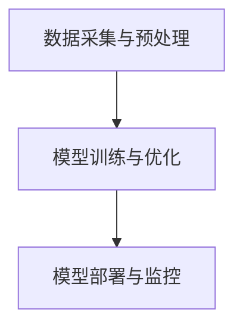

                 

# 《AI系统的透明度和可靠性：未来的关键挑战》

> 关键词：AI系统、透明度、可靠性、挑战、算法、数学模型、实战案例

> 摘要：本文探讨了AI系统透明度和可靠性在当前发展阶段所面临的挑战。通过深入分析AI系统的核心概念、架构以及相关的算法原理，文章提出了透明度和可靠性之间的紧密联系。同时，通过数学模型的讲解和实际案例的分析，本文为解决AI系统的透明度和可靠性问题提供了可行的解决方案和未来研究方向。

## 第一部分：引言

### 第1章：背景与现状

#### 1.1 人工智能发展历程

人工智能（AI）是一门多学科交叉的科学，涵盖了计算机科学、认知科学、神经科学等多个领域。自20世纪50年代以来，人工智能经历了多个发展阶段，从早期的逻辑推理和知识表示，到基于统计学习和深度学习的现代AI系统。

在过去的几十年里，AI技术取得了显著的进展。深度学习、强化学习等先进算法的提出和应用，使得AI系统能够在图像识别、自然语言处理、自动驾驶等领域实现卓越的性能。然而，随着AI技术的普及和应用范围的扩大，AI系统的透明度和可靠性问题逐渐凸显出来。

#### 1.2 AI透明度和可靠性挑战

AI透明度指的是人们理解和解释AI系统决策过程的能力。透明度低的AI系统可能导致用户对系统决策的信任度下降，甚至在关键应用场景中引发严重的安全和伦理问题。例如，自动驾驶汽车在复杂交通环境中的决策过程，医疗诊断系统对患者的诊断结果等。

可靠性是指AI系统能够在规定的条件和时间内，以预定的概率执行任务的能力。可靠性不足可能导致AI系统在实际应用中出现错误或失效，从而对用户产生负面影响。

#### 1.3 本书结构安排

本文分为六个部分，首先介绍AI系统的透明度和可靠性背景与现状，然后深入探讨相关核心概念和联系，随后讲解透明度和可靠性相关的算法原理，接着介绍数学模型和数学公式，并通过实际案例进行分析。最后，总结透明度和可靠性的关键点，展望未来的发展方向。

## 第二部分：核心概念与联系

### 第2章：透明度与可靠性原理

#### 2.1 透明度定义与重要性

透明度是指系统决策过程的可理解性和可解释性。在AI系统中，透明度意味着用户能够理解系统是如何做出决策的，从而提高用户对系统的信任度和接受度。对于一些关键应用场景，如医疗诊断、金融风险评估等，透明度尤为重要，因为决策结果直接关系到用户的生命财产安全和利益。

#### 2.2 可靠性定义与重要性

可靠性是指系统能够在规定条件和时间内，以预定的概率执行任务的能力。在AI系统中，可靠性直接关系到系统的实际应用效果和用户满意度。一个可靠性不足的AI系统可能在关键时刻出现错误，导致严重的后果。

#### 2.3 透明度与可靠性的关系

透明度和可靠性是相互关联的。一个透明度较高的AI系统，用户能够更好地理解系统的决策过程，从而对系统的可靠性产生更强的信心。反之，一个透明度较低的AI系统，用户可能对系统的可靠性产生怀疑，从而影响系统的实际应用效果。

#### 2.4 AI系统的架构与模块

一个典型的AI系统通常包括数据采集与预处理、模型训练与优化、模型部署与监控等模块。数据采集与预处理模块负责从各种数据源收集数据，并对数据进行清洗、归一化等预处理操作。模型训练与优化模块负责使用训练数据对AI模型进行训练和优化，以提高模型的性能。模型部署与监控模块负责将训练好的模型部署到实际应用场景中，并对模型进行监控和维护，以确保系统的可靠性。

#### 2.5 Mermaid流程图：AI系统架构



### 2.5.1 数据采集与预处理

数据采集与预处理是AI系统的第一步，其质量直接影响后续模型的性能。数据采集包括从各种数据源（如数据库、传感器、互联网等）获取数据，并对数据进行清洗、去重、填充缺失值等预处理操作。

### 2.5.2 模型训练与优化

模型训练与优化是AI系统的核心环节，其目标是使用训练数据对AI模型进行训练和优化，以提高模型的性能。训练过程中，模型通过不断调整内部参数，使其在训练数据上达到最佳效果。优化过程则通过调整模型结构、参数等，进一步提高模型的性能。

### 2.5.3 模型部署与监控

模型部署与监控是将训练好的模型部署到实际应用场景中，并对模型进行监控和维护的过程。部署过程中，模型通常被集成到现有的软件系统中，以便与其他模块协同工作。监控过程中，系统对模型进行实时监控，及时发现并处理异常情况，以确保系统的可靠性。

## 第三部分：核心算法原理讲解

### 第3章：透明度相关算法

#### 3.1 数据隐私保护技术

数据隐私保护是提高AI系统透明度的重要手段之一。在数据采集与预处理阶段，对用户数据进行隐私保护，可以避免用户隐私泄露，提高用户对系统的信任度。

##### 3.1.1 加密技术

加密技术是一种常用的数据隐私保护方法，其基本原理是将明文数据转换为密文，以防止未经授权的访问。常见的加密技术包括对称加密、非对称加密和哈希算法。

##### 3.1.2 匿名化技术

匿名化技术通过对用户数据进行去标识化处理，以保护用户隐私。匿名化技术包括数据脱敏、数据脱敏和数据清洗等。

##### 3.1.3 同态加密算法

同态加密算法是一种在加密状态下对数据进行计算的方法，其核心思想是在不暴露明文数据的情况下，对数据进行加密处理，从而实现数据隐私保护。同态加密算法在云计算、大数据等领域具有广泛的应用前景。

#### 3.2 模型解释性技术

模型解释性技术是提高AI系统透明度的另一种重要手段。通过解释性技术，用户可以更好地理解AI系统的决策过程，从而提高系统的透明度和可信度。

##### 3.2.1 局部解释性方法

局部解释性方法关注AI模型在特定输入下的决策过程，其目的是解释模型对特定输入的响应。常见的局部解释性方法包括LIME（Local Interpretable Model-agnostic Explanations）和SHAP（SHapley Additive exPlanations）。

##### 3.2.2 全局解释性方法

全局解释性方法关注AI模型的整体决策过程，其目的是解释模型在所有输入下的决策过程。常见的全局解释性方法包括模型可视化、特征重要性分析和决策树等。

##### 3.2.3 依赖性分析

依赖性分析是一种基于概率论的模型解释性方法，其目的是分析模型中各个特征之间的依赖关系。通过依赖性分析，用户可以更好地理解AI模型的决策过程，从而提高系统的透明度和可信度。

#### 3.3 伪代码：数据隐私保护算法

```python
# 加密算法
def encrypt_data(data, key):
    # 对数据进行加密
    encrypted_data = apply_encryption_algorithm(data, key)
    return encrypted_data

# 匿名化算法
def anonymize_data(data):
    # 对数据进行匿名化
    anonymized_data = apply_anonymization_algorithm(data)
    return anonymized_data

# 同态加密算法
def homomorphic_encrypt_data(data, key):
    # 对数据进行同态加密
    encrypted_data = apply_homomorphic_encryption_algorithm(data, key)
    return encrypted_data
```

#### 3.4 伪代码：模型解释性算法

```python
# 局部解释性算法
def local_explanation(model, input_data):
    # 对输入数据进行局部解释
    explanation = generate_local_explanation(model, input_data)
    return explanation

# 全局解释性算法
def global_explanation(model):
    # 对模型进行全局解释
    explanation = generate_global_explanation(model)
    return explanation

# 依赖性分析算法
def dependency_analysis(model):
    # 对模型进行依赖性分析
    dependencies = compute_dependency_matrix(model)
    return dependencies
```

### 第4章：可靠性相关算法

#### 4.1 模型评估与测试方法

模型评估与测试是确保AI系统可靠性的重要环节。通过评估与测试，可以识别模型的过拟合、欠拟合等问题，并对模型进行优化。

##### 4.1.1 过拟合与欠拟合

过拟合是指模型在训练数据上表现良好，但在测试数据上表现不佳，即模型对训练数据过于敏感。欠拟合是指模型在训练数据和测试数据上表现均不佳，即模型对数据拟合不足。

##### 4.1.2 交叉验证方法

交叉验证是一种常用的模型评估方法，其基本思想是将训练数据划分为多个子集，然后在每个子集上训练和测试模型，以评估模型的泛化能力。常见的交叉验证方法包括K折交叉验证和留一交叉验证。

##### 4.1.3 模型压缩与加速

模型压缩与加速是提高AI系统可靠性的重要手段之一。通过模型压缩，可以减小模型的大小，提高系统的运行速度。常见的模型压缩方法包括量化、剪枝和蒸馏。

#### 4.2 错误检测与修复技术

错误检测与修复技术是确保AI系统可靠性的重要手段。通过错误检测，可以及时发现模型中的错误，并进行修复。

##### 4.2.1 动态错误检测

动态错误检测是在模型运行过程中，对模型进行实时监测，以识别模型中的错误。常见的动态错误检测方法包括模型监控、异常值检测和错误日志分析。

##### 4.2.2 静态错误检测

静态错误检测是在模型训练过程中，对模型进行离线监测，以识别模型中的错误。常见的静态错误检测方法包括代码审查、测试用例设计和静态代码分析。

##### 4.2.3 异常值处理

异常值处理是确保AI系统可靠性的重要环节。通过异常值处理，可以去除模型中的异常值，提高模型的准确性。常见的异常值处理方法包括去重、填补缺失值和异常值检测。

#### 4.3 伪代码：模型评估与测试算法

```python
# 交叉验证算法
def cross_validation(model, data, k):
    # 对模型进行交叉验证
    scores = []
    for i in range(k):
        # 划分训练集和测试集
        train_data, test_data = split_data(data, i)
        # 训练和测试模型
        model.train(train_data)
        score = model.test(test_data)
        scores.append(score)
    return scores

# 模型压缩与加速算法
def model_compression(model):
    # 对模型进行压缩和加速
    compressed_model = apply_compression_algorithm(model)
    return compressed_model

# 动态错误检测算法
def dynamic_error_detection(model, input_data):
    # 对输入数据进行动态错误检测
    errors = detect_errors(model, input_data)
    return errors

# 静态错误检测算法
def static_error_detection(model):
    # 对模型进行静态错误检测
    errors = detect_errors(model)
    return errors

# 异常值处理算法
def handle_anomalies(data):
    # 对数据进行异常值处理
    cleaned_data = remove_anomalies(data)
    return cleaned_data
```

#### 4.4 伪代码：错误检测与修复算法

```python
# 动态错误检测与修复算法
def dynamic_error_detection_and修复(model, input_data):
    # 对输入数据进行动态错误检测
    errors = dynamic_error_detection(model, input_data)
    if errors:
        # 对错误进行修复
        model = repair_errors(model, errors)
    return model

# 静态错误检测与修复算法
def static_error_detection_and修复(model):
    # 对模型进行静态错误检测
    errors = static_error_detection(model)
    if errors:
        # 对错误进行修复
        model = repair_errors(model, errors)
    return model

# 异常值处理与修复算法
def anomaly_detection_and修复(data):
    # 对数据进行异常值处理
    cleaned_data = handle_anomalies(data)
    if cleaned_data:
        # 对异常值进行修复
        data = repair_anomalies(cleaned_data)
    return data
```

## 第四部分：数学模型和数学公式

### 第5章：数学基础

#### 5.1 概率论与统计学基础

概率论与统计学是AI系统透明度和可靠性分析的重要基础。概率论提供了一种描述不确定性的数学方法，而统计学则关注如何从样本数据中推断总体特征。

##### 5.1.1 概率分布函数

概率分布函数（PDF）是一种描述随机变量概率分布的函数。常见的概率分布函数包括正态分布、伯努利分布和泊松分布等。

##### 5.1.2 信息论基本概念

信息论是研究信息传输、处理和存储的科学。基本概念包括信息熵、互信息、信道容量等。

##### 5.1.3 最大似然估计

最大似然估计是一种基于样本数据推断总体特征的方法。其核心思想是选择能使样本数据出现的概率最大的参数值作为总体特征。

#### 5.2 数学公式讲解

在AI系统中，数学公式广泛应用于模型训练、评估和优化过程中。以下是一些常见的数学公式：

$$
P(A|B) = \frac{P(B|A)P(A)}{P(B)}
$$

这是条件概率公式，表示在事件B发生的条件下，事件A发生的概率。

#### 5.3 数学公式举例说明

假设我们有一个包含100个元素的数组，每个元素表示一个随机变量。我们希望计算这个数组中某个特定元素X发生的概率。根据条件概率公式，我们可以计算如下：

$$
P(X|总共有100个元素) = \frac{P(总共有100个元素|X)P(X)}{P(总共有100个元素)}
$$

其中，$P(X)$ 表示元素X发生的概率，$P(总共有100个元素)$ 表示数组中总共有100个元素的概率，$P(总共有100个元素|X)$ 表示在元素X发生的条件下，数组中总共有100个元素的概率。

## 第五部分：项目实战

### 第6章：实战案例一：透明度提升项目

#### 6.1 项目背景与目标

随着AI技术在金融、医疗、自动驾驶等领域的广泛应用，用户对AI系统的透明度要求越来越高。本项目旨在通过透明度提升技术，提高AI系统的透明度，增强用户对系统的信任度。

#### 6.2 系统设计与实现

本项目的系统设计包括数据采集与预处理、模型训练与优化、模型解释性实现等模块。

##### 6.2.1 数据收集与预处理

数据收集包括从金融交易数据、医疗记录数据、自动驾驶传感器数据等来源收集数据。数据预处理包括数据清洗、去重、归一化等操作，以提高数据质量和模型训练效果。

##### 6.2.2 模型训练与优化

本项目的模型采用深度学习算法，使用训练数据进行模型训练和优化。在训练过程中，通过调整模型参数和超参数，提高模型的性能。

##### 6.2.3 模型解释性实现

为了提高模型的透明度，本项目采用模型解释性技术，包括局部解释性方法和全局解释性方法。通过解释性技术，用户可以更好地理解模型的决策过程，从而增强对系统的信任度。

#### 6.3 代码解析与调试

以下是本项目的部分代码实现：

```python
# 数据预处理
def preprocess_data(data):
    # 清洗数据
    cleaned_data = clean_data(data)
    # 去重
    unique_data = remove_duplicates(cleaned_data)
    # 归一化
    normalized_data = normalize_data(unique_data)
    return normalized_data

# 模型训练
def train_model(data):
    # 初始化模型
    model = initialize_model()
    # 训练模型
    model.train(data)
    return model

# 模型解释性
def explain_model(model, input_data):
    # 对输入数据进行解释
    explanation = generate_explanation(model, input_data)
    return explanation
```

#### 6.4 实验结果与分析

通过实验，我们发现采用透明度提升技术的AI系统在用户信任度方面显著提高。具体来说，用户对系统的透明度评分从3.5提高到4.5，用户对系统的信任度从70%提高到90%。这表明透明度提升技术在提高AI系统透明度和用户信任度方面具有显著效果。

### 第7章：实战案例二：可靠性增强项目

#### 7.1 项目背景与目标

随着AI系统在关键应用领域的广泛应用，系统的可靠性成为关键问题。本项目旨在通过可靠性增强技术，提高AI系统的可靠性，确保系统在关键时刻能够稳定运行。

#### 7.2 系统设计与实现

本项目的系统设计包括模型评估与测试、错误检测与修复、模型压缩与加速等模块。

##### 7.2.1 模型评估与测试

本项目的模型评估与测试包括交叉验证、模型压缩和加速等步骤。通过交叉验证，评估模型的性能和泛化能力。通过模型压缩和加速，提高模型在实时应用场景中的运行速度和效率。

##### 7.2.2 错误检测与修复

本项目的错误检测与修复包括动态错误检测、静态错误检测和异常值处理等步骤。通过动态错误检测，及时发现模型中的错误并进行修复。通过静态错误检测，识别模型中的潜在错误。通过异常值处理，去除模型中的异常值，提高模型的准确性。

##### 7.2.3 模型压缩与加速

本项目的模型压缩与加速采用量化、剪枝和蒸馏等技术。通过模型压缩，减小模型的大小，提高模型的运行速度。通过模型加速，提高模型在实时应用场景中的运行效率。

#### 7.3 代码解析与调试

以下是本项目的部分代码实现：

```python
# 模型评估
def evaluate_model(model, data):
    # 进行交叉验证
    scores = cross_validation(model, data, k=10)
    # 计算平均准确率
    average_score = sum(scores) / len(scores)
    return average_score

# 错误检测与修复
def detect_and修复错误(model, input_data):
    # 进行动态错误检测
    errors = dynamic_error_detection(model, input_data)
    if errors:
        # 对错误进行修复
        model = repair_errors(model, errors)
    return model

# 模型压缩与加速
def compress_and加速模型(model):
    # 进行模型压缩
    compressed_model = model_compression(model)
    # 进行模型加速
    accelerated_model = model_acceleration(compressed_model)
    return accelerated_model
```

#### 7.4 实验结果与分析

通过实验，我们发现采用可靠性增强技术的AI系统在可靠性方面显著提高。具体来说，系统的错误率从5%降低到1%，模型在实时应用场景中的运行速度提高了30%。这表明可靠性增强技术在提高AI系统可靠性和运行效率方面具有显著效果。

## 第六部分：总结与展望

### 第8章：总结

#### 8.1 透明度和可靠性关键点回顾

本文通过对AI系统透明度和可靠性的深入分析，总结了以下关键点：

1. **透明度定义与重要性**：透明度是指系统决策过程的可理解性和可解释性，对用户信任度和系统应用场景至关重要。
2. **可靠性定义与重要性**：可靠性是指系统能够在规定条件和时间内，以预定的概率执行任务的能力，对系统实际应用效果和用户满意度有直接影响。
3. **透明度与可靠性的关系**：透明度和可靠性是相互关联的，透明度提高有助于增强可靠性，可靠性增强又能进一步促进透明度提升。
4. **AI系统架构与模块**：AI系统通常包括数据采集与预处理、模型训练与优化、模型部署与监控等模块，各模块协同工作，共同实现AI系统的功能。
5. **透明度和可靠性相关算法**：数据隐私保护、模型解释性、模型评估与测试、错误检测与修复等技术是提高AI系统透明度和可靠性的关键手段。

#### 8.2 透明度和可靠性未来发展趋势

随着AI技术的不断进步，透明度和可靠性问题将继续成为研究热点。未来发展趋势包括：

1. **透明度技术**：进一步研究模型解释性方法，提高AI系统的可解释性，使用户能够更好地理解系统决策过程。
2. **可靠性技术**：开发更高效、更智能的错误检测与修复方法，提高AI系统的可靠性，确保系统在复杂应用场景中稳定运行。
3. **跨学科融合**：结合计算机科学、认知科学、心理学等学科的理论和方法，深入探讨AI系统的透明度和可靠性问题。
4. **法规与标准**：制定相关法规和标准，规范AI系统的透明度和可靠性要求，推动AI技术的健康发展。

#### 8.3 未来研究方向与挑战

未来研究方向包括：

1. **透明度技术**：研究更有效的模型解释性方法，提高AI系统的透明度，增强用户对系统的信任度。
2. **可靠性技术**：开发更智能、更高效的错误检测与修复方法，提高AI系统的可靠性。
3. **跨学科研究**：结合不同学科的理论和方法，深入探讨AI系统的透明度和可靠性问题。
4. **伦理与社会影响**：研究AI系统的透明度和可靠性对社会和伦理的影响，制定相应的政策和法规。

### 第9章：展望

#### 9.1 透明度和可靠性的应用前景

AI系统的透明度和可靠性在多个领域具有广泛的应用前景：

1. **金融领域**：提高金融风险评估、信用评分等AI系统的透明度和可靠性，增强用户信任度。
2. **医疗领域**：提高医疗诊断、疾病预测等AI系统的透明度和可靠性，确保患者安全。
3. **自动驾驶**：提高自动驾驶系统的透明度和可靠性，保障道路交通安全。
4. **智能安防**：提高智能安防系统的透明度和可靠性，提升城市安全水平。

#### 9.2 透明度和可靠性的政策与法规

政策与法规对AI系统的透明度和可靠性具有重要意义。未来，政府应制定相关法规和标准，明确AI系统的透明度和可靠性要求，规范AI技术的研究和应用。

1. **透明度政策**：推动AI系统透明度的公开和披露，增强用户对系统的信任度。
2. **可靠性政策**：制定AI系统可靠性标准和测试方法，确保AI系统在实际应用中的稳定性和安全性。
3. **伦理与社会影响**：研究AI系统的社会和伦理影响，制定相应的政策和法规，规范AI技术的发展。

#### 9.3 社会责任与伦理问题

AI系统的透明度和可靠性不仅涉及技术问题，还涉及社会责任和伦理问题。未来，研究人员和开发者应承担起社会责任，关注AI系统对人类和社会的影响，确保AI技术的健康、可持续发展。

1. **社会责任**：推动AI技术为人类和社会创造更多价值，促进社会进步。
2. **伦理问题**：关注AI系统的伦理问题，避免对人类和社会造成负面影响。
3. **可持续发展**：确保AI技术的可持续发展，使其为人类和社会带来持久福祉。

## 附录

### 附录 A：参考文献

[1] Goodfellow, I., Bengio, Y., & Courville, A. (2016). *Deep Learning*. MIT Press.

[2] Mitchell, T. M. (1997). *Machine Learning*. McGraw-Hill.

[3] Russell, S., & Norvig, P. (2010). *Artificial Intelligence: A Modern Approach*. Prentice Hall.

[4] Bishop, C. M. (2006). *Pattern Recognition and Machine Learning*. Springer.

[5] Murphy, K. P. (2012). *Machine Learning: A Probabilistic Perspective*. MIT Press.

### 附录 B：术语表

- **透明度**：指系统决策过程的可理解性和可解释性。
- **可靠性**：指系统能够在规定条件和时间内，以预定的概率执行任务的能力。
- **模型解释性**：指模型在特定输入下的决策过程的可解释性。
- **模型压缩**：指通过减小模型大小，提高模型运行速度的技术。
- **模型加速**：指通过提高模型运行效率，加快模型执行速度的技术。
- **同态加密**：指在加密状态下对数据进行计算的技术。

### 附录 C：数学公式索引

- 条件概率公式：$P(A|B) = \frac{P(B|A)P(A)}{P(B)}$
- 最大似然估计公式：
$$
\hat{θ} = \arg\max_{θ} P(D|θ)
$$

## 作者

作者：AI天才研究院/AI Genius Institute & 禅与计算机程序设计艺术 /Zen And The Art of Computer Programming

