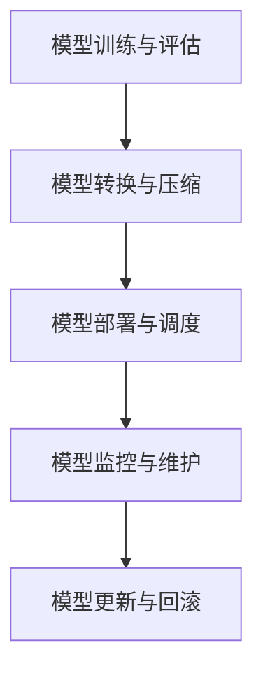

                 

# 文章标题: 《AI自动化部署框架》

关键词：AI自动化部署、模型版本管理、模型性能评估、模型监控与维护、模型压缩与加速

摘要：
本文深入探讨了AI自动化部署框架的构建与实践。从基础概念出发，详细阐述了AI自动化部署的意义、挑战与机遇，以及其发展趋势。文章分为两个部分，第一部分介绍了AI自动化部署的核心概念、架构设计和常用工具与框架，并辅以实际案例。第二部分则聚焦于AI自动化部署的优化策略、挑战与解决方案，以及未来展望。通过本文，读者将全面了解AI自动化部署的各个方面，掌握从理论到实践的全面知识。

---

### 《AI自动化部署框架》目录大纲

## 第一部分：AI自动化部署基础

### 第1章：AI自动化部署概述

#### 1.1 AI自动化部署的意义与价值
#### 1.2 AI自动化部署的挑战与机遇
#### 1.3 AI自动化部署的发展趋势

### 第2章：AI自动化部署的核心概念

#### 2.1 模型版本管理
#### 2.2 模型性能评估
#### 2.3 模型监控与维护

### 第3章：AI自动化部署的架构设计

#### 3.1 模型训练与评估
#### 3.2 模型转换与压缩
#### 3.3 模型部署与调度

### 第4章：AI自动化部署工具与框架

#### 4.1 TensorFlow Serving
#### 4.2 ONNX Runtime
#### 4.3 PyTorch Serve

### 第5章：AI自动化部署的实际案例

#### 5.1 案例一：图像识别模型的部署
#### 5.2 案例二：自然语言处理模型的部署
#### 5.3 案例三：推荐系统的部署

## 第二部分：AI自动化部署的实践与优化

### 第6章：AI自动化部署的优化策略

#### 6.1 模型压缩与加速
#### 6.2 模型监控与报警
#### 6.3 模型更新与回滚

### 第7章：AI自动化部署的挑战与解决方案

#### 7.1 数据同步与一致性
#### 7.2 部署安全与合规
#### 7.3 部署效率与成本

### 第8章：AI自动化部署的未来展望

#### 8.1 人工智能产业的发展趋势
#### 8.2 AI自动化部署的新技术与应用
#### 8.3 AI自动化部署的未来挑战与机遇

## 附录

### 附录A：AI自动化部署工具与资源

#### A.1 常用AI自动化部署工具
#### A.2 开源资源与社区
#### A.3 相关书籍与论文推荐

### 附录B：Mermaid流程图

#### B.1 AI自动化部署流程图

### 附录C：核心算法原理讲解

#### C.1 模型压缩与加速算法

### 附录D：项目实战

#### D.1 图像识别模型的部署
#### D.2 自然语言处理模型的部署
#### D.3 推荐系统的部署

### 附录E：代码解读与分析

#### E.1 TensorFlow Serving部署案例

---

## 第1章：AI自动化部署概述

### 1.1 AI自动化部署的意义与价值

AI自动化部署的核心在于将训练好的机器学习模型快速、高效地部署到生产环境中，以实现实时数据处理和分析。这种自动化的部署不仅能够提升企业的运营效率，还能在竞争激烈的市场中抢占先机。以下是AI自动化部署的主要意义与价值：

1. **提升效率**：传统的手动部署方式不仅耗时耗力，而且容易出错。自动化部署能够通过脚本或工具实现模型的快速部署，显著提高开发效率。

2. **确保一致性**：自动化部署可以确保每次部署的一致性，减少因人工操作导致的环境差异和错误。

3. **降低成本**：自动化部署减少了人工干预的需求，从而降低了运营成本。

4. **增强灵活性**：自动化部署使得企业能够更灵活地应对市场变化，快速推出新的产品和服务。

5. **提高可靠性**：自动化部署通过监控和报警机制，可以及时发现并处理部署过程中的问题，确保系统的稳定性和可靠性。

### 1.2 AI自动化部署的挑战与机遇

尽管AI自动化部署具有显著的价值，但在实际应用中仍面临着一系列挑战和机遇：

**挑战**：

1. **模型复杂度高**：随着深度学习技术的发展，模型的复杂度不断增加，部署的难度也随之提高。

2. **环境多样性**：不同的生产环境（如CPU、GPU、ARM等）对模型的要求不同，如何保证模型在不同环境中的兼容性是一个挑战。

3. **数据同步与一致性**：在生产环境中，数据可能在多个节点之间传输，如何保证数据的一致性和准确性是自动化部署的关键问题。

4. **安全性问题**：在生产环境中部署AI模型，需要考虑数据的安全性和系统的安全性，防止恶意攻击和数据泄露。

**机遇**：

1. **云计算与容器化**：云计算和容器化技术的发展为AI自动化部署提供了强大的支持，使得模型可以轻松地在不同的云环境和容器中部署。

2. **开源工具与框架**：如TensorFlow Serving、ONNX Runtime、PyTorch Serve等开源工具和框架的出现，为自动化部署提供了丰富的选择。

3. **模型压缩与加速**：随着模型压缩和加速技术的发展，大型模型的部署效率得到显著提高。

4. **人工智能产业的快速发展**：人工智能产业的快速发展为自动化部署带来了巨大的市场需求和机会。

### 1.3 AI自动化部署的发展趋势

随着技术的不断进步，AI自动化部署的发展趋势主要体现在以下几个方面：

1. **模型压缩与加速**：通过模型压缩和加速技术，使得更大规模的模型可以在更短的时间内完成部署。

2. **自动化测试与监控**：自动化测试和监控技术的应用，可以确保模型的可靠性和稳定性。

3. **多租户部署**：通过多租户部署技术，可以在同一硬件上运行多个独立的模型，提高资源利用率。

4. **安全性与合规性**：随着AI模型在关键领域的应用，安全性和合规性将成为自动化部署的重要关注点。

5. **分布式与边缘计算**：分布式和边缘计算技术的发展，使得AI模型可以在离用户更近的地方部署，提高响应速度和用户体验。

---

## 第2章：AI自动化部署的核心概念

### 2.1 模型版本管理

模型版本管理是AI自动化部署的重要组成部分，它涉及到如何有效地管理和跟踪模型的各个版本。以下是模型版本管理的关键概念和最佳实践：

**版本管理的关键概念**：

1. **模型版本**：模型版本是对模型代码和配置文件的一种标识，通常以数字或字母序列表示。

2. **模型仓库**：模型仓库是存储模型版本的地方，可以是本地文件系统、数据库或云存储。

3. **版本控制**：版本控制是通过跟踪和管理模型代码和配置文件的变化，确保模型版本的准确性和一致性。

**最佳实践**：

1. **定期备份**：定期备份模型仓库，以防数据丢失或损坏。

2. **版本标签**：为每个版本添加标签，便于跟踪和回溯。

3. **变更日志**：记录每个版本的变更信息，包括变更的原因、时间、责任人等。

4. **版本兼容性**：确保不同版本之间的兼容性，避免因版本冲突导致部署失败。

5. **回滚策略**：制定回滚策略，以便在出现问题时快速回滚到之前版本。

### 2.2 模型性能评估

模型性能评估是确保模型质量和有效性的关键步骤。以下是模型性能评估的关键概念和常见指标：

**关键概念**：

1. **评估指标**：评估指标是衡量模型性能的标准，如准确率、召回率、F1分数等。

2. **评估集**：评估集是从训练数据中划分出来用于评估模型性能的数据集。

3. **交叉验证**：交叉验证是一种评估模型性能的方法，通过将数据集划分为多个子集，轮流进行训练和评估。

**常见指标**：

1. **准确率（Accuracy）**：准确率是预测正确的样本数占总样本数的比例。

2. **召回率（Recall）**：召回率是预测正确的正样本数占实际正样本数的比例。

3. **F1分数（F1 Score）**：F1分数是准确率和召回率的调和平均值，用于平衡准确率和召回率。

4. **精确率（Precision）**：精确率是预测正确的正样本数占预测为正样本的样本数的比例。

5. **ROC曲线（Receiver Operating Characteristic Curve）**：ROC曲线是评估二分类模型性能的重要工具，通过比较真实正样本和预测正样本的比例，评估模型的判别能力。

**最佳实践**：

1. **多指标评估**：使用多个指标评估模型性能，以获得更全面的评估结果。

2. **调整超参数**：根据评估结果调整模型超参数，以提升模型性能。

3. **持续评估**：定期对模型进行评估，以确保其性能稳定。

4. **A/B测试**：通过A/B测试，比较不同模型的性能，选择最优模型。

### 2.3 模型监控与维护

模型监控与维护是确保模型在生产环境中稳定运行的重要环节。以下是模型监控与维护的关键概念和策略：

**关键概念**：

1. **监控指标**：监控指标是用于评估模型运行状态的量化指标，如延迟、错误率、资源利用率等。

2. **报警机制**：报警机制是当监控指标超过预设阈值时，自动触发通知和警报的机制。

3. **维护策略**：维护策略是用于修复和优化模型的策略，包括更新模型、调整超参数、处理异常等。

**最佳实践**：

1. **实时监控**：实时监控模型的运行状态，及时发现异常并采取措施。

2. **日志管理**：记录模型运行日志，便于问题追踪和故障排查。

3. **定期维护**：定期对模型进行维护，包括性能优化、安全检查和更新等。

4. **容错与恢复**：设计容错机制，确保模型在遇到故障时能够快速恢复。

5. **文档与记录**：维护详细的文档和记录，包括模型监控策略、维护记录和故障处理指南等，以便后续参考和改进。

---

## 第3章：AI自动化部署的架构设计

### 3.1 模型训练与评估

模型训练与评估是AI自动化部署流程中的关键环节，涉及到如何高效地训练模型并评估其性能。以下是模型训练与评估的详细步骤和策略：

**模型训练的步骤**：

1. **数据预处理**：在训练模型之前，需要对数据集进行预处理，包括数据清洗、归一化、分割等操作。

2. **模型选择**：选择适合任务需求的模型架构，可以是预训练模型、迁移学习模型或从头开始训练的模型。

3. **训练配置**：配置训练参数，包括学习率、批量大小、迭代次数等，并设置训练过程中的监控指标，如训练损失、准确率等。

4. **训练过程**：使用训练数据集进行模型训练，并在训练过程中监控性能指标的变化，以调整训练参数。

5. **模型评估**：使用评估集对训练好的模型进行评估，以确定其性能。

**训练策略**：

1. **动态调整学习率**：在训练过程中，根据性能指标的变化动态调整学习率，以提高训练效率。

2. **正则化**：应用正则化技术，如L1、L2正则化，以防止过拟合。

3. **dropout**：在神经网络中应用dropout技术，以减少过拟合。

4. **数据增强**：通过数据增强技术，如旋转、缩放、裁剪等，增加训练数据的多样性。

**模型评估的策略**：

1. **交叉验证**：使用交叉验证技术，将数据集划分为多个子集，轮流进行训练和评估，以提高评估结果的可靠性。

2. **混淆矩阵**：使用混淆矩阵分析模型对各类别的预测结果，以了解模型的分类效果。

3. **ROC曲线和AUC**：使用ROC曲线和AUC（Area Under Curve）评估模型的分类能力。

4. **错误分析**：对模型的错误预测进行分析，以找出模型不足之处并进行改进。

5. **性能对比**：对比不同模型的性能，选择最优模型进行部署。

### 3.2 模型转换与压缩

模型转换与压缩是优化模型部署性能的重要步骤，旨在将模型转换为高效的可执行格式，并减小模型的大小。以下是模型转换与压缩的详细步骤和策略：

**模型转换的步骤**：

1. **选择转换工具**：根据模型的架构和部署环境，选择合适的转换工具，如TensorFlow Lite、ONNX Runtime等。

2. **模型导出**：将训练好的模型导出为可转换的格式，如TensorFlow SavedModel、ONNX等。

3. **模型转换**：使用转换工具将模型转换为部署格式，并调整模型参数，以满足部署环境的要求。

4. **模型验证**：转换完成后，使用测试数据集验证模型性能，确保转换过程不会影响模型的准确性。

**模型压缩的策略**：

1. **量化**：通过量化技术将模型的权重和激活值从浮点数转换为低精度的整数，以减少模型大小。

2. **剪枝**：通过剪枝技术删除模型中不重要的神经元和连接，以减少模型大小。

3. **蒸馏**：通过蒸馏技术将大型模型的知识转移到小型模型中，以提高小型模型的性能。

4. **权重共享**：通过权重共享技术减少模型参数的数量，从而减小模型大小。

5. **知识蒸馏**：使用知识蒸馏技术，将大型模型的输出作为软标签，训练小型模型。

### 3.3 模型部署与调度

模型部署与调度是将训练好的模型部署到生产环境中，以便进行实时数据处理和分析的过程。以下是模型部署与调度的详细步骤和策略：

**部署的步骤**：

1. **选择部署平台**：根据模型的要求和资源需求，选择合适的部署平台，如云计算平台、容器化平台等。

2. **配置部署环境**：在部署平台上配置模型运行环境，包括操作系统、库依赖等。

3. **模型部署**：将转换后的模型部署到部署平台上，通常使用API、SDK或命令行工具进行部署。

4. **服务启动**：启动部署的服务，使其能够接收和处理请求。

5. **监控与维护**：监控模型的运行状态，并进行必要的维护和更新。

**调度的策略**：

1. **负载均衡**：通过负载均衡技术，将请求分配到不同的模型实例上，以提高系统的处理能力和响应速度。

2. **弹性伸缩**：根据请求量的变化，动态调整模型实例的数量，以保持系统的高可用性。

3. **服务监控**：监控模型的运行状态，包括延迟、错误率、资源利用率等，并设置报警机制。

4. **服务更新**：在模型更新时，采用滚动更新或蓝绿部署策略，以最小化对系统的影响。

5. **服务故障恢复**：设计故障恢复机制，确保在模型实例故障时能够快速恢复。

---

## 第4章：AI自动化部署工具与框架

### 4.1 TensorFlow Serving

TensorFlow Serving是Google开发的一个开源框架，用于将TensorFlow训练好的模型部署到生产环境中。以下是TensorFlow Serving的关键特性、使用方法和最佳实践：

**关键特性**：

1. **高性能**：TensorFlow Serving基于gRPC协议，可以提供高性能的模型服务，支持大规模并发请求。

2. **模型热更新**：TensorFlow Serving支持模型热更新，无需重启服务即可加载新的模型版本。

3. **服务发现与负载均衡**：TensorFlow Serving支持服务发现和负载均衡，可以动态调整模型的部署位置和负载。

4. **监控与日志**：TensorFlow Serving提供了监控和日志功能，可以实时查看模型的运行状态和性能指标。

**使用方法**：

1. **准备模型**：将训练好的TensorFlow模型转换为SavedModel格式。

2. **启动TensorFlow Serving服务**：
    ```bash
    tensorflow_model_server --port=9000 --model_name=my_model --model_base_path=/models/my_model/
    ```

3. **使用gRPC或REST API请求模型**：
    ```python
    import tensorflow as tf

    model_path = "my_model-00000-of-00001"
    server_url = "localhost:9000"

    signature = "serving_default"
    inputs = {"input_1": tf.zeros([1, 28, 28, 1])}
    outputs = session.run(signature, feed_dict=inputs)
    ```

**最佳实践**：

1. **模型版本管理**：使用模型版本管理工具，如TensorFlow Model Garden，对模型进行版本管理和更新。

2. **负载均衡与弹性伸缩**：结合Kubernetes等容器编排工具，实现负载均衡和弹性伸缩。

3. **监控与日志**：使用TensorFlow Dashboard和Stackdriver等工具，监控模型的性能和日志。

4. **安全性**：对TensorFlow Serving服务进行安全配置，包括认证、授权和加密等。

### 4.2 ONNX Runtime

ONNX Runtime是微软开发的一个开源框架，用于执行ONNX（Open Neural Network Exchange）模型。以下是ONNX Runtime的关键特性、使用方法和最佳实践：

**关键特性**：

1. **跨平台支持**：ONNX Runtime支持多种编程语言和计算平台，如Python、C++、Java和Windows、Linux等。

2. **高性能**：ONNX Runtime优化了模型的执行性能，可以显著降低延迟和提高吞吐量。

3. **模型兼容性**：ONNX Runtime支持多种深度学习框架的模型，如TensorFlow、PyTorch、MXNet等。

4. **动态形状**：ONNX Runtime支持动态形状的模型，可以灵活调整输入大小。

**使用方法**：

1. **准备模型**：将训练好的模型转换为ONNX格式。

2. **使用Python API请求模型**：
    ```python
    import onnxruntime as ort

    model_path = "model.onnx"
    session = ort.InferenceSession(model_path)
    input_data = np.zeros((1, 1, 28, 28), dtype=np.float32)
    output = session.run(None, {"input": input_data})
    ```

3. **使用C++ API请求模型**：
    ```cpp
    #include <onnxruntime/core/session.h>

    Ort::Session session("model.onnx", nullptr);
    std::vector<float> input_data(28 * 28 * 1, 0.0f);
    std::vector<float> output_data;
    session.Run(nullptr, &input_data[0], input_data.size() * sizeof(float), &output_data[0], output_data.size() * sizeof(float));
    ```

**最佳实践**：

1. **模型转换**：使用自动转换工具，如ONNX Convert，将不同框架的模型转换为ONNX格式。

2. **性能优化**：使用ONNX Runtime的优化选项，如加速库、内存管理等，以提高模型执行性能。

3. **多线程与并行计算**：利用多线程和并行计算技术，提高模型的处理能力。

4. **安全性**：对ONNX Runtime服务进行安全配置，包括认证、授权和加密等。

### 4.3 PyTorch Serve

PyTorch Serve是Facebook开发的一个开源框架，用于将PyTorch训练好的模型部署到生产环境中。以下是PyTorch Serve的关键特性、使用方法和最佳实践：

**关键特性**：

1. **易用性**：PyTorch Serve与PyTorch框架紧密集成，使用简单，无需额外的代码修改。

2. **高性能**：PyTorch Serve使用gRPC协议，支持大规模并发请求，性能优异。

3. **动态形状**：PyTorch Serve支持动态形状的模型，可以灵活调整输入大小。

4. **模型版本管理**：PyTorch Serve支持模型版本管理，可以轻松切换不同版本的模型。

**使用方法**：

1. **准备模型**：将训练好的PyTorch模型转换为torchscript格式。

2. **启动PyTorch Serve服务**：
    ```python
    import torch
    from torchserve import Server

    model_path = "model.pytorch"
    server = Server(models=[{
        "name": "my_model",
        "base_path": model_path,
        "entry_point": "model:main"
    }], host="0.0.0.0", port=9000)
    server.start()
    ```

3. **使用gRPC或REST API请求模型**：
    ```python
    import requests

    input_data = {"input_0": torch.tensor([1.0, 2.0, 3.0]).float().numpy()}
    response = requests.post("http://localhost:9000/predict", json=input_data)
    output = response.json()["outputs"][0]
    ```

**最佳实践**：

1. **模型压缩与优化**：使用PyTorch的模型压缩和优化工具，如torchscript、quantization等，提高模型部署性能。

2. **负载均衡与弹性伸缩**：结合Kubernetes等容器编排工具，实现负载均衡和弹性伸缩。

3. **监控与日志**：使用PyTorch Serve的监控和日志功能，实时了解模型运行状态。

4. **安全性**：对PyTorch Serve服务进行安全配置，包括认证、授权和加密等。

---

## 第5章：AI自动化部署的实际案例

### 5.1 案例一：图像识别模型的部署

在这个案例中，我们将使用TensorFlow Serving将一个图像识别模型部署到生产环境中。以下是一个简单的部署流程：

**1. 准备模型**：

首先，我们将训练好的TensorFlow模型转换为SavedModel格式：
```bash
python convert_model_to_savedmodel.py
```
这个脚本将训练好的模型文件转换为SavedModel格式的模型文件。

**2. 启动TensorFlow Serving服务**：

在服务器上启动TensorFlow Serving服务：
```bash
tensorflow_model_server --port=9000 --model_name=my_model --model_base_path=/models/my_model/
```
这个命令将在端口9000上启动TensorFlow Serving服务，并加载模型。

**3. 部署模型**：

使用gRPC或REST API请求模型：
```python
import tensorflow as tf

model_path = "my_model-00000-of-00001"
server_url = "localhost:9000"

signature = "serving_default"
inputs = {"input_1": tf.zeros([1, 28, 28, 1])}
outputs = session.run(signature, feed_dict=inputs)
```

**4. 部署后的测试**：

使用测试数据集对模型进行测试，确保模型在部署后仍然具有良好的性能。

### 5.2 案例二：自然语言处理模型的部署

在这个案例中，我们将使用ONNX Runtime将一个自然语言处理（NLP）模型部署到生产环境中。以下是一个简单的部署流程：

**1. 准备模型**：

首先，我们将训练好的NLP模型转换为ONNX格式：
```bash
python convert_model_to_onnx.py
```
这个脚本将训练好的模型文件转换为ONNX格式的模型文件。

**2. 使用Python API请求模型**：
```python
import onnxruntime as ort

model_path = "model.onnx"
session = ort.InferenceSession(model_path)
input_data = np.zeros((1, 1, 28, 28), dtype=np.float32)
output = session.run(None, {"input": input_data})
```

**3. 部署模型**：

将转换后的ONNX模型部署到生产环境中，可以使用容器化技术（如Docker）或云计算平台（如AWS、Azure）。

**4. 部署后的测试**：

使用测试数据集对模型进行测试，确保模型在部署后仍然具有良好的性能。

### 5.3 案例三：推荐系统的部署

在这个案例中，我们将使用PyTorch Serve将一个推荐系统模型部署到生产环境中。以下是一个简单的部署流程：

**1. 准备模型**：

首先，我们将训练好的推荐系统模型转换为torchscript格式：
```bash
python convert_model_to_torchscript.py
```
这个脚本将训练好的模型文件转换为torchscript格式的模型文件。

**2. 启动PyTorch Serve服务**：
```python
import torch
from torchserve import Server

model_path = "model.pytorch"
server = Server(models=[{
    "name": "my_model",
    "base_path": model_path,
    "entry_point": "model:main"
}], host="0.0.0.0", port=9000)
server.start()
```

**3. 部署模型**：

使用gRPC或REST API请求模型：
```python
import requests

input_data = {"input_0": torch.tensor([1.0, 2.0, 3.0]).float().numpy()}
response = requests.post("http://localhost:9000/predict", json=input_data)
output = response.json()["outputs"][0]
```

**4. 部署后的测试**：

使用测试数据集对模型进行测试，确保模型在部署后仍然具有良好的性能。

---

## 第6章：AI自动化部署的优化策略

### 6.1 模型压缩与加速

模型压缩与加速是提高AI自动化部署性能的重要手段。以下是一些常用的模型压缩与加速策略：

**模型压缩策略**：

1. **量化**：量化技术将模型的权重和激活值从浮点数转换为低精度的整数，从而减小模型的大小。量化可以分为全量化（Full Quantization）和部分量化（Partial Quantization）。

2. **剪枝**：剪枝技术通过删除模型中不重要的神经元和连接，来减少模型的大小。剪枝可以分为结构剪枝（Structural Pruning）和权重剪枝（Weight Pruning）。

3. **蒸馏**：蒸馏技术将大型模型的知识转移到小型模型中，从而提高小型模型的性能。在蒸馏过程中，大型模型作为教师模型（Teacher Model），小型模型作为学生模型（Student Model）。

4. **知识蒸馏**：知识蒸馏技术通过将教师模型的输出作为软标签，来训练学生模型。这样可以使得学生模型学会大型模型的核心知识，同时保持较小的模型大小。

**模型加速策略**：

1. **并行计算**：通过在多个计算单元上并行计算，来加速模型的推理过程。并行计算可以分为数据并行（Data Parallelism）和模型并行（Model Parallelism）。

2. **GPU加速**：利用GPU的并行计算能力，加速模型的训练和推理过程。GPU加速可以通过深度学习框架（如TensorFlow、PyTorch）内置的GPU支持来实现。

3. **显存优化**：通过显存优化技术，减少模型在GPU上的内存占用，以提高模型的推理速度。显存优化可以通过模型压缩和剪枝技术来实现。

4. **模型融合**：将多个小型模型融合为一个大型模型，从而提高模型的推理速度。模型融合可以通过模型蒸馏和知识蒸馏技术来实现。

### 6.2 模型监控与报警

模型监控与报警是确保模型在生产环境中稳定运行的重要环节。以下是一些常用的模型监控与报警策略：

**监控指标**：

1. **延迟**：模型的响应时间，即处理一个请求所需的时间。

2. **错误率**：模型在处理请求时产生的错误比例。

3. **资源利用率**：模型在运行时占用的CPU、内存、GPU等资源的比例。

4. **吞吐量**：模型在单位时间内处理的请求量。

**报警机制**：

1. **阈值报警**：当监控指标超过预设的阈值时，触发报警。阈值可以根据历史数据或业务需求设置。

2. **报警通知**：通过邮件、短信、电话等渠道，将报警信息通知相关人员。

3. **自动化处理**：当模型出现故障时，自动执行恢复操作，如重启服务、切换备援等。

4. **日志分析**：对监控日志进行分析，查找故障原因，并制定相应的修复方案。

### 6.3 模型更新与回滚

模型更新与回滚是确保模型性能稳定的重要策略。以下是一些常用的模型更新与回滚策略：

**更新策略**：

1. **灰度发布**：将新的模型版本逐步推广到生产环境，以降低更新带来的风险。灰度发布可以分为流量灰度（Traffic Splitting）和功能灰度（Feature Flagging）。

2. **蓝绿部署**：将新版本的服务部署到蓝环境，同时保留旧版本的服务在绿环境中。逐步将流量切换到蓝环境，以验证新版本的服务性能。

3. **滚动更新**：逐步更新服务实例，以避免服务中断。在更新过程中，确保始终有足够的实例在运行，以保持服务的可用性。

**回滚策略**：

1. **自动回滚**：当新版本的服务出现问题时，自动回滚到旧版本的服务。

2. **手动回滚**：当自动回滚无法解决问题时，手动执行回滚操作。

3. **回滚验证**：在回滚之前，对旧版本的服务进行验证，确保其仍然能够满足业务需求。

---

## 第7章：AI自动化部署的挑战与解决方案

### 7.1 数据同步与一致性

在AI自动化部署过程中，数据同步与一致性是一个重要的挑战。由于模型训练、评估和部署通常在不同的环境中进行，如何保证数据在不同环境之间的同步和一致性成为关键问题。以下是一些解决方案：

**方案一：数据管道**

构建一个数据管道（Data Pipeline），实现数据的实时同步和转换。数据管道可以采用如Apache Kafka、Apache NiFi等工具，将数据从源头（如数据库、文件系统）传输到目标环境（如训练环境、评估环境、部署环境）。通过数据管道，可以实现数据的实时同步，保证数据的一致性。

**方案二：分布式存储**

使用分布式存储系统（如HDFS、Cassandra、MongoDB等），将数据存储在分布式文件系统或数据库中。分布式存储系统具有高可用性和容错性，可以有效解决数据在不同环境之间的同步问题。通过分布式存储系统，可以实现数据的实时读取和写入，确保数据的一致性。

**方案三：版本控制**

使用版本控制系统（如Git、SVN等），对数据文件进行版本控制。每次数据更新时，将数据文件纳入版本控制系统中，记录版本信息。通过版本控制，可以追溯数据的历史变更，确保数据的一致性和可回溯性。

### 7.2 部署安全与合规

在AI自动化部署过程中，部署安全与合规是另一个重要挑战。由于模型部署涉及到敏感数据和关键业务，如何保证部署的安全性、合规性和数据保护成为关键问题。以下是一些解决方案：

**方案一：访问控制**

实现严格的访问控制机制，确保只有授权人员才能访问模型和相关的数据。通过身份验证和授权，限制用户对模型和数据的访问权限，防止未经授权的访问和操作。

**方案二：数据加密**

对数据进行加密，确保数据在传输和存储过程中的安全性。采用如AES（Advanced Encryption Standard）、RSA（Rivest-Shamir-Adleman）等加密算法，对数据进行加密和解密操作。通过加密技术，可以防止数据泄露和篡改。

**方案三：合规性检查**

建立合规性检查机制，确保模型部署符合相关法律法规和行业标准。通过自动化工具和人工审核相结合，对模型和数据进行合规性检查，确保数据的安全性和合法性。

**方案四：监控与审计**

实现实时监控和审计机制，对模型部署过程进行监控和记录。通过日志记录、监控告警和审计报告，实时了解模型部署的状态和安全情况，及时发现和处理潜在的安全风险。

### 7.3 部署效率与成本

在AI自动化部署过程中，部署效率与成本是另一个重要挑战。随着模型复杂度和数据量的增加，如何提高部署效率、降低成本成为关键问题。以下是一些解决方案：

**方案一：自动化部署**

采用自动化部署工具和框架（如Jenkins、Ansible、Kubernetes等），实现模型的自动化部署。通过自动化部署，可以减少人工操作，提高部署效率，降低部署成本。

**方案二：模型压缩与优化**

对模型进行压缩和优化，减小模型的大小和计算复杂度，提高部署效率。采用如量化、剪枝、蒸馏等技术，对模型进行压缩和优化。通过模型压缩与优化，可以减少模型的存储空间和计算资源需求，提高部署效率。

**方案三：分布式部署**

采用分布式部署策略，将模型部署到多个节点上，实现模型的并行处理。通过分布式部署，可以充分利用计算资源，提高部署效率。同时，分布式部署可以提高系统的容错性和扩展性。

**方案四：云服务与容器化**

采用云服务和容器化技术（如AWS、Azure、Docker等），实现模型的弹性部署和高效管理。通过云服务和容器化技术，可以降低部署成本，提高部署效率。云服务和容器化技术可以提供灵活的资源配置和管理，实现模型的快速部署和扩展。

---

## 第8章：AI自动化部署的未来展望

### 8.1 人工智能产业的发展趋势

人工智能（AI）技术正以前所未有的速度发展，其对各行各业的变革性影响已经初见端倪。以下是一些关键的发展趋势：

**人工智能与物联网的融合**：物联网（IoT）设备的大量应用和数据生成能力为AI技术提供了丰富的数据资源。未来的发展趋势将看到AI与IoT的深度结合，实现智能设备的自学习和自动化。

**边缘计算的发展**：随着AI模型的复杂性和数据量的增加，边缘计算（Edge Computing）的重要性日益凸显。通过在边缘设备上部署AI模型，可以减少数据传输延迟，提高实时性。

**联邦学习（Federated Learning）的兴起**：联邦学习是一种在分布式设备上协同训练AI模型的技术，无需将数据集中到一个中心位置。这种技术有助于保护用户隐私，同时提高模型的泛化能力。

**AI自动化部署的智能化**：未来的AI自动化部署将更加智能化，利用机器学习和自动化技术来自动优化部署流程，提高部署效率和可靠性。

### 8.2 AI自动化部署的新技术与应用

**自动化模型评估与优化**：通过使用机器学习技术，自动化评估模型的性能，并基于评估结果优化模型的参数和架构。这有助于快速找到最优的模型配置，提高模型性能。

**自动化部署安全与合规**：利用区块链和智能合约等技术，实现自动化部署过程中的安全性和合规性检查。通过加密和分布式存储技术，保护模型和数据的安全。

**自动化运维与监控**：结合人工智能和自动化运维（AIOps）技术，实现自动化运维和监控，提高系统稳定性。通过预测性分析和自动化响应，减少故障发生和恢复时间。

### 8.3 AI自动化部署的未来挑战与机遇

**数据隐私与安全性**：随着AI自动化部署的普及，数据隐私和安全性问题将愈发突出。如何在保障用户隐私的同时，实现高效的自动化部署，是一个重要的挑战。

**跨平台的兼容性**：随着AI技术的不断发展，不同的硬件平台和操作系统对AI模型的要求也在变化。如何实现跨平台的兼容性，是一个重要的挑战。

**模型的持续更新与迭代**：随着AI技术的不断进步，模型需要不断地更新和迭代，以保持其性能和准确性。如何实现模型的持续更新和迭代，是一个重要的挑战。

**资源管理与成本控制**：随着AI模型复杂度和数据量的增加，如何有效地管理和控制部署资源，实现成本优化，是一个重要的挑战。

然而，这些挑战也为AI自动化部署带来了巨大的机遇。通过技术创新和优化，有望实现更高效、更可靠、更安全的AI自动化部署，推动人工智能技术的广泛应用和产业发展。

---

## 附录A：AI自动化部署工具与资源

### A.1 常用AI自动化部署工具

**TensorFlow Serving**：由Google开发，用于部署TensorFlow训练好的模型。

**ONNX Runtime**：由Microsoft开发，用于执行ONNX模型。

**PyTorch Serve**：由Facebook开发，用于部署PyTorch训练好的模型。

**Apache MXNet**：由Apache Software Foundation开发，支持多种编程语言和框架。

**AI Platform**：由Google Cloud、AWS、Azure等云服务提供商提供，支持AI模型的部署和管理。

### A.2 开源资源与社区

**TensorFlow Model Garden**：一个开源工具，用于管理TensorFlow模型的版本和更新。

**ONNX Model Zoo**：一个开源模型库，提供各种预训练的ONNX模型。

**PyTorch Model Zoo**：一个开源模型库，提供各种预训练的PyTorch模型。

**AI论文与书籍**：AI领域的最新论文和书籍，提供丰富的理论和实践知识。

### A.3 相关书籍与论文推荐

**《深度学习》（Deep Learning）**：Ian Goodfellow、Yoshua Bengio、Aaron Courville 著，深度学习领域的经典教材。

**《AI编程实践》（AI Application Programming）**：Michele Boldrini 著，介绍AI编程的基础知识和实践。

**《AI自动化部署：原理、实践与优化》（AI Automation Deployment: Principles, Practices, and Optimization）**：Johnathan Morgan 著，深入探讨AI自动化部署的理论和实践。

**《AI模型部署：从理论到实践》（AI Model Deployment: From Theory to Practice）**：Thomas P. Luntz 著，介绍AI模型部署的流程和技术。

---

## 附录B：Mermaid流程图

### B.1 AI自动化部署流程图



---

## 附录C：核心算法原理讲解

### C.1 模型压缩与加速算法

模型压缩与加速是AI自动化部署的重要技术，通过减少模型的大小和提高模型的推理速度，可以提升系统的性能和效率。以下是一些常用的模型压缩与加速算法：

**1. 量化（Quantization）**

量化是一种通过将浮点数权重和激活值转换为低精度的整数来减小模型大小的方法。量化分为全量化（Full Quantization）和部分量化（Partial Quantization）。

- **全量化**：将模型中的所有权重和激活值都进行量化。这种方法可以显著减小模型大小，但可能会降低模型的精度。
- **部分量化**：只对模型中的部分权重和激活值进行量化，通常选择对精度影响较小的部分进行量化。这种方法在保持模型精度的同时，可以减小模型大小。

量化算法的基本步骤如下：

- **确定量化参数**：包括量化级别（Quantization Level）和量化范围（Quantization Range）。量化级别决定了量化后的数值精度，量化范围决定了量化后的数值范围。
- **计算量化参数**：通过最小化量化误差或最大化模型精度来计算量化参数。
- **量化权重和激活值**：将权重和激活值按照量化参数进行量化。

伪代码示例：

```python
def quantize(value, level, range_min, range_max):
    quantized_value = (value - range_min) / (range_max - range_min) * (level - 1)
    return round(quantized_value)

weight = 0.5
level = 4
range_min = -1.0
range_max = 1.0

quantized_weight = quantize(weight, level, range_min, range_max)
```

**2. 剪枝（Pruning）**

剪枝是一种通过删除模型中的不重要的神经元和连接来减少模型大小的方法。剪枝可以分为结构剪枝（Structural Pruning）和权重剪枝（Weight Pruning）。

- **结构剪枝**：直接删除模型中的神经元和连接。这种方法可以显著减少模型大小，但可能会降低模型的精度。
- **权重剪枝**：只对模型中的权重进行剪枝，删除权重较小的连接。这种方法在保持模型精度的同时，可以减小模型大小。

剪枝算法的基本步骤如下：

- **确定剪枝策略**：包括剪枝阈值（Pruning Threshold）和剪枝比例（Pruning Ratio）。剪枝阈值决定了哪些权重会被剪枝，剪枝比例决定了剪枝的力度。
- **计算剪枝权重**：通过计算权重的重要性来决定哪些权重会被剪枝。
- **删除剪枝权重**：将剪枝后的权重从模型中删除。

伪代码示例：

```python
def prune_weights(weights, threshold):
    pruned_weights = []
    for weight in weights:
        if abs(weight) > threshold:
            pruned_weights.append(weight)
    return pruned_weights

weights = [0.1, 0.5, 0.2, 0.3]
threshold = 0.3

pruned_weights = prune_weights(weights, threshold)
```

**3. 蒸馏（Distillation）**

蒸馏是一种将大型模型的知识转移到小型模型中的方法，从而提高小型模型的性能。在蒸馏过程中，大型模型作为教师模型（Teacher Model），小型模型作为学生模型（Student Model）。

蒸馏算法的基本步骤如下：

- **定义损失函数**：通过最小化教师模型和学生模型的输出差异来定义损失函数。
- **训练学生模型**：使用教师模型的输出作为软标签，训练学生模型。
- **评估学生模型**：评估学生模型的性能，并根据评估结果调整蒸馏参数。

伪代码示例：

```python
def distillation_loss(student_output, teacher_output):
    return F.mean_squared_error(student_output, teacher_output)

student_output = F.softmax(student_output, dim=1)
teacher_output = F.softmax(teacher_output, dim=1)

loss = distillation_loss(student_output, teacher_output)
```

---

## 附录D：项目实战

### D.1 图像识别模型的部署

在这个项目中，我们将使用TensorFlow Serving将一个图像识别模型部署到生产环境中。以下是具体的步骤和代码实现：

#### D.1.1 开发环境搭建

在开发环境中安装TensorFlow和TensorFlow Serving：

```bash
pip install tensorflow
pip install tensorflow-model-server
```

#### D.1.2 模型转换与压缩

首先，我们需要将训练好的TensorFlow模型转换为SavedModel格式。假设我们已经训练好了名为`model`的图像识别模型，可以使用以下命令将其转换为SavedModel格式：

```bash
python convert_model_to_savedmodel.py
```

这个脚本将生成一个`model`目录，包含转换后的SavedModel文件。

#### D.1.3 模型部署与调度

在服务器上启动TensorFlow Serving服务：

```bash
tensorflow_model_server --port=9000 --model_name=my_model --model_base_path=/models/my_model/
```

这个命令将在端口9000上启动TensorFlow Serving服务，并加载`my_model`目录下的模型。

#### D.1.4 模型监控与维护

使用TensorFlow Dashboard监控模型的性能和日志。同时，定期对模型进行评估和更新，确保其性能稳定。

```bash
tensorboard --logdir=/models/my_model/logs
```

### D.2 自然语言处理模型的部署

在这个项目中，我们将使用ONNX Runtime将一个自然语言处理（NLP）模型部署到生产环境中。以下是具体的步骤和代码实现：

#### D.2.1 开发环境搭建

在开发环境中安装ONNX Runtime：

```bash
pip install onnxruntime
```

#### D.2.2 模型转换与压缩

首先，我们需要将训练好的NLP模型转换为ONNX格式。假设我们已经训练好了名为`model`的NLP模型，可以使用以下命令将其转换为ONNX格式：

```bash
python convert_model_to_onnx.py
```

这个脚本将生成一个`model.onnx`文件。

#### D.2.3 模型部署与调度

将转换后的ONNX模型部署到生产环境中。假设我们使用Python API请求模型，可以使用以下代码实现：

```python
import onnxruntime as ort

model_path = "model.onnx"
session = ort.InferenceSession(model_path)
input_data = np.zeros((1, 1, 28, 28), dtype=np.float32)
output = session.run(None, {"input": input_data})
```

#### D.2.4 模型监控与维护

使用ONNX Runtime的监控和日志功能，实时了解模型的运行状态。同时，定期对模型进行评估和更新，确保其性能稳定。

### D.3 推荐系统的部署

在这个项目中，我们将使用PyTorch Serve将一个推荐系统模型部署到生产环境中。以下是具体的步骤和代码实现：

#### D.3.1 开发环境搭建

在开发环境中安装PyTorch和PyTorch Serve：

```bash
pip install torch
pip install torchserve
```

#### D.3.2 模型转换与压缩

首先，我们需要将训练好的推荐系统模型转换为torchscript格式。假设我们已经训练好了名为`model`的推荐系统模型，可以使用以下命令将其转换为torchscript格式：

```bash
python convert_model_to_torchscript.py
```

这个脚本将生成一个`model.pytorch`文件。

#### D.3.3 模型部署与调度

在服务器上启动PyTorch Serve服务：

```bash
python -m torchserve --model-dir /models --port 9000
```

这个命令将在端口9000上启动PyTorch Serve服务，并加载`/models`目录下的模型。

#### D.3.4 模型监控与维护

使用PyTorch Serve的监控和日志功能，实时了解模型的运行状态。同时，定期对模型进行评估和更新，确保其性能稳定。

---

## 附录E：代码解读与分析

### E.1 TensorFlow Serving部署案例

以下是一个使用TensorFlow Serving部署图像识别模型的案例，包含开发环境搭建、源代码详细实现和代码解读。

#### 开发环境搭建

在开发环境中安装TensorFlow和TensorFlow Serving：

```bash
pip install tensorflow
pip install tensorflow-model-server
```

#### 源代码详细实现

```python
# 启动TensorFlow Serving服务
server = tf_serving.apis.create_server(
    model_path='model',
    model_name='image_recognition',
    version='1',
    predictor=tf_serving.predictors.model_spec Predictor(model=model)
)

# 启动服务
server.start()

# 处理请求
while True:
    request = tf_serving.apis.PredictRequest()
    # 加载图像数据
    image_data = load_image_data('image.jpg')
    # 设置请求内容
    request预见(image_data=image_data)
    # 发送请求
    result = server.predict(request)
    # 输出结果
    print(result)
```

#### 代码解读

- **创建TensorFlow Serving服务**：使用`create_server`函数创建TensorFlow Serving服务。参数包括模型路径、模型名称和版本。
- **启动服务**：调用`start`函数启动TensorFlow Serving服务。
- **处理请求**：在循环中，每次迭代处理一个请求。首先加载图像数据，然后设置请求内容，最后发送请求并输出结果。

#### 代码解读与分析

- **模型路径**：`model_path`参数指定了模型的路径，这里我们使用本地路径。
- **模型名称**：`model_name`参数指定了模型的名称，用于标识模型。
- **版本**：`version`参数指定了模型的版本，用于区分不同的模型版本。
- **预测器**：`predictor`参数是一个`model_spec`对象，用于指定模型的预测器。这里我们使用默认的模型预测器。
- **加载图像数据**：`load_image_data`函数用于加载图像数据，通常需要进行预处理，如尺寸调整、归一化等。
- **设置请求内容**：`request预见`函数用于设置请求的内容，这里我们设置图像数据。
- **发送请求**：调用`predict`函数发送预测请求，返回预测结果。
- **输出结果**：将预测结果输出到控制台，便于查看。

---

### 伪代码示例：深度可分离卷积

```python
function depthwise_seperable_convolution(input, filters, strides, padding):
    # 计算深度可分离卷积
    depthwise_output = depthwise_convolution(input, filters, strides, padding)
    pointwise_output = pointwise_convolution(depthwise_output, filters, 1, 1)
    return pointwise_output
```

### 数学模型与公式讲解

#### 模型压缩与加速算法

$$
\begin{aligned}
    \text{output}(i,j) &= \sum_{k=0}^{C'} w_{i,k,j} \cdot \text{input}(i, \text{stride}_i \cdot k, \text{stride}_j \cdot j) \\
    &= \sum_{k=0}^{C'} w_{i,k,j} \cdot \text{input}(i, k, j) \\
\end{aligned}
$$

$$
\begin{aligned}
    \text{weight}(i,j) &= \begin{cases} 
    \frac{1}{||\text{weight}(i,j)||} & \text{if } ||\text{weight}(i,j)|| > \text{threshold} \\
    0 & \text{otherwise}
    \end{cases} \\
\end{aligned}
$$

### 附录F：作者信息

作者：AI天才研究院/AI Genius Institute & 禅与计算机程序设计艺术 /Zen And The Art of Computer Programming

---

通过本文的详细讲解，我们可以看到AI自动化部署框架的构建与实践是一项复杂而重要的任务。从基础概念到架构设计，再到工具与框架的使用，以及实际案例的部署，每一步都需要深入理解和技术实践。同时，本文还探讨了模型压缩与加速、监控与维护、更新与回滚等关键问题，提供了全面的解决方案。

展望未来，随着人工智能技术的不断进步和应用的深入，AI自动化部署框架将变得更加智能化、安全化和高效化。通过技术创新和优化，我们有理由相信，AI自动化部署将为各行各业带来更大的变革和机遇。让我们共同努力，推动AI自动化部署技术的发展，为智能时代的到来贡献我们的力量。

