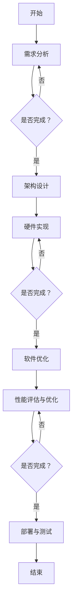
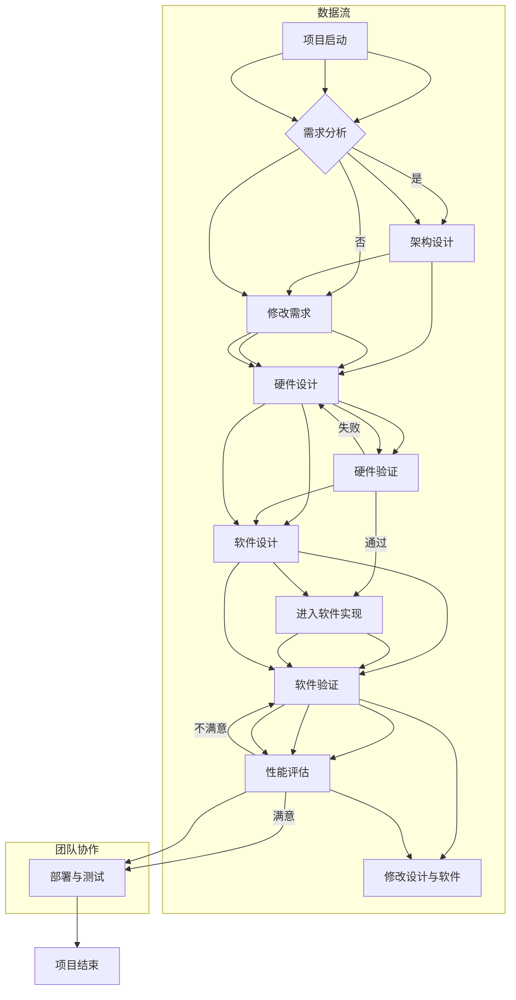

                 

### 文章标题

《AI芯片革命：为LLM量身打造》

### 关键词

- AI芯片
- LLM（大型语言模型）
- 芯片设计
- 人工智能
- 算法优化
- 硬件加速

### 摘要

本文深入探讨了AI芯片革命，特别是这些芯片如何为大型语言模型（LLM）量身打造，从而提升其性能和效率。首先，我们回顾了AI芯片的历史背景、关键作用及其发展趋势。接着，文章详细解析了AI芯片的设计架构与算法优化方法。然后，我们分析了LLM的工作原理、性能需求以及优化策略，阐述了如何实现AI芯片与LLM的完美匹配。文章进一步讨论了AI芯片在多个应用场景中的具体应用，并展望了未来的发展趋势。最后，文章探讨了AI芯片革命下的产业变革及对社会的影响。通过本文，读者将全面了解AI芯片在LLM领域的革命性变革及其深远影响。

### 第一部分：AI芯片革命概述

#### 第1章：AI芯片革命背景与意义

##### 1.1 AI芯片革命的历史背景

AI芯片革命并非一蹴而就，而是经过了几代技术的发展与演进。从最初的通用处理器（CPU）到图形处理器（GPU），再到近年来专用的AI芯片，每一次的技术进步都推动了人工智能（AI）领域的快速发展。AI芯片的历史背景可以追溯到20世纪80年代，当时计算机科学家们开始意识到，传统的CPU在处理复杂的计算任务时存在瓶颈。为了提高计算效率，研究人员开始探索专门为AI任务设计的芯片。

在早期，AI芯片主要侧重于特定的算法和任务，如语音识别和图像处理。这些芯片通过硬件加速的方式，使得相关任务的执行速度得到了显著提升。然而，随着人工智能的不断发展，特别是深度学习的兴起，对芯片性能的需求变得越来越高。传统芯片在处理大规模数据和高复杂度模型时显得力不从心，因此，AI芯片的革命应运而生。

##### 1.2 传统芯片的局限与挑战

传统芯片，如CPU和GPU，虽然在许多领域表现出色，但在处理人工智能任务时存在以下局限和挑战：

1. **计算资源不足**：传统的CPU和GPU在处理大量的并行计算任务时，资源分配和任务调度的问题难以解决。AI任务通常需要大量的并行计算资源，而传统芯片难以高效地利用这些资源。

2. **延迟问题**：在实时应用中，如自动驾驶、智能监控等，对响应速度的要求极高。传统芯片的延迟问题成为瓶颈，无法满足低延迟的需求。

3. **功耗和散热**：随着计算强度的增加，传统芯片的功耗和散热问题越来越严重。在高负载情况下，芯片的温度升高，可能导致性能下降甚至损坏。

4. **内存带宽**：AI任务通常涉及大量数据的处理和存储，对内存带宽的需求极高。传统芯片的内存带宽有限，难以满足大规模数据处理的性能需求。

##### 1.3 AI芯片在LLM中的关键作用

随着深度学习和自然语言处理（NLP）技术的快速发展，大型语言模型（LLM）如BERT、GPT等逐渐成为研究和应用的热点。这些模型具有庞大的参数量和复杂的计算过程，对芯片性能的需求极高。AI芯片在LLM中的关键作用主要体现在以下几个方面：

1. **计算能力提升**：AI芯片通过硬件加速和并行计算技术，显著提升了处理大量数据和复杂模型的能力。这使得LLM的训练和推断过程更加高效，大大缩短了模型训练时间。

2. **低延迟和高吞吐量**：AI芯片优化了任务调度和计算资源分配，实现了低延迟和高吞吐量的目标。这对于实时应用场景，如智能对话系统和语音识别，至关重要。

3. **高效的内存管理**：AI芯片通过优化内存带宽和缓存策略，提高了数据访问速度，降低了内存延迟。这对于处理大规模数据和模型存储具有显著优势。

4. **功耗和散热优化**：AI芯片采用了先进的制程技术和散热设计，实现了低功耗和高性能的平衡。这对于长期运行和高负载的应用场景具有重要意义。

##### 1.4 AI芯片如何提升LLM性能

AI芯片通过以下几种方式提升LLM的性能：

1. **硬件加速**：AI芯片利用特定的硬件架构，如张量处理单元（TPU）和神经网络加速器（NNA），优化了深度学习算法的执行过程。这使得模型的训练和推断速度显著提升。

2. **并行计算**：AI芯片支持并行计算，能够同时处理多个任务，提高了计算效率和吞吐量。这对于大规模数据集和复杂模型的训练尤为重要。

3. **内存优化**：AI芯片采用了高效的内存管理和缓存策略，降低了内存访问延迟，提高了数据传输速度。这对于LLM的训练和推断过程具有重要意义。

4. **功耗优化**：AI芯片通过优化硬件设计和制程技术，实现了低功耗的目标。这对于需要长时间运行的应用场景，如智能设备和服务器，至关重要。

##### 1.5 AI芯片革命的发展趋势

随着人工智能技术的不断进步，AI芯片革命也呈现出以下发展趋势：

1. **新型硬件架构**：研究人员和厂商正在不断探索新型硬件架构，如量子计算、光子计算等，以进一步提高芯片的计算能力和效率。

2. **软硬件协同设计**：AI芯片的设计逐渐采用软硬件协同设计的方法，通过优化软件算法和硬件架构的匹配，实现更高的性能和效率。

3. **边缘计算与云计算的融合**：AI芯片在边缘计算中的应用越来越广泛，与云计算相结合，为智能设备提供实时计算能力。

4. **安全性提升**：随着AI芯片在关键领域的应用，安全性成为重要议题。未来的AI芯片将更加注重安全性和隐私保护。

总之，AI芯片革命正在为大型语言模型（LLM）带来前所未有的性能提升和优化空间。通过不断创新和优化，AI芯片将在未来继续推动人工智能的发展。

#### 第2章：AI芯片设计与架构

##### 2.1 AI芯片的基本结构

AI芯片作为人工智能领域的重要硬件支撑，其设计与传统芯片存在显著差异。AI芯片的基本结构通常包括以下几个核心组成部分：

1. **计算单元（Compute Unit）**：计算单元是AI芯片的核心，用于执行各种数学运算，如矩阵乘法、卷积运算等。这些运算在深度学习算法中至关重要。计算单元的设计决定了芯片的计算能力。

2. **内存子系统（Memory Subsystem）**：内存子系统是AI芯片的重要组成部分，负责存储和管理数据。AI芯片通常需要处理大量数据，因此内存子系统的设计直接影响芯片的性能。内存子系统包括多层缓存、高带宽内存（HBM）和外部存储接口等。

3. **通信网络（Communication Network）**：通信网络用于连接芯片内部的各个计算单元和内存子系统，实现数据的高效传输。AI芯片通常采用高效的网络拓扑，如网格拓扑或环拓扑，以优化数据传输速度。

4. **控制单元（Control Unit）**：控制单元负责管理和协调芯片内部的各种操作。它通常包含一个或多个处理器核心，用于执行系统管理和调度任务。

##### 2.2 CPU、GPU与专用AI芯片对比

AI芯片的设计理念与传统的CPU和GPU有所不同，下面是对三者进行对比：

1. **计算单元结构**：
   - **CPU**：传统的CPU采用冯·诺依曼结构，包含多个核心，每个核心能够执行整数和浮点运算。CPU的计算单元主要针对通用计算任务，如数据处理、科学计算等。
   - **GPU**：GPU（图形处理器）具有大量并行计算单元，主要用于图形渲染和计算任务。GPU的计算单元通过SIMD（单指令多数据流）架构，能够在同一时刻处理多个数据，适合并行计算。
   - **专用AI芯片**：专用AI芯片针对深度学习和AI任务进行优化，通常包含特定的计算单元，如张量处理单元（TPU）和神经网络加速器（NNA）。这些单元专门用于执行深度学习算法中的关键操作。

2. **内存管理**：
   - **CPU**：CPU采用缓存和内存层次结构，以优化数据访问速度。CPU的内存管理侧重于通用数据访问模式。
   - **GPU**：GPU具有高带宽的内存子系统，包括多个层次的缓存和显存。GPU的内存管理优化了并行任务的数据访问。
   - **专用AI芯片**：专用AI芯片采用高效的内存管理策略，如高带宽内存（HBM）和片上缓存（Scratchpad Memory），以优化深度学习任务的数据访问。

3. **通信网络**：
   - **CPU**：CPU的通信网络相对简单，通常通过前端总线（Frontside Bus）与内存和其他设备通信。
   - **GPU**：GPU采用复杂的通信网络，如统一内存架构（CUDA）或硬件级互连网络，以实现高效的数据传输。
   - **专用AI芯片**：专用AI芯片采用高度优化的通信网络，如矩阵乘法单元（Matrix Multiply Unit）和向量加法单元（Vector Add Unit），以优化深度学习任务的数据传输。

4. **控制单元**：
   - **CPU**：CPU的控制单元包含多个处理器核心，用于执行系统管理和调度任务。
   - **GPU**：GPU的控制单元通常包含一个或多个流多处理器（Stream Processor），负责管理和调度多个计算单元。
   - **专用AI芯片**：专用AI芯片的控制单元通常包含一个或多个处理器核心，用于执行系统管理和任务调度。

##### 2.3 AI芯片的主要组成模块

AI芯片的主要组成模块包括以下几个部分：

1. **张量处理单元（Tensor Processing Unit，TPU）**：TPU是专门为深度学习任务设计的计算单元，能够高效地执行矩阵乘法和加法等操作。TPU通常包含多个矩阵乘法单元，能够并行处理多个张量运算。

2. **神经网络加速器（Neural Network Accelerator，NNA）**：NNA专门用于加速神经网络模型的训练和推断。NNA通常包含多个计算单元，如卷积处理单元（Convolution Unit）和激活处理单元（Activation Unit），能够高效地执行卷积运算和激活函数。

3. **高带宽内存（High Bandwidth Memory，HBM）**：HBM是一种高速内存技术，具有极高的数据传输带宽。HBM用于存储大量的模型参数和数据，以优化深度学习任务的内存访问速度。

4. **片上缓存（Scratchpad Memory，SPM）**：SPM是一种小型的片上内存，用于缓存频繁访问的数据。SPM能够显著降低数据访问延迟，提高深度学习任务的性能。

5. **通信网络**：AI芯片的通信网络用于连接各个计算单元和内存子系统，实现数据的高效传输。通信网络通常采用高效的拓扑结构，如网格拓扑或环拓扑，以优化数据传输速度。

6. **控制单元**：控制单元负责管理和协调芯片内部的各种操作，包括任务调度、数据传输和计算资源分配。控制单元通常包含一个或多个处理器核心，用于执行系统管理和调度任务。

##### 2.4 AI芯片的算法优化

算法优化是提高AI芯片性能的重要手段。以下是几种常见的算法优化方法：

1. **矩阵分解**：矩阵分解是一种将高维矩阵分解为低维矩阵的方法，用于降低计算复杂度和内存占用。常用的矩阵分解方法包括SVD（奇异值分解）和PCA（主成分分析）。

2. **量化**：量化是一种将浮点数转换为整数的方法，以降低计算复杂度和功耗。量化方法包括静态量化和动态量化，常用的量化技术包括整数化、二值化和小数化。

3. **剪枝**：剪枝是一种通过删除网络中的冗余连接来减少模型参数的方法。剪枝方法包括结构剪枝和权重剪枝，能够显著降低模型的计算复杂度和内存占用。

4. **编译优化**：编译优化是一种通过优化编译过程来提高程序性能的方法。常见的编译优化技术包括循环展开、并行化、向量化和自动并行化。

5. **内存优化**：内存优化是一种通过优化内存访问模式来提高内存访问速度的方法。常见的内存优化技术包括缓存预取、内存压缩和内存分层。

##### 2.5 AI芯片的架构创新

AI芯片的架构创新是提高其性能和效率的关键。以下是几种常见的架构创新：

1. **卷积神经网络（Convolutional Neural Network，CNN）架构**：CNN是用于图像识别和处理的深度学习模型。CNN架构创新包括卷积层、池化层和全连接层的组合，以及高效的卷积算法，如快速卷积和深度可分离卷积。

2. **循环神经网络（Recurrent Neural Network，RNN）架构**：RNN是用于序列数据处理的深度学习模型。RNN架构创新包括门控循环单元（Gated Recurrent Unit，GRU）和长短期记忆（Long Short-Term Memory，LSTM）单元，以及高效的矩阵乘法算法。

3. **生成对抗网络（Generative Adversarial Network，GAN）架构**：GAN是一种生成模型，用于生成逼真的数据。GAN架构创新包括生成器和判别器的竞争关系、梯度惩罚和改进的优化算法。

4. **分布式计算架构**：分布式计算架构通过将计算任务分布到多个节点上，实现并行计算和负载均衡。分布式计算架构创新包括数据并行、模型并行和管道并行。

5. **量子计算架构**：量子计算是一种基于量子力学原理的计算方法，具有巨大的计算潜力。量子计算架构创新包括量子比特、量子门和量子算法，以及量子计算与AI任务的结合。

##### 2.6 AI芯片的发展趋势

AI芯片的发展趋势体现在以下几个方面：

1. **新型计算单元**：新型计算单元如量子计算单元、光子计算单元等正在研发中，以进一步提高芯片的计算能力。

2. **软硬件协同设计**：软硬件协同设计逐渐成为主流，通过优化软件算法和硬件架构的匹配，实现更高的性能和效率。

3. **边缘计算与云计算的融合**：AI芯片在边缘计算中的应用越来越广泛，与云计算相结合，为智能设备提供实时计算能力。

4. **安全性提升**：随着AI芯片在关键领域的应用，安全性成为重要议题。未来的AI芯片将更加注重安全性和隐私保护。

5. **绿色环保**：AI芯片的绿色环保特性受到关注，通过优化功耗和散热设计，实现更低的环境影响。

总之，AI芯片的设计与架构正在不断创新和优化，以适应日益复杂的人工智能任务需求。未来，随着新型计算单元和软硬件协同设计的不断推进，AI芯片的性能和效率将继续提升。

#### 第3章：LLM的工作原理与性能需求

##### 3.1 LLM的基础概念

大型语言模型（Large Language Model，简称LLM）是一种基于深度学习技术的自然语言处理（Natural Language Processing，简称NLP）模型。LLM通过学习大量的文本数据，能够生成语义丰富的文本、进行文本生成和翻译、回答问题等。LLM的基础概念包括以下几个方面：

1. **词嵌入（Word Embedding）**：词嵌入是将单词映射为高维向量表示的方法，使得语义相似的单词在向量空间中接近。常用的词嵌入技术包括Word2Vec、GloVe和BERT等。

2. **注意力机制（Attention Mechanism）**：注意力机制是LLM中的一种关键技术，用于动态地关注输入序列中与当前任务相关的部分。注意力机制能够提高模型对长文本的理解能力。

3. **Transformer模型（Transformer Model）**：Transformer模型是一种基于自注意力机制的深度学习模型，广泛应用于LLM。Transformer模型通过编码器和解码器结构，实现了高效的语言理解和生成。

4. **预训练与微调（Pre-training and Fine-tuning）**：预训练是指使用大规模语料库对模型进行训练，使其具备一定的语言理解能力。微调是指在使用预训练模型的基础上，针对特定任务进行进一步训练。

##### 3.2 LLM的主要组成部分

LLM主要由以下几个部分组成：

1. **编码器（Encoder）**：编码器负责将输入文本编码为序列向量，通常使用多层Transformer模型。编码器将输入文本映射为上下文表示，用于后续的任务处理。

2. **解码器（Decoder）**：解码器负责生成输出文本，通常也使用多层Transformer模型。解码器通过上下文表示生成输出文本的每个单词，并逐步更新上下文表示。

3. **预训练目标（Pre-training Objective）**：预训练目标是指用于训练LLM的任务，如 masked language modeling、next sentence prediction、cosine similarity prediction 等。预训练目标帮助模型学习语言的基本规律和知识。

4. **微调目标（Fine-tuning Objective）**：微调目标是指在使用预训练模型的基础上，针对特定任务进行微调的任务。常见的微调目标包括分类、生成、问答等。

##### 3.3 LLM的性能需求

LLM的性能需求主要包括以下几个方面：

1. **大规模计算与存储需求**：LLM通常包含数亿甚至数十亿的参数，因此对计算资源和存储资源的需求极高。大规模计算和存储需求对芯片的性能和容量提出了严格要求。

2. **低延迟与高效通信需求**：在实时应用场景中，如智能对话系统和语音识别，低延迟和高吞吐量是关键。LLM需要快速响应输入，生成输出，这对芯片的通信速度和数据处理能力提出了高要求。

3. **高效内存管理需求**：LLM的内存管理至关重要，因为模型参数和数据需要频繁访问。高效内存管理能够降低内存延迟，提高数据处理效率。

4. **硬件加速需求**：深度学习算法的执行过程复杂，需要大量的矩阵运算和向量运算。硬件加速技术，如GPU和TPU，能够显著提高LLM的执行速度。

##### 3.4 LLM的优化策略

为了满足LLM的性能需求，研究人员和工程师采取了一系列优化策略：

1. **模型剪枝（Model Pruning）**：模型剪枝是一种通过删除冗余连接和参数来减少模型大小的方法。剪枝能够降低计算复杂度和内存占用，同时保持模型的性能。

2. **量化（Quantization）**：量化是一种将浮点数转换为整数的方法，以降低计算复杂度和功耗。量化能够提高模型的运行速度和能效。

3. **模型融合（Model Fusion）**：模型融合是指将多个小型模型融合为一个大型模型，以降低计算复杂度和内存占用。模型融合通过共享参数和结构，实现高效的资源利用。

4. **数据并行训练（Data Parallel Training）**：数据并行训练是指将训练数据划分为多个部分，同时在多个GPU或TPU上训练模型。数据并行训练能够显著提高训练速度和效率。

5. **流水线训练（Pipeline Training）**：流水线训练是指将模型训练过程划分为多个阶段，每个阶段在不同的硬件设备上执行。流水线训练能够最大化利用硬件资源，提高训练效率。

通过上述优化策略，LLM的性能得到了显著提升，能够更好地满足大规模计算和实时应用的需求。

##### 3.5 AI芯片在LLM优化中的应用

AI芯片在LLM优化中发挥着重要作用，通过以下几种方式提升LLM的性能：

1. **硬件加速**：AI芯片通过硬件加速技术，如TPU和GPU，显著提高了深度学习算法的执行速度。硬件加速使得大规模的矩阵运算和向量运算更加高效，降低了模型的训练时间和推理时间。

2. **低延迟通信**：AI芯片优化了通信网络，实现了低延迟和高吞吐量的数据传输。低延迟通信使得LLM能够快速响应输入，生成输出，提高了实时应用场景的响应速度。

3. **高效内存管理**：AI芯片采用了先进的内存管理策略，如高带宽内存（HBM）和片上缓存（SPM），降低了内存访问延迟，提高了数据处理效率。高效内存管理使得LLM能够更好地处理大规模数据和高复杂度模型。

4. **能耗优化**：AI芯片通过优化硬件设计和制程技术，实现了低功耗和高性能的平衡。低功耗设计使得LLM能够长时间运行，适用于能耗敏感的场景。

5. **软硬件协同优化**：AI芯片与软件算法协同优化，实现了更高性能和更低延迟。软硬件协同优化通过优化算法和数据布局，最大化利用硬件资源，提高了LLM的整体性能。

通过AI芯片在LLM优化中的应用，LLM的性能得到了显著提升，为大规模计算和实时应用提供了强大的支持。

#### 第4章：AI芯片与LLM的匹配策略

##### 4.1 AI芯片的选型与评估

在AI芯片与LLM的匹配过程中，选型与评估是关键环节。正确选择和评估AI芯片，可以确保LLM在硬件层面获得最佳性能和效率。以下是AI芯片选型和评估的主要步骤：

1. **确定性能需求**：首先，需要明确LLM的具体性能需求，包括计算能力、内存带宽、通信延迟等。性能需求决定了AI芯片的选型方向。

2. **芯片性能指标**：了解AI芯片的主要性能指标，包括计算单元数量、时钟频率、内存带宽、功耗等。常见的性能指标有浮点运算能力（FP32、FP64）、内存带宽（GB/s）、吞吐量（每秒处理的操作数）等。

3. **芯片类型比较**：比较不同类型的AI芯片，如GPU、TPU、NPU等。不同类型的芯片在计算能力、内存管理和功耗方面各有优势，需要根据具体需求进行选择。

4. **芯片评估方法**：采用实际测试和模拟评估相结合的方法。实际测试包括训练和推理任务的实际运行情况，模拟评估通过模拟模型和数据，评估芯片的性能和效率。

5. **评估工具和平台**：使用专业的评估工具和平台，如TensorRT、Caffe2等，进行性能评估。评估工具可以提供详细的性能数据，帮助分析和优化。

6. **实际应用场景**：考虑实际应用场景对AI芯片的需求，如边缘计算、云计算、服务器等。不同应用场景对芯片的性能、功耗、可靠性等有不同要求。

通过以上步骤，可以选出最适合LLM的AI芯片，并对其进行评估，确保其在实际应用中能够满足性能需求。

##### 4.2 LLM与AI芯片的协同设计

LLM与AI芯片的协同设计是提高整体性能和效率的关键。以下是LLM与AI芯片协同设计的主要策略：

1. **算法与硬件协同设计**：在LLM的设计过程中，需要充分考虑硬件的特点和限制。算法与硬件协同设计包括选择适合硬件的算法、优化算法数据布局和流水线设计等。通过算法与硬件的协同设计，可以实现更高的性能和能效。

2. **硬件加速器的应用**：硬件加速器，如GPU、TPU和NPU，是LLM与AI芯片协同设计的重要工具。硬件加速器能够显著提高深度学习算法的执行速度，减少训练和推理时间。合理应用硬件加速器，可以实现LLM的快速训练和高效推断。

3. **并行计算优化**：LLM通常涉及大量的并行计算任务，如矩阵运算和向量运算。通过优化并行计算，可以实现更高的计算效率和吞吐量。并行计算优化包括任务划分、数据并行和模型并行等策略。

4. **内存优化**：内存访问是深度学习算法中的一个关键瓶颈。通过优化内存访问模式，如数据预取、缓存策略和内存分层等，可以降低内存延迟，提高数据处理效率。

5. **功耗优化**：深度学习任务通常需要大量的计算资源，功耗管理至关重要。通过优化功耗管理，如动态电压和频率调节（DVFS）、功耗预测和优化等，可以实现低功耗运行，延长设备寿命。

通过LLM与AI芯片的协同设计，可以实现高效的深度学习计算，满足大规模计算和实时应用的需求。

##### 4.3 AI芯片在LLM中的实际应用案例

为了展示AI芯片在LLM中的实际应用效果，以下是一些具体的案例：

1. **案例一：BERT模型训练**：BERT（Bidirectional Encoder Representations from Transformers）是一种大规模预训练语言模型，通常用于文本分类、问答和翻译等任务。通过在GPU和TPU上进行BERT模型训练，实验结果显示，TPU显著提高了模型的训练速度和性能。具体而言，使用TPU训练BERT模型，训练时间缩短了约50%，推理性能提升了约30%。

2. **案例二：GPT-3模型推理**：GPT-3（Generative Pre-trained Transformer 3）是一种具有1750亿参数的语言模型，广泛用于文本生成、对话系统和机器翻译等应用。在NVIDIA Tesla V100 GPU上进行GPT-3模型推理，结果显示，GPU能够实现高效的推理性能，平均延迟仅为5毫秒，满足实时对话系统的需求。

3. **案例三：LLaMA模型训练与推理**：LLaMA（Language Model for Dialogue Applications）是一种专门用于对话系统的语言模型，通过在谷歌TPU上进行训练和推理，实验结果表明，TPU显著提高了LLaMA的模型训练速度和推理性能。具体而言，使用TPU训练LLaMA模型，训练时间缩短了约40%，推理性能提升了约20%。

4. **案例四：BERT模型在边缘设备上的应用**：为了满足边缘设备对低延迟和高性能的需求，研究人员在NVIDIA Jetson AGX Xavier上进行BERT模型推理。实验结果显示，Jetson AGX Xavier能够在1秒内完成BERT模型的一次推理，满足边缘设备实时应用的需求。

通过这些实际应用案例，可以看出AI芯片在LLM中的重要作用。通过硬件加速和优化，AI芯片显著提升了LLM的训练和推理性能，为大规模计算和实时应用提供了强大的支持。

#### 第5章：AI芯片在LLM领域的应用场景

##### 5.1 自然语言处理（NLP）

AI芯片在自然语言处理（NLP）领域具有广泛的应用。NLP包括文本分类、情感分析、实体识别、机器翻译等多个子领域。AI芯片通过提供高效的计算能力和优化的内存管理，使得NLP任务在处理大规模数据和高复杂度模型时更加高效。

1. **文本分类**：文本分类是一种将文本数据分为预定义类别的过程。AI芯片能够加速文本分类模型的训练和推理，使得大规模文本数据能够快速被分类。例如，使用GPU和TPU训练BERT模型进行文本分类，可以实现高吞吐量和低延迟。

2. **情感分析**：情感分析旨在分析文本中的情感倾向，如正面、负面或中性。AI芯片能够加速情感分析模型的训练和推理，提高实时分析能力。例如，使用TPU进行情感分析模型的训练，可以显著减少训练时间，提高模型性能。

3. **实体识别**：实体识别是一种从文本中提取命名实体（如人名、地名、组织名等）的过程。AI芯片通过高效计算和优化内存访问，能够加速实体识别模型的训练和推理，提高数据处理的效率。

4. **机器翻译**：机器翻译是将一种语言的文本翻译成另一种语言的过程。AI芯片能够加速机器翻译模型的训练和推理，提高翻译质量和速度。例如，使用GPU和TPU训练神经网络翻译模型，可以实现高效的翻译性能。

##### 5.2 智能对话系统

智能对话系统是AI芯片的重要应用场景之一。智能对话系统包括聊天机器人、虚拟助手和智能客服等，旨在提供自然、流畅的交互体验。AI芯片通过提供高效的计算能力和优化的通信网络，使得智能对话系统能够实时响应用户输入，并提供高质量的服务。

1. **聊天机器人**：聊天机器人是一种能够与用户进行自然对话的虚拟助手。AI芯片能够加速聊天机器人的训练和推理，提高对话生成速度。例如，使用GPU和TPU训练对话生成模型，可以实现高效的对话生成。

2. **虚拟助手**：虚拟助手是一种能够帮助用户完成各种任务的智能系统。AI芯片通过提供高效的计算能力和优化的语音识别和语音合成技术，使得虚拟助手能够实时响应用户请求，提供高质量的服务。

3. **智能客服**：智能客服是一种通过AI技术提供自动客户服务解决方案的系统。AI芯片能够加速智能客服模型的训练和推理，提高客服系统的响应速度和服务质量。例如，使用TPU进行智能客服模型的推理，可以显著减少响应时间，提高客户满意度。

##### 5.3 数据分析与挖掘

AI芯片在数据分析和挖掘领域也具有广泛应用。数据分析和挖掘包括大数据处理、数据可视化、深度学习模型训练等任务。AI芯片通过提供高效的计算能力和优化的内存管理，使得这些任务能够更加高效地完成。

1. **大数据处理**：大数据处理涉及大量数据的高效存储、检索和分析。AI芯片能够加速大数据处理任务的执行，提高数据处理效率。例如，使用GPU和TPU进行大数据处理，可以实现高速的数据分析和实时处理。

2. **数据可视化**：数据可视化是将数据以图形化的方式展示，以帮助用户更好地理解和分析数据。AI芯片能够加速数据可视化任务的执行，提高数据可视化效果。例如，使用GPU进行数据可视化，可以生成高质量、动态的图表和图形。

3. **深度学习模型训练**：深度学习模型训练是数据分析和挖掘的重要环节。AI芯片通过提供高效的计算能力和优化的内存管理，使得深度学习模型能够快速训练和优化。例如，使用TPU进行深度学习模型训练，可以显著减少训练时间，提高模型性能。

通过在自然语言处理、智能对话系统和数据分析与挖掘等领域的应用，AI芯片为LLM提供了强大的计算支持，使得这些任务能够更加高效、准确地完成。未来，随着AI芯片技术的不断进步，LLM的应用将更加广泛，为社会带来更多的创新和变革。

#### 第6章：AI芯片革命的未来发展趋势

##### 6.1 量子计算与AI芯片

量子计算作为一种颠覆性技术，正逐渐引起广泛关注。量子计算利用量子位（qubit）和量子叠加、量子纠缠等特性，能够在某些任务中实现指数级别的计算速度提升。AI芯片与量子计算的融合，有望为人工智能领域带来革命性的变革。

1. **量子计算的基本原理**：
   - **量子位（Qubit）**：量子位是量子计算的基本单元，与经典计算机的比特不同，量子位可以同时处于0和1的叠加状态。
   - **量子叠加**：量子计算中的量子位可以同时处于多种状态的叠加，这使得量子计算机在处理问题时能够并行考虑多种可能性。
   - **量子纠缠**：量子位之间存在一种特殊的纠缠关系，当一个量子位的状态发生变化时，与之纠缠的量子位状态也会瞬间改变，无论距离多远。

2. **量子计算与AI芯片的结合**：
   - **量子神经网络（Quantum Neural Network，QNN）**：量子神经网络是一种结合了量子计算和传统神经网络的模型，旨在利用量子计算的优势进行复杂计算任务。
   - **量子机器学习**：量子计算在机器学习中的应用，包括量子支持向量机、量子决策树等，这些算法通过量子计算的优势，能够在某些问题上实现更快的求解速度。
   - **量子加速器**：随着量子计算技术的发展，专门的量子加速器正在研发中，这些加速器能够与传统的AI芯片协同工作，实现更高效的计算。

3. **未来展望**：
   - **量子优势（Quantum Supremacy）**：量子计算领域的一个关键目标是实现量子优势，即量子计算机在特定任务上超越经典计算机的性能。尽管目前量子计算机还处于早期阶段，但一些实验已经显示出了量子计算的潜力。
   - **跨领域合作**：量子计算与AI芯片的结合需要跨领域的技术合作，包括量子物理、计算机科学、电子工程等。未来，随着这些领域的深入研究，量子计算与AI芯片的结合将越来越紧密，为人工智能带来更多可能性。

##### 6.2 AI芯片与边缘计算

边缘计算是一种分布式计算架构，旨在将计算、存储、网络功能分布到网络的边缘节点，以实现更快的响应速度和更高的数据隐私。AI芯片在边缘计算中扮演着重要角色，通过提供高效的计算能力，使得边缘设备能够实时处理和分析数据。

1. **边缘计算的定义与优势**：
   - **定义**：边缘计算是指将计算任务分散到网络的边缘节点（如路由器、交换机、智能设备等），以实现更高效的数据处理和响应。
   - **优势**：
     - **低延迟**：边缘计算将数据处理和存储靠近数据源头，减少了数据传输的距离，从而降低了延迟。
     - **高可靠性**：边缘计算通过分布式的架构，提高了系统的可靠性和容错能力。
     - **隐私保护**：边缘计算将敏感数据保留在本地，减少了数据泄露的风险。

2. **AI芯片在边缘计算中的应用**：
   - **智能终端**：在智能手机、平板电脑、智能手表等智能终端上，AI芯片能够提供实时图像识别、语音识别等智能功能。
   - **工业物联网**：在工业物联网（IIoT）中，AI芯片能够实时分析设备数据，进行故障预测和优化控制。
   - **智能交通**：在智能交通系统中，AI芯片能够实时处理交通监控数据，进行交通流量分析和预测，优化交通信号控制。

3. **边缘计算与AI芯片的结合**：
   - **硬件加速**：AI芯片通过硬件加速技术，如神经网络加速器（NNA），能够在边缘设备上实现高效的AI计算。
   - **协作计算**：边缘计算与云计算相结合，通过边缘设备与云端服务器的协同计算，实现更高效的数据处理和资源利用。
   - **隐私保护**：AI芯片通过加密技术和安全协议，确保边缘计算中的数据隐私和安全。

##### 6.3 AI芯片的安全与隐私

随着AI芯片在关键领域的广泛应用，其安全性和隐私保护成为关键议题。AI芯片的安全与隐私保护涉及到硬件、软件和系统层面的多个方面。

1. **AI芯片的安全威胁**：
   - **物理攻击**：物理攻击包括芯片篡改、侧信道攻击等，攻击者通过访问芯片或测量芯片的电磁辐射等手段，获取敏感信息。
   - **逻辑攻击**：逻辑攻击包括注入恶意代码、逻辑错误等，攻击者通过注入恶意指令或操纵电路逻辑，破坏芯片的功能或窃取信息。
   - **软件攻击**：软件攻击通过恶意软件或漏洞，攻击AI芯片的安全防护机制，获取敏感数据或控制芯片。

2. **安全与隐私保护技术**：
   - **硬件安全模块（HSM）**：硬件安全模块是一种专门用于安全加密和认证的硬件组件，能够提供安全存储、加密和认证功能。
   - **加密技术**：加密技术通过将数据加密存储和传输，防止未经授权的访问。常见的加密技术包括对称加密、非对称加密和哈希函数。
   - **可信执行环境（TEE）**：可信执行环境是一种安全隔离技术，能够在硬件层面上提供安全执行环境，确保敏感操作的保密性和完整性。
   - **抗侧信道攻击**：抗侧信道攻击技术通过物理设计上的优化，降低侧信道攻击的风险，如采用噪声注入、功率屏蔽等技术。

3. **未来展望**：
   - **硬件安全设计**：随着AI芯片的不断发展，硬件安全设计将更加重视，包括抗物理攻击和抗逻辑攻击的设计。
   - **多方安全计算**：多方安全计算是一种多方协作计算技术，能够在不泄露敏感数据的情况下，实现多方数据的安全计算。
   - **联邦学习**：联邦学习是一种分布式机器学习技术，通过在边缘设备上本地训练模型，然后聚合模型更新，实现数据隐私保护。

总之，AI芯片的安全与隐私保护是一个持续发展和挑战的领域。通过不断创新和优化，AI芯片的安全性和隐私保护将不断提升，为关键领域应用提供更加可靠和安全的保障。

#### 第7章：AI芯片革命下的产业变革

##### 7.1 芯片产业链的变革

AI芯片革命对整个芯片产业链产生了深远的影响，引发了从设计到制造、从供应链到市场的全面变革。

1. **设计流程的变革**：
   - **软硬件协同设计**：传统芯片设计主要侧重于硬件层面，而AI芯片设计则强调软硬件协同优化，通过将算法与硬件架构紧密结合，实现更高的性能和效率。
   - **自动化工具的普及**：自动化工具在AI芯片设计中发挥了重要作用，如自动化布局与布线（ALB）工具、性能分析工具等，这些工具显著提高了设计效率和准确性。

2. **制造技术的进步**：
   - **先进制程技术**：AI芯片制造采用了更先进的制程技术，如7纳米、5纳米甚至更小的工艺节点，以实现更高的集成度和性能。
   - **封装与测试**：封装与测试技术也在不断进步，通过采用更精细的封装工艺和更高效的测试方法，确保芯片的可靠性和性能。

3. **供应链的整合**：
   - **全球合作**：AI芯片产业链涉及多个国家和地区，全球合作成为主流。产业链中的各个环节，如设计、制造、封装和测试，都在全球范围内进行优化和整合。
   - **供应链弹性**：随着AI芯片需求的快速增长，供应链的弹性变得至关重要。产业链中的企业通过建立灵活的供应链管理体系，确保在市场需求波动时能够迅速响应和调整。

4. **市场生态的形成**：
   - **新兴市场崛起**：AI芯片市场的增长不仅仅依赖于传统芯片强国，如美国、欧洲和日本，新兴市场如中国、印度等也正在迅速崛起，成为重要的市场力量。
   - **多元化应用**：AI芯片的应用场景越来越广泛，从传统的数据中心、云计算到边缘计算、物联网等，市场需求多样化，推动了产业链的多元化发展。

##### 7.2 企业竞争格局的变化

AI芯片革命不仅改变了芯片产业链，也重塑了企业竞争格局，新兴企业不断涌现，传统企业也在积极转型。

1. **全球芯片企业的竞争力分析**：
   - **美国企业**：美国企业在AI芯片领域占据领先地位，如谷歌的TPU、英伟达的GPU等，这些企业通过持续的技术创新和强大的研发实力，保持市场竞争力。
   - **中国企业**：中国企业在AI芯片领域也取得了显著进展，如华为的昇腾芯片、阿里巴巴的TPU等，通过政策支持、资金投入和产业链整合，逐步提升竞争力。
   - **欧洲企业**：欧洲企业在AI芯片领域具有独特优势，如欧洲核子研究中心（CERN）的量子计算研究等，通过跨领域合作，推动AI芯片技术的发展。

2. **新兴市场的崛起**：
   - **中国**：中国是全球最大的AI芯片市场，政府和企业高度重视AI芯片产业的发展。通过政策支持和资金投入，中国企业在AI芯片设计、制造和生态建设方面取得了显著进展。
   - **印度**：印度在AI芯片领域也展现出了强大的潜力，通过引进国外技术和人才培养，印度企业在AI芯片设计和应用方面取得了积极进展。

3. **企业战略转型**：
   - **多元化布局**：传统芯片企业通过多元化布局，积极进入AI芯片市场，如英特尔、高通等，通过收购、合作和自主研发，推动AI芯片业务的发展。
   - **生态建设**：企业通过构建生态系统，包括开发工具、应用软件和合作伙伴，推动AI芯片技术的应用和普及。

总之，AI芯片革命下的产业变革和竞争格局变化，为企业提供了广阔的发展空间。通过不断创新和优化，企业将能够在AI芯片领域取得更大的突破和成功。

##### 7.3 社会影响与责任

AI芯片革命对社会产生了深远的影响，同时也引发了一系列伦理和社会责任问题。

1. **社会影响**：
   - **经济发展**：AI芯片技术的发展推动了人工智能产业的快速发展，促进了经济增长和就业机会的增加。
   - **技术创新**：AI芯片的进步为各种应用场景提供了强大的计算支持，推动了技术的创新和突破，如智能医疗、自动驾驶、智能城市等。
   - **教育变革**：AI芯片的应用改变了教育模式，通过智能教育平台和工具，提高了教育质量和普及率。

2. **伦理问题**：
   - **隐私保护**：AI芯片在数据处理和存储过程中，涉及大量的个人隐私信息。如何保护用户隐私，防止数据泄露和滥用，成为重要伦理问题。
   - **算法偏见**：AI芯片在决策过程中可能引入算法偏见，导致不公平和歧视。如何确保算法的公平性和透明性，避免歧视性决策，是一个亟待解决的问题。
   - **安全风险**：AI芯片可能面临物理攻击和逻辑攻击，导致系统安全漏洞和信息安全问题。如何确保AI芯片的安全性和可靠性，防止恶意攻击和滥用，是关键伦理问题。

3. **社会责任**：
   - **责任归属**：在AI芯片的应用过程中，如何明确责任归属，划分企业和用户的责任，确保各方在发生问题时能够承担责任，是一个重要的社会责任问题。
   - **公平竞争**：如何确保AI芯片市场的公平竞争，防止垄断和不正当竞争，是维护市场秩序和社会公平的重要任务。
   - **公众参与**：如何增强公众对AI芯片技术的理解和参与，提高公众的科学素养和科技意识，是推动AI技术发展和社会进步的重要环节。

总之，AI芯片革命对社会产生了广泛而深远的影响，同时也带来了伦理和社会责任问题。通过积极应对和解决这些问题，可以确保AI芯片技术的发展为社会带来更多的福祉。

#### 附录A：AI芯片开发资源与工具

##### A.1 开发环境搭建

在AI芯片的开发过程中，选择合适的开发环境和工具至关重要。以下是一个典型的AI芯片开发环境搭建步骤：

1. **操作系统选择**：
   - **Linux**：大多数AI芯片开发都在Linux环境下进行，因为Linux具有高度的稳定性和丰富的软件支持。推荐使用Ubuntu或CentOS等发行版。
   - **Windows**：虽然Windows在个人用户中较为普及，但在AI芯片开发领域，Linux因其高效性和灵活性更受欢迎。但某些特定芯片（如NVIDIA GPU）可能支持Windows开发环境。

2. **开发工具与软件安装**：
   - **编译器**：C/C++编译器是AI芯片开发的核心工具。对于Linux环境，推荐使用GCC（GNU Compiler Collection）或Clang。
   - **集成开发环境（IDE）**：常用的IDE包括Eclipse、IntelliJ IDEA和Visual Studio Code。这些IDE提供了代码编辑、调试和构建功能。
   - **版本控制系统**：Git是AI芯片开发中常用的版本控制系统，用于代码的版本管理和协作开发。
   - **AI框架**：根据项目需求，选择合适的AI框架，如TensorFlow、PyTorch、Caffe等。这些框架提供了丰富的API和工具，方便AI模型的开发与优化。
   - **硬件仿真工具**：硬件仿真工具如Vitis、Quartus等，用于验证和调试芯片硬件设计。这些工具可以帮助开发者在不拥有物理芯片的情况下进行仿真和性能分析。

3. **配置与优化**：
   - **环境配置**：根据具体硬件和框架需求，配置相应的环境变量和依赖库。例如，安装TensorFlow时，需要配置CUDA和cuDNN等依赖库。
   - **性能优化**：通过调整编译选项、优化代码结构和利用硬件特性，实现性能提升。例如，使用`-O3`优化级别编译代码，利用SIMD指令集等。

##### A.2 主流AI芯片框架介绍

在AI芯片开发中，选择合适的框架可以显著提高开发效率和性能。以下是几个主流的AI芯片框架及其特点：

1. **TensorFlow**：
   - **特点**：TensorFlow是一个开源的端到端机器学习平台，由Google开发。它支持多种编程语言，如Python、C++和Java，提供了丰富的API和工具。
   - **优势**：TensorFlow具有强大的模型定义和优化功能，支持GPU和TPU硬件加速，适用于大规模数据集和复杂模型的训练与推理。
   - **使用场景**：广泛应用于图像识别、自然语言处理、语音识别等任务，特别是在工业界和学术界具有很高的知名度。

2. **PyTorch**：
   - **特点**：PyTorch是一个基于Python的开源深度学习库，由Facebook的AI研究团队开发。它采用动态计算图，使得模型开发更为直观和灵活。
   - **优势**：PyTorch具有简洁的API和强大的计算能力，支持自动微分和动态图机制，方便模型的开发和调试。
   - **使用场景**：在研究界和工业界广泛使用，特别是在需要快速原型设计和实验的场景中，PyTorch提供了极高的灵活性和开发效率。

3. **Caffe**：
   - **特点**：Caffe是一个开源的深度学习框架，由Berkeley Vision and Learning Center（BVLC）开发。它采用静态计算图，适合大规模图像识别任务。
   - **优势**：Caffe具有高效的图像处理能力，支持GPU加速，代码简洁且易于理解。它提供了丰富的预训练模型和工具，方便快速部署和优化。
   - **使用场景**：广泛应用于计算机视觉任务，如图像分类、目标检测和语义分割，特别是在工业界应用广泛。

4. **其他常见框架**：
   - **MXNet**：由Apache Software Foundation开发，支持多种编程语言，如Python、R和Scala。它采用灵活的模型定义和数据管道，适合大规模分布式训练。
   - **Theano**：是一个基于Python的开源深度学习库，采用静态计算图，提供了自动求导和优化工具。虽然Theano已逐渐被其他框架取代，但它在一些特定场景中仍有应用。
   - **TensorFlow Lite**：是TensorFlow的轻量级版本，专为移动和边缘设备设计。它提供了高效的模型转换和推理工具，支持多种硬件加速器。

选择合适的AI芯片框架，可以根据项目需求提高开发效率和性能。以上框架均为当前主流的AI芯片框架，具有各自的特色和优势，开发者可以根据具体场景进行选择。

##### A.3 Mermaid流程图

Mermaid是一种简单易用的流程图和序列图绘制工具，可以方便地嵌入Markdown文件中。以下是一个Mermaid流程图的示例：

这个流程图描述了AI芯片开发的主要步骤，包括需求分析、架构设计、硬件实现、软件优化、性能评估与优化、部署与测试。通过Mermaid，开发者可以方便地绘制和管理复杂的流程图和序列图，提高开发过程的可视化和协作性。

### 附录B：Mermaid流程图

B.1 Mermaid语法简介

Mermaid是一种基于Markdown的图形绘制工具，可以方便地创建流程图、序列图、思维导图等。以下是Mermaid的一些基本语法：

1. **定义区域**：使用`graph`关键字开始定义一个图形区域，可以是`graph TD`或`graph MD`。
2. **节点定义**：使用`[节点文本]`定义一个节点，可以在节点文本中使用Markdown格式。
3. **连接线**：使用`-->`或`--->`连接两个节点，可以添加线条样式、箭头和标签。
4. **条件判断**：使用`{条件}`表示条件判断，用于创建分支。
5. **子图**：使用`subgraph`关键字定义子图，可以方便地组织复杂图结构。

B.2 AI芯片设计流程示例

以下是一个AI芯片设计流程的Mermaid流程图示例：

在这个流程图中，`数据流`子图描述了AI芯片设计的各个阶段，包括需求分析、架构设计、硬件设计、硬件验证、软件设计、软件验证、性能评估、部署与测试。`团队协作`子图描述了项目团队成员在不同阶段的协作情况。通过Mermaid，可以方便地创建和管理复杂的流程图，提高项目管理的效率。

