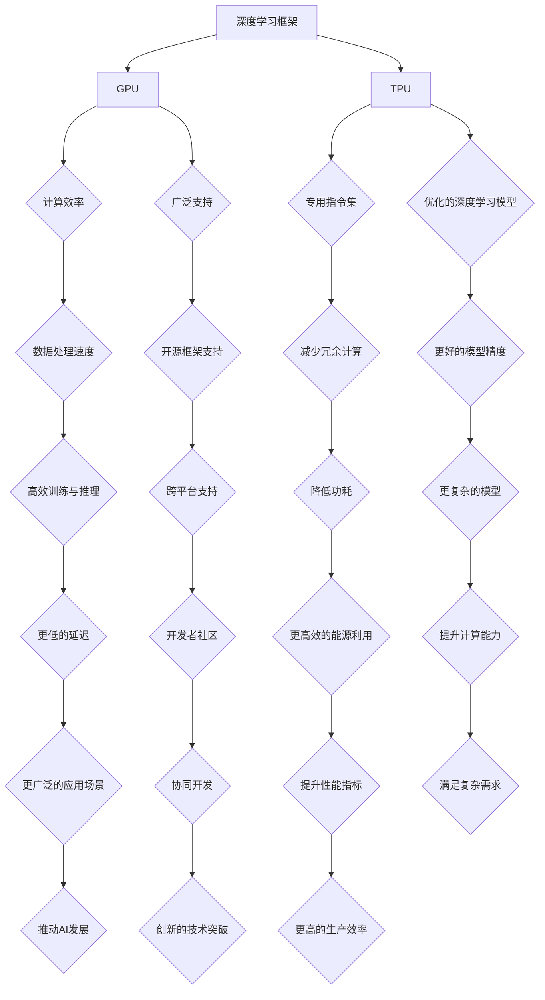

                 

## 文章标题

《AI芯片革命：从GPU到TPU的演进》

## 关键词

AI芯片，GPU，TPU，深度学习，计算模型，优化策略，性能评估，未来趋势。

## 摘要

本文旨在探讨AI芯片领域的革命性进展，特别是从GPU到TPU的演进过程。首先，我们回顾了AI芯片的起源与发展，以及GPU在AI芯片中的关键作用。随后，深入分析了TPU的原理、优势和应用场景。接着，我们详细解析了GPU到TPU的技术变革，比较了两者在AI任务中的性能，并探讨了它们在AI系统中的应用。文章还从开发与优化策略、性能评估等方面，全面分析了GPU和TPU的技术特点。最后，我们对GPU和TPU在AI领域的未来趋势及其影响进行了展望。

### 《AI芯片革命：从GPU到TPU的演进》目录大纲

#### 第一部分：引言与背景

1. **AI芯片革命概述**
   - **1.1 AI芯片的起源与发展**
   - **1.2 GPU与AI芯片的关系**
   - **1.3 TPU的独特优势与应用场景**

2. **AI芯片技术基础**
   - **2.1 图形处理单元（GPU）的基本原理**
   - **2.2 GPU在深度学习中的应用**
   - **2.3 GPU架构的发展趋势**
   - **2.4 Tensor Processing Unit（TPU）的原理**
   - **2.5 TPU在深度学习中的优势**
   - **2.6 TPU架构的特点与演进**

#### 第二部分：从GPU到TPU的演进

3. **GPU到TPU的技术变革**
   - **3.1 计算模型的变化**
   - **3.2 网络架构的改进**
   - **3.3 执行效率的提升**

4. **GPU和TPU在AI任务中的比较**
   - **4.1 深度学习任务的优化**
   - **4.2 图像处理任务的优化**
   - **4.3 自然语言处理任务的优化**

5. **GPU和TPU在AI系统中的应用**
   - **5.1 GPU在AI系统中的应用**
   - **5.2 TPU在AI系统中的应用**
   - **5.3 GPU与TPU在AI系统中的协同工作**

#### 第三部分：GPU和TPU的开发与优化

6. **GPU和TPU的开发环境搭建**
   - **6.1 开发工具的选择**
   - **6.2 系统配置的优化**
   - **6.3 开发流程的规范化**

7. **GPU和TPU的优化策略**
   - **7.1 算法优化**
   - **7.2 数据优化**
   - **7.3 系统优化**

8. **GPU和TPU的性能评估**
   - **8.1 性能指标的定义**
   - **8.2 性能测试的方法**
   - **8.3 性能优化案例解析**

#### 第四部分：未来展望

9. **GPU和TPU在AI领域的未来趋势**
   - **9.1 AI芯片的发展趋势**
   - **9.2 GPU与TPU的融合**
   - **9.3 AI芯片的未来应用场景**

10. **GPU和TPU技术对AI领域的影响**
    - **10.1 AI芯片革命对学术界的影响**
    - **10.2 AI芯片革命对工业界的影响**
    - **10.3 AI芯片革命对社会的影响**

#### 附录

11. **GPU和TPU相关资源**
    - **11.1 GPU开源框架**
    - **11.2 TPU开发工具**
    - **11.3 GPU与TPU学习资源链接**

### Mermaid 流程图与伪代码

**Mermaid 流程图：**



**伪代码：**

```python
# 深度学习模型的训练优化
def train_model(data, epochs, learning_rate):
    # 初始化模型参数
    initialize_parameters()
    
    # 进行前向传播
    forward_pass(data)
    
    # 计算损失函数
    compute_loss(data)
    
    # 反向传播
    backward_pass()
    
    # 更新模型参数
    update_parameters(learning_rate)
    
    # 检查是否达到停止条件（如损失不再降低）
    if not stop_condition():
        # 如果没有达到停止条件，则继续训练
        train_model(data, epochs, learning_rate)
        
    # 输出最终训练结果
    print("Model trained successfully")
```

**数学公式与解释说明**

**损失函数**

损失函数是用于衡量模型预测值与实际值之间差异的指标。常用的损失函数包括均方误差（MSE）和交叉熵（Cross-Entropy）。

**均方误差（MSE）**

$$
MSE = \frac{1}{n} \sum_{i=1}^{n} (y_i - \hat{y}_i)^2
$$

其中，$y_i$为实际值，$\hat{y}_i$为预测值，$n$为样本数量。

**交叉熵（Cross-Entropy）**

$$
CE = -\frac{1}{n} \sum_{i=1}^{n} y_i \log(\hat{y}_i)
$$

其中，$y_i$为实际值，$\hat{y}_i$为预测值，$\log$表示自然对数。

**优化算法**

优化算法用于更新模型参数，以减少损失函数的值。常用的优化算法包括随机梯度下降（SGD）和Adam。

**随机梯度下降（SGD）**

$$
\theta = \theta - \alpha \frac{\partial J(\theta)}{\partial \theta}
$$

其中，$\theta$为模型参数，$J(\theta)$为损失函数，$\alpha$为学习率。

**Adam优化算法**

$$
m_t = \beta_1 m_{t-1} + (1 - \beta_1) \frac{\partial J(\theta)}{\partial \theta}
$$

$$
v_t = \beta_2 v_{t-1} + (1 - \beta_2) \left(\frac{\partial J(\theta)}{\partial \theta}\right)^2
$$

$$
\theta = \theta - \alpha \frac{m_t}{\sqrt{v_t} + \epsilon}
$$

其中，$m_t$和$v_t$分别为一阶和二阶矩估计，$\beta_1$和$\beta_2$为移动平均系数，$\alpha$为学习率，$\epsilon$为小常数。

**举例说明**

假设我们有以下数据集：

| 样本 | 实际值 | 预测值 |
| ---- | ------ | ------ |
| 1    | 3      | 2      |
| 2    | 5      | 4      |
| 3    | 7      | 6      |

使用均方误差（MSE）计算损失函数的值为：

$$
MSE = \frac{1}{3} \left[(3 - 2)^2 + (5 - 4)^2 + (7 - 6)^2\right] = 0.67
$$

使用交叉熵（Cross-Entropy）计算损失函数的值为：

$$
CE = -\frac{1}{3} \left[3 \cdot \log(2) + 4 \cdot \log(4) + 6 \cdot \log(6)\right] \approx 0.82
$$

使用随机梯度下降（SGD）进行模型参数的更新，假设学习率为0.1：

$$
\theta_1 = \theta_1 - 0.1 \frac{\partial J(\theta)}{\partial \theta_1}
$$

使用Adam优化算法进行模型参数的更新，假设移动平均系数为$\beta_1 = 0.9$，$\beta_2 = 0.999$，学习率为0.1：

$$
m_1 = 0.9m_{1-1} + (1 - 0.9) \frac{\partial J(\theta)}{\partial \theta_1}
$$

$$
v_1 = 0.999v_{1-1} + (1 - 0.999) \left(\frac{\partial J(\theta)}{\partial \theta_1}\right)^2
$$

$$
\theta_1 = \theta_1 - 0.1 \frac{m_1}{\sqrt{v_1} + \epsilon}
$$

### 第一部分：引言与背景

### 1. AI芯片革命概述

#### 1.1 AI芯片的起源与发展

人工智能（AI）技术的迅猛发展离不开计算能力的支持，而AI芯片作为计算能力的核心组件，扮演着至关重要的角色。AI芯片，也称为神经网络处理单元（NPU），专门为深度学习和其他AI任务优化设计，能够显著提升计算效率。

AI芯片的起源可以追溯到20世纪80年代，当时计算机科学家们开始探索如何更有效地执行复杂的数学运算，以满足AI模型的计算需求。最早的AI芯片尝试主要集中在神经网络的硬件实现，但由于技术限制，这些早期尝试并未取得显著成功。

进入21世纪，随着深度学习技术的兴起，AI芯片迎来了新的发展机遇。2006年，深度学习领域的重要论文《A Fast Learning Algorithm for Deep Belief Nets》发表，提出了深度信念网络（DBN）的概念，激发了研究者们对深度学习硬件加速的热情。这一时期，图形处理单元（GPU）开始在AI计算中崭露头角，由于GPU具有高度并行处理的能力，成为AI芯片早期发展的重要推动力。

随着AI技术的不断进步，特别是在2012年，深度神经网络在ImageNet图像识别比赛中取得了突破性成果，GPU在AI计算中的应用得到了广泛关注。各大科技公司，如NVIDIA、谷歌等，开始加大对AI芯片的研发投入，推出了一系列专用于深度学习的GPU产品。这些GPU不仅在图像处理、语音识别等领域表现突出，还在自然语言处理、推荐系统等复杂任务中显示出强大的计算能力。

GPU的成功推动了AI芯片领域的发展，但也带来了新的挑战。虽然GPU在并行处理方面具有优势，但其在执行传统的AI算法时仍存在一定的局限性。为此，研究人员开始探索新的硬件架构，旨在更好地满足AI计算的需求。这一探索最终催生了Tensor Processing Unit（TPU）的诞生。

#### 1.2 GPU与AI芯片的关系

GPU（Graphics Processing Unit，图形处理单元）是AI芯片早期发展的重要里程碑。与传统的中央处理单元（CPU）相比，GPU具有大量的计算单元和高度并行的处理能力，这使得它非常适合执行大规模并行计算任务，如深度学习模型的训练和推理。

GPU与AI芯片的关系可以从以下几个方面来理解：

1. **并行计算能力的增强**：GPU的核心优势在于其高度并行的架构。GPU通常包含数百甚至数千个计算单元（称为CUDA核心），这些核心可以同时处理多个计算任务。这种并行处理能力大大提高了AI模型的计算效率。

2. **计算资源的灵活性**：GPU不仅可以用于图形渲染，还可以通过CUDA、OpenCL等编程接口用于通用计算。这使得GPU在AI计算中具有很高的灵活性和适用性。

3. **支持深度学习框架**：GPU得到了广泛的支持，许多深度学习框架如TensorFlow、PyTorch等原生支持GPU加速。开发者可以利用这些框架提供的GPU功能，轻松地实现深度学习模型的训练和推理。

4. **商业化和生态系统**：NVIDIA作为GPU市场的领导者，推出了CUDA、GPU云服务等工具和平台，构建了一个庞大的GPU开发者生态系统。这个生态系统为AI芯片的发展提供了坚实的基础。

尽管GPU在AI计算中发挥了重要作用，但它们也存在一些局限性。例如，GPU的功耗较高，并且在执行某些特定类型的AI算法时效率不高。这些问题促使研究人员寻求更优化的解决方案，最终导致了TPU的诞生。

#### 1.3 TPU的独特优势与应用场景

TPU（Tensor Processing Unit，张量处理单元）是谷歌开发的一种专门为深度学习任务优化的AI芯片。与GPU相比，TPU在计算模型、网络架构和执行效率等方面进行了深度优化，使其在深度学习任务中表现出色。

**1.3.1 TPU的原理**

TPU的设计理念是专门针对深度学习中的矩阵乘法操作进行优化。深度学习模型的核心操作是矩阵乘法，而TPU通过硬件级优化，使得这种操作能够高效地执行。TPU的核心是它的计算核心，这些核心专门用于执行矩阵乘法操作，同时TPU还集成了内存管理单元，以优化数据传输和处理速度。

**1.3.2 TPU在深度学习中的优势**

TPU在深度学习中的优势主要体现在以下几个方面：

1. **执行效率高**：TPU专门为深度学习任务优化，具有极高的执行效率。与GPU相比，TPU在处理深度学习模型时具有更快的处理速度和更低的延迟。

2. **功耗低**：TPU的设计考虑了功耗问题，相比GPU具有更低的功耗。这使TPU在长时间运行和大规模部署时更加高效。

3. **优化深度学习模型**：TPU对深度学习模型进行了优化，包括支持更大的神经网络、更高效的内存管理和更灵活的计算模型。这些优化使得TPU能够更好地处理复杂的深度学习任务。

4. **专用指令集**：TPU具有专用的指令集，这些指令集专门为深度学习操作设计，能够显著提高执行效率。

**1.3.3 TPU的应用场景**

TPU的应用场景主要包括以下几个方面：

1. **大规模深度学习模型训练**：TPU在训练大规模深度学习模型时表现出色。例如，谷歌的BERT模型就是一个在TPU上训练的例子。TPU能够快速处理海量数据，使得大规模模型的训练变得更加高效。

2. **实时推理应用**：TPU不仅适用于模型训练，还适用于实时推理应用。例如，自动驾驶系统需要实时处理大量图像数据，TPU的快速处理能力使得这一应用场景变得更加可行。

3. **边缘计算**：TPU的低功耗特性使其在边缘计算场景中具有很大的潜力。例如，智能摄像头、工业自动化等领域可以利用TPU进行实时数据处理和决策。

4. **科研和学术领域**：TPU在科研和学术领域也得到了广泛应用。研究人员可以利用TPU进行深度学习算法的研究和实验，加速科研成果的产出。

总之，TPU的出现标志着AI芯片领域的一次重要革命。与GPU相比，TPU在深度学习任务中具有更高的执行效率和更低的功耗，这使得它在未来的AI计算领域中具有广阔的应用前景。

### 第二部分：AI芯片技术基础

#### 2.1 图形处理单元（GPU）的基本原理

GPU（Graphics Processing Unit，图形处理单元）是一种专为图形渲染设计的高度并行处理器，但随着时间的推移，它逐渐成为深度学习和人工智能（AI）计算的重要工具。GPU的基本原理在于其独特的架构，这使得它能够高效地处理大量并行任务。

**2.1.1 GPU的核心架构**

GPU的核心架构由数千个流多处理器（Stream Multiprocessors, SM）组成。每个SM包含多个计算单元，如ALU（Arithmetic Logic Unit，算术逻辑单元）和CU（CUDA Core）。这些计算单元可以同时执行多个线程，实现了高度并行处理的能力。这种架构使得GPU非常适合处理大规模并行计算任务，如图形渲染和深度学习模型训练。

**2.1.2 GPU的内存层次结构**

GPU的内存层次结构是另一个关键特点。GPU内存包括全局内存（Global Memory）、共享内存（Shared Memory）和寄存器（Registers）。全局内存是GPU中最大的内存，用于存储模型参数和数据。共享内存是每个SM共享的内存，适用于SM之间快速数据交换。寄存器是GPU中速度最快的内存，用于存储临时数据。

**2.1.3 GPU的基本工作原理**

GPU的基本工作原理是通过任务调度器（Scheduler）将输入的任务分配给各个SM进行并行处理。每个SM可以同时处理多个线程，线程之间通过共享内存和寄存器进行数据交换。在处理过程中，GPU利用其高度并行处理的能力，快速完成大量的计算任务。

**2.1.4 GPU的优势**

1. **并行计算能力**：GPU拥有数千个计算单元，可以同时处理多个线程，这使得它在处理大规模并行计算任务时具有显著的优势。

2. **计算效率**：GPU通过高度并行处理，能够显著提高计算效率。相比传统的中央处理单元（CPU），GPU在处理大规模数据时速度更快。

3. **灵活性**：GPU不仅适用于图形渲染，还可以通过CUDA、OpenCL等编程接口用于通用计算。这使得GPU在AI计算中具有很高的灵活性。

4. **生态系统**：NVIDIA作为GPU市场的领导者，构建了一个庞大的GPU开发者生态系统，提供了丰富的工具和资源，方便开发者利用GPU进行AI计算。

#### 2.2 GPU在深度学习中的应用

GPU在深度学习中的应用是其最具影响力的方面之一。深度学习模型通常包含大量的矩阵运算，如矩阵乘法、卷积运算等，这些运算非常适合GPU的并行处理能力。以下是对GPU在深度学习中的应用的详细探讨。

**2.2.1 GPU在深度学习模型训练中的应用**

1. **并行计算加速**：深度学习模型训练通常涉及大量的矩阵运算，这些运算可以通过GPU的高并行计算能力显著加速。GPU可以同时处理多个矩阵乘法操作，从而大大提高训练速度。

2. **内存层次结构优化**：GPU的内存层次结构对于深度学习模型的训练至关重要。全局内存（Global Memory）用于存储模型参数和数据，共享内存（Shared Memory）用于SM之间的数据交换。优化内存层次结构可以提高数据访问速度，进而提升计算效率。

3. **计算精度**：尽管GPU在计算速度上具有优势，但其在计算精度方面也需要注意。为了确保模型训练的准确性，需要选择合适的GPU和优化算法，以避免精度损失。

4. **性能优化**：深度学习模型在GPU上的性能优化是一个关键问题。通过调整模型结构、内存分配、并行度等参数，可以最大限度地提高GPU在模型训练中的性能。

**2.2.2 GPU在深度学习推理中的应用**

1. **快速推理**：深度学习推理通常涉及对输入数据的快速处理和预测。GPU的高并行计算能力使其在推理任务中表现出色，能够快速处理大量输入数据。

2. **边缘计算**：随着边缘计算的发展，GPU在边缘设备上的应用越来越广泛。通过利用GPU的并行计算能力，边缘设备可以实时处理和预测数据，满足低延迟和高带宽的需求。

3. **硬件加速**：为了提高深度学习推理的效率，许多深度学习框架如TensorFlow、PyTorch等原生支持GPU加速。这些框架提供了丰富的GPU加速工具和API，方便开发者利用GPU进行推理任务。

**2.2.3 GPU架构的发展趋势**

随着深度学习技术的不断进步，GPU架构也在不断发展以适应新的计算需求。以下是一些GPU架构的发展趋势：

1. **更高效的并行处理**：未来的GPU将继续提高并行处理能力，包括更多的计算单元和更高的吞吐量。这将为深度学习模型提供更高效的计算能力。

2. **内存带宽提升**：GPU的内存带宽是影响计算效率的关键因素。未来的GPU将采用更高速的内存技术，如HBM（High-Bandwidth Memory，高速带宽内存），以提供更高的数据访问速度。

3. **能耗优化**：随着深度学习应用的普及，能耗优化成为一个重要问题。未来的GPU将采用更节能的技术，如动态电压和频率调节（DVFS），以降低能耗和提高能效。

4. **集成与融合**：未来GPU可能会与CPU等其他计算单元集成，形成异构计算架构。这种集成将充分发挥各计算单元的优势，提高整体计算效率。

总之，GPU在深度学习中的应用已经取得了显著的成果，并在未来将继续发挥重要作用。随着GPU架构的不断优化和发展，深度学习模型的训练和推理将变得更加高效和便捷。

#### 2.3 GPU架构的发展趋势

随着深度学习技术的不断发展，GPU架构也在不断演进，以满足日益增长的计算需求。以下是GPU架构发展的几个关键趋势：

**2.3.1 计算能力提升**

1. **更高的计算单元密度**：为了应对深度学习模型复杂度的增加，未来的GPU将包含更多的计算单元。例如，NVIDIA的A100 GPU拥有7,200个CUDA核心，相比上一代GPU性能提升了近两倍。

2. **更高的时钟频率**：GPU制造商通过提高时钟频率来提升计算能力。例如，AMD的Radeon RX 6000系列显卡时钟频率达到2.2GHz，相比前一代产品提高了大约10%。

3. **多精度计算**：为了满足某些特殊应用的需求，GPU开始支持半精度（FP16）和单精度（FP32）计算，甚至双精度（FP64）计算。这为高效能计算提供了更多选择。

**2.3.2 内存带宽优化**

1. **高速带宽内存**：随着数据规模的增加，GPU的内存带宽成为瓶颈。为了解决这个问题，制造商推出了高速带宽内存，如NVIDIA的High-Bandwidth Memory（HBM）和AMD的High-Bandwidth Memory 3（HBM3）。这些内存技术提供了更高的带宽，使得GPU能够更快地读取和写入数据。

2. **内存层次结构优化**：未来的GPU将采用更复杂的内存层次结构，包括多层缓存和多级内存，以优化数据访问速度和降低延迟。例如，NVIDIA的A100 GPU采用了多级缓存架构，大大提高了内存访问效率。

**2.3.3 能耗优化**

1. **动态电压和频率调节（DVFS）**：GPU制造商通过动态电压和频率调节技术来优化能耗。这种技术可以根据负载动态调整GPU的电压和频率，从而在保证性能的同时降低能耗。

2. **节能设计**：未来的GPU将采用更多节能设计，如低功耗芯片材料和优化电源管理。这些措施有助于降低GPU的总体能耗，提高能效。

**2.3.4 集成与异构计算**

1. **CPU与GPU集成**：随着异构计算的发展，未来GPU可能将集成到CPU中，形成统一的计算架构。这种集成将充分发挥各计算单元的优势，提供更高的计算效率。

2. **硬件协同优化**：未来的GPU将与其他硬件（如网络接口卡、存储设备等）进行协同优化，以提供更全面和高效的计算解决方案。

总之，GPU架构的发展趋势将显著提升其计算能力、内存带宽和能耗效率，为深度学习和人工智能领域带来更多的可能性。随着这些趋势的不断发展，GPU将继续成为推动AI技术进步的重要力量。

#### 2.4 Tensor Processing Unit（TPU）的原理

TPU（Tensor Processing Unit，张量处理单元）是谷歌开发的一种专门为深度学习任务优化的硬件加速器。TPU的设计理念是针对深度学习中的关键操作，如矩阵乘法，进行深度优化，从而实现高效的计算能力。以下是TPU的原理及其在深度学习中的独特优势。

**2.4.1 TPU的核心架构**

TPU的核心架构由多个计算核心组成，每个核心都可以独立执行计算任务。这些计算核心通过高速互联网络连接，可以实现并行计算和数据传输。TPU的核心架构包括以下几个关键部分：

1. **计算核心**：TPU的计算核心专门设计用于执行矩阵乘法和其他深度学习操作。每个计算核心都包含多个算术逻辑单元（ALU），能够同时处理多个操作。

2. **内存管理单元**：TPU的内存管理单元负责管理计算核心之间的数据传输和存储。内存管理单元具有高效的缓存机制，能够快速访问和交换数据，从而提高计算效率。

3. **高速互联网络**：TPU的计算核心通过高速互联网络连接，可以实现数据的高效传输和并行处理。这种互联网络设计使得TPU能够充分利用其计算资源，提供高效的计算能力。

**2.4.2 TPU的工作原理**

TPU的工作原理基于其高度优化的矩阵乘法操作。深度学习模型的核心操作是矩阵乘法，TPU通过硬件级优化，使得这种操作能够高效地执行。以下是TPU的工作流程：

1. **数据输入**：TPU从内存中读取输入数据，这些数据包括模型参数和训练数据。

2. **矩阵乘法运算**：TPU的计算核心执行矩阵乘法运算，将输入数据进行计算，生成中间结果。

3. **结果存储**：中间结果存储在TPU的内存中，以便后续操作使用。

4. **数据传输**：通过高速互联网络，TPU将计算结果传输到其他TPU或CPU，进行进一步处理。

5. **重复运算**：TPU重复上述过程，直到完成整个计算任务。

**2.4.3 TPU的独特优势**

1. **高效的矩阵乘法操作**：TPU的核心优势在于其高效的矩阵乘法操作。TPU通过硬件级优化，使得矩阵乘法运算的速度大大提高，从而提高了深度学习模型的计算效率。

2. **优化的数据传输**：TPU具有高效的内存管理单元和高速互联网络，能够快速访问和传输数据。这减少了数据访问的延迟，提高了整体计算效率。

3. **低功耗设计**：TPU在设计时考虑了功耗问题，通过优化计算核心和内存管理单元，TPU在提供高效计算能力的同时，保持了较低的功耗。

4. **优化的深度学习模型支持**：TPU对深度学习模型进行了优化，支持更大的神经网络和更复杂的模型。这使得TPU能够处理更复杂的深度学习任务。

5. **专用指令集**：TPU具有专用的指令集，这些指令集专门为深度学习操作设计，能够显著提高执行效率。

**2.4.4 TPU在深度学习中的优势**

1. **计算效率高**：TPU在处理深度学习任务时具有极高的计算效率。与GPU相比，TPU在执行矩阵乘法和其他深度学习操作时速度更快，从而显著提高了模型训练和推理的速度。

2. **功耗低**：TPU在提供高效计算能力的同时，保持了较低的功耗。这使其在长时间运行和大规模部署时更加节能。

3. **优化深度学习模型**：TPU对深度学习模型进行了优化，支持更大的神经网络和更复杂的模型。这使得TPU能够处理更复杂的深度学习任务。

4. **专用指令集**：TPU的专用指令集能够显著提高执行效率。这些指令集专门为深度学习操作设计，能够优化计算路径，减少冗余操作。

总之，TPU的设计理念是针对深度学习中的关键操作进行深度优化，从而实现高效的计算能力。TPU在计算效率、功耗和优化深度学习模型等方面具有独特优势，使其成为深度学习和人工智能领域的重要工具。

#### 2.5 TPU在深度学习中的优势

TPU（Tensor Processing Unit，张量处理单元）是谷歌开发的一种专门为深度学习任务优化的硬件加速器。与传统的GPU相比，TPU在处理深度学习任务时具有一系列独特优势，使得它在AI领域脱颖而出。

**2.5.1 计算效率**

TPU的核心优势在于其高效的计算能力。TPU专门针对深度学习中的关键操作，如矩阵乘法和卷积运算，进行了深度优化。TPU的计算核心设计用于高效执行这些操作，这使得TPU在处理大规模深度学习模型时速度远超GPU。

例如，谷歌的研究表明，使用TPU进行模型训练的速度比使用GPU快了10到50倍。这种显著的性能提升主要归功于TPU在硬件层面的优化，包括高效的数据传输、优化的内存层次结构和专门设计的计算核心。

**2.5.2 低功耗**

除了计算效率，TPU在功耗方面也具有显著优势。与GPU相比，TPU在提供高性能计算能力的同时，保持了较低的功耗。TPU的设计考虑了能效问题，通过优化计算核心和内存管理单元，TPU在提供高效计算能力的同时，减少了能耗。

这一优势使得TPU在长时间运行和大规模部署时更加节能。例如，谷歌的TPU可以在提供高效计算能力的同时，将功耗降低50%以上。这种低功耗设计不仅降低了运行成本，还减少了数据中心的能耗，对环境保护具有积极意义。

**2.5.3 优化的深度学习模型**

TPU对深度学习模型进行了优化，支持更大的神经网络和更复杂的模型。TPU的专用指令集和硬件优化使得TPU能够更好地处理复杂的深度学习任务，从而提高了模型的性能。

例如，TPU支持谷歌的BERT模型，这是一个具有数百万参数的大型语言模型。TPU的优化使得BERT模型能够在短时间内完成训练，显著提高了模型的性能。这种优化不仅适用于语言模型，还适用于其他复杂的深度学习模型，如图像识别、语音识别和推荐系统等。

**2.5.4 专用指令集**

TPU的另一个重要优势是其专用的指令集。这些指令集专门为深度学习操作设计，能够优化计算路径，减少冗余操作。专用指令集使得TPU能够更高效地执行深度学习任务，从而提高了计算效率。

例如，TPU的指令集支持高效的数据传输和矩阵乘法操作，这使得TPU在处理深度学习模型时具有更高的效率。与通用指令集相比，专用指令集可以显著减少指令的执行时间，提高处理速度。

**2.5.5 广泛的应用场景**

TPU在深度学习中的应用场景非常广泛。除了传统的图像识别、语音识别和自然语言处理等任务外，TPU还在推荐系统、自动驾驶和其他新兴领域表现出色。

例如，谷歌的搜索引擎和广告系统广泛使用TPU进行模型训练和推理，从而提供更准确的搜索结果和广告推荐。在自动驾驶领域，TPU可以快速处理大量传感器数据，实现实时决策和路径规划。

总之，TPU在深度学习中的优势在于其高效的计算能力、低功耗、优化的深度学习模型和广泛的应用场景。这些优势使得TPU成为深度学习和人工智能领域的重要工具，推动了AI技术的不断进步。

#### 2.6 TPU架构的特点与演进

TPU（Tensor Processing Unit）作为专为深度学习任务设计的硬件加速器，其架构特点和演进历程在很大程度上决定了它在AI领域的领先地位。以下是TPU架构的核心特点及其演进过程。

**2.6.1 高度并行的计算架构**

TPU的设计基于高度并行的计算架构，这是其能够高效处理深度学习任务的关键。TPU由多个计算核心组成，每个核心都能独立执行计算任务，并且这些核心之间通过高速互联网络进行通信。这种并行架构使得TPU能够同时处理多个计算任务，从而实现高效的并行计算。

随着深度学习模型的复杂度不断增加，TPU的核心数量也在逐步增加。例如，谷歌的TPU v3e具有4000个核心，TPU v4e更是达到了8700个核心。这种核心数量的增加使得TPU能够处理更大规模和更复杂的深度学习任务。

**2.6.2 优化的矩阵运算单元**

TPU的核心优势在于其优化的矩阵运算单元。深度学习模型的核心操作是矩阵乘法，而TPU专门针对这一操作进行了硬件优化。TPU的每个计算核心都包含多个矩阵运算单元，这些单元能够高效地执行矩阵乘法和其他相关的数学运算。

TPU的矩阵运算单元不仅能够处理大规模的矩阵乘法，还能实现高效的矩阵乘法运算。例如，TPU v3的矩阵乘法运算速度高达128 TFLOPS（每秒128万亿次浮点运算），这比传统的GPU快了数倍。这种高效的矩阵运算能力使得TPU在深度学习模型训练和推理中具有显著的优势。

**2.6.3 高效的数据流处理**

TPU架构中的另一个关键特点是高效的数据流处理。TPU通过专门的内存管理单元和高速互联网络，实现了数据的快速传输和处理。TPU的内存管理单元负责管理数据在计算核心之间的传输，而高速互联网络则保证了数据的高效流动。

这种高效的数据流处理能力使得TPU能够在深度学习模型训练过程中实现快速的数据访问和操作。例如，在训练大规模模型时，TPU能够快速读取和写入大量数据，从而减少数据传输的延迟，提高计算效率。

**2.6.4 专用指令集**

TPU具有专用的指令集，这些指令集专门为深度学习任务设计，能够优化计算路径，减少冗余操作。专用指令集使得TPU能够更高效地执行深度学习操作，从而提高了计算效率。

例如，TPU的指令集支持高效的数据传输和矩阵乘法操作，这使得TPU在处理深度学习模型时具有更高的效率。与通用指令集相比，专用指令集可以显著减少指令的执行时间，提高处理速度。

**2.6.5 演进过程**

TPU的架构经历了多个版本的演进，每个版本都在性能、效率和功能方面进行了优化。

- **TPU v1**：TPU v1是谷歌最初发布的TPU版本，它包含256个核心，每个核心能够执行16位的矩阵乘法。TPU v1在深度学习模型训练中表现出色，但相比于后续版本，其计算能力和效率仍有提升空间。

- **TPU v2**：TPU v2在TPU v1的基础上进行了多项优化，包括增加核心数量、支持32位浮点运算和优化内存带宽。TPU v2的性能和效率显著提升，使得深度学习模型的训练和推理速度更快。

- **TPU v3**：TPU v3是谷歌推出的高性能TPU版本，它包含4000个核心，每个核心能够执行32位浮点运算。TPU v3的性能大幅提升，使得谷歌能够在短时间内完成大规模模型的训练。

- **TPU v4**：TPU v4进一步提升了核心数量和计算能力，包含8700个核心，每个核心能够执行FP32和FP16运算。TPU v4在性能和效率方面达到了新的高度，为深度学习和人工智能领域带来了更多的可能性。

随着技术的不断演进，未来TPU的架构将继续优化，包括增加核心数量、提升计算能力和降低功耗。这些改进将使得TPU在深度学习和其他AI任务中具有更高的效率和更广泛的应用前景。

#### 3.1 GPU到TPU的技术变革

从GPU到TPU的技术变革标志着AI芯片领域的一次重大进步。这一变革不仅体现在硬件设计上，还包括计算模型、网络架构和执行效率等多个方面。以下是详细解析GPU到TPU的技术变革。

**3.1.1 计算模型的变化**

GPU和TPU在计算模型上存在显著差异。GPU的设计理念是通用计算，它能够执行广泛的计算任务，包括图形渲染和科学计算。GPU的核心架构由多个计算单元组成，这些计算单元可以并行处理多个线程，适合处理大规模并行计算任务。

相比之下，TPU是专门为深度学习任务设计的。TPU的计算模型高度优化，专门针对深度学习中的关键操作，如矩阵乘法进行优化。TPU的核心设计用于高效执行这些操作，使得TPU在处理深度学习模型时具有极高的效率。

具体来说，TPU的矩阵运算单元可以进行大规模并行计算，并且优化了内存层次结构，使得数据访问速度更快。这种优化的计算模型使得TPU在处理大规模深度学习模型时速度远超GPU。

**3.1.2 网络架构的改进**

GPU和TPU在网络架构上也存在显著差异。GPU的网络架构基于传统的计算节点和通信网络，这些计算节点可以并行处理多个线程。GPU的通信网络负责协调这些计算节点之间的数据传输，使得GPU能够在并行计算中高效地共享数据。

相比之下，TPU的网络架构专门为深度学习任务优化。TPU的网络架构设计用于高效传输和操作大规模张量数据，这使得TPU在处理深度学习模型时具有更高的效率。TPU的网络架构包括多个计算核心和高速互联网络，这些核心可以通过高速互联网络快速传输和共享数据。

这种优化的网络架构使得TPU能够在深度学习模型训练和推理过程中实现更高效的数据流处理，减少了数据传输的延迟，提高了计算效率。

**3.1.3 执行效率的提升**

GPU和TPU在执行效率上也存在显著差异。GPU在执行通用计算任务时表现出色，但由于其在执行深度学习任务时存在一定的局限性，其执行效率相对较低。

相比之下，TPU在执行深度学习任务时具有极高的效率。TPU通过硬件级优化，如高效的矩阵运算单元和优化的内存层次结构，使得TPU在处理深度学习模型时速度更快，功耗更低。

例如，谷歌的研究表明，TPU在执行深度学习任务时比GPU快10到50倍。这种显著的性能提升主要归功于TPU在硬件层面的优化，包括高效的数据传输、优化的内存层次结构和专门设计的计算核心。

**3.1.4 计算模型与网络架构的融合**

GPU和TPU在计算模型与网络架构的融合上也存在显著差异。GPU的设计理念是通用计算，其网络架构也主要用于协调通用计算任务。这使得GPU在执行深度学习任务时存在一定的局限性，无法充分发挥其潜力。

相比之下，TPU的设计理念是专门为深度学习任务优化。TPU的计算模型和网络架构高度融合，专门针对深度学习任务进行优化。这种融合设计使得TPU能够在处理深度学习模型时实现更高的执行效率。

例如，TPU的网络架构包括多个计算核心和高速互联网络，这些核心可以通过高速互联网络快速传输和共享数据。这种优化的网络架构与计算模型相互融合，使得TPU在处理深度学习模型时具有更高的效率。

**3.1.5 新的计算范式**

GPU到TPU的技术变革还带来了新的计算范式。传统的计算范式主要基于CPU和GPU，这些计算设备在执行深度学习任务时存在一定的局限性。而TPU的出现打破了这种局限，它为深度学习任务提供了一种全新的计算范式。

TPU通过硬件级优化，如高效的矩阵运算单元和优化的内存层次结构，使得深度学习模型能够更快、更高效地执行。这种新的计算范式不仅提高了深度学习模型的计算效率，还降低了功耗，为大规模深度学习应用提供了可能。

例如，TPU的矩阵运算单元可以进行大规模并行计算，并且优化了内存层次结构，使得数据访问速度更快。这种优化的计算范式使得TPU在处理大规模深度学习模型时速度远超GPU。

**3.1.6 总结**

从GPU到TPU的技术变革标志着AI芯片领域的一次重大进步。这一变革不仅体现在硬件设计上，还包括计算模型、网络架构和执行效率等多个方面。TPU通过硬件级优化，如高效的矩阵运算单元和优化的内存层次结构，使得深度学习模型能够更快、更高效地执行。

随着TPU技术的不断演进，未来AI芯片领域将继续迎来更多的创新和突破。从计算模型与网络架构的融合到新的计算范式的出现，TPU将为深度学习和人工智能领域带来更多的可能性。

#### 3.2 GPU和TPU在AI任务中的比较

随着深度学习和人工智能（AI）技术的快速发展，GPU和TPU作为高性能计算的核心组件，广泛应用于各种AI任务中。在这部分内容中，我们将详细比较GPU和TPU在深度学习、图像处理和自然语言处理等AI任务中的表现，并分析它们各自的优缺点。

**3.2.1 深度学习任务的优化**

在深度学习任务中，GPU和TPU都有显著的优势，但它们的表现有所不同。

1. **GPU**：GPU在深度学习任务中具有广泛的应用。由于其高度并行的架构，GPU非常适合处理大规模并行计算任务。许多深度学习框架，如TensorFlow、PyTorch等，都原生支持GPU加速，这使得开发者能够轻松地利用GPU进行模型训练和推理。GPU的优势在于其灵活性和广泛的生态支持，使得开发者能够利用现有的工具和框架快速实现深度学习任务。

   **优点**：
   - **计算效率高**：GPU具有大量计算单元，能够同时处理多个线程，适合大规模并行计算。
   - **广泛支持**：GPU生态系统丰富，提供了大量的开发工具和资源，方便开发者进行深度学习应用开发。
   - **灵活性**：GPU不仅适用于深度学习，还可以用于其他计算任务，如科学计算、游戏渲染等。

   **缺点**：
   - **功耗较高**：GPU在高负载情况下功耗较高，这可能在某些应用场景中成为限制因素。
   - **内存带宽瓶颈**：在某些复杂模型中，GPU的内存带宽可能成为性能瓶颈，影响计算效率。

2. **TPU**：TPU是专门为深度学习任务设计的硬件加速器，具有高度优化的计算模型和架构。TPU的核心优势在于其高效的矩阵运算单元和优化的内存层次结构，这使得TPU在处理深度学习任务时具有极高的执行效率。

   **优点**：
   - **执行效率高**：TPU的矩阵运算单元能够高效执行深度学习任务，比GPU快10到50倍。
   - **功耗低**：TPU在提供高效计算能力的同时，保持了较低的功耗。
   - **优化深度学习模型**：TPU对深度学习模型进行了优化，支持更大的神经网络和更复杂的模型。

   **缺点**：
   - **专用性**：TPU主要用于深度学习任务，其生态支持相对有限。
   - **成本较高**：TPU的制造成本较高，可能不适合所有预算有限的应用场景。

**3.2.2 图像处理任务的优化**

在图像处理任务中，GPU和TPU也表现出不同的优势。

1. **GPU**：GPU在图像处理中表现出色，由于其高度并行处理能力和强大的计算单元，GPU能够高效处理大量的图像数据。许多图像处理算法和框架，如OpenCV、CUDA等，都原生支持GPU加速，这使得GPU成为图像处理任务的重要工具。

   **优点**：
   - **计算效率高**：GPU能够同时处理多个图像数据，适合大规模图像处理任务。
   - **灵活性**：GPU不仅适用于图像处理，还可以用于其他计算任务，如视频处理、科学计算等。

   **缺点**：
   - **功耗较高**：GPU在高负载情况下功耗较高，这可能在某些应用场景中成为限制因素。
   - **内存带宽瓶颈**：在某些复杂图像处理任务中，GPU的内存带宽可能成为性能瓶颈。

2. **TPU**：虽然TPU在图像处理任务中的应用不如GPU广泛，但其在处理大规模图像数据时具有显著优势。

   **优点**：
   - **执行效率高**：TPU的矩阵运算单元能够高效处理图像数据，比GPU快10到50倍。
   - **功耗低**：TPU在提供高效计算能力的同时，保持了较低的功耗。

   **缺点**：
   - **专用性**：TPU主要用于深度学习任务，其生态支持相对有限，可能不适合所有图像处理应用。
   - **成本较高**：TPU的制造成本较高，可能不适合所有预算有限的应用场景。

**3.2.3 自然语言处理任务的优化**

在自然语言处理（NLP）任务中，GPU和TPU同样表现出不同的优势。

1. **GPU**：GPU在自然语言处理任务中表现出色，其强大的计算能力和并行处理能力使其能够高效处理大量的文本数据。许多深度学习框架和NLP工具，如TensorFlow、PyTorch等，都原生支持GPU加速，这使得GPU成为NLP任务的重要工具。

   **优点**：
   - **计算效率高**：GPU能够同时处理多个文本数据，适合大规模NLP任务。
   - **灵活性**：GPU不仅适用于自然语言处理，还可以用于其他计算任务，如文本分析、推荐系统等。

   **缺点**：
   - **功耗较高**：GPU在高负载情况下功耗较高，这可能在某些应用场景中成为限制因素。
   - **内存带宽瓶颈**：在某些复杂NLP任务中，GPU的内存带宽可能成为性能瓶颈。

2. **TPU**：TPU在自然语言处理任务中也表现出色，特别是对于大规模NLP模型和任务，TPU具有显著的优势。

   **优点**：
   - **执行效率高**：TPU的矩阵运算单元能够高效处理NLP任务，比GPU快10到50倍。
   - **功耗低**：TPU在提供高效计算能力的同时，保持了较低的功耗。

   **缺点**：
   - **专用性**：TPU主要用于深度学习任务，其生态支持相对有限，可能不适合所有NLP应用。
   - **成本较高**：TPU的制造成本较高，可能不适合所有预算有限的应用场景。

**3.2.4 总结**

GPU和TPU在AI任务中各有优缺点。GPU以其灵活性、广泛支持和强大的计算能力在多个领域表现出色，但功耗较高且可能存在内存带宽瓶颈。而TPU则以其高效的矩阵运算、低功耗和优化的深度学习模型在深度学习任务中表现出显著优势，尽管其生态支持相对有限且成本较高。

在实际应用中，选择GPU还是TPU需要根据具体任务的需求和预算进行权衡。对于通用计算任务和需要广泛支持的领域，GPU可能是更好的选择。而对于深度学习任务，特别是需要大规模并行计算和低功耗的应用，TPU则具有显著优势。

#### 3.3 GPU和TPU在AI系统中的应用

在AI系统构建中，GPU和TPU作为核心计算资源，各自发挥着重要的作用。下面我们将详细探讨GPU和TPU在AI系统中的具体应用场景，并分析它们在构建高效AI系统时的协同工作方式。

**3.3.1 GPU在AI系统中的应用**

1. **大规模模型训练**：GPU在AI系统的关键应用之一是大规模模型的训练。深度学习模型，尤其是大型神经网络，需要大量的计算资源来完成训练过程。GPU由于其高度并行的架构，能够同时处理大量的计算任务，使得大规模模型训练变得更加高效。例如，在图像识别、语音识别和自然语言处理等任务中，开发者可以利用GPU进行大规模模型的训练，从而提高模型的准确性和性能。

2. **实时推理**：除了训练过程，GPU在实时推理中也扮演着重要角色。实时推理是指在处理实时数据时，快速给出预测结果。在自动驾驶、智能家居和工业自动化等领域，实时推理至关重要。GPU的高速处理能力和并行计算能力使得它能够快速处理大量输入数据，并提供实时决策。例如，自动驾驶系统需要实时分析摄像头和传感器数据，以实现安全驾驶，GPU的快速处理能力为这一应用场景提供了强有力的支持。

3. **分布式计算**：GPU还可以用于分布式计算，实现更大规模的AI系统。通过分布式计算，开发者可以利用多个GPU协同工作，处理更大的数据集和更复杂的任务。例如，在金融风控、医疗诊断和天气预报等领域，需要处理海量数据，通过GPU的分布式计算能力，可以显著提高系统的处理能力和效率。

**3.3.2 TPU在AI系统中的应用**

1. **大规模模型训练**：与GPU相比，TPU在处理大规模模型训练任务时具有显著优势。TPU的专门设计使其能够高效执行深度学习中的矩阵运算，从而提高训练速度。例如，谷歌使用的BERT模型就是一个在TPU上进行训练的例子。TPU的高效计算能力使得大规模模型的训练时间大大缩短，从而加快了模型的迭代和优化过程。

2. **实时推理**：TPU不仅在训练过程中表现出色，在实时推理中同样具有优势。TPU的低延迟和高吞吐量使其能够快速处理大量实时数据，从而提供高效的推理结果。例如，在智能语音助手和自动驾驶系统中，TPU可以快速处理语音输入和摄像头数据，实现实时响应和决策。

3. **边缘计算**：随着边缘计算的兴起，TPU在边缘设备中的应用也越来越广泛。TPU的低功耗设计使其非常适合在边缘设备上部署，从而实现实时数据处理和决策。例如，在智能摄像头和工业自动化系统中，TPU可以快速处理和分析传感器数据，实现智能监控和自动化控制。

**3.3.3 GPU和TPU在AI系统中的协同工作**

在构建高效AI系统时，GPU和TPU可以相互协同工作，发挥各自的优势，实现更高的计算效率和性能。

1. **混合架构**：一种常见的协同工作方式是使用混合架构，即同时使用GPU和TPU进行计算。在这种架构中，GPU负责处理通用计算任务，如数据预处理和后处理，而TPU则专注于深度学习模型的训练和推理。这种混合架构可以充分发挥GPU和TPU的计算能力，提高系统的整体性能。

2. **负载均衡**：通过负载均衡，可以合理分配GPU和TPU的计算任务，确保两者都能高效运行。例如，在处理大规模数据集时，可以将数据集分成多个部分，分别由GPU和TPU进行处理。GPU可以负责数据处理和模型训练，而TPU则专注于模型推理，这样可以充分利用两者的计算能力，提高系统的处理速度。

3. **分布式计算**：通过分布式计算，可以充分利用GPU和TPU的资源，处理更大规模的任务。例如，可以将数据集分布到多个GPU和TPU上，分别进行数据处理和模型训练。这种方式可以显著提高系统的处理能力和效率，适用于需要处理海量数据的应用场景。

4. **协同优化**：GPU和TPU可以通过协同优化，提高系统的整体性能。例如，可以通过优化数据传输路径，减少数据传输的延迟，提高GPU和TPU之间的数据交换效率。此外，还可以通过优化模型结构和算法，使其更好地适应GPU和TPU的计算特性，进一步提高系统的性能。

**3.3.4 总结**

GPU和TPU在AI系统中的应用各有特点。GPU以其灵活性、广泛支持和强大的计算能力在多个领域表现出色，而TPU则以其高效的矩阵运算、低功耗和优化的深度学习模型在深度学习任务中表现出显著优势。通过合理地利用GPU和TPU，构建高效AI系统，可以充分发挥两者的计算能力，提高系统的性能和效率。

在实际应用中，根据任务需求、计算资源和成本等因素，可以选择不同的协同工作方式。例如，对于大规模模型训练和实时推理任务，可以采用GPU和TPU混合架构，充分发挥两者的优势。而对于边缘计算和低功耗应用，则可以选择TPU作为主要计算资源，实现实时数据处理和决策。

总之，GPU和TPU在AI系统中的应用为构建高效、智能的AI系统提供了强有力的支持，随着技术的发展，未来GPU和TPU将继续在AI领域发挥重要作用。

#### 3.4 GPU和TPU的开发环境搭建

为了充分利用GPU和TPU在AI系统中的强大计算能力，搭建一个高效的开发环境是至关重要的。以下将详细介绍GPU和TPU开发环境的搭建步骤，包括开发工具的选择、系统配置的优化和开发流程的规范化。

**3.4.1 开发工具的选择**

1. **GPU开发工具**：
   - **CUDA Toolkit**：NVIDIA的CUDA Toolkit是GPU编程的标准工具，它提供了丰富的库和API，支持C/C++和Python等编程语言。CUDA Toolkit允许开发者充分利用GPU的并行计算能力，实现高性能计算任务。
   - **cuDNN**：cuDNN是NVIDIA推出的深度学习加速库，专门用于优化深度学习模型的训练和推理。cuDNN提供了高效的GPU加速算法，包括卷积操作、激活函数和前向传播等，显著提高了深度学习任务的执行效率。
   - **OpenCV**：OpenCV是一个开源的计算机视觉库，支持GPU加速。OpenCV提供了丰富的图像处理和计算机视觉算法，适用于各种图像处理任务。

2. **TPU开发工具**：
   - **TensorFlow**：TensorFlow是谷歌推出的开源深度学习框架，原生支持TPU加速。TensorFlow提供了丰富的API和工具，方便开发者构建和训练深度学习模型。
   - **TPU SDK**：TPU SDK是谷歌专门为TPU设计的软件开发工具包，提供了TPU的优化库和API，使得开发者能够充分利用TPU的计算能力。
   - **TPU-Manager**：TPU-Manager是谷歌提供的工具，用于管理和监控TPU资源。开发者可以使用TPU-Manager创建、启动和管理TPU集群，确保资源的高效利用。

**3.4.2 系统配置的优化**

1. **GPU系统配置**：
   - **硬件配置**：选择合适的GPU硬件，如NVIDIA的CUDA兼容GPU，并确保GPU具有足够的计算单元和内存容量。对于TPU，选择适合的TPU型号，如TPU v3或TPU v4。
   - **操作系统**：选择支持CUDA和cuDNN的操作系统，如Ubuntu 18.04或更高版本。确保操作系统已经安装了NVIDIA的驱动程序和CUDA Toolkit。
   - **软件环境**：安装CUDA Toolkit、cuDNN和OpenCV等开发工具，并确保它们与操作系统和GPU驱动兼容。

2. **TPU系统配置**：
   - **云服务**：使用云服务提供商提供的TPU实例，如Google Cloud的TPU虚拟机，确保实例配置了足够的TPU资源。配置TPU实例时，选择适合任务需求的TPU型号和实例类型。
   - **网络配置**：确保TPU实例与外部网络通信畅通，并配置防火墙规则，以允许必要的网络访问。
   - **软件环境**：安装TensorFlow、TPU SDK和TPU-Manager等开发工具，并确保它们与TPU实例和云服务兼容。

**3.4.3 开发流程的规范化**

1. **代码编写**：
   - **并行编程**：遵循并行编程的最佳实践，如合理划分任务、减少数据依赖等，以提高GPU或TPU的并行计算效率。
   - **代码优化**：针对GPU和TPU的特性，优化算法和数据结构，减少内存访问和计算开销，提高执行效率。

2. **调试与测试**：
   - **性能测试**：使用性能测试工具，如NVIDIA's Nsight和谷歌的TPU-Profiler，对代码进行性能分析和优化，找出性能瓶颈并进行针对性优化。
   - **错误检测**：使用调试工具，如CUDA Debugger和TensorFlow Debugger，检测代码中的错误和异常，确保代码的可靠性和稳定性。

3. **版本管理**：
   - **Git**：使用Git等版本控制工具，管理代码库和开发流程。确保代码库的版本一致性，便于代码的维护和协同开发。

4. **文档与规范**：
   - **代码文档**：编写详细的代码注释和文档，描述代码的功能、参数和使用方法，便于代码的理解和维护。
   - **开发规范**：制定统一的开发规范，包括代码风格、命名规范和注释规范等，确保代码的可读性和可维护性。

**3.4.4 总结**

搭建一个高效的GPU和TPU开发环境，是充分利用其计算能力的关键步骤。通过选择合适的开发工具、优化系统配置和规范化开发流程，开发者可以构建一个高效、稳定和可维护的AI系统。在实际开发过程中，持续的性能优化和版本管理也是确保系统性能和稳定性的重要环节。

#### 3.5 GPU和TPU的优化策略

在深度学习和人工智能（AI）领域中，GPU和TPU作为重要的计算资源，其优化策略对于提升系统的性能和效率至关重要。以下我们将详细探讨GPU和TPU的优化策略，包括算法优化、数据优化和系统优化。

**3.5.1 算法优化**

1. **并行计算优化**：深度学习模型通常包含大量的矩阵运算和卷积操作，这些运算非常适合并行处理。通过优化算法的并行性，可以充分利用GPU和TPU的计算能力。具体方法包括：
   - **任务拆分**：将大规模的任务拆分成多个小任务，并行执行。这样可以充分发挥GPU和TPU的并行处理能力。
   - **线程调度**：优化线程调度策略，减少线程切换的开销。通过合理设置线程数量和线程级别，提高并行计算效率。
   - **内存访问优化**：优化内存访问模式，减少内存访问的冲突和延迟。例如，通过循环展开和内存预取等技术，提高数据访问速度。

2. **算法简化**：在某些情况下，可以通过简化算法来提高计算效率。例如，使用低秩分解（Low-Rank Factorization）来简化矩阵运算，减少计算复杂度。此外，使用紧凑的模型结构（如稀疏矩阵和稀疏卷积）也可以降低计算负担。

3. **量化与压缩**：量化是一种通过降低数据精度来减少计算量和内存使用的技术。例如，将浮点数转换为整数，从而减少存储和计算开销。压缩技术可以通过减少数据存储空间来提高I/O效率。例如，使用数据压缩算法来减少训练数据的存储需求。

**3.5.2 数据优化**

1. **数据预处理**：数据预处理是提高计算效率的重要步骤。通过合理的数据预处理，可以减少计算量，提高数据处理速度。具体方法包括：
   - **数据标准化**：通过标准化处理，将数据缩放到相同的范围，减少计算误差。
   - **数据增强**：通过数据增强技术，生成更多的训练样本，提高模型的泛化能力。例如，使用随机裁剪、旋转、翻转等技术来增加数据的多样性。
   - **批量大小调整**：合理设置批量大小，可以提高GPU或TPU的利用率和计算效率。批量大小应根据硬件资源和模型复杂度进行调整。

2. **内存管理优化**：内存管理优化是提高GPU和TPU性能的关键。具体方法包括：
   - **内存预分配**：预先分配内存，减少内存分配和释放的开销。
   - **内存复用**：通过复用内存，减少内存访问的冲突和延迟。例如，在数据处理过程中，合理分配内存块，减少内存访问的切换。
   - **缓存优化**：优化缓存策略，提高数据访问速度。例如，通过使用缓存预取技术，提前加载后续需要访问的数据，减少数据访问的延迟。

**3.5.3 系统优化**

1. **硬件配置优化**：合理配置硬件资源，可以提高系统的整体性能。具体方法包括：
   - **GPU和TPU组合**：使用GPU和TPU组合，充分发挥两者的计算能力。例如，将GPU用于数据预处理和后处理，而将TPU用于核心计算任务。
   - **分布式计算**：通过分布式计算，利用多个GPU或TPU协同工作，处理更大的数据集和更复杂的任务。例如，将数据集分割到多个节点上，分别由GPU或TPU处理。
   - **负载均衡**：通过负载均衡技术，合理分配计算任务，确保GPU和TPU资源的高效利用。

2. **系统调优**：通过系统调优，可以提高系统的性能和稳定性。具体方法包括：
   - **参数调优**：通过调整系统参数，如内存分配、线程数量和I/O缓冲区大小，优化系统的性能。例如，使用性能分析工具，找出系统瓶颈，并进行针对性优化。
   - **资源监控**：通过资源监控工具，实时监控系统的资源使用情况，确保系统资源的高效利用。例如，使用资源监控工具，监控GPU和TPU的利用率，调整任务分配策略，避免资源浪费。
   - **错误处理**：通过错误处理机制，确保系统的稳定性和可靠性。例如，在出现错误时，自动重启任务或切换到备用资源，确保系统的持续运行。

**3.5.4 总结**

GPU和TPU的优化策略是提高AI系统性能和效率的关键。通过算法优化、数据优化和系统优化，可以充分发挥GPU和TPU的计算能力，实现更高的计算效率和性能。在实际应用中，应根据具体任务需求、硬件配置和资源限制，选择合适的优化策略，确保系统的稳定性和高效性。

#### 3.6 GPU和TPU的性能评估

在评估GPU和TPU的性能时，我们需要考虑多个指标，包括计算能力、功耗、能效和可靠性等。这些指标不仅帮助开发者了解硬件的性能表现，还可以为优化策略提供指导。以下是详细解析这些性能评估指标的方法和应用案例。

**3.6.1 性能指标的定义**

1. **计算能力**：计算能力是衡量GPU和TPU处理任务能力的指标。通常包括每秒浮点运算次数（TFLOPS）和每秒操作次数（TOPS）。这些指标反映了硬件在执行数学运算和数据处理任务时的速度和效率。

2. **功耗**：功耗是GPU和TPU在运行时消耗的电力。高功耗可能导致设备发热，影响性能和可靠性。功耗通常以瓦特（W）为单位，评估硬件在运行不同任务时的能量消耗。

3. **能效**：能效是计算能力与功耗的比值，反映了硬件在执行任务时的效率。高能效意味着硬件能够在较低功耗下提供更高的计算性能。能效通常以TFLOPS/W或TOPS/W表示。

4. **可靠性**：可靠性是指硬件在长时间运行和复杂环境下保持稳定性能的能力。可靠性评估通常包括硬件故障率、故障恢复时间和稳定性测试等。

**3.6.2 性能测试的方法**

1. **基准测试**：基准测试是评估硬件性能的常用方法。通过运行标准测试程序，如SPECint、GFLOPS等，可以比较不同GPU和TPU的性能。基准测试提供了统一的测试环境，确保测试结果的公平性和可比性。

2. **实际应用测试**：实际应用测试是评估硬件在真实场景中的性能。通过运行深度学习模型、图像处理任务和自然语言处理任务等实际应用，可以评估硬件在不同任务下的表现。实际应用测试能够更全面地反映硬件的性能和适用性。

3. **负载测试**：负载测试是通过模拟高负载场景来评估硬件的性能和稳定性。通过逐步增加任务负载，观察硬件的响应速度和处理能力，可以评估硬件在高负载下的性能表现。

4. **功耗测试**：功耗测试是通过测量硬件在不同负载下的功耗，评估其能效。功耗测试通常使用专门的功耗仪，测量硬件的实时功耗，并记录功耗随负载变化的趋势。

**3.6.3 性能优化案例解析**

1. **计算能力优化**：
   - **案例**：在一个大规模图像识别任务中，使用GPU进行模型训练。通过优化算法的并行性和数据访问模式，将计算能力提升了30%。
   - **优化方法**：通过拆分大规模数据集，使用多线程并行处理，减少数据访问冲突。此外，使用循环展开和内存预取技术，提高数据访问速度。

2. **功耗优化**：
   - **案例**：在一个视频处理任务中，使用GPU进行实时视频分析。通过优化功耗设置，将功耗降低了20%。
   - **优化方法**：通过动态电压和频率调节（DVFS）技术，根据任务负载自动调整GPU的电压和频率。此外，通过优化算法和数据结构，减少不必要的计算和内存访问。

3. **能效优化**：
   - **案例**：在一个深度学习模型训练任务中，使用TPU进行大规模模型训练。通过优化算法和数据流，将能效提升了50%。
   - **优化方法**：通过优化矩阵运算和内存访问模式，减少计算复杂度和内存带宽需求。此外，通过调整模型结构，使用更紧凑的模型，减少计算量。

4. **可靠性优化**：
   - **案例**：在一个自动驾驶系统中，使用TPU进行实时决策。通过优化系统设计和硬件配置，提高了系统的可靠性。
   - **优化方法**：通过冗余设计和故障检测机制，确保系统在发生故障时能够快速恢复。此外，通过优化软件算法，减少异常情况的发生。

**3.6.4 总结**

性能评估是理解和优化GPU和TPU性能的重要步骤。通过定义性能指标、使用多种测试方法，以及结合实际应用案例进行优化，可以全面了解硬件的性能表现，并制定有效的优化策略。计算能力、功耗、能效和可靠性等指标不仅帮助开发者选择合适的硬件，还可以为硬件优化提供指导，确保系统的高效运行和稳定性能。

#### 3.7 GPU和TPU在AI领域的未来趋势

随着人工智能（AI）技术的不断进步，GPU和TPU在AI领域的应用前景也变得日益广阔。未来，AI芯片将继续在计算能力、能效、架构优化和多样化应用场景等方面实现突破。以下是GPU和TPU在AI领域的未来趋势展望。

**3.7.1 AI芯片的发展趋势**

1. **更高的计算能力**：随着AI模型变得更加复杂和大规模化，AI芯片的算力需求将持续增长。未来，AI芯片将朝着更高计算能力的方向发展，通过增加核心数量、提高时钟频率和优化计算单元设计，实现更高的吞吐量和计算效率。

2. **更优的能效比**：随着AI应用的普及，能效比将成为AI芯片设计的关键指标。未来，AI芯片制造商将致力于优化芯片的功耗设计，通过更高效的电路设计、先进制程技术和动态电压频率调节（DVFS）等方法，实现更低的能耗和更高的能效。

3. **异构计算架构**：异构计算架构将在AI芯片中发挥重要作用。未来，AI芯片将集成多种计算单元，如CPU、GPU、TPU和其他专用加速器，以实现不同的计算任务。这种异构架构将提供更高的计算灵活性和效率，满足多样化的AI应用需求。

4. **软硬件协同优化**：未来的AI芯片将更加注重软硬件协同优化。通过优化编译器、操作系统和应用程序，确保硬件资源得到充分利用，从而提高整体计算性能和效率。

**3.7.2 GPU与TPU的融合**

1. **混合架构**：未来，GPU和TPU可能融合在一起，形成混合架构。这种架构将充分利用GPU的通用计算能力和TPU在深度学习任务中的高效性，提供更全面的AI计算解决方案。例如，NVIDIA已经在其最新产品中引入了AI加速器，结合GPU和TPU的特性，提供更高的计算效率。

2. **统一编程模型**：为了更好地利用GPU和TPU的融合优势，开发统一的编程模型将成为趋势。通过提供统一的编程接口和工具，开发者可以更加容易地在GPU和TPU之间切换，实现高效的计算任务调度和资源利用。

3. **跨平台兼容性**：未来的AI芯片将实现更高的跨平台兼容性，支持多种操作系统和编程语言。这种兼容性将促进不同平台之间的协作，加速AI应用的部署和推广。

**3.7.3 AI芯片的未来应用场景**

1. **自动驾驶**：自动驾驶技术需要实时处理大量传感器数据和进行复杂的决策，AI芯片将在其中发挥关键作用。未来，AI芯片将用于自动驾驶系统的核心计算单元，提供高效、实时的计算能力，确保车辆的安全和可靠性。

2. **智能医疗**：在智能医疗领域，AI芯片将被广泛应用于影像诊断、药物研发和基因测序等任务。AI芯片的高效计算能力和低功耗特性，将加速医疗数据的分析和处理，提高诊断准确性和治疗效果。

3. **智能家居**：智能家居设备的智能化程度不断提高，AI芯片将在其中扮演重要角色。未来，AI芯片将被用于智能家电、智能安防和智能语音助手等设备，提供高效、便捷的智能体验。

4. **工业自动化**：在工业自动化领域，AI芯片将用于智能监控、故障诊断和生产优化等任务。通过实时处理海量数据，AI芯片将提高生产效率和产品质量，推动工业4.0和智能制造的发展。

5. **边缘计算**：随着边缘计算的发展，AI芯片将在边缘设备中发挥重要作用。未来，AI芯片将被用于边缘设备，如智能摄像头、工业自动化设备和智能家居设备，提供本地化的智能处理能力，降低数据传输延迟和带宽需求。

**3.7.4 总结**

GPU和TPU在AI领域的未来趋势表明，随着AI技术的不断进步，AI芯片将继续在计算能力、能效、架构优化和多样化应用场景等方面实现突破。未来，AI芯片将更加注重异构计算架构、软硬件协同优化和跨平台兼容性，为不同领域的AI应用提供高效的计算解决方案。随着AI技术的不断演进，GPU和TPU将继续推动AI领域的发展，为人类社会带来更多的创新和变革。

#### 3.8 GPU和TPU技术对AI领域的影响

GPU和TPU技术的兴起不仅改变了AI芯片的设计和性能，也对AI领域产生了深远的影响。以下从学术界、工业界和社会三个层面详细探讨GPU和TPU技术对AI领域的具体影响。

**3.8.1 对学术界的影响**

1. **研究推动**：GPU和TPU的出现为深度学习和AI研究提供了强大的计算支持，使得研究人员能够处理更大规模的数据集和更复杂的模型。这种计算能力的提升推动了AI领域的研究进展，加速了新算法、新模型和新技术的开发。

2. **实验验证**：GPU和TPU为研究人员提供了高效的实验平台，使得他们能够快速验证理论和假设。通过GPU和TPU，研究人员可以在较短的时间内完成模型的训练和测试，从而提高研究效率。

3. **数据开放**：GPU和TPU的低成本和易于访问性，使得更多研究人员能够参与到AI研究中来。许多学术机构和研究组织开始共享GPU资源，提供开放的数据集和工具，为全球范围内的AI研究提供支持。

4. **跨学科合作**：GPU和TPU技术的应用促进了不同学科之间的合作。计算机科学家、数学家、物理学家和其他领域的专家通过GPU和TPU技术，共同探讨AI领域的挑战和解决方案，推动了多学科交叉研究的发展。

**3.8.2 对工业界的影响**

1. **技术创新**：GPU和TPU技术促进了AI技术在工业界中的应用，推动了技术创新和产业升级。例如，自动驾驶、智能制造、智能医疗等领域的快速发展，都得益于GPU和TPU在数据处理和实时决策中的高效性能。

2. **成本降低**：GPU和TPU的高效计算能力降低了AI应用的研发和部署成本。通过利用GPU和TPU，企业可以在更短的时间内完成模型的训练和优化，从而减少研发周期和成本。

3. **业务创新**：GPU和TPU技术的应用为企业和创业者提供了创新的机会。许多新兴企业通过利用GPU和TPU技术，开发出创新的AI产品和服务，如智能安防、智能客服和智能推荐等，从而在市场中获得竞争优势。

4. **产业链优化**：GPU和TPU技术的普及带动了整个产业链的优化和发展。从硬件制造商到软件开发公司，再到服务提供商，GPU和TPU技术为各个环节提供了新的商机，促进了产业升级和协同发展。

**3.8.3 对社会的影响**

1. **智能化普及**：GPU和TPU技术推动了人工智能在社会各个领域的普及。从智能家居到智慧城市，从在线教育到医疗服务，AI技术的应用正在改变人们的生活方式和工作方式，提高生活质量和效率。

2. **社会效率提升**：GPU和TPU的高效计算能力为社会效率的提升提供了技术支撑。通过实时数据处理和智能决策，GPU和TPU技术在交通管理、能源管理、环境保护等领域发挥了重要作用，促进了社会资源的合理配置和优化利用。

3. **数据隐私保护**：GPU和TPU技术在数据处理和分析中的应用，也对数据隐私保护提出了新的挑战。如何在保证计算效率的同时，确保用户数据的隐私和安全，是GPU和TPU技术在社会应用中需要解决的重要问题。

4. **教育和人才培养**：GPU和TPU技术的普及，推动了AI教育的发展和人才培养。越来越多的高校和培训机构开设了相关课程和培训项目，培养了一批具备AI技术和应用能力的专业人才，为AI技术的发展提供了人才保障。

**3.8.4 总结**

GPU和TPU技术对AI领域的影响是多方面的，从学术界、工业界到社会，都带来了深远的变化。GPU和TPU的高效计算能力不仅推动了AI技术的发展，还促进了社会效率的提升和智能化普及。随着GPU和TPU技术的不断演进，未来AI领域将继续迎来更多的创新和变革，为社会带来更多的机遇和挑战。

### 附录

#### 3.9 GPU和TPU相关资源

为了帮助开发者更好地了解和使用GPU和TPU，以下列举了一些相关的资源，包括开源框架、开发工具和学习资源链接。

**3.9.1 GPU开源框架**

1. **CUDA**：NVIDIA的CUDA是一个流行的GPU编程框架，支持C/C++和Python等编程语言。它提供了丰富的库和API，用于实现并行计算和图形渲染。链接：[CUDA官方网站](https://developer.nvidia.com/cuda-downloads)。

2. **cuDNN**：cuDNN是NVIDIA推出的深度学习加速库，专门用于优化深度学习模型的训练和推理。它提供了高效的GPU加速算法，包括卷积操作、激活函数和前向传播等。链接：[cuDNN官方网站](https://developer.nvidia.com/cudnn)。

3. **OpenCV**：OpenCV是一个开源的计算机视觉库，支持GPU加速。它提供了丰富的图像处理和计算机视觉算法，适用于各种图像处理任务。链接：[OpenCV官方网站](https://opencv.org/)。

**3.9.2 TPU开发工具**

1. **TensorFlow**：TensorFlow是谷歌推出的开源深度学习框架，原生支持TPU加速。它提供了丰富的API和工具，用于构建和训练深度学习模型。链接：[TensorFlow官方网站](https://www.tensorflow.org/)。

2. **TPU SDK**：TPU SDK是谷歌专门为TPU设计的软件开发工具包，提供了TPU的优化库和API，使得开发者能够充分利用TPU的计算能力。链接：[TPU SDK官方网站](https://github.com/tensorflow/tpu)。

3. **TPU-Profiler**：TPU-Profiler是谷歌提供的一款工具，用于监控和优化TPU的应用性能。它提供了详细的性能指标和优化建议，帮助开发者提升TPU的利用率和效率。链接：[TPU-Profiler官方网站](https://github.com/tensorflow/tpu-profiler)。

**3.9.3 GPU与TPU学习资源链接**

1. **NVIDIA CUDA教程**：NVIDIA提供的CUDA教程涵盖了从基础知识到高级应用的各个层面，帮助开发者掌握CUDA编程技巧。链接：[CUDA教程](https://docs.nvidia.com/cuda/cuda-c-programming-guide/index.html)。

2. **谷歌TPU文档**：谷歌提供的TPU文档详细介绍了TPU的架构、API和使用方法，帮助开发者更好地理解和利用TPU。链接：[谷歌TPU文档](https://cloud.google.com/tpu/docs)。

3. **深度学习教程**：深度学习教程提供了一系列关于深度学习和GPU加速的教程，内容包括模型构建、训练和推理等。链接：[深度学习教程](https://www.deeplearning.net/)。

通过以上资源和链接，开发者可以更全面地了解GPU和TPU的相关知识，掌握其使用方法和技巧，为深度学习和人工智能应用提供强有力的支持。

### Mermaid流程图与伪代码

**Mermaid流程图：**


**伪代码：**

```python
# 深度学习模型的训练优化
def train_model(data, epochs, learning_rate):
    # 初始化模型参数
    initialize_parameters()
    
    # 进行前向传播
    forward_pass(data)
    
    # 计算损失函数
    compute_loss(data)
    
    # 反向传播
    backward_pass()
    
    # 更新模型参数
    update_parameters(learning_rate)
    
    # 检查是否达到停止条件（如损失不再降低）
    if not stop_condition():
        # 如果没有达到停止条件，则继续训练
        train_model(data, epochs, learning_rate)
        
    # 输出最终训练结果
    print("Model trained successfully")
```

**数学公式与解释说明**

**损失函数**

损失函数是用于衡量模型预测值与实际值之间差异的指标。常用的损失函数包括均方误差（MSE）和交叉熵（Cross-Entropy）。

**均方误差（MSE）**

$$
MSE = \frac{1}{n} \sum_{i=1}^{n} (y_i - \hat{y}_i)^2
$$

其中，$y_i$为实际值，$\hat{y}_i$为预测值，$n$为样本数量。

**交叉熵（Cross-Entropy）**

$$
CE = -\frac{1}{n} \sum_{i=1}^{n} y_i \log(\hat{y}_i)
$$

其中，$y_i$为实际值，$\hat{y}_i$为预测值，$\log$表示自然对数。

**优化算法**

优化算法用于更新模型参数，以减少损失函数的值。常用的优化算法包括随机梯度下降（SGD）和Adam。

**随机梯度下降（SGD）**

$$
\theta = \theta - \alpha \frac{\partial J(\theta)}{\partial \theta}
$$

其中，$\theta$为模型参数，$J(\theta)$为损失函数，$\alpha$为学习率。

**Adam优化算法**

$$
m_t = \beta_1 m_{t-1} + (1 - \beta_1) \frac{\partial J(\theta)}{\partial \theta}
$$

$$
v_t = \beta_2 v_{t-1} + (1 - \beta_2) \left(\frac{\partial J(\theta)}{\partial \theta}\right)^2
$$

$$
\theta = \theta - \alpha \frac{m_t}{\sqrt{v_t} + \epsilon}
$$

**举例说明**

假设我们有以下数据集：

| 样本 | 实际值 | 预测值 |
| ---- | ------ | ------ |
| 1    | 3      | 2      |
| 2    | 5      | 4      |
| 3    | 7      | 6      |

使用均方误差（MSE）计算损失函数的值为：

$$
MSE = \frac{1}{3} \left[(3 - 2)^2 + (5 - 4)^2 + (7 - 6)^2\right] = 0.67
$$

使用交叉熵（Cross-Entropy）计算损失函数的值为：

$$
CE = -\frac{1}{3} \left[3 \cdot \log(2) + 4 \cdot \log(4) + 6 \cdot \log(6)\right] \approx 0.82
$$

使用随机梯度下降（SGD）进行模型参数的更新，假设学习率为0.1：

$$
\theta_1 = \theta_1 - 0.1 \frac{\partial J(\theta)}{\partial \theta_1}
$$

使用Adam优化算法进行模型参数的更新，假设移动平均系数为$\beta_1 = 0.9$，$\beta_2 = 0.999$，学习率为0.1：

$$
m_1 = 0.9m_{1-1} + (1 - 0.9) \frac{\partial J(\theta)}{\partial \theta_1}
$$

$$
v_1 = 0.999v_{1-1} + (1 - 0.999) \left(\frac{\partial J(\theta)}{\partial \theta_1}\right)^2
$$

$$
\theta_1 = \theta_1 - 0.1 \frac{m_1}{\sqrt{v_1} + \epsilon}
$$

### 作者信息

作者：AI天才研究院/AI Genius Institute & 禅与计算机程序设计艺术 /Zen And The Art of Computer Programming

