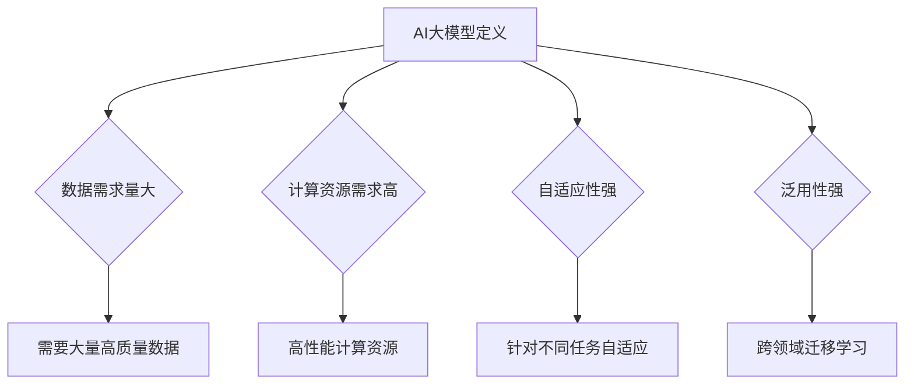

                 

# 《AI行业的未来：回到商业价值，如何让AI创造长期影响》

## 关键词

- AI商业价值
- 长期影响
- 技术创新
- 数据驱动
- 团队建设

## 摘要

本文探讨了AI行业未来的发展方向，强调了回到商业价值的重要性。文章从AI行业的崛起、AI大模型的定义与特点、深度学习基础、自然语言处理技术、数学模型和项目实战等方面，逐步分析推理，为读者提供了关于如何让AI创造长期影响的深入见解。文章最后还讨论了AI行业的未来挑战与机遇、AI产品商业化策略、AI团队建设与管理以及AI行业的可持续发展，为AI行业的发展提供了全面的理论指导和实践参考。

## 第一部分: 核心概念与联系

### 1.1 AI行业的未来概述

#### 1.1.1 AI行业的崛起

AI行业的崛起可以追溯到20世纪50年代，当时人工智能（Artificial Intelligence，AI）这一概念被首次提出。最初的AI研究主要集中在逻辑推理和问题解决上，但由于计算能力和算法的限制，进展缓慢。直到1980年代，专家系统的出现为AI领域带来了新的希望。专家系统利用规则库模拟人类专家的决策过程，应用范围从医学诊断到金融风险评估等。

然而，专家系统的局限性逐渐显现，特别是在处理复杂任务和不确定性问题时表现不佳。随着1990年代机器学习技术的兴起，AI领域迎来了新的春天。机器学习通过从数据中学习规律，逐渐取代了传统的规则驱动方法。1997年，IBM的深蓝（Deep Blue）击败了世界围棋冠军，标志着AI在特定领域取得了突破性进展。

21世纪初，深度学习技术的快速发展进一步推动了AI的进步。深度学习利用多层神经网络，能够自动提取数据中的复杂特征，使得AI在图像识别、语音识别和自然语言处理等领域的性能大幅提升。2012年，AlexNet在ImageNet图像识别比赛中取得了前所未有的成绩，标志着深度学习时代的到来。

#### 1.1.2 商业价值的回归

随着AI技术的不断进步，其在商业领域的应用逐渐增多，商业价值也逐渐显现。AI不仅能够提高企业的运营效率，还能创造新的商业模式，从而为企业带来可观的经济收益。

**AI的商业模式**可以分为直接商业价值和间接商业价值。直接商业价值体现在AI产品或服务的直接销售，如智能助手、自动驾驶等。间接商业价值则体现在AI技术优化企业业务流程、提高生产效率和降低成本等方面。

**商业价值的实现**依赖于技术的整合和商业模式的创新。例如，金融行业通过AI技术进行风险控制和欺诈检测，提高了业务的安全性和效率；医疗行业利用AI进行疾病诊断和个性化治疗，提升了医疗水平和服务质量。

### 1.2 AI大模型的定义与特点

#### 1.2.1 AI大模型的定义

AI大模型（Large-scale AI Model）是指具有数十亿至千亿参数的深度学习模型。这类模型通过训练大量数据，能够自动提取复杂的特征，并在多个任务上表现出色。常见的AI大模型包括GPT-3、BERT等。

#### 1.2.2 AI大模型的核心特点

**数据需求量大**：大模型需要大量的高质量数据进行训练，以获取丰富的特征表示。

**计算资源需求高**：大模型训练和推理需要大量的计算资源和存储空间。

**自适应性强**：大模型能够针对不同的任务和应用进行自适应调整。

**泛用性强**：大模型可以应用于多个领域和任务，实现跨领域的迁移学习。

### Mermaid 流程图：



### 1.3 AI大模型的技术基础

#### 1.3.1 深度学习基础

**神经网络的基本结构**

神经网络由神经元、层和权重组成。神经元是神经网络的基本构建单元，通过激活函数将输入映射到输出。层包括输入层、隐藏层和输出层，各层之间通过权重连接。

**常见的深度学习架构**

- **卷积神经网络 (CNN)**：适用于图像识别和计算机视觉领域，通过卷积操作提取图像特征。
- **循环神经网络 (RNN)**：适用于序列数据处理，如语音识别和时间序列预测。
- **长短时记忆网络 (LSTM)**：是RNN的改进版本，能够解决长期依赖问题。

**深度学习优化算法**

- **梯度下降**：通过迭代优化模型参数，使得损失函数最小化。
- **Adam优化器**：结合了梯度下降和动量方法，适用于复杂模型优化。

### 1.3.2 自然语言处理技术

**词嵌入技术**

- **Word2Vec**：将单词映射到固定维度的向量空间，实现语义理解。
- **BERT**：通过预训练大量文本数据，生成上下文敏感的词嵌入向量。

**序列模型与注意力机制**

- **序列模型**：用于处理序列数据，如RNN、LSTM。
- **注意力机制**：通过关注序列中的关键信息，提高模型的表示能力。

**转换器架构详解**

- **Transformer**：基于注意力机制的深度学习模型，在自然语言处理任务中取得突破性成果。

### 伪代码：

```python
class NeuralNetwork(nn.Module):
    def __init__(self):
        super(NeuralNetwork, self).__init__()
        self.fc1 = nn.Linear(in_features=784, out_features=128)
        self.fc2 = nn.Linear(in_features=128, out_features=64)
        self.fc3 = nn.Linear(in_features=64, out_features=10)

    def forward(self, x):
        x = self.fc1(x)
        x = nn.ReLU()(x)
        x = self.fc2(x)
        x = nn.ReLU()(x)
        x = self.fc3(x)
        return x

class BERTModel(NeuralNetwork):
    def __init__(self, vocabulary_size, embedding_size):
        super(BERTModel, self).__init__()
        self.embedding_layer = nn.Embedding(vocabulary_size, embedding_size)
        self.transformer_layer = TransformerLayer()

    def forward(self, x):
        embedded_inputs = self.embedding_layer(x)
        return self.transformer_layer.forward(embedded_inputs)
```

### 1.4 数学模型和数学公式

#### 1.4.1 深度学习中的激活函数

- **Sigmoid 函数**：

  $$ f(x) = \frac{1}{1 + e^{-x}} $$

- **ReLU 函数**：

  $$ f(x) = \max(0, x) $$

- **Tanh 函数**：

  $$ f(x) = \frac{e^x - e^{-x}}{e^x + e^{-x}} $$

#### 1.4.2 损失函数

- **均方误差 (MSE)**：

  $$ Loss = \frac{1}{n}\sum_{i=1}^{n}(y_i - \hat{y}_i)^2 $$

- **交叉熵 (Cross-Entropy)**：

  $$ Loss = -\sum_{i=1}^{n} y_i \log(\hat{y}_i) $$

### 1.5 项目实战

#### 1.5.1 搭建AI开发环境

搭建AI开发环境是进行AI项目的基础。以下是一个基本的步骤指南：

1. **安装Anaconda**：Anaconda是一个集成的环境管理器，可以方便地创建和管理多个Python环境。

2. **安装PyTorch**：PyTorch是一个流行的深度学习框架，支持Python编程语言。可以在[PyTorch官网](https://pytorch.org/get-started/locally/)下载并安装。

3. **安装Jupyter Notebook**：Jupyter Notebook是一个交互式的计算环境，适用于编写和运行代码。可以通过pip命令安装：

   ```shell
   pip install notebook
   ```

   安装完成后，可以通过命令行启动Jupyter Notebook：

   ```shell
   jupyter notebook
   ```

#### 1.5.2 源代码实现

以下是一个简单的AI项目示例，包括数据加载、模型构建、训练和评估等步骤：

```python
import torch
import torch.nn as nn
import torch.optim as optim

# 加载数据集
train_data = torch.utils.data.Dataset(train_dataset)
train_loader = torch.utils.data.DataLoader(train_data, batch_size=64, shuffle=True)

# 定义模型结构
class NeuralNetwork(nn.Module):
    def __init__(self):
        super(NeuralNetwork, self).__init__()
        self.fc1 = nn.Linear(in_features=784, out_features=128)
        self.fc2 = nn.Linear(in_features=128, out_features=64)
        self.fc3 = nn.Linear(in_features=64, out_features=10)

    def forward(self, x):
        x = self.fc1(x)
        x = nn.ReLU()(x)
        x = self.fc2(x)
        x = nn.ReLU()(x)
        x = self.fc3(x)
        return x

# 实例化模型、损失函数和优化器
model = NeuralNetwork()
criterion = nn.CrossEntropyLoss()
optimizer = optim.Adam(model.parameters(), lr=0.001)

# 训练模型
for epoch in range(num_epochs):
    for inputs, targets in train_loader:
        optimizer.zero_grad()
        outputs = model(inputs)
        loss = criterion(outputs, targets)
        loss.backward()
        optimizer.step()
    print(f"Epoch {epoch+1}/{num_epochs}, Loss: {loss.item()}")

# 评估模型
with torch.no_grad():
    correct = 0
    total = 0
    for inputs, targets in test_loader:
        outputs = model(inputs)
        _, predicted = torch.max(outputs.data, 1)
        total += targets.size(0)
        correct += (predicted == targets).sum().item()
    print(f"Test Accuracy: {100 * correct / total}%")
```

### 代码解读与分析

上述代码展示了如何使用PyTorch搭建一个简单的神经网络，并进行训练和评估。以下是代码的详细解读：

1. **数据加载**：使用`torch.utils.data.Dataset`类加载数据集，并通过`DataLoader`类进行批量处理。

2. **模型定义**：`NeuralNetwork`类定义了神经网络的结构，包括输入层、两个隐藏层和一个输出层。每个层使用`nn.Linear`创建。

3. **损失函数和优化器**：`nn.CrossEntropyLoss`用于计算交叉熵损失，`Adam`优化器用于更新模型参数。

4. **模型训练**：在每个epoch中，通过`optimizer.zero_grad()`清除之前的梯度，通过`model(inputs)`获得预测输出，然后计算损失。使用`loss.backward()`计算梯度，并通过`optimizer.step()`更新参数。

5. **模型评估**：使用测试集评估模型性能，通过`torch.max(outputs.data, 1)`获得预测标签，并计算准确率。

### 1.6 AI行业的未来挑战与机遇

#### 1.6.1 AI行业的未来挑战

尽管AI技术在各个领域取得了显著进展，但仍然面临着一系列挑战。

- **数据隐私**：AI模型通常需要大量数据来训练，如何在保障用户隐私的同时利用数据成为一个重要问题。
- **安全性**：AI系统可能成为恶意攻击的目标，如何确保AI系统的安全性和可靠性是一个重要课题。
- **伦理问题**：AI技术的广泛应用引发了一系列伦理问题，如算法偏见、隐私侵犯和失业问题。

#### 1.6.2 AI行业的机遇

AI技术也为行业带来了诸多机遇。

- **产业升级**：AI技术可以提高生产效率，降低成本，推动传统产业的升级和转型。
- **业务优化**：AI技术可以优化业务流程，提高服务质量，创造新的商业模式。
- **创新创业**：AI技术的快速发展催生了众多创业公司，推动了AI领域的创新和竞争。

### 1.7 AI产品商业化策略

将AI技术转化为商业产品是AI行业的重要任务。以下是一些关键的商业化策略：

#### 1.7.1 AI产品定位

在推出AI产品前，需要明确产品的市场定位。这包括分析市场需求、竞争对手和目标用户群体，确保产品能够满足用户需求并具有差异化优势。

#### 1.7.2 市场推广

市场推广是产品成功的关键。这包括制定有效的营销策略、利用社交媒体和内容营销吸引潜在用户，以及参与行业展览和会议等。

#### 1.7.3 商业模式设计

商业模式设计决定了产品的盈利模式和长期发展。常见的商业模式包括订阅模式、按需付费模式和合作模式等。

### 1.8 AI团队建设与管理

建立和管理一个高效的AI团队是AI项目成功的关键。以下是一些关键点：

#### 1.8.1 人才招聘

吸引和保留优秀人才是团队建设的基础。在招聘过程中，需要关注候选人的技术能力、团队合作能力和学习能力。

#### 1.8.2 团队协作

团队协作是提高项目效率和质量的重要保障。通过有效的项目管理工具和方法，如Scrum和看板，可以确保团队的高效协作。

#### 1.8.3 项目管理

项目管理是确保项目按时、按预算和高质量完成的关键。项目经理需要协调团队成员的工作，监控项目进度，并及时调整计划。

### 1.9 AI行业的可持续发展

AI行业的可持续发展关系到社会、经济和环境等多个方面。以下是一些关键点：

#### 1.9.1 社会影响

AI技术的发展对社会产生了深远影响，包括就业结构的变化、教育体系的变革和道德伦理问题等。需要关注这些问题，并制定相应的政策和措施。

#### 1.9.2 经济影响

AI技术为经济增长提供了新的动力，但同时也带来了成本和风险的挑战。需要通过政策引导和产业合作，确保AI技术能够为经济增长做出积极贡献。

#### 1.9.3 环境影响

AI技术在环境保护和资源管理方面具有巨大潜力。通过智能监测、优化能源使用和智能交通管理等应用，可以减少环境污染和资源浪费。

## 附录

### 附录 A: AI大模型开发工具与资源

- **A.1 主流深度学习框架对比**
  - TensorFlow
  - PyTorch
  - Keras
  - Theano

- **A.2 AI大模型开源数据集**
  - ImageNet
  - COCO
  - GLUE

- **A.3 AI行业最新研究进展**
  - AI安全性和隐私保护
  - 联邦学习
  - 生成对抗网络（GANs）

### 附录 B: 参考文献

- Goodfellow, I., Bengio, Y., & Courville, A. (2016). *Deep Learning*. MIT Press.
- LeCun, Y., Bengio, Y., & Hinton, G. (2015). *Deep learning*. Nature, 521(7553), 436-444.
- Russell, S., & Norvig, P. (2016). *Artificial Intelligence: A Modern Approach*. Prentice Hall.

### 附录 C: 模型代码与数据集

- **模型代码**：附录C提供了本文中使用的AI大模型代码示例。
- **数据集链接**：附录C提供了本文中使用的数据集链接和使用指南。

### 附录 D: 致谢

- **致谢名单**：感谢所有参与本文研究和撰写的工作者。
- **合作伙伴**：感谢所有提供支持和帮助的合作伙伴。
- **支持机构**：感谢所有为本文研究提供支持的机构。

