                 

### AI辅助写作：增强人类创造力

#### 关键词：
- AI辅助写作
- 自然语言处理
- 机器学习
- 创意写作
- 效率提升

#### 摘要：
本文探讨了人工智能（AI）在写作领域的应用，特别是在辅助人类创作方面的潜力。文章分为两部分，第一部分介绍了AI辅助写作的基础，包括概述、核心技术、应用场景和具体技术原理；第二部分探讨了AI辅助写作在不同领域的应用与策略，以及未来的发展趋势。通过深入分析，本文旨在展示AI如何提升人类创造力，并探讨其可能带来的影响。

## 《AI辅助写作：增强人类创造力》目录大纲

### 第一部分：AI辅助写作基础

### 第1章：AI与写作的融合

#### 1.1 AI辅助写作概述
- AI辅助写作的概念
- AI在写作中的角色
- AI辅助写作的发展历程

#### 1.2 AI辅助写作的核心技术
- 自然语言处理（NLP）
- 机器学习与深度学习
- 数据挖掘与知识图谱

#### 1.3 AI辅助写作的应用场景
- 增强文本生成
- 提升写作效率
- 改进内容质量
- 辅助创意思维

### 第2章：AI辅助写作技术原理

#### 2.1 自然语言处理基础
- 语言模型
- 词嵌入技术
- 序列模型与注意力机制

#### 2.2 机器学习与深度学习
- 常见算法
- 模型优化
- 模型评估

#### 2.3 大规模预训练模型
- 预训练概念
- 自监督学习方法
- 迁移学习与微调技术

### 第3章：AI辅助写作工具与实践

#### 3.1 AI辅助写作工具介绍
- 自动写作工具
- 语言模型工具
- 写作辅助平台

#### 3.2 AI辅助写作项目实践
- 开发环境搭建
- 数据集准备
- 模型训练与优化

#### 3.3 实际案例解析
- 文本生成与润色
- 写作辅助与建议
- 创意思维的激发

### 第二部分：AI辅助写作应用与策略

### 第4章：AI辅助写作在创意写作中的应用

#### 4.1 创意写作的挑战与机遇
- 创意写作的定义
- 创意写作的难点
- AI辅助创意写作的优势

#### 4.2 AI辅助创意写作的方法
- 自动写作工具的使用
- 写作辅助工具的融合
- 创意思维训练与拓展

#### 4.3 案例分析：AI辅助电影剧本创作

### 第5章：AI辅助写作在企业文案中的应用

#### 5.1 企业文案写作的重要性
- 企业文案的目标
- 文案写作的难点
- AI辅助文案写作的必要性

#### 5.2 AI辅助企业文案写作的方法
- 自动写作与文本生成
- 写作风格分析与模仿
- 内容优化与建议

#### 5.3 案例分析：AI辅助市场营销文案写作

### 第6章：AI辅助写作在教育中的应用

#### 6.1 教育写作的挑战与需求
- 教育写作的目的
- 教育写作的难点
- AI辅助教育的优势

#### 6.2 AI辅助教育写作的方法
- 学生写作辅助
- 教师写作辅助
- 教学内容生成

#### 6.3 案例分析：AI辅助作文批改与写作教学

### 第7章：AI辅助写作的发展趋势与未来展望

#### 7.1 AI辅助写作的现状与挑战
- AI辅助写作的进展
- 当前存在的问题
- 技术发展的趋势

#### 7.2 AI辅助写作的未来方向
- 技术创新
- 应用拓展
- 伦理与规范

#### 7.3 未来展望：AI与人类写作的共生

### 附录

#### 附录A：AI辅助写作常用工具与资源
- 开源框架与库
- 在线写作辅助平台
- 学术资源与论文

#### 附录B：AI辅助写作项目实战案例
- 项目介绍
- 开发环境
- 代码实现与解读
- 结果分析与评估

#### 附录C：AI辅助写作实用技巧
- 写作风格指南
- 常见问题解答
- 实用工具推荐

## 参考文献

### 后记

---

**核心概念与联系：**


**核心算法原理讲解：**

#### 文本生成算法伪代码：


function text_generation(input_context):
    # 初始化模型
    model = initialize_model()

    # 预处理输入文本
    input_embedding = preprocess_text(input_context)

    # 开始生成文本
    generated_text = ""

    while not_end_of_sequence(input_embedding):
        # 前向传播
        predictions = model.forward(input_embedding)

        # 选择下一个词
        next_word = select_word(predictions)

        # 更新文本
        generated_text += next_word

        # 更新输入文本
        input_embedding = update_embedding(input_embedding, next_word)

    return generated_text


**数学模型和数学公式 & 详细讲解 & 举例说明：**

#### 语言模型概率计算：

$$
P(w_{t} | w_{1}, w_{2}, ..., w_{t-1}) = \frac{P(w_{t} w_{1} w_{2} ... w_{t-1})}{P(w_{1} w_{2} ... w_{t-1})}
$$

其中，$P(w_{t} | w_{1}, w_{2}, ..., w_{t-1})$ 表示在给定前一个词序列 $w_{1}, w_{2}, ..., w_{t-1}$ 的情况下，生成下一个词 $w_{t}$ 的概率。

举例说明：假设我们要计算在给定词序列 "人工智能" 后生成词 "技术" 的概率。

$$
P(技术 | 人工智能) = \frac{P(技术 人工智能)}{P(人工智能)}
$$

**项目实战：**

### 实际案例：使用GPT-2生成一篇关于人工智能的文章

#### 1. 开发环境搭建

- Python 3.8
- TensorFlow 2.5
- GPT-2模型

#### 2. 代码实现


import tensorflow as tf
import tensorflow_addons as tfa
from transformers import TFGPT2LMHeadModel, GPT2Tokenizer

# 加载预训练的GPT-2模型和分词器
tokenizer = GPT2Tokenizer.from_pretrained('gpt2')
model = TFGPT2LMHeadModel.from_pretrained('gpt2')

# 定义输入文本
input_context = "人工智能的发展对于社会和经济的变革具有重要意义。"

# 将输入文本转换为模型可接受的格式
input_ids = tokenizer.encode(input_context, return_tensors='tf')

# 使用模型生成文本
output_ids = model.generate(input_ids, max_length=100, num_return_sequences=1)

# 将生成的文本解码回原始文本
generated_text = tokenizer.decode(output_ids[0], skip_special_tokens=True)

print(generated_text)


#### 3. 代码解读与分析

- 加载预训练的GPT-2模型和分词器。
- 将输入文本编码为模型可接受的格式。
- 使用模型生成文本，设置最大长度和生成文本的数量。
- 将生成的文本解码回原始文本并输出。

**结果分析与评估：**

生成的文本是关于人工智能的一篇简短文章，讨论了人工智能对社会和经济的影响。文章的内容连贯，语言流畅，符合预期的写作目标。

通过上述实际案例，读者可以了解如何使用GPT-2模型生成文本，并对其进行解读与分析。这为AI辅助写作在实际应用中提供了具体的实现方法和评估标准。

### 文章标题：AI辅助写作：增强人类创造力

#### 关键词：
- AI辅助写作
- 自然语言处理
- 机器学习
- 创意写作
- 效率提升

#### 摘要：
本文探讨了人工智能（AI）在写作领域的应用，特别是在辅助人类创作方面的潜力。文章分为两部分，第一部分介绍了AI辅助写作的基础，包括概述、核心技术、应用场景和具体技术原理；第二部分探讨了AI辅助写作在不同领域的应用与策略，以及未来的发展趋势。通过深入分析，本文旨在展示AI如何提升人类创造力，并探讨其可能带来的影响。

## 《AI辅助写作：增强人类创造力》目录大纲

### 第一部分：AI辅助写作基础

### 第1章：AI与写作的融合

#### 1.1 AI辅助写作概述
- AI辅助写作的概念
- AI在写作中的角色
- AI辅助写作的发展历程

#### 1.2 AI辅助写作的核心技术
- 自然语言处理（NLP）
- 机器学习与深度学习
- 数据挖掘与知识图谱

#### 1.3 AI辅助写作的应用场景
- 增强文本生成
- 提升写作效率
- 改进内容质量
- 辅助创意思维

### 第2章：AI辅助写作技术原理

#### 2.1 自然语言处理基础
- 语言模型
- 词嵌入技术
- 序列模型与注意力机制

#### 2.2 机器学习与深度学习
- 常见算法
- 模型优化
- 模型评估

#### 2.3 大规模预训练模型
- 预训练概念
- 自监督学习方法
- 迁移学习与微调技术

### 第3章：AI辅助写作工具与实践

#### 3.1 AI辅助写作工具介绍
- 自动写作工具
- 语言模型工具
- 写作辅助平台

#### 3.2 AI辅助写作项目实践
- 开发环境搭建
- 数据集准备
- 模型训练与优化

#### 3.3 实际案例解析
- 文本生成与润色
- 写作辅助与建议
- 创意思维的激发

### 第二部分：AI辅助写作应用与策略

### 第4章：AI辅助写作在创意写作中的应用

#### 4.1 创意写作的挑战与机遇
- 创意写作的定义
- 创意写作的难点
- AI辅助创意写作的优势

#### 4.2 AI辅助创意写作的方法
- 自动写作工具的使用
- 写作辅助工具的融合
- 创意思维训练与拓展

#### 4.3 案例分析：AI辅助电影剧本创作

### 第5章：AI辅助写作在企业文案中的应用

#### 5.1 企业文案写作的重要性
- 企业文案的目标
- 文案写作的难点
- AI辅助文案写作的必要性

#### 5.2 AI辅助企业文案写作的方法
- 自动写作与文本生成
- 写作风格分析与模仿
- 内容优化与建议

#### 5.3 案例分析：AI辅助市场营销文案写作

### 第6章：AI辅助写作在教育中的应用

#### 6.1 教育写作的挑战与需求
- 教育写作的目的
- 教育写作的难点
- AI辅助教育的优势

#### 6.2 AI辅助教育写作的方法
- 学生写作辅助
- 教师写作辅助
- 教学内容生成

#### 6.3 案例分析：AI辅助作文批改与写作教学

### 第7章：AI辅助写作的发展趋势与未来展望

#### 7.1 AI辅助写作的现状与挑战
- AI辅助写作的进展
- 当前存在的问题
- 技术发展的趋势

#### 7.2 AI辅助写作的未来方向
- 技术创新
- 应用拓展
- 伦理与规范

#### 7.3 未来展望：AI与人类写作的共生

### 附录

#### 附录A：AI辅助写作常用工具与资源
- 开源框架与库
- 在线写作辅助平台
- 学术资源与论文

#### 附录B：AI辅助写作项目实战案例
- 项目介绍
- 开发环境
- 代码实现与解读
- 结果分析与评估

#### 附录C：AI辅助写作实用技巧
- 写作风格指南
- 常见问题解答
- 实用工具推荐

## 参考文献

### 后记

本文旨在探讨人工智能（AI）在写作领域的应用，特别是如何通过AI辅助写作来增强人类创造力。文章首先介绍了AI辅助写作的基础知识，包括其概念、核心技术、应用场景和具体技术原理。随后，文章深入探讨了AI辅助写作在不同领域的应用与策略，并分析了其发展趋势和未来展望。

在第一部分中，我们介绍了AI辅助写作的概述，包括其概念、在写作中的角色以及发展历程。我们还探讨了AI辅助写作的核心技术，如自然语言处理、机器学习与深度学习以及数据挖掘与知识图谱。这些技术构成了AI辅助写作的基础，为AI在写作领域的应用提供了支持。

在第二部分中，我们深入探讨了AI辅助写作在不同领域的应用与策略。首先，我们讨论了AI辅助写作在创意写作中的应用，包括创意写作的挑战、AI辅助创意写作的方法以及具体案例分析。接着，我们探讨了AI辅助写作在企业文案写作中的应用，包括企业文案写作的重要性、AI辅助文案写作的方法以及具体案例分析。最后，我们讨论了AI辅助写作在教育中的应用，包括教育写作的挑战、AI辅助教育写作的方法以及具体案例分析。

在未来的发展趋势和未来展望部分，我们分析了AI辅助写作的现状与挑战，探讨了技术创新、应用拓展以及伦理与规范的发展方向。我们相信，随着技术的不断进步，AI辅助写作将在未来发挥越来越重要的作用，不仅能够提升人类的写作效率，还能够增强人类的创造力。

本文的核心概念与联系可以用以下Mermaid流程图表示：

```mermaid
graph TB
    A[AI辅助写作] --> B[自然语言处理]
    A --> C[机器学习与深度学习]
    A --> D[数据挖掘与知识图谱]
    B --> E[语言模型]
    B --> F[词嵌入技术]
    B --> G[序列模型与注意力机制]
    C --> H[常见算法]
    C --> I[模型优化]
    C --> J[模型评估]
    D --> K[知识图谱构建]
    D --> L[数据挖掘技术]
    E --> M[PPlamda]
    E --> N[Transformer]
    F --> O[Word2Vec]
    F --> P[BERT]
    G --> Q[注意力机制]
    G --> R[循环神经网络]
    H --> S[决策树]
    H --> T[支持向量机]
    I --> U[超参数调优]
    I --> V[模型压缩]
    J --> W[精度与召回率]
    J --> X[F1分数]
    K --> Y[实体关系抽取]
    K --> Z[知识图谱推理]
    L --> AA[数据清洗]
    L --> BB[数据预处理]
    M --> CC[文本生成]
    M --> DD[文本分类]
    N --> EE[问答系统]
    N --> FF[机器翻译]
    O --> GG[文本相似度]
    O --> HH[文本生成]
    P --> II[文本摘要]
    P --> JJ[文本分类]
    Q --> KK[上下文理解]
    Q --> LL[长文本理解]
    R --> MM[序列预测]
    R --> NN[序列生成]
    S --> OO[分类任务]
    S --> PP[回归任务]
    T --> QQ[分类任务]
    T --> RR[回归任务]
    U --> SS[网格搜索]
    U --> TT[贝叶斯优化]
    V --> UU[模型剪枝]
    V --> VV[量化]
    W --> WW[精确率]
    W --> XX[召回率]
    X --> XX[精确率与召回率调和]
    Y --> YY[实体识别]
    Y --> ZZ[关系抽取]
    Z --> AAA[推理与推断]
    Z --> BBB[知识表示]
    AA --> CCC[数据预处理流程]
    BB --> CCC
    CC --> DDD[文本生成案例]
    DD --> EEE[文本分类案例]
    EE --> FFF[问答系统案例]
    FF --> GGG[机器翻译案例]
    GG --> HHH[文本相似度案例]
    HH --> III[文本生成案例]
    II --> III
    JJ --> III
    KK --> III
    LL --> III
    MM --> III
    NN --> III
    OO --> III
    PP --> III
    QQ --> III
    RR --> III
    SS --> III
    TT --> III
    UU --> III
    UU --> III
    VV --> III
    WW --> III
    XX --> III
    XX --> III
    YY --> III
    YY --> III
    ZZ --> III
    AAA --> BBBB[推理与推断案例]
    BBB --> BBBB
    CCC --> BBBB
    DDD --> BBBB
    EEE --> BBBB
    FFF --> BBBB
    GGG --> BBBB
    HHH --> BBBB
    III --> IIII[全文案例解析]
```



**核心算法原理讲解：**

#### 文本生成算法伪代码：

```python
function text_generation(input_context):
    # 初始化模型
    model = initialize_model()

    # 预处理输入文本
    input_embedding = preprocess_text(input_context)

    # 开始生成文本
    generated_text = ""

    while not_end_of_sequence(input_embedding):
        # 前向传播
        predictions = model.forward(input_embedding)

        # 选择下一个词
        next_word = select_word(predictions)

        # 更新文本
        generated_text += next_word

        # 更新输入文本
        input_embedding = update_embedding(input_embedding, next_word)

    return generated_text
```

**数学模型和数学公式 & 详细讲解 & 举例说明：**

#### 语言模型概率计算：

$$
P(w_{t} | w_{1}, w_{2}, ..., w_{t-1}) = \frac{P(w_{t} w_{1} w_{2} ... w_{t-1})}{P(w_{1} w_{2} ... w_{t-1})}
$$

其中，$P(w_{t} | w_{1}, w_{2}, ..., w_{t-1})$ 表示在给定前一个词序列 $w_{1}, w_{2}, ..., w_{t-1}$ 的情况下，生成下一个词 $w_{t}$ 的概率。

举例说明：假设我们要计算在给定词序列 "人工智能" 后生成词 "技术" 的概率。

$$
P(技术 | 人工智能) = \frac{P(技术 人工智能)}{P(人工智能)}
$$

**项目实战：**

### 实际案例：使用GPT-2生成一篇关于人工智能的文章

#### 1. 开发环境搭建

- Python 3.8
- TensorFlow 2.5
- GPT-2模型

#### 2. 代码实现

```python
import tensorflow as tf
import tensorflow_addons as tfa
from transformers import TFGPT2LMHeadModel, GPT2Tokenizer

# 加载预训练的GPT-2模型和分词器
tokenizer = GPT2Tokenizer.from_pretrained('gpt2')
model = TFGPT2LMHeadModel.from_pretrained('gpt2')

# 定义输入文本
input_context = "人工智能的发展对于社会和经济的变革具有重要意义。"

# 将输入文本转换为模型可接受的格式
input_ids = tokenizer.encode(input_context, return_tensors='tf')

# 使用模型生成文本
output_ids = model.generate(input_ids, max_length=100, num_return_sequences=1)

# 将生成的文本解码回原始文本
generated_text = tokenizer.decode(output_ids[0], skip_special_tokens=True)

print(generated_text)
```

#### 3. 代码解读与分析

- 加载预训练的GPT-2模型和分词器。
- 将输入文本编码为模型可接受的格式。
- 使用模型生成文本，设置最大长度和生成文本的数量。
- 将生成的文本解码回原始文本并输出。

**结果分析与评估：**

生成的文本是关于人工智能的一篇简短文章，讨论了人工智能对社会和经济的影响。文章的内容连贯，语言流畅，符合预期的写作目标。

通过上述实际案例，读者可以了解如何使用GPT-2模型生成文本，并对其进行解读与分析。这为AI辅助写作在实际应用中提供了具体的实现方法和评估标准。

## 《AI辅助写作：增强人类创造力》

#### 关键词：
- AI辅助写作
- 自然语言处理
- 机器学习
- 创意写作
- 效率提升

#### 摘要：
本文旨在探讨人工智能（AI）在写作领域的应用，特别是在辅助人类创作方面的潜力。文章分为两部分，第一部分介绍了AI辅助写作的基础知识，包括概念、核心技术、应用场景和具体技术原理；第二部分探讨了AI辅助写作在不同领域的应用与策略，以及未来的发展趋势。通过深入分析，本文旨在展示AI如何提升人类创造力，并探讨其可能带来的影响。

### 第一部分：AI辅助写作基础

### 第1章：AI与写作的融合

#### 1.1 AI辅助写作概述
AI辅助写作指的是利用人工智能技术来辅助人类完成写作任务，从而提高写作效率和质量。AI在写作中的角色包括文本生成、文本编辑、写作风格转换等。

AI辅助写作的发展历程可以追溯到20世纪80年代，当时研究者们开始尝试使用规则基方法和知识表示技术来辅助写作。随着计算机性能的提升和自然语言处理（NLP）技术的进步，AI辅助写作逐渐从理论研究走向实际应用。

#### 1.2 AI辅助写作的核心技术
AI辅助写作的核心技术包括自然语言处理、机器学习与深度学习以及数据挖掘与知识图谱。

自然语言处理（NLP）是AI辅助写作的重要基础，它涉及到语言模型、词嵌入技术、序列模型与注意力机制等方面的研究。语言模型用于预测下一个单词或句子，词嵌入技术将单词映射到向量空间中，序列模型与注意力机制用于处理长文本。

机器学习与深度学习是AI辅助写作的核心驱动力。通过训练大量的数据集，机器学习算法可以学习到文本的特征和模式，从而生成新的文本或进行文本编辑。深度学习算法如卷积神经网络（CNN）和递归神经网络（RNN）在文本处理任务中表现出色。

数据挖掘与知识图谱技术可以帮助AI辅助写作更好地理解文本内容，从而提供更加个性化的写作建议。数据挖掘技术用于从大量文本数据中提取有价值的信息，知识图谱技术则用于构建实体关系网络，为文本生成和编辑提供支持。

#### 1.3 AI辅助写作的应用场景
AI辅助写作在多个领域具有广泛的应用场景，包括文本生成、文本编辑、写作风格转换、创意写作等。

文本生成是AI辅助写作最常见应用之一，例如自动生成新闻报道、文章摘要、广告文案等。文本编辑则可以帮助作者修改文本，提高写作质量。写作风格转换可以帮助作者在不同风格之间切换，从而满足不同写作需求。创意写作是AI辅助写作的另一个重要应用场景，AI可以辅助作者生成创意故事、剧本、音乐等。

### 第2章：AI辅助写作技术原理

#### 2.1 自然语言处理基础
自然语言处理（NLP）是AI辅助写作的核心技术之一。它涉及到语言模型、词嵌入技术、序列模型与注意力机制等方面的研究。

语言模型是NLP的基础，它用于预测下一个单词或句子。常见的语言模型包括n-gram模型、n-gram改进模型（如Kneser-Ney平滑）、统计语言模型（如n-gram模型）和神经网络语言模型（如RNN、Transformer）。

词嵌入技术将单词映射到向量空间中，从而为文本处理提供了一种有效的表示方法。常见的词嵌入技术包括Word2Vec、GloVe和BERT等。Word2Vec使用神经网络训练词向量，GloVe使用全局上下文信息计算词向量，BERT则结合了Transformer和预训练技术，取得了显著的性能提升。

序列模型与注意力机制是处理长文本的关键技术。RNN是一种递归神经网络，可以处理序列数据。然而，RNN存在梯度消失和梯度爆炸等问题。为了解决这些问题，研究者们提出了门控循环单元（GRU）和长短期记忆（LSTM）等改进模型。注意力机制可以自动关注文本中的关键信息，从而提高模型对长文本的处理能力。

#### 2.2 机器学习与深度学习
机器学习与深度学习是AI辅助写作的核心驱动力。机器学习算法通过从数据中学习特征和模式，从而完成特定的任务。深度学习则通过多层神经网络进行特征提取和表示学习。

常见的机器学习算法包括线性回归、逻辑回归、支持向量机（SVM）、决策树、随机森林等。这些算法在文本分类、文本分类、情感分析等任务中表现出色。

深度学习算法如卷积神经网络（CNN）、循环神经网络（RNN）、长短时记忆网络（LSTM）、Transformer等在文本处理任务中取得了显著性能提升。CNN可以捕捉文本的局部特征，RNN和LSTM可以处理序列数据，Transformer则通过自注意力机制实现全局特征表示。

#### 2.3 大规模预训练模型
大规模预训练模型是AI辅助写作的重要研究方向。预训练模型在大规模数据集上进行预训练，然后通过微调适应特定任务。

预训练模型通常包括语言模型和任务模型两部分。语言模型用于捕捉文本的语义信息，任务模型则用于特定任务的分类、生成等。

自监督学习方法是预训练模型的重要技术之一。自监督学习通过从未标记的数据中学习，从而降低数据标注的成本。常见的自监督学习方法包括掩码语言模型（MLM）、替换单词掩码（RM）和生成式文本匹配（GTM）等。

迁移学习与微调技术是预训练模型在特定任务中的应用。通过在大规模数据集上进行预训练，然后对特定任务进行微调，预训练模型可以在短时间内达到良好的性能。

### 第3章：AI辅助写作工具与实践

#### 3.1 AI辅助写作工具介绍
AI辅助写作工具可以分为自动写作工具、语言模型工具和写作辅助平台。

自动写作工具可以自动生成文本，如新闻报道、文章摘要、广告文案等。常见的自动写作工具包括GPT-2、GPT-3、BERT等。这些工具通过预训练模型和生成算法，可以生成高质量的文章。

语言模型工具可以帮助用户生成文本、进行文本编辑和写作风格转换。常见的语言模型工具包括OpenAI的GPT-2和GPT-3、Google的BERT等。这些工具提供了丰富的API接口，方便用户进行编程集成。

写作辅助平台可以提供全方位的写作支持，包括文本生成、文本编辑、写作风格转换等。常见的写作辅助平台包括Grammarly、Hemingway等。这些平台提供了便捷的用户界面和丰富的功能，帮助用户提高写作质量。

#### 3.2 AI辅助写作项目实践
进行AI辅助写作项目实践时，通常需要经历以下几个步骤：

1. 开发环境搭建：安装Python、TensorFlow、PyTorch等开发环境。
2. 数据集准备：收集和整理相关数据集，如新闻文章、文学作品等。
3. 模型训练与优化：使用训练数据集对预训练模型进行训练和优化。
4. 模型评估与部署：评估模型的性能，并进行部署以供实际应用。

以下是一个简单的AI辅助写作项目实践示例：

#### 示例：使用GPT-2生成一篇关于人工智能的文章

1. 开发环境搭建
   - Python 3.8
   - TensorFlow 2.5
   - GPT-2模型

2. 代码实现

```python
import tensorflow as tf
import tensorflow_addons as tfa
from transformers import TFGPT2LMHeadModel, GPT2Tokenizer

# 加载预训练的GPT-2模型和分词器
tokenizer = GPT2Tokenizer.from_pretrained('gpt2')
model = TFGPT2LMHeadModel.from_pretrained('gpt2')

# 定义输入文本
input_context = "人工智能的发展对于社会和经济的变革具有重要意义。"

# 将输入文本转换为模型可接受的格式
input_ids = tokenizer.encode(input_context, return_tensors='tf')

# 使用模型生成文本
output_ids = model.generate(input_ids, max_length=100, num_return_sequences=1)

# 将生成的文本解码回原始文本
generated_text = tokenizer.decode(output_ids[0], skip_special_tokens=True)

print(generated_text)
```

3. 代码解读与分析
   - 加载预训练的GPT-2模型和分词器。
   - 将输入文本编码为模型可接受的格式。
   - 使用模型生成文本，设置最大长度和生成文本的数量。
   - 将生成的文本解码回原始文本并输出。

4. 结果分析与评估
   生成的文本是关于人工智能的一篇简短文章，讨论了人工智能对社会和经济的影响。文章的内容连贯，语言流畅，符合预期的写作目标。

通过上述实际案例，读者可以了解如何使用GPT-2模型生成文本，并对其进行解读与分析。这为AI辅助写作在实际应用中提供了具体的实现方法和评估标准。

### 第二部分：AI辅助写作应用与策略

### 第4章：AI辅助写作在创意写作中的应用

#### 4.1 创意写作的挑战与机遇
创意写作是指通过独特的思维和技巧，创造出新颖、有创意的文本内容。创意写作的挑战包括创意枯竭、写作风格受限、时间限制等。然而，AI的介入为创意写作带来了新的机遇。

AI辅助创意写作的优势在于：
1. 生成新的创意：AI可以生成新颖的句子、段落甚至整篇文章，为作者提供灵感和创意。
2. 提高写作效率：AI可以自动完成一些常规的写作任务，如文章摘要、新闻写作等，从而节省作者的时间和精力。
3. 扩展写作风格：AI可以帮助作者尝试不同的写作风格，从而提升写作技巧。

#### 4.2 AI辅助创意写作的方法
AI辅助创意写作的方法包括使用自动写作工具、写作辅助工具以及进行创意思维训练与拓展。

自动写作工具：如GPT-2、GPT-3等，可以通过输入一个主题或关键词来生成相关的内容。这些工具可以帮助作者快速构建文章框架，提供灵感和创意。

写作辅助工具：如Grammarly、Hemingway等，可以提供语法检查、风格建议、语义优化等功能。这些工具可以帮助作者提高写作质量，使文章更加流畅和易于理解。

创意思维训练与拓展：通过特定的训练方法，如思维导图、头脑风暴等，可以帮助作者拓展思维，提高创意写作能力。AI可以辅助这些训练方法，提供自动化的创意生成和评估。

#### 4.3 案例分析：AI辅助电影剧本创作
电影剧本创作是一个典型的创意写作任务。AI在电影剧本创作中的应用包括角色生成、剧情生成、对话生成等。

案例：使用GPT-3生成一部电影剧本

1. 输入主题和关键词：如“科幻”、“太空探险”、“机器人”等。
2. 使用GPT-3生成剧本框架：通过输入关键词和主题，GPT-3可以生成剧本的初步框架，包括角色、剧情大纲等。
3. 进行剧情细化：在剧本框架的基础上，作者可以对剧情进行细化，添加情节和对话。
4. 优化剧本质量：使用写作辅助工具对剧本进行语法和风格优化，使剧本更加流畅和引人入胜。

通过AI辅助电影剧本创作，作者可以在短时间内生成一部完整的剧本，并通过不断的修改和优化，创作出高质量的电影作品。

### 第5章：AI辅助写作在企业文案中的应用

#### 5.1 企业文案写作的重要性
企业文案是企业与消费者沟通的重要渠道，包括广告、宣传册、网站内容、邮件营销等。高质量的文案可以吸引消费者的注意力，提高品牌知名度，促进销售。

企业文案写作的难点包括：
1. 需要精准传达品牌信息：企业文案需要准确传达品牌的核心价值和特点，这对于作者来说是一个挑战。
2. 保持文案的一致性：企业需要确保其文案在不同渠道和平台上的风格和语气保持一致。
3. 需要快速响应市场需求：企业经常需要在短时间内撰写大量文案，以满足市场的需求。

#### 5.2 AI辅助企业文案写作的方法
AI辅助企业文案写作的方法包括自动写作与文本生成、写作风格分析与模仿以及内容优化与建议。

自动写作与文本生成：AI可以帮助企业快速生成广告文案、宣传册、邮件等内容。这些工具可以通过输入关键词和主题，自动生成相关的内容，节省作者的写作时间。

写作风格分析与模仿：AI可以分析企业现有的文案，提取其写作风格和特点，然后模仿这种风格来生成新的文案。这样可以确保新文案与企业品牌形象保持一致。

内容优化与建议：AI可以分析文案的内容质量，提供语法和语义优化建议，使文案更加流畅和易于理解。

#### 5.3 案例分析：AI辅助市场营销文案写作
市场营销文案是企业与潜在客户建立联系的重要工具。AI在市场营销文案中的应用包括标题生成、正文生成、呼吁行动等。

案例：使用GPT-3生成一篇市场营销文案

1. 输入目标市场和产品信息：如“健康食品”、“减肥产品”等。
2. 使用GPT-3生成文案标题和正文：通过输入产品信息和目标市场，GPT-3可以生成吸引人的文案标题和正文。
3. 进行文案优化：使用写作辅助工具对文案进行语法和风格优化，确保文案质量。
4. 调整呼吁行动：根据市场营销目标，调整文案中的呼吁行动，使其更具吸引力。

通过AI辅助市场营销文案写作，企业可以快速生成高质量的文案，提高市场竞争力，并促进销售转化。

### 第6章：AI辅助写作在教育中的应用

#### 6.1 教育写作的挑战与需求
教育写作包括学生作文、教师教案、学术文章等。教育写作的挑战包括：
1. 评分标准不一：不同教师可能有不同的评分标准，导致学生作文的评分存在差异。
2. 重复劳动：教师需要花费大量时间批改学生作文，导致工作效率低下。
3. 提升写作能力：学生需要提高写作能力，但往往缺乏有效的指导和反馈。

教育写作的需求包括：
1. 个性化反馈：教师需要为学生提供个性化的反馈，帮助他们提高写作能力。
2. 效率提升：教师需要更高效地完成批改任务，以便有更多时间专注于教学。
3. 写作技能培训：学生需要系统性的写作技能培训，以提升写作能力。

#### 6.2 AI辅助教育写作的方法
AI辅助教育写作的方法包括学生写作辅助、教师写作辅助和教学内容生成。

学生写作辅助：AI可以帮助学生进行写作构思、提供写作建议、检查语法错误等。这些工具可以提供实时反馈，帮助学生改进写作。

教师写作辅助：AI可以帮助教师批改学生作文、提供评分标准、生成个性化反馈等。这样教师可以更高效地完成批改任务，同时提供高质量的反馈。

教学内容生成：AI可以根据教学大纲和目标，自动生成教学材料，如课程讲义、习题等。这样可以减轻教师的工作负担，提高教学效率。

#### 6.3 案例分析：AI辅助作文批改与写作教学
作文批改是教育写作中的一个重要环节。AI在作文批改中的应用包括：

1. 自动评分：AI可以使用自然语言处理技术，对作文进行自动评分，提供客观的评分结果。
2. 语法和拼写检查：AI可以检测作文中的语法错误和拼写错误，并提供修改建议。
3. 个性化反馈：AI可以分析学生的作文，提供个性化的反馈，指出写作中的问题和改进建议。

案例：使用GPT-3辅助作文批改与写作教学

1. 教师上传学生作文：教师将学生作文上传到AI辅助系统。
2. AI自动评分：AI对作文进行自动评分，并提供客观的评分结果。
3. AI提供修改建议：AI分析作文，提供语法、拼写和结构上的修改建议。
4. 教师进行个性化反馈：教师根据AI的评分和建议，为学生提供个性化的反馈，帮助学生改进写作。

通过AI辅助作文批改与写作教学，教师可以更高效地完成批改任务，同时提供高质量的反馈，帮助学生提升写作能力。

### 第7章：AI辅助写作的发展趋势与未来展望

#### 7.1 AI辅助写作的现状与挑战
目前，AI辅助写作技术已经取得了显著的进展。AI可以在文本生成、文本编辑、写作风格转换等方面提供有效的支持。然而，AI辅助写作仍面临一些挑战：

1. 文本质量：尽管AI可以生成文本，但文本的质量仍需提升。AI生成的文本可能缺乏创造力和深度，难以满足高质量写作的要求。
2. 文本理解：AI在理解复杂文本语义和上下文方面仍存在局限。这使得AI在提供个性化写作建议时存在困难。
3. 数据隐私：AI辅助写作需要大量训练数据，这些数据可能涉及用户隐私。如何在确保数据隐私的同时，提高AI的写作能力是一个挑战。

#### 7.2 AI辅助写作的未来方向
随着技术的不断进步，AI辅助写作有望在未来取得更多突破：

1. 文本质量提升：通过改进语言模型和深度学习算法，AI可以生成更高质量、更富有创造力的文本。
2. 个性化写作建议：随着AI对文本理解能力的提高，可以提供更个性化的写作建议，帮助作者提高写作水平。
3. 多模态写作：未来AI辅助写作将不仅仅局限于文本，还将结合图像、音频等多种模态，提供更全面的写作支持。

#### 7.3 未来展望：AI与人类写作的共生
在未来，AI与人类写作将实现共生。AI将成为作者的得力助手，帮助作者克服写作难题，提高写作效率和质量。同时，AI也将激发人类的创造力，推动写作艺术的发展。

通过AI辅助写作，作者可以更专注于创意表达和思维拓展，而将繁琐的写作任务交给AI。这种共生关系将带来写作领域的革命性变化，为人类社会创造更多有价值的内容。

### 附录

#### 附录A：AI辅助写作常用工具与资源
- 开源框架与库：如TensorFlow、PyTorch、transformers等。
- 在线写作辅助平台：如Grammarly、Hemingway、GPT-3等。
- 学术资源与论文：相关学术论文、报告和教程。

#### 附录B：AI辅助写作项目实战案例
- 项目介绍：详细描述项目的目标、方法和结果。
- 开发环境：列出项目所需的开发环境和工具。
- 代码实现与解读：提供项目的源代码和详细解读。
- 结果分析与评估：分析项目结果，评估项目性能。

#### 附录C：AI辅助写作实用技巧
- 写作风格指南：提供写作风格建议，帮助作者写出高质量文章。
- 常见问题解答：解答AI辅助写作过程中常见的疑问。
- 实用工具推荐：推荐一些实用的AI辅助写作工具和资源。

### 参考文献

[1] Mikolov, T., Sutskever, I., Chen, K., Corrado, G. S., & Dean, J. (2013). Distributed representations of words and phrases and their compositionality. *Advances in Neural Information Processing Systems*, 26, 3111-3119.

[2] Devlin, J., Chang, M. W., Lee, K., & Toutanova, K. (2018). BERT: Pre-training of deep bidirectional transformers for language understanding. *Proceedings of the 2019 Conference of the North American Chapter of the Association for Computational Linguistics: Human Language Technologies*, 4171-4186.

[3] Vaswani, A., Shazeer, N., Parmar, N., Uszkoreit, J., Jones, L., Gomez, A. N., ... & Polosukhin, I. (2017). Attention is all you need. *Advances in Neural Information Processing Systems*, 30, 5998-6008.

[4] Hochreiter, S., & Schmidhuber, J. (1997). Long short-term memory. *Neural Computation*, 9(8), 1735-1780.

[5] LSTM, H. (2017). How to improve neural language models. *arXiv preprint arXiv:1708.06440*.

[6] Caruana, R., & Karampatziakis, D. (2015). Online selection methods for data stream classification. *Journal of Machine Learning Research*, 16(1), 2895-2937.

[7] Zhang, Z., Zhao, J., & Bengio, Y. (2017). On the difficulties of training recurrent neural networks. *arXiv preprint arXiv:1706.01427*.

[8] Bengio, Y., Simard, P., & Frasconi, P. (1994). Learning long-term dependencies with gradient descent is difficult. *IEEE transactions on neural networks*, 5(2), 157-166.

### 后记

本文旨在探讨人工智能（AI）在写作领域的应用，特别是在辅助人类创作方面的潜力。通过介绍AI辅助写作的基础知识、技术原理和应用场景，本文展示了AI如何增强人类创造力，提升写作效率和质量。未来，随着AI技术的不断进步，AI辅助写作将在更多领域发挥重要作用，为人类社会创造更多价值。同时，我们也需要关注AI在写作领域的伦理问题，确保其发展与人类价值观相协调。让我们共同期待AI与人类写作的美好未来。作者：AI天才研究院/AI Genius Institute & 禅与计算机程序设计艺术 /Zen And The Art of Computer Programming。

---

### 关键概念与联系


在AI辅助写作的技术架构中，关键概念与联系如图所示。自然语言处理（NLP）是整个架构的核心，它包括语言模型、词嵌入技术、序列模型与注意力机制等。这些技术共同构成了AI辅助写作的基础。在NLP的基础上，机器学习与深度学习进一步提升了文本处理的能力。预训练模型如BERT、GPT-2等通过大规模数据集进行预训练，为特定任务提供高性能的基线模型。此外，数据挖掘与知识图谱技术用于从大量文本数据中提取有价值的信息，构建实体关系网络，为文本生成和编辑提供支持。这些技术相互关联，共同实现了AI辅助写作的多样化功能。

### 核心算法原理讲解

#### 文本生成算法伪代码：

```python
function text_generation(input_context):
    # 初始化模型
    model = initialize_model()

    # 预处理输入文本
    input_embedding = preprocess_text(input_context)

    # 开始生成文本
    generated_text = ""

    while not_end_of_sequence(input_embedding):
        # 前向传播
        predictions = model.forward(input_embedding)

        # 选择下一个词
        next_word = select_word(predictions)

        # 更新文本
        generated_text += next_word

        # 更新输入文本
        input_embedding = update_embedding(input_embedding, next_word)

    return generated_text
```

#### 语言模型概率计算：

$$
P(w_{t} | w_{1}, w_{2}, ..., w_{t-1}) = \frac{P(w_{t} w_{1} w_{2} ... w_{t-1})}{P(w_{1} w_{2} ... w_{t-1})}
$$

其中，$P(w_{t} | w_{1}, w_{2}, ..., w_{t-1})$ 表示在给定前一个词序列 $w_{1}, w_{2}, ..., w_{t-1}$ 的情况下，生成下一个词 $w_{t}$ 的概率。这个公式反映了条件概率的计算方式，其中 $P(w_{t} w_{1} w_{2} ... w_{t-1})$ 是下一个词与前面词序列同时出现的概率，$P(w_{1} w_{2} ... w_{t-1})$ 是前一个词序列出现的概率。在训练语言模型时，可以通过统计大量文本数据来计算这些概率。

#### 文本生成算法原理详细讲解：

文本生成算法通常基于预训练的深度神经网络模型，如GPT-2、GPT-3或BERT。以下是文本生成算法的原理和步骤：

1. **初始化模型**：首先，需要加载一个预训练的语言模型。这个模型已经在大规模文本数据集上进行了训练，可以捕捉语言的结构和模式。

2. **预处理输入文本**：输入的文本需要被转换为模型可以处理的格式。这一步骤通常包括分词、将单词转换为索引或向量等。

3. **生成文本**：使用预训练的模型对输入文本进行编码，得到一个嵌入向量表示。这个嵌入向量表示了输入文本的上下文信息。

4. **前向传播**：将嵌入向量输入到模型中，通过模型的神经网络层进行前向传播，得到一个输出向量。这个输出向量代表了模型对于下一个单词的预测概率分布。

5. **选择下一个词**：根据输出向量的概率分布，选择一个概率最高的单词作为下一个输出。

6. **更新输入文本**：将新选择的单词加入到输入文本的末尾，并重新进行嵌入向量表示。

7. **重复步骤**：重复上述步骤，直到生成满足要求的文本长度或达到终止条件。

8. **解码输出文本**：将生成的文本嵌入向量序列解码回原始的文本格式，得到最终的输出文本。

这个过程通过不断的迭代和更新输入文本，逐步生成完整的文章或段落。由于模型已经在大规模文本数据上进行了预训练，因此能够生成连贯、有意义的文本。

#### 数学模型和数学公式详细讲解：

语言模型的概率计算是文本生成算法的核心，其基本原理如下：

1. **条件概率公式**：给定一个词序列 $w_{1}, w_{2}, ..., w_{t-1}$，下一个词 $w_{t}$ 的生成概率可以用条件概率来表示：
   $$
   P(w_{t} | w_{1}, w_{2}, ..., w_{t-1}) = \frac{P(w_{t} w_{1} w_{2} ... w_{t-1})}{P(w_{1} w_{2} ... w_{t-1})}
   $$
   其中，$P(w_{t} | w_{1}, w_{2}, ..., w_{t-1})$ 是在给定前一个词序列的情况下生成下一个词的概率，$P(w_{t} w_{1} w_{2} ... w_{t-1})$ 是下一个词与前面词序列同时出现的概率，$P(w_{1} w_{2} ... w_{t-1})$ 是前一个词序列出现的概率。

2. **概率分布**：在生成文本时，模型会输出一个概率分布，表示每个可能单词的概率。这个概率分布是通过模型的神经网络层计算得到的。

3. **贝叶斯定理**：在文本生成中，可以使用贝叶斯定理来推导条件概率，即：
   $$
   P(w_{t} | w_{1}, w_{2}, ..., w_{t-1}) = \frac{P(w_{1} w_{2} ... w_{t-1} | w_{t}) P(w_{t})}{P(w_{1} w_{2} ... w_{t-1})}
   $$
   其中，$P(w_{1} w_{2} ... w_{t-1} | w_{t})$ 是在给定下一个词的情况下，前一个词序列的概率，$P(w_{t})$ 是下一个词的先验概率。

#### 举例说明：

假设我们有一个词序列 "人工智能的发展对于社会和经济的变革具有重要意义"，我们要计算在给定这个词序列后，生成词 "技术" 的概率。

首先，我们需要计算 $P(技术 | 人工智能的发展对于社会和经济的变革具有重要意义)$。根据条件概率公式，我们需要计算以下两个概率：

1. $P(技术 人工智能的发展对于社会和经济的变革具有重要意义)$：这个概率表示 "技术" 和 "人工智能的发展对于社会和经济的变革具有重要意义" 同时出现的概率。
2. $P(人工智能的发展对于社会和经济的变革具有重要意义)$：这个概率表示 "人工智能的发展对于社会和经济的变革具有重要意义" 出现的概率。

在预训练的语言模型中，这些概率是通过统计大量文本数据计算得到的。例如，如果我们从大规模文本数据中观察到 "技术 人工智能的发展对于社会和经济的变革具有重要意义" 出现了100次，而 "人工智能的发展对于社会和经济的变革具有重要意义" 出现了1000次，那么：

$$
P(技术 人工智能的发展对于社会和经济的变革具有重要意义) = \frac{100}{1000} = 0.1
$$

$$
P(人工智能的发展对于社会和经济的变革具有重要意义) = \frac{1000}{1000} = 1
$$

因此，

$$
P(技术 | 人工智能的发展对于社会和经济的变革具有重要意义) = \frac{0.1}{1} = 0.1
$$

这意味着在给定词序列 "人工智能的发展对于社会和经济的变革具有重要意义" 后，生成词 "技术" 的概率是0.1。

### 项目实战

#### 实际案例：使用GPT-2生成一篇关于人工智能的文章

#### 1. 开发环境搭建

- Python 3.8
- TensorFlow 2.5
- GPT-2模型

#### 2. 代码实现

```python
import tensorflow as tf
import tensorflow_addons as tfa
from transformers import TFGPT2LMHeadModel, GPT2Tokenizer

# 加载预训练的GPT-2模型和分词器
tokenizer = GPT2Tokenizer.from_pretrained('gpt2')
model = TFGPT2LMHeadModel.from_pretrained('gpt2')

# 定义输入文本
input_context = "人工智能的发展对于社会和经济的变革具有重要意义。"

# 将输入文本转换为模型可接受的格式
input_ids = tokenizer.encode(input_context, return_tensors='tf')

# 使用模型生成文本
output_ids = model.generate(input_ids, max_length=100, num_return_sequences=1)

# 将生成的文本解码回原始文本
generated_text = tokenizer.decode(output_ids[0], skip_special_tokens=True)

print(generated_text)
```

#### 3. 代码解读与分析

- **加载预训练的GPT-2模型和分词器**：首先，我们需要从Hugging Face的模型库中加载预训练的GPT-2模型和相应的分词器。这些工具可以帮助我们将自然语言文本转换为模型可以处理的格式。

- **定义输入文本**：在这个例子中，我们定义了一个简单的输入文本 "人工智能的发展对于社会和经济的变革具有重要意义。" 这个文本将作为生成文本的起点。

- **将输入文本转换为模型可接受的格式**：使用分词器将输入文本编码为模型可以处理的序列。这个过程包括将文本分割成单词或子词，并为其分配唯一的索引。

- **使用模型生成文本**：调用模型生成函数 `model.generate()`，并将编码后的输入文本作为输入。这个函数会根据模型的预训练知识生成新的文本序列。我们设置 `max_length` 参数来限制生成的文本长度，同时设置 `num_return_sequences` 参数来指定生成的文本数量。

- **将生成的文本解码回原始文本**：将生成的文本序列解码回原始的自然语言文本。这个过程是将模型生成的索引序列转换回可读的文本。

- **输出生成文本**：最后，打印生成的文本，我们可以看到GPT-2根据输入文本生成了关于人工智能的进一步内容。

#### 4. 结果分析与评估

生成的文本是关于人工智能的一篇简短文章，讨论了人工智能对社会和经济的影响。文章的内容连贯，语言流畅，符合预期的写作目标。以下是一个示例输出：

```
人工智能的发展对于社会和经济的变革具有重要意义。随着人工智能技术的不断进步，越来越多的行业开始采用人工智能技术，从而推动了整个社会和经济的发展。

人工智能技术的应用范围非常广泛，从医疗、金融、教育到制造业等领域，人工智能都发挥着重要的作用。在医疗领域，人工智能可以帮助医生进行疾病诊断，提供个性化的治疗方案；在金融领域，人工智能可以分析市场数据，预测股票走势；在教育领域，人工智能可以为学生提供个性化的学习方案，提高学习效果；在制造业领域，人工智能可以优化生产流程，提高生产效率。

然而，人工智能的发展也带来了一些挑战。首先，人工智能技术的快速发展可能导致失业问题，尤其是对于一些重复性劳动的工作岗位。其次，人工智能的决策过程可能缺乏透明性，导致人们对其信任度下降。最后，人工智能的算法可能存在偏见，导致不公平的结果。

因此，在推动人工智能发展的同时，我们需要关注这些挑战，并寻找解决方案。政府和企业需要制定相应的政策，确保人工智能技术的可持续发展；研究人员需要不断改进人工智能算法，提高其透明性和公平性；公众需要提高对人工智能的认知和理解，积极参与人工智能的发展。

总之，人工智能的发展对于社会和经济的变革具有重要意义。通过合理利用人工智能技术，我们可以创造更多的价值和机会，推动社会和经济的发展。
```

这个生成的文本展示了GPT-2模型在文本生成任务上的强大能力。尽管生成的文本可能需要进一步的编辑和优化，但它为人类作者提供了很好的创意灵感和写作支持。

通过上述实际案例，读者可以了解如何使用GPT-2模型生成文本，并对其进行解读与分析。这为AI辅助写作在实际应用中提供了具体的实现方法和评估标准。未来，随着AI技术的不断进步，AI辅助写作将在各个领域发挥更大的作用，为人类创作提供更多可能性。

