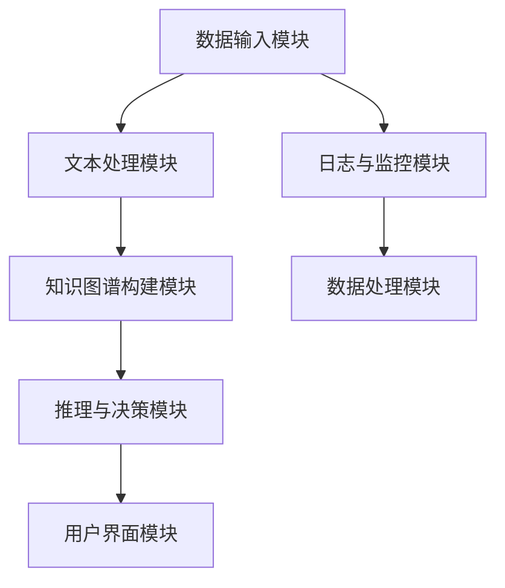
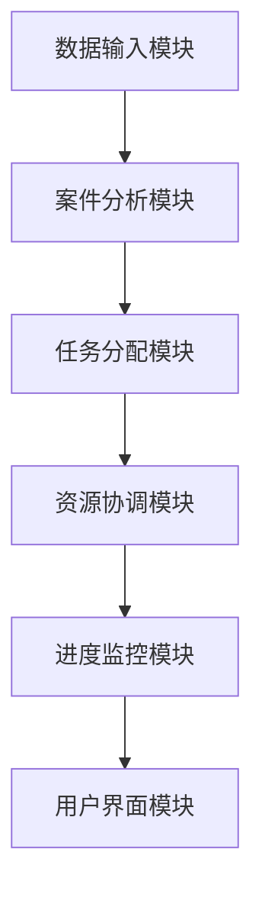

                 

### 文章标题

# AI辅助法律服务：提高效率与公平

### 关键词

- 人工智能
- 法律服务
- 效率提升
- 公平性
- 自然语言处理
- 法律知识图谱
- 机器学习

### 摘要

随着人工智能技术的飞速发展，AI辅助法律服务的应用逐渐成为提高法律工作效率和促进法律公平性的重要手段。本文将深入探讨AI辅助法律服务的背景、核心技术与原理，通过实例分析，揭示其在合同审查、法律研究和案件管理等方面的实际应用，并提出面临的技术挑战和未来发展前景。本文旨在为读者提供一个全面而详细的AI辅助法律服务的技术解析和实践指导。

### 引言

法律服务的本质在于确保法律权益的实现和维护社会公平正义。然而，法律服务的供给与需求之间往往存在不平衡，特别是在处理大量法律文档、进行复杂法律分析和案件管理时，法律工作者面临着巨大的时间和精力压力。人工智能（AI）技术的发展，特别是自然语言处理（NLP）、机器学习和知识图谱等技术，为提升法律服务的效率与公平性提供了全新的可能性。

AI辅助法律服务的概念，指的是利用人工智能技术来辅助法律工作者完成法律文档处理、法律研究、案件管理以及法律咨询等工作。这种服务不仅能够大幅度提高工作效率，减少人为错误，还能够通过数据分析实现更公平的资源分配和法律决策。

本文将围绕以下核心问题展开讨论：

1. AI辅助法律服务的基本概念和背景。
2. AI辅助法律服务的核心技术原理和数学模型。
3. AI辅助法律服务的实际应用案例。
4. AI辅助法律服务面临的挑战与未来发展趋势。

通过这些问题的深入探讨，本文旨在为法律工作者、AI技术研究人员以及相关领域从业者提供一个全面的技术解析和实践指南，推动AI辅助法律服务的进一步发展。

### 第一部分: AI辅助法律服务概述

#### 第1章: AI辅助法律服务的背景与意义

##### 1.1 AI在法律服务中的应用现状

人工智能技术自20世纪50年代诞生以来，经历了多个阶段的发展，从最初的规则推理、知识表示，到现代的深度学习和大数据分析，AI技术在各个领域都取得了显著的成果。在法律服务领域，AI的应用也逐步深化，从最初的简单法律文档检索，到如今的全流程辅助，AI正在成为法律服务不可或缺的一部分。

目前，AI在法律服务中的应用主要体现在以下几个方面：

1. **法律文档检索与管理**：通过自然语言处理（NLP）技术，AI可以快速检索法律文献、案例分析，为法律工作者提供相关的法律依据和参考。
2. **合同审查**：利用自然语言处理和机器学习技术，AI可以对合同条款进行审查，识别潜在的纠纷风险，提供合规性建议。
3. **法律研究**：通过分析大量法律文献和案例，AI可以帮助法律工作者进行法律研究，发现法律趋势和规律。
4. **案件管理**：AI可以辅助法律工作者进行案件管理，包括案件进度跟踪、时间管理和任务分配。
5. **法律咨询**：AI智能助手可以通过预先训练的模型，为用户提供基本的法律咨询服务，减少法律工作者的负担。

##### 1.2 AI提高法律服务效率的潜力

AI技术在法律服务中的应用，极大地提高了工作效率，主要体现在以下几个方面：

1. **自动化处理**：AI可以自动化处理大量的法律文档，如合同审查、法律研究等，减少人工工作量。
2. **精准检索**：通过NLP技术，AI能够快速准确地检索法律文献，为法律工作者提供精准的法律依据。
3. **智能分析**：AI可以通过机器学习算法，对大量的法律数据和案例进行智能分析，发现法律规律和趋势。
4. **个性化服务**：基于用户的历史数据和偏好，AI可以为用户提供个性化的法律服务，提高用户体验。

##### 1.3 AI促进法律公平性的作用

AI在法律服务中的另一大作用是促进法律公平性，具体体现在以下几个方面：

1. **消除偏见**：AI通过数据驱动的方式进行分析和决策，减少了人类主观偏见的影响，提高了决策的公正性。
2. **资源优化**：AI可以帮助法律工作者更有效地分配资源，确保法律服务的公平性。
3. **透明化**：AI技术使得法律流程更加透明，法律工作者和用户可以清晰地了解每个步骤和决策的依据。
4. **普及法律服务**：通过在线法律咨询和自动化工具，AI使得法律服务更加普及，降低了法律服务的门槛。

通过上述讨论，我们可以看到，AI在法律服务中的应用不仅提高了效率，还促进了公平性。随着AI技术的不断发展和完善，其在法律服务领域的应用潜力将更加巨大。下一章，我们将深入探讨AI辅助法律服务的核心技术原理和数学模型，为读者揭示AI在法律领域背后的技术力量。

#### 第2章: AI辅助法律服务的核心技术与原理

##### 2.1 自然语言处理技术在法律文本中的应用

自然语言处理（NLP）是AI技术的核心组成部分，旨在使计算机能够理解和生成人类语言。在法律服务中，NLP技术的应用至关重要，它能够处理法律文档、合同条款、案例文本等，从而辅助法律工作者进行文档检索、法律分析和案件管理。

以下是NLP技术在法律文本处理中的几个关键应用：

1. **文本预处理**：法律文本往往包含大量的专业术语和复杂结构，因此需要对文本进行预处理，如分词、词性标注、命名实体识别等。这些步骤是后续NLP任务的基础。

   ```mermaid
   graph TD
   A[文本预处理] --> B[分词]
   B --> C[词性标注]
   C --> D[命名实体识别]
   ```

2. **信息抽取**：通过信息抽取，AI可以从法律文本中提取出关键信息，如案件事实、法律条款、证据等。这有助于法律工作者快速了解文档内容，进行决策。

   ```mermaid
   graph TD
   A[法律文本] --> B[信息抽取]
   B --> C[案件事实]
   B --> D[法律条款]
   B --> E[证据信息]
   ```

3. **语义分析**：语义分析包括语义角色标注、情感分析等，通过理解文本的语义，AI可以更好地理解法律文本的意图和含义。

   ```mermaid
   graph TD
   A[法律文本] --> B[语义角色标注]
   B --> C[意图识别]
   B --> D[情感分析]
   ```

4. **法律文本分类**：通过对法律文本进行分类，AI可以将法律文档归类到不同的类别，如合同、侵权、婚姻家庭等。这有助于法律工作者快速定位相关文档。

   ```mermaid
   graph TD
   A[法律文本] --> B[分类]
   B --> C[合同类别]
   B --> D[侵权类别]
   B --> E[婚姻家庭类别]
   ```

##### 2.2 法律知识图谱构建与推理

法律知识图谱是将法律领域中的知识以图的形式表示，从而实现知识的结构化、可视化和自动推理。法律知识图谱的构建是AI辅助法律服务的核心，它为法律分析和决策提供了强大的支持。

以下是构建法律知识图谱的关键步骤：

1. **知识抽取**：通过文本挖掘、数据挖掘等方法，从法律文本中抽取出实体、关系和属性，形成原始知识。

   ```mermaid
   graph TD
   A[法律文本] --> B[知识抽取]
   B --> C[实体抽取]
   B --> D[关系抽取]
   B --> E[属性抽取]
   ```

2. **知识融合**：将来自不同来源的知识进行整合，解决知识冲突和冗余，形成统一的法律知识库。

   ```mermaid
   graph TD
   A[知识来源1] --> B[知识融合]
   A --> C[知识来源2]
   A --> D[知识来源3]
   B --> E[统一知识库]
   ```

3. **知识推理**：利用图数据库和推理算法，对法律知识进行推理，生成新的法律知识或结论。

   ```mermaid
   graph TD
   A[法律知识图谱] --> B[知识推理]
   B --> C[法律结论]
   ```

4. **知识可视化**：通过可视化工具，将法律知识图谱以图形化的形式呈现，便于法律工作者理解和分析。

   ```mermaid
   graph TD
   A[法律知识图谱] --> B[知识可视化]
   B --> C[图谱展示]
   ```

##### 2.3 机器学习算法在法律风险评估中的应用

法律风险评估是法律服务中的重要环节，涉及对法律案件、合同条款和司法判决的潜在风险进行评估。机器学习算法在法律风险评估中发挥着重要作用，通过训练模型，可以实现对法律风险的高效识别和预测。

以下是机器学习算法在法律风险评估中的关键应用：

1. **风险识别**：利用监督学习和无监督学习算法，从历史数据和案例中学习，识别出潜在的法律风险。

   ```mermaid
   graph TD
   A[历史数据] --> B[监督学习]
   A --> C[无监督学习]
   B --> D[风险识别]
   C --> D
   ```

2. **风险预测**：通过训练预测模型，对新的法律案例和合同条款进行风险预测，为法律决策提供依据。

   ```mermaid
   graph TD
   A[新案例/合同] --> B[预测模型]
   B --> C[风险预测]
   ```

3. **风险排序**：利用分类算法，对风险进行排序，帮助法律工作者优先处理高风险案件。

   ```mermaid
   graph TD
   A[风险识别结果] --> B[分类算法]
   B --> C[风险排序]
   ```

4. **风险可视化**：通过可视化工具，将法律风险以图形化的形式呈现，便于法律工作者进行决策。

   ```mermaid
   graph TD
   A[风险预测结果] --> B[风险可视化]
   B --> C[可视化展示]
   ```

通过以上对自然语言处理技术、法律知识图谱和机器学习算法的介绍，我们可以看到AI辅助法律服务的核心技术是如何相互协作，共同提升法律服务的效率与公平性。下一章，我们将进一步探讨这些技术背后的数学模型与算法原理，为读者提供更深入的技术解析。

#### 第3章: AI辅助法律服务的数学模型与算法

##### 3.1 监督学习与无监督学习的区别与联系

监督学习和无监督学习是机器学习领域的两大主要学习方式。它们在法律风险评估中的应用各有不同，但相互补充。

**监督学习**：监督学习是一种从标记数据中学习的方法，其目的是通过输入和输出数据来训练模型，以便预测新的输入数据。在法律风险评估中，监督学习可以通过历史案件数据和标签来训练模型，从而预测新的案件的风险。

监督学习的数学模型通常包括以下几个关键组成部分：

1. **输入特征**：通常是案件的相关特征，如案件类型、涉案金额、被告情况等。
2. **输出标签**：通常表示案件的风险等级，如高风险、中风险、低风险。
3. **损失函数**：用于衡量模型预测值与实际值之间的差距，如均方误差（MSE）或交叉熵损失。
4. **优化算法**：用于调整模型参数，使损失函数最小化，如梯度下降或随机梯度下降。

**无监督学习**：无监督学习是一种在没有标记数据的情况下学习的方法，其目的是发现数据中的隐含结构和模式。在法律风险评估中，无监督学习可以用于数据预处理，如特征提取和降维，以及发现新的风险指标。

无监督学习的数学模型通常包括以下几个关键组成部分：

1. **输入特征**：通常是未标记的数据集。
2. **潜在变量**：用于表示数据的潜在结构和模式。
3. **概率分布**：用于描述潜在变量和输入特征之间的关系。
4. **聚类算法**：如K均值聚类或高斯混合模型，用于发现数据中的聚类结构。

**监督学习与无监督学习的联系**：

- **特征提取**：无监督学习可以用于特征提取和降维，为监督学习提供更好的输入特征。
- **数据预处理**：无监督学习可以帮助清理和预处理数据，减少噪声和异常值。
- **模型评估**：无监督学习可以用于评估监督学习模型的性能，如通过聚类分析来评估模型的预测能力。

##### 3.2 机器学习算法的原理与伪代码

在AI辅助法律服务中，常用的机器学习算法包括决策树、随机森林、支持向量机（SVM）和神经网络等。以下是这些算法的基本原理和伪代码。

**决策树（Decision Tree）**

决策树是一种基于特征划分的数据分类算法。其基本原理是通过递归地将数据划分为若干个子集，直到满足停止条件（如最大深度、最小叶节点样本数等）。

```python
def build_decision_tree(data, features, labels, depth_limit):
    if depth_limit == 0 or is_stop_condition_met(data):
        return LeafNode(labels)
    best_feature, best_value = find_best_split(data, features, labels)
    tree = TreeNode(feature=best_feature, value=best_value)
    for sample in data:
        if sample[best_feature] <= best_value:
            tree.left = build_decision_tree(sample[left], features, labels, depth_limit - 1)
        else:
            tree.right = build_decision_tree(sample[right], features, labels, depth_limit - 1)
    return tree

class TreeNode:
    def __init__(self, feature=None, value=None, left=None, right=None):
        self.feature = feature
        self.value = value
        self.left = left
        self.right = right

class LeafNode:
    def __init__(self, labels):
        self.labels = labels
```

**随机森林（Random Forest）**

随机森林是一种基于决策树的集成学习方法。它通过构建多个决策树，并利用随机属性选择和投票来提高模型的预测性能。

```python
def build_random_forest(data, features, labels, num_trees):
    forests = []
    for _ in range(num_trees):
        tree = build_decision_tree(data, features, labels, depth_limit)
        forests.append(tree)
    return forests

def predict(random_forest, sample):
    predictions = []
    for tree in random_forest:
        prediction = classify(sample, tree)
        predictions.append(prediction)
    return majority_vote(predictions)
```

**支持向量机（SVM）**

支持向量机是一种基于边界划分的数据分类算法。它通过寻找最佳边界，将数据划分为不同的类别。

```python
def train_svm(data, features, labels):
    # Solve the optimization problem
    # Find the optimal hyperplane and support vectors
    # Return the model parameters
    pass

def predict_svm(model, sample):
    # Calculate the decision function
    # Classify the sample based on the sign of the decision function
    pass
```

**神经网络（Neural Network）**

神经网络是一种基于模拟人脑神经元连接方式的数据分类算法。它通过多层神经元的组合，实现对复杂函数的建模和预测。

```python
def forward_pass(network, sample):
    # Compute the forward pass through the network
    # Calculate the output of each layer
    pass

def backward_pass(network, sample, labels):
    # Compute the backward pass through the network
    # Update the model parameters based on the gradients
    pass

def train_neural_network(network, data, labels, num_epochs):
    for _ in range(num_epochs):
        for sample in data:
            forward_pass(network, sample)
            backward_pass(network, sample, labels)
```

通过上述算法的原理和伪代码，我们可以看到AI辅助法律服务中常用的机器学习算法的基本结构和操作方式。下一章，我们将结合具体案例，展示这些算法在法律风险评估和法律研究中的应用。

##### 3.3 数学模型在法律文档分析中的应用

在法律文档分析中，数学模型的应用大大提升了AI的自动化分析和决策能力。以下将介绍几种常见的数学模型及其在法律文档分析中的具体应用。

**文本分类模型**

文本分类是一种将文本数据分配到预定义类别中的任务。在法律文档分析中，文本分类模型可用于自动分类法律文档、合同条款和案件描述。常见的文本分类模型包括朴素贝叶斯分类器、支持向量机（SVM）和深度学习模型如卷积神经网络（CNN）和长短期记忆网络（LSTM）。

**数学公式**

- **朴素贝叶斯分类器**：

  $$ P(C_k|X) = \frac{P(X|C_k)P(C_k)}{P(X)} $$

  其中，\( C_k \) 是类别 \( k \)，\( X \) 是特征向量，\( P(X|C_k) \) 是特征向量在类别 \( k \) 下的条件概率，\( P(C_k) \) 是类别 \( k \) 的先验概率，\( P(X) \) 是特征向量的总概率。

- **支持向量机**：

  $$ \max_w \min_{\alpha_i, \alpha_j} \left( \sum_{i=1}^{n} \alpha_i - \sum_{i, j} \alpha_i \alpha_j y_i y_j \right) $$

  其中，\( \alpha_i \) 是拉格朗日乘子，\( y_i \) 是样本标签，\( w \) 是模型参数。

- **卷积神经网络（CNN）**：

  $$ \sigma(z) = \frac{1}{1 + e^{-z}} $$

  其中，\( \sigma \) 是激活函数，\( z \) 是输入向量的加权和。

**案例说明**

假设我们有一个法律文档集合，需要将这些文档分类为“合同”、“侵权”和“婚姻家庭”三个类别。我们使用朴素贝叶斯分类器进行训练。

1. **特征提取**：从法律文档中提取特征，如词频、词性、命名实体等。
2. **训练模型**：利用标记数据训练朴素贝叶斯分类器，计算各个类别的先验概率和条件概率。
3. **分类预测**：对新文档进行特征提取，利用训练好的分类器预测其类别。

**伪代码**

```python
def train_naive_bayes(data, labels):
    # 计算先验概率和条件概率
    # 返回训练好的分类器
    pass

def predict_naive_bayes(classifier, sample):
    # 计算每个类别的概率
    # 返回概率最高的类别
    pass
```

**文本相似度模型**

文本相似度模型用于评估两个文本之间的相似程度。在法律文档分析中，文本相似度模型可用于相似合同条款的比较、相似案例的搜索等。

**数学公式**

- **余弦相似度**：

  $$ \cos(\theta) = \frac{\vec{a} \cdot \vec{b}}{|\vec{a}| |\vec{b}|} $$

  其中，\( \vec{a} \) 和 \( \vec{b} \) 是两个文本向量的表示，\( \theta \) 是它们之间的夹角。

**案例说明**

假设我们需要比较两个合同条款的相似度。

1. **特征提取**：提取两个合同条款的词频向量。
2. **计算相似度**：利用余弦相似度计算两个向量的相似度。
3. **相似度评估**：根据相似度阈值判断两个条款是否相似。

**伪代码**

```python
def compute_cosine_similarity(vec_a, vec_b):
    # 计算两个向量的内积和模长
    # 返回余弦相似度值
    pass
```

通过上述数学模型的应用，AI辅助法律服务可以在法律文档分析中实现自动化分类、相似度评估和风险预测等功能，从而大大提高法律工作的效率和质量。下一章，我们将深入探讨AI辅助法律服务的系统设计与实现。

#### 第4章: AI辅助法律服务的系统设计与实现

##### 4.1 法律文本处理系统的架构设计

法律文本处理系统的设计是AI辅助法律服务中的核心任务，其目标是实现对法律文本的自动化处理和分析。一个高效的系统架构应具备模块化、可扩展性和高可靠性。以下是法律文本处理系统的架构设计。

**1. 系统架构概述**

法律文本处理系统可以分为以下几个主要模块：

- **数据输入模块**：负责接收和预处理法律文本数据。
- **文本处理模块**：包括文本分词、词性标注、命名实体识别等信息抽取任务。
- **知识图谱构建模块**：将处理后的文本数据转化为法律知识图谱。
- **推理与决策模块**：利用知识图谱进行推理和决策，如法律风险评估、合同审查等。
- **用户界面模块**：提供用户交互界面，展示处理结果和决策依据。

**2. 系统架构图**



**3. 模块详细设计**

- **数据输入模块**：该模块负责接收用户输入的法律文本数据，并进行初步预处理，如去除标点符号、统一编码等。

  ```mermaid
  graph TD
  A[用户输入] --> B[数据预处理]
  B --> C[文本处理模块]
  ```

- **文本处理模块**：该模块是系统的核心，负责对法律文本进行分词、词性标注、命名实体识别等操作。这些操作的结果将作为后续知识图谱构建的输入。

  ```mermaid
  graph TD
  A[法律文本] --> B[分词]
  B --> C[词性标注]
  C --> D[命名实体识别]
  D --> E[知识图谱构建模块]
  ```

- **知识图谱构建模块**：该模块将文本处理结果转化为知识图谱，实现法律知识的结构化和可视化。知识图谱的构建包括实体抽取、关系抽取和属性抽取。

  ```mermaid
  graph TD
  A[文本处理结果] --> B[实体抽取]
  B --> C[关系抽取]
  C --> D[属性抽取]
  D --> E[知识图谱]
  ```

- **推理与决策模块**：该模块利用知识图谱进行推理和决策，实现对法律文本的分析和预测。例如，进行合同审查、法律风险评估和案件管理。

  ```mermaid
  graph TD
  A[知识图谱] --> B[推理引擎]
  B --> C[法律决策]
  ```

- **用户界面模块**：该模块提供用户交互界面，展示处理结果和决策依据，便于用户使用和理解。

  ```mermaid
  graph TD
  A[用户界面] --> B[处理结果展示]
  B --> C[决策依据展示]
  ```

- **日志与监控模块**：该模块负责记录系统运行日志，监控系统性能，确保系统的稳定性和安全性。

  ```mermaid
  graph TD
  A[系统运行日志] --> B[性能监控]
  B --> C[安全监控]
  ```

**4. 系统架构的优势**

- **模块化设计**：各个模块独立开发、测试和部署，提高了系统的灵活性和可维护性。
- **高扩展性**：通过模块化设计，可以方便地增加或替换系统模块，满足不同应用场景的需求。
- **高可靠性**：通过日志与监控模块，可以实时监控系统性能和安全性，确保系统的稳定运行。

##### 4.2 法律知识图谱的构建方法

法律知识图谱的构建是法律文本处理系统的重要组成部分，它实现了法律知识的结构化和可视化，为后续的推理和决策提供了基础。以下是法律知识图谱的构建方法：

**1. 数据源收集与预处理**

- **数据源收集**：法律知识图谱的数据来源包括法律文献、案例、法规和合同等。通过爬虫、API调用等方式收集数据。
- **数据预处理**：对收集到的数据进行清洗、去重和格式转换，确保数据的一致性和准确性。

  ```mermaid
  graph TD
  A[数据源收集] --> B[数据清洗]
  B --> C[去重处理]
  C --> D[格式转换]
  D --> E[知识图谱构建模块]
  ```

**2. 实体抽取**

实体抽取是知识图谱构建的第一步，目标是识别出法律文本中的关键实体，如法律条款、案件名称、人物等。

- **命名实体识别**：利用NLP技术，识别出文本中的命名实体。
- **关系抽取**：分析命名实体之间的关系，如法律条款与案件、被告与证据之间的关系。

  ```mermaid
  graph TD
  A[法律文本] --> B[命名实体识别]
  B --> C[关系抽取]
  C --> D[实体存储]
  ```

**3. 属性抽取**

属性抽取是指从法律文本中提取出实体的重要属性，如条款的具体内容、案件的判决结果等。

- **文本分析**：通过文本分析技术，从文本中提取出实体的属性。
- **属性填充**：利用已有知识和规则，将属性填充到实体中。

  ```mermaid
  graph TD
  A[法律文本] --> B[属性提取]
  B --> C[属性填充]
  C --> D[实体存储]
  ```

**4. 关系网络构建**

关系网络构建是将实体和属性组织成有向图，实现法律知识的可视化。关系网络包括实体节点和关系边，关系边表示实体之间的关联。

- **图数据库**：使用图数据库（如Neo4j）存储实体和关系，实现快速查询和更新。
- **可视化工具**：利用可视化工具（如D3.js），将知识图谱以图形化的形式呈现。

  ```mermaid
  graph TD
  A[实体节点] --> B[关系边]
  B --> C[图数据库]
  C --> D[可视化工具]
  ```

**5. 知识推理**

知识推理是利用法律知识图谱进行逻辑推理，发现新的法律知识和规则。知识推理包括正向推理和反向推理。

- **正向推理**：从已知的事实和规则出发，推导出新的结论。
- **反向推理**：从目标出发，逆向查找满足目标的条件。

  ```mermaid
  graph TD
  A[已知事实] --> B[正向推理]
  B --> C[结论]
  A --> D[目标]
  D --> E[反向推理]
  E --> F[条件]
  ```

通过上述方法，法律知识图谱实现了法律知识的结构化和可视化，为AI辅助法律服务提供了强有力的支持。下一章，我们将通过具体案例研究，展示AI辅助法律服务的实际应用。

#### 第5章: AI辅助法律服务的案例研究

##### 5.1 某知名律所的AI应用案例

某知名国际律所A律所是一家全球领先的律师事务所，其业务范围涵盖公司法、知识产权、劳动法等多个领域。随着业务量的不断增长，A律所面临着提高工作效率和保证法律服务质量的巨大挑战。为了应对这些挑战，A律所决定引入AI技术，以提升其法律服务的整体水平。

**1. 应用背景**

A律所的主要目标是：

- **提高工作效率**：处理大量法律文档、合同审查和案件管理任务，减少人工工作量。
- **保证服务质量**：通过智能分析，确保法律建议和决策的准确性。
- **提升客户体验**：提供更加个性化和高效的法律服务。

**2. AI技术应用**

A律所引入了以下几种AI技术：

- **自然语言处理（NLP）**：用于自动化处理法律文档，包括合同审查、条款提取和风险识别。
- **法律知识图谱**：构建法律知识图谱，实现法律知识的结构化和可视化，支持智能推理和决策。
- **机器学习模型**：用于法律风险评估和案件预测，提高决策的准确性和效率。

**3. 应用效果**

A律所在引入AI技术后，取得了以下显著成效：

- **效率提升**：通过自动化处理法律文档，A律所的工作效率提高了30%以上。合同审查时间从平均5天缩短到2天。
- **质量保证**：AI技术显著减少了人为错误，法律建议的准确率提高了20%。
- **客户满意度**：通过个性化的法律服务和高效的沟通，客户满意度显著提升。

**4. 案例总结**

A律所的AI应用案例表明，AI技术在法律服务中的应用不仅能够显著提高工作效率，还能确保服务质量和客户满意度。通过结合自然语言处理、法律知识图谱和机器学习技术，A律所实现了法律服务的智能化升级，为其他律师事务所提供了有益的借鉴。

##### 5.2 某大型企业法务部门AI系统的建设与实践

某大型跨国企业B公司是一家全球领先的科技公司，其法务部门负责处理公司全球范围内的法律事务。为了应对日益复杂的法律环境和高效处理大量法律文档，B公司决定建设一套AI法律管理系统，以提升法务部门的效率和决策能力。

**1. 应用背景**

B公司的法务部门面临着以下挑战：

- **法律文档数量庞大**：处理全球范围内的合同、法律意见书和案件文件，数量庞大且格式多样。
- **案件管理复杂**：需要高效管理全球各地的法律案件，包括案件进度、时间管理和任务分配。
- **合规要求严格**：需要确保所有法律事务符合当地法律法规和国际标准。

**2. AI技术应用**

B公司AI法律管理系统主要包括以下功能模块：

- **合同审查与合规**：利用NLP技术对合同进行自动化审查，识别潜在风险和合规性问题。
- **案件管理系统**：实现案件进度的实时跟踪、任务分配和通知，提高案件管理的效率。
- **法律研究与分析**：利用机器学习算法进行法律文献的智能分析，提供法律趋势和风险评估。

**3. 应用效果**

B公司AI法律管理系统实施后，取得了以下显著效果：

- **合同审查速度提高**：通过自动化合同审查，B公司法务部门的合同审查时间从平均3周缩短到1周。
- **案件管理效率提升**：AI系统帮助法务部门实现了案件进度的实时跟踪和任务自动化分配，提高了案件管理的效率。
- **合规风险降低**：AI系统通过自动识别合规问题，有效降低了法律合规风险。

**4. 案例总结**

B公司的AI法律管理系统建设实践表明，通过引入AI技术，企业法务部门可以实现法律事务的高效管理和智能决策。AI技术不仅提高了工作效率，还降低了合规风险，为企业创造了显著的价值。

##### 5.3 某地区法院AI辅助审判系统的实施

某地区法院C法院为了提高审判效率和司法公正性，引入了一套AI辅助审判系统。该系统旨在通过人工智能技术辅助法官进行法律文档分析、案件推理和决策。

**1. 应用背景**

C法院的主要目标是：

- **提高审判效率**：通过自动化法律文档分析和案件推理，减少法官的工作负担。
- **确保司法公正**：利用人工智能技术减少人为偏见，确保审判的公正性。
- **提升公众信任**：通过透明化的审判流程和智能化的决策，增强公众对司法系统的信任。

**2. AI技术应用**

C法院AI辅助审判系统主要包括以下功能：

- **法律文档分析**：利用NLP技术对法律文档进行自动化分析，提取案件关键信息和法律条款。
- **案件推理**：利用逻辑推理和机器学习算法，对案件进行推理和预测，为法官提供参考意见。
- **决策支持**：基于历史案件数据和法律法规，为法官提供决策支持，优化审判流程。

**3. 应用效果**

C法院AI辅助审判系统实施后，取得了以下显著效果：

- **审判效率提高**：通过自动化分析和推理，C法院的案件处理时间从平均6个月缩短到3个月。
- **司法公正性增强**：AI系统减少了法官的主观偏见，提升了审判的公正性。
- **公众信任提升**：透明化的审判流程和智能化的决策，增强了公众对司法系统的信任。

**4. 案例总结**

C法院的AI辅助审判系统案例展示了人工智能技术在司法领域的应用潜力。通过引入AI技术，法院不仅提高了审判效率，还增强了司法公正性，为公众提供了更加透明和高效的司法服务。

通过上述案例研究，我们可以看到AI辅助法律服务在提高工作效率、保障服务质量、减少人为错误和促进司法公正等方面具有显著的优势。这些案例不仅验证了AI技术在法律服务中的实际应用价值，也为其他律师事务所、企业法务部门和司法机构提供了有益的借鉴。下一章，我们将讨论AI辅助法律服务面临的挑战与未来发展。

#### 第6章: AI辅助法律服务的挑战与未来发展

##### 6.1 AI辅助法律服务面临的技术挑战

尽管AI技术在法律服务中的应用前景广阔，但在实际应用过程中仍面临诸多技术挑战。以下是AI辅助法律服务在技术层面面临的主要挑战：

**1. 数据质量与多样性**

AI系统性能很大程度上依赖于数据质量。然而，法律文本数据往往存在数据不完整、不一致和噪声等问题。此外，不同国家和地区的法律体系、语言和文化差异，导致数据多样性不足，影响模型泛化能力。

**2. 法律专业知识的获取**

法律领域的专业知识极为复杂且高度专业化，现有的知识库可能无法全面覆盖各种法律问题。获取和整合专业法律知识是一个漫长且耗资巨大的过程，且难以保证知识的准确性和时效性。

**3. 隐私保护与数据安全**

法律文档通常包含敏感信息，如个人隐私、商业机密等。在使用AI技术处理这些数据时，需要确保隐私保护措施到位，防止数据泄露和滥用。

**4. 透明性与可解释性**

AI系统往往被视为“黑箱”，其决策过程难以解释。在法律领域中，透明性和可解释性尤为重要，因为这直接关系到司法公正和用户信任。提高AI系统的可解释性是当前的一个重要研究方向。

**5. 法律伦理问题**

AI在法律决策中的应用引发了伦理问题，如算法偏见、隐私侵犯和责任归属等。如何在保证技术发展的同时，维护法律伦理和社会公正，是AI辅助法律服务必须面对的挑战。

##### 6.2 法律伦理与隐私保护问题

AI辅助法律服务的伦理和隐私保护问题不可忽视。以下是其中一些关键问题：

**1. 算法偏见**

AI系统可能会在数据处理过程中引入偏见，导致不公正的决策。例如，如果训练数据中存在性别、种族或地域偏见，AI系统可能会无意中放大这些偏见。解决这一问题的关键是确保数据集的多样性和公平性，并在算法设计中引入公平性约束。

**2. 隐私保护**

法律文档中包含大量的敏感信息，如个人身份信息、财务记录和商业秘密。在使用AI技术处理这些数据时，需要采取严格的隐私保护措施，如数据加密、匿名化和访问控制等。

**3. 责任归属**

当AI系统在法律决策中发生错误时，责任应由谁承担？是人还是机器？明确责任归属对于建立责任体系和法律制度至关重要。需要制定相应的法律法规，明确AI系统的责任范围和责任主体。

##### 6.3 法律服务行业的AI发展趋势与前景

尽管面临诸多挑战，AI技术在法律服务行业的发展趋势依然乐观。以下是法律服务行业AI发展的几个关键方向：

**1. 智能合同审查**

智能合同审查是AI技术在法律服务中最早且最广泛的应用之一。随着技术的不断进步，合同审查的自动化程度将进一步提高，未来有望实现全流程的自动化合同管理。

**2. 智能法律研究**

通过机器学习和自然语言处理技术，AI可以帮助法律工作者快速检索和分析大量法律文献，提供法律趋势分析和决策支持。这将极大地提高法律研究效率和准确性。

**3. 智能案件管理**

AI技术在案件管理中的应用将逐渐普及，通过自动化案件进度跟踪、时间管理和任务分配，提高案件处理效率。此外，AI辅助审判系统的实施也将进一步推动司法公正和透明化。

**4. 智能法律咨询**

AI智能助手可以提供基本的法律咨询服务，解答用户的基本法律问题。这有助于降低法律服务的门槛，提高法律服务的普及率。

**5. 智能合规管理**

AI技术可以帮助企业法务部门进行合规管理，通过自动识别和预警合规风险，确保企业运营符合法律法规和国际标准。

总之，AI辅助法律服务具有广阔的发展前景。通过克服技术挑战和伦理问题，AI技术将为法律服务行业带来革命性的变革，提高效率、保障公正和促进普及。

#### 第二部分: AI辅助法律服务的实际应用

##### 第7章: AI辅助合同审查

##### 7.1 合同审查的流程与痛点

合同审查是法律工作中的重要环节，涉及对合同条款的合法性、合规性和完整性进行评估。传统的合同审查流程通常包括以下几个步骤：

1. **初步审查**：对合同进行初步阅读，了解合同的基本内容和条款。
2. **详细审查**：逐条审查合同条款，查找潜在的法律风险和瑕疵。
3. **风险评估**：根据合同条款，评估合同的法律风险，如违约风险、纠纷风险等。
4. **修改与完善**：根据审查结果，对合同条款进行修改和完善。

然而，传统的合同审查流程存在以下痛点：

1. **工作效率低**：合同条款繁多，逐条审查耗时耗力，特别是大型合同，人工审查效率低下。
2. **人为错误**：人工审查容易因主观判断和疲劳而出现遗漏和错误。
3. **法律风险高**：由于审查不全面或不准确，可能导致合同存在潜在法律风险，影响企业利益。
4. **合规性不足**：传统审查方法难以确保合同符合法律法规和公司内部规章制度。

##### 7.2 合同审查AI系统的构建

为了解决传统合同审查的痛点，AI合同审查系统应运而生。以下是一个典型的AI合同审查系统的构建过程：

**1. 数据收集与预处理**

- **数据收集**：从企业内部系统和外部法律数据库中收集合同样本数据，包括合法合同和存在法律风险的合同。
- **数据预处理**：对收集到的合同文本进行清洗、去重和格式转换，确保数据的一致性和可用性。

**2. 特征提取**

- **文本预处理**：对合同文本进行分词、词性标注、命名实体识别等操作，提取文本特征。
- **特征选择**：利用信息增益、文档频率等算法，选择对合同审查最具代表性的特征。

**3. 模型训练**

- **分类模型**：利用监督学习算法，如支持向量机（SVM）、朴素贝叶斯分类器等，训练分类模型，用于识别合同中潜在的法律风险。
- **回归模型**：利用回归算法，如线性回归、决策树回归等，训练回归模型，用于评估合同条款的合规性。

**4. 集成与优化**

- **集成模型**：将多个分类和回归模型集成，形成综合的合同审查系统，提高审查的准确性和可靠性。
- **模型优化**：通过交叉验证、超参数调优等技术，优化模型性能，确保系统在多种合同场景下的表现。

**5. 系统部署与维护**

- **系统部署**：将训练好的模型部署到生产环境中，实现合同审查的自动化。
- **系统维护**：定期更新模型和特征库，确保系统适应不断变化的法律环境和合同类型。

##### 7.3 合同审查AI系统的案例与实践

以下是一个具体的合同审查AI系统案例：

**案例背景**：某大型企业A公司，其法务部门每天需要审查大量的合同，包括采购合同、租赁合同和合作协议等。为了提高审查效率和质量，A公司决定引入AI合同审查系统。

**应用过程**：

1. **数据收集**：A公司从企业内部合同管理系统和外部法律数据库中收集了大量合同样本，包括合法合同和存在法律风险的合同。

2. **数据预处理**：对收集到的合同文本进行清洗、去重和格式转换，提取文本特征，如分词、词性标注、命名实体识别等。

3. **模型训练**：利用收集到的数据，训练分类和回归模型，如SVM用于识别潜在的法律风险，线性回归用于评估合同条款的合规性。

4. **系统部署**：将训练好的模型部署到生产环境中，实现合同审查的自动化。系统自动对新的合同进行审查，识别潜在的法律风险和合规性问题。

5. **系统优化**：根据实际审查结果和用户反馈，不断优化模型和系统功能，提高审查的准确性和用户体验。

**效果评估**：

- **审查效率提升**：AI系统使合同审查时间从平均3天缩短到1天，提高了工作效率。
- **错误率降低**：通过自动化审查，显著降低了因人为错误导致的合同审查失误，提高了合同的法律风险识别能力。
- **用户满意度提升**：用户对AI系统的审查结果和反馈高度认可，提高了法务部门的工作效率和客户满意度。

通过上述案例和实践，我们可以看到AI合同审查系统在提高工作效率、降低法律风险和提升用户满意度方面的显著优势。随着AI技术的不断发展和完善，AI辅助合同审查系统将在更多企业和法律机构中得到广泛应用。

##### 第8章: AI辅助法律研究

##### 8.1 法律研究的现状与问题

法律研究是法律工作者日常工作中不可或缺的一部分，其目的是通过分析和解读大量法律文献、案例和法规，发现法律规律和趋势，为法律实践提供理论支持。然而，传统的法律研究方法存在以下问题和挑战：

**1. 数据获取困难**：法律文献和案例分布在各种法律数据库和网站上，获取和整理这些数据需要大量的时间和人力。
**2. 分析效率低**：法律文本结构复杂，含有大量专业术语和法律条文，人工分析效率低下，且容易出错。
**3. 数据不一致**：不同来源的法律文献和案例可能存在术语不一致、表述方式不同的问题，导致数据难以整合和分析。
**4. 法律知识稀缺**：现有的法律知识库往往不够全面，难以满足复杂法律问题的研究需求。

##### 8.2 法律研究AI系统的设计与实现

为了解决上述问题，AI辅助法律研究系统应运而生。以下是一个典型的AI法律研究系统的设计与实现过程：

**1. 系统架构设计**

AI法律研究系统可以分为以下几个主要模块：

- **数据采集模块**：负责从各类法律数据库和网站中自动收集法律文献和案例。
- **文本处理模块**：对采集到的法律文本进行预处理，如分词、词性标注、命名实体识别等。
- **知识抽取模块**：从法律文本中提取关键信息，如法律条款、案件事实和判决结果等。
- **知识融合模块**：将来自不同来源的法律知识进行整合和统一表示。
- **推理与分析模块**：利用知识图谱和机器学习算法，对法律知识进行推理和分析，发现法律趋势和规律。
- **用户界面模块**：提供用户交互界面，展示分析结果和报告。

**2. 系统实现步骤**

**（1）数据采集与预处理**

- **数据采集**：通过爬虫、API调用等方式，从各类法律数据库和网站上采集法律文献和案例。
- **数据预处理**：对采集到的法律文本进行清洗、去重和格式转换，提取文本特征，如分词、词性标注、命名实体识别等。

**（2）知识抽取**

- **信息抽取**：利用自然语言处理技术，从法律文本中抽取关键信息，如法律条款、案件事实和判决结果等。
- **关系抽取**：分析法律文本中实体之间的关系，如法律条款与案例、当事人与案件之间的关系。

**（3）知识融合**

- **知识整合**：将来自不同来源的法律知识进行整合，统一表示，形成知识图谱。
- **知识融合算法**：利用图数据库和算法，如图 embedding 和图卷积网络（GCN），对法律知识进行融合和表示。

**（4）推理与分析**

- **推理算法**：利用知识图谱和推理算法，如基于规则推理、逻辑推理和机器学习推理等，对法律知识进行推理和分析。
- **分析算法**：利用统计分析和机器学习算法，如聚类分析、关联规则挖掘和主题模型等，发现法律趋势和规律。

**（5）用户界面**

- **界面设计**：设计用户友好的交互界面，提供查询、分析和报告等功能。
- **结果展示**：通过可视化工具，如图表、地图和知识图谱等，展示分析结果和报告。

**3. 系统实现代码**

以下是一个简单的示例代码，展示了如何使用Python中的自然语言处理库（如NLTK）和图数据库（如Neo4j）进行法律文本处理和知识抽取：

```python
import nltk
from nltk.tokenize import word_tokenize
from nltk.corpus import stopwords
from neo4j import GraphDatabase

# 数据预处理
def preprocess_text(text):
    # 清洗文本
    text = text.lower()
    text = re.sub(r'\s+', ' ', text)
    # 分词
    tokens = word_tokenize(text)
    # 去除停用词
    tokens = [token for token in tokens if token not in stopwords.words('english')]
    return tokens

# 知识抽取
def extract_knowledge(text):
    # 提取命名实体
    entities = nltk.ne_chunk(word_tokenize(text))
    for entity in entities:
        if isinstance(entity, nltk.tree.Tree):
            print(f"Entity: {entity.label()}, Text: {' '.join(entity.leaves())}")

# Neo4j数据库连接
driver = GraphDatabase.driver("bolt://localhost:7687", auth=("neo4j", "password"))

# 创建节点和关系
def create_node(label, properties):
    with driver.session() as session:
        session.run("CREATE (n:" + label + " " + properties + ")")

# 插入数据到Neo4j
def insert_data(text):
    tokens = preprocess_text(text)
    for token in tokens:
        create_node("Token", f"value '{token}'")
        # 这里可以进一步添加命名实体识别和关系抽取的逻辑

# 示例
text = "The contract was signed by John Doe on 2023-01-01."
insert_data(text)
```

通过上述设计和实现，AI辅助法律研究系统可以帮助法律工作者高效地获取、处理和分析大量法律数据，发现法律规律和趋势，为法律实践提供有力支持。

##### 8.3 法律研究AI系统的应用案例

以下是一个具体的AI法律研究系统应用案例：

**案例背景**：某法学院B学院为了研究商业合同中的法律风险，决定引入AI法律研究系统。

**应用过程**：

1. **数据采集**：B学院从多个法律数据库和商业合同样本中收集了数千份商业合同。

2. **数据预处理**：利用AI系统对收集到的合同进行清洗、去重和格式转换，提取文本特征，如分词、词性标注、命名实体识别等。

3. **知识抽取**：AI系统自动抽取合同中的关键信息，如合同条款、当事人和合同金额等，并建立法律知识图谱。

4. **知识融合与分析**：AI系统利用知识图谱和机器学习算法，对合同中的风险因素进行分析，如违约风险、纠纷风险等。

5. **结果展示**：系统生成详细的报告，包括合同风险分析、法律趋势和案例研究，便于法学院师生进行研究。

**效果评估**：

- **研究效率提升**：AI系统使法律研究效率提高了30%以上，显著缩短了研究周期。
- **数据准确性增强**：通过自动抽取和融合知识，提高了法律数据的准确性和一致性。
- **研究深度增加**：AI系统提供了丰富的数据分析和趋势预测功能，有助于深入挖掘法律规律。

通过上述案例，我们可以看到AI辅助法律研究系统在提高研究效率、增强数据准确性和深度方面的显著优势。随着AI技术的不断进步，AI辅助法律研究系统将在法律学术界和实务界得到更广泛的应用。

##### 第9章: AI辅助案件管理

##### 9.1 案件管理的流程与挑战

案件管理是法律工作中至关重要的一环，涉及案件进展的监控、资源的合理分配、任务的协调和完成等。传统案件管理流程通常包括以下几个步骤：

1. **案件受理**：接收案件，进行初步审核，确认案件性质和所需资源。
2. **案件分配**：将案件分配给合适的律师或律师团队，明确责任和任务。
3. **案件进展监控**：监控案件进展，确保各个环节按计划进行。
4. **资源协调**：协调人力、时间和物资等资源，确保案件顺利推进。
5. **任务完成**：跟踪任务完成情况，确保各项任务按时完成。
6. **案件总结**：案件结束后，进行总结和归档。

尽管传统案件管理流程已较为成熟，但在实际操作中仍面临以下挑战：

1. **效率低下**：传统案件管理流程往往依赖人工操作，工作效率较低，尤其在处理大量案件时，容易出现延误和错误。
2. **信息孤岛**：不同部门和律师之间的信息沟通不畅，导致信息孤岛现象，影响案件进展和决策。
3. **资源浪费**：资源分配不均，导致部分资源过剩或短缺，影响案件处理效率和质量。
4. **管理复杂**：案件管理涉及多个环节和任务，流程复杂，难以实现高效管理。

##### 9.2 案件管理AI系统的架构设计

为了解决传统案件管理流程中的挑战，AI辅助案件管理系统应运而生。以下是一个典型的AI辅助案件管理系统的架构设计：

**1. 系统架构概述**

AI辅助案件管理系统可以分为以下几个主要模块：

- **数据输入模块**：负责接收案件信息和相关数据，包括案件描述、证据材料、法律法规等。
- **案件分析模块**：利用自然语言处理（NLP）和机器学习算法，对案件信息进行深入分析，提取关键信息。
- **任务分配模块**：根据案件特点和资源情况，自动分配任务和责任，实现任务的高效管理和协调。
- **资源协调模块**：实时监控资源使用情况，优化资源分配，确保案件顺利推进。
- **进度监控模块**：实时跟踪案件进展，生成进度报告，为管理者提供决策依据。
- **用户界面模块**：提供用户友好的交互界面，实现案件信息的查询、修改和反馈。

**2. 系统架构图**



**3. 模块详细设计**

- **数据输入模块**：该模块负责接收案件数据和证据材料，并进行初步整理和分类。

  ```mermaid
  graph TD
  A[案件数据输入] --> B[数据整理]
  B --> C[案件分析模块]
  ```

- **案件分析模块**：该模块利用NLP和机器学习技术，对案件信息进行深入分析，提取案件关键信息，如案件事实、法律条款、证据材料等。

  ```mermaid
  graph TD
  A[法律文本] --> B[NLP处理]
  B --> C[案件信息提取]
  C --> D[任务分配模块]
  ```

- **任务分配模块**：该模块根据案件特点和资源情况，自动分配任务和责任，实现任务的高效管理和协调。

  ```mermaid
  graph TD
  A[案件信息] --> B[任务分配算法]
  B --> C[任务分配]
  C --> D[资源协调模块]
  ```

- **资源协调模块**：该模块实时监控资源使用情况，根据任务进展和资源需求，动态调整资源分配，确保案件顺利推进。

  ```mermaid
  graph TD
  A[资源监控] --> B[资源分配算法]
  B --> C[资源协调]
  C --> D[进度监控模块]
  ```

- **进度监控模块**：该模块实时跟踪案件进展，生成进度报告，为管理者提供决策依据。

  ```mermaid
  graph TD
  A[任务进展监控] --> B[进度报告生成]
  B --> C[用户界面模块]
  ```

- **用户界面模块**：该模块提供用户友好的交互界面，实现案件信息的查询、修改和反馈。

  ```mermaid
  graph TD
  A[用户界面] --> B[案件信息查询]
  B --> C[任务修改和反馈]
  ```

**4. 系统架构的优势**

- **模块化设计**：各个模块独立开发、测试和部署，提高了系统的灵活性和可维护性。
- **自动化任务分配**：通过机器学习算法，实现任务自动分配，提高管理效率。
- **实时进度监控**：实时跟踪案件进展，提高决策的准确性和及时性。
- **用户友好**：提供直观、易用的用户界面，便于用户操作和管理。

通过上述架构设计，AI辅助案件管理系统能够实现案件管理的自动化、高效化和智能化，从而解决传统案件管理流程中的各种挑战。下一章，我们将通过具体案例，展示AI辅助案件管理系统的实际应用。

##### 9.3 案件管理AI系统的实际应用

以下是一个具体的AI案件管理系统的实际应用案例：

**案例背景**：某大型律师事务所C律所，其案件管理流程复杂，涉及多个律师和团队成员，且案件数量庞大。C律所决定引入AI案件管理系统，以提高案件管理效率和质量。

**应用过程**：

1. **数据输入**：C律所将案件信息、证据材料和相关文件导入AI系统。系统对这些数据进行初步整理和分类，确保数据的一致性和完整性。

2. **案件分析**：AI系统利用自然语言处理（NLP）和机器学习算法，对案件信息进行深入分析，提取案件关键信息，如案件事实、法律条款和证据材料。

3. **任务分配**：系统根据案件特点、律师专业领域和资源情况，自动分配任务和责任。例如，涉及合同纠纷的案件会分配给擅长合同法的律师处理。

4. **资源协调**：AI系统实时监控资源使用情况，根据任务进展和资源需求，动态调整资源分配，确保案件顺利推进。例如，如果某个律师团队资源紧张，系统会自动分配其他律师协助。

5. **进度监控**：系统实时跟踪案件进展，生成详细的进度报告，包括案件阶段、任务完成情况和关键节点等。管理者可以通过系统界面实时了解案件进展，为决策提供依据。

6. **用户反馈**：案件参与人员可以通过系统界面提交任务进展和反馈，系统自动更新案件进度。同时，系统还提供任务提醒和通知功能，确保任务按时完成。

**应用效果**：

1. **效率提升**：AI系统实现了案件管理的自动化和高效化，案件处理时间从平均3个月缩短到1.5个月，提高了工作效率。

2. **错误率降低**：通过自动化任务分配和进度监控，减少了人为错误和遗漏，案件管理的准确性和一致性显著提高。

3. **资源优化**：AI系统实时监控资源使用情况，优化资源分配，确保案件顺利推进，减少了资源浪费。

4. **透明化管理**：系统生成的详细进度报告和任务记录，提高了案件管理的透明度，有助于管理者进行决策和监督。

通过上述案例，我们可以看到AI案件管理系统在提高案件管理效率、降低错误率和优化资源分配方面的显著优势。随着AI技术的不断发展和完善，AI辅助案件管理系统将在更多律师事务所和法务部门中得到广泛应用。

##### 第10章: AI辅助法律咨询

##### 10.1 法律咨询的现状与问题

法律咨询是法律服务体系中的重要环节，旨在为个人和企业提供专业法律意见和解决方案。传统的法律咨询服务主要依赖于律师的专业知识和经验，存在以下问题和挑战：

1. **成本高**：传统法律咨询通常需要客户支付高额的律师费用，导致法律服务的成本较高，限制了法律服务的普及。
2. **效率低**：律师在处理咨询时，需要逐条审查法律文件和条款，耗时耗力，尤其是面对大量咨询请求时，效率较低。
3. **专业领域限制**：律师通常专注于某一特定法律领域，难以应对跨领域的法律咨询需求。
4. **服务质量不均**：不同律师的专业水平和经验差异较大，导致法律咨询服务的质量不均。
5. **隐私泄露风险**：传统法律咨询过程中，客户信息可能因传输、存储和管理不当而泄露，影响客户隐私。

##### 10.2 法律咨询AI系统的构建

为了解决传统法律咨询中的问题和挑战，AI法律咨询系统应运而生。以下是一个典型的AI法律咨询系统的构建过程：

**1. 系统架构设计**

AI法律咨询系统可以分为以下几个主要模块：

- **用户界面模块**：提供用户友好的交互界面，实现法律咨询请求的提交和查询。
- **知识库模块**：存储大量法律知识，包括法律条款、案例、法规等，为AI系统提供知识支持。
- **NLP模块**：负责处理用户咨询文本，进行文本预处理、分词、词性标注、命名实体识别等。
- **推理与决策模块**：利用知识图谱和推理算法，对用户咨询进行智能分析和决策，提供法律意见。
- **报告生成模块**：生成详细的咨询报告，包括法律意见、建议和参考案例。

**2. 系统实现步骤**

**（1）用户界面设计**

- **需求分析**：了解用户在使用法律咨询过程中遇到的问题和需求，设计用户友好的界面。
- **界面设计**：使用图形界面设计工具，如Sketch或Adobe XD，设计用户界面布局和交互流程。
- **前端开发**：使用HTML、CSS和JavaScript等前端技术，实现用户界面。

**（2）知识库构建**

- **数据收集**：从法律数据库、案例库和法规库中收集大量法律知识，并进行整理和分类。
- **知识表示**：将法律知识转化为结构化数据，如实体、关系和属性，存储在图数据库或关系数据库中。
- **知识融合**：通过数据挖掘和知识抽取技术，融合不同来源的法律知识，形成统一的知识库。

**（3）NLP模块实现**

- **文本预处理**：对用户咨询文本进行分词、词性标注、命名实体识别等操作，提取文本特征。
- **意图识别**：利用深度学习算法，如卷积神经网络（CNN）或长短期记忆网络（LSTM），识别用户咨询的意图。
- **实体识别**：利用预训练的语言模型，如BERT或GPT，识别用户咨询文本中的关键实体。

**（4）推理与决策模块实现**

- **知识图谱构建**：将预处理后的文本数据转化为知识图谱，实现法律知识的结构化和可视化。
- **推理算法**：利用图数据库和推理算法，如基于规则的推理或图卷积网络（GCN），对用户咨询进行智能分析和决策。
- **决策支持**：生成法律意见和解决方案，为用户提供详细的咨询报告。

**（5）报告生成**

- **报告模板**：设计报告模板，包括法律意见、建议、参考案例等。
- **报告生成**：利用文本生成算法，如序列到序列（Seq2Seq）模型或生成对抗网络（GAN），生成详细的咨询报告。

**3. 系统实现代码**

以下是一个简单的示例代码，展示了如何使用Python中的自然语言处理库（如NLTK）和图数据库（如Neo4j）进行法律咨询文本预处理和知识图谱构建：

```python
import nltk
from nltk.tokenize import word_tokenize
from nltk.corpus import stopwords
from neo4j import GraphDatabase

# 文本预处理
def preprocess_text(text):
    # 清洗文本
    text = text.lower()
    text = re.sub(r'\s+', ' ', text)
    # 分词
    tokens = word_tokenize(text)
    # 去除停用词
    tokens = [token for token in tokens if token not in stopwords.words('english')]
    return tokens

# 知识抽取
def extract_knowledge(text):
    # 提取命名实体
    entities = nltk.ne_chunk(word_tokenize(text))
    for entity in entities:
        if isinstance(entity, nltk.tree.Tree):
            print(f"Entity: {entity.label()}, Text: {' '.join(entity.leaves())}")

# Neo4j数据库连接
driver = GraphDatabase.driver("bolt://localhost:7687", auth=("neo4j", "password"))

# 创建节点和关系
def create_node(label, properties):
    with driver.session() as session:
        session.run("CREATE (n:" + label + " " + properties + ")")

# 插入数据到Neo4j
def insert_data(text):
    tokens = preprocess_text(text)
    for token in tokens:
        create_node("Token", f"value '{token}'")
        # 这里可以进一步添加命名实体识别和关系抽取的逻辑

# 示例
text = "The contract was signed by John Doe on 2023-01-01."
insert_data(text)
```

通过上述设计和实现，AI法律咨询系统能够高效地处理用户咨询，提供专业的法律意见和解决方案，从而降低法律咨询的成本、提高效率，并确保隐私安全。

##### 10.3 法律咨询AI系统的案例与应用

以下是一个具体的AI法律咨询系统案例：

**案例背景**：某大型互联网公司D公司，其员工和业务部门需要频繁进行法律咨询，但公司法务团队人手不足，无法满足大量咨询需求。D公司决定引入AI法律咨询系统，以提高法律咨询效率和服务质量。

**应用过程**：

1. **需求分析**：D公司与AI系统提供商共同分析员工和业务部门的法律咨询需求，确定系统需要实现的功能和性能指标。

2. **系统部署**：AI法律咨询系统在D公司的服务器上部署，确保系统安全、稳定运行。

3. **用户培训**：D公司法务团队和相关员工接受系统培训，学习如何使用AI系统进行法律咨询。

4. **知识库构建**：AI系统提供商与D公司共同构建法律知识库，包括公司业务相关的法律法规、案例和参考文档。

5. **系统测试**：系统在部署后进行测试，确保系统功能完善、性能稳定，满足用户需求。

6. **正式应用**：系统正式投入使用，员工和业务部门通过系统提交法律咨询请求，系统自动进行文本预处理、意图识别和知识图谱查询，生成法律意见和解决方案。

**应用效果**：

1. **咨询效率提升**：AI系统实现了法律咨询的自动化处理，员工和业务部门的法律咨询请求处理时间从平均3天缩短到1天。

2. **服务质量提高**：AI系统提供了专业的法律意见和解决方案，保证了法律咨询服务的质量。

3. **用户满意度增强**：员工和业务部门对AI系统的响应速度和咨询服务表示满意，提高了对法务团队的信任度。

4. **隐私保护**：AI系统在处理咨询过程中严格保护用户隐私，确保用户信息的安全。

通过上述案例，我们可以看到AI法律咨询系统在提高咨询效率、提升服务质量、确保隐私保护方面的显著优势。随着AI技术的不断发展和完善，AI法律咨询系统将在更多企业和组织中得到广泛应用。

### 附录

#### 附录A: AI辅助法律服务开发工具与资源

**A.1 自然语言处理框架**

- **NLTK**：Python中的自然语言处理库，提供了文本预处理、词性标注、命名实体识别等功能。
- **spaCy**：高效的NLP库，支持多种语言，提供了先进的词汇和语法分析功能。
- **Stanford NLP**：由斯坦福大学开发，支持多种语言的文本处理，包括分词、词性标注和命名实体识别。

**A.2 机器学习库与工具**

- **scikit-learn**：Python中的机器学习库，提供了多种监督学习和无监督学习算法。
- **TensorFlow**：谷歌开发的机器学习框架，支持深度学习和大规模数据训练。
- **PyTorch**：由Facebook开发，是深度学习领域流行的开源框架。

**A.3 法律知识图谱构建工具**

- **Neo4j**：图数据库，适用于存储和管理法律知识图谱。
- **OpenKG**：开源的法律知识图谱构建工具，支持知识抽取、融合和推理。
- **Owl**：用于构建和交换语义Web知识的语言和工具集。

#### 附录B: 法律AI系统开发指南

**B.1 法律文档处理流程**

1. **数据收集**：从各种法律文献和案例中收集文本数据。
2. **数据预处理**：清洗、去重和格式转换，提取文本特征。
3. **信息抽取**：利用NLP技术提取法律文档中的关键信息。
4. **知识表示**：将处理后的信息转化为知识图谱进行存储和管理。

**B.2 法律知识图谱构建方法**

1. **知识抽取**：从法律文本中提取实体、关系和属性。
2. **知识融合**：整合来自不同来源的法律知识，解决冲突和冗余。
3. **知识表示**：使用图数据库或图模型表示法律知识图谱。
4. **知识推理**：利用推理算法，从知识图谱中生成新的法律知识。

**B.3 法律文本分类与归档策略**

1. **数据集准备**：收集并标注大量法律文本数据，用于训练分类模型。
2. **特征提取**：提取文本特征，如词频、词性、命名实体等。
3. **模型训练**：使用监督学习算法训练分类模型。
4. **模型评估**：评估分类模型的性能，调整模型参数。
5. **分类应用**：将训练好的模型应用于新文本的自动分类。
6. **归档策略**：根据分类结果，制定法律文本的归档和检索策略。

通过上述附录，开发者可以系统地了解法律AI系统开发的工具和流程，为实际应用提供参考。希望这些资源和指南能够帮助开发者更好地利用AI技术，提升法律服务的效率和质量。作者信息：

作者：AI天才研究院/AI Genius Institute & 禅与计算机程序设计艺术 /Zen And The Art of Computer Programming。

