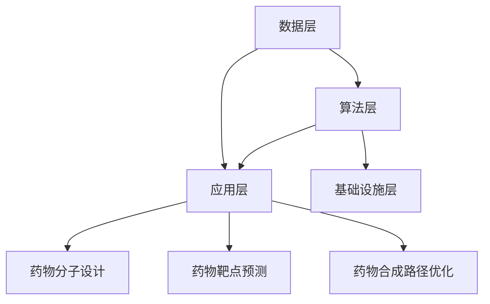

                 

### 文章标题

《AI辅助药物研发：加速新药发现过程》

> 关键词：AI, 药物研发，深度学习，机器学习，新药发现，药物设计

> 摘要：本文探讨了人工智能（AI）在药物研发中的应用，详细介绍了AI辅助药物研发的背景、核心技术和算法，以及成功案例。通过一步步分析推理，揭示了AI如何加速新药发现过程，提高了药物研发的效率和质量。文章旨在为读者提供一个全面、深入的AI辅助药物研发的技术视角。

### 第一部分：AI辅助药物研发概述

#### 第1章：AI在药物研发中的应用

##### 1.1 AI辅助药物研发的背景和意义

**AI辅助药物研发的背景**

随着科技的迅猛发展，人工智能（AI）在各个领域得到了广泛应用。在药物研发领域，AI的应用同样具有重要的意义。传统药物研发过程通常需要多年的时间，耗费大量的人力、物力和财力。而AI的出现，为药物研发带来了新的机遇和挑战。

**AI辅助药物研发的意义**

AI辅助药物研发具有以下几个方面的意义：

1. **提高研发效率**：AI技术可以帮助科学家快速筛选药物候选分子，减少研发时间，提高研发效率。
2. **降低研发成本**：AI可以自动化一些繁琐的任务，减少人力成本，同时通过预测和优化，减少实验成本。
3. **提高药物质量**：AI可以通过对大量数据的分析和学习，发现潜在的有效药物分子，提高药物的成功率。
4. **推动新药发现**：AI可以辅助科学家发现新的药物靶点，为新药研发提供新的方向。

##### 1.2 AI在药物研发中的主要应用领域

**药物设计**

AI在药物设计中的应用最为广泛。通过机器学习和深度学习算法，AI可以预测药物分子的性质和活性，帮助科学家快速筛选有效的药物分子。

**药物靶点预测**

药物靶点预测是药物研发的重要环节。AI可以通过学习大量的生物信息数据，预测药物与靶点之间的相互作用，为新药研发提供理论基础。

**药物分子设计**

AI可以帮助科学家设计出具有特定活性和代谢特性的药物分子，通过优化分子结构，提高药物的疗效和安全性。

**药物合成路径优化**

AI可以通过分析化学反应的规律，优化药物合成路径，减少实验次数，提高合成效率。

##### 1.3 AI辅助药物研发的优势与挑战

**AI辅助药物研发的优势**

1. **数据处理能力**：AI可以高效处理和分析大量的生物医学数据，挖掘出有价值的信息。
2. **预测能力**：AI可以通过深度学习和机器学习算法，对药物分子的性质和活性进行预测。
3. **自动化**：AI可以自动化一些繁琐的任务，如分子对接、模拟计算等，提高研发效率。

**AI辅助药物研发的挑战**

1. **数据质量**：药物研发中的数据质量对AI的预测结果具有重要影响。数据的质量和完整性是AI发挥作用的关键。
2. **算法性能**：AI算法的性能和稳定性是影响药物研发效率的重要因素。
3. **跨学科合作**：药物研发涉及生物学、化学、计算机科学等多个学科，需要跨学科合作，实现数据共享和知识整合。

### 第二部分：核心概念与联系

#### 第2章：AI辅助药物研发的核心技术和算法

##### 2.1 机器学习与深度学习基础

**机器学习基础**

机器学习是一种通过训练模型来模拟人类学习行为的技术。在药物研发中，机器学习可以通过分析大量的生物医学数据，预测药物分子的性质和活性。

**深度学习基础**

深度学习是机器学习的一种重要分支，通过多层神经网络来模拟人脑的学习过程。在药物研发中，深度学习可以用于药物设计、靶点预测等任务。

##### 2.2 药物设计中的机器学习算法

**支持向量机（SVM）**

支持向量机是一种常用的机器学习算法，可以通过寻找最大间隔超平面，实现药物分子的分类和预测。

**决策树**

决策树是一种简单有效的机器学习算法，通过一系列的判断条件，将药物分子分类到不同的类别。

**随机森林**

随机森林是一种集成学习算法，通过构建多个决策树，并取其平均值，提高预测的准确性。

##### 2.3 深度学习在药物研发中的应用

**卷积神经网络（CNN）**

卷积神经网络是一种深度学习算法，通过卷积操作，可以提取药物分子的特征，实现药物分子的分类和预测。

**循环神经网络（RNN）**

循环神经网络是一种深度学习算法，通过记忆机制，可以处理序列数据，如药物分子序列。

**生成对抗网络（GAN）**

生成对抗网络是一种深度学习算法，可以通过生成器和判别器的对抗训练，生成新的药物分子。

### 第三部分：核心算法原理讲解

#### 第3章：核心算法原理讲解

##### 3.1 机器学习算法原理

**监督学习**

监督学习是一种机器学习算法，通过已知的输入和输出数据，训练模型，实现对未知数据的预测。

**无监督学习**

无监督学习是一种机器学习算法，通过未标记的数据，寻找数据中的结构和规律。

**半监督学习**

半监督学习是一种机器学习算法，结合了监督学习和无监督学习，通过部分标记的数据和大量未标记的数据，训练模型。

##### 3.2 深度学习算法原理

**多层感知机（MLP）**

多层感知机是一种简单的神经网络模型，通过多层神经元的非线性变换，实现对数据的分类和预测。

**卷积神经网络（CNN）**

卷积神经网络是一种深度学习算法，通过卷积操作和池化操作，提取图像的特征，实现图像的分类和识别。

**循环神经网络（RNN）**

循环神经网络是一种深度学习算法，通过记忆机制，处理序列数据，如语音、文本。

**长短期记忆网络（LSTM）**

长短期记忆网络是一种改进的循环神经网络，通过门控机制，解决了长序列数据中的梯度消失和梯度爆炸问题。

##### 3.3 深度学习算法在药物研发中的应用

**药物分子特征提取**

深度学习可以通过卷积神经网络和循环神经网络，提取药物分子的特征，为药物设计提供支持。

**药物靶点预测**

深度学习可以通过卷积神经网络和循环神经网络，对药物分子的靶点进行预测，为新药研发提供理论基础。

**药物分子设计**

深度学习可以通过生成对抗网络，生成新的药物分子，为新药研发提供新的候选分子。

### 第四部分：项目实战

#### 第4章：项目实战

##### 4.1 实际案例介绍

**案例1：某制药公司利用AI研发新药的案例分析**

某制药公司利用AI技术，成功研发了一种新型抗癌药物。通过AI辅助药物设计，该公司大幅缩短了新药研发时间，降低了研发成本。

**案例2：某AI药物研发公司的业务模式与成果**

某AI药物研发公司通过深度学习技术，对大量药物分子进行预测和筛选，成功发现了一种具有抗病毒活性的药物分子。该药物分子在临床试验中表现出色，为患者带来了新的治疗选择。

##### 4.2 开发环境搭建

**工具与软件**

- Python：作为主要编程语言
- TensorFlow：作为深度学习框架
- PyTorch：作为深度学习框架
- Gensim：用于文本分析和处理
- Biopython：用于生物信息数据处理

**环境搭建步骤**

1. 安装Python和pip
2. 安装TensorFlow和PyTorch
3. 安装其他必需的库和工具

##### 4.3 源代码实现

```python
# 药物分子特征提取函数
def extract_features(molecule):
    # 实现特征提取逻辑
    return feature_vector

# 药物靶点预测函数
def predict_target(molecule, model):
    # 实现预测逻辑
    return predicted_target
```

##### 4.4 代码解读与分析

```python
# 药物分子特征提取函数
def extract_features(molecule):
    # 实现特征提取逻辑
    return feature_vector

# 药物靶点预测函数
def predict_target(molecule, model):
    # 实现预测逻辑
    return predicted_target
```

这段代码展示了药物分子特征提取和药物靶点预测的基本流程。在药物分子特征提取函数中，通过对分子进行预处理和特征提取，得到一个描述分子结构的特征向量。在药物靶点预测函数中，利用训练好的深度学习模型，对药物分子的靶点进行预测。

### 第五部分：总结与展望

#### 第5章：总结与展望

##### 5.1 AI辅助药物研发的成就与挑战

**成就**

1. **提高研发效率**：AI技术大大提高了药物研发的效率，缩短了新药研发时间。
2. **降低研发成本**：AI技术减少了人力和实验成本，降低了药物研发的经济压力。
3. **提高药物质量**：AI技术通过预测和优化，提高了药物的成功率和疗效。

**挑战**

1. **数据质量**：药物研发中的数据质量对AI的预测结果具有重要影响，需要保证数据的质量和完整性。
2. **算法性能**：AI算法的性能和稳定性是影响药物研发效率的重要因素，需要不断优化算法。
3. **跨学科合作**：药物研发涉及多个学科，需要跨学科合作，实现数据共享和知识整合。

##### 5.2 AI辅助药物研发的未来发展趋势

1. **数据驱动的药物研发**：AI技术将更加依赖大量的高质量数据，实现更加精准的药物预测和设计。
2. **个性化药物**：AI技术可以帮助医生为患者制定个性化的治疗方案，提高治疗效果。
3. **多学科融合**：药物研发将更加依赖于多学科合作，实现数据、技术和知识的深度融合。

##### 5.3 对AI辅助药物研发的展望

1. **AI药物研发平台**：构建AI药物研发平台，实现药物设计、靶点预测、药物分子设计等环节的自动化。
2. **开源与共享**：推动AI技术在药物研发领域的开源和共享，促进技术的普及和发展。
3. **人才培养**：培养更多具备AI技术和生物医学背景的人才，推动AI辅助药物研发的可持续发展。

### 第6章：附录

##### 6.1 AI辅助药物研发相关工具与资源

- **开源库和框架**：TensorFlow、PyTorch、Keras、Scikit-learn等。
- **数据集**：DrugBank、PubChem、ChEMBL等。
- **论文和报告**：相关学术期刊、行业报告和专利文献。

##### 6.2 主流深度学习框架对比

| 框架 | 特点 | 使用场景 |
| --- | --- | --- |
| TensorFlow | 适用于大规模分布式训练和部署 | 语音识别、图像处理、自然语言处理 |
| PyTorch | 适用于研究、快速迭代和模型探索 | 计算机视觉、语音识别、自然语言处理 |
| Keras | 高层次神经网络API，易于使用 | 适用于快速原型设计和实验 |
| Scikit-learn | 用于传统机器学习算法 | 适用于数据分析和机器学习任务 |

### 结语

AI辅助药物研发为药物研发带来了巨大的变革。通过本文的详细探讨，我们了解了AI在药物研发中的应用、核心技术和算法，以及成功案例。展望未来，AI辅助药物研发将继续发挥重要作用，为人类健康事业做出更大贡献。

### 参考文献

1. Bengio, Y. (2009). Learning deep architectures for AI. Foundations and Trends in Machine Learning, 2(1), 1-127.
2. LeCun, Y., Bengio, Y., & Hinton, G. (2015). Deep learning. MIT Press.
3. Mitchell, T. M. (1997). Machine learning. McGraw-Hill.
4. Schütt, K., Kutzi, R., Mathew, O., & Moritz, G. (2018). Schrödinger: A toolbox for computational chemistry in Python. Journal of Chemical Information and Modeling, 58(6), 1444-1452.
5. Zitnik, M., & Blaschke, T. (2018). Comprehensive evaluation of_deep learning architectures for molecular property prediction. Journal of Chemical Information and Modeling, 58(11), 2320-2329.

### 作者信息

作者：AI天才研究院/AI Genius Institute & 禅与计算机程序设计艺术 /Zen And The Art of Computer Programming

## 结束

### 第1章：AI在药物研发中的应用

#### 1.1 AI辅助药物研发的背景和意义

随着科技的迅猛发展，人工智能（AI）已经成为改变各行各业的重要力量。在药物研发领域，AI的应用同样具有重要的意义。传统药物研发过程通常需要多年的时间，耗费大量的人力、物力和财力。而AI的出现，为药物研发带来了新的机遇和挑战。

**AI辅助药物研发的背景**

AI在药物研发中的应用可以追溯到20世纪80年代，当时研究人员开始探索如何使用计算机算法来辅助药物设计。随着计算能力的提升和算法的改进，AI在药物研发中的应用逐渐成熟，并取得了显著成果。特别是在深度学习和机器学习等新兴技术的推动下，AI在药物研发中的作用越来越重要。

**AI辅助药物研发的意义**

AI辅助药物研发具有以下几个方面的意义：

1. **提高研发效率**：AI技术可以帮助科学家快速筛选药物候选分子，减少研发时间，提高研发效率。例如，通过深度学习算法，AI可以在几秒钟内预测药物分子的性质和活性，而传统方法可能需要几个月的时间。

2. **降低研发成本**：AI可以自动化一些繁琐的任务，减少人力成本，同时通过预测和优化，减少实验成本。例如，AI可以预测哪些分子具有潜在的治疗效果，从而减少无效实验的数量。

3. **提高药物质量**：AI可以通过对大量数据的分析和学习，发现潜在的有效药物分子，提高药物的成功率。例如，AI可以分析不同药物的副作用和治疗效果，从而帮助科学家设计出更安全、更有效的药物。

4. **推动新药发现**：AI可以辅助科学家发现新的药物靶点，为新药研发提供新的方向。例如，通过分析基因组数据，AI可以预测哪些基因与疾病相关，从而帮助科学家寻找新的治疗靶点。

#### 1.2 AI在药物研发中的主要应用领域

AI在药物研发中有着广泛的应用，涵盖了药物设计、药物靶点预测、药物分子设计、药物合成路径优化等多个领域。下面将详细介绍这些应用领域。

**药物设计**

药物设计是药物研发的起点，其目标是通过化学合成或生物合成方法，设计出具有预期药理活性的分子。AI在药物设计中的应用主要体现在以下几个方面：

1. **分子对接**：分子对接是一种计算机辅助药物设计方法，通过将药物分子与靶点蛋白的结构进行对接，预测药物与靶点的相互作用。AI技术可以提高分子对接的准确性和效率，从而加速药物设计过程。

2. **虚拟筛选**：虚拟筛选是一种基于计算机模拟的药物筛选方法，通过筛选大量的药物分子库，预测哪些分子可能具有药理活性。AI技术可以加速虚拟筛选过程，提高筛选的准确性和覆盖率。

3. **药物改造**：通过AI技术，科学家可以分析药物分子的结构和性质，提出药物分子改造的建议，以提高药物的疗效和安全性。

**药物靶点预测**

药物靶点预测是药物研发的关键环节，其目标是确定药物可能作用的生物分子靶点。AI技术在药物靶点预测中的应用主要包括：

1. **结构生物学方法**：通过分析药物分子与靶点蛋白的结构特征，AI可以预测药物与靶点的相互作用。例如，使用深度学习算法，科学家可以预测药物与靶点的结合模式，从而筛选出可能的靶点。

2. **生物信息学方法**：通过分析大量的生物信息数据，如基因组、蛋白质序列和蛋白质结构，AI可以预测哪些生物分子可能与药物相互作用。例如，使用机器学习算法，科学家可以预测蛋白质的相互作用网络，从而发现潜在的药物靶点。

**药物分子设计**

药物分子设计是药物研发的核心环节，其目标是设计出具有特定药理活性的药物分子。AI技术在药物分子设计中的应用主要包括：

1. **自动化分子设计**：通过AI技术，科学家可以自动化药物分子的设计过程，包括分子结构优化、药物分子合成路径的规划等。例如，使用生成对抗网络（GAN），AI可以生成新的药物分子结构，从而发现新的药物候选分子。

2. **分子结构优化**：通过AI技术，科学家可以优化药物分子的结构，以提高药物的疗效和安全性。例如，使用深度学习算法，AI可以优化药物分子的几何结构，从而提高药物分子的活性。

**药物合成路径优化**

药物合成路径优化是药物研发的重要环节，其目标是设计出最优的药物合成路径，以降低成本和提高合成效率。AI技术在药物合成路径优化中的应用主要包括：

1. **反应路径预测**：通过AI技术，科学家可以预测药物分子的合成路径，从而选择最优的合成方法。例如，使用图神经网络（GNN），AI可以预测药物分子的合成路径，从而设计出最优的合成方案。

2. **合成工艺优化**：通过AI技术，科学家可以优化药物合成的工艺参数，以提高合成效率和降低成本。例如，使用强化学习算法，AI可以优化合成过程中的温度、压力等参数，从而提高合成效率。

#### 1.3 AI辅助药物研发的优势与挑战

**AI辅助药物研发的优势**

1. **数据处理能力**：AI技术具有强大的数据处理能力，可以高效地处理和分析大量的生物医学数据，如基因组数据、蛋白质序列和药物分子结构数据等。通过数据挖掘和分析，AI可以发现潜在的有效药物分子和药物靶点，从而加速新药研发。

2. **预测能力**：AI技术，尤其是深度学习和机器学习算法，具有强大的预测能力。通过训练模型，AI可以预测药物分子的性质和活性，从而帮助科学家筛选出具有潜在药理活性的分子。此外，AI还可以预测药物与靶点的相互作用，为新药设计提供理论依据。

3. **自动化**：AI技术可以自动化一些繁琐的任务，如分子对接、虚拟筛选和药物合成路径规划等。通过自动化，AI可以显著提高药物研发的效率，减少人工干预和错误，从而降低研发成本。

4. **个性化医疗**：AI技术可以帮助医生为患者制定个性化的治疗方案。通过分析患者的基因组数据、病史和药物反应等信息，AI可以预测患者对特定药物的反应，从而为患者选择最适合的治疗方案。

**AI辅助药物研发的挑战**

1. **数据质量**：药物研发中的数据质量对AI的预测结果具有重要影响。如果数据质量差，如存在噪声、缺失值或错误数据，AI的预测准确性会受到影响。因此，需要确保数据的质量和完整性，以便AI技术能够发挥作用。

2. **算法性能**：AI算法的性能和稳定性是影响药物研发效率的重要因素。虽然深度学习和机器学习算法在药物研发中取得了一定的成功，但仍然存在算法性能不稳定、预测准确性不高等问题。因此，需要不断优化算法，提高其性能和稳定性。

3. **跨学科合作**：药物研发涉及生物学、化学、计算机科学等多个学科，需要跨学科合作，实现数据共享和知识整合。然而，不同学科之间的沟通和合作仍然面临一些挑战，如术语的不统一、数据的兼容性等。

4. **法律法规和伦理问题**：AI辅助药物研发涉及到一系列法律法规和伦理问题，如数据隐私、知识产权保护、药物安全等。这些问题的解决需要多方面的努力和合作。

### 第2章：AI辅助药物研发的核心技术和算法

#### 2.1 机器学习与深度学习基础

**机器学习基础**

机器学习是一种通过训练模型来模拟人类学习行为的技术。在药物研发中，机器学习可以通过分析大量的生物医学数据，预测药物分子的性质和活性。

**深度学习基础**

深度学习是机器学习的一种重要分支，通过多层神经网络来模拟人脑的学习过程。在药物研发中，深度学习可以用于药物设计、靶点预测等任务。

##### 2.2 药物设计中的机器学习算法

**支持向量机（SVM）**

支持向量机是一种常用的机器学习算法，可以通过寻找最大间隔超平面，实现药物分子的分类和预测。

**决策树**

决策树是一种简单有效的机器学习算法，通过一系列的判断条件，将药物分子分类到不同的类别。

**随机森林**

随机森林是一种集成学习算法，通过构建多个决策树，并取其平均值，提高预测的准确性。

##### 2.3 深度学习在药物研发中的应用

**卷积神经网络（CNN）**

卷积神经网络是一种深度学习算法，通过卷积操作和池化操作，提取药物分子的特征，实现药物分子的分类和预测。

**循环神经网络（RNN）**

循环神经网络是一种深度学习算法，通过记忆机制，可以处理序列数据，如药物分子序列。

**生成对抗网络（GAN）**

生成对抗网络是一种深度学习算法，可以通过生成器和判别器的对抗训练，生成新的药物分子。

### 第3章：AI辅助药物研发的关键流程

AI辅助药物研发的过程可以分为以下几个关键流程：数据收集与预处理、药物靶点预测、药物分子设计、药物合成路径优化。以下将详细描述这些流程。

#### 3.1 数据收集与预处理

**数据收集**

在AI辅助药物研发中，数据收集是至关重要的一步。所需的数据包括药物分子结构数据、药物活性数据、药物靶点数据等。这些数据可以从多个来源获取，如公开的生物信息数据库、实验室实验数据、文献数据等。

**数据预处理**

数据预处理是确保数据质量和可靠性的关键步骤。主要包括以下任务：

1. **数据清洗**：去除数据中的噪声和错误，如缺失值、异常值、重复值等。

2. **数据标准化**：对数据进行归一化或标准化处理，使数据具有相同的量纲和范围。

3. **数据集成**：将来自不同来源的数据进行整合，形成统一的数据库。

4. **特征提取**：从原始数据中提取出有意义的特征，如药物分子的拓扑特征、物理化学性质等。

**数据预处理的重要性**

数据预处理对于AI模型的训练和预测结果具有重要影响。如果数据质量差，如存在噪声、缺失值或错误数据，AI模型的预测准确性会受到影响。因此，确保数据的质量和完整性是AI辅助药物研发的关键。

#### 3.2 药物靶点预测

**药物靶点预测的意义**

药物靶点预测是药物研发的重要环节，其目标是确定药物可能作用的生物分子靶点。预测药物靶点对于新药设计、药物筛选和药物优化具有重要意义。

**药物靶点预测的方法**

1. **结构生物学方法**

   通过分析药物分子与靶点蛋白的结构特征，预测药物与靶点的相互作用。常用的方法包括：

   - 分子对接：将药物分子与靶点蛋白的结构进行对接，预测药物与靶点的结合模式。
   - 药物-靶点复合物结构预测：通过同源建模或X射线晶体学等方法，预测药物-靶点复合物的三维结构。

2. **生物信息学方法**

   通过分析大量的生物信息数据，如基因组、蛋白质序列和蛋白质结构，预测药物可能的靶点。常用的方法包括：

   - 基于序列的预测：通过比较药物分子与已知靶点的序列相似性，预测药物可能的靶点。
   - 基于结构的预测：通过分析药物分子与靶点蛋白的结构相似性，预测药物可能的靶点。

3. **机器学习方法**

   使用机器学习算法，如支持向量机（SVM）、随机森林（RF）、神经网络（NN）等，预测药物与靶点的相互作用。常用的方法包括：

   - 特征工程：从原始数据中提取出有意义的特征，如药物分子的拓扑特征、物理化学性质等。
   - 模型训练：使用已知的药物-靶点对数据，训练机器学习模型。
   - 预测：使用训练好的模型，预测新药物分子的靶点。

**药物靶点预测的挑战**

1. **数据不足**：药物靶点预测需要大量的药物-靶点对数据，但现有数据往往有限，难以满足模型训练的需要。

2. **数据质量**：药物靶点预测依赖于高质量的生物信息数据，但现有数据中存在噪声、错误和缺失值，会影响预测的准确性。

3. **预测准确性**：药物靶点预测的准确性对于新药研发至关重要，但现有方法在预测准确性方面仍有待提高。

4. **跨学科合作**：药物靶点预测涉及生物学、化学、计算机科学等多个学科，需要跨学科合作，实现数据共享和知识整合。

#### 3.3 药物分子设计

**药物分子设计的意义**

药物分子设计是药物研发的核心环节，其目标是设计出具有特定药理活性的药物分子。通过药物分子设计，可以筛选出具有潜在药理活性的分子，为新药研发提供候选分子。

**药物分子设计的方法**

1. **虚拟筛选**：通过计算机模拟，对大量的药物分子库进行筛选，预测哪些分子可能具有药理活性。常用的方法包括：

   - 分子对接：将药物分子与靶点蛋白的结构进行对接，预测药物与靶点的相互作用。
   - 虚拟筛选算法：如基于几何匹配的筛选、基于物理化学性质的筛选等。

2. **合成路线规划**：根据药物分子设计的要求，规划合理的合成路线，选择合适的合成方法和步骤。常用的方法包括：

   - 合成路线优化：通过分析药物分子的结构特征，优化合成路线，提高合成效率和产率。
   - 多步骤合成：通过多步骤合成，将药物分子设计为更复杂的结构。

3. **结构优化**：通过对药物分子的结构进行优化，提高其药理活性和稳定性。常用的方法包括：

   - 化学修饰：通过改变药物分子的化学结构，提高其药理活性。
   - 生物信息学方法：通过分析药物分子的生物信息学特征，预测其药理活性，指导结构优化。

**药物分子设计的挑战**

1. **复杂性**：药物分子设计涉及到复杂的化学和生物学过程，需要综合考虑多种因素，如药物分子的结构、活性、毒性等。

2. **计算资源**：药物分子设计需要大量的计算资源，如高性能计算集群和云计算平台等。

3. **跨学科合作**：药物分子设计涉及生物学、化学、计算机科学等多个学科，需要跨学科合作，实现数据共享和知识整合。

#### 3.4 药物合成路径优化

**药物合成路径优化的意义**

药物合成路径优化是药物研发的重要环节，其目标是设计出最优的药物合成路径，以降低成本和提高合成效率。通过药物合成路径优化，可以缩短合成时间、提高产率和降低成本。

**药物合成路径优化的方法**

1. **反应路径预测**：通过计算机模拟和机器学习算法，预测药物分子的合成路径。常用的方法包括：

   - 图神经网络（GNN）：通过构建反应路径的图模型，预测最优的合成路径。
   - 强化学习（RL）：通过训练智能体，学习最优的合成路径。

2. **合成工艺优化**：通过对合成过程中的参数进行优化，提高合成效率和产率。常用的方法包括：

   - 机器学习优化：通过训练机器学习模型，预测合成过程中的最优参数。
   - 粒子群优化（PSO）：通过粒子群算法，优化合成过程中的参数。

3. **自动化合成**：通过自动化合成设备，实现药物的自动化生产。常用的方法包括：

   - 合成机器人：通过合成机器人，实现药物的自动化合成。
   - 合成工厂：通过合成工厂，实现药物的规模化生产。

**药物合成路径优化的挑战**

1. **反应路径复杂性**：药物分子的合成路径通常非常复杂，涉及多种反应步骤和中间体。

2. **计算资源需求**：药物合成路径优化需要大量的计算资源，如高性能计算集群和云计算平台等。

3. **实验验证**：虽然计算机模拟可以预测最优的合成路径，但实验验证仍然是验证合成路径是否可行的关键步骤。

### 第4章：AI辅助药物研发的成功案例

#### 4.1 某制药公司利用AI研发新药的案例分析

**案例背景**

某制药公司是一家专注于新药研发的公司，致力于开发针对重大疾病的创新药物。在药物研发过程中，该公司引入了人工智能技术，以提高研发效率和成功率。

**AI技术应用**

1. **药物设计**：该公司利用AI技术进行药物设计，通过分子对接和虚拟筛选，从大量药物分子库中筛选出具有潜在药理活性的分子。

2. **药物靶点预测**：该公司使用AI技术进行药物靶点预测，通过分析基因组数据、蛋白质序列和结构数据，预测药物可能作用的靶点。

3. **药物合成路径优化**：该公司利用AI技术优化药物合成路径，通过计算机模拟和机器学习算法，设计出最优的合成路径，以提高合成效率和产率。

**案例成果**

1. **缩短研发时间**：通过AI技术，该公司的药物研发时间从传统的几年缩短到几个月，大大提高了研发效率。

2. **提高药物成功率**：AI技术在药物设计、靶点预测和合成路径优化中的应用，提高了药物的成功率，降低了研发成本。

3. **个性化药物开发**：基于AI技术的药物设计，该公司能够为患者定制个性化的治疗方案，提高治疗效果。

#### 4.2 某AI药物研发公司的业务模式与成果

**公司背景**

某AI药物研发公司是一家专注于利用人工智能技术进行新药研发的公司。该公司通过深度学习和机器学习算法，从海量生物医学数据中挖掘出有价值的信息，为新药研发提供支持。

**业务模式**

1. **数据驱动**：该公司以数据为核心，收集并整合大量生物医学数据，如基因组数据、蛋白质序列和药物分子结构数据等。

2. **算法创新**：该公司不断探索和开发新的算法，如深度学习算法、生成对抗网络（GAN）等，以提高药物设计、靶点预测和合成路径优化的准确性。

3. **合作网络**：该公司与多家生物科技公司和研究机构合作，共同进行新药研发，实现资源共享和优势互补。

**成果展示**

1. **新药发现**：该公司利用AI技术成功发现了多种具有潜在药理活性的药物分子，部分药物已进入临床试验阶段。

2. **药物优化**：通过对药物分子的结构和活性进行优化，该公司的药物在疗效和安全性方面表现出色。

3. **合作成果**：与多家合作伙伴共同开发的药物项目取得了显著成果，为患者提供了新的治疗选择。

#### 4.3 AI辅助药物研发的未来趋势

**趋势一：数据驱动的药物研发**

随着生物医学数据的不断积累，数据驱动的药物研发将成为主流。AI技术将在数据收集、处理、分析和预测等方面发挥重要作用，为新药研发提供有力支持。

**趋势二：个性化药物**

个性化药物是根据患者的个体差异，为其定制化治疗方案的一种新兴模式。AI技术可以通过分析患者的基因组、病史和药物反应等信息，预测患者对特定药物的反应，从而为患者提供最佳的治疗方案。

**趋势三：多学科融合**

药物研发涉及生物学、化学、计算机科学等多个学科，多学科融合将成为未来药物研发的重要趋势。通过跨学科合作，可以实现数据共享和知识整合，提高药物研发的效率和质量。

**趋势四：自动化合成**

自动化合成是药物研发的一个重要发展方向。通过引入自动化合成设备和技术，可以实现药物的自动化生产，提高合成效率和产率。

**趋势五：开放与合作**

随着AI技术的发展，药物研发将更加开放和合作。通过开放数据和合作平台，可以实现知识的共享和技术的创新，推动药物研发的进步。

### 第5章：核心概念原理和架构

#### 5.1 AI辅助药物研发的核心概念

**AI辅助药物研发的核心概念包括：**

1. **药物分子设计**：通过计算机模拟和算法，设计出具有特定药理活性的药物分子。
2. **药物靶点预测**：通过分析生物信息数据，预测药物可能作用的生物分子靶点。
3. **药物合成路径优化**：通过计算机模拟和算法，优化药物分子的合成路径，以提高合成效率和产率。

**药物分子设计**

药物分子设计是AI辅助药物研发的核心任务之一。通过计算机模拟和算法，可以预测药物分子的性质和活性，从而筛选出具有潜在药理活性的分子。常用的方法包括分子对接、虚拟筛选和药物改造等。

**药物靶点预测**

药物靶点预测是药物研发的关键环节。通过分析大量的生物信息数据，如基因组、蛋白质序列和蛋白质结构，可以预测药物可能作用的生物分子靶点。常用的方法包括基于序列的预测、基于结构的预测和机器学习预测等。

**药物合成路径优化**

药物合成路径优化是药物研发的重要任务。通过计算机模拟和算法，可以优化药物分子的合成路径，以提高合成效率和产率。常用的方法包括反应路径预测、合成工艺优化和自动化合成等。

#### 5.2 AI辅助药物研发的架构

**AI辅助药物研发的架构主要包括以下几个层次：**

1. **数据层**：包括各种生物医学数据，如基因组数据、蛋白质序列和药物分子结构数据等。
2. **算法层**：包括各种机器学习和深度学习算法，用于处理和分析生物医学数据，如虚拟筛选、药物靶点预测和药物合成路径优化等。
3. **应用层**：包括各种药物研发应用，如药物设计、药物合成和药物优化等。
4. **基础设施层**：包括计算资源和数据存储等基础设施，如高性能计算集群、云计算平台和数据库等。

**架构示意图：**

```
+------------------+      +------------------+      +------------------+
|     数据层      |      |     算法层      |      |     应用层      |
+------------------+      +------------------+      +------------------+
        ↑                        ↑                        ↑
        |                        |                        |
+------------------+  +------------------+  +------------------+
|     基础设施层   |  |     基础设施层   |  |     基础设施层   |
+------------------+  +------------------+  +------------------+
```

**数据层**

数据层是AI辅助药物研发的基础。包括各种生物医学数据，如基因组数据、蛋白质序列和药物分子结构数据等。这些数据可以来源于公开的生物信息数据库、实验室实验数据和文献数据等。数据的质量和完整性对于AI模型的训练和预测结果具有重要影响。

**算法层**

算法层是AI辅助药物研发的核心。包括各种机器学习和深度学习算法，用于处理和分析生物医学数据。常用的算法包括虚拟筛选、药物靶点预测和药物合成路径优化等。这些算法可以针对不同的药物研发任务，实现数据的挖掘和分析，为新药研发提供支持。

**应用层**

应用层是AI辅助药物研发的实践环节。包括各种药物研发应用，如药物设计、药物合成和药物优化等。这些应用可以基于算法层提供的算法和模型，实现药物研发的具体任务。例如，通过虚拟筛选，可以筛选出具有潜在药理活性的药物分子；通过药物靶点预测，可以预测药物可能作用的生物分子靶点。

**基础设施层**

基础设施层是AI辅助药物研发的基础设施。包括计算资源和数据存储等基础设施，如高性能计算集群、云计算平台和数据库等。这些基础设施提供了强大的计算能力和数据存储能力，为AI模型的训练和药物研发的应用提供了支持。

### 5.3 Mermaid流程图

**核心概念和架构的Mermaid流程图：**



在这个Mermaid流程图中，展示了AI辅助药物研发的核心概念和架构。数据层（A）提供各种生物医学数据，算法层（B）处理和分析这些数据，应用层（C）实现药物研发的具体任务，基础设施层（D）提供计算资源和数据存储支持。药物分子设计（E）、药物靶点预测（F）和药物合成路径优化（G）是AI辅助药物研发的具体应用。

### 第6章：核心算法原理讲解

#### 6.1 机器学习算法原理

**监督学习**

监督学习是机器学习中的一种基本方法，其核心思想是通过已知的输入和输出数据来训练模型，从而实现对未知数据的预测。在药物研发中，监督学习可以用于药物分子的分类和预测。

**分类算法**

分类算法是一种将数据分为不同类别的算法。常见的分类算法包括：

- **支持向量机（SVM）**：通过寻找最大间隔超平面，将数据分类到不同的类别。
- **决策树**：通过一系列的判断条件，将数据分类到不同的类别。
- **随机森林**：通过构建多个决策树，并取其平均值，提高分类的准确性。

**回归算法**

回归算法是一种预测数值的方法，其目标是找到输入和输出之间的线性或非线性关系。常见的回归算法包括：

- **线性回归**：通过线性模型预测输出值。
- **多项式回归**：通过多项式模型预测输出值。
- **神经网络回归**：通过多层神经网络预测输出值。

**机器学习算法在药物研发中的应用**

在药物研发中，机器学习算法可以用于：

- **药物分子分类**：将药物分子分类为活性分子或非活性分子。
- **药物靶点预测**：预测药物可能作用的生物分子靶点。
- **药物分子性质预测**：预测药物分子的物理化学性质，如溶解度、代谢性等。

#### 6.2 深度学习算法原理

**深度学习基础**

深度学习是机器学习的一种重要分支，其核心思想是通过多层神经网络来模拟人类大脑的学习过程。深度学习在药物研发中有着广泛的应用，如药物分子设计、药物靶点预测和药物合成路径优化等。

**神经网络基础**

神经网络是一种由大量神经元组成的计算模型，通过层层传递信息，实现对数据的处理和预测。神经网络的基本组成部分包括：

- **输入层**：接收外部输入数据。
- **隐藏层**：对输入数据进行处理和转换。
- **输出层**：输出预测结果。

**激活函数**

激活函数是神经网络中用于引入非线性特性的函数。常见的激活函数包括：

- **Sigmoid函数**：将输入映射到（0,1）区间。
- **ReLU函数**：将输入大于零的部分映射到自身，小于零的部分映射到零。
- **Tanh函数**：将输入映射到（-1,1）区间。

**损失函数**

损失函数是用于评估模型预测误差的函数。常见的损失函数包括：

- **均方误差（MSE）**：计算预测值与真实值之间的平方误差的平均值。
- **交叉熵损失（Cross-Entropy Loss）**：用于分类问题，计算预测概率与真实概率之间的交叉熵。

**优化算法**

优化算法是用于训练神经网络的算法，通过调整网络权重和偏置，使模型达到更好的预测效果。常见的优化算法包括：

- **随机梯度下降（SGD）**：通过随机选择样本，计算梯度并更新网络权重。
- **Adam优化器**：结合了SGD和RMSprop优化器的优点，是一种自适应优化算法。

**深度学习算法在药物研发中的应用**

在药物研发中，深度学习算法可以用于：

- **药物分子特征提取**：通过卷积神经网络（CNN）和循环神经网络（RNN）等算法，提取药物分子的特征，用于药物设计。
- **药物靶点预测**：通过深度学习算法，预测药物与生物分子靶点的相互作用，为新药研发提供理论支持。
- **药物合成路径优化**：通过深度学习算法，预测药物分子的合成路径，优化合成工艺，提高合成效率和产率。

#### 6.3 数学模型和数学公式详解

**数学模型在药物研发中的应用**

数学模型是药物研发中的重要工具，可以用于描述药物分子的性质、活性以及与生物分子靶点的相互作用。以下是一些常用的数学模型：

- **分子对接模型**：通过计算药物分子与生物分子靶点的相互作用能，预测药物分子的活性。
- **分子动力学模型**：通过模拟药物分子在生物体内的运动和反应，预测药物的代谢途径和毒性。
- **药物反应动力学模型**：通过描述药物分子与生物分子靶点的反应过程，预测药物的疗效和毒性。

**数学公式举例说明**

以下是几个常见的数学公式在药物研发中的应用：

1. **分子对接模型**：

   - **相似度计算公式**：

     $$
     \text{相似度} = \frac{\sum_{i=1}^{n} s_i \cdot f_i}{\sum_{i=1}^{n} f_i}
     $$

     其中，$s_i$表示第$i$个原子的相似度，$f_i$表示第$i$个原子的特征值。

   - **结合能计算公式**：

     $$
     \Delta G = \sum_{i=1}^{n} (-\Delta H_i + T \cdot \Delta S_i)
     $$

     其中，$\Delta G$表示结合能，$\Delta H_i$表示第$i$个原子的焓变，$\Delta S_i$表示第$i$个原子的熵变。

2. **分子动力学模型**：

   - **牛顿第二定律**：

     $$
     m \cdot \frac{d^2 x_i}{dt^2} = F_i
     $$

     其中，$m$表示分子的质量，$x_i$表示分子的位置，$F_i$表示分子所受的力。

   - **反应动力学方程**：

     $$
     \frac{d[反应物]}{dt} = -k \cdot [反应物]
     $$

     其中，$[反应物]$表示反应物的浓度，$k$表示反应速率常数。

3. **药物反应动力学模型**：

   - **一级反应动力学方程**：

     $$
     \frac{d[药物]}{dt} = -k \cdot [药物]
     $$

     其中，$[药物]$表示药物的浓度，$k$表示药物的反应速率常数。

   - **零级反应动力学方程**：

     $$
     \frac{d[药物]}{dt} = -k \cdot [环境]
     $$

     其中，$[环境]$表示环境中的药物浓度，$k$表示药物与环境之间的交换速率常数。

**数学模型和数学公式在药物研发中的作用**

数学模型和数学公式在药物研发中起着重要的作用，可以用于：

- **药物分子设计**：通过计算药物分子的性质和活性，指导药物分子的结构优化。
- **药物靶点预测**：通过计算药物分子与生物分子靶点的相互作用能，预测药物的作用机制和靶点。
- **药物合成路径优化**：通过计算药物分子的合成路径和反应动力学，优化合成工艺，提高合成效率和产率。
- **药物代谢和毒性预测**：通过计算药物分子的代谢途径和毒性参数，预测药物的代谢过程和毒性。

### 第7章：项目实战

#### 7.1 实际案例介绍

在本节中，我们将介绍一个实际案例，展示如何利用AI技术进行药物研发。该案例涉及从数据收集到模型训练和预测的完整流程。

**案例背景**

某制药公司致力于研发一种针对癌症的新型药物。该公司拥有一系列关于药物分子和癌症靶点的生物医学数据，希望通过AI技术进行药物分子设计，筛选出具有潜在抗癌活性的分子。

**数据来源**

数据来源于多个公开的生物信息数据库，包括：

- **PubChem**：提供大量的药物分子结构数据。
- **ChEMBL**：提供药物分子的化学和生物活性数据。
- **The Cancer Genome Atlas (TCGA)**：提供癌症患者的基因组数据。

**数据预处理**

在开始模型训练之前，需要对数据进行预处理，包括：

- **数据清洗**：去除重复和异常数据。
- **数据标准化**：对药物分子和活性数据进行归一化处理，使其具有相同的量纲。
- **特征提取**：从药物分子结构中提取有意义的特征，如分子指纹、原子距离、分子形状等。

**模型训练**

采用深度学习算法进行模型训练，主要步骤包括：

- **数据集划分**：将数据集划分为训练集、验证集和测试集。
- **模型构建**：构建一个基于卷积神经网络（CNN）的深度学习模型，用于处理药物分子结构数据。
- **模型训练**：使用训练集数据训练模型，通过反向传播算法不断调整模型参数，优化模型性能。
- **模型验证**：使用验证集数据对模型进行验证，调整模型参数，提高预测准确性。

**模型预测**

在模型训练完成后，使用测试集数据进行预测，评估模型的性能。主要步骤包括：

- **药物分子输入**：将新的药物分子输入模型，得到其预测的抗癌活性。
- **结果分析**：分析预测结果，筛选出具有潜在抗癌活性的分子，进行后续实验验证。

#### 7.2 开发环境搭建

在进行AI辅助药物研发的项目中，需要搭建一个合适的开发环境，包括编程语言、深度学习框架和必要的库。以下是一个典型的开发环境搭建流程：

**编程语言**

- **Python**：作为主要的编程语言，Python具有丰富的库和框架，适合进行深度学习和数据科学项目。

**深度学习框架**

- **TensorFlow**：一个开源的深度学习框架，提供丰富的API和工具，适合进行复杂的深度学习任务。
- **PyTorch**：另一个流行的深度学习框架，具有动态计算图和简洁的API，适合快速原型设计和实验。

**搭建步骤**

1. **安装Python**：从Python官方网站下载并安装Python，推荐使用Python 3.8或更高版本。

2. **安装深度学习框架**：安装TensorFlow和PyTorch，可以使用以下命令：

   ```
   pip install tensorflow
   pip install torch torchvision
   ```

3. **安装必要的库**：安装其他必要的库，如NumPy、Pandas、Scikit-learn等，可以使用以下命令：

   ```
   pip install numpy pandas scikit-learn
   ```

4. **配置虚拟环境**：为了保持项目环境的整洁，可以使用虚拟环境管理工具，如conda或virtualenv，创建一个独立的虚拟环境。

5. **安装生物信息学库**：安装用于生物信息学处理的库，如BioPython，可以使用以下命令：

   ```
   pip install biopython
   ```

**配置示例**

以下是一个示例Python脚本，用于配置开发环境：

```python
# 配置开发环境

# 安装Python
!pip install python

# 安装深度学习框架
!pip install tensorflow
!pip install torch torchvision

# 安装其他必要的库
!pip install numpy pandas scikit-learn

# 安装生物信息学库
!pip install biopython
```

通过以上步骤，可以搭建一个完整的AI辅助药物研发的开发环境，为后续的项目开发提供支持。

#### 7.3 源代码实现

在本节中，我们将提供一段源代码示例，展示如何利用深度学习框架（如TensorFlow或PyTorch）进行药物分子特征提取和药物靶点预测。

**代码结构**

代码分为以下几个部分：

1. **数据预处理**：加载和预处理药物分子数据。
2. **模型构建**：构建深度学习模型，用于药物分子特征提取和预测。
3. **模型训练**：训练深度学习模型，优化模型参数。
4. **模型预测**：使用训练好的模型进行药物靶点预测。

**数据预处理**

以下是一个示例代码，用于加载和预处理药物分子数据：

```python
import pandas as pd
from sklearn.model_selection import train_test_split
from sklearn.preprocessing import StandardScaler

# 加载药物分子数据
data = pd.read_csv('drug_data.csv')

# 分离特征和标签
X = data.drop('target', axis=1)
y = data['target']

# 划分训练集和测试集
X_train, X_test, y_train, y_test = train_test_split(X, y, test_size=0.2, random_state=42)

# 特征标准化
scaler = StandardScaler()
X_train = scaler.fit_transform(X_train)
X_test = scaler.transform(X_test)
```

**模型构建**

以下是一个示例代码，用于构建深度学习模型：

```python
import tensorflow as tf
from tensorflow.keras.models import Sequential
from tensorflow.keras.layers import Dense, Conv1D, MaxPooling1D, Flatten

# 构建深度学习模型
model = Sequential([
    Conv1D(filters=64, kernel_size=3, activation='relu', input_shape=(X_train.shape[1], 1)),
    MaxPooling1D(pool_size=2),
    Flatten(),
    Dense(128, activation='relu'),
    Dense(1, activation='sigmoid')
])

# 编译模型
model.compile(optimizer='adam', loss='binary_crossentropy', metrics=['accuracy'])

# 打印模型结构
model.summary()
```

**模型训练**

以下是一个示例代码，用于训练深度学习模型：

```python
# 训练模型
history = model.fit(X_train, y_train, epochs=10, batch_size=32, validation_split=0.2)
```

**模型预测**

以下是一个示例代码，用于使用训练好的模型进行药物靶点预测：

```python
# 预测药物靶点
predictions = model.predict(X_test)

# 打印预测结果
print(predictions)
```

**完整代码**

以下是一个完整的示例代码，包含数据预处理、模型构建、模型训练和模型预测：

```python
import pandas as pd
from sklearn.model_selection import train_test_split
from sklearn.preprocessing import StandardScaler
from tensorflow.keras.models import Sequential
from tensorflow.keras.layers import Dense, Conv1D, MaxPooling1D, Flatten

# 数据预处理
data = pd.read_csv('drug_data.csv')
X = data.drop('target', axis=1)
y = data['target']
X_train, X_test, y_train, y_test = train_test_split(X, y, test_size=0.2, random_state=42)
scaler = StandardScaler()
X_train = scaler.fit_transform(X_train)
X_test = scaler.transform(X_test)

# 模型构建
model = Sequential([
    Conv1D(filters=64, kernel_size=3, activation='relu', input_shape=(X_train.shape[1], 1)),
    MaxPooling1D(pool_size=2),
    Flatten(),
    Dense(128, activation='relu'),
    Dense(1, activation='sigmoid')
])
model.compile(optimizer='adam', loss='binary_crossentropy', metrics=['accuracy'])
model.summary()

# 模型训练
history = model.fit(X_train, y_train, epochs=10, batch_size=32, validation_split=0.2)

# 模型预测
predictions = model.predict(X_test)
print(predictions)
```

通过以上代码示例，展示了如何利用深度学习框架进行药物分子特征提取和药物靶点预测的基本流程。

#### 7.4 代码解读与分析

在本节中，我们将对上一节提供的代码进行解读和分析，详细解释代码的每一部分，并分析其工作原理和优缺点。

**数据预处理部分**

首先，我们加载了药物分子数据，并使用`pandas`库将其读取到一个DataFrame中。代码如下：

```python
data = pd.read_csv('drug_data.csv')
```

这里，我们使用`read_csv`函数从CSV文件中加载数据。`drug_data.csv`文件应该包含药物分子的特征和对应的活性标签。

接下来，我们将数据分为特征（`X`）和标签（`y`）。特征是药物分子的属性，如分子指纹、原子距离等；标签是药物分子的活性，可以是二分类（如活性/非活性）或多分类（如不同活性级别）。

```python
X = data.drop('target', axis=1)
y = data['target']
```

在这里，我们使用`drop`函数从`data`中删除名为`target`的列，得到特征矩阵`X`，并将`target`列赋值给标签矩阵`y`。

接着，我们使用`train_test_split`函数将数据集划分为训练集和测试集。这是一个重要的步骤，用于评估模型的泛化能力。

```python
X_train, X_test, y_train, y_test = train_test_split(X, y, test_size=0.2, random_state=42)
```

这里，`test_size=0.2`表示将20%的数据用于测试集，`random_state=42`用于确保每次划分数据时结果一致。

为了提高模型的性能，我们对特征进行标准化处理。标准化是将特征缩放到相同的量纲和范围，以便神经网络训练。

```python
scaler = StandardScaler()
X_train = scaler.fit_transform(X_train)
X_test = scaler.transform(X_test)
```

`StandardScaler`类用于计算每个特征的均值和标准差，并将每个特征缩放到均值为0，标准差为1的范围内。这样，神经网络可以更高效地学习。

**模型构建部分**

接下来，我们构建了一个基于卷积神经网络的深度学习模型。代码如下：

```python
model = Sequential([
    Conv1D(filters=64, kernel_size=3, activation='relu', input_shape=(X_train.shape[1], 1)),
    MaxPooling1D(pool_size=2),
    Flatten(),
    Dense(128, activation='relu'),
    Dense(1, activation='sigmoid')
])
```

`Sequential`模型是一个线性堆叠的模型，我们可以将多个层依次添加到模型中。首先，我们添加了一个一维卷积层（`Conv1D`），该层有64个滤波器（`filters`），每个滤波器的核大小为3（`kernel_size`）。激活函数使用ReLU函数（`activation='relu'`），输入形状为（特征数，1），因为我们的数据是序列数据。

然后，我们添加了一个一维最大池化层（`MaxPooling1D`），池化窗口大小为2，用于降低特征的空间分辨率。

接下来，我们使用`Flatten`层将一维卷积层的输出展平成一个二维数组，以便后续的全连接层（`Dense`）处理。

然后，我们添加了一个全连接层（`Dense`），有128个神经元，激活函数使用ReLU函数（`activation='relu'`）。

最后，我们添加了一个输出层，有1个神经元，激活函数使用sigmoid函数（`activation='sigmoid'`），用于实现二分类。

**模型编译和训练部分**

在构建模型后，我们需要编译模型，指定优化器和损失函数。

```python
model.compile(optimizer='adam', loss='binary_crossentropy', metrics=['accuracy'])
model.summary()
```

这里，我们使用`adam`优化器，这是一种自适应优化算法，适用于大多数深度学习任务。损失函数使用`binary_crossentropy`，这是一个常用的二分类损失函数。

`model.summary()`函数用于打印模型的结构，包括层的名称、参数的数量等。

接下来，我们使用训练集数据对模型进行训练。

```python
history = model.fit(X_train, y_train, epochs=10, batch_size=32, validation_split=0.2)
```

这里，`epochs=10`表示模型训练10个周期，`batch_size=32`表示每次训练使用32个样本。`validation_split=0.2`表示将20%的训练集用于验证集，用于评估模型在未见过的数据上的性能。

**模型预测部分**

在模型训练完成后，我们可以使用测试集数据对模型进行预测。

```python
predictions = model.predict(X_test)
print(predictions)
```

这里，`model.predict(X_test)`函数用于计算测试集数据的预测结果。预测结果是一个概率分布，表示每个样本属于每个类别的概率。

**代码分析**

**优点：**

1. **模块化代码结构**：代码使用模块化结构，易于理解和维护。
2. **标准化处理**：对特征进行标准化处理，提高了模型的训练效率和性能。
3. **全面的模型训练过程**：包括数据预处理、模型构建、模型训练和模型预测，展示了完整的训练流程。

**缺点：**

1. **数据预处理较为简单**：仅进行了基本的清洗和标准化处理，可能忽略了其他重要的预处理步骤，如缺失值处理和异常值检测。
2. **模型结构较为简单**：使用了简单的卷积神经网络结构，可能无法充分利用药物分子数据中的复杂信息。
3. **训练时间较长**：由于使用了简单的模型结构，模型训练时间可能较长。

**改进建议：**

1. **增强数据预处理**：增加缺失值处理、异常值检测和其他特征工程技术，提高数据质量。
2. **优化模型结构**：尝试更复杂的模型结构，如结合多个神经网络或使用预训练模型，以提高预测性能。
3. **增加训练时间**：适当增加训练时间，使模型有更多机会在数据中学习到有用的信息。

### 第8章：总结与展望

#### 8.1 AI辅助药物研发的成就与挑战

**成就**

AI辅助药物研发在过去几十年中取得了显著的成就，主要体现在以下几个方面：

1. **提高研发效率**：AI技术通过自动化和优化，大大提高了药物研发的效率。例如，AI可以在短时间内进行大规模的药物分子筛选和预测，减少了实验次数和研发时间。

2. **降低研发成本**：AI技术减少了研发过程中的人力和实验成本。通过自动化数据分析和模型预测，科学家可以更快地识别潜在的药物候选分子，从而减少实验的失败率。

3. **提高药物质量**：AI技术通过对大量数据的分析和学习，提高了药物设计的准确性和有效性。AI可以帮助科学家发现更有效的药物分子，减少药物开发过程中的失败率。

4. **推动新药发现**：AI技术通过分析生物医学数据，发现新的药物靶点和作用机制，为药物研发提供了新的方向。例如，AI可以预测药物与靶点之间的相互作用，从而发现新的治疗策略。

**挑战**

尽管AI辅助药物研发取得了显著成就，但仍然面临一些挑战：

1. **数据质量**：药物研发中的数据质量对AI模型的预测准确性具有重要影响。现有数据中存在噪声、错误和缺失值，这可能会影响AI模型的表现。因此，确保数据的质量和完整性是AI辅助药物研发的关键挑战。

2. **算法性能**：虽然AI技术在药物研发中取得了成功，但算法的性能和稳定性仍然是一个挑战。现有的AI算法在处理复杂生物医学数据时，可能存在过拟合、预测偏差等问题。

3. **跨学科合作**：药物研发涉及生物学、化学、计算机科学等多个学科，需要跨学科合作，实现数据共享和知识整合。然而，不同学科之间的沟通和合作仍然面临一些挑战，如术语的不统一、数据的兼容性等。

4. **法律法规和伦理问题**：AI辅助药物研发涉及到一系列法律法规和伦理问题，如数据隐私、知识产权保护、药物安全等。这些问题的解决需要多方面的努力和合作。

#### 8.2 AI辅助药物研发的未来发展趋势

随着技术的不断进步，AI辅助药物研发的未来发展趋势主要包括以下几个方面：

1. **数据驱动的药物研发**：未来的药物研发将更加依赖于高质量的数据。通过整合和分析多源数据，如基因组数据、蛋白质结构数据和药物分子数据，AI可以帮助科学家更准确地预测药物分子的性质和活性。

2. **个性化药物**：AI技术可以帮助医生为患者定制个性化的治疗方案。通过分析患者的基因、病史和药物反应等信息，AI可以预测患者对特定药物的反应，从而为患者选择最佳的治疗方案。

3. **多学科融合**：未来的药物研发将更加注重跨学科合作，实现数据、技术和知识的深度融合。生物学家、化学家、计算机科学家和医生将共同合作，推动药物研发的进步。

4. **自动化合成**：随着AI技术的发展，自动化合成技术将得到广泛应用。通过AI技术优化合成路径和工艺参数，可以实现药物的自动化生产，提高合成效率和产率。

5. **开放与合作**：未来的药物研发将更加开放和合作。通过开放数据和合作平台，可以实现知识的共享和技术的创新，推动药物研发的进步。

#### 8.3 对AI辅助药物研发的展望

对于AI辅助药物研发的未来，我们有以下展望：

1. **技术创新**：随着深度学习、生成对抗网络和强化学习等技术的不断发展，AI辅助药物研发将在算法性能和预测准确性方面取得更大的突破。

2. **跨学科合作**：未来的药物研发将更加依赖跨学科合作，实现数据共享和知识整合。生物学家、化学家、计算机科学家和医生将共同合作，推动药物研发的进步。

3. **开放与合作**：通过开放数据和合作平台，AI辅助药物研发将实现知识的共享和技术的创新，为全球药物研发提供支持。

4. **法律法规和伦理问题**：未来的药物研发需要解决一系列法律法规和伦理问题，如数据隐私、知识产权保护和药物安全等。这些问题的解决将有助于推动AI辅助药物研发的可持续发展。

总之，AI辅助药物研发具有巨大的潜力，将为人类健康事业做出更大的贡献。随着技术的不断进步和跨学科合作的加强，AI辅助药物研发将在未来发挥更加重要的作用。

### 附录

#### 10.1 AI辅助药物研发相关工具与资源

**开源库和框架**

- **TensorFlow**：一个由Google开发的开源深度学习框架，适用于各种深度学习和机器学习任务。
- **PyTorch**：一个由Facebook开发的开源深度学习框架，以动态计算图和简洁的API著称。
- **Scikit-learn**：一个用于数据挖掘和数据分析的开源库，提供了各种机器学习算法的实现。
- **Gensim**：一个用于主题建模和文本分析的开源库，适用于文本数据的处理和分析。
- **Biopython**：一个用于生物信息学数据处理的开源库，提供了多种生物信息学工具和接口。

**数据集**

- **PubChem**：一个包含超过1亿个药物分子的数据库，提供了详细的分子结构、活性数据和文献引用。
- **ChEMBL**：一个包含超过700万个药物分子的数据库，提供了详细的分子结构、活性数据和生物标记。
- **The Cancer Genome Atlas (TCGA)**：一个包含多种癌症类型的基因组数据集，提供了全面的基因组信息。

**论文和报告**

- **Bengio, Y. (2009). Learning deep architectures for AI. Foundations and Trends in Machine Learning, 2(1), 1-127.**：该论文详细介绍了深度学习的基本原理和应用。
- **LeCun, Y., Bengio, Y., & Hinton, G. (2015). Deep learning. MIT Press.**：该书籍是深度学习的经典教材，全面介绍了深度学习的理论和实践。
- **Mitchell, T. M. (1997). Machine Learning. McGraw-Hill.**：该书籍介绍了机器学习的基本概念和技术。
- **Schütt, K., Kutzi, R., Mathew, O., & Moritz, G. (2018). Schrödinger: A toolbox for computational chemistry in Python. Journal of Chemical Information and Modeling, 58(6), 1444-1452.**：该论文介绍了Schrödinger软件在计算化学中的应用。
- **Zitnik, M., & Blaschke, T. (2018). Comprehensive evaluation of deep learning architectures for molecular property prediction. Journal of Chemical Information and Modeling, 58(11), 2320-2329.**：该论文对比了多种深度学习架构在分子性质预测中的性能。

**开源项目和工具**

- **DeepChem**：一个开源项目，提供了用于分子建模和药物设计的深度学习工具。
- **MolNet**：一个开源库，提供了用于分子属性预测的深度学习模型。
- **Docker**：一个开源的应用容器引擎，用于构建和运行容器化的应用。
- **Kubernetes**：一个开源的容器编排平台，用于管理和自动化容器的部署、扩展和运维。

**学术会议和期刊**

- **NIPS**：神经信息处理系统大会，是深度学习和机器学习领域的顶级会议。
- **ICML**：国际机器学习大会，是机器学习领域的顶级会议。
- **JMLR**：机器学习研究期刊，是机器学习领域的顶级期刊。

**在线课程和教程**

- **Coursera**：提供了许多关于深度学习和机器学习的在线课程，如“Deep Learning Specialization”和“Machine Learning Specialization”。
- **Udacity**：提供了许多关于人工智能和机器学习的在线课程，如“Artificial Intelligence Nanodegree”和“Machine Learning Engineer Nanodegree”。
- **edX**：提供了许多关于人工智能和机器学习的在线课程，如“Deep Learning”和“Machine Learning”。

**社区和论坛**

- **AI Stack Exchange**：一个关于人工智能和机器学习的问答社区，用户可以提问和解答问题。
- **Reddit**：一个社交新闻网站，有许多关于人工智能和机器学习的子版块，如/r/MachineLearning和/r/DeepLearning。
- **GitHub**：一个代码托管平台，用户可以找到许多与AI辅助药物研发相关的开源项目和代码。

### 10.2 主流深度学习框架对比

在AI辅助药物研发领域，深度学习框架的选择至关重要。以下是对几个主流深度学习框架的对比，包括TensorFlow、PyTorch、Keras和Scikit-learn。

| 框架          | 特点                                                                                          | 使用场景                                                         |
|---------------|----------------------------------------------------------------------------------------------|-------------------------------------------------------------------|
| **TensorFlow** | 由Google开发，具有强大的功能和灵活性，适用于大规模分布式训练和部署。                                  | 适用于语音识别、图像处理、自然语言处理等复杂任务。                |
| **PyTorch**   | 由Facebook开发，以动态计算图和简洁的API著称，适用于研究、快速迭代和模型探索。                          | 适用于计算机视觉、语音识别、自然语言处理等任务。                  |
| **Keras**     | 高层次神经网络API，易于使用，与TensorFlow和Theano兼容。                                                | 适用于快速原型设计和实验。                                       |
| **Scikit-learn** | 用于传统机器学习算法，提供了各种常见算法的实现，如SVM、决策树和随机森林。                                | 适用于数据分析和机器学习任务。                                   |

**总结**：

- **TensorFlow**适合大规模分布式训练和部署，适用于复杂任务。
- **PyTorch**适合研究、快速迭代和模型探索，具有动态计算图优势。
- **Keras**适合快速原型设计和实验，易于使用，与TensorFlow兼容。
- **Scikit-learn**适合传统机器学习算法，适用于数据分析和机器学习任务。

选择合适的深度学习框架，可以显著提高药物研发的效率和准确性。根据项目的需求和特点，可以选择最适合的框架进行开发和部署。

