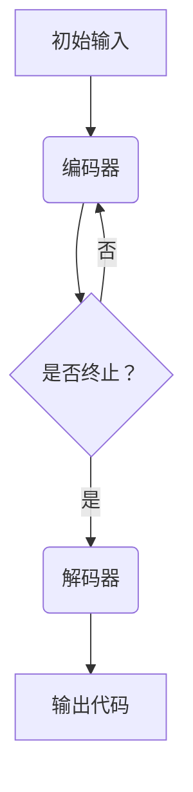

                 

# 《AI辅助软件开发：代码生成与优化》

> 关键词：AI辅助软件开发、代码生成、代码优化、生成对抗网络（GAN）、递归神经网络（RNN）

> 摘要：本文深入探讨了AI辅助软件开发的核心技术，包括代码生成与优化。通过逐步分析，本文揭示了AI在软件开发中的应用价值，并详细介绍了相关技术原理、应用实例以及未来发展趋势。

## 第1章：AI辅助软件开发概述

### 1.1 AI辅助软件开发的背景与意义

随着人工智能（AI）技术的快速发展，其在各行各业的应用越来越广泛。在软件开发领域，AI技术同样发挥着重要作用。传统的软件开发依赖于程序员的手工编写，而AI辅助软件开发则通过智能算法和工具，辅助程序员完成软件设计、编码、测试等任务。这种转变不仅提高了软件开发的效率，还降低了开发成本，提升了软件质量。

AI辅助软件开发的背景主要源于以下几个方面：

1. **软件开发需求的复杂性**：现代软件系统日益复杂，功能繁多，需求不断变化。传统的手工开发方式已无法满足这种复杂性，而AI技术能够通过学习和自动推理，帮助开发者处理复杂问题。
2. **程序员资源的稀缺**：全球范围内，优秀的程序员资源相对稀缺，而AI技术的引入可以部分替代程序员的工作，缓解人力资源的压力。
3. **软件质量与安全性的要求**：高质量的软件系统需要严格的质量控制和安全保障，AI技术能够通过自动化测试和代码审查，提高软件的可靠性和安全性。

### 1.2 AI辅助软件开发的核心概念

AI辅助软件开发的核心概念包括代码生成、代码优化、代码审查、自动测试等。这些概念相互关联，共同构成了AI辅助软件开发的生态系统。

- **代码生成**：AI能够根据自然语言描述、需求文档或设计模型自动生成代码。这一过程涉及自然语言处理、生成对抗网络（GAN）、递归神经网络（RNN）等技术。
- **代码优化**：AI通过对现有代码的分析和优化，提高代码的性能、可读性和可维护性。优化技术包括自动化代码优化工具和优化算法。
- **代码审查**：AI通过分析代码结构和逻辑，识别潜在的错误和缺陷，协助开发者进行代码质量保证。
- **自动测试**：AI辅助软件测试，通过模拟用户行为和系统操作，自动生成测试用例并执行测试，提高测试效率。

### 1.3 AI辅助软件开发的关键技术

AI辅助软件开发的关键技术包括以下几个方面：

- **自然语言处理（NLP）**：NLP技术能够理解和处理自然语言文本，是实现代码生成和需求理解的关键。
- **生成对抗网络（GAN）**：GAN是一种深度学习模型，通过生成器和判别器的对抗训练，实现高质量代码的自动生成。
- **递归神经网络（RNN）**：RNN能够处理序列数据，适用于代码生成和自然语言处理。
- **卷积神经网络（CNN）**：CNN擅长处理图像和文本数据，在图像识别和文本分类等方面有广泛应用。
- **深度强化学习**：深度强化学习通过模拟和优化开发者的行为，辅助软件设计和开发。

## 第2章：代码生成技术基础

### 2.1 自然语言处理与代码生成

自然语言处理（NLP）是AI辅助软件开发的重要基础。NLP技术能够理解和生成自然语言文本，是实现代码生成的重要手段。

#### NLP技术在代码生成中的应用

- **需求理解**：NLP技术能够从自然语言描述中提取关键信息，理解软件开发的需求。
- **代码生成**：基于需求理解，NLP技术能够生成相应的代码片段，辅助程序员完成编码任务。
- **文档生成**：NLP技术能够根据代码生成相应的文档，提高软件的可读性和可维护性。

#### NLP技术的核心概念

- **词向量表示**：词向量是将单词映射为高维向量的一种方法，用于表示词与词之间的关系。
- **序列模型**：序列模型能够处理序列数据，如自然语言文本和代码序列。
- **注意力机制**：注意力机制是一种在处理序列数据时，关注关键信息的技术，用于提高模型的性能。

### 2.2 生成对抗网络（GAN）在代码生成中的应用

生成对抗网络（GAN）是一种深度学习模型，通过生成器和判别器的对抗训练，实现高质量数据的生成。GAN在代码生成中的应用主要包括以下几个方面：

- **代码生成**：GAN能够根据给定的输入，生成高质量的代码片段。
- **代码合成**：GAN能够将多个代码片段组合成完整的程序，实现代码的自动合成。
- **代码改进**：GAN能够对现有代码进行改进，提高代码的性能和可读性。

#### GAN的核心概念

- **生成器（Generator）**：生成器是一个神经网络模型，用于生成数据。
- **判别器（Discriminator）**：判别器是一个神经网络模型，用于判断数据是真实数据还是生成数据。
- **对抗训练**：生成器和判别器通过对抗训练，不断优化自己的性能，实现高质量数据的生成。

### 2.3 递归神经网络（RNN）在代码生成中的应用

递归神经网络（RNN）是一种能够处理序列数据的神经网络模型，在代码生成中具有广泛的应用。

#### RNN在代码生成中的应用

- **代码序列建模**：RNN能够学习代码序列的统计规律，生成具有较高相似度的代码片段。
- **代码转换**：RNN能够将一种编程语言转换为另一种编程语言，实现代码的跨语言转换。
- **代码补全**：RNN能够根据已有的代码片段，预测接下来的代码，实现代码的自动补全。

#### RNN的核心概念

- **循环单元**：RNN的循环单元能够记住历史信息，用于处理序列数据。
- **状态转移函数**：状态转移函数描述了RNN的当前状态如何依赖于过去的状态和输入。
- **损失函数**：RNN的损失函数用于评估代码生成的质量，如交叉熵损失函数。

## 第3章：代码优化技术

### 3.1 代码优化的目的与方法

代码优化是AI辅助软件开发的重要组成部分，其目的是提高代码的性能、可读性和可维护性。代码优化的方法主要包括自动化代码优化工具和优化算法。

#### 代码优化的目的

- **提高性能**：通过优化代码，减少程序的运行时间，提高程序的响应速度。
- **提高可读性**：通过优化代码，使代码更加简洁、易于理解和维护。
- **提高可维护性**：通过优化代码，降低代码的复杂度，减少代码出错的可能性。

#### 代码优化的方法

- **自动化代码优化工具**：自动化代码优化工具能够自动分析和优化代码，如PEP8、PyLint等。
- **优化算法**：优化算法是通过数学模型和算法原理，对代码进行手动优化，如算法优化、数据结构优化等。

### 3.2 自动化代码优化工具介绍

自动化代码优化工具是AI辅助软件开发的重要工具，其能够自动分析和优化代码，提高代码的性能和可读性。常见的自动化代码优化工具包括：

- **PEP8**：PEP8是Python语言的编码规范，用于检查代码是否符合Python编码规范。
- **PyLint**：PyLint是Python语言的静态代码分析工具，用于检查代码的语法错误、风格问题等。
- **PyFlakes**：PyFlakes是Python语言的错误检测工具，用于检查代码中的潜在错误。

#### 自动化代码优化工具的核心概念

- **静态代码分析**：静态代码分析是在代码执行之前，对代码进行分析和检查，发现潜在的问题。
- **规则引擎**：规则引擎是自动化代码优化工具的核心组件，用于定义和执行代码分析规则。
- **报告生成**：报告生成是自动化代码优化工具将分析结果以可视化的形式呈现给开发者。

### 3.3 代码优化算法原理与实现

代码优化算法是通过对代码的数学建模和算法分析，提高代码的性能和可维护性。常见的代码优化算法包括：

- **算法优化**：算法优化是通过改进算法的设计和实现，提高算法的效率。
- **数据结构优化**：数据结构优化是通过选择合适的数据结构，提高程序的运行效率。
- **代码简化**：代码简化是通过删除冗余代码和简化代码结构，提高代码的可读性和可维护性。

#### 算法优化原理与实现

算法优化原理主要包括：

- **算法分析**：算法分析是通过对算法的运行时间和空间复杂度进行分析，选择最优的算法。
- **算法改进**：算法改进是通过引入新的算法思想，改进原有算法的性能。
- **代码实现**：代码实现是将优化后的算法设计转化为实际的代码。

#### 数据结构优化原理与实现

数据结构优化原理主要包括：

- **数据结构选择**：数据结构选择是根据算法的需求和性能，选择合适的数据结构。
- **数据结构改进**：数据结构改进是通过改进数据结构的设计和实现，提高数据结构的性能。
- **代码实现**：代码实现是将优化后的数据结构设计转化为实际的代码。

#### 代码简化原理与实现

代码简化原理主要包括：

- **代码分析**：代码分析是通过对代码进行分析，识别冗余代码和可简化的代码。
- **代码重构**：代码重构是通过删除冗余代码和简化代码结构，提高代码的可读性和可维护性。
- **代码实现**：代码实现是将优化后的代码结构转化为实际的代码。

## 第4章：AI辅助代码生成的应用

### 4.1 AI辅助编程助手

AI辅助编程助手是AI辅助软件开发的重要应用之一，其能够根据开发者的需求和输入，提供实时的编程建议和代码生成。

#### AI辅助编程助手的核心功能

- **代码提示**：AI辅助编程助手能够根据开发者的输入，提供相应的代码提示，提高编码效率。
- **代码生成**：AI辅助编程助手能够根据自然语言描述或代码结构，自动生成代码，辅助开发者完成编码任务。
- **代码优化**：AI辅助编程助手能够对现有代码进行分析和优化，提高代码的性能和可读性。

#### AI辅助编程助手的实现方法

- **自然语言处理**：AI辅助编程助手通过自然语言处理技术，理解开发者的需求描述。
- **代码生成**：AI辅助编程助手通过代码生成技术，自动生成代码。
- **代码优化**：AI辅助编程助手通过代码优化技术，对生成的代码进行分析和优化。

### 4.2 AI辅助代码审查与修复

AI辅助代码审查与修复是AI辅助软件开发的重要应用，其能够自动分析和识别代码中的潜在错误和缺陷，并提供修复建议。

#### AI辅助代码审查与修复的核心功能

- **错误检测**：AI辅助代码审查与修复能够自动检测代码中的潜在错误和缺陷。
- **错误修复**：AI辅助代码审查与修复能够根据错误检测的结果，提供修复建议，帮助开发者快速修复错误。
- **代码质量评估**：AI辅助代码审查与修复能够对代码质量进行评估，提供质量报告。

#### AI辅助代码审查与修复的实现方法

- **静态代码分析**：AI辅助代码审查与修复通过静态代码分析技术，对代码进行分析和检查。
- **错误模式识别**：AI辅助代码审查与修复通过错误模式识别技术，识别代码中的潜在错误和缺陷。
- **错误修复算法**：AI辅助代码审查与修复通过错误修复算法，提供修复建议，帮助开发者快速修复错误。

### 4.3 AI辅助软件测试

AI辅助软件测试是AI辅助软件开发的重要应用，其能够自动生成测试用例并执行测试，提高软件测试的效率和覆盖率。

#### AI辅助软件测试的核心功能

- **测试用例生成**：AI辅助软件测试能够根据软件需求和功能，自动生成测试用例。
- **测试执行**：AI辅助软件测试能够自动执行测试用例，检查软件的运行状态和功能是否符合预期。
- **缺陷定位**：AI辅助软件测试能够根据测试结果，定位软件中的缺陷和错误。

#### AI辅助软件测试的实现方法

- **测试数据生成**：AI辅助软件测试通过自然语言处理技术，理解软件需求和功能，生成测试数据。
- **测试用例生成**：AI辅助软件测试通过测试数据生成技术，自动生成测试用例。
- **测试执行**：AI辅助软件测试通过测试执行技术，自动执行测试用例，检查软件的运行状态和功能。
- **缺陷定位**：AI辅助软件测试通过缺陷定位技术，定位软件中的缺陷和错误。

## 第5章：代码生成与优化实战案例

### 5.1 实战案例1：基于GAN的代码生成系统开发

#### 实战案例背景

在本次实战案例中，我们将开发一个基于生成对抗网络（GAN）的代码生成系统。该系统旨在通过GAN模型，从给定的输入描述中自动生成高质量的代码。

#### 实战案例步骤

1. **数据集准备**：收集并准备用于训练GAN的代码数据集。数据集应包括多种编程语言和不同类型的程序。
2. **模型设计**：设计生成器和判别器模型，并确定GAN的训练过程。
3. **模型训练**：使用收集的数据集对GAN模型进行训练，通过生成器和判别器的对抗训练，逐步提高模型的性能。
4. **代码生成**：利用训练好的GAN模型，从自然语言描述中生成代码。
5. **代码优化**：对生成的代码进行优化，提高代码的性能和可读性。

#### 实战案例代码解读

以下是一个基于GAN的代码生成系统的伪代码示例：

```python
# 生成器模型
def generator(z):
    # 输入随机噪声 z，生成代码
    code = ...
    return code

# 判别器模型
def discriminator(code, real_code):
    # 输入生成代码和真实代码，判断代码是否真实
    if is_real(code):
        return 1
    else:
        return 0

# 训练模型
def train(G, D, z_samples, real_codes):
    # 训练生成器和判别器
    for epoch in range(num_epochs):
        for z_sample, real_code in z_samples, real_codes:
            G_loss = -E[log(D(Generator(z_sample)))]
            D_loss = -E[log(D(Generator(z_sample))) + log(1 - D(real_code))]
            update_G(G, G_loss)
            update_D(D, D_loss)
```

#### 实战案例分析

通过上述实战案例，我们可以看到，基于GAN的代码生成系统开发主要包括模型设计、模型训练和代码生成三个步骤。在模型设计中，生成器和判别器是核心组件，其中生成器负责将随机噪声转换为代码，判别器负责判断代码的真实性。在模型训练过程中，通过生成器和判别器的对抗训练，逐步提高模型的性能。最终，训练好的GAN模型可以从自然语言描述中生成高质量的代码，并通过代码优化进一步提高代码的性能和可读性。

### 5.2 实战案例2：自动化代码优化工具实现

#### 实战案例背景

在本次实战案例中，我们将实现一个自动化代码优化工具，该工具能够自动分析代码，并根据优化算法提供优化建议。

#### 实战案例步骤

1. **代码分析**：使用静态代码分析技术，对代码进行语法和语义分析，提取关键信息和代码结构。
2. **优化算法**：设计并实现优化算法，根据代码分析结果，提供优化建议。
3. **优化建议生成**：根据优化算法的输出，生成优化建议，并将建议以可视化的形式呈现给开发者。
4. **代码重构**：根据优化建议，对代码进行重构，提高代码的性能和可读性。

#### 实战案例代码解读

以下是一个自动化代码优化工具的伪代码示例：

```python
# 代码分析
def analyze_code(code):
    # 对代码进行语法和语义分析
    analysis_result = ...
    return analysis_result

# 优化算法
def optimize_code(analysis_result):
    # 根据代码分析结果，提供优化建议
    optimization_suggestions = ...
    return optimization_suggestions

# 代码重构
def refactor_code(code, optimization_suggestions):
    # 根据优化建议，对代码进行重构
    refactored_code = ...
    return refactored_code
```

#### 实战案例分析

通过上述实战案例，我们可以看到，自动化代码优化工具的实现主要包括代码分析、优化算法和代码重构三个步骤。在代码分析阶段，通过静态代码分析技术，对代码进行语法和语义分析，提取关键信息和代码结构。在优化算法阶段，根据代码分析结果，设计并实现优化算法，提供优化建议。在代码重构阶段，根据优化建议，对代码进行重构，提高代码的性能和可读性。通过这三个步骤，自动化代码优化工具能够自动分析代码，并提供优化建议，帮助开发者提高代码质量。

### 5.3 实战案例3：AI辅助编程助手开发与应用

#### 实战案例背景

在本次实战案例中，我们将开发一个AI辅助编程助手，该助手能够根据开发者的需求描述，提供实时的编程建议和代码生成。

#### 实战案例步骤

1. **需求理解**：使用自然语言处理技术，理解开发者的需求描述。
2. **代码生成**：使用代码生成技术，根据需求描述生成代码。
3. **代码优化**：对生成的代码进行优化，提高代码的性能和可读性。
4. **交互界面**：开发交互界面，让开发者能够与AI编程助手进行实时交互。
5. **部署与测试**：将AI编程助手部署到开发环境中，进行测试和验证。

#### 实战案例代码解读

以下是一个AI辅助编程助手的伪代码示例：

```python
# 需求理解
def understand_demand(demand):
    # 使用自然语言处理技术，理解需求描述
    parsed_demand = ...
    return parsed_demand

# 代码生成
def generate_code(parsed_demand):
    # 使用代码生成技术，根据需求描述生成代码
    code = ...
    return code

# 代码优化
def optimize_code(code):
    # 对生成的代码进行优化
    optimized_code = ...
    return optimized_code

# 交互界面
def interactive_interface():
    # 开发交互界面
    ...

# 部署与测试
def deploy_and_test():
    # 将AI编程助手部署到开发环境中，进行测试和验证
    ...
```

#### 实战案例分析

通过上述实战案例，我们可以看到，AI辅助编程助手的开发主要包括需求理解、代码生成、代码优化、交互界面和部署与测试五个步骤。在需求理解阶段，通过自然语言处理技术，理解开发者的需求描述。在代码生成阶段，根据需求描述生成代码。在代码优化阶段，对生成的代码进行优化，提高代码的性能和可读性。在交互界面阶段，开发交互界面，让开发者能够与AI编程助手进行实时交互。在部署与测试阶段，将AI编程助手部署到开发环境中，进行测试和验证。通过这些步骤，AI辅助编程助手能够为开发者提供实时的编程建议和代码生成，提高开发效率。

## 第6章：AI辅助软件开发工具与平台

### 6.1 开源AI辅助软件开发工具

开源AI辅助软件开发工具是开发者广泛使用的资源，其能够在不影响开源协议的前提下，为开发者提供强大的功能和支持。

#### 常见开源AI辅助软件开发工具

- **AutoComplete**：AutoComplete是一款流行的AI辅助编程工具，能够根据开发者输入的代码，提供实时的代码提示和自动补全功能。
- **JetBrains IntelliJ IDEA**：JetBrains IntelliJ IDEA是一款强大的AI辅助编程工具，其内置了AI智能提示、代码生成和优化等功能。
- **TabNine**：TabNine是一款开源的AI代码补全工具，能够根据开发者的输入，提供高效的代码补全建议。

#### 开源AI辅助软件开发工具的核心特点

- **高效**：开源AI辅助软件开发工具能够通过深度学习模型，提供实时的代码提示和自动补全功能，提高开发效率。
- **灵活**：开源AI辅助软件开发工具支持多种编程语言和开发环境，能够根据开发者需求进行定制和扩展。
- **社区支持**：开源AI辅助软件开发工具拥有强大的社区支持，开发者可以分享经验、获取帮助和贡献代码。

### 6.2 商业AI辅助软件开发平台

商业AI辅助软件开发平台是为开发者提供全面服务的专业平台，其通常具备更强大的功能和技术支持。

#### 常见商业AI辅助软件开发平台

- **GitHub Copilot**：GitHub Copilot是一款基于AI的商业编程助手，其能够根据GitHub上的代码库，提供实时的代码提示和自动补全功能。
- **DeepCode**：DeepCode是一款基于AI的代码审查和优化工具，其能够自动分析和优化代码，提高代码的质量和性能。
- **Kublr**：Kublr是一款基于AI的Kubernetes管理和优化工具，其能够根据应用需求，自动配置和优化Kubernetes集群。

#### 商业AI辅助软件开发平台的核心特点

- **专业**：商业AI辅助软件开发平台通常具备更专业的技术和功能，能够满足开发者多样化的需求。
- **稳定**：商业AI辅助软件开发平台通常具备更稳定的服务和更丰富的资源，能够确保开发过程的连续性和稳定性。
- **技术支持**：商业AI辅助软件开发平台通常提供专业的技术支持，为开发者提供全面的技术咨询和解决方案。

### 6.3 AI辅助软件开发工具的未来发展趋势

随着AI技术的不断进步，AI辅助软件开发工具也在不断发展和完善。未来，AI辅助软件开发工具的发展趋势主要包括以下几个方面：

- **智能化**：AI辅助软件开发工具将更加智能化，能够根据开发者的行为和需求，提供个性化的编程建议和优化方案。
- **跨平台**：AI辅助软件开发工具将支持更多编程语言和开发环境，提供跨平台的开发支持。
- **自动化**：AI辅助软件开发工具将实现更高程度的自动化，通过自动化代码生成、代码优化和代码审查，提高开发效率。
- **生态化**：AI辅助软件开发工具将构建更加完善的生态体系，与开发工具、框架和平台深度集成，提供一站式开发体验。

## 第7章：AI辅助软件开发挑战与未来

### 7.1 AI辅助软件开发面临的挑战

尽管AI辅助软件开发具有巨大的潜力，但在实际应用过程中，仍然面临着一系列挑战：

- **数据隐私和安全**：AI辅助软件开发依赖于大量数据，如何在保护用户隐私的同时，充分利用数据价值，是一个重要问题。
- **算法公平性和透明性**：AI辅助软件开发中的算法可能存在偏见和不公平性，如何确保算法的公平性和透明性，是一个关键问题。
- **模型泛化能力**：AI辅助软件开发中的模型需要在各种复杂场景下具有泛化能力，如何提高模型的泛化能力，是一个挑战。
- **技术更新和迭代**：AI技术更新迅速，如何保持AI辅助软件开发工具的先进性和可持续性，是一个长期挑战。

### 7.2 AI辅助软件开发的发展趋势

随着AI技术的不断进步，AI辅助软件开发的发展趋势主要包括以下几个方面：

- **智能化**：AI辅助软件开发将更加智能化，能够根据开发者的行为和需求，提供个性化的编程建议和优化方案。
- **生态化**：AI辅助软件开发将构建更加完善的生态体系，与开发工具、框架和平台深度集成，提供一站式开发体验。
- **跨平台**：AI辅助软件开发将支持更多编程语言和开发环境，提供跨平台的开发支持。
- **自动化**：AI辅助软件开发将实现更高程度的自动化，通过自动化代码生成、代码优化和代码审查，提高开发效率。

### 7.3 AI辅助软件开发的社会影响与伦理问题

AI辅助软件开发不仅对技术领域产生影响，也对社会和伦理问题提出了挑战：

- **就业影响**：AI辅助软件开发可能改变软件开发领域的就业结构，一些重复性和低技能的工作可能会被自动化取代。
- **算法偏见**：AI辅助软件开发中的算法可能存在偏见和不公平性，如何确保算法的公平性和透明性，是一个关键问题。
- **数据治理**：如何处理和治理AI辅助软件开发中的大量数据，确保数据的安全性和隐私，是一个重要议题。
- **伦理道德**：AI辅助软件开发涉及伦理道德问题，如何确保算法和行为符合社会伦理标准，是一个长期挑战。

## 附录

### 附录A：常用AI编程框架与工具

- **TensorFlow**：TensorFlow是谷歌开源的深度学习框架，支持多种编程语言，广泛应用于AI辅助软件开发。
- **PyTorch**：PyTorch是Facebook开源的深度学习框架，以其灵活性和动态计算图而受到开发者青睐。
- **Keras**：Keras是Python深度学习库，构建在TensorFlow和Theano之上，提供简化的深度学习API。

### 附录B：数学模型和算法原理流程图

- **生成对抗网络（GAN）算法流程图**：展示了生成器和判别器的训练过程。
- **递归神经网络（RNN）算法流程图**：展示了RNN的输入、隐藏状态和输出之间的递归关系。

### 附录C：实战代码与解读

- **生成对抗网络（GAN）代码实现与解读**：详细展示了GAN模型的实现过程和训练步骤。
- **自动化代码优化工具代码实现与解读**：介绍了代码优化工具的核心功能和实现方法。
- **AI辅助编程助手代码实现与解读**：展示了AI辅助编程助手的实现流程和交互界面。

### 附录D：Mermaid流程图示例

以下是一个Mermaid流程图示例，展示了生成对抗网络（GAN）的训练过程：



### 附录E：伪代码示例

以下是一个生成对抗网络（GAN）的伪代码示例，展示了生成器和判别器的训练过程：

```python
# 生成器模型
def generator(z):
    # 输入随机噪声 z，生成代码
    code = ...
    return code

# 判别器模型
def discriminator(code, real_code):
    # 输入生成代码和真实代码，判断代码是否真实
    if is_real(code):
        return 1
    else:
        return 0

# 训练模型
def train(G, D, z_samples, real_codes):
    # 训练生成器和判别器
    for epoch in range(num_epochs):
        for z_sample, real_code in z_samples, real_codes:
            G_loss = -E[log(D(Generator(z_sample)))]
            D_loss = -E[log(D(Generator(z_sample))) + log(1 - D(real_code))]
            update_G(G, G_loss)
            update_D(D, D_loss)
```

### 附录F：数学公式示例

以下是一个数学公式示例，展示了损失函数和梯度计算：

$$
\begin{aligned}
J(\theta) &= \frac{1}{m}\sum_{i=1}^{m} \left( h_{\theta}(x^{(i)}) - y^{(i)} \right)^2 \\
\frac{\partial J(\theta)}{\partial \theta_j} &= 2\frac{1}{m}\sum_{i=1}^{m} \left( h_{\theta}(x^{(i)}) - y^{(i)} \right) x_j^{(i)}
\end{aligned}
$$`

### 附录G：实战代码示例

以下是一个TensorFlow代码示例，展示了生成对抗网络（GAN）的训练过程：

```python
import tensorflow as tf

# 定义生成器
z = tf.random.normal([batch_size, z_dim])
x生成的 = generator(z)

# 定义判别器
real_images = ...
生成的_images = ...

real_logits = discriminator(real_images)
生成的_logits = discriminator(x生成的)

# 定义损失函数
G_loss = -tf.reduce_mean(tf.math.log(生成的_logits))
D_loss = tf.reduce_mean(tf.math.log(real_logits) + tf.math.log(1 - 生成的_logits))

# 定义优化器
G_optimizer = tf.keras.optimizers.Adam(learning_rate=0.0001)
D_optimizer = tf.keras.optimizers.Adam(learning_rate=0.0001)

# 训练模型
for epoch in range(num_epochs):
    for z_sample, real_code in z_samples, real_codes:
        with tf.GradientTape() as g_tape, tf.GradientTape() as d_tape:
            G_loss_val = G_loss(生成的_images)
            D_loss_val = D_loss(real_images, 生成的_images)

        grads_G = g_tape.gradient(G_loss_val, generator.trainable_variables)
        grads_D = d_tape.gradient(D_loss_val, discriminator.trainable_variables)

        G_optimizer.apply_gradients(zip(grads_G, generator.trainable_variables))
        D_optimizer.apply_gradients(zip(grads_D, discriminator.trainable_variables))
```

### 作者

作者：AI天才研究院/AI Genius Institute & 禅与计算机程序设计艺术 /Zen And The Art of Computer Programming

