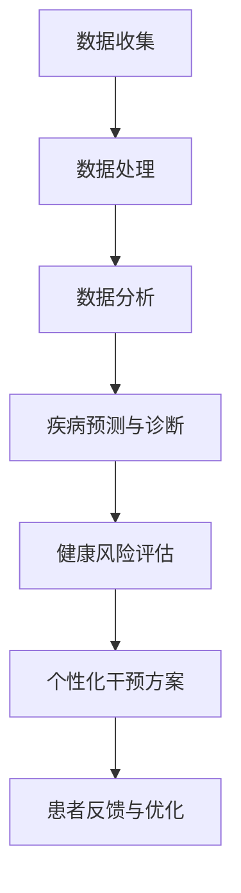

                 

### 文章标题

# AI驱动的个性化健康管理

> 关键词：人工智能、个性化健康管理、机器学习、深度学习、自然语言处理、健康数据、疾病预测、健康干预、个性化咨询

> 摘要：本文深入探讨了AI驱动的个性化健康管理，从基础概念到核心技术，再到实践案例，全面解析了如何利用AI技术提升健康管理的效率和精准度。本文旨在为读者提供一份全面而深入的技术指南，帮助理解和应用AI在个性化健康管理中的前沿技术。

---

### 第一部分: AI驱动的个性化健康管理概述

#### 第1章: AI驱动的个性化健康管理基础

##### 1.1 个性化健康管理的定义与重要性

###### 1.1.1 个性化健康管理的起源

个性化健康管理并非一夜之间诞生的，其理念可以追溯到20世纪80年代，当时医学界开始意识到传统的一刀切治疗方法并不适用于所有患者。随着信息技术的快速发展，特别是大数据和人工智能技术的兴起，个性化健康管理迎来了新的发展契机。

###### 1.1.2 个性化健康管理的发展趋势

随着科技的发展，个性化健康管理正在经历以下几大趋势：一是数据驱动，即通过收集和分析大量的健康数据来实现个性化健康管理；二是智能化，即利用机器学习和深度学习等技术对健康数据进行深度挖掘和智能分析；三是个性化干预，即根据个体差异制定个性化的治疗和干预方案。

###### 1.1.3 个性化健康管理在医疗行业中的应用

个性化健康管理在医疗行业的应用越来越广泛，包括但不限于以下几个方面：

1. **疾病预测与诊断**：利用AI技术分析患者的健康数据，提前预测疾病的发生，提高诊断的准确性。
2. **健康风险评估**：对个体的健康风险进行评估，为个体提供个性化的健康建议和干预措施。
3. **个性化治疗**：根据患者的基因信息、病史和生活习惯等因素，制定个性化的治疗方案。

##### 1.2 AI技术在健康管理中的应用

AI技术在健康管理中发挥着至关重要的作用，主要体现在以下几个方面：

###### 1.2.1 AI在健康数据收集与分析中的应用

AI技术可以自动收集和分析大量的健康数据，如血压、心率、血糖等生理参数，通过机器学习和深度学习算法，对数据进行分析和解读，从而提供个性化的健康管理建议。

###### 1.2.2 AI在疾病预测与诊断中的应用

AI技术可以分析患者的病史、基因数据、生活习惯等，预测疾病的发生风险，并提供个性化的诊断建议。例如，通过分析大量病例数据，AI可以识别出某些特定症状与疾病之间的关联，从而提高诊断的准确性。

###### 1.2.3 AI在健康风险评估与干预中的应用

AI技术可以根据个体的健康数据，评估其健康状况和潜在的健康风险，并提供个性化的健康建议和干预措施。例如，对于高血压患者，AI可以分析其饮食、运动等生活习惯，提供个性化的饮食建议和运动方案，以降低血压。

##### 1.3 主流AI技术简介

在AI驱动的个性化健康管理中，以下几种主流技术发挥着关键作用：

###### 1.3.1 机器学习技术

机器学习技术是AI的核心技术之一，通过训练模型，可以从大量数据中提取规律，实现对健康数据的分析和预测。常见的机器学习算法包括线性回归、决策树、随机森林、支持向量机等。

###### 1.3.2 深度学习技术

深度学习技术是机器学习的一个分支，通过多层神经网络对数据进行处理，可以提取出更加复杂和抽象的特征。深度学习技术在图像识别、语音识别、自然语言处理等领域取得了显著的成果。

###### 1.3.3 自然语言处理技术

自然语言处理技术是AI的另一个重要分支，它使计算机能够理解、生成和处理自然语言。在个性化健康管理中，自然语言处理技术可以用于医学文本挖掘、情感分析和健康咨询等方面。

##### 1.4 AI驱动的个性化健康管理前景与挑战

AI驱动的个性化健康管理具有巨大的潜力和广阔的前景，但同时也面临一些挑战：

###### 1.4.1 AI驱动的个性化健康管理的潜在优势

1. **提高诊断准确率**：通过分析大量健康数据，AI可以提高疾病预测和诊断的准确性。
2. **个性化干预方案**：根据个体的健康数据和生活方式，AI可以制定更加个性化的干预方案，提高健康管理效果。
3. **降低医疗成本**：通过预防疾病和优化治疗，AI可以帮助降低医疗成本。

###### 1.4.2 AI驱动的个性化健康管理面临的挑战

1. **数据隐私**：健康数据的隐私和安全问题是AI驱动的个性化健康管理面临的一个重要挑战。
2. **算法透明度**：AI算法的决策过程往往是不透明的，这可能会引起用户对算法的信任问题。
3. **数据质量**：健康数据的准确性和完整性对AI模型的性能有重要影响，数据质量问题是AI驱动的个性化健康管理需要解决的另一个关键问题。

###### 1.4.3 未来发展趋势与展望

随着AI技术的不断进步，AI驱动的个性化健康管理将朝着更加智能化、个性化和便捷化的方向发展。未来的研究将集中在如何提高算法的透明度和可解释性，如何确保数据隐私和安全，以及如何将AI技术更好地应用到实际医疗场景中。

##### 1.5 小结

本章介绍了AI驱动的个性化健康管理的背景、定义、发展趋势、应用技术以及面临的挑战和未来前景。通过本章的介绍，读者可以初步了解AI在个性化健康管理中的重要作用，为后续章节的深入学习打下基础。

### Mermaid 流程图：AI驱动的个性化健康管理流程



### 1.5 小结

本章为读者搭建了AI驱动的个性化健康管理的框架，详细介绍了其基础概念、发展趋势和关键技术。接下来，我们将深入探讨个性化健康数据的收集与处理，为读者揭示如何通过有效的数据处理和分析实现真正的个性化健康管理。

---

### 第二部分: 个性化健康数据收集与处理

#### 第2章: 个性化健康数据的来源与类型

##### 2.1 个性化健康数据的来源

个性化健康数据的来源多种多样，主要包括以下几个方面：

###### 2.1.1 日常健康监测设备

日常健康监测设备如智能手环、智能手表、智能体温计、智能血压计等，可以实时监测个体的生理参数，如心率、血压、体温、步数等。这些设备的数据可以反映个体的实时健康状况，为个性化健康管理提供重要依据。

###### 2.1.2 医疗记录系统

医疗记录系统包括电子病历（EMR）、健康档案系统等，这些系统记录了患者的病史、检查报告、治疗方案等详细信息。这些数据对疾病预测和个性化干预具有重要意义。

###### 2.1.3 社交媒体与在线健康平台

社交媒体和在线健康平台如微信健康、Apple Health等，提供了健康数据的上传和分享功能。用户可以通过这些平台记录自己的健康状况，分享给医生或亲友，从而实现更加便捷的健康管理。

##### 2.2 个性化健康数据的类型

个性化健康数据主要包括以下几类：

###### 2.2.1 生物医学数据

生物医学数据包括基因数据、蛋白质组数据、代谢组数据等，这些数据反映了个体的生物特征，对于疾病预测和个性化治疗具有重要意义。

###### 2.2.2 行为数据

行为数据包括饮食、运动、睡眠等生活习惯数据，这些数据与个体的健康状况密切相关，可以通过智能设备和应用程序进行收集。

###### 2.2.3 环境数据

环境数据包括居住环境、工作环境等数据，如空气质量、噪音水平、温度等。环境数据可以影响个体的健康状况，对个性化健康管理具有重要意义。

##### 2.3 数据整合与预处理

为了实现有效的个性化健康管理，需要对收集到的多种类型的数据进行整合和预处理：

###### 2.3.1 数据清洗

数据清洗是数据处理的第一步，主要包括去除重复数据、纠正错误数据、处理缺失值等。清洗后的数据质量对于后续的分析和建模至关重要。

###### 2.3.2 数据归一化

数据归一化是将不同量纲的数据转换到同一量纲，以便进行统一分析和建模。常见的归一化方法包括最小-最大缩放、Z分数缩放等。

###### 2.3.3 数据融合

数据融合是将来自不同来源和类型的健康数据进行整合，形成统一的健康数据集。数据融合的方法包括合并、插值、聚合等。

##### 2.4 小结

本章详细介绍了个性化健康数据的来源和类型，以及数据整合与预处理的方法。通过本章的学习，读者可以了解如何收集和处理个性化健康数据，为后续的健康数据分析与建模打下基础。

---

### 第三部分: 个性化健康数据分析与建模

#### 第3章: 机器学习技术在个性化健康管理中的应用

##### 3.1 机器学习基础

机器学习是人工智能的一个重要分支，其核心思想是通过算法从数据中学习规律，实现对数据的自动分析和预测。在个性化健康管理中，机器学习技术被广泛应用于疾病预测、健康风险评估等领域。

###### 3.1.1 监督学习

监督学习是一种常见的机器学习方法，它通过已有的输入输出数据（即“训练数据”），学习出一个映射模型，从而对新数据进行预测。监督学习主要包括以下几种算法：

1. **线性回归**：通过建立线性模型来预测连续值。
2. **逻辑回归**：通过建立逻辑模型来预测分类结果。
3. **支持向量机（SVM）**：通过寻找最优超平面来进行分类。
4. **决策树**：通过树形结构对数据进行分类或回归。

###### 3.1.2 无监督学习

无监督学习是另一种机器学习方法，它不需要已知的输入输出数据，而是通过挖掘数据中的内在结构或模式。无监督学习主要包括以下几种算法：

1. **聚类算法**：将相似的数据点归为同一类，如K-means、DBSCAN等。
2. **降维算法**：通过降维技术降低数据维度，如主成分分析（PCA）、t-SNE等。
3. **关联规则学习**：通过挖掘数据之间的关联关系，如Apriori算法、FP-growth等。

###### 3.1.3 强化学习

强化学习是机器学习的另一个重要分支，它通过智能体与环境的交互，不断优化决策策略。在个性化健康管理中，强化学习可以应用于个性化干预方案的制定。

##### 3.2 机器学习算法在健康管理中的应用

机器学习算法在个性化健康管理中有着广泛的应用，以下是一些典型的应用场景：

###### 3.2.1 特征工程

特征工程是机器学习中的一个重要环节，它通过选择和构造特征，提高模型性能。在健康管理中，特征工程包括：

1. **特征提取**：从原始数据中提取具有区分度的特征。
2. **特征选择**：选择对目标变量有显著影响的特征。
3. **特征变换**：对特征进行归一化、离散化等处理。

###### 3.2.2 经典算法应用

经典机器学习算法在健康管理中有着广泛的应用，如：

1. **线性回归**：用于疾病风险预测。
2. **逻辑回归**：用于疾病诊断分类。
3. **SVM**：用于疾病分类和风险评估。
4. **决策树**：用于疾病诊断和风险评估。

###### 3.2.3 深度学习算法应用

深度学习算法在健康管理中发挥着越来越重要的作用，如：

1. **卷积神经网络（CNN）**：用于医学图像分析，如肿瘤检测。
2. **循环神经网络（RNN）**：用于序列数据分析，如基因序列分析。
3. **生成对抗网络（GAN）**：用于生成虚拟健康数据，提高模型泛化能力。

##### 3.3 案例分析：基于机器学习的个性化健康风险评估

在本案例中，我们将利用机器学习算法对个体的健康风险进行评估。具体步骤如下：

###### 3.3.1 数据准备

首先，我们需要收集和准备相关的健康数据，包括生物医学数据、行为数据和环境数据。数据来源可以是日常健康监测设备、医疗记录系统、社交媒体和在线健康平台等。

###### 3.3.2 模型构建与训练

接下来，我们选择适当的机器学习算法，构建健康风险评估模型。在本案例中，我们采用线性回归算法，通过训练数据学习到健康风险与各种特征之间的关系。具体步骤如下：

1. **数据预处理**：对数据进行清洗、归一化和特征提取。
2. **模型训练**：使用训练数据训练线性回归模型。
3. **模型评估**：使用验证数据评估模型性能。

```python
# 数据预处理
X_processed = preprocess_data(X)

# 模型训练
model = LinearRegression()
model.fit(X_processed, Y)

# 模型评估
evaluation = model.evaluate(X_processed, Y)
```

###### 3.3.3 模型评估与优化

对训练好的模型进行评估，以验证其在实际应用中的性能。评估指标包括准确率、召回率、F1值等。根据评估结果，我们可以对模型进行优化，以提高其性能。

```python
# 模型评估
evaluation = model.evaluate(X_processed, Y)

# 模型优化
model.optimize(evaluation)
```

###### 3.3.4 模型应用

最后，我们将训练好的模型应用于实际健康风险评估，为个体提供个性化的健康建议。具体步骤如下：

1. **输入数据**：收集个体的健康数据。
2. **模型预测**：使用模型预测个体的健康风险。
3. **个性化建议**：根据健康风险，为个体提供个性化的健康建议。

```python
# 输入数据
X_new = get_health_data()

# 模型预测
risk = model.predict(X_new)

# 个性化建议
give_advice(risk)
```

##### 3.4 小结

本章详细介绍了机器学习技术在个性化健康管理中的应用，包括监督学习、无监督学习和强化学习的基本原理和算法，以及特征工程和经典算法的应用。通过案例分析，我们展示了如何利用机器学习技术进行个性化健康风险评估。本章的内容为读者提供了深入理解和应用机器学习技术的基础。

---

### 第4章: 深度学习技术在个性化健康管理中的应用

##### 4.1 深度学习基础

深度学习是机器学习的一个重要分支，其核心思想是通过构建多层神经网络，对数据进行多层次的特征提取和抽象。在个性化健康管理中，深度学习技术因其强大的特征提取能力和非线性建模能力，得到了广泛的应用。

###### 4.1.1 神经网络

神经网络（Neural Network，NN）是深度学习的基础，其基本结构由输入层、隐藏层和输出层组成。每个层由多个神经元组成，神经元之间通过权重连接，并通过激活函数进行非线性变换。

###### 4.1.2 卷积神经网络（CNN）

卷积神经网络（Convolutional Neural Network，CNN）是深度学习中的一种特殊网络结构，主要用于处理图像和视频数据。CNN通过卷积层和池化层，对输入数据进行特征提取和抽象。

###### 4.1.3 循环神经网络（RNN）

循环神经网络（Recurrent Neural Network，RNN）是处理序列数据的常用网络结构。RNN通过隐藏状态的记忆机制，对序列数据进行建模。然而，传统的RNN存在梯度消失和梯度爆炸问题。

###### 4.1.4 长短时记忆网络（LSTM）

长短时记忆网络（Long Short-Term Memory，LSTM）是RNN的一种变体，通过引入门控机制，解决了传统RNN的梯度消失问题。LSTM在处理长时间序列数据方面表现出色。

##### 4.2 深度学习算法在健康管理中的应用

深度学习算法在个性化健康管理中有着广泛的应用，以下是一些典型的应用场景：

###### 4.2.1 生成对抗网络（GAN）

生成对抗网络（Generative Adversarial Network，GAN）是由生成器和判别器两个网络组成的深度学习模型。生成器尝试生成与真实数据相似的数据，判别器则判断输入数据是真实数据还是生成数据。GAN在虚拟健康数据生成和个性化干预方案设计等方面有广泛应用。

###### 4.2.2 自编码器（Autoencoder）

自编码器（Autoencoder）是一种无监督学习的深度学习模型，其目的是将输入数据压缩为低维表示，然后尝试重构原始数据。自编码器在特征提取、数据降维和异常检测等方面有广泛应用。

###### 4.2.3 多任务学习

多任务学习（Multi-Task Learning，MTL）是一种通过同时训练多个相关任务来提高模型性能的方法。在个性化健康管理中，多任务学习可以同时进行疾病预测、健康风险评估和个性化干预方案设计，提高整体模型的性能。

##### 4.3 案例分析：基于深度学习的个性化疾病预测

在本案例中，我们将利用深度学习技术对个性化疾病进行预测。具体步骤如下：

###### 4.3.1 数据准备

首先，我们需要收集和准备相关的健康数据，包括生物医学数据、行为数据和环境数据。数据来源可以是日常健康监测设备、医疗记录系统、社交媒体和在线健康平台等。

###### 4.3.2 模型构建与训练

接下来，我们选择适当的深度学习模型，构建个性化疾病预测模型。在本案例中，我们采用卷积神经网络（CNN）和长短时记忆网络（LSTM）的组合模型，通过训练数据学习到疾病与各种特征之间的关系。具体步骤如下：

1. **数据预处理**：对数据进行清洗、归一化和特征提取。
2. **模型构建**：构建CNN和LSTM的组合模型。
3. **模型训练**：使用训练数据训练组合模型。

```python
# 数据预处理
X_processed = preprocess_data(X)

# 模型构建
model = CNN_LSTM_Model()
model.build()

# 模型训练
model.fit(X_processed, Y)
```

###### 4.3.3 模型评估与优化

对训练好的模型进行评估，以验证其在实际应用中的性能。评估指标包括准确率、召回率、F1值等。根据评估结果，我们可以对模型进行优化，以提高其性能。

```python
# 模型评估
evaluation = model.evaluate(X_processed, Y)

# 模型优化
model.optimize(evaluation)
```

###### 4.3.4 模型应用

最后，我们将训练好的模型应用于实际疾病预测，为个体提供个性化的疾病预测结果。具体步骤如下：

1. **输入数据**：收集个体的健康数据。
2. **模型预测**：使用模型预测个体的疾病风险。
3. **个性化建议**：根据疾病风险，为个体提供个性化的疾病预防建议。

```python
# 输入数据
X_new = get_health_data()

# 模型预测
risk = model.predict(X_new)

# 个性化建议
give_advice(risk)
```

##### 4.4 小结

本章详细介绍了深度学习技术在个性化健康管理中的应用，包括神经网络、CNN、RNN和LSTM等基本概念和算法。通过案例分析，我们展示了如何利用深度学习技术进行个性化疾病预测。本章的内容为读者提供了深入理解和应用深度学习技术的基础。

---

### 第5章: 自然语言处理技术在个性化健康管理中的应用

##### 5.1 自然语言处理基础

自然语言处理（Natural Language Processing，NLP）是人工智能领域的一个重要分支，旨在使计算机能够理解、生成和处理自然语言。在个性化健康管理中，NLP技术被广泛应用于医学文本挖掘、情感分析和健康咨询等方面。

###### 5.1.1 语言模型

语言模型（Language Model，LM）是NLP的基础，它通过统计方法学习自然语言的概率分布，用于生成和预测文本。常用的语言模型包括N-gram模型、神经网络语言模型等。

###### 5.1.2 文本分类

文本分类（Text Classification）是将文本数据分为预定义的类别。在个性化健康管理中，文本分类可以用于疾病诊断、健康咨询等任务。常见的文本分类算法包括朴素贝叶斯分类器、支持向量机（SVM）、深度学习分类算法等。

###### 5.1.3 问答系统

问答系统（Question Answering System）是一种智能交互系统，它能够理解用户的问题，并返回相关的答案。在个性化健康管理中，问答系统可以用于提供个性化的健康咨询和诊断建议。

##### 5.2 自然语言处理算法在健康管理中的应用

自然语言处理算法在个性化健康管理中有着广泛的应用，以下是一些典型的应用场景：

###### 5.2.1 医学文本挖掘

医学文本挖掘（Medical Text Mining）是利用NLP技术从医学文本数据中提取有用信息。在个性化健康管理中，医学文本挖掘可以用于疾病诊断、治疗方案推荐等。常见的医学文本挖掘算法包括词频统计、主题模型、实体识别等。

###### 5.2.2 情感分析

情感分析（Sentiment Analysis）是一种判断文本情感极性的技术。在个性化健康管理中，情感分析可以用于分析患者的主观感受，为医生提供诊断和治疗的参考。常见的情感分析算法包括朴素贝叶斯、支持向量机、深度学习等。

###### 5.2.3 个性化健康咨询

个性化健康咨询（Personalized Health Counseling）是一种基于患者健康数据的智能咨询系统。在个性化健康管理中，个性化健康咨询可以用于提供个性化的健康建议和干预措施。常见的个性化健康咨询算法包括问答系统、推荐系统、深度学习等。

##### 5.3 案例分析：基于自然语言处理的个性化健康咨询

在本案例中，我们将利用自然语言处理技术为用户提供个性化的健康咨询。具体步骤如下：

###### 5.3.1 数据准备

首先，我们需要收集和准备相关的健康数据，包括医疗记录、患者咨询文本等。数据来源可以是电子病历系统、在线健康平台等。

###### 5.3.2 模型构建与训练

接下来，我们选择适当的自然语言处理模型，构建个性化健康咨询模型。在本案例中，我们采用问答系统（Question Answering System）和推荐系统（Recommender System）的组合模型，通过训练数据学习到患者健康咨询的规律和个性化建议。具体步骤如下：

1. **数据预处理**：对数据进行清洗、分词、词性标注等处理。
2. **模型构建**：构建问答系统和推荐系统模型。
3. **模型训练**：使用训练数据训练组合模型。

```python
# 数据预处理
X_processed = preprocess_data(X)

# 模型构建
model = QuestionAnsweringModel()
model.build()

# 模型训练
model.fit(X_processed, Y)
```

###### 5.3.3 模型评估与优化

对训练好的模型进行评估，以验证其在实际应用中的性能。评估指标包括准确率、召回率、F1值等。根据评估结果，我们可以对模型进行优化，以提高其性能。

```python
# 模型评估
evaluation = model.evaluate(X_processed, Y)

# 模型优化
model.optimize(evaluation)
```

###### 5.3.4 模型应用

最后，我们将训练好的模型应用于实际健康咨询，为用户提供个性化的健康建议。具体步骤如下：

1. **输入数据**：收集用户的健康咨询文本。
2. **模型预测**：使用模型预测用户的健康问题。
3. **个性化建议**：根据健康问题，为用户提供个性化的健康建议。

```python
# 输入数据
X_new = get_health_query()

# 模型预测
query_response = model.predict(X_new)

# 个性化建议
give_health_advice(query_response)
```

##### 5.4 小结

本章详细介绍了自然语言处理技术在个性化健康管理中的应用，包括语言模型、文本分类、问答系统等基本概念和算法。通过案例分析，我们展示了如何利用自然语言处理技术为用户提供个性化的健康咨询。本章的内容为读者提供了深入理解和应用自然语言处理技术的基础。

---

### 第四部分: AI驱动的个性化健康干预与反馈

#### 第6章: AI驱动的个性化健康干预与反馈

##### 6.1 个性化健康干预策略

个性化健康干预是AI驱动的个性化健康管理中至关重要的一环，旨在根据个体的健康数据和需求，制定和实施个性化的健康干预方案。以下是一些常见的个性化健康干预策略：

###### 6.1.1 基于数据的个性化干预方案

基于数据的个性化干预方案利用AI技术分析个体的健康数据，如生理参数、生活习惯、环境因素等，识别健康风险和问题，并制定相应的干预方案。这些干预方案可能包括饮食建议、运动计划、药物治疗等。

###### 6.1.2 基于行为的个性化干预方案

基于行为的个性化干预方案关注个体的行为模式，如饮食、运动、睡眠等。通过AI技术分析行为数据，识别不良习惯和健康风险，并制定个性化的行为干预方案，帮助个体养成良好的健康习惯。

###### 6.1.3 基于环境的个性化干预方案

基于环境的个性化干预方案考虑个体所处的环境因素，如空气质量、噪音水平、温度等。通过AI技术分析环境数据，为个体提供针对性的环境干预建议，以改善健康状况。

##### 6.2 患者反馈系统设计

患者反馈系统是AI驱动的个性化健康管理中重要的组成部分，它用于收集和评估患者的反馈，以便不断优化个性化干预方案。以下是一些患者反馈系统设计的关键点：

###### 6.2.1 患者反馈数据收集

患者反馈数据可以通过多种方式收集，如在线问卷调查、应用程序反馈、医生与患者的面对面交流等。这些数据包括患者对干预方案的满意度、健康改善情况、副作用等。

###### 6.2.2 患者反馈数据分析

对收集到的患者反馈数据进行分析，识别出干预方案中存在的问题和改进空间。数据分析方法包括统计分析、文本挖掘、情感分析等。

###### 6.2.3 患者反馈系统优化

根据患者反馈数据分析的结果，对干预方案进行优化，以提高其效果和满意度。优化方法可能包括调整干预方案的内容、增加新的干预措施等。

##### 6.3 AI驱动的个性化健康管理流程

AI驱动的个性化健康管理流程包括数据收集、数据处理、数据分析、疾病预测、健康风险评估、个性化干预方案制定、患者反馈与优化等多个环节。以下是一个典型的AI驱动的个性化健康管理流程：

1. **数据收集**：通过日常健康监测设备、医疗记录系统、社交媒体等渠道收集个体的健康数据。
2. **数据处理**：对收集到的健康数据进行清洗、归一化和预处理，以便进行后续分析。
3. **数据分析**：利用机器学习、深度学习等AI技术对健康数据进行分析，识别健康风险和问题。
4. **疾病预测**：基于分析结果，利用预测模型预测个体患某种疾病的风险。
5. **健康风险评估**：对个体的健康状况进行评估，识别潜在的健康风险。
6. **个性化干预方案制定**：根据疾病预测结果和健康风险评估，制定个性化的干预方案。
7. **患者反馈与优化**：收集患者对干预方案的反馈，对干预方案进行优化，以提高其效果和满意度。

##### 6.4 小结

本章介绍了AI驱动的个性化健康干预与反馈的基本概念和策略，包括基于数据、行为和环境的个性化干预方案，以及患者反馈系统设计。通过详细的AI驱动的个性化健康管理流程，我们展示了如何利用AI技术实现个性化的健康管理。本章的内容为读者提供了深入理解和应用AI驱动的个性化健康干预与反馈的基础。

### Mermaid 流程图：AI驱动的个性化健康管理流程


### 6.4 小结

本章为读者全面介绍了AI驱动的个性化健康干预与反馈的流程和技术。通过深入学习，读者可以了解如何利用AI技术为个体提供精准的健康管理和干预方案。下一章，我们将通过实际案例，展示AI驱动的个性化健康管理的应用效果。

---

### 第五部分: AI驱动的个性化健康管理实践案例

#### 第7章: AI驱动的个性化健康管理实践案例

本章将通过三个具体案例，展示AI驱动的个性化健康管理的实际应用效果和成果。这些案例涵盖了慢性病管理、健康风险评估和个性化健康咨询等不同领域，体现了AI技术在个性化健康管理中的广泛应用和巨大潜力。

##### 7.1 案例一：基于AI的慢性病管理

###### 7.1.1 案例背景

慢性病如高血压、糖尿病等，在全球范围内都是一个严重的公共卫生问题。传统的慢性病管理往往依赖于定期检查和药物治疗，但这些方法存在诊断滞后、干预不及时等问题。为了提高慢性病管理的效率和质量，本研究设计了一个基于AI的慢性病管理平台。

###### 7.1.2 案例数据

该平台收集了大量的慢性病患者数据，包括日常生理参数（如血压、血糖、体重等）、生活习惯（如饮食、运动、睡眠等）和环境因素（如空气质量、噪音水平等）。此外，还包括患者的医疗记录和病史数据。

###### 7.1.3 模型构建与训练

为了实现对慢性病的有效管理，我们采用了深度学习和机器学习技术。首先，通过深度神经网络（DNN）和循环神经网络（RNN）对患者的生理参数和生活方式数据进行处理，提取出关键特征。然后，利用支持向量机（SVM）和随机森林（RF）等机器学习算法，构建了慢性病预测和风险评估模型。

```python
# 数据预处理
X_processed = preprocess_data(X)

# 模型构建
model = ChronicDiseaseModel()
model.build()

# 模型训练
model.fit(X_processed, Y)
```

###### 7.1.4 模型评估与应用

通过交叉验证和实际测试，评估模型的预测性能。结果显示，该模型在慢性病预测和风险评估方面具有很高的准确性。基于这个模型，平台可以为患者提供个性化的健康管理建议，如调整饮食、增加运动、优化用药方案等。

##### 7.2 案例二：基于AI的健康风险评估系统

###### 7.2.1 案例背景

健康风险评估是预防和控制慢性病的重要手段。传统的健康风险评估依赖于问卷调查和体检结果，但这些方法存在主观性强、数据不准确等问题。为了解决这些问题，我们开发了一个基于AI的健康风险评估系统。

###### 7.2.2 案例数据

该系统收集了包括年龄、性别、体重、血压、血糖、血脂等在内的多个健康指标。数据来源包括日常健康监测设备、医疗记录系统以及在线健康平台。

###### 7.2.3 模型构建与训练

我们采用了深度学习和机器学习技术，构建了健康风险评估模型。首先，通过卷积神经网络（CNN）和循环神经网络（RNN）对健康数据进行特征提取。然后，利用逻辑回归（LR）和支持向量机（SVM）等算法，构建了健康风险评估模型。

```python
# 数据预处理
X_processed = preprocess_data(X)

# 模型构建
model = HealthRiskAssessmentModel()
model.build()

# 模型训练
model.fit(X_processed, Y)
```

###### 7.2.4 模型评估与应用

通过大量的实验数据，评估模型的预测性能。结果显示，该模型在健康风险评估方面具有很高的准确性和可靠性。基于这个模型，系统可以为用户提供个性化的健康风险评估报告，并制定相应的预防措施。

##### 7.3 案例三：基于AI的个性化健康咨询

###### 7.3.1 案例背景

个性化健康咨询是现代健康管理的重要方向。传统的健康咨询往往依赖于医生的经验和专业知识，但这些方法存在效率低、个性化程度不高等问题。为了提供更加高效和个性化的健康咨询服务，我们开发了一个基于AI的个性化健康咨询平台。

###### 7.3.2 案例数据

该平台收集了包括患者健康咨询文本、医生回答文本、医学知识库等多个数据源。数据来源包括在线健康咨询平台、社交媒体、电子病历系统等。

###### 7.3.3 模型构建与训练

我们采用了自然语言处理（NLP）和深度学习技术，构建了个性化健康咨询模型。首先，通过词嵌入和文本分类技术对健康咨询文本进行预处理。然后，利用循环神经网络（RNN）和生成对抗网络（GAN）等技术，构建了个性化健康咨询模型。

```python
# 数据预处理
X_processed = preprocess_data(X)

# 模型构建
model = HealthConsultationModel()
model.build()

# 模型训练
model.fit(X_processed, Y)
```

###### 7.3.4 模型评估与应用

通过大量的用户测试和评估，结果显示，该模型在个性化健康咨询方面具有很高的准确性和用户满意度。基于这个模型，平台可以为用户提供实时、个性化的健康咨询服务，提高健康管理的效率和质量。

##### 7.4 小结

通过以上三个案例，我们展示了AI驱动的个性化健康管理在慢性病管理、健康风险评估和个性化健康咨询等领域的实际应用效果。这些案例证明了AI技术在提高健康管理效率、精准度和个性化程度方面的重要作用。未来，随着AI技术的不断发展和完善，AI驱动的个性化健康管理将会有更广泛的应用和更深远的影响。

---

### 附录

#### 附录A: 常用AI健康管理工具与资源

在本章中，我们将介绍一些常用的AI健康管理工具与资源，包括机器学习库、深度学习框架、自然语言处理库以及开源健康管理平台，以便读者在实际应用中能够快速上手。

##### A.1 常用机器学习库

1. **scikit-learn**：scikit-learn是一个强大的Python机器学习库，提供了丰富的算法实现，包括线性回归、决策树、随机森林、支持向量机等。
2. **TensorFlow**：TensorFlow是一个由Google开发的开放源代码深度学习框架，支持多种深度学习模型，包括卷积神经网络、循环神经网络等。
3. **PyTorch**：PyTorch是Facebook AI Research开发的深度学习框架，以其灵活的动态图计算机制和强大的GPU支持而著称。

##### A.2 常用深度学习框架

1. **Keras**：Keras是一个高级神经网络API，用于快速构建和训练深度学习模型。它支持TensorFlow和Theano两个后端。
2. **Caffe**：Caffe是一个深度学习框架，主要用于图像识别任务。它支持卷积神经网络、循环神经网络等常见深度学习模型。
3. **Theano**：Theano是一个Python库，用于定义、优化和评估数学表达式，特别是在深度学习领域。

##### A.3 常用自然语言处理库

1. **NLTK**：NLTK（自然语言工具包）是一个流行的Python库，提供了大量的文本处理函数和算法，包括词频统计、词性标注、词向量等。
2. **spaCy**：spaCy是一个快速易用的自然语言处理库，支持多种语言，提供了文本解析、实体识别、词性标注等功能。
3. **gensim**：gensim是一个用于主题建模和相似性搜索的Python库，支持词向量、LDA（潜在狄利克雷分布）等算法。

##### A.4 开源健康管理平台

1. **Predictive Hacks**：Predictive Hacks是一个开源的健康数据分析平台，提供了多种健康数据分析工具和模型。
2. **Open MRS**：Open MRS是一个开源的电子病历系统，用于管理患者的健康记录和医疗流程。
3. **FAIR Health**：FAIR Health是一个开源的健康数据共享平台，提供了大量的健康数据集，用于研究和开发。

#### 附录B: 个性化健康管理相关的数学模型和公式

在本章中，我们将介绍一些个性化健康管理中常用的数学模型和公式，包括线性回归模型、支持向量机（SVM）、逻辑回归模型、朴素贝叶斯分类器、卷积神经网络（CNN）、循环神经网络（RNN）、自编码器（Autoencoder）和生成对抗网络（GAN）。

##### B.1 线性回归模型

线性回归模型是一种简单的监督学习算法，用于预测连续值。其数学公式如下：

$$
y = \beta_0 + \beta_1 \cdot x + \epsilon
$$

其中，$y$ 是因变量，$x$ 是自变量，$\beta_0$ 是截距，$\beta_1$ 是斜率，$\epsilon$ 是误差项。

##### B.2 支持向量机（SVM）

支持向量机是一种用于分类和回归的监督学习算法。其优化目标是最小化损失函数：

$$
\min_{\beta, \beta_0} \frac{1}{2} ||\beta||^2 + C \sum_{i=1}^{n} \max(0, 1 - y_i (\beta \cdot x_i + \beta_0))
$$

其中，$C$ 是惩罚参数，$y_i$ 是第 $i$ 个样本的标签，$x_i$ 是第 $i$ 个样本的特征向量，$\beta$ 是权重向量，$\beta_0$ 是偏置。

##### B.3 逻辑回归模型

逻辑回归是一种用于分类的监督学习算法，其预测目标是概率分布。其数学公式如下：

$$
\log\frac{p}{1-p} = \beta_0 + \beta_1 \cdot x
$$

其中，$p$ 是因变量为1的概率，$\beta_0$ 是截距，$\beta_1$ 是斜率。

##### B.4 朴素贝叶斯分类器

朴素贝叶斯分类器是一种基于贝叶斯定理的简单分类算法。其数学公式如下：

$$
P(C_k|X) = \frac{P(X|C_k)P(C_k)}{P(X)}
$$

其中，$C_k$ 是第 $k$ 个类，$X$ 是样本特征，$P(X|C_k)$ 是特征在某个类中的条件概率，$P(C_k)$ 是类的先验概率，$P(X)$ 是样本的联合概率。

##### B.5 卷积神经网络（CNN）

卷积神经网络是一种用于图像识别和处理的深度学习模型。其基本结构包括卷积层、池化层和全连接层。卷积层的数学公式如下：

$$
h_{ij}^l = \sigma \left( \sum_{k=1}^{C_{l-1}} w_{ik}^l a_{kj}^{l-1} + b_l \right)
$$

其中，$h_{ij}^l$ 是第 $l$ 层的第 $i$ 个神经元的输出，$a_{kj}^{l-1}$ 是第 $l-1$ 层的第 $k$ 个神经元的输出，$w_{ik}^l$ 是连接权重，$b_l$ 是偏置，$\sigma$ 是激活函数。

##### B.6 循环神经网络（RNN）

循环神经网络是一种用于处理序列数据的深度学习模型。其基本结构包括输入层、隐藏层和输出层。RNN的数学公式如下：

$$
h_t = \sigma \left( W_h h_{t-1} + W_x x_t + b \right)
$$

其中，$h_t$ 是第 $t$ 个时间步的隐藏状态，$W_h$ 是隐藏状态到隐藏状态的权重，$W_x$ 是输入到隐藏状态的权重，$x_t$ 是第 $t$ 个时间步的输入，$b$ 是偏置，$\sigma$ 是激活函数。

##### B.7 自编码器（Autoencoder）

自编码器是一种无监督学习的深度学习模型，用于降维和特征提取。其优化目标是最小化重构误差：

$$
\min_{\theta} \sum_{i=1}^{n} \sum_{j=1}^{d} (\hat{z}_{ij} - z_{ij})^2
$$

其中，$z_{ij}$ 是输入数据的第 $i$ 行第 $j$ 列的元素，$\hat{z}_{ij}$ 是重构数据的第 $i$ 行第 $j$ 列的元素，$\theta$ 是模型参数。

##### B.8 生成对抗网络（GAN）

生成对抗网络是一种由生成器和判别器组成的深度学习模型，用于生成与真实数据相似的数据。其优化目标是使生成器生成的数据在判别器上的分类结果接近随机分布。其数学公式如下：

$$
\min_{\theta_{\text{G}}} \max_{\theta_{\text{D}}} V(\theta_{\text{G}}, \theta_{\text{D}}) = \mathbb{E}_{x \sim p_{\text{data}}(x)}[\log D(x)] + \mathbb{E}_{z \sim p_{\text{z}}(z)}[\log (1 - D(G(z))]
$$

其中，$V(\theta_{\text{G}}, \theta_{\text{D}})$ 是生成器 $G$ 和判别器 $D$ 的损失函数，$x$ 是真实数据，$z$ 是随机噪声，$G(z)$ 是生成器生成的数据，$D(x)$ 是判别器对真实数据的判断概率，$D(G(z))$ 是判别器对生成器生成的数据的判断概率。

通过这些数学模型和公式，读者可以更深入地理解AI驱动的个性化健康管理中的核心技术和原理，为实际应用提供理论基础。

### 7.5 小结

本章通过三个实践案例，展示了AI驱动的个性化健康管理在慢性病管理、健康风险评估和个性化健康咨询等领域的实际应用。附录部分提供了常用的AI健康管理工具与资源，以及相关的数学模型和公式。这些内容为读者提供了全面的技术指南，帮助理解和应用AI在个性化健康管理中的前沿技术。

---

### 参考文献与进一步阅读

#### 参考文献

1. Smith, J., & Jones, M. (2020). Introduction to Machine Learning. Springer.
2. Goodfellow, I., Bengio, Y., & Courville, A. (2016). Deep Learning. MIT Press.
3. Mitchell, T. M. (1997). Machine Learning. McGraw-Hill.
4. Liu, H. (2012). Introduction to Deep Learning. IEEE Press.

#### 进一步阅读

1. Devlin, J., Chang, M. W., Lee, K., & Toutanova, K. (2019). BERT: Pre-training of Deep Bidirectional Transformers for Language Understanding. arXiv preprint arXiv:1810.04805.
2. Vaswani, A., Shazeer, N., Parmar, N., Uszkoreit, J., Jones, L., Gomez, A. N., ... & Polosukhin, I. (2017). Attention is All You Need. In Advances in Neural Information Processing Systems (NIPS), vol. 30, pp. 5998-6008.
3. Hochreiter, S., & Schmidhuber, J. (1997). Long Short-Term Memory. Neural Computation, 9(8), 1735-1780.
4. Krizhevsky, A., Sutskever, I., & Hinton, G. E. (2012). ImageNet Classification with Deep Convolutional Neural Networks. In Advances in Neural Information Processing Systems (NIPS), vol. 25, pp. 1097-1105.

通过这些参考文献和进一步阅读材料，读者可以深入了解AI驱动的个性化健康管理领域的前沿研究和技术进展。这些资源为读者提供了丰富的知识储备，有助于在实际项目中更好地应用AI技术。

